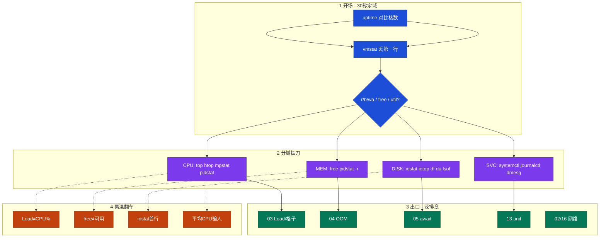
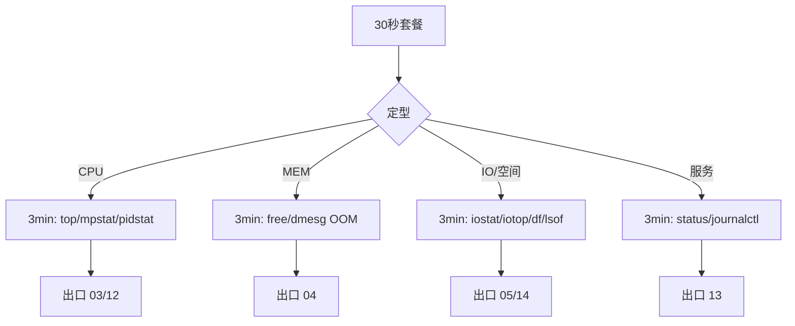
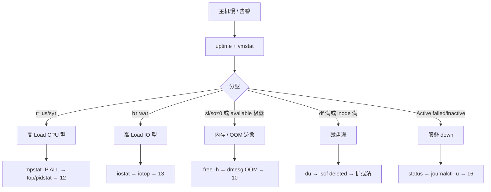

# 主机排查命令

> **这章解决什么**：告警群喊「机器慢 / Load 高 / 服务挂了」——你登上去，刀怎么挥？先敲哪几条、每屏看哪几列、下一刀砍向 CPU / 内存 / 盘 / 服务？  
> **读法**：**先看总图（定域刀序）** → **再认名词** → **再分域挥刀（每条：何时用 / 怎么敲 / 怎么读 / 易错）** → **最易混钉死** → **30 秒 / 3 分钟套餐 + 定责树**。  
> **刻意不展开**：Load / `%si` / steal 机制 → [06](../06-CPU与Load/)；OOM killer / 换页深排 → [07](../07-内存与OOM/)；await 公式 / 脏页 → [08](../08-磁盘与IO/)；USE/RED 哲学 → [21](../21-性能观测与排障/)；unit 文件写法 → [11](../11-Systemd与服务管理/)；`ss` / `tcpdump` → [02](../02-网络排查命令/) · [16](../16-网络排障与抓包/)。

---

## 本章目录

1. [本章定位](#1-本章定位)
2. [先看总图：主机刀怎么挥](#2-先看总图主机刀怎么挥) ← **开篇必读**
   - [2.0 全章知识串图](#20-全章知识串图一张把细节串起来) ← **架构总览**
   - [2.1 坐标系：现象 → 定域 → 下钻](#21-坐标系现象--定域--下钻)
   - [2.2 完整走读：活动开始机器「慢」](#22-完整走读活动开始机器慢从电话到定域)
3. [名词扫盲（对照总图认词）](#3-名词扫盲对照总图认词)
4. [命令分域详解](#4-命令分域详解怎么挥这把刀) ← **本章主体**
   - [4.1 uptime / lscpu](#41-uptime--lscpu开场两刀)
   - [4.2 vmstat](#42-vmstat分型第一屏)
   - [4.3 top / htop](#43-top--htop找谁)
   - [4.4 mpstat](#44-mpstat哪颗核哪一格)
   - [4.5 pidstat](#45-pidstat按进程按线程)
   - [4.6 free -h](#46-free--h内存一眼)
   - [4.7 ps / pstree](#47-ps--pstree进程树与状态)
   - [4.8 iostat / iotop](#48-iostat--iotop盘忙不忙)
   - [4.9 df / du / lsof](#49-df--du--lsof空间与删不掉的文件)
   - [4.10 journalctl / dmesg](#410-journalctl--dmesg内核与服务日志刀)
   - [4.11 systemctl status](#411-systemctl-status服务还在不在)
   - [4.12 strace（轻量）](#412-strace轻量卡在哪次系统调用)
5. [最易混专节](#5-最易混专节) ← **重点精读**
6. [30 秒 / 3 分钟套餐](#6-30-秒--3-分钟套餐)
7. [定责决策树](#7-定责决策树)
8. [去哪章继续学](#8-去哪章继续学)
9. [面试 · 易错 · 数字](#9-面试--易错--数字)
10. [合上书](#合上书)

---

## 1. 本章定位

| 章 | 负责 |
|----|------|
| **01（本章）** | 主机侧**刀法**：怎么敲、怎么读、怎么定下一刀；30 秒 / 3 分钟套餐；高 Load / OOM 迹象 / 盘满 / 服务挂的决策树 |
| **06** | Load 数什么、CPU% 格子、软中断 / steal / throttle **为什么** |
| **07** | OOM killer、`available` 背后、换页 si/so |
| **08** | await、%util、脏页、队列深度公式 |
| **21** | USE/RED、何时 profiling、证据链哲学 |
| **11** | unit、依赖、重启策略 |
| **02 / 16** | 网络刀法、抓包 |

本章是**主机排障肌肉记忆**。你已经在 03～05 懂了「为什么」，本章只练「登上去第一分钟怎么挥刀」。别把本章当百科复读 CPU 理论——刀挥偏了，机制章再厚也救不了值班。

🎯 **值班签名**：告警来了先 30 秒定域（uptime → vmstat → mpstat/free/iostat/systemctl），**禁止**开口就 `top` 乱翻或 `strace -p` 乱挂；读到异常列再下钻，理论回 03～05。

活动开始，登录服 P99 飙、群里喊「机器慢」。旁边有人已经在 `top` 里按 P/M/T 来回切，另有人直接 `kill -9`。你登上去：先 `uptime` 对比核数，再 `vmstat 1 5` 丢掉第一行看 `r/b/wa`，再决定是进 CPU 刀、内存刀、还是盘刀——**这就是本章**。

**本章主线（排障就按这三步想）：**

1. **定域**：30 秒套餐分清 CPU / 内存 / IO / 服务挂 / 空间满，不先猜根因。
2. **挥刀**：每条命令「何时用 / 怎么敲 / 输出怎么读 / 易错」——读到异常列再加刀。
3. **交接**：定域证据（命令片段）交给 03～05 / 13 深排；网络嫌疑甩给 02 / 16。

**读完你能：** 默画定域刀序；对着 top/vmstat/mpstat/free/iostat/df/journalctl 逐行解读；口述高 Load / OOM 迹象 / 盘满 / 服务 down 四条决策树；不把 Load 当 CPU%、不把 free 当可用、不信 iostat 第一行。

---

## 2. 先看总图：主机刀怎么挥

> **正确开篇顺序**：先有全局画面，再认词，再抠每把刀。  
> 先看 **§2.0 全章串图**，再看 **§2.1 坐标系**，再用 **§2.2 走读**把一次「机器慢」串起来。

### 2.0 全章知识串图（一张把细节串起来）

> 🎯 **合上书要能默画这张。** 蓝=开场定域 · 紫=分域挥刀 · 绿=出口深排 · 橙=易混翻车。  
> 若预览仍报错，以下面 **ASCII 一页板** 为准。



**读图路线：**

| 段 | 记住 |
|----|------|
| ① 开场 | uptime 定「忙不忙」尺度；vmstat 定「忙在哪型」 |
| ② 分域 | CPU / MEM / DISK / SVC 四把刀匣，别混用 |
| ③ 出口 | 机制回 03～05 / 13；网络甩 02 / 16 |
| ④ 翻车 | Load≠CPU%、free≠available、丢掉 iostat/vmstat 第一行、整机平均骗人 |

```text
┌──────────────────────────────────────────────────────────────────────────┐
│                     26 一张板：主机排查怎么挥刀                            │
├─────────────┬────────────────────┬───────────────────────────────────────┤
│  开场 30 秒  │  分域挥刀           │  出口（别章）                          │
│  uptime     │  CPU: top/mpstat   │  Load/%si → 06                        │
│  → vmstat   │  MEM: free/pidstat │  OOM → 07                             │
│  → 分型     │  DISK: iostat/df   │  await → 08                           │
│             │  SVC: systemctl    │  unit → 11 · 网 → 05/16               │
├─────────────┴────────────────────┴───────────────────────────────────────┤
│  易混：Load≠CPU% · free≠可用 · iostat/vmstat 丢第一行 · 平均CPU≠单核     │
└──────────────────────────────────────────────────────────────────────────┘
```

---

### 2.1 坐标系：现象 → 定域 → 下钻

**怎么读这张坐标系：**

- **横轴**：告警现象（慢 / 挂 / 满 / OOM）
- **纵轴**：你该挥的刀（开场 → 分域 → 出口）
- **别做**：现象一来就 `strace` / `perf` / `kill -9`

```text
现象（玩家疼 / 告警）
        │
        ▼
   ┌────────────┐
   │  30 秒定域  │  uptime → vmstat →（按型）mpstat / free / iostat / systemctl
   └─────┬──────┘
         │
    ┌────┴────┬─────────┬──────────┐
    ▼         ▼         ▼          ▼
  CPU 型    内存型     IO/空间     服务挂
  top/mp    free      iostat/df   systemctl
  pidstat   dmesg OOM iotop/lsof  journalctl
    │         │         │          │
    ▼         ▼         ▼          ▼
   03        04        05         13
```

> **记住**：本章坐标系的终点是「定域 + 证据」，不是「一次讲完根因」。根因在邻章。

---

### 2.2 完整走读：活动开始机器「慢」

> 🎯 **只保留这一版走读。** 后面所有命令节都挂回这一条故事线。

**场景**：8 核登录服，活动 T+3 分钟，群里「机器 Load 到 35，加核？」；P99 从 40ms → 600ms。

**现场走一遍：**

1. `uptime` → `load average: 35.2, 12.1, 4.0`；`lscpu` 确认 8 核 → 04m Load **远大于核数**，但还**不能**说是 CPU 不够。
2. `vmstat 1 5`，**丢掉第一行**：见 `b=20`、`wa=25`、`id=60`、`us=8` → **IO 型排队**，不是加核。
3. `iostat -xz 1 3`，丢掉第一行：某盘 `await=180`、`%util=98` → 盘忙。
4. `iotop -oPa`（或 `pidstat -d 1`）锁定写放大进程；`df -h` 排除空间满。
5. **交接**：证据交给 [08](../08-磁盘与IO/) 深排 await；**别**在本章背 await 公式；**别**先扩 8 核。

```text
电话：「Load 35，加核？」
   │
   ├─ uptime：35 >> 8 核     ← 忙是真的
   ├─ vmstat：b↑ wa↑ id 还高 ← 忙在等 IO，不是算力
   ├─ iostat：await/%util 炸 ← 哪块盘
   └─ 出口：05，不是「加核工单」
```

**对照：若同屏是另一型**

| vmstat 像 | 下一刀 | 出口 |
|-----------|--------|------|
| `r` 持续 > 核数，`us/sy` 高，`b≈0` | `mpstat -P ALL` → `top` / `pidstat` | [06](../06-CPU与Load/) |
| `si/so` 非 0 或 `free` 的 available 极低 | `free -h` → `dmesg` 搜 OOM | [07](../07-内存与OOM/) |
| `systemctl is-active` 挂 / journal 报错 | `systemctl status` → `journalctl -u` | [11](../11-Systemd与服务管理/) |

---

## 3. 名词扫盲（对照总图认词）

> 只建「挥刀时嘴里的词」；机制定义点到为止，深义回邻章。

| 词 | 值班里什么时候碰到 | 一句话 | 本章怎么认 |
|----|-------------------|--------|------------|
| **Load** | uptime / top 抬头 | 可运行 + 不可中断睡眠的**队列长度**平均 | 对比核数；**≠ CPU%** → 深义 [06](../06-CPU与Load/) |
| **%us / %sy / %wa / %si / %st / %id** | mpstat / top | 这一秒 CPU 时间花在哪一格 | `mpstat -P ALL`；整机平均会骗人 |
| **r / b** | vmstat | r≈可运行排队感；b≈不可中断阻塞 | 分型第一屏 |
| **available** | `free -h` | 不杀进程大致还能给应用的内存 | **别看 free 列结案** → [07](../07-内存与OOM/) |
| **await / %util** | iostat | 请求平均等待；设备忙百分比 | **丢第一行**；公式 → [08](../08-磁盘与IO/) |
| **D 状态** | ps / top | 不可中断睡眠（常等盘） | 杀不掉先查盘 → [05](../05-进程与信号/) |
| **deleted** | `lsof` | 文件已 unlink，fd 仍占空间 | 盘「满」但 du 对不上时 |
| **unit** | systemctl | systemd 管理的服务单元 | 本章只读 status；写法 → [11](../11-Systemd与服务管理/) |

> **记住**：名词是为了**读屏**；面试追问「为什么」时，指向邻章，不要在本章编机制长文。

---

## 4. 命令分域详解：怎么挥这把刀

> 🎯 **每条固定四块**：何时用 · 怎么敲 · 输出怎么读 · 易错。  
> 命令是刀，不是百科——只收值班最小集。

### 4.0 分域速查（背这张表）

| 域 | 最小集 | 定域信号 |
|----|--------|----------|
| 开场 | `uptime` · `lscpu` · `vmstat 1 5` | Load vs 核；r/b/wa |
| CPU | `mpstat -P ALL 1 3` · `top`/`htop` · `pidstat -u 1` | 单核满 / us·sy·si·st |
| 内存 | `free -h` · `pidstat -r 1` · `dmesg \| grep -i oom` | available；OOM 痕迹 |
| 盘 | `iostat -xz 1 3` · `iotop` · `df -hT` · `du` · `lsof` | await/util；空间；deleted |
| 服务 | `systemctl status` · `journalctl -u` · `dmesg -T` | Active / Main PID / 内核冤案 |
| 轻量确认 | `ps`/`pstree` · `strace -p`（短挂） | 状态树；卡在哪个 syscall |

```bash
# 开场（几乎每次都敲）
uptime; lscpu | egrep '^CPU\(s\)|^Model name|^Socket'
vmstat 1 5
```

---

### 4.1 uptime / lscpu：开场两刀

**一句话：** uptime 告诉你「队列感」和「趋势」；lscpu 告诉你「拿什么数字去比」。

#### 何时用

- 任何主机告警的**第一刀**（或第二刀紧跟 vmstat）。
- 需要回答：「Load 21 算不算高？」——没有核数，这个问题无解。

#### 怎么敲

```bash
uptime
cat /proc/loadavg          # 同义，多一个「正在跑/总线程」字段
lscpu
nproc                      # 可见 CPU 个数（容器里可能是宿主机核，小心）
```

#### 输出怎么读

```text
 21:03:12 up 42 days,  3:15,  2 users,  load average: 35.21, 12.08, 4.02
```

| 片段 | 怎么读 |
|------|--------|
| `up 42 days` | 久未重启——内核冤案/泄漏类要想到，但不等于有病 |
| `load average: 1m, 5m, 15m` | **1m ≫ 15m** → 刚砸上来；三者都高 → 持续过载 |
| 对比核数 | 本机 8 核：1m=35 → **严重排队**；1m=6 → 偏忙但仍需分型 |

```text
# /proc/loadavg
35.21 12.08 4.02 8/1432 28901
#              │    │     └─ 最近 PID 号
#              │    └─ 系统线程总数
#              └─ 正在跑的可运行实体数 / …
```

```text
# lscpu 节选
CPU(s):                          8
On-line CPU(s) list:             0-7
Thread(s) per core:              2
Core(s) per socket:              4
Socket(s):                       1
```

- 对比 Load 用 **CPU(s)=8**（逻辑核），不是「插了几根物理条」。
- 超线程：逻辑核=8 时，Load=8 已是「打满感」参考线，不是「还能再翻倍」。

#### 易错

| 易错 | 真相 |
|------|------|
| Load=核数就「健康」 | Load≈核数只是「可能打满」；还要看是 R 还是 D |
| 容器里 `nproc` 当配额 | 常返回宿主机核；配额看 cgroup → [10](../10-cgroup与容器/) |
| 只看 15m | 刚发生的事故看 **1m**；15m 看「是不是一直这样」 |

> **别混**：uptime 的 Load **不是** CPU 利用率。idle 70% + Load 40 完全可能（IO 型）——见 §5。

---

### 4.2 vmstat：分型第一屏

**一句话：** 丢掉第一行，用 `r/b` + `us/sy/id/wa/st` + `si/so` 三秒分型。

#### 何时用

- 「机器慢 / Load 高」开场，**几乎必敲**。
- 需要快速回答：CPU 排队、IO 阻塞、还是在换页？

#### 怎么敲

```bash
vmstat 1 5                 # 间隔 1s，共 5 组；丢掉第 1 组
vmstat -w 1 5              # 宽列，数字不容易挤在一起
```

#### 输出怎么读

```text
procs -----------memory---------- ---swap-- -----io---- -system-- ------cpu-----
 r  b   swpd   free   buff  cache   si   so    bi    bo   in   cs us sy id wa st
 1  0      0 8123456 123456 9876543   0    0   120   800 4500 9000  5  2 93  0  0
 2 18      0 8123000 123456 9876540   0    0   115  8900 4480 11800  5  2 70 18  0
 2 19      0 8122900 123450 9876500   0    0   110  9100 4490 12000  4  2 71 18  0
```

**逐行：**

1. **第一行数据**（`r=1 b=0 …`）：开机以来平均 —— **整行丢掉**，不参与定责。
2. **第二行起**：才是「这一秒」。
3. 本例 `b=18/19`、`wa=18`、`id=70`、`us=5` → **IO 型**：很多人在等盘，CPU 还闲着。
4. `bo` 很大、`bi` 一般 → 写多；反之读多（粗分，细看 iostat）。

| 字段 | 怎么读 | 动手直觉 |
|------|--------|----------|
| **第一行** | 开机平均 | **丢掉** |
| `r` | 可运行排队感 | 持续 **> 核数** → CPU 排队，下一刀 mpstat |
| `b` | 不可中断阻塞 | 持续 **> 0** 且明显 → D/IO，下一刀 iostat |
| `si/so` | 换入/换出 KB/s | **非 0** → 先当内存压力 [07](../07-内存与OOM/) |
| `us/sy` | 用户/内核 CPU | 高且 `b≈0` → CPU 型 |
| `id` | 空闲 | 高 **不能**单独证明「没事」（可能在等 IO） |
| `wa` | 等 IO | 高 → 盘链 |
| `st` | 被宿主机抢 | 持续偏高 → 虚机超卖 [06](../06-CPU与Load/) |
| `cs` | 上下文切换/s | 持续 > **~10 万** 且延迟涨 → 查线程/锁 |
| `in` | 中断/s | 突增 + 后续 `%si` → 网卡/中断 [06](../06-CPU与Load/) |

**三秒分型口诀：**

```text
r↑ us/sy↑ b≈0 wa≈0     → CPU 型 → mpstat / top
b↑ wa↑ id 仍可观        → IO 型  → iostat / iotop
si/so≠0 或 free 告急    → 内存型 → free / dmesg OOM
三者都平但服务挂        → 服务型 → systemctl / journalctl
```

#### 易错

| 易错 | 真相 |
|------|------|
| 拿第一行定责 | 第一行是开机平均，必丢 |
| `id` 高 = 健康 | IO 型可以 id 高、Load 高、业务惨 |
| `free` 列当内存结论 | vmstat 的 free 粗看；结案用 `free -h` 的 **available** |

> **记住**：vmstat 是**分型仪**，不是根因仪。分完型就换刀。

---

### 4.3 top / htop：找谁

**一句话：** 定域之后用 top/htop **锁定 PID/TID**；不要用它当第一刀瞎翻。

#### 何时用

- 已经偏向 CPU 型，或要快速扫进程 `%CPU` / `%MEM` / 状态列。
- 需要线程级：`top -H -p <PID>`。
- 交互舒适度要高 → `htop`（同信息，键位更好）。

#### 怎么敲

```bash
top
top -c                          # 完整命令行
top -H -p <PID>                 # 只看该进程的线程
top -o %CPU                     # 按 CPU 排（版本支持时）
htop                            # 有颜色、树、搜索
```

常用交互键（top）：`P` CPU 排序 · `M` 内存排序 · `T` 时间 · `H` 线程 · `1` 展开每核 · `c` 命令行。

#### 输出怎么读

```text
top - 21:05:01 up 42 days,  2 users,  load average: 35.21, 12.08, 4.02
Tasks: 312 total,   2 running, 310 sleeping,   0 stopped,   0 zombie
%Cpu(s):  8.0 us,  2.0 sy,  0.0 ni, 70.0 id, 18.0 wa,  0.0 hi,  2.0 si,  0.0 st
MiB Mem :  15800.0 total,   400.0 free,   8200.0 used,   7200.0 buff/cache
MiB Swap:   2048.0 total,   2048.0 free,      0.0 used.   6100.0 avail Mem

  PID USER      PR  NI    VIRT    RES  %CPU %MEM     TIME+ COMMAND
 2341 game      20   0 4523000 1.2g    12.0  7.8   4:01.22 gameserver
 2890 mysql     20   0  9.8g   6.1g     3.0 39.5  120:01.01 mysqld
```

**抬头逐行：**

| 行 | 怎么读 |
|----|--------|
| load average | 与 uptime 同义；仍对比核数 |
| %Cpu(s) | **整机平均**一格；见 `wa=18` 已指向 IO；要单核必须按 `1` 或改用 mpstat |
| MiB Mem / avail Mem | 结案看 **avail**；free 小不等于危险 |
| 进程表 %CPU | 多线程可 **>100%**（相对单核）；找头号 PID |
| 状态（未展示列可开） | 大量 `D` → 别盯 CPU，转盘 |

**锁定线程：**

```text
# top -H -p 2341
  PID … %CPU COMMAND
 2341 …  2.0 gameserver
 2360 … 98.0 gameserver    ← 烫的 TID
```

Java：`printf '%x\n' 2360` → 对齐 `jstack` 的 `nid=`。深 profiling → [21](../21-性能观测与排障/)。

**htop 多看什么：** 树形（F5）、按名搜索、颜色区分状态；信息集与 top 同级，**定责口径不变**。

#### 易错

| 易错 | 真相 |
|------|------|
| 一登机就 top 乱按 | 先 vmstat 分型；top 是「找谁」 |
| 整机 %Cpu 40% 结案「还有余量」 | 必须看每核 / mpstat；见 §5 |
| `%MEM` 最高 = OOM 元凶 | 未必；看 available + dmesg OOM 指向 |
| RES 接近机器内存就杀 | 先看是 cache 还是 anon；用 free/smem 思路 → [07](../07-内存与OOM/) |

> **记住**：top 找「谁」；mpstat 找「哪颗核、哪一格」。两刀都要。

---

### 4.4 mpstat：哪颗核、哪一格

**一句话：** 没有 `mpstat -P ALL`，不准对「整机 CPU%」下「还有余量」的结论。

#### 何时用

- CPU 型分型之后；或 top 显示整机不高但 P99 炸。
- 怀疑单核热点、软中断堆一核、steal。

#### 怎么敲

```bash
mpstat 1 3                     # 整机平均趋势
mpstat -P ALL 1 3              # 每颗核；值班默认这条
# 需要 sysstat 包；没有就 top 按 1 凑合，仍建议装
```

#### 输出怎么读

```text
# mpstat -P ALL 1 1（节选）
Linux 5.10.0 (login-1)  08/30/2026  _x86_64_  (8 CPU)

21:06:01  CPU    %usr   %nice    %sys %iowait    %irq   %soft  %steal  %guest  %idle
21:06:02  all    38.20    0.00    2.10    0.50   0.00    1.00    0.00    0.00   58.20
21:06:02    0     5.00    0.00    1.00    0.00   0.00    2.00    0.00    0.00   92.00
21:06:02    3    99.20    0.00    0.80    0.00   0.00    0.00    0.00    0.00    0.00
21:06:02    7     2.00    0.00    1.00    0.00   0.00   45.00    0.00    0.00   52.00
```

**逐行：**

1. `all %usr=38`：整机平均 —— **看起来还有余量**。
2. `CPU3 %usr=99.2`：单核打满 —— P99 可以炸；**扩副本/加核不拆主循环**也救不了这一核。
3. `CPU7 %soft=45`：软中断偏核 —— 下一刀想网卡 RSS / 中断亲和，机制回 [06](../06-CPU与Load/)。
4. `%steal` 若持续 >10%：虚机被抢，不是先调 JVM。
5. `%iowait` 高：和 vmstat `wa` 同故事，转 iostat。

| 列 | 刀法含义 | 深排 |
|----|----------|------|
| %usr | 用户态热点 | top -H / perf → 06/12 |
| %sys | 内核/syscall 重 | strace 轻量 / 03 |
| %iowait | 等 IO | 05 |
| %soft | 软中断 | 03（RSS） |
| %steal | 超卖 | 03 |
| %idle | 真闲（相对该核） | 单核 idle 0 + all idle 高 = 热点 |

#### 易错

| 易错 | 真相 |
|------|------|
| 只看 all | 单核热点被平均稀释 |
| `%soft` 高就调 TCP 窗口 | 先看是否单核打满软中断；网刀在 02/16，机制在 03 |
| 没有 sysstat 就放弃每核 | top 按 `1` 至少展开每核 |

> **别混**：`%iowait` 高 ≠ CPU 不够；是 CPU 在等盘。加核常常无效。

---

### 4.5 pidstat：按进程、按线程

**一句话：** 把「整机格子」拆到 PID；`-t` 再拆到 TID。

#### 何时用

- 已锁定大致域，要按进程看 CPU / IO / 内存趋势。
- 需要比 top 更干净的「采样打印」（方便贴工单）。

#### 怎么敲

```bash
pidstat -u 1 3                 # 每进程 CPU
pidstat -u -p <PID> 1 3        # 只盯一个
pidstat -t -p <PID> 1 3        # 线程
pidstat -r 1 3                 # 内存（minflt/majflt 等）
pidstat -d 1 3                 # 每进程磁盘 IO
pidstat -w 1 3                 # 上下文切换
```

#### 输出怎么读

```text
# pidstat -u 1 1
21:07:01   UID       PID    %usr %system  %guest   %wait    %CPU   CPU  Command
21:07:02  1000      2341   78.00    4.00    0.00    0.00   82.00     3  gameserver
21:07:02  27        2890    2.00    1.00    0.00    0.00    3.00     1  mysqld
```

| 列 | 怎么读 |
|----|--------|
| %usr / %system | 用户态 vs 内核态谁主导 |
| %CPU | 该进程合计 |
| CPU | **最近跑在哪颗核** —— 和 mpstat 单核热点互相印证 |
| Command | 名字；同名多实例靠 PID |

```text
# 对照链
pidstat -u  →  78% usr @ PID 2341，跑在 CPU3
mpstat      →  CPU3 99% usr
top -H      →  TID 2360 吃满
     │
     ▼
热点型：拆该线程 / 主循环，不是「整机再加 8 核」
```

```text
# pidstat -d 1 1（IO 型时）
PID   kB_rd/s  kB_wr/s  iodelay  Command
2890     12.0  52000.0     80.0  mysqld
```

- `kB_wr/s` 巨大 + 前面 iostat await 高 → 写放大嫌疑进程。
- `iodelay`：任务等 IO 的时钟节拍感（粗），配合 iotop。

```text
# pidstat -w 1 1
PID   cswch/s nvcswch/s  Command
2341   120000      8000  gameserver
```

- `cswch` 自愿切换；`nvcswch` 非自愿（被抢）。
- 非自愿持续极高 + 延迟涨 → 查线程数/锁/CPU 争用（机制 [06](../06-CPU与Load/)）。

#### 易错

| 易错 | 真相 |
|------|------|
| 把 `%wait` 当 iowait 精确值 | 口径与 mpstat 不完全同一把尺；交叉看 |
| 只跑一次 | 至少 1 秒间隔多组，看趋势 |
| majflt 一升高就喊缺内存 | 要结合 free / si/so；偶发 majflt 可能是冷启动 |

---

### 4.6 free -h：内存一眼

**一句话：** 结案看 **available**；`free` 小、`buff/cache` 大常常是正常的。

#### 何时用

- 内存告警、怀疑 OOM、vmstat `si/so` 非 0、业务报分配失败。
- 30 秒套餐里的内存刀。

#### 怎么敲

```bash
free -h
free -hw                     # 有的版本显示 available 更醒目
cat /proc/meminfo | egrep 'MemTotal|MemAvailable|SwapTotal|SwapFree|Dirty|Writeback'
```

#### 输出怎么读

```text
              total        used        free      shared  buff/cache   available
Mem:           15Gi       8.0Gi       400Mi       200Mi        7.0Gi        6.1Gi
Swap:         2.0Gi          0B       2.0Gi
```

**逐列：**

| 列 | 怎么读 |
|----|--------|
| total | 物理内存 |
| used | 已被显式用掉的（口径含计算方式，**别唯 used 论**） |
| free | 完全未用；现代内核常很小 |
| buff/cache | 页缓存/缓冲；**可回收**（压力下还给应用） |
| **available** | 内核估计「不杀进程还能给多少」——**值班结案列** |
| Swap used | 持续增长 / 非 0 且 si/so 跳 → 内存压力实锤方向 |

**本例**：free 只有 400Mi，但 available 还有 6.1Gi → **不是**「内存爆了」。有人看到 free 400Mi 就清 cache（`drop_caches`）——生产上通常是**制造二次故障**。

**OOM 迹象刀序（轻量）：**

```bash
free -h
dmesg -T | grep -iE 'out of memory|oom-killer|Killed process' | tail -20
journalctl -k -b | grep -iE 'out of memory|oom' | tail -20
```

- 看到 `Killed process` → 记录 PID/名，深排 [07](../07-内存与OOM/)（分数、cgroup 限额）。
- 本章只负责**发现**与**贴证**，不展开 killer 计分。

#### 易错

| 易错 | 真相 |
|------|------|
| free 小 = 要加内存 | 看 available |
| 随手 drop_caches | 会把热缓存打冷，IO 风暴；除非你知道自己在做什么 |
| Swap=0 就永远安全 | 没 Swap 时 OOM 来得更陡；有 Swap 也不是免费午餐 |
| used + free = total | 还有 buff/cache；用 available 思考 |

> **别混**：`free` 命令的 **free 列** ≠ **MemAvailable**。面试就考这一点——见 §5。

---

### 4.7 ps / pstree：进程树与状态

**一句话：** ps 回答「状态/归属/命令行」；pstree 回答「谁拉起谁」。

#### 何时用

- 找僵尸、D 状态、重启后的父子关系、容器/托管进程谁是爹。
- systemctl 显示 Main PID 后，要看它的孩子有没有炸。

#### 怎么敲

```bash
ps aux --sort=-%cpu | head
ps -eo pid,ppid,stat,wchan:20,cmd --sort=stat | head -50
ps -fp $(pgrep -d, -f gameserver)
pstree -ap <PID>
pstree -ap $(pidof systemd) | head   # 太大时慎用，建议从业务 PID 往下
```

#### 输出怎么读

```text
# ps -eo pid,ppid,stat,wchan:20,cmd
  PID  PPID STAT WCHAN                CMD
 2341     1 Ssl  -                    /opt/game/gameserver
 2360  2341 D    wait_on_page_bit_co  /opt/game/gameserver
 2401  2341 Z    -                    [gameserver] <defunct>
```

| 字段 | 怎么读 |
|------|--------|
| STAT `R/R+` | 可运行 |
| `S` | 可中断睡眠（正常多） |
| **`D`** | 不可中断——常等盘；**kill -9 无效** → [05](../05-进程与信号/) |
| `Z` | 僵尸——父进程没 wait；查 PPID |
| `Ssl` 等 | 多字符：主线程状态 + 特性位 |
| WCHAN | 卡在哪个内核等待点（有符号时） |
| PPID=1 | 可能被 init/systemd 收养（原父已死） |

```text
# pstree -ap 2341
gameserver,2341
  ├─gameserver,2360
  ├─gameserver,2361
  └─{gameserver},2362
```

- 看清线程/子进程结构，避免杀错「树根」。
- 配合 `systemctl status` 的 Main PID：树根应一致。

#### 易错

| 易错 | 真相 |
|------|------|
| 见 D 就 kill -9 | D 杀不掉；先解 IO / 查盘 |
| 见 Z 就杀僵尸本身 | 杀不掉；修/杀父进程或等父 wait |
| `ps aux` 的 %MEM 加总 | 共享库会重复计；别拿来对 total |

---

### 4.8 iostat / iotop：盘忙不忙

**一句话：** iostat 看设备是否忙、等多久；iotop 看是谁在刷。公式回 08，本章只练读屏。

#### 何时用

- vmstat `b/wa` 指向 IO；df 未满但业务慢；怀疑写放大。

#### 怎么敲

```bash
iostat -xz 1 3                 # -x 扩展；-z 全 0 行可藏；丢第一组
iostat -xdmg 1 3               # 单位更好读（视版本）
iotop -oPa                     # 只显示实际有 IO 的；累加；进程名
pidstat -d 1 3                 # 无 iotop 权限时的替代
```

#### 输出怎么读

```text
# iostat -xz 1 2（节选）
Device    r/s   w/s  rkB/s  wkB/s  rrqm/s  wrqm/s  %rrqm  %wrqm  await  rareq-sz  wareq-sz  aqu-sz  %util
nvme0n1  10.0  20.0  128.0  256.0     0.0     5.0   0.0   20.0    1.2      12.8      12.8    0.05   3.00
nvme0n1  80.0 900.0  500.0  81920   0.0    40.0   0.0    4.0  180.0       6.2      91.0   12.50  98.50
```

**逐行：**

1. **第一组设备行**：开机平均 —— **丢掉**（和 vmstat 同一纪律）。
2. **第二组起**：`await=180`、`%util=98.5`、`aqu-sz=12.5` → 盘很忙、队列不浅、平均等待高。
3. `wkB/s` 巨大 → 写方向；下一步 iotop/pidstat -d 找进程。
4. `%util≈100` 只说明**这台设备**很忙，不自动等于「业务根因在应用」——可能是raid/网络盘/邻居吵。

| 列 | 刀法读法 | 别在本章展开 |
|----|----------|--------------|
| await | 高 → 疼 | 组成公式 → [08](../08-磁盘与IO/) |
| %util | 近 100 → 设备饱和感 | 与并行度关系 → 08 |
| aqu-sz | 队列深度感 | 05 |
| r/s w/s | IOPS 方向 | — |
| rkB/s wkB/s | 吞吐方向 | — |

```text
# iotop -oPa 示意
  TID  PRIO  USER   DISK READ  DISK WRITE  SWAPIN  IO    COMMAND
 2890  be/4  mysql    0.00 B/s  80.00 M/s   0.00%  85%   mysqld
```

- 锁定 TID/PID 后，回业务：是不是备份、compaction、错误的全表扫。

#### 易错

| 易错 | 真相 |
|------|------|
| 信第一组数字 | **丢第一组** |
| %util=100 就加盘 | 先确认是否单进程写爆、是否打错盘、是否网络盘抖动 |
| await 高就调内核参数 | 先找是谁在写、文件系统是否满、是否 SSD 写放大 |
| 没权限跑 iotop 就放弃 | `pidstat -d` / `cat /proc/<pid>/io` |

> **记住**：iostat 定「盘忙」；iotop 定「谁忙」。await 数学去 08。

---

### 4.9 df / du / lsof：空间与删不掉的文件

**一句话：** df 看挂载点是否满；du 找目录；对不上就 lsof 抓 deleted。

#### 何时用

- 写入失败、日志停写、`No space left on device`。
- df 显示满，但 du 根目录加起来远小于——经典 deleted。

#### 怎么敲

```bash
df -hT
df -i                          # inode 满：文件数打满，同样写不进
du -xh --max-depth=1 /var 2>/dev/null | sort -h
du -xh --max-depth=1 /var/log 2>/dev/null | sort -h
lsof +L1                       # 仍打开但 link count=0（deleted 一类）
lsof | grep deleted
```

#### 输出怎么读

```text
# df -hT
Filesystem     Type  Size  Used Avail Use% Mounted on
/dev/nvme0n1p3 xfs    100G   98G  2.1G  98% /
tmpfs          tmpfs  7.8G     0  7.8G   0% /dev/shm
```

| 关注 | 含义 |
|------|------|
| Use% 98%+ | 空间告急；先清可删日志/临时，再谈扩容 |
| Type | xfs/ext4/nfs… 网络盘满和本地满处置不同 |
| 多个挂载 | **别只盯 /** —— 数据盘 `/data` 满更常见 |

```text
# df -i
Filesystem     Inodes  IUsed   IFree IUse% Mounted on
/dev/nvme0n1p3  50M     50M      0   100% /
```

- **inode 100%**：小文件把 inode 吃光；df -h 可能看起来还有空间。

```text
# 经典：df 满、du 对不上
df -h /                        # 100% 
du -xh --max-depth=1 / | sort -h   # 加起来只有 60G
lsof | grep deleted
# nginx 1234 ... /var/log/nginx/access.log (deleted)
```

**处置刀法（本章口径）：**

1. 确认是谁握着 deleted fd（lsof）。
2. **重启对应服务**或让进程自行 reopen 日志（砍 fd）——空间才退。
3. 只 `rm` 已经 deleted 的路径**不会**再吐空间。
4. 长期：logrotate + copytruncate/或原生 reopen；别无脑 `kill -9`。

#### 易错

| 易错 | 真相 |
|------|------|
| 只看 df -h 不看 -i | inode 满同样写失败 |
| du 在 / 上无深度狂扫 | 又慢又打盘；先 max-depth 分层 |
| 删了大日志 df 不变 | deleted 仍占着；lsof |
| 清到 Use% 100 的根分区乱删系统目录 | 先找大户 `/var/log` `/data` |

---

### 4.10 journalctl / dmesg：内核与服务日志刀

**一句话：** dmesg/journal 内核环缓冲抓 OOM、硬件、重置；journalctl -u 抓某服务为什么挂。

#### 何时用

- 服务挂、内核 OOM、疑似硬件/文件系统只读、突然重启。
- systemctl 显示 failed 之后的第一 obligator 日志刀。

#### 怎么敲

```bash
dmesg -T | tail -50
dmesg -T | grep -iE 'oom|killed process|error|fail|reset|readonly|i/o error'
journalctl -k -b --no-pager | tail -100          # 本内核启动以来
journalctl -u gameserver -b --no-pager
journalctl -u gameserver --since "20 min ago"
journalctl -p err..alert -b --no-pager
```

#### 输出怎么读

```text
# dmesg -T 节选
[Sun Aug 30 21:01:02 2026] Out of memory: Killed process 2341 (gameserver) total-vm:4523000kB ...
[Sun Aug 30 21:01:02 2026] oom-killer: ... 
```

- **时间**：`-T` 变成人话时间，好和监控对齐。
- **Killed process**：OOM 实锤线索 → 贴证进 [07](../07-内存与OOM/)。
- `I/O error` / `ext4-fs error` / `Read-only file system` → 盘/文件系统链 [08](../08-磁盘与IO/)·[09](../09-文件系统与inode/)。

```text
# journalctl -u gameserver -b
-- Logs begin at ...
Aug 30 21:01:01 login-1 systemd[1]: Started gameserver.
Aug 30 21:04:12 login-1 gameserver[2341]: panic: runtime error: ...
Aug 30 21:04:12 login-1 systemd[1]: gameserver.service: Main process exited, code=exited, status=2
Aug 30 21:04:12 login-1 systemd[1]: gameserver.service: Failed with result 'exit-code'.
```

| 行 | 怎么读 |
|----|--------|
| Started | 启动成功过 |
| 应用 panic/堆栈 | **应用自己炸** —— 别先怪内核 |
| Main process exited / status= | 退出码；非 0 失败 |
| Failed with result | exit-code / signal / timeout / resources… |
| start-limit-hit | 重启太勤被 systemd 刹车 → [11](../11-Systemd与服务管理/) |

#### 易错

| 易错 | 真相 |
|------|------|
| 只看应用日志文件 | unit 可能 stdout 进 journal；先 journalctl -u |
| dmesg 无 -T | 难和「21:04 告警」对齐 |
| 日志巨多不加 since | 先时间窗，再 grep |
| 把 OOM 当应用 bug 草草重启 | 先留 dmesg 片段；否则证据没了 |

---

### 4.11 systemctl status：服务还在不在

**一句话：** 先确认 Active/Main PID/最近日志三件套；unit 写法去 13。

#### 何时用

- 「服务挂了 / 起不来 / 反复重启」。
- 30 秒套餐末刀：排除「根本没在跑」。

#### 怎么敲

```bash
systemctl is-active gameserver
systemctl status gameserver --no-pager -l
systemctl show gameserver -p ActiveState -p SubState -p MainPID -p NRestarts -p Result
systemctl list-units --failed
```

#### 输出怎么读

```text
● gameserver.service - Game Login Server
   Loaded: loaded (/etc/systemd/system/gameserver.service; enabled; vendor preset: disabled)
   Active: failed (Result: exit-code) since Sun 2026-08-30 21:04:12 CST; 2min ago
  Process: 2341 ExecStart=/opt/game/gameserver (code=exited, status=2)
 Main PID: 2341 (code=exited, status=2)
   ...
Aug 30 21:04:12 ... gameserver[2341]: panic: ...
Aug 30 21:04:12 ... systemd[1]: gameserver.service: Failed with result 'exit-code'.
```

| 字段 | 怎么读 |
|------|--------|
| Loaded | unit 文件在不在、enabled 否 |
| **Active** | active / inactive / failed / activating… |
| Main PID | 主进程；再 pstree / ps |
| NRestarts（show） | 狂重启？ |
| Result | 失败大类 |
| 尾部日志 | status 自带一小段 journal —— 常够第一眼 |

**Active 常见值刀法：**

| Active | 下一刀 |
|--------|--------|
| active (running) | 服务在；慢则转 CPU/IO/网 |
| failed | journalctl -u；看退出码 |
| activating | 卡住启动？看 Type= / 依赖 [11](../11-Systemd与服务管理/) |
| inactive (dead) | 没起；是不是被停/没开 enable |

#### 易错

| 易错 | 真相 |
|------|------|
| status 绿就结案 | 进程在 ≠ 业务健康；还要 RED/探活 [21](../21-性能观测与排障/)·[22](../22-监控与告警/) |
| 反复 restart 不看 start-limit | 可能被 systemd 限频锁死 |
| 在本章改 unit 参数硬刚 | 写法/依赖/Restart= 回 13 |

> **记住**：本章只练 **读 status**；写 unit、排依赖是 13 的活。

---

### 4.12 strace（轻量）：卡在哪次系统调用

**一句话：** 短挂、确认「卡在 read/futex/open」；不是默认刀，更不是长期挂生产。

#### 何时用

- 进程在、CPU 不高、看起来「卡住」；想确认是否堵在某 syscall。
- 已缩小到单 PID，需要**几十秒级**证据。

#### 怎么敲

```bash
# 短挂：默认别 -f 全挂所有线程（输出爆炸）；必要时再加
timeout 20 strace -p <PID> -T -ttt 2>&1 | tail -100
timeout 20 strace -p <PID> -e trace=network,file,desc -T 2>&1 | tail -100
# 统计模式（更安全的一瞥）
timeout 15 strace -p <PID> -c 2>&1
```

#### 输出怎么读

```text
21:08:01.123456 read(12, "...", 4096) = 4096 <0.000012>
21:08:01.123500 futex(0x7f.., FUTEX_WAIT, ...) = -1 ETIMEDOUT <2.000001>
21:08:03.123600 openat(AT_FDCWD, "/data/xx.dat", O_RDONLY) = -1 ENOENT <0.000008>
```

| 现象 | 怎么读 |
|------|--------|
| 大量 `futex … WAIT` 且业务不前进 | 锁/等待；回应用或 [06](../06-CPU与Load/) 切换 |
| `read`/`recvfrom` 长时间 | 等数据——可能下游/网络 [02](../02-网络排查命令/) |
| `write`/`fsync` 耗时大 | IO 链 [08](../08-磁盘与IO/) |
| `ENOENT` / `EACCES` | 文件/权限问题，常比「性能」更简单 |
| `-c` 里某 syscall 时间占比头名 | 下一眼盯它 |

#### 易错

| 易错 | 真相 |
|------|------|
| 一上来 strace -fp 大进程 | 性能骤降、日志爆盘；先 timeout、先收窄 -e |
| 当根因工具长期挂着 | 只做轻量确认 |
| 看不懂所有 syscall 就慌 | 认清「等锁 / 等 IO / 等网 / 找文件」四类即可 |

> **记住**：strace 是**放大镜**，不是**望远镜**。望远镜是 30 秒套餐。

---

## 5. 最易混专节

> 🔥 **全章最易晕的四处，钉死一次。** 别处只写「见 §5」。

### 5.1 Load 高 ≠ CPU 不够

**例子**：8 核，Load 1m=40，`%id=70`，`%wa=20`。

**一句话：** Load 数的是队列（R+D），不是「CPU 利用率」。

**怎么认：**

```text
uptime          → 40 >> 8
vmstat          → b↑ wa↑ id 仍高
mpstat -P ALL   → 各核 idle 不低，iowait 高
结论            → IO 型排队；加核常无效 → 08
```

> **别混**：Load 与 CPU% 是两把尺。机制长文 → [06](../06-CPU与Load/)。

### 5.2 free 列小 ≠ 内存告急

**例子：** `free` 200Mi，`buff/cache` 8Gi，`available` 7Gi。

**一句话：** 结案看 **available**；cache 可回收。

**怎么认：** `free -h` 只盯 available；再决定要不要进 04。

> **别混**：把 buff/cache 当「被泄漏吞掉」→ 错。

### 5.3 iostat / vmstat 第一行

**例子：** 新人贴 iostat 第一组 `await=3`，第二组起 `await=200`，却用 3 结案。

**一句话：** 第一组是开机平均，**丢掉**。

```text
vmstat 1 5     → 丢第 1 组数据
iostat -xz 1 3 → 丢第 1 组数据
```

### 5.4 整机 CPU 40% ≠ 还有余量

**例子：** `all %usr=38`，但 `CPU3=99%`。

**一句话：** 平均被闲核稀释；P99 看单核。

**怎么认：** 必须 `mpstat -P ALL`（或 top 按 `1`）。哲学入口也可看 [21](../21-性能观测与排障/)「平均 CPU 40%」。

### 5.5 一张对照表

| 看起来 | 别当成 | 应看成 |
|--------|--------|--------|
| Load 高 | CPU% 高 | 队列长；先分 R 还是 D |
| free 小 | 内存爆 | 问 available |
| cache 大 | 泄漏 | 通常正常 |
| all CPU 40% | 还有余量 | 查单核 |
| iostat 首行漂亮 | 盘健康 | 丢掉首行 |
| systemctl active | 业务健康 | 只说明进程在 |

---

## 6. 30 秒 / 3 分钟套餐

> 🎯 **背诵件。** 合上书要能默敲顺序。

### 6.1 30 秒主机定域（有序）

```bash
# ① 尺度
uptime
lscpu | egrep 'CPU\(s\):|On-line'

# ② 分型（丢第一行）
vmstat 1 5

# ③ 按型三选一（可并行眼扫）
mpstat -P ALL 1 2          # CPU 嫌疑
free -h                    # 内存嫌疑
iostat -xz 1 2             # IO 嫌疑（丢第一组）

# ④ 服务还在否
systemctl is-active gameserver || systemctl status gameserver --no-pager -l | head -30

# ⑤ 空间（写入类故障必加）
df -hT
```

**30 秒怎么口述：**

1. Load 对比核数——忙不忙。  
2. vmstat 定型——CPU / IO / 换页。  
3. 对型补一刀——mpstat / free / iostat。  
4. 服务 Active 与 df——排除「挂了」和「满了」。  
5. 贴证据，再进邻章，不在原地空转。

### 6.2 3 分钟下钻套餐

| 定域结果 | 3 分钟加刀 | 仍不够则出口 |
|----------|------------|--------------|
| CPU 型 | `top`/`htop` → `top -H -p` → `pidstat -u/-w`；必要时短 `strace -c` | [06](../06-CPU与Load/) · [21](../21-性能观测与排障/) |
| 内存型 | `pidstat -r`；`dmesg -T \| grep -i oom`；`ps` 按 RSS 排 | [07](../07-内存与OOM/) |
| IO 型 | `iotop -oPa` 或 `pidstat -d`；`df -hT`/`-i`；必要时 `lsof` deleted | [08](../08-磁盘与IO/) |
| 空间满 | `du` 分层；`lsof` deleted；清或扩 | [09](../09-文件系统与inode/) |
| 服务挂 | `journalctl -u … --since`；`systemctl show` NRestarts | [11](../11-Systemd与服务管理/) |
| 像网络 | **停**主机刀主线，转 [02](../02-网络排查命令/) / [16](../16-网络排障与抓包/) | — |



### 6.3 可贴工单的最小证据包

```text
[时间]
uptime / nproc 或 lscpu CPU(s)
vmstat 1 5（注明已丢第一行）
（按型）mpstat -P ALL 1 3  或  free -h  或  iostat -xz 1 3
systemctl status <unit> 片段 或 df -hT
一句话定域：例如「IO 型，nvme0n1 await~180，进程 mysqld」
```

---

## 7. 定责决策树

### 7.1 总树



### 7.2 高 Load

| 现象 | 先做 | 别做 |
|------|------|------|
| Load≫核、`r`↑、`us`↑、单核 100% | mpstat → top -H → 06/12 | 不看单核就加核 |
| Load≫核、`b`↑、`wa`↑、idle 仍高 | iostat → iotop → 08 | **加核** |
| Load 高、`%soft` 单核满 | 03 RSS；网可疑再 27 | 先改 TCP 窗口 |
| Load 高、`%st` 高 | 超卖/换机 → 06 | 先调应用参数 |

### 7.3 OOM 迹象

| 现象 | 先做 | 别做 |
|------|------|------|
| 进程突然没了、available≈0 | `free -h`；`dmesg -T \| grep -i oom` | 只重启不留证 |
| 容器里被杀、宿主机还闲 | cgroup 内存限额 → 07/07 | 只看宿主机 free |
| Swap si/so 狂跳 | 当内存压力；找 RSS 大户 | 当「盘有点忙」忽略 |

### 7.4 磁盘满

| 现象 | 先做 | 别做 |
|------|------|------|
| df Use% 100% | 分层 du；清日志/临时；扩容 | 乱删 `/usr` |
| df 满、du 远远不够 | `lsof` deleted；重启握 fd 的服务 | 再 rm 一次同名路径指望腾空 |
| df -h 还有空、写失败 | `df -i` | 只扩容量不查 inode |
| 满在 `/data` 你却清 `/var` | 看准 Mounted on | — |

### 7.5 服务 down

| 现象 | 先做 | 别做 |
|------|------|------|
| failed / exit-code | `systemctl status` + `journalctl -u` | 无限 `restart` 不看日志 |
| start-limit-hit | 先修崩溃原因，再 reset-failed [11](../11-Systemd与服务管理/) | 只 reset 不治本 |
| activating 卡住 | 查依赖/挂载/Type= | 当成网络问题空转 |
| active 但玩家进不去 | 主机刀转网刀 02/16；或应用探活 | 看见 active 就结案 |

### 7.6 命令速查（值班背诵）

| 目的 | 命令 |
|------|------|
| 开场 | `uptime` · `vmstat 1 5` |
| 每核 | `mpstat -P ALL 1 3` |
| 找进程/线程 | `top`/`htop` · `top -H -p` · `pidstat -u` |
| 内存 | `free -h` · `dmesg -T \| grep -i oom` |
| 盘忙 | `iostat -xz 1 3` · `iotop -oPa` · `pidstat -d` |
| 空间 | `df -hT` · `df -i` · `du -xh --max-depth=1` · `lsof +L1` |
| 服务 | `systemctl status` · `journalctl -u … --since` |
| 状态树 | `ps -eo pid,ppid,stat,wchan,cmd` · `pstree -ap` |
| 轻量卡点 | `timeout 20 strace -p PID -c` |

---

## 8. 去哪章继续学

| 你想搞懂 | 去 |
|----------|-----|
| Load 含义、%si、steal、throttle | [06](../06-CPU与Load/) |
| OOM killer、MemAvailable、换页 | [07](../07-内存与OOM/) |
| await 公式、脏页、队列 | [08](../08-磁盘与IO/) |
| D 状态、信号、杀不掉 | [05](../05-进程与信号/) |
| USE/RED、火焰图边界 | [21](../21-性能观测与排障/) |
| unit、依赖、重启策略 | [11](../11-Systemd与服务管理/) |
| inode / 文件系统深排 | [09](../09-文件系统与inode/) |
| 主机黄金指标与告警 | [22](../22-监控与告警/) |
| `ss` / 网络刀法 | [02](../02-网络排查命令/) |
| 抓包、MTU | [16](../16-网络排障与抓包/) |

---

## 9. 面试 · 易错 · 数字

| 问 | 答 |
|----|-----|
| 登主机第一分钟敲什么？ | uptime → vmstat（丢首行）→ 按型 mpstat/free/iostat → systemctl/df。 |
| Load 40、idle 70% 加核吗？ | 先看 b/wa；IO 型加核常无效。 |
| free 和 available？ | 结案看 available；free 小可能只是 cache。 |
| 为什么丢 iostat 第一行？ | 开机平均，不代表当前。 |
| 整机 CPU 40% 为何还超时？ | 单核打满；mpstat -P ALL。 |
| df 满但 du 不够？ | deleted 文件仍占空间；lsof。 |
| D 状态为什么杀不掉？ | 不可中断睡眠；先解 IO → 05。 |
| systemctl active 是否等于健康？ | 不等于；只说明主进程在。 |
| 何时用 strace？ | 已缩到单 PID、短 timeout 确认 syscall；不当首刀。 |

| 易错 | 真相 |
|------|------|
| Load = CPU% | 两把尺 |
| 信 vmstat/iostat 第一行 | 丢掉 |
| drop_caches 当常规止血 | 常二次致伤 |
| 只 top 不 mpstat | 错过单核 |
| 服务挂只 restart | 先 journalctl |
| 主机慢先 tcpdump | 先定域；网刀归 02/16 |

**数字（刀法阈值，非公式推导）：**

| 数 | 用法 |
|----|------|
| Load vs **nproc** | 1m 持续 ≫ 核数 → 过载感 |
| vmstat **丢第 1 行** | 铁律 |
| cs 持续 **> ~10 万/s** 且延迟涨 | 查切换 |
| %steal 持续 **> ~10%** | 超卖嫌疑 |
| %util **≈100** + await 高 | 盘忙实锤方向 |
| df **Use% 95%+** / inode **100%** | 空间/ inode 告急 |
| strace **timeout 15～20s** | 短挂上限直觉 |

---

## 合上书

1. **默画 §2.0**：开场 → 四域刀匣 → 出口邻章；四个易混翻车是什么？  
2. **默敲 30 秒套餐**顺序；每一刀看什么列？  
3. **讲清**：Load vs CPU%；free vs available；为何丢 vmstat/iostat 第一行；整机 40% 为何不够。  
4. **定责**：高 Load（CPU 型 vs IO 型）/ OOM 迹象 / 盘满（含 deleted）/ 服务 down —— 先做与别做。  
5. **边界**：机制回哪章？网络何时甩给 02/16？strace 为什么不是首刀？  

下一章：[网络排查命令](../02-网络排查命令/)。理论回看：[06](../06-CPU与Load/) · [07](../07-内存与OOM/) · [08](../08-磁盘与IO/) · [21](../21-性能观测与排障/) · [11](../11-Systemd与服务管理/)。
