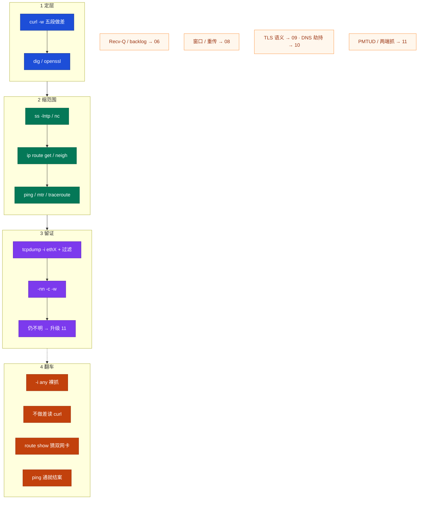
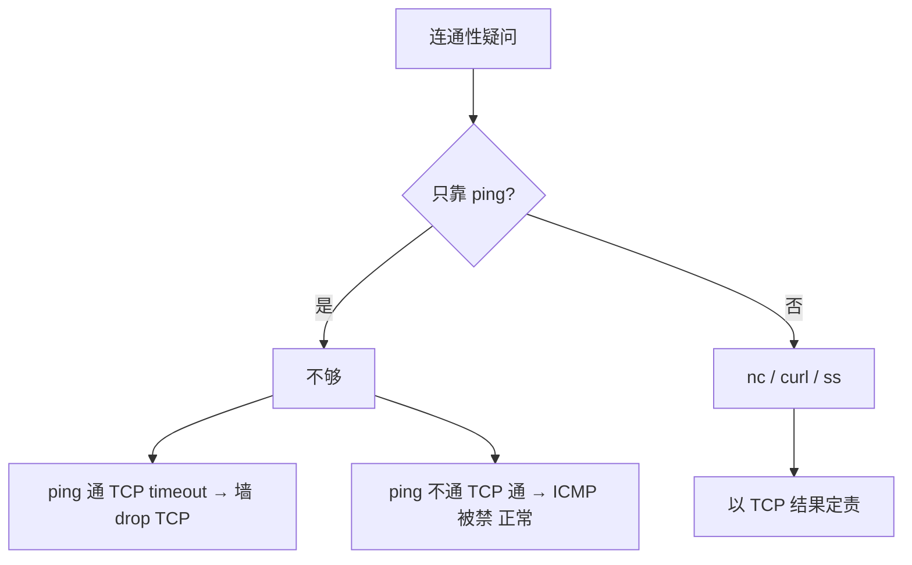
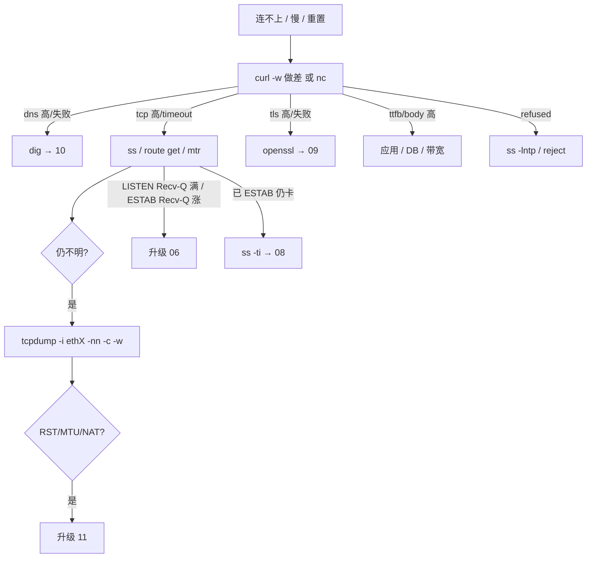

# 网络排查命令

> **这章解决什么**：电话响了「连不上 / 超时 / 重置」——第一刀敲什么？输出怎么读？什么时候才升级到 [16](../16-网络排障与抓包/) 的分层深排与两端抓？  
> **读法**：**先看总图** → **再认名词** → **再按命令分册抄配方** → **易混 + 场景 SOP 定责**。  
> **刻意不展开**：分层理论 / PMTUD 深排 / TSO 假 checksum / 两端抓协议 → [16](../16-网络排障与抓包/)；Recv-Q LISTEN vs ESTAB、backlog → [12](../12-网络栈与Socket/)；TCP 窗口 / 重传 → [13](../13-TCP与UDP/)；TLS 语义 → [14](../14-HTTP与TLS/)；DNS 劫持深排 → [15](../15-DNS与CDN/)。

---

## 本章目录

1. [本章定位](#1-本章定位)
2. [先看总图：命令刀法怎么串](#2-先看总图命令刀法怎么串) ← **开篇必读**
   - [2.0 全章知识串图](#20-全章知识串图一张把刀法串起来) ← **架构总览**
   - [2.1 完整走读](#21-完整走读登录连不上从电话到结案)
3. [名词扫盲（对照总图认词）](#3-名词扫盲对照总图认词)
4. [命令分册](#4-命令分册速查与输出解读) ← **重点精读**
   - [4.1 ss](#41-ss谁在听连接什么状态) · [4.2 curl -w](#42-curl--w五段做差定层)
   - [4.3 dig](#43-dig解析第一刀) · [4.4 ping](#44-ping粗测三层别结案)
   - [4.5 mtr](#45-mtr看形态不盯单跳) · [4.6 traceroute](#46-traceroute何时还要)
   - [4.7 nc](#47-nc测端口通不通) · [4.8 ip route get](#48-ip-route-get双网卡第一刀)
   - [4.9 ip neigh](#49-ip-neigh邻居与-arp) · [4.10 tcpdump 最小集](#410-tcpdump最小集生产纪律)
   - [4.11 openssl s_client](#411-openssl-s_clienttls探路)
5. [最易混：ping 通 TCP 不通 / drop vs reject / -i any](#5-最易混本章最易翻车) ← **重点精读**
6. [场景 SOP](#6-场景-sop)
7. [定责决策树与命令速查](#7-定责决策树与命令速查)
8. [去哪章继续学](#8-去哪章继续学)
9. [面试 · 易错 · 数字](#9-面试--易错--数字)
10. [合上书](#合上书)

---

## 1. 本章定位

| 章 | 负责 |
|----|------|
| **06** | 包怎么走、Socket/队列、Recv-Q、backlog、本机「满」 |
| **08** | TCP 窗口 / 重传 / 心跳；`ss -ti` 读传输态 |
| **09** | HTTP 状态码、TLS 握手语义、证书链 |
| **10** | DNS 权威 / 劫持 / TTL / CDN |
| **11** | 分层排障理论、抓包深纪律、PMTUD、TSO 假 checksum、两端抓协议 |
| **27（本章）** | **命令配方、过滤器、读输出、场景闭环；何时升级到 11** |

本章是**网络命令刀法手册**：速查 + 场景闭环。11 告诉你「为什么要定层、抓包纪律背后的坑」；本章告诉你「值班键盘上第一刀敲什么、屏幕长什么样、下一步去哪」。

🎯 **值班签名**：连不上——`curl -w` **做差**定层 → `ss` / `dig` / `nc` → `ip route get`（**不是** `route show`）→ 仍不明才 `tcpdump -i ethX … -w`；**禁止**裸 `tcpdump -i any`。

玩家报「登录连不上」。有人已经在战斗服 `tcpdump -i any` 打到终端；有人看了 `ip route show` 就说「默认走 eth0」；有人把 `time_connect=0.02` 当成「TCP 20ms」却忘了里面含 DNS。本章把这些刀法钉死。

**读完你能：**

1. 默画「定层 → 缩范围 → 留证」命令链，并说出每步看什么输出。  
2. 对着一组 `curl -w` 数字**做差**，一口定责 DNS / TCP / TLS / 应用 / body。  
3. 双网卡场景必打 `ip route get`，读出 `dev` / `src` / `via`。  
4. 写出合法 tcpdump 最小闭环（指定网卡 + 过滤 + `-nn -c -w`），并知道何时链到 11。  
5. 分清 ping 通 ≠ TCP 通、drop vs reject、LISTEN Recv-Q vs ESTAB Recv-Q（后者链 06）。

**本章不讲：** PMTUD 深排复现、TSO 假 checksum 原理、NAT 后两端抓包对照协议、窗口算法——见对应邻章。

---

## 2. 先看总图：命令刀法怎么串

> **正确开篇顺序**：先有全局画面，再认词，再抠命令。  
> 先看 **§2.0 串图**，再用 **§2.1 走读**把一次工单串起来。

### 2.0 全章知识串图（一张把刀法串起来）

> 🎯 **合上书要能默画这张。** 蓝=定层 · 绿=缩范围 · 紫=留证 · 橙=翻车点。  
> 若预览仍报错，以下面 **ASCII 一页板** 为准。



**读图路线：**

| 段 | 记住 |
|----|------|
| ① | `curl -w` 累计要做差；dns→10，tls→09，ttfb→应用 |
| ② | `ss` 听没听、`nc` 端口、`route get` 出哪张卡、源 IP 对不对 |
| ③ | 缩到 IP+端口+网卡才抓；过滤 + `-c` + `-w`；深坑链 11 |
| ④ | 翻车四件套：`-i any`、不做差、`route show` 猜、ping 结案 |

```text
┌──────────────────────────────────────────────────────────────────────────┐
│                     27 一张板：网络命令刀法闭环                            │
├─────────────┬────────────────────┬───────────────────────────────────────┤
│  ① 定层     │  ② 缩范围          │  ③ 留证                               │
│  curl -w    │  ss / dig / nc     │  -i ethX + host/port                  │
│  五段做差   │  route get / mtr   │  -nn -c -w；SYN/RST                   │
│  openssl    │  neigh / ping      │  仍不明 → 11 深排                     │
├─────────────┴────────────────────┴───────────────────────────────────────┤
│  翻车：-i any · 不做差 · route show 猜双网卡 · ping 通就结案              │
│  邻章：队列 06 · 窗口 08 · TLS 09 · DNS 10 · PMTUD/两端抓 11              │
└──────────────────────────────────────────────────────────────────────────┘
```

### 2.1 完整走读：登录连不上，从电话到结案

**一句话：** 先定层再缩范围，最后才留证；80% 工单死在 DNS / TCP / TLS / 应用，轮不到抓包。

**场景**：晚上 9 点，oncall：「登录一直转圈。」群里已经有人敲 `tcpdump -i any`。

```text
① 跳板 curl -w 五段（§4.2）
   dns:0.018 tcp:0.020 tls:0.080 ttfb:3.520 total:3.545 code:200
   做差 → tcp≈2ms、ttfb≈3.4s → 路通了，慢在应用/DB
   → 工单定责 login + DBA，网络组关单。结案。

② 若换成：dns 正常，卡在 connect / Connection timed out
   ss -lntp 对端听没听（§4.1）
   dig 解析对不对（§4.3）
   nc -zv VIP 443（§4.7）
   ip route get 对端 IP → 出哪张网卡、源 IP 对不对（§4.8）
   mtr 看后面跳是否同样丢（§4.5）

③ 仍不明：tcpdump -i eth1 host VIP and port 443 -nn -c 500 -w /tmp/login.pcap
   看有没有 SYN / SYN-ACK / RST（§4.10）
   RST 源 IP 怪异 / 小包通大包死 / NAT 后对不上 → 升级 [16](../16-网络排障与抓包/)
```

**别做：**

```text
电话响 → tcpdump -i any → SSH 卡死
电话响 → ip route show → 「有 default」就结案
电话响 → ping 通 → 「网络没问题」甩给开发（可能 ICMP 通、TCP 被 drop）
```

> **记住**：本章主线就是 **定层 → 缩范围 → 留证**；命令是这三步的刀，不是百科。

---

## 3. 名词扫盲（对照总图认词）

> 值班里什么时候碰到 → 一句话定义 → 本章哪节动手。

| 名词 | 值班何时碰到 | 一句话 | 本章 |
|------|--------------|--------|------|
| **五段** | 登录慢 / 连不上 | curl `-w` 五个累计时间戳；**本段要做差** | §4.2 |
| **做差** | 有人喊「connect 慢」 | `本段 = 后累计 − 前累计` | §4.2 |
| **Connection refused** | 立刻失败 | 对端立刻 RST（没听或 reject） | §5 |
| **Connection timed out** | 一直转圈 | SYN 石沉大海（drop / 黑洞 / 错路） | §5 |
| **drop vs reject** | 安全组 / 防火墙 | drop=吃掉→超时；reject=RST | §5 |
| **ip route get** | 双网卡、白名单 | 内核「去这个 IP **实际**走哪」 | §4.8 |
| **ip route show** | 有人只敲这个 | main 表地图册，**不是**单包 GPS | §4.8、§5 |
| **neigh / ARP** | 同网段 FAILED | 二层邻居状态 | §4.9 |
| **mtr 形态** | 「中间跳 30% 丢」 | 后面跳同样丢才是真丢 | §4.5 |
| **-i any** | 抓包翻车 | 聚合多口，禁止裸抓 | §4.10、§5 |
| **Recv-Q** | ss 顶满 / 涨 | LISTEN=连接数；ESTAB=未读字节 → [12](../12-网络栈与Socket/) | §4.1 |

| 玩家人话 | 包里大致 | 第一刀 |
|----------|----------|--------|
| 「解析失败」 | 无 TCP | `dig` |
| 「连接被拒绝」 | SYN→立刻 RST | `ss -lntp`、reject |
| 「一直转圈 / 超时」 | 重复 SYN，无 SYN-ACK | `curl -w`、`nc`、`route get`、mtr |
| 「连接被重置」 | 有 RST | 抓 RST **源 IP**（最小集 §4.10；深排 11） |
| 「慢」 | 可能 ttfb / body | `curl -w` 做差 |

> **别混**：ping 通不能证明 TCP 通；ping 不通 TCP 通 → ICMP 被禁，**正常**。

---

## 4. 命令分册：速查与输出解读

> 每条命令固定：**何时用 → 怎么敲 → 典型输出 → 逐行解读 → 异常往哪走 → 何时升级邻章**。

### 4.1 ss：谁在听、连接什么状态

**一句话：** `ss` 是本机 Socket 第一刀——听没听、状态、Recv-Q/Send-Q、对应进程。

**何时用：** refused / 新进不去旧还在 / 怀疑 backlog 或应用不读。

```bash
ss -lntp                    # 监听：TCP，不解析，显示进程
ss -antp | head             # 所有 TCP + 进程（生产加 head / 过滤）
ss -ant state established | head
ss -ant state time-wait | wc -l
ss -ant state close-wait | head
ss -s                       # 汇总：estab / closed / syn-recv …
ss -ti dst 10.0.1.50:3306   # 传输细节 → 深读见 08
```

**典型输出（LISTEN）：**

```text
State    Recv-Q Send-Q Local Address:Port  Peer Address:Port  Process
LISTEN   128    128          0.0.0.0:443        0.0.0.0:*      users:(("nginx",pid=1024,fd=6))
```

| 字段 | 含义 | 现场联想 |
|------|------|----------|
| `LISTEN` | 在听 | 没有这行 → refused 先查进程/绑定 |
| `Recv-Q 128` / `Send-Q 128` | **未 accept 连接数** / backlog 上限 | 顶满 → accept 慢或 backlog 小 → [12](../12-网络栈与Socket/) |
| `0.0.0.0:443` | 绑所有地址 | 若只绑 `10.0.0.8:443`，连 VIP 会「端口在听却连不上」 |
| `Process` | 谁在听 | `-p` 需要权限；容器里可能看不到宿主机进程 |

**典型输出（ESTAB）：**

```text
ESTAB  245760  0  10.0.0.8:443  203.0.113.9:52344  users:(("nginx",pid=1024,fd=12))
```

| 字段 | 含义 | 定责 |
|------|------|------|
| `Recv-Q 245760` | **未读字节**（不是连接数） | 应用卡住没 `read` → 06 |
| `Send-Q > 0` 持续 | 发出去未 ACK / 对端窗口 | 对端或网络 → [13](../13-TCP与UDP/) |

> 🔥 **易错钉死**：LISTEN 的 Recv-Q 与 ESTAB 的 Recv-Q **不是一回事**。详解与 backlog 只在 [12 §5](../12-网络栈与Socket/)；本章只认「怎么用 ss 看到」。

**`ss -s` 速读：**

```text
TCP:   312 (estab 280, closed 12, orphaned 0, synrecv 20, timewait 8/0)
```

| 异常形态 | 想什么 |
|----------|--------|
| `synrecv` 很高 | 半连接打满 / SYN flood → 06 |
| `timewait` 爆炸 | 短连接、缺连接池 → 06 |
| `close-wait` 涨 | 被动方没 close → 修代码 |

**面试怎么说**：「refused 先 `ss -lntp`；LISTEN Recv-Q 顶满查 accept/backlog，ESTAB Recv-Q 涨查应用没 read——两者不能互换。」

---

### 4.2 curl -w：五段做差定层

**一句话：** 五段是**累计**计时，本段必须**做差**；connect 含 DNS，口播前先减。

**何时用：** HTTP(S) 登录/API「慢」或「连不上」的定层第一刀。长连接房间用不了业务语义——改用 §4.7 + §4.1。

```bash
curl -o /dev/null -s -w \
  'dns:%{time_namelookup} tcp:%{time_connect} tls:%{time_appconnect} ttfb:%{time_starttransfer} total:%{time_total} code:%{http_code}\n' \
  https://login.example.com
```

```text
时间轴（累计，从 0 起）：

  0 ──────── namelookup ── connect ── appconnect ── starttransfer ── total
               │ dns 段 │  tcp 段  │   tls 段   │     ttfb 段    │ body │
```

| 字段 | 累计到哪 | **本段**怎么算 | 高了找谁 |
|------|----------|----------------|----------|
| `time_namelookup` | DNS 完 | = 自身 | [15](../15-DNS与CDN/) |
| `time_connect` | TCP 完 | connect − dns | 墙 / SYN 黑洞 / 远 |
| `time_appconnect` | TLS 完 | appconnect − connect | [14](../14-HTTP与TLS/) |
| `time_starttransfer` | 首字节 | starttransfer − appconnect（HTTP：− connect） | **应用 / DB** |
| `time_total` | 全程 | total − starttransfer = body | 大包 / 带宽 |

> 🔥 **易错钉死**：`time_connect` **不是**纯 TCP——**包含 DNS**。不做差就结案 = 本章事故。

#### 例 A：ttfb 慢（别甩网络组）

```text
dns:0.018 tcp:0.020 tls:0.080 ttfb:3.520 total:3.545 code:200
```

| 本段 | 计算 | 结果 |
|------|------|------|
| dns | 0.018 | 正常 |
| tcp | 0.020 − 0.018 | **2ms** |
| tls | 0.080 − 0.020 | 60ms |
| ttfb | 3.520 − 0.080 | **≈3.44s** |
| body | 3.545 − 3.520 | 很小 |

**结论**：路通了，慢在 login/DB。

#### 例 B：DNS 慢

```text
dns:1.200 tcp:1.205 tls:1.280 ttfb:1.350 total:1.360 code:200
```

dns **1.2s** → `dig` + [15](../15-DNS与CDN/)；tcp 本段仅 5ms，别查专线。

#### 例 C：TCP 挂

```text
dns:0.010 tcp:75.000
# 或：curl: (28) Connection timed out
```

dns 正常、卡 connect → §4.8 `route get`、§4.7 `nc`、安全组 **drop**、错源 IP。

#### 例 D：TLS 慢

```text
dns:0.01 tcp:0.02 tls:2.50 ttfb:2.55 total:2.56 code:200
```

tls 本段 ≈ **2.48s** → `openssl s_client`（§4.11）+ [14](../14-HTTP与TLS/)。

#### 例 E：body 慢

```text
dns:0.01 tcp:0.02 tls:0.05 ttfb:0.08 total:8.50 code:200
```

body ≈ **8.4s** → 响应体大 / 带宽；别说「网络抖动」。

#### 做差速算板（合上书默算）

```text
给定：dns=D  tcp=C  tls=A  ttfb=S  total=T

本段 dns  = D
本段 tcp  = C − D
本段 tls  = A − C          （仅 HTTPS）
本段 ttfb = S − A          （HTTP：S − C）
本段 body = T − S
```

口算检查：五段本段相加 ≈ `total`。

**与 `curl -v` 对照：**

| `-v` 停在 | 五段 | 下一步 |
|-----------|------|--------|
| `Could not resolve host` | dns | dig → 10 |
| `Trying…` 后长时间 | tcp | nc / route get / mtr |
| `Connected` 后卡 SSL | tls | openssl → 09 |
| HTTP 行出来很慢 | ttfb | 应用 / DB |
| 下载很慢 | body | 体积 / 带宽 |

**长连接房间：** curl 打不上业务语义 → 确认**房间 IP+端口** → `nc -zv` + `ss` → 仍不明才抓该端口（§4.10）。别在登录域名上抓房间。

**升级到 11：** 五段已定层但路径/MTU/RST 源仍扯不清——分层理论与 PMTUD 深排见 [16 §4～§8](../16-网络排障与抓包/)。

**面试怎么说**：「connect 快、ttfb 慢，定责应用；口播前必须做差，因为 connect 含 DNS。」

---

### 4.3 dig：解析第一刀

**一句话：** 连不上先确认「连的是不是那个 IP」；`dig` 比 `nslookup` 更干净。

**何时用：** curl dns 段高、解析失败、怀疑缓存/劫持（深排链 10）。

```bash
dig +short login.example.com
dig login.example.com A +noall +answer
dig @8.8.8.8 login.example.com A +short     # 对比公共 DNS
dig login.example.com +trace                # 跟权威链（深排时）
getent hosts login.example.com              # 看本机解析顺序（含 nsswitch）
```

**典型输出：**

```text
;; ANSWER SECTION:
login.example.com.  30  IN  A  203.0.113.10
```

| 看什么 | 含义 |
|--------|------|
| `A` 记录 IP | 和业务文档 / VIP 是否一致 |
| TTL | 改完解析多久生效 → 10 |
| 权威 vs 公共 DNS 结果不同 | 劫持 / 分流 / 内网 split DNS → [15](../15-DNS与CDN/) |
| `NXDOMAIN` | 域名不存在或拼错 |
| `SERVFAIL` | 上游挂 / 网络到解析器有问题 |

**现场对照：**

```bash
# 跳板
dig +short login.example.com
# 203.0.113.10

# 玩家侧（或模拟）
dig +short login.example.com
# 198.51.100.66   ← 不一致：先别查 TCP，先查 DNS/劫持/本地 hosts
```

> **记住**：本章只做「解析对不对、两边是否一致」；劫持手法与 CDN 回源深排 → [15](../15-DNS与CDN/)。

**面试怎么说**：「dns 段高或解析失败先 dig，对比权威/公共 DNS；IP 都不对就不要抓 TCP。」

---

### 4.4 ping：粗测三层，别结案

**一句话：** ping 测 ICMP 可达性与粗 RTT；**通 ≠ TCP 通，不通 ≠ TCP 不通**。

**何时用：** 粗测路径、配合大包探 MTU（深复现链 11）。

```bash
ping -c 3 10.0.1.50
ping -c 3 -W 1 203.0.113.10
ping -M do -s 1472 203.0.113.10    # DF + 1472 ≈ 路径 1500；不通先想 PMTUD → 11
```

**典型输出：**

```text
64 bytes from 10.0.1.50: icmp_seq=1 ttl=64 time=0.4 ms
64 bytes from 10.0.1.50: icmp_seq=2 ttl=64 time=0.3 ms
--- 10.0.1.50 ping statistics ---
3 packets transmitted, 3 received, 0% packet loss, time 2002ms
rtt min/avg/max/mdev = 0.3/0.35/0.4/0.05 ms
```

| 字段 | 含义 | 别过度解读 |
|------|------|------------|
| `ttl` | 剩余跳数线索 | 同网段常 64；跨网会变 |
| `time=` | ICMP RTT | ≠ TCP 握手 RTT，量级可参考 |
| `packet loss` | ICMP 丢 | 中间设备可能限 ICMP |
| 100% loss | ICMP 被禁或真不通 | **先 `nc -zv` 再定责** |

| 形态 | 含义 | 你怎么说 |
|------|------|----------|
| ping 通、TCP timeout | 墙 **drop** TCP / 只放 ICMP | 「三层通四层不通」 |
| ping 不通、TCP 通 | ICMP 被禁 | **正常**，不当事故 |
| 小 ping 通、`-s 1472 -M do` 不通 | 路径 MTU / PMTUD | 升级 [16 §8](../16-网络排障与抓包/) |

> **别混**：默认 ping 是**小包**。用小包通就宣称「网络没问题」= 翻车。

**面试怎么说**：「ping 只作粗测；通不能证明 TCP 通，不通不能证明 TCP 不通。」

---

### 4.5 mtr：看形态，不盯单跳

**一句话：** mtr = traceroute + 持续 ping；**后面跳同样丢才是真丢**，中间一跳 ICMP 丢不能当事故。

**何时用：** 跨公网/跨机房超时、怀疑路径某跳起丢包或 RTT 台阶。

```bash
mtr -r -c 10 203.0.113.10          # 报告模式，10 个包
mtr -r -c 20 -n 203.0.113.10       # 不反解，更快
mtr -r -c 10 -T -P 443 203.0.113.10  # 部分环境支持 TCP mtr（有则优先）
```

**形态 A：假丢（ICMP 限速）**

```text
Host           Loss%   Snt   Last   Avg
1. gw          0.0%     10    1.0   1.1
2. isp-a      30.0%     10   12.0  11.0    ← 本跳丢
3. isp-b       0.0%     10   20.0  19.5    ← 后面不丢
4. dest        0.0%     10   25.0  24.0
```

→ **不当事故**：第 2 跳限 ICMP。

**形态 B：真丢**

```text
2. isp-a      40.0%     10   ...
3. isp-b      40.0%     10   ...
4. dest       40.0%     10   ...
```

→ 从第 2 跳起**后面同样丢**：往后查链路/对端。

**形态 C：RTT 台阶**

```text
3. isp-b       0.0%     10   20    19
4. overseas    0.0%     10  180   175    ← 跨区台阶
5. dest        0.0%     10  182   180
```

→ 延迟台阶≠丢包；业务「慢」可能是物理距离，配合 curl tcp 段看。

| mtr 形态 | 含义 | 你怎么说 |
|----------|------|----------|
| 某跳丢、**后面不丢** | 该跳限 ICMP | 「不当光纤断」 |
| 某跳起**后面同样丢** | 真丢 | 从那一跳往后查 |
| 全程 0 丢但 TCP 挂 | ICMP ≠ TCP 路径 | 抓 TCP / 查墙 |
| 只有本机→对端 TCP 挂 | 可能策略路由/ACL | `route get` + `nc` |

**面试怎么说**：「mtr 中间一跳 30% 丢、后面 0%，是 ICMP 限速不是光纤断。」

---

### 4.6 traceroute：何时还要

**一句话：** 没有 mtr 时用 traceroute 看路径；有 mtr 优先 mtr（自带统计）。

```bash
traceroute -n 203.0.113.10
traceroute -n -T -p 443 203.0.113.10   # TCP SYN 探（需权限；比 ICMP 更贴业务）
tracepath 203.0.113.10                 # 顺带看 PMTU 线索 → 深排 11
```

**典型输出：**

```text
 1  10.0.0.1       0.4 ms
 2  10.1.0.1       1.2 ms
 3  * * *
 4  203.0.113.10   24 ms
```

| 形态 | 读法 |
|------|------|
| `* * *` 后仍到达 | 该跳不回 ICMP，常见 |
| 到不了、最后全 `*` | 结合 `nc`/curl：可能墙 drop |
| ICMP traceroute 与 TCP 路径不一致 | 防火墙差别对待；业务以 TCP 为准 |

> **记住**：traceroute 是路径草图；定责仍要回到 `curl -w` / `nc` / `route get`。

---

### 4.7 nc：测端口通不通

**一句话：** `nc -zv` 回答「这个 IP:端口 TCP 能否建连」——比 ping 更接近业务。

**何时用：** 长连接房间、数据库口、非 HTTP 端口；curl 用不了的场景。

```bash
nc -zv 10.0.1.50 3306
nc -zv -w 3 203.0.113.10 443
timeout 3 bash -c 'cat < /dev/null > /dev/tcp/10.0.1.50/3306' && echo open || echo closed
# 旧系统：telnet 10.0.1.50 3306  （仅作替代，不如 nc 清晰）
```

**典型输出：**

```text
Ncat: Connected to 10.0.1.50:3306.
# 或
nc: connect to 10.0.1.50 port 3306 (tcp) failed: Connection refused
nc: connect to 10.0.1.50 port 3306 (tcp) failed: Connection timed out
```

| 结果 | 含义 | 下一步 |
|------|------|--------|
| Connected / succeeded | TCP 通 | 慢再查应用 / TLS / 协议 |
| Connection refused | 立刻 RST | `ss -lntp`、安全组 **reject** |
| Connection timed out | SYN 黑洞 | drop、错路、错源 IP、`route get` |
| No route to host | 本机路由/邻居问题 | §4.8、§4.9 |

**UDP 注意：**

```bash
nc -zuv -w 2 10.0.1.50 9000
# UDP「成功」不可靠：无握手；常需看业务回包或抓包确认
```

> **别混**：`nc -zv` 通只说明**传输层口开了**，不证明 HTTP 200 或 TLS 证书对。

**面试怎么说**：「非 HTTP 我用 nc -zv；refused 查监听和 reject，timeout 查 drop 和 route get。」

---

### 4.8 ip route get：双网卡第一刀

**一句话：** `show` 是地图册，`get` 是 GPS——双网卡、策略路由、白名单场景**必须 get**。

**何时用：** 超时、双网卡、DB 白名单、怀疑源 IP 不对、容器多网卡。

```bash
ip route get 10.0.1.50
ip route get 10.0.1.50 from 10.0.2.88    # 指定源，命中策略路由时
ip route get 10.0.1.50 iif eth0          # 入接口策略（较少）
ip rule show                              # 策略路由规则一览
```

**典型输出：**

```text
10.0.1.50 via 10.0.0.1 dev eth1 src 10.0.2.88 uid 0
    cache
```

| 字段 | 含义 | 现场联想 |
|------|------|----------|
| `via 10.0.0.1` | 下一跳网关 | 跨网段；同网段通常无 via |
| `dev eth1` | **从 eth1 出** | 别以为一定 eth0；抓包 `-i` 用这个 |
| `src 10.0.2.88` | **本机源 IP** | DB 白名单是否只放了 eth0 的 IP？ |
| `cache` | 路由缓存 | 改完路由可 `ip route flush cache` 再 get |
| `table game` | 命中非 main 表 | 只敲 `show` **看不见** |

**一例钉死：白名单悲剧**

```text
# 运维看了：
ip route show
# default via 10.0.0.1 dev eth0 …

# 实际：
ip route get 10.0.1.50
# 10.0.1.50 via 10.0.2.1 dev eth1 src 10.0.2.88
```

DB 白名单只放了 eth0 的 `10.0.0.8` → TCP **timeout**；有人用 eth0 源去 ping 管理口 → 「ping 通」。定责：源 IP / 路由，不是光纤。

**策略路由例：**

```bash
ip rule show
# 100: from 10.0.2.0/24 lookup game

ip route get 10.0.1.50 from 10.0.2.88
# 10.0.1.50 from 10.0.2.88 via 10.0.2.1 dev eth1 table game src 10.0.2.88
```

| 要点 | 说明 |
|------|------|
| `table game` | 不是 main 里那条 default |
| 只敲 `ip route show` | **误判** |
| 排障 | 对「这个源 → 这个目的」再 `get` |

🔥 **易错钉死**：双网卡排障用 `ip route get`，**不要**用 `ip route show` 猜。

**升级到 11：** 策略路由 / 多表纠缠、PBR 与 conntrack 交叉——见 [16 §5](../16-网络排障与抓包/)。

**面试怎么说**：「双网卡我必打 `ip route get`，读 dev 和 src；不看 `route show` 就猜。」

---

### 4.9 ip neigh：邻居与 ARP

**一句话：** 同网段先看邻居状态；跨网段 ARP 问的是**网关**，不是对端主机。

**何时用：** `route get` 无 via（同网段）仍不通；怀疑二层/对端 down/隔离。

```bash
ip neigh show
ip neigh show 10.0.0.9
ip neigh show dev eth0
ip -s neigh show           # 带统计（部分版本）
# 旧命令：arp -an
```

**典型输出：**

```text
10.0.0.9 dev eth0 lladdr aa:bb:cc:dd:ee:ff REACHABLE
10.0.0.1 dev eth0 lladdr 11:22:33:44:55:66 STALE
10.0.0.8 dev eth0 FAILED
```

| 状态 | 含义 | 下一步 |
|------|------|--------|
| `REACHABLE` | MAC 有效 | 二层大体通，往上查 |
| `STALE` | 缓存未确认 | ping 一下再看 |
| `DELAY` / `PROBE` | 正在确认 | 等片刻 |
| `FAILED` | 二层不通或对端 down | 线缆 / 网卡 / VLAN / 隔离 |
| 没有条目 | 未试过或过期 | ping / 业务连一下再看 |

**同网段 FAILED 例：**

```bash
ip route get 10.0.0.9
# 10.0.0.9 dev eth0 src 10.0.0.8   （无 via → 同网段）

ip neigh show 10.0.0.9
# 10.0.0.9 dev eth0 FAILED
```

| 读法 | 不是什么 |
|------|----------|
| 二层问题 | **不是**「默认路由丢了」 |
| 查线、对端、VLAN | 不要先改 default gateway |

跨网段封包与 ARP 问谁 → [12 §2](../12-网络栈与Socket/)。

**面试怎么说**：「同网段 FAILED 查二层；跨网段看网关邻居，不是对端 ARP。」

---

### 4.10 tcpdump 最小集：生产纪律

**一句话：** 先缩到 IP+端口+网卡再抓；**过滤 + `-nn -c -w`**；禁止裸 `-i any`。

**何时用：** curl/ss/nc/route 仍说不清 SYN 有没有回、RST 谁发的。深理论（TSO、两端协议）→ [16](../16-网络排障与抓包/)。

**最小闭环（背下来）：**

```bash
# 1) 先定网卡
ip route get 203.0.113.10
# … dev eth1 src …

# 2) 再抓
tcpdump -i eth1 host 203.0.113.10 and port 443 -nn -s0 -c 1000 -w /tmp/login.pcap
```

| 参数 | 作用 | 生产怎么用 | 改错会怎样 |
|------|------|------------|------------|
| `-i eth1` | 指定网卡 | 来自 `route get` 的 `dev` | **`-i any` 聚合乱、方向乱** |
| `-nn` | 不反解 | **必开** | 抓包时再 DNS，拖慢污染 |
| `-s0` | 全包 | 看 payload/长度时开 | 默认截断 → Follow 残 |
| `-c 1000` | 限包数 | **必开** | 打满盘 / 拖死机 |
| `-w file` | 写 pcap | 必写文件 | `-A` 打终端 = **自造事故** |
| `-C 100 -W 5` | 轮转 | 长抓才用 | 不限写满根盘 |

**常用过滤：**

```bash
# 握手 / 复位摘要（先看终端计数时也要 -c，且优先 -w）
tcpdump -i eth1 'tcp[tcpflags] & (tcp-syn|tcp-rst) != 0' and host 203.0.113.10 -nn -c 200 -w /tmp/synrst.pcap

# 只要纯 SYN（不含 SYN-ACK）
tcpdump -i eth1 'tcp[tcpflags] = tcp-syn' and port 443 -nn -c 100 -w /tmp/syn.pcap

# 只看 RST
tcpdump -i eth1 'tcp[tcpflags] & tcp-rst != 0' and host 203.0.113.10 -nn -c 100 -w /tmp/rst.pcap

# 房间 UDP
tcpdump -i eth1 udp port 9000 -nn -c 500 -w /tmp/room.pcap

# 别抓 SSH 撑死（辅助）
tcpdump -i eth1 'host 203.0.113.10 and port 443 and not port 22' -nn -c 500 -w /tmp/a.pcap

# 离线读
tcpdump -nn -r /tmp/login.pcap 'tcp[tcpflags] & tcp-syn != 0' | head
```

| 要看的问题 | 过滤 |
|------------|------|
| 登录超时 | `host <vip> and port 443` |
| 房间进不去 | **房间端口**，不要登录域名 |
| RST 谁发 | RST 过滤，看**源 IP** |
| 纯 SYN | `= tcp-syn`（**等于**，不是只 `&`） |

🔥 **易错钉死**：`& (tcp-syn) != 0` 会带上 **SYN-ACK**；只要纯 SYN 用 `= tcp-syn`。

**终端里快速认包（读 pcap 或短窗口）：**

```text
12:01:01.1 IP 203.0.113.9.52344 > 10.0.0.8.443: Flags [S], seq 1, ...
12:01:01.1 IP 10.0.0.8.443 > 203.0.113.9.52344: Flags [S.], seq 8, ack 2, ...
12:01:01.2 IP 203.0.113.9.52344 > 10.0.0.8.443: Flags [.], ack 9, ...
```

| Flags | 含义 |
|-------|------|
| `[S]` | SYN |
| `[S.]` | SYN-ACK |
| `[.]` | ACK |
| `[R]` / `[R.]` | RST |
| `[F.]` | FIN-ACK |

| 现象 | 读法 | 下一步 |
|------|------|--------|
| 只有重复 `[S]`，无 `[S.]` | SYN 黑洞 | drop / 错路 / 对端未听（先 ss） |
| `[S]` 后立刻 `[R]` | refused | 监听 / reject |
| 已 ESTAB 后突发 `[R]` | 谁发 RST | **看源 IP**；中间盒 → 11 两端抓 |
| 大厅域名上抓不到房间 | 抓错端口 | 换房间 IP:port |

**为什么禁止裸 `-i any`：**

| 问题 | 说明 |
|------|------|
| 看不出哪张网卡 | 「SYN 出没出」答不清 |
| 聚合假象 | 多口混在一起 |
| TSO/卸载更乱 | 假 checksum 深排见 [16](../16-网络排障与抓包/) |
| 流量爆炸 | 更容易撑死 SSH |

> **记住**：需要「any」语义时也要 **过滤 + `-c` + `-w`**，且知聚合局限；默认姿势永远是 `-i ethX`。深纪律、两端同时抓协议、TSO → [16 §6](../16-网络排障与抓包/)。

**面试怎么说**：「先 route get 定网卡，再 host/port 过滤，`-nn -c -w`；禁止 tcpdump -i any 裸打到终端。」

---

### 4.11 openssl s_client：TLS 探路

**一句话：** TCP 已通、curl tls 段高或证书报错时，用 `s_client` 看握手与证书链；语义深排 → [14](../14-HTTP与TLS/)。

**何时用：** `curl` 卡 SSL、证书过期、SNI/域名不匹配、只知 IP 要对域名握手。

```bash
openssl s_client -connect login.example.com:443 -servername login.example.com </dev/null
openssl s_client -connect 203.0.113.10:443 -servername login.example.com </dev/null
openssl s_client -connect login.example.com:443 -tls1_2 </dev/null
echo | openssl s_client -connect login.example.com:443 -servername login.example.com 2>/dev/null \
  | openssl x509 -noout -dates -subject -issuer
```

**典型输出（节选）：**

```text
CONNECTED(00000003)
depth=2 C = US, O = ...
verify return:1
---
Certificate chain
 0 s:CN = login.example.com
   i:C = US, O = Let's Encrypt, CN = R3
---
SSL-Session:
    Protocol  : TLSv1.3
    Cipher    : TLS_AES_256_GCM_SHA384
```

| 看什么 | 含义 | 定责 |
|--------|------|------|
| `CONNECTED` 后立刻断 | TCP 通但 TLS 拒 | 协议版本 / 证书 / SNI |
| `verify return:1` | 校验过（视 CA） | 本机信任库也可能干扰 |
| `CN` / SAN | 是否匹配访问域名 | 证书挂错 |
| `notAfter` | 是否过期 | 换证 |
| `Protocol` / `Cipher` | 版本与套件 | 客户端过旧 / 服务端禁 TLS1.0 |
| alert handshake failure | 握手失败 | 09 语义 |

**与 curl 对照：**

| curl 现象 | openssl |
|-----------|---------|
| tls 本段秒级 | 看是不是证书链拉 Offline CRL/OCSP 慢 |
| `SSL certificate problem` | `-dates` / 链是否完整 |
| IP 直连证书名不对 | 必须带 `-servername` |

> **记住**：本章只做探路与读字段；证书链策略、双向 TLS、HTTP/2 语义 → [14](../14-HTTP与TLS/)。

**面试怎么说**：「tls 段高或证书报错，我用 openssl s_client 看链和 notAfter，并带 servername。」

---

## 5. 最易混：本章最易翻车

> 🎯 **三件事钉死：ping≠TCP、drop≠reject、禁止裸 `-i any`。** 再加做差与 route get。

### 5.1 ping 通 vs TCP 通



| 组合 | 含义 | 别做 |
|------|------|------|
| ping✓ TCP✓ | 路大致通 | 慢仍要 curl 做差 |
| ping✓ TCP timeout | ACL/安全组 **drop** TCP，或只放 ICMP | 「网络没问题」甩开发 |
| ping✗ TCP✓ | ICMP 禁 | 当事故去开 ICMP |
| ping✗ TCP✗ | 可能真不通 | 仍要 `route get` 排除错路 |

### 5.2 drop vs reject

| | drop | reject |
|--|------|--------|
| 防火墙动作 | 吃掉，不回 | 回 RST（或 ICMP unreachable） |
| 客户端感受 | **超时** | **Connection refused**（TCP） |
| 第一刀 | mtr / 抓 SYN 无回 | `ss -lntp`、查 reject 规则 |
| 口播 | 「石沉大海」 | 「门卫明确说不让进」 |

> **别混**：超时先想 drop/错路/未监听但被 drop；refused 先想没听或 reject——**不要对调**。

### 5.3 禁止裸 `tcpdump -i any`

| 错误 | 正确 |
|------|------|
| `tcpdump -i any` | `ip route get` → `-i ethX` |
| 打到 SSH 终端 | `-w /tmp/x.pcap` + `-c` |
| 不过滤 | `host` + `port` |
| 登录域名抓房间 | 房间 **IP:port** |

需要观察多接口时：分接口抓，或镜像到分析机；深坑（TSO、any 聚合）→ [16](../16-网络排障与抓包/)。

### 5.4 另外两刀：不做差 / 用 show 猜

| 翻车 | 正确 |
|------|------|
| `time_connect=0.02` 说「TCP 20ms」 | 先减 `time_namelookup` |
| `ip route show` 有 default via eth0 | `ip route get` 看真实 `dev`/`src` |
| LISTEN Recv-Q 顶满去调 rmem | 那是连接数 → [12](../12-网络栈与Socket/) |

**面试怎么说**：「ping 通不能结案；超时对 drop，refused 对 reject；抓包禁止 -i any 裸打终端。」

---

## 6. 场景 SOP

> 每个场景：**现象 → 命令序 → 看什么 → 定责 / 升级**。

### 6.1 HTTPS 登录慢

```text
1. curl -w 五段，做差写工单
2. dns 高 → dig → 10
3. tcp 高 → nc / route get / mtr
4. tls 高 → openssl s_client → 09
5. ttfb 高 → 应用 / DB（别甩网络组）
6. body 高 → 体积 / 带宽
```

### 6.2 Connection timed out

```text
1. dig 确认 IP
2. nc -zv -w 3 IP PORT
3. 对端 ss -lntp（有权限）
4. 本机 ip route get → 查 src 是否在白名单
5. mtr 看真丢还是假丢
6. tcpdump 看是否只有重复 SYN
7. 仍涉及 PMTUD / 中间盒 → 11
```

### 6.3 Connection refused

```text
1. ss -lntp | grep PORT
2. 进程挂了？绑错 IP？
3. 安全组 / iptables **reject**
4. 本地能通、外网 refused → 查外层 LB/安全组
```

### 6.4 大厅能进、房间进不去

```text
1. 确认房间 IP + 端口（不是登录域名）
2. nc -zv 房间口
3. ss 看有无到房间的 ESTAB
4. 抓房间端口 SYN/心跳，勿抓错口
5. 已 ESTAB 仍卡 → ss -ti / 窗口 → 08
```

### 6.5 双网卡连 DB 超时

```text
1. ip route get DB_IP   # 读 dev / src
2. 对照 DB 白名单是否包含该 src
3. ip neigh（同网段）
4. nc -zv DB 3306
5. 不要只看 ip route show
```

### 6.6 解析异常 / 偶发连错库

```text
1. dig +short 对比公共 DNS
2. getent hosts / 查 hosts 文件
3. TTL 与多 A 记录 → 10
4. curl --resolve 固定 IP 对比五段
```

### 6.7 证书报错 / TLS 握手失败

```text
1. curl -v 看卡在 SSL 哪步
2. openssl s_client -servername …
3. 查 notAfter / 链 / 协议版本 → 09
```

### 6.8 小包通、大包死（点到即止）

```text
1. ping -M do -s 1472
2. 不通 → 怀疑 PMTUD / 中间丢 ICMP need frag
3. 深复现与定责手法 → [16](../16-网络排障与抓包/)
```

### 6.9 新连接失败、旧连接还在

```text
1. ss -s；conntrack 是否满 → [12](../12-网络栈与Socket/) / [17](../17-iptables与conntrack/)
2. 不是先重启战斗服、不是先改安全组
```

---

## 7. 定责决策树与命令速查

### 7.1 决策树



### 7.2 现象 | 先做 | 别做

| 现象 | 先做 | 别做 |
|------|------|------|
| 登录慢 | curl -w **做差** | 先 tcpdump -i any |
| refused | ss -lntp | 先查公网光纤 |
| timeout | dig → nc → route get | ping 通就结案 |
| 双网卡 | `ip route get` | `ip route show` 猜 |
| 房间进不去 | 房间 IP:port + nc | 登录域名上抓包 |
| ttfb 3s+ | 查应用/DB | 甩网络组专线 |
| mtr 中间跳丢后面不丢 | 当 ICMP 限速 | 报光纤断 |
| 要抓包 | `-i ethX` 过滤 `-c -w` | 裸 `-i any` 打终端 |
| ESTAB Recv-Q 涨 | 应用 read → 06 | 调 rmem 当 LISTEN 满 |
| 小包通大包死 | 标记 PMTUD → 11 | 本章硬撑深排 |

### 7.3 命令速查卡

| 目的 | 命令 |
|------|------|
| HTTP(S) 定层 | `curl -o /dev/null -s -w 'dns:%{time_namelookup} …'` **做差** |
| 谁在听 | `ss -lntp` |
| 连接汇总 | `ss -s` |
| 解析 | `dig +short` / `dig @8.8.8.8` |
| 端口 | `nc -zv -w 3 IP PORT` |
| 真实出接口 | `ip route get IP` |
| 邻居 | `ip neigh show` |
| 路径形态 | `mtr -r -c 10 IP` |
| TLS 探路 | `openssl s_client -connect host:443 -servername host` |
| 抓包最小集 | `tcpdump -i ethX host A and port P -nn -c 1000 -w /tmp/a.pcap` |

```bash
# 值班 60 秒模板
curl -o /dev/null -s -w 'dns:%{time_namelookup} tcp:%{time_connect} tls:%{time_appconnect} ttfb:%{time_starttransfer} total:%{time_total} code:%{http_code}\n' https://login.example.com
dig +short login.example.com
nc -zv -w 3 "$(dig +short login.example.com | head -1)" 443
ip route get "$(dig +short login.example.com | head -1)"
ss -lntp | grep -E ':443|:8080'
```

---

## 8. 去哪章继续学

| 你想搞懂 | 去 |
|----------|-----|
| Recv-Q LISTEN vs ESTAB、backlog、conntrack 满 | [12](../12-网络栈与Socket/) |
| 窗口、重传、`ss -ti`、心跳 | [13](../13-TCP与UDP/) |
| TLS/证书/HTTP 状态码语义 | [14](../14-HTTP与TLS/) |
| DNS 劫持、TTL、CDN | [15](../15-DNS与CDN/) |
| 分层理论、PMTUD、TSO 假 checksum、两端抓协议 | [16](../16-网络排障与抓包/) |
| iptables / conntrack 表 | [17](../17-iptables与conntrack/) |
| 主机侧 CPU/IO 命令刀法 | [01-主机排查命令](../01-主机排查命令/)（若已开章） |

---

## 9. 面试 · 易错 · 数字

| 问 | 30 秒答 |
|----|---------|
| 连不上第一刀？ | curl -w 做差定层；禁止先 tcpdump -i any。 |
| 五段怎么算？ | 累计时间戳；本段=后减前；connect 含 DNS。 |
| 双网卡怎么查路由？ | `ip route get`，读 `dev`/`src`/`via`；不用 show 猜。 |
| ping 通能否结案？ | 不能。通≠TCP 通；不通也可能 ICMP 被禁。 |
| drop 与 reject？ | drop→超时；reject→RST/refused。 |
| mtr 中间跳 30% 丢？ | 看后面跳；后面不丢是 ICMP 限速。 |
| 抓包最小纪律？ | `-i ethX` + 过滤 + `-nn -c -w`。 |
| LISTEN Recv-Q 满？ | 未 accept 连接数 → 06；不是字节 rmem。 |
| ttfb 慢找谁？ | 应用/DB，不是专线。 |
| 何时升级 11？ | PMTUD 深排、TSO 假 checksum、NAT 后两端抓对不上。 |

| 易错 | 真相 |
|------|------|
| `time_connect` = 纯 TCP | 含 DNS，要做差 |
| `route show` 定出接口 | 以 `route get` 为准 |
| ping 通 = 网络 OK | ICMP ≠ TCP |
| 超时 = reject | 超时多对 drop |
| `tcpdump -i any` 省事 | 生产裸抓禁止 |
| `& tcp-syn` 只要 SYN | 会带 SYN-ACK；纯 SYN 用 `=` |
| 登录域名抓房间 | 抓错端口白抓 |
| LISTEN/ESTAB Recv-Q 一回事 | 个数 vs 字节 |

**数字（口算锚点）：**

| 锚点 | 量级 |
|------|------|
| 同机房 tcp 本段 | 常 **<5ms** |
| 做差次数（HTTPS） | 通常 **四次减法** |
| tcpdump `-c` | 建议 **500～2000** 起，宁可变短再抓 |
| mtr `-c` | 常用 **10～20** |
| ping `-s` 探 1500 | **1472**（+28 头） |
| curl 模板 | 必带 `-o /dev/null -s -w` |

---

## 合上书

1. **默画 §2.0**：定层 → 缩范围 → 留证；翻车四件套是什么？  
2. **做差**：`dns:0.02 tcp:0.03 tls:0.10 ttfb:2.10 total:2.20`——各本段多少？锅在谁？  
3. **口述**：为何双网卡必须 `ip route get`？输出里 `dev`/`src` 各定什么责？  
4. **口述**：ping 通 TCP 不通、ping 不通 TCP 通——分别怎么解释？  
5. **口述**：drop vs reject 客户端各看到什么？第一刀命令？  
6. **写出**一条合法 tcpdump（含网卡、过滤、`-nn -c -w`）；说明为何禁止裸 `-i any`。  
7. **定责**：大厅能进房间进不去——命令序？何时去 06 / 08 / 11？

下一章：视学习路径而定。队列深排 → [12](../12-网络栈与Socket/)。分层与 PMTUD → [16](../16-网络排障与抓包/)。传输 → [13](../13-TCP与UDP/)。
