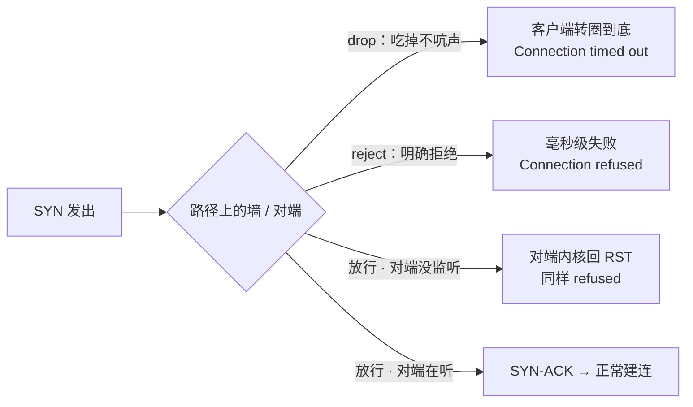
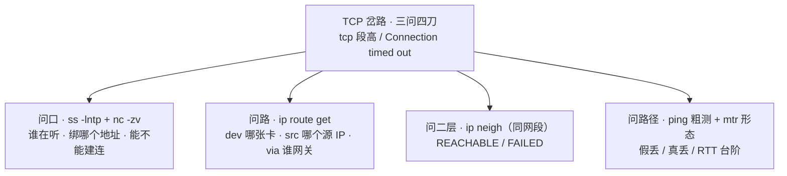
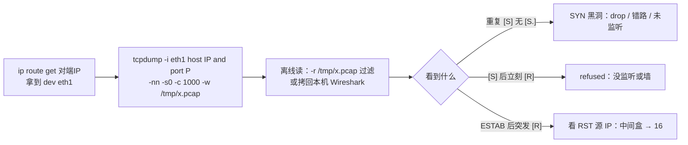
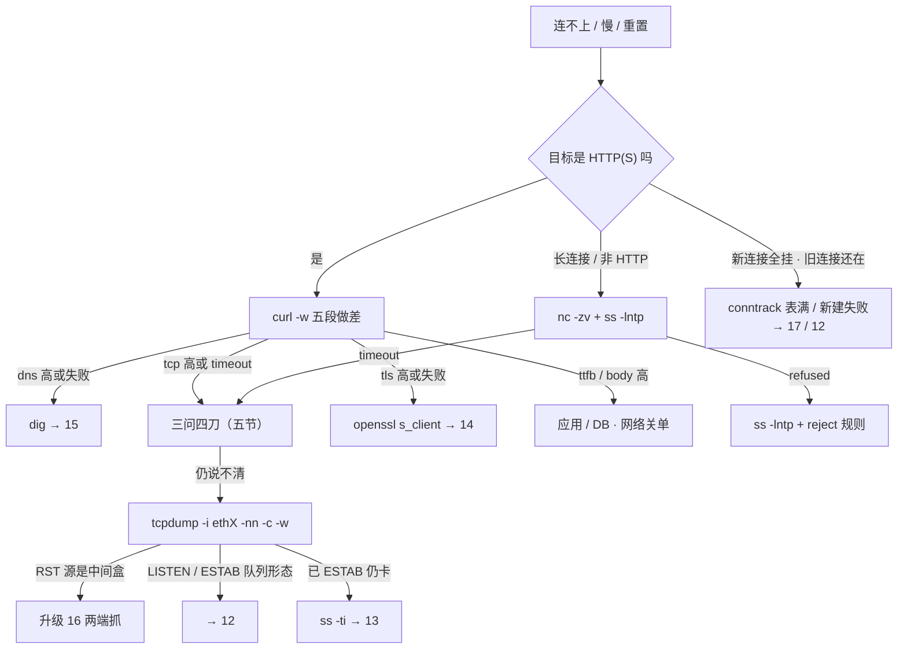

# 网络排查命令

> 晚上九点 oncall 电话：「登录一直转圈」——群里已经有人把 `tcpdump -i any` 打到终端、SSH 眼看卡死；有人看了眼 `ip route show` 说「有 default，网络没问题」；还有人 ping 通就结了案，开发反手甩来一张 `Connection timed out`。
> **本章回答**：一次「连不上 / 慢 / 重置」的报障从接警到定责收工，每一步第一刀敲什么、输出怎么读、什么时候升级邻章。
> **不讲**：Recv-Q / backlog / 队列机制 → [12](../12-网络栈与Socket/)；窗口 / 重传 / `ss -ti` 深读 → [13](../13-TCP与UDP/)；TLS / HTTP 语义 → [14](../14-HTTP与TLS/)；DNS 劫持 / CDN → [15](../15-DNS与CDN/)；抓包深纪律 / PMTUD / TSO / 两端抓 → [16](../16-网络排障与抓包/)；iptables / conntrack → [17](../17-iptables与conntrack/)。

**标记**：🎯重点 · 🔥难点 · ⭐常考 · 🔧实操

---

## 一、一张图：报障的一生

> 🎯 **一句话**：主线是接警 → 定层 → 缩范围 → 留证 → 收工；命令是这五步的刀，不是百科。


**读图**：
- 五步各占一节：接警（二）、定层（三）、缩范围（四～六，按 dns / tcp / tls 三条岔路展开）、留证（七）、收工（八）。
- 80% 的工单定完层就有答案——dns / tcp / tls / ttfb 四层里总有一层背锅，**轮不到抓包**；抓包是前三步都说不清才上的留证手段。
- 底部虚线是四个标准翻车姿势，后文每把刀讲到相关处都会点名它们。

---

## 二、接警：把玩家的话翻译成包语言

> 🎯 **一句话**：先问「卡在哪一步失败」，再选刀——玩家的话对应五种包行为，第一刀完全不同。

```text
「域名解析失败」     连 TCP 都没开始                     → dig（四节）
「连接被拒绝」       SYN 发出、立刻有 RST 回来           → ss -lntp + 查 reject（五节）
「一直转圈/超时」    重复 SYN、没有任何回应              → curl -w / nc / route get / mtr（三、五节）
「连接被重置」       连接建立后才收到 RST                → 抓 RST 看源 IP（七节）
「慢」              可能 ttfb / body，先做差             → curl -w（三节）
```

其中最值钱的分界线是**失败得快不快**：

- **立刻失败**（`Connection refused`，毫秒级）：有人回了话——要么对端没人监听、内核回 RST，要么路径上的墙明确 reject。有人应答 = 先查对端（`ss`）。
- **转圈到底**（`Connection timed out`）：石沉大海——SYN 被吃掉（drop）、走错路、或源 IP 不被放行。没人应答 = 先查本机路由和路径（`route get` / `nc`）。

> ⚠️ **别混**：`Connection refused` ≠ `Connection timed out`。refused 是「有人明确说不」，timeout 是「没人应」——前者先查对端监听和 reject 规则，后者先查 drop、路由和源 IP，**顺序对调就是白忙一晚上**。

> 🔍 **现场**：接完电话先复述一遍现象再动手：「是进不了大厅，还是大厅能进、进房间转圈？」——大厅（HTTPS 登录域名）和房间（长连接 IP:port）是两个完全不同的目标，用哪把刀都不一样（三节末尾、Q12）。

> 📝 **面试**：「连不上你第一刀敲什么？」——HTTP 业务答 `curl -w` 做差定层；非 HTTP / 长连接答「先确认目标 IP:端口，`nc -zv` + `ss -lntp`」。**任何情况下第一刀都不是 tcpdump**。

---

## 三、定层：curl -w 五段做差 🔥⭐

> 🎯 **一句话**：五个数全是从 0 起算的**累计秒表**，本段耗时要相邻相减；做差定层，多数工单到这就有了答案。

> 💡 **打个比方**：跑步 app 记的是「出发到现在累计几分几秒」，想知道某一段多快，得拿相邻两个打卡点相减。curl 的五个数就是五个累计打卡点，直接当「每段耗时」读是本章头号事故。

```bash
curl -o /dev/null -s -w 'dns:%{time_namelookup} tcp:%{time_connect} tls:%{time_appconnect} ttfb:%{time_starttransfer} total:%{time_total} code:%{http_code}\n' https://login.example.com
#      ↑丢弃正文    ↑静默    ↑五个累计时间戳 + 状态码
```

```text
时间轴（五个数全是从 0 起算的累计秒表，不是每段耗时！）：

  0 → [namelookup] → [connect] → [appconnect] → [starttransfer] → [total]
        DNS 段        TCP 段       TLS 段          ttfb 段          body 段

做差（相邻相减，共 4 次减法）：
  dns  = namelookup                       # 本身就是本段
  tcp  = connect − namelookup             # 不减就把 DNS 记在 TCP 头上
  tls  = appconnect − connect             # 仅 HTTPS；HTTP 没有这段
  ttfb = starttransfer − appconnect       # HTTP 业务：starttransfer − connect
  body = total − starttransfer
  口算检查：五段相加 ≈ total，对不上就是减错了
```

五个真实工单，先做差再定责：

```text
A  dns:0.018 tcp:0.020 tls:0.080 ttfb:3.520 total:3.545 code:200
   → tcp≈2ms、ttfb≈3.44s：路全通，慢在应用/DB。工单定责 login+DBA，网络组关单——「登录连不上」走读的标准结局
B  dns:1.200 tcp:1.205 tls:1.280 ttfb:1.350 total:1.360 code:200
   → dns=1.2s、tcp≈5ms：DNS 慢。走四节 dig，深因 → 15，别去查专线
C  dns:0.010 tcp:75.000 之后 curl: (28) Connection timed out
   → 卡死在 connect：SYN 黑洞。走五节三问四刀（nc / route get / mtr / 抓包）
D  dns:0.01 tcp:0.02 tls:2.500 ttfb:2.550 total:2.560 code:200
   → tls≈2.48s：TLS 慢。走六节 openssl s_client，语义 → 14
E  dns:0.01 tcp:0.02 tls:0.05 ttfb:0.08 total:8.500 code:200
   → body≈8.4s：响应体大 / 带宽不够。报「网络抖动」会被开发打回来
F  同一 URL 两边各跑一次：跳板 tcp:0.012 / 玩家侧 tcp:1.800，两边 ttfb 本段都短
   → 路径/出口差异（运营商绕路、玩家没调度到近的边缘）；应用本身不慢——单看一边的五段说不出这句话
```

> ⚠️ **别混**：`time_connect` 不是纯 TCP 时间——它是从 0 累计到 TCP 握手完成，**包含 DNS**。把 `tcp:0.02` 念成「TCP 20ms」前，先减掉 namelookup。

没有 `-w` 模板时，`curl -v` 的卡点也能对上五段：

```text
-v 停在 Could not resolve host     → dns 段   → dig
-v 停在 Trying x.x.x.x... 很久     → tcp 段   → nc / route get / mtr
-v 已 Connected 卡在 SSL 握手      → tls 段   → openssl s_client
响应行出来很慢                     → ttfb 段  → 应用 / DB
下载很慢                           → body 段  → 体积 / 带宽
```

长连接房间 curl 打不出业务语义：五段只覆盖「HTTP(S) 一问一答」，房间是长连接。先确认房间 IP:port，走 `nc -zv` + `ss`，仍说不清才抓**房间端口**（七节）。

> 📝 **面试**：「curl -w 怎么定位慢？」——先背「五个数都是累计值，本段 = 后减前，connect 含 DNS」；再背五段各找谁：dns→dig、tcp→nc/route get/mtr、tls→openssl、ttfb→应用、body→带宽。

> 🔍 **现场**：值班机上把这个模板存成 alias（如 `cw`），接警先敲它；HTTP 和 HTTPS 各存一版，HTTP 的输出里 `tls` 是 0.000，别当异常。

---

## 四、缩范围（DNS）：dig 解析第一刀 ⭐

> 🎯 **一句话**：dns 段高或解析失败，先确认「连的是不是这个 IP」——IP 都不对，后面的 TCP 全是白查。

```bash
dig +short login.example.com
# 203.0.113.10            ← 拿到 IP 先对一眼：是不是这台？是不是老机器的旧 IP？
dig @8.8.8.8 login.example.com +short
# 198.51.100.20           ← 公共 DNS 的答案：和上面不一致 = 本地 DNS 有故事（见下）
dig login.example.com | grep -E 'login.*IN\s+A'
# login.example.com.  60  IN  A  203.0.113.10
#                     ↑ TTL 60s：刚切过解析的话玩家侧缓存还没过期，等 TTL 过完再验
getent hosts login.example.com
# 203.0.113.10 login.example.com   ← 走本机 nsswitch（/etc/hosts 优先），应用实际拿到的就是它
```

- **跳板和玩家侧解析不一致**：让玩家侧 `nslookup` 一下对比。不一致多半是 split DNS（内外网两套答案）或劫持，手法和治理 → [15](../15-DNS与CDN/)。
- **解析可疑或「偶发连错库」**：用 `curl --resolve login.example.com:443:198.51.100.20 https://login.example.com ...`（`-w` 模板照用）把域名钉到指定 IP 重跑五段——分别钉跳板答案和玩家答案各跑一次，慢跟着哪个 IP 走，解析嫌疑立刻见分晓；不用等任何一方改 DNS。
- **`NXDOMAIN`**：域名不存在——查错域名、记录被删、或上级授权断了；**`SERVFAIL`**：权威服务器自己病了（权威不可达、DNSSEC 签名错）。换 `dig @8.8.8.8` 再问一次，能把「本地解析器病」和「权威病」分开。
- `dig +trace` 从根开始逐级问，用在「权威链到底哪一环断了」的深排——日常工单 `+short` + `@公共DNS` 对比就够了。

> 🔍 **现场**：工单里永远并排贴 `dig +short` 和 `dig @8.8.8.8 +short` 两条输出再附上 TTL——后续任何人复核解析问题时第一眼要的就是这三样；怀疑应用侧拿到的 IP 和你不一样时补一条 `getent hosts`，应用实际走的是 nsswitch 这条路。

> 📝 **面试**：「DNS 可疑你查什么？」——`dig +short` 看答案对不对、`dig @8.8.8.8` 对比两边是否一致、看 TTL 判断是不是缓存没过期、NXDOMAIN 和 SERVFAIL 分开说。深挖（劫持 / split DNS / CDN 回源）引到 15。

---

## 五、缩范围（TCP）：端口、网卡与路径

> 🎯 **一句话**：tcp 段高 / 超时，按「口开了吗 → 包从哪出 → 二层通吗 → 路上丢不丢」四问下刀，别一上来抓包。

### 第一问 · 口开了没有：ss + nc ⭐

```bash
ss -lntp | grep -E '(:443|:3306)'
# State   Recv-Q  Send-Q  Local Address:Port  Peer Address:Port  Process
# LISTEN  129     128     0.0.0.0:443         0.0.0.0:*          users:(("nginx",pid=1024,fd=6))
#         ↑ 已握手还没 accept 的连接数   ↑ 生效的 backlog 上限（满了丢新连接 → 12）
#                          ↑ 绑 0.0.0.0 = 所有网卡都能进；绑 127.0.0.1 = 外面永远连不上；只绑内网 IP = 从公网侧连不上
```

LISTEN 里没有这个端口 = 进程没起 / 端口配错，**后面全不用查**；有这行但只绑了 `10.0.0.8:443`，从 VIP 或公网侧连就是「端口在听却连不上」——绑定地址与队列机制 → [12](../12-网络栈与Socket/)。

```bash
ss -antp | grep ESTAB | head -2
# ESTAB  245760  0  10.0.0.8:443  203.0.113.9:52344  users:(("nginx",pid=1024,fd=12))
#        ↑ Recv-Q：没人 read 的字节数（约 240KB），不是连接数！Send-Q 大是发不出去 → 12/13
ss -s
# TCP:   312 (estab 280, closed 12, orphaned 0, synrecv 20, timewait 8)
#                                  ↑ SYN-RECV 堆积=半连接压力   ↑ TIME-WAIT 一片=海量短连接 → 12
ss -ant state time-wait | wc -l    # 只要某一种状态用 state 过滤，-l/-a 叠不出来
ss -ant state close-wait | head -3 # close-wait：对端已 FIN、本机一直没 close——泄漏在代码，修代码，不是调网络
ls /proc/$(pgrep -o nginx)/fd | wc -l   # close-wait 只增不减时看 fd 数是否同步涨：坐实 fd 泄漏（机制 → 05）
ss -ti dst 10.0.1.50:3306          # 看重传/cwnd/rcv_space 等传输细节 → 13
```

> ⚠️ **别混**：LISTEN 的 Recv-Q 是**未 accept 的连接个数**，ESTAB 的 Recv-Q 是**未读取的字节数**——同名不同义，口答先说清是哪一行。机制深挖在 12。

口在听，还得从外面探一下能不能建连：

```bash
nc -zv -w 3 10.0.1.50 3306
# Connection to 10.0.1.50 3306 port [tcp/*] succeeded!   ← 端口能建连（不证明业务 OK、不证明 HTTP 200）
# nc: connect to 10.0.1.50 port 3306 (tcp) failed: Connection refused   ← 立刻失败：没人监听 或 墙 reject
# nc: connect to 10.0.1.50 port 3306 (tcp) failed: Connection timed out ← 石沉大海：drop / 错路 / 错源 IP
# nc: connect to 10.0.1.50 port 3306 (tcp) failed: No route to host     ← 本机路由 / 二层问题：route get + neigh
timeout 3 bash -c 'cat < /dev/null > /dev/tcp/10.0.1.50/3306' && echo open || echo closed   # 机器没装 nc 时的替代
```

UDP 口别用 `nc -zuv` 下结论——UDP 没有握手，「succeeded」只代表包发出去了；要看到业务回包或抓到包才算通。

> ⚠️ **别混**：老机器只有 telnet 时，`telnet IP PORT` 能连**只证明 TCP 口开了**，敲 HTTP 命令（`GET / HTTP/1.0`）拿到响应才算应用活着——「telnet 通」不是「HTTP 200」。镜像里优先装 nc，telnet 只是退而求其次的探口工具。

### drop 与 reject：两种「不通」的分水岭 🔥

nc 的 refused / timeout 背后是防火墙的两种动作，第一刀的方向完全不同：



**读图**：refused 有两个来源（墙 reject 或对端没监听），所以 refused 第一刀是 `ss -lntp` 看对端；timeout 只有一类来源（包被吃 / 走丢 / 走错），第一刀是 `nc` + `route get`。

> 💡 **打个比方**：reject 是门卫明确告诉你「这个人不让进」——你立刻知道被拒了；drop 是门卫装没听见——你在外面一直等到怀疑人生。**等得越久，越说明没人回话**。

| | **drop** | **reject** |
|---|---|---|
| 墙的动作 | 丢包，不回任何东西 | 回 RST（或 ICMP unreachable） |
| 客户端看到 | **超时**（转圈几十秒） | **Connection refused**（毫秒级） |
| 第一刀 | `nc` 确认 → `route get` 查源 IP → 抓 SYN 看有无回包 | `ss -lntp` 看监听 → 查安全组 / iptables 的 reject 规则 |

> ⚠️ **别混**：安全组 / iptables 里 **reject ≠ drop**——一个是「明确拒绝、客户端秒失败」，一个是「静默丢弃、客户端干等」。加规则时选错动作，工单现象会完全换一副面孔。

> 📝 **面试**：「drop 和 reject 的区别？」——drop 丢包不回应、客户端超时，排查方向是路径和源 IP；reject 回 RST、客户端立刻 refused，排查方向是对端监听和墙规则。一句「**超时查路，拒绝查口**」收尾。

### 第二问 · 包从哪出：ip route get 🔥

```bash
ip route get 10.0.1.50
# 10.0.1.50 via 10.0.2.1 dev eth1 src 10.0.2.88
#           ↑ 下一跳网关    ↑ 从 eth1 出 ↑ 本机源 IP——DB 白名单放的是它吗？
ip route get 10.0.1.50 from 10.0.2.88 iif eth0   # 带上源/入接口重算（转发路径、策略路由必带）
ip rule show
# 100: from 10.0.2.0/24 lookup game   ← 策略路由：源命中走 game 表，main 表里根本看不见
```

> 💡 **打个比方**：`ip route show` 是**地图册**——列出所有可能的路；`ip route get` 是**导航**——替你把「这个源、这个目的」实际走哪条算一遍。双网卡 / 策略路由机器上两者经常不一致，**以 get 为准**。

双网卡机器的标准翻车现场（登录服连 DB 超时）：

```text
有人看了： ip route show → 「default via 10.0.0.1 dev eth0」 → 结案「走 eth0，网络没问题」
实际：     ip route get 10.0.1.50 → via 10.0.2.1 dev eth1 src 10.0.2.88
           DB 白名单只放了 eth0 的 10.0.0.8 → TCP 超时
           拿 eth0 源 IP 去 ping 管理口 → 「ping 通」——两件事根本不在一张卡上，等于没测
```

改完路由表如果现象不变，先 `ip route flush cache` 清路由缓存再 get 一次。策略路由 / 多表纠缠的深排 → [16](../16-网络排障与抓包/)。

> 🔍 **现场**：双网卡机器的工单里永远贴 `ip route get 对端IP` 而不是 `ip route show`——前者一行顶后者一屏，`dev` 和 `src` 两个词就是结论；改完路由先 flush cache 再 get 复核一次，别凭「表里有了」就结案。

### 第三问 · 二层通吗：ip neigh

```bash
ip neigh show
# 10.0.0.9 dev eth0 lladdr aa:bb:cc:dd:ee:ff REACHABLE   ← 二层通，问题在更上面
# 10.0.0.1 dev eth0 lladdr 11:22:33:44:55:66 STALE       ← 缓存待复查，ping 一下再回来看
# 10.0.0.8 dev eth0  FAILED                              ← ARP 问不到：二层不通或对端 down
```

状态一句速读：**REACHABLE** 可用 / **STALE** 缓存待确认 / **DELAY、PROBE** 正在探测 / **FAILED** 二层不通 / 连条目都没有 = 还没试过。同网段目标 FAILED → 查线缆、网卡、VLAN、对端起没起来，**不是改默认网关**（同网段根本不走网关）；跨网段时 ARP 问的是网关而不是目标主机，机制 → [12](../12-网络栈与Socket/)。

### 第四问 · 路上丢不丢：ping 与 mtr ⭐

```bash
ping -c 3 -W 1 10.0.1.50
# 64 bytes from 10.0.1.50: icmp_seq=1 ttl=64 time=0.4 ms   ← ttl 粗看跳数、time 看时延
# 3 packets transmitted, 3 received, 0% packet loss         ← 丢包率
ping -M do -s 1472 203.0.113.10   # DF 位 + 1472 字节 payload（+28 头 ≈ 1500）：小包通大包死 → PMTUD 线索 → 16
```

```text
ping 通 + TCP 通      路大致通；慢不慢仍要 curl 做差，别提前结案
ping 通 + TCP 超时    墙 drop 了 TCP（或只放 ICMP）——「三层通四层不通」，锅在墙不在开发
ping 不通 + TCP 通    ICMP 被禁，正常现象，不当事故
ping 不通 + TCP 不通  可能真不通；仍要先 route get 排除「走错卡」再下结论
小包通 + -M do 大包不通   PMTUD 黑洞的经典指纹 → [16](../16-网络排障与抓包/)
```

> ⚠️ **别混**：**ping 通 ≠ 网络没问题**——ICMP 和 TCP 走的可能不是同一条策略；**ping 不通 ≠ 网络断了**——ICMP 常被整体禁掉。验收业务永远用 TCP 口径（nc / curl），ping 只当粗测。

mtr 比 ping 多了「每一跳」，读的是**形态**不是单行数字：

```bash
mtr -r -c 10 -n 203.0.113.10         # 报告模式、10 轮、不反解域名
mtr -r -c 10 -T -P 443 203.0.113.10  # TCP 探测版，更贴业务流量路径
```

```text
形态 A 假丢：2. isp-a 30% | 3. isp-b 0% | 4. dest 0%
        ← 只有本跳丢、后面全好 = 该路由器对 ICMP 限速，不当事故
形态 B 真丢：2. isp-a 40% | 3. isp-b 40% | 4. dest 40%
        ← 从某跳起后面同样丢 = 真丢，从那跳往后查链路 / 对端
形态 C 台阶：3. isp-b 20ms | 4. overseas 180ms | 5. dest 182ms
        ← 0 丢但 RTT 从某跳起上台阶 = 物理距离/绕路，配合 curl 的 tcp 段判断
全程 0 丢但 TCP 挂 ← ICMP 路径 ≠ TCP 路径：回到抓 TCP / 查墙，别盯着 mtr 较劲
```

> 💡 **打个比方**：中间路由器对「回 ICMP 回执」限了速——它照样转发你的数据包，只是懒得每个都回执。判断它好不好，**看它后面那几跳**：后面不丢，说明它转发得好好的。

没有 mtr 的机器用 `traceroute -n`；业务端口路径用 `traceroute -T -p 443`（TCP SYN 探测）；`tracepath` 顺带能看到路径 MTU。`* * *` 之后仍能到达 = 那一跳不回 ICMP，常见且无害——traceroute 是路径草图，定责仍回到 curl / nc / route get。

### 收束：TCP 岔路的三问四刀 🎯⭐



**读图**：四刀有先后——口没开就查路径是白忙（先 ss/nc）；refused 根本不用出本机（查对端）；timeout 才按 路由 → 二层 → 路径 的顺序往外推。三问问完仍说不清，才轮到七节抓包。

可背清单：**refused 查口（ss + reject），timeout 查路（get → neigh → mtr），谁在听看绑定，从哪出看 src。**

> ⚠️ **别混**：这套刀法**不保证**能找出「已 ESTAB 仍然卡死」的问题——那是传输层窗口/重传的事，`ss -ti` 深读 → [13](../13-TCP与UDP/)；也不覆盖「小包通大包死」，那是 MTU/PMTUD → [16](../16-网络排障与抓包/)。

> 📝 **面试**：「TCP 连不上你怎么缩范围？」——口（ss/nc）、路（route get 的 dev/src）、二层（neigh）、路径（mtr 形态），四步各一句；收尾补一句「refused 和 timeout 的第一刀不同」就是满分版。

---

## 六、缩范围（TLS）：openssl s_client 探路

> 🎯 **一句话**：tls 段高或握手失败，用 openssl 直接看握手、证书链和有效期，别拿 curl 猜。

```bash
openssl s_client -connect login.example.com:443 -servername login.example.com </dev/null
openssl s_client -connect 203.0.113.10:443 -servername login.example.com </dev/null  # IP 直连必须带 -servername
echo | openssl s_client -connect login.example.com:443 -servername login.example.com 2>/dev/null \
  | openssl x509 -noout -dates -subject -issuer    # 快查证书有效期 / 主体 / 签发者
openssl s_client -connect login.example.com:443 -servername login.example.com -tls1_2 </dev/null
#                                                    ↑ 强制 1.2 再跑一次：握手成功 = 版本协商问题（1.3 坏 / 中间盒拦 1.3）
```

```text
CONNECTED(00000003)            ← TCP 已通；若紧接着断，是 TLS 层拒（版本 / SNI / 证书）
  0 s:CN = login.example.com   ← 证书主体（subject）要匹配访问的域名
    i:C = US, O = Let's Encrypt, CN = R3   ← 签发者（issuer），链不全时这里先断
    Protocol  : TLSv1.3        ← 协商版本；握手失败出 alert（版本不匹配 / SNI 不对）→ 14
    Cipher    : TLS_AES_256_GCM_SHA384
notAfter=Sep 28 12:00:00 2026 GMT   ← 有没有过期；tls 段偶发秒级慢也可能是吊销检查（CRL/OCSP）拉链慢
```

> ⚠️ **别混**：IP 直连时不带 `-servername`，服务器给的是**默认证书**，证书名必然对不上——这不是证书坏了，是你没报 **SNI（Server Name Indication，TLS 握手里带上要访问的域名）**。

> 📝 **面试**：「HTTPS 慢 / 证书告警你怎么查？」——`openssl s_client -connect host:443 -servername host`，看 CONNECTED 后有没有断、CN 是否匹配、notAfter 是否过期、Protocol/Cipher 版本；语义层（证书链校验、TLS 版本策略）引到 14。

---

## 七、留证：tcpdump 最小集 🔧

> 🎯 **一句话**：抓包 = route get 定网卡 + host/port 过滤 + `-nn -c -w`，四件齐了才合法；前三步说得清就别抓。



**读图**：闭环的第一步永远是 route get——**网卡选错，抓一晚上都是空气**。写文件而不是打终端，抓够包数就停，离线再慢慢过滤。

```bash
tcpdump -i eth1 host 203.0.113.10 and port 443 -nn -s0 -c 1000 -w /tmp/login.pcap
#         ↑来自 route get    ↑缩到 IP+端口  ↑不反解 ↑抓全包 ↑限包数 ↑写 pcap 不刷屏
```

```text
-i ethX    指定网卡，来自 route get 的 dev     ← -i any 聚合多口，看不出包从哪张卡出入
-nn        不做域名/端口反解                   ← 现场反解 = 边抓边发 DNS，拖慢又污染数据
-s0        抓全包                             ← 默认截断，离线 Follow Stream 会残
-c 1000    限包数                             ← 不限 = 打满磁盘 / 拖死生产机
-w file    写 pcap 文件                       ← -A 直接打到 SSH 终端 = 自造事故
-C 100 -W 5 分卷轮转（只有长抓才用）
```

常用过滤器（都能再叠 `and host x.x.x.x` / `and port N` / `and not port 22`）：

```bash
tcpdump -i eth1 'tcp[tcpflags] & (tcp-syn|tcp-rst) != 0' -nn -c 200 -w /tmp/synrst.pcap  # 握手/复位摘要
tcpdump -i eth1 'tcp[tcpflags] = tcp-syn' -nn -c 100 -w /tmp/syn.pcap   # 只要纯 SYN，注意 = 不是 &
tcpdump -i eth1 'tcp[tcpflags] & tcp-rst != 0' -nn -c 100 -w /tmp/rst.pcap   # 只要 RST，回来看源 IP
tcpdump -i eth1 udp port 9000 -nn -c 500 -w /tmp/room.pcap    # 房间 UDP：抓房间端口，不是登录域名
tcpdump -nn -r /tmp/login.pcap 'tcp[tcpflags] & tcp-syn != 0' | head    # 离线读：先粗过滤再细看
```

> 🔍 **现场**：第一轮先抓 SYN/RST 摘要（`-c 200`，几秒就停），看清是「重复 [S] 无 [S.]」还是「[S] 后立刻 [R]」再决定要不要全量——上来就全量 `-w` 几个 G，离线过滤的时间比值班时间还长。

```text
12:01:01.123 IP 203.0.113.9.52344 > 10.0.0.8.443: Flags [S],  seq 1, win 64240
12:01:01.124 IP 10.0.0.8.443 > 203.0.113.9.52344: Flags [S.], seq 8, ack 2
12:01:01.125 IP 203.0.113.9.52344 > 10.0.0.8.443: Flags [.],  ack 9

[S] = SYN    [S.] = SYN-ACK    [.] = ACK    [R]/[R.] = RST    [F.] = FIN-ACK
```

四种现象对号入座：**重复 [S] 无 [S.]** = SYN 黑洞（先回 ss 查监听，再查 drop）；**[S] 后立刻 [R]** = refused（监听 / reject）；**ESTAB 之后突发 [R]** = 先看 RST 的**源 IP**——本机内核、对端、还是中间盒（中间盒的深查 → [16](../16-网络排障与抓包/)）；**大厅域名上抓不到任何包** = 抓错目标，换成房间 IP:port。

> ⚠️ **别混**：`tcp[tcpflags] & tcp-syn != 0` 会把 **SYN-ACK 也抓进来**（按位与命中）；只要纯 SYN 必须用 `tcp[tcpflags] = tcp-syn` 精确匹配。

> ⚠️ **别混**：**禁止裸 `tcpdump -i any`**（不带过滤直接抓所有口）——看不出包从哪张卡出入、多口聚合出假象、流量直接打爆 SSH 终端。要看多接口就分接口抓或上镜像；TSO 假 checksum 等深坑 → [16](../16-网络排障与抓包/)。

> 📝 **面试**：「生产环境怎么安全抓包？」——route get 定网卡 → host/port 过滤缩范围 → `-nn -s0 -c 1000 -w 文件` → 离线 `-r` 分析；一句「不带过滤的 `-i any` 在生产等于事故」收尾。

---

## 八、收工：定责、60 秒与升级

> 🎯 **一句话**：能定责就写工单关单，说不清才升级——每条升级路径都有明确的邻章编号。



**读图**：入口先分「HTTP 还是长连接」和「新挂旧还在」两个特例；中段是五段做差分流；底部三个出口（16 / 12 / 13）对应三种「本章到顶」的形态。

| 现象 | 先做 | 别做 |
|---|---|---|
| 登录页转圈（HTTP） | `curl -w` 做差定层 | 上来 `tcpdump -i any` |
| `Connection refused` | 对端 `ss -lntp` + reject 规则 | 去查专线 / 换网关 |
| `Connection timed out` | `nc` + `ip route get` 看 dev/src | 拿 `ip route show` 结案 |
| 双网卡连 DB 超时 | `ip route get` 读 src 对白名单 | 只看 `route show` 的 default |
| 大厅能进、房间进不去 | 确认房间 IP:port → `nc` + `ss` 查 ESTAB | 在登录域名上抓包 |
| ttfb 做差 3s+ | 定责应用/DB，网络关单 | 报「网络抖动」 |
| mtr 中间跳丢 30% | 看后面跳：不丢 = 限速假丢 | 直接报「光纤断了」 |
| 小包通、大包死 | `ping -M do -s 1472` 验证 → 16 | 调大应用超时了事 |
| 新连接挂、旧连接还在 | conntrack 表计数 → [17](../17-iptables与conntrack/) | 先重启进程 / 先改安全组 |
| 证书告警 / tls 段高 | `openssl s_client` 带 `-servername` | 不带 SNI 就说证书坏了 |

**60 秒剧本** 🔧：

```text
0–10s   复述现象并分流：大厅还是房间？立刻失败还是转圈？新挂还是全挂？
10–30s  HTTP：curl -w 做差（dns/tcp/tls/ttfb/body 谁高）；非 HTTP：nc -zv + ss -lntp
30–45s  只有 tcp 段高才继续：ip route get 读 dev/src → 同网段补 ip neigh → mtr 看形态
45–60s  能定责写工单关单；仍说不清才 tcpdump -i ethX 过滤 -c -w 留证，或按决策树升级邻章
```

升级地图（本章只到「认出形态」为止，机制深挖都在邻章）：

```text
队列 / Recv-Q / backlog / 绑定地址机制      → [12](../12-网络栈与Socket/)
窗口 / 重传 / 已 ESTAB 仍卡（ss -ti）       → [13](../13-TCP与UDP/)
TLS / 证书链 / HTTP 状态码语义              → [14](../14-HTTP与TLS/)
DNS 劫持 / split DNS / CDN 回源            → [15](../15-DNS与CDN/)
PMTUD 深排 / TSO 假 checksum / 两端抓       → [16](../16-网络排障与抓包/)
iptables / conntrack 表满                   → [17](../17-iptables与conntrack/)
主机侧 CPU / IO 的刀法                      → [01](../01-主机排查命令/)
```

---

## 九、收口

### 命令速查 🔧

```bash
# 定层
curl -o /dev/null -s -w 'dns:%{time_namelookup} tcp:%{time_connect} tls:%{time_appconnect} ttfb:%{time_starttransfer} total:%{time_total} code:%{http_code}\n' https://HOST
# 解析
dig +short HOST; dig @8.8.8.8 HOST +short; getent hosts HOST
curl --resolve HOST:443:IP https://HOST ...   # 钉 IP 重跑五段：慢跟谁走，解析嫌疑立判
# 口
nc -zv -w 3 IP PORT; ss -lntp; ss -s; ss -ant state time-wait; ss -ant state close-wait
# 路由 / 二层
ip route get IP; ip rule show; ip neigh show
# 路径
ping -c 3 -W 1 IP; ping -M do -s 1472 IP; mtr -r -c 10 -n IP
# TLS
openssl s_client -connect HOST:443 -servername HOST </dev/null
# 留证（先 route get 定网卡）
tcpdump -i ethX host IP and port P -nn -s0 -c 1000 -w /tmp/x.pcap
```

### 面试锚点表

| 问 | 30 秒答 |
|---|---|
| 连不上第一刀？ | HTTP 用 curl -w 做差；非 HTTP 用 nc + ss；永远不是 tcpdump |
| 五段怎么读？ | 五个累计值，本段 = 相邻相减；connect 含 DNS，先减 namelookup |
| ttfb 慢找谁？ | 应用 / DB——网络组关单，别报「网络抖动」 |
| dns 段高？ | dig +short 对答案、@8.8.8.8 对比两边；不一致想 split DNS / 劫持 → 15 |
| refused vs timeout？ | refused = 有人回 RST（没监听 / reject）；timeout = 石沉大海（drop / 错路 / 错源 IP） |
| drop vs reject？ | drop 吃掉 → 超时；reject 回 RST → refused。「超时查路，拒绝查口」 |
| 端口在听却连不上？ | 看 ss 左边绑的地址（0.0.0.0 / 具体 IP / 127.0.0.1）→ 12 |
| 双网卡怎么查路由？ | ip route get 读 dev/src/via；show 是地图册，get 是导航 |
| ping 通 TCP 不通？ | 墙 drop 了 TCP 或只放 ICMP；验收业务永远用 TCP 口径 |
| ping 不通 TCP 通？ | ICMP 被禁，正常，不当事故 |
| mtr 中间跳丢 30%？ | 看后面：不丢 = ICMP 限速假丢；同样丢 = 真丢，从那跳往后查 |
| 小包通大包死？ | PMTUD 黑洞指纹：ping -M do -s 1472 验证，深排 → 16 |
| 抓包最小纪律？ | route get 定网卡 → host/port 过滤 → -nn -s0 -c -w；禁裸 -i any |
| 纯 SYN 怎么过滤？ | `tcp[tcpflags] = tcp-syn`；用 `&` 会把 SYN-ACK 带进来 |
| 抓到 RST 先看什么？ | 源 IP——本机内核、对端还是中间盒；中间盒升级 16 |
| tls 段高？ | openssl s_client 带 -servername：看链、CN、notAfter、Protocol → 14 |
| LISTEN 的 Recv-Q 满？ | 未 accept 的连接数顶到 backlog，不是字节缓冲 → 12 |
| 新挂旧不挂？ | conntrack 优先想，不是先重启 / 先改安全组 → 17 |

### 易错一句话对照

- `tcp:0.02` 是纯 TCP 耗时 → 累计值**含 DNS**，先减 namelookup 再开口
- 五个数直接当每段耗时读 → 全是从 0 起算的**累计秒表**，相邻相减
- `ip route show` 定出实际出口 → show 是地图册；单包导航是 `ip route get`
- ping 通就结案 → ICMP ≠ TCP，验收业务口用 nc / curl
- ping 不通就报断网 → ICMP 可能被整体禁掉，TCP 通就是通
- 超时当 reject 查 → 超时对 drop / 错路 / 错源 IP；refused 才对没监听 / reject
- `tcpdump -i any` 省事 → 聚合多口看不出网卡，生产裸抓 = 事故
- `& tcp-syn != 0` 当纯 SYN → 会带 SYN-ACK；纯 SYN 用 `= tcp-syn`
- 在登录域名上抓房间问题 → 大厅和房间是两个 IP:port，抓错白抓
- LISTEN 和 ESTAB 的 Recv-Q 一回事 → 未 accept 连接**个数** vs 未读**字节** → 12
- mtr 中间一跳丢 30% 就报障 → 后面不丢 = ICMP 限速，假丢
- nc 通了 = 业务没问题 → 只证明传输层口开了，HTTP 200 / 证书另查
- IP 直连 s_client 不带 servername → 证书名必然不匹配，SNI 必带
- close-wait 当网络问题查 → 对端已 FIN、本机没 close，**代码泄漏**，修代码
- telnet 通当 HTTP 通 → 只证明 TCP 口开，拿到响应才算应用活着
- 默认小 ping 通就排除 MTU → 大包要 `-M do -s 1472` 才测得出 → 16

### 数字墙

> 五段做差共 **4 次减法**（dns 本身就是本段）· 同机房 tcp 本段通常 **< 5ms** · `tcpdump -c` 起 **500~2000** 包 · `mtr -c` 常用 **10~20** 轮 · 探 MTU 大包 payload **1472**（+28 字节头 ≈ 1500）· `nc -w` 探测超时给 **3s** · dig 关注 **TTL 60s** 级的缓存窗口

---

## 合上书

- [ ] **默画主图**：报障的一生五步（接警 → 定层 → 缩范围 → 留证 → 收工）+ 翻车四件套，说清 80% 工单死在前三步、抓包是最后一步。
- [ ] 口述**接警翻译**：玩家五种话（解析失败 / 拒绝 / 转圈 / 重置 / 慢）各对应包里什么行为、第一刀是什么。
- [ ] 口述**做差**：给五个数现场算 dns / tcp / tls / ttfb / body，说出 ttfb 慢定责给谁、connect 为什么含 DNS。
- [ ] 口述 **DNS 岔路**：dig 看什么、@8.8.8.8 对比说明什么、NXDOMAIN 与 SERVFAIL 的区别。
- [ ] 口述 **TCP 岔路三问四刀**：ss+nc / route get / neigh / mtr 各回答什么问题、先后顺序为什么是这样。
- [ ] **默画** drop / reject 分支图：SYN 的四种结局，标出 refused 的两个来源和 timeout 的唯一来源。
- [ ] 口述 **ping 边界**：四组合各自的结论 + `-M do -s 1472` 测什么、为什么默认小 ping 测不出。
- [ ] 口述 **TLS 岔路**：openssl s_client 看哪四样、IP 直连为什么必须带 `-servername`。
- [ ] 默写一条**合法 tcpdump**（route get 定网卡 + 过滤 + `-nn -c -w`），认 Flags [S]/[S.]/[.]/[R]，说出纯 SYN 用 `=` 不用 `&`、为什么禁裸 `-i any`。
- [ ] 口述**收工**：决策树走一遍「新挂旧不挂」连哪章；60 秒剧本四段各干什么；六条升级路径（12/13/14/15/16/17）各接什么形态。

---

地基深挖：[12 网络栈与Socket](../12-网络栈与Socket/) · 深排障：[16 网络排障与抓包](../16-网络排障与抓包/)
