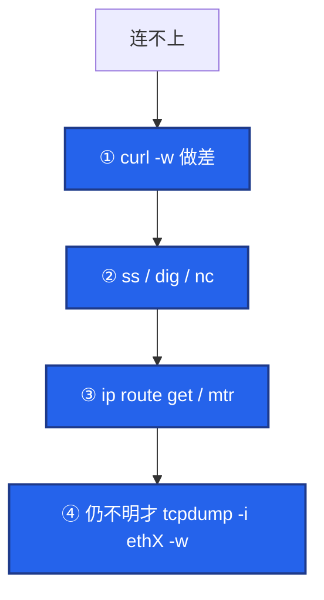
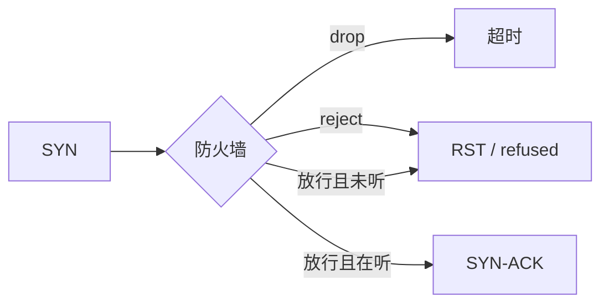

# 27｜网络排查命令 · 练习题

先对照 [知识点](知识点.md)：**§2 总图 + §4 命令分册 + §5 易混**，自己口述「定层 → 缩范围 → 留证」，再对答案。每题标了覆盖范围：

| 标记 | 含义 |
|------|------|
| **核心** | 不懂整章就没建立起来 |
| **必会** | 值班和面试都要能讲 |
| **常用** | 线上会反复碰到 |
| **常考** | 白板和追问的高频口径 |

## 本题目录

- [Q1 主线与翻车](#q1)
- [Q2 curl -w 做差](#q2)
- [Q3 ss Recv-Q](#q3)
- [Q4 ip route get](#q4)
- [Q5 ping 通 TCP 不通](#q5)
- [Q6 drop vs reject](#q6)
- [Q7 mtr 形态](#q7)
- [Q8 tcpdump 纪律](#q8)
- [Q9 大厅进房间不进](#q9)
- [Q10 dig + openssl](#q10)
- [Q11 场景 SOP 串讲](#q11)
- [合上书](#合上书)

---

## Q1

**★★★★★｜连不上第一刀敲什么？为什么禁止先 `tcpdump -i any`？**

**覆盖**：核心 · 必会 · 常考

**对应**：知识点 §2 · §5.3

### 场景

oncall：「现在连不上。」群里有人已经准备在战斗服敲 `tcpdump -i any` 打到终端。

### 完整解答

**一句话**：先 `curl -w` 做差定层，再 ss/dig/nc/route get；禁止裸 `tcpdump -i any`。

主线：**定层 → 缩范围 → 留证**。现场 80% 死在 DNS / TCP / TLS / 应用，轮不到抓包。



禁止裸 `-i any`：看不出网卡、多口聚合、流量爆炸撑死 SSH；正确姿势是 `route get` 定 `dev` 再抓。

### 再追问

- 长连接房间没有 HTTPS，第一刀？——确认房间 IP:port → `nc -zv` + `ss`，不是登录域名上 curl。见 §4.7、§6.4。

---

## Q2

**★★★★★｜对着这组 curl -w，做差并定责。**

**覆盖**：核心 · 必会 · 常考

**对应**：知识点 §4.2

### 场景

```text
dns:0.015 tcp:0.018 tls:0.090 ttfb:4.200 total:4.250 code:200
```

有人说「connect 才 18ms，肯定网络抖，让网络组查专线」。另有人说「total 4 秒就是公网慢」。

### 完整解答

**一句话**：做差后 tcp≈3ms、ttfb≈4.1s——路通了，锅在应用/DB，不是专线。

| 本段 | 计算 | 结果 |
|------|------|------|
| dns | 0.015 | 正常 |
| tcp | 0.018 − 0.015 | **≈3ms** |
| tls | 0.090 − 0.018 | ≈72ms |
| ttfb | 4.200 − 0.090 | **≈4.11s** |
| body | 4.250 − 4.200 | 很小 |

`time_connect` 是累计值，**含 DNS**；口播「connect 慢」前必须做差。

### 再追问

- `dns:1.5 tcp:1.51 …` 呢？——dns 本段 1.5s，先 dig → [15](../15-DNS与CDN/)，别查 TCP。
- 纯 HTTP 无 tls 字段，ttfb 本段怎么算？——`starttransfer − connect`。

---

## Q3

**★★★★☆｜ss 上 LISTEN Recv-Q=128/128 和 ESTAB Recv-Q=200000，分别怎么定责？**

**覆盖**：核心 · 必会

**对应**：知识点 §4.1（深排链 06）

### 场景

网关 `ss -lntp` 显示某端口 Recv-Q 顶着 Send-Q。另一台业务机大量 ESTAB 行 Recv-Q 几十万字节在涨。有人两个都要加大 `rmem`。

### 完整解答

**一句话**：LISTEN 的 Recv-Q 是未 accept **连接数**；ESTAB 的是未读 **字节**——加大 rmem 治不了前者。

| 状态 | Recv-Q | 定责 |
|------|--------|------|
| LISTEN | 未 accept 个数 / backlog | accept 慢或 backlog 小 → [12](../12-网络栈与Socket/) |
| ESTAB | 内核未读字节 | 应用没 `read` → 06 |

本章用 `ss` **看见**问题；机制与 backlog 参数在 06，不要在 27 展开调参百科。

### 再追问

- Send-Q 在 ESTAB 持续涨？——对端窗口或网络 → [13](../13-TCP与UDP/)，看 `ss -ti`。

---

## Q4

**★★★★★｜双网卡连 DB 超时，为什么必须 `ip route get` 而不是 `ip route show`？**

**覆盖**：核心 · 必会 · 常考

**对应**：知识点 §4.8 · §6.5

### 场景

```text
ip route show
default via 10.0.0.1 dev eth0 ...

ping 管理地址「通」。业务连 10.0.1.50:3306 timeout。
DB 白名单只放了 10.0.0.8（eth0）。
```

### 完整解答

**一句话**：`show` 是地图册，`get` 是 GPS；实际可能从 eth1 出、源 IP 不在白名单。

```bash
ip route get 10.0.1.50
# 10.0.1.50 via 10.0.2.1 dev eth1 src 10.0.2.88
```

| 字段 | 定责 |
|------|------|
| `dev eth1` | 抓包 `-i eth1`；别假定 eth0 |
| `src 10.0.2.88` | 白名单是否包含该源 |

ping「通」可能走了另一张卡或只测了 ICMP。策略路由时 `get` 还可能带 `table xxx`，`show` 主表看不见。

### 再追问

- 改完路由仍怪？——`ip route flush cache` 后再 `get`。深排策略路由 → [16](../16-网络排障与抓包/)。

---

## Q5

**★★★★★｜ping 通但 TCP 超时；ping 不通但 TCP 通——怎么解释？**

**覆盖**：核心 · 必会 · 常考

**对应**：知识点 §4.4 · §5.1

### 场景

安全组改过后，运维用 ping 验收「网络恢复」。开发说端口仍 timeout。另一台机 ICMP 全丢，但 `nc -zv` 443 成功。

### 完整解答

**一句话**：ping 测 ICMP；通≠TCP 通，不通≠TCP 不通。

| 组合 | 含义 |
|------|------|
| ping✓ TCP timeout | 墙 **drop** TCP，或只放 ICMP |
| ping✗ TCP✓ | ICMP 被禁，**正常** |
| 小 ping✓ 大包 `-M do -s 1472`✗ | 怀疑 PMTUD → 升级 [16](../16-网络排障与抓包/) |

验收业务口用 `nc -zv` / `curl -w`，不要只 ping。

### 再追问

- 默认 ping 为什么不能结案 MTU？——默认小包；大包探路见 §4.4，深复现见 11。

---

## Q6

**★★★★★｜安全组 drop 与 reject，客户端各看到什么？第一刀？**

**覆盖**：必会 · 常考

**对应**：知识点 §5.2

### 场景

两台机器访问同一端口：A 一直转圈最后 timeout；B 立刻 `Connection refused`。有人说都是「防火墙拦了」不做区分。

### 完整解答

**一句话**：drop→超时（石沉大海）；reject→立刻 RST/refused（门卫拒绝）。

| | drop | reject |
|--|------|--------|
| 感受 | timed out | refused |
| 第一刀 | nc/curl 确认 → route get / 抓 SYN 无回 | `ss -lntp` + 查 reject 规则 |



### 再追问

- 未监听且前无 reject，也可能 refused（内核 RST）。timeout 更偏向路径/drop/错源 IP。

---

## Q7

**★★★★☆｜mtr 第 2 跳 Loss% 30%，后面跳 0%——报光纤断吗？**

**覆盖**：必会 · 常用 · 常考

**对应**：知识点 §4.5

### 场景

跨省登录超时，有人贴 mtr：中间某跳 30% 丢，目的跳 0%。工单要开给专线。

### 完整解答

**一句话**：后面跳不丢 = 该跳限 ICMP，**不当**光纤断；后面同样丢才是真丢。

| 形态 | 结论 |
|------|------|
| 中间丢、后面不丢 | ICMP 限速 |
| 某跳起后面同样丢 | 真丢，从那跳查 |
| 全程 0 丢但 TCP 挂 | ICMP ≠ TCP 路径 → nc / 抓 TCP |

### 再追问

- 只有 RTT 在海外跳上台阶？——物理距离，配合 curl tcp 本段看，不等于丢包事故。

---

## Q8

**★★★★★｜写出一条生产合法的 tcpdump；指出三种违法写法。**

**覆盖**：核心 · 必会 · 常考

**对应**：知识点 §4.10 · §5.3

### 场景

活动高峰要抓登录超时。有人提议：`tcpdump -i any -A`。

### 完整解答

**一句话**：先 `route get` 定网卡，再 host/port + `-nn -c -w`。

```bash
ip route get 203.0.113.10
# … dev eth1 …

tcpdump -i eth1 host 203.0.113.10 and port 443 -nn -s0 -c 1000 -w /tmp/login.pcap
```

| 违法 | 为什么 |
|------|--------|
| `tcpdump -i any` 裸抓 | 聚合乱、撑死机 |
| `-A` 打 SSH 终端 | 自造事故 |
| 无 `-c` / 无过滤 | 打满盘、噪声淹没 |

纯 SYN 用 `tcp[tcpflags] = tcp-syn`；`& tcp-syn != 0` 会带 SYN-ACK。TSO/两端抓协议 → [16](../16-网络排障与抓包/)。

### 再追问

- 只要 RST？——`'tcp[tcpflags] & tcp-rst != 0' and host …`，看 **RST 源 IP**。

---

## Q9

**★★★★☆｜大厅能进、房间进不去，命令序怎么排？**

**覆盖**：必会 · 常用

**对应**：知识点 §4.7 · §6.4

### 场景

登录 HTTPS 正常（curl 五段好看）。进房间转圈。有人在登录域名上 tcpdump。

### 完整解答

**一句话**：大厅与房间是不同 IP/端口；抓登录域名等于白抓。

```text
1. 确认房间 IP + 端口
2. nc -zv 房间口
3. ss 看有无 ESTAB
4. tcpdump -i ethX host 房间IP and port 房间口 -nn -c -w
5. 已 ESTAB 仍卡 → ss -ti → 08
```

### 再追问

- curl -w 能定房间层吗？——常不能；房间多是长连接，改用 nc/ss/抓包。

---

## Q10

**★★★★☆｜dns 段高 vs tls 段高，分别敲什么？链哪章？**

**覆盖**：必会 · 常用

**对应**：知识点 §4.3 · §4.11

### 场景

两组输出：

```text
# A
dns:1.800 tcp:1.805 tls:1.880 ttfb:1.900 total:1.910 code:200

# B
dns:0.02 tcp:0.03 tls:2.80 ttfb:2.85 total:2.86 code:200
```

### 完整解答

**一句话**：A 先 dig（→10）；B 先 openssl s_client（→09）。

| 例 | 本段 | 命令 | 邻章 |
|----|------|------|------|
| A | dns≈1.8s | `dig +short`，对比公共 DNS | [15](../15-DNS与CDN/) |
| B | tls≈2.77s | `openssl s_client -servername …`，看链/日期 | [14](../14-HTTP与TLS/) |

两边 tcp 本段都只有几毫秒——别开专线工单。

### 再追问

- IP 直连证书名不对？——`s_client` / curl 必须带正确 SNI（`-servername`）。

---

## Q11

**★★★★★｜串讲：从电话到结案，60 秒命令模板 + 何时升级 11。**

**覆盖**：核心 · 必会 · 常考

**对应**：知识点 §2.1 · §6 · §7 · §8

### 场景

白板题：「讲一遍你值班网络排障的命令顺序，并说出什么情况要去翻 11 章。」

### 完整解答

**一句话**：做差定层 → 缩到 IP/端口/网卡 → 合法抓包；PMTUD/TSO/两端抓对不上才升级 11。

```bash
curl -o /dev/null -s -w 'dns:%{time_namelookup} tcp:%{time_connect} tls:%{time_appconnect} ttfb:%{time_starttransfer} total:%{time_total} code:%{http_code}\n' https://login.example.com
# 做差四次
dig +short login.example.com
nc -zv -w 3 "$IP" 443
ip route get "$IP"
ss -lntp | grep 443
# 仍不明：
tcpdump -i ethX host "$IP" and port 443 -nn -c 1000 -w /tmp/a.pcap
```

| 升级到 | 何时 |
|--------|------|
| **06** | LISTEN/ESTAB Recv-Q、backlog、conntrack 满 |
| **08** | 已 ESTAB，窗口/重传/`ss -ti` |
| **09** | TLS 语义、证书策略 |
| **10** | DNS 劫持深排 |
| **11** | PMTUD 深复现、TSO 假 checksum、NAT 后两端抓协议 |

### 再追问

- 新挂旧不挂优先想？——conntrack → 06/15，不是先重启战斗服。

---

## 合上书

与知识点「合上书」对齐，合上书先口述再对 §2 / §4 / §5 / §7：

1. 默画定层 → 缩范围 → 留证；翻车四件套？  
2. 给定一组 curl -w，做差并定责。  
3. 双网卡为何必须 `route get`？`dev`/`src` 各说明什么？  
4. ping 通 TCP 不通 / ping 不通 TCP 通？  
5. drop vs reject？  
6. 写一条合法 tcpdump；为何禁止裸 `-i any`？  
7. 大厅进、房间不进——命令序；何时去 06 / 08 / 11？

返回 [知识点](知识点.md)。
