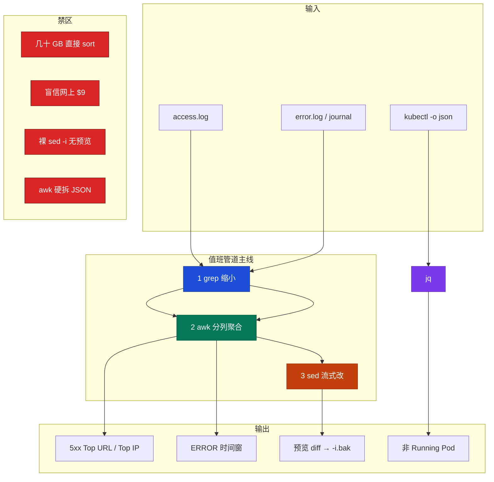
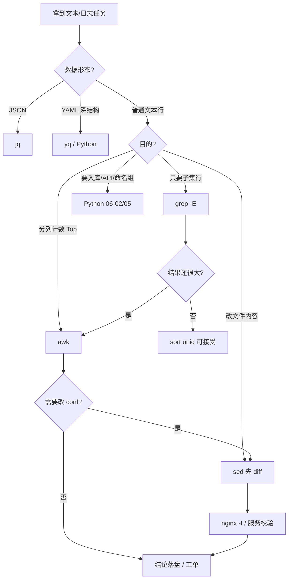

# 文本三剑客（grep / sed / awk）

> **这章解决什么**：活动高峰 5xx 暴涨，跳板机上有一份 5GB `access.log`；有人喊「先 sort 全量再 uniq」；有人 `sed -i` 改完 Nginx 配置才发现把端口里的 `100` 也改了；有人用 `$9` 当 status，统计永远是 0——**列号抄错、管道顺序反了、改文件没预览**。  
> **读法**：**先看总图（管道分工）** → **走读一次 5xx Top URL** → **再分节抠 grep / awk / sed** → **易混钉死 → 生产模板可复制**。  
> **刻意不展开**：BRE/ERE/PCRE/RE2 引擎百科、贪婪回溯证明、Python `re` 命名组 → [05-05 正则与文本处理](../../05-开发能力/05-正则与文本处理/)；Shell 脚本三开关 / 编排 → [05-01 Shell](../../05-开发能力/01-Shell/)；日志轮转 / 盘满 / 采集 → [23](../23-日志运维/)；Nginx 502/504/两列时间语义 → [19](../19-Nginx/)。

---

## 本章目录

1. [本章定位](#1-本章定位)
2. [先看总图：管道怎么分工](#2-先看总图管道怎么分工) ← **开篇必读**
   - [2.0 全章知识串图](#20-全章知识串图一张把细节串起来) ← **架构总览**
   - [2.3 完整走读：5GB access.log 找 5xx Top URL](#23-完整走读从-5gb-accesslog-找出-5xx-top-url)
3. [名词扫盲（对照总图认词）](#3-名词扫盲对照总图认词)
4. [grep 必会：缩小范围](#4-grep-必会缩小范围) ← **重点**
5. [awk 必会：分列与聚合](#5-awk-必会分列与聚合) ← **重点**
6. [sed 必会：流式改、先预览](#6-sed-必会流式改先预览) ← **重点**
7. [jq 轻提：JSON 别用 awk 硬拆](#7-jq-轻提json-别用-awk-硬拆)
8. [本章最易混：BRE/ERE · 贪婪 · 列号](#8-本章最易混breere--贪婪--列号) ← **重点精读**
9. [生产模板（可复制）](#9-生产模板可复制)
10. [踩坑清单](#10-踩坑清单)
11. [定责与选用树](#11-定责与选用树)
12. [去哪章继续学](#12-去哪章继续学)
13. [面试 · 易错 · 数字](#13-面试--易错--数字)
14. [合上书](#合上书)

---

## 1. 本章定位

| 章 | 负责 |
|----|------|
| **03（本章）** | 值班 **one-liner**：grep 缩小 → awk 聚合 → sed 改（先预览）；Nginx access / journal / error 的**列纪律**与可复制模板 |
| **05-05** | 正则引擎、贪婪/回溯、Python `re`、复杂命名组 |
| **06-01** | Shell 编排、`set -euo pipefail`、管道退出码 |
| **23** | 日志从哪来、轮转 reopen、盘满、采集 |
| **19** | Nginx 超时链、502/504/499 语义、`log_format` 该打什么字段 |
| **26 / 27** | 主机 / 网络排查**命令刀法**；本章只管「文本怎么切」 |

本章是**排查命令刀法线的文本段**。01/05 告诉你敲什么看主机和网络；本章告诉你对着几 GB 日志，**怎么不把跳板机打挂、怎么不把列号抄错**。

🎯 **值班签名**：大日志先 `grep` 缩小，再 `awk` 计数；**禁止几十 GB 直接 `sort`**；`sed -i` 前必须 `diff` 预览；列号以你们 `log_format` 为准，**别抄网上 `$9`**。

**本章主线（排障就按这三步想）：**

1. **对格式**：`head -1` + 对 `nginx.conf` 里 `log_format`，钉死 `$1` / status / URI 是第几列。  
2. **缩小再聚合**：`grep`（或时间窗）先滤 5xx / ERROR，再 `awk` 计数；中间结果能 `wc -l` 估量。  
3. **改文件先预览**：`sed` 不加 `-i` → `diff` → 确认再 `-i.bak`；多机改配置走 Ansible / Git，不裸 `ssh sed -i`。

**读完你能：**

- 合上书默画 §2.0：grep 缩小 → awk 聚合 → sed 改；jq 管 JSON。  
- 对着 5GB access.log，5 分钟内给出 5xx Top URL / Top IP，且不炸内存。  
- 口述 BRE vs ERE、为什么不能盲信 `$9`、为什么禁止全量 sort。  
- 从生产模板里抄一条改完就能用。

**本章不讲：**

| 想学什么 | 去哪 |
|----------|------|
| 正则引擎、回溯爆炸、Python re | [05-05](../../05-开发能力/05-正则与文本处理/) |
| 脚本头、管道失败、生产三开关 | [05-01](../../05-开发能力/01-Shell/) |
| 复杂统计入库、接 API | [05-02 Python](../../05-开发能力/02-Python运维/) |
| 日志平台 / rotate / 盘满 | [23](../23-日志运维/) |
| 502 语义、两列时间怎么读 | [19](../19-Nginx/) |
| 多机配置变更 | Ansible / Git（06-04），不是本章 |

---

## 2. 先看总图：管道怎么分工

> **正确开篇顺序**：先有全局画面，再认词，再抠细节。  
> 先看 **§2.0 全章串图**，再用 **§2.3 走读**把一次 5xx 排障串起来。

### 2.0 全章知识串图（一张把细节串起来）

> 🎯 **合上书要能默画这张。** 蓝=缩小 · 绿=聚合 · 橙=改写 · 紫=JSON · 红=禁区。  
> 若预览仍报错，以下面 **ASCII 一页板** 为准。



**ASCII 一页板（兜底）：**

```text
┌─ 输入 ──────────────────────────────────────────────────┐
│  access.log / error.log / journalctl / kubectl JSON      │
└──────────────────────────────────────────────────────────┘
         │
┌─ ① grep 缩小 ───────────────────────────────────────────┐
│  5xx · ERROR · 时间关键字 · -E 生产默认 · -o 抽片段      │
└──────────────────────────────────────────────────────────┘
         │
┌─ ② awk 聚合 ────────────────────────────────────────────┐
│  先 head -1 对列号 · $1 IP · status/URI 以 log_format 为准│
│  计数用关联数组 · 时间窗用 substr · 别把 $NF 当 RT       │
└──────────────────────────────────────────────────────────┘
         │
┌─ ③ sed 改写 ────────────────────────────────────────────┐
│  不加 -i → diff 预览 → -i.bak · 多机走 Ansible           │
└──────────────────────────────────────────────────────────┘
         │
┌─ JSON 旁路：jq ─────────────────────────────────────────┐
│  kubectl / 结构化日志行 · 禁止 awk 按空格拆 {            │
└──────────────────────────────────────────────────────────┘

禁区：几十 GB 直接 sort · 盲信 $9 · 裸 sed -i · awk 拆 JSON
```

**读图三句话：**

1. **grep 只负责缩小**，不负责「排行榜」；排行榜是 awk（或缩小后再 `sort | uniq -c`）。  
2. **列号是合同**：同一套 `log_format` 全公司对齐；换格式就换 `$N`。  
3. **sed 是手术刀不是 Ansible**：先预览再落盘；改 100 台走配置管理。

### 2.1 为什么是「管道」而不是「一条万能正则」

**一句话：** 大文件上，过滤与聚合拆开，中间结果可估量、可 `head` 验；一条巨正则既难 debug，又容易回溯炸 CPU。

值班常见反模式：

| 反模式 | 现场症状 | 正解 |
|--------|----------|------|
| 5GB 直接 `sort \| uniq -c` | 跳板机 swap、ssh 卡死 | 先 grep 出 5xx（往往只剩 MB 级）再 sort |
| 一条 `.*5[0-9]{2}.*` 抽一切 | 误匹配 UA / referer | 对列：`$status` 那一列，或精确字段正则 |
| `sed -i` 改完才 `nginx -t` | 配置挂、reload 失败 | 先 sed 预览 + `-t`，再 `-i.bak` |
| 网上抄 `$9` | 统计全 0 或全是 `-` | `head -1` + 对 conf |

> **记住**：管道是**可中断的诊断链**，不是炫技。每一步都要能 `wc -l` / `head` 解释「现在剩多少」。

### 2.2 和邻章怎么咬合

```text
告警 / 客服喊 5xx
    │
    ├─→ 19 Nginx：502/504/499 语义、upstream、两列时间
    ├─→ 23 日志：文件还在不在、有没有被 rotate 切走、盘满没
    ├─→ 03 本章：对着现有日志，5 分钟出 Top URL / Top IP
    └─→ 12-05：要写可入库脚本、命名组、复杂正则再下去
```

本章产出的是**证据**：哪条 URI、哪个 IP、哪个小时。根因解释（上游挂了？限流？）回 23 / 09 / 21。

---

### 2.3 完整走读：从 5GB access.log 找出 5xx Top URL

> 🎯 **这一节合上书要能自己复述。** 场景固定：活动第一小时，大厅反代机 `access.log` 约 5GB，群里有人已经在跑全量 sort。

#### 现场画面

oncall：「登录 502 很多，先看哪个 URL。」  
跳板机 `df` 还行，但内存只有 8G。有人贴：

```bash
# ❌ 反模式：5GB 全量进 sort
awk '{print $7}' access.log | sort | uniq -c | sort -rn | head
```

#### 正确走读（编号步骤）

**步骤 0 — 对格式（30 秒）**

```bash
head -1 /var/log/nginx/access.log
grep -n log_format /etc/nginx/nginx.conf
# 或
nginx -T 2>/dev/null | grep -A5 'log_format'
```

假设你们是常见 **combined 变体**（本章后文模板默认这套；**你们线上以 conf 为准**）：

```text
$1  remote_addr
$4  [time_local   （注意带 [ ）
$5  +0800]
$6  "METHOD
$7  URI
$8  HTTP/x.x"
$9  status
```

示例一行：

```text
203.0.113.8 - - [30/Aug/2026:20:01:12 +0800] "GET /api/login HTTP/1.1" 502 568 "-" "okhttp/4.9" rt=0.003 urt=-
```

对一下：`$7=/api/login`，`$9=502`。若你们把 `rt=` 插在中间，列号会漂——**先 `awk '{print $7,$9}' | head` 肉眼确认**。

**步骤 1 — 估量与缩小（先看 5xx 有多少行）**

```bash
# 生产默认 -E；大文件直接给文件名，别 cat | grep
grep -E '" 5[0-9][0-9] ' /var/log/nginx/access.log | wc -l
```

```text
184203
```

解读：约 18 万行 5xx。相对 5GB 全量，已经小一个数量级以上；**这一步决定后面能不能 sort**。

若你们 status 不在引号后空格这种形态，改用 awk 条件（对过列号后）：

```bash
awk '$9 ~ /^5[0-9][0-9]$/' /var/log/nginx/access.log | wc -l
```

**步骤 2 — 聚合 Top URL（在缩小后的流上）**

```bash
grep -E '" 5[0-9][0-9] ' /var/log/nginx/access.log \
  | awk '{print $7}' \
  | sort | uniq -c | sort -rn | head -20
```

或纯 awk（少一次管道进程，大文件略省）：

```bash
awk '$9 ~ /^5[0-9][0-9]$/ {c[$7]++}
     END {for (u in c) print c[u], u}' /var/log/nginx/access.log \
  | sort -rn | head -20
```

```text
  82104 /api/login
  41022 /api/role/list
  12011 /gateway/health
   8901 /api/mail/pull
   ...
```

**步骤 3 — 交叉验证：是扫号还是上游挂**

```bash
# 同一批 5xx 的 Top IP
awk '$9 ~ /^5[0-9][0-9]$/ {c[$1]++}
     END {for (ip in c) print c[ip], ip}' /var/log/nginx/access.log \
  | sort -rn | head -10
```

```text
  12044 203.0.113.8
   3012 198.51.100.22
   2881 198.51.100.23
  ...
```

解读口径（细节回 23）：

| 现象 | 更像 |
|------|------|
| Top URL 高度集中 + Top IP 分散 | 上游/接口挂，大家一起撞 |
| Top IP 高度集中 + URL 扫路径 | 扫号 / 爬虫 / 单出口 NAT 误伤 |
| `/gateway/health` 大量 502 | 探活打到挂掉的 upstream |

**步骤 4 — 时间窗（可选）：只看最近一小时**

combined 的 `$4` 形如 `[30/Aug/2026:20:01:12`，小时在 `substr($4,14,2)`（**先 head 对位置**）：

```bash
awk '$9 ~ /^5/ {
       h=substr($4,14,2)
       if (h=="20") c[$7]++
     }
     END {for (u in c) print c[u], u}' /var/log/nginx/access.log \
  | sort -rn | head
```

跨天文件不要只用小时当 key，要带日期，见 §8.3。

**步骤 5 — 把结论留证，别只活在群聊**

```bash
# 结论落文件，方便贴工单 / Runbook
awk '$9 ~ /^5[0-9][0-9]$/ {c[$7]++}
     END {for (u in c) print c[u], u}' /var/log/nginx/access.log \
  | sort -rn | head -20 > /tmp/5xx-top-url-$(date +%H%M).txt
```

one-liner 是排障，**变更与结论进 Git / 工单**（06-01）。

#### 走读小结（钉死）

```text
对列号 → grep/awk 缩小 5xx → 再聚合 Top → Top IP 交叉 → 时间窗可选 → 结论落盘
禁止：5GB 全量 sort；禁止：没对 log_format 就抄 $9；禁止：Top IP 直接 iptables 封（要走变更）
```

---

## 3. 名词扫盲（对照总图认词）

每个词先想「值班什么时候碰到」，再记定义。

| 名词 | 值班里什么时候碰到 | 一句话 |
|------|-------------------|--------|
| **BRE** | 裸 `grep 'a+'` 匹配不到 | 基本正则；`+ ( ) { }` 要加 `\` |
| **ERE** | 生产 `grep -E` | 扩展正则；`+ ( ) { }` 直接用 |
| **字段 / `$N`** | awk 统计全错 | 空白（或 `-F`）切开后的第 N 列 |
| **`$NF`** | 有人当 request_time | **最后一列**；combined 里常是 UA 碎片或自定义尾字段 |
| **`NR` / `FNR`** | 跳过表头、多文件 | 已读行号；多文件时 FNR 是当前文件行号 |
| **关联数组** | Top N、状态码分布 | awk 的 `c[key]++`，END 再打印 |
| **管道缩小** | 大文件 sort 前 | 先过滤再排序，降低峰值内存 |
| **预览 / dry-run** | 改 conf 前 | sed 不加 `-i`，和原文件 `diff` |
| **log_format 合同** | 跨机统计对不齐 | 列语义以 conf 为准，不是「行业惯例」 |
| **jq** | `kubectl -o json` | JSON 专用过滤器；懂层级 |

> **记住**：BRE / 列号 / 预览——三剑客面试三件套；细节引擎对比见 [05-05](../../05-开发能力/05-正则与文本处理/)。

### 3.1 三剑客分工对照

| 工具 | 一句话职责 | 典型输入 | 典型输出 |
|------|------------|----------|----------|
| **grep** | 行级过滤 / 抽匹配片段 | 大日志、conf、journal | 子集行、`-o` 片段 |
| **awk** | 分列、条件、计数、简单计算 | 已缩小或中等日志 | Top N、分布、报表 |
| **sed** | 流式替换、删行、地址范围 | conf、模板、小中型文本 | 改写后的流 / 文件 |
| **jq**（旁路） | JSON 路径与 select | kubectl JSON、JSON 行日志 | 字段表、过滤列表 |

### 3.2 什么时候不该用三剑客

| 场景 | 别硬上 | 改用 |
|------|--------|------|
| 嵌套 JSON / CRD | awk 按空格 | **jq** |
| 多行 YAML 审计镜像 | grep `image:` | **yq** / Python `safe_load`（05-05） |
| 要入库、要命名组、要接 API | 十层管道 | **Python**（06-02） |
| 改 100 台 conf | 循环 `ssh sed -i` | **Ansible / GitOps** |
| 日志在 ES/Loki | 跳板机拖 50GB | 平台查询（22）；本机只做抽样 |

---

## 4. grep 必会：缩小范围

**一句话：** grep 是漏斗入口；生产写 `-E`，大文件直接跟文件名，先缩小再交给 awk。

### 4.1 生产默认姿势

```bash
# ✅ 推荐
grep -E 'pattern' file.log

# ❌ 少用：多一个 cat 进程，大文件浪费
cat file.log | grep -E 'pattern'

# 只要匹配片段（抽 IP、抽 request_id）
grep -oE '([0-9]{1,3}\.){3}[0-9]{1,3}' access.log | head

# 反向：去掉注释和空行
grep -vE '^\s*(#|$)' nginx.conf

# 多模式
grep -E 'ERROR|WARN|FATAL' app.log

# 递归（注意别在超大目录裸跑）
grep -RInE 'TODO|FIXME' /etc/nginx/
```

| 选项 | 何时用 | 注意 |
|------|--------|------|
| `-E` | **生产默认** | 笔试默认是 BRE，别混 |
| `-F` | 固定字符串（含很多元字符） | 把 `.*` 当字面量 |
| `-i` | 大小写不敏感 | ERROR/error 混写日志 |
| `-n` | 要行号 | 改 conf 定位 |
| `-c` | 只数匹配行 | 快速估量 |
| `-o` | 只输出匹配部分 | 抽 IP / UUID |
| `-v` | 反向 | 去注释 |
| `-r` / `-R` | 目录 | 先缩路径，别扫整个 `/` |
| `--include='*.log'` | 限制扩展名 | 配合 `-R` |

### 4.2 Nginx access：5xx / 某 URI / 某 IP

> 下列正则假设 status 出现在 `"HTTP/x.x" 502` 这种形态；**最终以你们行格式为准**。

```bash
# 5xx 行（combined 常见）
grep -E '" 5[0-9][0-9] ' access.log

# 某 URI（注意 URI 在引号请求行里）
grep -E '"GET /api/login |'POST /api/login ' access.log
# 或更宽：
grep -F '/api/login' access.log | grep -E '" 5[0-9][0-9] '

# 某客户端 IP（行首）
grep -E '^203\.0\.113\.8 ' access.log

# 同时要 499（客户端取消，常见于超时）——语义见 19
grep -E '" 499 ' access.log | awk '{print $7}' | sort | uniq -c | sort -rn | head
```

### 4.3 error.log / journal

```bash
# Nginx error：上游关键字
grep -iE 'upstream timed out|connect\(\) failed|refused|no live upstreams' \
  /var/log/nginx/error.log | tail -50

# journal：某 unit 最近 ERROR（时间窗用 journalctl，不要靠 grep 全盘历史）
journalctl -u nginx -since '20 min ago' --no-pager | grep -iE 'error|fail|timed out'

# 系统 messages 里扫 OOM（机制回 04）
grep -iE 'killed process|out of memory' /var/log/messages | tail
```

> **别混**：`journalctl` 负责**时间窗与 unit**；grep 负责在已缩小的输出里再滤关键字。不要 `journalctl` 无 since 灌几年再 grep。

### 4.4 输出解读：匹配数为 0 时先查什么

```bash
grep -cE '" 5[0-9][0-9] ' access.log
# 0
```

排查顺序：

1. **文件是不是空的 / 切走了**：`ls -lh`；rotate 后看 `.1` / 日期后缀（22）。  
2. **正则是不是 BRE 坑**：`+` 没 `-E`。  
3. **格式是不是变了**：`head -1`，status 是否还在引号后。  
4. **是不是在错误的机器**：反代 vs 逻辑服；日志路径是否在容器内。

### 4.5 面试怎么说（grep）

「grep 负责缩小范围，生产一律 `-E`；大文件直接 `grep pat file`，禁止无脑 `cat \| grep`；5xx 先 `grep -c` 估量，再交给 awk 做 Top。」

---

## 5. awk 必会：分列与聚合

**一句话：** awk 按分隔符切列；**列号以 `log_format` 为合同**；关联数组做计数，END 再输出。

### 5.1 最小语法（只记值班要用的）

```bash
awk '条件 {动作} END {收尾}' file

# 内置
# $0 整行  $1..$NF 字段  NF 字段数  NR 行号
# FS 输入分隔  OFS 输出分隔
```

```bash
# 打印指定列（先对列！）
awk '{print $1, $7, $9}' access.log | head

# 条件
awk '$9 >= 500 {print $0}' access.log | tail

# 改分隔符（CSV / 自定义）
awk -F: '{print $1, $3}' /etc/passwd | head

# 自定义输出分隔
awk -v OFS='\t' '{print $1, $9}' access.log | head
```

### 5.2 先对列：一套「验列」仪式

每次换环境、换 `log_format`，先跑：

```bash
head -1 access.log
awk '{for(i=1;i<=NF;i++) printf "$%d=[%s]\n", i, $i}' access.log | head -40
```

```text
$1=[203.0.113.8]
$2=[-]
$3=[-]
$4=[[30/Aug/2026:20:01:12]
$5=[+0800]]
$6=["GET]
$7=[/api/login]
$8=[HTTP/1.1"]
$9=[502]
...
```

> **记住**：有人把 request 整段当一列（引号策略/FS 不同），`$7` 就不是 URI。验列输出是唯一真相。

### 5.3 状态码分布 / Top IP / Top URL

```bash
# 状态码分布
awk '{c[$9]++} END {for (s in c) print c[s], s}' access.log | sort -rn

# Top IP（全量请求）
awk '{c[$1]++} END {for (ip in c) print c[ip], ip}' access.log \
  | sort -rn | head -20

# 5xx Top URL（推荐）
awk '$9 ~ /^5[0-9][0-9]$/ {c[$7]++}
     END {for (u in c) print c[u], u}' access.log \
  | sort -rn | head -20

# 4xx/5xx 一起看某 path
awk '$7 ~ /^\/api\/login/ {c[$9]++}
     END {for (s in c) print c[s], s}' access.log | sort -rn
```

```text
1523401 200
 184203 502
  42011 499
  12004 504
  8012 301
```

### 5.4 时间窗：每小时 QPS / 某小时 5xx

combined `$4` 示例：`[30/Aug/2026:20:01:12`

| 片段 | substr 示意（先核对） |
|------|------------------------|
| 日 | `substr($4,2,2)` → `30` |
| 时 | `substr($4,14,2)` → `20` |
| 分 | `substr($4,17,2)` → `01` |

```bash
# 每小时请求量（单日文件）
awk '{
  h=substr($4,14,2)
  c[h]++
}
END {for (h in c) print h, c[h]}' access.log | sort

# 跨天：key 带日期
awk '{
  d=substr($4,2,11)          # 30/Aug/2026
  h=substr($4,14,2)
  c[d" "h]++
}
END {for (k in c) print c[k], k}' access.log | sort -k2
```

```text
10 15234
11 18902
12 22100
20 88012
```

### 5.5 request_time / upstream_response_time

若 `log_format` 把时间打在行尾 `rt=0.045 urt=0.042`（见 19 推荐格式），**不要假设固定 `$NF`**：

```bash
# 用 match / substr 抽 rt= 更稳（示意）
awk '{
  if (match($0, /rt=([0-9.]+)/, m)) {
    rt=m[1]+0
    if (rt > 1) slow++
  }
}
END {print "slow>1s", slow+0}' access.log
```

若你们确认 `rt` 总在倒数第二字段且无空格：

```bash
# 仅当格式钉死才能用；否则回上面的 match
awk '{
  split($(NF-1), a, "="); split($NF, b, "=")
  print $9, a[2], b[2]
}' access.log | head
```

```text
499 3.512 3.498
504 30.001 29.998
200 0.045 0.042
502 0.002 -
```

解读：504 且 urt≈30 → 上游读超时；502 且 urt=`-` → 没连上 upstream（19）。

### 5.6 多文件、跳过坏行

```bash
# 多个切分日志
awk '$9 ~ /^5/ {c[$7]++} END {for (u in c) print c[u], u}' access.log access.log.1

# 跳过空行、字段过少的坏行
awk 'NF < 9 {bad++; next}
     {c[$9]++}
     END {
       for (s in c) print c[s], s
       print "bad_lines", bad+0 > "/dev/stderr"
     }' access.log
```

### 5.7 面试怎么说（awk）

「awk 做分列和计数；上线前 `head -1` 对 `log_format`；Top N 用关联数组；跨天小时统计 key 要带日期；JSON 不归 awk。」

---

## 6. sed 必会：流式改、先预览

**一句话：** sed 改流；**永远先不加 `-i` 做 diff**；确认后 `-i.bak`；多机不靠裸 sed。

### 6.1 预览仪式（写进肌肉记忆）

```bash
# 1) 预览：stdout 是改后内容
sed 's/max_connections=100/max_connections=500/' my.cnf | diff -u my.cnf -

# 2) 确认差异只有预期一行
# 3) 落盘并留备份
sed -i.bak 's/max_connections=100/max_connections=500/' my.cnf

# 4) 服务侧再验（Nginx 例）
nginx -t && nginx -s reload
```

```text
--- my.cnf
+++ -
@@ -1,3 +1,3 @@
 [mysqld]
-max_connections=100
+max_connections=500
 port=3306
```

> **别混**：`diff` 里 `-` 是原文件，`+` 是 sed 输出。看反了会以为「改回去了」。

### 6.2 替换、分隔符、全局

```bash
# 路径含 / 时换分隔符，少转义
sed 's|/var/log/nginx|/data/nginx/logs|g' nginx.conf

# 只改匹配行里的第一次（默认） vs 全局 g
sed 's/worker_connections 1024/worker_connections 10240/' nginx.conf

# 删除匹配行
sed '/^\s*#/d' nginx.conf          # 删注释行（预览！）
sed '/^$/d' file                   # 删空行

# 地址范围：只改 server 块示意（复杂块更建议编辑器/模板）
sed '/server_name example.com/,/}/ s/listen 80/listen 8080/' nginx.conf
```

### 6.3 macOS vs Linux 的 `-i`

| 平台 | 写法 |
|------|------|
| GNU sed（多数 Linux） | `sed -i.bak 's/a/b/' file` 或 `sed -i 's/a/b/' file` |
| BSD sed（macOS） | `sed -i '' 's/a/b/' file` 或 `sed -i.bak 's/a/b/' file` |

跳板机若是 Mac，`-i` 后少参数会把下一个词当备份后缀文件名——**预览习惯能救命**。

### 6.4 常见值班替换

```bash
# 临时把探活 upstream 摘掉前：先预览
sed 's/server 10.0.1.20:8080/# server 10.0.1.20:8080/' upstream.conf | diff -u upstream.conf -

# 模板渲染（一次性）
sed -e 's/{{DB_HOST}}/192.168.1.100/g' \
    -e 's/{{DB_PORT}}/3306/g' template.conf > production.conf
```

### 6.5 什么时候禁止 sed

| 场景 | 原因 | 改用 |
|------|------|------|
| 改 100 台生产 conf | 不可复现、无审计 | Ansible / GitOps |
| YAML/JSON 结构化字段 | 缩进与转义易毁文件 | yq / jq |
| 需要条件分支、校验 | sed 表达力不够 | Python / 正式工具 |
| 正则极复杂、跨行 | 难维护 | 05-05 / 编辑器 |

### 6.6 面试怎么说（sed）

「sed 是流式替换；生产先 `sed ... \| diff -u file -`，再 `-i.bak`；路径用 `s|||`；多机变更不走裸 sed。」

---

## 7. jq 轻提：JSON 别用 awk 硬拆

**一句话：** JSON 有层级，用 jq；awk 按空白切会把 `{` 和键名拆散。深挖与陷阱见 [05-05](../../05-开发能力/05-正则与文本处理/)。

### 7.1 值班够用的几条

```bash
# 非 Running Pod
kubectl get pods -A -o json \
  | jq -r '.items[]
      | select(.status.phase != "Running")
      | "\(.metadata.namespace)/\(.metadata.name) \(.status.phase)"'

# 所有容器镜像
kubectl get pods -A -o json \
  | jq -r '.items[].spec.containers[].image' | sort -u

# JSON 行日志：抽 level=error
cat app.jsonl | jq -c 'select(.level=="error")' | head

# 安全取字段（缺字段不炸）
echo '{"a":1}' | jq -r '.b // "missing"'
```

```text
default/login-7d8f9c-abc12 CrashLoopBackOff
game-room/room-0 Pending
```

### 7.2 和三剑客的边界

| 数据 | 用 |
|------|----|
| Nginx combined 文本行 | grep / awk |
| `kubectl -o json` / CRD | **jq** |
| 一行一个 JSON 的业务日志 | jq；要复杂入库 → Python |
| 半结构化「像 JSON 又不完整」 | 先抽样 `head`，再决定修采集（22）还是脚本容错（06-02） |

> **记住**：宽表 `kubectl get pods` 会截断镜像名；要完整字段必须 `-o json` + jq。

---

## 8. 本章最易混：BRE/ERE · 贪婪 · 列号

> 🎯 **全章最易晕的三点钉死在这里。** 引擎百科与回溯证明不展开，见 [05-05 §原理](../../05-开发能力/05-正则与文本处理/)。

### 8.1 BRE vs ERE（一例钉死）

**① 例子：** 你想匹配 `error`、`errorr`（一个或多个 `r`）。

```bash
grep 'error+' app.log      # BRE：+ 是字面量 → 常匹配不到
grep -E 'error+' app.log   # ERE：一个或多个 r → 符合预期
grep -E 'err(or)+' app.log # 分组也不必写成 \(\)
```

**② 一句话定义：** grep **默认 BRE**；生产 one-liner **写 `-E`**。

**③ 怎么认：** 笔试问默认 → BRE；你线上脚本扫一遍有没有裸 `grep 'a+'`。

**④ 易错钉死：** `grep -P`（PCRE）不是所有发行版都有；能 `-E` 解决的别依赖 `-P`。

| 想写的意思 | BRE | ERE（`-E`） |
|------------|-----|-------------|
| 一个或多个 | `\+` | `+` |
| 分组 | `\(...\)` | `(...)` |
| 或 | 用 `\|` 或 `-e` | `a\|b` |
| 次数 | `\{1,3\}` | `{1,3}` |

### 8.2 贪婪 `.*`（一例钉死）

**① 例子：** 从 `"GET /a/b?x=1 HTTP/1.1"` 里抽路径，用 `".*" ` 会吃到**最后一个**引号相关边界，中间糊成一团。

**② 一句话：** `.*` 能吃多远吃多远；抽引号内字段用 `[^"]*`。

```bash
# 更稳：字符类
grep -oE '"[^"]*"' access.log | head

# 抽 IP：用明确字符类，别 \d+.\d+.（. 匹配任意字符）
grep -oE '([0-9]{1,3}\.){3}[0-9]{1,3}' access.log | head
```

**③ 回溯爆炸**（知道即可）：嵌套量词 `(.+)+` 遇畸形行可 CPU 100%——生产过滤用字符类与长度限制；原理 → 12-05。

**④ 易错钉死：** 「正则越万能越好」是错的；值班正则要**窄、可估、可 head 验**。

### 8.3 列号漂移（一例钉死）

**① 例子：** 网上博客写 `$9` 是 status；你们 `log_format` 在 request 后多了 `$host`，status 变成 `$10`，结果：

```bash
awk '$9 ~ /^5/ {c++} END {print c+0}' access.log
# 0
```

**② 一句话：** **列号不是国际标准，是你们 conf 的合同。**

**③ 怎么认：**

```bash
head -1 access.log
nginx -T 2>/dev/null | grep -A6 'log_format'
awk '{print "$7="$7, "$8="$8, "$9="$9, "$10="$10}' access.log | head
```

**④ 易错钉死：**

| 错法 | 真相 |
|------|------|
| `$NF` 当 request_time | 经常是 UA 或 `-` |
| 只 `substr($4,14,2)` 跨天 | 两天的 10 点加在一起 |
| 复制别的业务线脚本 | 先对新环境验列 |
| 有人改了 log_format 没改统计 | 监控假绿——改格式要同步看板与 one-liner |

### 8.4 三张易混对照表

**工具选型：**

| 你想… | 选 | 别选 |
|-------|----|------|
| 从 10GB 里留下 ERROR | grep | 先 sort |
| 按列计数 Top N | awk | 纯 sed |
| 改 conf 一个值 | sed + diff | 立刻 `-i` |
| 抽 Pod 字段 | jq | awk |
| 复杂入库统计 | Python | 20 层管道 |

**sort 纪律：**

| 数据规模 | 做法 |
|----------|------|
| 已缩小到万～百万行 | `sort \| uniq -c` 可接受 |
| 仍有数 GB | 优先 awk 关联数组一次扫描；或先按时间/`split` 切 |
| 几十 GB 全量 | **禁止** 跳板机全量 sort；上抽样 / 平台 / 按文件分治 |

**sed vs 配置管理：**

| | sed one-liner | Ansible/Git |
|--|---------------|-------------|
| 适用 | 单机急救、预览后改一处 | 多机、可回滚、要审计 |
| 证据 | 终端历史易丢 | PR / change ticket |
| 面试口径 | 能救命 | 能上岗 |

---

## 9. 生产模板（可复制）

> 下列默认 combined 变体列号：`$1` IP · `$7` URI · `$9` status · `$4` 时间。  
> **复制前先跑 §5.2 验列。** 不对就改 `$N`。

### 9.1 Nginx access

```bash
# --- 验列 ---
head -1 /var/log/nginx/access.log
awk '{print $1,$7,$9}' /var/log/nginx/access.log | head

# --- 5xx 行数 ---
awk '$9 ~ /^5[0-9][0-9]$/' /var/log/nginx/access.log | wc -l

# --- 5xx Top URL ---
awk '$9 ~ /^5[0-9][0-9]$/ {c[$7]++}
     END {for (u in c) print c[u], u}' /var/log/nginx/access.log \
  | sort -rn | head -20

# --- 5xx Top IP ---
awk '$9 ~ /^5[0-9][0-9]$/ {c[$1]++}
     END {for (ip in c) print c[ip], ip}' /var/log/nginx/access.log \
  | sort -rn | head -20

# --- 状态码分布 ---
awk '{c[$9]++} END {for (s in c) print c[s], s}' /var/log/nginx/access.log \
  | sort -rn

# --- 某 URI 的状态分布 ---
awk '$7 == "/api/login" {c[$9]++}
     END {for (s in c) print c[s], s}' /var/log/nginx/access.log | sort -rn

# --- 每小时 QPS（单日）---
awk '{h=substr($4,14,2); c[h]++}
     END {for (h in c) print h, c[h]}' /var/log/nginx/access.log | sort

# --- 499 Top URL（客户端取消，常与超时相关，语义见 19）---
awk '$9 == 499 {c[$7]++}
     END {for (u in c) print c[u], u}' /var/log/nginx/access.log \
  | sort -rn | head

# --- 先 grep 再聚合（内存更稳的写法）---
grep -E '" 5[0-9][0-9] ' /var/log/nginx/access.log \
  | awk '{print $7}' | sort | uniq -c | sort -rn | head -20
```

### 9.2 Nginx error.log

```bash
grep -iE 'upstream timed out|connect\(\) failed|Connection refused|no live upstreams' \
  /var/log/nginx/error.log \
  | tail -100

# 按 upstream 主机粗聚合（格式因版本而异，先 head）
grep -oE 'upstream: "[^"]+"' /var/log/nginx/error.log \
  | sort | uniq -c | sort -rn | head
```

### 9.3 journalctl

```bash
# 某服务近 30 分钟 ERROR
journalctl -u myapp -p err -since '30 min ago' --no-pager

# 再滤关键字
journalctl -u myapp -since '30 min ago' --no-pager \
  | grep -iE 'timeout|panic|oom|refused'

# 导出后交给 awk（注意 journal 不是 combined）
journalctl -u myapp -since today --no-pager > /tmp/myapp.jlog
grep -cE 'ERROR|Error' /tmp/myapp.jlog
```

### 9.4 应用文本日志（示意）

```bash
# 级别
grep -E '\[(ERROR|FATAL)\]' app.log | tail -50

# 抽 request_id / trace_id（按你们格式改）
grep -oE 'trace_id=[A-Za-z0-9-]+' app.log | sort | uniq -c | sort -rn | head

# 某玩家（别把敏感信息贴到公群）
grep -F 'player_id=10086' app.log | tail -20
```

### 9.5 sed 改配置（带预览）

```bash
CONF=/etc/nginx/nginx.conf

# 预览
sed 's/worker_connections 1024/worker_connections 10240/' "$CONF" | diff -u "$CONF" -

# 落盘
sed -i.bak 's/worker_connections 1024/worker_connections 10240/' "$CONF"
nginx -t && systemctl reload nginx
```

### 9.6 jq 旁路

```bash
kubectl get pods -A -o json \
  | jq -r '.items[]
      | select(.status.phase != "Running")
      | "\(.metadata.namespace)/\(.metadata.name)\t\(.status.phase)"'

kubectl get pods -A -o json \
  | jq -r '.items[]
      | select(.status.containerStatuses != null)
      | select(.status.containerStatuses[].restartCount > 0)
      | .metadata.name' | sort -u
```

### 9.7 「安全抽样」大文件

```bash
# 只看尾部最近写入（活动正在发生时）
tail -n 500000 /var/log/nginx/access.log \
  | awk '$9 ~ /^5/ {c[$7]++} END {for (u in c) print c[u], u}' \
  | sort -rn | head

# 随机抽样估分布（粗看，不做法证）
awk 'NR%50==0 && $9 ~ /^5/ {c[$7]++}
     END {for (u in c) print c[u], u}' /var/log/nginx/access.log \
  | sort -rn | head
```

> **记住**：抽样能指路，**定责与工单尽量用完整时间窗的缩小结果**；活动追责别只靠 `NR%50`。

---

## 10. 踩坑清单

| 现象 | 原因 | 修法 |
|------|------|------|
| `grep 'a+'` 无匹配 | BRE 下 `+` 字面量 | `grep -E` |
| 5xx 统计恒为 0 | `$9` 不是 status | 验列 + 对 log_format |
| 跳板机卡死 / OOM | 几十 GB 直接 sort | 先 grep/awk 条件缩小 |
| `sed -i` 改崩端口 | `s/100/500/g` 过宽 | 匹配完整键；先 diff |
| macOS sed 怪文件名 | `-i` 语法差异 | `-i.bak` 或 `-i ''` |
| Top IP 直接封禁 | 出口 NAT / 误伤整栋 | 只当线索；变更单 + 限流（19） |
| `$NF` 当 RT | UA / 自定义字段 | match `rt=` 或钉死格式 |
| 跨天小时图双峰错位 | key 只有小时 | key 带日期 |
| `cat \| grep` 很慢 | 多余进程 + 缓冲 | `grep pat file` |
| jq 空、awk 乱 | 对 JSON 用了 awk | 换 jq |
| 管道脚本 Cron 假绿 | 中间 grep 失败被吞 | `set -o pipefail`（06-01） |
| 改完 conf 服务挂 | 没 `nginx -t` | 预览 → `-t` → reload |
| 统计与监控不一致 | log_format 改了脚本没改 | 格式变更当配置变更一起发 |
| 在错误主机查日志 | 反代 / 逻辑服 / 容器路径 | 先确认文件 `ls -lh`、时间戳 |
| `grep -R /` | 扫挂系统 | 缩到目录 + `--include` |

### 10.1 事故级反模式（禁止）

```bash
# ❌ 全量排序打满内存
sort /var/log/nginx/access.log > /tmp/all.sorted

# ❌ 无预览改生产
sed -i 's/80/8080/g' /etc/nginx/nginx.conf

# ❌ 把 one-liner 当永久监控
#    → 应变成 exporter / 定时任务入库（21 / 06-02）

# ❌ 公群贴带玩家 token 的原始日志行
#    → 脱敏后再贴
```

---

## 11. 定责与选用树

### 11.1 选用决策树



### 11.2 现象｜先做｜别做

| 现象 | 先做 | 别做 |
|------|------|------|
| 5xx 暴涨要 Top URL | 验列 → 缩小 5xx → awk Top | 5GB 全量 sort |
| 统计全是 0 | `head -1` + 对 log_format | 换更复杂正则硬撞 |
| 改 conf 想快 | sed 预览 + diff + `-t` | 直接 `-i` 无备份 |
| 跳板机内存告警 | 杀全量 sort；改管道 | 继续加 swap 硬扛 |
| Top IP 很集中 | 当线索；看 URI 分布；限流/WAF 流程 | 直接全网 ban |
| kubectl 宽表看不清 | `-o json \| jq` | awk 抠空格列 |
| 日志文件不对劲 | 回 22：rotate / deleted / 路径 | 在空文件上调正则 |
| 502 语义争论 | 回 23：error.log + 两列时间 | 只盯 access 状态码争论锅 |

### 11.3 和「根因章」的分工

```text
本章（28）：证据长什么样、怎么 5 分钟割出来
19 Nginx ：502/504/499 各是谁的锅
09 HTTP  ：协议与网关语义
22 日志  ：文件为何不在 / 盘为何满
21 监控  ：要不要叫醒、SLO
05-05    ：正则为什么这样写、Python 怎么沉淀
```

### 11.4 命令速查（一页）

| 目的 | 命令骨架 |
|------|----------|
| 验列 | `head -1` + `awk '{print $1,$7,$9}'` |
| 5xx 数 | `awk '$9~/^5/' file \| wc -l` |
| Top URL | `awk '$9~/^5/{c[$7]++} END{...}'` |
| Top IP | `awk '{c[$1]++} END{...}'` |
| 小时分布 | `substr($4,14,2)`（先核对） |
| error 关键字 | `grep -iE 'timed out\|refused\|...'` |
| journal 窗 | `journalctl -u X -since '...'` |
| sed 预览 | `sed 's/...' file \| diff -u file -` |
| JSON | `kubectl ... -o json \| jq -r '...'` |

---

## 12. 去哪章继续学

| 你想搞懂 | 去 |
|----------|-----|
| BRE/ERE/PCRE/RE2、贪婪回溯、Python re、yq | [05-05 正则与文本处理](../../05-开发能力/05-正则与文本处理/) |
| `set -euo pipefail`、管道退出码、脚本三开关 | [05-01 Shell](../../05-开发能力/01-Shell/) |
| 统计脚本入库、接 API | [05-02 Python](../../05-开发能力/02-Python运维/) |
| 日志轮转、盘满、采集、ELK/Loki | [23 日志运维](../23-日志运维/) |
| 502/504/499、两列时间、限流 | [19 Nginx](../19-Nginx/) |
| HTTP 语义 | [14 HTTP与TLS](../14-HTTP与TLS/) |
| 主机 / 网络第一刀命令 | [01](../01-主机排查命令/) · [02](../02-网络排查命令/) |
| journal 与 unit | [11 Systemd](../11-Systemd与服务管理/) |
| 告警该不该叫 | [22 监控与告警](../22-监控与告警/) |

---

## 13. 面试 · 易错 · 数字

| 问 | 30 秒答 |
|----|---------|
| 三剑客怎么分工？ | grep 缩小，awk 分列聚合，sed 流式改；JSON 用 jq。 |
| grep 默认什么模式？ | **BRE**；生产写 `-E`。 |
| 5GB 日志怎么找 5xx Top URL？ | 验列 → 滤 5xx → awk 计数；禁止全量 sort。 |
| 为什么不能盲信 `$9`？ | 列号跟 `log_format` 走，先 `head -1` 对。 |
| sed 生产纪律？ | 先 diff 预览，再 `-i.bak`，再 `nginx -t`。 |
| Top IP 能直接封？ | 不能当唯一依据；NAT/误伤；走变更与限流。 |
| awk 和 jq 边界？ | 文本分列用 awk；结构化 JSON 用 jq。 |
| 和 05-05 怎么分？ | 本章 one-liner 刀法；正则原理与 Python re 在 05-05。 |

| 说法 | 对错 | 口径 |
|------|:----:|------|
| grep 默认就是扩展正则 | 错 | 默认 BRE |
| 网上 `$9=status` 到处成立 | 错 | 以 conf 为准 |
| 大文件先 sort 再 grep | 错 | 先缩小再 sort |
| `sed -i` 很快所以先改 | 错 | 先预览 |
| `$NF` 一定是耗时 | 错 | 常是 UA |
| 十层管道可当永久监控 | 错 | 入库 / exporter |
| awk 拆 kubectl JSON | 错 | jq |
| Top IP 等于攻击者 | 错 | 只是线索 |
| 多机循环 ssh sed | 错 | Ansible/Git |
| `cat file \| grep` 更清晰所以更好 | 错 | 大文件直接 grep file |

**数字（口径，非魔法）：**

- 跳板机内存常见 **8～16G** → 数 GB 全量 sort 高危  
- 先 `grep -c` / `wc -l`：**万～百万行** 再 sort 通常可接受  
- sed 备份后缀：`.bak` + 保留到变更窗口结束  
- 验列：每次换环境 **先 30 秒**，省 30 分钟假统计  
- 活动排障目标：**5 分钟内**给出 Top URL / Top IP 证据  

**易混清单（合上书对着默）：** BRE vs ERE；`.*` vs `[^"]*`；`$9` vs log_format；`$NF` vs `rt=`；缩小再 sort vs 全量 sort；sed 预览 vs `-i`；awk vs jq；one-liner vs Ansible；Top IP 线索 vs 封禁。

---

## 合上书

1. **默画 §2.0**：grep 缩小 → awk 聚合 → sed 改；jq 旁路；四个禁区是什么？  
2. **走读复述**：5GB access.log 找 5xx Top URL，五步顺序？哪一步绝对不能省？  
3. **grep**：默认模式？生产为什么写 `-E`？为什么避免 `cat \| grep`？  
4. **awk**：如何验列？跨天每小时统计 key 怎么写？`$NF` 当 RT 错在哪？  
5. **sed**：预览命令怎么写？macOS `-i` 注意什么？何时改用 Ansible？  
6. **定责 §11**：统计为 0 / 跳板机 OOM / Top IP 很集中 —— 各先做啥、别做啥？  
7. **边界**：正则回溯、Python 命名组、日志盘满、502 语义 —— 分别去哪一章？

七题都能口述，这一章就过了。  
深度正则与 Python → [05-05](../../05-开发能力/05-正则与文本处理/)；Shell 编排 → [05-01](../../05-开发能力/01-Shell/)；日志平台 → [23](../23-日志运维/)；Nginx 语义 → [19](../19-Nginx/)。
