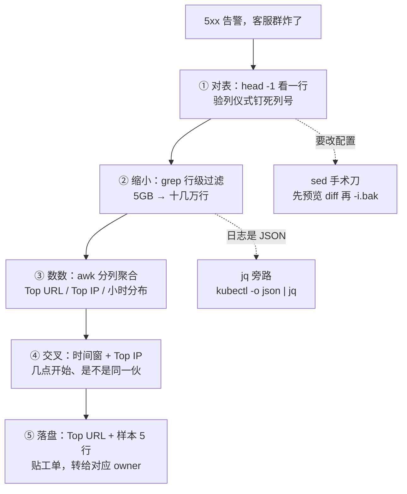
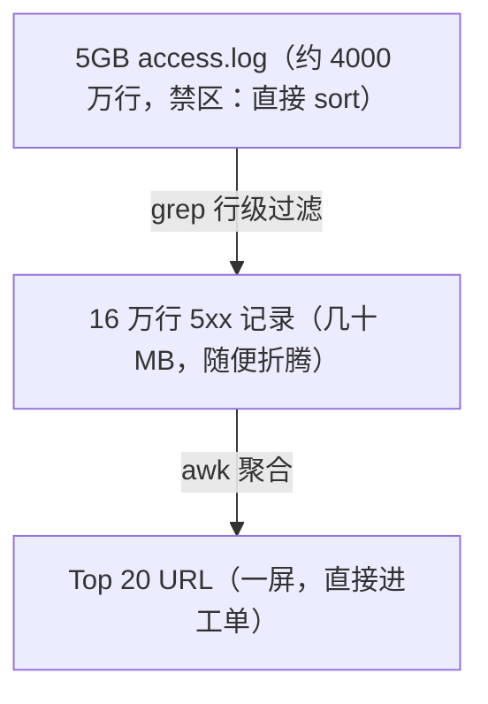
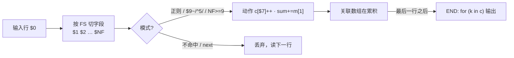
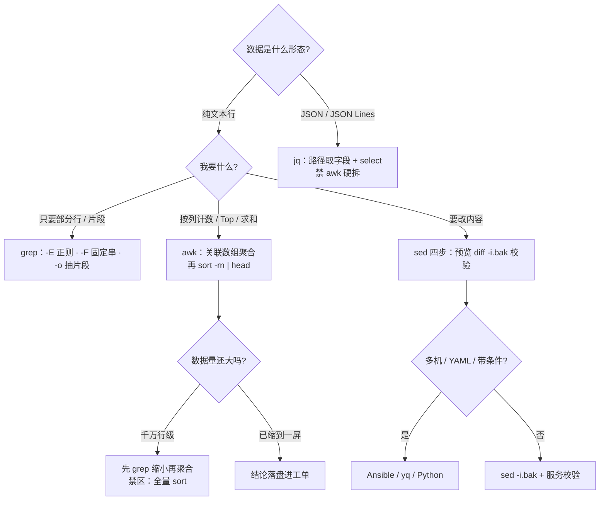

# 03｜文本三剑客：grep · awk · sed

> 大家好，欢迎来到这次分享。开讲之前，先带大家回到一个很多值班同学都经历过的现场：
> 凌晨两点告警群炸了：「支付 5xx 飙红」。有人 `vim` 打开 5GB 的 access.log，终端当场卡死；有人 `grep` 了一小时还在翻屏，天亮了还答不出「哪个接口、几点开始、怨谁」。
> 这一章讲完，你会知道当时那两个人错在哪，以及 5GB 日志怎么在 5 分钟内切成一条能定责的证据。
> **本章回答**：一份 5GB 日志怎么在 5 分钟内被切成一条能定责的证据——列号是合同，先缩小再聚合，改文件必先预览。
> **不讲**：正则引擎与回溯深挖 → [05-04](../../05-开发能力/04-正则与文本处理/)；Shell 脚本骨架与 pipefail → [05-01-02](../../05-开发能力/01-Shell/02-脚本骨架与三开关/)；日志采集与告警体系 → [23](../23-日志运维/)。这些都有专门的章节，本章只在用到时点到为止。

**标记**：🎯重点 · 🔥难点 · ⭐常考 · 🔧实操

**怎么听这场分享**：咱们先看第一节的主图，把「对表 → 缩小 → 数数 → 交叉 → 落盘」装进脑子；后面按 grep / awk / sed / xargs 一站一站展开；作战节专门讲四个禁区——也就是开头那个现场的正确解法。每一节讲完都会提示对应练习题。

---

## 一、一张图：一份 5GB 日志变证据的主线

> 🎯 **一句话**：对表 → 缩小 → 数数 → 交叉 → 落盘，每一步削掉一个数量级。



**读图**：从告警进、从证据出，中间四步每步都是一条可复制的命令，不是「思路」。右下两条虚线是同一晚值班最常见的岔路：要改配置走 sed、日志是 JSON 走 jq——它们不改变主线，只是替换其中一步的工具。

> 💡 **打个比方**：三剑客就是淘金流水线——grep 是筛子，把 5GB 泥沙筛成一脸盆；awk 是秤，把金子按成色分堆数清楚；sed 是镊子，动手改东西之前先在纸上比划好。没有筛子直接上秤，秤会被压垮。

> 📝 **面试**：「grep 负责把行数变少（过滤），awk 负责把行变成数（聚合），sed 负责把字改掉（编辑）；JSON 走 jq，不让 awk 硬拆。」——先说分工，再谈细节。

四个禁区，整章反复回扣 🔥：

1. **5GB 直接 `sort`**——内存扛不住全量排序，先 grep 缩小再聚合；
2. **不验列就信 `$9`**——log_format 一改，统计全错还不报错；
3. **裸 `sed -i` 改生产**——没有预览、没有备份，改坏即事故；
4. **awk 硬拆 JSON**——转义嵌套一层就崩，结构化数据走 jq。

⭐ 四个禁区是面试必考（练习题 Q1、Q14）。好，主线有了——先把列号合同钉死。

---

## 二、对表：列号是合同，先验再信

> 🎯 **一句话**：统计之前先 `head -1` 验列——列号是 Nginx 配置和你签的合同。⭐

🔥 很多人 grep 完就直接 `$9` 当状态码——**错了**。列号是你和 log_format 签的合同，先验列再信数字。口诀：**「列号是合同，先验列再统计」**。

Nginx 的 access.log 每行按空格切开，第 N 个字段就是 awk 里的 `$N`。这份「**列号合同**」由 Nginx 的 `log_format` 定义，标准 combined 格式再追加 `rt=`/`urt=` 耗时列后，本钱是这样的：

```text
1.2.3.4 - - [21/Jul/2026:10:03:11 +0800] "GET /api/pay/status HTTP/1.1" 504 153 rt=3.002 urt=2.998

$1=客户端IP  $4=[时间  $6="GET  $7=URI  $8=HTTP/1.1"  $9=状态码  $10=响应字节数  $11=rt=  $12=urt=
```

**验列仪式**（30 秒，不验列不许写统计）🔧：

> 🔍 **现场**：

```bash
head -1 access.log
# 1.2.3.4 - - [21/Jul/2026:10:03:11 +0800] "GET /api/pay/status HTTP/1.1" 504 153 rt=3.002 urt=2.998
awk '{for (i=1; i<=NF; i++) printf "$%d=[%s]\n", i, $i}' access.log | head -12
# $1=[1.2.3.4]               ← 客户端 IP，注意可能是 LB/NAT 出口
# $4=[[21/Jul/2026:10:03:11  ← 时间列自带一个 [，substr 取值要偏移 1 位
# $7=[/api/pay/status]        ← URI，Top N 统计的对象
# $9=[504]                    ← 状态码，主战场
# $11=[rt=3.002]              ← 请求耗时，公司自己追加的列，不是官方 combined 自带的
```

**列号漂移** 🔥：`log_format` 里任何一处改动都会让后续列整体右移——比如在 `$status` 前面加一个 `$host`，状态码就从 `$9` 变成 `$10`，而你的旧脚本拿 `$9` 统计出来是 0 或全是字节数，**不报错、只出错数**。防法就一条：log_format 变更必须同步通知所有吃这张表的脚本；怀疑漂移时重跑一遍验列仪式。

> ⚠️ **别混**：`$NF` 是「最后一列」，不是「耗时列」。只有验列确认 `rt=` 恰好是最后一列时 `$NF` 才碰巧等于耗时；格式一变它抓到的是 `urt=` 或别的东西。抽耗时用 `match()` 按「内容」抓，见 [四、数数](#四数数awk-分列与聚合)。

口诀：**「列号是合同，先验列再统计」**。练习题 Q4、Q5。列对了，下一刀 grep 缩小。

---

## 三、缩小：grep 把 5GB 撇成一勺

> 🎯 **一句话**：grep 只干一件事——把不要的行扔掉，让后面的步骤只在「一勺」上干活。

### 3.1 先看漏斗，再敲命令



**读图**：数据量从上到下每步掉 1~2 个数量级，这就是「先缩小再聚合」的全部含义。判断一条命令该不该敲，就看它落在漏斗的哪一层：在 4000 万行上跑的必须是 grep/awk 这种**单次流式扫描**，排序、去重这类要全量进内存的，必须等数据缩到万~百万行级别。真有全量排序的硬需求（如做全量 URL 雿同），给 sort 上双保险：`LC_ALL=C sort -S 2G -T /data/tmp`——`-S` 限内存、`-T` 指定临时目录，别让它把 `/tmp`（常在内存盘上）和业务一起打爆。

### 3.2 grep 的生产姿势 ⭐

> 🔍 **现场**：

```bash
grep -c '" 50[0-9] ' access.log            # ← -c 只数行数：先估量，再决定下一步
# 163822                                   ← 16 万行 5xx，值得开一次完整走读
grep -n -E 'upstream timed out' error.log  # ← -n 带行号，转给别人能直接跳到那一行
# 8812:2026/07/21 10:03:12 [error] 1101#0: *8421 upstream timed out (110: Connection timed out) while connecting to upstream, client: 1.2.3.4, server: api.local, request: "GET /api/pay/status HTTP/1.1", upstream: "10.0.3.21:8080", host: "api.local"
grep -oE '([0-9]{1,3}\.){3}[0-9]{1,3}' error.log | sort | uniq -c | sort -rn | head -3
#   4821 10.0.3.21     ← -o 只抽命中的片段（这里抽 IP），配合 uniq -c 数频次
#   1902 10.0.3.22
grep -R -n --include='*.conf' '10.0.3.21' /etc/nginx/   # ← -R 递归 + --include 圈文件类型
# /etc/nginx/conf.d/upstream.conf:3:    server 10.0.3.21:8080;
```

常用选项口诀（记用法别背表）：`-E` 扩展正则（生产默认）、`-F` 固定字符串（查 IP/报错原文，快且不踩转义）、`-i` 忽略大小写、`-v` 反选（排除健康检查行全靠它）、`-n` 行号、`-c` 计数、`-o` 只出命中片段、`-R --include` 递归圈范围。

> ⚠️ **别混**：**`grep -c` 数的是「命中的行数」，不是「命中次数」**——一行里命中 3 次也只计 1。要数次数用 `grep -o pat f | wc -l`（`-o` 让每次命中单独成行）。工单里「报错 5000 条」和「报错 5000 行」是两个口径，写错会被追问。`-F` 的快也不只是省转义：固定串走确定算法，比正则回溯快一个量级，能写死就写死。

姿势纪律：**`grep pat file`，不要 `cat file | grep pat`**——多一个进程，少一分利落；文件大时先 `wc -l` 和 `tail -1` 确认文件在滚动、没被 logrotate 切空（切走见 [23](../23-日志运维/)）。

排障常要的不是命中行本身，而是**前后几行**：`-A 3`（After，带出后 3 行）、`-B 2`（Before，带出前 2 行）、`-C 1`（Context，前后各 1 行）。Java 堆栈就是典型——`grep -n -A 20 'Exception' app.log` 把异常连同 20 行堆栈一起带出来；只看一行报错头，定了责也说不清是谁抛的。多个命中组之间 grep 会打 `--` 分隔，读输出时按段切。

```bash
grep -m 10 -E 'panic' app.log          # ← -m 10：够 10 个就停，别为「只是想看一眼」扫完 5GB
LC_ALL=C grep -E 'panic' app.log       # ← 按字节序比较、跳过本地化规则，扫大文件常快数倍
grep -a 'ERROR' mixed.log              # ← Binary file matches 时加 -a 当文本看，先确认文件没坏
```

> ⚠️ **别混**：**`-m` 是「够了就停」，不是 head**——`grep x | head` 仍要等 grep 吐满管道缓冲，`-m` 才是让 grep 自己刹车。`Binary file xxx matches` 不是报错：日志里混进二进制段（协议转储、被截断的行）时 grep 只回这一句，要真看内容加 `-a`，但先怀疑文件本身是否被写坏。

### 3.3 三个正则深坑 ⭐

> ⚠️ **别混**：**BRE（Basic Regular Expression，基础正则）** 与 **ERE（Extended Regular Expression，扩展正则）**。grep 不加参数默认是 BRE，`+ ( ) { } |` 这些符号在 BRE 里**必须反斜杠转义**才当元字符；`grep -E`（等价 `egrep`）才是 ERE。生产脚本一律写 `-E`，省下每一次「为什么匹配不到」的排查。

```bash
grep 'error+' access.log      # ← 想匹配 error、errorr……实际只匹配字面 error+
grep -E 'error+' access.log   # ← 对：+ 生效，匹配一个 r 出现 1 次以上
grep -E '5[0-9][0-9]' access.log   # ← -E 下字符类 [] 与量词 {} 直接写
grep -P 'error(?=\d)' access.log   # ← PCRE 才有环视，但 -P 不是所有发行版都编进去，别依赖
```

```text
BRE（默认）:  \+  \(  \)  \{1,3\}  \|      ← 元字符要加反斜杠
ERE（-E）  :  +   (   )   {1,3}    |      ← 直接写
```

> 🔥 **贪婪匹配（greedy matching）**：`.*` 会一路吃到行尾再回吐，用来抽 `"` 引号里的内容必然抽糊——`".*"` 会从第一个引号吃到最后一个引号。抽**定界符之间的内容**用否定字符类 `[^"]*`：它匹配「非引号」的字符，遇到引号自然停。IP 别写 `[0-9.]+`（会把点连成串），写 `([0-9]{1,3}\.){3}[0-9]{1,3}`。更深一层是**回溯爆炸（catastrophic backtracking）**：`(.+)+` 这类嵌套量词会让正则引擎指数级回溯——本节只立规矩「量词套量词不写」，机理深挖见 [05-04](../../05-开发能力/04-正则与文本处理/)。

> 📝 **面试**：「我写 grep 一律带 `-E`；查固定字符串（IP、报错原文）用 `-F` 更快也不怕转义；抽片段用 `-oE`；正则里尽量用字符类和定界符，少用 `.*`，避免贪婪和回溯。」

### 3.4 grep 匹配为 0 的四步排查 🔧

统计结果是 0，**先别怀疑正则**，按顺序查：

> 🔍 **现场**：

```bash
wc -l access.log; tail -1 access.log   # ① 文件是空的 / 刚被 logrotate 切走了？
# 41837762 access.log                  ← 有货，且 tail 出的是最新一行，文件在滚动
grep -E 'error+' app.log; grep -F 'error+' app.log   # ② BRE 坑：'+' 被当字面量了？
head -1 access.log                     # ③ 格式变了、列号漂移（回二、验列）
kubectl get pod -o wide | grep pay     # ④ 看错机器 / 看错文件了
```

### 3.5 除了 access.log：error.log、journalctl、OOM 🔧

- **error.log 按关键字进**，四个高频词：`upstream timed out`（上游慢）、`connect() failed` / `Connection refused`（上游拒连）、`no live upstreams`（上游全下线）。命中 `upstream timed out` 基本可以把方向指向上游服务或网络，再往深走 [19](../19-Nginx/)。
- **journalctl 管时间窗，grep 管关键字**，分工不重叠：

```bash
journalctl -u nginx --since '2026-07-21 09:50' --until '2026-07-21 10:10' --no-pager \
  | grep -E 'upstream|refused' | head
# 10:03:12 api.local nginx[1101]: *8421 upstream timed out ... upstream: "10.0.3.21:8080"
```

- **OOM 线索**：`grep -iE 'out of memory|oom-killer' /var/log/messages`，命中只是线索，根因分析去 [07](../07-内存与OOM/)。

口诀：**「生产默认 -E；别 cat | grep」**。练习题 Q2、Q3、Q10。缩小完了，该 awk 数数。

---

## 四、数数：awk 分列与聚合

> 🎯 **一句话**：awk 把每行切成字段，用关联数组边扫边数，一次扫描出全部证据。⭐

### 4.1 最小语法与内置变量

awk 的执行模型一句话：**`模式 { 动作}`**——每个输入行先过模式（正则、比较、`BEGIN`/`END`），命中才执行动作；没写模式就对每行执行；没写动作就打印整行。

术语内联：**字段（field）** = 一行按**分隔符（delimiter）**切出来的第 N 块，`$0` 整行、`$1` 第一块、`$NF` 最后一块；**NR** = 当前第几行（全文件累计），**FNR** = 当前文件内的第几行，**NF** = 当前行的字段数；**FS** = 输入分隔符（`-F` 改它，默认空格），**OFS** = 输出分隔符（print 用逗号拼时中间那个字符）；**BEGIN/END** = 第一行之前 / 最后一行之后各执行一次的钩子；**关联数组（associative array）** = 下标可以是任意字符串的哈希表，`c[$7]++` 就是「以 URI 为 key 计数」。

```bash
awk -F'\t' -v OFS='|' 'NR<=2 {print NR, $1, $NF}' result.tsv   # ← -F 改输入分隔符，-v 传变量
# 1|url|count
# 2|/api/pay/status|120393
```

### 4.2 证据四件套：全靠关联数组 ⭐

> 🔍 **现场**（沿用二、验列过的合同：`$1` IP、`$4` 时间、`$7` URI、`$9` 状态码）：

```bash
# ① 状态码分布：5xx 里是不是 504 一家独大
awk '{c[$9]++} END {for (s in c) print s, c[s]}' access.log | sort -rn
# 200 38210041
# 504 163822      ← 5xx 几乎全是 504 = 疑点在「上游拖死」，不是程序崩（500）
# 499 20551       ← 499 = 客户端等不及主动断开，和 rt 飙高互相印证

# ② Top URL：5xx 都砸在哪些接口上
awk '$9 ~ /^5[0-9][0-9]$/ {c[$7]++} END {for (u in c) print c[u], u}' access.log | sort -rn | head -20
# 120393 /api/pay/status       ← 一条接口占 73%，主嫌疑锁定
# 18255 /api/order/create

# ③ Top IP：5xx 是不是同一伙客户端打的
awk '$9 ~ /^5[0-9][0-9]$/ {ip[$1]++} END {for (i in ip) print ip[i], i}' access.log | sort -rn | head
# 42018 10.0.3.17    ← 内网 IP！这是网关/LB 的出口，不是真凶，见 ⚠️
# 38755 10.0.3.18

# ④ 小时分布：几点开始、还在不在涨
awk '$9 ~ /^5/ {h[substr($4,14,2)]++} END {for (k in h) print k, h[k]}' access.log | sort
# 10 163822    ← substr($4,14,2)：$4 是 [21/Jul/2026:10:03:11，第 14 位起取 2 位 = 小时
# 11 1220      ← 11 点只剩零星，说明 10 点那波已经在收敛
```

**为什么不用 `sort | uniq -c`？** 它先把 16 万行完整排序再数数——数据量小时没毛病，但 5GB 全量进 sort 就是禁区 ①。awk 关联数组是**一次流式扫描**，不排序、不落盘，顺便还能把过滤、计数、分组塞进同一条命令。

### 4.3 时间窗与跨天 🔥

`substr($4,14,2)` 只取了「小时」，**跨天会叠加**——昨天 10 点的一小波和今天 10 点的爆发会被数成同一个格子。跨天统计 key 必须带日期：`substr($4,2,11)` 从第 2 位（跳过 `[`）取 11 位拿到 `21/Jul/2026`。

> 🔍 **现场**：

```bash
awk '$9 ~ /^5/ {k[substr($4,2,11) " " substr($4,14,2)]++}
     END {for (t in k) print t, k[t]}' access.log | sort
# 20/Jul/2026 10 2050      ← 昨天 10 点就有一小波：不是第一次，别只看今天
# 21/Jul/2026 10 163822
```

### 4.4 按「内容」抓列：rt 与 urt

`rt=`/`urt=` 这类追加列不是纯数字（带前缀），直接拿 `$11` 还得再剥壳，拿 `$NF` 又踩格式漂移的坑——用 `match()` 加捕获组按内容抓：

> 🔍 **现场**：

```bash
awk '$9 ~ /^5/ && match($0, /rt=([0-9.]+)/, m) {sum += m[1]; n++}
     END {printf "n=%d avg_rt=%.3fs\n", n, sum/n}' access.log
# n=163822 avg_rt=2.917s    ← 平均 2.9 秒：5xx 不是「被拒」，是「被拖到超时」，和 504 互相印证
```

`match()` 第三个参数 `m` 是 gawk 扩展：`m[1]` 就是第一个括号捕获组的内容。同理可抓 `urt=`（上游耗时）——rt 远大于 urt 说明慢在 Nginx 本机/排队，两者接近说明慢在上游。

### 4.5 坏行与多文件

日志里混着残行（写一半崩了、多进程交错），按列统计前先设防；多机对比时用 `FILENAME` 分组：

> 🔍 **现场**：

```bash
awk 'NF < 9 {bad++; next}                       # ← 字段不足 9 = 坏行，计数后直接跳过
     $9 ~ /^5/ {c[FILENAME]++}
     END {for (f in c) print c[f], f; print "bad:", bad+0 > "/dev/stderr"}' web1.log web2.log
# 163822 web1.log
# 1899 web2.log     ← 两台量级差 80 倍：问题基本锁定在 web1
# bad: 3            ← 坏行数走 stderr，不污染正常输出（好接着管道）
```

顺带钉死一对内置变量：**`NR` 是全局行号（所有文件连着数），`FNR` 是当前文件内的行号**。两个高频用法：多文件都要跳过表头时写 `FNR == 1 { next }`（写成 `NR == 1` 只会跳第一个文件的表头）；拿第一个文件当「名单」去第二个文件里找，用 `NR == FNR`（还在第一个文件里）做分支——awk 版「拿名单查日志」就是这么写的。`FILENAME` 分组、`FNR` 跳头、`NR==FNR` 分支，三件都是多文件统计的标配。

```bash
awk 'NR==FNR {allow[$1]; next}             # ← 第一个文件（ip.list）整份进名单
     !($1 in allow) {c[$1]++} END{for(i in c) print c[i],i}' ip.list access.log | sort -rn | head
# 312 10.0.9.99    ← 名单之外的 IP 才计数：白名单对账一条流，不用真连数据库
```

> ⚠️ **别混**：`FNR == 1` 不是「第一行数据」，是「每个文件的第 1 行」——它跳过的是**每个文件**的表头，单文件时和 `NR == 1` 等价，多文件时天差地别。

### 收束：一条 awk 一次扫描交出的证据清单



**读图**：从左进右出——一行进来，切字段、过模式、进数组，全程一次扫描不回头；BEGIN 在最左端之前跑一次（放表头/初始化），END 在最右端之后跑一次（放汇总输出）。四件套证据全部发生在「数组累积 + END 输出」这两格。

一条 awk 交出的证据清单（可背）：
- **状态码分布** `c[$9]++`——504 还是 500，定「慢」还是「崩」；
- **Top URL** `c[$7]++`——砸在哪条接口上，定嫌疑人；
- **Top IP** `ip[$1]++`——是不是同一伙来源（先排除 LB/NAT 出口）；
- **小时分布 / 跨天** `substr($4,2,11) " " substr($4,14,2)`——几点开始、昨天有没有前科；
- **平均耗时** `match($0, /rt=([0-9.]+)/, m)`——被拒还是被拖死。

> ⚠️ **别混**：Top IP 是**线索**不是**判决**。量级最大那个 IP 十有八九是 LB/NAT 出口或运营商代理，背后是全部用户；真要定位单点来源得看 `X-Forwarded-For` 或网关日志。结论永远落在 Top URL + 时间窗 + 样本日志上，封 IP 必须走变更流程。

> 📝 **面试**：「awk 我就记一个骨架：模式-动作，加一个关联数组。Top N 的固定写法是 `$9~/^5/ {c[$7]++} END{for(u in c) print c[u],u}` 再 `sort -rn | head`；时间窗用 substr 切 $4，跨天 key 带日期；耗时列用 match 捕获组抓，不拿 $NF 赌运气。」

练习题 Q2、Q8、Q11。数清楚了，有时还得改配置——进 sed。

---

## 五、动刀：sed 改文件，先预览再落盘

> 🎯 **一句话**：sed 是流式编辑器（stream editor），逐行读进**模式空间（pattern space）**里改完再吐出来——改生产文件必须走「预览 → diff → 备份落盘 → 校验」四步。⭐

> 💡 **打个比方**：模式空间是流水线上的一个小工作台——复印一页上来，改这一页，发出去，再复印下一页。它从不同时拿着整本书，所以 5GB 的文件它也改得动，内存里永远只有一行。

### 5.1 安全四步 🔧


**读图**：从左到右是唯一合法路径，缺 diff 就是盲改，缺校验就是赌 reload 不炸。任何一步结果不符合预期，回上一步重写表达式，**不许跳步**。

> 🔍 **现场**（改 MySQL 最大连接数）：

```bash
grep -n 'max_connections' /etc/my.cnf
# 42:max_connections = 100
sed 's/^max_connections = 100$/max_connections = 500/' /etc/my.cnf | diff -u /etc/my.cnf -
# --- /etc/my.cnf
# +++ -
# @@ -42 +42 @@
# -max_connections = 100
# +max_connections = 500        ← diff 里只许出现这两行，多一行都停下来看
sed -i.bak 's/^max_connections = 100$/max_connections = 500/' /etc/my.cnf
ls /etc/my.cnf.bak             # ← -i.bak 落盘同时留备份；回滚就是 cp 回来，30 秒的事
```

### 5.2 三招够用：替换、删行、地址范围

```bash
sed 's|/old/path|/new/path|' app.conf          # ← 内容带 / 时换分隔符 s|||，免得 \/
sed 's/level=info/level=debug/g' app.conf      # ← 不加 g 只换每行第一处，循环里改全靠 g
sed '/^#/d; /^$/d' app.conf | head             # ← /d 删行：一眼看清有效配置
sed -n '/ERROR/,/FATAL/p' app.log | head -20   # ← 地址范围：两个模式之间的行全打出来
sed 's/^    server 10.0.3.21:8080;/    #&/' upstream.conf | diff -u upstream.conf -
# -    server 10.0.3.21:8080;
# +    #    server 10.0.3.21:8080;     ← 值班摘掉一台坏上游：& 引用整个匹配，只在前面加注释
```

### 5.3 macOS 的坑与「什么时候别用 sed」

> ⚠️ **别混**：**GNU sed**（Linux）与 **BSD sed**（macOS）的 `-i` 不是一回事。GNU 写 `sed -i 's/a/b/' f`；BSD 的 `-i` 必须跟一个备份后缀参数，`sed -i '' 's/a/b/' f`（空串 = 不留备份）。在 Mac 上照抄 GNU 写法，sed 会把 `s/a/b/` 当成后缀、把 `f` 当成脚本，报出怪错。跨平台脚本里统一写 `-i.bak`，两边都合法。

sed 是**单机、纯文本、确定性替换**的工具。三条红线，过线就换工具：**多台机器**要改 → Ansible（[04-06](../../04-工程化与自动化/06-Ansible/)），别挨个 ssh 手敲；**YAML/JSON** 要改 → yq/jq，缩进即语义，sed 改 YAML 等于蒙眼动刀；**带条件分支**的逻辑（改 A 行但当且仅当 B 行存在）→ 写 Python（[05-02](../../05-开发能力/02-Python/)），sed 没有靠谱的条件流。

> 📝 **面试**：「sed 我只拿它做单机纯文本的确定性替换，流程固定四步：grep -n 圈行、预览、diff -u、-i.bak 落盘加服务校验。多机走 Ansible，结构化配置走 yq/jq——sed 不是不能用，是用错地方会出事故。」

### 5.4 sed -i 的暗坑：inode 会换，硬链接会断 ⭐

> ⚠️ **别混**：**`sed -i` 不是「原地改字节」，是「写临时文件再改名顶替」**。改完 inode 换了一个——肉眼看不出，但三件事会露馅：**硬链接断开**（别的名字还指向旧 inode，改完各看各的，共享的配置硬链悄悄分叉）；**属主和权限重置**（root 跑的 sed -i，文件可能变成 root 属主，服务进程读不了，reload 直接 Permission denied）；**软链接被替换成实体文件**（你改的是软链本身，不是它指向的那份）。

> 🔍 **现场**（sed -i 改完配置服务起不来，先看这两条）：

```bash
ls -li /etc/my.cnf          # ← -i 看 inode：改完与监控基线对不上，说明文件被顶替过
stat -c '%U:%a' /etc/my.cnf # ← 属主:权限——root 改完后核对，别等服务报错才发现
```

要保住 inode 的写法：预览通过后 `sed 's/…/…/' f > f.new && cat f.new > f`——**用 cat 重定向写回原文件**，inode、属主、权限、硬链接全部保住，再删中间文件。多数「重写式」编辑器（vim 保存大文件时的 rename 行为）同理，改完关键配置都值得 stat 一眼。

> 📝 **面试**：「sed -i 是换文件不是改文件：inode 变、硬链接断、属主可能被重置。要保 inode 就 sed 到临时文件再 `cat tmp > 原文件` 写回。」

口诀：**「改文件必先预览；-i 必留 .bak」**。练习题 Q6、Q7。批量动手时还有 xargs。

---

## 六、旁路：jq 管结构化数据

> 🎯 **一句话**：数据是 JSON 就走 jq——按路径取字段，`select` 过滤，别让 awk 硬拆。

> ⚠️ **别混**：三剑客管**无 schema 的纯文本**，jq 管**结构化 JSON**。`awk -F'"'` 拆 JSON 看着能跑，遇到字段里带转义引号、嵌套对象一层就崩，而且字段取错也不报错。判据一句话：能被 `jq .` 解析的就是 jq 的地盘。

> 🔍 **现场**：

```bash
kubectl get pods -o json | jq -r '.items[]
  | select(.status.phase != "Running")
  | "\(.metadata.name) \(.status.phase)"'        # ← select 过滤 + 字符串插值，-r 去掉引号
# checkout-7d9c6b5-x2k4p Pending
# pay-api-5f8d7c9-x2k4p CrashLoopBackOff        ← 不 Running 的直接点名

kubectl get pods -o json | jq -r '.items[].spec.containers[].image' | sort -u
# harbor.local/pay/api:v1.42.0                   ← -o wide 的 IMAGE 列会截断长镜像名，这条不截

jq -r 'select(.level=="error") | .msg' app.log   # ← JSON Lines 日志（每行一个 JSON）按字段过滤
# payment gateway timeout after 3s
jq -r '.spec.containers[0].image // "missing"' pod.json
# missing                                        # ← 字段可能不存在时 // 给缺省，不吐 null 污染输出
```

拿到陌生 JSON 先探结构再取数：`jq 'keys' pod.json` 看顶层有哪些字段、`jq '.[0]' events.json` 抽第一条当样本、`jq 'keys_unsorted'` 连字段顺序都保留——比肉眼翻几千行输出快得多，也避免在错误的路径上空跑。字段名拿不准时宁可先 `keys` 一次，别凭印象写路径。

> ⚠️ **别混**：`jq` 的路径写错**不报错只出 null**——和 awk 列号漂移一样是「静默出错数」，所以路径先用 `keys` 验过再进管道；`// "default"` 是给 null 兜底，不是掩盖路径错误。

jq 的本职在 JSON 的查询与改写，配 kubectl 只是最高频的场景；Pod 排障本身的主线在 [03-Kubernetes](../../03-Kubernetes/)，这里只钉住「取数用 jq」这一件事。

### 接力棒：xargs，把命中名单交给下一个动作 ⭐

> 🎯 **一句话**：grep/find 圈出名单，动手（删、改、逐个处理）交给 xargs——空名单和带空格文件名是两个坑。

> 🔍 **现场**：

```bash
grep -l 'old.host' /etc/nginx/conf.d/*.conf | xargs -r sed -i.bak 's/old.host/new.host/g'
# ← -l 只出文件名：命中的配置才改；-r 空名单时不执行（否则 sed 无参数报错）
find /data/log -name '*.gz' -mtime +30 -print0 | xargs -0 -r rm -f --
# ← -print0/-0 用 \0 分隔：文件名带空格不断裂；-- 防御以 - 开头的怪名
grep -rn '10.0.3.21' /etc/ | cut -d: -f1 | sort -u | xargs -r cp -t /root/backup/
# ← 清理前三连：列出 → 去重 → 备份；名单过目了再换成真动作
```

三条纪律：**`-r` 必带**——上游没命中时 xargs 仍会执行一次命令，`xargs rm` 变成裸 rm；**文件名走 `-print0 | xargs -0`**——默认按空白切参数，`game log 01.log` 会被拆成三个；**先打印再动手**——把 `xargs rm` 换成 `xargs -n1 echo` 跑一遍，眼见名单为实再换回真命令。批量但要控制节奏用 `-n 20` 分批、`-P 4` 限并发——`xargs -n1 -P4 -I{} curl -sf http://{}/health` 就是四路探活的最小写法。同族对比一句：`find -exec cmd {} \;` 每个文件起一个进程，`find -exec cmd {} +` 批量传参（等价 xargs，且天然不拆文件名）；简单场景 `-exec +` 更省心，要并发和分批才是 xargs 的地盘。

> 📝 **面试**：「xargs 三条纪律：空名单带 -r、文件名带空格用 -print0/-0、动手前先 echo 过目。它是三剑客和 find 的接力棒，不是管道的装饰品。」

练习题 Q13。刀都齐了，作战节讲定责与禁区。

---

## 七、作战：定责与四个禁区

> 🎯 **一句话**：拿到文本先问形态（JSON？）再问目的（要行、要数、还是要改），禁区四个一条不碰。



**读图**：第一层判形态（JSON 直接去 jq，这是最常走错的岔口），第二层判目的（行→grep、数→awk、改→sed），第三层是两道安检：改文件前问「多机/结构化/带条件」，聚合前问「数据量缩够了没」。每片叶子都是一条可以直接敲的命令，不是一句建议。

### 现象 · 先做 · 别做

| 现象 | 先做 | 别做 |
|------|------|------|
| 5xx 突增，群在喊崩 | `head -1` 验列 + `grep -c` 估量 | `vim` 打开 5GB 文件，终端卡死 |
| 统计结果出来是 0 | `wc -l`、`tail -1` 查文件，再查 BRE 坑 | 反复换正则，骂 grep 有 bug |
| Top IP 是内网网关 IP | 看 Top URL + `X-Forwarded-For` 定真凶 | `iptables` 直接封「Top1 IP」 |
| 要改线上配置 | 预览 → diff → `-i.bak` → `nginx -t` | `sed -i` 一把怼进生产 |
| kubectl 想看全镜像名 | `-o json \| jq -r '.items[].spec...image'` | `-o wide` 复制被截断的列 |
| Java 异常要看堆栈 | `grep -n -A 20 'Exception'` | 只看一行报错头就定责 |
| 命中文件要批量处理 | `grep -l … \| xargs -r …`，先 echo 过目 | 裸 `xargs rm`（没命中也执行） |
| sed -i 后服务起不来 | `stat` 核属主权限、`ls -li` 核 inode | 反复 reload 碰运气 |

### 60 秒剧本 🔧

- **0–10s**：`wc -l` + `tail -1` 确认文件活着；`head -1` 验列钉合同（二）；
- **10–30s**：`grep -c '" 50[0-9] '` 估量；`grep -E 'upstream timed out|refused' error.log | head -3` 抓方向；看堆栈加 `-A 20`，只想要样本加 `-m 10`（三）；
- **30–45s**：一条 awk 出 Top URL + 小时分布（四）；
- **45–60s**：Top IP 交叉 + 平均 rt；把「Top URL、开始时间、样本 5 行、怀疑方向」贴进工单。

两条值班纪律：one-liner 只是**当场的听诊器**，要长期看的指标走监控（[22](../22-监控与告警/)），别拿临时命令顶监控；贴工单前脱敏——IP、token、用户数据打码，样本日志给 5 行足矣。数据量大到没信心时先抽样：`tail -n 500000` 取最近 50 万行，或 `awk 'NR % 50 == 0'` 隔行取样，量级够了再决定要不要全量。

> 📝 **面试**：「我的纪律是四个不做：不做全量 sort、不盲信列号、不裸 sed -i、不让 awk 碰 JSON；Top IP 只是线索不直接封；one-liner 的结论要落成工单证据，长期看的东西进监控。」

---

这一节对应练习题 Q1、Q9、Q12、Q14——四个禁区务必练熟。


**回到开头那个现场**：有人 vim 开 5GB、有人 grep 翻一小时。正确剧本是：先验列 → grep 缩小 → awk 聚合 → 需要改再 sed 预览。现在再看群里那两个人的操作，你知道该怎么拦住他们了。

## 八、收口

### 命令速查 🔧

```bash
head -1 access.log                                  # 验列：先看合同
awk '{for(i=1;i<=NF;i++) printf "$%d=[%s]\n",i,$i}' access.log | head -12
grep -c '" 50[0-9] ' access.log                     # 估量：5xx 有多少
grep -E -n 'upstream timed out' error.log | head    # 关键字定方向
awk '$9 ~ /^5[0-9][0-9]$/ {c[$7]++} END{for(u in c) print c[u],u}' access.log | sort -rn | head -20
awk '$9 ~ /^5/ {k[substr($4,2,11)" "substr($4,14,2)]++} END{for(t in k) print t,k[t]}' access.log | sort
awk '$9 ~ /^5/ && match($0,/rt=([0-9.]+)/,m) {s+=m[1];n++} END{printf "avg_rt=%.3f n=%d\n",s/n,n}' access.log
sed 's/old/new/' f | diff -u f -                    # sed 预览：先看 diff 再落盘
sed -i.bak 's/old/new/' f                           # 落盘留备份
grep -m 10 -E 'panic' app.log                       # 够 10 个就停，别扫完 5GB
grep -n -A 20 'Exception' app.log                   # 堆栈：连后 20 行一起带出
grep -l 'old' /etc/nginx/conf.d/*.conf | xargs -r sed -i.bak 's/old/new/g'   # 名单接力：命中的才改
kubectl get pods -o json | jq -r '.items[] | select(.status.phase != "Running") | .metadata.name'
```

### 面试锚点表

遮住右列自问自答，卡壳的行回去重读对应小节——能讲出来才算会：

| 问 | 30 秒答 |
|----|---------|
| 三剑客怎么分工？ | grep 把行数变少，awk 把行变成数，sed 把字改掉；JSON 走 jq |
| 统计结果是 0，怎么排查？ | 四步：文件空/被切走 → BRE 坑 → 格式/列号漂移 → 错机器 |
| BRE 和 ERE 区别？ | grep 默认 BRE，`+(){}` 要转义；`-E` 是 ERE 直接写，生产一律 `-E` |
| awk 怎么做 Top N？ | `$9~/^5/{c[$7]++} END{for(u in c) print c[u],u}` 再 `sort -rn \| head` |
| 跨天统计有什么坑？ | 只取小时会把两天叠加，key 要带日期 `substr($4,2,11)` |
| sed 改生产配置流程？ | grep -n 圈行 → 预览 → diff -u → `-i.bak` 落盘 → `nginx -t` 校验 |
| macOS sed 有什么坑？ | BSD `-i` 必须带后缀参数 `sed -i ''`，跨平台统一写 `-i.bak` |
| 什么时候不用 awk？ | 数据是 JSON 时用 jq，别 `-F'"'` 硬拆，转义嵌套一层就崩 |
| sed -i 会动 inode 吗？ | 会：写临时文件再顶替，硬链接断、属主可能重置；保 inode 用 `cat tmp > f` 写回 |
| xargs 有什么坑？ | 空名单要 `-r`；文件名带空格要 `-print0`/`-0`；动手前先 `xargs -n1 echo` 过目 |
| Top IP 能直接封吗？ | 不能：多半是 LB/NAT 出口，先看 Top URL 和 XFF，封禁走变更流程 |

### 易错一句话对照

- `cat f \| grep x` → `grep x f`，少一个进程
- `grep 'error+'` → `grep -E 'error+'`（BRE 下 `+` 是字面量）
- `".*"` 抽引号内容 → `"[^"]*"`，`.*` 贪婪吃到最后一个引号
- `awk '{print $NF}'` 当耗时 → `match($0,/rt=([0-9.]+)/,m)` 按内容抓
- 不验列就写 `$9` → 先跑验列仪式，log_format 一变列号就漂
- 5GB 直接 `sort \| uniq -c` → 先 grep 缩小，或 awk 关联数组一次扫描
- `sed -i` 裸改生产 → 预览 + diff + `-i.bak` + 服务校验
- awk 拆 JSON → jq select，结构化数据不进三剑客
- 跨天只按小时分桶 → key 带日期
- `grep … \| xargs rm` 不带 -r → 错，没命中时变成裸 rm
- `find … \| xargs` 不带 -print0/-0 → 错，带空格文件名会被拆碎
- 以为 sed -i 是原地改字节 → 错，是写临时文件再顶替：inode 换、硬链接断
- `grep -c` 当命中次数报数 → 错，数的是行数；次数用 `grep -o \| wc -l`
- 陌生 JSON 直接猜路径 → 错，先 `jq 'keys'` 验路径；jq 路径错只出 null 不报错
- 多文件跳表头写 `NR==1` → 错，只跳第一个文件的；用 `FNR==1`
- `-o wide` 复制镜像名 → `-o json \| jq -r`，wide 会截断

### 数字墙

> **5GB / 约 4000 万行**：一次高峰日志的量级——永远先缩小再聚合
> **30 秒**：验列仪式的耗时上限，不验列不许写统计
> **1~2 个数量级**：主线每一步（缩小→聚合）削掉的数据量
> **5 分钟**：从告警到证据贴进工单的目标时间
> **万~百万行**：sort/uniq 可接受的范围，千万行先 grep
> **50 万行 / NR%50**：安全抽样的规模与隔行取样步长
> **.bak**：sed 落盘必须留下的回滚尾巴
> **LC_ALL=C**：扫大文件的免费提速开关；**-m 10**：够 10 个就停；**-S 2G -T**：全量 sort 的双保险

要继续深挖：正则引擎与回溯 → [05-04](../../05-开发能力/04-正则与文本处理/)；把 one-liner 固化成安全脚本 → [05-01-02](../../05-开发能力/01-Shell/02-脚本骨架与三开关/)；日志采集与查询体系 → [23](../23-日志运维/)。

---

## 合上书

学到这里，先别急着翻下一章。合上书，试试下面这几件事——卡住就回对应小节：

- [ ] **口述**主线：5GB 日志变证据的五步（对应练习题 Q1、Q2、Q14）。
- [ ] **默画**主图：对表→缩小→数数→交叉→落盘，加上 sed 和 jq 两条岔路（Q1）。
- [ ] 说出四个禁区，以及各自对应的事故画面（Q1、Q9）。
- [ ] **默写**验列仪式那条 awk，并指出 `$4` 为什么要偏移（Q4、Q5）。
- [ ] 列号为什么会漂移？统计为 0 和全错数分别怎么暴露？（Q4）。
- [ ] grep 生产姿势三件事：`-E` 默认、估量先行、别 `cat |`（Q2、Q3）。
- [ ] `grep 'error+'` 为什么匹配不到？BRE/ERE 转义差在哪？（Q3）。
- [ ] 抽引号内内容为什么不能用 `.*`，正确写法是什么？（Q10）。
- [ ] **默写** Top URL 那条 awk，并说清跨天时 key 怎么改（Q2、Q8）。
- [ ] 一条 awk 一次扫描能交出哪五件证据？（Q2、Q11）。
- [ ] sed 改生产配置的安全四步，macOS 上 `-i` 的坑（Q6）。
- [ ] sed -i 为什么会断硬链接？保 inode 的写法？（Q6、Q7）。
- [ ] xargs 三条纪律各防什么？pipefail 为何必开？（Q13）。
- [ ] 决策树走一遍：什么形态走 jq、什么情况 sed 也不许上？（Q9、Q12）。

要继续深挖：正则引擎与回溯 → [05-04](../../05-开发能力/04-正则与文本处理/)；把 one-liner 固化成安全脚本 → [05-01-02](../../05-开发能力/01-Shell/02-脚本骨架与三开关/)；日志采集与查询体系 → [23](../23-日志运维/)。
