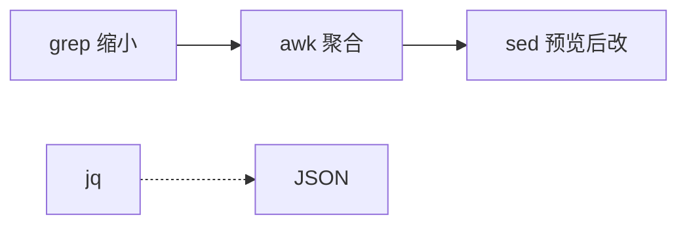
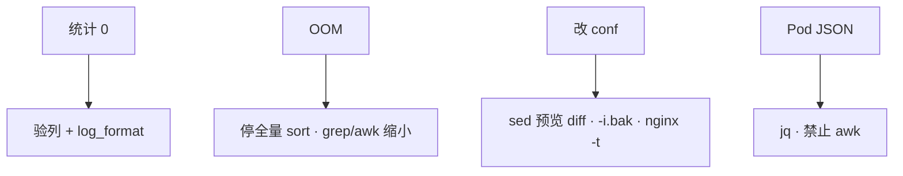

# 03｜文本三剑客 · 练习题

先对照 [知识点](知识点.md) **§2 总图 + §2.3 走读 + §8 易混** 自己口述，再对答案。关键字（grep 缩小 → awk 聚合、log_format 列号、sed 预览、禁止全量 sort）要能定责。每题标了覆盖范围：

| 标记 | 含义 |
|------|------|
| **核心** | 不懂整章就没建立起来 |
| **必会** | 值班和面试都要能讲 |
| **常用** | 线上会反复碰到 |
| **常考** | 白板和追问的高频口径 |

## 本题目录

- [Q1 管道分工与禁区](#q1)
- [Q2 5GB access.log 找 5xx Top URL](#q2)
- [Q3 BRE vs ERE](#q3)
- [Q4 列号与 log_format](#q4)
- [Q5 Top IP 交叉验证](#q5)
- [Q6 sed 预览与 -i](#q6)
- [Q7 journal / error.log](#q7)
- [Q8 时间窗与跨天](#q8)
- [Q9 jq vs awk](#q9)
- [Q10 贪婪与字符类](#q10)
- [Q11 request_time 两列](#q11)
- [Q12 定责树综合](#q12)
- [合上书](#合上书)

---

## Q1

**★★★★★｜三剑客怎么分工？四个禁区是什么？**

**覆盖**：核心 · 必会 · 常考

**对应**：知识点 §2.0 · §11

### 场景

白板：「值班怎么用 grep/sed/awk？」有人答「都会正则就行」。

### 完整解答

**一句话：** grep 缩小 → awk 分列聚合 → sed 流式改（先预览）；JSON 走 jq；禁区是全量 sort、盲信 `$9`、裸 `sed -i`、awk 拆 JSON。



| 禁区 | 为什么 |
|------|--------|
| 几十 GB 直接 sort | 打满跳板机内存 |
| 盲信网上 `$9` | 列号跟 log_format |
| 裸 `sed -i` | 无 diff、难回滚 |
| awk 硬拆 JSON | 层级被空格撕碎 |

### 再追问

- 和 05-05 怎么分？——本章 one-liner 刀法；引擎/回溯/Python re → 12-05。
- 多机改 conf？——Ansible/Git，不是循环 ssh sed。

---

## Q2

**★★★★★｜5GB access.log，怎么 5 分钟给出 5xx Top URL？**

**覆盖**：核心 · 必会 · 常用 · 常考

**对应**：知识点 §2.3 · §9.1

### 场景

活动第一小时，反代机 access.log ≈ 5GB。群里有人已经在跑：

```bash
awk '{print $7}' access.log | sort | uniq -c | sort -rn | head
```

内存 8G，ssh 开始卡。

### 完整解答

**一句话：** 先验列，再滤 5xx，再聚合；禁止对 5GB 全量 sort。

正确顺序：

1. `head -1` + 对 `log_format`，确认 `$7` URI、`$9` status。  
2. `awk '$9 ~ /^5/' access.log | wc -l`（或等价 grep）估量。  
3. 聚合：

```bash
awk '$9 ~ /^5[0-9][0-9]$/ {c[$7]++}
     END {for (u in c) print c[u], u}' access.log \
  | sort -rn | head -20
```

或：

```bash
grep -E '" 5[0-9][0-9] ' access.log \
  | awk '{print $7}' | sort | uniq -c | sort -rn | head
```

```text
  82104 /api/login
  41022 /api/role/list
```

全量 `print $7 | sort` 把所有 200 也塞进 sort——这是炸内存的根因。

### 再追问

- 18 万行 5xx 还能 sort 吗？——通常可以；危险的是未缩小的数 GB。  
- 结论放哪？——落 `/tmp` 或工单，one-liner 不能当唯一变更记录（06-01）。

---

## Q3

**★★★★★｜为什么 `grep 'error+'` 匹配不到？生产怎么写？**

**覆盖**：核心 · 必会 · 常考

**对应**：知识点 §4.1 · §8.1

### 场景

笔试 / 现场：日志里明明有 `error`、`errorr`，裸 grep 无输出。有人说「正则写错了加 `.*`」。

### 完整解答

**一句话：** grep 默认 BRE，`+` 是字面量；生产写 `grep -E 'error+'`。

| 写法 | 模式 | 结果 |
|------|------|------|
| `grep 'error+'` | BRE | 找字面 `error+` |
| `grep -E 'error+'` | ERE | 一个或多个 `r` |
| `grep -E 'err(or)+'` | ERE | 分组直接用 |

生产 one-liner 一律 `-E`。`-P` 不是所有发行版都有，能 `-E` 解决别依赖 PCRE。

### 再追问

- 笔试问默认模式？——**BRE**。  
- 固定字符串含很多元字符？——`grep -F`。

---

## Q4

**★★★★★｜为什么抄网上 `$9` 当 status，统计永远是 0？**

**覆盖**：核心 · 必会 · 常用 · 常考

**对应**：知识点 §5.2 · §8.3

### 场景

新人脚本：

```bash
awk '$9 ~ /^5/ {c++} END {print c+0}' access.log
# 0
```

但 `grep 502 access.log | head` 明明有行。`nginx.conf` 里 `log_format` 在 request 后多插了 `$host`。

### 完整解答

**一句话：** 列号是你们 `log_format` 的合同，不是国际标准；先验列再统计。

```bash
head -1 access.log
nginx -T 2>/dev/null | grep -A6 'log_format'
awk '{print "$7="$7, "$8="$8, "$9="$9, "$10="$10}' access.log | head
```

插入 `$host` 后 status 可能变成 `$10`。验列输出是唯一真相。

> **别混**：`$NF` 也不等于 request_time，combined 里常是 UA 碎片。

### 再追问

- 格式变更了统计脚本谁改？——跟 conf 同一变更单，否则监控假绿。  
- 如何一次打印所有列？——`for(i=1;i<=NF;i++) printf ...`（§5.2）。

---

## Q5

**★★★★☆｜5xx Top URL 集中、Top IP 也集中，分别怎么解释？能直接封 IP 吗？**

**覆盖**：必会 · 常用 · 常考

**对应**：知识点 §2.3 步骤 3 · §10 · §11.2

### 场景

你跑出：

```text
# Top URL
82104 /api/login

# Top IP
12044 203.0.113.8
```

安全同事要立刻 `iptables -I INPUT -s 203.0.113.8 -j DROP`。

### 完整解答

**一句话：** Top 只是线索；URL 集中偏上游/接口挂，IP 集中可能是扫号或出口 NAT；封禁走变更，不值班口嗨。

| 组合 | 更像 |
|------|------|
| URL 集中 + IP 分散 | 上游/接口挂，用户一起撞 |
| IP 集中 + URL 乱扫 | 扫号 / 爬虫 |
| IP 集中 + 单 URI | 可能单玩家/单出口狂重试，或 NAT |

先做：看 error.log 上游关键字（19）；看是否整栋楼 NAT；限流/WAF 走流程。  
别做：把 Top IP 当攻击者终审、无工单全网封。

### 再追问

- `/gateway/health` 大量 502？——探活打到挂掉的 upstream，优先修 upstream 不是封 IP。  
- 活动出口 NAT？——按 IP 限流会误伤，换玩家 ID 维度（19）。

---

## Q6

**★★★★★｜改 `max_connections=100`，如何避免把端口 `3306` 里的数字改坏？**

**覆盖**：核心 · 必会 · 常用

**对应**：知识点 §6 · §9.5 · §10

### 场景

有人执行：

```bash
sed -i 's/100/500/g' my.cnf
```

结果 `port=3306` 没动，但另一处 `wait_timeout=100`、注释里的 `100` 全改了；或匹配过宽误伤。生产要求可回滚。

### 完整解答

**一句话：** 匹配完整键；先 `sed ... | diff -u file -`；确认后 `-i.bak`。

```bash
sed 's/max_connections=100/max_connections=500/' my.cnf | diff -u my.cnf -
sed -i.bak 's/max_connections=100/max_connections=500/' my.cnf
```

| 坑 | 修法 |
|----|------|
| `s/100/500/g` | 写全键名 |
| 直接 `-i` | 先 diff |
| macOS `-i` | `-i.bak` 或 `-i ''` |
| 改 100 台 | Ansible，不裸 ssh sed |

### 再追问

- Nginx 改完？——`nginx -t` 再 reload。  
- 路径含 `/`？——`s|||` 换分隔符。

---

## Q7

**★★★★☆｜upstream timed out 在哪搜？journal 和 grep 怎么配合？**

**覆盖**：必会 · 常用

**对应**：知识点 §4.3 · §9.2 · §9.3

### 场景

access 大量 504，有人只在 access 上 awk `$9==504`，争论是网络还是应用。另一台机器服务走 systemd，日志在 journal。

### 完整解答

**一句话：** access 出证据（码与 URI）；error.log / journal 出原因关键字；journalctl 管时间窗，grep 管二次过滤。

```bash
# Nginx
grep -iE 'upstream timed out|connect\(\) failed|refused|no live upstreams' \
  /var/log/nginx/error.log | tail -50

# systemd 服务
journalctl -u myapp -since '20 min ago' --no-pager \
  | grep -iE 'timeout|panic|refused'
```

不要无 `-since` 灌几年 journal 再 grep。504 语义与两列时间 → 19。

### 再追问

- access 504 + error `timed out`？——上游读超时方向。  
- access 502 + `connect() failed`？——连不上 upstream。

---

## Q8

**★★★★☆｜每小时 QPS 图里，两天的 10 点叠在一起，为什么？**

**覆盖**：必会 · 常用 · 常考

**对应**：知识点 §5.4 · §8.3

### 场景

`access.log` 含昨天+今天（或 cat 了多个文件）。脚本：

```bash
awk '{h=substr($4,14,2); c[h]++} END{for(h in c) print h,c[h]}' access.log
```

看板显示 10 点特别高，实际是两天相加。

### 完整解答

**一句话：** 只用小时当 key 会跨天合并；key 要带日期。

```bash
awk '{
  d=substr($4,2,11)    # 30/Aug/2026 —— 先 head 核对
  h=substr($4,14,2)
  c[d" "h]++
}
END {for (k in c) print c[k], k}' access.log | sort -k2
```

`substr` 偏移必须先对 `$4` 实际形态；log_format 一变，位置就漂。

### 再追问

- 单日文件？——只用小时可以。  
- 只要最近一小时？——先时间窗过滤再计数，或 `tail` 近量 + 条件。

---

## Q9

**★★★★☆｜为什么不能 awk 拆 `kubectl -o json`？正确怎么写？**

**覆盖**：必会 · 常用 · 常考

**对应**：知识点 §7 · §3.2

### 场景

有人：

```bash
kubectl get pods -A -o json | awk '{print $5}'
```

输出乱七八糟。目标：列出所有非 Running 的 `ns/name`。

### 完整解答

**一句话：** JSON 有层级，用 jq；awk 按空白切会撕碎结构。

```bash
kubectl get pods -A -o json \
  | jq -r '.items[]
      | select(.status.phase != "Running")
      | "\(.metadata.namespace)/\(.metadata.name) \(.status.phase)"'
```

宽表 `kubectl get pods` 还会截断镜像名，完整字段必须 `-o json`。

### 再追问

- Pending 没有 `containerStatuses`？——先判 null 再取 restartCount（§9.6）。  
- YAML 审计 `image:`？——别纯 grep，用 yq / safe_load（05-05）。

---

## Q10

**★★★★☆｜用 `".*"` 抽引号内字段抽糊了，怎么改？**

**覆盖**：必会 · 常考

**对应**：知识点 §8.2

### 场景

想从 access 行里抽出 `"GET /api/login HTTP/1.1"`，写成贪婪 `".*"`，结果从第一个 `"` 吃到行尾附近，中间 referer/UA 全糊进匹配。

### 完整解答

**一句话：** 抽引号内用 `[^"]*`，不要贪婪 `.*`；IP 用数字和 `\.`，不要 `\d+.\d+.`。

```bash
grep -oE '"[^"]*"' access.log | head
grep -oE '([0-9]{1,3}\.){3}[0-9]{1,3}' access.log | head
```

嵌套量词 `(.+)+` 遇畸形行可能 CPU 100%——生产过滤保持窄模式；原理 → 12-05。

### 再追问

- 笔试问贪婪？——能吃多远吃多远，直到迫使回退。  
- 值班原则？——正则要窄、可估、可 `head` 验。

---

## Q11

**★★★★☆｜access 里如何读 rt / urt？`$NF` 当耗时错在哪？**

**覆盖**：必会 · 常用

**对应**：知识点 §5.5 · §9.1；语义深化 → 19

### 场景

`log_format` 行尾：`rt=0.045 urt=0.042`。有人：

```bash
awk '{print $9, $NF}' access.log | head
```

看到 `$NF` 是 `urt=0.042` 或偶发 `-`，有时又变成 UA 片段（格式不统一的环境）。要区分 504 与 502。

### 完整解答

**一句话：** 不要假设 `$NF`；用 `rt=`/`urt=` 抽取或钉死格式后再切；504≈上游超时，502 常 urt=`-`。

```text
499 3.512 3.498   # 客户端先走，上游也慢
504 30.001 29.998 # 读上游打满超时
502 0.002 -       # 没连上 upstream
200 0.045 0.042
```

示意抽取：

```bash
awk 'match($0, /rt=([0-9.]+)/, m) && m[1]+0 > 1 {slow++}
     END {print "slow>1s", slow+0}' access.log
```

码的业务含义回 [19 Nginx](../19-Nginx/)。

### 再追问

- 没有两列时间？——先改 log_format 再排障，否则蒙眼（19）。  
- 只有 access 没有 error？——证据不全，补 error/journal。

---

## Q12

**★★★★★｜综合定责：统计为 0、跳板机 OOM、想改 conf、JSON Pod 列表——各走哪条？**

**覆盖**：核心 · 必会 · 常考

**对应**：知识点 §11

### 场景

同一小时内四个声音：

1. 「5xx 脚本输出 0」  
2. 「跳板机内存告警，有人在 sort access.log」  
3. 「赶紧 sed 改 worker_connections」  
4. 「kubectl 宽表截断了，想 awk」

### 完整解答

**一句话：** 按选用树：验列 / 杀全量 sort 并缩小 / sed 先 diff / jq；别混成一个「正则问题」。



| 现象 | 先做 | 别做 |
|------|------|------|
| 统计 0 | 验列 | 加更复杂 `.*` |
| OOM | 缩小再聚合 | 加 swap 硬扛 |
| 改 conf | diff → bak → `-t` | 直接 `-i` |
| Pod 列表 | jq | awk 拆 JSON |

根因若是上游挂 / 盘满 / 502 语义，分别回 23 / 22 / 09——本章只负责把证据割出来。

### 再追问

- 本章验收？——默画 §2.0 + 走读五步 + 易混三钉。  
- 要沉淀成 Cron 监控？——pipefail + 入库/exporter（06-01、21），不是群里管道。

---

## 合上书

1. 默画管道：grep → awk → sed；jq 何时介入？四个禁区？  
2. 5GB 日志 5xx Top URL 的正确顺序？  
3. grep 默认 BRE 还是 ERE？生产怎么写？  
4. 为什么不能盲信 `$9`？验列命令？  
5. sed 预览一行命令？何时不能用裸 sed？  
6. Top IP 集中能否直接封？  
7. 跨天小时统计 key 怎么写？`$NF` 当 RT 错在哪？

对照 [知识点 · 合上书](知识点.md#合上书)。深度正则 → [05-05](../../05-开发能力/05-正则与文本处理/)；Nginx 语义 → [19](../19-Nginx/)；日志平台 → [23](../23-日志运维/)。
