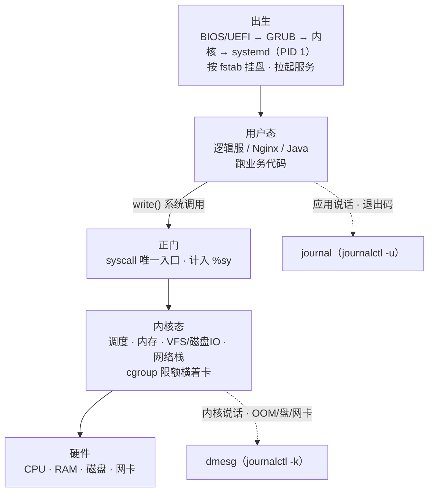
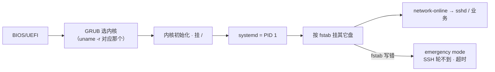
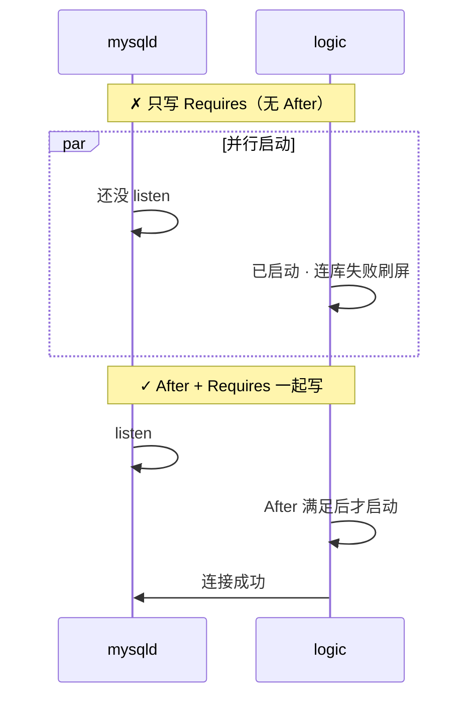
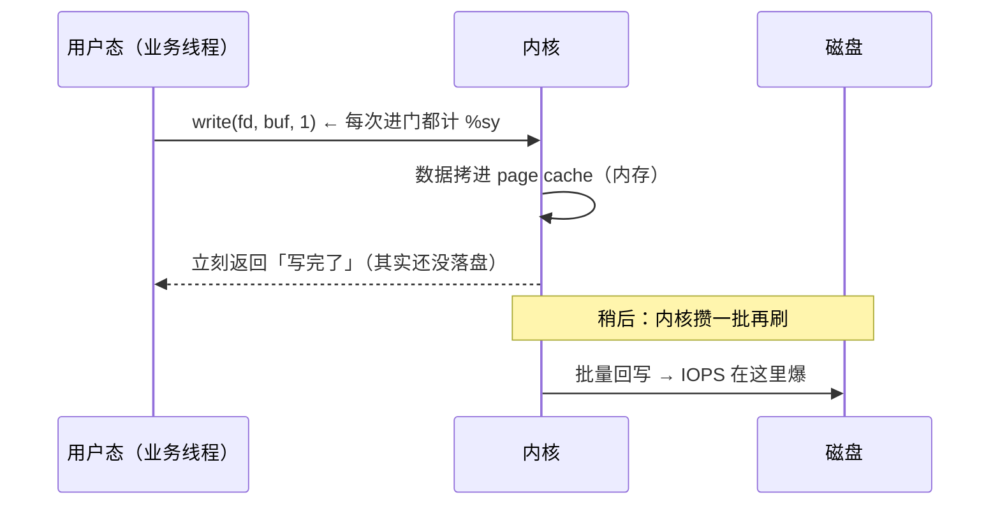
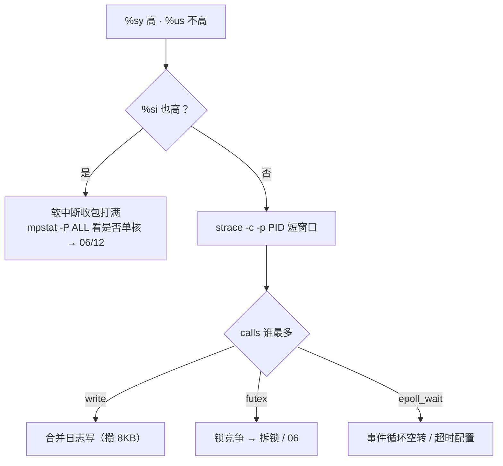
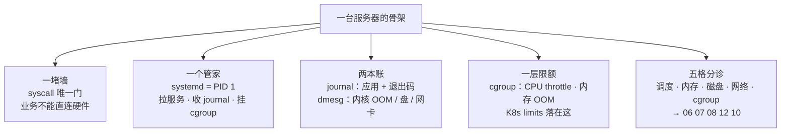
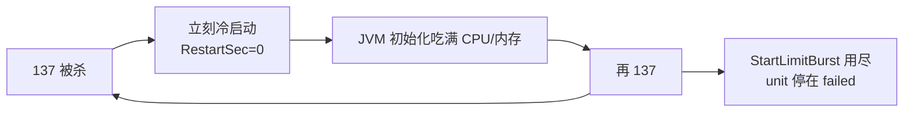
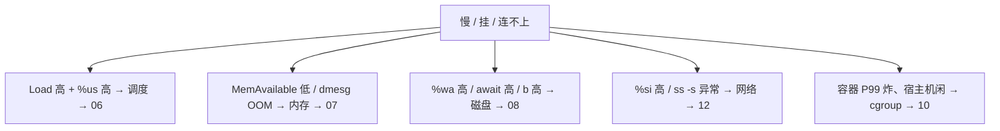
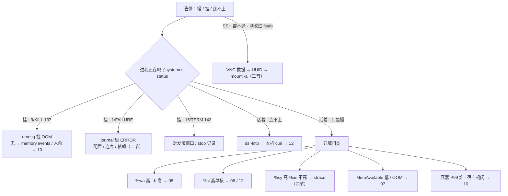

# 内核与系统

> 大家好，欢迎来到这次分享。开讲之前，先带大家回到一个很多值班同学都经历过的现场：
> 凌晨三点告警「逻辑服不可用」，群里已经有人敲了「重启试试」，有人开了 top 不知道看哪个格子——重启会清掉现场，dmesg 里那行 OOM 证据跟着一起没。
> 这一章讲完，你会知道当时那个人错在哪，以及一行 `write` 从用户态到硬件到底走过哪几站。
> **本章回答**：一行业务代码（一次 `write`）从用户态穿过系统调用进内核、落到硬件要走哪条路；进程死了谁记账、机器慢了先归哪一格。
> **不讲**：Load/CPU 细账 → [06](../06-CPU与Load/)；OOM 细账 → [07](../07-内存与OOM/)；磁盘 IO → [08](../08-磁盘与IO/)；进程与信号 → [05](../05-进程与信号/)；cgroup 文件树 → [10](../10-cgroup与容器/)；unit 全文 → [11](../11-Systemd与服务管理/)；sysctl → [24](../24-内核参数与sysctl/)。这些都有专门的章节，本章只在用到时点到为止。

**标记**：🎯重点 · 🔥难点 · ⭐常考 · 🔧实操

**怎么听这场分享**：咱们先看第一节的主图，把「一次 write 的一生」装进脑子；第二到第六节顺着出生 → 穿门 → 干活 → 看世界 → 死亡往下走；第七节专门讲五域定责——也就是开头那个现场的正确解法。每一节讲完都会提示对应练习题。

---

## 一、一张图：一次 write 的一生 🎯⭐

> 🎯 **一句话**：业务不能直连硬件，唯一通道是系统调用；出了事先问「卡在这条路的哪一段」。



**读图**：

- 主线只有一根：出生 → 用户态 → 正门 → 内核 → 硬件，**没有任何箭头从业务直连磁盘/网卡**——这张图合上书要能默画。
- 两条虚线是记账：journal 收应用说的话（含退出码），dmesg 收内核说的话（OOM、盘错、网卡 reset）——进程死了两边各说半句（六节）。
- `top` 的格子照的是不同段：`%us` 用户态、`%sy` 正门、`%si` 内核收包、`%wa` 等盘——「CPU 不高但很慢」多半是后两个（四节、七节）。

⭐ 「没有任何箭头从业务直连硬件」是面试必考（练习题 Q1）。好，主图有了——从出生讲起。

---

## 二、出生：开机、systemd 与 fstab

> 🎯 **一句话**：服务不是自己长出来的——开机到能跑业务，中间隔着 GRUB、内核、PID 1 和一道 fstab；起不来、SSH 不通，根因常在这条链上。

### 开机路径 🎯



**读图**：从左到右是开机顺序，任何一环卡住后面全起不来。fstab 写错卡在「挂其它盘」这一步，sshd 排在它后面——所以**ping 得通、SSH 超时、刚改过 fstab**，三个现象凑齐就是这个签名。

**systemd = PID 1**，三件事都跟值班有关：拉起/停止服务（`systemctl`）、收应用日志（`journalctl -u`）、给服务挂 cgroup（容器/K8s 限额最终落这里 → [10](../10-cgroup与容器/)）。不可用第一眼永远是 `systemctl status`，不是 `top`。

### 依赖：After / Requires / Wants 🎯⭐

| 指令 | 白话 | 管启动顺序？ | 对方挂了自己？ |
|------|------|:---:|------|
| **After** | 等它**启动完**再启我 | 是 | **照跑**——只排序不管死活 |
| **Requires** | 没它我不能活（硬依赖） | 否（可能并行起） | **被 systemd 停掉** |
| **Wants** | 有它更好（软依赖） | 否 | **继续跑** |



**读图**：Requires 只绑「生死」不绑「先后」——只有 Requires 时 systemd 可能并行拉两个，逻辑服连上一个还没 listen 的端口；**硬依赖必须 `After=` 和 `Requires=` 一起写**。对方挂掉时 systemd 给依赖方发的是 **SIGTERM（15）**——「数据库抖两秒、整组逻辑服被停」就是 Requires 写太狠。

```ini
[Unit]
After=network-online.target mysqld.service   # 排序：等 MySQL 之后再启我
Requires=mysqld.service                      # 硬绑：MySQL 挂我也停
Wants=redis.service                          # 软绑：Redis 挂我继续（降级读库）
```

游戏服常见折中：对 MySQL 只写 `After`、重连放应用里做；`Requires` 留给「没有绝对不能跑」的本地 agent。

> ⚠️ **别混**：`After` 只管顺序，不管对方死活——「After 了它就保险」是错的；反过来「有了 Requires 就不用 After」也是错的，两者管的是两个维度。

### Type 与 PIDFile：幽灵进程从哪来 🔧

- **`Type=simple`**（默认首选）：进程前台跑（如 Nginx `daemon off`）。
- **`Type=forking`**：启动命令 fork 后**父进程退出**，真服务是子进程——systemd 靠 **PIDFile** 认主。PIDFile 路径写错/写晚 → unit **failed**，但**子进程可能还占着端口**。

```text
● olddaemon.service - Old Daemon
     Active: failed (Result: timeout)      # ← systemd 认为没起来
# 同时 ss -lntp | grep 8080 仍有一个 pid=旧进程在 LISTEN   # ← 幽灵进程还活着
```

此时再 `start` 就抢端口（`Address already in use`）。先对 PIDFile/Type，别盲目 start。看生效配置（含 drop-in）：`systemctl cat myapp`。能前台就 `simple`；配了会 fork 的老脚本却写 `simple`，父进程一退出 systemd 会把整棵 cgroup 杀掉。

### fstab 写错 → SSH 不通：救援 🔧

> 🔍 **现场**：昨天加了数据盘、fstab 写了 `/dev/sdb1`，今早重启 SSH 上不去，ping 是通的。

```text
① 云 VNC / 串口登录（不是 SSH）
② GRUB 按 e，linux 行末加 rd.break 启动（或选救援项）；已部分起来可 systemctl isolate rescue.target
③ mount -o remount,rw /
④ blkid 查 UUID；注释 fstab 坏行或改成 UUID=a1b2c3d4-...
⑤ mount -a    # 必须无报错再 reboot
```

坏行 `/dev/sdb1 /data xfs defaults 0 0` 的坑在**设备名重启会变**（sdb1→sdc1），UUID 稳定。细账 → [09](../09-文件系统与inode/)。已经能 SSH 时直接改 fstab + `mount -a` 验证，不必进救援。

练习题 Q7、Q9、Q11。机器活了，业务代码怎么进内核？——穿门。

---

## 三、穿门：用户态、内核态与系统调用

> 🎯 **一句话**：CPU 分两种特权级，业务跑在低的一级、碰不了硬件；要碰，只能走系统调用这扇唯一的正门。

🔥 大家想想：业务代码里写一句 `write`，它真的直接碰了磁盘吗？很多人会含糊说「内核帮忙写了」——咱们放慢一点。CPU 分两种特权级，业务跑在低的一级、碰不了硬件；要碰，只能走**系统调用（system call，syscall）**这扇唯一的正门。

| 对比 | 用户态（user mode） | 内核态（kernel mode） |
|------|--------------------|----------------------|
| 跑什么 | 业务代码：逻辑服、Nginx、Java | 调度、内存、VFS/IO、网络栈、cgroup |
| 能碰硬件吗 | **不能，一切经系统调用** | 能 |
| CPU 特权级 | 低（x86 **ring 3**） | 高（**ring 0**，**特权级 protection ring**） |

配套两个地址空间名词：**用户空间（user space）/ 内核空间（kernel space）**——每个进程的虚拟地址空间分两块，内核空间全机共享、放着内核代码和内核数据；进程「进入内核」就是开始执行内核空间里的代码。

**系统调用（system call，syscall）** = 用户程序请求内核服务的受控入口，用户空间进内核空间的唯一正门：

```text
读/写文件、打日志      open / read / write
建 TCP 连接            socket / connect / sendto
创建进程/线程          clone
锁在内核里等           futex
```

> 💡 **打个比方**：用户态是餐厅前台——能接单记账，不能进后厨动煤气灶；syscall 是传菜窗口，每递一次菜扣一点 `%sy` 的时间账。

### 进内核的三种方式，别混成一种 🔥

- **系统调用**：进程**主动**发起——`write`、`futex` 都是业务代码自己调的，耗时记 `%sy`。
- **中断（interrupt）**：**被动**叫门。**硬中断（hardirq）** 是硬件拉线叫 CPU（网卡「包到了」，`top` 的 `%hi`）；**软中断（softirq）** 是内核把能推迟的活稍后批量做（收包剥头进协议栈，`%si`）——细账 → [06](../06-CPU与Load/)、[12](../12-网络栈与Socket/)。
- **上下文切换（context switch）**：调度器把 CPU 从一个进程换给另一个进程，要保存/恢复寄存器，`vmstat` 的 `cs` 列——换的是**进程**，代价高于一次进出内核。

> ⚠️ **别混**：系统调用 ≠ 上下文切换。syscall 是**同一个进程**在用户态/内核态之间切（mode switch），函数没变、账本没换；上下文切换是**换进程**，调度器干的。「系统调用就是上下文切换」是面试常见扣分句。

一次 syscall 往返约 **100～300ns**——单次可忽略，打到十万百万次就是事故（下节）。

> 📝 **面试**：问「什么是用户态和内核态」，答「CPU 特权级分 ring 0 / ring 3，内核在 ring 0 能碰硬件、业务在 ring 3 碰不了，只能走系统调用这条受控通道；进出一次约 100～300ns，全记在 `%sy` 里」。再被追问就补「系统调用是主动切特权级，中断是硬件被动叫门，上下文切换是调度器换进程——三件事」。

口诀：**「系统调用是唯一正门」**。练习题 Q2。进了门，一次 write 怎么干活？

---

## 四、干活：一次 write 在内核里

> 🎯 **一句话**：write 返回快是因为数据先进页缓存；`%sy` 高是进门太勤，不是内核坏了——先 strace 数次数，别加核。

### page cache：write 为什么「看起来飞快」🔥



**读图**：write 的「快」快在内存——**页缓存（page cache）** 是内核拿空闲内存缓存磁盘数据的那层 RAM，write 返回 ≠ 落盘（掉电会丢，`fsync` 才强制落盘）。这也解释了日志场景的经典结论：**盘被打满通常打满的是 IOPS（每秒 IO 次数），不是容量写满**。

### %sy 高怎么证明：strace 数次数 ⭐🔧

活动高峰战斗服 `%sy` 40%、`%us` 8%，有人喊「加 8 核」——先证明是进门太勤：

```bash
pgrep -af logic-server        # 先拿到 PID
# 28451 /opt/game/logic-server -Xmx4g   ← 进程还在，PID=28451
strace -c -p 28451            # 采 5～10 秒 Ctrl-C 结束；活动服勿长挂
```

```text
% time     seconds  usecs/call     calls    errors syscall
 62.31    0.182341          12     15234           write      ← calls 第一：几秒一万多次写
 18.42    0.053891         892        60           futex      ← 次数少但单次 892μs：有锁等待
  8.11    0.023761         145       164           epoll_wait ← 事件循环正常
```

`calls` 列 `write` 一万多次 → 每条日志一次 write。治理是**减少次数**：攒到 **8KB** 再写，100 万次变约 125 次；不是加核。100 万次 1 字节 write ≈ **0.1～0.3s CPU**——`%sy` 高、`%us` 不高的账就是这么来的。

### top 六个格子，各照一段 🎯

- **`%us`** 用户态算业务——「不高就不慢」是误判，可能 `%wa` 在等盘
- **`%sy`** 进内核做系统调用——进门次数多，不是内核 bug
- **`%wa`** CPU 闲着等磁盘 IO——Load 高 `%us` 低先看它 → [08](../08-磁盘与IO/)
- **`%hi` / `%si`** 硬中断 / 软中断（收包常见）→ [06](../06-CPU与Load/)、[12](../12-网络栈与Socket/)
- **`%id`** 真空闲——整机闲 ≠ 容器闲（cgroup throttle，五节）
- **`%st`** 虚拟化被宿主拿走的时间

### %sy vs %si：本章最易混 ⭐🔥

| | `%sy` | `%si` |
|--|-------|-------|
| 谁在干活 | 进程**主动**做系统调用 | 内核**软中断**（常见网卡收包） |
| 典型场景 | 百万次小 write | 进站包打满、单核接近 100% |
| 第一刀 | `strace -c -p PID` 看 calls | `mpstat -P ALL 1` 看哪个核 → 06/12 |



**读图**：先分 sy 还是 si，再往下走——`%si` 高时 strace 业务进程是白忙，收包活根本不在业务线程里。

> ⚠️ **别混**：① `%sy` 高 ≠ 内核 bug、更不等于要重装——是进门次数多。② `vmstat` 输出里的 `si/so` 是 **swap in/out（换页）**，和 `top` 的 `%si`（软中断）共用两个字母、完全两码事。

和 perf 怎么分工：**syscall 次数**用 `strace -c` / bpftrace；**函数热点**用 perf / 火焰图 → [06](../06-CPU与Load/)、[21](../21-性能方法论-USE与RED/)。生产别长时间挂 `strace -e trace=all`。

练习题 Q1、Q3。干活靠内核，那咱们怎么「看」内核账本？

---

## 五、看世界：/proc、uname 与 cgroup 的两本账

> 🎯 **一句话**：机器里看到的每个数字都有出处——free 读的是 `/proc/meminfo` 这本宿主机账，容器的真账在 cgroup。

### /proc：内核本人开的窗口

**/proc 是伪文件系统（procfs）**——不是磁盘上的文件，是内核把内部状态实时渲染成文本；读它就是问内核本人。常用几扇窗：`/proc/meminfo`（free 的数据源）、`/proc/cpuinfo`（CPU 型号核数）、`/proc/<pid>/status`（状态、VmRSS、Threads）、`/proc/<pid>/fd`（打开了什么）、`/proc/cmdline`（本次启动内核参数）、`/proc/uptime`。

```bash
grep -E '^(Name|State|VmRSS|Threads)' /proc/28451/status
# Name:   logic-server      ← 进程名
# State:  S (sleeping)      ← 可中断睡眠，等事件；D 状态才是不可中断等 IO（→05）
# VmRSS:  2096128 kB        ← 物理内存约 2GB，要和 cgroup limit 对比才有意义
# Threads:        86
```

### uname：认本机身份

```bash
uname -a
# Linux game-s1 5.15.0-91-generic #101-Ubuntu SMP ... x86_64 GNU/Linux
# ↑主机名（没登错机）  ↑内核版本（对文档、对 grub 回滚项）      ↑架构（装包/内核模块匹配）
```

内核升级 = 变更：有窗口、有值守、grub **留上一版**，验收 `uname -r` 到位 + `dmesg` 无 oops；关掉无人值守自动升级，别在活动窗口升。主机名用 `hostnamectl set-hostname` 改；`/etc/hosts` 里本机名没对上，sudo 解析自己会很慢；云上还要防 cloud-init 把名字改回去。

### 容器里 free 为什么撒谎 🎯⭐

> 🔍 **现场**：Pod limit 2Gi，容器里 `free -h` 显示 62Gi；十分钟后 Pod 137 退出，开发说「内存明明够」。

```bash
free -h                                   # 容器内执行
# Mem:  62Gi  8.2Gi  45Gi  ...  52Gi available   ← 读的是宿主机 /proc/meminfo
cat /sys/fs/cgroup/memory.max             # cgroup v2（v1 是 memory/memory.limit_in_bytes）
# 2147483648                              ← 字节 = 2GiB，超了这组进程就被 OOM 杀（137）
```

| | `/proc/meminfo`（free 读它） | cgroup（`memory.max` / `cpu.max`） |
|--|------------------------------|--------------------------------------|
| 是谁的账 | **宿主机**的内存/CPU 视图 | 这组进程的**真限额** |
| mount namespace 换它吗 | **不换**——K8s 没改这份视图 | — |
| 拿它判断会不会 OOM | **不行** | 行；K8s `limits` 就是它 |

`nproc` 同理返回宿主机核数：limit 1 核的容器里 Go 默认 `GOMAXPROCS=16` → CPU **throttle（限流）**——宿主机 `%id` 很高、容器 P99 照炸。监控看 `container_memory_working_set_bytes` 对比 limit；**不要**把容器里的 `node_memory_MemAvailable` 当容器可用内存。细账 → [10](../10-cgroup与容器/)。

### 收束：一台服务器的骨架五件套 🎯⭐

到这里，「这台机器由什么组成」的零件齐了。面试问「讲讲 Linux 系统的分层 / 一台服务器怎么排障」，要的就是这张清单——**五件套，一件不落**：



**读图**：五件各管一段——墙管「怎么进内核」，管家管「进程谁拉起、日志谁收」，账管「死了怎么验尸」，限额管「容器世界谁说了算」，分诊管「告警先去哪」。前四件是**结构**，第五件是**动作**。

> ⚠️ **别混**：骨架不回答「为什么慢」——五格只是分诊台，格内细账在对应章；也别拿整机指标（free、`%id`）去结案容器的事，那是两本账。

> 📝 **面试**：按「**墙、管家、账、限、诊**」五个字背。每个字都能展开一层：墙 = ring 0/3 + syscall；管家 = PID 1 三职；账 = journal vs dmesg；限 = cgroup 两本账；诊 = 五格出口。

口诀：**「容器 free 看宿主机，真限额在 cgroup」**。练习题 Q6、Q12。活着会看，死了呢？

---

## 六、死亡：退出码、双日志与死亡螺旋

> 🎯 **一句话**：进程死了先问「怎么死的」（journal 的退出码），再问「谁杀的」（dmesg）——两个问题、两本账，缺一个就结不了案。

### status：死法先看退出码 🎯⭐

```bash
systemctl status s3-logic
```

```text
● s3-logic.service - Logic Server
   Active: failed (Result: signal) since Sun 2025-12-28 03:12:05 CST   ← 挂了 5 分钟
  Process: 28451 ExecStart=/opt/game/logic-server (code=killed, signal=KILL)   ← 死法是 9
```

- **`status=9/KILL`**（退出码 **137 = 128+9**）：收到 SIGKILL——**还不知道是谁杀的**，去 dmesg。口诀：**「137=SIGKILL，143=SIGTERM」**——⭐ 面试必考。
- **`status=15/TERM`**（**143 = 128+15**，**SIGTERM**）：正常停/发版——对变更窗口。
- **`status=1/FAILURE`**：应用自己 `exit(1)`——查 journal 里 ERROR。
- **还活着**：进程在但不可用 → `ss -lntp` → 本机 curl → [12](../12-网络栈与Socket/)。

🔥 很多人看到 137 就结案「OOM」——**错了**。137 只说明被 SIGKILL 杀了，**谁杀的**要去 dmesg 找证据。journal 和 dmesg 是两本账，缺一个就结不了案。

### journal vs dmesg：两本账 🔥

> 💡 **打个比方**：journal 是前台收银小票——「顾客走了、怎么走的（退出码）」；dmesg 是后厨监控——「是不是保安（OOM Killer）把人架出去的」。

| | journal（`journalctl -u 服务名`） | dmesg（`dmesg -T` / `journalctl -k`） |
|--|-----------------------------------|----------------------------------------|
| 谁写的 | systemd + 应用 stdout/stderr | **内核** |
| 能证明 | 退出码、配置错、连库失败 | OOM、I/O error、网卡 reset |
| 对 SIGKILL 说到哪 | 「被 9 杀了」——**不证明是 OOM** | 「OOM Killer 杀了 pid 28451，当时 RSS 多少」 |

SIGKILL 还可能来自人手 `kill -9`、kubelet 强制杀——所以 journal 只写 `9/KILL` 时**必须**去 dmesg 对时间和 PID。

**三段典型输出，对着念一遍**：

```text
# journal · 被系统杀
Dec 28 03:12:05 systemd[1]: myapp.service: Main process exited, code=killed, status=9/KILL   ← 死法=9
Dec 28 03:12:05 systemd[1]: myapp.service: Failed with result 'signal'.                      ← 不是自己 exit

# dmesg · 同一次 OOM（内核说的）
Out of memory: Killed process 28451 (java) total-vm:8388608kB, anon-rss:2096128kB
# ← PID 和 journal 对上 = 内核 OOM 杀的；anon-rss 约 2GB 被杀 → 07 查 MemAvailable 和 limit

# journal · 应用自己错
myapp[28451]: ERROR: connect mysql: connection refused                                  ← MySQL 没 listen
systemd[1]: myapp.service: Main process exited, code=exited, status=1/FAILURE           ← 自己 exit(1)，dmesg 通常无内容
```

**交叉结案四象限**：

- journal `9/KILL` + dmesg 有 OOM 行 → 整机 OOM → [07](../07-内存与OOM/)
- journal `9/KILL` + dmesg 无 OOM → cgroup 限额杀或人杀 → 查 `memory.events`（[10](../10-cgroup与容器/)）
- journal `1/FAILURE` + dmesg 无 → 应用逻辑/依赖错，查 journal 里 ERROR
- journal `connection refused` + `1/FAILURE` → 依赖没就绪 → 查 After/Requires（二节）

常用参数：`-b` 本次开机、`-b -1` 上次开机、`--since "10:00"`。**容器注意**：很多镜像不挂宿主 kmsg，容器内 `dmesg` 可能是空的——上**宿主机**看，或看 K8s `OOMKilled` / `memory.events`。

### Restart 死亡螺旋 🔥

`Restart=always` + `RestartSec=0`：无论怎么退出（含 `exit 0` 热更）都立刻拉回来——OOM 场景就是螺旋：



**读图**：环上每一步都在放大事故——杀、拉、吃满、再杀；同机服务被冷启动的 CPU 峰值拖死，最后 StartLimit 用尽停在 failed，看起来像「服务起不来」。更隐蔽的坑：热更脚本让进程正常退出换新包，`always` 把旧进程拉回来和新进程抢端口。生产写法：

```ini
Restart=on-failure
RestartSec=5s
StartLimitBurst=3
StartLimitIntervalSec=60
```

进了 failed：`systemctl reset-failed myapp && systemctl start myapp`——**先看为什么连续失败**（dmesg、cgroup、配置），再 reset；只 reset 不修根因，起来再撞一次。

### 不可用第一眼：status → 留证 → 再拉起 🎯

```text
① 影响面（30 秒问清）：只有这一台还是整组？刚发版/刚改 unit？进不去还是进得去但卡？
② systemctl status：进程在不在？退出码 9 / 1 / 15？
③ 双日志：journalctl -u s3-logic -n 80 --no-pager + dmesg -T | tail -30，证据落盘
④ 再拉起或切流量——重启能恢复服务，也会清掉内存形态、fd 数量、dmesg 时间线
```

三问常备：**进程还在不在？还能不能变更？已有流量还通不通？**（只是慢用 `curl -w` 分段 → [16](../16-网络排障与抓包/)）。

> 📝 **面试**：「不可用第一眼」答「先问影响面，再 `systemctl status` 看退出码，`9/KILL` 对 dmesg 找 OOM、`1/FAILURE` 查 journal 里 ERROR，两边对上才结案；证据落盘再拉起，不先 top、不先重启」。

口诀：**「137=SIGKILL，143=SIGTERM」**；**「先 journal×dmesg，别先重启」**。练习题 Q4、Q5、Q8。

---

## 七、作战：五域归类与定责

> 🎯 **一句话**：慢/挂/连不上先归五格再开对应章——本章只负责分到格，不负责格内细账。

> 💡 **打个比方**：急诊分诊——发烧归内科、骨折归骨科；先分诊再挂号，别一上来就开抗生素（改 sysctl）或截肢（重启）。



**读图**：入口先分「挂 / 慢 / 连不上」三种；「慢」才进五格。第一眼各格看：load 与 `%us/%sy/%st`（调度）、MemAvailable 与 RSS（内存）、`%wa` 与 await（磁盘）、`%si` 与 `ss -s`（网络）、`memory.max`/`cpu.stat`（cgroup）。

### vmstat 一眼归类 🔧

丢掉第一行（开机以来的累计值）：

```bash
vmstat 1 5
```

```text
 r  b   swpd   free   buff  cache   si   so    bi    bo   in   cs us sy id wa st
 2 18      0 8123456 123456 9876543  0    0   120  8900 4500 12000  5  2 70 18  0
# ↑r=2 可运行队列不大 → 不是算力型   ↑b=18 有 18 个进程 D 状态等 IO → 归磁盘
#                                              ↑wa=18 CPU 在等盘，和 b 高互相印证 → 08
#                                              ↑us=5 id=70：Load 可能很高但 CPU 闲 → 典型高 Load 低 CPU，别加核
```

四工单速练：① Load 40、idle 70% → D/IO → [08](../08-磁盘与IO/)、[05](../05-进程与信号/)，**别加核**；② 进程 137、宿主机还有内存 → cgroup OOM → 交叉 dmesg 与 `memory.events`；③ `%sy` 40%、`%us` 20% → 系统调用 → 本章四节 strace；④ 容器 free 显示 64G → cgroup 限额结案（五节）。

### 定责决策树



**读图**：第一刀分「进程在不在」——挂了走退出码分支（左边），活着走五域（右边），fstab 是独立入口。分支全部是真实现象，对号入座再动手。

| 现象 | 先做 | 别做 |
|------|------|------|
| 不可用 | status → 双日志留证 | 先重启 / 先 top |
| 9/KILL、137 | dmesg；容器看 memory.events | 只看应用日志说「崩了」 |
| 反复 start + 137 | 改 Restart 策略，再查内存 | 只 reset-failed |
| `%sy` 高 `%us` 不高 | 分 sy/si → `strace -c` | 先加核 |
| 容器 free 很大 | cgroup `memory.max` | 信 free 结案 |
| SSH 不上 + 刚改 fstab | VNC → UUID → `mount -a` | 空转重试 SSH |
| unit failed 但端口有人听 | 对 PIDFile / Type | 再 start 抢端口 |
| Load 高 idle 也高 | 看 b / `%wa` → 08 | 加核 |

### 60 秒剧本 🔧

> 🔍 **现场**：接到「不可用」报障，60 秒走完这条线再下结论。

```text
① 0–10s  影响面：单机还是整组？刚发版？玩家进不去还是进得去但卡？
② 10–30s systemctl status：进程在不在？退出码 9 / 1 / 15？
③ 30–45s 双日志对上：journalctl -u <svc> -n 80 --no-pager + dmesg -T | tail -30，证据落盘
④ 45–60s 定责拉起：OOM→07 · 连库→依赖 · 活着→ss/curl；摘流量再 restart，不清现场
```

---

这一节对应练习题 Q10、Q13、Q14——五域定责务必练熟。


**回到开头那个现场**：有人喊「重启试试」。正确剧本是：先分域（CPU/内存/盘/网/服务）→ 留证（journal × dmesg）→ 再谈重启。现在再看群里那句「重启试试」，你知道该怎么拦住他了。

## 八、收口

### 命令速查 🔧

```bash
# 服务还在不在、退出码
systemctl status myapp                        # 第一眼；看 Active / Result / 退出码
systemctl cat myapp                           # 生效 unit（含 drop-in）
# 双日志
journalctl -u myapp -n 80 --no-pager          # 应用 + 退出码；-b -1 上次开机、--since "10:00"
dmesg -T | tail -30                           # 内核：OOM / 盘 / 网卡；容器内常为空，上宿主机
# CPU 账
mpstat -P ALL 1 3                             # 五格 + 每核 %si
vmstat 1 5                                    # r/b/wa 归类（丢第一行）
strace -c -p {PID}                            # 短窗口数 syscall 次数
# 本机身份与视图
uname -r; hostnamectl                         # 内核版本 / 主机名
grep -E '^(State|VmRSS)' /proc/{pid}/status   # 进程状态 / RSS
# 容器真限额
cat /sys/fs/cgroup/memory.max                 # 真限额；free 读的是宿主机 /proc/meminfo
```

### 面试锚点

遮住右列自问自答，卡壳的行回去重读对应小节——能讲出来才算会：

| 问 | 30 秒答 |
|----|---------|
| 用户态和内核态？ | ring 3 / ring 0 两种特权级；业务碰不了硬件，只能走系统调用，进一次 100～300ns 记 `%sy`。 |
| 系统调用是什么？ | 用户空间进内核空间的唯一受控入口：write/read/socket/clone/futex；主动发起，区别于中断（被动）和上下文切换（换进程）。 |
| 系统调用 = 上下文切换？ | 不是。syscall 是同一进程切特权级；上下文切换是调度器换进程、保存恢复寄存器（vmstat 的 cs）。 |
| 用户态能直接写磁盘吗？ | 不能，只能 syscall；write 先进 page cache，稍后批量回写。 |
| write 返回了就是落盘了吗？ | 不是，在 page cache；掉电会丢，fsync 才强制。 |
| `%sy` 高怎么办？ | 先和 `%si` 分开；`strace -c` 看 calls 列，write 多就合并写，不是加核、更不是内核 bug。 |
| `%sy` 和 `%si` 区别？ | sy = 进程主动 syscall；si = 软中断（收包常见）。si 高查 mpstat 单核 → 06/12。 |
| journal 和 dmesg 看什么？ | journal：应用 + 退出码；dmesg：内核 OOM/盘/网卡。9/KILL 只证明死法，凶手在 dmesg。 |
| 137 是什么？ | 128+9 = SIGKILL 的退出码；143=128+15 = SIGTERM。 |
| 不可用第一眼？ | 影响面 → status 退出码 → 双日志留证 → 再拉起；不先 top、不先重启。 |
| After / Requires / Wants？ | After 只排序不管死活；Requires 硬绑共生死（对方挂发 SIGTERM）；Wants 软绑。硬依赖 After+Requires 一起写。 |
| 容器 free 64G 够用吗？ | free 读宿主机 /proc/meminfo；真限额 cgroup memory.max。OOM 137 先对 limit。 |
| nproc 在容器里？ | 返回宿主机核数；limit 1 核 + GOMAXPROCS=64 → throttle，宿主机闲容器 P99 炸。 |
| Restart=always 会怎样？ | 配 RestartSec=0 是 OOM 死亡螺旋；生产 on-failure + 5s + 3 次/60s。 |
| Type=forking 坑在哪？ | 靠 PIDFile 认主，写错则 unit failed 但子进程占端口（幽灵进程）；能前台就 simple。 |
| fstab 为什么用 UUID？ | /dev/sdb1 重启可能变 sdc1；写错卡 emergency，SSH 超时，VNC 救援改 UUID + mount -a。 |
| 内核升级怎么验收？ | uname -r 到位 + dmesg 无 oops；grub 留上一版，当变更管理。 |
| systemd 是什么？ | PID 1：拉服务、收 journal、挂 cgroup；K8s limits 最终落在 cgroup。 |
| 告警来了先干嘛？ | 分「挂/慢/连不上」，慢的丢进五格（调度/内存/磁盘/网络/cgroup）再开对应章。 |
| Load 高但 CPU 闲？ | 看 vmstat 的 b 和 %wa：D 状态等 IO → 08，不是加核。 |

### 易错一句话对照

- 用户态能直接写磁盘 → 只能走系统调用，`write` 也先进 page cache
- 系统调用就是上下文切换 → 一个是切特权级，一个是换进程
- `%sy` 高是内核 bug → 是进门次数多，strace 数 calls
- `%sy` 和 `%si` 一回事 → 一个主动 syscall，一个软中断收包
- vmstat 的 si/so 是软中断 → 是 swap in/out 换页，和 top 的 %si 撞字母
- 盘满 = 容量满 → 日志场景常是 IOPS 打满
- 不可用先 top / 先重启 → 先 status + 双日志留证；重启毁证据
- journal 有 9/KILL 就定 OOM → 只证明死法，凶手在 dmesg / memory.events
- 容器 free 大 = 内存够 → 读的是宿主机账，真限额 memory.max
- 容器 top CPU 低 = 没事 → 可能按宿主机核算偏低，看 cpu.stat 的 throttled
- After 了就保险 → After 只排序，对方挂了自己照跑
- 有了 Requires 不用 After → 可能并行起，连未就绪的库
- Restart=always 更稳 → 配 RestartSec=0 是死亡螺旋
- failed 后只 reset-failed → 根因还在，起来再撞
- unit failed 就再 start → 先查 PIDFile/Type，别抢端口
- fstab 写 /dev/sdb1 → 重启设备名会变，用 UUID
- Load 高就加核 → b/%wa 高是等 IO，加核没用

### 数字墙

> syscall 往返 **100～300ns** · 100 万次 1B write ≈ **0.1～0.3s CPU** · 日志合并批量 **8KB**（100 万次 → 约 **125** 次）· **137 = 128+9**（SIGKILL）· **143 = 128+15**（SIGTERM）· systemd = **PID 1** · 生产 Restart：**on-failure + 5s + 3 次/60s** · 五域 **5** 格 · top 六格 **us/sy/wa/hi/si/id**（+st）· 特权级 **ring 0 / ring 3**

---

## 合上书

学到这里，先别急着翻下一章。合上书，试试下面这几件事——卡住就回对应小节：

- [ ] **默画一节的图**：出生 → 用户态 → 正门 → 内核 → 硬件；「没有任何箭头从业务直连硬件」（对应练习题 Q1）。
- [ ] **口述出生**：开机路径、systemd 三职、After/Requires/Wants、fstab（Q7、Q9、Q11）。
- [ ] **口述穿门**：ring 0/3、系统调用唯一正门、和中断/上下文切换（Q2）。
- [ ] **默画干活**：write 计 %sy → page cache → 批量回写；8KB 合并的账（Q1、Q3）。
- [ ] **口述看世界**：/proc、free 两本账、memory.max（Q6）。
- [ ] **默画骨架五件套**：墙、管家、账、限、诊（Q12、Q14）。
- [ ] **口述死亡**：137/143/1、四象限交叉结案、Restart 生产写法（Q4、Q5、Q8）。
- [ ] **定责**：五域第一眼、vmstat r/b/wa、60 秒剧本、为什么不能先重启（Q10、Q13、Q5）。

下一章：[进程与信号](../05-进程与信号/)——D 状态为什么杀不掉、TERM 和 KILL 差在哪。
