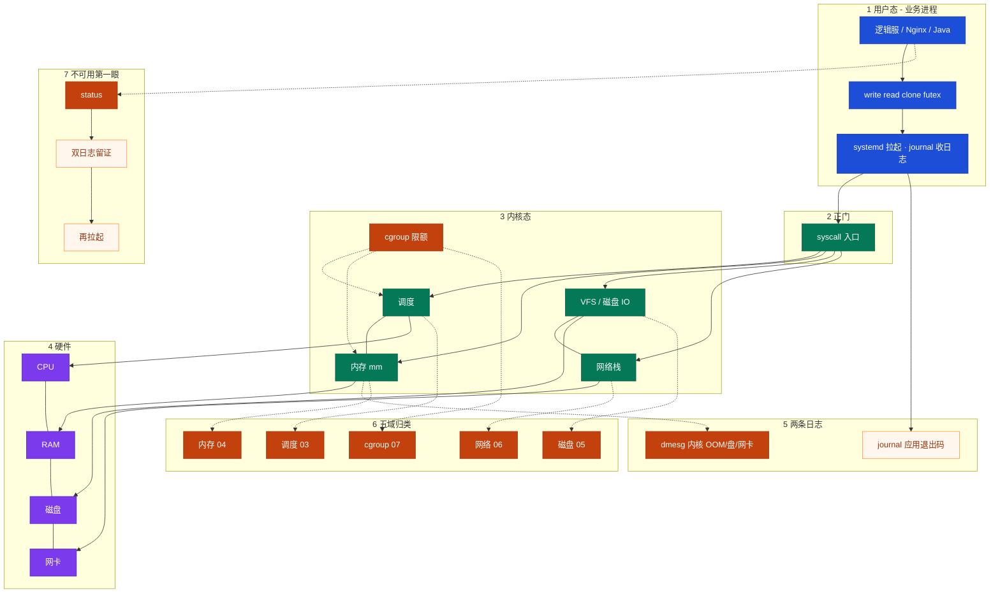
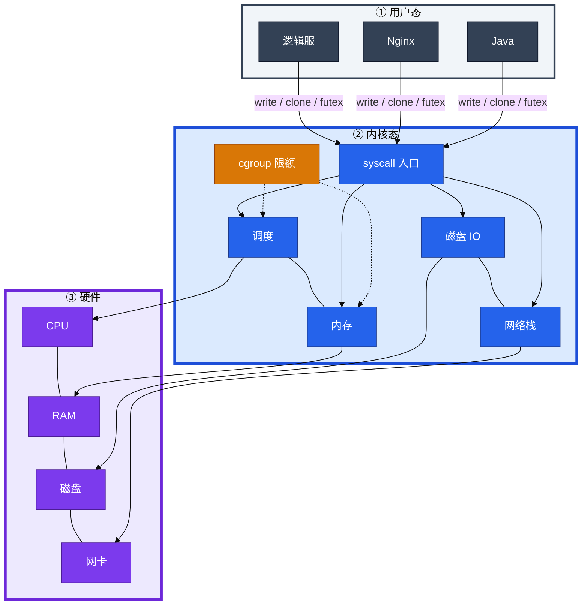
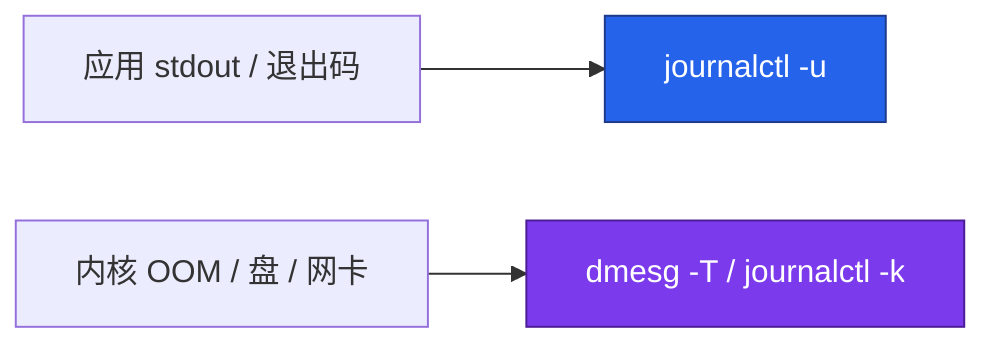
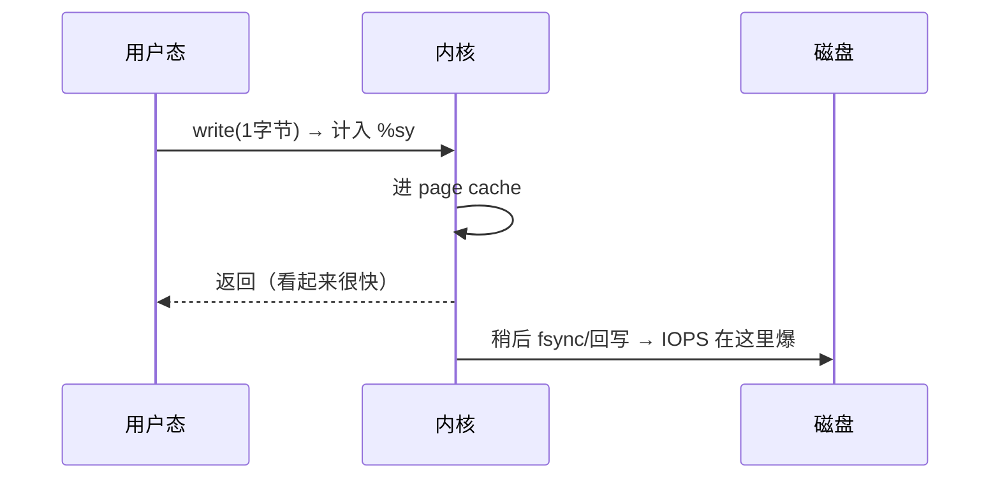
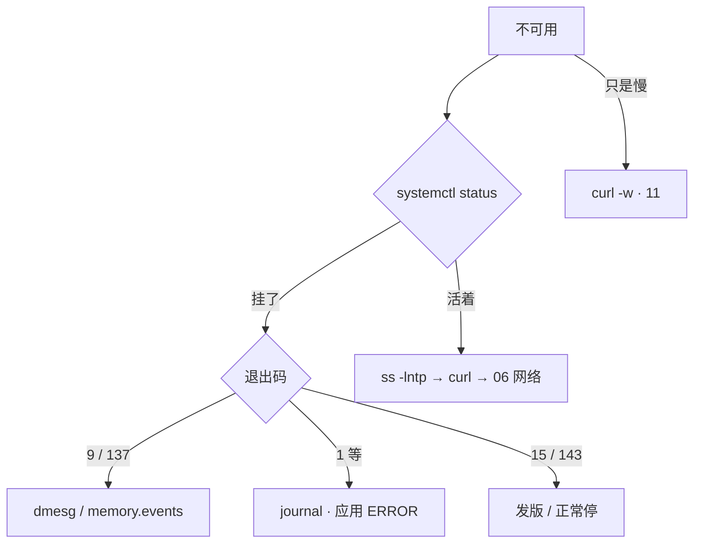
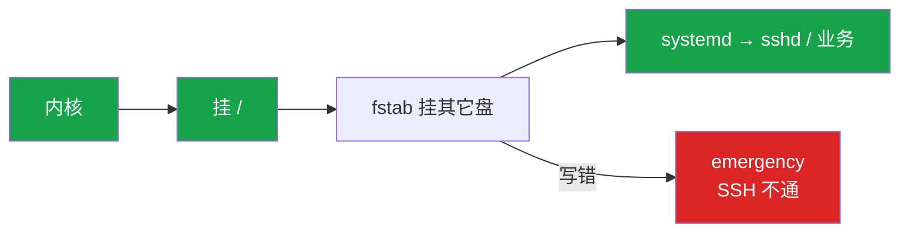
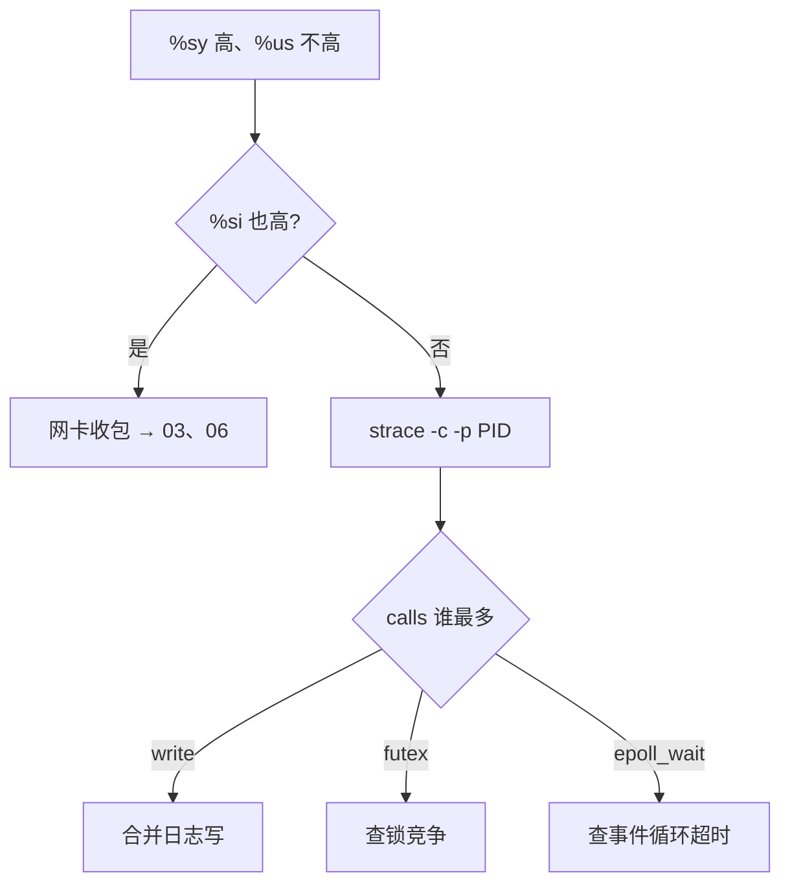
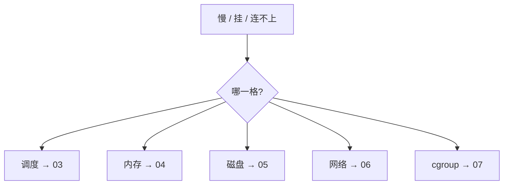
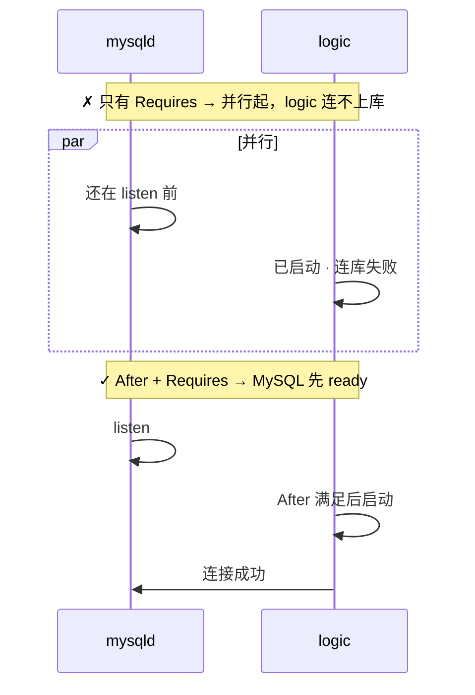
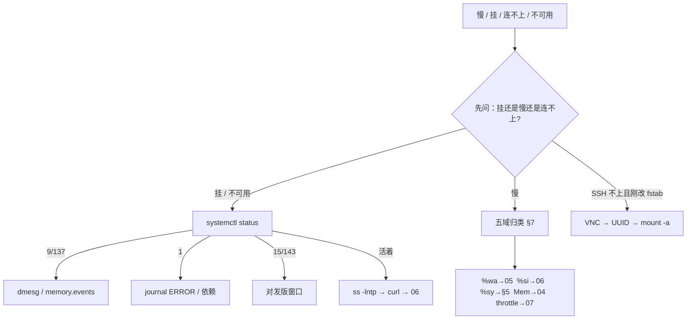

# 内核与系统

> **这章解决什么**：凌晨告警「逻辑服不可用」——先分清层、再进对的格子；别一上来 top 或重启。  
> **读法**：**先看总图** → **再认名词** → **再抠 %sy/%si、双日志、五域定责**。  
> **刻意不展开**：Load/CPU 细账 → [06](../06-CPU与Load/)；OOM → [07](../07-内存与OOM/)；磁盘 IO → [08](../08-磁盘与IO/)；进程信号 → [05](../05-进程与信号/)；cgroup 文件树 → [10](../10-cgroup与容器/)；unit 全文 → [11](../11-Systemd与服务管理/)。

---

## 本章目录

1. [本章定位](#1-本章定位)
2. [先看总图：从业务到硬件怎么分层](#2-先看总图从业务到硬件怎么分层) ← **开篇必读**
   - [2.0 全章知识串图](#20-全章知识串图一张把细节串起来) ← **架构总览**
   - [2.6 走读 write](#26-完整走读一次-write从用户态到磁盘) · [2.7 走读不可用](#27-完整走读服务不可用第一眼) · [2.8 开机路径](#28-开机路径boot一眼图)
3. [名词扫盲（对照总图认词）](#3-名词扫盲对照总图认词)
4. [核心对象：用户态 / 内核 / systemd / cgroup](#4-核心对象用户态--内核--systemd--cgroup)
5. [%sy vs %si：本章最易混](#5-sy-vs-si本章最易混) ← **重点精读**
6. [journal 与 dmesg：双日志定责](#6-journal-与-dmesg双日志定责)
7. [五域归类：分层排障地图](#7-五域归类分层排障地图)
8. [/proc、uname 与开机落地](#8-procuname-与开机落地)
9. [systemd 依赖与 Restart](#9-systemd-依赖与-restart)
10. [定责决策树与命令速查](#10-定责决策树与命令速查)
11. [去哪章继续学](#11-去哪章继续学)
12. [面试 · 易错 · 数字](#12-面试--易错--数字)
13. [合上书](#合上书)

---

## 1. 本章定位

| 章 | 负责 |
|----|------|
| **01（本章）** | 整机骨架：用户态/内核/syscall、分层归类、双日志、第一眼命令 |
| **02～07** | 各域细账（进程、CPU、内存、磁盘、网络、cgroup） |
| **13** | systemd unit 全文与落地 |

本章是**基础底座入口**。后面所有 `%sy`、OOM、`%wa`、Recv-Q、throttle，都建立在「业务怎么进内核、告警先归哪一格」这张图上。

🎯 **值班签名**：服务不可用——先 `systemctl status` + 双日志，不是先 top、不是先重启。

**本章主线（排障就按这三步想）：**

1. **分层**：业务在用户态 → 进内核靠 syscall → 硬件在最底下；systemd 管进程，journal 收应用，dmesg 收内核。
2. **归类**：慢 / 挂 / 连不上 → 先归调度 / 内存 / 磁盘 / 网络 / cgroup 五格，再开对应章。
3. **留证**：`status` → `journalctl -u` + `dmesg`，看清退出码再拉起。

**读完你能：**

- 默画用户态 → syscall → 内核 → 硬件，并说明业务不能直连磁盘/网卡
- 读懂 `%us / %sy / %wa / %si / %id`，并把 `%sy` 与 `%si` 分开
- 交叉 journal 与 dmesg 结案 137；解释容器里 `free` 为什么撒谎
- 写出 After + Requires；挡住 `Restart=always` + `RestartSec=0` 死亡螺旋
- 用 `/proc`、`uname -r` 认本机身份；fstab 写错能走救援

---

## 2. 先看总图：从业务到硬件怎么分层

> **正确开篇顺序**：先有全局画面，再认词，再抠细节。  
> 先看 **§2.0 全章串图**（考点挂一张板上），再看 **§2.1 分层坐标系**，再跟 **§2.6 / §2.7 走读**。

### 2.0 全章知识串图（一张把细节串起来）

> 🎯 **合上书要能默画这张。** 蓝=用户态 · 绿=内核 · 紫=硬件 · 橙=卡点/定责。  
> 若预览仍报错，以下面 **ASCII 一页板** 为准。



**读图路线：**

| 段 | 记住 |
|----|------|
| ①→② | 业务不能直连硬件，全部过 syscall（§2.1、§2.6） |
| ③ | 内核里调度/内存/IO/网络；cgroup 卡配额（§4、§7） |
| ⑤ | journal ≠ dmesg；9/KILL 必须两边对（§6） |
| ⑥ | 告警先归五格，再开对应章（§7） |
| ⑦ | 不可用：status → 留证 → 再拉起（§2.7、§10） |

```text
┌──────────────────────────────────────────────────────────────────────────┐
│                     01 一张板：从业务到硬件到定责                          │
├─────────────┬────────────────────┬───────────────────────────────────────┤
│  用户态      │  syscall 正门       │  内核 → 硬件                          │
│  逻辑服/Java │  write/clone/futex │  调度/mm/VFS/net → CPU/RAM/盘/网卡    │
│  systemd拉起 │  计 %sy            │  cgroup 卡「允许多少」                │
├─────────────┴────────────────────┴───────────────────────────────────────┤
│  双日志：journal(退出码) · dmesg(OOM/盘/网卡)  ｜ 五域 → 03～07            │
│  第一眼：status → 留证 → 再拉起  ｜ 易混：%sy≠%si · free≠cgroup            │
└──────────────────────────────────────────────────────────────────────────┘
```

---

### 2.1 一张总图（用户态 · 内核 · 硬件 · 先建立坐标系）

假设：逻辑服进程要写一行日志到磁盘。

**怎么读这张分层图：**

- **上**：用户态——业务代码、systemd 管的服务  
- **中**：syscall 正门——唯一合法进内核的路；进一次计一点 `%sy`  
- **下**：硬件——CPU / 内存 / 磁盘 / 网卡；业务**永远**不直连

```text
① 用户态 · 业务进程
════════════════════════════════
  逻辑服 / Nginx / Java
  systemd = PID 1（拉起、收 journal、挂 cgroup）
        │
        │  想碰硬件？只能走正门
        ▼
② syscall 正门（计 %sy）
════════════════════════════════
  open / read / write / socket / clone / futex …
        │
        ▼
③ 内核态
════════════════════════════════
  调度 ── 内存 ── VFS/磁盘IO ── 网络栈
        │           │
        │           └── cgroup 限额（允许多少）
        ▼
④ 硬件
════════════════════════════════
  CPU · RAM · 磁盘 · 网卡
```



**读图三句话（先背这三句）：**

1. 业务**不能**直连硬件，全部过 syscall——`%sy` 高往往是「进门太勤」，不是内核坏了。  
2. cgroup 卡「允许用多少」；容器里 `free` 仍读宿主机视图（见 §8.3）。  
3. **systemd = PID 1**：拉服务、收 journal、挂 cgroup；不可用第一眼看 status。

---

### 2.2 top 五个格子挂在哪一层

`top` / `mpstat` 五个格子 = **CPU 时间在干什么**（合计约 100%）。对照总图：

| 格子 | 在总图哪一层干活 | 常见误判 |
|------|------------------|----------|
| `%us` | ① 用户态算业务 | 「不高就不慢」——可能 `%wa` 在等盘 |
| `%sy` | ② 进内核（syscall） | 不是内核 bug，是**进门次数多** |
| `%wa` | CPU 闲着等磁盘（③→盘） | Load 高、`%us` 低时先看这个 |
| `%si` | 软中断（常见网卡收包） | **和 `%sy` 不是一回事**（§5） |
| `%id` | 真空闲 | 容器 throttle 时整机 `%id` 仍可能很高 |

> **别混**：`%sy` = 进程主动进门；`%si` = 内核稍后干的收包类活。详见 §5。

---

### 2.3 两条日志管管（先挂图，细读在 §6）



| | journal | dmesg |
|--|---------|-------|
| 谁写的 | systemd + 应用 | **内核** |
| 不可用时 | 退出码、ERROR | OOM、I/O error、网卡 reset |

---

### 2.4 五域挂在总图上（先挂图，细读在 §7）

```text
慢 / 挂 / 连不上
        │
        ├─ Load 高 + %us 高     → 调度 → 03
        ├─ MemAvailable 低 / OOM → 内存 → 04
        ├─ %wa 高 / await 高    → 磁盘 → 05
        ├─ %si 高 / ss 异常     → 网络 → 06
        └─ 容器 P99 炸、宿主机闲 → cgroup → 07
```

本章只负责**分到格**；格内细账开对应章。

---

### 2.5 /proc 与 uname：本机身份一眼认

排障前先认「这是哪台、什么内核」——别拿错机、别对着错误内核版本查文档。

| 你想知道 | 看什么 |
|----------|--------|
| 内核版本 | `uname -r` |
| 主机名 | `uname -n` / `hostnamectl` |
| 进程视角的内存 | `/proc/meminfo`（`free` 读这里） |
| 某个进程打开了啥 | `/proc/<pid>/fd`、`/proc/<pid>/status` |
| 启动参数 | `/proc/cmdline` |

细节与输出解读见 §8。

---

### 2.6 完整走读：一次 write（从用户态到磁盘）

> 🎯 用「逻辑服写日志」把总图串一遍。**只保留这一版走读。**

**场景**：活动高峰，战斗服 `%sy` 突然 40%，`%us` 只有 8%。有人喊「加 8 核」。

**一句话：** 每次 write 都进内核计 `%sy`，数据先进 page cache，IOPS 在后面爆。

**现场走一遍：**

1. 你在战斗服上，`top` 看到 `%sy` 高、`%us` 不高——**先别加核**，怀疑 syscall 进门太勤。  
2. 确认 Java 进程 PID：

```bash
pgrep -af logic-server
```

屏幕出现：

```text
28451 /opt/game/logic-server -Xmx4g
```

3. 对 PID 做 5～10 秒 syscall 统计（活动服限时，Ctrl-C 结束）：

```bash
strace -c -p 28451
```

4. 屏幕出现汇总表——**只看 calls 列谁最多**。  
5. 若 `write` 排第一 → 改日志缓冲/批量写，不是加 CPU 核。



| 写法 | syscall 次数 | 结果 |
|------|-------------|------|
| 每条日志 write 1 字节 | ~100 万 | `%sy` 爆 + IOPS 爆 |
| 攒 8KB 再 write | ~125 | 正常 |

**输出解读**（`strace -c` 典型输出）：

```text
% time     seconds  usecs/call     calls    errors syscall
 62.31    0.182341          12     15234           write
 18.42    0.053891         892        60           futex
  8.11    0.023761         145       164           epoll_wait
```

- 第 1 列 `% time`：各 syscall 占采样窗口 CPU 的比例，**write 62%** → 进门写日志是主因。  
- 第 4 列 `calls`：**15234 次 write** → 5～10 秒内一万多次，每条日志一行就 write 一次。  
- `usecs/call` 单次约 12μs，乘以 calls ≈ 0.18s CPU——进门约 **100～300ns** 量级，100 万次 1B write ≈ **0.1～0.3s CPU** → `%sy` 高、`%us` 不高。  
- `futex` 60 次但单次 892μs → 可能有锁等待，次要；先修 write。

> **记住**：日志场景「盘被打满」通常是 **IOPS 打满**，不是容量写满。

**面试怎么说**：「`%sy` 高 `%us` 不高，我先 strace -c 看 calls 列，write 最多就合并日志写；日志盘满通常是 IOPS 打满不是容量满，别先加核。」

---

### 2.7 完整走读：服务不可用第一眼

> 🎯 用「凌晨不可用」把 status → 双日志 → 定责串一遍。

**场景**：值班群 `s3-logic-02` 不可用 3 分钟。有人已经打了「重启试试」。

**一句话：** 影响面（30s）→ status → 双日志留证 → 再拉起。

**现场走一遍：**

1. **影响面（30 秒内问清）**：只有这一台还是整组？刚发版？玩家进不去还是进得去但卡战斗？  
2. **进程还在不在**：

```bash
systemctl status s3-logic
```

3. 看退出码分支：

| status 里看到 | 含义 | 下一步 |
|---------------|------|--------|
| `status=9/KILL` / 137 | SIGKILL | `dmesg` / `memory.events` |
| `status=15/TERM` / 143 | 正常停 / 发版 | 对变更窗口 |
| `status=1/FAILURE` | 自己 exit | journal 里 ERROR |
| 还活着 | 进程在 | `ss -lntp` → 本机 curl → [12](../12-网络栈与Socket/) |

4. **双日志必须对上**：

```bash
journalctl -u s3-logic -n 80 --no-pager
dmesg -T | tail -30
```

5. 证据落盘后再拉起或切流量——**重启能清现场，也能毁掉结案证据**。



**输出解读**（status 片段）：

```text
● s3-logic.service - Logic Server
   Active: failed (Result: signal) since Sun 2025-12-28 03:12:05 CST
  Process: 28451 ExecStart=/opt/game/logic-server (code=killed, signal=KILL)
```

- `code=killed, signal=KILL`：死法是 9——**还不知道是谁杀的**。  
- 下一步必须去 dmesg / cgroup，不能只看这一行就「重启试试」。

---

### 2.8 开机路径（boot）一眼图

服务起不来、SSH 不通，有时根因在**开机挂载**，不在业务代码。

```text
BIOS/UEFI
    │
    ▼
GRUB 选内核（uname -r 对应的那个）
    │
    ▼
内核初始化 · 挂 /
    │
    ▼
systemd = PID 1
    │
    ├─ 按 fstab 挂其它盘  ←── 写错 → emergency，sshd 轮不到
    ├─ network-online
    └─ 各 .service（mysqld → logic …）
```



细节与救援步骤见 §8.4。

---

## 3. 名词扫盲（对照总图认词）

对照 §2.0 / §2.1，把词钉在图上。点到为止，细账在后文。

| 名词 | 对照总图 | 一句话 |
|------|----------|--------|
| **用户态** | ① | 跑业务代码；不能直接碰硬件 |
| **内核态** | ③ | 调度、内存、IO、网络、cgroup |
| **syscall** | ② | 用户态进内核的唯一正门 |
| **%us / %sy / %wa / %si / %id** | CPU 时间账 | 见 §2.2；`%sy`≠`%si` 见 §5 |
| **systemd** | ① 管家 | PID 1：拉服务、收 journal、挂 cgroup |
| **journal** | 日志左管 | 应用 + systemd 说的话、退出码 |
| **dmesg / kmsg** | 日志右管 | 内核说的话：OOM、盘错、网卡 reset |
| **/proc** | 内核视图窗口 | 伪文件系统；`free` 读 `/proc/meminfo` |
| **uname** | 本机身份 | 内核版本、架构、主机名 |
| **cgroup** | ③ 限额 | 给一组进程设 CPU/内存顶；K8s limits 就是它 |
| **page cache** | write 路径 | write 返回后数据可能还在内存，未落盘 |
| **IOPS** | 磁盘 | 每秒 IO 次数；小日志常打满的是它不是容量 |
| **137** | 退出码 | 128+9 = SIGKILL |
| **After / Requires / Wants** | unit | 排序 / 硬绑 / 软绑（§9） |

**值班里怎么认现象**（先听告警/群里怎么说，再对表）：

| 群里/监控说的 | 技术含义 | 你的第一刀 |
|---------------|----------|------------|
| 「服务挂了」「502」 | 进程可能 exit 或被 kill | `systemctl status`，不是 top |
| 「CPU 不高但很慢」 | 可能在等盘 `%wa` 或 cgroup throttle | 先归五格，别加核 |
| 「Java 没了」 | 9/KILL 还是 exit 1？ | journal + dmesg 双日志 |
| 「容器内存够用啊 free 还有 50G」 | free 读宿主机视图 | 看 cgroup `memory.max` |

> **记住**：用户态不能直接写磁盘、不能直接收网卡包；不可用先 status + 双日志，不要先 top、不要先重启。

---

## 4. 核心对象：用户态 / 内核 / systemd / cgroup

### 4.1 用户态 vs 内核态

| 层 | 能干什么 | 不能干什么 |
|----|----------|------------|
| **用户态** | 跑业务代码（逻辑服、Nginx、Java） | 直接碰 CPU 调度、磁盘、网卡 |
| **内核态** | 调度、内存、IO、网络、cgroup | — |

程序碰硬件，只能走 **syscall**——唯一正门：

| 你想干什么 | 典型 syscall |
|------------|--------------|
| 读/写文件、打日志 | `open` / `read` / `write` |
| 建 TCP 连接 | `socket` / `connect` / `sendto` |
| 创建线程/进程 | `clone` |
| 锁在内核里等 | `futex` |

**打个比方**：用户态像餐厅前台——能接单、记菜单，不能直接进后厨改煤气灶；syscall 是传菜窗口，每次递菜都要扣 `%sy` 时间。

### 4.2 systemd（PID 1）

| 职责 | 值班时怎么碰到 |
|------|----------------|
| 拉起 / 停止服务 | `systemctl start/stop/status` |
| 收应用日志 | `journalctl -u` |
| 挂 cgroup | 容器/K8s 限额最终落这里（细账 [10](../10-cgroup与容器/)） |
| 依赖排序 | After / Requires / Wants（§9） |

不可用第一眼永远是 **`systemctl status`**，不是 `top`。

### 4.3 cgroup（先认脸）

**cgroup** = 给一组进程设配额：CPU 超 → **throttle**；内存超 → 这组被 OOM 杀。K8s `limits` 就是它。

| 错觉 | 真相 |
|------|------|
| 容器里 `free` 还有很多 | 读的是宿主机 `/proc/meminfo` |
| 整机 `%id` 很高所以容器不该慢 | 可能被 `cpu.max` throttle |

细节 → [10](../10-cgroup与容器/)；容器 free 撒谎走读 → §8.3。

### 4.4 命令怎么认「对象还在不在」

```bash
systemctl status myapp          # systemd 眼里活着吗
ps -p $(systemctl show -p MainPID --value myapp)  # 主 PID
ls /proc/$(pidof myapp)/fd | wc -l   # 打开了多少 fd（活着才有）
```

**输出解读**（活着）：

```text
● myapp.service - My App
     Loaded: loaded (/etc/systemd/system/myapp.service; enabled)
     Active: active (running) since ...
   Main PID: 28451 (logic-server)
```

- `active (running)` + Main PID 有数 → 进程在；若仍「不可用」→ 查监听/网络（§10）。  
- `failed` → 看 `Result:` 与退出码，走 §2.7 / §6。

---

## 5. %sy vs %si：本章最易混

> 🔥 **全章最易晕的一点单独钉死。** 别处只写「见 §5」。

### 5.1 最常见具体例子

| 场景 | 你在 top 里看到 | 实际在干什么 |
|------|-----------------|--------------|
| 逻辑服每条日志 write 1B | `%sy` 40%，`%us` 8%，`%si` 2% | 进程**主动**百万次进内核写日志 |
| 网关进站包打满 | `%si` 单核接近 100%，`%sy` 不一定高 | 网卡收包后**内核软中断**在剥头交 TCP |

### 5.2 一句话定义

| | 一句话 |
|--|--------|
| **%sy** | 进程做 syscall **主动进门**花的 CPU |
| **%si** | 软中断——常见是**网卡收包后内核收包活**（不是业务线程） |

```text
%sy：逻辑服调用 write/read/futex → 「我进厨房登记」
%si：网卡门铃响过之后，内核把包装进协议栈 → 「后厨自己在收货」
```

### 5.3 对照命令怎么认

**现场走一遍**（网关有人说「内核 bug，`%sy` 25%」）：

1. 同一屏 `top` / `mpstat` 看 `%si`——若 `%si` 也高（比如 15%+）→ 网卡收包，去 [06](../06-CPU与Load/) / [12](../12-网络栈与Socket/)，不是 syscall 碎。  
2. `%si` 正常、只有 `%sy` 高 → 找业务 PID，`strace -c -p PID` 5～10 秒。  
3. 看 calls 排行：`write` → 日志；`futex` → 锁竞争；`epoll_wait` → 事件循环正常（calls 多但 time 低也 OK）。  
4. 定责后开对应章，**活动服勿长时间 strace**。

```bash
mpstat -P ALL 1 3
strace -c -p <PID>    # 短窗口，看 calls 列
```

**输出解读**（top 一行 CPU 汇总）：

```text
%Cpu(s):  8.2 us, 25.4 sy,  0.0 ni, 60.1 id,  0.3 wa,  0.0 hi,  2.1 si,  0.0 st
```

- `us 8.2`：用户态算业务不高——**不是算力不够**。  
- `sy 25.4`：四分之一时间在 syscall——进门太勤或锁在内核等。  
- `si 2.1`：软中断不高——**可以排除网卡把一个核打满**（若 si 15+ 另说）。  
- `wa 0.3`：几乎不在等盘——**不是 IO 型慢**。  
- 结论：`sy` 高、`si`/`wa` 低 → strace 证 calls 列。



### 5.4 易错一句钉死

> **别混**：`%sy` ≠ `%si`。sy = 进程主动 syscall；si = 软中断（收包常见）。把 si 高说成「内核 bug 要重装」是错的。

**和 perf / bpftrace 怎么分工**（点到为止）：

| 问题 | 用谁 |
|------|------|
| 哪种 syscall 太多 | `strace -c` / bpftrace |
| CPU 时间花在哪个函数 | `perf top` / 火焰图 → [06](../06-CPU与Load/)、[21](../21-性能观测与排障/) |

生产慎挂完整 `strace -e trace=all`；默认 `-c` 限时几秒。

**面试怎么说**：「`%sy` 和 `%si` 先分开，si 高查网卡，sy 高 strace 看 calls，write 多改日志，futex 多查锁，不会说内核 bug 就重装系统。」

---

## 6. journal 与 dmesg：双日志定责

**一句话：** journal 看应用和退出码，dmesg 看内核为什么杀。

**打个比方**：journal 是前台收银小票——「顾客走了、付了多少钱（退出码）」；dmesg 是后厨监控——「是不是保安（OOM）把人架出去的」。

### 6.1 现场走一遍（Java 突然没了）

开发说「肯定是代码 bug」。你**不要先重启**：

```bash
systemctl status myapp
journalctl -u myapp -n 80 --no-pager
dmesg -T | tail -30
```

1. `status` 看退出码是 `9/KILL` 还是 `1/FAILURE`。  
2. journal 有 `status=9/KILL` → **被 SIGKILL 了**，但 journal **不知道谁杀的** → 必须查 dmesg。  
3. dmesg 有 `Out of memory: Killed process` → 整机 OOM，去 [07](../07-内存与OOM/)；dmesg 无 OOM → cgroup 限额或人工 kill，查 `memory.events`。  
4. journal 有 `connection refused` + `status=1` → 应用自己 exit，查依赖和配置，**不是 dmesg 的事**。

### 6.2 对照表

| | journal | dmesg |
|--|---------|-------|
| 谁写的 | systemd + 应用 stdout | **内核** |
| 看什么 | 退出码、连库失败、配置错 | OOM、I/O error、网卡 reset |
| 命令 | `journalctl -u myapp` | `dmesg -T` / `journalctl -k` |
| OOM 典型句 | `status=9/KILL` | `Out of memory: Killed process 28451 (java)` |

### 6.3 输出解读三连

**① journal 被系统杀：**

```text
Dec 28 03:12:01 game-s1 myapp[28451]: ... normal log ...
Dec 28 03:12:05 game-s1 systemd[1]: myapp.service: Main process exited, code=killed, status=9/KILL
Dec 28 03:12:05 game-s1 systemd[1]: myapp.service: Failed with result 'signal'.
```

- `code=killed, status=9/KILL`：收到 SIGKILL，退出码 **137 = 128 + 9**。  
- `Failed with result 'signal'`：不是应用自己 exit(1)——**但 journal 不告诉你是 OOM 还是人手 -9**。

**② dmesg 同一次 OOM：**

```text
[Mon Dec 28 03:12:05 2025] Out of memory: Killed process 28451 (java) total-vm:8388608kB, anon-rss:2096128kB
```

- `Killed process 28451 (java)`：和 journal 里 PID 对上——**内核 OOM Killer 杀的**。  
- `anon-rss:2096128kB`：约 **2GB RSS** 时被杀——去 [07](../07-内存与OOM/) 查 MemAvailable 和 limit。

**③ journal 应用自己错：**

```text
Dec 28 03:12:01 game-s1 myapp[28451]: ERROR: connect mysql: connection refused
Dec 28 03:12:01 game-s1 systemd[1]: myapp.service: Main process exited, code=exited, status=1/FAILURE
```

- `connection refused`：MySQL 没 listen——查 mysqld 是否起来、After/Requires 是否写对（§9.1）。  
- `status=1/FAILURE`：进程自己 `exit(1)`，**dmesg 通常无内容**——查应用日志和依赖。

### 6.4 交叉结论

| journal | dmesg | 结论 |
|---------|-------|------|
| `status=9/KILL` | 有 OOM 行 | 整机 OOM → [07](../07-内存与OOM/) |
| `status=9/KILL` | 无 OOM | cgroup 限额或人工 kill → `memory.events` |
| `status=1/FAILURE` | 无 | 应用逻辑错，查 journal 里 ERROR |
| `connection refused` | 无 | MySQL 未就绪 → 查依赖、§9.1 |

常用 journal 参数：`-b` 本次开机、`-b -1` 上次开机、`--since "10:00"`。

> **容器注意**：很多镜像不挂宿主 kmsg，容器内 `dmesg` 可能为空——上**宿主机**看，或看 K8s `OOMKilled` / `memory.events`。

**面试怎么说**：「进程没了先看 status 退出码，9/KILL 对 dmesg 找 OOM，1/FAILURE 查 journal 里 ERROR，两边交叉定责，不会只看应用日志就重启。」

---

## 7. 五域归类：分层排障地图

> 🎯 **本章保留并强化的主线能力**：告警先归格，别先改 sysctl、别先重启。

**一句话：** 慢 / 挂 / 连不上 → 先归五格，再开对应章。

**打个比方**：像急诊分诊——发烧归内科、骨折归骨科；Load 高先想调度还是 D 状态卡 IO，别一上来开抗生素（改 sysctl）或截肢（重启）。

### 7.1 现场走一遍（「服务器慢」）

群里已经有人 `sysctl -w`：

1. 先问清现象：**慢**（响应时间）、**挂**（进程没了）、还是**连不上**（网络）——三种入口不同。  
2. 打开 `top` / `vmstat` 只做**归类**，不急着修：  
   - Load 高 + `%us` 高 → 调度 → [06](../06-CPU与Load/)  
   - MemAvailable 低 / dmesg OOM → 内存 → [07](../07-内存与OOM/)  
   - `%wa` 高 / await 高 → 磁盘 → [08](../08-磁盘与IO/)  
   - `%si` 高 / `ss -s` 异常 → 网络 → [12](../12-网络栈与Socket/)  
   - 容器 P99 炸但宿主机很闲 → cgroup → [10](../10-cgroup与容器/)  
3. 归好格再进对应章——**本章只负责分到格，不负责格内细账**。



### 7.2 第一眼速查

| 域 | 第一眼 |
|----|--------|
| 调度 | load、`%us/%sy/%st`、`cpu.stat` |
| 内存 | MemAvailable、RSS、dmesg OOM |
| 磁盘 | `%wa`、await |
| 网络 | `%si`、`ss -s` |
| cgroup | `memory.max` / `cpu.max` |

### 7.3 输出解读（vmstat 快速归类）

丢掉第一行（开机累计）：

```text
 r  b   swpd   free   buff  cache   si   so    bi    bo   in   cs us sy id wa st
 2 18      0 8123456 123456 9876543  0    0   120  8900 4500 12000  5  2 70 18  0
```

- `r=2`：可运行队列不大——**不是 CPU 算力型**。  
- `b=18`：18 个 D 状态在等 IO——**归磁盘 / [05](../05-进程与信号/) D 状态**。  
- `wa=18`：CPU 在等盘——和 b 高一致，去 [08](../08-磁盘与IO/)。  
- `us=5 sy=2 id=70`：Load 可能很高但 CPU 很闲——**典型高 Load 低 CPU，别加核**。

### 7.4 四工单速练（合上书也会考）

| # | 现象 | 丢进哪格 | 不要做 |
|---|------|----------|--------|
| ① | Load 40、idle 70% | D / IO → 05、02 | 加 CPU |
| ② | 进程 137、宿主机还有内存 | 内存 / cgroup OOM → 04、07 | 只看 journal 说崩了 |
| ③ | `%sy` 40%、`%us` 20% | syscall → 本章 §5 | 先加核 |
| ④ | 容器 free 显示 64G | cgroup 限额 | 用容器内 free 结案 |

**面试怎么说**：「告警我先归五格：调度、内存、磁盘、网络、cgroup，归好再开对应章，不会一上来 sysctl 或重启。」

---

## 8. /proc、uname 与开机落地

### 8.1 uname：认内核身份

```bash
uname -a
uname -r          # 只要版本号时
hostnamectl
```

**输出解读：**

```text
Linux game-s1 5.15.0-91-generic #101-Ubuntu SMP ... x86_64 GNU/Linux
```

| 字段 | 含义 | 排障用途 |
|------|------|----------|
| `game-s1` | 主机名 | 确认没登错机 |
| `5.15.0-91-generic` | 内核版本（=`uname -r`） | 对文档、对 grub 回滚项 |
| `x86_64` | 架构 | 装包 / 内核模块是否匹配 |

内核升级 = 变更：窗口、值守、grub **留上一版**；验收 `uname -r` + `dmesg` 无 oops。

### 8.2 /proc：内核给你的窗口

| 路径 | 干什么 |
|------|--------|
| `/proc/meminfo` | `free` 读这里；容器里仍是宿主机视图 |
| `/proc/cpuinfo` | CPU 型号与核数（容器里也可能是宿主机视角） |
| `/proc/<pid>/status` | 进程状态、VmRSS、Threads |
| `/proc/<pid>/fd` | 打开的文件/Socket |
| `/proc/cmdline` | 本次启动内核参数 |
| `/proc/uptime` | 开机多久 |

```bash
# 认本机内存视图（对照 cgroup）
head -5 /proc/meminfo
# 某进程是否还在、RSS 多少
grep -E '^(Name|State|VmRSS|Threads)' /proc/28451/status
```

**输出解读**（status 片段）：

```text
Name:   logic-server
State:  S (sleeping)
VmRSS:  2096128 kB
Threads:        86
```

- `State: S`：可中断睡眠，常见等事件——不是 D（D 见 [05](../05-进程与信号/)）。  
- `VmRSS`：物理内存占用量级；和 cgroup limit 对比才有意义。

### 8.3 容器里 free 为什么撒谎

**一句话：** 容器 free 读宿主机，真限额在 cgroup。

**打个比方**：你在合租单间（容器），问物业「这栋楼还剩多少空房？」——物业报的是整栋楼（宿主机 64G），不是你单间合同上的 2G 上限。

**现场走一遍**（Pod OOM 137，开发说「free 还有 50G」）：

```bash
free -h
cat /sys/fs/cgroup/memory.max    # cgroup v2
# 或 cat /sys/fs/cgroup/memory/memory.limit_in_bytes  # v1
```

**输出解读：**

```text
# free -h（容器内）
              total        used        free      shared  buff/cache   available
Mem:           62Gi       8.2Gi        45Gi       120Mi       8.5Gi        52Gi

# cat /sys/fs/cgroup/memory.max
2147483648
```

- free 的 `62Gi total`：读的是**宿主机** `/proc/meminfo`——Kubernetes 没改这个视图。  
- `memory.max = 2147483648`：字节 → **2GiB 硬顶**，超了这组进程被 OOM 杀（137）。  
- 开发看到 free 45Gi 以为够用——**错**，cgroup 2G 到了就杀，和 free 无关。

同理 `nproc` 返回宿主机核数，limit 只有 1 核 → Go `GOMAXPROCS=16` → throttle → 宿主机 `%id` 很高，容器 P99 仍炸。


**面试怎么说**：「容器里 free 和 nproc 读宿主机视图，真限额看 memory.max 和 cpu.stat；OOM 137 先对 cgroup limit，不会信 free 说内存够用。」

### 8.4 fstab 写错 → SSH 不通

**一句话：** fstab 写错卡挂载，systemd/sshd 起不来，ping 通 SSH 超时。

**现场走一遍**（改完 fstab 重启后 ping 通但 SSH 超时）：

1. **怎么认**：ping 通 + SSH 超时；VNC/云控制台见 `Emergency mode` 或卡在挂载；刚改过 fstab。  
2. 云 VNC / 串口登录（**不是 SSH**）。  
3. GRUB 按 `e`，linux 行末加 `rd.break`，`Ctrl+X` 启动（或选救援项）。  
4. 救援 shell：

```bash
switch_root /sysroot /bin/bash   # 视发行版；有的已在 sysroot
mount -o remount,rw /
blkid
# 注释 fstab 坏行或改 UUID=...
mount -a    # 必须无报错
reboot -f
```

5. 已能 SSH 时直接改 fstab + `mount -a`，不必进救援。

```text
# 坏：/dev/sdb1  /data  xfs  defaults  0  0     ← 盘符会变
# 好：UUID=a1b2c3d4-...  /data  xfs  defaults  0  0
```

细账 → [09](../09-文件系统与inode/)。

### 8.5 主机名

```bash
hostnamectl set-hostname game-s1-logic-03
```

云上用 cloud-init 钉死；`/etc/hosts` 里本机名要对上，否则 sudo 解析自己会很慢。

---

## 9. systemd 依赖与 Restart

完整 unit → [11](../11-Systemd与服务管理/)。本章只钉**值班必会**三块。

### 9.1 After / Requires / Wants

**一句话：** After 管排序，Requires 管生死，Wants 管软依赖。

**打个比方**：After 像「等 MySQL 开门了我再营业」；Requires 像「MySQL 倒闭我也关门」；Wants 像「Redis 挂了我也继续，只是慢点」。

```ini
[Unit]
After=network-online.target mysqld.service   # 排序：等 MySQL 之后再启我
Requires=mysqld.service                      # 硬绑：MySQL 挂我也停
Wants=redis.service                          # 软绑：Redis 挂我继续
```

| 词 | 白话 | 管顺序？ | 对方挂了？ |
|----|------|:--------:|:----------:|
| **After** | 等它**启动完**再启我 | 是 | **不管**——它后来挂了我照跑 |
| **Requires** | 没它我不能活 | 否（可能并行起） | **我也被停** |
| **Wants** | 有它更好 | 否 | **我继续跑** |



**硬依赖写法：** `After=mysqld.service` + `Requires=mysqld.service` 一起写。

游戏服常见折中：只 `After=mysqld`，应用层重连；Requires 留给「没有绝对不能跑」的本地 agent。MySQL 抖一下 + Requires → 逻辑服全停。

### 9.2 Restart 死亡螺旋

**一句话：** always + RestartSec=0 → OOM 137 立刻重启循环。


`always` 连 `exit 0`（热更）也会拉回来 → 抢端口。

**生产写法：**

```ini
Restart=on-failure
RestartSec=5s
StartLimitBurst=3
StartLimitIntervalSec=60
```

恢复 failed：`systemctl reset-failed myapp && systemctl start myapp`。**先看为什么连续失败**，再 reset。

### 9.3 Type 与 PIDFile

| Type | 什么时候用 |
|------|------------|
| **simple** | 进程前台跑（Nginx `daemon off`）——**默认首选** |
| **forking** | 启动脚本 fork 后父进程退出；必须配对的 **PIDFile** |

PIDFile 路径错 → systemd 认为没起来 → unit failed，旧进程仍占端口。看生效配置：`systemctl cat myapp`。

**输出解读**（forking 翻车签名）：

```text
● olddaemon.service - Old Daemon
     Active: failed (Result: timeout)
# 同时：
ss -lntp | grep 8080
# LISTEN 仍有一个 pid=旧进程
```

- unit failed，但端口有人听 → **幽灵进程**；先对 PIDFile / Type，再 start 会抢端口。

---

## 10. 定责决策树与命令速查

### 10.1 命令速查（值班先背这张）

| 目的 | 命令 |
|------|------|
| 服务还在不在、退出码 | `systemctl status myapp` |
| 生效 unit（含 drop-in） | `systemctl cat myapp` |
| 应用日志 / 退出 | `journalctl -u myapp -n 80 --no-pager` |
| 上次开机日志 | `journalctl -u myapp -b -1` |
| 内核日志 | `dmesg -T \| tail -50` · `journalctl -k -n 50` |
| CPU 五格 | `top` · `mpstat -P ALL 1 3` |
| 归类（丢第一行） | `vmstat 1 5` |
| syscall 分布 | `strace -c -p <PID>`（短窗口） |
| 内核版本 / 主机 | `uname -r` · `hostnamectl` |
| 容器真限额 | `cat /sys/fs/cgroup/memory.max` |
| 监听与连接 | `ss -lntp` · `ss -s`（网络细账 → 06） |

### 10.2 决策树



| 现象 | 先做 | 别做 |
|------|------|------|
| 不可用 | status → 双日志 | 先重启 / 先 top |
| 9/KILL、137 | dmesg；容器 memory.events | 只看应用日志 |
| 反复 start+137 | 改 Restart，再查内存 | 只 reset-failed |
| `%sy` 高 `%us` 不高 | 分 sy/si → strace -c | 先加核 |
| 容器 free 很大 | cgroup limit | 信 free |
| SSH 不上 + 刚改 fstab | VNC → UUID → mount -a | 空转 SSH |
| unit failed 端口有人听 | PIDFile / Type | 再 start 抢端口 |
| Load 高 idle 也高 | 看 b / `%wa` → 05 | 加核 |

**游戏事故复盘：** 活动高峰 Java 137，journal 只有 `status=9/KILL`，开发坚称代码没问题。dmesg 有 OOM 行且 anon-rss 2G——Pod limit 就是 2G，free 显示 50G 是宿主机视图。止血：调 limit 或降堆，不是「重启试试」。

```bash
# 不可用最小三连
systemctl status myapp
journalctl -u myapp -n 80 --no-pager
dmesg -T | tail -50

# 慢：先归类
mpstat -P ALL 1 3
vmstat 1 5
```

三问：进程还在不在？还能不能变更？已有流量还通不通？

---

## 11. 去哪章继续学

| 你想搞懂 | 去 |
|----------|-----|
| D 状态、TERM vs KILL、信号 | [05](../05-进程与信号/) |
| Load、`%us`、软中断打满单核 | [06](../06-CPU与Load/) |
| OOM、MemAvailable、RSS | [07](../07-内存与OOM/) |
| `%wa`、await、IOPS | [08](../08-磁盘与IO/) |
| Socket、队列、conntrack | [12](../12-网络栈与Socket/) |
| cgroup 文件树、throttle | [10](../10-cgroup与容器/) |
| unit 全文、target | [11](../11-Systemd与服务管理/) |
| fstab、inode | [09](../09-文件系统与inode/) |
| sysctl 落盘 | [24](../24-内核参数与sysctl/) |

---

## 12. 面试 · 易错 · 数字

| 问 | 答 |
|----|-----|
| 用户态能直接写磁盘吗？ | 不能，只能 syscall。 |
| `%sy` 高 = 内核 bug？ | 否，通常是进门次数多。 |
| `%sy` 和 `%si`？ | sy=syscall；si=软中断（收包常见）。 |
| 不可用第一眼？ | status + 双日志留证，不先 top/重启。 |
| journal 有 9/KILL 就定 OOM？ | 否，杀手在 dmesg / memory.events。 |
| After = 对方挂自己不起？ | 否，After 只排序。 |
| 只有 Requires？ | 可能并行起，连未就绪库。 |
| 容器 free 大 = 够用？ | 否，看 cgroup `memory.max`。 |
| fstab 为什么用 UUID？ | `/dev/sdb1` 重启可能变名。 |
| throttle 时整机很闲？ | 对，卡的是容器配额。 |

| 说法 | 对错 | 口径 |
|------|:----:|------|
| 用户态直接写磁盘 | 错 | 只能 syscall |
| `%sy` = `%si` | 错 | 见 §5 |
| 不可用先 top/重启 | 错 | 先 status + 留证 |
| always + RestartSec=0 | 错 | 死亡螺旋 |
| 只看 journal 定 OOM | 错 | 杀手在 dmesg |
| fstab 写 sdb1 | 错 | 用 UUID |

**数字**：syscall **100～300ns**；100 万次 1B write ≈ **0.1～0.3s CPU**；**137 = 128 + 9**；攒日志常见 **8KB** 批量。

易混：journal vs dmesg；`%sy` vs `%si`；After vs Requires；IOPS 满 vs 容量满；free vs `memory.max`。

---

## 合上书

1. **默画 §2.0 串图 + §2.1 分层**：业务怎么进内核？有没有箭头直连磁盘？  
2. **口述**：一次 write，`%sy` 在哪一步涨？IOPS 在哪一步爆？  
3. **讲清**：`%sy` 和 `%si` 怎么分？strace 输出看哪一列？  
4. **讲清**：Java 被 kill，journal 和 dmesg 各看到什么？交叉怎么结案？  
5. **定责**：容器 limit 2G、free 显示 64G；告警丢进五格哪一格？  
6. **落地**：After / Requires / Wants；Restart 死亡螺旋怎么挡；fstab 写错怎么修？

六题能口述，这一章就过了。下一章：[进程与信号](../05-进程与信号/)——D 为什么杀不掉、TERM 和 KILL 差在哪。
