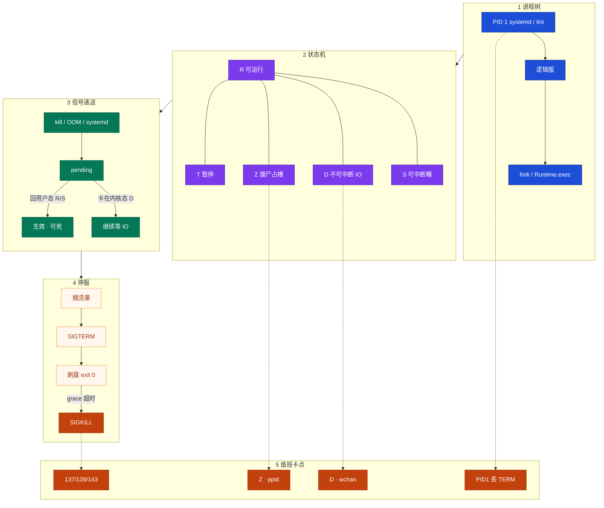
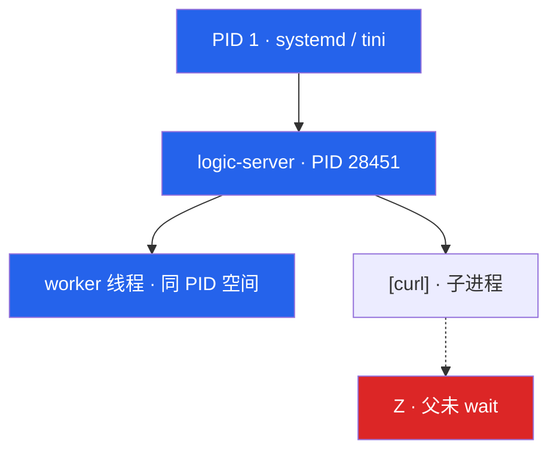
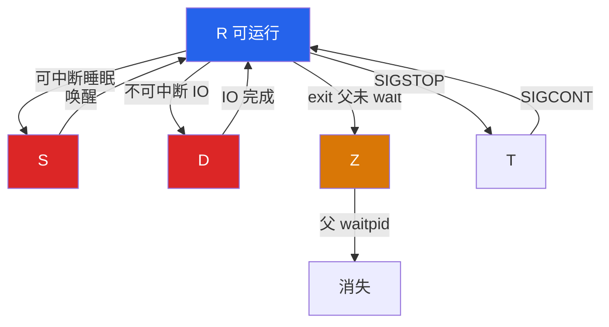
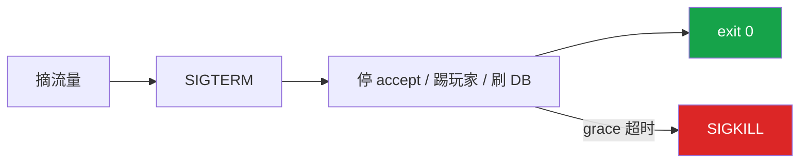
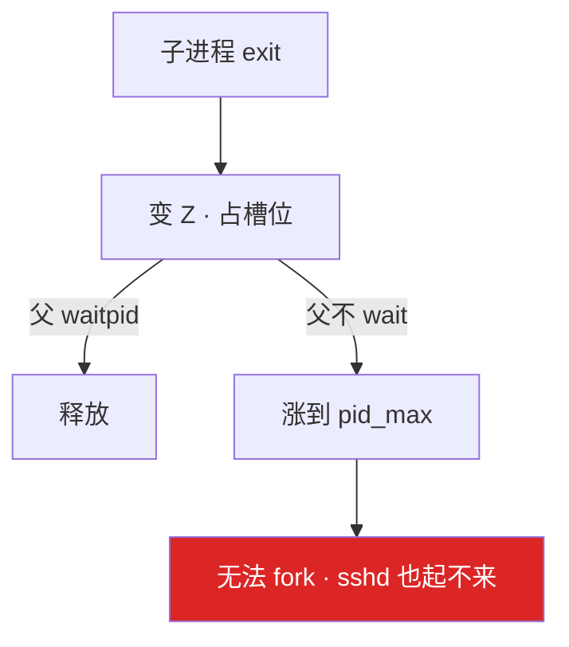
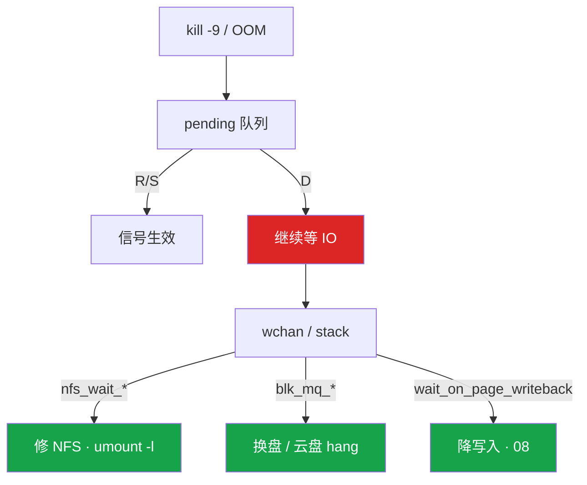
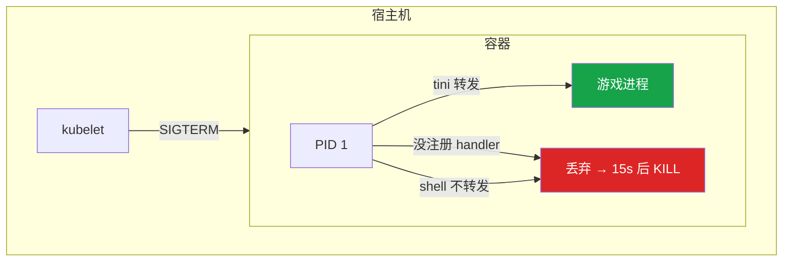
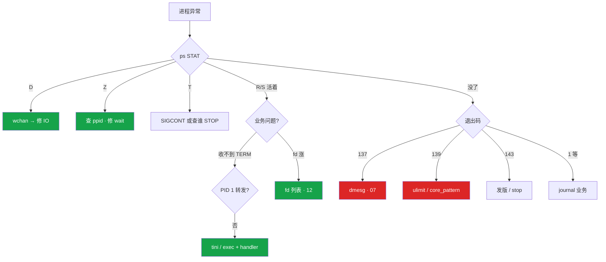

# 进程与信号

> **这章解决什么**：大厅卡登录，`ps` 里混着 R、S、D、Z；Load 40 但 idle 70%；有人已经 `kill -9` 三连——进程还在 D。发版脚本直接 `-9`，玩家回档；`docker stop` 总等满 10 秒。  
> **读法**：**先看总图（进程树 + 状态机 + 信号递送）** → **再认名词** → **再抠僵尸/孤儿与 TERM/KILL**。  
> **刻意不展开**：Load 含 D、高 Load 分型 → [06](../06-CPU与Load/)；OOM 137 细节 → [07](../07-内存与OOM/)；脏页 / await → [08](../08-磁盘与IO/)；CLOSE_WAIT / fd 队列 → [12](../12-网络栈与Socket/)、[13](../13-TCP与UDP/)；cgroup fork ENOMEM → [10](../10-cgroup与容器/)；TimeoutStopSec 全文 → [11](../11-Systemd与服务管理/)；syscall `%sy` → [04](../04-内核与系统/)。

---

## 本章目录

1. [本章定位](#1-本章定位)
2. [先看总图：进程怎么生、怎么死、信号怎么到](#2-先看总图进程怎么生怎么死信号怎么到) ← **开篇必读**
   - [2.0 全章知识串图](#20-全章知识串图一张把细节串起来) ← **架构总览**
   - [2.1 进程树与 PID 1](#21-进程树与-pid-1)
   - [2.2 状态机 R/S/D/Z/T](#22-状态机-rsdzt)
   - [2.3 完整走读：kill -9 三次还在](#23-完整走读kill--9-三次还在) ← **走读一例**
   - [2.4 完整走读：优雅停服一条链](#24-完整走读优雅停服一条链)
3. [名词扫盲（对照总图认词）](#3-名词扫盲对照总图认词)
4. [进程 · 线程 · fork · 孤儿](#4-进程--线程--fork--孤儿)
5. [僵尸：本章最易混之一](#5-僵尸本章最易混之一) ← **重点精读**
6. [信号：TERM / KILL / PIPE / HUP……本章最易混](#6-信号term--kill--pipe--hup本章最易混) ← **重点精读**
7. [优雅停服与容器 PID 1](#7-优雅停服与容器-pid-1)
8. [命令解读：ps / pstree / kill /proc](#8-命令解读ps--pstree--kill--proc)
9. [定责决策树与作战落地](#9-定责决策树与作战落地)
10. [去哪章继续学](#10-去哪章继续学)
11. [面试 · 易错 · 数字](#11-面试--易错--数字)
12. [合上书](#合上书)

---

## 1. 本章定位

| 章 | 负责 |
|----|------|
| **04** | 用户态/内核、syscall、双日志、不可用第一眼 |
| **05（本章）** | 进程状态、信号递送、僵尸/孤儿、优雅停服、容器 PID 1 |
| **06** | Load = R+D；高 Load 分型（CPU 型 / IO 型） |
| **07** | OOM 发 SIGKILL、137 对 dmesg |
| **10** | cgroup 限额、fork ENOMEM |
| **11** | systemd unit、TimeoutStopSec 全文 |

本章是**进程生命周期主场**。04 告诉你「服务不可用先看 status」；本章告诉你「进程还在时 STAT 是什么、能不能杀、怎么优雅停」。

🎯 **值班签名**：先看 STAT 再动手——D 等 IO，Z 找父进程；TERM 是请求，KILL 是处决。

**本章主线（排障就按这三步想）：**

1. **认 STAT**：R/S 才能被信号打死；D 等 IO 杀不掉；Z 找父进程不杀僵尸。
2. **优雅停服**：摘流量 → SIGTERM → 刷盘 → grace 超时才 KILL；容器 PID 1 必须转发 TERM。
3. **留证**：137 对 dmesg / memory.events；139 对 core；fd 泄漏看 `/proc/PID/fd`。

**读完你能：**

- 默画进程树 + 状态机 + 信号递送三张图
- 先看 STAT 再决定杀还是等；D 指到 wchan 修 IO；Z 查 ppid 修 wait
- 写出游戏服优雅退出；容器 stop 不再干等 10 秒强杀
- 读懂 `ps`/`pstree`/`kill` 与退出码 137/139/143
- fd 泄漏和 core dump 能留证

---

## 2. 先看总图：进程怎么生、怎么死、信号怎么到

> **正确开篇顺序**：先有全局画面，再认词，再抠细节。  
> 先看 **§2.0 全章串图**（考点挂一张板上），再看 **§2.1～2.2**，然后用 **§2.3 / §2.4 走读**把「杀不掉」和「优雅停」钉死。

### 2.0 全章知识串图（一张把细节串起来）

> 🎯 **合上书要能默画这张。** 蓝=进程树 · 紫=状态 · 绿=信号 · 橙=卡点/定责。  
> 若预览仍报错，以下面 **ASCII 一页板** 为准。



**读图路线：**

| 段 | 记住 |
|----|------|
| ① | 一切进程挂在 PID 1 下；容器里你可能变成 PID 1（§2.1、§7） |
| ② | Load = R+D；S 不进；D 杀不掉；Z 找父（§2.2、§5） |
| ③ | 信号只在回用户态递送；D 时进 pending（§6） |
| ④ | TERM → 刷盘 → 超时才 KILL（§7） |
| ⑤ | 定责：wchan / ppid / PID1 / 退出码（§8、§9） |

**ASCII 一页板（兜底）：**

```text
┌─ 进程树 ──────────────────────────────────────────┐
│  PID1(systemd/tini) → 逻辑服 → fork/Runtime.exec  │
└───────────────────────────────────────────────────┘
         │
┌─ 状态机（ps STAT）────────────────────────────────┐
│  R 跑/排队  S 可中断睡  D 等IO(杀不掉)            │
│  Z 已死占槽  T 暂停                               │
│  Load = R + D ；S 再多也不进 Load                 │
└───────────────────────────────────────────────────┘
         │
┌─ 信号递送 ────────────────────────────────────────┐
│  kill/OOM/systemd → pending → 回用户态才生效      │
│  卡在 D：SIGKILL 也排队等着                       │
└───────────────────────────────────────────────────┘
         │
┌─ 停服 / 定责 ─────────────────────────────────────┐
│  摘流量→TERM→刷盘→grace→KILL                      │
│  D→wchan  Z→ppid  容器→PID1转发  137/139/143      │
└───────────────────────────────────────────────────┘
```

### 2.1 进程树与 PID 1

**一句话：** 每个进程都有父；父死了孤儿归 PID 1；容器里应用可能自己就是「迷你机的 init」。



| 角色 | 值班里是谁 | 要点 |
|------|------------|------|
| **PID 1（宿主机）** | systemd | 收养孤儿、处理 SIGCHLD、收尸 |
| **PID 1（容器）** | tini / 应用 / shell | 没 handler 的信号被**丢弃**；不 wait → 僵尸 |
| **父进程** | 逻辑服 | 必须 `waitpid` 收子进程，否则攒 Z |
| **孤儿** | 父已退出的子 | 被 PID 1 收养；**不是**僵尸 |
| **僵尸** | 子已 exit、父未 wait | 占 PID 槽，不占用户内存 |

> **别混**：孤儿是「活着没爹」；僵尸是「死了爹没收尸」。

### 2.2 状态机 R/S/D/Z/T

**一句话：** Load = R + D；S 不计入；D 杀不掉；Z 找父。



| STAT | 人话 | `kill -9` | 进 Load 吗 |
|------|------|-----------|------------|
| **R** | 正在跑或在可运行队列等 CPU | 有效 | 进 |
| **S** | 可中断睡眠：锁、sleep、socket、`epoll_wait` | 有效 | **不进** |
| **D** | 内核等不可中断 IO | **无效** | 进 |
| **Z** | 已 exit，父进程还没 wait | 杀僵尸 PID **没意义** | 不进 |
| **T** | 被 `SIGSTOP` 暂停 | 先 `SIGCONT` | 不进 |

一排 R 且 `%us` 高 → [06](../06-CPU与Load/)。一排 D 且 idle 高 → 本章 wchan，不是加核。

**值班口诀（对屏默念）：**

| 你看到 | 先说 | 别说 |
|--------|------|------|
| 一排 **D** + idle 高 | IO / NFS / 脏页 | 「加 8 核」 |
| 一排 **R** + `%us` 高 | CPU 型，去 03 | 「先 kill -9」 |
| 大量 **S** + Load 低 | 正常睡（网关万连接） | 「S 太多所以 Load 高」 |
| 几个 **Z** | 查 ppid | 「kill 僵尸」 |
| **T** | 谁发了 STOP；`kill -CONT` | 当挂死重装 |

### 2.3 完整走读：kill -9 三次还在

> 🎯 **一例钉死「D 杀不掉」**。后面 §6、§9 都回指这里。

**场景**：活动高峰，Load 40，idle 70%。群里有人已经对一排 PID `kill -9` 三连——进程还在。

**现场走一遍：**

1. 你在逻辑服上：

```bash
uptime
ps aux | head -1; ps aux | awk '$8 ~ /D/ {print}'
```

2. 屏幕 STAT 列一排 **D** → **不是 CPU 不够**，别加核。
3. 看卡在哪：

```bash
cat /proc/28451/wchan
cat /proc/28451/stack
```

4. wchan 出现 `nfs_wait_*` → NFS 对端抖了；止血：恢复 NFS 或 `umount -l`；长期日志改本地盘。
5. 若是 `blk_mq_*` → 块设备 hang；`wait_on_page_writeback` → 脏页写不出（[08](../08-磁盘与IO/)）。
6. 大量 D 时普通 `reboot` 也可能卡「杀进程」——走云控制台**强制重启**。

```text
# cat /proc/28451/wchan
nfs_wait_bit_uninterruptible

# cat /proc/28451/stack
[<0>] nfs_wait_bit_uninterruptible+0x...
[<0>] __wait_on_bit+0x...
```

- `wchan` 一行钉死路径：**在等 NFS**，不是算力。
- TERM / STOP / KILL 同一类——都进不了用户态；`gdb attach` 也会卡。

> **记住**：D 时信号进 pending；修 IO，不要再 kill。

**三条岔路对照（同一套命令，不同出口）：**

| 现象 | `ps` | 下一刀 | 出口 |
|------|------|--------|------|
| Load 40 idle 70% | 一排 D | wchan → NFS/盘 | 本章修 IO |
| Load 40 `%us` 高 | 一排 R | mpstat / perf | [06](../06-CPU与Load/) |
| fork failed | 一排 Z | 按 ppid 聚合 | §5 修 wait |

**面试怎么说**：「kill -9 还在，我先看 STAT；D 就看 wchan，不会再杀也不会加核。」

### 2.4 完整走读：优雅停服一条链

**场景**：发版停逻辑服。旧脚本写了 `kill -9`，玩家报「副本进度没了」。

**标准顺序：**



**现场走一遍（systemd）：**

1. 服务发现 / LB **摘流量**（别对新连接开放）。
2. `systemctl stop logic-server` —— systemd 发 **SIGTERM（15）**。
3. 应用 handler：停 accept → 踢玩家 → 刷盘 → `exit 0`。
4. grace：**游戏服 30～120s**（≥ 刷盘量）；10s 通常不够。
5. 超时才 SIGKILL → 退出码 **137**；OOM 也发 9，**没有 handler 刷盘**。

```text
# 优雅：自己 exit 0（或 143 = 128+15）
myapp.service: Main process exited, code=exited, status=0/SUCCESS

# 强杀：137 = 128 + 9
myapp.service: Main process exited, code=killed, status=9/KILL
```

- `status=0/SUCCESS`：TERM 后自己 exit——**刷盘完成**。
- `status=9/KILL`：grace 超时或 OOM——**可能回档**；对 dmesg / 发版窗口。

**K8s 对称动作：**

```text
1. endpoint 摘掉（或 preStop 里摘发现）
2. kubelet → SIGTERM（容器 PID 1）
3. 等 terminationGracePeriodSeconds（默认 30）
4. 超时 → SIGKILL
```

preStop 在 TERM **之前**跑，适合摘注册；**不能代替**应用 Listen TERM。容器若是 shell 当 PID 1，TERM 根本到不了应用——见 §7.2。

> **记住**：TERM 是请求，KILL 是处决；有状态服禁止 stop 直接 `kill -9`。

**面试怎么说**：「停服我摘流量发 TERM，grace 盖住刷盘，超时才 KILL；不会在发布脚本里写 kill -9。」

---

## 3. 名词扫盲（对照总图认词）

对照 §2.0，值班里碰到再说定义。

| 词 | 值班里什么时候碰到 | 一句话 |
|----|-------------------|--------|
| **进程** | `ps` 一行一个 PID | 独立地址空间 + 资源账本 |
| **线程** | `ps -eLf` / `top -H` | 共享地址空间；调度单位常是任务 |
| **fork / clone** | Java `Runtime.exec`、脚本拉 curl | 复制任务；fork 用 COW |
| **COW** | 贴着 limit 再 fork ENOMEM | 写时才拆页；内核仍按最坏预留 |
| **PPID** | 查僵尸谁造的 | 父进程 PID |
| **孤儿** | 父先退出 | 活着，被 PID 1 收养 |
| **僵尸 Z** | fork failed、PID 槽满 | 已死，等父 wait |
| **信号** | stop / OOM / 管道断开 | 异步通知；多数可处理，KILL/STOP 不能 |
| **pending** | D 状态 kill 无效 | 信号已排队，等回用户态 |
| **wchan** | D 状态查卡点 | 内核等待函数名 |
| **grace** | K8s / systemd 停服 | TERM 后等到 KILL 的窗口 |
| **退出码** | journal / K8s lastState | 被信号杀 = **128 + 信号号** |

| 信号 | 编号 | 应用能处理吗 | 典型用途 |
|------|------|:------------:|----------|
| SIGHUP | 1 | 能 | Nginx `reload` |
| SIGINT | 2 | 能 | Ctrl+C |
| SIGQUIT | 3 | 能 | 常带 core |
| SIGKILL | 9 | **不能** | OOM、grace 超时、人手 `-9` |
| SIGUSR1/2 | 10/12 | 能 | 自定义；Nginx USR2 热升级 |
| SIGPIPE | 13 | 能 | 写已关闭管道/socket；不处理会挂 |
| SIGTERM | 15 | 能 | `systemctl stop`、K8s **第一枪** |
| SIGCHLD | 17 | 能 | 子退出；PID 1 必须管 |
| SIGSTOP | 19 | **不能** | 暂停；生产少见 |
| SIGCONT | 18 | 能 | 继续 |

退出码速查：

| 码 | 含义 | 下一眼 |
|----|------|--------|
| **137** | SIGKILL | dmesg OOM？人手 -9？kubelet 强杀？ |
| **139** | SIGSEGV | core / hs_err |
| **143** | SIGTERM | 正常停服或 grace 内退出 |
| 1 等 | 自己 `exit` | journal，不是 dmesg |

> **记住**：先看 STAT 再动手；D 等 IO，Z 找父进程；TERM 是请求，KILL 是处决。

---

## 4. 进程 · 线程 · fork · 孤儿

### 4.1 进程 vs 线程

**一句话：** 进程有独立地址空间；线程共享，创建便宜，但一个崩可能拖垮同进程。

| | 进程 | 线程 |
|--|------|------|
| 地址空间 | 独立 | **共享** |
| 崩溃隔离 | 好 | 差（同进程互相踩） |
| 创建成本 | 高（fork + 页表） | 低（clone 共享 mm） |
| `ps` 怎么认 | 一行一个 PID | `ps -eLf` 看 LWP；`top -H` |
| 信号默认 | 发给进程，由任一线程处理 | 可用 `tgkill` 指到某线程 |

游戏逻辑服常见：主进程 + 工作线程池。排障时「线程卡在哪」用 `top -H -p PID` 或 `ps -eLf | grep PID`，不要只看进程一行 `%CPU`。

```bash
# 进程 28451 下哪个线程在烧 CPU
top -H -p 28451
ps -eLf | awk '$4==28451 {print}'
# nlwp = 线程数
ps -o pid,nlwp,stat,comm -p 28451
```

**输出解读：**

```text
  PID  NLWP STAT COMMAND
28451    48 Sl   logic-server
```

- `NLWP=48`：48 个线程；STAT 带 `l` 也表示多线程。
- 单线程 100%、其它闲 → 热点在一核，整机平均会骗人（[06](../06-CPU与Load/)）。

### 4.2 fork 与 COW

**一句话：** Linux 创建进程主路径是 fork/clone 再 exec；COW 不是内存免费。


**现场走一遍（512Mi Pod 里 Runtime.exec 失败）：**

1. 业务日志：`Cannot run program "curl": error=12, Cannot allocate memory`。
2. 宿主机 `free -h` 还有几十 G——**别信**，看容器账：

```bash
cat /sys/fs/cgroup/memory.max          # 或 memory.limit_in_bytes
cat /sys/fs/cgroup/memory.current
```

3. RSS 已贴 `memory.max` → fork 的 COW 预留失败 → **ENOMEM**。
4. 修法：sidecar / 本地 HTTP / IPC；或 limit 留出 COW 余量。细节 → [10](../10-cgroup与容器/)。

线程共享地址空间，这个坑主要是 **fork 子进程**，不是起线程。

> **记住**：COW 省的是「立刻复制物理页」，不是「内核免预留」。

### 4.3 孤儿进程

**一句话：** 父先退出，子被 PID 1 收养，继续跑——不是故障。

```bash
# 父死掉后，子的 PPID 变成 1
ps -eo pid,ppid,stat,comm | grep myworker
```

| | 孤儿 | 僵尸 |
|--|------|------|
| 进程还活着吗 | **活** | **死**（只剩槽位） |
| STAT | 通常 S/R | **Z** |
| 要不要慌 | 一般不用 | PID 槽涨要慌 |
| 处理 | 确认是否故意 daemon | 修父 wait 或杀父 |

故意变孤儿的经典：daemon 两次 fork + setsid，让自己脱离终端——生产更常见是 **systemd Type=simple** 前台跑，少自己玩双重 fork。

`KillMode=process` 时 systemd 只杀主进程，子进程变成孤儿占端口——所以落地表要求 `control-group`（§8.6）。

> **别混**：看到「没父进程」先分清是孤儿（活）还是僵尸（Z）。

### 4.4 落地选型（进程侧）

| 项 | 选 | 不选 |
|----|----|------|
| 子进程 | sidecar / IPC | 贴着 limit 再 `Runtime.exec` |
| 容器 PID 1 | tini / `--init`，或应用处理 TERM | shell 启动不 exec |
| 停服 | TERM → grace → KILL；30～120s | 发布脚本 `kill -9` |
| core | `LimitCORE=infinity` + 可写目录 + 立刻收走 | core 落 NFS |
| 日志 / 热更 / core | 本地盘 | NFS（一抖全员 D） |
| KillMode | `control-group` | `process`（留孤儿占端口） |

---

## 5. 僵尸：本章最易混之一

> 🎯 **四步钉死**：例子 → 定义 → 命令怎么认 → 易错一句。

### 5.1 最常见例子

sshd 报 `fork failed`，`ps` 里几百个 `Z` 和 `<defunct>`。有人开始 `kill -9` 那些僵尸 PID——一个都没消失。

### 5.2 一句话定义

**僵尸 = 子进程已 exit，内核还留着进程表槽位等父进程 `waitpid` 收退出码。** 用户内存几乎已释放；占的是 **PID 号**。

### 5.3 对照命令怎么认

```bash
ps -eo pid,ppid,stat,comm | awk '$3 ~ /Z/'
ps -eo ppid,stat | awk '$2 ~ /Z/ {print $1}' | sort | uniq -c | sort -rn
cat /proc/sys/kernel/pid_max
```

```text
  PID  PPID STAT COMMAND
28453 28451 Z    [curl] <defunct>
28454 28451 Z    [curl] <defunct>

# uniq -c 统计
    847 28451

# pid_max
32768
```

- 两个 Z 的 **PPID 都是 28451**——罪魁是 logic-server 没 wait。
- `847` 表示 28451 下攒了约 847 个僵尸；接近 **pid_max 32768** 会 fork failed（含 sshd）。
- 杀 28453/28454 **无意义**——它们已经死了。



### 5.4 易错一句钉死

> **别混**：杀僵尸 PID 没用；查 **ppid**，修 wait 或杀父让 init 收尸。僵尸不占用户内存，占 PID。

典型来源：Java `Runtime.exec` 不 `waitFor`；shell 循环 fork；容器 PID 1 不处理 SIGCHLD。

### 5.5 止血与根治

| 步骤 | 做什么 | 说明 |
|------|--------|------|
| 1 止血 | 确认 ppid；父无药才 `kill` 父 | init 收养后收尸，Z 消失 |
| 2 根治 | 父进程 `wait` / `waitpid` / `waitFor` | 或设 SIGCHLD handler |
| 3 容器 | PID 1 用 tini | 自动 wait 子进程 |
| 4 预防 | 少在业务进程里 fork 外部命令 | sidecar |

```bash
# 谁在制造僵尸（按父聚合）
ps -eo ppid,stat | awk '$2 ~ /Z/ {print $1}' | sort | uniq -c | sort -rn | head
# 看父还活着吗
ps -fp <PPID>
```

**面试怎么说**：「僵尸不占内存占 PID，我查 ppid 找谁不 wait，修父进程或杀父；不会 kill 僵尸 PID。」

---

## 6. 信号：TERM / KILL / PIPE / HUP……本章最易混

> 🎯 **全章最易晕的一点单独钉死。** FAQ 只在本节写一遍；别处「见 §6」。

### 6.1 TERM vs KILL（先钉这一对）

**一句话：** TERM 请进程收尾；KILL 内核直接拆，应用无法处理。

| | SIGTERM (15) | SIGKILL (9) |
|--|--------------|-------------|
| 应用能处理吗 | **能** | **不能** |
| 谁在用 | systemctl stop、docker stop、K8s 第一枪 | OOM Killer、grace 超时、人手 `-9` |
| 刷盘 / 关连接 | 可以做 | **来不及** |
| 退出码 | 常 143 或自己 exit 0 | **137** |

**打个比方**：TERM 像餐厅打烊通知——请结完账再走；KILL 像拉闸断电——没机会刷盘，玩家回档。

> **记住**：OOM 发的是 SIGKILL；没有 handler 可跑，不能指望 OOM 时还刷盘。

**四步钉死 TERM/KILL：**

| 步 | 内容 |
|----|------|
| ① 例子 | 发版 `kill -9` → 玩家回档；K8s grace 10s → 次次 137 |
| ② 定义 | TERM=可处理的停服请求；KILL=内核拆任务，不可捕获 |
| ③ 命令 | `systemctl stop` 看 journal 是 0/SUCCESS 还是 9/KILL |
| ④ 易错 | OOM ≠ 「优雅退出失败」——OOM **根本没有** handler |

### 6.2 为什么 D 状态连 KILL 都杀不掉

**一句话：** 信号只在回用户态时递送；D 卡在内核 IO，KILL 也进 pending。



| wchan 字样 | 根因 | 动作 |
|------------|------|------|
| `nfs_wait_*` | NFS 对端死了 | 恢复；`umount -l`；**日志写本地盘** |
| `blk_mq_*` | 块设备不完成 | 云盘 hang、坏盘 |
| `wait_on_page_writeback` | 脏页写不出 | 盘饱和（[08](../08-磁盘与IO/)） |

NFS 用 `soft,timeo=100,retrans=2`，超时要失败不要永远 D。

> **别混**：换 TERM / STOP 也杀不掉 D——同一类，都要回用户态。

**现场再钉一次（和 §2.3 同一事故）：**

```bash
# 确认还在 D
ps -o pid,stat,wchan:40,comm -p 28451
# STAT=D  wchan=nfs_wait_bit_uninterruptible
kill -9 28451; sleep 1; ps -p 28451
# 还在——不是权限问题
```

**面试怎么说**：「D 状态 kill 无效，信号在 pending；我看 wchan，nfs 就修 NFS 或 umount -l，不会 kill -9 三连或加 CPU。」

### 6.3 SIGPIPE：写已关闭的管道/socket

**一句话：** 对端关了你还 write，默认 SIGPIPE 直接把进程干掉；网络服务常忽略并改查 errno。

| 场景 | 表现 | 处理 |
|------|------|------|
| 管道对端已关仍 write | 进程莫名退出 | 忽略 SIGPIPE 或处理 |
| HTTP 客户端提前断开 | 服务端 write 触发 | 业务层处理 EPIPE |
| 游戏网关对死连接推包 | 偶发崩溃 | `signal(SIGPIPE, SIG_IGN)` + 查返回值 |

Go / Java 运行时通常已处理；C/C++ 自写网关要显式 Ign。

### 6.4 SIGHUP：reload 不是重启

**一句话：** Nginx `nginx -s reload` 对 **master** 发 SIGHUP；旧 worker 处理完连接再退。

| 信号 | 用途 | 别混成 |
|------|------|--------|
| **SIGHUP** | 重读配置、优雅换 worker | 不是 kill 进程 |
| **USR2** | 热升级**二进制** | 不是 reload 配置 |
| **TERM** | 停服 | 不是 reload |

卡在 **D** 的旧 worker：HUP 换不掉（回不了用户态）。长连接 + 慢退会让内存看起来「reload 后翻倍」，直到旧 worker 退完。配合 `worker_shutdown_timeout`（[19 Nginx](../19-Nginx/)）。

### 6.5 信号合并与 handler 安全

| 要点 | 说明 |
|------|------|
| 信号合并 | 连发 10 次 TERM，标准信号可能只递送 **1** 次 |
| handler 安全 | 不能乱 `malloc` / `printf`；Go 用 `os/signal` 转 goroutine |
| 实时信号 | SIGRTMIN+ 一般不合并；生产少用 |
| SIGCHLD | 子退出通知；PID 1 不处理 → 僵尸（§5） |

### 6.6 信号速查（值班常碰）

| 信号 | 编号 | 默认真相 | 值班一句 |
|------|------|----------|----------|
| HUP | 1 | 可捕获；终端挂断也发 | Nginx reload；daemon 常 Ign |
| INT | 2 | 可捕获 | Ctrl+C；前台调试 |
| QUIT | 3 | 可捕获，常 core | 少用手；要栈时小心 |
| KILL | 9 | **不可捕获** | 处决；OOM / grace |
| USR1/2 | 10/12 | 可捕获 | 自定义；Nginx USR2=热升级 |
| PIPE | 13 | 默认可杀进程 | 网关 Ign + 查 EPIPE |
| ALRM | 14 | 可捕获 | 定时器；少直接依赖 |
| TERM | 15 | 可捕获 | **停服第一枪** |
| CHLD | 17 | 可捕获 | 子退出；必须 wait |
| CONT | 18 | 继续 | 解开 T |
| STOP | 19 | **不可捕获** | 暂停；生产少见 |
| TSTP | 20 | 可捕获 | Ctrl+Z |

```bash
kill -l          # 本机信号名与编号
man 7 signal     # 完整语义（有空再读）
```

**面试怎么说**：「停服我摘流量发 TERM，等刷盘 grace 30～120s，超时才 KILL；D 状态看 wchan 修 IO；OOM 137 没有优雅退出，发布禁止 kill -9。」

---

## 7. 优雅停服与容器 PID 1

### 7.1 停服标准动作

**一句话：** 摘流量 → TERM → 刷盘 → grace 内 exit；超时才 KILL。

| 参数 | 生产怎么用 | 改错会怎样 |
|------|------------|------------|
| `TimeoutStopSec` | 有状态游戏服 **30～120s** | 太短 = 每次 stop 都 SIGKILL |
| `terminationGracePeriodSeconds` | 按刷盘量加；K8s 默认 **30** | 10s 几乎必强杀 |
| `KillMode=` | 保持 `control-group` | `process` 留孤儿占端口 |
| Dockerfile CMD | exec 形式或 `exec python` | shell 不转发 TERM |
| preStop hook | TERM **之前**摘发现 | 不替代应用处理 TERM |

TimeoutStopSec 必须 ≥ 刷盘时间。有状态游戏服**禁止**把 stop 配成直接 `kill -9`。

**应用 handler 最小清单（游戏逻辑服）：**

1. 置位 `shutting_down`，停止 `accept` / 新进房间。
2. 通知在线玩家（踢回登录或短倒计时）。
3. 刷角色 / 副本等脏数据到 DB；超时要有上限，别死等。
4. 关监听 fd，`exit 0`。
5. 指标：从收到 TERM 到 exit 的耗时打点，用来校准 grace。

```ini
# systemd 片段（全文 → 11）
[Service]
TimeoutStopSec=90
KillMode=control-group
KillSignal=SIGTERM
FinalKillSignal=SIGKILL
LimitCORE=infinity
```

### 7.2 容器 PID 1：为什么吃不到 SIGTERM

**一句话：** PID 1 没注册 handler 的信号被内核丢弃，等满 grace 才 KILL。

**打个比方**：kubelet 在容器外敲门（SIGTERM），容器里没人应门——门铃响满 10 秒，kubelet 踹门（SIGKILL）。



**两层常见坑（往往叠在一起）：**

1. **应用是 PID 1，且没注册 SIGTERM handler** → 内核丢弃。
2. **PID 1 是 shell**（`CMD python app.py` 常经 `/bin/sh -c`）→ shell **不转发** TERM 给子进程。

```text
# ✗ 坏：shell 是 PID 1
UID   PID   PPID  CMD
root  1     0     /bin/sh -c python app.py
root  7     1     python app.py

# ✓ 好：tini + exec
UID   PID   PPID  CMD
root  1     0     /sbin/tini -- /app/server
root  7     1     /app/server
```

修法：`tini` / `dumb-init` / `docker run --init`；或 `CMD ["/app"]` exec 形式 + 代码 Listen TERM。tini 同时收 SIGCHLD，避免 PID 1 不 wait 出僵尸。

> **别混**：`shareProcessNamespace` 是调试用，**不是**停服方案。

**面试怎么说**：「容器 stop 等满 grace 我先查 PID 1 是不是 tini、应用有没有 Listen TERM；shell 启动不 exec 是常见坑。」

### 7.3 core dump 与 139

**139 = 128 + 11（SIGSEGV）**。先让 dump 能落盘：

```bash
ulimit -c                        # 0 = 禁止
cat /proc/sys/kernel/core_pattern
# 常见：|/usr/lib/systemd/systemd-coredump
# 或   /var/crash/core.%e.%p
```

生产清单：`LimitCORE=infinity` + 目录有空间 + AppArmor/SELinux 没拦 + 容器 volume。dump 完立刻收走。分析：`gdb /path/to/bin core` → `bt`。**Java 看 hs_err，不是 Linux core。**

**现场走一遍（139 没有文件）：**

```bash
ulimit -c
cat /proc/sys/kernel/core_pattern
systemctl show myapp -p LimitCORE
# 容器内再确认一次 ulimit；宿主机对容器 PID：
gcore <host-pid>    # 或 nsenter 进 net/pid 看
coredumpctl list | tail
```

| 检查项 | 坏值 | 好值 |
|--------|------|------|
| `ulimit -c` | 0 | unlimited |
| `LimitCORE` | 0 / 未设 | infinity |
| `core_pattern` | 指到只读/不存在路径 | systemd-coredump 或可写目录 |
| 容器 | 无 volume | 挂可写卷或宿主机抓 |

---

## 8. 命令解读：ps / pstree / kill /proc

### 8.1 命令速查

| 目的 | 命令 | 看什么 |
|------|------|--------|
| 总览 | `ps aux` | STAT、%CPU、COMMAND |
| D | `ps aux \| awk '$8 ~ /D/'` | 一排 D → wchan |
| Z + 父 | `ps -eo pid,ppid,stat,comm \| awk '$3 ~ /Z/'` | **ppid** |
| 树 | `pstree -p` / `pstree -ap <PID>` | 谁拉起谁 |
| 杀 | `kill -15 PID` / `kill -TERM` | 先 TERM 后 KILL |
| 内核等待 | `cat /proc/PID/wchan` · `stack` | nfs / blk_mq / writeback |
| fd 泄漏 | `ls /proc/PID/fd \| wc -l` | 计数涨、逼近 Max |
| 线程 | `top -H -p PID` · `ps -eLf` | 单线程热点 |
| 正在调什么 | `strace -c -p PID` | 5～10 秒；战斗服勿长挂 |
| core | `ulimit -c` · `core_pattern` | 0 = 禁止 dump |

```bash
ps aux | awk '$8 ~ /D/'
cat /proc/<PID>/wchan
ps -eo pid,ppid,stat,comm | awk '$3 ~ /Z/'
pstree -ap <PID>
ls /proc/<PID>/fd | wc -l
cat /proc/<PID>/limits | grep 'open files'
strace -c -p <PID>          # 短窗口
```

### 8.2 ps 输出解读

```text
USER   PID  %CPU %MEM   VSZ   RSS TTY  STAT START   TIME COMMAND
game 28451  0.0  2.1 8388608 2096128 ?  D   03:10   0:00 logic-server
game 28452  5.2  1.8 4194304 1048576 ?  S   03:10   1:23 nginx: worker
game 28453  0.0  0.0    0     0     ?  Z   03:09   0:00 [curl] <defunct>
game 28454  0.0  0.5 1024000  512000 ?  Rl  03:10   2:10 logic-server
```

| 行 | 读法 | 下一步 |
|----|------|--------|
| 28451 `D` | 卡不可中断 IO；**kill -9 无效**；进 Load | wchan |
| 28452 `S` | 可中断睡；**不进 Load**；5.2% 是间歇醒 | 通常正常 |
| 28453 `Z` + defunct | 僵尸；不占用户内存 | 查 PPID |
| 28454 `Rl` | R + 多线程标记；在跑或可跑 | 高 `%us` → 06 |

STAT 多字符：`R`/`S`/`D`/`Z`/`T` 是主状态；后面 `l`=多线程、`s`=session leader、`+`=前台进程组——认主字母即可。

### 8.3 pstree 输出解读

```text
systemd(1)─┬─sshd(1200)───sshd(8840)───bash(8841)
           ├─logic-server(28451)─┬─{logic-server}(28455)
           │                     ├─{logic-server}(28456)
           │                     └─curl(28453)   ← 若变 Z，挂在 28451 下
           └─containerd(800)─┬─tini(900)───server(901)
```

- 看 **父子关系**：僵尸的父是谁一目了然。
- 容器里应看到 **tini/server**，不是 `sh -c`。
- `-a` 显示命令行参数；`-p` 显示 PID。

### 8.4 kill 怎么用

| 写法 | 等价 | 何时 |
|------|------|------|
| `kill PID` | SIGTERM(15) | **默认首选** |
| `kill -15 PID` / `kill -TERM` | 同上 | 显式优雅停 |
| `kill -9 PID` / `kill -KILL` | SIGKILL | grace 超时 / 确认无状态后 |
| `kill -HUP PID` | SIGHUP | Nginx master reload |
| `kill -CONT PID` | SIGCONT | 解开 T 状态 |

```bash
# 正确：先 TERM，等一会，再确认
kill -TERM 28451
sleep 5
ps -p 28451 || echo gone

# 错误：发版脚本直接
kill -9 28451   # 有状态服会回档
```

对进程组：`kill -TERM -PGID`（负号）。对单元：优先 `systemctl stop`，让 systemd 管 grace。

**什么时候用 -9（仍然要克制）：**

| 可以考虑 -9 | 仍然先想 |
|-------------|----------|
| 确认无状态、可重建的 worker | 先 TERM 等几秒 |
| 已 grace 超时，systemd/kubelet 第二枪 | 这是平台行为，不是人手连点 |
| 确认 D 之外的「死循环吃满 CPU」且 TERM 无效 | 极少；多数 TERM 有效 |

人手对有状态服连点 `-9`：回档责任在你。

### 8.5 fd 泄漏

**一句话：** 泄漏看 `/proc/PID/fd` 计数只增不减；ulimit 只推迟爆炸。

```bash
ls /proc/<PID>/fd | wc -l
ls -l /proc/<PID>/fd | grep socket | wc -l
cat /proc/<PID>/limits | grep 'open files'
# 隔 60s 再数一次，看斜率
```

```text
# 正常：计数稳
1203
# 1 分钟后
1210

# 泄漏：只增不减，逼近 Max
Max open files            65535                65535
# fd 计数 65000+
```

| fd 类型 | 根因方向 |
|---------|----------|
| socket | CLOSE_WAIT 堆积 → [12](../12-网络栈与Socket/) |
| 普通文件 | 日志 / 上传没 `fclose` |
| eventfd / timerfd | 框架泄漏；按类型 `ls -l` 分类 |

和 strace 分工：**strace = 正在做什么调用；fd 列表 = 已经打开什么。** 卡死偏 strace，泄漏偏 fd。生产 strace：默认 `-c` 限时 5～10 秒；**战斗服不要长时间全量跟踪**（同 [04](../04-内核与系统/)）。

```bash
# 短窗口看调用分布
timeout 8 strace -c -p <PID>
# 跟线程
timeout 8 strace -c -f -p <PID>
```

### 8.6 核心配置速查

| 参数 | 生产怎么用 | 改错会怎样 |
|------|------------|------------|
| `TimeoutStopSec` | 30～120s | 太短必强杀 |
| `terminationGracePeriodSeconds` | ≥ 刷盘 | 默认 30，10s 不够 |
| `KillMode=` | `control-group` | `process` 留孤儿 |
| `LimitCORE` | `infinity` | 139 没有栈 |
| `LimitNOFILE` | 按连接数留余量 | 只加 ulimit 推迟爆炸 |
| `pid_max` | 常见 32768 | 调大只推迟 fork failed |
| Dockerfile CMD | exec / tini | shell 不转发 |

```bash
# 生效配置一眼
systemctl show myapp -p TimeoutStopSec -p KillMode -p LimitCORE -p LimitNOFILE
cat /proc/sys/kernel/pid_max
```

---

## 9. 定责决策树与作战落地

### 9.1 决策树



### 9.2 现象｜先做｜别做

| 现象 | 先做 | 别做 |
|------|------|------|
| 一排 D，kill -9 还在 | wchan / stack，修 IO | 再杀、加 CPU |
| 几百 Z，sshd fork failed | 查 ppid，修 wait | kill 僵尸 PID |
| docker stop 总等满 10s | PID 1 是否转发 TERM | 只加 grace 到 300s |
| Too many open files | fd 计数 + limits | 只加 ulimit |
| 139 没有 core | ulimit / core_pattern | 先猜代码 |
| Runtime.exec ENOMEM | 是否贴着 memory.max | 看宿主机 free |
| reload 后内存翻倍 | 旧 worker 还在（可能 D） | 当泄漏 dump |
| shareProcessNamespace | 调试用 | 当停服方案 |
| 发布回档 | 查是否 kill -9 / grace 太短 | 只怪存储 |

**游戏事故复盘：** 活动高峰日志打在 NFS 上，NFS 对端抖了一下，逻辑服一排 D，Load 到 40，CPU idle 70%。有人 `kill -9`，PID 还在。wchan 指向 `nfs_wait_*`——止血是恢复 NFS 或 `umount -l`，长期把日志改本地盘。

**红线：**

- 有状态游戏服禁止 stop 直接 `kill -9`
- 日志 / core / 热更不落 NFS
- strace 默认短窗口 `-c` 5～10 秒
- 容器入口必须能把 TERM 送到应用

```bash
# 进程异常最小三连
ps -eo pid,ppid,stat,wchan:30,comm | head
# D →
cat /proc/<PID>/wchan; cat /proc/<PID>/stack
# Z →
ps -eo ppid,stat | awk '$2 ~ /Z/ {print $1}' | sort | uniq -c | sort -rn
# 没了 →
systemctl status myapp; journalctl -u myapp -n 40 --no-pager; dmesg -T | tail -30
```

---

## 10. 去哪章继续学

| 你想搞懂 | 去 |
|----------|-----|
| 用户态/内核、双日志、`%sy` | [04](../04-内核与系统/) |
| Load = R+D、高 Load 分型、加核还是查盘 | [06](../06-CPU与Load/) |
| OOM、137 对 dmesg / memory.events | [07](../07-内存与OOM/) |
| await、脏页、`%wa` | [08](../08-磁盘与IO/) |
| CLOSE_WAIT、fd、队列满 | [12](../12-网络栈与Socket/) |
| cgroup、fork ENOMEM、throttle | [10](../10-cgroup与容器/) |
| TimeoutStopSec、unit 全文 | [11](../11-Systemd与服务管理/) |
| Nginx HUP / USR2 | [19](../19-Nginx/) |
| 火焰图 / perf | [21](../21-性能观测与排障/) |

---

## 11. 面试 · 易错 · 数字

| 问 | 答 |
|----|-----|
| 五个 STAT？Load 含 S 吗？ | R/S/D/Z/T；Load=R+D，**不含 S**。 |
| D 为什么 kill -9 无效？ | 回不了用户态，信号进 pending；看 wchan。 |
| 僵尸占内存吗？杀僵尸 PID？ | 占 PID 不占用户内存；杀僵尸 PID **没用**，查 ppid。 |
| 孤儿 vs 僵尸？ | 孤儿活着被 PID 1 收养；僵尸已死等 wait。 |
| TERM vs KILL？ | TERM 可处理可刷盘；KILL 不能，OOM 也是 KILL。 |
| 游戏服怎么停？ | 摘流量→TERM→刷盘→grace 30～120s→超时才 KILL。 |
| 容器收不到 TERM？ | PID 1 没 handler 或 shell 不转发；tini/exec。 |
| 137 / 139 / 143？ | 128+9 / 128+11 / 128+15。 |
| 贴着 limit fork curl？ | COW 预留失败 ENOMEM；宿主机 free 无关。 |
| handler 里 printf？ | 不行；非 async-signal-safe。 |

| 说法 | 对错 | 口径 |
|------|:----:|------|
| D 状态 `kill -9` 能杀 | 错 | 回不了用户态，信号进 pending |
| 换 TERM 就能杀掉 D | 错 | STOP/TERM/KILL 同一类 |
| S 很多所以 Load 一定高 | 错 | Load = R+D，S 不计入 |
| 杀僵尸 PID 能收尸 | 错 | 查 ppid，修 wait 或杀父 |
| 僵尸很占内存 | 错 | 占 PID，不占用户内存 |
| 孤儿 = 僵尸 | 错 | 活 vs 死 |
| 发布脚本 `kill -9` 逻辑服 | 错 | 不刷盘，玩家回档 |
| OOM 时 handler 还能刷盘 | 错 | OOM 发 SIGKILL |
| 容器默认能收到 docker stop 的 TERM | 错 | PID 1 没 handler 内核丢弃 |
| `CMD python app.py` 没问题 | 错 | 常经 shell，不转发 |
| 连发 10 次 TERM 处理 10 次 | 错 | 标准信号会合并 |
| 只加 ulimit 治 fd 泄漏 | 错 | 推迟爆炸；重启只是止血 |
| 139 去 dmesg 找 OOM | 错 | 139 是 SIGSEGV，先 core |
| 贴着 limit 再 fork curl 没问题 | 错 | COW 预留失败 ENOMEM |
| shareProcessNamespace 当停服方案 | 错 | 调试用 |
| Java 段错误等 Linux core | 错 | 看 `hs_err_pid` |
| handler 里乱 printf | 错 | 不是 async-signal-safe |
| SIGHUP = 重启 Nginx | 错 | reload 配置；USR2 才是热升级二进制 |

**数字（背）：**

| 项 | 数 |
|----|-----|
| `pid_max` 常见 | **32768** |
| 游戏服 grace | **30～120s** |
| K8s 默认 grace | **30s** |
| 137 / 139 / 143 | **128+9 / 128+11 / 128+15** |
| strace 窗口 | **5～10s** `-c` |
| NFS | `timeo=100,retrans=2`（soft） |

易混对照（合上书前扫一眼）：S vs D；孤儿 vs 僵尸；杀僵尸 vs 杀父；TERM vs KILL；HUP vs USR2；本机 PID vs 容器 PID 1；137 vs 139 vs 143；strace vs fd 列表。

---

## 合上书

1. **默画 §2.0 串图**：进程树、状态机、信号递送、停服四段各记住什么？  
2. **口述 STAT**：五个字母？Load 包不包含 S？D 为什么 `kill -9` 无效？  
3. **讲清僵尸与孤儿**：占的是什么？`kill -9` 僵尸 PID 有用吗？ppid 怎么查？  
4. **讲清信号**：TERM vs KILL；SIGPIPE / SIGHUP / SIGCHLD 各何时；OOM 走哪条？  
5. **优雅停服**：游戏逻辑服标准顺序？grace 为什么 10 秒不够？容器两层收不到 TERM？  
6. **命令**：`ps` 一行 D/S/Z 怎么读？`pstree` 看什么？`kill` 默认几号？  
7. **定责**：wchan 三种字样修什么？137/139/143 下一眼？fd 泄漏和 strace 怎么分工？

七题能口述，这一章就过了。下一章：[CPU 与 Load](../06-CPU与Load/)——高 Load 低 CPU 为什么先查 D。
