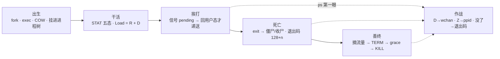
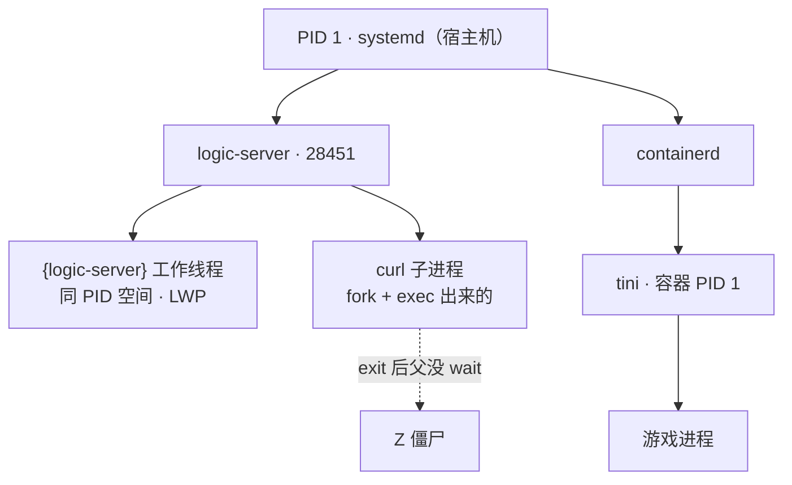
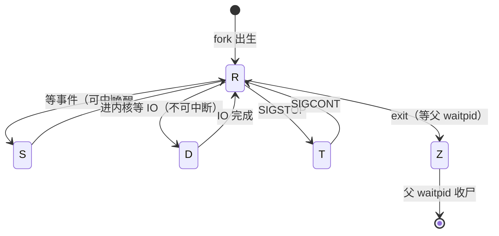
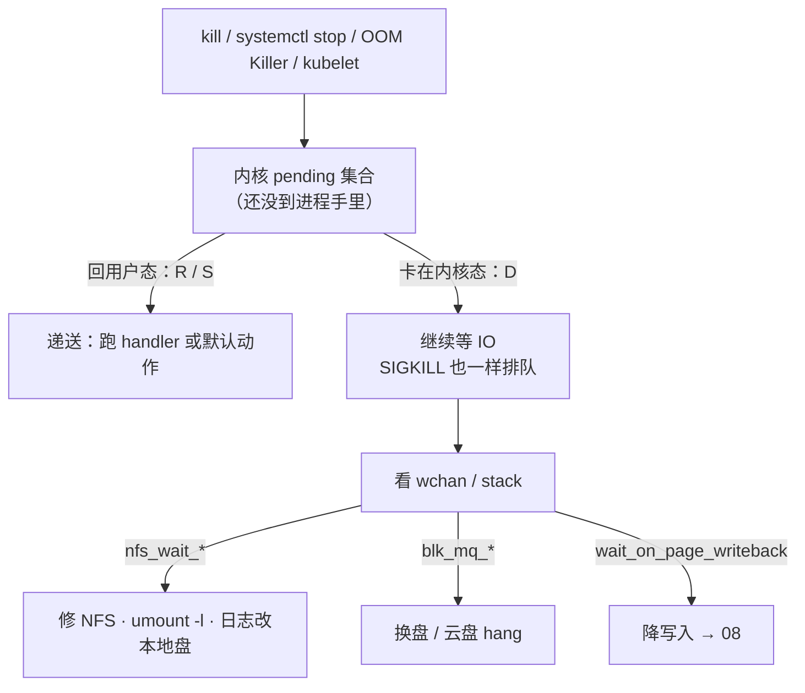
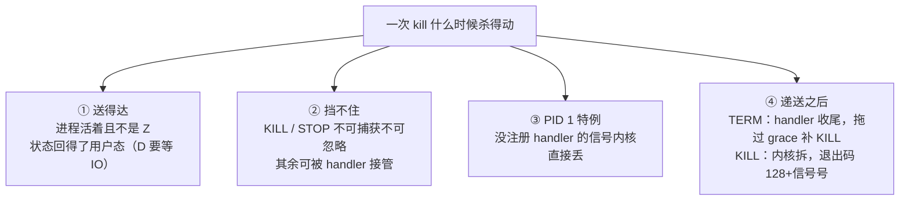
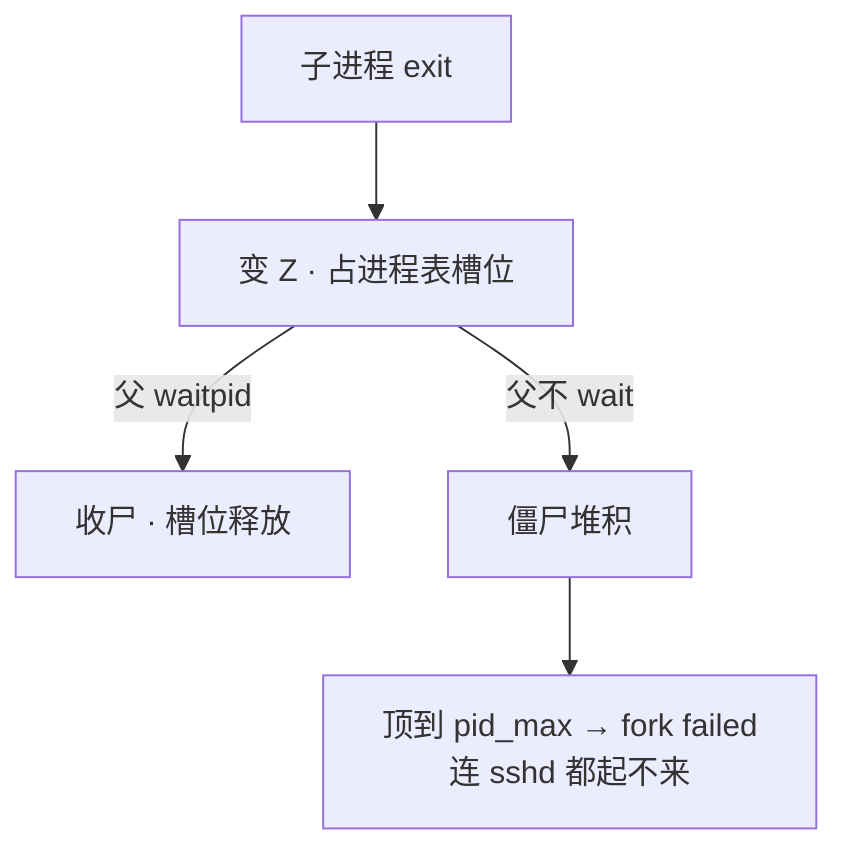
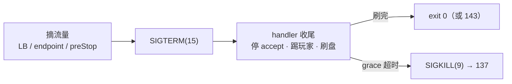
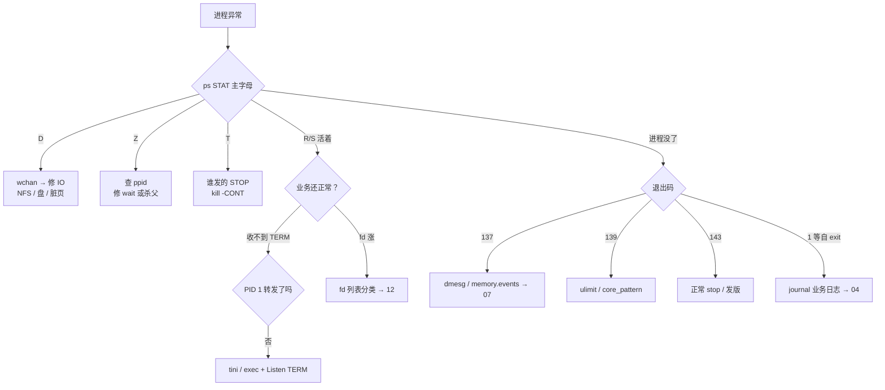

# 进程与信号

> 大家好，欢迎来到这次分享。开讲之前，先带大家回到一个很多值班同学都经历过的现场：
> 大厅卡登录，Load 40 但 CPU idle 70%，群里已经对着一排 PID `kill -9` 三连——进程纹丝不动；发版脚本一把 `-9`，玩家集体回档；`docker stop` 每次都干等 10 秒才强杀。
> 这一章讲完，你会知道当时那个人错在哪，以及正确的杀法、停法分别是什么。
> **本章回答**：一个进程从出生（fork/exec）到死亡（exit/僵尸）的一生，信号在哪个环节递送、谁能挡住它、怎么杀才杀得对。
> **不讲**：Load 高低分型与加核 → [06](../06-CPU与Load/)；OOM 全流程 → [07](../07-内存与OOM/)；脏页/await → [08](../08-磁盘与IO/)；CLOSE_WAIT 与 fd 队列 → [12](../12-网络栈与Socket/)；cgroup 限额细账 → [10](../10-cgroup与容器/)；unit 文件全文 → [11](../11-Systemd与服务管理/)。这些都有专门的章节，本章只在用到时点到为止。

**标记**：🎯重点 · 🔥难点 · ⭐常考 · 🔧实操

**怎么听这场分享**：咱们先看第一节的主图，把「一个进程的一生」装进脑子；第二到第六节顺着这条线一站一站往下走——出生、干活、挨打、死亡、善终；第七节专门讲定责，也就是开头那个现场的正确解法。每一节讲完都会提示对应练习题，学完就去练。

---

## 一、一张图：一个进程的一生

> 🎯 **一句话**：进程像人一样生老病死——出生（fork）、干活（五态）、挨打（信号）、死亡（exit）、善终（停服）；出事先问它在哪一段。

咱们先不急着背信号号。学进程最怕的就是上来就 `kill -9`——杀之前连它处在哪一段都不知道。先看图，把「生老病死」装进脑子里：



**读图**：带着三个问题看这张图，比背信号清单有用得多：

- 主线是一个进程的一生，五个阶段串成一条时间线，每节讲一段；「挨打」那一段是全章枢纽——它决定了前面「为什么杀不掉」和后面「怎么死得体面」。⭐ 这是面试必考的地基（练习题 Q1、Q3）。
- 值班遇到「进程不对」，`ps` 的 STAT 就是 X 光机：D 照 IO、Z 照父进程、进程没了照退出码——先认状态再动手。口诀记一句：**「先认 STAT，再动手」**。
- Load 只照得到 R 和 D 两段，S 再多也不进 Load。

好，主图有了。咱们正式出发——第一站：出生。

---

## 二、出生：fork、exec 与进程树

> 🎯 **一句话**：进程从 fork 来——fork 复制、exec 换芯、COW 拆页；每个进程都有爹，没爹的归 PID 1 收养。

告警进机、进程「起不来」或「突然多了一堆」，第一问常常是：它是怎么生出来的？

### fork + exec：起一个进程的两步 ⭐

Linux 里「起一个新进程」几乎都是同一条链：**fork（复制）** 出一个子进程，再 **exec（替换）** 把它的地址空间整个换成新程序。shell 敲一条命令、Java `Runtime.exec`、脚本拉 curl，内核里走的都是这一条：

```text
父进程 ──fork()──► 子进程（父进程的复制品：新 PID、页表指向同一批物理页）
子进程 ──exec()──► 地址空间整个换成新程序（ls / curl / python），PID 不变
```

- **fork 只复制**：子进程拿到父进程的代码、数据、fd 的副本，先和父进程「长得一模一样」。
- **exec 只替换**：把当前进程的程序换成磁盘上的另一个可执行文件，之前的数据全丢。所以 fork 完紧接着 exec，合起来才是「起了一个新命令」。
- 只 fork 不 exec 也常见：Redis 的 BGSAVE、Nginx master 拉 worker——子进程就是拿来干活的复制品。

> ⚠️ **别混**（链接前置）：`fork` 出的子进程**天然继承**父进程的 fd——`fork` 后父子共享同一个 socket，只有最后那个 `close` 才发 FIN，这是 [12](../12-网络栈与Socket/) 里「代码明明 close 了还有连接」的根源之一。

### COW：fork 不是内存免费 🔥

大家想想：fork 既然是「复制」，512Mi 的容器里再 fork 一个 curl，宿主机还有几十 G 空闲，为什么会报 `Cannot allocate memory`？很多人会答「宿主机内存不够」——**错了**。

🔥 **COW（copy-on-write，写时复制）** 这个词第一次见容易懵。大白话拆开：**fork 时父子先共用同一批物理页，谁要改谁才自己复印一份——省的是「立刻整份复制」，不省「内核按最坏情况预留」**。

> 💡 **打个比方**：COW 像合租房——fork 时父子先共用同一套家具（物理页），谁要改动谁自己复印一份搬出去，没改的一直共用。但房东（内核）签租约时仍按「两人都可能把家具全换一遍」做押金检查——押金不够就不让签。

fork 不真的复制内存：只复制**页表**，父子页表指向同一批物理页并标成只读。谁先写谁触发缺页异常，内核才复制那一页、各持一份。**省的是「立刻复制物理页」，不省「内核的预留」**——fork 时内核仍按「子进程可能把所有页都写一遍」做检查，账不够就拒绝。⭐ 口诀：**「COW 省复制不省预留」**（练习题 Q10）。

> 🔍 **现场**：512Mi limit 的 Pod 里 `Runtime.exec("curl ...")` 报 `error=12, Cannot allocate memory`，宿主机 `free -h` 还剩几十 G——**别信宿主机的账**，看容器的账：

```bash
cat /sys/fs/cgroup/memory.max      # 容器限额；RSS 已贴着它，fork 的预留就失败
cat /sys/fs/cgroup/memory.current  # 当前用量
# error=12 = ENOMEM ← 不是宿主机没内存，是这个 cgroup 的账不够 fork 预留
```

修法：子进程改 sidecar / 本地 HTTP / IPC，或给 limit 留出 COW 余量——细账见 [10](../10-cgroup与容器/)。线程共享地址空间，这个坑主要是 **fork 子进程**，不是起线程。

### 进程 vs 线程 ⭐

| 对比 | 进程（process） | 线程（thread） |
|------|----------------|----------------|
| 地址空间 | **独立**，各一份 | **共享**同一个进程的 |
| 崩溃隔离 | 好：一个崩别人没事 | 差：段错误拖垮整个进程 |
| 创建成本 | 高：fork + 页表 | 低：clone 共享内存描述符 |
| `ps` 怎么认 | 一行一个 PID | `ps -eLf` 看 LWP；`top -H` 每线程一行 |

游戏逻辑服常见「主进程 + 工作线程池」。排障别只看进程一行 `%CPU`，热点常在单个线程：

```bash
top -H -p 28451          # 每线程一行；单线程 100% 其余闲 = 热点在一核
ps -o pid,nlwp,stat,comm -p 28451
#   PID  NLWP STAT COMMAND
# 28451    48 Sl   logic-server    ← NLWP=48：48 个线程；STAT 里的 l 也是多线程标记
```

### 进程树与 PID 1 🎯

每个进程都有父进程（**PPID** = 父进程的 PID）。所有进程沿 PPID 向上追，根都是 **PID 1**：宿主机上是 systemd，容器里是你塞进去的那个入口（tini、应用、或 shell）。



**读图**：向上追 PPID 能找到谁拉起谁（僵尸的爹一眼可见）；容器里入口应为 tini → 应用，看到 `sh -c` 挂头就是善终节的坑。PID 1 的两个天职：**收养孤儿**、**wait 子进程收尸**——容器里这两条没人干就会出孤儿堆积和僵尸堆积（四、五节）。

### 孤儿：活着没爹，不是故障

**孤儿进程（orphan process）** = 父进程先退出、还在运行的子进程。它会被 PID 1 **收养**（PPID 变成 1），继续跑——这是内核的正常兜底，不是故障：

```bash
ps -eo pid,ppid,stat,comm | grep myworker
#  PID  PPID STAT COMMAND
# 9012     1 S    myworker        ← PPID=1 且 STAT 不是 Z → 孤儿，已被收养，正常
```

故意变孤儿的经典是**守护进程（daemon）**：两次 fork + `setsid` 脱离终端、自立门户。生产里更常见的是 systemd `Type=simple` 前台跑——少自己玩双重 fork。systemd 的 `KillMode=process` 只杀主进程、把子进程全变孤儿占着端口，这是配置坑（六节）。

这一节对应练习题 Q6、Q10——出生与进程树，学完直接去练。

好，进程怎么生出来讲完了。大家想想：进程活着的时候，`ps` 那一列 STAT 到底在说什么？Load 40 却 idle 70%，和这一列有什么关系？

---

## 三、干活：五个状态 R/S/D/Z/T

> 🎯 **一句话**：`ps` 的 STAT 先看主字母——R 在跑、S 可叫醒、D 杀不掉、Z 找爹、T 是被按了暂停；Load = R + D。

进程生出来之后就在干活。值班第一眼永远是 STAT——这一列认错，后面全盘皆输。

### 状态机：五态与迁移 🎯⭐



**读图**：R 是唯一的「跑」状态，其余四个都在等——等事件（S）、等 IO（D）、等恢复（T）、等收尸（Z）。离开 R 的箭头决定 `kill` 好不好使：S 能被信号叫醒，D 不能，Z 已经死了没有可杀的实体。

```text
R  可运行        正在 CPU 上跑，或在队列里等 CPU      kill 有效 · 计入 Load
S  可中断睡眠    等 socket / 锁 / sleep / epoll_wait   kill 有效 · 不计入 Load
D  不可中断睡眠  内核里等 IO（本地盘 / 云盘 / NFS）     kill -9 无效 · 计入 Load
Z  僵尸          已 exit，等父进程 waitpid 收尸         杀这个 PID 无意义 · 不计入 Load
T  暂停          被 SIGSTOP 挂起                       先 SIGCONT · 不计入 Load
```

STAT 是多字符的：主字母后面的 `l`=多线程、`s`=session leader、`+`=前台进程组——认主字母即可，别被后缀带偏。

### Load 为什么不含 S ⭐

很多人会答「S 太多所以 Load 高」——**错了**。⭐ 这是高频错答。

> ⚠️ **别混**：**S（可中断睡眠）vs D（不可中断睡眠）**——差在「事件能不能被信号打断」。S 等的是允许打断的事件（socket、锁、定时器），`kill` 一发就醒；D 等的是**不能中途拆**的 IO（拆了会破坏块设备或 NFS 协议一致性），所以信号进不去。**Load = 可运行队列（R）+ 不可中断睡眠（D），S 不计入**——大厅网关几万个连接全是 S，Load 可以接近 0。口诀：**「Load = R + D，S 再多也不进」**（练习题 Q5）。

值班对屏口诀：

```text
一排 D + idle 高   → IO / NFS / 脏页，看 wchan（四节）   别说「加 8 核」
一排 R + %us 高    → CPU 型，去 06                       别说「先 kill -9」
大量 S + Load 低   → 正常睡（网关万连接）                别说「S 太多所以 Load 高」
几个 Z             → 查 ppid（五节）                     别去 kill 僵尸
T                  → 谁发的 STOP；kill -CONT             别当挂死重装
```

### T 状态：被按了暂停 ⭐

`SIGSTOP` 把进程挂起进 T（不可捕获，但和 KILL 的「不可捕获」不是一回事——它不杀进程），`SIGCONT` 恢复。生产里少见，多是误发或调试器留下来的；看到 T 先查谁发的 STOP，`kill -CONT` 解开，别当挂死重启。

### 🔍 现场：一行 `ps` 怎么读 🔧

```bash
ps aux
# USER   PID  %CPU %MEM   VSZ   RSS TTY STAT START  TIME COMMAND
# game 28451  0.0  2.1 8388608 2096128 ?  D  03:10  0:00 logic-server   ← D：卡不可中断 IO，kill -9 无效，进 Load → wchan
# game 28452  5.2  1.8 4194304 1048576 ?  S  03:10  1:23 nginx: worker  ← S：可中断睡，不进 Load；5.2% 是间歇醒
# game 28453  0.0  0.0    0        0   ?  Z  03:09  0:00 [curl] <defunct>← Z：僵尸，不占用户内存 → 查 PPID
# game 28454  0.5  0.5 1024000  512000 ?  Rl 03:10  2:10 logic-server   ← Rl：在跑 + 多线程；%us 高去 06
```

这一节对应练习题 Q5——五态与 Load，务必练熟。

好，状态认清了。接下来自然会问：对着一个活着的进程发 `kill`，信号到底什么时候生效？开头那个「`-9` 三连杀不掉」的现场，根因就在下一节。

---

## 四、挨打：信号怎么递送、谁能挡住

> 🎯 **一句话**：信号是内核发给进程的异步通知，多数能被应用处理；递送要等进程回到用户态——这两条决定了「杀得掉杀不掉」的一切。

这是全章最厚的一节，也是开头那个现场的答案所在。咱们放慢一点。

### 信号清单：谁可捕获、谁挡不住 ⭐

🔥 **信号（signal）** 第一次见容易当「杀进程的命令」。大白话拆开：**它是内核发给进程的一张小纸条——「有件事要你处理」；多数纸条应用能自己拆，只有两张内核特批挡不住**。正式说法：信号 = 内核发给进程的异步事件通知。每个信号有**默认动作**（多数是终止进程），应用也可以注册 **handler（信号处理函数）** 接管它——除了两个内核特批挡不住的：

```text
 1 HUP    终端挂断 / 重读配置      可捕获   ← Nginx reload 就是发它
 2 INT    Ctrl+C                  可捕获
 3 QUIT   退出（常带 core）        可捕获
 9 KILL   处决                    不可捕获 ← OOM、grace 超时、人手 -9
10 USR1   自定义                  可捕获
12 USR2   自定义                  可捕获   ← Nginx 热升级二进制
13 PIPE   写已关闭的管道/socket    可捕获   ← 默认动作是杀进程！网关必须 Ign
14 ALRM   定时器到点              可捕获
15 TERM   终止请求                可捕获   ← 停服第一枪（systemctl stop / kubelet）
17 CHLD   子进程退出              可捕获   ← PID 1 必须靠它去 wait
18 CONT   继续运行                （配 STOP 用）
19 STOP   暂停                    不可捕获
20 TSTP   Ctrl+Z                  可捕获
```

两条铁律：**KILL(9) 和 STOP(19) 不可捕获、不可忽略**——内核直接执行默认动作；其余信号应用都能接管。`kill -l` 看本机全表。

> 📝 **面试**：「哪些信号捕获不了、为什么？」——只有 **KILL(9) 和 STOP(19)**：设计上必须保留「管理员必能处决/暂停一个进程」的最后手段，所以内核在递送层直接执行默认动作，根本不给 handler 机会。常见追问「那 STOP 了怎么恢复」——配对的 **CONT(18)**。

### 递送时机：pending 与「D 杀不掉」🔥

大家想想：`kill -9` 都杀不掉，是不是信号不够强？很多人会答「再换个更狠的」——**错了**。问题不在信号强弱，在递送时机。

> 💡 **打个比方**：信号像快递放门口——内核先把信号挂进 **pending 集合**（放门口），只有进程自己「回到用户态」（回家）才会拆开执行。进程泡在内核里等 IO（D 状态）就是一直没回家：`kill -9` 也只能一直放在门口排队。

🔥 **信号只在进程从内核态返回用户态的那一刻递送**——这句话是全章最值钱的一句。运行中（R）、可中断睡（S）都回得了用户态，信号立刻生效；D 状态回不了，任何信号（包括 KILL）都压在 pending 里等 IO 完成。⭐ 口诀：**「杀不死不是信号不够强，是 IO 没回来」**（练习题 Q1）。



**读图**：从上往下是「信号发出 → pending → 分岔」——分岔只看进程状态，不看信号多强。D 那条支路的出口是 wchan（内核里正在等的函数名），三种字样对应三种修法，全是**修 IO 路径**，没有一种是再 kill 一次。

> 🔍 **现场**：Load 40、idle 70%，群里已经 `kill -9` 三连、进程还在——就是开头那个现场，走这条线：

```bash
ps aux | awk '$8 ~ /D/'        # 确认 STAT 一排 D —— 不是 CPU 不够，别加核
cat /proc/28451/wchan
# nfs_wait_bit_uninterruptible  ← 在等 NFS：对端抖了。不是权限问题，也不是杀得不够狠
cat /proc/28451/stack          # 内核栈，多看一层
kill -9 28451; sleep 1; ps -p 28451   # 还在——到此为止，别再杀，去修 IO
```

止血：恢复 NFS 或 `umount -l` 懒卸载；长期把日志 / core / 热更放本地盘（NFS 一抖全员 D）。NFS 挂载用 `soft,timeo=100,retrans=2`，宁可失败不要永远 D。大量 D 时普通 `reboot` 会卡在杀进程——走云控制台**强制重启**。`gdb attach` 一个 D 进程也会一样卡住，别试。

> 📝 **面试**：「`kill -9` 都杀不掉，为什么？」——信号只在进程**从内核态返回用户态**那一刻递送；D 状态卡在不可中断的 IO 等待里回不去，KILL 也压在 pending 集合里排队。答案收在「杀不死不是信号不够强，是 IO 没回来」：看 `wchan` 定位在等什么（NFS / 块设备 / 回写），修 IO 路径才是出口。

### TERM vs KILL：请求与处决 ⭐🔥

| 对比 | **SIGTERM（15）** | **SIGKILL（9）** |
|------|-------------------|-------------------|
| 应用能处理吗 | **能**，handler 收尾 | **不能**，内核直接拆 |
| 谁在用 | `systemctl stop`、`docker stop`、K8s 第一枪 | OOM Killer、grace 超时、人手 `-9` |
| 刷盘 / 关连接 | 来得及做 | **来不及**，脏数据丢 |
| 退出码 | 自己 `exit 0` 或 143 | **137** |

`kill PID` 不带参数发的就是 TERM——默认首选是「请求」，不是「处决」。

> ⚠️ **别混**：OOM Killer 发的是 **SIGKILL**——没有 handler 可跑，「OOM 时优雅退出失败」这个说法不成立，**根本没有**优雅退出。指望 OOM 前刷盘，只能靠 limit 余量、探针、降载（[07](../07-内存与OOM/)）。口诀：**「OOM = KILL，没有优雅退出」**。

### SIGPIPE：写已关连接会死进程 ⭐

对端已关闭的管道或 socket 上继续 `write`，内核默认发 **SIGPIPE(13)**，默认动作是**把进程整个杀掉**——自写 C/C++ 网关「偶发整个进程没了」的头号原因。处理：`signal(SIGPIPE, SIG_IGN)` 忽略它，改为检查 `write` 返回的 `-1` 和 `errno=EPIPE`；Go / Java 运行时已默认处理。HTTP 客户端提前断开、游戏网关对死连接推包，都是高发场景。

### SIGHUP 与 USR2：reload 不是重启 ⭐

`nginx -s reload` 对 **master** 发 **SIGHUP(1)**：master 重读配置、拉起新 worker；**旧 worker 处理完手上的连接再退**——长连接不断开、新连接走新配置。两个坑：

- 卡在 **D** 的旧 worker：HUP 换不掉它（回不了用户态，退不出），只能修 IO。
- 长连接 + 慢退：旧 worker 还挂着一批连接，内存看起来「reload 后翻倍」，直到退完——配 `worker_shutdown_timeout` 兜底（[19](../19-Nginx/)）。

> ⚠️ **别混**：**HUP = 重读配置换 worker，USR2 = 热升级二进制，TERM = 停服**——三件事三个信号，别答成「reload 就是重启 Nginx」。口诀：**「HUP 换配置，USR2 换二进制，TERM 才停服」**（练习题 Q11）。

### 信号合并与 handler 安全

- **标准信号会合并**：信号在 pending 里是按编号记的位图，连发 10 次 TERM 可能只递送 **1** 次——别指望用「狂发 TERM」传次数信息。
- **handler 里别乱干活**：`malloc` / `printf` 不是 async-signal-safe（可能在信号打断时已被占用），handler 里只置标志位，正经活回主循环干；Go 用 `os/signal` 把信号转成 channel、在普通 goroutine 里处理。
- **实时信号**（SIGRTMIN 起）排队不合并，生产少用。
- **SIGCHLD(17)**：子进程退出时发给父进程——父进程收到去 `waitpid` 收尸；PID 1 不处理它就是僵尸堆积（五节）。

### 收束：一次 kill 什么时候真的杀得动 🎯⭐

把本节散的机制收成一张清单——面试问「`kill -9` 为什么杀不掉 / 信号到底什么时候生效」，要的就是这四道检查：



**读图**：①② 是「能不能送达、送达了能不能被挡」，③ 是容器里的特例（六节），④ 是结局。D 杀不掉、僵尸杀不动、容器收不到 TERM、OOM 没有优雅退出——四个高频问题分别卡在 ①②③④ 的一道检查上，按图对号入座。

> ⚠️ **别混**：这条链**不保证**「KILL = 立刻消失」——D 状态连 KILL 都压在 pending；也**不保证**「TERM = 一定退出」——handler 可以不退，靠 grace 超时补 KILL 兜底。还有一条：信号合并意味着「发了 10 次」不等于「处理 10 次」。

> 📝 **面试**：按「**送达条件 → 挡不住的两个 → PID 1 特例 → 退出码 128+n**」分组背：先说信号要回用户态才递送（D 是反例），再说 KILL/STOP 不可捕获，再补容器 PID 1 没注册的信号被内核丢弃，最后用 137/139/143 收尾。四道检查一条线，比背零散结论高一档。练习题 Q1、Q3、Q11 专门练这条。

这一节对应练习题 Q1、Q3、Q11——挨打是全章枢纽，务必练熟。

好，信号什么时候生效讲透了。下一站：进程死了之后会发生什么？几百个 `[curl] <defunct>` 把 ssh 都卡死，根因就在「死亡」这一段。

---

## 五、死亡：exit、僵尸与退出码

> 🎯 **一句话**：exit 之后父进程不 wait 就是僵尸；被信号杀的进程退出码 = 128 + 信号号，137/139/143 各查各的。

进程挨完打、自己 exit，或被信号拆掉——故事还没完。很多人以为「进程没了」就结案，其实尸体还占着工位。

### 从 exit 到收尸：waitpid 这一步 🔥

很多人会答「僵尸很占内存所以机器变卡」——**错了**。⭐ 这是高频错答。

> 💡 **打个比方**：僵尸像已下班却没销工牌的员工——人早走了（用户内存已释放），门禁系统里还占着一个工位（进程表槽位），要等人事（父进程 `waitpid`）办完离职手续才真正销掉。

🔥 **僵尸进程（zombie process）** 大白话：**人已经走了，工牌还没销——占的是 PID 号，不是内存**。正式说法：子进程已 `exit`、内核保留进程表槽位和退出状态，等父进程 `wait`/`waitpid` 来取。`ps` 里显示 `Z` 和 `<defunct>`。所以用 `free` 判断僵尸严重程度是错的。口诀：**「僵尸占 PID 不占内存，杀僵尸 PID 没用」**（练习题 Q2）。



**读图**：僵尸的出口只有两个——父进程来收（根治），或父进程死掉（僵尸被 PID 1 收养并收尸，止血）。`kill -9` 僵尸 PID 两条路都不是：**没有可杀的实体**。

> 🔍 **现场**：几百个 Z、sshd 报 `fork failed`——按这条线：

```bash
ps -eo pid,ppid,stat,comm | awk '$3 ~ /Z/'
#   PID  PPID STAT COMMAND
# 28453 28451 Z    [curl] <defunct>   ← PPID 都是 28451：logic-server 没 wait
ps -eo ppid,stat | awk '$2 ~ /Z/ {print $1}' | sort | uniq -c | sort -rn
#    847 28451                          ← 28451 名下攒了约 847 个僵尸——罪魁是它
cat /proc/sys/kernel/pid_max
# 32768                                ← 僵尸数量逼近它，全机 fork 都会失败
```

**典型来源**：Java `Runtime.exec` 不 `waitFor`；shell 循环 fork 不收；容器 PID 1 不处理 SIGCHLD。

**止血与根治**：

```text
根治：父进程修代码 wait/waitpid/waitFor，或注册 SIGCHLD handler 收尸
止血：父进程无药时 kill 父——僵尸被 PID 1 收养收尸（业务会断，先想清楚）
容器：PID 1 换 tini，自动 wait 子进程（六节）
预防：少在业务进程里 fork 外部命令，改 sidecar / IPC
```

### 孤儿 vs 僵尸 ⭐

| 对比 | **孤儿（orphan）** | **僵尸（zombie）** |
|------|--------------------|--------------------|
| 进程还活着吗 | **活**，还在跑 | **死**，只剩槽位 |
| STAT | 通常 S / R | **Z** + `<defunct>` |
| PPID | 变成 **1**（被收养） | 仍是没 wait 的那个父 |
| 要慌吗 | 一般不用（多为 daemon） | 堆到 pid_max 要慌 |
| 处理 | 确认是否预期 | 修父 wait，或杀父止血 |

> ⚠️ **别混**：**PPID=1 ≠ 僵尸**——孤儿的标志恰恰是 PPID=1 且活得好好的；僵尸的标志是 **STAT=Z**，PPID 指着那个没收尸的父。同理「杀僵尸 PID」永远没用，要么让父收尸、要么杀父让 init 代收。口诀：**「孤儿看 PPID=1，僵尸看 STAT=Z」**（练习题 Q6）。

> 📝 **面试**：「僵尸进程怎么产生、怎么清？」——子进程已 exit、内核保留它的退出状态等父进程 `wait`，父不 wait 就永远是 Z。清理顺序：先看父是谁（`ps -o ppid=`）；父是业务代码 bug 就修父；等不了就 kill 父，僵尸被 PID 1 收养收尸；容器场景换 tini 当 PID 1 自动 wait。一句收尾：**僵尸是死的，杀它没用，只能处理父**。

### 退出码：128 + 信号号 ⭐

进程被信号杀死时，**退出码 = 128 + 信号编号**——这三个数是值班路由表。⭐ 口诀：**「137 查 OOM，139 查 core，143 是正常 stop」**（练习题 Q7）：

```text
137 = 128 + 9  (SIGKILL)  ← 先查 dmesg OOM、cgroup memory.events、人手 -9、kubelet 强杀 → 07
139 = 128 + 11 (SIGSEGV)  ← 查 core dump / Java hs_err，不是 dmesg 找 OOM
143 = 128 + 15 (SIGTERM)  ← 正常 stop / 发版 / 驱逐，grace 内退出
  1 = 进程自己 exit(1)    ← 不是信号：看 journal 和业务日志，不去 dmesg → 04
```

### core dump 与 139 🔧

段错误（SIGSEGV）的现场就是 core dump，先让它能落盘再谈分析：

```bash
ulimit -c                                   # 0 = 禁止 dump（常见默认）
cat /proc/sys/kernel/core_pattern           # 指向 systemd-coredump 或可写目录
systemctl show myapp -p LimitCORE           # unit 层的 core 上限
# 落盘四检查：ulimit -c 非 0 · LimitCORE=infinity · core_pattern 指可写目录 · 容器挂了 volume
```

落盘后 `gdb /path/to/bin core` → `bt` 看栈。**Java 看 `hs_err_pid*.log`，不是 Linux core**。core / 日志 / 热更都不落 NFS（D 一抖全丢，四节）。dump 完立刻收走，别撑爆盘。

这一节对应练习题 Q2、Q6、Q7——死亡与退出码，学完直接去练。

好，死法认清了。下一站是「善终」——发版脚本一把 `-9` 导致玩家回档，以及 `docker stop` 总等满 10 秒，根因都在这里。

---

## 六、善终：优雅停服与容器 PID 1

> 🎯 **一句话**：摘流量 → SIGTERM → 刷盘 → grace 内 exit；超时才 KILL；容器里 TERM 要先送得到应用手上。

杀得动不等于杀得对。有状态游戏服怎么停，是值班红线。

### 停服一条链 ⭐🔥

大家想想：发版要停逻辑服，直接 `pkill -9` 行不行？很多人图省事就这么干——**玩家集体回档就是这样来的**。正确顺序是下面这条链：



**读图**：顺序即因果——不摘流量就 TERM，玩家还在往一个将死进程里进；KILL 只在 grace 超时后出现，是兜底不是第一步。有状态游戏服**禁止**把 stop 配成直接 `kill -9`，那就是跳过中间整条链、给玩家发回档。

**systemd 侧**：`systemctl stop` 发 TERM，`TimeoutStopSec` 就是 grace——游戏服 **30～120s**（按刷盘量定，10s 几乎必强杀）；journal 里看结局：

```text
myapp.service: Main process exited, code=exited, status=0/SUCCESS   ← TERM 后自己 exit，刷盘完成
myapp.service: Main process exited, code=killed,  status=9/KILL     ← grace 超时或 OOM，可能回档
```

**K8s 侧**是同一条链：endpoint 摘掉（或 prePreStop 里摘注册）→ kubelet 对容器 PID 1 发 TERM → 等 `terminationGracePeriodSeconds`（默认 **30s**）→ 超时 SIGKILL。

> ⚠️ **别混**：**preStop 在 TERM 之前跑**，适合摘注册中心——它**不能替代**应用 Listen TERM：摘完流量进程还是得自己接住 TERM 收尾，两件事各干各的。

**应用 handler 最小清单**（游戏逻辑服）：

```text
① 置 shutting_down，停 accept / 新进房间
② 通知在线玩家（踢回登录或短倒计时）
③ 刷角色 / 副本脏数据到 DB（每步有超时上限，别死等）
④ 关监听 fd，exit 0
⑤ 打点「收到 TERM 到 exit」耗时，用真实数据校准 grace
```

### 容器 PID 1：TERM 为什么到不了 🔥

大家想想：`docker stop` 每次都干等 10 秒才停，是不是 grace 太短？很多人会答「把 grace 加到 300」——**错了**。TERM 根本没送到，等再久也是等满再被 KILL。

> 💡 **打个比方**：容器里的 PID 1 是「迷你机的 init」——内核对 init 有特殊保护，**没注册 handler 的信号一律丢弃**，像 init 开了免打扰。kubelet 在门外敲门（TERM）敲满 grace 没人应，就踹门（SIGKILL）。

🔥 两层常见坑，往往叠在一起。⭐ 口诀：**「PID 1 没 handler 内核丢，shell 当 PID 1 不转发」**（练习题 Q4）：

```text
✗ 坏：应用是 PID 1 且没注册 handler
root  1  0  /usr/bin/python app.py        ← TERM 被内核丢弃 → 等满 grace → KILL

✗ 坏：shell 是 PID 1，不转发
root  1  0  /bin/sh -c python app.py      ← CMD python app.py 常被包成这样
root  7  1  python app.py                 ← TERM 停在 sh 手里，到不了 python

✓ 好：tini 当 PID 1（或 CMD exec 形式 + 应用自己 Listen TERM）
root  1  0  /sbin/tini -- /app/server
root  7  1  /app/server                   ← TERM 由 tini 转发到应用
```

修法三选一：镜像里放 **tini / dumb-init**、`docker run --init`、或 `CMD ["/app/server"]` **exec 形式**让应用自己当 PID 1 并 Listen TERM。tini 还顺带收 SIGCHLD、替你 wait 子进程——容器里的僵尸问题一并解决（五节）。

> ⚠️ **别混**：`shareProcessNamespace` 是调试用（Pod 里共享进程命名空间看进程），**不是**停服方案。另外 `KillMode=process` 只杀主进程、子进程全变孤儿占着端口——保持默认 `control-group`（[11](../11-Systemd与服务管理/)）。

> 📝 **面试**：「容器里的进程为什么收不到 SIGTERM？」——两层：① 应用当了 PID 1，内核对 init 有特殊保护，没注册 handler 的信号一律丢弃；② PID 1 是 `/bin/sh -c` 这类不转发信号的 shell，TERM 停在 shell 手里。修法：**tini / dumb-init 当 PID 1、`docker run --init`、或 CMD 用 exec 形式**让应用自己当 PID 1 并 Listen TERM；现象侧的指纹是「每次停服都等满 grace 才退、日志里 exit 137」。练习题 Q3、Q4。

这一节对应练习题 Q3、Q4——善终与容器，务必练熟。

好，一生五段齐了。换个视角：接到「进程不对」的报障，第一分钟怎么定责？就是开头那个现场的正确解法。

---

## 七、作战：STAT 第一眼定责

> 🎯 **一句话**：接到「进程不对」先 `ps` 看 STAT 主字母——D 查 wchan、Z 查 ppid、T 查谁 STOP、进程没了查退出码，先认状态再动手。

回到开头：大厅卡登录、有人已经在 `kill -9` 三连。正确做法是先看 STAT，再下刀。

### 定责决策树



**读图**：第一刀永远切 STAT——四个出口（D/Z/T/没了）各走各的树，互不通用；进程还活着才轮到问「业务正常吗、fd 涨吗」。最常见的走偏是把 D 当 CPU 不足加核、把 Z 当挂死重启。

### 现象 · 先做 · 别做

| 现象 | 先做 | 别做 |
|------|------|------|
| 一排 D，kill -9 还在 | `wchan` / `stack`，修 IO 路径 | 再杀一次、加 CPU |
| 几百 Z，sshd fork failed | 按 ppid 聚合，修 wait | kill 僵尸 PID |
| `docker stop` 总等满 10s | 查 PID 1 是否转发 TERM | 只把 grace 加到 300s |
| Too many open files | fd 计数 + limits，分类定位 | 只加 ulimit |
| 139 没有 core | ulimit / core_pattern / volume | 先猜代码 |
| Runtime.exec ENOMEM | 看 cgroup memory.max 余量 | 看宿主机 free |
| reload 后内存翻倍 | 旧 worker 是否还在（可能 D） | 当泄漏 dump |
| 发版玩家回档 | 查是否 kill -9 / grace 太短 | 只怪存储 |

### fd 泄漏 🔧

fd 只增不减、逼近 `Max open files` 就是泄漏；ulimit 只是推迟爆炸时刻。

```bash
ls /proc/28451/fd | wc -l                  # 隔 60s 数一次，看斜率——稳着涨就是泄漏
ls -l /proc/28451/fd | grep -c socket      # socket fd 涨 → 常伴 CLOSE_WAIT → 12
cat /proc/28451/limits | grep 'open files'
# Max open files  65535  65535             ← 计数逼近 65535 就要爆 Too many open files
```

socket fd 涨多是对端关了本地没 close（CLOSE_WAIT，[12](../12-网络栈与Socket/)）；普通文件 fd 涨是日志 / 上传没关。**重启就好**的原因：进程退出内核回收全部 fd——这证明泄漏在这个进程生命周期里，不证明根因消失。网关 fd 打满的表现是**只拒新连接**，老连接还活着。

### strace：看进程正在调什么 🔧

```bash
timeout 8 strace -c -p 28451               # -c 只统计：5～10s 短窗口，别挂一下午
# % time  seconds  calls  syscall
#  60.0   4.800    91231  futex            ← futex 爆炸 = 用户态锁竞争，去减锁，不是加核
#  25.0   2.000    88001  write            ← write/read 次数爆炸 = 小 IO，合并日志/缓冲
#   5.0   0.400     1024  epoll_wait       ← epoll_wait 极多而业务空转 = 查超时和连接风暴
```

跟线程加 `-f`。strace 本身有开销，**战斗服不要长时间全量跟踪**——P99 被打高是操作者的责任；敏感路径换 perf / eBPF（[04](../04-内核与系统/)、[21](../21-性能方法论-USE与RED/)）。

> ⚠️ **别混**：**strace = 正在做什么 syscall；fd 列表 = 已经打开了什么**——卡死类问题偏 strace，泄漏类问题偏 fd 列表，两边别用反。

### 60 秒剧本 🔧

```text
① 0–10s   ps -eo pid,ppid,stat,wchan:30,comm —— STAT 主字母分堆：D / Z / T / R/S / 没了
② 10–30s  按堆下刀：D → wchan；Z → ppid 聚合；T → 谁发 STOP；活着 → 业务/fd
③ 30–45s  进程没了 → 退出码分流：137 查 dmesg/memory.events、139 查 core、143 查发版
④ 45–60s  定责 + 留证：wchan 结论记下来；137/139 保留 dmesg / core / journal 再动手
```

### 事故复盘（本章原型事故）

活动高峰，日志打在 NFS 上，NFS 对端抖了一下：逻辑服一排 D、Load 40、CPU idle 70%。有人 `kill -9` 三连，PID 还在。`wchan` 指向 `nfs_wait_*`——止血恢复 NFS 或 `umount -l`，长期把日志改本地盘。**整场事故里杀进程一次都不该发生**：D 的答案在 wchan，不在信号。

红线四条：有状态游戏服禁止 stop 直接 `kill -9`；日志 / core / 热更不落 NFS；strace 默认 `-c` 短窗口；容器入口必须能把 TERM 送到应用手上。

**回到开头那个现场**：大厅卡登录，Load 40、idle 70%，群里已经 `kill -9` 三连。正确处理：`ps` 看 STAT → 一排 D → `wchan` 指向 `nfs_wait_*` → 修 NFS / 日志改本地盘——**整场事故里杀进程一次都不该发生**。现在再看群里那个人的操作，你知道该怎么拦住他了。

这一节对应练习题 Q8、Q9、Q12、Q13、Q14——作战综合题，务必练熟。

---

## 八、收口

到这里，本章的主要内容就讲完了。最后一部分是三张「小抄」：命令速查留着值班用，面试锚点留着面试前过一遍，易错对照留着自查——每条都是别人踩过的坑。

### 命令速查 🔧

```bash
# 状态分堆（第一刀）
ps -eo pid,ppid,stat,wchan:30,comm | head
ps aux | awk '$8 ~ /D/'                    # D → wchan
ps -eo pid,ppid,stat,comm | awk '$3 ~ /Z/' # Z → ppid
# D 深挖
cat /proc/{PID}/wchan; cat /proc/{PID}/stack
# 僵尸聚合
ps -eo ppid,stat | awk '$2 ~ /Z/ {print $1}' | sort | uniq -c | sort -rn
cat /proc/sys/kernel/pid_max
# 线程 / fd / 系统调用
top -H -p {PID}; ps -eLf
ls /proc/{PID}/fd | wc -l; cat /proc/{PID}/limits | grep 'open files'
timeout 8 strace -c -p {PID}
# 杀与停
kill -TERM {PID}; kill -CONT {PID}          # kill 默认就是 TERM
systemctl stop <svc>                        # 让 systemd 管 grace，优于裸 kill
# 停服配置与 core
systemctl show myapp -p TimeoutStopSec -p KillMode -p LimitCORE
ulimit -c; cat /proc/sys/kernel/core_pattern
# 退出码去向
journalctl -u myapp -n 40 --no-pager; dmesg -T | tail -30
```

### 面试锚点

遮住右列自问自答，卡壳的行回去重读对应小节——能讲出来才算会：

| 问 | 30 秒答 |
|----|---------|
| 五个 STAT？Load 含 S 吗？ | R/S/D/Z/T；Load = R+D，S 不计入。 |
| D 为什么 kill -9 无效？ | 信号要回用户态才递送，D 卡内核等 IO，KILL 也压 pending；看 wchan。 |
| wchan 三种字样？ | `nfs_wait_*` 修 NFS / `blk_mq_*` 换盘 / `wait_on_page_writeback` 降写入。 |
| TERM vs KILL？ | TERM 可处理可刷盘；KILL 不可捕获，内核直接拆；OOM 发的也是 KILL。 |
| 哪些信号不可捕获？ | 只有 KILL(9) 和 STOP(19)；PIPE 默认动作杀进程但可 Ign。 |
| 僵尸占内存吗？杀僵尸 PID？ | 占 PID 槽不占用户内存；杀僵尸 PID 没用，查 ppid 修 wait 或杀父。 |
| 孤儿 vs 僵尸？ | 孤儿活着被 PID 1 收养（PPID=1）；僵尸已死等父 wait（STAT=Z）。 |
| 僵尸怎么根治？ | 父进程 wait/waitPID/SIGCHLD handler；容器用 tini；少在业务里 fork。 |
| 137/139/143？ | 128+9/11/15：137 查 OOM、139 查 core、143 是正常 stop。 |
| 游戏服怎么停？ | 摘流量 → TERM → 停 accept/踢玩家/刷盘 → exit 0；grace 30～120s；超时才 KILL。 |
| 容器收不到 TERM？ | PID 1 没 handler 内核丢弃，或 shell 不转发；tini / CMD exec 形式。 |
| preStop 干嘛的？ | TERM 之前摘注册，不能替代应用 Listen TERM。 |
| 贴着 limit fork 为什么失败？ | COW 省复制不省预留，cgroup 账不够 → ENOMEM，与宿主机 free 无关。 |
| reload 用什么信号？ | HUP 重读配置换 worker；USR2 才是热升级二进制；别混。 |
| SIGPIPE 为什么要 Ign？ | 写已关连接默认杀进程；Ign 后查 errno=EPIPE；Go/Java 已默认处理。 |
| 连发 10 次 TERM 处理几次？ | 标准信号按位图记，可能只递送 1 次。 |
| handler 里能 printf 吗？ | 不能，非 async-signal-safe；只置标志，Go 用 os/signal 转发。 |
| fd 泄漏怎么认？ | /proc/PID/fd 计数只增不减逼近 Max；只加 ulimit 是推迟爆炸。 |
| strace 和 fd 列表分工？ | strace 看正在调什么；fd 列表看已打开什么；卡死偏前者，泄漏偏后者。 |

### 易错一句话对照

- D 状态 `kill -9` 能杀 → 回不了用户态，信号压 pending
- 换 TERM/STOP 就能杀掉 D → 同一类，都要回用户态
- S 多所以 Load 高 → Load = R+D，S 不计入
- 杀僵尸 PID 能收尸 → 查 ppid，修 wait 或杀父
- 僵尸很占内存 → 占 PID 槽，不占用户内存
- PPID=1 就是僵尸 → 那是孤儿被收养；僵尸看 STAT=Z
- 孤儿 = 僵尸 → 一个活着被收养，一个死了等收尸
- 发布脚本对逻辑服 `kill -9` → 不刷盘，玩家回档
- OOM 时 handler 还能刷盘 → OOM 发 SIGKILL，没有 handler
- 容器默认收得到 docker stop 的 TERM → PID 1 没 handler 内核直接丢
- `CMD python app.py` 没问题 → 常被 shell 包一层，TERM 到不了应用
- reload 就是重启 Nginx → HUP 换 worker 不停服；USR2 才换二进制
- 连发 10 次 TERM 处理 10 次 → 标准信号会合并
- handler 里随便 printf → 非 async-signal-safe
- 139 去 dmesg 找 OOM → 139 是 SIGSEGV，先查 core/hs_err
- 137 都是 OOM → 也可能是人手 -9 / grace 超时强杀
- 只加 ulimit 治 fd 泄漏 → 只推迟爆炸；重启只是止血
- strace 挂一下午找根因 → `-c` 5～10s 短窗口，P99 打高是你的责任
- 贴着 limit 再 fork 没问题 → COW 预留失败 ENOMEM
- core / 日志放 NFS 挺方便 → NFS 一抖全机 D，全丢

### 数字墙

> `pid_max` 常见 **32768** · 游戏服 grace **30～120s** · K8s 默认 grace **30s** · 退出码 **128 + 信号号**（137/139/143 = 9/11/15）· TERM **15** · KILL **9** · STOP **19** · PIPE **13** · CHLD **17** · strace 窗口 **5～10s `-c`** · NFS `soft,timeo=100,retrans=2` · 不可捕获信号 **2** 个 · 标准信号合并后可能只递送 **1** 次

---

## 合上书

学到这里，先别急着翻下一章。合上书，试试下面这几件事能不能做到——能做到，这章才算真的听懂了。卡住的那一条，就回到对应的小节再听一遍（练习题「合上书」与这里逐条对齐）：

- [ ] **默画一节的图**：出生 → 干活 → 挨打 → 死亡 → 善终五个阶段各记什么；`ps` STAT 照哪几段。（→ Q14）
- [ ] **口述出生**：fork 和 exec 各干什么、COW 省什么不省什么、贴着 limit fork 为什么 ENOMEM。（→ Q10）
- [ ] **口述进程树**：PID 1 两个天职、孤儿怎么被收养、daemon 双 fork + setsid 是干嘛的。（→ Q6）
- [ ] **口述干活**：五个 STAT 各是什么、Load = R+D 为什么不含 S、T 状态怎么解。（→ Q5）
- [ ] **默画挨打**：信号从发出到递送的链路（pending → 回用户态 → 生效），D 那条支路为什么 KILL 也进不去。（→ Q1）
- [ ] **口述挨打**：TERM vs KILL、OOM 走哪条、wchan 三种字样各修什么。（→ Q1、Q3）
- [ ] **默画收束**：一次 kill 生效的四道检查（送得达 / 挡不住 / PID 1 特例 / 递送之后），并说清它不保证什么。（→ Q1、Q4）
- [ ] **口述挨打余下**：SIGPIPE 为什么杀进程、HUP/USR2/TERM 三件事、信号合并、handler 安全。（→ Q11）
- [ ] **口述死亡**：僵尸怎么来、杀僵尸为什么没用、孤儿 vs 僵尸、137/139/143 各查哪、core 落盘四检查。（→ Q2、Q7）
- [ ] **口述善终**：停服一条链的顺序、grace 为什么 10s 不够、容器收不到 TERM 的两层坑、tini 解决什么。（→ Q3、Q4）
- [ ] **定责**：STAT 决策树第一刀怎么切、fd 泄漏和 strace 怎么分工、60 秒剧本四步。（→ Q8、Q9、Q12、Q13）

下一章：[CPU 与 Load](../06-CPU与Load/)——高 Load 低 CPU 为什么先查 D。地基：[04](../04-内核与系统/) · cgroup：[10](../10-cgroup与容器/) · OOM：[07](../07-内存与OOM/) · systemd：[11](../11-Systemd与服务管理/)。
