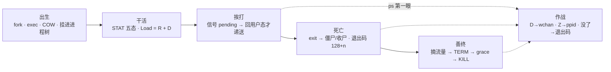
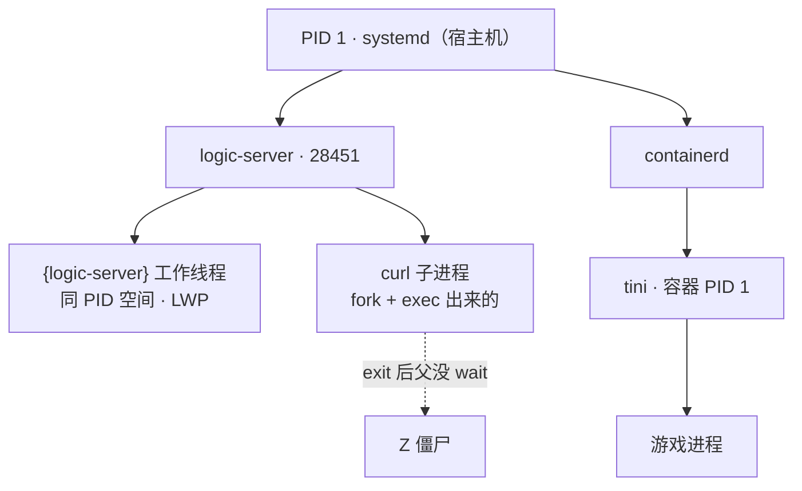
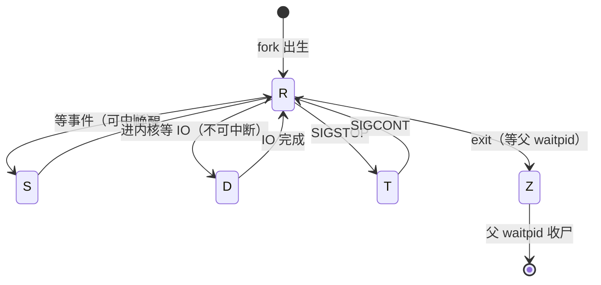
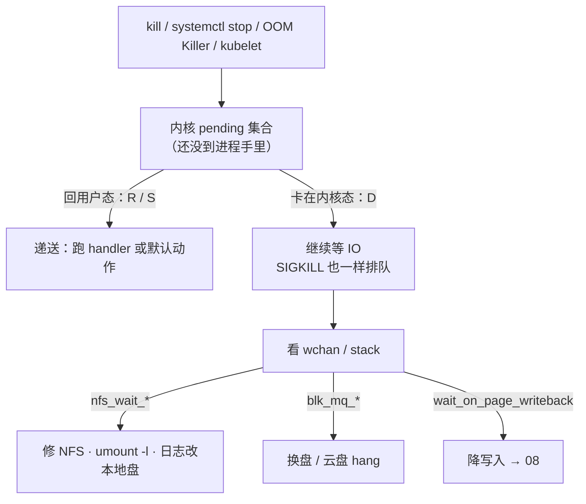
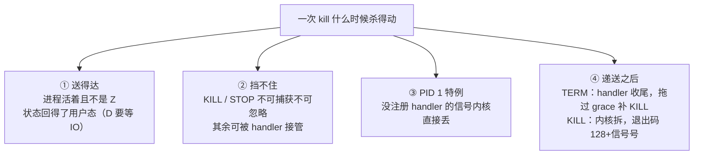
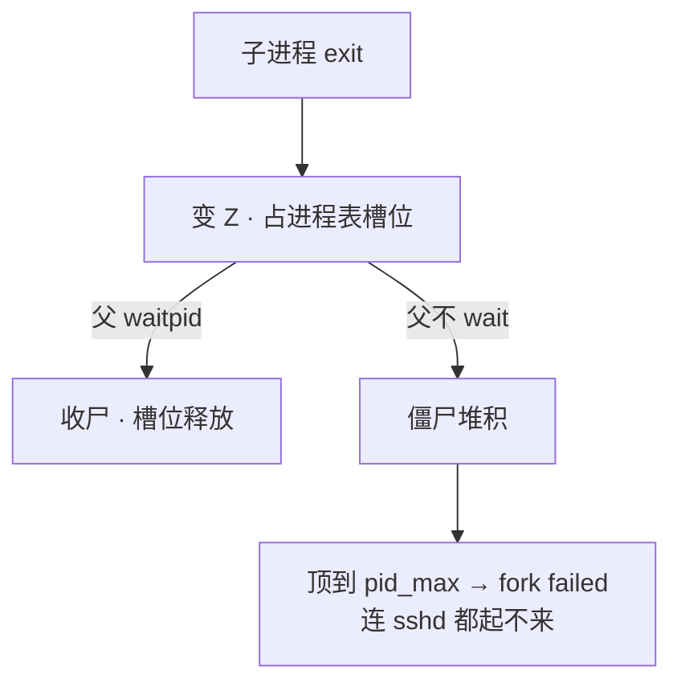
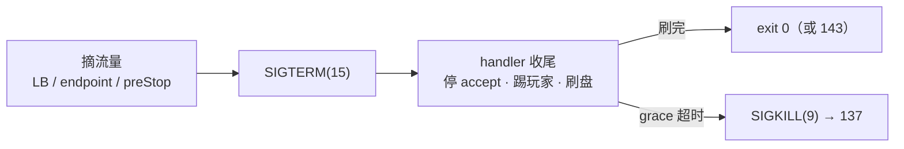
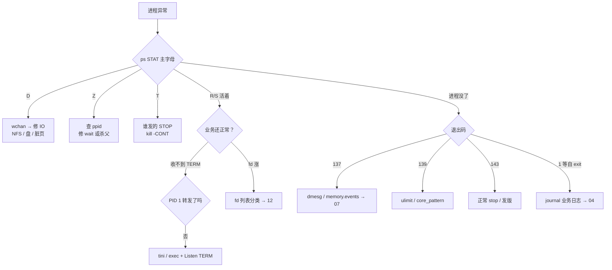

# 进程与信号

> 大厅卡登录，Load 40 但 CPU idle 70%，群里已经对着一排 PID `kill -9` 三连——进程纹丝不动；发版脚本一把 `-9`，玩家集体回档；`docker stop` 每次都干等 10 秒才强杀。
> **本章回答**：一个进程从出生（fork/exec）到死亡（exit/僵尸）的一生，信号在哪个环节递送、谁能挡住它、怎么杀才杀得对。
> **不讲**：Load 高低分型与加核 → [06](../06-CPU与Load/)；OOM 全流程 → [07](../07-内存与OOM/)；脏页/await → [08](../08-磁盘与IO/)；CLOSE_WAIT 与 fd 队列 → [12](../12-网络栈与Socket/)；cgroup 限额细账 → [10](../10-cgroup与容器/)；unit 文件全文 → [11](../11-Systemd与服务管理/)。

**标记**：🎯重点 · 🔥难点 · ⭐常考 · 🔧实操

---

## 一、一张图：一个进程的一生

> 🎯 **一句话**：进程像人一样生老病死——出生（fork）、干活（五态）、挨打（信号）、死亡（exit）、善终（停服）；出事先问它在哪一段。



- 📖 **读图**
  - 🛤️ 主线五个阶段串成时间线；「挨打」是枢纽——决定「为什么杀不掉」和「怎么死得体面」（Q1、Q3）
  - 🩺 `ps` STAT 是 X 光：D→IO、Z→父进程、进程没了→退出码；口诀 **「先认 STAT，再动手」**
  - Load 只照得到 R 和 D，S 再多也不进 Load

---

## 二、出生：fork、exec 与进程树

> 🎯 **一句话**：进程从 fork 来——fork 复制、exec 换芯、COW 拆页；每个进程都有爹，没爹的归 PID 1 收养。

### 🧬 fork + exec：起一个进程的两步 ⭐

- Linux「起新进程」几乎都是同一条链：**fork（复制）** → **exec（替换）**。shell 敲命令、Java `Runtime.exec`、脚本拉 curl，内核里都走这条：

```text
父进程 ──fork()──► 子进程（父进程的复制品：新 PID、页表指向同一批物理页）
子进程 ──exec()──► 地址空间整个换成新程序（ls / curl / python），PID 不变
```

- 🔑 **分工**
  - **fork 只复制**：子进程拿到父的代码、数据、fd 副本，先和父「长得一模一样」
  - **exec 只替换**：把当前进程换成磁盘上另一个可执行文件，之前数据全丢
  - 只 fork 不 exec 也常见：Redis BGSAVE、Nginx master 拉 worker——子进程就是拿来干活的复制品

> ⚠️ **别混**：`fork` 出的子进程**天然继承**父的 fd——父子共享同一个 socket，只有最后那个 `close` 才发 FIN（[12](../12-网络栈与Socket/)、[13](../13-TCP与UDP/)）。

### 📋 COW：fork 不是内存免费 🔥

> 💡 **打个比方**：COW 像合租——fork 时父子先共用同一套家具（物理页），谁要改谁自己复印一份；但房东（内核）签租约仍按「两人可能把家具全换一遍」做押金检查——押金不够就不让签。

- 🔥 **COW（copy-on-write，写时复制）**：fork 时只复制**页表**，父子指向同一批物理页并标只读；谁先写谁触发缺页，内核才复制那一页
- ⭐ 口诀：**「COW 省复制不省预留」**——省的是立刻整份物理复制，不省内核按最坏情况预留（Q10）

#### ❓ 为什么宿主机还有几十 G，容器里 fork 却 ENOMEM？

- 🎭 512Mi limit 的 Pod 里 `Runtime.exec("curl")` 报 `error=12, Cannot allocate memory`，`free -h` 还剩几十 G——**别信宿主机的账**
- 内核按「子进程可能把所有页都写一遍」做预留检查；cgroup 账不够就拒绝，与宿主机空闲无关
- 修法：子进程改 sidecar / 本地 HTTP / IPC，或给 limit 留 COW 余量（细账见 [10](../10-cgroup与容器/)）；这个坑主要是 **fork 子进程**，不是起线程

> 🔍 **现场**

```bash
cat /sys/fs/cgroup/memory.max      # 容器限额；RSS 贴着它，fork 预留就失败
cat /sys/fs/cgroup/memory.current  # 当前用量
# error=12 = ENOMEM ← 不是宿主机没内存，是这个 cgroup 的账不够 fork 预留
```

### 🧵 进程 vs 线程 ⭐

| 对比 | 进程（process） | 线程（thread） |
|------|----------------|----------------|
| 地址空间 | **独立**，各一份 | **共享**同一个进程的 |
| 崩溃隔离 | 好：一个崩别人没事 | 差：段错误拖垮整个进程 |
| 创建成本 | 高：fork + 页表 | 低：clone 共享内存描述符 |
| `ps` 怎么认 | 一行一个 PID | `ps -eLf` 看 LWP；`top -H` 每线程一行 |

- 游戏逻辑服常见「主进程 + 工作线程池」；排障别只看进程一行 `%CPU`，热点常在单线程：

```bash
top -H -p 28451          # 每线程一行；单线程 100% 其余闲 = 热点在一核
ps -o pid,nlwp,stat,comm -p 28451
#   PID  NLWP STAT COMMAND
# 28451    48 Sl   logic-server    ← NLWP=48；STAT 里的 l = 多线程标记
```

### 🌳 进程树与 PID 1 🎯

- 每个进程都有父进程（**PPID**）。沿 PPID 向上追，根都是 **PID 1**：宿主机上是 systemd，容器里是入口（tini、应用、或 shell）



- 📖 **读图**
  - 向上追 PPID 能找到谁拉起谁（僵尸的爹一眼可见）
  - 容器入口应为 tini → 应用；看到 `sh -c` 挂头就是善终节的坑
  - PID 1 两个天职：**收养孤儿**、**wait 子进程收尸**

### 👻 孤儿：活着没爹，不是故障

- **孤儿进程（orphan process）** = 父先退出、还在跑的子进程。被 PID 1 **收养**（PPID 变 1），继续跑——内核正常兜底，不是故障：

```bash
ps -eo pid,ppid,stat,comm | grep myworker
#  PID  PPID STAT COMMAND
# 9012     1 S    myworker        ← PPID=1 且 STAT 不是 Z → 孤儿，已被收养，正常
```

- 故意变孤儿的经典是**守护进程（daemon）**：两次 fork + `setsid` 脱离终端。生产更常见 systemd `Type=simple` 前台跑
- `KillMode=process` 只杀主进程、子进程全变孤儿占端口——配置坑（六节 / [11](../11-Systemd与服务管理/)）

本节对应练习题 Q6、Q10。

---

## 三、干活：五个状态 R/S/D/Z/T

> 🎯 **一句话**：`ps` 的 STAT 先看主字母——R 在跑、S 可叫醒、D 杀不掉、Z 找爹、T 是被按了暂停；Load = R + D。

### 🗺️ 状态机：五态与迁移 🎯⭐



- 📖 **读图**
  - R 是唯一「跑」状态，其余四个都在等——事件（S）、IO（D）、恢复（T）、收尸（Z）
  - 离开 R 的箭头决定 `kill` 好不好使：S 能被信号叫醒，D 不能，Z 已死没有可杀实体

```text
R  可运行        正在 CPU 上跑，或在队列里等 CPU      kill 有效 · 计入 Load
S  可中断睡眠    等 socket / 锁 / sleep / epoll_wait   kill 有效 · 不计入 Load
D  不可中断睡眠  内核里等 IO（本地盘 / 云盘 / NFS）     kill -9 无效 · 计入 Load
Z  僵尸          已 exit，等父进程 waitpid 收尸         杀这个 PID 无意义 · 不计入 Load
T  暂停          被 SIGSTOP 挂起                       先 SIGCONT · 不计入 Load
```

- STAT 多字符：主字母后 `l`=多线程、`s`=session leader、`+`=前台——认主字母即可

#### ❓ 为什么 Load 不含 S？S 很多会不会把机器拖垮？

- 差在「事件能不能被信号打断」：
  - **S**：等允许打断的事件（socket、锁、定时器），`kill` 一发就醒
  - **D**：等**不能中途拆**的 IO（拆了破坏块设备 / NFS 一致性），信号进不去
- **Load = 可运行队列（R）+ 不可中断睡眠（D）**，S 不计入——大厅网关几万连接全是 S，Load 可以接近 0
- ⭐ 口诀：**「Load = R + D，S 再多也不进」**（Q5）

> ⚠️ **别混**：**S vs D**——可中断 vs 不可中断；别答「S 太多所以 Load 高」。

值班对屏口诀：

```text
一排 D + idle 高   → IO / NFS / 脏页，看 wchan（四节）   别说「加 8 核」
一排 R + %us 高    → CPU 型，去 06                       别说「先 kill -9」
大量 S + Load 低   → 正常睡（网关万连接）                别说「S 太多所以 Load 高」
几个 Z             → 查 ppid（五节）                     别去 kill 僵尸
T                  → 谁发的 STOP；kill -CONT             别当挂死重装
```

### ⏸️ T 状态：被按了暂停 ⭐

- `SIGSTOP` 挂起进 T（不可捕获，但和 KILL 不同——它不杀进程），`SIGCONT` 恢复
- 生产少见，多是误发或调试器留下的；看到 T 先查谁发的 STOP，`kill -CONT` 解开

### 🔍 现场：一行 `ps` 怎么读 🔧

```bash
ps aux
# USER   PID  %CPU %MEM   VSZ   RSS TTY STAT START  TIME COMMAND
# game 28451  0.0  2.1 8388608 2096128 ?  D  03:10  0:00 logic-server   ← D：卡不可中断 IO，kill -9 无效，进 Load → wchan
# game 28452  5.2  1.8 4194304 1048576 ?  S  03:10  1:23 nginx: worker  ← S：可中断睡，不进 Load
# game 28453  0.0  0.0    0        0   ?  Z  03:09  0:00 [curl] <defunct>← Z：僵尸，不占用户内存 → 查 PPID
# game 28454  0.5  0.5 1024000  512000 ?  Rl 03:10  2:10 logic-server   ← Rl：在跑 + 多线程；%us 高去 06
```

本节对应练习题 Q5。

---

## 四、挨打：信号怎么递送、谁能挡住

> 🎯 **一句话**：信号是内核发给进程的异步通知，多数能被应用处理；递送要等进程回到用户态——这两条决定了「杀得掉杀不掉」的一切。

### 📜 信号清单：谁可捕获、谁挡不住 ⭐

- 🔥 **信号（signal）** = 内核发给进程的异步事件通知。每个信号有**默认动作**（多数终止），应用可注册 **handler** 接管——除两个内核特批挡不住的：

```text
 1 HUP    终端挂断 / 重读配置      可捕获   ← Nginx reload 就是发它
 2 INT    Ctrl+C                  可捕获
 3 QUIT   退出（常带 core）        可捕获
 9 KILL   处决                    不可捕获 ← OOM、grace 超时、人手 -9
10 USR1   自定义                  可捕获
12 USR2   自定义                  可捕获   ← Nginx 热升级二进制
13 PIPE   写已关闭的管道/socket    可捕获   ← 默认动作是杀进程！网关必须 Ign
14 ALRM   定时器到点              可捕获
15 TERM   终止请求                可捕获   ← 停服第一枪（systemctl stop / kubelet）
17 CHLD   子进程退出              可捕获   ← PID 1 必须靠它去 wait
18 CONT   继续运行                （配 STOP 用）
19 STOP   暂停                    不可捕获
20 TSTP   Ctrl+Z                  可捕获
```

- 两条铁律：**KILL(9) 和 STOP(19) 不可捕获、不可忽略**；其余都能接管。`kill -l` 看本机全表

> 📝 **面试**：「哪些信号捕获不了？」——只有 **KILL(9) 和 STOP(19)**：必须保留管理员必能处决/暂停的最后手段。追问「STOP 了怎么恢复」——配对 **CONT(18)**。

### 📬 递送时机：pending 与「D 杀不掉」🔥

> 💡 **打个比方**：信号像快递放门口——内核先挂进 **pending 集合**，只有进程「回到用户态」（回家）才拆开。泡在内核等 IO（D）就是一直没回家：`kill -9` 也只能门口排队。

- 🔥 **信号只在进程从内核态返回用户态的那一刻递送**——全章最值钱的一句
- R / S 回得了用户态，立刻生效；D 回不了，任何信号（含 KILL）压在 pending 等 IO 完成
- ⭐ 口诀：**「杀不死不是信号不够强，是 IO 没回来」**（Q1）



- 📖 **读图**
  - 分岔只看进程状态，不看信号多强；D 支路出口是 **wchan**（内核里正在等的函数名）
  - 三种字样对应三种修法，全是**修 IO 路径**，没有一种是再 kill 一次

#### ❓ 为什么 `kill -9` 都杀不掉？再换更狠的信号有用吗？

- 没用。问题不在信号强弱，在递送时机——D 卡在不可中断 IO 里回不了用户态，KILL 也压 pending
- 出口：看 `wchan` 定位在等什么（NFS / 块设备 / 回写），修 IO 路径

> 🔍 **现场**：Load 40、idle 70%，`kill -9` 三连还在——开头那个现场：

```bash
ps aux | awk '$8 ~ /D/'        # 确认 STAT 一排 D —— 不是 CPU 不够，别加核
cat /proc/28451/wchan
# nfs_wait_bit_uninterruptible  ← 在等 NFS：对端抖了
cat /proc/28451/stack          # 内核栈，多看一层
kill -9 28451; sleep 1; ps -p 28451   # 还在——到此为止，别再杀，去修 IO
```

- 止血：恢复 NFS 或 `umount -l`；长期日志 / core / 热更放本地盘
- NFS 挂载用 `soft,timeo=100,retrans=2`，宁可失败不要永远 D
- 大量 D 时普通 `reboot` 会卡——走云控制台**强制重启**；`gdb attach` D 进程也会卡住，别试

> 📝 **面试**：「`kill -9` 都杀不掉，为什么？」——信号要**回用户态**才递送；D 卡不可中断 IO，KILL 压 pending。收在「杀不死不是信号不够强，是 IO 没回来」：看 `wchan`，修 IO。

### ⚔️ TERM vs KILL：请求与处决 ⭐🔥

| 对比 | **SIGTERM（15）** | **SIGKILL（9）** |
|------|-------------------|-------------------|
| 应用能处理吗 | **能**，handler 收尾 | **不能**，内核直接拆 |
| 谁在用 | `systemctl stop`、`docker stop`、K8s 第一枪 | OOM Killer、grace 超时、人手 `-9` |
| 刷盘 / 关连接 | 来得及做 | **来不及**，脏数据丢 |
| 退出码 | 自己 `exit 0` 或 143 | **137** |

- `kill PID` 不带参数发的就是 TERM——默认首选是「请求」，不是「处决」

#### ❓ 为什么 `kill -9` 不等于对端收到 RST？

- **进程崩溃或 `kill -9` ≠ 一定发 RST**（与 [13](../13-TCP与UDP/) 六节口径对齐）
- 进程退出时内核替它关 fd，普通 TCP socket **通常仍走 FIN**；到底 FIN 还是 RST，取决于 socket 状态和选项（如 `SO_LINGER={1,0}`、关闭时接收缓冲还有未读数据）
- `kill -9` 真正代价是**跳过应用层 drain**（不刷盘、不踢玩家、不等 in-flight）——不是「一定掐断对端」
- 停服姿势：摘流量 → TERM → 等收尾 → 超时才 KILL（六节）

> ⚠️ **别混**：OOM Killer 发的是 **SIGKILL**——没有 handler 可跑，「OOM 时优雅退出」不成立。指望 OOM 前刷盘，只能靠 limit 余量、探针、降载（[07](../07-内存与OOM/)）。口诀：**「OOM = KILL，没有优雅退出」**。

### 🔌 SIGPIPE：写已关连接会死进程 ⭐

- 对端已关的管道 / socket 上继续 `write`，内核默认发 **SIGPIPE(13)**，默认动作**把进程整个杀掉**——自写 C/C++ 网关「偶发整个进程没了」的头号原因
- 处理：`signal(SIGPIPE, SIG_IGN)`，改查 `write` 返回 `-1` / `errno=EPIPE`；Go / Java 运行时已默认处理

### 🔄 SIGHUP 与 USR2：reload 不是重启 ⭐

- `nginx -s reload` 对 **master** 发 **SIGHUP(1)**：重读配置、拉新 worker；**旧 worker 处理完手上连接再退**——长连接不断、新连接走新配置
- 两个坑：
  - 卡在 **D** 的旧 worker：HUP 换不掉（回不了用户态）
  - 长连接 + 慢退：旧 worker 还挂着连接，内存「reload 后翻倍」——配 `worker_shutdown_timeout`（[19](../19-Nginx/)）

> ⚠️ **别混**：**HUP = 重读配置换 worker，USR2 = 热升级二进制，TERM = 停服**。口诀：**「HUP 换配置，USR2 换二进制，TERM 才停服」**（Q11）。

### 🧩 信号合并与 handler 安全

- **标准信号会合并**：pending 按编号位图，连发 10 次 TERM 可能只递送 **1** 次
- **handler 里别乱干活**：`malloc` / `printf` 非 async-signal-safe；只置标志，正经活回主循环；Go 用 `os/signal` 转 channel
- **实时信号**（SIGRTMIN 起）排队不合并，生产少用
- **SIGCHLD(17)**：子退出时发给父——父去 `waitpid`；PID 1 不处理就是僵尸堆积（五节）

### 收束：一次 kill 什么时候真的杀得动 🎯⭐



- 📖 **读图**：①② 送达 / 挡不住；③ 容器特例（六节）；④ 结局。D 杀不掉、僵尸杀不动、容器收不到 TERM、OOM 无优雅退出——分别卡在 ①②③④

> ⚠️ **别混**：这条链**不保证**「KILL = 立刻消失」（D 仍 pending），也**不保证**「TERM = 一定退出」（handler 可不退，靠 grace 补 KILL）。信号合并意味着「发了 10 次」≠「处理 10 次」。

> 📝 **面试**：按「**送达 → 挡不住的两个 → PID 1 特例 → 退出码 128+n**」分组背。练习题 Q1、Q3、Q11。

本节对应练习题 Q1、Q3、Q11。

---

## 五、死亡：exit、僵尸与退出码

> 🎯 **一句话**：exit 之后父进程不 wait 就是僵尸；被信号杀的进程退出码 = 128 + 信号号，137/139/143 各查各的。

### 🪦 从 exit 到收尸：waitpid 这一步 🔥

> 💡 **打个比方**：僵尸像已下班却没销工牌——人早走了（用户内存已释放），门禁系统还占着工位（进程表槽位），要等人事（父 `waitpid`）办完离职才销掉。

- 🔥 **僵尸进程（zombie）**：子已 `exit`、内核保留进程表槽位和退出状态，等父 `wait`/`waitpid`。`ps` 显示 `Z` / `<defunct>`
- ⭐ 口诀：**「僵尸占 PID 不占内存，杀僵尸 PID 没用」**（Q2）



- 📖 **读图**：出口只有两个——父来收（根治），或父死掉（僵尸被 PID 1 收养收尸，止血）。`kill -9` 僵尸 PID 两条路都不是：**没有可杀的实体**

#### ❓ 为什么僵尸不占内存，却能把机器搞挂？

- 占的是 **PID 号 / 进程表槽位**，不是用户态 RSS——用 `free` 判断严重程度是错的
- 堆到 `pid_max` → 全机 `fork failed`，连 sshd 都起不来

> 🔍 **现场**：几百个 Z、sshd 报 `fork failed`：

```bash
ps -eo pid,ppid,stat,comm | awk '$3 ~ /Z/'
#   PID  PPID STAT COMMAND
# 28453 28451 Z    [curl] <defunct>   ← PPID 都是 28451：logic-server 没 wait
ps -eo ppid,stat | awk '$2 ~ /Z/ {print $1}' | sort | uniq -c | sort -rn
#    847 28451                          ← 罪魁是它
cat /proc/sys/kernel/pid_max
# 32768                                ← 僵尸逼近它，全机 fork 都会失败
```

- **典型来源**：Java `Runtime.exec` 不 `waitFor`；shell 循环 fork 不收；容器 PID 1 不处理 SIGCHLD
- **止血与根治**：

```text
根治：父进程修代码 wait/waitpid/waitFor，或注册 SIGCHLD handler 收尸
止血：父无药时 kill 父——僵尸被 PID 1 收养收尸（业务会断，先想清楚）
容器：PID 1 换 tini，自动 wait 子进程（六节）
预防：少在业务进程里 fork 外部命令，改 sidecar / IPC
```

### 👻 孤儿 vs 僵尸 ⭐

| 对比 | **孤儿（orphan）** | **僵尸（zombie）** |
|------|--------------------|--------------------|
| 进程还活着吗 | **活**，还在跑 | **死**，只剩槽位 |
| STAT | 通常 S / R | **Z** + `<defunct>` |
| PPID | 变成 **1**（被收养） | 仍是没 wait 的那个父 |
| 要慌吗 | 一般不用（多为 daemon） | 堆到 pid_max 要慌 |
| 处理 | 确认是否预期 | 修父 wait，或杀父止血 |

> ⚠️ **别混**：**PPID=1 ≠ 僵尸**——孤儿的标志是 PPID=1 且活着；僵尸的标志是 **STAT=Z**。口诀：**「孤儿看 PPID=1，僵尸看 STAT=Z」**（Q6）。

> 📝 **面试**：「僵尸怎么产生、怎么清？」——子已 exit、父不 wait 就永远是 Z。先看父（`ps -o ppid=`）；修父 wait；等不了就 kill 父让 init 代收；容器换 tini。收尾：**僵尸是死的，杀它没用，只能处理父**。

### 🔢 退出码：128 + 信号号 ⭐

- 被信号杀死时，**退出码 = 128 + 信号编号**。⭐ 口诀：**「137 查 OOM，139 查 core，143 是正常 stop」**（Q7）：

```text
137 = 128 + 9  (SIGKILL)  ← 先查 dmesg OOM、cgroup memory.events、人手 -9、kubelet 强杀 → 07
139 = 128 + 11 (SIGSEGV)  ← 查 core dump / Java hs_err，不是 dmesg 找 OOM
143 = 128 + 15 (SIGTERM)  ← 正常 stop / 发版 / 驱逐，grace 内退出
  1 = 进程自己 exit(1)    ← 不是信号：看 journal 和业务日志 → 04
```

### 💥 core dump 与 139 🔧

```bash
ulimit -c                                   # 0 = 禁止 dump（常见默认）
cat /proc/sys/kernel/core_pattern           # 指向 systemd-coredump 或可写目录
systemctl show myapp -p LimitCORE           # unit 层的 core 上限
# 落盘四检查：ulimit -c 非 0 · LimitCORE=infinity · core_pattern 指可写目录 · 容器挂了 volume
```

- 落盘后 `gdb /path/to/bin core` → `bt`。**Java 看 `hs_err_pid*.log`，不是 Linux core**
- core / 日志 / 热更都不落 NFS（D 一抖全丢，四节）；dump 完立刻收走

本节对应练习题 Q2、Q6、Q7。

---

## 六、善终：优雅停服与容器 PID 1

> 🎯 **一句话**：摘流量 → SIGTERM → 刷盘 → grace 内 exit；超时才 KILL；容器里 TERM 要先送得到应用手上。

### 🛑 停服一条链 ⭐🔥

- 发版直接 `pkill -9`？**玩家集体回档就是这样来的**。正确顺序：



- 📖 **读图**
  - 不摘流量就 TERM → 玩家还往将死进程里进
  - KILL 只在 grace 超时后出现，是兜底不是第一步
  - 有状态游戏服**禁止** stop 配成直接 `kill -9`——跳过 drain，对齐 [13](../13-TCP与UDP/)：「`-9` 真问题是跳过应用层 drain」

- **systemd**：`systemctl stop` 发 TERM，`TimeoutStopSec` 即 grace——游戏服 **30～120s**（按刷盘量，10s 几乎必强杀）

```text
myapp.service: Main process exited, code=exited, status=0/SUCCESS   ← TERM 后自己 exit，刷盘完成
myapp.service: Main process exited, code=killed,  status=9/KILL     ← grace 超时或 OOM，可能回档
```

- **K8s**：endpoint 摘掉（或 preStop 摘注册）→ kubelet 对容器 PID 1 发 TERM → 等 `terminationGracePeriodSeconds`（默认 **30s**）→ 超时 SIGKILL

> ⚠️ **别混**：**preStop 在 TERM 之前跑**，适合摘注册——**不能替代**应用 Listen TERM。

**应用 handler 最小清单**（游戏逻辑服）：

```text
① 置 shutting_down，停 accept / 新进房间
② 通知在线玩家（踢回登录或短倒计时）
③ 刷角色 / 副本脏数据到 DB（每步有超时上限，别死等）
④ 关监听 fd，exit 0
⑤ 打点「收到 TERM 到 exit」耗时，用真实数据校准 grace
```

### 📦 容器 PID 1：TERM 为什么到不了 🔥

> 💡 **打个比方**：容器里的 PID 1 是「迷你机的 init」——内核对 init 有特殊保护，**没注册 handler 的信号一律丢弃**。kubelet 敲门（TERM）敲满 grace 没人应，就踹门（SIGKILL）。

#### ❓ 为什么 `docker stop` 总等满 10 秒？把 grace 加到 300 有用吗？

- 常没用——TERM 根本没送到，等再久也是等满再被 KILL
- ⭐ 口诀：**「PID 1 没 handler 内核丢，shell 当 PID 1 不转发」**（Q4）

```text
✗ 坏：应用是 PID 1 且没注册 handler
root  1  0  /usr/bin/python app.py        ← TERM 被内核丢弃 → 等满 grace → KILL

✗ 坏：shell 是 PID 1，不转发
root  1  0  /bin/sh -c python app.py      ← CMD python app.py 常被包成这样
root  7  1  python app.py                 ← TERM 停在 sh 手里，到不了 python

✓ 好：tini 当 PID 1（或 CMD exec 形式 + 应用自己 Listen TERM）
root  1  0  /sbin/tini -- /app/server
root  7  1  /app/server                   ← TERM 由 tini 转发到应用
```

- 修法三选一：镜像放 **tini / dumb-init**、`docker run --init`、或 `CMD ["/app/server"]` **exec 形式**让应用当 PID 1 并 Listen TERM
- tini 还收 SIGCHLD、替你 wait——容器僵尸一并解决（五节）

> ⚠️ **别混**：`shareProcessNamespace` 是调试用，**不是**停服方案。`KillMode=process` 只杀主进程、子变孤儿占端口——保持默认 `control-group`（[11](../11-Systemd与服务管理/)）。

> 📝 **面试**：「容器为什么收不到 SIGTERM？」——① 应用当 PID 1 没注册 handler，内核丢弃；② PID 1 是 `/bin/sh -c` 不转发。修法：tini / `--init` / CMD exec 形式。指纹：「每次停服等满 grace、exit 137」。练习题 Q3、Q4。

本节对应练习题 Q3、Q4。

---

## 七、作战：STAT 第一眼定责

> 🎯 **一句话**：接到「进程不对」先 `ps` 看 STAT 主字母——D 查 wchan、Z 查 ppid、T 查谁 STOP、进程没了查退出码，先认状态再动手。

### 🧭 定责决策树



- 📖 **读图**：第一刀永远切 STAT——D/Z/T/没了各走各的树；最常见走偏是把 D 当 CPU 不足加核、把 Z 当挂死重启

### 现象 · 先做 · 别做

| 现象 | 先做 | 别做 |
|------|------|------|
| 一排 D，kill -9 还在 | `wchan` / `stack`，修 IO 路径 | 再杀一次、加 CPU |
| 几百 Z，sshd fork failed | 按 ppid 聚合，修 wait | kill 僵尸 PID |
| `docker stop` 总等满 10s | 查 PID 1 是否转发 TERM | 只把 grace 加到 300s |
| Too many open files | fd 计数 + limits，分类定位 | 只加 ulimit |
| 139 没有 core | ulimit / core_pattern / volume | 先猜代码 |
| Runtime.exec ENOMEM | 看 cgroup memory.max 余量 | 看宿主机 free |
| reload 后内存翻倍 | 旧 worker 是否还在（可能 D） | 当泄漏 dump |
| 发版玩家回档 | 查是否 kill -9 / grace 太短 | 只怪存储 |

### 📂 fd 泄漏 🔧

```bash
ls /proc/28451/fd | wc -l                  # 隔 60s 数一次，看斜率——稳着涨就是泄漏
ls -l /proc/28451/fd | grep -c socket      # socket fd 涨 → 常伴 CLOSE_WAIT → 12
cat /proc/28451/limits | grep 'open files'
# Max open files  65535  65535             ← 计数逼近 65535 就要爆 Too many open files
```

- socket fd 涨多是对端关了本地没 close（CLOSE_WAIT，[12](../12-网络栈与Socket/)）；普通文件 fd 涨是日志 / 上传没关
- **重启就好**：进程退出内核回收全部 fd——证明泄漏在这个生命周期里，不证明根因消失
- 网关 fd 打满的表现是**只拒新连接**，老连接还活着

### 🔬 strace：看进程正在调什么 🔧

```bash
timeout 8 strace -c -p 28451               # -c 只统计：5～10s 短窗口，别挂一下午
# % time  seconds  calls  syscall
#  60.0   4.800    91231  futex            ← futex 爆炸 = 用户态锁竞争，去减锁，不是加核
#  25.0   2.000    88001  write            ← write/read 次数爆炸 = 小 IO，合并日志/缓冲
#   5.0   0.400     1024  epoll_wait       ← epoll_wait 极多而业务空转 = 查超时和连接风暴
```

- 跟线程加 `-f`。strace 有开销，**战斗服不要长时间全量跟踪**；敏感路径换 perf / eBPF（[04](../04-内核与系统/)、[21](../21-性能方法论-USE与RED/)）

> ⚠️ **别混**：**strace = 正在做什么 syscall；fd 列表 = 已经打开了什么**——卡死偏 strace，泄漏偏 fd 列表。

### ⏱️ 60 秒剧本 🔧

```text
① 0–10s   ps -eo pid,ppid,stat,wchan:30,comm —— STAT 主字母分堆：D / Z / T / R/S / 没了
② 10–30s  按堆下刀：D → wchan；Z → ppid 聚合；T → 谁发 STOP；活着 → 业务/fd
③ 30–45s  进程没了 → 退出码分流：137 查 dmesg/memory.events、139 查 core、143 查发版
④ 45–60s  定责 + 留证：wchan 结论记下来；137/139 保留 dmesg / core / journal 再动手
```

### 事故复盘（本章原型事故）

- 活动高峰，日志打在 NFS，对端抖一下 → 逻辑服一排 D、Load 40、idle 70%
- 有人 `kill -9` 三连，PID 还在 → `wchan` 指向 `nfs_wait_*` → 修 NFS / 日志改本地盘
- **整场事故里杀进程一次都不该发生**：D 的答案在 wchan，不在信号

红线四条：有状态游戏服禁止 stop 直接 `kill -9`；日志 / core / 热更不落 NFS；strace 默认 `-c` 短窗口；容器入口必须把 TERM 送到应用手上。

本节对应练习题 Q8、Q9、Q12、Q13、Q14。

---

## 八、收口

### 命令速查 🔧

```bash
# 状态分堆（第一刀）
ps -eo pid,ppid,stat,wchan:30,comm | head
ps aux | awk '$8 ~ /D/'                    # D → wchan
ps -eo pid,ppid,stat,comm | awk '$3 ~ /Z/' # Z → ppid
# D 深挖
cat /proc/{PID}/wchan; cat /proc/{PID}/stack
# 僵尸聚合
ps -eo ppid,stat | awk '$2 ~ /Z/ {print $1}' | sort | uniq -c | sort -rn
cat /proc/sys/kernel/pid_max
# 线程 / fd / 系统调用
top -H -p {PID}; ps -eLf
ls /proc/{PID}/fd | wc -l; cat /proc/{PID}/limits | grep 'open files'
timeout 8 strace -c -p {PID}
# 杀与停
kill -TERM {PID}; kill -CONT {PID}          # kill 默认就是 TERM
systemctl stop <svc>                        # 让 systemd 管 grace，优于裸 kill
# 停服配置与 core
systemctl show myapp -p TimeoutStopSec -p KillMode -p LimitCORE
ulimit -c; cat /proc/sys/kernel/core_pattern
# 退出码去向
journalctl -u myapp -n 40 --no-pager; dmesg -T | tail -30
```

### 面试锚点

遮住右列自问自答，卡壳的行回去重读对应小节——能讲出来才算会：

| 问 | 30 秒答 |
|----|---------|
| 五个 STAT？Load 含 S 吗？ | R/S/D/Z/T；Load = R+D，S 不计入。 |
| D 为什么 kill -9 无效？ | 信号要回用户态才递送，D 卡内核等 IO，KILL 也压 pending；看 wchan。 |
| wchan 三种字样？ | `nfs_wait_*` 修 NFS / `blk_mq_*` 换盘 / `wait_on_page_writeback` 降写入。 |
| TERM vs KILL？ | TERM 可处理可刷盘；KILL 不可捕获，内核直接拆；OOM 发的也是 KILL。 |
| kill -9 一定发 RST？ | 否。内核关 fd 时普通 socket 通常仍发 FIN；走 FIN/RST 看 socket 状态与选项；`-9` 真代价是跳过 drain。 |
| 哪些信号不可捕获？ | 只有 KILL(9) 和 STOP(19)；PIPE 默认动作杀进程但可 Ign。 |
| 僵尸占内存吗？杀僵尸 PID？ | 占 PID 槽不占用户内存；杀僵尸 PID 没用，查 ppid 修 wait 或杀父。 |
| 孤儿 vs 僵尸？ | 孤儿活着被 PID 1 收养（PPID=1）；僵尸已死等父 wait（STAT=Z）。 |
| 僵尸怎么根治？ | 父进程 wait/waitPID/SIGCHLD handler；容器用 tini；少在业务里 fork。 |
| 137/139/143？ | 128+9/11/15：137 查 OOM、139 查 core、143 是正常 stop。 |
| 游戏服怎么停？ | 摘流量 → TERM → 停 accept/踢玩家/刷盘 → exit 0；grace 30～120s；超时才 KILL。 |
| 容器收不到 TERM？ | PID 1 没 handler 内核丢弃，或 shell 不转发；tini / CMD exec 形式。 |
| preStop 干嘛的？ | TERM 之前摘注册，不能替代应用 Listen TERM。 |
| 贴着 limit fork 为什么失败？ | COW 省复制不省预留，cgroup 账不够 → ENOMEM，与宿主机 free 无关。 |
| reload 用什么信号？ | HUP 重读配置换 worker；USR2 才是热升级二进制；别混。 |
| SIGPIPE 为什么要 Ign？ | 写已关连接默认杀进程；Ign 后查 errno=EPIPE；Go/Java 已默认处理。 |
| 连发 10 次 TERM 处理几次？ | 标准信号按位图记，可能只递送 1 次。 |
| handler 里能 printf 吗？ | 不能，非 async-signal-safe；只置标志，Go 用 os/signal 转发。 |
| fd 泄漏怎么认？ | /proc/PID/fd 计数只增不减逼近 Max；只加 ulimit 是推迟爆炸。 |
| strace 和 fd 列表分工？ | strace 看正在调什么；fd 列表看已打开什么；卡死偏前者，泄漏偏后者。 |

### 易错一句话对照

- D 状态 `kill -9` 能杀 → 回不了用户态，信号压 pending
- 换 TERM/STOP 就能杀掉 D → 同一类，都要回用户态
- S 多所以 Load 高 → Load = R+D，S 不计入
- 杀僵尸 PID 能收尸 → 查 ppid，修 wait 或杀父
- 僵尸很占内存 → 占 PID 槽，不占用户内存
- PPID=1 就是僵尸 → 那是孤儿被收养；僵尸看 STAT=Z
- 孤儿 = 僵尸 → 一个活着被收养，一个死了等收尸
- 发布脚本对逻辑服 `kill -9` → 跳过 drain，玩家回档；且不等于一定发 RST
- OOM 时 handler 还能刷盘 → OOM 发 SIGKILL，没有 handler
- 容器默认收得到 docker stop 的 TERM → PID 1 没 handler 内核直接丢
- `CMD python app.py` 没问题 → 常被 shell 包一层，TERM 到不了应用
- reload 就是重启 Nginx → HUP 换 worker 不停服；USR2 才换二进制
- 连发 10 次 TERM 处理 10 次 → 标准信号会合并
- handler 里随便 printf → 非 async-signal-safe
- 139 去 dmesg 找 OOM → 139 是 SIGSEGV，先查 core/hs_err
- 137 都是 OOM → 也可能是人手 -9 / grace 超时强杀
- 只加 ulimit 治 fd 泄漏 → 只推迟爆炸；重启只是止血
- strace 挂一下午找根因 → `-c` 5～10s 短窗口，P99 打高是你的责任
- 贴着 limit 再 fork 没问题 → COW 预留失败 ENOMEM
- core / 日志放 NFS 挺方便 → NFS 一抖全机 D，全丢
- `kill -9` 一定给对端发 RST → 内核关 fd 时普通 socket 通常仍发 FIN；真问题是跳过 drain

### 数字墙

> `pid_max` 常见 **32768** · 游戏服 grace **30～120s** · K8s 默认 grace **30s** · 退出码 **128 + 信号号**（137/139/143 = 9/11/15）· TERM **15** · KILL **9** · STOP **19** · PIPE **13** · CHLD **17** · strace 窗口 **5～10s `-c`** · NFS `soft,timeo=100,retrans=2` · 不可捕获信号 **2** 个 · 标准信号合并后可能只递送 **1** 次

---

## 合上书

- [ ] **默画一节的图**：出生 → 干活 → 挨打 → 死亡 → 善终五个阶段各记什么；`ps` STAT 照哪几段。（→ Q14）
- [ ] **口述出生**：fork 和 exec 各干什么、COW 省什么不省什么、贴着 limit fork 为什么 ENOMEM。（→ Q10）
- [ ] **口述进程树**：PID 1 两个天职、孤儿怎么被收养、daemon 双 fork + setsid 是干嘛的。（→ Q6）
- [ ] **口述干活**：五个 STAT 各是什么、Load = R+D 为什么不含 S、T 状态怎么解。（→ Q5）
- [ ] **默画挨打**：信号从发出到递送的链路（pending → 回用户态 → 生效），D 那条支路为什么 KILL 也进不去。（→ Q1）
- [ ] **口述挨打**：TERM vs KILL、OOM 走哪条、wchan 三种字样各修什么；`kill -9` 与 FIN/RST 的关系。（→ Q1、Q3）
- [ ] **默画收束**：一次 kill 生效的四道检查（送得达 / 挡不住 / PID 1 特例 / 递送之后），并说清它不保证什么。（→ Q1、Q4）
- [ ] **口述挨打余下**：SIGPIPE 为什么杀进程、HUP/USR2/TERM 三件事、信号合并、handler 安全。（→ Q11）
- [ ] **口述死亡**：僵尸怎么来、杀僵尸为什么没用、孤儿 vs 僵尸、137/139/143 各查哪、core 落盘四检查。（→ Q2、Q7）
- [ ] **口述善终**：停服一条链的顺序、grace 为什么 10s 不够、容器收不到 TERM 的两层坑、tini 解决什么。（→ Q3、Q4）
- [ ] **定责**：STAT 决策树第一刀怎么切、fd 泄漏和 strace 怎么分工、60 秒剧本四步。（→ Q8、Q9、Q12、Q13）

下一章：[CPU 与 Load](../06-CPU与Load/)——高 Load 低 CPU 为什么先查 D。地基：[04](../04-内核与系统/) · cgroup：[10](../10-cgroup与容器/) · OOM：[07](../07-内存与OOM/) · systemd：[11](../11-Systemd与服务管理/)。
