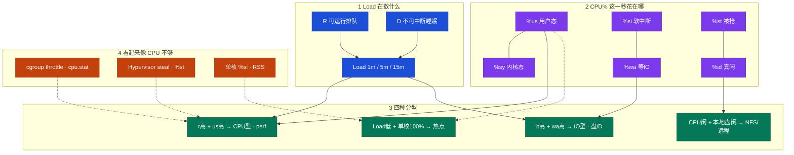
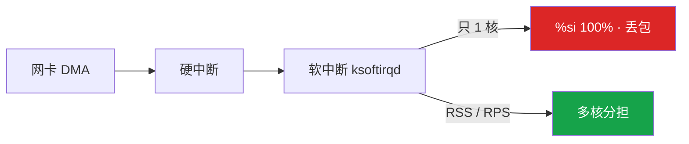
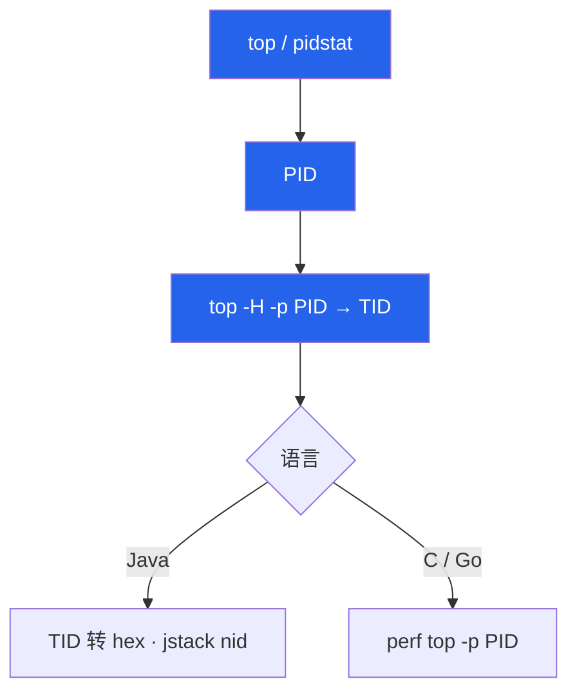
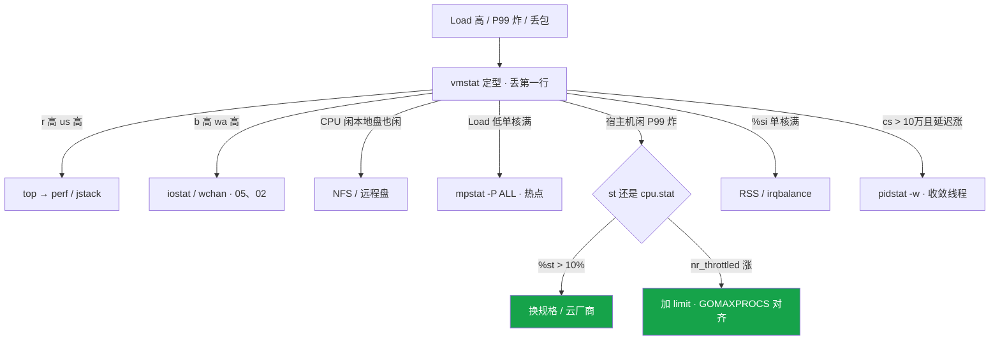

# CPU 与 Load

> **这章解决什么**：Load 到 40、工单写「加 8 核」，`top` 却 idle 70%——加核还是查盘？整机 CPU 40% 但 P99 炸——是不够算力，还是单核热点 / throttle / steal？  
> **读法**：**先看总图（两把尺 + 格子）** → **再认名词** → **再分型定责**。  
> **刻意不展开**：D 为什么杀不掉 → [05](../05-进程与信号/)；await、脏页、iostat 深排 → [08](../08-磁盘与IO/)；OOM、si/so 换页 → [07](../07-内存与OOM/)；cgroup 文件细节 → [10](../10-cgroup与容器/)；火焰图怎么采 → [21](../21-性能观测与排障/)；Socket/队列定责 → [12](../12-网络栈与Socket/)。

---

## 本章目录

1. [本章定位](#1-本章定位)
2. [先看总图：Load vs CPU、格子与分型](#2-先看总图load-vs-cpu格子与分型) ← **开篇必读**
   - [2.0 全章知识串图](#20-全章知识串图一张把细节串起来) ← **架构总览**
   - [2.1 两把尺：Load 与 CPU%](#21-两把尺load-与-cpu)
   - [2.2 格子：%us / %sy / %si / %wa / %st / %id](#22-格子us--sy--si--wa--st--id)
   - [2.3 完整走读：8 核 Load=40、idle 70%](#23-完整走读8-核-load40idle-70) ← **走读一例**
   - [2.4 三条岔路对照](#24-三条岔路对照同一套命令不同出口)
3. [名词扫盲（对照总图认词）](#3-名词扫盲对照总图认词)
4. [Load 含义与误读：本章最易混](#4-load-含义与误读本章最易混) ← **重点精读**
5. [CPU 各态定责](#5-cpu-各态定责)
6. [软中断 %si 与 RSS](#6-软中断-si-与-rss)
7. [上下文切换 · steal · throttle](#7-上下文切换--steal--throttle)
8. [命令解读：top / mpstat / pidstat / vmstat](#8-命令解读top--mpstat--pidstat--vmstat)
9. [定责决策树与作战落地](#9-定责决策树与作战落地)
10. [去哪章继续学](#10-去哪章继续学)
11. [面试 · 易错 · 数字](#11-面试--易错--数字)
12. [合上书](#合上书)

---

## 1. 本章定位

| 章 | 负责 |
|----|------|
| **03（本章）** | Load 与 CPU% 两把尺；格子定责；高 Load / 高延迟时先分型再动手 |
| **02** | D 状态、wchan、信号杀不掉 |
| **05** | 磁盘 await / %util / 脏页 |
| **04** | 换页 si/so、OOM |
| **06** | 包怎么进主机、Socket/队列；`%si` 只在本章定责「单核软中断」 |
| **07** | cgroup / 容器 quota 文件怎么读 |
| **12** | perf / 火焰图采样手法 |

本章是**算力与排队线入口**。后面所有「加核还是查盘」「单核 100% 要不要扩」「宿主机闲 P99 炸」都建立在「Load 数什么、CPU% 花在哪一格」这两张图上。

🎯 **值班签名**：Load 高先分型，不要先加核；整机平均骗人，必须 `mpstat -P ALL`；宿主机闲看 `cpu.stat` 和 `%st`，别先调 JVM。

---

## 2. 先看总图：Load vs CPU、格子与分型

> **正确开篇顺序**：先有全局画面，再认词，再抠细节。  
> 先看 **§2.0 全章串图**（考点挂一张板上），再看 **§2.1～2.2 两把尺 + 格子**，然后 **§2.3 走读一例** 把分型钉死。

### 2.0 全章知识串图（一张把细节串起来）

> 🎯 **合上书要能默画这张。** 蓝=Load 在数 · 紫=CPU% 格子 · 绿=分型出口 · 橙=假象（throttle/steal）。  
> 若预览仍报错，以下面 **ASCII 一页板** 为准。



**读图路线：**

| 段 | 记住 |
|----|------|
| ① | Load = R+D 的滑动平均，**含卡 IO 的人**（§4） |
| ② | CPU% 是账单：先认哪一格最大，再选工具（§5） |
| ③ | 四种组合先分型，**别一上来 perf**（§2.3、§9） |
| ④ | throttle / steal / 单核 si 都会「看起来像不够核」（§6、§7） |

```text
┌──────────────────────────────────────────────────────────────────────────┐
│                     03 一张板：两把尺 → 格子 → 分型 → 定责                  │
├────────────────────┬─────────────────────┬───────────────────────────────┤
│  Load（排队尺）     │  CPU%（账单尺）      │  分型出口                      │
│  R 可运行          │  us 业务 / sy 内核   │  CPU型 → top→perf/jstack       │
│  D 卡 IO           │  wa 等盘 / si 网卡   │  IO型 → iostat/wchan · 05、02  │
│  对比核数 N、2N     │  st 超卖 / id 真闲   │  NFS型 → 远程盘                │
│  1m vs 15m 趋势    │  整机平均会骗人      │  热点型 → mpstat -P ALL        │
├────────────────────┴─────────────────────┴───────────────────────────────┤
│  假象：throttle(cpu.stat) · steal(%st) · 单核%si(RSS) → 都不是「先加核」   │
└──────────────────────────────────────────────────────────────────────────┘
```

---

### 2.1 两把尺：Load 与 CPU%

假设：8 核逻辑服，监控告警「Load=40」，同事已经在工单写「加 8 核」。你打开 `top`，idle 还有 70%。

**怎么读这两把尺：**

- **Load**：过去一段时间里，有多少「人」在**可运行队列**或**不可中断睡眠（D）**——数的是**排队和卡 IO**，不是「CPU 忙不忙」的百分比。
- **CPU%**：这一秒（或采样窗口）里，核把时间花在哪一格——`us/sy/wa/si/st/id` 加起来 ≈ 100%。

```text
                    ┌─────────────────┐
    进程想跑 / 卡IO  │   Load 1/5/15   │  ← 人多不多、排不排队
                    └────────┬────────┘
                             │ 对不上时
                             ▼
                    ┌─────────────────┐
    这一秒核在干啥   │  %us %sy %wa …  │  ← 时间花在哪，决定下一刀
                    └─────────────────┘
```

| 尺 | 数什么 | 对比谁 | 常见误读 |
|----|--------|--------|----------|
| **Load** | R + D 的平均个数 | **核数 N**（满载感 ≈ N，伤 P99 常看 > 2N） | 「Load 高 = CPU 不够」 |
| **CPU%** | 时间花在哪一格 | 单核与整机都要看 | 「整机 40% = 还有余量」 |

> **记住**：两把尺对不上时，**先分型，别先加核**。细节与误读专节见 §4。

---

### 2.2 格子：%us / %sy / %si / %wa / %st / %id

**一句话：** 先认格子再选工具——us 找函数，sy 找 syscall，wa/b 去盘，si 去网卡，st 找云厂商。

```text
  一个核 · 这一秒的时间账单（加起来 ≈ 100%）

  ┌──────┬──────┬──────┬──────┬──────┬──────┐
  │ %us  │ %sy  │ %si  │ %wa  │ %st  │ %id  │
  │用户态│内核态│软中断│等 IO │被抢走│真闲着│
  └──┬───┴──┬───┴──┬───┴──┬───┴──┬───┴──┬───┘
     │      │      │      │      │      │
     ▼      ▼      ▼      ▼      ▼      ▼
   业务函数 syscall 网卡收包  盘/NFS  超卖   真有空
   perf/jstack  strace  RSS/IRQ  05/02  换机   —
```

| 格子 | 核在干什么 | 下一刀往哪 |
|------|------------|------------|
| `%us` | 用户态算业务 | `top -H` → perf / jstack（确认 CPU 型后） |
| `%sy` | 内核态（syscall / 锁 / 拷贝） | 看是不是过多 syscall、锁竞争；链 [04](../04-内核与系统/) |
| `%si`（`%soft`） | 软中断（常见网卡收包） | `mpstat -P ALL` + `/proc/interrupts` → §6 |
| `%wa`（`%iowait`） | **有空闲时间**且在等 IO | `vmstat` 的 `b` + iostat / wchan → [08](../08-磁盘与IO/)、[05](../05-进程与信号/) |
| `%st` | 云主机被 Hypervisor 抢走 | 换规格 / 迁宿主机，**别调代码** |
| `%id` | 真闲着 | 若 Load 仍高 → 必有 D 或别处假象 |

🔥 **%wa 易错**：`%wa` 是 **CPU 视角**——CPU 已被算力打满时，没有 idle 可记到 wa，**盘再慢 wa 也可以是 0**。磁盘慢以 iostat await 为准，见 [08](../08-磁盘与IO/)。

> **别混**：`%sy` ≠ `%si`。syscall 多走 sy；网卡软中断堆一个核走 si。

---

### 2.3 完整走读：8 核 Load=40、idle 70%

> 用现网角色串一遍分型。**只保留这一版走读**；后面各节细节往回挂。

**场景**：活动开场，8 核逻辑服 Load 飙到 40。群里有人喊「加 8 核」。`top` 显示 idle ≈ 70%，`%us` 不高。游戏日志打在 NFS 上。

**你怎么走（编号顺序就是值班顺序）：**

1. **认 Load 趋势**：`uptime` → `40.12, 28.40, 12.05`（假设）。`1m >> 15m` → 正在恶化，优先止血，不是先写周报。
2. **丢掉 vmstat 第一行**：`vmstat 1 5`，第一行是开机以来平均，会骗人。
3. **看 r / b**：若 `r=2`、`b=18` 持续 → **D 在堆积**，不是 CPU 排队。
4. **看格子**：`us=5 sy=2 id=70 wa=18 st=0` → **IO 型账单**，不是算力型。
5. **定型**：第二种组合——高 Load、高 b、高 wa → **不要加核**。
6. **往下钻**：`ps` 一排 D；`wchan` 像 `nfs_wait_*` → 日志 NFS 挂死。止血：修 NFS 或日志改本地盘。
7. **若走读结果不同**：`r>8` 且 `us` 高 → 才进 CPU 型，`top -H` → perf；`mpstat` 单核 100% 而 Load 只有 1.x → 热点型，扩 8 核没用；宿主机 idle 高但 Pod P99 炸 → 先看 `cpu.stat` / `%st`（§7）。

```text
走读决策（一眼）：

  uptime → Load 对比 8 核（40 >> 2×8）→ 严重
       │
       ▼
  vmstat（丢第一行）→ b=18, wa=18, id=70, us=5
       │
       ▼
  分型 = IO / NFS     ──X──  加 8 核（错）
       │
       ▼
  wchan / iostat / 修 NFS 或改本地盘（对）
```

**面试怎么说**：「8 核 Load 40 我先 vmstat 看 b 和 wa；b 高 idle 高是 IO 型查 D/NFS，不会 Load 高就加核。」

### 2.4 三条岔路对照（同一套命令，不同出口）

走读时若数字不同，出口完全不同——用同一套开场命令，避免「背答案」：

| 你看到的第二行起 | 分型 | 下一屏 | 错误出口 |
|------------------|------|--------|----------|
| `r=22 b=0 us=78 id=5 wa=0` | ① CPU 型 | `mpstat -P ALL` → `top -H` → perf | 先查 NFS |
| `r=2 b=18 us=5 id=70 wa=18` | ② IO 型（本例） | `ps` 找 D → wchan / iostat | 加 8 核 |
| `r=3 b=12 us=4 id=80 wa=2`，本地 `iostat` await 很好 | ③ NFS/远程 | wchan 是否 `nfs_*`；查挂载对端 | 只换本地 NVMe |
| `r=1 b=0`，Load=1.2，但 CPU3 `%usr=99` | ④ 热点型 | 拆主循环 / 限流该线程 | 整机加到 16 核当根治 |
| 宿主机 `id=70`，Pod 内也不打满，P99 炸 | 假象 throttle | `cpu.stat` 增量 | 当 steal 调 JVM |
| `st=15` 持续 | 假象 steal | 换规格 / 迁宿 | 优化业务函数 |

```text
同一开场：

  uptime → vmstat 1 5 → mpstat -P ALL 1 3
                │
      ┌─────────┼─────────┬──────────┬──────────┐
      ▼         ▼         ▼          ▼          ▼
   r↑us↑     b↑wa↑    本地盘闲    单核100%   st↑/throttle
   CPU型      IO型      NFS型       热点型     假象两条路
```

🔥 **读完 §2 验收**：能默画 §2.0；能把「Load 40 idle 70%」走完 IO 型；能说出另外四条岔路各看什么字段。

---

## 3. 名词扫盲（对照总图认词）

对照 §2.0：左边是 Load，中间是格子，右边是分型出口。下表只建本章感，不把别章地基展开。

| 名词 | 值班里什么时候碰到 | 一句话 |
|------|--------------------|--------|
| **Load（load average）** | `uptime` / 监控「Load 高」告警 | 过去 1/5/15 分钟 R+D 的平均个数 |
| **R（runnable）** | `vmstat` 的 `r`、`ps` 状态 R | 想跑、在等 CPU 的可运行任务 |
| **D（uninterruptible sleep）** | `ps` 一排 D、Load 高 CPU 闲 | 不可中断睡眠，多卡在 IO；`kill -9` 无效 → [05](../05-进程与信号/) |
| **核数 N** | 读 Load 阈值 | 满载感 ≈ N；持续 > 2N 常伤 P99 |
| **%us / %sy / %si / %wa / %st / %id** | `top` / `mpstat` | 见 §2.2 |
| **r / b（vmstat）** | 分型第一步 | `r`≈可运行排队感；`b`≈不可中断阻塞个数 |
| **cs / in** | P99 涨、线程爆炸 | 上下文切换 / 中断次数；见 §7.1、§8 |
| **cswch / nvcswch** | `pidstat -w` | 自愿切换 vs 非自愿切换 |
| **throttle** | 宿主机闲、Pod P99 炸 | cgroup 配额用完踢出队列；看 `cpu.stat` |
| **steal（%st）** | 云主机抖动 | Hypervisor 抢走 vCPU 时间 |
| **RSS / RPS / irqbalance** | 网关丢包、单核 %si 满 | 多队列打散软中断；细节定责在本章，包路径在 [12](../12-网络栈与Socket/) |
| **GOMAXPROCS / ActiveProcessorCount** | 容器里线程比 limit 多 | 并发度必须对齐 cgroup limit，不是 `nproc` |
| **NUMA** | 多路物理机毛刺 | 先看拓扑再绑；单 node 云主机别硬绑 |
| **ksoftirqd** | `top` 里 CPU0 被内核线程打满 | 跑软中断的内核线程；`%si` 高时常在榜 |
| **perf / jstack / pprof** | 已确认 CPU 型要函数 | 采样/栈工具；手法主责在 [21](../21-性能观测与排障/) |

**和邻章的一句话边界（防抢戏）：**

| 别在本章展开 | 一句话点到 | 主责 |
|--------------|------------|------|
| D 为何杀不掉 | 不可中断，等 IO 完成 | [05](../05-进程与信号/) |
| await / 脏页 | 盘慢听 await，不听 wa 结案 | [08](../08-磁盘与IO/) |
| Socket 队列满 | Recv-Q 含义分 LISTEN/ESTAB | [12](../12-网络栈与Socket/) |
| cgroup 文件路径 | 认 `cpu.stat` 增量即可 | [10](../10-cgroup与容器/) |

**值班里怎么认现象（开篇对照表）：**

| 监控/工单说的 | 第一反应 | 常见误操作 |
|---------------|----------|------------|
| 「Load 40 了加核」 | 先看 idle 和 `b` | 直接扩规格 |
| 「CPU 才 40% 怎么超时」 | `mpstat -P ALL` | 水平加实例 |
| 「宿主机很闲 P99 400ms」 | `cpu.stat` throttle | 调 JVM 当 steal |
| 「网关丢包 CPU 不高」 | CPU0 `%si` | 扩副本 |
| 「Load > 1」在 64 核响 | 改阈值对比核数 | 当真过载 |

> **记住**：名词都挂在「两把尺 + 格子 + 分型」上；记不住定义时先回 §2.0 默画。

---

## 4. Load 含义与误读：本章最易混

> 🎯 **全章最易晕的一点单独钉死。** 难概念四步：例子 → 定义 → 命令怎么认 → 易错一句。

### 4.1 最常见例子（先钉死画面）

**例子 A（高 Load 低 CPU）**：8 核机器 Load=40，idle 70%。不是「CPU 不够」，是一堆进程卡在 D（NFS/盘），Load 把他们也数进去了。

**例子 B（低 Load 单核满）**：匹配服 Load=1.2，但 `mpstat` 里 CPU3 `%usr=99%`。Load 看起来「不忙」，P99 照样炸——整机平均和 Load 都没反映**那一核**的热点。

**例子 C（阈值写死）**：告警 `Load > 1`，64 核机器白天一直响。Load=1 在 64 核上几乎等于没人排队。

**例子 D（趋势误判）**：15m 还是 25，但 1m 已经掉到 6。有人按 15m「还在爆」继续扩了两台——扩完发现业务已回落，变成空烧钱。趋势要 **1m 优先看恶化/恢复**，15m 看「刚刚是不是真的糟过」。

### 4.2 一句话定义

**Load = 过去 1/5/15 分钟，可运行队列（R）+ 不可中断睡眠（D）的平均个数。**

- 它**不是** CPU 利用率。
- 它**包含**卡在磁盘/NFS 上、暂时跑不了的人（D）。
- 读它必须**对比核数**，并看 **1m vs 15m 趋势**。

Linux 上可运行队列长度进入 Load；不可中断睡眠（D）也计入——这是和「纯 CPU run queue」教材图最容易拧巴的一点。所以你才会看到：**CPU 很闲，Load 却很高**。

### 4.3 对照命令怎么认

```bash
uptime
#  12:01:02 up 14 days,  3:22,  1 user,  load average: 40.12, 28.40, 12.05
#                                              ↑ 1m      ↑ 5m     ↑ 15m

nproc
# 8

# 容器里慎用 nproc 当「我有多少核可用」——常返回宿主机核数，见 §7.3
```

| 读法 | 怎么认 |
|------|--------|
| 对比核数 | 8 核上 Load≈8 → 忙碌感；Load=30～40 → 严重排队或大量 D |
| `1m >> 15m` | 正在恶化，优先止血 |
| `1m << 15m` | 在恢复，避免「看着 15m 还高就再扩一圈」 |
| 高 Load + 高 idle | 几乎必然有 D / IO 型，先 `vmstat` 看 `b` |
| 低 Load + 超时 | 别被 Load「骗安心」→ `mpstat -P ALL` |

#### 对比核数：一张口算表

| 核数 N | Load≈N | Load≈2N | Load=1 |
|--------|--------|---------|--------|
| 8 | ≈8 满载感 | ≈16 开始伤排队 | 几乎空 |
| 16 | ≈16 | ≈32 | 几乎空 |
| 64 | ≈64 | ≈128 | **告警 Load>1 会误报** |

没有绝对「Load=5 就坏」——离开 N 谈 Load 没有意义。

#### 1m / 5m / 15m：趋势怎么说人话

```text
正在恶化：  40.1,  22.0,  8.0     → 1m 远大于 15m，先止血
平台高位：  18.0,  17.5, 16.8     → 持续过载感（再对比 N）
正在恢复：   6.2,  14.0, 22.0     → 别只看 15m 还高就继续扩
刚刚尖刺：  12.0,   3.0,  2.0     → 看是不是发布/活动瞬时；结合业务是否恢复
```

| 形态 | 值班动作 |
|------|----------|
| 恶化 | 分型 → 止血（限流/摘流/修 NFS/加 limit…） |
| 恢复 | 根因仍要记；避免重复扩容 |
| 持续高位 | 对比 N；确认不是 D 抬的假「算力不够」 |

```text
# 误读 vs 正解

  「Load=40 → 加 8 核」
        │
        ▼ 先问
  idle 高不高？b 高不高？
        │
   ┌────┴────┐
   │         │
 idle高+b高  r高+us高
   │         │
 IO/NFS型    CPU型
 修盘/NFS    才考虑加核/perf
```

### 4.4 现场再走半步：和 top 抬头对一下

`top` 第一行的 `load average` 与 `uptime` 是同一套数。别在 top 里只看进程 `%CPU` 就下「Load 的结论」——先抬头看三个数，再看 idle，再决定进哪一型。

```text
top - 12:01:02 up 14 days,  1 user,  load average: 40.12, 28.40, 12.05
Tasks: 382 total,   2 running, 360 sleeping,   0 stopped,  20 zombie
%Cpu(s):  5.0 us,  2.0 sy,  0.0 ni, 70.0 id, 18.0 wa,  0.0 hi,  5.0 si,  0.0 st
```

- Load 40 vs 8 核 → 严重。
- `id=70 wa=18` → 和 §2.3 走读一致，IO 型。
- 若这里 `si` 单独很高 → 分叉去 §6，不要当普通 us 高。

### 4.5 易错一句钉死（只写一次）

> **别混**：Load 高 ≠ CPU 不够。Load 含 D；高 Load 低 CPU **先查 D/NFS，不加核**。Load 阈值必须对比核数；64 核上 Load=1 不是过载。

| 误读 | 真相 |
|------|------|
| Load 很高就是 CPU 不够 | Load = R+D，先分型 |
| Load=1 在 64 核上算高 | 对比核数，几乎没排队 |
| 高 Load 低 CPU 先加核 | 先查 D / NFS |
| Load 低就不可能超时 | 单核 100% 时 Load 可以很低 |
| 告警写成 Load>1 放之四海 | N 核满载 ≈ N，伤延迟常看 >2N |
| 15m 还高就必须再扩 | 先看 1m 是否已回落 |
| 容器里用 nproc 当 Load 分母 | nproc 可能是宿主机核数；可用配额看 cgroup |

**面试怎么说**：「Load 和 CPU 利用率是两把尺，Load 含 D；高 Load 低 CPU 我先 vmstat 看 b，不会 Load 高就加核；阈值对比核数；看趋势先看 1m。」

---

## 5. CPU 各态定责

> **一句话总纲**：哪一格最大，决定下一刀去哪——不要看「CPU 高」三个字就 perf。

### 5.1 四种生产组合（先分型）

**一句话：** 别一上来 perf，卡错型后面全浪费。


| 组合 | 判断 | 先不要做什么 | 典型画面 |
|------|------|--------------|----------|
| ① CPU 型 | Load 高，`r` 高，`us` 高 | 没确认前扩一圈机器 | 活动后整机 us 80%，要函数 |
| ② IO 型 | Load 高，`b` 高，`wa` 高 | **不要加 CPU** | Load 40、idle 70%、日志 NFS |
| ③ NFS/远程 | Load 高，CPU 闲，本地 `iostat` 干净 | 不要只看本地盘 util | wa 高但 NVMe await 很好 |
| ④ 热点型 | Load 低/不高，单核 100% | **不要水平加核当根治** | 匹配服 1 核满、Load 1.2 |

**CPU 高但 Load 不高**：纯计算、核还没排满，或很短突发——不要先当整机过载；仍建议 `mpstat -P ALL` 排除单核热点。

> **记住**：先分型：高 Load 低 CPU 查 D；单核打满查主循环；确认是 CPU 型再 perf。

### 5.2 %us：用户态——到函数的链

**一句话：** 已确定 CPU 型才走 top→TID→perf/jstack。

**打个比方**：`%us` 是「员工在写业务代码的时间」——要先确认他们真的在算业务、不是在等打印机（wa）或接门铃（si），再问「哪一行代码」。

**现场走一遍**（活动后整机 `%us` 80%，开发说「再观察一下」）：

1. `vmstat 1 5`：确认 `r` 持续 > 核数、`b≈0`、`wa` 不高 → **CPU 型**。
2. `mpstat -P ALL 1 3`：是整机多核都高，还是单核打满？
3. `pidstat -u 1` / `top`：锁定 PID。
4. `top -H -p <PID>`：锁定 TID。
5. Java：`printf '%x' <TID>` 对 jstack `nid=`；C/Go：`perf top -p <PID>`（短采）。
6. 止血：限流、摘实例、回滚热点发布——根因要函数级，但先止血。

```text
top / pidstat -u
      │  谁在烧
      ▼
   锁定 PID
      │
      ▼
 top -H -p <PID>     → 哪个 TID
      │
      ├── Java：printf '%x' <TID> 对 jstack 的 nid
      └── C/Go：perf top -p <PID> / perf record -g
```

| 现象 | 含义 | 动作 |
|------|------|------|
| 多线程均匀高 | 流量大或缺限流 | 限流 / 扩容 / 回滚热点发布 |
| 单线程 100% | 死循环、正则回溯、主循环 | 拆热点或并行化；扩核常没用 |
| 采样窗口 | 火焰图 **10–30s** 足够 | wa 高时不要 perf 30 分钟 |

手法细节 → [21](../21-性能观测与排障/)。本章只定责：**CPU 型才采**。

**面试怎么说**：「确认 r 高 us 高才是 CPU 型，再 top -H 到 TID；Java 转 hex 对 jstack，C/Go 上 perf；IO 型绝不上火焰图。」

### 5.3 %sy：内核态

**一句话：** sy 高先想「是不是 syscall/锁/拷贝太多」，不是先加核。

**打个比方**：`%sy` 是「员工跑去找物业办事」——办得太勤（syscall 碎）、物业门口堵着（内核锁），账单上 sy 会涨，但根因不一定是「办公室太小」（核太少）。

**现场走一遍**：

1. `mpstat` / `pidstat -u` 看到 `%system` 明显高于同行服务。
2. 短采 `strace -c -p <PID>`（注意生产影响，秒级即可）看哪些 syscall 次数/时间突出。
3. 区分：业务逻辑导致的过多 gettimeofday/futex，还是内核路径异常。
4. 深挖 → [04](../04-内核与系统/)。

常见来源：过多细碎 syscall、内核锁竞争、网络/文件系统路径上的拷贝。

> **别混**：网关「CPU 高」若其实是 `%si`，不要按 `%sy` 去追业务函数。`mpstat` 里看 `%soft` vs `%sys`。

### 5.4 %wa：等 IO（CPU 视角）

**一句话：** wa 高且 b>0 → IO 型；wa=0 **不能**证明盘快。

**打个比方**：`%wa` 是「你盯着打印机发呆的时间」——只有你本来有空发呆，才记得到 wa。如果你已经整天在写代码写满了（CPU 打满），打印机再慢，账单上也挤不出「发呆」这一格。

**现场走一遍**：

1. `vmstat`：`b>0`、`wa` 高、`us` 低 → IO 型。
2. `iostat -x 1 5`：本地 await / aqu-sz 是否差。
3. 本地很干净 → 查 NFS/云盘对端、`wchan`。
4. 若 `wa=0` 但业务明显等盘 → **仍要看 await**，不要用 wa 结案。

| 你看到 | 先做 | 别做 |
|--------|------|------|
| wa 高、b>0、us 低 | iostat / wchan；可能 NFS | 加核、上火焰图 |
| wa=0 但业务等盘 | 看 await；可能 CPU 已打满挤掉 wa | 「wa=0 所以盘没问题」 |
| 本地 util 低但 Load 高 | NFS / 云盘对端 | 只盯本机 NVMe |

```text
%wa · await · %util  不是同一个数

  %wa     = CPU 有空且在等 IO 的时间占比（CPU 视角）
  await   = 请求在设备队列里待了多久（盘视角）→ 05
  %util   = 设备有活干的时间占比（SSD 上别当唯一结案）→ 05
```

磁盘指标深排 → [08](../08-磁盘与IO/)；D/wchan → [05](../05-进程与信号/)。

### 5.5 %id：真闲着时 Load 为什么还高

idle 高却 Load 高 → Load 里的 D 在抬队列。回到 §4：查 D，不要加核。

若 idle 高、Load 不高、但 P99 炸 → 转向 throttle / steal / 单核热点（§6、§7），不是「机器很闲所以没事」。

**三句定责：**

1. idle 高 + Load 高 → D/IO。  
2. idle 高 + Load 低 + P99 炸 → 假象（throttle/st）或单核/下游。  
3. idle 低 + us 高 → 才像真算力不够。

### 5.6 小结：格子 → 工具

| 最大格 / 关键信号 | 工具链 |
|------------------|--------|
| us + r>核数 | `top -H` → perf / jstack |
| sy | pidstat / strace 短采 → [04](../04-内核与系统/) |
| wa + b | iostat / wchan → [08](../08-磁盘与IO/)、[05](../05-进程与信号/) |
| si 单核满 | interrupts / RSS → §6；包路径 → [12](../12-网络栈与Socket/) |
| st>10% | 换规格 / 云厂商 |
| 宿主机 idle + P99 炸 | `cpu.stat` 增量 |

**面试怎么说**：「我先认格子：us 找函数，sy 找 syscall，wa/b 去盘，si 去网卡，st 找云厂商；高 Load 低 CPU 先分型。」

---

## 6. 软中断 %si 与 RSS

> 可链网络，**不抢 06**：包怎么从网卡进 Socket/队列见 [12](../12-网络栈与Socket/)；本章只定责 **「单核软中断把核打满」**。

### 6.1 例子钉死

网关整机 CPU 平均 30%，但 CPU0 `%si`（mpstat 里常写作 `%soft`）≈ 100%，开始丢包。扩了两台网关副本，**每台的 CPU0 照样满**——包还是进同一块网卡的同一条（或少数）队列。

### 6.2 一句话定义

**软中断（softirq）**：硬中断「叮」一下之后，把收包等耗时工作放到软中断上下文做；网卡收包路径上常见 `ksoftirqd/N` 吃 `%si`。  
**RSS**：网卡多队列，把中断/软中断打散到多核；配合 **irqbalance**（或正确的 affinity）避免全堆 CPU0。



### 6.3 命令怎么认

```bash
mpstat -P ALL 1 3
cat /proc/interrupts | grep -i eth
# 或你的网卡名：ens/eth/bond
```

**输出解读：**

```text
CPU   %usr  %sys  %soft  %idle
  0    2.0   3.0   94.0    1.0
  1   15.0   2.0    1.0   82.0

# /proc/interrupts 片段（列对应 CPU0 CPU1 …）
 52:  892341      0   PCI-MSI-edge  eth0-TxRx-0
```

- CPU0 `%soft 94%`：软中断把一个核打满——**丢包/延迟根因候选**。
- CPU1 `%soft 1%`：其它核很闲——不是整机 CPU 不够。
- `eth0-TxRx-0` 中断计数几乎全在 CPU0 列——**IRQ 没 spread**，开 RSS / 查 irqbalance。

### 6.4 易错与处置

| 做法 | 有用吗 |
|------|--------|
| 扩网关业务副本 | **治不了单核 si**（每台仍可能堆自己的队列/CPU0） |
| 开 RSS 多队列 + irqbalance | 正道 |
| RPS/RFS（软件打散） | 硬件队列不够时的补充 |
| 主循环 `taskset` 钉**非 0 核** | 少用；避免和 `ksoftirqd/0` 抢同一核 |
| `nice` | 救不了已经打满的核 |

**现场走一遍（丢包 + 整机 CPU 不高）：**

1. `mpstat -P ALL 1 3` → 看是否单核 `%soft` 打满。
2. `grep -i eth /proc/interrupts`（或 ens/bond）→ 计数是否堆在 CPU0 列。
3. 确认多队列是否启用、irqbalance 是否在跑、有没有人手写 affinity 钉死。
4. 业务侧临时：把重 CPU 主循环绑离 0 号核（治标）；根治仍是打散软中断。
5. 若 `%si` 正常但 ESTAB Recv-Q 涨 → **不是本章**，去 [12](../12-网络栈与Socket/) 查应用没 read。

和 [12](../12-网络栈与Socket/) 的边界：

| 现象 | 主责 |
|------|------|
| `%si` 单核满、丢包 | **本章** RSS/IRQ |
| LISTEN/ESTAB 队列、conntrack、fd | **06** |
| ESTAB Recv-Q 涨但 `%si` 正常 | **06**：应用没 read，不是软中断 |
| 硬中断叮一下 → 软中断收包 → 进 Socket | **06** 讲路径；**本章** 讲 `%si` 打满谁负责 |

```text
06 管：包怎么走到进程、队列满了怎么认
03 管：收包软中断把哪个核打满、怎么打散

  网卡 → 硬中断 → 软中断(%si) → … → Socket → read(%us)
                 ↑                      ↑
               本章定责                06 定责
```

> **记住**：单核 %si 打满先看中断是否全在 CPU0；扩业务副本解决不了。

**面试怎么说**：「单核 si 打满我先看 interrupts 是否堆 CPU0，开 RSS 和 irqbalance；扩副本治不了单核软中断；Recv-Q 涨且 si 正常去查应用。」

---

## 7. 上下文切换 · steal · throttle

### 7.1 上下文切换（cs）

**一句话：** cs 持续 > 10 万/s 且延迟涨，先查线程模型和锁，不是先加核。

**打个比方**：cs 像不断地换台——一连接一线程的网关，线程换来换去，CPU 没算业务全在「换人」。

**例子**：网关「一连接一线程」，`vmstat` 里 `cs` 到 30 万/s，P99 涨——CPU 很多时间花在调度上。

```bash
vmstat 1
pidstat -w 1
```

| 类型 | 含义 | 常见原因 |
|------|------|----------|
| **cswch（自愿）** | 自己让出 CPU | 等 IO、等锁、锁太碎、syscall 碎 |
| **nvcswch（非自愿）** | 时间片被抢 | CPU 不够、线程相对核数过多 |

**输出解读：**

```text
# pidstat -w 1 3
08:12:01 UID   PID   cswch/s nvcswch/s Command
08:12:01 1000 1234   45200     8200    nginx
```

- `cswch/s 45200`：大量自愿切换——等事件/锁。
- `nvcswch/s 8200`：非自愿也不低——线程偏多。
- 处置：线程池按核数收敛；网关改 epoll/协程（epoll 机制见 [12](../12-网络栈与Socket/) §9，本章只定责「cs 爆了先收敛模型」）。

物理机每秒数万次切换常见；**持续 > 10 万/s 且延迟涨**才当故障信号。不要看见 cs 就加核。

> **别混**：cs 高不一定要加核；线程过多时加核只是推迟爆炸。

**面试怎么说**：「cs 超 10 万且延迟涨，我看 pidstat 分自愿和非自愿，一连接一线程要改 epoll，不会先加核。」

### 7.2 steal（%st）

**一句话：** `%st` 是 Hypervisor 抢 vCPU；持续 >10% 且延迟涨 → 换规格/迁宿，调代码没用。

**打个比方**：`%st` 像合租时房东临时占你房间——你看着「自己的日程」排不满，是因为时间被房东拿走了。

```bash
mpstat 1 3
# 看 %steal 列
```

```text
# mpstat 1 1（节选）
CPU   %usr  %sys  %iowait  %steal  %idle
all   22.0   3.0     0.0    15.0    60.0
```

- `%steal=15` 持续 → 虚机层超卖信号。
- 同屏 `%idle=60` → **不能**据此说「机器很闲所以应用没事」；被抢走的时间业务侧表现为毛刺。

| | steal | throttle |
|--|-------|----------|
| 层 | 虚机 / 宿主机超卖 | cgroup / 容器 limit |
| 怎么认 | mpstat `%st` | `cpu.stat` 的 nr_throttled **增量** |
| 处置 | 换机 / 独占 / 找云厂商 | 加 limit 或对齐并发度 |
| K8s 里 | st 高 **不是** throttle | throttle **不是** st |

### 7.3 cgroup throttle

**一句话：** 配额用完踢出运行队列；宿主机可以很闲，P99 照样炸。

**打个比方**：throttle 像合同写「每天只能用 2 小时电脑」——你看着办公室（宿主机）空着，但你的配额用完就被踢出队列，请求墙钟时间照样飙。

**例子**：匹配服 limit=500m，`GOMAXPROCS=16`。宿主机 idle 70%，容器内 `%us` 也不打满，P99 从 30ms → 400ms。

CFS 周期默认 **100ms**。例如 `cpu.max` = `200000 100000` → 2 核；`500m` ≈ 每周期 50ms 配额。突发跨过边界，wall time 直接加上「被踢出队列」的等待。

```bash
# cgroup v2 示意路径（实际以 07 章为准）
cat /sys/fs/cgroup/.../cpu.stat
```

**现场走一遍：**

1. 确认现象：宿主机闲、Pod P99 炸、`%st` 不高。
2. 读两次 `cpu.stat`，隔 10～30s，算 `nr_throttled` / `nr_periods` **增量比**。
3. `> 5%` 且延迟涨 → 当故障。
4. 查 `GOMAXPROCS` / JVM ActiveProcessorCount 是否远大于 limit 核数。
5. 短期加 limit；长期对齐并发度。延迟敏感服慎用过小 limit。

**输出解读：**

```text
usage_usec 45231000
user_usec 40123000
system_usec 5108000
nr_periods 847
nr_throttled 312
throttled_usec 18400000
```

- `nr_throttled / nr_periods` ≈ 312/847 ≈ **37%** >> **5%** 阈值 → 配额不够当故障。
- 看**增量**（采样两次做差），绝对值是累计。
- `throttled_usec` 累计被踢出的 CPU 时间——解释 P99。

**Go/Java 坑**：容器里 `nproc` 常返回**宿主机核数**；`GOMAXPROCS` / GC 线程按宿主机核数跑，limit=1 核时会严重加重 throttle。修：`automaxprocs`、`-XX:ActiveProcessorCount`，**对齐 limit**。cgroup 文件与容器细节 → [10](../10-cgroup与容器/)；K8s request/limit YAML → [04-Pod](../../03-Kubernetes/04-Pod生命周期/)。

只设 request 不设 limit：能避免 throttle，要防吵邻居（HPA + 节点水位）。匹配/逻辑服常用；本章答到「throttle 看 cpu.stat、request 不是硬顶」即可。

> **记住**：st 是超卖，找云厂商；throttle 看 cpu.stat 增量，宿主机可以很闲；GOMAXPROCS 对齐 limit。

**面试怎么说**：「宿主机闲 P99 炸我看 cpu.stat 增量，throttle 超 5% 加 limit 或对齐 GOMAXPROCS；st 超 10% 找云厂商，不是调 JVM。」

---

## 8. 命令解读：top / mpstat / pidstat / vmstat

> 🎯 **作战肌肉**：每条命令「什么时候用、屏幕什么样、说明什么」。  
> 值班最小集：`uptime` → `vmstat` → `mpstat -P ALL` →（CPU 型）`top -H` / `pidstat`。

### 8.1 速查表

| 目的 | 命令 | 看什么 |
|------|------|--------|
| Load 趋势 | `uptime` | 1m vs 15m，对比核数 |
| 分型 | `vmstat 1 5` | r / b / cs / wa / st；**丢掉第一行** |
| 单核 / 格子 | `mpstat -P ALL 1 3` | 哪颗核满；`%usr/%sys/%iowait/%soft/%steal/%idle` |
| 谁在烧 CPU | `pidstat -u 1` / `top` | PID、%user/%system |
| 线程 | `top -H -p <PID>` | TID |
| 切换 | `pidstat -w 1` | cswch / nvcswch |
| throttle | `cat .../cpu.stat` | nr_throttled **增量** |
| 软中断分布 | `cat /proc/interrupts` | 网卡 IRQ 是否堆一列 |
| NUMA | `numactl --hardware`；`numastat -p <PID>` | 几个 node；remote 多不多 |
| 历史 | `sar -u -f /var/log/sa/saDD` | 「昨天凌晨」类工单；没装 sysstat 就没有 |

```bash
uptime
vmstat 1 5                    # 丢掉第一行
mpstat -P ALL 1 3
pidstat -u 1 3
pidstat -w 1 3
top -H -p <PID>
cat /sys/fs/cgroup/.../cpu.stat
numactl --hardware
```

### 8.2 vmstat：分型第一屏

**什么时候用**：任何「Load 高 / 机器慢」的开场，先它。

```text
procs -----------memory---------- ---swap-- -----io---- -system-- ------cpu-----
 r  b   swpd   free   buff  cache   si   so    bi    bo   in   cs us sy id wa st
 2 18      0 8123456 123456 9876543  0    0   120  8900 4500 12000  5  2 70 18  0
 2 19      0 8123000 123456 9876540  0    0   115  9100 4480 11800  4  2 71 18  0
```

| 字段 | 怎么读 | 动手阈值直觉 |
|------|--------|--------------|
| **第一行** | 开机平均 | **丢掉** |
| `r` | 可运行排队感 | 持续 > 核数 → CPU 排队 |
| `b` | 不可中断阻塞 | 持续 > 0 → D 堆积 |
| `us/sy/id/wa/st` | 与 mpstat 格子同义（粗） | 定型 |
| `cs` | 上下文切换/s | 持续 > **10 万** 且延迟涨 → 查线程/锁 |
| `in` | 中断/s | 突增 + `%si` → 网卡中断 |
| `si/so`（swap） | 换页 | 非 0 → 先当内存 [07](../07-内存与OOM/) |

**本例结论**：`b=18`、`wa=18`、`id=70`、`us=5` → IO 型，不是加核。

### 8.3 mpstat：整机平均会骗人

**什么时候用**：怀疑单核热点、软中断、steal；或「CPU 才 40% 怎么超时」。

```text
# mpstat -P ALL 1 1（节选）
CPU   %usr  %sys  %iowait  %soft  %steal  %idle
all   38.2   2.1     0.5    1.0     0.0    58.2
  0    5.0   1.0     0.0    2.0     0.0    92.0
  3   99.2   0.8     0.0    0.0     0.0     0.0
```

- `all 38%`：整机平均——**看起来还有余量**。
- `CPU3 99.2%`：单核打满——P99 照样炸；扩副本/加核**不拆**这一核的主循环。
- 另一类：`%soft` 堆在 CPU0 → 回 §6。
- `%steal` 持续 >10% → 回 §7.2。

> **记住**：没有 `mpstat -P ALL`，不要对「整机 CPU%」下「还有余量」的结论。

### 8.4 top：进程与线程

**什么时候用**：已经偏向 CPU 型，要锁定 PID/TID；或快速扫 `%wa`/`load average` 抬头。

关注：

- 抬头 `load average`：与 `uptime` 同义，仍对比核数。
- 进程 `%CPU`：可能 >100%（多线程合计）。
- `top -H -p <PID>`：找烫的 TID。
- 状态列出现大量 `D`：转向 IO 型，不要在这屏空盯 `%CPU`。

```text
# top 抬头（解读顺序）
load average: 1.20, 1.10, 0.90     ← 先对比核数；本例不像整机过载
%Cpu(s): 40.0 us,  2.0 sy, ...     ← 整机平均；下一步必须 mpstat -P ALL
  PID USER  PR  %CPU %MEM   TIME+  COMMAND
 2341 game  20  99.0  2.1  ...     gameserver   ← 锁定 PID 后再 -H
```

Java：`printf '%x' <TID>` 对齐 `jstack` 的 `nid=`。

**和 mpstat 的分工**：top 找「谁」；mpstat 找「哪颗核、哪一格」。两屏都要，缺一不可。

### 8.5 pidstat：按进程的 CPU 与切换

```text
# pidstat -u 1 1
#      UID   PID  %usr %system  %guest  %CPU  CPU  Command
#     1000  2341  78.0     4.0    0.0  82.0    3  gameserver
```

- `%usr` 高 → 用户态热点，配 `top -H`。
- `%system` 高 → 偏内核/syscall。
- 最后一列 `CPU 3`：最近跑在哪颗核——和 `mpstat` 单核热点互相印证。
- `-w`：见 §7.1。

```text
# 对照：同一进程

  pidstat -u  →  78% usr 在 PID 2341
  mpstat      →  CPU3 99% usr
  top -H      →  某个 TID 吃满
       │
       ▼
  热点型：拆该线程 / 主循环，而不是「整机再加 8 核」
```

### 8.6 从 CPU 高定位到函数（仅 CPU 型）



不上火焰图的时候：IO 型、throttle、单核 si、steal——先把型分对。wa 高时做 perf 浪费时间还可能加重负载。采样手法 → [21](../21-性能观测与排障/)。

没有 perf 怎么办？Java 至少 jstack；Go 至少 pprof；C 至少 `top -H` 给到 TID。不要卡在「没火焰图就不能答」。

### 8.7 NUMA（补充，不是默认动作）

**一句话：** 先看拓扑；单 node 云主机不要硬绑。

```bash
numactl --hardware
numastat -p <PID>
```

多 node 且 remote 访问多 → 延迟敏感进程可 `numactl --cpunodebind=0 --membind=0`。绑错 node 毛刺更差。绑核不是开场默认操作。

| 情况 | 动作 |
|------|------|
| 云主机单 node | 别硬绑，没收益 |
| 多 node + remote 多 | 绑同 node 的 CPU+内存 |
| 未看拓扑就全机 bind0 | 可能更差 |

### 8.8 历史：sar（「昨天凌晨」）

```bash
sar -u -f /var/log/sa/saDD
sar -q -f /var/log/sa/saDD    # 历史 Load / 队列
```

没装 sysstat / 没有 sa 文件 → 没有昨天。值班要求「回溯昨夜」时先确认采集在不在，不要只盯当前一屏猜。

---

## 9. 定责决策树与作战落地

### 9.1 决策树



### 9.2 现象｜先做｜别做

| 现象 | 先做 | 别做 |
|------|------|------|
| Load 40、idle 70% | vmstat 看 b；D / NFS | 加 8 核 |
| 整机 40%、一核 100% | mpstat -P ALL | 水平加核当根治 |
| 宿主机闲、P99 400ms | cpu.stat 增量 | 先调 JVM 当 steal |
| CPU0 %si 100%、丢包 | interrupts / RSS | 只扩网关副本 |
| cs 30 万/s | pidstat -w，收敛线程 | 先加核 |
| Load>1 告警在 64 核响 | 改阈值对比核数 | 当真过载 |
| wa 高 | iostat / wchan | 先 perf 30 分钟 |
| %st 持续 15% | 换机 / 迁宿 | 优化业务代码治 st |

| 决策 | 依据 |
|------|------|
| 加核 | r>核数且函数确认是业务计算 |
| 加实例 | 无状态、可水平拆 |
| 不调 CPU | b/wa 高，去 05 |
| 调 cgroup / GOMAXPROCS | throttle 或并发度错位 |
| 换机型 | %st 持续 > 10% |
| 开 RSS | 单核 %si 满且 IRQ 堆一列 |

### 9.3 游戏事故复盘（三条）

1. **throttle**：活动开启，网关 `%us` 不高但 P99 30ms→400ms。`cpu.stat` 里 `nr_throttled` 狂涨，limit=500m，`GOMAXPROCS=16`，宿主机 idle 70%。调 limit 到 2 核并固定 `GOMAXPROCS=2` 后回落——**配额和并发度不匹配**，不是「机器不够」。
2. **单核热点**：匹配服单核 100%，Load 只有 1.2。扩成 8 核没用，要拆热点或把主循环并行化。
3. **NFS 抬 Load**：游戏日志打在 NFS 上，NFS 挂死，逻辑服全员 D，Load 上 50，CPU 5%。止血是修 NFS 或日志改本地盘。

**再补两例（面试常追问）：**

4. **软中断**：网关丢包，整机 CPU 30%，CPU0 `%soft=95%`。扩副本后每台 CPU0 仍满——开 RSS/irqbalance 后恢复。  
5. **cs 爆炸**：新版网关「一连接一线程」上线，cs 到 30 万，P99 涨。回滚线程模型 / 改 epoll 后恢复，加核无效。

现场顺序：影响面 → `uptime` / `vmstat` → 分型 → 对应工具。和 [04](../04-内核与系统/) 同一套三问：进程还在不在？还能不能变更？已有流量还通不通？——CPU 这一章在「还能查」的前提下**先分型再动手**。

### 9.4 落地选型与核心配置

| 项 | 选 | 不选 |
|----|----|------|
| 告警 | Load 对比核数；看 1m vs 15m | Load > 1 绝对阈值 |
| 逻辑 / 匹配服 | request 保底；GOMAXPROCS 对齐 limit | 500m limit + GOMAXPROCS=16 |
| 网关 | RSS 多队列；irqbalance 开着 | 只扩副本治单核 %si |
| 采样 | CPU 型才 perf，10–30s | wa 高时 perf 30 分钟 |
| 历史排查 | sar / sysstat | 只盯当前一屏猜昨天 |

| 参数 | 生产怎么用 | 改错会怎样 |
|------|------------|------------|
| `GOMAXPROCS` | **对齐 cgroup limit** | 16 线程抢 0.5 核 |
| `-XX:ActiveProcessorCount` | 对齐 limit | GC 线程过多 |
| `cpu.max` / K8s limit | 延迟敏感服慎用过小 limit | 100m 能跑通、高峰全超时 |
| irqbalance | 保持开 | 关掉 IRQ 堆 CPU0 |
| `CPUAffinity=` | 主循环钉非 0 核，少用 | 和 ksoftirqd/0 叠在一起 |
| nice | 0 | 几乎不用来救命 |
| `SCHED_FIFO` | 不用 | 生产几乎不用；饿死内核线程 |

> **记住**：容器里 nproc 撒谎；并发度对齐 cgroup，不是宿主机核数。

容量直觉（运维侧）：活动前把 CPU 限流、网关 RSS、日志盘水位列入检查；游戏日志按峰值估算时给突发留空（盘细节见 [08](../08-磁盘与IO/)）。

### 9.5 值班口令（30 秒版）

```text
1. uptime：Load 对比核数，看 1m vs 15m
2. vmstat 1 5：丢掉第一行；看 r/b/us/wa/st
3. mpstat -P ALL：单核？%soft？%steal？
4. 分型：
     r↑us↑     → top -H → 函数
     b↑wa↑     → D / 盘 / NFS
     单核满     → 热点，不加整机核当根治
     宿主机闲   → cpu.stat 或 %st
     %soft 单核 → RSS，不扩副本当根治
5. 确认 CPU 型才 perf 10–30s
```

---

## 10. 去哪章继续学

| 你想搞懂 | 去 |
|----------|-----|
| D 状态、wchan、杀不掉 | [05](../05-进程与信号/) |
| await、脏页、iostat 深排 | [08](../08-磁盘与IO/) |
| 换页 si/so、OOM | [07](../07-内存与OOM/) |
| syscall / 内核路径 | [04](../04-内核与系统/) |
| 包进主机、Socket/队列、epoll | [12](../12-网络栈与Socket/) |
| cgroup 文件、容器 CPU | [10](../10-cgroup与容器/) |
| K8s request/limit YAML | [04-Pod](../../03-Kubernetes/04-Pod生命周期/) |
| perf / 火焰图手法 | [21](../21-性能观测与排障/) |
| 监控告警怎么配 Load | [22](../22-监控与告警/) |

---

## 11. 面试 · 易错 · 数字

| 问 | 答 |
|----|-----|
| Load 在数什么？ | R+D 的 1/5/15 分钟平均；**不是** CPU%。 |
| Load 对比谁？ | **核数 N**；满载感 ≈ N，持续 >2N 常伤延迟。 |
| 高 Load 低 CPU？ | 先 vmstat 看 b；有 D 查 NFS/盘，**不加核**。 |
| 整机 40% 会超时吗？ | 会；单核 100% 照样炸 P99——`mpstat -P ALL`。 |
| 格子怎么定责？ | us→函数；sy→syscall；wa/b→盘；si→网卡；st→云厂商。 |
| wa=0 盘就快？ | 否；CPU 打满时可挤掉 wa，听 await。 |
| %st vs throttle？ | st 看 mpstat；throttle 看 cpu.stat 增量。 |
| GOMAXPROCS？ | 对齐 cgroup limit，不要跟宿主机 `nproc`。 |
| 单核 %si 扩副本？ | 没用；开 RSS / irqbalance。 |
| cs 高加核？ | 先收敛线程模型；>10 万/s 且延迟涨才当故障信号。 |
| vmstat 第一行？ | 开机平均，**丢掉**。 |
| 什么时候上火焰图？ | 确认 CPU 型后采 10–30s；IO/wa 高不上。 |

| 易错 | 真相 |
|------|------|
| Load 高 = CPU 不够 | Load 含 D，先分型 |
| Load=1 在 64 核算高 | 对比核数 |
| 整机平均有余量 | 单核可以打满 |
| wa=0 说明盘快 | 听 await；CPU 满时 wa 可为 0 |
| st 高是 cgroup throttle | 两层；认法不同 |
| 容器没用满就不会 throttle | 配额用完照样踢出队列 |
| 扩网关副本能治单核 %si | 包还进同一类队列 |
| 一上来 perf 30 分钟 | CPU 型才采，且短采 |
| 自己优化代码治 %st | 换规格 / 找云厂商 |
| 云主机默认绑 NUMA | 先看拓扑；单 node 没收益 |

**数字（背）：**

| 项 | 数 |
|----|-----|
| 满载 Load 感 | ≈ **N**（N=核数） |
| 伤 P99 常见门槛 | 持续 **> 2N** |
| cs 要查 | 持续 **> 10 万/s** 且延迟涨 |
| %st 换机 | 持续 **> 10%** 且延迟涨 |
| throttle 当故障 | **nr_throttled/nr_periods > 5%**（看增量） |
| CFS 周期 | **100ms** |
| 火焰图采样 | **10–30s** |

易混对照（合上书前扫一眼）：Load vs util；%wa vs await vs %util；%sy vs %si；%st vs throttle；自愿 vs 非自愿切换；整机平均 vs 单核。

---

## 合上书

1. **默画 §2.0 串图**：Load 数什么？CPU% 六格各指哪？四种分型出口？  
2. **口述两把尺**：高 Load 低 CPU 为什么不加核？Load 对比谁？`1m >> 15m` 说明什么？  
3. **讲清格子定责**：us/sy/wa/si/st 下一刀分别去哪？wa=0 为什么不能证明盘快？  
4. **讲清假象**：%st vs throttle 怎么分？GOMAXPROCS 为什么对齐 limit？  
5. **命令**：vmstat 第一行为什么丢掉？mpstat 为什么必须 `-P ALL`？pidstat -w 两列什么意思？  
6. **定责**：单核 %si 打满扩副本有用吗？从 CPU 高怎么走到函数？什么时候不上火焰图？  
7. **边界**：D/wchan、await、Socket 队列、火焰图手法——各链哪章？

七题能口述，这一章就过了。下一章：[内存与 OOM](../07-内存与OOM/)——看 available 不看 free，137 先对 dmesg。
