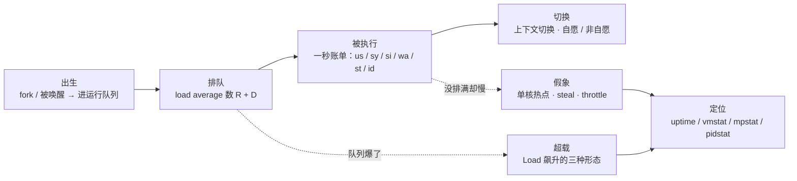
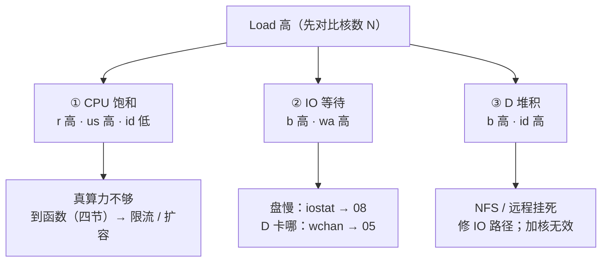
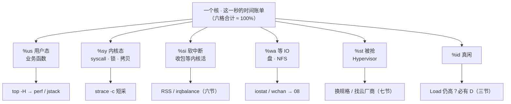
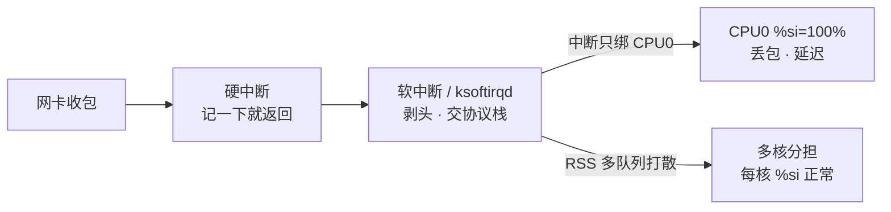
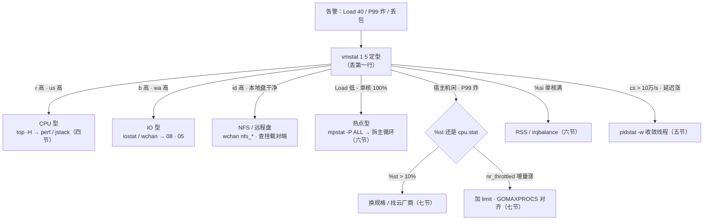

# CPU 与 Load

> 大家好，欢迎来到这次分享。开讲之前，先带大家回到一个很多值班同学都经历过的现场：
> Load 到 40，工单已经写了「加 8 核」，`top` 一看 idle 还有 70%——这单要是签了，明早 Load 照样 40。
> 这一章讲完，你会知道那张「加 8 核」工单错在哪，以及正确的第一刀该敲什么。
> **本章回答**：一个任务从进运行队列到被 CPU 执行的一生——Load 到底在数谁、一秒 CPU 时间切给哪一格、高 Load / 高延迟怎么分型下刀。
> **不讲**：D 为什么杀不掉、信号 → [05](../05-进程与信号/)；换页 si/so、OOM → [07](../07-内存与OOM/)；await / %util / 脏页深排 → [08](../08-磁盘与IO/)；cgroup 文件与容器细节 → [10](../10-cgroup与容器/)；包怎么进 Socket → [12](../12-网络栈与Socket/)；火焰图采样手法 → [21](../21-性能方法论-USE与RED/)。这些都有专门的章节，本章只在用到时点到为止。

**标记**：🎯重点 · 🔥难点 · ⭐常考 · 🔧实操

**怎么听这场分享**：咱们先看第一节的主图，把「一个任务的一生」装进脑子；第二到第七节顺着排队 → 执行 → 切换 → 热点 → 被抢往下走；第八、九节专门讲定位与定责，也就是开头那张工单的正确解法。每一节讲完都会提示对应练习题，学完就去练。

---

## 一、一张图：一个任务的一生

> 🎯 **一句话**：一个任务的一生是出生 → 排队 → 被执行 → 切换；Load 照排队，CPU% 照执行。

咱们先不急着背格子名。学 CPU 最怕的就是看见 Load 高就写「加核」——两把尺都没对上。先看图，把「排队」和「执行」分清楚：



**读图**：带着三个问题看这张图，比背公式有用得多：

- 主线是一个任务的一生，四个实线阶段；两条虚线是它「出事」的两个方向——队列爆了（Load 飙升，三节）和没排满却慢（假象，六、七节）。
- 监控的 Load 照的是「排队」段；`top` / `mpstat` 的格子照的是「被执行」段。**两段对不上——Load 高 CPU 闲——就是本章最高频的题面。**
- `vmstat` / `mpstat` 是 X 光机：不换器官，只回答「这个任务现在卡在哪一段」。

好，主图有了。咱们正式出发——第一站：一个任务怎么进运行队列。

---

## 二、出生：进运行队列

> 🎯 **一句话**：想跑的进运行队列变 R，卡 IO 的进 D——两种「没在跑」都算排队。

一个任务要跑，不是直接上 CPU，而是先进**运行队列（runqueue）**：每个 CPU 一条，调度器从里面挑下一个。**R（runnable，可运行）** = 任务想跑、正在队列里等 CPU——`ps` 状态列的 `R`、`vmstat` 的 `r`，数的都是它。

另一种「没在跑」更隐蔽：**D（uninterruptible sleep，不可中断睡眠）** = 任务卡在一个不能被打断的 IO 上（磁盘、NFS），`kill -9` 也无效——信号要等它回到可运行状态才被处理（杀不掉的细节见 [05](../05-进程与信号/)）。

| 对比 | R（runnable） | D（uninterruptible sleep） |
|------|---------------|----------------------------|
| 在干什么 | 想跑，在运行队列里等 CPU | 等一个不可中断的 IO 完成 |
| 谁能打断 | 调度器随时挑它上台 | `kill -9` 也无效，只能等 IO 或带外重启 |
| 怎么退出 | 被执行 / 主动睡眠 | IO 完成（或修好 IO 路径） |
| Load 数不数 | 数 | 数（Linux 特有，三节） |
| 哪里看 | `vmstat` 的 r / `ps` 的 R | `vmstat` 的 b / `ps` 的 D |

> 💡 **打个比方**：运行队列像医院叫号——R 是「已取号坐在椅子上等」的病人，D 是「卡在检查床上、检查不结束起不来」的病人。Load 数的是两种人的总数，**不是「医生（CPU）忙不忙」**。

> ⚠️ **别混**：**D 不是僵尸（Z）**。D 是活着的进程在等 IO，IO 完成会自己起来；Z 是已经死了、等父进程收尸的空壳（[05](../05-进程与信号/)）。「ps 一排 D」和「一排 defunct」是两种病。

**调度器挑谁：CFS 一句。** Linux 用 **CFS（Completely Fair Scheduler，完全公平调度器）**：每个任务记一个 **vruntime（虚拟运行时间）**，谁跑得少挑谁；**nice 值**（−20 ～ 19，负数更高优先）只调权重，不是硬保证。生产里几乎不靠调 nice 救命——它救不了一颗被打满的核。

**优先级反转（priority inversion）⭐**：低优先级任务持着锁，高优先级任务等这把锁，这时一堆中优先级任务把低优先级挤下 CPU——高优先级被「反转」成连中优先级都跑不过。内核 mutex 带**优先级继承（priority inheritance）**缓解；现实版是「日志线程持锁 → 主循环等锁 → GC 线程插队」。P99 有尖刺却查不到 CPU 热点时，这是一个候选答案。

> 🔍 **现场**：怀疑队列里堆了什么，一条命令看 R/D 分布：

```bash
ps -eo state,pid,wchan:20,cmd | awk '$1 ~ /^[RD]/'
# R  2341  -                  gameserver    ← 在等 CPU 的可运行任务
# D  2407  nfs_wb_all         gameserver    ← D 状态 + wchan 显示卡在 NFS 写回
#       ↑ wchan = 内核里正在等的函数（05），看到 D 必看这一列
```

> 📝 **面试**：问「R 和 D 的区别」，答「R 在运行队列里等 CPU，D 在不可中断地等 IO；**两种都被 Load 数进去**——所以 CPU 很闲 Load 也能很高；D 杀不掉是因为信号要等它回到可运行态」。再补一句优先级反转是「锁 + 抢占」联手造成的低优堵高优，优先级继承是内核解法。

---

这一节对应练习题 Q1——R/D 是 Load 的两股，下一节展开。

好，R 和 D 认清了。大家想想：监控大屏 Load 到 40，到底在数什么？很多人会答「CPU 利用率」——咱们看看错在哪。

## 三、排队：load average 在数什么

> 🎯 **一句话**：Load 数的是 R+D 的 1/5/15 分钟平均——数排队，不是 CPU 利用率。

### 定义：三件一起记 ⭐🔥

🔥 很多人会答「Load 就是 CPU 利用率」——**错了**。⭐ 这是面试最高频错答。

**Load（load average，平均负载）** 大白话拆开：**它数的是「排队的人有多少」，不是「诊室里医生忙不忙」**。正式说法：过去 1 / 5 / 15 分钟，「可运行（R）+ 不可中断睡眠（D）」任务个数的**指数加权滑动平均**——越近的采样权重越大，所以 1m 对突变最敏感。三个数不是三种 Load，是同一个数的三种记忆长度。口诀：**「Load 数排队，CPU% 数干活」**（练习题 Q1）。

**Linux 特有把 D 也数进去**。很多教材画「Load = CPU 就绪队列长度」只数 runnable；正是 D 这一笔，才有「CPU 很闲、Load 很高」这个必考现象。

> ⚠️ **别混**：**Load ≠ CPU 利用率**。Load 数「多少人在等」（队列长度，含 D），CPU% 数「核的时间花在哪」。前者是 USE 方法论里的 **Saturation（饱和度）**，后者是 Utilization（[21](../21-性能方法论-USE与RED/)）。两者一对不上：Load 高 CPU 闲 → 几乎必然有 D 在抬队列；Load 低 CPU 也低却超时 → 去看单核热点和假象（六、七节）。

### 读 Load：对比核数 + 看趋势 ⭐

Load 没有绝对好坏，必须**对比核数**读：N 核机器满载感 ≈ N，持续 **> 2N** 开始伤 P99。

```text
核数 N=8:   Load 8 ≈ 满载感    Load 16 起伤排队    Load 1 ≈ 空转
核数 N=64:  Load 64 满载       Load 128 严重       Load 1 —— 告警规则写 Load>1 是误报
```

趋势比绝对值更有动作价值：

```text
正在恶化  40.1, 22.0,  8.0   ← 1m >> 15m：先止血，不是先写周报
平台高位  18.0, 17.5, 16.8   ← 持续过载，对比 N 决定扩不扩
正在恢复   6.2, 14.0, 22.0   ← 别看 15m 还高就再扩一圈（扩完发现业务已回落）
刚刚尖刺  12.0,  3.0,  2.0   ← 瞬时事件（发布/活动），看业务是否自愈
```

> 🔍 **现场**：任何 Load 告警，先跑这两条：

```bash
uptime
#  12:01:02 up 14 days,  3:22,  1 user,  load average: 40.12, 28.40, 12.05
#                                              ↑ 1m       ↑ 5m      ↑ 15m
nproc
# 8    ← Load 的分母；容器里 nproc 常返回宿主机核数，别当分母（七节）
```

### 走读一例：8 核 Load=40、idle 70% 🔥

活动开场，8 核逻辑服 Load 飙到 40，群里喊「加 8 核」，`top` 显示 idle 70%、`%us` 不高，游戏日志打在 NFS 上。值班顺序：

```text
① uptime      → 40.12, 28.40, 12.05：1m >> 15m，正在恶化，优先止血
② vmstat 1 5  → 丢掉第一行；第二行起 r=2 b=18 us=5 id=70 wa=18 st=0
③ r=2 而 b=18 → 不是 CPU 排队，是 D 在堆积；wa=18 是 IO 型账单
④ ps 找 D     → 一排 D，wchan 全是 nfs_wait_* → 日志 NFS 挂死
⑤ 止血        → 修 NFS 或日志改本地盘。加 8 核不会让 NFS 变快
```

同一套开场命令，数字不同出口就不同（完整决策树见九节）。

### Load 与 CPU% 对不上的另外两种

- **低 Load 单核满**：匹配服 Load=1.2，`mpstat` 里 CPU3 `%usr=99%`——Load 是全机平均，看不见一核的主循环（六节）。
- **CPU 高 Load 不高**：纯计算、核还没排满，或很短的突发——先 `mpstat -P ALL` 排除单核热点，再当整机过载谈扩容。

### 收束：Load 飙升的三种形态 🎯⭐

到这里，Load 这把尺的全部零件齐了。面试问「Load 高怎么排查」，要的就是这张图——**三种形态，先认字段再下刀**：



**读图**：

- 三条分支用 `vmstat` 一屏就能分开：**看 r、b、us、wa、id 四个字段**——r 高 us 高是饱和，b 高 wa 高是 IO，b 高 id 高是 D 堆积（CPU 闲着队还长）。
- ② 和 ③ 常同时出现：D 堆在 IO 上，wa 跟着涨；区分动作是看本地 `iostat`——本地盘干净而 b 仍高，就是 NFS / 远程盘。
- **CPU 饱和（saturation）** 是这里的官方词：队列里的任务超过核能立刻消费的量，排队时间开始进 wall time。

> ⚠️ **别混**：这张图**不保证**「Load 低 = 健康」——单核热点、cgroup throttle、steal 都不抬 Load，P99 照样炸（六、七节）；也不保证「Load 高 = CPU 不够」——形态②③加核全无效。

> 📝 **面试**：按「**有人跑不着 CPU（饱和）/ 有人跑着但等盘（IO）/ 有人压根起不来（D）**」分组背三种形态，各配一个字段签名（r+us / b+wa / b+id）。收尾补一句「高 Load 低 CPU 先查 D，不加核；Load 低也要看单核和 throttle」——这句是区分「背过」和「懂了」的分水岭。

这一节对应练习题 Q1、Q7——Load 两把尺，务必练熟。

---

好，排队段讲完了。接下来自然会问：任务终于被挑上 CPU，这一秒的时间账单怎么切？

## 四、被执行：一秒的账单切给谁

> 🎯 **一句话**：哪一格最大，下一刀就去哪——「CPU 高」三个字不构成结论。

任务被调度上 CPU 后，它的时间记进账单。**%us / %sy / %si / %wa / %st / %id 六格加起来 ≈ 100%**：



**读图**：从账单进，每格出一条固定的「下一刀」——六条出口互不通用，先认**最大格**再选工具。`top` 抬头的 `%Cpu(s)` 与 `mpstat` 是同一份账单（`%soft`=%si、`%iowait`=%wa、`%steal`=%st）。

### %us：用户态——到函数的链 🔧⭐

已确认是 CPU 型（r 高、us 高、b/wa 不高）才走这条链，先 `mpstat -P ALL` 排除「其实是单核热点」（六节）：

```bash
pidstat -u 1 3          # 锁定 PID；最后一列是它最近跑在哪颗核
top -H -p {PID}         # 锁定 TID（线程号）
printf '%x\n' <TID>     # Java：TID 转十六进制，对 jstack 输出里的 nid=0x…
perf top -p {PID}       # C/Go：短采几秒看热点函数（要 root 和内核符号）
```

锁定到线程后分两种：

- **多线程均匀高** → 流量大或缺限流：限流、扩容、回滚热点发布。
- **单线程 100%** → 死循环、正则回溯、单线程主循环：拆热点或并行化，**扩核常没用**。

**火焰图什么时候上**：确认 CPU 型、需要函数占比时，采 **10–30s** 足够（手法见 [21](../21-性能方法论-USE与RED/)）。**不上**的时候：IO 型 / wa 高、throttle、丢包（先查 si）、steal——型没分对，采样是浪费还加重负载。没有 perf 也不卡壳：Java 至少 jstack，Go 至少 pprof，C 至少 `top -H` 给到 TID。

> 📝 **面试**：问「CPU 高怎么办」，第一句永远是「先分型：vmstat 看 r/b/wa」；第二句才是「CPU 型走 pidstat → top -H → TID，Java 转 hex 对 jstack nid，C/Go 上 perf 短采」。一上来就 perf 是减分项。

### %sy：内核态

`%sy` 高先想「是不是 syscall 太碎、内核锁竞争、网络/文件路径上的拷贝太多」，不是先加核（syscall 与内核机制深挖 → [04](../04-内核与系统/)）：

```bash
strace -c -p {PID}      # 秒级短采（生产注意开销），看哪些 syscall 次数/耗时突出
# % time     seconds  usecs/call     calls    errors  syscall
# 62.31      1.842036           8    230144           futex     ← 锁竞争签名
# 21.07      0.623334           4    155833           getpid    ← 碎调用签名
```

> ⚠️ **别混**：**%sy ≠ %si**。业务线程做 read/write 这些系统调用记在 %sy；网卡收包的软中断记在 %si（六节）。网关「CPU 高」先 `mpstat` 分清这两格再下刀——按 %sy 去追业务函数，结果其实是 %si，白忙。

### %wa：等 IO（CPU 视角）⭐🔥

> 💡 **打个比方**：`%wa` 是「你盯着打印机发呆的时间」——只有你本来有空发呆，才记得到 wa。你已经满负荷写代码（CPU 打满），打印机再慢，账单上也挤不出「发呆」这一格。

**%wa 高且 b>0 → IO 型**（三节收束）；但 **wa=0 不能证明盘快**——CPU 被算力打满时没有 idle 可记到 wa。三个数分清，别混着结案：

```text
%wa    = CPU 有空且在等 IO 的时间占比（CPU 视角，本章）
await  = 请求在设备队列里待了多久（盘视角）→ [08](../08-磁盘与IO/)
%util  = 设备有活干的时间占比（SSD 并行下别单独当结论）→ [08](../08-磁盘与IO/)
```

### %st 与 %id

`%st` 被 Hypervisor 抢走，见七节。`%id` 真闲：**id 高 Load 仍高 → 必有 D**（三节）；**id 高 Load 不高但 P99 炸 → 假象**（throttle / steal / 单核热点，六、七节）。顺带：nice 调过优先级的用户态时间单独记在 `%ni`，正常几乎为 0（二节）。

> 📝 **面试**：对着格子口述定责——「us 找函数，sy 找 syscall，wa/b 去盘，si 去网卡，st 找云厂商，id 高 Load 高必有 D」；再补「wa=0 不能证明盘快，CPU 打满时 wa 被挤掉，盘慢听 await」。

这一节对应练习题 Q3、Q12——格子定责，学完直接去练。

---

账单会切，进程也会被切走。大家想想：cs 很高，是不是该加核？

## 五、切换：上下文切换

> 🎯 **一句话**：cs 数「换人上台」的次数；持续 10 万+/s 且延迟涨，先查线程模型。

**上下文切换（context switch）** = CPU 从一个任务换到另一个：保存/恢复寄存器、切页表基址等。`vmstat` 的 `cs` 是每秒全机切换次数，`in` 是每秒中断次数（突增配合 %si 查网卡，六节）。

切换分两种，`pidstat -w` 各一列：

| 对比 | cswch（自愿切换） | nvcswch（非自愿切换） |
|------|-------------------|----------------------|
| 谁发起 | 任务自己让出 CPU | 时间片用完被抢 / 高优先级到来 |
| 常见原因 | 等 IO、等锁、syscall 太碎 | 线程相对核数过多、CPU 不够 |
| 指向 | 锁 / IO / 调用模式 | 并发度错位 |

> 🔍 **现场**：P99 涨又查不出热点，看谁在疯狂切换：

```bash
pidstat -w 1 3
# 08:12:01   UID    PID   cswch/s nvcswch/s  Command
# 08:12:01  1000   1234    45200      8200   nginx
#                          ↑ 大量自愿切换：在等事件/锁   ↑ 非自愿也高：线程偏多
```

物理机每秒几万次切换常见，**持续 > 10 万/s 且延迟涨**才当故障信号。典型事故：网关「一连接一线程」，cs 30 万/s、P99 涨——CPU 大量时间花在「换人」而不是干活上。治法是线程池按核数收敛、改 epoll / 协程模型（epoll 机制见 [12](../12-网络栈与Socket/)）。

> ⚠️ **别混**：**cs 高 ≠ 该加核**。线程过多时加核只是推迟爆炸；先把并发模型收敛到核数量级，再谈扩容。

> 📝 **面试**：「cs 数十万且延迟涨，我先 pidstat -w 分自愿和非自愿——自愿高查锁和 IO，非自愿高说明线程太多；一连接一线程的网关要改 epoll，不会先加核。」

这一节对应练习题 Q6——上下文切换。

---

好，切换讲完。下一型假象：整机 CPU 才 40%，P99 却炸了——根因常在单核。

## 六、热点：单核打满与软中断

> 🎯 **一句话**：整机平均会骗人——mpstat -P ALL 之前，别对 CPU% 下任何结论。

### 整机 40% 也超时 ⭐

```bash
mpstat -P ALL 1 1
# CPU   %usr  %sys  %iowait  %soft  %steal  %idle
# all   38.2   2.1     0.5    1.0     0.0    58.2   ← 整机平均：看起来有余量
#   0    5.0   1.0     0.0   94.0     0.0     1.0   ← CPU0 软中断打满
#   3   99.2   0.8     0.0    0.0     0.0     0.0   ← CPU3 用户态热点
```

一台机器可以**同时有两条病**：CPU3 是业务主循环热点、CPU0 是收包软中断。定责要分开说，工具链不同（四节 vs 本节）。单核热点时 Load 可以只有 1.x——Load 是全机平均，看不见一颗核的主循环；死循环、正则回溯、单线程主循环都是常客，**扩整机核不拆这一核**。

### 软中断单核打满 🔥

很多人会答「整机才 30%，扩两台副本就好」——**错了**。包还是进同一块网卡同一条队列，每台 CPU0 照样满。⭐ 口诀：**「单核 %si 满，扩副本治不了」**（练习题 Q8）。

**软中断（softirq）** = 硬中断「叮」一下之后，把收包这类耗时活放到软中断上下文里做；跑不过来时由内核线程 **ksoftirqd/N** 接着跑。`%si`（mpstat 打印 `%soft`）就是这一格。硬中断 / 软中断的分工与包路径见 [12](../12-网络栈与Socket/)，本章只管「软中断把哪颗核打满、怎么打散」。



**读图**：问题不在「CPU 不够」，在「中断没打散」——网卡每条队列的中断绑死一颗核，包全走一条队列时全堆 CPU0。扩两台网关副本，**每台的 CPU0 照样满**，因为包还是进同一块网卡的同一条队列。

> 🔍 **现场**：整机 CPU 不高却丢包，先看中断堆在哪列：

```bash
cat /proc/interrupts | grep -iE 'eth|ens'
#            CPU0    CPU1   CPU2
#  52:     892341       0       0   PCI-MSI-edge  eth0-TxRx-0
#          ↑ 计数几乎全在 CPU0 列 = IRQ 没打散，开 RSS / 查 irqbalance
```

处置清单 ⭐🔧：

- **RSS（Receive Side Scaling）**：网卡多队列把中断/软中断分散到多核——正道。
- **RPS / RFS**：软件打散，硬件队列不够时的补充。
- **irqbalance** 保持开着；云主机开了多队列也要确认没人把 affinity 钉死。
- 业务临时缓解：把主循环 `taskset` 钉到**非 0 核**，别和 `ksoftirqd/0` 抢同一颗核。
- 没用的：扩业务副本（治不了单核 si）、`nice`（救不了被打满的核）。

> ⚠️ **别混**：**%si 正常但 ESTAB Recv-Q 涨 → 不是本章的事**，是应用没 read，去 [12](../12-网络栈与Socket/)。软中断打满是「包进不了内核」，Recv-Q 涨是「包进了内核、应用不取」——两道关两个病。

> 📝 **面试**：「单核 %si 打满，我先 mpstat 看哪颗核、/proc/interrupts 看计数堆哪列，开 RSS / 确认 irqbalance；扩副本治不了单核软中断，包还是进同一条队列。」

这一节对应练习题 Q2、Q8——单核热点与软中断。

---

单核热点之外，还有两类「看起来机器很闲、业务却很慢」——虚机被抢和 cgroup 限流。

## 七、被抢：steal、throttle 与频率

> 🎯 **一句话**：时间被拿走：虚机层记 %st，cgroup 层叫 throttle，都轮不到调代码。

### %st（steal / stolen time）⭐

云虚机的 vCPU 时间由 Hypervisor 分配；分给别的虚机的那部分，在 `mpstat` 里记成 **%st（stolen time，被偷走的时间）**。

> 💡 **打个比方**：合租的房子，房东时不时占你房间会客——你自己日程排得再满/再松都没意义，**时间不是你的**。

```bash
mpstat 1 3
# CPU   %usr  %sys  %iowait  %steal  %idle
# all    22.0   3.0     0.0    15.0    60.0
#                              ↑ 持续 >10% 且延迟涨 → 超卖，换规格 / 迁宿主机
```

同屏 `%idle=60` 也**不能**说「机器很闲所以应用没事」——被抢走的时间在业务侧就是毛刺。**治法只有换规格、独占、找云厂商**；优化业务代码治不了 st。

### cgroup throttle ⭐🔥

大家想想：容器 CPU 只用了 40%，P99 却周期性尖刺，是不是该加机器？很多人会答「应用有问题」——**也可能是 throttle**。

**throttle（限流）**：CFS 带宽控制给每个 cgroup 发「配额」——`cpu.max = quota period`，周期默认 **100ms**。limit=500m → 每 100ms 周期只许跑 50ms；配额用完，**整个 cgroup 被踢出运行队列**，干等下一个周期。

> 💡 **打个比方**：网吧计时卡——机房（宿主机）空得很，但你卡上每小时只有 30 分钟，时间一到就被踢下机排队，**墙上的钟（请求 wall time）照样走**。

```text
cpu.max = 50000 100000        ← 每 100ms 周期最多跑 50ms（= 0.5 核）

|--------- 周期 100ms ---------|--------- 周期 100ms ---------|
|■■■■■■ 跑满 50ms ■■■■■■|           被踢出队列干等            |
                          ↑ 50ms 处配额耗尽，P99 直接吃这段等待
```

宿主机可以很闲、容器内 %us 也不打满，P99 照样从 30ms 跳到 400ms——**wall time 含被踢出队列的等待**。

> 🔍 **现场**：宿主机闲、Pod P99 炸、%st 不高，读两次 `cpu.stat` 隔 10~30s 做差：

```bash
cat /sys/fs/cgroup/<path>/cpu.stat
# usage_usec 45231000             ← 累计用掉的 CPU 时间（绝对值是累计）
# nr_periods 847                  ← 周期数
# nr_throttled 312                ← 被限流的周期数；312/847 ≈ 37%
# throttled_usec 18400000         ← 累计被踢出的等待时间——P99 的来源
```

**判据**：`nr_throttled / nr_periods` **增量 > 5%** 且延迟涨 → 当故障。cgroup 文件细节 → [10](../10-cgroup与容器/)；K8s request/limit YAML → [03-04](../../03-Kubernetes/04-Pod生命周期/)。

**GOMAXPROCS 坑 ⭐**：容器里 `nproc` 常返回**宿主机核数**；Go 的 `GOMAXPROCS`、JVM 的 GC 线程就按宿主机核数开——16 个线程抢 0.5 核配额，throttle 更凶。修法：`automaxprocs` / `-XX:ActiveProcessorCount`，**并发度对齐 limit**。只设 request 不设 limit 能避免 throttle（request 不是硬顶），代价是可能吵邻居——配 HPA + 节点水位兜底，匹配/逻辑服常用这套。

| 对比 | steal（%st） | throttle |
|------|--------------|----------|
| 在哪层 | 虚机 / 宿主机超卖 | cgroup / 容器 limit |
| 怎么认 | mpstat 的 %st | cpu.stat 的 nr_throttled 增量 |
| 治法 | 换规格 / 迁宿 / 找云厂商 | 加 limit 或对齐并发度 |

> ⚠️ **别混**：**st 不是 throttle**——一个在虚机层（你的 vCPU 时间被邻居拿走），一个在 cgroup 层（自己的配额用完被踢）；K8s 里 Pod 被 throttle 时宿主机的 %st 可以是 0。认法也不同：一个看 mpstat，一个读 cpu.stat 增量。

### 频率调节（cpufreq governor）⭐

CPU 不忙时内核会降频省电，`powersave` / `ondemand` / `schedutil` 都在动态调频——游戏/低延迟服常被「闲时降频、忙时来不及升频」的毛刺咬一口：机器没满却跑不快、压测成绩忽高忽低，先看 governor 再怀疑代码：

```bash
cpupower frequency-info | grep -E 'driver|governor'   # governor 是 performance 还是 ondemand
cpupower frequency-set -g performance                 # 延迟敏感机常钉 performance
```

这一节对应练习题 Q4、Q5——steal 与 throttle。

---

机制齐了。换作战视角：四把刀怎么轮着敲？

## 八、定位：四把刀与读数

> 🎯 **一句话**：uptime → vmstat → mpstat -P ALL → CPU 型才 top -H / pidstat / perf。

### vmstat：分型第一屏 ⭐🔧

任何「机器慢 / Load 高」的开场先它。**第一行是开机以来平均，丢掉**——它会把正在恶化的现场抹平。

```text
# vmstat 1 5
procs -----------memory---------- ---swap-- -----io---- ---system-- ------cpu-----
 r  b   swpd   free   buff  cache   si   so    bi    bo   in   cs  us sy id wa st
 3  4      0 8123456 123456 9876543  0    0    30   120 4500 12000  6  2 88  2  0   ← 丢掉这行
 2 18      0 8123000 123456 9876540  0    0   115  9100 4480 11800  5  2 70 18  0
 ↑r 可运行数      ↑si/so 非 0 = 先当内存（07）        ↑b D 的个数      ↑六格（粗版）
```

字段口径：`r` 持续 > 核数 = CPU 排队；`b` 持续 > 0 = D 堆积；`cs` / `in` 见五、六节；`si`/`so` 是 swap 换页，非 0 先去 [07](../07-内存与OOM/)。

### top / pidstat：谁在烧 🔧

- `top` 抬头 `load average` 与 `uptime` 同一套数；进程 `%CPU` 可 >100（多线程合计）；状态列一排 D 就是 IO 型，别在这屏空盯 %CPU。
- `pidstat -u` 最后一列是「最近跑在哪颗核」，和 mpstat 的单核热点互相印证：

```text
pidstat -u 1 →  PID 2341 %usr 78，最后一列 CPU 3
mpstat -P ALL → CPU3 %usr 99
top -H -p 2341 → 某个 TID 吃满
     ↓ 三屏互证 = 热点型：拆该线程 / 主循环，不是整机加核
```

### NUMA：先看拓扑，不是默认动作 ⭐

多路物理机内存分 node，跨 node 访问（remote）更慢。先 `numactl --hardware` 看拓扑、`numastat -p <PID>` 看 remote 比例；**多 node 且 remote 多**，才把延迟敏感进程绑同一 node（`numactl --cpunodebind=0 --membind=0`）。单 node 的云主机绑了没收益；不看拓扑硬绑，内存还在另一边，毛刺更差。绑核（taskset / CPUAffinity）从来不是开场动作。

### sar：昨天凌晨 🔧

```bash
sar -u -f /var/log/sa/sa22      # 22 号那天的 CPU 历史
sar -q -f /var/log/sa/sa22      # 历史 Load / 队列长度
```

「回溯昨夜」类工单先确认 sa 文件在不在——没装 sysstat 就没有昨天，别只盯当前一屏猜。

这一节对应练习题 Q3、Q9、Q11——定位刀法。

---

四把刀会敲了，接到「Load 高 / 延迟高」怎么 60 秒定责？就是开头那张工单的正确解法。

## 九、作战：分型定责

> 🎯 **一句话**：先分型再动手——五种出口处方互不通用，卡错型后面全浪费。

### 定责决策树



### 现象 · 先做 · 别做

| 现象 | 先做 | 别做 |
|------|------|------|
| Load 40、idle 70% | vmstat 看 b；查 D / NFS | 加 8 核 |
| 整机 40%、一核 100% | mpstat -P ALL；拆主循环 | 水平加核当根治 |
| 宿主机闲、P99 400ms | cpu.stat 增量，再看 %st | 先调 JVM 当 steal |
| CPU0 %si 100%、丢包 | interrupts / RSS | 只扩网关副本 |
| cs 30 万/s、延迟涨 | pidstat -w；收敛线程模型 | 先加核 |
| 64 核 Load>1 告警响 | 改阈值对比核数 | 当真过载 |
| wa 高 | iostat await / wchan | perf 采 30 分钟 |
| %st 持续 15% | 换规格 / 迁宿主机 | 优化业务代码治 st |

### 60 秒剧本 🔧

> 🔍 **现场**：接到「卡 / 慢 / Load 高」报障，60 秒走完这条线再下结论：

```text
① 0–10s  uptime：Load 对比核数 N，看 1m vs 15m（恶化还是恢复）
② 10–30s vmstat 1 5：丢第一行；r / b / us / wa / st 各打向哪一格
③ 30–45s mpstat -P ALL 1 3：整机平均不算数——单核 us？单核 soft？%steal？
④ 45–60s 分型下刀：CPU 型 top -H → perf · IO 型 iostat/wchan ·
                   热点型拆主循环 · 假象 cpu.stat / %st · 丢包查 %si/RSS
```

### 五条复盘（都是真赔过钱的）

1. **throttle**：活动开启，网关 P99 30ms→400ms，宿主机 idle 70%。`cpu.stat` 增量 37%，limit=500m、`GOMAXPROCS=16`。limit 调 2 核 + `GOMAXPROCS=2` 后回落——配额与并发度不匹配，不是机器不够。
2. **单核热点**：匹配服单核 100%、Load 1.2；扩成 8 核没用，拆热点 / 并行化主循环才好。
3. **NFS 抬 Load**：游戏日志在 NFS 上，NFS 挂死，逻辑服全员 D，Load 上 50、CPU 5%。止血是修 NFS 或日志改本地盘。
4. **软中断**：网关丢包，整机 CPU 30%、CPU0 %soft 95%；扩两台副本每台 CPU0 照满——开 RSS / irqbalance 后恢复。
5. **cs 爆炸**：新网关「一连接一线程」上线，cs 30 万/s、P99 涨；改 epoll / 回滚线程模型后恢复，加核无效。

### 配置底线

- 告警：Load 阈值挂核数（如 > 1.5N）并看 1m vs 15m，不写绝对值 → [22](../22-监控与告警/)
- 网关：RSS 多队列开着，irqbalance 别关；主循环要钉核就钉**非 0 核**
- 容器：`GOMAXPROCS` / `ActiveProcessorCount` 对齐 limit；延迟敏感服慎用过小 limit
- `nice` 几乎不用来救命（保持 0）；`SCHED_FIFO` 生产不用（会饿死内核线程）
- 活动前把 CPU 限流、网关 RSS、日志盘水位列入检查（盘水位见 [08](../08-磁盘与IO/)）

这一节对应练习题 Q9、Q10、Q13、Q14——作战综合，务必练熟。

---

**回到开头那个现场**：Load 到 40，工单已经写了「加 8 核」，idle 还有 70%。正确处理：uptime 对比核数 → vmstat 丢第一行看 b/wa → 一排 D 查 NFS/盘，**不是加核**。现在再看那张工单，你知道该怎么拦下了。

这一节对应练习题 Q9、Q10、Q13、Q14——作战综合，务必练熟。

---

到这里，本章的主要内容就讲完了。最后一部分是三张「小抄」：命令速查留着值班用，面试锚点留着面试前过一遍，易错对照留着自查——每条都是别人踩过的坑。

## 十、收口

### 命令速查 🔧

```bash
uptime                                        # Load 1/5/15，对比核数
nproc                                         # 核数；容器里常是宿主机的，别当分母
vmstat 1 5                                    # r/b/cs/wa/st；丢掉第一行
mpstat -P ALL 1 3                             # 单核 us / soft / steal
pidstat -u 1 3                                # 谁在烧；最后一列是哪颗核
pidstat -w 1 3                                # cswch / nvcswch
top -H -p {PID}                               # 锁定 TID；Java 先 printf '%x' 对 jstack nid
ps -eo state,pid,wchan:20,cmd | awk '$1 ~ /D/'   # D 状态 + 卡在哪个内核函数
cat /sys/fs/cgroup/<path>/cpu.stat            # throttle：nr_throttled 增量
cat /proc/interrupts | grep -iE 'eth|ens'     # 网卡 IRQ 是否堆 CPU0
numactl --hardware                            # NUMA 拓扑
sar -u -f /var/log/sa/saDD                    # 历史 CPU；sar -q 看 Load
```

### 面试锚点

遮住右列自问自答，卡壳的行回去重读对应小节——能讲出来才算会：

| 问 | 30 秒答 |
|----|---------|
| Load 在数什么？ | R+D 的 1/5/15 分钟指数加权平均；不是 CPU 利用率，是排队长度。 |
| Load 对比谁？ | 核数 N；满载感 ≈ N，持续 > 2N 开始伤 P99；Load>1 绝对阈值在 64 核是误报。 |
| 高 Load 低 CPU？ | Load 含 D；先 vmstat 看 b，查 NFS / 盘，不加核。 |
| 整机 40% 会超时吗？ | 会；单核 100% 照样炸 P99——必须 mpstat -P ALL。 |
| 格子怎么定责？ | us 找函数、sy 找 syscall、wa/b 去盘、si 去网卡、st 找云厂商、id 高 Load 高必有 D。 |
| wa=0 盘就快？ | 否；CPU 被打满时 wa 被挤成 0，盘慢听 await（08）。 |
| 从 CPU 高到函数？ | mpstat 排单核 → pidstat 锁 PID → top -H 锁 TID；Java 转 hex 对 jstack nid，C/Go 上 perf 短采。 |
| 火焰图何时上？ | 确认 CPU 型、要函数占比时，采 10–30s；IO/wa 高、throttle、steal 不上。 |
| cs 高怎么办？ | 持续 >10 万/s 且延迟涨才算事；pidstat -w 分自愿（锁/IO）与非自愿（线程太多）；收敛模型，别先加核。 |
| 单核 %si 满？ | 网卡软中断堆一颗核；看 /proc/interrupts 堆哪列，开 RSS/irqbalance；扩副本治不了。 |
| %st vs throttle？ | st 是虚机层超卖看 mpstat；throttle 是 cgroup 配额看 cpu.stat 的 nr_throttled 增量。 |
| 容器没用满就没事？ | 否；配额用完整个 cgroup 被踢出队列，宿主机 idle 高 P99 照炸。 |
| GOMAXPROCS 设多少？ | 对齐 cgroup limit；nproc 在容器里返回宿主机核数，会加重 throttle。 |
| R 和 D 差在哪？ | R 在运行队列等 CPU；D 不可中断等 IO、kill -9 无效；两种都被 Load 数。 |
| 优先级反转？ | 低优持锁堵高优、中优抢占低优；内核 mutex 用优先级继承缓解。 |
| NUMA 绑不绑？ | 先 numactl --hardware 和 numastat；多 node 且 remote 多才绑，单 node 云主机绑了没收益。 |
| vmstat 第一行？ | 开机以来平均，丢掉；r 持续 > 核数、b 持续 > 0 才是信号。 |

### 易错一句话对照

- Load 高 = CPU 不够 → Load 含 D，先分型，形态②③加核全无效
- Load=1 在 64 核上算高 → 对比核数，几乎没人排队
- 整机平均有余量 → 单核可以打满，P99 照炸
- 高 Load 低 CPU 先加核 → 先 vmstat 看 b，查 D / NFS
- Load 低就不可能超时 → 单核热点、throttle、steal 都不抬 Load
- wa=0 说明盘快 → CPU 打满时 wa 被挤掉，听 await
- %sy 和 %si 一回事 → syscall 记 sy，收包软中断记 si，工具链不同
- %st 高是 cgroup throttle → 一个虚机层一个 cgroup 层，认法不同
- 容器没用满就不会 throttle → 配额用完照样被踢出队列
- 扩网关副本能治单核 %si → 包还是进同一块网卡同一条队列
- nice 能救打满的核 → 只调权重，救不了；SCHED_FIFO 还会饿死内核线程
- cs 高就加核 → 线程过多时加核只是推迟爆炸
- 一上来 perf 30 分钟 → CPU 型才采，且 10–30s 足够
- 机器没满却跑不快只怪代码 → 还要查 cpufreq governor 是不是在动态降频
- 容器里拿 nproc 当核数 → 常是宿主机核数，并发度全错位
- 看见 cs 几万就当故障 → 物理机常见；持续 >10 万/s 且延迟涨才算

### 数字墙

> 满载感 **≈ N**（核数）· 伤 P99 常看 **> 2N** · Load 窗口 **1 / 5 / 15 分钟**（指数加权）· cs 查 **> 10 万/s** 且延迟涨 · %st 换机 **> 10%** 持续 · throttle 当故障 **nr_throttled / nr_periods > 5%（增量）** · CFS 周期 **100ms**（500m ≈ 每周期 50ms）· 火焰图采样 **10–30s** · nice 范围 **−20 ～ 19** · mpstat 中 %soft = %si、%iowait = %wa、%steal = %st

---

## 合上书

学到这里，先别急着翻下一章。合上书，试试下面这几件事能不能做到——能做到，这章才算真的听懂了。卡住的那一条，就回到对应的小节再听一遍（练习题「合上书」与这里逐条对齐）：

- [ ] **默画一节的图**：出生 → 排队 → 被执行 → 切换；两条出事岔路（Load 飙升 / 假象）；Load 照哪段、CPU% 照哪段。（→ Q14）
- [ ] **口述两把尺**：Load 数什么（R+D、1/5/15 指数加权）、对比谁（核数 N、>2N）、`1m >> 15m` 说明什么、高 Load 低 CPU 为什么先查 D 不加核。（→ Q1、Q7）
- [ ] **默画超载三形态**：CPU 饱和 / IO 等待 / D 堆积各看什么字段（r+us / b+wa / b+id）、各走哪条出口；说清「Load 低不等于健康」。（→ Q1、Q9）
- [ ] **口述格子定责**：us / sy / si / wa / st / id 下一刀各去哪；wa=0 为什么不能证明盘快；%wa、await、%util 三个数差在哪。（→ Q12）
- [ ] **口述到函数的链**：mpstat -P ALL → pidstat → top -H → TID；Java 怎么对 jstack、C/Go 用什么；什么时候不上火焰图、没有 perf 怎么办。（→ Q2、Q10）
- [ ] **口述切换**：cswch 与 nvcswch 谁是抢时间片；cs 多少才当故障信号；一连接一线程为什么死。（→ Q6）
- [ ] **口述热点与软中断**：整机平均为什么骗人；单核 %si 打满先看什么、扩副本有没有用；和 12 章 Recv-Q 定责怎么分界。（→ Q8）
- [ ] **口述被抢**：%st 和 throttle 怎么分、各看哪条命令；GOMAXPROCS 为什么要对齐 limit；只设 request 不设 limit 的代价；频率调节什么时候咬人。（→ Q4、Q5）
- [ ] **定责**：对着 mpstat 一屏（整机平均 / 单核 us / 单核 soft / %steal）逐条说结论；vmstat 第一行为什么丢掉；NUMA 什么时候才绑。（→ Q3、Q11、Q13）

下一章：[内存与 OOM](../07-内存与OOM/)。D 与信号：[05](../05-进程与信号/) · 盘侧深排：[08](../08-磁盘与IO/) · 容器限额：[10](../10-cgroup与容器/) · 采样手法：[21](../21-性能方法论-USE与RED/)。
