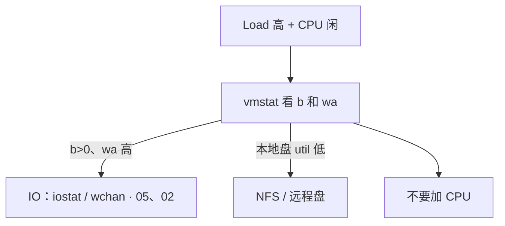
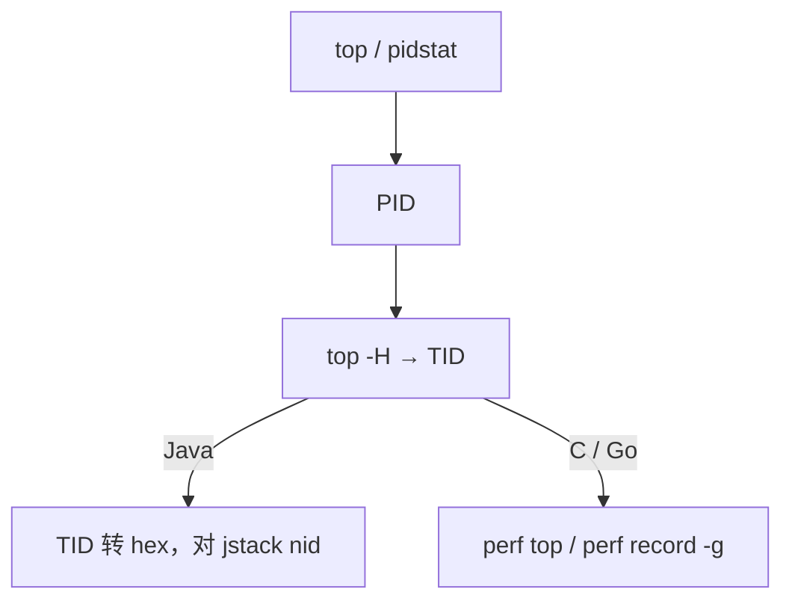
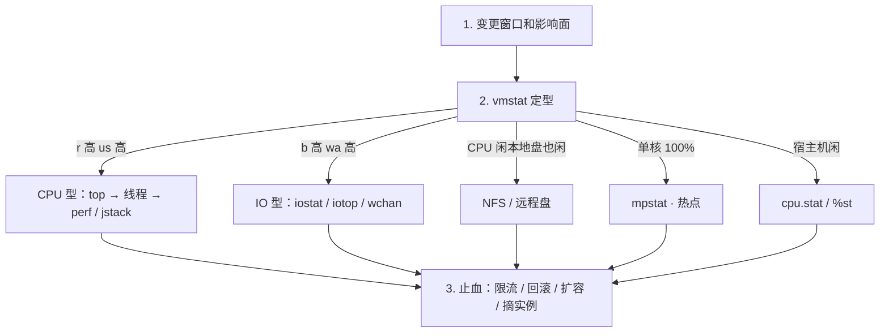

# 06｜CPU 与 Load · 练习题

开始做题前，先给大家一个小建议：合上知识点，对着**第一节的主图**，把「一个任务的一生」口述一遍——出生 → 排队 → 被执行 → 切换；再说清两把尺（Load 数排队、CPU% 数干活）和超载三形态。能顺下来，下面这些题你会发现大半都会了；卡壳的地方，就是你该回去重读的那一节。

做题的方式也建议改一下：每道题**先看标题和场景，自己口述一遍答案，再往下看「完整解答」对答案**。直接看解答，容易产生「我会了」的错觉——能讲出来才是真的会。

| 标记 | 含义 |
|------|------|
| **核心** | 不懂整章就没建立起来 |
| **必会** | 值班和面试都要能讲 |
| **常用** | 线上会反复碰到 |
| **常考** | 白板和追问的高频口径 |

题目的顺序也是有意排的：Q1 先把「高 Load 低 CPU」钉死；Q2～Q8 按格子与假象展开；Q9～Q14 收尾到定责综合。

## 本题目录

- [Q1 Load 高 CPU 闲](#q1)
- [Q2 定位到函数](#q2)
- [Q3 vmstat 字段](#q3)
- [Q4 容器 throttle](#q4)
- [Q5 %steal](#q5)
- [Q6 上下文切换](#q6)
- [Q7 Load 趋势与阈值](#q7)
- [Q8 软中断单核](#q8)
- [Q9 Load=30 三段排查](#q9)
- [Q10 火焰图何时上](#q10)
- [Q11 NUMA](#q11)
- [Q12 格子定责口述](#q12)
- [Q13 60 秒 CPU 定责剧本](#q13)
- [Q14 CPU/Load 白板综合题](#q14)
- [合上书](#合上书)

---

## Q1

**★★★★★｜Load 很高但 CPU 使用率不高，原因和排查？**

**覆盖**：核心 · 必会 · 常考

**对应**：知识点 [三、排队：load average 在数什么](知识点.md) · [九、作战：分型定责](知识点.md)

### 场景

8 核逻辑服机器 Load 到 40，`top` 里 idle 70%。有人已经在工单里写了「加 8 核」。游戏日志打在 NFS 上。

先自己试试：加核还是不加？第一刀敲什么？

### 完整解答

**一句话**：Load 含 D 状态，大量进程卡 IO 时 CPU 可以闲着——这是 IO 型不是算力不够。

Load 含 D。大量进程卡在磁盘 / NFS，CPU 闲着但队列很长。这不是算力不够。



```bash
uptime              # 对比核数；看 1m vs 15m
vmstat 1 5          # b>0 + wa 高 → IO；丢掉第一行
iostat -x 1 5       # await / aqu-sz
ps aux | awk '$8 ~ /D/'
```

游戏日志打到 NFS 挂死时，逻辑服全员 D，Load 上 50，CPU 5%。止血是修 NFS 或把日志改本地盘，不是加核。D 状态 `kill -9` 无效，见 [05](../05-进程与信号/)。

Load ≠ util。wa 是 CPU 视角；磁盘慢以 await 为准，不要用 %util 在 SSD 上结案（[08](../08-磁盘与IO/)）。

### 再追问

- D 能 kill -9 吗？——不能。等 IO 完成或走带外强制重启。见 05。
- 本地 iostat 很干净呢？——走知识点三节收束的第三种：NFS/远程盘，看 wchan。

---

## Q2

**★★★★★｜如何从 CPU 高定位到具体函数？**

**覆盖**：核心 · 必会 · 常用

**对应**：知识点 [四、被执行：一秒的账单切给谁](知识点.md)

### 场景

活动后整机 `%us` 80%。开发说「再观察一下」。你需要给出线程和函数，而不是「CPU 高」。

先自己试试：从整机 CPU 高怎么走到具体函数？四步链是什么？

### 完整解答

**一句话**：CPU 型才走 top→TID→perf/jstack；先 mpstat 排除单核热点再采函数。

已经确定是 CPU 型（`r` 高、不是 wa/b）才走这条链：



多线程均匀高：流量或缺少限流。单线程 100%：死循环、正则回溯、主循环。先 `mpstat -P ALL` 排除单核热点——整机 40% 但一核打满，扩核没用。

止血：限流、摘实例、扩容、回滚热点发布。根因要函数级。

### 再追问

- perf 需要什么？——多数环境要 root 和内核符号。容器里还要注意是否关掉 `perf_event`。没有 perf 至少能给到 TID + 栈。

---

## Q3

**★★★★★｜vmstat 里 r、b、cs、wa、st 看到什么要动手？**

**覆盖**：核心 · 必会 · 常用

**对应**：知识点 [八、定位：四把刀与读数](知识点.md)

### 场景

这是 Q1 结论的读数版——同一把刀，换成字段。
值班把 `vmstat 1` 贴进群。第一行 r=0、后面几行 r=20。有人说「r 是 0 没事」。

先自己试试：vmstat 第一行信不信？r/b/cs/wa/st 各看什么？

### 完整解答

**一句话**：vmstat 第一行是开机平均要丢掉；r>核数、b>0、wa>20%、st>10% 各指向不同出口。

**丢掉第一行**（开机平均）。后面几行才是现在：

| 字段 | 阈值直觉 | 含义 |
|------|----------|------|
| `r` 持续 > 核数 | CPU 排队 | 找热点线程 / 加核或拆负载 |
| `b` 持续 > 0 | D 在堆积 | 去 IO（[08](../08-磁盘与IO/)、[05](../05-进程与信号/)） |
| `cs` 数十万/s | 调度开销 | 线程过多或锁 |
| `wa` > 20% | 在等 IO | 交叉 iostat；CPU 打满时 wa 可被挤成 0 |
| `st` > 10% | 超卖 | 换机，别优化代码 |
| `si/so` 非 0 | 在换页 | 先当内存（[07](../07-内存与OOM/)） |

`in` 突增配合 `%si` 查网卡中断。

### 再追问

- wa 为 0 但磁盘很慢？——CPU 已经被算力打满时，没有 idle 可记到 wa。所以 wa 低不能证明盘快，要看 iostat await。%wa、await、%util 不是同一个数。

---

## Q4

**★★★★★｜容器 CPU 没用满，P99 却很高，怎么解释？**

**覆盖**：核心 · 必会 · 常考

**对应**：知识点 [七、被抢：steal、throttle 与频率](知识点.md)

### 场景

和 Q1「高 Load 低 CPU」不同，本题机器可以很闲，病在配额。
匹配服 limit=500m。宿主机 idle 70%，容器内 `%us` 也不打满。P99 从 30ms 跳到 400ms。`GOMAXPROCS=16`。

先自己试试：容器 CPU 40% 却抖，是不是 throttle？看哪条命令？

### 完整解答

**一句话**：cgroup throttle 把等待时间算进 wall clock，宿主机 idle 高、P99 仍可飙。

cgroup CFS throttle：周期内配额用完被踢出队列，请求 wall time 含等待。宿主机 idle 高、容器内 `%us` 也不一定打满。CFS 周期默认 100ms，500m = 每周期约 50ms 配额。突发跨过边界，P99 直接加上等待。

读 `cpu.stat` 的 `nr_throttled / nr_periods`。看增量，绝对值是累计。`> 5%` 且延迟涨当故障。`GOMAXPROCS`/GC 线程 > limit 核数会加重：16 个线程抢 0.5 核配额。`nproc` 在容器里返回宿主机核数。

短期加 limit；长期对齐并发度。延迟敏感服慎用过小 limit。

### 再追问

- 只设 request 不设 limit 行不行？——能避免 throttle，要防吵邻居：HPA + 节点水位。匹配/逻辑服常用这套。YAML 细节见 K8s 04，本章答到「throttle 看 cpu.stat、request 不是硬顶」即可。
- 这是 %st 吗？——不是。st 看 mpstat；throttle 看 cpu.stat。

---

## Q5

**★★★★☆｜%steal 是什么？什么时候换机器？**

**覆盖**：必会 · 常用 · 常考

**对应**：知识点 [七、被抢：steal、throttle 与频率](知识点.md)

### 场景

Q4 是 cgroup 层，本题是虚机层——两层别混。
云上逻辑服 P99 抖。`mpstat` 里 `%st` 持续 15%。有人要去调 JVM 参数。

先自己试试：%st 高怎么办？和 cgroup throttle 怎么分？

### 完整解答

**一句话**：%steal 是 hypervisor 抢 vCPU，持续 >10% 换机/迁宿，调代码解决不了。

Hypervisor 把你的 vCPU 时间给了别人。持续 **>10%** 且业务延迟涨，换规格、换独占、或找云厂商迁宿主机。自己优化代码解决不了 `st`。

同屏即使 `%idle` 看起来不低，也不能说「机器很闲所以应用没事」——被抢走的时间表现为毛刺。

### 再追问

- K8s 里 st 高是 throttle 吗？——不是。st 是虚机层；throttle 是 cgroup。一个看 mpstat `st`，一个看 `cpu.stat`。

---

## Q6

**★★★★☆｜上下文切换过高怎么查？**

**覆盖**：必会 · 常用

**对应**：知识点 [五、切换：上下文切换](知识点.md)

### 场景

网关 cs 每秒 30 万，延迟涨。线程模型是「一个连接一线程」。

先自己试试：cs 高该加核吗？cswch 和 nvcswch 谁是抢时间片？

### 完整解答

**一句话**：cs 数十万/s 且延迟涨要查线程模型；nvcswch 高是抢时间片，cswch 高是锁/IO。

```bash
vmstat 1                   # 先确认 cs
pidstat -w 1               # 谁在切：cswch 自愿 / nvcswch 非自愿
```

- `nvcswch` 高 = CPU 不够或线程太多，时间片被抢
- `cswch` 高 = 锁或 IO，自己让出 CPU

物理机每秒数万次常见；**持续 > 10 万/s 且延迟涨**要查。线程池按核数收敛，不要「有请求就 new Thread」。游戏网关一个连接一线程会把 cs 打爆，改 epoll / 协程模型（epoll 见 [12](../12-网络栈与Socket/)）。

### 再追问

- cs 高一定要加核吗？——不一定。线程过多时加核只是推迟。先把并发模型收敛到核数附近。

---

## Q7

**★★★☆☆｜Load 三个数怎么读趋势？Load=1 在 64 核上算高吗？**

**覆盖**：核心 · 常考

**对应**：知识点 [三、排队：load average 在数什么](知识点.md)

### 场景

告警规则写成「Load > 1」。64 核机器白天一直在响。

先自己试试：Load 对比谁？1m≫15m 说明什么？

### 完整解答

**一句话**：Load 对比核数，64 核上 Load=1 几乎不排队；1m >> 15m 说明正在变糟。

Load 对比**核数**，不要和绝对值 1 死磕。64 核上 Load=1 等于几乎没人排队。N 核满载大约 Load ≈ N；持续 **> 2N** 开始伤延迟。

趋势：

- `1m` 远大于 `15m`：正在变糟，优先止血
- `15m` 大、`1m` 小：在恢复，避免重复扩容

8 核 Load=8 是满载感。

### 再追问

- 1m 已经掉下来了还要不要扩？——看业务有没有恢复、根因清没清。只看 15m 还高就扩，容易扩完发现已经在回落。

---

## Q8

**★★★☆☆｜软中断打满单核怎么处理？**

**覆盖**：必会 · 常用

**对应**：知识点 [六、热点：单核打满与软中断](知识点.md)

### 场景

就是开头那类「整机不忙却慢」的网关版。
网关整机 CPU 30%，但 CPU0 `%si` 100%，开始丢包。扩了两台网关，CPU0 照样满。

先自己试试：单核 %si 满，扩副本有用吗？下一刀看什么？

### 完整解答

**一句话**：单核 %si=100% 是网卡软中断打满，开 RSS/RPS，扩副本解决不了单核 si。

网卡中断全打在 CPU0 → `ksoftirqd/0` `%si` 100%。开 RSS 多队列 / RPS 打散。`mpstat -P ALL` 看 `%si`/`%soft` 集中核，`/proc/interrupts` 确认网卡队列。业务扩容解决不了单核 `si`——包还是进同一块网卡的同一条队列。把逻辑主循环绑到非 0 核，避免和 `ksoftirqd/0` 叠在一起。`nice` 救不了已经打满的核。

和 [12](../12-网络栈与Socket/) 边界：`%si` 打满定责在本章；LISTEN/Recv-Q/conntrack 定责在 06。若 `%si` 正常但 ESTAB Recv-Q 涨 → 应用没 read。

### 再追问

- irqbalance 关掉会怎样？——IRQ 容易重新堆回 CPU0。云主机多队列开了也要确认没有人为把 affinity 钉死。

---

## Q9

**★★★★☆｜8 核 Load=30，接口超时，完整三段一遍排查。**

**覆盖**：核心 · 必会 · 常用

**对应**：知识点 [九、作战：分型定责](知识点.md)

### 场景

把 Q1～Q8 的刀收成三段剧本。
开场题：「这台机器 Load=30，你怎么查？」不要直接说 perf。

先自己试试：Load=30 三段排查口诀能背出来吗？

### 完整解答

**一句话**：Load=30 先 vmstat 分型：CPU 型才 perf，IO 型走 iostat/wchan，不要先加核。



先分型再选工具。卡错型，后面全是浪费。60 秒剧本见知识点九节。

### 再追问

- wa 高但 iostat %util 都低？——远程存储 / NFS，iostat 只覆盖本地块设备。看 stack/wchan 和网络 RTT。

---

## Q10

**★★★☆☆｜火焰图什么时候上，什么时候不上？**

**覆盖**：常用 · 常考

**对应**：知识点 [四、被执行：一秒的账单切给谁](知识点.md)

### 场景

有人一上来就要 `perf record` 30 分钟。机器 `%wa` 已经 40%。

先自己试试：什么时候上火焰图？什么时候绝对不上？

### 完整解答

**一句话**：火焰图只在 CPU 型、需要函数占比时用，IO 型/wa 高时做 perf 是浪费时间。

已经确定是 CPU 型、需要函数占比时上。采样 **10–30s** 足够。

不上的时候：IO 型、throttle、丢包（先查 si）、steal——先把型分对。wa 高时做 perf 会浪费时间还可能加重负载。

### 再追问

- 没有 perf 怎么办？——Java 至少 jstack；Go 至少 pprof；C 至少 `top -H` 给到 TID。不要卡在「没火焰图就不能答」。

---

## Q11

**★★★☆☆｜多路机器延迟毛刺要不要绑 NUMA？**

**覆盖**：常用 · 常考

**对应**：知识点 [八、定位：四把刀与读数](知识点.md)

### 场景

物理机 2 路，战斗服 P99 偶发抖。有人建议全机 `numactl --cpunodebind=0`。

先自己试试：NUMA 什么时候才绑？单 node 云主机绑了有用吗？

### 完整解答

**一句话**：NUMA 绑核先看拓扑和 numastat remote，单 node 云主机绑了没收益。

先 `numactl --hardware`。单 node 的云主机绑了也没收益。多 node 且 `numastat -p PID` 大量 remote，再把延迟敏感进程绑在一个 node（`--cpunodebind=0 --membind=0`）。绑核不是默认动作。

### 再追问

- 绑错 node 会怎样？——内存还在另一边，remote 访问更多，毛刺更差。先看拓扑和 numastat，再绑。

---

## Q12

**★★★★★｜对着 mpstat 一屏，口述格子定责。**

**覆盖**：核心 · 必会 · 常考

**对应**：知识点 [四、被执行：一秒的账单切给谁](知识点.md) · [六、热点：单核打满与软中断](知识点.md)

### 场景

面试官贴出：

```text
CPU   %usr  %sys  %iowait  %soft  %steal  %idle
all   38.2   2.1     0.5    1.0     0.0    58.2
  0    5.0   1.0     0.0   94.0     0.0     0.0
  3   99.2   0.8     0.0    0.0     0.0     0.0
```

问：你怎么定责？要不要加核？

先自己试试：us/sy/si/wa/st/id 下一刀各去哪？

### 完整解答

**一句话**：整机平均骗人；CPU3 是用户态热点，CPU0 是软中断打满——两条问题，都不是「整机加核」一招解决。

读法：

1. `all 38%`：**不能**说还有余量。
2. `CPU3 %usr=99`：热点型——找 TID/函数，扩整机核常不拆主循环。
3. `CPU0 %soft=94`：软中断型——查 interrupts / RSS，扩业务副本治不了。
4. `%steal=0`、`%iowait` 不高：本屏不是 st/IO 主因。

两核问题可以同时存在：网关收包堆 0 号核，业务主循环钉在 3 号核。定责要分开说，工具链不同（四节 vs 六节）。

### 再追问

- 若 all 的 `%steal=12`？——先当虚机超卖，换机/迁宿，别和单核 us 热点混成「加核」。

---

## Q13

**★★★★☆｜值班 60 秒：Load 告警来了，命令序怎么走？**

**覆盖**：必会 · 常用 ｜ **对应**：知识点 [九、作战：分型定责](知识点.md)

### 场景

Grafana Load>核数×2 告警，节点平均 CPU 40%。有人提议 HPA 加副本。

先自己试试：60 秒 CPU 定责剧本四步能默敲吗？

### 完整解答

> 🎯 **一句话**：**uptime 拿尺 → vmstat 分型 → mpstat 找单核 → 再决定加核/修 IO/修 throttle**。

```bash
uptime && nproc
vmstat 1 3          # 丢第一行：r/b/wa
mpstat -P ALL 1 3   # 单核 us/si/st
```

| 分型 | 别做 | 去做 |
|------|------|------|
| IO 型 b↑ wa↑ | 加核 | iostat → 08 |
| 热点 us 单核 | 盲目加整机核 | top -H / perf → 02 |
| %si 单核满 | 扩业务副本 | RSS/多队列 → 12 |
| %st 高 | 调应用 | 找云厂商 |

### 再追问

- Load 高但全是 D？——先解 IO，不是 CPU 章（→ 05/08）。

---

## Q14

**★★★★★｜白板：任务一生六格 + 超载三形态 + mpstat 定责口诀？**

**覆盖**：核心 · 必会 · 常考 ｜ **对应**：知识点 [一、一张图](知识点.md) · [十、收口](知识点.md)

### 场景

这张白板把前面十四道题串起来了。
白板 90 秒：「Load 和 CPU% 两把尺，画主图并说三种超载出口。」

先自己试试：不看下面，你能默画主图 + 超载三形态出口吗？

### 完整解答

> 🎯 **一句话**：**Load 数 R+D 排队长度；CPU% 数一秒账单**——六格 us/sy/wa/si/st/id，三出口 CPU热点/IO等待/被偷或throttle。

```text
出生(入队) → 排队(Load) → 执行(%) → 切换(cs) → 热点(单核) → 被抢(st/throttle)
口诀：整机平均骗人，单核 us/si/st 各说各话（Q12）
```

> 📝 **面试**：高 Load 低 CPU 先查 D 和 b 列，别加核。

### 再追问

- 火焰图何时上？——CPU 型且热点在用户态，且已锁到 TID（Q10）。

---

## 合上书

14 道题做完了，回到这个清单自查一遍——每条都能讲顺，这章才算真的拿下了。注意每条后面标注的题号：卡住时别硬扛，回到那道题的场景再听一遍：

- [ ] **默画主图**：出生 → 排队 → 被执行 → 切换；两条出事岔路；Load 照哪段、CPU% 照哪段（→ 知识点「一、一张图」；Q14）。
- [ ] **口述两把尺**：Load 数什么、对比谁、`1m >> 15m` 说明什么、高 Load 低 CPU 为什么先查 D 不加核（→「三、排队」；Q1、Q7）。
- [ ] **默画超载三形态**：CPU 饱和 / IO 等待 / D 堆积各看什么字段、各走哪条出口（→「三、排队」；Q1、Q9）。
- [ ] **口述格子定责**：us / sy / si / wa / st / id 下一刀各去哪；wa=0 为什么不能证明盘快（→「四、被执行」；Q12）。
- [ ] **口述到函数的链**：mpstat → pidstat → top -H → TID；什么时候不上火焰图（→「六、热点」·「八、定位」；Q2、Q10）。
- [ ] **口述切换**：cswch 与 nvcswch；cs 多少才当故障；一连接一线程为什么死（→「五、切换」；Q6）。
- [ ] **口述热点与软中断**：整机平均为什么骗人；单核 %si 打满扩副本有没有用（→「六、热点」；Q8）。
- [ ] **口述被抢**：%st 和 throttle 怎么分；GOMAXPROCS 为什么要对齐 limit（→「七、被抢」；Q4、Q5）。
- [ ] **定责**：对着 mpstat 一屏逐条说结论；vmstat 第一行为什么丢掉；60 秒剧本（→「八、定位」·「九、作战」；Q3、Q11、Q13）。
- [ ] **白板综合**（Q14）

全部打勾之后，给自己出一个终极测试：找一位同事，用十分钟把「两把尺 + 超载三形态」讲一遍。讲得下来，你就是下一个能拦下「加 8 核」工单的人。
