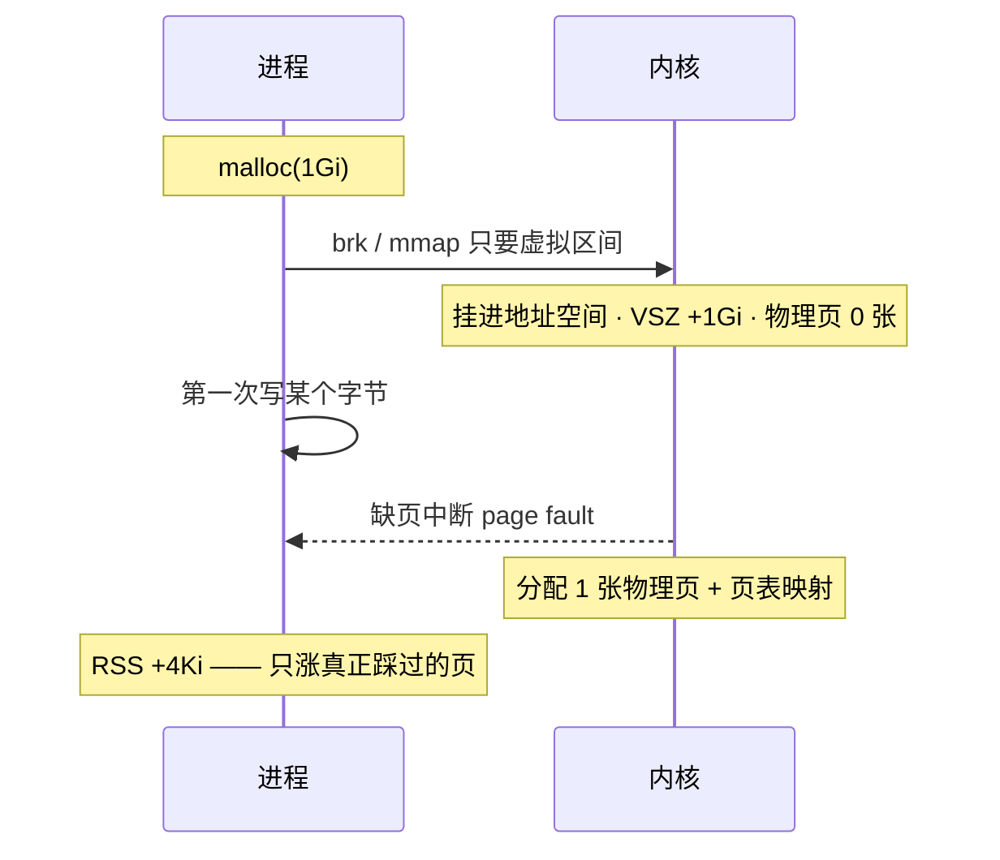
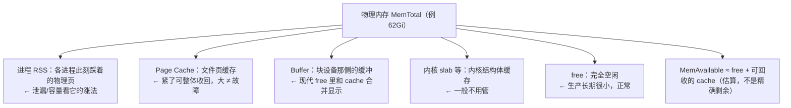
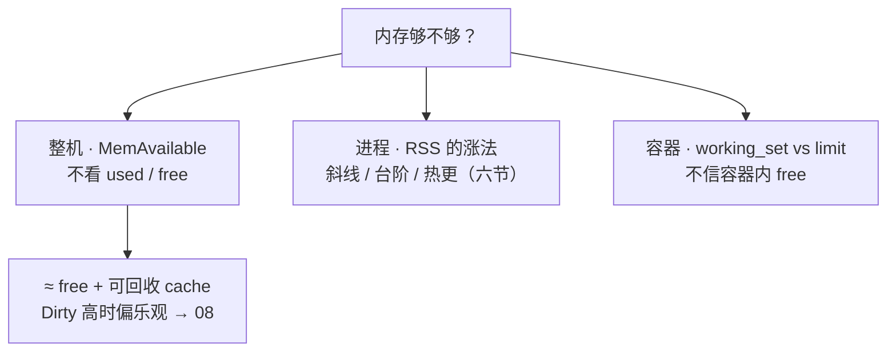
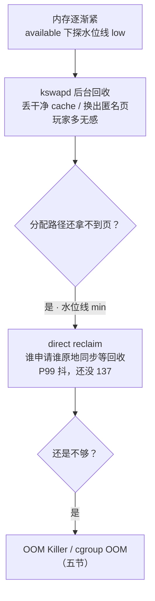
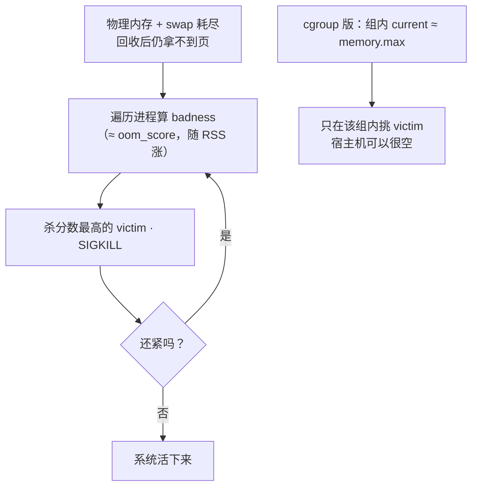
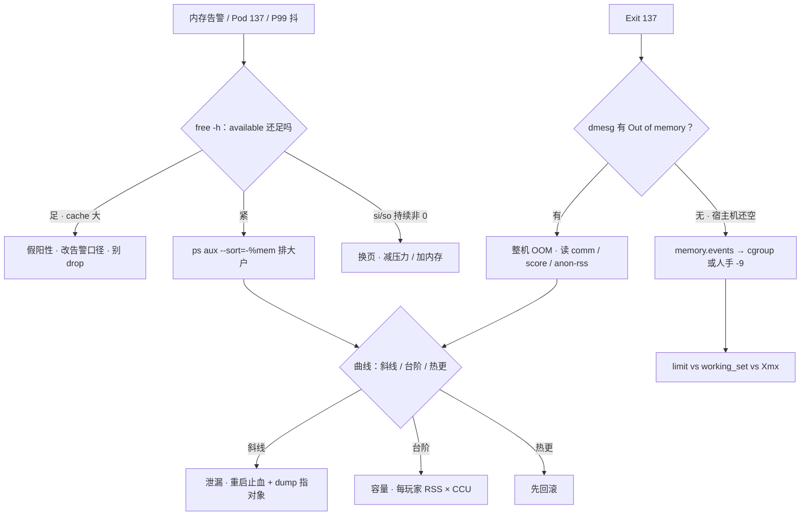

# 内存与 OOM

> 大家好，欢迎来到这次分享。开讲之前，先带大家回到一个很多值班同学都经历过的现场：
> 凌晨告警「内存 90%」，群里已经在写加机器工单；十分钟后一个 Pod Exit 137，宿主机 `free` 明明还剩 20G——两边吵的根本不是同一本账。
> 这一章讲完，你会知道两边吵的不是同一本账，以及 137 该查 dmesg 还是 memory.events。
> **本章回答**：一页内存从进程申请、缺页入账，到回收、换页、被 OOM 击杀的一生；够不够看哪列、137 是谁杀的、该加 limit 还是先回滚。
> **不讲**：容器里 free 为什么是宿主机的账 → [04](../04-内核与系统/)；SIGKILL 与 137 的信号语义、fork ENOMEM → [05](../05-进程与信号/)；vmstat 全景与 Load → [06](../06-CPU与Load/)；脏页/writeback/盘慢卡回收 → [08](../08-磁盘与IO/)；文件与 inode 层 → [09](../09-文件系统与inode/)；cgroup 文件路径、v1/v2、PSI → [10](../10-cgroup与容器/)；QoS YAML → [03-04](../../03-Kubernetes/04-Pod生命周期/)。这些都有专门的章节，本章只在用到时点到为止。

**标记**：🎯重点 · 🔥难点 · ⭐常考 · 🔧实操

**怎么听这场分享**：咱们先看第一节的主图，把「一页内存的一生」装进脑子；第二到第五节顺着申请 → 入账 → 紧张 → 击杀往下走；第六节专门讲复盘定责，也就是开头那个现场的正确解法。每一节讲完都会提示对应练习题，学完就去练。

---

## 一、一张图：一页内存的一生

> 🎯 **一句话**：内存问题先问「这页内存走到哪一段了」——申请、入账、紧张、击杀、复盘，五段的处方互不通用。

咱们先不急着背 free 的列名。学内存最怕的就是看见 used 90% 就写加机器——连「够不够看哪一列」都没问。先看图，把五段处方分清楚：


**读图**：带着三个问题看这张图，比背名词有用得多：

- 主线是一页内存的一生：进程先拿到的只是**虚拟承诺**（申请），第一次写才触发缺页、真正占上物理页（入账），系统紧了先回收再换页（紧张），都救不回来就有人被杀（击杀），最后按曲线形态和证据定责（复盘）。
- `free` / 监控照的是「入账」段，`vmstat` 照「紧张」段，`dmesg` / `memory.events` 照「击杀」段——工具跟着阶段走，别一把梭。
- used 90%、Pod 137、P99 抖三种告警，分别落在入账、击杀、紧张三段，本章后面每节认领一段。

好，主图有了。咱们正式出发——第一站：进程申请内存时，内核到底给了什么。

---

## 二、申请：malloc、虚拟内存与缺页中断 🎯🔥

> 🎯 **一句话**：malloc 拿到的只是**虚拟地址**，第一次写触发缺页中断才真占物理页——VSZ 是承诺，RSS 是实付。

### 虚拟内存：地址是规划，物理页是现房 ⭐🔥

🔥 很多人会答「malloc 成功就是占了内存」——**错了**。⭐ 这是高频错答。

**虚拟内存（virtual memory）** 大白话拆开：**给你的是门牌号（虚拟地址），不是现房（物理页）**。正式说法：每个进程自己的一整段地址空间（64 位下极大），配上内核的一张**页表（page table）**，把虚拟页号翻译成物理页框号；物理内存 4KB 一页（x86），按页分发。好处：进程之间地址隔离、可以 mmap 比物理内存还大的文件、共享库只放一份物理页映射进多个进程、还能超售——承诺出去的总量大于真实库存。口诀：**「VSZ 是承诺，RSS 是实付」**（练习题 Q11）。

> 💡 **打个比方**：虚拟地址空间像售楼处的**期房号**，`malloc` 只是给你登记了个门牌号，一片砖都没动；缺页中断才是**交房**那一刻——你真搬进去住了（写了），水泥（物理页）才花在你身上。

申请的底层路径（面试口径）：

```text
malloc 小块 → brk 扩堆顶         ← 堆区往上长一点
malloc 大块 → mmap 独立区间       ← 单独一块虚拟区间（阈值默认 128KB，动态调整）
返回的都只是「虚拟地址区间」：VSZ 涨、物理页一张没花
```

### 缺页中断：第一次写才给页 🔥

**缺页中断（page fault）** = CPU 访问的虚拟地址还没有映射到物理页，触发异常陷入内核，内核补一张物理页、建好页表映射再返回，程序毫无感知继续跑。这套「先给虚拟区间、等真访问了再补物理页」的机制就是**请求调页（demand paging，按需分页）**——虚拟内存能超售、能 mmap 大文件，全靠它兜底。两种：

- **次要缺页 minor fault**：页就在内存里，只补映射（如共享库第一次映射进来、写时复制页）。
- **主要缺页 major fault**：数据在盘上，要从文件或 swap 里读进来——要打盘，慢几个数量级，抖动信号之一。



**读图**：`malloc` 和「占内存」是两件事——中间隔着缺页。这就是「VSZ 12G、RSS 2G」的机制根源：进程 mmap 了 4Gi 文件只读了 64Mi，VSZ +4Gi、RSS 只 +64Mi。盯 VSZ 喊「吃了 4G」是错的。

**写时复制（copy-on-write，COW）**：`fork` 后父子共享同一批物理页，谁先写谁触发缺页、内核复制一份——所以 fork 不立刻翻倍内存（信号与进程细节 → [05](../05-进程与信号/)）。

> 🔍 **现场**：看一个进程的缺页账和虚拟/物理占用：

```bash
ps -o pid,vsz,rss,min_flt,maj_flt,comm -p {PID}
#   PID    VSZ   RSS  MINFLT  MAJFLT COMMAND
# 28451 12000000 2096128 182034   1207 java
#        ↑虚拟12G  ↑物理2Gi  ↑次要缺页 ↑主要缺页>0 且在涨 = 在打盘
cat /proc/{PID}/status | grep -E 'VmSize|VmRSS|VmSwap'
```

### overcommit：承诺能不能超卖 ⭐

**overcommit（超售）** = 内核允不允许「承诺出去的虚拟内存总量 > 物理内存」，`vm.overcommit_memory` 三档：

- **0（默认，启发式）**：明显离谱的申请拒绝，合理的放行——逻辑服保持默认即可。
- **1（总是允许）**：怎么 malloc 都成功，直到**真写爆**那一刻才 OOM——失败更晚、更突然，排障更难；别为了救一次 fork 失败就全局改 1。
- **2（严格不超）**：按 `overcommit_ratio` 公式硬限承诺总量，特殊场景用。

> ⚠️ **别混**：overcommit 管「整机承诺要不要超卖」，**救不了已经贴住的 `memory.max`**——cgroup 的 limit 是另一道闸，fork 在 cgroup 里报 ENOMEM 时改 overcommit 无效（[05](../05-进程与信号/)）。

### 内存溢出 vs 内存泄漏 🎯⭐

**OOM 全称 Out Of Memory（内存溢出）**：申请内存时**真的没有**了，整机由 OOM Killer 收场（五节），JVM 里则抛 `OutOfMemoryError`。

> ⚠️ **别混**：**内存泄漏（memory leak）≠ 内存溢出（OOM）**。泄漏是「申请了不还」——**病因**，曲线是斜线涨；溢出是「要的时候没有」——**结局**，症状是 OOM/137。泄漏是溢出的常见原因之一，但台阶型容量打满、热更打满同样能溢出——把 137 一律叫「内存泄漏」是面试减分项。

> 📝 **面试**：问「什么是虚拟内存/为什么需要」——答「每个进程独立地址空间 + 页表翻译，换来隔离、大文件 mmap、共享库单份物理页、按需分配」；问「malloc 之后内存就占了吗」——答「没有，只有虚拟区间；第一次写触发缺页中断才给物理页，VSZ 与 RSS 差在这」。

---

这一节对应练习题 Q11、Q12——申请与超售，学完直接去练。

虚拟承诺讲清了。大家想想：监控喊「内存 90%」，到底该看哪一列？很多人盯 used——咱们看看错在哪。

## 三、入账：账本、RSS 与 available 🎯⭐🔧

> 🎯 **一句话**：物理页切给谁看 `free -h` 的账本，够不够**只看 available**；进程看 RSS，容器看 working_set 对 limit。

### 一张账本：物理内存怎么切 ⭐



> 💡 **打个比方**：Page Cache 是**仓库里的公共货架**——放的是大家读过的文件，谁要新货架（新分配），管理员先把货架上的旧货清掉就行。所以「货架占满了」不等于「仓库满了」——available 才是「清完货架还能腾多少」。

> ⚠️ **别混**：**buffer vs cache**——Buffers 关联**块设备**（元数据/块 IO 缓冲），Cached 关联**文件内容页（Page Cache）**；现代 `free -h` 合成 `buff/cache` 一列，值班不拆、决策不靠它，面试能提一句区别即可。真正要拆细看时用 `/proc/meminfo` 的 `Buffers` / `Cached` 两行。

### free -h：先读 available 再决定要不要慌 🔧⭐

> 🔍 **现场**：监控弹「used 90%」，别急着写加机器工单：

```bash
free -h
```

```text
              total        used        free      shared  buff/cache   available
Mem:           62Gi        58Gi       512Mi       1.0Gi        8.2Gi        6.1Gi
Swap:             0B          0B          0B
#                ↑粗算吓人     ↑小=常态      ↑公共页   ↑在干活      ↑够不够只看这列：≈10% → 边缘
```

口算习惯（经验尺，不是内核硬阈值，要结合延迟与是否换页）：

```text
MemAvailable / MemTotal
  > 20%  → 通常别为了 used% 扩容
  ~10%   → 盯大户与趋势
  < 5%   → 按故障窗口处理，防 OOM / 换页
```

交叉细项：

```bash
grep -E 'MemTotal|MemFree|MemAvailable|Cached|Buffers|Dirty|SReclaimable|Swap' /proc/meminfo
# Dirty 持续很高 → 回收前必须先 writeback，available 会偏乐观 → [08](../08-磁盘与IO/)
```

used 高常常只是 cache 在干活：应用读过的文件页留在 Page Cache → free 变小、buff/cache 变大 → used% 好看不了——**新进程要内存时内核收回干净 cache 页就行**，available 反映的就是「还能挤出多少」。所以「used 90% 加机器」「cache 占 80% 该清」都是假阳性处置。

### 走读三台机器 🔧⭐

> 🔍 **现场**：同样弹「内存告警」，三台机器三本账，各走各的出口——练的就是先分账再动手。

```text
机器 A：日志服 · 告警 used 92%
              total   used   free   buff/cache   available
Mem:          62Gi   57Gi   400Mi        9.5Gi        7.0Gi
→ available >10%，buff/cache 大：读日志的 cache 在干活，假阳性，改告警口径，别动机器。

机器 B：战斗服节点 · Pod Exit 137，宿主机 free -h 剩 20G
→ 宿主机账很健康，问题在 Pod 自己的 cgroup：memory.current 顶到 memory.max，
  events 里 oom_kill>0 —— cgroup OOM，去对 limit vs working_set vs Xmx，不看宿主机。

机器 C：混部节点 · available 3%（<2G），接口开始抖
→ 真紧。vmstat 看 si/so 是否换页；ps aux --sort=-%mem 排大户；
  紧接着 dmesg 出现 Out of memory 就是整机 OOM 前夜——按故障窗口处理，别等 137。
```

**读图（读账）**：同一句「内存告警」，A 是 cache 假阳性、B 是 cgroup 账、C 是整机账——**先确认「告警照的是哪本账」，再选工具**。三台机器对应的分别是：什么都不做、对 limit、抢在击杀前减压。

### RSS / VSZ / working_set：三个口径 🎯⭐

| 对比 | **VSZ** | **RSS** |
|------|---------|---------|
| 是什么 | 虚拟地址空间总量 | 此刻真正映射到物理页的部分 |
| 含没碰过的映射吗 | **含**（mmap 大文件、malloc 未写都撑它） | 不含，只算踩过的 |
| 共享库 | 计入一次 | **多进程各重复计一份**，加总会虚高 |
| 值班用途 | **别当占用报数** | 泄漏/容量看它的**涨法** |

**working_set**（`container_memory_working_set_bytes`）= cgroup 视角「不能立刻回收就走人」的占用近似，**容器内存告警唯一该对的口径**：working_set vs limit，**80% 告警**。监控里 working_set 已 90% limit 而容器内 `ps` RSS 只有 60%——**信 working_set**：它含不可立刻回收的 cache 等部分，口径就是为撞 limit 设计的。

> ⚠️ **别混**：**容器内 `free` / `ps` vs working_set**——容器里的 `free -h` 读的常是**宿主机的 meminfo**（根因 → [04](../04-内核与系统/)），拿它证明「Pod 还很空」无效；定责只对 working_set vs limit（或 cgroup `memory.current` vs `memory.max`，文件口径 → [10](../10-cgroup与容器/)）。

**PSS 一句**：把共享页按共享进程数均摊后单进程「真实占用」，`/proc/<PID>/smaps_rollup` 里有 `Pss`——要精确比较多进程共享库占用时用，日常定责 RSS 够用。

> ⚠️ **别混**：**free 列 vs available**——free 是「此刻完全空闲」，available 是「回收后还能给新分配的估算」；free 很小是生产常态（内存闲着才是浪费），决策永远看 available。也别把 Cached 和各进程 RSS **加总**当「应用吃了多少」——文件页在两边重复计数。

### 收束：内存够不够，三本账各看一列 🎯⭐



**读图**：三个问题三个口径——问**机器**还剩多少看 MemAvailable；问**这个进程**是不是有问题看 RSS 曲线形态；问**这个 Pod** 会不会 137 看 working_set 对 limit。每本账只答自己那题，拿整机 available 去判容器死活、拿 VSZ 去报占用，都是串了账。

> ⚠️ **别混**：这个口径**不保证**精确——available 是估算值，脏页多时偏乐观；RSS 含重复计的共享页；working_set 是近似。它们是用来**定责和定告警**的，不是审计报表。

> 📝 **面试**：背法「**整机一台（available）、进程一线（RSS 曲线）、容器一对（working_set vs limit）**」；再补一句「used 高先看 available，free 小 cache 大是健康常态，绝不生产 drop_caches」，就是完整口径。

这一节对应练习题 Q1、Q9、Q11——账本三列，务必练熟。

---

入账认清了。还没 OOM，接口却开始抖——病在「紧张」这一段。

## 四、紧张：回收、换页与毛刺 🎯🔥

> 🎯 **一句话**：还没被杀不等于没事——kswapd 悄悄回收是常态，direct reclaim 同步等回收就是 P99 抖，si/so 持续非 0 就是故障。

### 回收三级：kswapd → direct reclaim → OOM 🔥

物理内存紧张时，内核按**水位线（watermark）**分三级处置；页挂在文件页/匿名页各自的 **active/inactive LRU 链**上，回收从 inactive 尾巴挑（干净文件页直接丢、脏页先写回、匿名页换出到 swap）：



**读图**：从哪进——available 跌破约 10% 后越紧越往下走；往哪查——「接口偶发卡 + CPU 不忙 + available 紧 + si/so 或 Dirty 高」就是站在 D 那一格，先减内存压力，**别干等 Exit 137**。

> 💡 **打个比方**：kswapd 是**保洁下班后慢慢理货架**，生意照做；direct reclaim 是**客人结账时才被拉去理货架**——客人（业务线程）原地干等，这单就慢了（P99 抖）。

> ⚠️ **别混**：**kswapd vs direct reclaim**——前者是后台内核线程异步回收，无感；后者发生在分配路径上**同步等**，业务直接吃延迟。两者都是「紧张」，后者已经是病。

### Swap：用了就是紧 ⭐🔧

**swap** = 把不活跃的匿名页换到盘上腾内存。`vmstat` 的 **si/so**（swap in/out）是判据：

```bash
vmstat 1 5      # 第一行是开机平均，丢掉
```

```text
procs -----------memory---------- ---swap--
 r  b   swpd   free   buff  cache   si   so
 2  0 2097152  ...                  12   48
#                              ↑si 换入  ↑so 换出 —— 持续非 0 = 正在换页
```

- **Swap used>0 但 si/so≈0**：曾经换过，此刻不抖，先观察。
- **si/so 持续非 0**：正在打盘换页，P99 毛刺——游戏服**当故障**，不是「还有 Swap 余量还能撑」。
- **`vm.swappiness` 过高**：还有 cache 可回收就开始换匿名页，表现为「内存看起来够但延迟抖」。

落地：游戏逻辑服/战斗服常见**关 Swap 或 `vm.swappiness=0`**，宁可 OOM 快速失败 + 扩容，不要静默变慢；代价是没缓冲、OOM 来得更快——前提是 limit 和监控到位。**看 si/so，不看「Swap 还剩多少」**（vmstat 全景与 Load → [06](../06-CPU与Load/)）。

### THP：延迟毛刺 🔥

**THP（Transparent Huge Pages，透明大页）** = 内核自动把 4KB 小页合并成 2MB 大页，减少页表开销；但 khugepaged 合并、压缩、回收大页都可能**卡一下**，延迟敏感服务偶发 100ms+ 毛刺常是它。

```bash
cat /sys/kernel/mm/transparent_hugepage/enabled
# always [madvise] never      ← 方括号里的 madvise 是当前生效值
```

Redis、帧同步、延迟敏感服务建议 `never` 或 `madvise`；一般业务按实测，别无脑 `always`。

### drop_caches：生产禁止日常 ⭐

```bash
echo 3 > /proc/sys/vm/drop_caches   # 仅 IO 基线测试 / 实验室用
```

cache 占 80% 不是清它的理由：drop 之后 available 一时升高，随后的读请求**重新填 cache 并且打盘**——自己制造读盘风暴；脏页更不能靠 drop 丢掉，得先 writeback。日常腾内存靠治理 RSS / limit，不靠 drop。

> 📝 **面试**：「Swap 有 used 且 si/so 持续就是在换页，游戏服当故障；overcommit 默认 0 别乱改；THP 给延迟敏感的 never；drop_caches 生产禁止日常」——四句是一组，常连着问。

这一节对应练习题 Q7、Q8——换页与 drop_caches。

---

回收救不回来，就有人被杀。开头那个 Exit 137、宿主机还剩 20G 的现场，根因就在两条杀法。

## 五、击杀：OOM Killer 与两条杀法 🎯🔥

> 🎯 **一句话**：137 先分清是谁的手——dmesg 有 Out of memory 是整机杀，宿主机空 + Pod 137 是 cgroup 杀。

**137 = 128 + 9 = SIGKILL**（信号语义 → [05](../05-进程与信号/)），OOM Killer 发的就是它，**没有优雅退出**；人手 `kill -9` 也是 137——所以「137 一定是 OOM」是错的，要靠证据分。

### 整机 OOM Killer：按分数挑 victim 🔥⭐

大家想想：137 了，宿主机 free 还剩 20G，是不是「不可能是 OOM」？很多人会答「那就不是内存问题」——**错了**，还有 cgroup 那条杀法。

**OOM Killer** = 物理内存（和允许的 swap）耗尽、回收仍拿不到页时，内核挑一个进程发 SIGKILL，腾页让系统活下去。被打分挑中的那个进程叫 **victim**，分数就是 **oom_score**——直觉是**谁占的可杀内存多、谁分高，谁先被点**；分高 ≠ 泄漏，只说明占得多。



**读图**：整机版从「全机耗尽」进，victim 按 oom_score 排；cgroup 版从「组内到顶」进，**根本轮不到选邻居**——只杀自己这个组。两条路可以同时发生：节点在杀 BestEffort，同时另一个 Pod 自己撞 limit。

> 🔍 **现场**：整机杀留下铁证，dmesg 这几项逐个读：

```bash
dmesg -T | grep -iE 'oom|killed process'
```

```text
[Thu Aug 28 03:12:01 2026] Out of memory: Kill process 12345 (java) score 987 or sacrifice child
[Thu Aug 28 03:12:01 2026] Killed process 12345 (java) total-vm:12000000kB, anon-rss:2096128kB
#                                        ↑被杀进程             ↑oom_score 高=占得多  ↑匿名页≈2Gi，堆嫌疑
```

`total-vm` 是 VSZ 量级（别当 RSS 读），`anon-rss`/`file-rss` 区分匿名页（堆）与文件页——匿名大更像堆问题。

### oom_score_adj：保护谁、别保护谁 ⭐

`/proc/<PID>/oom_score` 是内核算的分；`/proc/<PID>/oom_score_adj`（**-1000～1000**）是人为修正：**-1000 完全豁免**，正值更容易被点。

- 该保护的是 **sshd / kubelet / node 组件**：`OOMScoreAdjust=-500`～`-900`（systemd 单元里写）。
- **禁止给业务 -1000**：把该被杀的大户豁免掉，内存耗尽时整机 hung，sshd 都救不了——业务被杀好过节点假死。

> ⚠️ **别混**：**oom_score vs oom_score_adj**——前者是内核现算的「好杀程度」（读它预判谁会被点），后者是你写的修正项（-1000 豁免）；「给 adj 设 -1000」不是「把 score 清零」，是把这个进程从候选名单划掉。

### min_free_kbytes：整机 OOM 前的最后一道垫 ⭐

内核给紧急分配保留的内存水位（`/proc/sys/vm/min_free_kbytes`，单位 KB）。**设得太小**：内存吃紧时还没轮到 kswapd 回收，分配路径已经拿不到页——整机 OOM 来得毫无征兆，甚至 panic；**盲目调大**：直接白扣一块谁也用不了的内存。默认值发行版给得很保守，大内存机器上「没怎么用就整机 OOM / 网卡收包报 alloc 失败」才动它，配合 `watermark_scale_factor` 拉大水位间距、让 kswapd 更早开工（两个参数的完整语义 → [24](../24-内核参数与sysctl/)），调完看 `/proc/zoneinfo` 各 zone 的 min/high 水位是不是拉开了。

> 📝 **面试**：「min_free_kbytes 是紧急保留垫：太小会无征兆整机 OOM，太大白扣内存；要和 watermark_scale_factor 配合调，验证看 /proc/zoneinfo 的水位间距。」

### 两条杀法对照 🎯⭐🔥

⭐ 口诀记一句：**「dmesg 有 Out of memory = 整机；无且宿主机空 → 看 memory.events = cgroup」**（练习题 Q2、Q3）。

| 对比 | **整机 OOM** | **cgroup OOM** |
|------|--------------|----------------|
| 触发 | 物理内存 + swap 耗尽，分配失败要杀人腾页 | 组内 `memory.max` 到顶 |
| 宿主机还能空吗 | **否**（available 见底） | **可以**（只杀这一组） |
| 证据 | `dmesg` / `journalctl -k` 有 Out of memory | `memory.events` 的 `oom_kill`；K8s Reason: OOMKilled |
| 选谁 | oom_score 挑全机 victim；K8s 节点再叠 QoS | **不选邻居**，就杀超标这个组 |
| 第一刀 | `ps` 排大户 + 看曲线形态 | limit vs working_set vs Xmx |

cgroup 侧读法（路径随 v1/v2/运行时而变，概念如下；文件口径 → [10](../10-cgroup与容器/)）：

```bash
cat /sys/fs/cgroup/.../memory.current /sys/fs/cgroup/.../memory.max /sys/fs/cgroup/.../memory.events
kubectl describe pod {name} | grep -A5 -i oom
```

```text
2097152000        # ← memory.current ≈ 2Gi
2147483648        # ← memory.max = 2Gi（就是 limit）
oom 3
oom_kill 1        # ← oom_kill > 0 = cgroup OOM 实锤
Last State: Terminated  Reason: OOMKilled  Exit Code: 137
```

人手 `kill -9` 的第三种 137：dmesg 无 OOM 行、events 无 oom_kill——去查操作记录和 K8s 事件/审计。

> ⚠️ **别混**：**整机 OOM（看 dmesg）vs cgroup OOM（看 events）**是本章最高频混答点；还有第三层——**K8s 节点级 QoS 选杀 vs 单容器自己撞 max**：节点 MemAvailable 见底时按 QoS 倾向挑 victim（BestEffort 先、Burstable 次、Guaranteed 最后，同档再看 score）；而**单容器超自己的 limit 照样 OOMKilled，request=limit 不豁免**——Guaranteed 只是在节点争抢时排在最后，不是免死金牌。QoS 细节 → [03-04](../../03-Kubernetes/04-Pod生命周期/)。

顺带分清一条相邻路径：节点内存压力下 **kubelet 驱逐（eviction）** 是管理面动作——Pod 被标记 Evicted、可重调度，Exit Code 不是 137；内核 OOM 是数据面动作——进程吃 SIGKILL、137。现象都像「Pod 没了」，先看 `kubectl describe` 里的 Reason 再定性。

### Java / Go：limit 怎么留 ⭐

**Java**：`-Xmx` = limit **必炸**——堆之外还有 Metaspace、线程栈 ×N、DirectByteBuffer、JNI。要么 **limit ≥ Xmx × 1.3～1.5**，要么 `-XX:MaxRAMPercentage=70` 让 JVM 认 cgroup 自己算。jmap 看堆才 70% 却 137 → **堆外杀手**，游戏服常见 Netty 直接内存、JNI 音视频编解码——「堆没满」不能翻案。

**Go**：goroutine 泄漏同样 RSS 涨；pprof heap 对不上 RSS 时看堆外/mmap。`GOMAXPROCS` 对齐的是 **CPU**，不是这道内存题（[06](../06-CPU与Load/)）。

> 📝 **面试**：「137 我先 dmesg，有 Out of memory 是整机、看 score 和 RSS；没有再看 memory.events，宿主机空 + Pod 137 是 cgroup；events 也没有就是人手 -9。保护 sshd 用 adj -500～-900，绝不给业务 -1000。」

这一节对应练习题 Q2、Q3、Q5、Q6、Q10——137 与 OOM，务必练熟。

---

两条杀法会认了，接到「内存告警 / 137 / 接口抖」怎么 60 秒定责？

## 六、复盘：定责与作战 🎯🔧

> 🎯 **一句话**：击杀之后看 RSS 曲线形态——斜线泄漏、台阶容量、热更打满先回滚；三选一对不上就再分型。

### 涨法分型：斜线 · 台阶 · 热更 ⭐

```text
斜线（泄漏）    流量不变 RSS 也斜线涨 · 重启回落、流量不变再涨   → 重启止血 + dump/pprof 指到对象才定罪
台阶（容量）    跟 CCU/QPS 上台阶后平稳 · 降流量回落            → 每玩家 RSS × CCU 算 limit / 扩容
热更（打满）    发布时间点对齐，RSS 冲到 limit 数倍             → 先回滚，不是先 dump、先加内存
cache（假象）   进程 RSS 不涨，available 被 cache 吃            → 看 available，别当泄漏
```

- **重启回落不能定罪泄漏**——重启什么都回落；要「回落之后、流量不变、又斜线涨」才是泄漏嫌疑。
- **dump 能指到无限增长的对象才定泄漏**，只看 RSS 涨不够。Java jmap + MAT，Go pprof heap。
- **Redis 无 TTL 排行榜一周涨到 OOM** 是**数据增长**，治理是淘汰/拆分，不是「加内存完事」也不是「代码泄漏」。
- 容量口算：每玩家额外 RSS ≈ 800Ki × 目标 CCU 20000 ≈ 15.6Gi，加基线堆/缓存/堆外 → 定 limit 与扩容，不要先开泄漏专题会。

怀疑泄漏看**哪段映射在涨**，别只看总数：

```bash
cat /proc/{PID}/smaps_rollup        # 内核较新直接给汇总
grep -E '^[0-9a-f]|^Rss:|^Anonymous:|^Swap:' /proc/{PID}/smaps | head
# Anonymous 持续斜涨 → 堆/匿名映射泄漏嫌疑；文件映射 Rss 涨 → 更像 cache/读路径；Swap 非 0 → 该进程在被换出
```

### 三条真实事故

1. **热更全量 load 在线玩家** → RSS 冲到 limit 3 倍 → 137，dmesg/events 时间点与发布对齐。改按需加载 + 分批；**回滚比加内存快**。
2. **活动 CCU 5k→5 万**，RSS 上台阶后平稳 → 容量问题，按单玩家内存 × CCU 算 limit，不先骂泄漏。
3. **Redis 全服排行无 TTL**，一周涨到 OOM → 数据增长，淘汰/拆分，不是「Redis 加内存就完了」。

### 定责决策树 🔧



**读图**：入口分三个——「内存高」从 available 进，「137」从 dmesg 进，「抖但没死」从 si/so 进；中间汇合到曲线三选一。三条路都走完还定不了型，才是疑难杂症。

### 现象 · 先做 · 别做

| 现象 | 先做 | 别做 |
|------|------|------|
| used 90%、cache 大半 | 看 available | 加机器、drop_caches |
| 137 | dmesg + memory.events | 只说加内存 |
| 宿主机 20G、Pod 137 | 读 cgroup max / events | 信容器内 free |
| RSS 在涨 | 对曲线：斜线/台阶/热更 | 先 dump 当泄漏 |
| Swap used + si/so | 当故障处理 | 「还有 Swap 余量，能撑」 |
| 堆 70% 却 137 | 查堆外 / Xmx vs limit | 只看 jmap 翻案 |
| 整机 OOM 杀了 sshd | 给 sshd 设 adj -500 | 给业务 -1000 |
| 热更后 RSS 爆 | **先回滚** | 先加 limit |
| 还没 137 但 P99 抖 | 疑 direct reclaim，减压力 | 干等 Exit 137 |

### 60 秒剧本 🔧

> 🔍 **现场**：接到内存告警或 137 报障，60 秒走完这条线再下结论。

```text
① 0–10s   free -h → 盯 available：>20% 止损假阳性；紧则 ps aux --sort=-%mem 排大户
② 10–30s  有 137？dmesg -T | grep -iE 'oom|killed process'：有行=整机，无行=查 memory.events
③ 30–45s  定型：整机→曲线三选一；cgroup→current vs max、working_set vs limit、Xmx 贴没贴死
④ 45–60s  定责 + 动手：泄漏→重启止血+dump；容量→算 limit/扩容；热更→回滚；抖→看 si/so 与 direct reclaim
```

这一节对应练习题 Q4、Q13、Q14——复盘综合，务必练熟。

---

**回到开头那个现场**：凌晨告警「内存 90%」，有人写加机器；十分钟后 Pod Exit 137，宿主机还剩 20G。正确处理：`free -h` 只看 available → 137 走三叉（dmesg / memory.events / 人手 -9）→ 容器跟 working_set vs limit，**别拿宿主机 free 给 Pod 结案**。现在再看群里两边的争吵，你知道该怎么对齐账本了。

这一节对应练习题 Q4、Q13、Q14——复盘综合，务必练熟。

---

到这里，本章的主要内容就讲完了。最后一部分是三张「小抄」：命令速查留着值班用，面试锚点留着面试前过一遍，易错对照留着自查——每条都是别人踩过的坑。

## 七、收口

### 命令速查 🔧

```bash
# 够不够
free -h                                        # 只看 available
grep -E 'MemTotal|MemAvailable|Cached|Dirty|Swap' /proc/meminfo
# 谁占得多 / 进程细项
ps aux --sort=-%mem | head -n 8
ps -o pid,vsz,rss,min_flt,maj_flt,comm -p {PID}   # VSZ/RSS/缺页
cat /proc/{PID}/smaps_rollup                      # 哪段映射在涨
# 两条杀法
dmesg -T | grep -iE 'oom|killed process'          # 整机 OOM
cat /sys/fs/cgroup/.../memory.{current,max,events} # cgroup OOM（路径→10）
cat /proc/{PID}/oom_score{,_adj}                  # 会被点吗 / 保护谁
sysctl vm.min_free_kbytes                         # 紧急保留垫（配 watermark_scale_factor）
# 紧张段
vmstat 1 5                                         # si/so 换页
cat /sys/kernel/mm/transparent_hugepage/enabled    # THP 三态
sysctl vm.overcommit_memory vm.swappiness          # 超卖 / 换页倾向
# 容器
kubectl top pod                                    # working_set vs limit（80% 告警）
```

### 面试锚点

遮住右列自问自答，卡壳的行回去重读对应小节——能讲出来才算会：

| 问 | 30 秒答 |
|----|---------|
| 内存够不够看哪？ | **MemAvailable**，不看 used/free；容器看 working_set vs limit。 |
| free / available / buff/cache 区别？ | free 完全空闲（小是常态）；buff/cache 是可回收的 IO 缓存；available ≈ free + 可回收 cache，决策用。 |
| used 90% 怎么办？ | 先看 available；cache 大常是健康常态，别加机器别 drop。 |
| 虚拟内存是什么？ | 进程独立地址空间 + 页表翻译；换来隔离、mmap 大文件、共享库单份页、按需分配。 |
| malloc 之后内存就占了吗？ | 没有，只拿到虚拟区间；第一次写触发**缺页中断**才给物理页（**请求调页**）——VSZ 与 RSS 的差。 |
| 内存泄漏和内存溢出区别？ | 泄漏是「拿了不还」（病因，斜线涨）；溢出是「要的时候没有」（结局，OOM/137）。泄漏是溢出的原因之一。 |
| RSS 和 VSZ？ | RSS 物理页、看涨法；VSZ 虚拟、**不当占用**；共享库多进程 RSS 重复计，精确比较用 PSS。 |
| 137 怎么排查？ | 128+9；dmesg 有 Out of memory=整机；无且宿主机空→memory.events=cgroup；events 也没有=人手 -9。 |
| 宿主机空、Pod 137？ | **cgroup memory.max 到顶**，与宿主机剩余无关；容器内 free 是宿主机账。 |
| OOM Killer 怎么选人？ | 按 oom_score（≈badness，RSS 大分高）挑 victim，SIGKILL；分高≠泄漏。 |
| 怎么保护关键进程？ | oom_score_adj -500～-900 给 sshd/kubelet；**业务禁 -1000**，否则整机 hung。 |
| request=limit 就不被杀？ | 节点争抢时只是**最后**；自己超 limit 照样 cgroup OOM。 |
| K8s 节点内存不够先杀谁？ | 节点级按 QoS：BestEffort→Burstable→Guaranteed；与单容器撞 max 是两条路，可同时发生。 |
| OOMKilled 和 Evicted 一样吗？ | 不一样：OOMKilled 是内核 SIGKILL（137）；Evicted 是 kubelet 管理面驱逐、可重调度。 |
| Java limit 怎么定？ | Xmx=limit 必炸；limit ≥ 1.3~1.5×Xmx 或 MaxRAMPercentage=70；堆没满却 137=堆外。 |
| 泄漏 vs 打满？ | 斜线 vs 台阶；重启回落不定罪；dump 指到对象才定泄漏；热更打满先回滚。 |
| Swap 在用是还能撑吗？ | 不是。si/so 持续非 0=正在换页，游戏服当故障；关 Swap 或 swappiness=0。 |
| 还没 OOM 但接口抖？ | 疑 direct reclaim（kswapd 来不及）：CPU 闲、available 紧、si/so 或 Dirty 高，先减压力。 |
| overcommit 改 1 行吗？ | 救不了 cgroup max，还让真实写爆更晚更突然；保持默认 0。 |
| drop_caches 能日常用吗？ | 不能；cache 是加速，drop 制造读盘风暴，脏页也丢不掉。 |
| THP 是什么？ | 透明大页，4KB 合并 2MB；合并/回收可造成毛刺，延迟敏感服务设 never/madvise。 |
| min_free_kbytes 动不动？ | 大内存机器「无征兆整机 OOM」才调大，配 watermark_scale_factor 让 kswapd 早开工；盲调大=白扣内存。 |

### 易错一句话对照

- used 90% 必须加内存 → 看 available，cache 在干活
- free 很小说明要挂了 → 生产常态
- 容器 free 64G = Pod 很空 → 常是宿主机 meminfo，对 working_set
- 容器 OOM ⇒ 宿主机没内存 → cgroup 到顶即可，宿主机可以很空
- 137 一定是 OOM → 人手 kill -9 也是 128+9
- dmesg 没有就能排除 OOM → cgroup OOM 常没有那行，看 events
- score 高 = 泄漏 → 只说明占得多，容易被点
- 给业务 adj=-1000 保平安 → 整机 hung，比杀业务更糟
- request=limit 永不被杀 → 节点争抢排最后；超自己 limit 照杀
- 拿 VSZ 报「占了多少」 → 虚拟承诺，实付看 RSS
- malloc 成功就是占了内存 → 缺页中断才给物理页
- 137 都叫内存泄漏 → 溢出是结局；台阶容量、热更打满同样溢出
- 重启回落 = 泄漏实锤 → 什么都回落；流量不变再斜线才是嫌疑
- cache 80% 该 drop → 看 available；drop 制造读风暴
- Swap 有余量 = 还能撑 → 看 si/so，持续非 0 就是故障
- GOMAXPROCS 管内存 → 那是 CPU
- v1 usage_in_bytes 很准 → 含 cache，易偏高（v2 拆 file/anon）
- 告警跟容器内 ps RSS → 跟 working_set vs limit
- Evicted 当 OOMKilled → 驱逐是 kubelet 管理面，Reason 里看，不是 137
- min_free_kbytes 调得越大越安全 → 白扣内存；单拧它不如配 watermark_scale_factor
- 「无征兆 OOM」只怪应用 → 先看保留垫是不是太小，kswapd 根本没来得及开工
- kswapd 在忙就安全 → 它忙说明已经紧了，看 available 趋势别等报警

### 数字墙

> available **>20%** 常不动 ·**<~10%** 当风险 ·**小于 5%** 故障窗口 · working_set 告警 **80%** · Java limit ≈ **1.3~1.5 × Xmx** · `MaxRAMPercentage` **70** · oom_score_adj **-500～-900**（sshd/kubelet）、**-1000** 豁免 · `overcommit_memory` 默认 **0** · 逻辑服 `swappiness` **0** 或关 Swap · **137 = 128+9** · 页 **4KB** · THP **2MB**（延迟敏感 never/madvise）· min_free_kbytes 单位 **KB** · QoS 顺位 **BestEffort→Burstable→Guaranteed** · 每玩家 RSS × CCU = 容量口算

---

## 合上书

学到这里，先别急着翻下一章。合上书，试试下面这几件事能不能做到——能做到，这章才算真的听懂了。卡住的那一条，就回到对应的小节再听一遍（练习题「合上书」与这里逐条对齐）：

- [ ] **默画一节的图**：申请（malloc→缺页）→ 入账（RSS/cache/available）→ 紧张（回收/换页）→ 击杀（整机/cgroup）→ 复盘（斜线/台阶/热更）；`free`、`vmstat`、`dmesg`/`events` 各照哪段。（→ Q14）
- [ ] **口述申请**：虚拟内存是什么、malloc 之后占了吗、minor vs major 缺页、overcommit 三档、泄漏 vs 溢出。（→ Q11、Q12）
- [ ] **口述入账**：账本怎么切、free -h 各列、buffer vs cache、为什么 used 高常是假阳性、Dirty 高为什么 available 偏乐观。（→ Q1）
- [ ] **口述三个占用口径**：VSZ 为什么不能报数、RSS 共享库重复计、PSS 是什么、容器为什么跟 working_set vs limit。（→ Q9、Q11）
- [ ] **口述紧张**：kswapd vs direct reclaim 三级、si/so 怎么判、游戏服为什么关 Swap、THP 毛刺、为什么禁日常 drop_caches。（→ Q7、Q8）
- [ ] **默画击杀**：OOM Killer 选 victim 流程（badness→SIGKILL→还紧再杀）和 cgroup 版（组内到顶只杀组内）。（→ Q2、Q3）
- [ ] **口述击杀**：137 三叉各看什么证据、两条杀法对照五项、oom_score vs adj、QoS 节点选杀 vs 自己撞 limit、Java/Go limit 怎么留。（→ Q2、Q5、Q6、Q10）
- [ ] **口述保留垫**：min_free_kbytes 太小/太大各会怎样、为什么要配 watermark_scale_factor、验证看哪里。（→ Q13）
- [ ] **口述复盘**：斜线/台阶/热更三型怎么分、重启回落为什么不定罪、容量口算、热更为什么先回滚。（→ Q4）
- [ ] **定责**：决策树三个入口（告警/137/抖）各走哪条、现象·先做·别做表里至少三条「别做」。（→ Q13）
- [ ] **默画收束**：三本账各看一列（整机 available / 进程 RSS 涨法 / 容器 working_set vs limit），并说清各自「不保证什么」。（→ Q1、Q9）

下一章：[磁盘与 IO](../08-磁盘与IO/)——await 怎么读，脏页怎么写回，盘慢怎么卡住内存回收。地基：[04](../04-内核与系统/) · cgroup 文件：[10](../10-cgroup与容器/) · sysctl：[24](../24-内核参数与sysctl/)。
