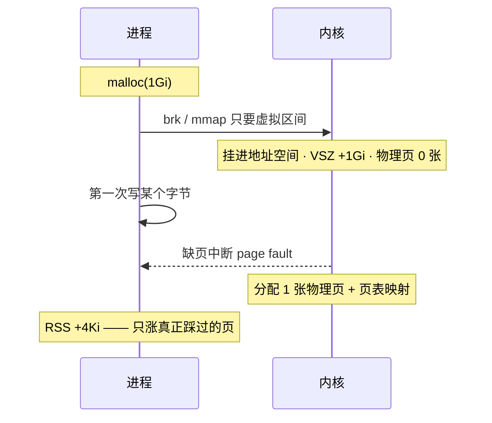
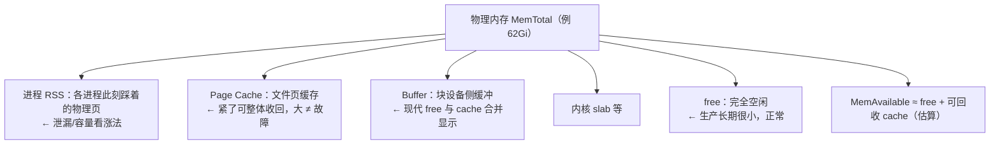
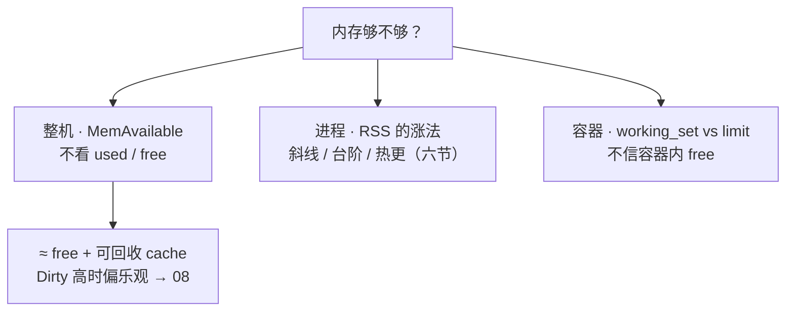
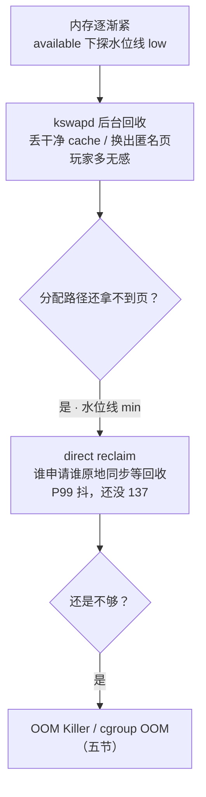
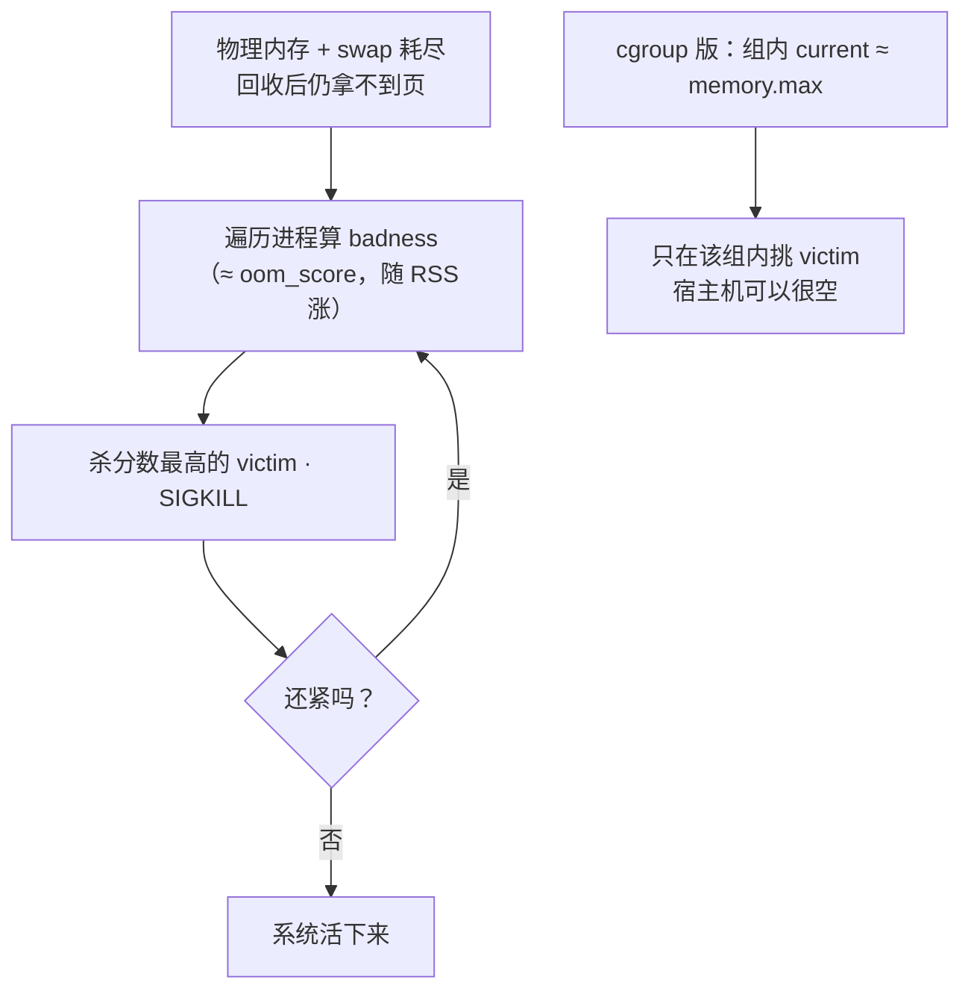
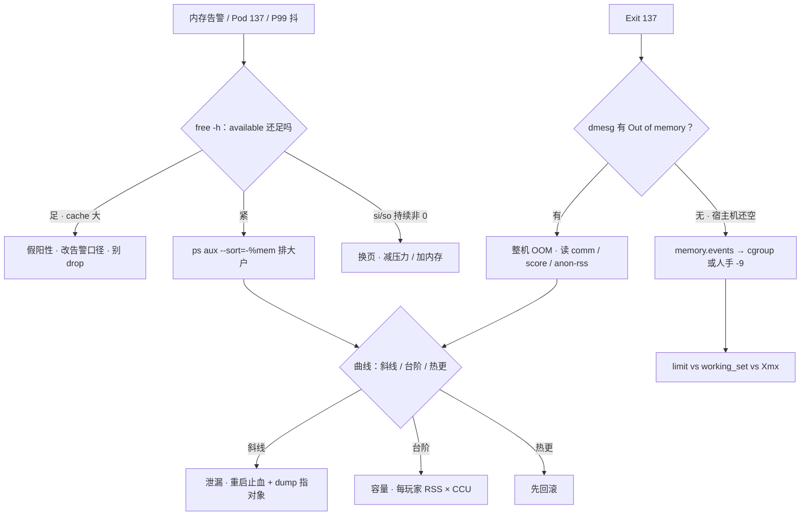

# 内存与 OOM

> 凌晨告警「内存 90%」，群里已经在写加机器；十分钟后 Pod Exit 137，宿主机 `free` 还剩 20G——两边吵的根本不是同一本账。
> **本章回答**：一页内存从申请、缺页入账，到回收、换页、被 OOM 击杀的一生；够不够看哪列、137 是谁杀的、该加 limit 还是先回滚。
> **不讲**：容器里 free 为什么是宿主机账 → [04](../04-内核与系统/)；SIGKILL / 137 信号语义、fork ENOMEM → [05](../05-进程与信号/)；vmstat 全景与 Load → [06](../06-CPU与Load/)；脏页 / writeback / 盘慢卡回收 → [08](../08-磁盘与IO/)；文件与 inode → [09](../09-文件系统与inode/)；cgroup 路径、v1/v2、PSI → [10](../10-cgroup与容器/)；QoS YAML → [03-04](../../03-Kubernetes/04-Pod生命周期/)。

**标记**：🎯重点 · 🔥难点 · ⭐常考 · 🔧实操

---

## 一、一张图：一页内存的一生

> 🎯 **一句话**：内存问题先问「这页走到哪一段了」——申请、入账、紧张、击杀、复盘，五段处方互不通用。


- 📖 **读图**
  - 🛤️ 主线五段：虚拟承诺 → 物理入账 → 紧张回收 → 击杀 → 曲线定责
  - 🔧 `free` / 监控照「入账」；`vmstat` 照「紧张」；`dmesg` / `memory.events` 照「击杀」——工具跟着阶段走
  - 📣 used 90% / Pod 137 / P99 抖，分别落在入账、击杀、紧张——后文每节认领一段

好，主图有了。第一站：进程申请时内核到底给了什么。

---

## 二、申请：malloc、虚拟内存与缺页 🎯🔥

> 🎯 **一句话**：malloc 拿到的只是**虚拟地址**，第一次写触发缺页才真占物理页——VSZ 是承诺，RSS 是实付。

### 🏠 虚拟内存：门牌号不是现房 ⭐🔥

🔥 很多人答「malloc 成功就是占了内存」——**错了**。⭐ 高频错答。

- 🔑 **虚拟内存（virtual memory）** = 每个进程自己的地址空间 + 内核**页表（page table）**把虚拟页号译成物理页框；物理内存按 **4KB** 一页（x86）分发
  - 好处：进程隔离、mmap 比物理还大的文件、共享库一份物理页多进程映射、可超售
  - 口诀：**「VSZ 是承诺，RSS 是实付」**（练习题 Q11）

> 💡 **打个比方**：虚拟地址像售楼处的**期房号**——`malloc` 只登记门牌；缺页才是**交房**，水泥（物理页）才花在你身上。

- 🛤️ **申请底层路径**（面试口径）

```text
malloc 小块 → brk 扩堆顶         ← 堆区往上长一点
malloc 大块 → mmap 独立区间       ← 单独虚拟区间（阈值默认 128KB，动态调）
返回的都只是「虚拟地址区间」：VSZ 涨、物理页一张没花
```

### 📄 缺页中断：第一次写才给页 🔥

- 🔑 **缺页中断（page fault）** = CPU 访问的虚拟地址还没映射到物理页 → 陷入内核补页、建映射再返回；程序无感继续跑
- 🔑 **请求调页（demand paging）** = 先给虚拟区间、真访问再补物理页——超售、mmap 大文件全靠它



- 📖 **读图**
  - `malloc` 与「占内存」中间隔着缺页——VSZ 12G、RSS 2G 的机制根源
  - mmap 了 4Gi 只读 64Mi → VSZ +4Gi、RSS 只 +64Mi；盯 VSZ 喊「吃了 4G」是错的

- 🔀 **两种缺页**
  - **次要（minor）**：页已在内存，只补映射（共享库首次映射、写时复制页）
  - **主要（major）**：数据在盘上（文件 / swap）——打盘，慢几个数量级，抖动信号之一
- 🔑 **写时复制（COW）**：`fork` 后父子共享物理页，谁先写谁缺页、内核再复制——fork 不立刻翻倍内存（→ [05](../05-进程与信号/)）

> 🔍 **现场**：看缺页账与虚实占用：

```bash
ps -o pid,vsz,rss,min_flt,maj_flt,comm -p {PID}
#   PID    VSZ   RSS  MINFLT  MAJFLT COMMAND
# 28451 12000000 2096128 182034   1207 java
#        ↑虚拟12G  ↑物理2Gi  ↑次要缺页 ↑主要缺页>0 且在涨 = 在打盘
cat /proc/{PID}/status | grep -E 'VmSize|VmRSS|VmSwap'
```

#### ❓ 为什么 malloc 成功 ≠ 已经占了内存？

- ❌ **「申请成功 = 物理页到手」**：把 VSZ 当占用报数
- ✅ **申请只给虚拟区间**；第一次写才缺页、才入账 RSS
  - 超售因此成立：承诺总量可以大于物理库存
  - 失败更晚：真写爆那一刻才 OOM（见 overcommit 档位）

### 📦 overcommit：承诺能不能超卖 ⭐

- 🔑 **overcommit** = 允不允许「承诺虚拟总量 > 物理内存」；`vm.overcommit_memory` 三档：
  - **0（默认，启发式）**：离谱拒绝、合理放行——逻辑服保持默认
  - **1（总是允许）**：malloc 都成功，**真写爆**才 OOM——更晚更突然，别为救一次 fork 全局改 1
  - **2（严格不超）**：按 `overcommit_ratio` 硬限，特殊场景用

> ⚠️ **别混**：overcommit 管整机承诺超不超卖，**救不了已贴住的 `memory.max`**——cgroup limit 是另一道闸（→ [05](../05-进程与信号/)）。

#### ❓ 为什么泄漏 ≠ 溢出（OOM）？🎯⭐🔥

- 🔑 **OOM（Out Of Memory，内存溢出）** = 要内存时**真的没有**了——整机由 OOM Killer 收场；JVM 则抛 `OutOfMemoryError`
- 🔑 **内存泄漏（memory leak）** = 申请了不还——**病因**，曲线斜线涨
- ❌ **「137 = 内存泄漏」**：面试减分项
- ✅ **泄漏是溢出的常见原因之一**，但台阶容量打满、热更打满同样能溢出——溢出是**结局**，泄漏是可能病因

> ⚠️ **别混**：**泄漏 ≠ 溢出**。斜线涨 ≠ 一定泄漏（见六节：重启回落不定罪，dump 指到对象才定）。

> 📝 **面试**：问虚拟内存——「独立地址空间 + 页表，换来隔离、mmap、共享库单份页、按需分配」；问 malloc 占了吗——「没有，第一次写才缺页；VSZ 与 RSS 差在这」。泄漏 vs 溢出——「拿了不还 vs 要的时候没有」。

本节对应练习题 Q11、Q12。承诺讲清了——监控喊「内存 90%」，该看哪一列？

---

## 三、入账：账本、RSS 与 available 🎯⭐🔧

> 🎯 **一句话**：物理页切给谁看 `free -h`；够不够**只看 available**；进程看 RSS，容器看 working_set 对 limit。

### 📒 一张账本：物理内存怎么切 ⭐



- 📖 **读图**
  - 五大去向最后都折进 **MemAvailable**——决策看 F，不看 used%
  - Page Cache 大是「公共货架在干活」，不是仓库满了

> 💡 **打个比方**：Page Cache 是仓库**公共货架**——新分配先清旧货；「货架占满」≠「仓库满了」，available 才是「清完还能腾多少」。

> ⚠️ **别混**：**buffer vs cache**——Buffers 跟块设备，Cached 跟文件页（Page Cache）；现代 `free -h` 合成 `buff/cache`，值班不拆。细看用 `/proc/meminfo` 的 `Buffers` / `Cached`。

### 🔧 free -h：先读 available 🔧⭐

> 🔍 **现场**：监控弹「used 90%」，别急着写加机器：

```bash
free -h
```

```text
              total        used        free      shared  buff/cache   available
Mem:           62Gi        58Gi       512Mi       1.0Gi        8.2Gi        6.1Gi
Swap:             0B          0B          0B
#                ↑粗算吓人     ↑小=常态      ↑公共页   ↑在干活      ↑够不够只看这列：≈10% → 边缘
```

- 📏 **口算尺**（经验，结合延迟与是否换页）

```text
MemAvailable / MemTotal
  > 20%  → 通常别为了 used% 扩容
  ~10%   → 盯大户与趋势
  < 5%   → 按故障窗口处理，防 OOM / 换页
```

```bash
grep -E 'MemTotal|MemFree|MemAvailable|Cached|Buffers|Dirty|SReclaimable|Swap' /proc/meminfo
# Dirty 持续很高 → 回收前必须 writeback，available 偏乐观 → [08](../08-磁盘与IO/)
```

- 🧪 **used 高常是 cache 在干活**：读过的文件页留在 Page Cache → free 变小、buff/cache 变大 → **新分配时内核收回干净 cache 页即可**
  - 「used 90% 加机器」「cache 占 80% 该清」都是假阳性

#### ❓ 为什么 used 90% 不该立刻加机器？

- ❌ **把 used% 当「应用吃光了」**
- ✅ **先看 available**：cache 大 + available 还足 = 健康常态
  - 真紧才进四节（回收 / 换页）和五节（击杀）
  - 日常腾内存靠治理 RSS / limit，**不靠** `drop_caches`

### 🚶 走读三台机器 🔧⭐

> 🔍 **现场**：同一句「内存告警」，三本账三出口：

```text
机器 A：日志服 · used 92% · available 7Gi / buff/cache 大
→ cache 在干活，假阳性，改告警口径，别动机器。

机器 B：战斗服 · Pod Exit 137 · 宿主机 free 剩 20G
→ 宿主机健康；问题在 Pod cgroup：current 顶 max、events oom_kill>0
  → 对 limit vs working_set vs Xmx，不看宿主机。

机器 C：混部 · available 3% · 接口抖
→ 真紧。vmstat 看 si/so；ps 排大户；dmesg 出 Out of memory 就是整机 OOM 前夜。
```

- 📖 **读图（读账）**：A 假阳性 / B cgroup / C 整机——**先确认告警照哪本账**，再选工具。

### 📐 RSS / VSZ / working_set：三个口径 🎯⭐

| 对比 | **VSZ** | **RSS** |
|------|---------|---------|
| 是什么 | 虚拟地址空间总量 | 此刻映射到物理页的部分 |
| 含没碰过的映射 | **含** | 不含，只算踩过的 |
| 共享库 | 计入一次 | **多进程各计一份**，加总会虚高 |
| 值班用途 | **别当占用报数** | 泄漏/容量看**涨法** |

- 🔑 **working_set**（`container_memory_working_set_bytes`）= cgroup 视角「不能立刻回收就走人」的近似——**容器告警唯一该对的口径**：working_set vs limit，**80% 告警**
  - 监控 working_set 90% limit、容器内 `ps` RSS 60% → **信 working_set**（含不可立刻回收的 cache 等）
- 🔑 **PSS**：共享页按共享进程数均摊后的「真实占用」，`/proc/<PID>/smaps_rollup` 的 `Pss`——精确比多进程共享库时用；日常定责 RSS 够

> ⚠️ **别混**：**容器内 `free` / `ps` vs working_set**——容器里 `free -h` 常读**宿主机 meminfo**（→ [04](../04-内核与系统/)）；定责只对 working_set vs limit（或 `memory.current` vs `memory.max`，→ [10](../10-cgroup与容器/)）。

> ⚠️ **别混**：**free 列 vs available**——free 是此刻完全空闲，available 是回收后还能给新分配的估算；free 很小是生产常态。也别把 Cached 和各进程 RSS **加总**当「应用吃了多少」——文件页两边重复计。

### 收束：三本账各看一列 🎯⭐



- 📖 **读图**
  - 机器 → MemAvailable；进程 → RSS 曲线形态；Pod → working_set vs limit
  - 拿整机 available 判容器死活、拿 VSZ 报占用 = 串账

> ⚠️ **别混**：这些口径**不保证**精确——available 是估算；RSS 含共享页重复计；working_set 是近似。用来**定责和告警**，不是审计报表。

> 📝 **面试**：背「**整机一台（available）、进程一线（RSS 曲线）、容器一对（working_set vs limit）**」；补「used 高先看 available，free 小 cache 大是常态，绝不生产 drop_caches」。

本节对应练习题 Q1、Q9、Q11。入账认清了——还没 OOM 却开始抖，病在「紧张」。

---

## 四、紧张：回收、换页与毛刺 🎯🔥

> 🎯 **一句话**：还没被杀 ≠ 没事——kswapd 悄悄回收是常态，direct reclaim 同步等回收就是 P99 抖，si/so 持续非 0 就是故障。

### 🧹 回收三级：kswapd → direct reclaim → OOM 🔥

物理内存紧张时，内核按**水位线（watermark）**分三级；页挂在文件页/匿名页的 **active/inactive LRU** 上，回收从 inactive 尾巴挑（干净文件页直接丢、脏页先写回、匿名页换出到 swap）：



- 📖 **读图**
  - 从哪进：available 跌破约 10% 后越紧越往下
  - 往哪查：「接口偶发卡 + CPU 不忙 + available 紧 + si/so 或 Dirty 高」= 站在 D——先减压力，**别干等 137**

> 💡 **打个比方**：kswapd 是**保洁下班后理货架**，生意照做；direct reclaim 是**客人结账时被拉去理货架**——业务线程原地干等，这单就慢了。

#### ❓ 为什么 kswapd 忙 ≠ 已经安全？

- ❌ **「后台在回收就说明没事」**
- ✅ **kswapd 忙 = 已经紧了**——看 available 趋势，别等报警
  - **kswapd** = 后台异步，玩家多无感
  - **direct reclaim** = 分配路径上**同步等**，业务直接吃延迟——同样叫「紧张」，后者已经是病
  - 再不够 → 五节击杀

> ⚠️ **别混**：**kswapd vs direct reclaim**——前者后台无感；后者同步等，P99 抖。

### 💾 Swap：用了就是紧 ⭐🔧

- 🔑 **swap** = 不活跃匿名页换到盘上腾内存；判据是 `vmstat` 的 **si/so**（swap in/out）

```bash
vmstat 1 5      # 第一行是开机平均，丢掉
```

```text
procs -----------memory---------- ---swap--
 r  b   swpd   free   buff  cache   si   so
 2  0 2097152  ...                  12   48
#                              ↑si 换入  ↑so 换出 —— 持续非 0 = 正在换页
```

- 🔀 **怎么读**
  - Swap used>0 但 si/so≈0：曾经换过，此刻不抖，先观察
  - **si/so 持续非 0**：正在打盘换页——游戏服**当故障**，不是「还有 Swap 余量还能撑」
  - `vm.swappiness` 过高：还有 cache 可回收就开始换匿名页 →「内存看起来够但延迟抖」
- 🎮 逻辑服/战斗服常见**关 Swap 或 `vm.swappiness=0`**：宁可 OOM 快速失败 + 扩容，不要静默变慢（代价：没缓冲、OOM 更快——前提 limit/监控到位）
- **看 si/so，不看「Swap 还剩多少」**（→ [06](../06-CPU与Load/)）

### 🧱 THP：延迟毛刺 🔥

- 🔑 **THP（Transparent Huge Pages）** = 内核自动把 4KB 合并成 **2MB** 大页，减页表开销；khugepaged 合并/压缩/回收可能**卡一下** → 延迟敏感服务偶发 100ms+ 毛刺

```bash
cat /sys/kernel/mm/transparent_hugepage/enabled
# always [madvise] never      ← 方括号里的是当前生效值
```

Redis、帧同步、延迟敏感建议 `never` 或 `madvise`；一般业务按实测，别无脑 `always`。

### 🚫 drop_caches：生产禁止日常 ⭐

```bash
echo 3 > /proc/sys/vm/drop_caches   # 仅 IO 基线测试 / 实验室用
```

cache 占 80% 不是清它的理由：drop 后 available 一时升高，随后读请求**重新填 cache 并且打盘**——自己制造读盘风暴；脏页也不能靠 drop 丢掉，得先 writeback。

> 📝 **面试**：「si/so 持续 = 换页，游戏服当故障；overcommit 默认 0；THP 延迟敏感 never；drop_caches 禁止日常」——四句一组。

本节对应练习题 Q7、Q8。回收救不回来，就有人被杀——开头那个「宿主机还剩 20G」的现场，根因在两条杀法。

---

## 五、击杀：OOM Killer 与两条杀法 🎯🔥

> 🎯 **一句话**：137 先分清是谁的手——dmesg 有 Out of memory 是整机杀，宿主机空 + Pod 137 是 cgroup 杀。

- 🔑 **137 = 128 + 9 = SIGKILL**（→ [05](../05-进程与信号/)）；OOM Killer 发的就是它，**没有优雅退出**
- 人手 `kill -9` 也是 137 → 「137 一定是 OOM」是错的，要靠证据分

### ⚖️ 整机 OOM Killer：按分数挑 victim 🔥⭐

- 🔑 **OOM Killer** = 物理内存（和允许的 swap）耗尽、回收仍拿不到页时，内核挑一进程发 SIGKILL 腾页
- 🔑 **victim** = 被打分挑中的进程；分数 **oom_score**——谁占可杀内存多、谁分高、谁先被点；**分高 ≠ 泄漏**，只说明占得多



- 📖 **读图**
  - 整机版从「全机耗尽」进，按 oom_score 排 victim
  - cgroup 版从「组内到顶」进——**轮不到选邻居**，只杀本组；两条路可同时发生

#### ❓ 为什么宿主机还剩 20G，Pod 仍可能 137？

- ❌ **「宿主机有空 = 不可能是 OOM」**
- ✅ **还有 cgroup 杀法**：组内 `memory.max` 到顶 → 只杀超标组，宿主机可以很空
  - 整机：available 见底 + dmesg `Out of memory`
  - cgroup：宿主机空 + `memory.events` 的 `oom_kill>0` / Reason: OOMKilled

> 🔍 **现场**：整机杀的铁证：

```bash
dmesg -T | grep -iE 'oom|killed process'
```

```text
[Thu Aug 28 03:12:01 2026] Out of memory: Kill process 12345 (java) score 987 or sacrifice child
[Thu Aug 28 03:12:01 2026] Killed process 12345 (java) total-vm:12000000kB, anon-rss:2096128kB
#                                        ↑被杀进程             ↑oom_score 高=占得多  ↑匿名页≈2Gi，堆嫌疑
```

`total-vm` 是 VSZ 量级（别当 RSS）；`anon-rss`/`file-rss` 区分匿名页（堆）与文件页——匿名大更像堆问题。

### 🛡️ oom_score_adj：保护谁、别保护谁 ⭐

- `/proc/<PID>/oom_score` = 内核现算「好杀程度」
- `/proc/<PID>/oom_score_adj`（**-1000～1000**）= 人为修正：**-1000 完全豁免**，正值更容易被点
  - 该保护：**sshd / kubelet / node 组件** → `OOMScoreAdjust=-500`～`-900`
  - **禁止给业务 -1000**：大户豁免 → 整机 hung，sshd 都救不了——业务被杀好过节点假死

> ⚠️ **别混**：**oom_score vs oom_score_adj**——前者读它预判谁会被点；后者是你写的修正（-1000 = 从候选名单划掉，不是「把 score 清零」）。

### 🧱 min_free_kbytes：整机 OOM 前的保留垫 ⭐

- 内核紧急分配保留水位（`/proc/sys/vm/min_free_kbytes`，单位 KB）
  - **太小**：kswapd 还没开工，分配路径已拿不到页 → 无征兆整机 OOM，甚至 panic
  - **盲目调大**：白扣一块谁也用不了的内存
- 默认值发行版保守；大内存机「没怎么用就整机 OOM / 网卡收包 alloc 失败」才动，配合 `watermark_scale_factor` 拉大水位间距（→ [24](../24-内核参数与sysctl/)），验证看 `/proc/zoneinfo` 各 zone 的 min/high

> 📝 **面试**：「min_free_kbytes 是紧急保留垫：太小无征兆 OOM，太大白扣；配 watermark_scale_factor，验证看 zoneinfo 水位间距。」

### ⚔️ 两条杀法对照 🎯⭐🔥

⭐ 口诀：**「dmesg 有 Out of memory = 整机；无且宿主机空 → memory.events = cgroup」**（练习题 Q2、Q3）。

| 对比 | **整机 OOM** | **cgroup OOM** |
|------|--------------|----------------|
| 触发 | 物理 + swap 耗尽，分配失败要杀人 | 组内 `memory.max` 到顶 |
| 宿主机还能空吗 | **否** | **可以** |
| 证据 | `dmesg` / `journalctl -k` 有 Out of memory | `memory.events` 的 `oom_kill`；Reason: OOMKilled |
| 选谁 | oom_score 挑全机；K8s 再叠 QoS | **不选邻居**，杀超标组 |
| 第一刀 | `ps` 排大户 + 曲线形态 | limit vs working_set vs Xmx |

```bash
cat /sys/fs/cgroup/.../memory.current /sys/fs/cgroup/.../memory.max /sys/fs/cgroup/.../memory.events
kubectl describe pod {name} | grep -A5 -i oom
```

```text
2097152000        # ← memory.current ≈ 2Gi
2147483648        # ← memory.max = 2Gi（就是 limit）
oom 3
oom_kill 1        # ← oom_kill > 0 = cgroup OOM 实锤
Last State: Terminated  Reason: OOMKilled  Exit Code: 137
```

人手 `kill -9` 的第三种 137：dmesg 无 OOM、events 无 oom_kill → 查操作记录与 K8s 事件/审计。

> ⚠️ **别混**：**整机 OOM（dmesg）vs cgroup OOM（events）**是本章最高频混答；还有第三层——**K8s QoS 节点选杀 vs 单容器撞 max**：节点 MemAvailable 见底时按 QoS（BestEffort → Burstable → Guaranteed）；**单容器超自己的 limit 照样 OOMKilled，request=limit 不豁免**——Guaranteed 只是节点争抢排最后，不是免死金牌（→ [03-04](../../03-Kubernetes/04-Pod生命周期/)）。

- 🔀 **相邻路径**：节点压力下 **kubelet 驱逐（eviction）** = 管理面——Pod 标 Evicted、可重调度，Exit **不是** 137；内核 OOM = 数据面 SIGKILL、137。现象都像「Pod 没了」，先看 `kubectl describe` 的 Reason。

### ☕ Java / Go：limit 怎么留 ⭐

- **Java**：`-Xmx` = limit **必炸**——堆外还有 Metaspace、线程栈 ×N、DirectByteBuffer、JNI
  - 要么 **limit ≥ Xmx × 1.3～1.5**，要么 `-XX:MaxRAMPercentage=70` 让 JVM 认 cgroup
  - jmap 堆才 70% 却 137 → **堆外杀手**（Netty 直接内存、JNI 音视频常见）——「堆没满」不能翻案
- **Go**：goroutine 泄漏同样 RSS 涨；pprof heap 对不上 RSS 时看堆外/mmap。`GOMAXPROCS` 对齐的是 **CPU**，不是内存（→ [06](../06-CPU与Load/)）

> 📝 **面试**：「137 先 dmesg：有 Out of memory=整机；没有再看 events，宿主机空 + Pod 137=cgroup；events 也没有=人手 -9。保护 sshd 用 adj -500～-900，绝不给业务 -1000。」

本节对应练习题 Q2、Q3、Q5、Q6、Q10。两条杀法会认了——告警 / 137 / 抖，怎么 60 秒定责？

---

## 六、复盘：定责与作战 🎯🔧

> 🎯 **一句话**：击杀之后看 RSS 曲线——斜线泄漏、台阶容量、热更打满先回滚；三选一对不上再分型。

### 📈 涨法分型：斜线 · 台阶 · 热更 ⭐

```text
斜线（泄漏）    流量不变 RSS 也斜线涨 · 重启回落、流量不变再涨   → 重启止血 + dump/pprof 指到对象才定罪
台阶（容量）    跟 CCU/QPS 上台阶后平稳 · 降流量回落            → 每玩家 RSS × CCU 算 limit / 扩容
热更（打满）    发布时间点对齐，RSS 冲到 limit 数倍             → 先回滚，不是先 dump、先加内存
cache（假象）   进程 RSS 不涨，available 被 cache 吃            → 看 available，别当泄漏
```

#### ❓ 为什么「重启回落」不能定罪泄漏？

- ❌ **「重启后 RSS 下来了 = 泄漏实锤」**——重启什么都会回落
- ✅ **要「回落之后、流量不变、又斜线涨」才是泄漏嫌疑**
  - dump 能指到无限增长的对象才定泄漏（Java jmap+MAT，Go pprof heap）
  - Redis 无 TTL 排行榜一周涨到 OOM = **数据增长**，治理淘汰/拆分，不是「加内存」也不是「代码泄漏」
  - 容量口算：每玩家额外 RSS ≈ 800Ki × CCU 20000 ≈ 15.6Gi，加基线堆/缓存/堆外 → 定 limit

怀疑泄漏看**哪段映射在涨**：

```bash
cat /proc/{PID}/smaps_rollup
grep -E '^[0-9a-f]|^Rss:|^Anonymous:|^Swap:' /proc/{PID}/smaps | head
# Anonymous 持续斜涨 → 堆/匿名映射泄漏嫌疑；文件映射 Rss 涨 → 更像 cache/读路径
```

### 🔥 三条真实事故

1. **热更全量 load 在线玩家** → RSS 冲 limit 3 倍 → 137，时间点与发布对齐 → 按需加载 + 分批；**回滚比加内存快**
2. **活动 CCU 5k→5 万**，RSS 上台阶后平稳 → 容量，按单玩家 × CCU 算 limit，不先骂泄漏
3. **Redis 全服排行无 TTL**，一周涨到 OOM → 数据增长，淘汰/拆分

### 🌳 定责决策树 🔧



- 📖 **读图**
  - 「内存高」从 available 进；「137」从 dmesg 进；「抖但没死」从 si/so 进
  - 中间汇合到曲线三选一；三条走完还定不了型，才是疑难杂症

### 现象 · 先做 · 别做

| 现象 | 先做 | 别做 |
|------|------|------|
| used 90%、cache 大半 | 看 available | 加机器、drop_caches |
| 137 | dmesg + memory.events | 只说加内存 |
| 宿主机 20G、Pod 137 | 读 cgroup max / events | 信容器内 free |
| RSS 在涨 | 对曲线：斜线/台阶/热更 | 先 dump 当泄漏 |
| Swap used + si/so | 当故障处理 | 「还有 Swap 余量，能撑」 |
| 堆 70% 却 137 | 查堆外 / Xmx vs limit | 只看 jmap 翻案 |
| 整机 OOM 杀了 sshd | 给 sshd 设 adj -500 | 给业务 -1000 |
| 热更后 RSS 爆 | **先回滚** | 先加 limit |
| 还没 137 但 P99 抖 | 疑 direct reclaim，减压力 | 干等 Exit 137 |

### ⏱️ 60 秒剧本 🔧

> 🔍 **现场**：接到内存告警或 137，60 秒走完再下结论。

```text
① 0–10s   free -h → 盯 available：>20% 止损假阳性；紧则 ps aux --sort=-%mem 排大户
② 10–30s  有 137？dmesg -T | grep -iE 'oom|killed process'：有行=整机，无行=查 memory.events
③ 30–45s  定型：整机→曲线三选一；cgroup→current vs max、working_set vs limit、Xmx 贴没贴死
④ 45–60s  定责 + 动手：泄漏→重启止血+dump；容量→算 limit/扩容；热更→回滚；抖→看 si/so 与 direct reclaim
```

**回到开头现场**：`free -h` 只看 available → 137 走三叉（dmesg / events / 人手 -9）→ 容器跟 working_set vs limit，**别拿宿主机 free 给 Pod 结案**。

本节对应练习题 Q4、Q13、Q14。

---

## 七、收口

### 命令速查 🔧

```bash
# 够不够
free -h                                        # 只看 available
grep -E 'MemTotal|MemAvailable|Cached|Dirty|Swap' /proc/meminfo
# 谁占得多 / 进程细项
ps aux --sort=-%mem | head -n 8
ps -o pid,vsz,rss,min_flt,maj_flt,comm -p {PID}   # VSZ/RSS/缺页
cat /proc/{PID}/smaps_rollup                      # 哪段映射在涨
# 两条杀法
dmesg -T | grep -iE 'oom|killed process'          # 整机 OOM
cat /sys/fs/cgroup/.../memory.{current,max,events} # cgroup OOM（路径→10）
cat /proc/{PID}/oom_score{,_adj}                  # 会被点吗 / 保护谁
sysctl vm.min_free_kbytes                         # 紧急保留垫（配 watermark_scale_factor）
# 紧张段
vmstat 1 5                                         # si/so 换页
cat /sys/kernel/mm/transparent_hugepage/enabled    # THP 三态
sysctl vm.overcommit_memory vm.swappiness          # 超卖 / 换页倾向
# 容器
kubectl top pod                                    # working_set vs limit（80% 告警）
```

### 面试锚点

| 问 | 30 秒答 |
|----|---------|
| 内存够不够看哪？ | **MemAvailable**，不看 used/free；容器看 working_set vs limit。 |
| free / available / buff/cache？ | free 完全空闲（小是常态）；buff/cache 可回收 IO 缓存；available ≈ free + 可回收 cache，决策用。 |
| used 90% 怎么办？ | 先看 available；cache 大常是健康常态，别加机器别 drop。 |
| 虚拟内存是什么？ | 独立地址空间 + 页表；隔离、mmap、共享库单份页、按需分配。 |
| malloc 之后就占了吗？ | 没有，只拿到虚拟区间；第一次写触发**缺页**才给物理页——VSZ 与 RSS 的差。 |
| 泄漏和溢出区别？ | 泄漏是「拿了不还」（病因，斜线）；溢出是「要的时候没有」（结局，OOM/137）。 |
| RSS 和 VSZ？ | RSS 物理页、看涨法；VSZ 虚拟、**不当占用**；共享库 RSS 重复计，精确用 PSS。 |
| 137 怎么排查？ | 128+9；dmesg 有 Out of memory=整机；无且宿主机空→events=cgroup；events 也无=人手 -9。 |
| 宿主机空、Pod 137？ | **cgroup memory.max 到顶**，与宿主机剩余无关；容器内 free 是宿主机账。 |
| OOM Killer 怎么选人？ | 按 oom_score（≈badness）挑 victim，SIGKILL；分高≠泄漏。 |
| 怎么保护关键进程？ | adj -500～-900 给 sshd/kubelet；**业务禁 -1000**。 |
| request=limit 就不被杀？ | 节点争抢时只是**最后**；自己超 limit 照样 cgroup OOM。 |
| K8s 节点不够先杀谁？ | BestEffort→Burstable→Guaranteed；与单容器撞 max 是两条路。 |
| OOMKilled 和 Evicted？ | OOMKilled=内核 SIGKILL（137）；Evicted=kubelet 管理面驱逐、可重调度。 |
| Java limit 怎么定？ | Xmx=limit 必炸；limit ≥ 1.3~1.5×Xmx 或 MaxRAMPercentage=70；堆没满却 137=堆外。 |
| 泄漏 vs 打满？ | 斜线 vs 台阶；重启回落不定罪；dump 指对象才定；热更打满先回滚。 |
| Swap 在用是还能撑吗？ | 不是。si/so 持续非 0=换页，游戏服当故障。 |
| 还没 OOM 但接口抖？ | 疑 direct reclaim：CPU 闲、available 紧、si/so 或 Dirty 高，先减压力。 |
| overcommit 改 1？ | 救不了 cgroup max，还让写爆更晚更突然；保持默认 0。 |
| drop_caches 能日常用？ | 不能；drop 制造读盘风暴，脏页也丢不掉。 |
| THP 是什么？ | 透明大页 4KB→2MB；合并/回收可毛刺，延迟敏感 never/madvise。 |
| min_free_kbytes 动不动？ | 「无征兆整机 OOM」才调大，配 watermark_scale_factor；盲调大=白扣内存。 |

### 易错一句话对照

- used 90% 必须加内存 → 看 available，cache 在干活
- free 很小说明要挂了 → 生产常态
- 容器 free 64G = Pod 很空 → 常是宿主机 meminfo，对 working_set
- 容器 OOM ⇒ 宿主机没内存 → cgroup 到顶即可，宿主机可以很空
- 137 一定是 OOM → 人手 kill -9 也是 128+9
- dmesg 没有就能排除 OOM → cgroup OOM 常没有那行，看 events
- score 高 = 泄漏 → 只说明占得多，容易被点
- 给业务 adj=-1000 保平安 → 整机 hung，比杀业务更糟
- request=limit 永不被杀 → 节点争抢排最后；超自己 limit 照杀
- 拿 VSZ 报「占了多少」 → 虚拟承诺，实付看 RSS
- malloc 成功就是占了内存 → 缺页中断才给物理页
- 137 都叫内存泄漏 → 溢出是结局；台阶容量、热更打满同样溢出
- 重启回落 = 泄漏实锤 → 什么都回落；流量不变再斜线才是嫌疑
- cache 80% 该 drop → 看 available；drop 制造读风暴
- Swap 有余量 = 还能撑 → 看 si/so，持续非 0 就是故障
- GOMAXPROCS 管内存 → 那是 CPU
- v1 usage_in_bytes 很准 → 含 cache，易偏高（v2 拆 file/anon）
- 告警跟容器内 ps RSS → 跟 working_set vs limit
- Evicted 当 OOMKilled → 驱逐是 kubelet 管理面，Reason 里看，不是 137
- min_free_kbytes 调得越大越安全 → 白扣内存；配 watermark_scale_factor
- 「无征兆 OOM」只怪应用 → 先看保留垫是不是太小
- kswapd 在忙就安全 → 它忙说明已经紧了，看 available 趋势

### 数字墙

> available **>20%** 常不动 · **~10%** 当风险 · **<5%** 故障窗口 · working_set 告警 **80%** · Java limit ≈ **1.3~1.5 × Xmx** · `MaxRAMPercentage` **70** · oom_score_adj **-500～-900**（sshd/kubelet）、**-1000** 豁免 · `overcommit_memory` 默认 **0** · 逻辑服 `swappiness` **0** 或关 Swap · **137 = 128+9** · 页 **4KB** · THP **2MB**（延迟敏感 never/madvise）· min_free_kbytes 单位 **KB** · QoS **BestEffort→Burstable→Guaranteed** · 每玩家 RSS × CCU = 容量口算

---

## 合上书

- [ ] **默画一节的图**：申请 → 入账 → 紧张 → 击杀 → 复盘；`free` / `vmstat` / `dmesg`·`events` 各照哪段。（→ Q14）
- [ ] **口述申请**：虚拟内存、malloc 占了吗、minor vs major、overcommit 三档、**泄漏 vs 溢出**。（→ Q11、Q12）
- [ ] **口述入账**：账本怎么切、free -h 各列、buffer vs cache、used 高为何假阳性、Dirty 高为何 available 偏乐观。（→ Q1）
- [ ] **口述三个占用口径**：VSZ 为何不能报数、RSS 共享库重复计、PSS、容器为何跟 working_set vs limit。（→ Q9、Q11）
- [ ] **口述紧张**：kswapd vs direct reclaim、si/so、游戏服为何关 Swap、THP、为何禁日常 drop_caches。（→ Q7、Q8）
- [ ] **默画击杀**：OOM Killer 选 victim（badness→SIGKILL→还紧再杀）与 cgroup 版（组内到顶只杀组内）。（→ Q2、Q3）
- [ ] **口述击杀**：137 三叉、两条杀法五项对照、oom_score vs adj、QoS vs 撞 limit、Java/Go limit。（→ Q2、Q5、Q6、Q10）
- [ ] **口述保留垫**：min_free_kbytes 太小/太大、为何配 watermark_scale_factor、验证看哪里。（→ Q13）
- [ ] **口述复盘**：斜线/台阶/热更、重启回落为何不定罪、容量口算、热更为何先回滚。（→ Q4）
- [ ] **定责**：决策树三入口、现象·先做·别做里至少三条「别做」。（→ Q13）
- [ ] **默画收束**：三本账各看一列，并说清各自「不保证什么」。（→ Q1、Q9）

下一章：[磁盘与 IO](../08-磁盘与IO/)——await 怎么读，脏页怎么写回，盘慢怎么卡住内存回收。地基：[04](../04-内核与系统/) · cgroup：[10](../10-cgroup与容器/) · sysctl：[24](../24-内核参数与sysctl/)。
