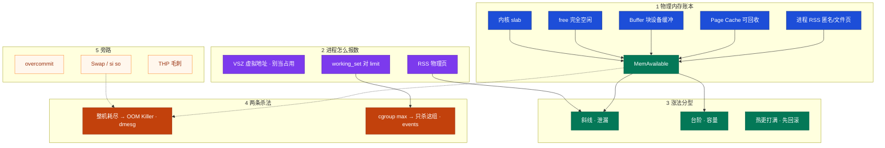
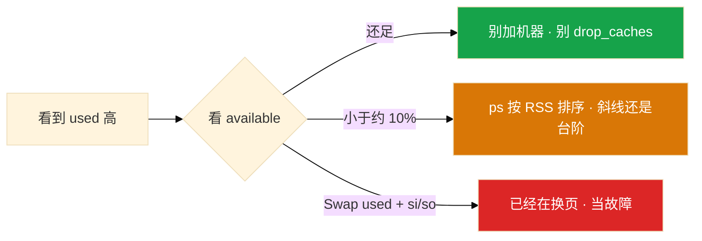
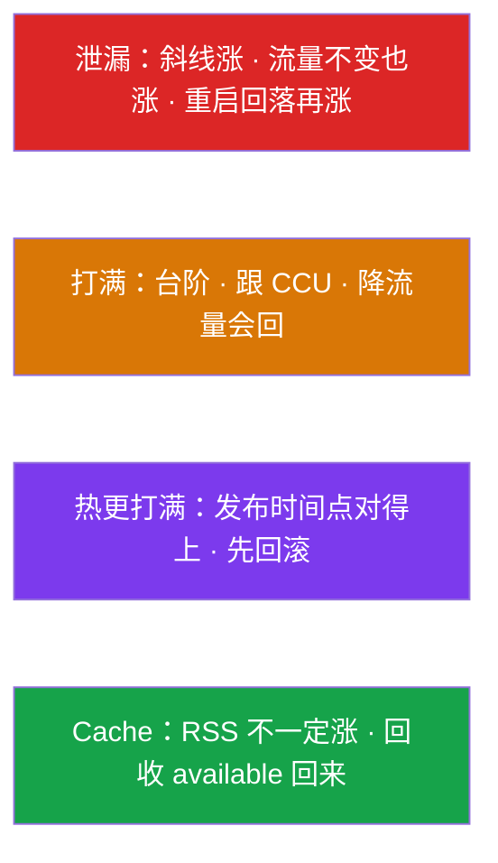
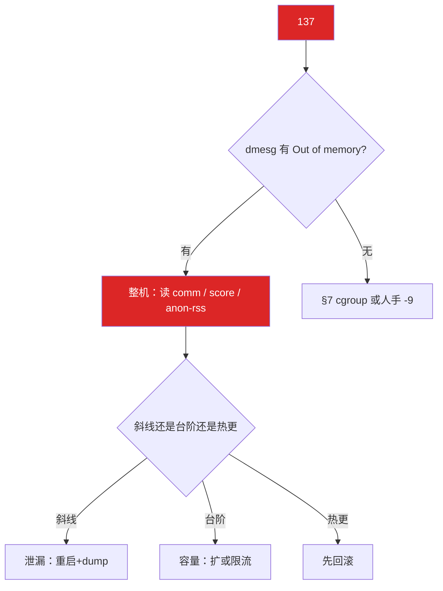
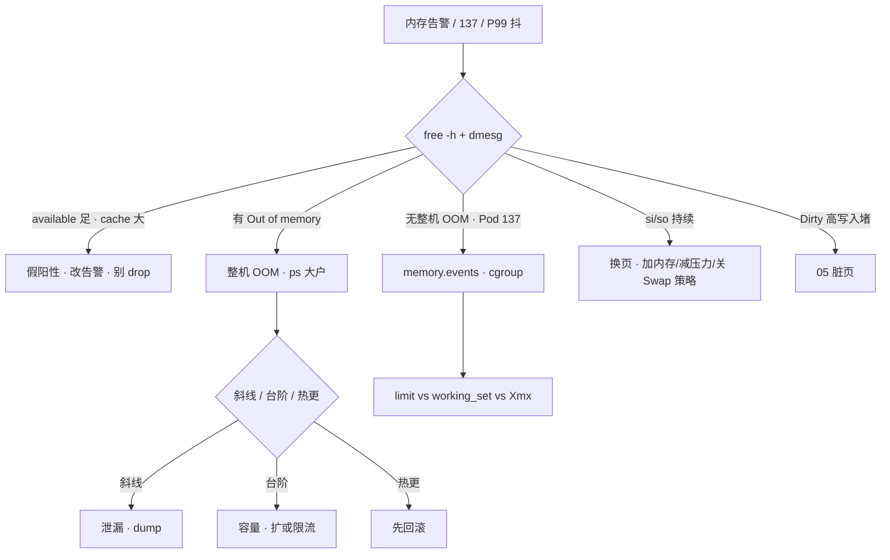

# 内存与 OOM

> **这章解决什么**：监控 used 90%、群里喊加机器；Pod Exit 137、宿主机 `free` 还剩 20G——两边吵起来。内存够不够、谁杀的、该回滚还是加 limit？  
> **读法**：**先看总图（账本 + 两条杀法）** → **再认名词** → **再分型定责**。  
> **刻意不展开**：容器内 free 为什么撒谎的内核细节 → [04](../04-内核与系统/)；cgroup v1/v2 文件、PSI → [10](../10-cgroup与容器/)；K8s QoS YAML → [04-Pod](../../03-Kubernetes/04-Pod生命周期/)；脏页 / iostat → [08](../08-磁盘与IO/)；fork ENOMEM、信号 137 语义 → [05](../05-进程与信号/)；Load 里的 si/so 格子 → [06](../06-CPU与Load/)。

---

## 本章目录

1. [本章定位](#1-本章定位)
2. [先看总图：账本、available、两条杀法](#2-先看总图账本available两条杀法) ← **开篇必读**
   - [2.0 全章知识串图](#20-全章知识串图一张把细节串起来) ← **架构总览**
   - [2.1 一张账本：物理内存怎么切](#21-一张账本物理内存怎么切)
   - [2.2 free -h：坐标系怎么立](#22-free--h坐标系怎么立)
   - [2.3 完整走读：used 90% 与 Pod 137](#23-完整走读used-90与-pod-137) ← **走读一例**
   - [2.4 两条杀法对照](#24-两条杀法对照同一套现象不同出口)
   - [2.5 读图三句话](#25-读图三句话先背这三句)
3. [名词扫盲（对照总图认词）](#3-名词扫盲对照总图认词)
4. [RSS / VSZ / working_set：进程占用怎么认](#4-rss--vsz--working_set进程占用怎么认)
5. [free / available / cache：本章最易混](#5-free--available--cache本章最易混) ← **重点精读**
6. [整机 OOM Killer 与 oom_score](#6-整机-oom-killer-与-oom_score)
7. [cgroup OOM ≠ 宿主机 OOM](#7-cgroup-oom--宿主机-oom)
8. [overcommit · Swap · THP · reclaim](#8-overcommit--swap--thp--reclaim)
9. [定责决策树与作战落地](#9-定责决策树与作战落地)
10. [去哪章继续学](#10-去哪章继续学)
11. [面试 · 易错 · 数字](#11-面试--易错--数字)
12. [合上书](#合上书)

---

## 1. 本章定位

| 章 | 负责 |
|----|------|
| **04（本章）** | 物理内存怎么读；RSS/VSZ/cache；整机 OOM vs cgroup OOM；overcommit / Swap；137 定责 |
| **01** | 容器里 `free` 读宿主机账的根因 |
| **02** | SIGKILL / 137、fork ENOMEM |
| **03** | Load、`vmstat` 的 si/so 格子（换页信号往本章结案） |
| **05** | Dirty、writeback、盘慢导致回收卡住 |
| **07** | cgroup memory 文件、v1/v2、PSI |
| **K8s 04** | QoS request/limit YAML |

本章是**内存线入口**。后面所有「加机器还是看 available」「137 是谁杀的」「Xmx 贴 limit」都建立在「账本怎么切、两条杀法怎么分」这两张图上。

🎯 **值班签名**：看 **available**，不看 used/free；137 先对 **dmesg** 和 **memory.events**；容器跟 **working_set vs limit**，不信容器内 free。

---

## 2. 先看总图：账本、available、两条杀法

> **正确开篇顺序**：先有全局画面，再认词，再抠细节。  
> 先看 **§2.0 全章串图**（考点挂一张板上），再看 **§2.1～2.2 账本 + free**，然后 **§2.3 走读一例** 把分型钉死。

### 2.0 全章知识串图（一张把细节串起来）

> 🎯 **合上书要能默画这张。** 蓝=账本 · 紫=进程视角 · 绿=决策指标 · 橙=两条杀法。  
> 若预览仍报错，以下面 **ASCII 一页板** 为准。



**读图路线：**

| 段 | 记住 |
|----|------|
| ① | 物理页切成 RSS / cache / free…；**决策用 available**（§2.1、§5） |
| ② | VSZ 虚、RSS 实、容器跟 working_set（§4） |
| ③ | 斜线泄漏 / 台阶容量 / 热更先回滚（§4） |
| ④ | 整机看 dmesg；cgroup 看 events——宿主机可以很空（§6、§7） |
| ⑤ | overcommit / Swap / THP 是旁路，别和「加机器」混谈（§8） |

```text
┌──────────────────────────────────────────────────────────────────────────┐
│                     04 一张板：账本 → available → 两条杀法 → 定责           │
├────────────────────┬─────────────────────┬───────────────────────────────┤
│  账本（物理页）     │  进程视角            │  杀法出口                      │
│  RSS 业务占        │  VSZ ≠ 占用          │  整机 OOM → dmesg Out of mem  │
│  cache/buffer 可收 │  RSS = 物理页        │  cgroup OOM → memory.events   │
│  free 常很小正常   │  working_set vs lim  │  人手 -9 → 两边都可能无 OOM 行 │
│  → MemAvailable    │  斜线/台阶/热更      │  宿主机空 + Pod 137 = cgroup   │
├────────────────────┴─────────────────────┴───────────────────────────────┤
│  旁路：overcommit · Swap(si/so) · THP · drop_caches 禁止日常 · reclaim   │
└──────────────────────────────────────────────────────────────────────────┘
```

---

### 2.1 一张账本：物理内存怎么切

假设：一台 64G 逻辑服节点。监控弹「内存 90%」。同事已经在工单写「加机器」。

**怎么读这张账本：**

- **进程吃的**：匿名页（堆/栈）+ 一部分文件映射 → 常说的 **RSS**
- **内核留着加速 IO 的**：**Page Cache**（读文件）+ **Buffer**（块设备）→ `free -h` 里常合成 **buff/cache**
- **完全没人用的**：**free**——生产上长期很小很正常
- **真正还能给新分配的**：**MemAvailable** ≈ free + 可回收的 cache（估算）

```text
  物理内存（MemTotal）
  ┌──────────────┬────────────────┬──────────┬─────────┐
  │  进程 RSS    │  Page Cache    │ Buffer   │  free   │
  │  （业务）    │  （文件可回收） │ （块设备）│ （零钱） │
  └──────┬───────┴────────┬───────┴────┬─────┴────┬────┘
         │                │            │          │
         └────────────────┴────────────┴──────────┘
                          │
                          ▼
                 MemAvailable（决策用）
                 ≈ free + 可回收 cache
```

| 块 | 是什么 | 值班怎么想 |
|----|--------|------------|
| **RSS** | 进程此刻踩着的物理页 | 泄漏 / 容量看它涨法 |
| **Page Cache** | 文件页缓存，紧了可收回 | 大 ≠ 故障 |
| **Buffer** | 块设备写缓冲一类 | 和 cache 合成 buff/cache 即可 |
| **free** | 完全空闲 | 小很正常，**别当决策** |
| **MemAvailable** | 还能给应用的估算 | **够不够看它** |

> **记住**：used 高经常只是 cache 在干活；决策看 available，不看 used/free。细节钉死见 §5。

---

### 2.2 free -h：坐标系怎么立

**一句话：** 先读 available 这一列，再决定要不要 panic。

```bash
free -h
```

```text
              total        used        free      shared  buff/cache   available
Mem:           62Gi        58Gi       512Mi       1.0Gi        8.2Gi        6.1Gi
Swap:            0B          0B          0B
```

**怎么立坐标系：**

| 列 | 含义 | 上例怎么读 |
|----|------|------------|
| total | 物理总量 | 62Gi |
| used | 粗算「已用」（含一部分 cache 算法差异） | 58Gi 吓人 |
| free | 完全空闲 | 512Mi **很小正常** |
| buff/cache | buffer + page cache | 8.2Gi 在干活 |
| **available** | **还能给新进程** | **6.1Gi ≈ 10%** → 边缘，先观察大户 |
| Swap | 交换分区 | 0 = 没开或没用 |



交叉 `/proc/meminfo`：

```bash
grep -E 'MemTotal|MemAvailable|Cached|Buffers|Dirty|Swap' /proc/meminfo
```

| 字段 | 用途 |
|------|------|
| MemAvailable | 与 `free` 的 available 同源思路 |
| Cached / Buffers | 拆开看 cache vs buffer |
| Dirty | 脏页；持续高 → available 偏乐观 → [08](../08-磁盘与IO/) |
| SwapTotal / SwapFree | Swap 开没开、用了多少 |

> **别混**：`free` 列空闲 ≠ 机器快没内存了。空闲小 + cache 大 + available 足 = 健康机器常见长相。

---

### 2.3 完整走读：used 90% 与 Pod 137

> 用现网角色串一遍分型。**只保留这一版走读**；后面各节细节往回挂。

**场景 A**：凌晨，监控「逻辑服节点内存 90%」。开发喊加机器。你 SSH 上去。

```text
你：free -h
    → available 还有 12Gi（总量 64Gi 的 ~19%）
你：别加机器。cache 大是正常的。

你：ps aux --sort=-%mem | head
    → java RSS 稳定在台阶，跟 CCU 对得上
结论：账本健康，告警阈值该改成 MemAvailable / working_set，不是 used%。
```

**场景 B**：同节点上某个 Pod Exit 137。宿主机 `free` available 还有 20Gi。群里说「机器明明有内存」。

```text
你：dmesg -T | grep -i 'oom\|killed process'
    → 没有 Out of memory 行

你：读该 Pod 的 cgroup
    cat memory.current / memory.max / memory.events
    → current ≈ max，oom_kill=1

结论：cgroup OOM，不是整机没内存。对 limit / Xmx / working_set，不信容器内 free。
```

**场景 C**：整机 available 掉到 200Mi，逻辑服没了，status 137。

```text
你：dmesg 有 Out of memory: Kill process … (java)
结论：整机 OOM Killer。再分斜线泄漏 vs 台阶容量 vs 热更打满。
```

**读走读三句话：**

1. used% 告警常是假阳性——先 available。  
2. Pod 137 + 宿主机空 → 优先 cgroup，不是「机器撒谎」。  
3. 有 dmesg OOM 行才是整机杀；两边都可能人手 `kill -9`。

---

### 2.4 两条杀法对照（同一套现象，不同出口）

| | 整机 OOM Killer | cgroup OOM |
|--|-----------------|------------|
| **触发** | 物理内存 + Swap 耗尽，分配失败要杀人腾空 | 组内 `memory.max` 到顶 |
| **宿主机还能很空吗** | **否**（available 已见底） | **可以**（只杀这一组） |
| **证据** | `dmesg` / `journalctl -k` 有 Out of memory | `memory.events` 的 oom / oom_kill；K8s Reason: OOMKilled |
| **选谁** | oom_score（偏 RSS 大的）+ QoS（K8s 节点争抢） | **不用选邻居**，就杀超标这个 cgroup |
| **第一刀** | `ps` 大户 + 斜线/台阶 | limit vs working_set vs Xmx |

```text
137 / SIGKILL
        │
        ▼
   dmesg 有 Out of memory？
        │
   是 ──┴── 否
   │         │
   ▼         ▼
整机 OOM    宿主机 available 还多？
            │
       是 ──┴── 否（边缘）
       │
       ▼
  memory.events / describe
  → cgroup OOM 或人手 -9
```

🎯 **签名对照**：宿主机 20G + Pod 137 = **cgroup**；available 见底 + dmesg OOM = **整机**。

### 2.5 读图三句话（先背这三句）

1. **账本**：物理页 = RSS + cache/buffer + free + 内核杂项；**够不够只问 MemAvailable**。  
2. **进程**：VSZ 虚、RSS 实；容器告警跟 **working_set vs limit**。  
3. **杀法**：dmesg 有 Out of memory → 整机；无 + Pod 137 + 宿主机空 → cgroup（或人手 -9）。

---

## 3. 名词扫盲（对照总图认词）

对照 §2 串图认词。每个词先想「值班什么时候碰到」，再记定义。

| 名词 | 值班里什么时候碰到 | 一句话 |
|------|--------------------|--------|
| **MemTotal** | 看机器规格 | 物理内存总量 |
| **MemAvailable** | used 90% 吵加机器 | **还能给应用的估算**，决策用它 |
| **free（列）** | `free -h` 第一眼 | 完全空闲；小很正常 |
| **buff/cache** | used 高、cache 大半 | buffer+page cache；多数可回收 |
| **Page Cache** | 读大文件、读盘加速 | 文件页缓存；紧了可收回 |
| **Buffer** | 老书本拆 buffer/cache | 块设备相关缓冲；现多合成 buff/cache |
| **RSS** | `ps`、泄漏讨论 | 进程占用的物理页 |
| **VSZ / VmSize** | 有人拿 VSZ 当「吃了多少」 | 虚拟地址空间；**不能当占用** |
| **working_set** | K8s 内存告警 | 近似「不回收就会撞 limit」；对 limit |
| **137** | Pod Terminated | **128+9**；先疑 OOM，也可能人手 -9 |
| **oom_score** | 整机杀了谁 | 谁更容易被 Killer 点名（偏 RSS） |
| **oom_score_adj** | 保护 sshd | -1000～1000；**-1000=豁免** |
| **overcommit** | fork 失败、malloc 成功却写爆 | 内核允不允许超卖承诺 |
| **Swap** | free 里 Swap used | 换到盘上；**有 used 且 si/so → 故障** |
| **kswapd / direct reclaim** | 还没 137 但 P99 抖 | 后台回收 vs 分配路径同步回收卡住 |
| **THP** | Redis/帧同步偶发毛刺 | 透明大页；压缩/回收可卡一下 |

> **记住**：名词都挂在 §2 账本或两条杀法上；易混专节是 §5（free/available/cache）和 §7（整机 vs cgroup）。

### 3.1 和邻章怎么分词

| 词 | 本章管不管 | 主责 |
|----|------------|------|
| available / RSS / OOM / Swap | **管** | 04 |
| Load、`%wa`、格子 | 不管（si/so 信号转来结案） | [06](../06-CPU与Load/) |
| Dirty、await | 点到为止 | [08](../08-磁盘与IO/) |
| cgroup 文件路径、PSI | 点到为止 | [10](../10-cgroup与容器/) |
| QoS YAML | 只分两条杀法 | K8s 04 |

```text
  告警「内存高」
       │
       ├─ used% / free 吓人 ──► 本章 §5 available
       ├─ Pod 137 ──────────► 本章 §6 / §7
       ├─ P99 抖 + si/so ───► 本章 §8（从 03 的格子转来）
       └─ Dirty 高 / 盘满 ──► 05，不是先加内存
```

---

## 4. RSS / VSZ / working_set：进程占用怎么认

> **一句话**：决策看 RSS（进程）和 working_set（容器）；VSZ 只是虚拟地图。

### 4.1 三者对照

| | VSZ | RSS | working_set |
|--|-----|-----|-------------|
| **是什么** | 虚拟地址空间大小 | 此刻映射到物理页的部分 | cgroup 视角「活跃/难立刻回收」占用近似 |
| **含未用映射吗** | **含**（mmap 很大但没碰也会撑 VSZ） | 不含未触碰页 | 统计口径与 RSS 不同 |
| **共享库** | 计入 | 多进程会**重复计**进各自 RSS | cgroup 有自己的聚合 |
| **值班用途** | **别当占用** | 泄漏/容量看涨法 | **对 limit 告警** |
| **命令** | `ps` VSZ / `VmSize` | `ps` RSS / `VmRSS` | 监控 `container_memory_working_set_bytes` |

```bash
ps -o pid,rss,vsz,comm -p <PID>
cat /proc/<PID>/status | grep -E 'VmRSS|VmSize|VmSwap|Threads'
```

```text
  PID   RSS    VSZ COMMAND
28451 8384512 12000000 java
```

口算：RSS ≈ 8.4Gi，VSZ ≈ 12Gi——**只拿 RSS 谈占用**。VSZ 大可能只是映射了很大一块还没写。

**虚拟 vs 物理（一例钉死）：**

```text
进程 mmap 了 4Gi 文件，但只顺序读了开头 64Mi
        │
        ▼
  VSZ  +≈ 4Gi（地址空间挂上了）
  RSS  +≈ 64Mi（真正踩到的物理页）
        │
        ▼
  有人盯着 VSZ 喊「吃了 4G」→ 错
```

匿名堆同理：`malloc` 很大一块但没写，常是虚拟承诺；**真正写过**才进 RSS（还受 overcommit 策略影响，见 §8.1）。

### 4.2 斜线 · 台阶 · 热更：涨法分型



| 形态 | 曲线 | 处理 |
|------|------|------|
| **泄漏** | 流量不变 RSS 斜线涨；重启回落再涨 | 重启止血 + heap dump / pprof；**能指对象才定泄漏** |
| **打满（容量）** | CCU 涨 → RSS 上台阶后平稳；降流量回落 | 每玩家 RSS × CCU 算 limit / 扩容 |
| **热更打满** | 发布时间点对齐，RSS 冲到 limit 数倍 | **先回滚**，不是先 dump、先加内存 |
| **Cache** | 进程 RSS 不涨，available 被 cache 吃 | 看 available；不要当泄漏 |

**现场半步（RSS 三天 2G→8G）：**

1. 拉监控：流量/CCU 变没变？  
2. 不变还斜线 → 泄漏嫌疑；CCU 5k→2 万上台阶 → 容量。  
3. `cat /proc/<PID>/smaps`（或 smaps_rollup）看 anon/heap 哪段在涨。  
4. 重启后**流量不变又斜** → 才钉泄漏。重启回落本身什么都会回落，不够定罪。

🔥 **Redis 无 TTL 排行榜一周涨到 OOM**：那是**数据增长**，要淘汰/拆分，不是「Redis 加内存就完了」，也不是经典「代码泄漏」。

**容量口算（游戏逻辑服）：**

```text
每玩家额外 RSS ≈ 800Ki（活动后 profile）
目标 CCU = 20000
→ 仅玩家态 ≈ 800Ki × 20000 ≈ 15.6Gi
再加基线堆 / 缓存 / 堆外 → 定 limit 与扩容，不要先开泄漏专题会
```

> **别混**：不要把 Cached 和各进程 RSS **加总**当「应用吃了多少」——文件页会重叠计数。

### 4.3 smaps：哪段在涨（半步）

怀疑泄漏时，不只看总 RSS，要看**哪类映射**在涨：

```bash
# 汇总（内核较新）
cat /proc/<PID>/smaps_rollup
# 或自己聚合
grep -E '^[0-9a-f]|^Rss:|^Anonymous:|^Swap:' /proc/<PID>/smaps | head
```

| 看什么 | 常见含义 |
|--------|----------|
| Anonymous 持续斜涨 | 堆/匿名映射泄漏嫌疑（Java heap、Go heap、C++ new） |
| 文件映射 Rss 涨、跟读路径相关 | 更像 cache/映射，不一定是业务泄漏 |
| Swap 字段非 0 | 该进程页被换出 → 交叉 §8.2 |

Java：配合 jmap / MAT 指对象；Go：`pprof heap`；对不上 RSS 时想堆外与 mmap。

### 4.4 working_set 和容器内 RSS 对不齐

监控 working_set 已 90% limit，容器里 `ps` RSS 只有 60%——**以 working_set vs limit 为准**。

| 你看的 | 可信度 | 用途 |
|--------|--------|------|
| 容器内 `free` / MemAvailable | **低**（常是宿主机账） | 不用于容器定责 → [04](../04-内核与系统/) |
| 容器内 `ps` RSS | 中 | 看进程谁大，不对齐 limit |
| **working_set vs limit** | **高** | 告警 **80%**、会不会 137 |
| cgroup `memory.current` | 高 | 和 max 对比；口径见 [10](../10-cgroup与容器/) |

**面试怎么说**：「进程占用我说 RSS，不说 VSZ；容器告警跟 working_set 对 limit；斜线泄漏、台阶容量、热更先回滚。」

### 4.5 本节验收

| 问 | 你应能答 |
|----|----------|
| 为什么 VSZ 不能报给老板「占了多少」？ | 含未触碰映射 |
| 重启回落能否定泄漏？ | 不能；看回落后流量不变是否再斜 |
| 告警跟谁？ | working_set vs limit，80% |

---

## 5. free / available / cache：本章最易混

> 🎯 **全章最易晕的一点单独钉死。** 按「一例 → 定义 → 命令 → 易错」四步。

### 5.1 最常见例子（先钉死画面）

监控：**Mem used 90%**。`free -h`：

```text
Mem:  62Gi  used 58Gi  free 512Mi  buff/cache 8.2Gi  available 6.1Gi
```

开发：「爆了，加机器。」  
你：「**available 还有约 10%，先别加。cache 在干活。**」

另一天：available 掉到 3%（约 2Gi），`ps` 里 java RSS 斜线一周——这时才进入「找大户 / 泄漏或容量」，不是在 used% 上决策。

### 5.2 一句话定义

| 词 | 定义 |
|----|------|
| **free** | 此刻完全没有被使用的物理页 |
| **buff/cache** | 内核拿来加速块设备和文件 IO 的页；**内存紧时多数可回收** |
| **available** | 内核估算：**再不回收 / 回收后**还能给用户态新分配的量 |
| **used**（`free` 里） | 展示用粗算，**不要单独当健康度** |

> **MemAvailable ≈ free + 可回收 cache（再扣一些不可轻易回收的部分）** —— 精确公式随内核版本微调，值班记「决策用这一列」即可。

### 5.3 对照命令怎么认

```bash
free -h
grep -E 'MemTotal|MemFree|MemAvailable|Cached|Buffers|Dirty|SReclaimable' /proc/meminfo
```

| 你看到 | 含义 | 下一步 |
|--------|------|--------|
| free 很小、cache 很大、available 足 | **正常** | 改告警，别 drop_caches |
| available < ~10% MemTotal | **紧** | `ps aux --sort=-%mem`；斜线 vs 台阶 |
| available 足但 Dirty 持续很高 | 回收要先 writeback | 去 [08](../08-磁盘与IO/)，available 可能偏乐观 |
| Swap used>0 且 `vmstat` si/so 持续非 0 | **已在换页** | 当故障，不是「还能撑」 |

**现场走一遍（完整命令链）：**

```bash
free -h
grep -E 'MemTotal|MemAvailable|Cached|Buffers|Dirty|SwapTotal|SwapFree' /proc/meminfo
vmstat 1 5
ps aux --sort=-%mem | head -n 15
```

口算习惯：

```text
MemAvailable / MemTotal
  > 20%  → 通常先别为了 used% 扩容
  ~10%   → 盯大户与趋势
  < 5%   → 按故障窗口处理；防 OOM / 换页
```

阈值是经验尺，不是内核硬阈值；结合业务延迟与是否在换页。

```bash
vmstat 1 5
# 看 si/so；第一行开机平均可丢
```

### 5.4 为什么 used 高常常不是故障

```text
应用读过的文件页 → 留在 Page Cache
        │
        ▼
  free 变小，buff/cache 变大
        │
        ▼
  used% 看起来很高
        │
        ▼
  新进程要内存 → 内核收回干净的 cache 页
        │
        ▼
  available 才反映「还能挤出多少」
```

所以：**cache 大 = 曾经有 IO，系统在用内存加速**；除非 available 见底或回收已经卡盘，否则不是「内存泄漏成 90%」。

**buffer vs cache（知道即可）：**

| | 更常关联 | 值班要不要拆 |
|--|----------|--------------|
| Buffers | 块设备元数据/写缓冲一类 | 一般**不拆**；看 buff/cache 总和 |
| Cached | 文件页 Page Cache | 同上 |
| 现代 `free -h` | 合成 **buff/cache** | 决策仍看 **available** |

老文档强调「buffer 和 cache 必须分清」——面试能提一句即可，**排障不靠拆这两列**。

### 5.5 易错一句钉死（只写一次）

| 你的说法 | 钉死 |
|----------|------|
| used 90% 必须加内存 | **错** → 看 available |
| free 很小说明要挂了 | **错** → 生产常态 |
| cache 占 80% 该 drop | **错** → 看 available；日常 drop 制造读风暴 |
| buffer 和 cache 必须分清才能值班 | **不必** → 合成 buff/cache 足够；细拆见 meminfo |
| available 是精确剩余 | **估算** → 脏页多时偏乐观 |
| 容器里 free 显示 64G 说明 Pod 很空 | **错** → 常是宿主机账；对 working_set |

> **记住**：判断够不够 → **MemAvailable**；容器够不够 → **working_set vs limit**。别处「见 §5」，不重复展开。

**面试怎么说**：「used 高我先看 available；free 小 cache 大是常态；available 跌破大约 10% 我才排序找大户；绝不生产日常 drop_caches。」

---

## 6. 整机 OOM Killer 与 oom_score

> **一句话**：整机腾不出页就按分数杀人；137 先对 dmesg。

### 6.1 例子钉死

逻辑服 `systemctl status` / Pod Last State：**Exit Code 137**。宿主机 available 只剩两百兆。

```bash
dmesg -T | grep -i 'oom\|killed process'
# 或
journalctl -k -b | grep -i 'out of memory\|killed process'
```

```text
[Thu Aug 28 03:12:01 2026] Out of memory: Kill process 12345 (java) score 987 or sacrifice child
[Thu Aug 28 03:12:01 2026] Killed process 12345 (java) total-vm:12000000kB, anon-rss:2096128kB
```

有 **Out of memory** → **整机 OOM**。被杀的是 java；anon-rss 约 2G；score 987 高因为占得多。

**读 dmesg 时盯这几项：**

| 字段 | 含义 |
|------|------|
| `Kill process PID (comm)` | 被杀进程 |
| `score` | 当时 oom_score |
| `total-vm` | 约等于 VSZ 量级（别当 RSS） |
| `anon-rss` / `file-rss` | 匿名 vs 文件物理页（匿名大更像堆） |

### 6.2 一句话定义

**OOM Killer**：物理内存（和配置允许用的 Swap）耗尽、回收仍不够时，内核选一个进程 **SIGKILL**，腾出页让系统活下去。

选人直觉：**谁占的可杀内存多、谁分数高，谁容易被点。**  
精确公式随内核变；值班记：`oom_score` 高 ≠ 泄漏，=「占得多 / adj 高」。

### 6.3 命令怎么认

```bash
cat /proc/<PID>/oom_score
cat /proc/<PID>/oom_score_adj
# systemd 保护 sshd：
# OOMScoreAdjust=-500
```

| 项 | 范围/含义 | 生产建议 |
|----|-----------|----------|
| `oom_score` | 内核算的「好杀程度」 | 看谁会被点；结合 RSS |
| `oom_score_adj` | -1000～1000 | sshd/kubelet **-500～-900** |
| **-1000** | **完全豁免** | **禁止给业务**；豁免太多 → 整机 hung 比杀业务更糟 |



### 6.4 K8s 节点争抢（和 cgroup OOM 不是一条路）

节点 MemAvailable 见底时，kubelet / 节点 OOM 路径会按 **QoS** 倾向：BestEffort 先、Burstable 次、Guaranteed（request=limit）最后；同档再看 score。

| | 节点级选杀 | 单容器 cgroup OOM |
|--|------------|-------------------|
| 触发 | 节点内存争抢 | 自己的 memory.max |
| 会不会杀邻居 | **会按优先级选** | **只杀本组** |
| Guaranteed | 最后才轮到 | **照样 137**（自己超 max） |

YAML / QoS 细节 → [K8s 04](../../03-Kubernetes/04-Pod生命周期/)。本章只分清：**两条路**。

```text
节点 available 见底
        │
        ▼
  节点级选杀（QoS + score）
  BestEffort → Burstable → Guaranteed
        │
        ▼
  某个 Guaranteed Pod 自己 current≈max
        │
        ▼
  只走 cgroup OOM（不需要节点先死光）
```

两件事可以同时存在：节点在杀 BestEffort，同时另一个 Pod 自己撞 limit——**看证据，别混成一句「K8s OOM」**。

### 6.5 易错

| 说法 | 真相 |
|------|------|
| score 高一定是泄漏 | 谁 RSS 大谁容易被点；文件服务器 cache 相关也可能高 |
| 给业务 -1000 保业务 | 节点可能假死，sshd/kubelet 都救不了 |
| request=limit 永不被杀 | 节点争抢时只是**最后**；自己超 limit 仍 cgroup OOM |
| 137 一定是 OOM | 人手 `kill -9` 也是 128+9 |

**面试怎么说**：「137 我先 dmesg；有 Out of memory 是整机，看 score 和 RSS；保护 sshd 用 -500 到 -900，不给业务 -1000。」

---

## 7. cgroup OOM ≠ 宿主机 OOM

> **一句话**：组内 max 到顶就杀，宿主机可以很空；容器内 free 不能证伪。

### 7.1 例子钉死

Pod limit **2Gi**。进容器 `free -h` 看到 **64G**。十分钟后 **OOMKilled / 137**。开发：「宿主机明明还有内存。」

```bash
# 路径随 cgroup v1/v2 / 容器运行时而变，概念如下
cat .../memory.current
cat .../memory.max
cat .../memory.events
kubectl describe pod <name> | grep -A5 -i oom
```

```text
2097152000          # current ≈ 2Gi
2147483648          # max = 2Gi
oom 3
oom_kill 1

Last State: Terminated
  Reason: OOMKilled
  Exit Code: 137
```

**current ≈ max + oom_kill>0** → **cgroup OOM**。与宿主机 20G available **无关**。容器内 free 的 64G 是宿主机账（[04](../04-内核与系统/)）。

### 7.2 一句话定义

**cgroup OOM**：该控制组的内存用量撞上 **`memory.max`（v2）/ limit_in_bytes（v1）**，内核在该组内杀进程（常表现为容器主进程 137），**不必**整机先耗尽。

### 7.3 对照怎么认

| 信号 | 整机 OOM | cgroup OOM | 人手 -9 |
|------|----------|------------|---------|
| dmesg Out of memory | **常有** | 很多环境**没有**经典整机行 | 无 |
| memory.events oom_kill | 不一定 | **常有** | **通常无** |
| 宿主机 available | 见底 | **可以很多** | 任意 |
| K8s Reason | 也可能 Evicted 等 | **OOMKilled** 常见 | 看事件/审计 |

止血：临时加 limit 或降堆；长期：working_set **80%** 告警、Xmx 与堆外预算、查泄漏/容量。

**找到 cgroup 文件（概念级）：**

```bash
# 容器内或节点上，按运行时找实际路径；v2 常见：
# /sys/fs/cgroup/.../memory.current
# /sys/fs/cgroup/.../memory.max
# /sys/fs/cgroup/.../memory.events
#
# 也可用（需权限）：
# kubectl top pod
# 监控：container_memory_working_set_bytes / container_spec_memory_limit_bytes
```

路径细节、v1 名 → [10](../10-cgroup与容器/)。本章验收是：**会区分证据，不背死路径字符串**。

### 7.4 Java / Go：limit 怎么留

**Java：**

| 做法 | 结果 |
|------|------|
| `-Xmx` = limit | **必炸**（Metaspace、线程栈、DirectByteBuffer、JNI） |
| limit ≥ Xmx × **1.3～1.5** | 常见经验留堆外 |
| `-XX:MaxRAMPercentage=70` | 让 JVM 认 cgroup，别贴死 |

jmap 堆 70% 却 137 → **堆外杀手**（游戏服常见 Netty 直接内存、JNI 编解码）。

```text
Pod limit = 2Gi
-Xmx = 2g
        │
        ▼
堆内看起来还有空
+ Metaspace + 线程×栈 + DirectByteBuffer + JNI
        │
        ▼
working_set 先撞 max → 137
（jmap「堆没满」不能翻案）
```

**Go：** goroutine 泄漏 → RSS 涨；pprof heap 对不上时看堆外/mmap。`GOMAXPROCS` 对齐的是 **CPU**，不是这道内存题（[06](../06-CPU与Load/)）。

### 7.5 v1 usage 偏高（链出去）

v1 `memory.usage_in_bytes` **含 cache**，容易看起来更满、更早杀；v2 能更好拆 file/anon。迁 v2 / 读法 → [10](../10-cgroup与容器/)。

> **别混**：整机 OOM（dmesg）vs cgroup OOM（events）；节点 QoS 选杀 vs 自己撞 max；容器 free vs working_set。

**面试怎么说**：「Pod 137 宿主机还空，是 cgroup max；Java limit 留 30%+ 给堆外；告警 working_set 80%，不信容器 free。」

---

## 8. overcommit · Swap · THP · reclaim

> 旁路机制：会改「什么时候失败 / 什么时候变慢」，不要和「加机器」混成一句。

### 8.1 overcommit：承诺能不能超卖

**一句话：** `vm.overcommit_memory` 管的是「能不能超卖承诺」，救不了已经撞上的 `memory.max`。

| 值 | 含义 | 生产 |
|----|------|------|
| **0** | 启发式（常见默认） | 游戏逻辑服保持即可 |
| **1** | 始终允许超卖直到真正写爆 | 别为了 fork 一改，活动里真实写爆更惨 |
| **2** | 严格不超（按公式限承诺） | 特殊场景 |

```bash
sysctl vm.overcommit_memory vm.overcommit_ratio
```

🔥 fork 贴着 cgroup 报 ENOMEM 时，改 overcommit **救不了** 这个组的 max（[05](../05-进程与信号/)）。

**和「真正写爆」的关系：**

```text
overcommit=1
  malloc / mmap 很容易成功（只是承诺）
        │
        ▼
  业务真写入时才要物理页
        │
        ▼
  这时才可能 OOM / cgroup 杀
  → 失败更晚、更突然，排障更难
```

所以游戏逻辑服：**保持默认启发式（0）**，容量用 limit 和监控管，不靠超卖续命。

### 8.2 Swap：用了就是紧

**一句话：** Swap used + `si/so` 持续非 0 = 已经在换页，游戏服当故障，不是「还能撑」。

```bash
free -h
grep -E 'Swap' /proc/meminfo
vmstat 1 5
```

```text
 procs -----------memory---------- ---swap--
 r  b   swpd   free   buff  cache   si   so
 2  0 2097152  ...                  12   48
```

| 现象 | 含义 |
|------|------|
| Swap used>0 但 si/so≈0 | 曾经换过，此刻不一定在抖 |
| **si/so 持续非 0** | **正在换页** → P99 毛刺 |
| swappiness 过高 | 还有 cache 就开始换页，「看起来够却抖」 |

**落地：** 游戏逻辑服 / 战斗服常见 **关 Swap** 或 **`vm.swappiness=0`**，用 OOM+扩容，不用静默变慢。  
代价：没缓冲，OOM 来得更快，延迟更稳——前提是 limit 与监控到位。

> **记住**：有 Swap「余量」≠ 健康；看 **si/so**。

### 8.3 回收路径：kswapd vs direct reclaim

```text
内存逐渐紧
    │
    ▼
kswapd 后台回收 cache / 换页     ← 通常玩家无感
    │
    ▼
来不及 / 太紧
    │
    ▼
direct reclaim：分配路径上同步回收  ← P99 抖，还没 137
    │
    ▼
仍不够 → OOM Killer 或 cgroup OOM
```

还没 137 但接口偶发卡：CPU 不忙、available 紧、si/so 或 Dirty 高 → 先减压力，不要等 Exit 137。Dirty 高卡回收 → [08](../08-磁盘与IO/)。

**和 03 章怎么接：**

| 你在 03 看到 | 转到本章 |
|--------------|----------|
| `vmstat` si/so 非 0 | §8.2 换页，当内存故障 |
| Load 高但 `%id` 高、又在换页 | 先内存/IO，不是先加核 |
| 延迟抖、CPU 闲、available 紧 | 疑 direct reclaim |

### 8.4 THP：延迟毛刺

```bash
cat /sys/kernel/mm/transparent_hugepage/enabled
# always [madvise] never
```

| 服务 | 建议 |
|------|------|
| Redis、帧同步、延迟敏感 | `never` 或 `madvise` |
| 一般业务 | 按厂商/实测；always 可能压缩/回收毛刺 |

### 8.5 drop_caches：生产禁止日常

```bash
# 仅 IO 基线 / 实验室
echo 3 > /proc/sys/vm/drop_caches
```

| 想法 | 真相 |
|------|------|
| cache 80% 清掉腾内存 | 制造随后读盘风暴 |
| drop 后 available 升了就安全 | 读请求会重新填 cache 并打盘 |
| 用 drop 丢脏页 | **脏页不能靠 drop 丢掉** |

> **记住**：日常腾内存靠治理 RSS/limit，不靠 drop_caches。

### 8.6 小结表

| 项 | 生产怎么用 | 改错会怎样 |
|----|------------|------------|
| `vm.overcommit_memory` | 保持 **0** | =1 让真实写爆更晚更惨 |
| Swap / swappiness | 关或 **0** | 静默换页，P99 抖 |
| THP | 延迟敏感 never/madvise | 偶发 100ms+ 毛刺 |
| drop_caches | **仅测试** | 读风暴 |
| Dirty 高 | 去 05 | available 偏乐观 |

**面试怎么说**：「Swap 有 used 且 si/so 持续就是换页；overcommit 默认别乱改；THP 给 Redis never；drop_caches 生产禁止。」

---

## 9. 定责决策树与作战落地

### 9.1 命令速查（值班先背这张）

| 目的 | 命令 |
|------|------|
| 还够不够 | `free -h` · `grep MemAvailable /proc/meminfo` |
| 谁占得多 | `ps aux --sort=-%mem \| head` |
| 进程细项 | `cat /proc/<PID>/status`（VmRSS/VmSize/VmSwap） |
| 哪段在涨 | `cat /proc/<PID>/smaps`（或 smaps_rollup） |
| 整机 OOM | `dmesg -T \| grep -iE 'oom\|killed process'` |
| score | `cat /proc/<PID>/oom_score{,_adj}` |
| 换页 | `vmstat 1 5`（si/so） |
| THP | `cat /sys/kernel/mm/transparent_hugepage/enabled` |
| 容器 | `memory.current` / `max` / `events` · `kubectl describe pod` |
| 监控 | working_set vs limit（**80%** 告警） |

### 9.2 决策树



### 9.3 现象｜先做｜别做

| 现象 | 先做 | 别做 |
|------|------|------|
| used 90%、cache 大半 | 看 **available** | 加机器、drop_caches |
| 137 | dmesg + memory.events | 只说加内存 |
| 宿主机 20G、Pod 137 | 读 cgroup max / events | 信容器内 free |
| RSS 涨 | 斜线 vs 台阶 vs CCU vs 热更 | 先 dump 当泄漏 |
| Swap used + si/so | 当故障 | 「还能撑」 |
| 堆 70% 却 137 | 堆外 / Xmx vs limit | 只看 jmap |
| 整机 OOM 杀了 sshd | 给 sshd 降 adj | 给业务 -1000 |
| 热更后 RSS 爆 | **先回滚** | 先加 limit |
| available 紧、还没 137、P99 抖 | 疑 direct reclaim；减压力 | 干等 137 |

### 9.4 游戏事故复盘（三条）

1. **热更全量 load 在线玩家** → RSS 冲到 limit 3 倍 → 137。发布时间对齐 dmesg/events。改成按需加载 + 分批。**回滚比加内存快。**  
2. **活动 CCU 5k→2 万**，RSS 上台阶后平稳 → 容量；按单玩家内存 × CCU 算 limit，不要先骂泄漏。  
3. **Redis 全服排行无 TTL**，一周涨到 OOM → 数据增长；淘汰/拆分，不是「加内存完事」。

### 9.5 落地选型与核心配置

| 项 | 选 | 不选 |
|----|----|------|
| 决策指标 | MemAvailable；working_set vs limit | used%；容器内 free |
| 告警 | working_set **80%** limit | cache 占 80% 就告 |
| Java | limit ≥ Xmx × **1.3～1.5** 或 MaxRAMPercentage=70 | Xmx = limit |
| Swap | 关或 swappiness=0 | 靠 Swap 抗峰值 |
| oom_score | sshd/kubelet **-500～-900** | 业务 -1000 |
| overcommit | 保持 0 | 乱改成 1 |
| 热更 | 按需加载 + 分批 | 全量 load 在线玩家 |
| THP | 延迟敏感 never/madvise | 一律 always 不管测 |

| 参数 | 生产怎么用 |
|------|------------|
| `vm.swappiness` | 逻辑服 **0** 或关 Swap |
| `vm.overcommit_memory` | **0** |
| `oom_score_adj` / `OOMScoreAdjust=` | 保护 sshd **-500～-900** |
| THP `enabled` | Redis/帧同步 never 或 madvise |
| `-Xmx` vs limit | 留 **30%+** 堆外 |
| `-XX:MaxRAMPercentage` | **70** 常见起点 |

脏页 `dirty_ratio` 等 → [08](../08-磁盘与IO/)。

### 9.6 值班口令（30 秒版）

1. `free -h` → 盯 **available**。  
2. 137 → `dmesg` 有没有 Out of memory；没有再看 **memory.events**。  
3. RSS → **斜线 / 台阶 / 热更** 三选一。  
4. 容器 → **working_set vs limit**，不信容器 free。  
5. Swap → 看 **si/so**，不看「还有 Swap 余量」。

验收：137 能在 5 分钟内分出整机 / cgroup / 人手 -9；working_set 80% 告警生效；热更方案不会全量 load 玩家。

---

## 10. 去哪章继续学

| 你想搞懂 | 去 |
|----------|-----|
| 容器里 free 为什么是宿主机账 | [04](../04-内核与系统/) |
| 137 信号、fork ENOMEM | [05](../05-进程与信号/) |
| Load、vmstat 格子、si/so 怎么和 CPU 一起看 | [06](../06-CPU与Load/) |
| Dirty、writeback、盘慢卡回收 | [08](../08-磁盘与IO/) |
| cgroup memory 文件、v1/v2、PSI | [10](../10-cgroup与容器/) |
| QoS、request/limit YAML | [K8s 04](../../03-Kubernetes/04-Pod生命周期/) |
| sysctl 落盘 | [24](../24-内核参数与sysctl/) |

---

## 11. 面试 · 易错 · 数字

| 问 | 答 |
|----|-----|
| 内存够不够看哪？ | **MemAvailable**，不看 used/free。 |
| used 90% 怎么办？ | 先看 available；cache 大常正常。 |
| RSS 和 VSZ？ | RSS 物理页；VSZ 虚拟，**不当占用**。 |
| 137？ | 128+9；dmesg 分整机；events 分 cgroup；也可能人手 -9。 |
| 宿主机空 Pod 137？ | **cgroup max**，与宿主机剩余无关。 |
| 泄漏 vs 打满？ | 斜线 vs 台阶；dump 能指对象才定泄漏。 |
| 热更 RSS 爆？ | **先回滚**。 |
| oom_score_adj？ | 保护 sshd -500～-900；**业务禁止 -1000**。 |
| Xmx = limit？ | **不行**；留 30%+ 堆外或 MaxRAMPercentage。 |
| Swap 在用？ | si/so 持续 → 故障；游戏服倾向关/swappiness=0。 |
| overcommit？ | 默认 0；改 1 不治 cgroup max。 |
| drop_caches？ | 生产禁止日常。 |

| 易错 | 真相 |
|------|------|
| 看 free 判断够不够 | 决策用 available |
| 容器 free 64G = Pod 很空 | 常是宿主机 meminfo |
| 容器 OOM ⇒ 宿主机没内存 | cgroup 到顶即可 |
| 137 一定是 OOM | 也可能 kill -9 |
| score 高 = 泄漏 | 占得多易被点 |
| request=limit 永不杀 | 最后被选；超 max 仍杀 |
| 重启回落 = 泄漏 | 要看回落后流量不变是否再斜 |
| cache 80% 该 drop | 看 available |
| GOMAXPROCS 管内存 | 那是 CPU |
| v1 usage 很准 | 含 cache，易偏高 |
| 告警跟容器内 ps RSS | 跟 working_set vs limit |

**数字**：available **< ~10%** 当风险；working_set **80%** 告警；Xmx 留 **30%+** 堆外；oom_score_adj **-500～-900**，**-1000** 豁免；swappiness **0**；137 = **128+9**；Java limit ≈ **1.3～1.5 × Xmx**。

---

## 合上书

1. **默画 §2.0 串图 + §2.1 账本**：物理页怎么切？决策指标是哪一个？  
2. **口述**：`free -h` 各列；为什么 free 小、cache 大常常健康？  
3. **讲清**：RSS vs VSZ vs working_set；斜线 / 台阶 / 热更怎么分？  
4. **讲清**：整机 OOM vs cgroup OOM 证据各看什么？宿主机空为什么还能 137？  
5. **定责**：137 三叉（整机 / cgroup / -9）；为什么不给业务 -1000？  
6. **旁路**：Swap 与 si/so；overcommit 改不改得了 cgroup max；为何禁日常 drop_caches？

六题能口述，这一章就过了。下一章：[磁盘与 IO](../08-磁盘与IO/)——await 怎么读，df 满 du 不满先查谁。
