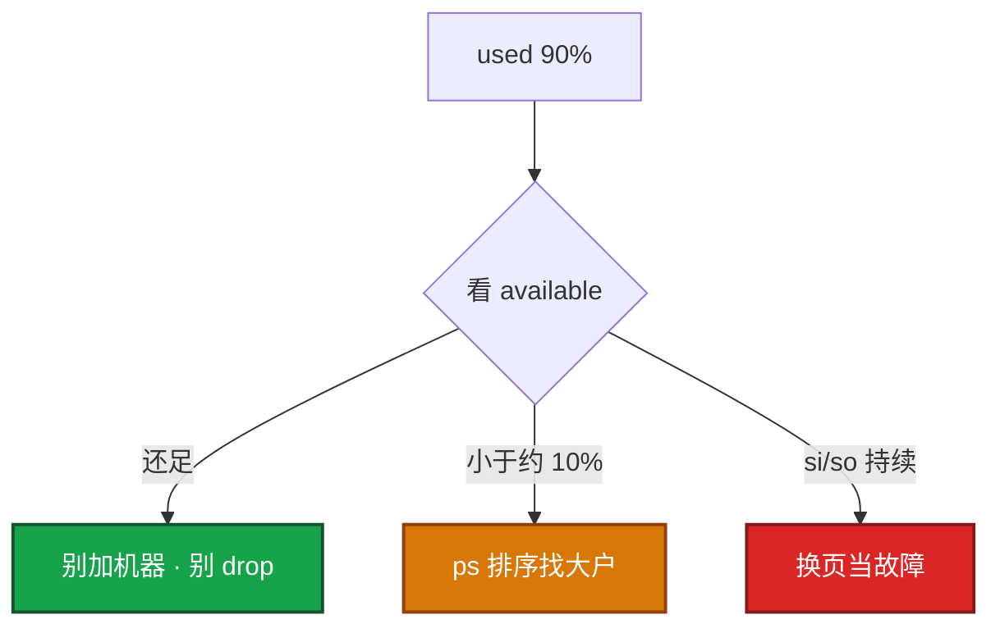
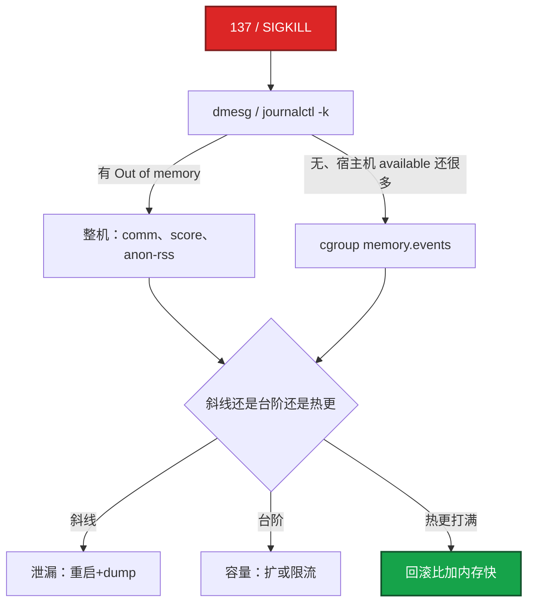
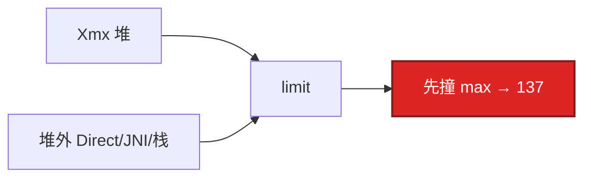
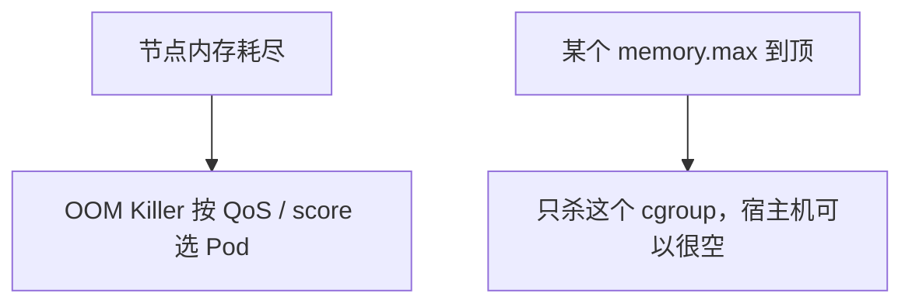

# 04｜内存与 OOM · 练习题

先对照 [知识点](知识点.md)：**先 §2 总图，再 §5 available，再 §6～§7 两条杀法**。能讲清账本再谈 137。每题标了覆盖范围：

| 标记 | 含义 |
|------|------|
| **核心** | 不懂整章就没建立起来 |
| **必会** | 值班和面试都要能讲 |
| **常用** | 线上会反复碰到 |
| **常考** | 白板和追问的高频口径 |

## 本题目录

- [Q1 free / available / cache](#q1)
- [Q2 137 排查](#q2)
- [Q3 容器 OOM](#q3)
- [Q4 泄漏 vs 打满](#q4)
- [Q5 oom_score](#q5)
- [Q6 Java limit](#q6)
- [Q7 Swap](#q7)
- [Q8 drop_caches](#q8)
- [Q9 working_set vs RSS](#q9)
- [Q10 QoS vs cgroup OOM](#q10)
- [Q11 RSS / VSZ](#q11)
- [Q12 overcommit](#q12)
- [合上书](#合上书)

---

## Q1

**★★★★★｜free 里 free、available、buff/cache 区别？判断内存够不够看哪个？**

**覆盖**：核心 · 必会 · 常考

**对应**：知识点 §2.2 · §5

### 场景

`free -h` 显示 used 90%。开发说内存爆了要加机器。buff/cache 占了大半。available 还有约总量的 15%。

### 完整解答

**一句话**：判断内存够不够看 MemAvailable，used 高经常只是 buff/cache 在干活。

free 是完全空闲，通常很小。buff/cache 是内核 IO 缓存，可回收。**available 才是还能给应用的。** 看 available，不看 used/free。MemAvailable ≈ free + 可回收 cache（估算）。



used 高经常只是 cache 在干活，回收后 available 仍充足。MemAvailable **< ~10%** 才当风险。buffer≈块设备，cache≈文件页，值班合成 buff/cache 即可。

### 再追问

- cache 能立刻全部回收吗？——脏页要先 writeback，盘慢时回收会卡住写入（`dirty_ratio`）。available 是估算，极端脏页时会偏乐观（[08](../08-磁盘与IO/)）。
- free 很小是不是就要挂了？——不是。生产常态。

---

## Q2

**★★★★★｜进程被 OOM 杀了怎么排查？不要只说加内存。**

**覆盖**：核心 · 必会 · 常用

**对应**：知识点 §6 · §9

### 场景

逻辑服没了。`systemctl status` / Pod 是 137。群里已经在说加内存。十分钟前刚热更，全量 load 了在线玩家。

### 完整解答

**一句话**：137 先交叉 dmesg 和 memory.events，区分整机 OOM、cgroup OOM 和人手 -9。

Exit **137 = 128+9**。先对 dmesg，不要停在「被杀了」。



```bash
dmesg -T | grep -iE 'oom|killed process'
kubectl describe pod          # OOMKilled
cat .../memory.events
```

游戏服一次热更全量 load 玩家，属于发布引入的打满，**回滚比加内存快**。也可能人手 `kill -9`，要用 events 区分。OOM 发 SIGKILL，没有优雅退出（[05](../05-进程与信号/)）。

### 再追问

- score 高一定是泄漏？——不是。谁 RSS 大谁容易被点名。要结合趋势和 smaps。
- dmesg 没有 Out of memory 就能排除 OOM？——不能。cgroup OOM 常常没有整机那行。

---

## Q3

**★★★★★｜容器 OOMKilled，宿主机 available 还有 20G，怎么解释？**

**覆盖**：核心 · 必会 · 常考

**对应**：知识点 §7

### 场景

Pod limit 2Gi。进容器 `free -h` 看到 64G。十分钟后 137。开发说「宿主机明明还有内存」。

### 完整解答

**一句话**：容器 OOM 是 cgroup memory.max 到了，跟宿主机剩余和容器内 free 无关。

cgroup `memory.max` 到了就杀，跟宿主机剩余无关。容器内 free 显示的是宿主机（[04](../04-内核与系统/)）。很多环境宿主机 dmesg **没有** 经典 Out of memory 行。

```text
宿主机 available 20Gi          Pod limit 2Gi
        │                            │
        │                            ▼
        │                     current ≈ max
        │                            │
        └──── 不矛盾 ────►     oom_kill → 137
```

核对 limit、working_set、Java Xmx 是否贴死 limit。止血：临时加 limit 或降 Xmx。长期：MaxRAMPercentage、堆外监控、80% 告警。Exit 137 还可能是人手 `kill -9`，要用 events 区分。

### 再追问

- v1 usage_in_bytes 包含 cache 会误杀吗？——会偏高。v2 `memory.stat` 能拆 file/anon。细节见 [10](../10-cgroup与容器/)。

---

## Q4

**★★★★★｜怎么区分内存泄漏和业务打满？**

**覆盖**：核心 · 必会 · 常考

**对应**：知识点 §4.2

### 场景

活动 CCU 5k → 2 万，RSS 上去了。开发说是泄漏要 dump。另一次是热更后流量不变 RSS 斜线涨。

### 完整解答

**一句话**：斜线涨是泄漏，台阶涨是容量；热更打满先回滚，不要先加内存。

| 形态 | 特征 | 处理 |
|------|------|------|
| **泄漏** | 流量不变斜线涨；重启回落再涨 | dump / pprof 指对象 |
| **打满** | 跟 CCU/QPS 台阶；降流量回落 | 扩容或限流；每玩家 RSS × CCU |
| **热更** | 发布时间点对齐 | **先回滚** |

游戏按「每玩家 RSS × CCU」做容量。超了先扩，不要先骂泄漏。缓存无 TTL 的 Redis 是数据增长，也要当容量治理。

dump 能指到无限增长的对象才定泄漏。只看 RSS 涨不够。

### 再追问

- 重启回落就能定泄漏吗？——重启什么都会回落。要看回落之后、流量不变时还会不会斜线涨。台阶型回落是容量。

---

## Q5

**★★★★☆｜如何降低关键进程被 OOM 选中的概率？**

**覆盖**：必会 · 常用 · 常考

**对应**：知识点 §6.3

### 场景

整机 OOM 时把 sshd 杀了，你登不进去。有人要把逻辑服 `oom_score_adj` 设成 -1000。

### 完整解答

**一句话**：oom_score_adj 保护 sshd/kubelet（-500～-900），业务不要 -1000。

选人：`oom_score` 受 RSS 与 `oom_score_adj`（-1000～1000）影响。调到 **-500～-900**。**-1000 完全豁免**，内存耗尽可能整机假死。systemd 用 `OOMScoreAdjust=`。K8s 用 Guaranteed QoS（节点选杀时最后被动；自己超 limit 照样 cgroup OOM）。

保护 sshd / kubelet / node 组件。**不要给业务 -1000**——业务该被杀好过节点 hung。

### 再追问

- 给业务 -1000 行不行？——不行。保护 kubelet / sshd。业务该被杀好过节点 hung。

---

## Q6

**★★★★☆｜Java 容器 limit 怎么定？**

**覆盖**：必会 · 常用

**对应**：知识点 §7.4

### 场景

`-Xmx=2g`，Pod limit 也是 2Gi。堆看起来没满，反复 OOMKilled。用了 Netty。

### 完整解答

**一句话**：Java limit ≥ Xmx + 堆外（Metaspace/DirectBuffer），Xmx=limit 必 OOM。

limit ≥ Xmx + Metaspace + 线程×栈 + DirectBuffer + native。经验 **1.3～1.5 倍 Xmx**，或 `MaxRAMPercentage=70` 让 JVM 读 cgroup。Xmx=limit 必 OOM。



Netty 堆外、JNI 音视频编解码是游戏服常见堆外杀手。jmap 只看堆会误判「堆没满却 OOM」。

### 再追问

- Go 呢？——goroutine 泄漏 RSS 涨；pprof heap 对不上时看堆外 / mmap。`GOMAXPROCS` 对齐的是 CPU，不是这道内存题（[06](../06-CPU与Load/)）。

---

## Q7

**★★★☆☆｜Swap 在用是不是说明还可以撑？**

**覆盖**：必会 · 常用 · 常考

**对应**：知识点 §8.2

### 场景

`free` 里 Swap used 2G。有人说「还有 Swap，先不用加内存」。战斗服 P99 开始抖。

### 完整解答

**一句话**：Swap 在用说明已经在换页，游戏服用 OOM+扩容，不用静默变慢。

不是还可以撑。已经在用慢设备换页，延迟会抖。游戏逻辑服通常关 Swap 或 **`swappiness=0`**，用 OOM 和扩容，不用「静默变慢」。

`vm.swappiness` 过高会在还有 cache 时就换页，表现为「内存看起来够但延迟毛刺」。

关 Swap 的代价：没缓冲，OOM 来得更快，延迟更稳。前提是 limit 和监控到位。

### 再追问

- si/so 看哪？——`vmstat`。持续非 0 就要当故障，不是偶发 page in。
- 还没 OOM 但接口偶发卡？——可能已经 **direct reclaim**（kswapd 来不及）。CPU 不忙、available 紧、si/so 或 Dirty 高，先减压力，不要等 137。

---

## Q8

**★★★☆☆｜Page Cache 很大要手动 drop 吗？**

**覆盖**：常用 · 常考

**对应**：知识点 §5 · §8.5

### 场景

cache 占 80%。有人准备 `echo 3 > /proc/sys/vm/drop_caches`「腾内存」。

### 完整解答

**一句话**：drop_caches 不是常规运维，生产 drop 会引发读盘风暴。

不要当常规运维。cache 是加速。只有确定 cache 回收导致误判、或要做 IO 基线测试才 `drop_caches`。生产 drop 会让随后读盘风暴。脏页不能靠 drop 丢掉。

看 available，不看 cache 占比。

### 再追问

- drop 之后 available 上去了是不是就安全了？——接下来读请求会重新填 cache，而且会打盘。这是制造事故的方式，不是治理。

---

## Q9

**★★★☆☆｜working_set 和 RSS 为什么对不齐？**

**覆盖**：必会 · 常用

**对应**：知识点 §4.4

### 场景

监控 working_set 已经 90% limit，容器里 `ps` RSS 只有 60%。开发不信要 OOM。

### 完整解答

**一句话**：working_set 含不可立刻回收的部分，告警跟 working_set vs limit，不信容器内 ps RSS。

K8s working_set ≈ RSS + 不能立刻回收的 cache 等，用来对比 limit。RSS 不含部分共享。告警跟 working_set vs limit，不要跟容器内 `ps` RSS 死磕。cgroup 统计的也不是 `-Xmx`。

### 再追问

- 该看哪条告警？——`container_memory_working_set_bytes` vs limit，**80%** 告警。不要用容器内 `node_memory_MemAvailable`。

---

## Q10

**★★★☆☆｜节点内存不够时 K8s 先杀哪类 Pod？和 cgroup OOM 是一回事吗？**

**覆盖**：必会 · 常考

**对应**：知识点 §6.4 · §7

### 场景

节点 MemAvailable 见底。有 Guaranteed 的逻辑服，也有 BestEffort 的工具 Pod。另一次是逻辑服自己 137，节点还很空。

### 完整解答

**一句话**：节点 OOM 按 QoS 选杀；单容器超 limit 只杀该 cgroup，Guaranteed 照样 OOMKilled。

节点级选杀：BestEffort 先，Burstable 次之，Guaranteed 最后。同 QoS 再看 oom_score。

单容器超 limit 只杀该 cgroup，**不按 QoS 选邻居**。Guaranteed 照样会 OOMKilled——那是自己的 max 到了。



YAML 和 QoS 细节见 [K8s 04](../../03-Kubernetes/04-Pod生命周期/)。本章分清两条路即可。

### 再追问

- request=limit 就不会被杀？——节点争抢时最后被杀，不是豁免。自己超 limit 仍是 cgroup OOM。

---

## Q11

**★★★★☆｜RSS 和 VSZ 差在哪？能不能拿 VSZ 报占用？**

**覆盖**：核心 · 必会 · 常考

**对应**：知识点 §4.1

### 场景

`ps` 里某进程 VSZ 12G、RSS 2G。有人说「这个进程吃了 12G 内存」。另一次 mmap 了大文件但只读了一小段。

### 完整解答

**一句话**：VSZ 是虚拟地址空间，RSS 才是物理页；报占用用 RSS，不用 VSZ。

VSZ 含未触碰的映射；mmap 4Gi 只读 64Mi → VSZ 大、RSS 小。共享库还会让多进程 RSS 重复计。容器定责再叠一层 working_set vs limit。

### 再追问

- malloc 很大但没写，RSS 会怎样？——多数情况下主要撑虚拟承诺；真正写入才进 RSS（还受 overcommit 影响）。

---

## Q12

**★★★☆☆｜vm.overcommit_memory 改成 1 能解决 fork ENOMEM / 容器内存不够吗？**

**覆盖**：必会 · 常考

**对应**：知识点 §8.1

### 场景

活动前 fork 子进程偶发失败。有人建议 `vm.overcommit_memory=1`。同机另一个 Pod 已经贴着 memory.max。

### 完整解答

**一句话**：overcommit 管承诺超卖；改成 1 救不了 cgroup max，还可能让真实写爆更晚更突然。

| 值 | 含义 |
|----|------|
| 0 | 启发式（常见默认） |
| 1 | 始终允许超卖直到写爆 |
| 2 | 严格不超 |

贴着 cgroup 的 ENOMEM，改 overcommit **治不了** 该组 limit（[05](../05-进程与信号/)）。游戏逻辑服保持 0，用 limit 与监控管容量。

### 再追问

- 那 fork 失败先查什么？——进程数、内存、cgroup、是否真的在超卖边缘；别把 overcommit=1 当默认答案。

---

## 合上书

- [ ] 默画 §2 账本：物理页怎么切？决策看哪一列？
- [ ] `free -h`：free 小、cache 大为什么常常健康？
- [ ] RSS vs VSZ vs working_set；斜线 / 台阶 / 热更怎么分？
- [ ] 137：整机 / cgroup / 人手 -9 各看什么证据？
- [ ] 为什么不给业务 oom_score_adj=-1000？request=limit 还会被杀吗？
- [ ] Swap 与 si/so；overcommit 改不改得了 cgroup max；为何禁日常 drop_caches？

对照知识点 [合上书](知识点.md#合上书)。下一章：[磁盘与 IO](../08-磁盘与IO/)。
