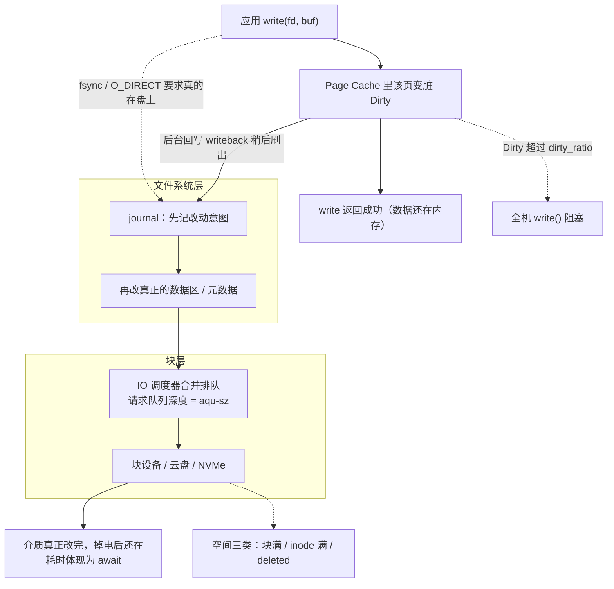
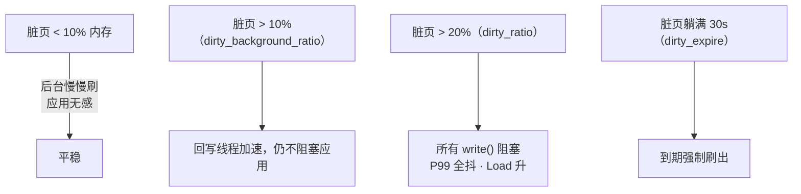
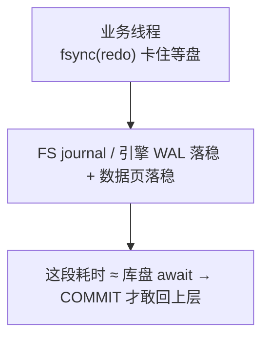
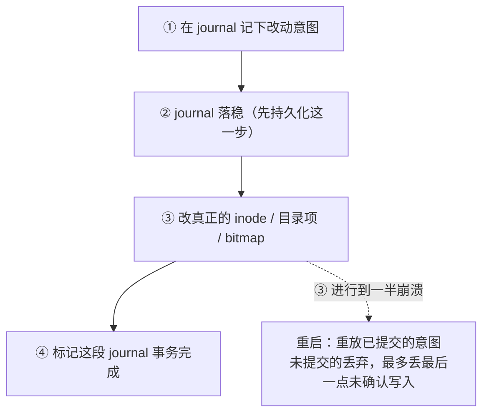
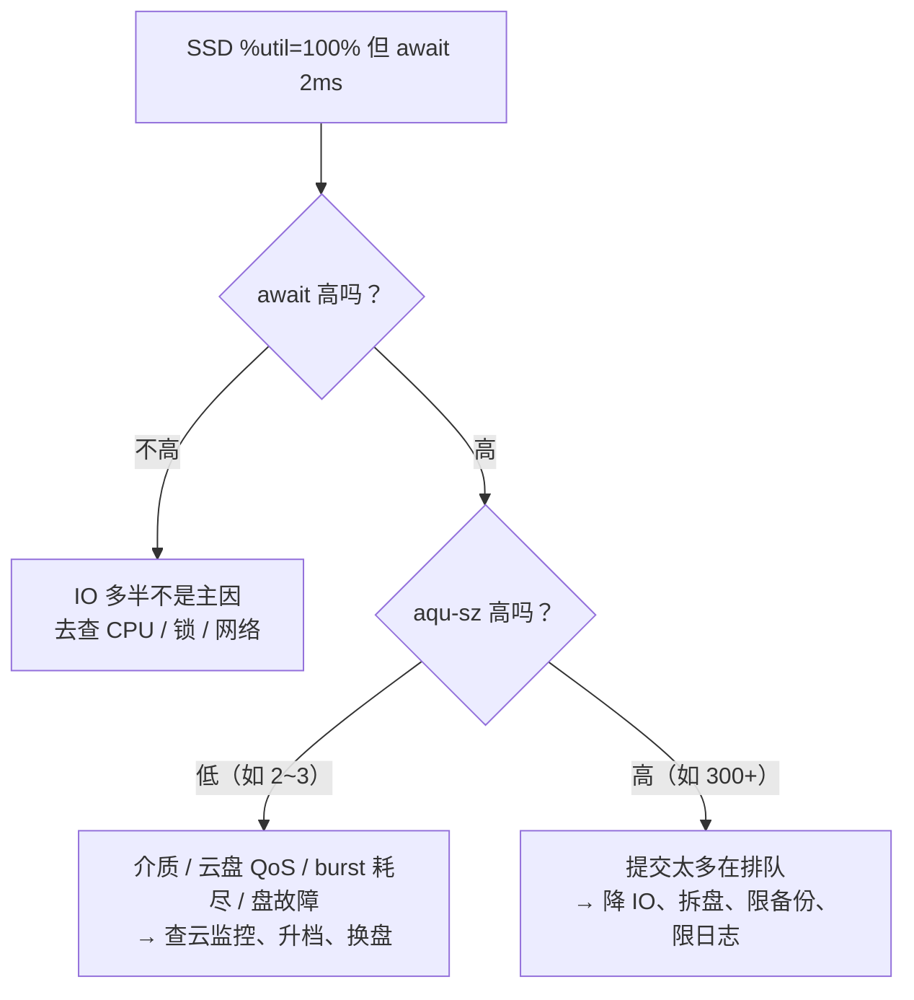
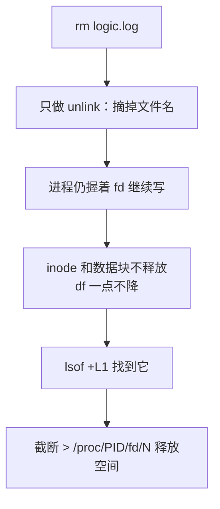
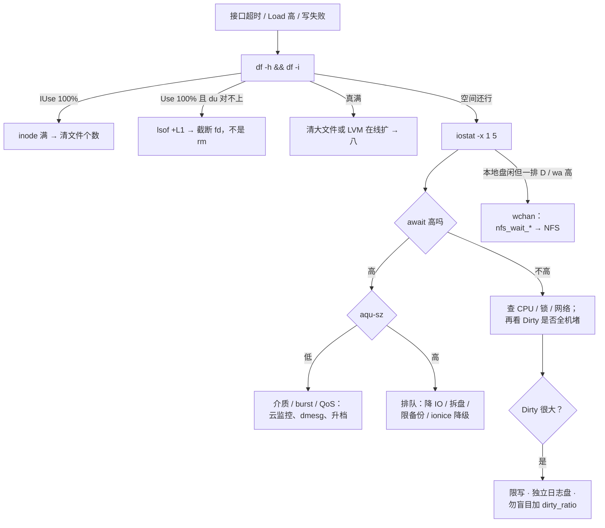

# 磁盘与 IO

> 大家好，欢迎来到这次分享。开讲之前，先带大家回到一个很多值班同学都经历过的现场：
> 开服活动接口全超时，CPU 还有 50% 空闲——有人盯 `%util` 100% 喊换 SSD，有人要重启大法，真凶可能是脏页、inode 满、deleted 文件，或云盘 burst 耗尽。
> 这一章讲完，你会知道当时不该先换盘，以及「盘慢」告警 60 秒内该怎么定责。
> **本章回答**：一次 `write()` 从应用到介质的一生，以及一条「盘慢」告警怎么在 60 秒内定责。
> **不讲**：D 进程与信号 → [05](../05-进程与信号/)；`%wa` 与 Load → [06](../06-CPU与Load/)；available/OOM → [07](../07-内存与OOM/)；inode 密度/fstab → [09](../09-文件系统与inode/)；分区/加盘全流程 → [29](../29-磁盘管理与LVM/)。这些都有专门的章节，本章只在用到时点到为止。

**标记**：🎯重点 · 🔥难点 · ⭐常考 · 🔧实操

**怎么听这场分享**：咱们先看第一节的主图，把「一次 write 的一生」装进脑子；第二到第八节顺着出发 → 中转 → 落盘 → journal → 排队 → 生病 → 落地往下走；第九节专门讲作战，也就是开头那个现场的正确解法。每一节讲完都会提示对应练习题，学完就去练。

---

## 一、一张图：一次 write 的一生

> 🎯 **一句话**：一次写要过五道门——应用、Page Cache、文件系统、块层、介质，每道门都有专属的观测指标和卡点。

咱们先不急着背 iostat 列名。学磁盘最怕的就是看见 `%util` 100% 就喊换 SSD——连 write 返回时数据在哪都不知道。先看图，把五道门装进脑子里：



**读图**：实线是数据的正常流向——默认 buffered 写在 ② 就「假装完成」，回写和 fsync 两条路汇进文件系统；你监控里看的 await/aqu-sz 挂在块层以下，Dirty 挂在 ②，`%wa` 挂在 CPU 侧。两条虚线是事故路：脏页超限堵全机、空间三类报 No space——它们都不在「盘慢」这条主干上，这就是告警容易定错责的原因。

### 把主图走活：活动高峰一次 write

场景：开服活动，逻辑服疯狂写 `logic.log`，接口开始超时，CPU idle 还有 50%。对照主图四步走：

**① 出发（应用层）**——`write(log_fd, "login ok\n")` 把数据拷进 Page Cache、标脏、返回 0，线程继续干活。玩家侧日志显示「写成功」，盘上可能还没有这一行。

**② 中转（Cache 层）**——脏页堆积：

```text
Dirty:  8388608 kB    # ← 8G，向 dirty_ratio（~20% 内存）顶
```

新的 `write()` 开始在内核里睡觉，等回写刷出一批——接口全超时、CPU 不高，就是这一档。

**③~④ 路上与排队（块层）**——回写洪峰进队列：

```text
Device   r/s    w/s   rkB/s   wkB/s  r_await w_await  await  aqu-sz  %util
nvme0n1   80  12000    3200   96000     0.5    38.0   37.2   380.4   99.2
# w_await 38ms ← NVMe 事故级；aqu-sz 380 ← 提交太多在排队；util 99% ← 只说明忙
```

**⑤ 收口（定责）**：Dirty 很大 + 全机写卡 → 脏页档（第三节）；await 高 + aqu-sz 高 → 排队型，降 IO 拆盘限备份（第六节）；逻辑与库同盘 → fsync 被日志吞吐吞掉（第八节分盘）。走读顺序永远是**应用返回语义 → 脏页水位 → iostat 分型 → 空间/D 分支**，不是先换盘。

好，主图走活了。咱们正式出发——第一站：write 返回时，数据到底在哪。

---

## 二、出发：write 返回 ≠ 落盘 ⭐

> 🎯 **一句话**：buffered write 只保证数据进了 Page Cache，掉电安全从来不是它的承诺。

**Page Cache（页缓存）** = 内核拿空闲内存缓存文件内容的那部分页。默认 buffered 模式下，`write()` 把数据拷进 Page Cache、把该页标成**脏页（dirty page）**就返回 0——此刻盘上还没有这一行。真正落盘由两条路触发：内核**回写（writeback）**线程后台刷，或应用主动 `fsync`。

读路径对照着记，不用花篇幅：`read()` 命中 Page Cache 几乎不碰盘；未命中才走块层读并回填缓存。iostat 里读写分开列 `r_await` / `w_await`，游戏服高峰先看 `w_await`。

> ⚠️ **别混**：buffer 和 cache。早期 Unix 有独立的 block buffer cache，现代 Linux 统一进 Page Cache；`/proc/meminfo` 里 `Buffers` 是块设备映射残留、`Cached` 是文件页缓存，日常排障不用区分，面试提一句「现代内核已统一页缓存」即可。

> 📝 **面试**：write 返回成功只代表进了 Page Cache；掉电安全 ≈ 你调用了 fsync（或 O_SYNC 等价语义）且设备确认完成。读路径同理：命中 Cache 不产生盘 IO，「读多写少却 await 高」先怀疑缓存被谁冲掉，而不是盘坏了。

---

这一节对应练习题 Q2——写返回语义，下一节进脏页。

write 返回 ≠ 落盘讲清了。大家想想：全机接口超时、CPU 还闲着一半，真凶会不会在脏页水位？

## 三、中转：脏页与回写 ⭐🔥

> 🎯 **一句话**：脏页堆过 dirty_ratio，全机的 write() 一起被堵——卡的是写路径，不是某个接口的逻辑。

大家想想：接口全超时、CPU idle 还有 50%，是不是业务逻辑挂了？很多人会答「先重启大法」——**错了**，先看 Dirty 水位。⭐ 口诀：**「Dirty 顶到 dirty_ratio，全机 write 一起堵」**（练习题 Q3）。

> 💡 **打个比方**：Page Cache 是快递代收货架，write 返回 = 包裹贴单上架，回写 = 货车拉走。货架堆到顶（dirty_ratio），前台收件员只能停下来等货车——**每个寄件人都被堵**，不管你寄的是哪家。

三个内核参数只记这三个，全是比例/时限的水位线：

- `vm.dirty_background_ratio` ≈ **10%** 内存：脏页超过它，内核开始**后台**回写，应用无感
- `vm.dirty_ratio` ≈ **20%** 内存：超过它，发起写的**应用在 write() 里被阻塞**，直到刷出一批
- `vm.dirty_expire_centisecs` = **30s**：一个脏页最多躺 30 秒就该被考虑刷出



**读图**：从左往右是水位上涨的顺序——10% 只是后台加速，20% 才是「全机写卡住」的开关，30s 是兜底时钟。排障时先问「现在脏页在哪个档位」，再决定是限写还是等它自己刷完。

> 🔍 **现场**：
> ```bash
> grep -E 'Dirty|Writeback' /proc/meminfo
> ```
> ```text
> Dirty:          12582912 kB    # ← 12G 脏页，256G 机器已过 20% 档 → 全机 write 在堵
> Writeback:        262144 kB    # ← 正在被刷出去的部分
> ```

触发场景：开服热更包落盘 + 全服登录日志、凌晨备份打满写带宽。**治理口径**：限日志级别、独立日志盘、备份错峰、cgroup `io.max` 给备份限速（→ [10](../10-cgroup与容器/)）。

> ⚠️ **别混**：盲目加大 dirty_ratio 不是优化——只是把爆炸推迟，爆炸时阻塞更久。另外脏页很多时 available 会偏乐观，判断内存要看 07 的口径 → [07](../07-内存与OOM/)。

> 📝 **面试**：卡住全机的常常是脏页刷不出去（介质/带宽跟不上写入速率），不是 `%util`，更不是某个 HTTP handler 慢。

这一节对应练习题 Q3——脏页，务必练熟。

---

脏页是「稍后刷」。那谁要求「现在就在盘上」？fsync 与 O_DIRECT。

## 四、要落盘：fsync 与 O_DIRECT ⭐🔥

> 🎯 **一句话**：掉电安全看 fsync 语义；O_DIRECT 解决的是双缓冲，不是持久化。

- **fsync(fd)**：返回前，该文件的数据**及所需元数据**都落到稳定存储
- **fdatasync(fd)**：同上但不等 mtime 这类非必要元数据，少写一点日志，库引擎常用
- **O_SYNC**（打开文件时的 flag）：每次 write 自带持久化语义，等于每次都隐式 fsync
- **O_DIRECT**：绕过 Page Cache 直接下盘，有**对齐要求**（buffer 地址、长度、偏移都要按 512B/4KB 对齐），否则报 EINVAL

> 💡 **打个比方**：buffered write 是快递放代收点、小票一拿就走；fsync 是非要等到快递员回传「已入仓拍照」才肯离开柜台——安全，但你俩绑在一起等。

库为什么要 O_DIRECT：数据库有自己的 Buffer Pool，若再走 Page Cache 就是**双缓冲（double buffering）**——同一份数据内核缓存一份、引擎缓存一份，白白吃内存还多一层刷写。

fsync 的时间线，这是「库盘 await 直接打进事务 P99」的原因：



**读图**：从左往右是时间顺序——业务线程在 fsync 处同步等待，等待时长就是这笔 IO 的 await；所以库盘 await 抖 = 事务提交 P99 抖，两个监控曲线会一起跳。

生产怎么选（口径）：

- 游戏逻辑日志：**buffered + 轮转**——要吞吐，丢几行可接受
- 数据库数据/redo：**O_DIRECT（或引擎自管缓存）+ fsync**——防双缓冲、保提交语义
- etcd WAL：**强 fsync**——控制面一致性，最贵的一步也是它（→ [03-02](../../03-Kubernetes/02-etcd/)）
- 「日志也上 O_DIRECT 更安全」：**不要**——只把延迟绑死在盘上，没有语义收益，面试里当扣分项

> ⚠️ **别混**：O_DIRECT ≠ 自动持久。它只决定「走不走 Page Cache」；要不要等介质确认仍由 fsync/O_SYNC 决定。

> ⚠️ **别混**：口里说「同步 IO」时先分清两套词——POSIX **同步语义**（fsync/O_SYNC，本章主战场）和**异步通知模型**（aio/io_uring，发起后不等完成）。别把 io_uring 混进「同步 vs 异步」的答案里。

> 🔍 **现场**：怎么认出是 buffered + 回写在作怪——
> ```bash
> iotop -o        # ← 只显示有 IO 的进程，回写高点抓谁在刷
> ```
> 特征：`write()` 平时极快（骗在 Cache），过几十秒 iostat 上写吞吐突然爆一波——这就是后台回写在集中落盘。

> 📝 **面试**：普通日志 buffered；库 O_DIRECT 防双缓冲、提交靠 fsync；write 返回不代表在盘上。

这一节对应练习题 Q2——三种写语义。

---

数据要改文件系统了。崩溃一致性靠谁？很多人把 FS journal 和 journald、库 WAL 混成一锅。

## 五、路上：journal 先记后改 🔥

> 🎯 **一句话**：文件系统改任何元数据前，先把「打算改什么」记进日志区，崩溃后重放日志就能恢复一致。

> 💡 **打个比方**：动仓库货架之前，先在小本子上写好「我要把 A 箱从 3 号架搬到 5 号架」。搬一半停电了，回来照着小本要么搬完、要么搬回去——货账永远是平的。没有小本，就要全场盘点（fsck），一数就是几个小时。



**读图**：关键顺序是 ② 在 ③ 前——意图先于动作落稳，崩溃才有得重放。代价是每次元数据改动多一次日志写，这也是 fsync「贵」的组成之一。

ext4 的三种 data 模式（口径级，选型细节 → [09](../09-文件系统与inode/)）：

- **data=ordered**（常见默认）：元数据走 journal，数据先于相关元数据落盘——平衡，多数发行版默认
- **data=writeback**：元数据走 journal，数据顺序更松——最快，但掉电后文件**内容**可能见到旧数据
- **data=journal**：数据也先走 journal——最安全也最慢，近似双倍写放大

XFS 有自己的 log 区，思想同类：先日志意图，再改 B+ 树结构。

**和数据库日志的分层**——三层同名不同物，各自保各自的一致性：

```text
应用/库 WAL（InnoDB redo、etcd WAL）   ← 保业务事务 / Raft 日志不丢
        ▼
文件系统 journal（ext4 / XFS）        ← 保 inode / 目录 / bitmap 不半拉子
        ▼
设备 / 云盘
```

两层不能互相替代：库 WAL + fsync 管事务不丢，FS journal 管文件系统结构一致。库盘 await 高时，可能是 WAL fsync 打满 IOPS，也可能是与游戏日志同盘抢带宽——回到第六节分型，**不是**「关 journal 优化」。

> ⚠️ **别混**：`journalctl` / journald 是 **systemd 的系统服务日志**；ext4/XFS journal 是**文件系统元数据日志**。同名不同物，排障先问对方指哪一个。

> 🔍 **现场**：
> ```bash
> findmnt -o TARGET,FSTYPE,OPTIONS /data
> # TARGET  FSTYPE  OPTIONS
> # /data   ext4    rw,relatime,data=ordered   ← data= 模式只在这看，不是猜
> dmesg -T | grep -iE 'journal|xfs|ext4|I/O error'
> ```

> 📝 **面试**：「关掉文件系统 journal 给 MySQL 加速」是拿一致性换幻想性能，正确动作是库盘独立、排查同盘抢 IO——这是 SRE 口径。

这一节对应练习题 Q6——三层日志。

---

过了文件系统就进块层排队。开头有人盯 `%util` 100% 喊换盘——咱们看看该听谁的。

## 六、排队：块层调度与 iostat 分型 ⭐🔥

> 🎯 **一句话**：慢不慢看 await，堵不堵看 aqu-sz；%util 只有 HDD 上能当饱和参考。

### 6.1 请求队列与 IO 调度器

块层（block layer）为每块设备维护请求队列，IO 调度器（IO scheduler）在里面做合并与重排。生产口径一句话：**SSD/NVMe/云盘用 `none`**（设备自己并行度够，内核别二次排队），**HDD 才用 `mq-deadline`** 这类（靠排序减少磁头寻道）。

> 🔍 **现场**：
> ```bash
> cat /sys/block/nvme0n1/queue/scheduler
> # [none] mq-deadline kyber bfq    # ← 方括号是当前值：none，SSD/云盘的正确答案
> ```

**IONice（ionice）** = 块层给进程的 IO 优先级工具，三档：`-c 1` 实时（要 root）、`-c 2` 尽力（带 `-n 0~7` 数值）、`-c 3` idle（别人不 IO 时才轮到）。经典用法是给备份降级：

```bash
ionice -c 2 -n 7 tar czf /backup/game.tgz /data    # ← 备份贴最低优先级，减少对逻辑服的挤压
```

注意：`none` 调度器下 ionice 收效有限，云上容器环境限 IO 用 cgroup `io.max` 更可靠（→ [10](../10-cgroup与容器/)）。

### 6.2 顺序 IO 与随机 IO ⭐

**顺序 IO（sequential IO）** = 请求落在相邻的磁盘块上，一个接一个；**随机 IO（random IO）** = 请求位置乱跳。这是解释一切「同是这块盘，为什么有时快有时慢」的底层变量：

- HDD 随机 IO 每次都要磁头寻道，随机性能断崖式下跌；SSD/NVMe 无机械寻道、内部高度并行，随机惩罚小得多
- 日志 append 是典型**顺序**写；数据库按页随机读写、海量小文件是典型**随机**
- iostat 上的判读：`rkB/s` 很高且 await 低 = 大块顺序；`w/s` 巨大但吞吐不高、await 抬升 = 小块随机——**吞吐和 IOPS 要结合 await 才有意义**

### 6.3 iostat -x：一张输出读懂

> 🔍 **现场**：
> ```bash
> iostat -x 1 5    # ← -x 扩展列；丢掉第一段（开机以来的平均值，没有现场意义）
> ```
> ```text
> Device   r/s    w/s   rkB/s   wkB/s  r_await w_await  await  aqu-sz  %util
> nvme0n1   80  12000    3200   96000     0.5    38.0   37.2   380.4   99.2
> #         ↑每秒完成的请求数      ↑吞吐    ↑读写各自耗时  ↑综合耗时 ↑在飞队列 ↑忙时间占比
> ```

- **await**：一笔 IO 从进设备层到完成的平均耗时，**含排队**——定「慢不慢」的主证据
- **aqu-sz**（平均队列深度，老版本叫 avgqu-sz）：同一时刻在飞的请求大概有多少——定「是盘慢还是提交太多」
- **%util**：采样周期里设备有工作在身的时间占比——**不是**「盘满了百分之几」
- `r_await` / `w_await` 分开看，先定位是读炸还是写炸
- 🔥 `svctm` 在新版本已不可靠，**别看、别在面试里当论据**

数字锚：本地 NVMe await 常见 **小于 1–5ms**，**≥20ms** 就是事故级，要给解释。

### 6.4 分型：await × aqu-sz



**读图**：入口永远是 await，第二问才是队列——顺序反了就会得出「换盘」的错误结案。最下面那条是高频陷阱：SSD/NVMe 并行度高，%util 打满只说明一直有活干，不证明吃不下更多；HDD 才可以把 %util 接近 100% 当饱和信号。

> 💡 **打个比方**：await 和 %util 是「每位顾客结账耗时」和「收银员手上有没有活」——收银员一直忙（util 100%）不代表每单都慢；队排到门口（aqu-sz 高）每单才开始变慢（await 高）。

> ⚠️ **别混**：iowait 高 ≠ IO 瓶颈。`%wa` 是 **CPU 视角**——「有空闲核且在等 IO」的比例：NFS 挂死时本地盘干净、wa 却很高；CPU 打满时 wa 会被挤成 0，但盘明明很慢。**磁盘慢不慢，听 await 的；wa 只说明有人在等**。Load 里含 D 进程的口径 → [06](../06-CPU与Load/)。

> ⚠️ **别混**：云盘 await 从 2ms 一夜变 50ms、写入量没翻倍、%util 也不吓人——先查**突发额度（burst balance）/ IOPS 上限 / 邻居抢额度**（云监控里看）。云盘 QoS 在 hypervisor 侧，改客户机里的 IO 调度器救不了 burst。

### 收束：一层一个温度计

把本章观测指标按主图的层收成一张图，值班时从上往下扫：


**读图**：从左到右就是一次写的一生逐层下探——P99 抖先问「是不是只有 IO 型接口抖」，再看 CPU 在不在等（wa/b），再看脏页水位，再看队列分型，最后别忘了空间这个不在线路上的暗雷。iotop / pidstat 回答「是谁」（进程视角），wchan 回答「卡在哪」（D 进程专用），都不在这条线的单层上。

可背清单：**慢看 await、堵看 aqu-sz、谁在写看 iotop、水位看 Dirty、空间看 df -h + df -i、卡死看 wchan**。

> ⚠️ **别混**：这张图保证「盘慢」能定位到层，不保证「盘没问题」——await 正常也可能死在应用锁、GC 或网络；各层全绿但接口仍慢，就把战场切到 [06](../06-CPU与Load/)、[12](../12-网络栈与Socket/)。

> 📝 **面试**：记忆分组报指标——CPU 组（wa/b）、内存组（Dirty/Writeback）、块层组（aqu-sz/调度器）、设备组（await/%util）、空间组（df -h / df -i）。先报组名再报指标，条理分就有了。

这一节对应练习题 Q1、Q7、Q13——await 分型，务必练熟。

---

排队之外还有三类「空间病」和一排 D——告警像盘慢，根因可能是满了或 NFS。

## 七、生病：空间三类与一排 D ⭐

> 🎯 **一句话**：「No space」有三种病——块满、inode 满、deleted；只看 df -h 会漏掉后两种。

### 7.1 块满与 inode 满

数据块和 inode 是**两套配额**。`df -h` 看块、`df -i` 看 inode。

> 🔍 **现场**：`df -h` 还有 30% 空间，热更目录几十万个小补丁文件，`touch` 报 No space——
> ```bash
> df -h /data && df -i /data
> ```
> ```text
> Filesystem      Size  Used Avail Use% Mounted on
> /dev/nvme0n1p1  500G  350G  150G  70% /data      # ← 块还剩 150G，不是块满
>
> Filesystem      Inodes  IUsed  IFree IUse% Mounted on
> /dev/nvme0n1p1    10M    10M      0  100% /data   # ← inode 槽位用光，touch 建不了新文件
> ```

清几个大日志**还不了**海量小文件占的 inode——清的是文件**个数**。目录按日期分桶、别在一个目录塞百万文件，inode 密度与 mkfs 参数 → [09](../09-文件系统与inode/)。

### 7.2 deleted：rm 了空间不降



**读图**：rm = unlink，摘的是名字不是数据；空间要等**最后一个 fd 关闭**才回收。所以止血动作是截断那个 fd（`: > /proc/<PID>/fd/<N>`），**不是再 rm 一遍**——文件名早就没了。

> 🔍 **现场**：
> ```bash
> lsof +L1 | grep deleted
> # java  28451 root  3w  REG  259,1 42949672960 ... /var/log/logic.log (deleted)
> # ← 进程 28451 的 fd 3 还握着 40G 的已删除文件
> ```

根治在轮转姿势：logrotate 用 **copytruncate**（复制后截断原文件），或让进程 reopen 新文件（nginx `kill -USR1`）（→ [23](../23-日志运维/)）。Docker 容器日志不设 `json-file` 的 `max-size` / `max-file`，同样能把节点盘写满——这是容器环境的经典复发位（→ [10](../10-cgroup与容器/)）。

> ⚠️ **别混**：du 和 df。`du` 是把目录树里的文件**算出来**求和（看不到 fd 还握着的已删文件）；`df` 问的是文件系统**已分配块**。du 比 df 小很多且有进程在写日志 = 有 deleted。

### 7.3 只读挂载与一排 D

- 写入报 **EROFS** / dmesg 刷 I/O error：文件系统被挂只读或介质在坏——**先 `dmesg -T` 看内核说了什么**，不是先加盘
- 一排 **D 状态**（uninterruptible sleep）进程：
> ```bash
> ps aux | awk '$8 ~ /D/'        # ← 抓出所有 D 状态进程
> cat /proc/{PID}/wchan; echo    # ← 看它睡在内核哪个函数
> ```
> ```text
> wait_on_page_writeback    # ← 卡在等脏页刷出 → 回第三节
> blk_mq_*                  # ← 卡在本地块设备 → 盘/云盘 hang
> nfs_wait_*                # ← 卡在 NFS → 远程问题，本地 iostat 是干净的
> ```

`kill -9` 对 D 无效（信号要等系统调用返回），进程语义细节 → [05](../05-进程与信号/)。**本地 iostat 干净 + 一排 D + wa 高 = 优先怀疑 NFS/远程 IO**。

> 📝 **面试**：有空间却 No space 是 inode 满，查 df -i；rm 了 df 不降是 deleted，lsof +L1 找到后截断 fd，别重启也别再 rm。

这一节对应练习题 Q4、Q5、Q8、Q9——空间与 D。

---

定责会了，落地怎么扩、怎么分盘？库和日志同盘是经典事故。

## 八、落地：LVM、RAID 与盘位规划 🔧

> 🎯 **一句话**：库盘日志盘分开、库用 RAID 10、SSD 调度器 none、用到 85% 就扩——装机时定的规矩，值班时少一半事故。

### 8.1 LVM：一层可以在线扩的池


**读图**：PV→VG→LV 是「砖→池→切出来的卷」，在线扩容就是往池里加砖再把卷拉长——不用停服、不用迁移数据。

```bash
# 在线扩 +100G（不停服）
pvcreate /dev/sdd                             # ← 新盘做成 PV
vgextend vg_data /dev/sdd                     # ← 砖加进池
lvextend -L +100G /dev/vg_data/lv_data        # ← 卷拉长
xfs_growfs /data                              # ← XFS 扩文件系统：跟【挂载点】
# resize2fs /dev/vg_data/lv_data              # ← ext4 用这个：跟【设备】
df -h /data                                   # ← 确认容量上来
```

🔥 **XFS 不能缩容**——只能扩；要缩选 ext4 或新建 LV 迁移。首次创建链（pvcreate → vgcreate → lvcreate → mkfs → mount）与分区/加盘全流程 → [29](../29-磁盘管理与LVM/)，fstab 用 UUID 挂载 → [09](../09-文件系统与inode/)。

### 8.2 RAID 与文件系统选型

| RAID | 容错 | 用途 |
|------|------|------|
| 0 | 无 | 临时/可丢日志，追求裸性能 |
| 1 | 1 块 | 系统盘 |
| 5 | 1 块 | 文件服务；**写有惩罚**（每次写要算校验，多一次读写） |
| **10** | 每镜像组 1 块 | **数据库 / 高 IO，生产推荐** |

云盘底层已有冗余，**云上一般不自建 RAID**。RAID 重建期 IOPS 近乎腰斩，要当变更窗口管理。对象存储节点常靠软件副本/EC，不强制硬件 RAID。

| 维度 | XFS | ext4 |
|------|-----|------|
| 大文件 / 并行写 | 更好 | 一般 |
| 在线扩 | 支持（xfs_growfs） | 支持（resize2fs） |
| 在线缩 | **不支持** | 支持 |
| RHEL 8+ 默认 | 是 | — |

### 8.3 盘位规划口径

- **库盘和日志盘分开**：同盘时游戏日志的吞吐会吞掉库 fsync 的 IOPS，活动高峰直接掉登录
- 盘使用率 **85%** 当故障处理：写放大、GC、碎片都会让 await 自己变差，别等 100%
- 日志盘额外留 **~40%** 空闲做高峰缓冲
- `innodb_io_capacity` ≈ 真实 IOPS 的 **70%** 配置（→ [02-01 MySQL](../../02-中间件与数据库/01-MySQL/)）

> 📝 **面试**：数据库盘 RAID 10、云上不自建、库日志分盘、XFS 只扩不缩——四句背完。

这一节对应练习题 Q10、Q11、Q12——落地与云盘。

---

一生五道门齐了。接到「盘慢」告警，60 秒怎么定责？就是开头那个现场的正确解法。

## 九、作战：「盘慢」告警的一生 🔧

> 🎯 **一句话**：先排除空间，再 await 分型，最后才谈换盘——顺序错了就是白干一小时。

### 9.1 定责决策树



**读图**：每个分支开头都是真实输出而不是抽象类别——「IUse 100%」「du 对不上」「本地盘闲但一排 D」。两条最容易被跳过的路：空间类（左半，完全不在线路图主干上）和 NFS（右下，本地 iostat 全绿也照样卡死业务）。

### 9.2 现象 · 先做 · 别做

| 现象 | 先做 | 别做 |
|------|------|------|
| 接口超时、CPU 闲、Load 高 | iostat 看 await+队列；查 Dirty；查 D | 盯着 %util 换 SSD |
| SSD %util 100%、await 2ms | 不当瓶颈结案，继续看业务 | 换盘 |
| await 高 + 队列高 | 降 IO、拆盘、限备份 | 只加大 dirty_ratio |
| await 高 + 队列低 | 云监控 burst/IOPS、dmesg、介质健康 | 先改调度器救命 |
| 云盘 2ms→50ms | 查 burst 额度与 IOPS 上限 | 改客户机调度器 |
| df 100%、刚 rm 过日志 | lsof +L1 → 截断 fd | 再 rm 或重启 |
| 有空间 touch 失败 | df -i | 只删几个大日志 |
| 一排 D、本地 iostat 干净 | wchan 看是否 nfs_wait | kill -9 硬杀 |
| Dirty 很高、全机卡 | 限写、错峰、独立日志盘 | 加大 dirty_ratio 当优化 |
| 库 P99 抖、与日志同盘 | 拆盘 / 错峰 | 关 FS journal |
| /data 用到 85% | 当故障，LVM 在线扩 | 等 100% 再动 |

### 9.3 60 秒剧本 🔧

- **0–10s**：`df -h && df -i`——先排掉空间三类（块满/inode/deleted 的入口都在这）
- **10–30s**：`iostat -x 1 5` + `grep -E 'Dirty|Writeback' /proc/meminfo`——await 分型 + 脏页水位
- **30–45s**：`iotop -o` 抓谁在写；`ps aux | awk '$8 ~ /D/'` 抓卡死进程并看 wchan
- **45–60s**：按决策树给出结案口径——「介质/QoS 型」报云监控换盘，「排队型」限流拆盘，「空间型」截断清理，并向 06/12 转单不属于盘的现场

值班最小三联（背下来）：

```bash
df -h && df -i
iostat -x 1 5
grep -E 'Dirty|Writeback' /proc/meminfo
```

### 9.4 日志盘满止血顺序

1. 截断正在写的日志：`: > /proc/<PID>/fd/<N>`——**不要 rm**（见第七节）
2. 确认 `df` 真的降了
3. 调日志级别 / 修轮转（copytruncate 或 reopen）；顺手 `lsof +L1` 查有没有 deleted
4. 同时看 `df -i`——小日志文件多时 inode 先满
5. 根治：日志从 NFS 挪本地、备份错峰或 `io.max` 限速

### 9.5 游戏服高频根因（对着树背）

1. 凌晨全服备份打同一块共享盘 → 逻辑服 P99 从 20ms 打到 500ms（排队型，右下分支）
2. 开服热更 + 登录日志 → 空间或 inode 先满（左半分支）
3. 逻辑服与库同盘 → 库的 fsync 被日志吞吐吞掉 IOPS
4. etcd 与游戏日志同盘 → WAL fsync 打到几百 ms，表现像整个 API 挂了

这一节对应练习题 Q7、Q14——作战综合，务必练熟。

---

**回到开头那个现场**：开服活动接口全超时，CPU 还有 50% 空闲——有人盯 `%util` 100% 喊换 SSD，有人要重启。正确处理：先看 Dirty 水位 → iostat 听 await/aqu-sz 分型 → 空间三类与 D 分支排查，**不是先换盘**。现在再看群里那两个人的操作，你知道该怎么拦住他们了。

这一节对应练习题 Q7、Q14——作战综合，务必练熟。

---

到这里，本章的主要内容就讲完了。最后一部分是三张「小抄」：命令速查留着值班用，面试锚点留着面试前过一遍，易错对照留着自查——每条都是别人踩过的坑。

## 十、收口

### 命令速查 🔧

- 空间 / inode：`df -h` · `df -i`
- 盘慢分型：`iostat -x 1 5`（await / aqu-sz / %util）
- 整机等 IO：`vmstat 1 5`（b、wa 列）
- 谁在写：`iotop -o` · `pidstat -d 1 5`
- 脏页水位：`grep -E 'Dirty|Writeback' /proc/meminfo`
- deleted：`lsof +L1 | grep deleted`
- D 卡死：`ps aux | awk '$8 ~ /D/'` + `cat /proc/<PID>/wchan`
- 调度器：`cat /sys/block/<dev>/queue/scheduler`
- 挂载选项：`findmnt -o TARGET,FSTYPE,OPTIONS /data`；内核报错：`dmesg -T`
- LVM：`pvs` · `vgs` · `lvs` · `lsblk`

### 面试锚点

遮住右列自问自答，卡壳的行回去重读对应小节——能讲出来才算会：

| 问 | 30 秒答 |
|----|---------|
| SSD 看什么定瓶颈？ | await + aqu-sz；%util 100% 不单独结案，HDD 才可当饱和参考 |
| await 高怎么分型？ | 队列低=介质/QoS/burst；队列高=提交太多在排队，降 IO 拆盘 |
| write 返回了数据在盘上吗？ | 不一定，buffered 下在 Page Cache；掉电安全看 fsync |
| 顺序 IO 和随机 IO 差在哪？ | 相邻块 vs 乱跳；HDD 随机被寻道杀死，SSD 并行惩罚小；判读结合吞吐与 IOPS |
| dirty_ratio 触发会怎样？ | 全机 write() 阻塞；治理是限写拆盘，不是加大比值 |
| df 和 du 为什么对不上？ | 有进程握着已 unlink 的 fd；lsof +L1 找到后截断 |
| 有空间却 No space？ | inode 满，df -i，清文件个数 |
| journal 是什么？ | FS 崩溃一致性日志，先记意图再改真数据；≠ journald，也替代不了库 WAL |
| 库盘选什么 RAID？ | RAID 10；云上不自建；库和日志必须分盘 |
| XFS 能缩吗？ | 不能，只能扩（xfs_growfs 跟挂载点） |
| IONice 干什么的？ | 块层 IO 优先级，备份用 ionice -c 2 -n 7 降级；none 调度器下效果有限，云上用 io.max |
| 云盘 await 2ms→50ms？ | 先查 burst 额度/IOPS 上限，改调度器没用 |

### 易错一句话对照

- 「%util 100% 就是盘满了」→ 是忙时间占比；SSD 并行高，仍可能吃得下更多，听 await 的
- 「wa 是 0 盘就快」→ CPU 打满会把 wa 挤成 0，盘照样慢
- 「wa 高一定是本地盘」→ NFS 远程等待也高；看 wchan 分层
- 「write 返回了就丢不了」→ 只进了 Page Cache，掉电安全看 fsync
- 「日志上 O_DIRECT 更安全」→ 只把延迟绑死在盘上，没有语义收益
- 「加大 dirty_ratio 优化写」→ 推迟爆炸，爆炸时堵得更久
- 「rm 大日志必腾空间」→ 进程 fd 还握着就不降
- 「清大文件能救 inode 满」→ inode 是个数配额，要删文件个数
- 「关 FS journal 给库提速」→ 拿一致性换幻想性能
- 「云盘慢改 cfq 调度器」→ QoS 在 hypervisor，客户机改不动

### 数字墙

> **await**：本地 NVMe 小于 1–5ms 舒适，≥20ms 事故级；优质云盘个位数 ms
> **脏页三档**：dirty_background_ratio ~10% · dirty_ratio ~20% · dirty_expire 30s
> **空间红线**：盘 85% 当故障；日志盘另留 ~40%
> **容量口径**：innodb_io_capacity ≈ 真实 IOPS × 70%

---

## 合上书

学到这里，先别急着翻下一章。合上书，试试下面这几件事能不能做到——能做到，这章才算真的听懂了。卡住的那一条，就回到对应的小节再听一遍（练习题「合上书」与这里逐条对齐）：

- [ ] **默画主图**：`write → Page Cache(脏页) → journal → 块层队列 → 介质`，fsync/O_DIRECT 的分叉在哪汇入（→ Q14）
- [ ] **口述**：write 返回时数据在哪？掉电安全靠什么保证？（→ Q2）
- [ ] **讲清**：脏页三参数各管什么档位；超 dirty_ratio 后全机发生什么；加大它行不行（→ Q3）
- [ ] **讲清**：buffered / fsync / O_DIRECT 怎么选；日志能不能上 O_DIRECT；为什么库要防双缓冲（→ Q2）
- [ ] **默画**：journal 事务四步 + 崩溃重放；三层日志（库 WAL / FS journal / journald）各保什么（→ Q6）
- [ ] **分型**：await 高 + aqu-sz 高 vs 低各指向什么；SSD %util 100% 怎么结案（→ Q1、Q7）
- [ ] **讲清**：顺序 IO vs 随机 IO 谁吃亏；调度器怎么选；IONice 用在什么场景（→ Q13）
- [ ] **口述**：%wa 为什么会骗人（NFS、CPU 挤 0）；磁盘慢最终听谁的（→ Q8）
- [ ] **分型**：块满 / inode 满 / deleted 各自的签名和第一刀；df 和 du 为什么对不上；一排 D 看 wchan（→ Q4、Q5、Q9）
- [ ] **落地**：LVM 在线扩四步（XFS 跟挂载点、ext4 跟设备）；XFS 能否缩；库盘 RAID；盘位规划三句（→ Q10、Q11）
- [ ] **作战**：60 秒剧本的三个时间窗各敲什么；值班最小三联（→ Q14）
