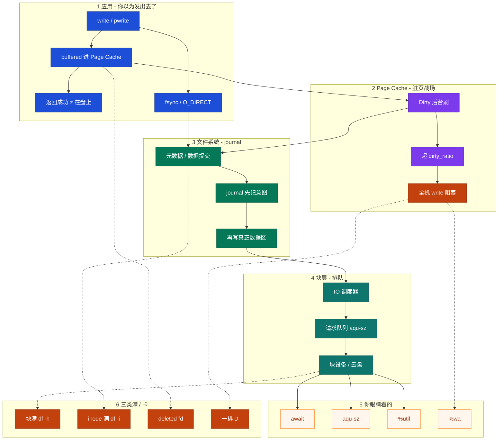
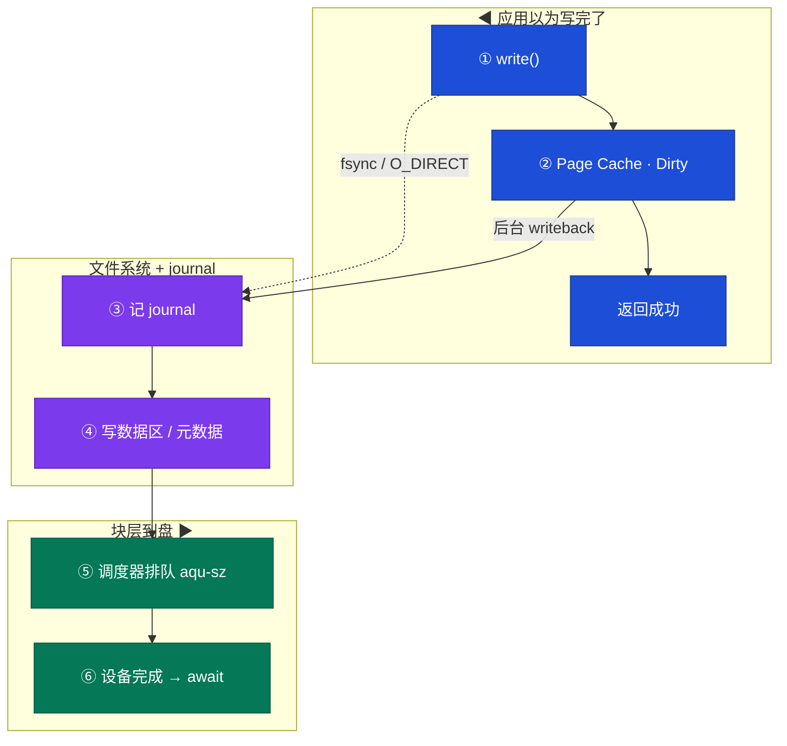
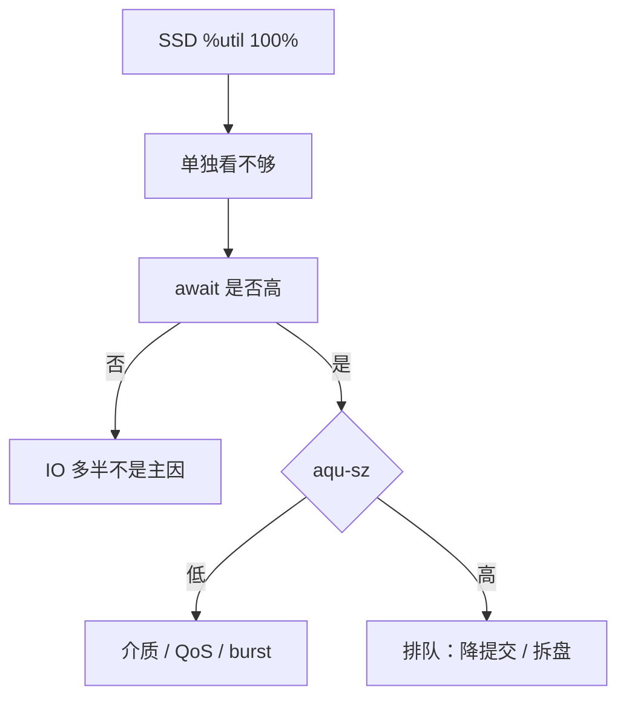
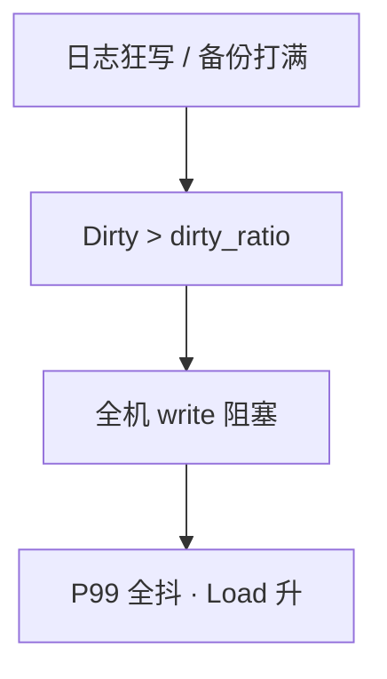
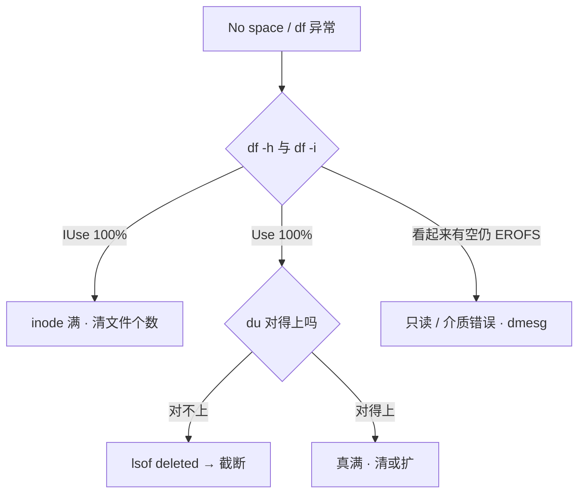
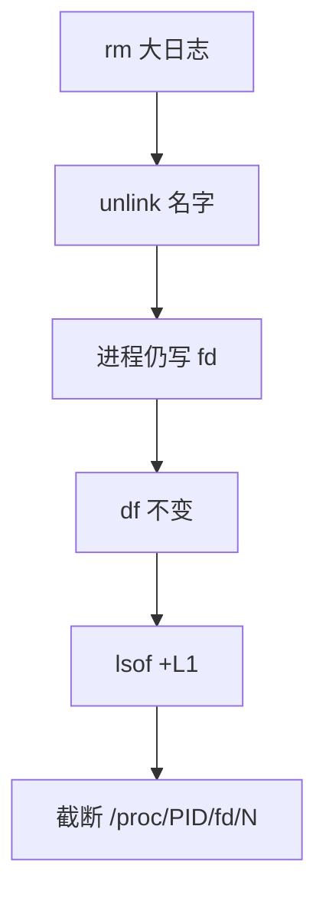
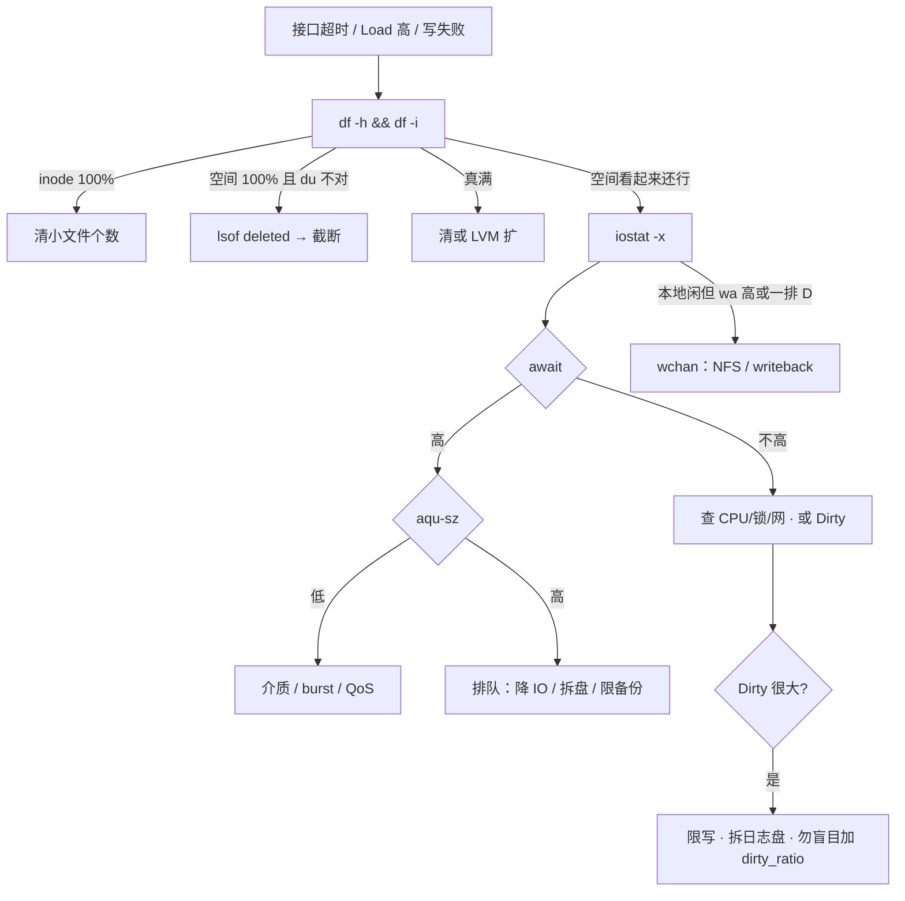

# 磁盘与 IO

> **这章解决什么**：接口全超时、CPU 还闲、Load 却很高——是盘慢、脏页堵死、空间满，还是 inode / deleted？  
> **读法**：**先看总图** → **再认名词** → **再分节抠 iostat / 同步异步 / 空间三类 / journal**。  
> **刻意不展开**：D 杀不掉、wchan 细节 → [05](../05-进程与信号/)；Load 含 D、`%wa` 与 CPU → [06](../06-CPU与Load/)；Dirty 让 available 偏乐观 → [07](../07-内存与OOM/)；inode 密度 / fstab UUID → [09](../09-文件系统与inode/)；cgroup `io.max` → [10](../10-cgroup与容器/)；InnoDB flush → [MySQL](../../02-中间件与数据库/01-MySQL/)；logrotate → [23](../23-日志运维/)。

---

## 本章目录

1. [本章定位](#1-本章定位)
2. [先看总图：一次写怎么落到盘上](#2-先看总图一次写怎么落到盘上) ← **开篇必读**
   - [2.0 全章知识串图](#20-全章知识串图一张把细节串起来) ← **架构总览**
   - [2.6 完整走读](#26-完整走读活动高峰一次-write从应用到盘)
   - [2.7 fsync / journal 走读](#27-走读fsync--journal库盘怎么保证掉电不丢)
3. [名词扫盲（对照总图认词）](#3-名词扫盲对照总图认词)
4. [iostat 对象与读法](#4-iostat-对象与读法)
5. [await / aqu-sz / %util：本章最易混](#5-await--aqu-sz--util本章最易混) ← **重点精读**
6. [同步 vs 异步：buffered / fsync / O_DIRECT](#6-同步-vs-异步buffered--fsync--o_direct)
7. [脏页与 writeback：全机 write 卡住](#7-脏页与-writeback全机-write-卡住)
8. [空间三类：块满 / inode / deleted](#8-空间三类块满--inode--deleted)
9. [journal：文件系统日志在路径上干什么](#9-journal文件系统日志在路径上干什么)
10. [IO 排队定责决策树](#10-io-排队定责决策树)
11. [落地：LVM / RAID / 调度器](#11-落地lvm--raid--调度器)
12. [去哪章继续学](#12-去哪章继续学)
13. [面试 · 易错 · 数字](#13-面试--易错--数字)
14. [合上书](#合上书)

---

## 1. 本章定位

| 章 | 负责 |
|----|------|
| **05（本章）** | 写路径、iostat 定责、脏页、空间三类、journal、排队分型 |
| **03** | Load / `%wa` / 软中断与 CPU 视角 |
| **04** | Page Cache、available、OOM |
| **14** | inode 结构、fstab、ext4/xfs 选型细节 |

本章是**磁盘线入口**。后面所有 await、dirty_ratio、df≠du，都建立在「一次 write 怎么从应用到盘」这张图上。

🎯 **值班签名**：接口超时、CPU idle、Load 高——先 `iostat -x` 看 **await + aqu-sz**，**别先盯 %util 喊换 SSD**。

---

## 2. 先看总图：一次写怎么落到盘上

> **正确开篇顺序**：先有全局画面，再认词，再抠细节。  
> 先看 **§2.0 全章串图**（考点挂一张板上），再看 **§2.1 写路径坐标系**，再用 **§2.6 / §2.7 走读**把现场串起来。

### 2.0 全章知识串图（一张把细节串起来）

> 🎯 **合上书要能默画这张。** 蓝=应用写 · 紫=缓存/脏页 · 绿=块层到盘 · 橙=卡点/满。  
> 若预览仍报错，以下面 **ASCII 一页板** 为准。



**读图路线：**

| 段 | 记住 |
|----|------|
| ① | `write` 返回快，是因为先进 Page Cache（§2.1、§6） |
| ② | Dirty 超 dirty_ratio → **全机** write 阻塞（§7） |
| ③ | journal 先记「打算改什么」，再改真正数据（§9） |
| ④ | 排队看 aqu-sz；慢看 await（§4、§5） |
| ⑤ | wa / await / util **三个视角**，别混（§5） |
| ⑥ | 块满 / inode / deleted / D → 定责树（§8、§10） |

```text
┌──────────────────────────────────────────────────────────────────────────┐
│                     05 一张板：从 write 到盘到定责                          │
├─────────────┬────────────────────┬───────────────────────────────────────┤
│  应用       │  Page Cache        │  FS + 块层 + 盘                       │
│  write()    │  Dirty 后台刷      │  journal → 调度器 → 设备              │
│  返回≠落盘  │  超 dirty_ratio    │  await / aqu-sz / %util               │
│  fsync/DIRECT│  → 全机 write 堵  │  云盘 QoS / burst                     │
├─────────────┴────────────────────┴───────────────────────────────────────┤
│  满：块满 df-h · inode df-i · deleted lsof · D→wchan  → 定责树            │
└──────────────────────────────────────────────────────────────────────────┘
```

---

### 2.1 一张总图（应用 → Cache → FS → 块 → 盘 · 先建立坐标系）

假设：逻辑服往 `/data/logic.log` 写一行；库进程对事务做 `fsync`。

**怎么读这张路径：**

- **上半**：默认 buffered——应用以为写完了，其实还在内存  
- **中段**：文件系统可能走 journal，再进块层排队  
- **下半**：真正介质；你用 iostat 盯的就是这一段的耗时与队列

```text
应用进程
═══════════════════════════════════════════════════════════════

 ① write(fd, buf)                         ①' fsync(fd) / O_DIRECT
        │  默认 buffered                         │  要「真的在盘上」
        ▼                                        ▼
 ② Page Cache（脏页 Dirty）               ②' 绕过或强制刷出 Cache
        │  应用已返回成功                         │
        │  后台 writeback 稍后刷                  │
        ▼                                        ▼
 ③ 文件系统（ext4 / XFS）
        │  改元数据 / 数据；常先写 journal
        ▼
 ④ 块层 · IO 调度器 · 请求队列
        │  aqu-sz = 在飞队列有多深
        ▼
 ⑤ 块设备 / 云盘 / NVMe
        │  await = 提交→完成平均耗时（含排队）
        ▼
 ⑥ 介质真正改完（掉电后还在）
```



**读图三句话（先背这三句）：**

1. **`write` 返回 ≠ 在盘上**：默认只保证进了 Page Cache。  
2. **卡全机的常常是脏页刷不出去**，不是某一个接口本身慢。  
3. **定瓶颈看 await + aqu-sz**；SSD 的 `%util` 100% 不能单独结案。

> Markdown 预览里若 mermaid 挤在一起，以上面 **ASCII 路径图** 为准。

---

### 2.2 同步路径 vs 异步路径（总图上的分叉）

| | 异步（默认 buffered） | 同步意图（fsync / O_SYNC / O_DIRECT+自己刷） |
|--|----------------------|-----------------------------------------------|
| `write` 返回时 | 多半在 Page Cache | 仍可能只保证提交策略；**落盘靠 fsync** |
| 谁决定何时上盘 | 内核 writeback + dirty_* | 应用主动 `fsync` / 库引擎 |
| 延迟体感 | 平时快，脏页爆炸时全机卡 | 每次提交绑在盘上，await 直接打进 P99 |
| 典型用途 | 日志、普通文件 | 数据库事务、etcd WAL |

```text
异步：  应用 write ──► Cache ──(稍后)──► 盘
              ▲ 立刻返回

同步意图：应用 write ──► … ──► fsync ──► 等盘完成再返回
                                    ▲ P99 跟 await 走
```

🔥 **注意**：口里说「同步 IO」时，先问对方指的是 **POSIX 同步语义（fsync）**，还是 **异步通知模型（aio/io_uring）**——两套词别混进同一句话。本章「同步 vs 异步」主战场是 **buffered vs 强制落盘**；aio 细节不展开。

---

### 2.3 journal 在总图上的位置（先挂点，详解见 §9）

文件系统要保证：**掉电重启后，元数据别半拉子**。办法是先写 **journal（日志区）**，再改真正树/位图。

```text
改一个文件大小 / 新建文件：
  1. 先在 journal 记：「我打算改这些元数据」
  2. journal 落稳
  3. 再改真正的 inode / 目录项 / bitmap
  4. 标记 journal 这段事务完成

崩溃恢复：重放 journal 里已提交的意图 → 文件系统一致
```

库盘的 `fsync` 贵，常常贵在：**数据 + journal（或等价 WAL）都要等到介质确认**。细节 §9。

---

### 2.4 读路径（对照，少花篇幅）

```text
read()：
  命中 Page Cache → 几乎不碰盘（看不出 await）
  未命中 → 块层读 → 填 Cache → 拷到用户态
```

排障时「读多」和「写多」在 iostat 里分 `r_await` / `w_await`。游戏服高峰更常见的是 **写放大**（日志、备份、热更落盘）。

---

### 2.5 指标挂在哪一层（别再漂）

| 你看到的数 | 挂在总图哪 | 一句话 |
|------------|------------|--------|
| `%wa` | CPU 视角 | 有空闲核且在等 IO 的比例 |
| Dirty / Writeback | §2 中段 Cache | 还没上盘的脏页有多少 |
| await | §2 下段设备 | 一笔 IO 从提交到完成 |
| aqu-sz | §2 块层队列 | 在飞请求有多深 |
| `%util` | §2 设备忙闲 | 有请求在处理的时间占比 |
| `df -h` / `df -i` | 文件系统空间配额 | 块满还是 inode 满 |

---

### 2.6 完整走读：活动高峰一次 write（从应用到盘）

场景：开服活动，逻辑服疯狂写 `logic.log`；接口开始超时；CPU idle 还有 50%。

#### 步骤 1：应用以为写完了

```text
逻辑服线程：
  write(log_fd, "login ok\n")
  → 内核拷进 Page Cache，标 Dirty
  → write 返回 0（成功）
  → 线程继续干别的
```

此时：**玩家侧日志「写成功」**；盘上可能还没有这一行。

#### 步骤 2：脏页堆起来

```bash
grep -E 'Dirty|Writeback' /proc/meminfo
```

```text
Dirty:          8388608 kB    # ~8G 脏页
Writeback:       262144 kB
```

Dirty 往 `dirty_ratio`（常 ~20% 内存）顶 → 新的 `write()` 开始在内核里睡觉，等刷出一批。

#### 步骤 3：块层开始排队

```bash
iostat -x 1 3
```

```text
Device   r/s    w/s   rkB/s   wkB/s  r_await w_await await aqu-sz %util
nvme0n1  80   12000    3200  96000     0.5    38.0  37.2  380.4  99.2
```

**口算：**

- `w_await` ~38ms，对 NVMe 是事故级（正常常见 **<1–5ms**）  
- `aqu-sz` ~380 → **提交太多在排队**，不是「盘坏了」一句结案  
- `%util` 99% → SSD 上只说明很忙，**不能单独证明已饱和到不能再吃**

#### 步骤 4：定责（本走读的结论）

| 观察 | 指向 |
|------|------|
| Dirty 很大 + 全机写卡 | 脏页 / 写超过刷盘能力（§7） |
| await 高 + aqu-sz 高 | 排队型：降 IO、拆盘、限备份（§5、§10） |
| 逻辑与库同盘 | fsync 被日志吞 IOPS → 拆盘（§11） |

> **记住**：走读顺序永远是 **应用返回语义 → Cache/脏页 → iostat 分型 → 空间/ D 分支**，不是先换盘。

---

### 2.7 走读：fsync + journal（库盘怎么保证掉电不丢）

场景：支付/存档库提交事务；监控里库盘 await 比日志盘更敏感。

```text
InnoDB / 类似引擎（示意，细节见 MySQL 章）：
  1. 改 Buffer Pool / 写 redo（引擎自己的 WAL）
  2. fsync(redo 或数据文件)
  3. 内核：相关页必须落到稳定存储
  4. 文件系统：常伴随 journal 或等价顺序写
  5. 设备完成 → fsync 返回 → 事务才敢回 COMMIT 给上层
```

```text
时间线（人话）：
  业务线程 ──fsync──► 卡住等盘
                         │
                         ▼
              journal/WAL 落稳 + 数据落稳
                         │
                         ▼
              await 直接打进这笔事务的延迟
```

和 §2.6 对比：

| | 日志 buffered 狂写 | 库 fsync |
|--|-------------------|----------|
| 平时延迟 | 低（骗在 Cache） | 绑 await |
| 爆炸形态 | dirty_ratio 全机堵 | 单笔/批量提交 P99 炸 |
| 同盘时 | 日志把 IOPS 吃光 → 库 fsync 更惨 | |

🎯 **值班签名**：库 P99 抖，先看**是否和日志/备份同盘**，再看云盘 burst——别先改 `innodb_io_capacity` 玄学加。

---

## 3. 名词扫盲（对照总图认词）

对照 §2 总图认词即可，不在这里展开机制。

| 词 | 总图位置 | 值班里什么时候碰到 | 一句话 |
|----|----------|-------------------|--------|
| Page Cache | ② | 读快写「假快」 | 内核用空闲内存缓存文件页 |
| Dirty | ② | meminfo / 全机卡 | 已改未刷盘的页 |
| writeback | ②→⑤ | iotop 见 pdflush 类 | 把脏页刷到设备 |
| await | ⑤⑥ | iostat | 单笔 IO 平均耗时（含排队） |
| aqu-sz | ④ | iostat | 平均队列深度 |
| `%util` | ⑤ | iostat | 设备有请求在处理的时间占比 |
| `%wa` / iowait | CPU | vmstat/top | 空闲核在等 IO 的比例 |
| fsync | ①' | 库、etcd | 等到相关数据在稳定存储 |
| O_DIRECT | ①' | 数据库 | 绕过 Page Cache（对齐要求） |
| journal | ③ | 掉电恢复、fsync 贵 | FS 先记意图再改真数据 |
| inode | 空间 | touch 失败但 df 有空 | 文件元信息槽位 |
| deleted | 空间 | rm 了 df 不降 | 已 unlink 仍被 fd 打开 |

> **记住**：先能指到总图哪一段，再背命令。

**三个最容易混的数（预告 §5）：**

| 数 | 视角 | 能说明 | 不能说明 |
|----|------|--------|----------|
| `%wa` | CPU | 有人在等 IO | CPU 打满时可为 0；远程 NFS 也会高 |
| await | 单笔 IO | 慢不慢 | 单独看 util |
| `%util` | 设备忙闲 | HDD 近 100% 可当饱和参考 | SSD 100% 仍可能还能吃 |

---

## 4. iostat 对象与读法

### 4.1 命令与典型输出

```bash
iostat -x 1 5          # -x 扩展；丢掉第一行（开机累计）
iostat -xd 1 5         # 有的版本只看盘
```

```text
Device   r/s   w/s  rkB/s  wkB/s  r_await w_await  await  aqu-sz  %util
nvme0n1  120  8900  4800  72000    0.8    45.2    45.2   402.1   98.5
sdb        5   200   200   8000    2.0     3.1     3.0     1.2   12.0
```

| 列 | 含义 | 怎么用 |
|----|------|--------|
| r/s w/s | 每秒完成的读/写请求 | 量级、谁在打盘 |
| rkB/s wkB/s | 吞吐 | 大块顺序 vs 小随机要结合 await |
| r_await / w_await | 读/写各自平均耗时 | 写炸还是读炸 |
| **await** | 综合平均耗时 | **定慢不慢的主证据** |
| **aqu-sz** | 平均队列深度 | **定「盘慢」还是「提交太多」** |
| `%util` | 忙时间占比 | HDD 参考；SSD 谨慎 |

🔥 `svctm` 在新版本已不可靠，**别看、别在面试里当论据**。

### 4.2 和 vmstat / iotop 怎么配合

```bash
vmstat 1 5              # b=阻塞进程数；wa=iowait；丢掉第一行
iotop -o                # 只显示有 IO 的进程
pidstat -d 1 5          # 按进程 IO
```

| 工具 | 回答什么 | 不回答什么 |
|------|----------|------------|
| iostat | 哪块盘慢、队列深不深 | 哪个进程（要 iotop/pidstat） |
| vmstat | 整机是否在等 IO（b/wa） | 哪块盘 |
| iotop | 谁在写 | 云盘 burst 额度 |

### 4.3 数字锚（先背）

| 介质 | await 常见舒适区 | 事故感 |
|------|------------------|--------|
| 本地 NVMe | **<1–5ms** | **≥20ms** 要解释 |
| 优质云盘 | 个位数 ms 常见 | 突然 2ms→50ms 先查 QoS/burst |
| HDD | 更高，看负载形态 | `%util` 近 100% 可当饱和信号 |

盘容量用到 **85%** 当故障（写放大、GC、碎片都会让 await 自己变差）。日志盘建议留 **~40%** 空闲余量做高峰。

---

## 5. await / aqu-sz / %util：本章最易混

> 🎯 **全章最容易晕的一点单独钉死。**  
> 难概念固定四步：例子 → 定义 → 命令怎么认 → 易错一句。

### 5.1 最常见具体例子

活动高峰，两人同时喊：

- A：「`%util` 100%，盘满了，换 SSD！」  
- B：「await 只有 2ms，队列不高。」

另一台：await 80ms，`%util` 只有 40%。

你要能立刻说：**谁对。**

### 5.2 一句话定义

| 指标 | 一句话 |
|------|--------|
| **await** | 从请求进入调度/设备层到完成的平均时间，**含排队** |
| **aqu-sz** | 同一时刻「在飞」的请求大概有多少 |
| **`%util`** | 采样周期里，设备有工作在身的时间比例 |

```text
await 高 + aqu-sz 低  → 介质/云盘本身慢（或 QoS 把单笔拖慢）
await 高 + aqu-sz 高  → 提交太多，在门口排队
SSD %util=100%        → 只说明一直有活干，不证明不能再吃并行 IO
```

### 5.3 对照命令怎么认

```bash
iostat -x 1 3
```

**分型表（背这张）：**

| 组合 | 含义 | 第一动作 |
|------|------|----------|
| await 高 + aqu-sz **低** | 盘/云盘本身慢、burst 耗尽、故障 | 升档 / 查云监控 / 换盘 |
| await 高 + aqu-sz **高** | 提交太多在排队 | 降 IO、拆盘、限备份、限日志 |
| HDD `%util` 近 100% | 可当饱和信号 | 当瓶颈处理 |
| SSD `%util` 100%，await 仍 2ms | **不是**结案依据 | 继续看业务是否真卡在 IO |
| 本地 await 好，但 `%wa` 高 | 可能 NFS/远程 | `wchan`（§10） |



### 5.4 易错一句钉死

> **别混**：`%util` 不是「盘满了百分之几」；SSD 并行度高，util 打满仍可能加并发。  
> **定责顺序**：先 await，再用 aqu-sz 分型，**最后**才参考 util（HDD 可提前参考）。

### 5.5 `%wa` 为什么常骗人（和 await 对照）

| 场景 | wa | 本地 await | 真相 |
|------|----|------------|------|
| NFS 挂死 | 可能很高 | 本地很低 | 远程等 IO，iostat 本地盘干净 |
| CPU 100% + 盘也慢 | 可能被挤成 0 | 高 | **听 await**，别被 wa=0 骗 |
| 脏页阻塞 | 不一定夸张 | 写 await 高 | 结合 Dirty |

**一句话：** 磁盘慢以 **await** 为准；`%wa` 是 CPU 会计，不是盘的温度计。

### 5.6 云盘 burst：await 一夜变脸

```text
昨天：await 2ms   今天：await 50ms
写入量没翻倍，%util 也不吓人
        │
        ▼
先查云监控：burst balance / IOPS 上限 / 邻居抢额度
        │
        ▼
不是先改 IO 调度器（云盘 QoS 在 hypervisor）
```

---

## 6. 同步 vs 异步：buffered / fsync / O_DIRECT

### 6.1 最常见例子

有人要把逻辑服日志改成 `O_DIRECT`「更安全」；另有人说「write 都返回了，掉电也丢不了」。

### 6.2 一句话定义

| 模式 | 一句话 |
|------|--------|
| **buffered（默认）** | `write` 进 Page Cache 就可返回；靠 writeback / fsync 上盘 |
| **fsync / fdatasync** | 调用返回前，相关数据（及所需元数据）落到稳定存储 |
| **O_DIRECT** | 尽量绕过 Page Cache；对齐、合并策略更敏感；**不自动等于**每次 write 都持久 |

```text
掉电安全 ≠ write 返回成功
掉电安全 ≈ 你做了 fsync（或 O_SYNC 等等价语义）且设备说完成
```

### 6.3 怎么选（生产口径）

| 场景 | 选 | 原因 |
|------|----|------|
| 游戏逻辑日志 | buffered + 轮转 | 要吞吐；丢几行可接受 |
| 数据库数据/redo | O_DIRECT 或引擎自管 cache + fsync | 防双缓冲骗内存；提交语义 |
| etcd WAL | 强 fsync | 控制面一致性 |
| 「日志也 DIRECT 更安全」 | **不要** | 只把延迟绑死在盘上，没有语义收益 |

### 6.4 命令 / 现象怎么认

```bash
# 看是不是在刷脏页
grep -E 'Dirty|Writeback' /proc/meminfo
iotop -o
# 库盘 await 是否跟事务 P99 一起抖
iostat -x 1 5
```

| 现象 | 更像 |
|------|------|
| write 很快，过一会 iostat 写爆 | buffered + writeback |
| 每次提交线程卡住，await 同步升高 | fsync 路径 |
| 内存被 Buffer Pool + Page Cache 双吃 | 库该 DIRECT / 控制 cache |

### 6.5 易错一句

> **别混**：`O_DIRECT` 解决的是「别和 OS Cache 抢内存、减少双缓存」；**持久化**仍然靠 fsync 策略。  
> 日志上 DIRECT：面试里当扣分项。

**面试怎么说**：「普通日志 buffered；库 O_DIRECT 防双缓冲；write 返回不代表在盘上，掉电安全看 fsync。」

---

## 7. 脏页与 writeback：全机 write 卡住

### 7.1 一句话

Dirty 超过 `dirty_ratio`（默认常约 **20%** 内存）→ 应用在 `write()` 里被堵住，直到刷出一批。

### 7.2 参数（只记这三个）

| 参数 | 默认量级 | 含义 |
|------|----------|------|
| `dirty_background_ratio` | ~10% | 超了开始**后台**刷 |
| `dirty_ratio` | ~20% | 超了**应用写阻塞** |
| `dirty_expire_centisecs` | 30s | 脏页最长躺多久该被考虑刷出 |

```bash
sysctl vm.dirty_ratio vm.dirty_background_ratio vm.dirty_expire_centisecs
grep -E 'Dirty|Writeback' /proc/meminfo
```

### 7.3 现场走一遍

开服热更包落盘 + 全服写登录日志：

```text
Dirty: 12582912 kB   # ~12G
```

接近 20% 内存 → 接口「全超时」，CPU 不一定高 → **不是某一个 HTTP handler 慢**。



### 7.4 治理口径

| 要做 | 别做 |
|------|------|
| 限日志级别、独立日志盘、备份错峰 | 盲目加大 `dirty_ratio`「优化」 |
| cgroup `io.max` 隔离备份（见 07） | 当单接口超时去重启乱杀 |

加大 dirty_ratio：**多撑一会儿，爆炸时阻塞更久**。available 在脏页很多时会偏乐观 → [07](../07-内存与OOM/)。

> **记住**：卡住全机的是脏页刷不出去，不是 `%util`。

---

## 8. 空间三类：块满 / inode / deleted

> 三种「像磁盘」的现场，先对号再动手。

### 8.1 总表

| 现场 | 签名 | 第一刀 |
|------|------|--------|
| 块（空间）满 | `df -h` 100% | 清大文件 / 扩容；先确认不是 deleted |
| inode 满 | `df -h` 有空，`touch` 报 No space | `df -i` |
| deleted | 刚 `rm` 大日志，`df` 不降 | `lsof +L1 \| grep deleted` |
| 只读挂上 | 写入 EROFS，dmesg I/O error | 先 `dmesg -T`，不是先加盘 |



### 8.2 块满 vs inode 满（一例钉死）

**例子：** `df -h` 还有 30%，热更目录几十万小文件，`touch` 失败。

```bash
df -h /data
df -i /data
```

```text
Filesystem      Size  Used Avail Use% Mounted on
/dev/nvme0n1p1  500G  350G  150G  70% /data

Filesystem      Inodes  IUsed  IFree IUse%
/dev/nvme0n1p1    10M    10M      0  100%
```

**一句话：** 块配额和 inode 配额是两套；清几个大日志还不了海量小文件占的 inode。

细节（密度、ext4 不能在线加 inode）→ [09](../09-文件系统与inode/)。本章够用的口径：**同时看 `df -h` 和 `df -i`**。

### 8.3 deleted：rm 了空间不降（一例钉死）

**例子：** 运维 `rm` 了 40G `logic.log`，`df` 仍 100%，java 还在跑。

```bash
lsof +L1 | grep deleted
# java  28451  ...  /var/log/logic.log (deleted)
```

```text
rm = unlink 文件名
进程仍握着 fd → inode 和数据块不释放 → df 不变
止血：> /proc/<PID>/fd/<N>  截断（不要再 rm）
根治：logrotate copytruncate 或进程 reopen（nginx USR1）
```



Docker `json-file` 不设 `max-size`/`max-file` → 容器把节点盘写满。见落地节。

> **别混**：`du` 已变小只说明目录树算出来小了；`df` 看的是文件系统已分配块——fd 还占着就不降。

### 8.4 一排 D（挂到定责，细节 02）

```bash
ps aux | awk '$8 ~ /D/'
cat /proc/<PID>/wchan
```

| wchan 形态 | 指向 |
|------------|------|
| `blk_mq_*` | 本地盘 / 云盘 hang |
| `nfs_wait_*` | NFS |
| `wait_on_page_writeback` | 脏页刷不出去 |

`kill -9` 无效。本地 iostat 干净 + wa 高 → 优先怀疑远程。

---

## 9. journal：文件系统日志在路径上干什么

### 9.1 最常见例子

掉电后机器起来，文件系统要 fsck 很久；或者库盘 fsync 特别贵。有人把 **systemd-journald** 和 **ext4 journal** 说成一回事。

### 9.2 一句话定义

> **文件系统 journal = 改正式数据前，先把「打算改什么」记到日志区，保证崩溃后能回到一致状态。**  
> 不是应用日志，也不是 journald。

### 9.3 为什么需要它

没有 journal 的旧世界：掉电可能留下「目录项写了一半、bitmap 没改」→ 漫长 fsck。  
有 journal：恢复时重放已提交事务，秒级到分钟级回到一致。

```text
事务中：
  [journal: 意图] ──落稳──► [写真正元数据/数据] ──► [标记完成]

崩溃在中途：
  重放 journal 里「已提交」的意图 → 一致
  「未提交」的意图丢弃 → 最多丢最后一点未确认写入
```

### 9.4 ext4 常见 data 模式（口径级）

| 模式 | 行为（人话） | 代价 |
|------|--------------|------|
| **data=ordered**（常见默认） | 数据先于元数据落盘相关约束；元数据走 journal | 平衡 |
| **data=writeback** | 元数据 journal，数据顺序更松 | 掉电后文件内容可能更「怪」 |
| **data=journal** | 数据也先走 journal | 最安全也最慢，双倍写放大 |

XFS 有自己的日志区（log），思想同类：**先日志意图，再改结构**。选型细节 → [09](../09-文件系统与inode/)。

### 9.5 和 fsync / 数据库 WAL 的关系

```text
应用/库 WAL（InnoDB redo、etcd WAL）
        │  「业务层」掉电安全
        ▼
文件系统 journal
        │  「FS 结构」一致性
        ▼
设备 / 云盘
```

两层不要互相替代：

| 层 | 保什么 |
|----|--------|
| 库 WAL + fsync | 事务/Raft 日志不丢 |
| FS journal | inode/目录/bitmap 不半拉子 |

库盘 await 高时：既可能是 **WAL fsync 打满 IOPS**，也可能是 **与日志同盘抢带宽**——定责仍走 §10，而不是「关 journal」。

### 9.6 怎么认 / 别乱改

```bash
findmnt -o TARGET,FSTYPE,OPTIONS /data
# 常见看到 rw,relatime,... 以及是否有 data=xxx（ext4）
dmesg -T | grep -iE 'journal|xfs|ext4|I/O error'
```

| 要做 | 别做 |
|------|------|
| 盘故障先看 dmesg / 云盘健康 | 生产随手改 `data=` 当优化 |
| 理解 fsync 贵的一部分来自持久化路径 | 把 journald 磁盘占用和 FS journal 混谈 |
| 库盘独立，减少无关写放大 | 「关掉 journal 让库更快」 |

🔥 **面试别说**：关掉文件系统 journal 给 MySQL 加速——这是拿一致性换幻想性能，不是 SRE 口径。

### 9.7 易错一句钉死

> **别混**：`journalctl` / journald = **系统服务日志**；ext4/XFS journal = **文件系统元数据日志**。  
> 同名不同物，排障时先问对方指哪一个。

---

## 10. IO 排队定责决策树

### 10.1 命令速查（值班先背这张）

| 目的 | 命令 |
|------|------|
| 空间 / inode | `df -h` · `df -i` |
| 盘慢分型 | `iostat -x 1 5`（看 await / aqu-sz / util） |
| 整机等 IO | `vmstat 1 5`（b、wa） |
| 谁在写 | `iotop -o` · `pidstat -d` |
| 脏页 | `grep -E 'Dirty\|Writeback' /proc/meminfo` |
| deleted | `lsof +L1 \| grep deleted` |
| D 卡死 | `ps` + `cat /proc/PID/wchan` |
| 调度器 | `cat /sys/block/<dev>/queue/scheduler` |
| FS 挂载选项 | `findmnt` |
| LVM | `pvs` · `vgs` · `lvs` · `lsblk` |

### 10.2 决策树（合上书要能指分支）



### 10.3 现象 | 先做 | 别做

| 现象 | 先做 | 别做 |
|------|------|------|
| 接口超时 CPU 闲 Load 高 | iostat await+队列；Dirty；D | 先看 util 换 SSD |
| SSD `%util` 100%、await 2ms | 不当瓶颈结案 | 换盘 |
| await 高 + 队列高 | 降 IO、拆盘、限备份 | 只加 dirty_ratio |
| await 高 + 队列低 | 云监控 burst/IOPS、介质 | 先改 cfq |
| 云盘 2ms→50ms | burst / 上限 | 改调度器救命 |
| df 100%、刚 rm 日志 | lsof deleted，截断 | 再 rm |
| 有空间 touch 失败 | `df -i` | 只删几个大日志 |
| 一排 D、本地 iostat 干净 | wchan NFS | kill -9 |
| Dirty 很高全机卡 | 限写、拆盘 | 加大 dirty_ratio 当优化 |
| 库 P99 抖、与日志同盘 | 拆盘 / 错峰 | 先关 FS journal |
| /data 85% | 当故障；LVM 在线扩 | 等 100% 再动 |

### 10.4 排队定责：把「慢」说成两句人话

```text
① 介质型排队不足（aqu-sz 低，await 高）
   「每单都很慢」→ 盘/云盘本身或 QoS

② 拥塞型排队（aqu-sz 高，await 高）
   「单子堆在门口」→ 提交速率 > 完成速率
   → 降提交（日志级别、备份、拆盘、限流）
```

游戏服高频根因：

1. 凌晨全服备份打同一块数据盘 → 逻辑服 P99 20ms→2s  
2. 开服热更 + 登录日志 → 空间或 inode 先满  
3. 逻辑与库同盘 → fsync 被日志吞 IOPS  
4. etcd 与游戏日志同盘 → WAL fsync 打到几百 ms，像 API 挂了  

```bash
# 值班最小三联
df -h && df -i
iostat -x 1 5
grep -E 'Dirty|Writeback' /proc/meminfo
# 仍不清再追加
iotop -o
ps aux | awk '$8 ~ /D/'
lsof +L1 | grep deleted
```

---

## 11. 落地：LVM / RAID / 调度器

### 11.1 LVM 在线扩容

**一句话：** `pvcreate` → `vgextend` → `lvextend` → `xfs_growfs` / `resize2fs`；**XFS 不能缩**。

```bash
# 创建（一次性）
pvcreate /dev/sdb /dev/sdc
vgcreate vg_data /dev/sdb /dev/sdc
lvcreate -l 80%VG -n lv_data vg_data
mkfs.xfs /dev/vg_data/lv_data
mount /dev/vg_data/lv_data /data
# fstab 用 UUID → 14

# 在线扩 +100G
pvcreate /dev/sdd
vgextend vg_data /dev/sdd
lvextend -L +100G /dev/vg_data/lv_data
xfs_growfs /data                 # XFS：针对挂载点
# resize2fs /dev/vg_data/lv_data # ext4：针对设备
df -h /data
```


### 11.2 RAID 选型（口径）

| RAID | 容错 | 用途 |
|------|------|------|
| 0 | 无 | 临时/可丢日志 |
| 1 | 1 块 | 系统盘 |
| 5 | 1 块 | 文件服务；**写有惩罚** |
| **10** | 每镜像组 1 块 | **数据库 / 高 IO，生产推荐** |
| 云盘 | 厂商冗余 | **一般不自建 RAID** |

| 场景 | 推荐 |
|------|------|
| 数据库盘 | RAID 10 |
| 普通文件 | 可考虑 RAID 5 |
| 对象存储节点 | 常靠软件副本/EC，不强制硬件 RAID |
| 游戏日志盘 | RAID 0 或不 RAID（丢了可接受）可接受 |

能先 RAID 再在 RAID 设备上建 LVM。重建期 IOPS 腰斩，当变更窗口。

### 11.3 文件系统与盘规划

| 维度 | XFS | ext4 |
|------|-----|------|
| 大文件 / 在线扩 | 更好 / 支持 | 一般 / 支持 |
| 在线缩 | **不支持** | 支持 |
| RHEL 8+ 默认 | 常见是 | — |

| 规划 | 口径 |
|------|------|
| 库盘 vs 日志盘 | **分开**，避免 fsync 被日志吞 IOPS |
| 盘使用率 | **85%** 当故障 |
| 日志空闲 | 留 **~40%** |
| `innodb_io_capacity` | ≈ 真实 IOPS **70%**（MySQL 章） |

### 11.4 IO 调度器

```bash
cat /sys/block/nvme0n1/queue/scheduler
# SSD / 云盘：[none] mq-deadline ...
```

| 设备 | 生产常用 |
|------|----------|
| SSD / NVMe / 云盘 | **none**（多队列，少二次排队） |
| HDD | 才更多考虑 mq-deadline 等 |

云盘变慢先看 burst，**不要**先改成 cfq「优化」。

### 11.5 日志盘满止血顺序

1. 截断正在写的日志（**不要 rm**）→ `> /proc/PID/fd/N`  
2. 确认 `df` 下降  
3. 调级别 / 修轮转；查 deleted  
4. 同时 `df -i`  
5. 日志从 NFS 改本地；备份错峰或 `io.max`

Docker：`json-file` 配 `max-size` / `max-file`。

> **记住**：SSD/云盘调度器用 none；库盘和日志盘分开。

---

## 12. 去哪章继续学

| 你想搞懂 | 去 |
|----------|-----|
| D 状态、信号、kill -9 无效 | [05](../05-进程与信号/) |
| Load、`%wa`、软中断 | [06](../06-CPU与Load/) |
| Page Cache、available、OOM | [07](../07-内存与OOM/) |
| cgroup `io.max` | [10](../10-cgroup与容器/) |
| inode 密度、fstab、ext4/xfs 细选 | [09](../09-文件系统与inode/) |
| sysctl 落盘 | [24](../24-内核参数与sysctl/) |
| logrotate | [23](../23-日志运维/) |
| InnoDB flush / io_capacity | [MySQL](../../02-中间件与数据库/01-MySQL/) |
| etcd WAL | [etcd](../../03-Kubernetes/02-etcd/) |

---

## 13. 面试 · 易错 · 数字

| 问 | 答 |
|----|-----|
| SSD 看 util 还是 await？ | **await + aqu-sz**；util 100% 不单独结案。 |
| await 高怎么分型？ | 队列低=介质/QoS；队列高=提交太多排队。 |
| write 返回了在盘上吗？ | buffered 下不一定；在 Page Cache。 |
| dirty_ratio 触发怎样？ | 全机 `write` 阻塞；别盲目加大比值。 |
| df≠du？ | 先 `lsof deleted`，截断 fd。 |
| 有空间 No space？ | `df -i`，inode 满。 |
| journal 是什么？ | FS 崩溃一致性日志；≠ journald。 |
| 库盘 RAID？ | RAID 10；云上一般不自建。 |
| XFS 能缩吗？ | 不能，只能扩。 |
| 云盘 2ms→50ms？ | 先 burst/IOPS，不先改调度器。 |

| 易错 | 真相 |
|------|------|
| util=100% 就是盘满 | SSD 并行，听 await |
| wa=0 盘一定快 | CPU 打满可挤掉 wa |
| wa 高一定本地盘 | NFS 也会；看 wchan |
| 日志改 O_DIRECT 更安全 | 只绑延迟 |
| 加大 dirty_ratio 优化 | 推迟爆炸 |
| rm 大日志必腾空间 | fd 仍写则不降 |
| 关 FS journal 加速库 | 拿一致性换幻想 |
| 云上再做 RAID 10 | 底层已冗余，通常浪费 |
| 库与日志同盘无所谓 | fsync 被吞 IOPS |

**数字**：NVMe await **<1–5ms**，**20ms** 事故感；dirty_background **~10%**、dirty_ratio **~20%**、expire **30s**；盘 **85%** 当故障；日志留 **~40%**；`innodb_io_capacity` ≈ 真实 IOPS **70%**。

---

## 合上书

1. **默画 §2.0 串图 + §2.1 写路径**：`write` 返回时数据在哪？journal 在哪一段？  
2. **口述**：await / aqu-sz / `%util` / `%wa` 各是谁的视角；SSD 怎么定瓶颈。  
3. **讲清**：同步意图（fsync）vs 默认 buffered；日志能不能上 O_DIRECT。  
4. **讲清**：dirty_ratio 触发后发生什么；加大行不行。  
5. **分型**：块满 / inode / deleted；各第一刀是什么。  
6. **定责**：await 高+队列高 vs 队列低；本地闲但 wa 高走哪。  
7. **落地**：LVM 在线扩四步；XFS 能否缩；库盘 RAID；调度器怎么选。

下一章：[网络栈与 Socket](../12-网络栈与Socket/)。D 与信号：[05](../05-进程与信号/)。inode 细节：[09](../09-文件系统与inode/)。
