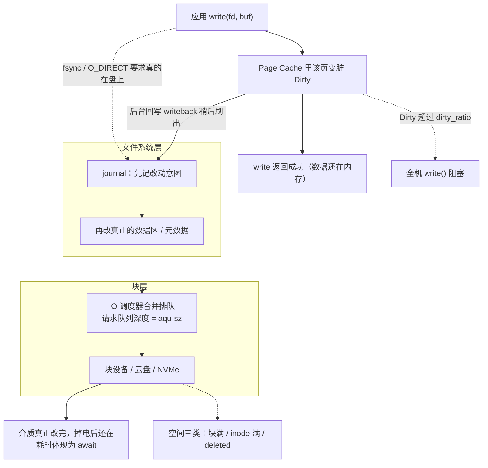
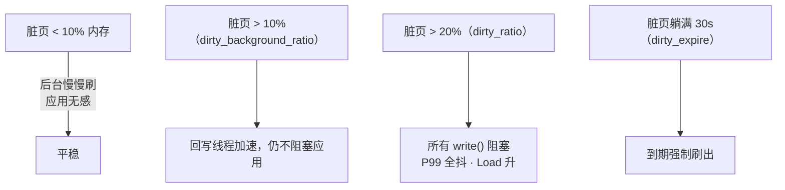
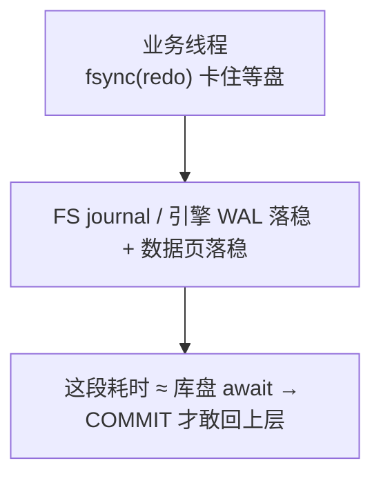
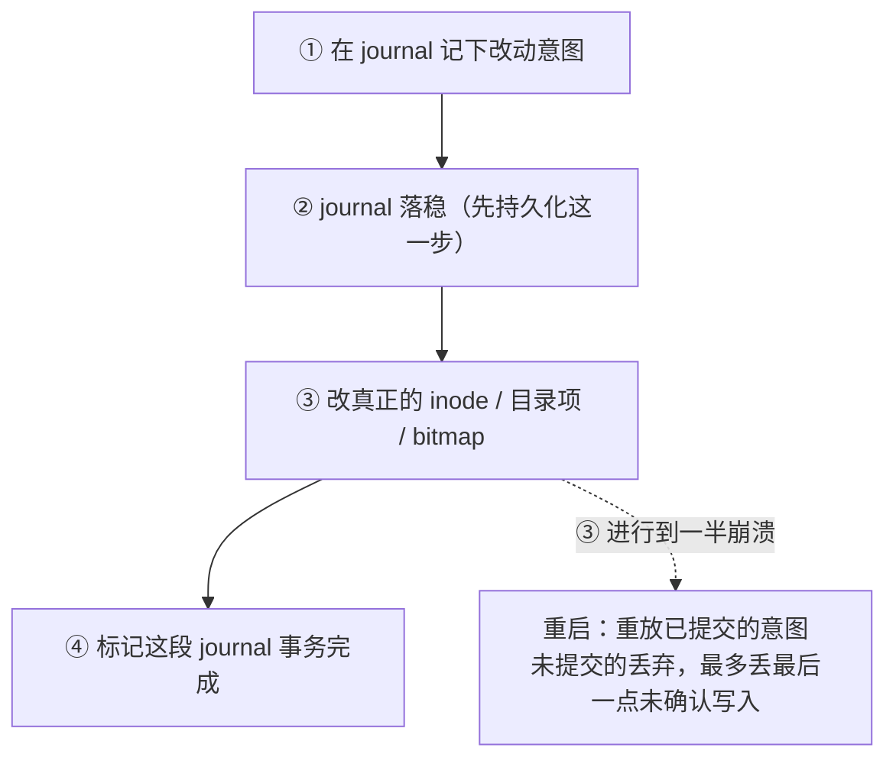
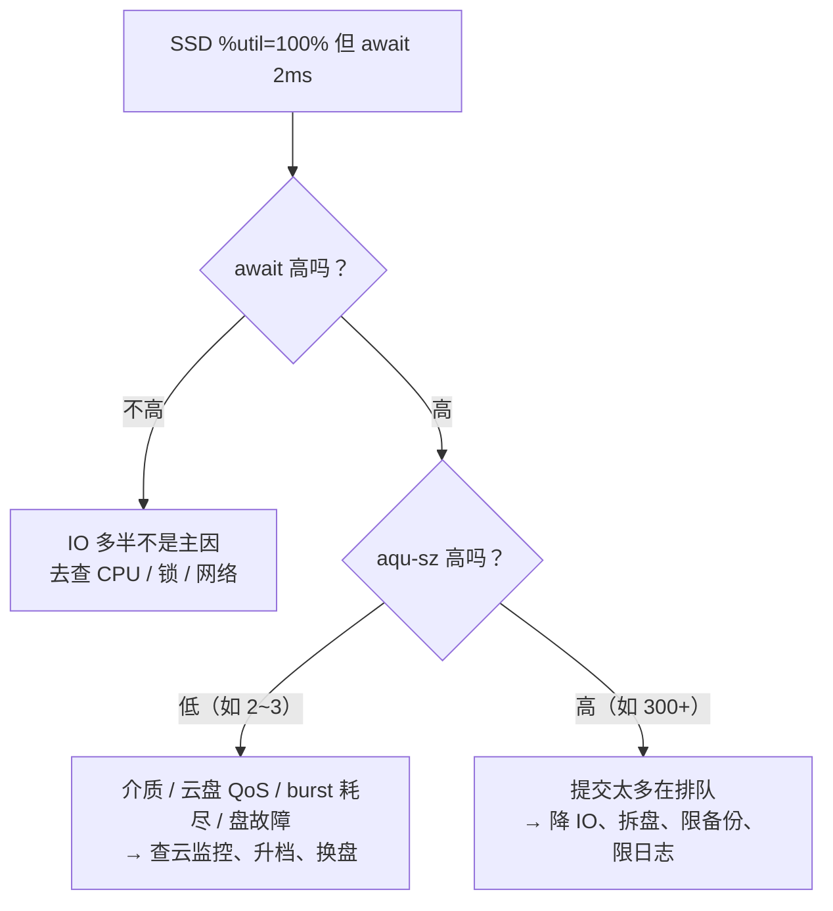
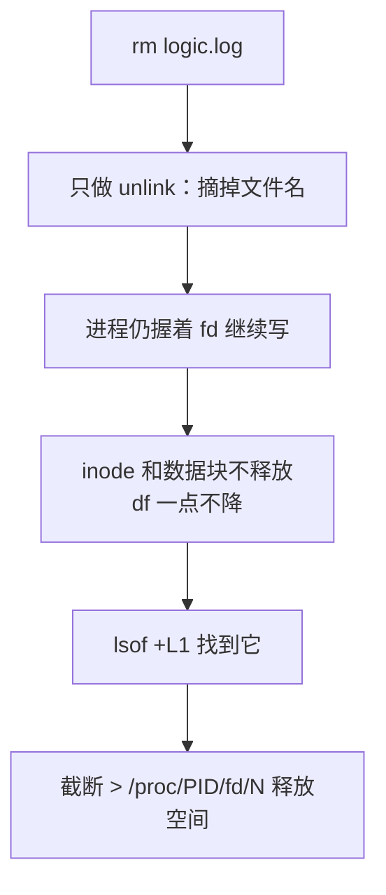
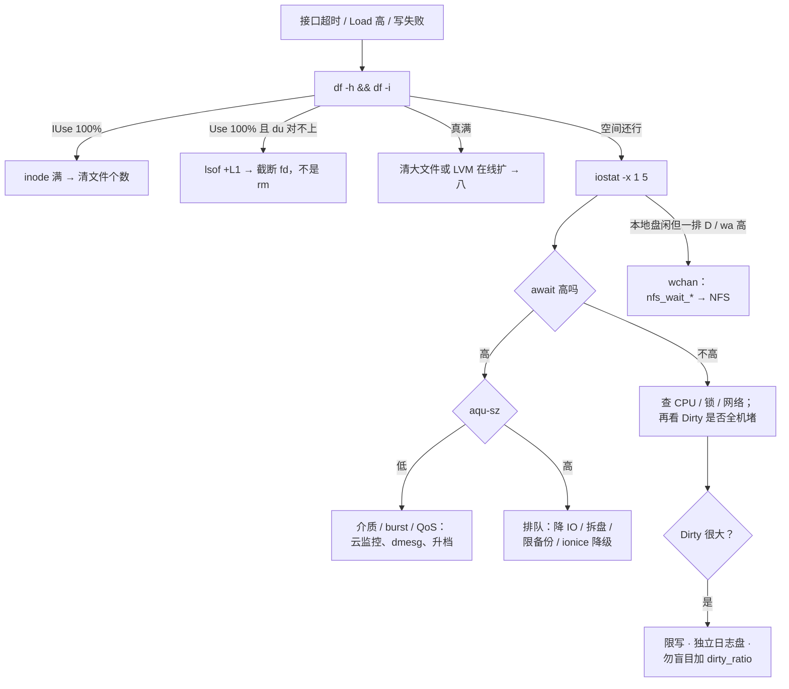

# 磁盘与 IO

> 开服活动接口全超时，CPU 还有 50% 空闲——有人盯 `%util` 100% 喊换 SSD，有人要重启大法，真凶可能是脏页、inode 满、deleted 文件，或云盘 burst 耗尽。
> **本章回答**：一次 `write()` 从应用到介质的一生，以及一条「盘慢」告警怎么在 60 秒内定责。
> **不讲**：D 进程与信号 → [05](../05-进程与信号/)；`%wa` 与 Load → [06](../06-CPU与Load/)；available/OOM → [07](../07-内存与OOM/)；inode 密度/fstab → [09](../09-文件系统与inode/)；分区/加盘全流程 → [29](../29-磁盘管理与LVM/)。

**标记**：🎯重点 · 🔥难点 · ⭐常考 · 🔧实操

---

## 一、一张图：一次 write 的一生

> 🎯 **一句话**：一次写要过五道门——应用、Page Cache、文件系统、块层、介质，每道门都有专属观测指标和卡点。



- 📖 **读图**
  - 🛤️ 实线：默认 buffered 写在 Page Cache 就「假装完成」，回写与 fsync 汇进 FS → 块层；`await` / `aqu-sz` 挂块层以下，Dirty 挂 Cache，`%wa` 挂 CPU 侧
  - 💥 虚线事故：脏页超限堵全机、空间三类报 No space——都不在「盘慢」主干上，告警最容易定错责

### 🎬 把主图走活：活动高峰一次 write

开服活动，逻辑服狂写 `logic.log`，接口超时，CPU idle 还有 50%：

- ① **出发**：`write(log_fd, …)` 进 Page Cache、标脏、返回 0——玩家侧「写成功」，盘上可能还没有
- ② **中转**：脏页向 `dirty_ratio` 顶

```text
Dirty:  8388608 kB    # ← 8G，向 dirty_ratio（~20% 内存）顶
```

  - 新的 `write()` 在内核睡觉等回写 → 接口全超时、CPU 不高

- ③~④ **排队**：回写洪峰进块层

```text
Device   r/s    w/s   rkB/s   wkB/s  r_await w_await  await  aqu-sz  %util
nvme0n1   80  12000    3200   96000     0.5    38.0   37.2   380.4   99.2
# w_await 38ms ← NVMe 事故级；aqu-sz 380 ← 提交太多在排队；util 99% ← 只说明忙
```

- ⑤ **定责顺序**：应用返回语义 → Dirty 水位 → iostat 分型 → 空间/D——**不是先换盘**
  - Dirty 很大 + 全机写卡 → 脏页档（三节）
  - await 高 + aqu-sz 高 → 排队型，降 IO / 拆盘（六节）
  - 逻辑与库同盘 → fsync 被日志吞吐吞（八节）

---

## 二、出发：write 返回 ≠ 落盘 ⭐

> 🎯 **一句话**：buffered write 只保证数据进了 Page Cache，掉电安全从来不是它的承诺。

- 🔑 **Page Cache（页缓存）** = 内核拿空闲内存缓存文件内容的那部分页
  - 默认 buffered：`write()` 拷进 Cache、标成**脏页（dirty page）**就返回 0——盘上可能还没有这一行
  - 真正落盘两条路：内核**回写（writeback）**后台刷，或应用主动 `fsync`

#### ❓ 为什么 write 返回成功，数据却可能不在盘上？

- ❌ **把「返回 0」当「已在介质」**：掉电 / 崩溃后这一行可以没了
- ✅ **返回只保证进了 Page Cache**：掉电安全 ≈ 调了 `fsync`（或 `O_SYNC` 等价语义）且设备确认完成
- 📖 读路径对照：`read()` 命中 Cache 几乎不碰盘；未命中才走块层并回填。iostat 分列 `r_await` / `w_await`，游戏服高峰先看 `w_await`

> ⚠️ **别混**：buffer 和 cache。早期 Unix 有独立 block buffer cache，现代 Linux 统一进 Page Cache；`/proc/meminfo` 里 `Buffers` 是块设备映射残留、`Cached` 是文件页缓存——日常排障不用分，面试提一句「现代内核已统一页缓存」即可。

> 📝 **面试**：write 返回成功只代表进了 Page Cache；掉电安全看 fsync。「读多写少却 await 高」先怀疑缓存被谁冲掉，而不是盘坏了。⭐（练习题 Q2）

本节对应练习题 Q2。写返回语义清了——全机接口超时、CPU 还闲一半，真凶会不会在脏页水位？

---

## 三、中转：脏页与回写 ⭐🔥

> 🎯 **一句话**：脏页堆过 dirty_ratio，全机的 write() 一起被堵——卡的是写路径，不是某个接口的逻辑。

⭐ 口诀：**「Dirty 顶到 dirty_ratio，全机 write 一起堵」**（练习题 Q3）。

> 💡 **打个比方**：Page Cache 是快递代收货架，write 返回 = 包裹贴单上架，回写 = 货车拉走。货架堆到顶（dirty_ratio），前台收件员只能停下来等货车——**每个寄件人都被堵**。

- 🎚️ **三个水位线**（只记这三个）
  - `vm.dirty_background_ratio` ≈ **10%**：超了开始**后台**回写，应用无感
  - `vm.dirty_ratio` ≈ **20%**：超了，发起写的应用在 `write()` 里**阻塞**，直到刷出一批
  - `vm.dirty_expire_centisecs` = **30s**：脏页最多躺 30 秒就该被考虑刷出



- 📖 **读图**
  - 10% 只是后台加速；**20% 才是「全机写卡住」的开关**；30s 是兜底时钟
  - 排障先问「脏页在哪个档」，再决定限写还是等它刷完

#### ❓ 为什么加大 dirty_ratio 不是优化？

- ❌ **把比值当「写缓冲容量旋钮」**：加大只推迟爆炸，爆炸时阻塞更久
- ✅ **治理**：限日志级别、独立日志盘、备份错峰、cgroup `io.max` 给备份限速（→ [10](../10-cgroup与容器/)）
- ⚠️ 脏页很多时 available 会偏乐观 → [07](../07-内存与OOM/)

> 🔍 **现场**：

```bash
grep -E 'Dirty|Writeback' /proc/meminfo
```

```text
Dirty:          12582912 kB    # ← 12G 脏页，256G 机器已过 20% 档 → 全机 write 在堵
Writeback:        262144 kB    # ← 正在被刷出去的部分
```

触发场景：开服热更包落盘 + 全服登录日志、凌晨备份打满写带宽。

> 📝 **面试**：卡住全机的常常是脏页刷不出去（介质/带宽跟不上写入速率），不是 `%util`，更不是某个 HTTP handler 慢。

本节对应练习题 Q3。脏页是「稍后刷」——谁要求「现在就在盘上」？

---

## 四、要落盘：fsync 与 O_DIRECT ⭐🔥

> 🎯 **一句话**：掉电安全看 fsync 语义；O_DIRECT 解决的是双缓冲，不是持久化。

- 🧷 **四种语义**
  - **fsync(fd)**：返回前，该文件的数据**及所需元数据**都落到稳定存储
  - **fdatasync(fd)**：同上但不等 mtime 等非必要元数据——库引擎常用
  - **O_SYNC**：每次 write 自带持久化语义 ≈ 隐式 fsync
  - **O_DIRECT**：绕过 Page Cache 直接下盘；buffer 地址/长度/偏移须按 512B/4KB **对齐**，否则 `EINVAL`

> 💡 **打个比方**：buffered write 是快递放代收点、小票一拿就走；fsync 是非要等到「已入仓拍照」才离开柜台——安全，但你俩绑在一起等。

- 🗄️ **库为什么要 O_DIRECT**：引擎自有 Buffer Pool，再走 Page Cache = **双缓冲（double buffering）**——同一份数据占两份内存，还多一层刷写



- 📖 **读图**：业务线程在 fsync 处同步等待，时长 ≈ 这笔 IO 的 await → 库盘 await 抖 = 事务提交 P99 抖

#### ❓ 为什么 O_DIRECT 不等于掉电安全？

- ❌ **「绕过 Cache = 一定在盘上」**：O_DIRECT 只决定走不走 Page Cache
- ✅ **要不要等介质确认仍由 fsync / O_SYNC 决定**
- 🧭 **生产怎么选**
  - 游戏逻辑日志：**buffered + 轮转**——要吞吐，丢几行可接受
  - 数据库数据/redo：**O_DIRECT（或引擎自管缓存）+ fsync**
  - etcd WAL：**强 fsync**（→ [03-02](../../03-Kubernetes/02-etcd/)）
  - 「日志也上 O_DIRECT 更安全」：**不要**——只把延迟绑死在盘上，面试扣分项

> ⚠️ **别混**：口里说「同步 IO」先分清两套词——POSIX **同步语义**（fsync/O_SYNC，本章主战场）和**异步通知模型**（aio/io_uring）。别把 io_uring 混进「同步 vs 异步」答案。

> 🔍 **现场**：认出 buffered + 回写在作怪——

```bash
iotop -o        # ← 只显示有 IO 的进程，回写高点抓谁在刷
```

特征：`write()` 平时极快，过几十秒 iostat 写吞吐突然爆一波——后台回写集中落盘。

> 📝 **面试**：普通日志 buffered；库 O_DIRECT 防双缓冲、提交靠 fsync；write 返回不代表在盘上。⭐（练习题 Q2）

本节对应练习题 Q2。数据要改文件系统了——崩溃一致性靠谁？

---

## 五、路上：journal 先记后改 🔥

> 🎯 **一句话**：文件系统改任何元数据前，先把「打算改什么」记进日志区，崩溃后重放日志就能恢复一致。

> 💡 **打个比方**：动仓库货架前先在小本写「A 箱从 3 号搬到 5 号」。搬一半停电，回来照小本要么搬完、要么搬回去——没有小本就要全场盘点（fsck）。



- 📖 **读图**：关键顺序是 **② 在 ③ 前**——意图先于动作落稳；代价是每次元数据改动多一次日志写（fsync「贵」的组成之一）

- 📂 **ext4 三种 data 模式**（选型细节 → [09](../09-文件系统与inode/)）
  - **data=ordered**（常见默认）：元数据走 journal，数据先于相关元数据落盘
  - **data=writeback**：最快，掉电后文件**内容**可能见到旧数据
  - **data=journal**：数据也先走 journal——最安全也最慢，近似双倍写放大
  - XFS 有自己的 log 区，思想同类

#### ❓ 为什么不能关 FS journal 给库提速？

- ❌ **拿一致性换幻想性能**：FS journal 保的是 inode/目录/bitmap 不半拉子
- ✅ **正确动作**：库盘独立、排查同盘抢 IO——不是关 journal

- 🧱 **三层同名不同物**

```text
应用/库 WAL（InnoDB redo、etcd WAL）   ← 保业务事务 / Raft 日志不丢
        ▼
文件系统 journal（ext4 / XFS）        ← 保 inode / 目录 / bitmap 不半拉子
        ▼
设备 / 云盘
```

  - 两层不能互相替代：库 WAL + fsync 管事务不丢，FS journal 管结构一致
  - 库盘 await 高：可能是 WAL fsync 打满 IOPS，也可能与游戏日志同盘抢带宽 → 六节分型

> ⚠️ **别混**：`journalctl` / journald 是 **systemd 服务日志**；ext4/XFS journal 是**文件系统元数据日志**。同名不同物。

> 🔍 **现场**：

```bash
findmnt -o TARGET,FSTYPE,OPTIONS /data
# TARGET  FSTYPE  OPTIONS
# /data   ext4    rw,relatime,data=ordered   ← data= 模式只在这看，不是猜
dmesg -T | grep -iE 'journal|xfs|ext4|I/O error'
```

> 📝 **面试**：「关掉文件系统 journal 给 MySQL 加速」是拿一致性换幻想性能。⭐（练习题 Q6）

本节对应练习题 Q6。过了文件系统就进块层——开头有人盯 `%util` 100% 喊换盘，该听谁的？

---

## 六、排队：块层调度与 iostat 分型 ⭐🔥

> 🎯 **一句话**：慢不慢看 await，堵不堵看 aqu-sz；%util 只有 HDD 上能当饱和参考。

### 🎛️ 请求队列与 IO 调度器

- 🔑 **块层（block layer）** 为每块设备维护请求队列；**IO 调度器**在里面合并与重排
  - 生产口径：**SSD/NVMe/云盘用 `none`**（设备自己并行够，内核别二次排队）
  - **HDD 才用 `mq-deadline`** 这类（排序减寻道）

> 🔍 **现场**：

```bash
cat /sys/block/nvme0n1/queue/scheduler
# [none] mq-deadline kyber bfq    # ← 方括号是当前值：none，SSD/云盘的正确答案
```

- 🎚️ **IONice（ionice）** = 块层给进程的 IO 优先级
  - `-c 1` 实时（要 root）· `-c 2` 尽力（`-n 0~7`）· `-c 3` idle
  - 经典：备份降级 `ionice -c 2 -n 7 tar czf …`
  - ⚠️ `none` 下 ionice 收效有限；云上容器限 IO 用 cgroup `io.max`（→ [10](../10-cgroup与容器/)）

### 📐 顺序 IO 与随机 IO ⭐

- **顺序 IO（sequential）** = 请求落在相邻块；**随机 IO（random）** = 位置乱跳
  - HDD 随机每次寻道，性能断崖；SSD/NVMe 无机械寻道、内部并行，随机惩罚小得多
  - 日志 append ≈ 顺序写；库按页随机读写、海量小文件 ≈ 随机
  - 判读：`rkB/s` 高且 await 低 = 大块顺序；`w/s` 巨大但吞吐不高、await 抬 = 小块随机——**吞吐和 IOPS 要结合 await**

### 📊 iostat -x：一张输出读懂 ⭐🔥

> 🔍 **现场**：

```bash
iostat -x 1 5    # ← -x 扩展列；丢掉第一段（开机以来的平均值，没有现场意义）
```

```text
Device   r/s    w/s   rkB/s   wkB/s  r_await w_await  await  aqu-sz  %util
nvme0n1   80  12000    3200   96000     0.5    38.0   37.2   380.4   99.2
#         ↑每秒完成的请求数      ↑吞吐    ↑读写各自耗时  ↑综合耗时 ↑在飞队列 ↑忙时间占比
```

- 📏 **列语义**
  - **await**：一笔 IO 从进设备层到完成的平均耗时，**含排队**——定「慢不慢」的主证据
  - **aqu-sz**（平均队列深度，老版本 `avgqu-sz`）：同一时刻在飞请求数——定「盘慢还是提交太多」
  - **%util**：采样周期里设备有工作在身的时间占比——**不是**「盘满了百分之几」
  - 先分 `r_await` / `w_await`：读炸还是写炸
  - 🔥 `svctm` 新版本已不可靠——**别看、别当面试论据**
- 🔢 数字锚：本地 NVMe await 常见 **< 1–5ms**，**≥20ms** 事故级

### 🔀 分型：await × aqu-sz



- 📖 **读图**
  - 入口永远是 **await**，第二问才是队列——顺序反了就会得出「换盘」错结案
  - 底线陷阱：SSD/NVMe 并行高，`%util` 打满只说明一直有活干，不证明吃不下更多；HDD 才可把 `%util≈100%` 当饱和信号

#### ❓ 为什么 SSD %util=100% 不能结案换盘？

- ❌ **把 util 当「盘满了百分之几」**：收银员一直忙 ≠ 每单都慢
- ✅ **慢看 await，堵看 aqu-sz**
  - await 高 + aqu-sz 低 → 介质 / QoS / burst / 故障
  - await 高 + aqu-sz 高 → 提交太多在排队，降 IO / 拆盘
  - await 不高 → IO 多半不是主因

> 💡 **打个比方**：await = 每位顾客结账耗时，%util = 收银员手上有没有活，aqu-sz = 队排到门口多长。

> ⚠️ **别混**：iowait 高 ≠ IO 瓶颈。`%wa` 是 **CPU 视角**——「有空闲核且在等 IO」的比例：NFS 挂死时本地盘干净、wa 却很高；CPU 打满时 wa 会被挤成 0，盘照样慢。**磁盘慢不慢听 await；wa 只说明有人在等**。Load 含 D → [06](../06-CPU与Load/)。

> ⚠️ **别混**：云盘 await 2ms→50ms、写入量没翻倍、%util 也不吓人——先查 **burst balance / IOPS 上限 / 邻居抢额度**。QoS 在 hypervisor，改客户机调度器救不了 burst。

### 🌡️ 收束：一层一个温度计


- 📖 **读图**：从上往下逐层下探——P99 抖先问「是不是只有 IO 型接口抖」，再 wa/b，再 Dirty，再队列分型，最后别忘空间暗雷。`iotop` / `pidstat` 答「是谁」，`wchan` 答「卡在哪」
- ✅ 可背清单：**慢看 await、堵看 aqu-sz、谁在写看 iotop、水位看 Dirty、空间看 df -h + df -i、卡死看 wchan**

> ⚠️ **别混**：这张图保证「盘慢」能定位到层，不保证「盘没问题」——await 正常也可能死在应用锁、GC 或网络 → [06](../06-CPU与Load/)、[12](../12-网络栈与Socket/)。

> 📝 **面试**：记忆分组报指标——CPU（wa/b）、内存（Dirty/Writeback）、块层（aqu-sz/调度器）、设备（await/%util）、空间（df -h / df -i）。⭐（练习题 Q1、Q7、Q13）

本节对应练习题 Q1、Q7、Q13。排队之外还有三类「空间病」和一排 D。

---

## 七、生病：空间三类与一排 D ⭐

> 🎯 **一句话**：「No space」有三种病——块满、inode 满、deleted；只看 df -h 会漏掉后两种。

### 📦 块满与 inode 满

- 数据块和 inode 是**两套配额**：`df -h` 看块、`df -i` 看 inode

> 🔍 **现场**：`df -h` 还有 30% 空间，热更目录几十万小补丁，`touch` 报 No space——

```bash
df -h /data && df -i /data
```

```text
Filesystem      Size  Used Avail Use% Mounted on
/dev/nvme0n1p1  500G  350G  150G  70% /data      # ← 块还剩 150G，不是块满

Filesystem      Inodes  IUsed  IFree IUse% Mounted on
/dev/nvme0n1p1    10M    10M      0  100% /data   # ← inode 槽位用光，touch 建不了新文件
```

- 清几个大日志**还不了**海量小文件占的 inode——清的是文件**个数**；目录按日期分桶（密度/mkfs → [09](../09-文件系统与inode/)）

### 👻 deleted：rm 了空间不降



- 📖 **读图**：rm = unlink，摘名字不摘数据；空间等**最后一个 fd 关闭**才回收。止血是截断那个 fd，**不是再 rm**

#### ❓ 为什么 rm 了日志 df 还不降？

- ❌ **以为 rm = 立刻腾空间**：进程还握着 fd 时块不释放
- ✅ **`lsof +L1` → `: > /proc/<PID>/fd/<N>` 截断**；根治用 logrotate **copytruncate** 或进程 reopen（→ [23](../23-日志运维/)）
- 🐳 Docker `json-file` 不设 `max-size` / `max-file` 同样能写满节点盘（→ [10](../10-cgroup与容器/)）

> 🔍 **现场**：

```bash
lsof +L1 | grep deleted
# java  28451 root  3w  REG  259,1 42949672960 ... /var/log/logic.log (deleted)
# ← 进程 28451 的 fd 3 还握着 40G 的已删除文件
```

> ⚠️ **别混**：du 和 df。`du` 算目录树里看得见的文件；`df` 问已分配块。du ≪ df 且有进程在写日志 = 有 deleted。

### 🧊 只读挂载与一排 D

- 写入报 **EROFS** / dmesg 刷 I/O error：先 `dmesg -T`，不是先加盘
- 一排 **D 状态**：

```bash
ps aux | awk '$8 ~ /D/'        # ← 抓出所有 D 状态进程
cat /proc/{PID}/wchan; echo    # ← 看它睡在内核哪个函数
```

```text
wait_on_page_writeback    # ← 卡在等脏页刷出 → 回第三节
blk_mq_*                  # ← 卡在本地块设备 → 盘/云盘 hang
nfs_wait_*                # ← 卡在 NFS → 远程问题，本地 iostat 是干净的
```

- `kill -9` 对 D 无效 → [05](../05-进程与信号/)
- **本地 iostat 干净 + 一排 D + wa 高 = 优先怀疑 NFS/远程 IO**

> 📝 **面试**：有空间却 No space → inode 满，`df -i`；rm 了 df 不降 → deleted，`lsof +L1` 后截断 fd。⭐（练习题 Q4、Q5、Q8、Q9）

本节对应练习题 Q4、Q5、Q8、Q9。定责会了——落地怎么扩、怎么分盘？

---

## 八、落地：LVM、RAID 与盘位规划 🔧

> 🎯 **一句话**：库盘日志盘分开、库用 RAID 10、SSD 调度器 none、用到 85% 就扩——装机时定的规矩，值班时少一半事故。

### 🧱 LVM：一层可以在线扩的池


- 📖 **读图**：PV→VG→LV = 砖→池→切出来的卷；在线扩 = 加砖再拉长卷——不停服、不迁数据

```bash
# 在线扩 +100G（不停服）
pvcreate /dev/sdd                             # ← 新盘做成 PV
vgextend vg_data /dev/sdd                     # ← 砖加进池
lvextend -L +100G /dev/vg_data/lv_data        # ← 卷拉长
xfs_growfs /data                              # ← XFS 扩文件系统：跟【挂载点】
# resize2fs /dev/vg_data/lv_data              # ← ext4 用这个：跟【设备】
df -h /data                                   # ← 确认容量上来
```

- 🔥 **XFS 不能缩容**——只能扩；要缩选 ext4 或新建 LV 迁移
- 首次创建链与分区/加盘全流程 → [29](../29-磁盘管理与LVM/)；fstab 用 UUID → [09](../09-文件系统与inode/)

### 🛡️ RAID 与文件系统选型

| RAID | 容错 | 用途 |
|------|------|------|
| 0 | 无 | 临时/可丢日志，追求裸性能 |
| 1 | 1 块 | 系统盘 |
| 5 | 1 块 | 文件服务；**写有惩罚**（每次写要算校验） |
| **10** | 每镜像组 1 块 | **数据库 / 高 IO，生产推荐** |

- 云盘底层已有冗余，**云上一般不自建 RAID**；重建期 IOPS 近乎腰斩，当变更窗口管

| 维度 | XFS | ext4 |
|------|-----|------|
| 大文件 / 并行写 | 更好 | 一般 |
| 在线扩 | 支持（xfs_growfs） | 支持（resize2fs） |
| 在线缩 | **不支持** | 支持 |
| RHEL 8+ 默认 | 是 | — |

### 📍 盘位规划口径

- **库盘和日志盘分开**：同盘时日志吞吐吞掉库 fsync 的 IOPS，活动高峰直接掉登录
- 盘使用率 **85%** 当故障：写放大/GC/碎片会让 await 自己变差
- 日志盘额外留 **~40%** 空闲做高峰缓冲
- `innodb_io_capacity` ≈ 真实 IOPS 的 **70%**（→ [02-01 MySQL](../../02-中间件与数据库/01-MySQL/)）

> 📝 **面试**：数据库盘 RAID 10、云上不自建、库日志分盘、XFS 只扩不缩——四句背完。⭐（练习题 Q10、Q11、Q12）

本节对应练习题 Q10、Q11、Q12。接到「盘慢」告警，60 秒怎么定责？

---

## 九、作战：「盘慢」告警的一生 🔧

> 🎯 **一句话**：先排除空间，再 await 分型，最后才谈换盘——顺序错了就是白干一小时。

### 🌳 定责决策树



- 📖 **读图**
  - 每个分支开头都是真实输出：「IUse 100%」「du 对不上」「本地盘闲但一排 D」
  - 两条最容易被跳过：空间类（完全不在线路主干）和 NFS（本地 iostat 全绿也照样卡死业务）

### 📋 现象 · 先做 · 别做

| 现象 | 先做 | 别做 |
|------|------|------|
| 接口超时、CPU 闲、Load 高 | iostat 看 await+队列；查 Dirty；查 D | 盯着 %util 换 SSD |
| SSD %util 100%、await 2ms | 不当瓶颈结案，继续看业务 | 换盘 |
| await 高 + 队列高 | 降 IO、拆盘、限备份 | 只加大 dirty_ratio |
| await 高 + 队列低 | 云监控 burst/IOPS、dmesg、介质健康 | 先改调度器救命 |
| 云盘 2ms→50ms | 查 burst 额度与 IOPS 上限 | 改客户机调度器 |
| df 100%、刚 rm 过日志 | lsof +L1 → 截断 fd | 再 rm 或重启 |
| 有空间 touch 失败 | df -i | 只删几个大日志 |
| 一排 D、本地 iostat 干净 | wchan 看是否 nfs_wait | kill -9 硬杀 |
| Dirty 很高、全机卡 | 限写、错峰、独立日志盘 | 加大 dirty_ratio 当优化 |
| 库 P99 抖、与日志同盘 | 拆盘 / 错峰 | 关 FS journal |
| /data 用到 85% | 当故障，LVM 在线扩 | 等 100% 再动 |

### ⏱️ 60 秒剧本 🔧

- **0–10s**：`df -h && df -i`——先排空间三类
- **10–30s**：`iostat -x 1 5` + `grep -E 'Dirty|Writeback' /proc/meminfo`——await 分型 + 脏页水位
- **30–45s**：`iotop -o` 抓谁在写；`ps aux | awk '$8 ~ /D/'` + wchan
- **45–60s**：按树结案——介质/QoS 报云监控；排队型限流拆盘；空间型截断清理；非盘现场转 06/12

值班最小三联：

```bash
df -h && df -i
iostat -x 1 5
grep -E 'Dirty|Writeback' /proc/meminfo
```

### 🩹 日志盘满止血顺序

1. 截断正在写的日志：`: > /proc/<PID>/fd/<N>`——**不要 rm**
2. 确认 `df` 真的降了
3. 调日志级别 / 修轮转；顺手 `lsof +L1` 查 deleted
4. 同时看 `df -i`——小文件多时 inode 先满
5. 根治：日志从 NFS 挪本地、备份错峰或 `io.max` 限速

### 🎮 游戏服高频根因

1. 凌晨全服备份打同一块共享盘 → 逻辑服 P99 20ms→500ms（排队型）
2. 开服热更 + 登录日志 → 空间或 inode 先满
3. 逻辑服与库同盘 → 库 fsync 被日志吞吐吞掉 IOPS
4. etcd 与游戏日志同盘 → WAL fsync 打到几百 ms，像整个 API 挂了

**回到开头现场**：接口全超时、CPU 闲一半——正确处理是 Dirty → await/aqu-sz 分型 → 空间/D，**不是先换盘**。

本节对应练习题 Q7、Q14。

---

## 十、收口

### 命令速查 🔧

- 空间 / inode：`df -h` · `df -i`
- 盘慢分型：`iostat -x 1 5`（await / aqu-sz / %util）
- 整机等 IO：`vmstat 1 5`（b、wa 列）
- 谁在写：`iotop -o` · `pidstat -d 1 5`
- 脏页水位：`grep -E 'Dirty|Writeback' /proc/meminfo`
- deleted：`lsof +L1 | grep deleted`
- D 卡死：`ps aux | awk '$8 ~ /D/'` + `cat /proc/<PID>/wchan`
- 调度器：`cat /sys/block/<dev>/queue/scheduler`
- 挂载选项：`findmnt -o TARGET,FSTYPE,OPTIONS /data`；内核报错：`dmesg -T`
- LVM：`pvs` · `vgs` · `lvs` · `lsblk`

### 面试锚点

遮住右列自问自答，卡壳的行回去重读对应小节——能讲出来才算会：

| 问 | 30 秒答 |
|----|---------|
| SSD 看什么定瓶颈？ | await + aqu-sz；%util 100% 不单独结案，HDD 才可当饱和参考 |
| await 高怎么分型？ | 队列低=介质/QoS/burst；队列高=提交太多在排队，降 IO 拆盘 |
| write 返回了数据在盘上吗？ | 不一定，buffered 下在 Page Cache；掉电安全看 fsync |
| 顺序 IO 和随机 IO 差在哪？ | 相邻块 vs 乱跳；HDD 随机被寻道杀死，SSD 并行惩罚小；判读结合吞吐与 IOPS |
| dirty_ratio 触发会怎样？ | 全机 write() 阻塞；治理是限写拆盘，不是加大比值 |
| df 和 du 为什么对不上？ | 有进程握着已 unlink 的 fd；lsof +L1 找到后截断 |
| 有空间却 No space？ | inode 满，df -i，清文件个数 |
| journal 是什么？ | FS 崩溃一致性日志，先记意图再改真数据；≠ journald，也替代不了库 WAL |
| 库盘选什么 RAID？ | RAID 10；云上不自建；库和日志必须分盘 |
| XFS 能缩吗？ | 不能，只能扩（xfs_growfs 跟挂载点） |
| IONice 干什么的？ | 块层 IO 优先级，备份用 ionice -c 2 -n 7 降级；none 调度器下效果有限，云上用 io.max |
| 云盘 await 2ms→50ms？ | 先查 burst 额度/IOPS 上限，改调度器没用 |

### 易错一句话对照

- 「%util 100% 就是盘满了」→ 是忙时间占比；SSD 并行高，仍可能吃得下更多，听 await 的
- 「wa 是 0 盘就快」→ CPU 打满会把 wa 挤成 0，盘照样慢
- 「wa 高一定是本地盘」→ NFS 远程等待也高；看 wchan 分层
- 「write 返回了就丢不了」→ 只进了 Page Cache，掉电安全看 fsync
- 「日志上 O_DIRECT 更安全」→ 只把延迟绑死在盘上，没有语义收益
- 「加大 dirty_ratio 优化写」→ 推迟爆炸，爆炸时堵得更久
- 「rm 大日志必腾空间」→ 进程 fd 还握着就不降
- 「清大文件能救 inode 满」→ inode 是个数配额，要删文件个数
- 「关 FS journal 给库提速」→ 拿一致性换幻想性能
- 「云盘慢改 cfq 调度器」→ QoS 在 hypervisor，客户机改不动

### 数字墙

> **await**：本地 NVMe 小于 1–5ms 舒适，≥20ms 事故级；优质云盘个位数 ms
> **脏页三档**：dirty_background_ratio ~10% · dirty_ratio ~20% · dirty_expire 30s
> **空间红线**：盘 85% 当故障；日志盘另留 ~40%
> **容量口径**：innodb_io_capacity ≈ 真实 IOPS × 70%

---

## 合上书

学到这里，先别急着翻下一章。合上书，试试下面这几件事能不能做到——能做到，这章才算真的听懂了。卡住的那一条，就回到对应的小节再听一遍（练习题「合上书」与这里逐条对齐）：

- [ ] **默画主图**：`write → Page Cache(脏页) → journal → 块层队列 → 介质`，fsync/O_DIRECT 的分叉在哪汇入（→ Q14）
- [ ] **口述**：write 返回时数据在哪？掉电安全靠什么保证？（→ Q2）
- [ ] **讲清**：脏页三参数各管什么档位；超 dirty_ratio 后全机发生什么；加大它行不行（→ Q3）
- [ ] **讲清**：buffered / fsync / O_DIRECT 怎么选；日志能不能上 O_DIRECT；为什么库要防双缓冲（→ Q2）
- [ ] **默画**：journal 事务四步 + 崩溃重放；三层日志（库 WAL / FS journal / journald）各保什么（→ Q6）
- [ ] **分型**：await 高 + aqu-sz 高 vs 低各指向什么；SSD %util 100% 怎么结案（→ Q1、Q7）
- [ ] **讲清**：顺序 IO vs 随机 IO 谁吃亏；调度器怎么选；IONice 用在什么场景（→ Q13）
- [ ] **口述**：%wa 为什么会骗人（NFS、CPU 挤 0）；磁盘慢最终听谁的（→ Q8）
- [ ] **分型**：块满 / inode 满 / deleted 各自的签名和第一刀；df 和 du 为什么对不上；一排 D 看 wchan（→ Q4、Q5、Q9）
- [ ] **落地**：LVM 在线扩四步（XFS 跟挂载点、ext4 跟设备）；XFS 能否缩；库盘 RAID；盘位规划三句（→ Q10、Q11）
- [ ] **作战**：60 秒剧本的三个时间窗各敲什么；值班最小三联（→ Q14）
