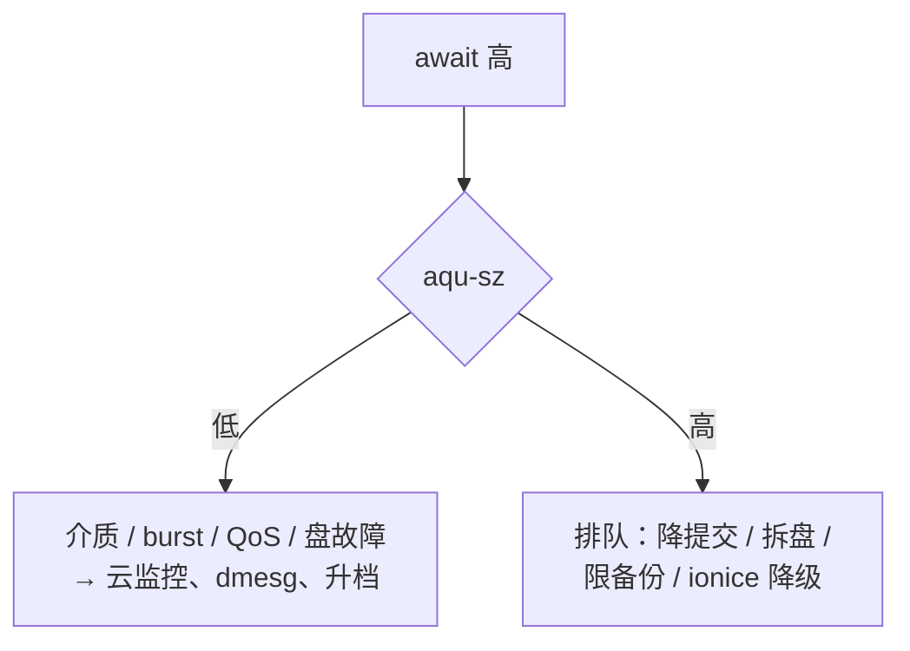

# 08｜磁盘与 IO · 练习题

先合上知识点，对着 **一、一张图** 把「一次 write 的一生」口述一遍，再来做题。

| 标记 | 含义 |
|------|------|
| **核心** | 不懂整章就没建立起来 |
| **必会** | 值班和面试都要能讲 |
| **常用** | 线上会反复碰到 |
| **常考** | 白板和追问的高频口径 |

## 本题目录

- [Q1 await / aqu-sz / %util](#q1)
- [Q2 buffered / fsync / O_DIRECT](#q2)
- [Q3 dirty_ratio](#q3)
- [Q4 df ≠ du / deleted](#q4)
- [Q5 inode 满](#q5)
- [Q6 journal](#q6)
- [Q7 IO 排队定责](#q7)
- [Q8 %wa 不一定是盘](#q8)
- [Q9 日志打满止血](#q9)
- [Q10 LVM 在线扩](#q10)
- [Q11 RAID 与调度器](#q11)
- [Q12 云盘 burst](#q12)
- [Q13 顺序 IO vs 随机 IO / IONice](#q13)
- [Q14 磁盘 IO 白板综合题](#q14)
- [合上书](#合上书)

---

## Q1

**★★★★★｜iostat 的 await、aqu-sz、%util 分别是什么？SSD 上看哪个定瓶颈？**

**覆盖**：核心 · 必会 · 常用 · 常考 ｜ **对应**：知识点 [六、排队：块层调度与 iostat 分型](知识点.md)

### 场景

NVMe 数据盘 `%util` 100%，有人喊着「盘满了换 SSD」。可 await 只有 2ms，aqu-sz 也不高。旁边那块云盘 await 80ms，`%util` 却只有 40%。

### 完整解答

> 🎯 **一句话**：SSD 瓶颈看 await 和 aqu-sz，%util 100% 不单独结案；HDD 才把 util 接近 100% 当饱和信号。

await = 一笔 IO 从提交到完成的平均耗时，**含排队**；aqu-sz = 平均在飞队列深度；`%util` = 采样期内设备有工作在身的时间占比——**不是**「盘满了百分之几」。

```text
await 高 + aqu-sz 低  → 介质 / 云盘 QoS / burst 本身慢
await 高 + aqu-sz 高  → 提交太多在排队 → 降 IO、拆盘、限备份
SSD %util = 100%     → 只说明一直有活干；SSD 并行度高，仍可能吃得下更多
```

```bash
iostat -x 1 5    # ← 丢掉第一段（开机均值）；r_await/w_await 先分读炸还是写炸
```

场景里那块 await 80ms、util 40% 的云盘才是真问题——util 低不代表没病，await 高就是慢。`svctm` 在新版本已不可靠，别看、别在面试里当论据。

> 📝 **面试**：定责顺序永远是先 await、再 aqu-sz 分型、最后才参考 util（HDD 可提前参考）。

### 再追问

- await 20ms 在 NVMe 上正常吗？——不正常，NVMe 舒适区 小于 1–5ms，20ms 已是事故级；要解释（同盘抢 IO、写放大、磨损、邻居抢 IOPS），不要用「SSD 嘛差不多」糊弄。
- r_await 和 w_await 什么时候分开看？——游戏服高峰先看 w_await（日志/落盘写为主）；读多写少却 await 高，先怀疑 Page Cache 被谁冲掉。

---

## Q2

**★★★★★｜buffered write、fsync、O_DIRECT 怎么选？write 返回了数据就在盘上吗？**

**覆盖**：核心 · 必会 · 常考 ｜ **对应**：知识点 [四、要落盘：fsync 与 O_DIRECT](知识点.md)

### 场景

有人要把逻辑服日志改成 O_DIRECT「更安全」。另一边库进程的 Buffer Pool 加上 OS Page Cache 把内存吃满。还有人拍胸脯：「write 都返回 0 了，掉电也丢不了」。

### 完整解答

> 🎯 **一句话**：普通日志用 buffered；数据库用 O_DIRECT 防双缓冲、提交靠 fsync；掉电安全看 fsync，不看 write 返回。

默认 buffered 下，write 只把数据拷进 Page Cache、页标脏就返回——盘上还没有。fsync / fdatasync 才是「返回前相关数据落到稳定存储」的语义；O_SYNC 是每次 write 自带持久化。O_DIRECT 绕过 Page Cache 直下盘（有 512B/4KB 对齐要求），解决的是库的**双缓冲**（引擎缓存 + 内核缓存各一份白吃内存），**不自动等于**持久。

```text
掉电安全 ≠ write 返回成功
掉电安全 ≈ 做了 fsync（或 O_SYNC 等价语义）且设备确认完成
```

生产口径：逻辑日志 buffered + 轮转；库 O_DIRECT（或自管缓存）+ fsync；etcd WAL 强 fsync——控制面最贵的一步也是它，和游戏日志同盘会把整个 API 拖死。

> ⚠️ **别混**：口说「同步 IO」先分清两套词——POSIX 同步语义（fsync / O_SYNC）和异步通知模型（aio / io_uring），别混进同一句话答。

### 再追问

- 那把日志也改 O_DIRECT？——不要。只把延迟绑死在盘上，没有语义收益，面试里当扣分项。
- buffer 和 cache 什么区别？——早期 Unix 有独立 block buffer cache，现代 Linux 统一进 Page Cache；/proc/meminfo 的 Buffers/Cached 日常排障不用区分。
- 怎么认出 buffered + 后台回写在作怪？——write 平时极快，过几十秒 iostat 写吞吐爆一波，`iotop -o` 抓到刷盘进程。

---

## Q3

**★★★★★｜dirty_ratio 触发后应用会怎样？把它调大算优化吗？**

**覆盖**：核心 · 必会 · 常用 ｜ **对应**：知识点 [三、中转：脏页与回写](知识点.md)

### 场景

全机接口超时，CPU 不高。`/proc/meminfo` 里 Dirty 十几个 G。凌晨备份和登录日志写在同一块盘上。有人提议把 dirty_ratio 调到 40%「缓解一下」。

### 完整解答

> 🎯 **一句话**：脏页超过 dirty_ratio，发起写的应用全部阻塞在 write() 里；治理是限写、拆盘、错峰，不是加大比值。

三档水位：`dirty_background_ratio` ~10% 开始**后台**回写（应用无感）；`dirty_ratio` ~20% 触发**应用写阻塞**，直到刷出一批；`dirty_expire_centisecs` 30s 是脏页最长躺仓时间。

```bash
grep -E 'Dirty|Writeback' /proc/meminfo
# Dirty: 12582912 kB    ← 12G，256G 机器已过 20% 档 → 全机 write 在堵
```

加大 dirty_ratio 只是推迟爆炸，爆炸时阻塞更久。正确动作：限日志级别、独立日志盘、备份错峰、cgroup `io.max` 限速。另外脏页多时 available 偏乐观，判断内存看 [07](../07-内存与OOM/) 的口径。

> 📝 **面试**：卡住全机的是脏页刷不出去（写入速率 > 回写能力），不是 %util，更不是某个 HTTP handler 慢。

### 再追问

- 这是某一个接口慢吗？——不是。表现为全机写路径堵、P99 一起抖；单接口超时要先走应用层排查。
- 库的 fsync 会被这事拖住吗？——会，fsync 要等相关脏页落稳，脏页水位高时事务提交延迟直接抬升。

---

## Q4

**★★★★★｜df 显示 100%，du 加起来只有一半，怎么查？不重启怎么放空间？**

**覆盖**：核心 · 必会 · 常用 ｜ **对应**：知识点 [七、生病：空间三类与一排 D](知识点.md)

### 场景

有人刚 `rm` 了 40G 的 `logic.log`，`df` 一点没降，业务还在写。他准备再 rm 一遍或者干脆重启。

### 完整解答

> 🎯 **一句话**：df 不降是进程还握着已 unlink 的 fd，`lsof +L1` 找到后截断那个 fd，不要 rm 也不要重启。

rm = unlink，只摘文件名；inode 和数据块要等**最后一个 fd 关闭**才释放，进程还在继续写就更不降。

```bash
lsof +L1 | grep deleted
# java  28451 root  3w  REG  259,1 42949672960 ... /var/log/logic.log (deleted)
# ← 28451 的 fd 3 还握着 40G
: > /proc/28451/fd/3    # ← 截断它，df 立刻下降
```

根治是轮转姿势：logrotate **copytruncate**（复制后截断原文件），或让进程 reopen 新文件（nginx `kill -USR1`）→ [23](../23-日志运维/)。

> ⚠️ **别混**：du 把目录树里的文件求和，看不到 fd 还握着的已删文件；df 问的是文件系统已分配块。du 比 df 小很多且有进程在写日志 = 有 deleted。

### 再追问

- 只截断不修轮转行吗？——不行，进程会从空文件再涨回去，必须同时修轮转和级别。
- Docker 容器日志也这样？——是，`json-file` 不配 `max-size` / `max-file` 就是无上限写，容器环境的经典复发位 → [10](../10-cgroup与容器/)。

---

## Q5

**★★★★☆｜df -h 还有 30%，touch 却报 No space left，为什么？**

**覆盖**：必会 · 常用 · 常考 ｜ **对应**：知识点 [七、生病：空间三类与一排 D](知识点.md)

### 场景

热更目录里堆了几十万个小补丁文件。`df -h` 空间充足，`touch` 报 No space left。有人开始删大日志「腾地方」。

### 完整解答

> 🎯 **一句话**：有空间却建不了文件是 inode 耗尽，查 `df -i`，清的是文件个数不是大文件。

数据块和 inode 是两套配额：

```bash
df -h /data && df -i /data
# /dev/nvme0n1p1  500G  350G  150G  70% /data    ← 块还剩 150G
# /dev/nvme0n1p1    10M    10M      0  100% /data ← inode 槽位用光
```

海量小文件（overlay2 层、session、热更每版残留）吃的是 inode 个数。治理：目录按日期分桶、别在一个目录塞百万文件；mkfs 时 inode 密度与选型细节 → [09](../09-文件系统与inode/)。

### 再追问

- 清几个大日志能好吗？——好不了。大文件只还数据块，不还 inode 配额；要删的是文件个数。
- 值班时怎么一次排掉块满和 inode 满？——`df -h && df -i` 一行连着敲，这是值班最小三联的第一联。

---

## Q6

**★★★★☆｜文件系统 journal 干什么的？和 journald、数据库 WAL 什么关系？**

**覆盖**：核心 · 必会 · 常考 ｜ **对应**：知识点 [五、路上：journal 先记后改](知识点.md)

### 场景

掉电重启后有人喊「journal 坏了」；另一个人提议关掉 ext4 journal 让 MySQL 更快；运维又把 `journalctl` 的磁盘占用和 FS journal 混在一起聊。三个人说的根本不是一个东西。

### 完整解答

> 🎯 **一句话**：FS journal 先记元数据改动意图、落稳后再改真结构，保崩溃一致性；它不等于 journald，也替代不了库 WAL，更不能关了给库提速。

```text
库 WAL（InnoDB redo、etcd WAL）  ← 保业务事务 / Raft 日志不丢
文件系统 journal（ext4 / XFS）   ← 保 inode / 目录 / bitmap 不半拉子
journald / journalctl           ← systemd 系统服务日志，和上面两个没关系
```

ext4 常见 `data=ordered`（默认，平衡）；`data=writeback` 数据顺序松、掉电后内容可能见旧数据；`data=journal` 最安全也最慢（数据全走 journal，双倍写放大）。XFS 有自己的 log，思想同类。

> ⚠️ **别混**：两层日志不能互相替代——库 WAL + fsync 管事务不丢，FS journal 管文件系统结构一致。

> 📝 **面试**：「关 journal 给库加速」是拿一致性换幻想性能；正确动作是库盘独立、排查同盘抢 IO。

### 再追问

- fsync 贵跟 journal 有关吗？——持久化路径上常要等稳定存储（含 FS 日志相关写入），是贵的组成之一；但根因定位仍用 await 分型，别拿关 journal 当优化项。
- 怎么看当前 data 模式？——`findmnt -o TARGET,FSTYPE,OPTIONS /data` 看 `data=` 选项，不是猜。

---

## Q7

**★★★★★｜IO 排队怎么定责？await 高时队列高低分别指向什么？**

**覆盖**：核心 · 必会 · 常用 · 常考 ｜ **对应**：知识点 [九、作战：「盘慢」告警的一生](知识点.md)

### 场景

两台机器 await 都 40ms+：A 的 aqu-sz 只有 2~3，B 的 aqu-sz 三百多。两边都有人喊换盘。

### 完整解答

> 🎯 **一句话**：await 高 + 队列低看介质/QoS/burst；双高是提交太多在排队——降 IO、拆盘、限备份，不是统一换盘。



值班最小三联：`df -h && df -i` → `iostat -x 1 5` → `grep -E 'Dirty|Writeback' /proc/meminfo`；仍不清再 `iotop -o`、查 D 进程 wchan、`lsof +L1`。游戏服高频根因：备份打满共享盘、热更+登录日志打满空间/inode、逻辑与库同盘 fsync 被吞 IOPS、etcd 与日志同盘 WAL fsync 几百 ms。

### 再追问

- SSD `%util` 100% 接到这棵树的哪里？——不单独结案，回到 await 分型入口重新走。
- 45 秒了还没头绪怎么办？——按 60 秒剧本收口：给一个结案口径（介质型/排队型/空间型）或明确转单到 CPU/网络，不要无限收集数据。

---

## Q8

**★★★☆☆｜为什么说 %wa 高不一定是磁盘瓶颈？**

**覆盖**：核心 · 常考 ｜ **对应**：知识点 [六、排队：块层调度与 iostat 分型](知识点.md)

### 场景

`%wa` 40%，本地 NVMe 的 await 却很正常，逻辑服日志挂在 NFS 上。另一台机器 CPU 100%、盘 await 20ms，wa 显示却是 0。

### 完整解答

> 🎯 **一句话**：wa 是 CPU 视角「有空闲核且在等 IO」的比例——NFS 远程等待会让它高，CPU 打满会把它挤成 0；磁盘慢不慢，听 await 的。

```bash
ps aux | awk '$8 ~ /D/'      # ← 一排 D 先抓出来
cat /proc/{PID}/wchan; echo  # ← 看睡在内核哪个函数
# blk_mq_*               ← 本地块设备 hang
# nfs_wait_*             ← NFS 远程问题，本地 iostat 干净
# wait_on_page_writeback ← 等脏页刷出，回脏页那节
```

D 状态 `kill -9` 无效（信号要等系统调用返回），进程与信号细节 → [05](../05-进程与信号/)；Load 里含 D 的口径 → [06](../06-CPU与Load/)。

### 再追问

- 那到底听谁的？——磁盘慢以 await 为准；整机等 IO 看 vmstat 的 b 和 wa；远程 IO 看 wchan，永远不要只看 wa 下结论。

---

## Q9

**★★★☆☆｜游戏服日志把盘写满了，止血顺序是什么？**

**覆盖**：必会 · 常用 ｜ **对应**：知识点 [九、作战：「盘慢」告警的一生](知识点.md)

### 场景

活动高峰 `logic.log` 把盘打到 100%。有人已经把 rm 命令敲到一半。inode 可能也紧。

### 完整解答

> 🎯 **一句话**：先截断正在写的文件（不是 rm），同时看 `df -h && df -i`，再修轮转和级别。

1. 截断正在写的日志：`: > /proc/<PID>/fd/<N>`——rm 会撞上 deleted，df 不降（Q4）
2. 确认 `df` 真的降了
3. 调日志级别 / 修轮转（copytruncate 或 reopen）；顺手 `lsof +L1` 查 deleted
4. 同时 `df -i`——小日志文件多时 inode 先满
5. 根治：日志从 NFS 挪本地、备份错峰或 `io.max` 限速

止血后必须复盘根因：没轮转、级别太高、或没配容器日志上限。

### 再追问

- Docker 容器把节点盘写满怎么办？——`json-file` 驱动配 `max-size` / `max-file`，这是装节点时的规矩，不是事后救火。

---

## Q10

**★★★★☆｜生产 /data 不够了，怎么不停服在线扩容？XFS 能缩吗？**

**覆盖**：必会 · 常用 · 常考 ｜ **对应**：知识点 [八、落地：LVM、RAID 与盘位规划](知识点.md)

### 场景

LVM 上的 XFS `/data` 用到 90%（红线 85% 已过）。新盘 `/dev/sdd` 已经插上。不能停服。有人问「以后能不能顺便缩一点回来」。

### 完整解答

> 🎯 **一句话**：在线扩四步 pvcreate → vgextend → lvextend → xfs_growfs；XFS 只能扩不能缩。

```bash
pvcreate /dev/sdd
vgextend vg_data /dev/sdd
lvextend -L +100G /dev/vg_data/lv_data
xfs_growfs /data                  # ← XFS 跟【挂载点】
# resize2fs /dev/vg_data/lv_data  # ← ext4 跟【设备】
df -h /data                       # ← 确认容量上来
```

盘用到 **85%** 就要当故障处理（写放大、GC、碎片让 await 自己变差），不要等 100%。fstab 用 UUID 挂载 → [09](../09-文件系统与inode/)；分区与加盘全流程 → [29](../29-磁盘管理与LVM/)。

### 再追问

- XFS 支持缩容吗？——不支持。要缩选 ext4 或新建 LV 迁移数据。
- 什么时候该扩、什么时候该清？——先 `df -i` 和 `lsof +L1` 排掉 inode/deleted 两类假满，确认真满再扩，别白买盘。

---

## Q11

**★★★☆☆｜数据库盘选 RAID 几？云上还要自建 RAID 吗？SSD 的 IO 调度器怎么选？**

**覆盖**：必会 · 常考 ｜ **对应**：知识点 [八、落地：LVM、RAID 与盘位规划](知识点.md)

### 场景

新物理机跑库。有人说 RAID 5 省一块盘；云上另一套也要做 RAID 10；逻辑服日志还想和库挤同盘；还有人把调度器改成 cfq「求稳」。

### 完整解答

> 🎯 **一句话**：数据库盘 RAID 10；云上不自建 RAID（底层已冗余）；库盘和日志盘分开；SSD/NVMe/云盘调度器用 none。

RAID 5 有写惩罚（每次写要算校验、多一次读写），扛不动库的随机 fsync。游戏日志盘可 RAID 0 或不 RAID（丢了可接受）。RAID 重建期 IOPS 近乎腰斩，要当变更窗口。云盘 QoS 在 hypervisor 侧，客户机里改调度器救不了性能，更救不了 burst。

```bash
cat /sys/block/nvme0n1/queue/scheduler
# [none] mq-deadline kyber bfq   ← SSD/云盘正确值是 none；HDD 才用 mq-deadline
```

`innodb_io_capacity` 按真实 IOPS 的 **~70%** 配（→ [02-01 MySQL](../../02-中间件与数据库/01-MySQL/)）。

### 再追问

- 关掉 FS journal 让库更快？——不行，拿一致性换幻想性能；同盘抢 IO 才是 await 高的常见根因。
- 备份任务能降级吗？——`ionice -c 2 -n 7` 贴低优先级；none 调度器下收效有限，容器/云环境用 cgroup `io.max` 更可靠 → [10](../10-cgroup与容器/)。

---

## Q12

**★★★☆☆｜云盘昨天 await 2ms 今天 50ms，%util 也一般，先怀疑什么？**

**覆盖**：常用 · 常考 ｜ **对应**：知识点 [六、排队：块层调度与 iostat 分型](知识点.md)

### 场景

没发版、没流量翻倍，同一块云盘一夜之间 await 从 2ms 变 50ms。有人准备动调度器。

### 完整解答

> 🎯 **一句话**：云盘 await 突变先查突发额度（burst balance）和 IOPS 上限，改客户机调度器救不了。

gp2 类突发盘额度耗尽后掉到基线性能，await 直接上一个数量级，`%util` 还不一定吓人。先开云监控看 burst balance / IOPS 限流 / 邻居抢额度，再决定升档。另一个让 await 变差的慢性因素：SSD 接近满盘时 GC 和写放大恶化——所以盘用到 85% 就当故障（Q10）。

### 再追问

- 这属于排队定责哪一枝？——典型「await 高 + aqu-sz 往往不高」的介质/QoS 枝，第一动作是云监控，不是内核参数。

---

## Q13

**★★★★☆｜顺序 IO 和随机 IO 差在哪？为什么备份能把 HDD 拖死，怎么治？**

**覆盖**：必会 · 常用 ｜ **对应**：知识点 [六、排队：块层调度与 iostat 分型](知识点.md)

### 场景

凌晨 tar 备份一开，同盘的逻辑服 IO 全卡住。有人看 iostat：备份是连续大块读，逻辑服全是小块随机读写，觉得「大家都是 IO，凭什么让」。

### 完整解答

> 🎯 **一句话**：顺序 IO 落在相邻块、随机 IO 乱跳；HDD 被随机寻道杀死而 SSD 惩罚小——大吞吐的备份会彻底打乱别人的请求局部性。

- 日志 append 是典型**顺序（sequential）**写；库的按页读写、海量小文件是典型**随机（random）**
- HDD 每次随机都要磁头寻道，混合负载下互相放大延迟；SSD/NVMe 内部高度并行，随机惩罚小得多
- iostat 判读：`rkB/s` 高且 await 低 = 大块顺序；`w/s` 巨大但吞吐不高、await 抬升 = 小块随机——**吞吐和 IOPS 要结合 await 才有意义**

治备份抢 IO：错峰、独立备份盘、`ionice -c 2 -n 7` 降级、容器/云环境用 cgroup `io.max` 限速（→ [10](../10-cgroup与容器/)）。

> 📝 **面试**：顺序 vs 随机是解释「同一块盘时快时慢」的底层变量，答 iostat 分型前先交代负载形态。

### 再追问

- 怎么从 iostat 看出负载是随机小 IO？——w/s 很高、wkB/s 不成比例、await 明显抬升；三个数连起来看，别只报一个。

---

## Q14

**★★★★★｜白板：write 一生 + await 分型 + 60 秒「盘慢」剧本？**

**覆盖**：核心 · 必会 · 常考 ｜ **对应**：知识点 [一、一张图](知识点.md) · [九、作战](知识点.md) · [十、收口](知识点.md)

### 场景

白板：「接口慢、%wa 高，画 write 路径并说 await 高怎么定责。」

### 完整解答

> 🎯 **一句话**：**write→page cache→journal→队列→介质**；await 高看 aqu-sz 分队列/介质；满去 09，慢在本章。

```text
60s: iostat -x 1 3 → pidstat/iotop → df -i
分型: aqu-sz高=排队  await高aqu低=介质/QoS
止血: 日志截断/错峰备份/ionice
禁止: 日常drop_caches  把util当唯一指标
```

| 现象 | 第一刀 |
|------|--------|
| df 100% | df -i, lsof +L1 → 09 |
| 一排 D | wchan → 05/08 |
| %wa 高 NFS | 网络 → 02 |

> 📝 **面试**：write 返回≠落盘，掉电靠 fsync/journal（Q2、Q6）。

### 再追问

- LVM 在线扩四步？——云盘扩→PV→VG→LV→xfs_growfs/resize2fs（Q10）。

---

## 合上书

- [ ] 默画主图：write → Page Cache（脏页）→ journal → 块层队列 → 介质；fsync/O_DIRECT 分叉在哪汇入
- [ ] write 返回时数据在哪？掉电安全靠什么保证？
- [ ] 脏页三参数各管什么档位？超 dirty_ratio 全机发生什么？加大行不行？
- [ ] buffered / fsync / O_DIRECT 怎么选？日志能不能上 DIRECT？库为什么要防双缓冲？
- [ ] 默画 journal 事务四步 + 崩溃重放；库 WAL / FS journal / journald 各保什么？
- [ ] await 高时队列高低怎么定责？SSD %util 100% 怎么结案？
- [ ] 顺序 IO vs 随机 IO 谁吃亏？调度器怎么选？IONice 用在什么场景？
- [ ] %wa 为什么骗人（NFS、CPU 挤 0）？磁盘慢最终听谁的？
- [ ] 块满 / inode 满 / deleted 各第一刀？df 和 du 为什么对不上？一排 D 看 wchan
- [ ] LVM 在线扩四步（XFS 跟挂载点、ext4 跟设备）？XFS 能缩吗？库盘 RAID 和盘位规划口径？
- [ ] 60 秒剧本三个时间窗各敲什么？值班最小三联是哪三条命令？
- [ ] 白板 write 一生与 await 分型（Q14）
