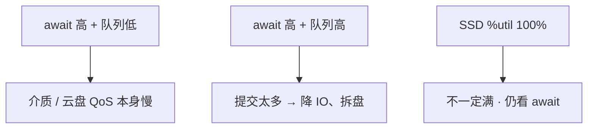
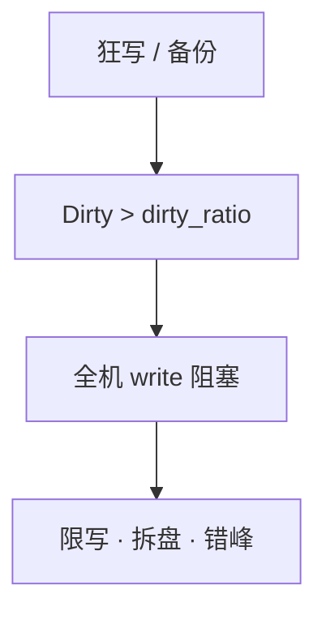
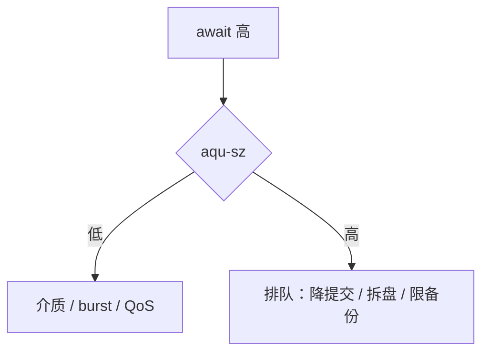

# 08｜磁盘与 IO · 练习题

先对照 [知识点](知识点.md)：**先 §2 总图，再 §3 名词，再 §5～§10**。能讲清写路径再谈 await 分型。每题标了覆盖范围：

| 标记 | 含义 |
|------|------|
| **核心** | 不懂整章就没建立起来 |
| **必会** | 值班和面试都要能讲 |
| **常用** | 线上会反复碰到 |
| **常考** | 白板和追问的高频口径 |

## 本题目录

- [Q1 await / aqu-sz / %util](#q1)
- [Q2 同步 vs 异步 / buffered](#q2)
- [Q3 dirty_ratio](#q3)
- [Q4 df ≠ du / deleted](#q4)
- [Q5 inode 满](#q5)
- [Q6 journal](#q6)
- [Q7 IO 排队定责](#q7)
- [Q8 %wa 不一定是盘](#q8)
- [Q9 日志打满止血](#q9)
- [Q10 LVM 在线扩](#q10)
- [Q11 RAID 与调度器](#q11)
- [Q12 云盘 burst](#q12)
- [合上书](#合上书)

---

## Q1

**★★★★★｜iostat 的 await、aqu-sz、%util 怎么读？SSD 看哪个？**

**覆盖**：核心 · 必会 · 常用 · 常考

**对应**：知识点 §5（兼 §4）

### 场景

NVMe 数据盘 `%util` 100%，有人说盘满了要换。await 2ms，aqu-sz 不高。另一块云盘 await 80ms，`%util` 只有 40%。

### 完整解答

**一句话**：SSD 瓶颈看 await 和 aqu-sz，`%util` 100% 仍可能还能吃；HDD 才更常用 util≈100% 当饱和信号。

await = 单次 IO 平均耗时（排队+服务）。aqu-sz = 在飞队列深度。`%util` = 盘忙时间占比。



云盘要对着 IOPS 上限和 burst balance 看。NVMe 常见 **<1–5ms**。**20ms** 要查磨损、RAID、写放大、邻居抢 IOPS。

`%wa` / await / `%util` 不是同一个数：wa 是 CPU 空闲在等 IO 的比例；await 是一笔 IO；util 是盘忙时间。CPU 打满时 wa 可被挤成 0。`svctm` 别看。

### 再追问

- await 20ms 在 NVMe 上正常吗？——不正常。对 NVMe 已是事故感，不是「SSD 嘛差不多」。

---

## Q2

**★★★★★｜buffered write、fsync、O_DIRECT 怎么选？write 返回等于在盘上吗？**

**覆盖**：核心 · 必会 · 常考

**对应**：知识点 §6

### 场景

有人要把逻辑服日志改成 O_DIRECT「更安全」。库盘和 OS cache 叠在一起把内存吃满。有人说 write 都返回了掉电也丢不了。

### 完整解答

**一句话**：普通日志用 buffered；数据库用 O_DIRECT（或自管 cache）防双缓冲；掉电安全靠 fsync，不靠 write 返回。

| 场景 | 选 |
|------|----|
| 逻辑日志 | buffered + 轮转 |
| 库 / etcd WAL | DIRECT 或引擎策略 + fsync |
| 日志改 DIRECT | **不要**——只把延迟绑死在盘上 |

buffered 下数据在 Page Cache；`write` 返回 ≠ 介质已改完。`O_DIRECT` 解决双缓存，**不自动等于**每次 write 都持久。

控制面 etcd 最贵的一步也是 WAL fsync，和游戏日志同盘会把 API 拖死。

### 再追问

- 同步 vs 异步在本章指什么？——主战场是 buffered vs 强制落盘语义；别和 aio/io_uring 混进同一句答完。

---

## Q3

**★★★★★｜dirty_ratio 触发后应用会怎样？加大行不行？**

**覆盖**：核心 · 必会 · 常用

**对应**：知识点 §7

### 场景

全机接口超时，CPU 不高。`/proc/meminfo` Dirty 很大。凌晨备份和日志在同一块盘。

### 完整解答

**一句话**：dirty_ratio 一到全机 `write()` 阻塞；治理是限写和独立日志盘，不是加大比值。

脏页超过 `dirty_ratio`（约 **20%**），内核让写进程阻塞在 `write()`，直到刷盘。`dirty_background_ratio` ~10% 开始后台刷；`dirty_expire_centisecs` 30s。

狂写日志、备份打满、热更落盘。加大 dirty_ratio 只是推迟爆炸，爆炸时阻塞更久。available 这时会偏乐观（[07](../07-内存与OOM/)）。



### 再追问

- 卡住的是某一个接口吗？——表现为全机写路径堵，P99 一起抖，不是单 handler 逻辑慢。

---

## Q4

**★★★★★｜df 显示 100%，du 加起来只有一半，怎么查？**

**覆盖**：核心 · 必会 · 常用

**对应**：知识点 §8.3

### 场景

有人 `rm` 了 40G 的 `logic.log`。`df` 一点没降。进程还在跑。

### 完整解答

**一句话**：df 不降是进程还握着已 unlink 的 fd，用 `lsof +L1` 找 deleted 再截断。

`rm` 只摘文件名，空间等最后一个 fd 关闭才释放。

```bash
lsof +L1 | grep deleted
# 不重启：> /proc/<PID>/fd/<N> 截断
```

轮转要用截断或让进程 reopen（nginx USR1）。Docker `json-file` 不限 size 也会把盘写满。进程继续写会从空文件再涨，必须同时修轮转。

### 再追问

- 不重启怎么放空间？——对仍打开的 fd 做 truncate（重定向写空）。必须同时修轮转。

---

## Q5

**★★★★☆｜有空间但 touch 失败 No space left，为什么？**

**覆盖**：必会 · 常用 · 常考

**对应**：知识点 §8.2

### 场景

`df -h` 还有 30%。热更目录里几十万个小补丁文件。`touch` 报 No space left。

### 完整解答

**一句话**：有空间却 touch 失败是 inode 耗尽，查 `df -i`，清的是文件个数不是大文件。

inode 与数据块是两套配额。大量小文件：overlay2、session、热更每层留文件。目录按日期分桶，别在一个目录放百万文件。细节在 [09](../09-文件系统与inode/)。

### 再追问

- 清几个大日志能好吗？——好不了。大文件只还块，不还那么多 inode。

---

## Q6

**★★★★☆｜文件系统 journal 干什么？和 journald、数据库 WAL 怎么区分？**

**覆盖**：核心 · 必会 · 常考

**对应**：知识点 §9

### 场景

掉电后有人说「journal 坏了」。另有人提议关掉 ext4 journal 让 MySQL 更快。运维把 `journalctl` 磁盘占用和 FS journal 混在一起聊。

### 完整解答

**一句话**：FS journal 先记元数据改动意图再改真结构，保崩溃一致；≠ journald；也不能关了给库加速。

```text
FS journal：文件系统一致性（inode/目录/bitmap）
库 WAL：   业务事务/Raft 不丢
journald： 系统服务日志收集
```

ext4 常见 `data=ordered`；`data=journal` 最慢写放大最大。XFS 有自己的 log，思想同类。库盘 await 高优先拆盘/查 QoS，不是关 journal。

### 再追问

- fsync 贵跟 journal 有关吗？——持久化路径上常要等稳定存储（含 FS 日志相关写入）；根因仍用 await 分型，别拿关 journal 当优化项。

---

## Q7

**★★★★★｜IO 排队怎么定责？await 高时队列高低分别指向什么？**

**覆盖**：核心 · 必会 · 常用 · 常考

**对应**：知识点 §10（兼 §5）

### 场景

两台机器 await 都 40ms+。A 的 aqu-sz 很低；B 的 aqu-sz 三百多。都有人喊换盘。

### 完整解答

**一句话**：await 高 + 队列低看介质/QoS；双高是提交太多在排队——降 IO 拆盘，不是统一换盘。



值班三联：`df -h/-i` → `iostat -x` → Dirty；再按需 `iotop` / wchan / deleted。

游戏高频：备份打满共享盘、日志与库同盘、热更打满 inode/空间。

### 再追问

- SSD `%util` 100% 怎么接入这棵树？——util 不单独结案，仍回到 await 分型。

---

## Q8

**★★★☆☆｜为什么说 %wa 高不一定是磁盘瓶颈？**

**覆盖**：核心 · 常考

**对应**：知识点 §5.5（兼 §10）

### 场景

`%wa` 40%。本地 NVMe await 很好。逻辑服日志在 NFS。另一台 CPU 100%，盘 await 20ms，但 wa 显示 0。

### 完整解答

**一句话**：wa 高但本地 await 好，多半是 NFS/远程；CPU 100% 时 wa 也可为 0——磁盘慢听 await。

wa 是「CPU 空闲且等 IO」的比例。交叉 iostat + wchan。一排 D 时 `kill -9` 无效，看 wchan 分 `blk_mq_*` / `nfs_wait_*` / `wait_on_page_writeback`（[05](../05-进程与信号/)）。

### 再追问

- 那到底听谁的？——磁盘慢以 await 为准；Load 型看 b 和 D；远程 IO 看 wchan，不要只看 wa。

---

## Q9

**★★★☆☆｜游戏服日志把盘写满，止血顺序？**

**覆盖**：必会 · 常用

**对应**：知识点 §11.5（兼 §8）

### 场景

活动高峰 `logic.log` 把盘打到 100%。有人准备 `rm`。inode 也可能紧。

### 完整解答

**一句话**：日志打满先截断正在写的文件，同时看 `df -h/-i`，不要先 rm。

1. 截断正在写的日志（不要 rm）。  
2. 确认 df 下降。  
3. 调日志级别 / 轮转；查 deleted。  
4. 同时 `df -i`。  

先 rm 会遇到 df 不变。止血后根因仍是没轮转或级别太高。开服 checklist 含 `df -h/-i` 和日志轮转。

### 再追问

- Docker 容器把节点盘写满？——`json-file` 没配 `max-size` / `max-file`。

---

## Q10

**★★★★☆｜生产 /data 不够了，怎么在线扩容？XFS 能缩吗？**

**覆盖**：必会 · 常用 · 常考

**对应**：知识点 §11.1

### 场景

LVM 上的 XFS `/data` 到 90%。新盘 `/dev/sdd` 已经挂上。不能停服。

### 完整解答

**一句话**：LVM 在线扩：pvcreate→vgextend→lvextend→xfs_growfs/resize2fs，XFS 不能缩。

```bash
pvcreate /dev/sdd
vgextend vg_data /dev/sdd
lvextend -l +100%FREE /dev/vg_data/lv_data
xfs_growfs /data
df -h /data
```

盘用到 **85%** 就要当故障。fstab 用 UUID（[09](../09-文件系统与inode/)）。

### 再追问

- XFS 支持缩容吗？——不支持。需要缩选 ext4 或新建 LV 迁移。

---

## Q11

**★★★☆☆｜数据库盘选 RAID 几？云上还要自己做 RAID 吗？SSD 调度器怎么选？**

**覆盖**：必会 · 常考

**对应**：知识点 §11.2–11.4

### 场景

新上物理机跑库。有人说 RAID 5 省一块盘。云上另一套也要做 RAID 10。逻辑服日志还想和库同盘。有人把调度器改成 cfq「稳一点」。

### 完整解答

**一句话**：数据库盘选 RAID 10，云上不自建 RAID；库盘和日志盘要分开；SSD/云盘调度器用 none。

RAID 5 有写惩罚。游戏日志盘可以 RAID 0 或不 RAID。云盘底层已冗余。重建期当变更窗口。

`innodb_io_capacity` 按真实 IOPS 约 **70%** 配。活动高峰同盘会掉登录。云盘 QoS 在 hypervisor，换调度器救不了 burst。

### 再追问

- 关掉 FS journal 让库更快？——不行。拿一致性换幻想性能，不是口径。

---

## Q12

**★★★☆☆｜云盘昨天 await 2ms，今天 50ms，iostat %util 一般，先怀疑什么？**

**覆盖**：常用 · 常考

**对应**：知识点 §5.6（兼 §10）

### 场景

没发版。同一块云盘。业务写入量没翻倍。

### 完整解答

**一句话**：云盘 await 从 2ms 变 50ms 先查 burst 额度和 IOPS 上限，换调度器救不了。

gp2 类突发盘额度耗尽后掉到基线，await 从 2ms 变 50ms，`%util` 不一定吓人。SSD 接近满盘时 GC 写放大也会让 await 变差——盘用到 **85%** 当故障。

### 再追问

- 这属于排队定责哪一枝？——典型「await 高 + aqu-sz 往往不高」的介质/QoS 枝。

---

## 合上书

- [ ] 默画 §2 写路径：`write` 返回时数据在哪？journal 在哪一段？
- [ ] await / aqu-sz / `%util` / `%wa` 各是谁的视角？SSD 怎么定瓶颈？
- [ ] buffered vs fsync vs O_DIRECT；日志能不能上 DIRECT？
- [ ] dirty_ratio 触发后怎样？加大行不行？
- [ ] 块满 / inode / deleted 各第一刀？
- [ ] await 高时队列高低怎么定责？本地闲但 wa 高呢？
- [ ] LVM 扩四步？XFS 能缩吗？库盘 RAID？调度器？
