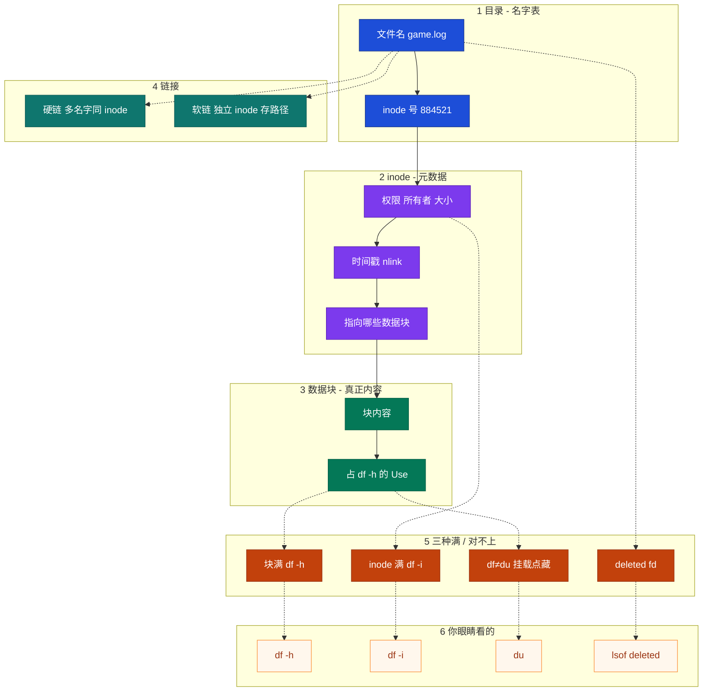
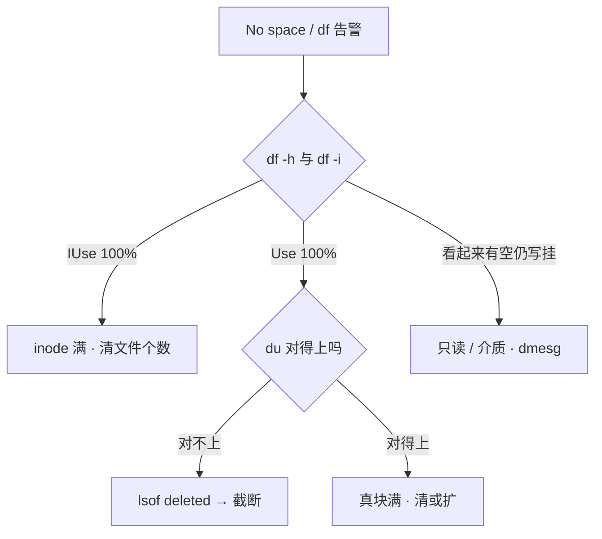
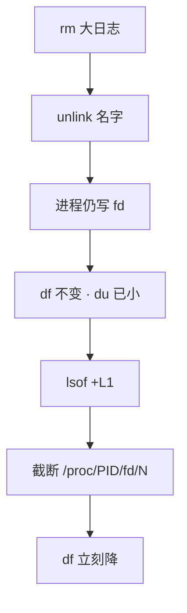
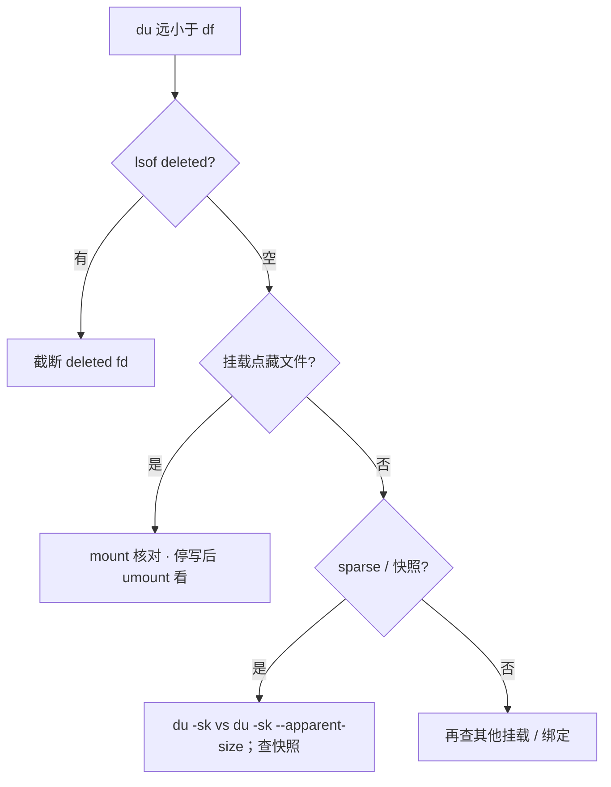
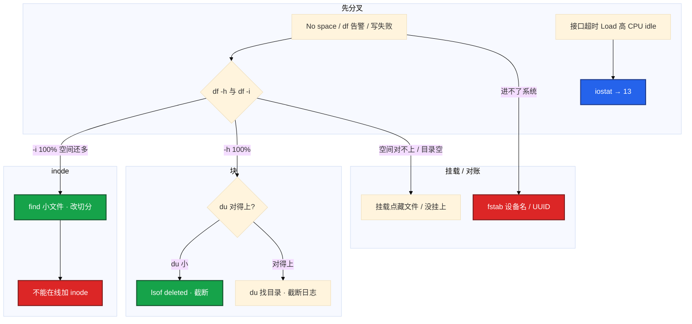

# 文件系统与 inode

> **这章解决什么**：`No space left on device`，`df -h` 却还有空；`rm` 了 20G，`du` 立刻小了，`df` 纹丝不动——满的是块、inode，还是已删仍打开？  
> **读法**：**先看总图** → **再认名词** → **再分节抠 inode/块、deleted、df≠du、软硬链**。  
> **刻意不展开**：await / aqu-sz / `%util` / 脏页 / journal 写路径 → [08 磁盘与IO](../08-磁盘与IO/)（**iostat 定责去 08**）；logrotate / copytruncate / journald → [23 日志运维](../23-日志运维/)；overlay 打满 inode → [10 cgroup与容器](../10-cgroup与容器/)；救援进不了系统 → [04 内核与系统](../04-内核与系统/)。

---

## 本章目录

1. [本章定位](#1-本章定位)
2. [先看总图：文件名 · inode · 块怎么串](#2-先看总图文件名--inode--块怎么串) ← **开篇必读**
   - [2.0 全章知识串图](#20-全章知识串图一张把细节串起来) ← **架构总览**
   - [2.6 完整走读：create 失败](#26-完整走读活动服-create-突然全挂)
   - [2.7 完整走读：rm 不还空间](#27-完整走读凌晨-rm-了-20g-df-不动)
3. [名词扫盲（对照总图认词）](#3-名词扫盲对照总图认词)
4. [三种满：块 / inode / deleted](#4-三种满块--inode--deleted)
5. [inode vs 块空间：本章最易混](#5-inode-vs-块空间本章最易混) ← **重点精读**
6. [deleted-but-open：rm 了空间不降](#6-deleted-but-openrm-了空间不降)
7. [df ≠ du：对账四条路](#7-df--du对账四条路)
8. [软链接与硬链接](#8-软链接与硬链接)
9. [ext4 / xfs / fstab 落地](#9-ext4--xfs--fstab-落地)
10. [定责决策树与命令速查](#10-定责决策树与命令速查)
11. [去哪章继续学](#11-去哪章继续学)
12. [面试 · 易错 · 数字](#12-面试--易错--数字)
13. [合上书](#合上书)

---

## 1. 本章定位

| 章 | 负责 |
|----|------|
| **09（本章）** | 文件名/inode/块、三种满、deleted、df≠du、软硬链、ext4/xfs、fstab UUID |
| **08** | 写路径、**iostat**、await/aqu-sz、脏页、journal、排队分型；空间三类只给入口 |
| **23** | logrotate、copytruncate、reopen、journal 打满 |
| **10** | 容器 overlay 层把 inode 打满 |

本章是**文件系统元数据线**。08 告诉你「盘慢不慢、脏不脏」；本章告诉你「满的是哪一类账、名字没了块还在不在」。

🎯 **值班签名**：`No space` → **同时** `df -h` 和 `df -i`；`du` 小 `df` 大 → **先** `lsof deleted`，**别先杀逻辑服**。盘慢 / await 高 → 回 [08](../08-磁盘与IO/) 看 iostat。

---

## 2. 先看总图：文件名 · inode · 块怎么串

> **正确开篇顺序**：先有全局画面，再认词，再抠细节。  
> 先看 **§2.0 全章串图**（考点挂一张板上），再看 **§2.1 坐标系**，再用 **§2.6 / §2.7 走读**把现场串起来。

### 2.0 全章知识串图（一张把细节串起来）

> 🎯 **合上书要能默画这张。** 蓝=目录名 · 紫=inode · 绿=数据块 · 橙=三种满/对不上。  
> 若预览仍报错，以下面 **ASCII 一页板** 为准。



**读图路线：**

| 段 | 记住 |
|----|------|
| ① | 文件名在**目录**里，不在 inode 里 |
| ② | inode = 元数据 + 指向块；create 消耗一个 inode |
| ③ | 块才占 `df -h`；小文件也能把 ② 打光 |
| ④ | 硬链共享 ②；软链自己是个小文件，内容是路径 |
| ⑤⑥ | 三种满 + df≠du → 定责树（§4～§7、§10） |

```text
┌──────────────────────────────────────────────────────────────────────────┐
│                     14 一张板：名字 → inode → 块 → 定责                    │
├─────────────┬────────────────────┬───────────────────────────────────────┤
│  目录       │  inode             │  数据块                               │
│  名字→号    │  权限/大小/nlink   │  真正内容                             │
│  rm 撕名字  │  create 耗一个     │  占 df -h                             │
├─────────────┴────────────────────┴───────────────────────────────────────┤
│  链接：硬链=同 inode · 软链=路径便签                                      │
│  满/对不上：块满 df-h · inode df-i · deleted lsof · 挂载点藏 → 定责树     │
│  慢？await / %util → 回 08 看 iostat（本章不展开）                        │
└──────────────────────────────────────────────────────────────────────────┘
```

### 2.1 坐标系：一个文件占两样东西

```text
                    ┌─ 目录项 ─────────────────────┐
  /var/log/         │  "game.log"  →  inode #884521 │
                    └──────────────┬────────────────┘
                                   │
                                   ▼
                    ┌─ inode #884521 ──────────────┐
                    │  mode / uid / size / mtime   │
                    │  nlink=1                     │
                    │  块指针 → …                  │
                    └──────────────┬───────────────┘
                                   │
                                   ▼
                    ┌─ 数据块 ─────────────────────┐
                    │  真正的日志内容（占空间）      │
                    └──────────────────────────────┘
```

**读图三句话：**

1. **文件名在目录里**，inode 是元数据，数据块才是内容——删名字不等于还空间。  
2. `No space` 必须同时看 `-h` 和 `-i`，两种满命令不同。  
3. `du` 小、`df` 大 → 名字没了但 inode 和块还在（deleted fd），或挂载点把文件藏住了。

### 2.2 三种失败对到图上


> **记住**：文件系统排障是 **先分清满的是什么**，不是一上来 `rm -rf /var/log`。

### 2.3 和 05 怎么分工（一眼钉死）

| 现象 | 先去哪 | 本章干什么 |
|------|--------|------------|
| 接口超时、CPU idle、Load 高、**await 高** | **[08](../08-磁盘与IO/)** `iostat -x` | 不展开 await/%util |
| `No space`、`df`/`du` 对不上、create 失败 | **本章** | 块 / inode / deleted / 挂载点 |
| 脏页堵死全机 write | **05** dirty_ratio | 只知道「满」不是慢 |
| 日志怎么轮转才不踩 deleted | **[23](../23-日志运维/)** | 本章只给截断止血 |

🎯 **别混**：本章不是磁盘性能章。看到 await / aqu-sz / `%util` 立刻回 08。

### 2.6 完整走读：活动服 create 突然全挂

> 用现网角色串一遍：**活动服按请求切文件 → inode 先满**。只保留这一版。

**现场**：活动高峰，热更/活动日志按「每条请求一个文件」切。应用报 `No space left on device`。群里有人喊加云盘。

**走读步骤：**

1. 登录机，同时看块和 inode：

```bash
df -h /data && df -i /data
```

2. 屏幕出现：

```text
Filesystem      Size  Used Avail Use% Mounted on
/dev/nvme0n1p1  1.0T   72G  953G   7% /data

Filesystem       Inodes  IUsed    IFree IUse% Mounted on
/dev/nvme0n1p1 67108864 67108864        0  100% /data
```

3. **分叉结论**：空间才 7%，inode **100%**——不是加盘容量能解决的，是小文件把表打光了。

4. 找谁吃的（按目录数文件）：

```bash
for d in /data/*/; do echo "$(find "$d" -type f 2>/dev/null | wc -l) $d"; done | sort -rn | head -5
```

5. 屏幕出现：

```text
4823104 /data/activity-logs/
  12045 /data/cache/
    892 /data/save/
```

6. 止血：删过期小文件（先确认业务可删），再看 `df -i`：`IUse%` 从 100% 降到 93%，create 恢复。  
7. 根治：改按时间/大小滚日志，**不要每条请求一个文件**；开服 checklist 带 `df -i`。

**输出解读：**

| 列 | 含义 |
|----|------|
| `df -h` 的 `Use%` | **数据块**占用 |
| `df -i` 的 `IUse%` | **inode**占用 |
| 两套百分比 | **独立**，必须一起看 |
| `find \| wc -l` | 直接指向文件数爆炸的目录 |

**面试怎么说**：「inode 满时 df -h 可能很健康；我先 df -i，find 按目录数文件定位，清过期小文件止血；已格式化的盘不能在线加 inode。」

### 2.7 完整走读：凌晨 rm 了 20G，df 不动

> 第二条走读：**战斗服日志 rm → deleted-but-open**。

**现场**：凌晨有人 `rm` 了 20G `game.log`。`du` 立刻小了，`df` 100% 不动。群里要重启逻辑服。

**走读步骤：**

1. 先对账：

```bash
df -h /var/log
du -sh /var/log
```

2. 屏幕出现：

```text
Filesystem      Size  Used Avail Use% Mounted on
/dev/vda1        50G   48G     0G 100% /
18M     /var/log
```

3. **分叉**：du 18M，df 48G/50G——差了几十年，先想 deleted fd。

4. 找谁握着：

```bash
lsof +L1 | grep deleted | head -5
# 或
lsof | grep deleted | head -5
```

5. 屏幕出现：

```text
game-serv 12847  root   3w   REG  253,0 21474836480  884521 /var/log/game.log (deleted)
nginx     8921   www    2w   REG  253,0      1048576  901234 /var/log/nginx/access.log (deleted)
```

6. **止血**（不要 kill 逻辑服）——对着 deleted fd 截断：

```bash
> /proc/12847/fd/3
df -h /var/log
```

7. 屏幕出现：空间从 100% 掉到 59%。  
8. 长期：logrotate copytruncate 或 reopen（nginx `USR1`）→ [23](../23-日志运维/)。

**输出解读：**

| 信号 | 说明 |
|------|------|
| `du` 小、`df` 大 | 目录树 walk 不到，但块仍分配 |
| `(deleted)` | 目录项已 unlink，fd 仍打开 |
| `3w` | fd 3，写模式 |
| `21474836480` | ≈ 20G，就是还不回的那坨 |
| `> /proc/PID/fd/N` | 截成 0，**不杀进程**，`df` 立刻降 |

**面试怎么说**：「rm 只删目录项；进程握着 fd 块不还。我先 lsof deleted，对 fd 截断止血，长期靠 logrotate，磁盘满不会先杀逻辑服。」

---

## 3. 名词扫盲（对照总图认词）

对照 §2.0：每个词在图上有位置。值班里先听现象，再对表。

### 3.1 值班现象 → 第一刀

| 监控/应用说的 | 技术含义 | 你的第一刀 |
|---------------|----------|------------|
| `No space left on device` | 可能是块满 **或** inode 满 | `df -h` **和** `df -i` 同时看 |
| `df` 还有 80% 空闲但仍 No space | 多半是 **inode 满** | `df -i`；`find` 数小文件 |
| `rm` 了 20G，`df` 不动 | 进程还握着 **deleted fd** | `lsof \| grep deleted` |
| `du` 和 `df` 差很多、deleted 空 | 挂载点藏文件 / sparse / 快照 | `mount`；再想 sparse |
| 云盘挂了，目录是空的 | 挂载点藏文件 / 没挂上 | `mount`；看挂载点下面 |
| 接口超时、await 高 | **盘慢**，不是「满」 | → [08](../08-磁盘与IO/) `iostat -x` |

### 3.2 必会名词（点到为止）

| 名词 | 一句话 | 对照总图 |
|------|--------|----------|
| **目录项** | 名字 → inode 号的登记 | ① |
| **inode** | 元数据槽位：权限、大小、块指针、nlink | ② |
| **数据块** | 真正内容，占 `df -h` | ③ |
| **nlink** | 硬链接计数；减到 0 且无 fd 才回收 | ② |
| **unlink** | `rm` 干的事：撕目录项 | ①→⑤ |
| **fd** | 进程打开的句柄；握着就不回收 | ⑤ deleted |
| **df** | 文件系统已分配的块 / inode 配额视角 | ⑥ |
| **du** | 能 walk 到的目录树占用 | ⑥ |
| **软链接** | 独立 inode，内容是路径字符串 | ④ |
| **硬链接** | 多个名字共享同一 inode | ④ |
| **IUse%** | inode 用了多少；和 Use% 无关 | ⑤ |
| **fstab / UUID** | 开机挂谁；云盘别写 `/dev/sdb` | 落地 §9 |

> **记住**：文件名在目录里，inode 是元数据，块才是内容；报 No space 必须同时看 `df -h` 和 `df -i`。

### 3.3 打个比方（只留这一处）

inode 像停车场的**车位号牌**——每个文件占一个号，跟车多大无关；数据块才是**车位本身**。  
战斗服 stdout 重定向到单文件会 **块满**；活动日志按请求切文件会 **inode 满**。  
`rm` 只撕掉门口登记册上的名字，车（数据）还在，只要还有进程握着钥匙（fd）。

### 3.4 核心对象怎么在命令里认

排障时你手里只有命令输出。把对象和「屏幕上哪一列」钉死：

| 对象 | 命令怎么认 | 正常长什么样 | 异常长什么样 |
|------|------------|--------------|--------------|
| 块配额 | `df -h` 的 `Use%` / `Avail` | 有空余、缓慢涨 | 100% 或 Avail=0 |
| inode 配额 | `df -i` 的 `IUse%` / `IFree` | IFree 很大 | IUse 100%、IFree=0 |
| 目录树占用 | `du -sh` | 和 df 大致同量级 | 远小于 df → §7 |
| 打开中的已删文件 | `lsof … (deleted)` | 无 / 很少 | 单条 SIZE 几十 G |
| 挂载真实性 | `findmnt` / `mount` | `/data` 来自预期 UUID | 没挂上、或挂错设备 |
| 文件系统类型 | `df -T` | ext4 / xfs | tmpfs 当存档、怪异类型 |
| 链接类型 | `ls -li` / `stat` | 硬链同 inode；软链 `l` | 悬空软链、误用硬链指目录 |

```bash
stat /var/log/game.log
# File: …  Size: …  Blocks: …  IO Block: …
# Device: …  Inode: 884521  Links: 1
# Access: (0644/-rw-r--r--)  Uid: …  Gid: …
```

`stat` 一眼看到 **Inode** 号和 **Links（nlink）**——硬链排查、确认是不是同一个文件，靠这两列。

### 3.5 create / unlink / close 生命周期（对照总图）

```text
create("a.log")
  → 目录登记名字 → 分配空闲 inode →（写时）分配数据块
  → df -i 的 IUsed +1；写数据后 df -h 的 Used ↑

open + write（进程握 fd）
  → 即使后来 rm 了名字，inode/块仍被 fd 钉住

unlink / rm("a.log")
  → 只撕目录项；nlink--
  → nlink==0 且没有任何 fd → 内核回收 inode+块
  → nlink==0 但仍有 fd → deleted-but-open（§6）

close(fd) 或 截断到 0
  → 最后一只手松开 → 空间回到 df
```

🎯 **值班用这一条就够**：名字没了不等于空间回来了；最后说了算的是 **nlink 和 fd**。

---

## 4. 三种满：块 / inode / deleted

> ⑤ 段展开。先对号，再动手。05 §8 给入口；**密度、截断细节、软硬链在本章钉死**。

### 4.1 总表

| 满了什么 | 你看到 | 写不了 / 不还 | 第一刀 |
|----------|--------|---------------|--------|
| **数据块** | `df -h` 100% | 追加、create | `du` 找大目录；先排除 deleted |
| **inode** | `df -i` 100%，空间可能还很多 | **create** 失败，同样报 No space | `find` 数小文件 |
| **已删但仍打开** | `du` 小、`df` 不降 | 空间不回来 | `lsof deleted` → 截断 |
| **只读 / 介质** | EROFS、dmesg I/O error | 写入失败 | `dmesg -T`（交叉 05） |



### 4.2 游戏场景对照

| 场景 | 更容易满谁 |
|------|------------|
| 战斗服 stdout 重定向到**单个**大日志 | **块** |
| 活动日志按**每条请求一个文件**切 | **inode** |
| 有人习惯 `rm` 大日志、进程还在写 | **deleted** |
| 数据盘 nofail、开机没挂上、业务照写 | **挂载点藏文件**（df≠du） |

> **别混**：空间 50% 不一定安全——inode 可能已经 90%。平均空间会骗人，和平均 CPU 同一类。

### 4.3 命令开口这一套

告警磁盘满。开口这一套，**不要先** `rm -rf /var/log`。

```bash
df -h && df -i
du -sh /* 2>/dev/null | sort -rh | head
lsof +L1 | grep deleted
mount | grep /data
```

盘慢？加一句回 08：

```bash
iostat -xd 1 3
# await / aqu-sz / %util 怎么读 → 08，本章不展开
```

---

## 5. inode vs 块空间：本章最易混

> 🔥 **全章最易晕的一点单独钉死。** FAQ 只在本节写透；别处「见 §5」。

### 5.1 最常见具体例子

**例子 A（inode 满）**：活动服 `/data`，`df -h` 还有 80%，`touch /data/x` 报 `No space left on device`。热更/活动目录几十万～几百万小文件。

**例子 B（块满）**：战斗服把 stdout 重到 `/var/log/game.log` 一个文件，`df -h` 100%，`df -i` 还很健康。

### 5.2 一句话定义

> **块配额和 inode 配额是两套账。**  
> `df -h` 看块；`df -i` 看 inode；清几个大日志还不了海量小文件占的 inode。

### 5.3 对照命令怎么认

```bash
df -h /data
df -i /data
touch /data/_inode_probe_$$
```

```text
# inode 满典型
Filesystem      Size  Used Avail Use% Mounted on
/dev/nvme0n1p1  500G  70G   430G  14% /data

Filesystem      Inodes  IUsed  IFree IUse%
/dev/nvme0n1p1    32M    32M      0  100%

touch: cannot touch '/data/_inode_probe_1234': No space left on device
```

```text
# 块满典型
Filesystem      Size  Used Avail Use% Mounted on
/dev/vda1        50G   50G     0G 100% /

Filesystem      Inodes  IUsed  IFree IUse%
/dev/vda1          3M   120K    2.9M    4% /
```

| 签名 | inode 满 | 块满 |
|------|----------|------|
| `df -h` | 往往还有空 | 100% |
| `df -i` | **100%** | 往往健康 |
| `touch` 小文件 | **失败** | 失败（没块） |
| 追加已有大文件 | 有时仍可写（不新建 inode） | 失败 |
| 止血 | 删**文件个数** | 删/截断**大文件**或扩容 |

⭐ **追加 vs create**：inode 满时，对**已存在**文件 append 有时还能写；**新建**一定挂。所以「还能写日志但热更解压失败」——先想 inode。

### 5.4 算术：为什么空间才用一点 inode 就光了

ext4 默认大约 **1 inode / 16KB** 磁盘：

| 盘大小 | 大约 inode 数 | 若全是 1KB 文件 |
|--------|---------------|-----------------|
| 1TB | ≈ 六千多万 | 空间大约只用 **60～70GB**（不到 10%）就表满 |
| 500G | ≈ 三千多万 | 同理，空间看起来很空 |

```text
满表时的空间下限 ≈ inode数 × 平均文件大小
1KB × 67M ≈ 67GB  ← 1TB 盘上看着才 7%
```

### 5.5 能不能「加一点 inode」？

| | ext4 | xfs |
|--|------|-----|
| inode 怎么来 | 格式化时 **定死**（`-i` / `-N`） | **动态分配** |
| 在线加 inode？ | **不能** | 动态好一些，**仍会被海量小文件打满** |
| 止血 | 删小文件 / 改切分 | 同左 |
| 根治 | 迁数据、按密度重建，或别每条一个文件 | 同左；**换 xfs ≠ 免监控** |

```bash
# 只能在格式化时调密（会占更多元数据空间）
# mkfs.ext4 -i 4096 -L data /dev/nvme0n1p1
# 已经有数据的盘：mke2fs -i 不是在线调参，是格式化
```

> **易错一句钉死（只写一次）**：已经格式化的盘 **不能在线加 inode**；`mke2fs -i` / `-N` 是**格式化时**的事。想「在线改密度」→ 错。换 xfs 当根治 → 也错。

### 5.6 定位谁吃了 inode

```bash
# 哪个目录文件最多
for d in /data/*/; do echo "$(find "$d" -type f 2>/dev/null | wc -l) $d"; done | sort -rn | head

# 或按一层
find /data -xdev -type f | cut -d/ -f1-3 | sort | uniq -c | sort -rn | head
```

清的时候按业务确认：过期日志、失败的热更解压残留、缓存碎片。清完立刻再 `df -i`，确认 `IFree` 回来了。

### 5.7 监控与开服

| 要 | 不要 |
|----|------|
| 告警 **inode 使用率**（如 80%/90%） | 只告警空间百分比 |
| 开服 checklist 带 `df -i` | 只看 `df -h` 说「还有一半」 |
| 日志按时间/大小滚 | 每条请求一个文件 |
| 大盘格式化前想清楚密度 | 上线后再想 `mke2fs -i` |

---

## 6. deleted-but-open：rm 了空间不降

> ① 例子 → ② 定义 → ③ 命令认 → ④ 易错钉死。

### 6.1 最常见具体例子

运维 `rm` 了 40G `logic.log`，java / game-server 还在跑。`du` 已小，`df` 仍 100%。有人要 `kill -9` 逻辑服。

### 6.2 一句话定义

> **`rm` = unlink 文件名；进程仍握着 fd → inode 和数据块不释放 → `df` 不变。**  
> 止血：截断（`> file` 或 `> /proc/PID/fd/N`），不要再 rm，更不要先杀逻辑服。

### 6.3 对照命令怎么认

```bash
df -h /var/log
du -sh /var/log
lsof +L1 | grep deleted
# +L1：链接计数 <1 仍打开的（已删仍占）更干净
```

```text
COMMAND   PID USER   FD   TYPE DEVICE          SIZE/OFF NODE NAME
java    28451 root   1w   REG  253,1   42949672960  112 /var/log/logic.log (deleted)
```

| 字段 | 看什么 |
|------|--------|
| `PID` | 哪个进程 |
| `FD` `1w` | 句柄号 + 写 |
| `SIZE` | 还不回的字节 |
| `NAME ... (deleted)` | 签名 |

### 6.4 机制：unlink 之后谁说了算

```text
时刻 0  目录项存在，nlink=1，进程 fd 打开，块占用计入 df
时刻 1  rm → 目录项没了，nlink=0
        但 fd 还在 → 内核不回收 inode/块 → df 不变
        du 已经 walk 不到 → du 变小
时刻 2  截断 fd 或进程 close/重启
        → 块释放 → df 降
```



### 6.5 截断 vs rm（值班必会）

| 动作 | 名字 | inode / 块 | df |
|------|------|------------|-----|
| `rm` | 没了 | 若被打开则还在 | **不降** |
| `> file` | 还在 | 块丢掉，fd 仍有效 | **立刻降** |
| `> /proc/PID/fd/N` | 文件已被 rm 只剩 fd | 对着 deleted 截断 | **立刻降** |

```bash
# 文件名还在、进程还在写：
> /var/log/app.log

# 已经被 rm、只剩 fd：
lsof +L1 | grep deleted
> /proc/<pid>/fd/<n>
```

⭐ **截错 fd 会怎样？** 可能截掉 socket 或数据文件。必须 `lsof` 对上**日志路径**再动手。

### 6.6 长期怎么防

| 做法 | 说明 | 去哪 |
|------|------|------|
| 进程 reopen | nginx `kill -USR1`；自己会关旧 fd | [23](../23-日志运维/) |
| copytruncate | logrotate 拷走再截断；进程无感 | 22 |
| 别对正在写的文件只 rm | rm 不是止血 | 本章 |
| Docker `json-file` 设 max-size | 否则容器把节点盘写满 | 07 / 22 |

> **易错一句钉死**：`du` 已变小只说明目录树算出来小了；`df` 看的是文件系统已分配块——fd 还占着就不降。`rm -rf` 之后立刻宣布空间回来了 → 错。

---

## 7. df ≠ du：对账四条路

> 很多人只会 deleted。deleted 空了还差很多 → 按下面顺序想。

### 7.1 一句话

> **`du` 统计「能 walk 到的文件」；`df` 看「文件系统已分配的块」。**  
> 差一截：deleted → 挂载点藏文件 → sparse → 元数据/快照。

### 7.2 四条路决策



### 7.3 ① deleted（见 §6）

签名：刚 rm 过大文件；`lsof` 有 `(deleted)`。

### 7.4 ② 挂载点把文件藏起来

**例子**：数据盘偶发没挂上，业务把日志写进 `/data` 这个**根盘上的空目录**。后来云盘挂上，旧文件被挡在挂载点下面。`du /data` 只看到云盘上的新内容；根盘上那批被藏住的还占着系统盘 `df`。

**现场走一遍：**

1. 告警：根分区 95%，`/data` 云盘几乎空，业务说「昨天的日志没了」。

```bash
df -h / /data
mount | grep /data
du -sh /data
```

2. 屏幕可能是：

```text
/dev/vda1        50G   48G  2.0G  96% /
/dev/nvme0n1p1  1.0T  1.2G  999G   1% /data
/dev/nvme0n1p1 on /data type ext4 (rw,noatime)
12G     /data          # 只是云盘上的新内容
```

3. 怀疑：开机一度没挂上时，业务写过根盘上的 `/data` 目录。验证（**生产先停写**）：

```bash
# 维护窗口：停掉往 /data 写的服务
umount /data
du -sh /data          # 现在看到的是「挂载点目录本身」
ls -lh /data | head
mount /data
```

4. 若 umount 后 `/data` 突然变成 30G——就是藏文件。挪走、清掉，再挂回云盘。

```bash
mount | grep /data
findmnt /data
# 有机会停写后：
# umount /data && du -sh /data && mount /data
```

这也是 **关键盘不要 nofail** 的原因之一：静默没挂上 → 写错地方 → 盘回来文件被藏。

可 `mount --bind` 对照（生产 umount 要停写）：

```bash
mkdir -p /mnt/rootdata
mount --bind / /mnt/rootdata
du -sh /mnt/rootdata/data   # 不 umount 业务盘也能偷看挂载点下藏了啥
umount /mnt/rootdata
```

> **别混**：挂载点藏文件时，`lsof deleted` 往往是空的——别只会 deleted。

### 7.5 ③ sparse（稀疏文件）

空洞文件：`du` 默认看**实际占块**，`du --apparent-size` 看**逻辑大小**。和「df 整体对不上」要分清是单文件还是整盘。

```bash
du -sh /path/to/file
du -sh --apparent-size /path/to/file
ls -lh /path/to/file
```

### 7.6 ④ 文件系统元数据 / 快照

LVM 快照、某些云盘快照、大量小文件的元数据开销，会让「看得见的文件之和」对不上 `df`。先排除 ①② 再怀疑这条。

### 7.7 对照口诀

| 差因 | 签名 | 第一刀 |
|------|------|--------|
| deleted | `(deleted)` | 截断 |
| 挂载点藏 | 盘空、业务「丢了」 | `mount`；nofail 复查 |
| sparse | apparent ≫ 实际 | `du --apparent-size` |
| 快照/元数据 | 前三条都空 | 查快照策略 |

> **记住**：`du` 不是 `df`。差一截先想 deleted，再想挂载点。

---

## 8. 软链接与硬链接

### 8.1 一句话

> **硬链接共享 inode；软链接只是路径，可跨文件系统、可链目录。**

### 8.2 对照总图

```text
硬链接：
  /data/save/player.db  ──┐
                          ├──► 同一 inode #884521 ──► 同一份数据块
  /data/backup/player.db ─┘
  ls -li 两行 inode 号相同，nlink=2

软链接：
  /opt/game/current  ──► 独立 inode（类型 l）──► 内容是字符串
                         "/opt/game/releases/1.2.3"
  目标删了 → current 悬空（链接还在，仓库没了）
```

### 8.3 命令怎么认

```bash
# 版本切换用软链
ln -s /opt/game/releases/1.2.3 /opt/game/current
ls -li /opt/game/current
# lrwxrwxrwx ... current -> /opt/game/releases/1.2.3

# 同盘备份用硬链
ln /data/save/player.db /data/backup/player.db
ls -li /data/save/player.db /data/backup/player.db
# 两行 inode 相同，链接计数 2
```

| | **硬链接** | **软链接** |
|--|------------|------------|
| inode | **共享**同一号 | **自己**一个 inode |
| 跨文件系统 | ❌ | ✅ |
| 链目录 | ❌（一般） | ✅ |
| 删一个名字 | nlink−1，数据还在（nlink>0） | 删链接本身不影响目标 |
| 删目标 | 其他硬链名仍可访问 | 链接**悬空** |
| 运维场景 | `rsync --link-dest` 增量备份省空间 | 版本切换 `current → 1.2.3` |

### 8.4 现场走一遍（版本切换）

1. 发布目录准备好 `/opt/game/releases/1.2.4`。  
2. 原子切换（先链临时名再 mv）：

```bash
ln -sfn /opt/game/releases/1.2.4 /opt/game/current.tmp
mv -Tf /opt/game/current.tmp /opt/game/current
readlink -f /opt/game/current
```

3. 屏幕出现：

```text
/opt/game/releases/1.2.4
```

4. 有人用硬链接指目录 → **失败/不该这么干**；硬链不能当版本切换工具。

```bash
ln /opt/game/releases/1.2.4 /opt/game/current
# ln: /opt/game/current: hard link not allowed for directory
```

### 8.5 相对路径软链的坑

软链存的是**字符串**，不一定是绝对路径：

```bash
cd /opt/game
ln -s releases/1.2.3 current     # 相对：从 current 所在目录解析
ln -s /opt/game/releases/1.2.3 current-abs
```

把 `current` 挪到别的目录，相对软链会指错。生产版本切换**优先绝对路径**，少埋相对坑。

```bash
readlink /opt/game/current
# releases/1.2.3          ← 相对，搬家易碎
# /opt/game/releases/1.2.3 ← 绝对，稳
```

### 8.6 硬链与备份（一眼）

```bash
# 增量备份思路：没变的文件硬链到上一份，省一份空间
rsync -a --link-dest=/backup/daily.1 /data/save/ /backup/daily.0/
ls -li /backup/daily.0/player.db /backup/daily.1/player.db
# inode 相同 → 两天备份共用一块数据
```

删 `daily.1` 不影响 `daily.0`（nlink 还在）。这是硬链的正确打开方式——**不是**拿来做 `current` 版本切换。

### 8.7 易错

| 说法 | 对错 |
|------|:----:|
| 版本切换用硬链接 | 错（不能链目录；用软链） |
| 软链跨盘 | 对 |
| 删一个硬链名数据就没了 | 错（看 nlink） |
| 软链目标删了链接也自动没 | 错（变悬空） |
| 相对软链随便挪 | 错（字符串按原相对位置解析） |

> **记住**：备份用硬链省空间，日常版本切换用软链（绝对路径更稳）。

---

## 9. ext4 / xfs / fstab 落地

### 9.1 ext4 vs xfs

**一句话：** 生产 ext4 或 xfs；换 xfs 不等于不用管小文件。

| | **ext4** | **xfs** |
|--|----------|---------|
| 定位 | 稳定、兼容性好，通用默认 | 大文件、并行 IO、数据库、大容量 |
| inode | 格式化时 **定死** | **动态分配**，仍会被海量小文件打满 |
| 在线扩 | 可以（`resize2fs`） | **原生擅长** `xfs_growfs` |
| 缩小 | 可离线缩 | **不能缩** |
| 小文件海量 | inode 表先满，必须规划密度 | 动态好一些，**不是免管** |

**选型口诀：**

| 盘 | 选 | 理由 |
|----|----|------|
| 登录机 / 不确定 / 要能离线缩 | **ext4** | 兼容、默认 |
| DB / 录像 / 大文件 / 要在线扩 | **xfs** | `xfs_growfs`；大文件并行 |
| 临时缓存 | 可 tmpfs | **重启丢**——存档/账单不行 |
| 核心盘默认 btrfs | ❌ | 生产别当游戏核心盘默认 |

```bash
df -T /data
blkid /dev/nvme0n1p1

# 通用
mkfs.ext4 -L data /dev/nvme0n1p1
# 海量小文件才调密（格式化时）
# mkfs.ext4 -i 4096 -L data /dev/nvme0n1p1
# 大文件 / DB
mkfs.xfs -L data /dev/nvme0n1p1
```

journal / 写路径细节 → [08](../08-磁盘与IO/)。await 与调度器 → 同样回 08。

### 9.2 新盘落地顺序

```text
分区 → 选类型格式化 → blkid 取 UUID → 写入 fstab
→ mount -a 验证 → df -hT / df -i 验收 → 才允许 reboot
```

| 项 | 选 | 不选 |
|----|----|------|
| 设备名 | **UUID=** | `/dev/sdb`（云盘序号会变） |
| 数据盘 | 独立挂 `/data`，不和系统盘混 | 日志写满根分区 |
| 验收 | `df -h` / `df -i` / `mount` | 未 `mount -a` 就 reboot |

写错 fstab 进不了系统 → 救援见 [04](../04-内核与系统/)。

### 9.3 fstab 核心配置

```
UUID=a3f2c8d1-4e5b-6c7d-8e9f-0123456789ab  /data  ext4  defaults,noatime  0  2
```

| 项 | 选 | 不选 |
|----|----|------|
| 设备名 | **UUID=** | `/dev/sdb` |
| nofail | 可缺的盘（非关键） | **游戏存档 / 账单盘** |
| noatime | 通用数据盘常开 | 真要靠 atime 的备份软件先测 |
| discard | 看云厂商是否底层 TRIM | 两层都盲目开而不测 |
| defaults | 起步够用 | 乱开实验选项 |

🔥 **关键盘不要 nofail**——挂不上还起业务，数据会写到空挂载点下面，盘挂上后被藏起来（§7.4）。

扩容：先扩云盘，xfs `xfs_growfs`、ext4 `resize2fs`；xfs 不能缩。

> **记住**：fstab 用 UUID，改完 `mount -a` 再 reboot；关键盘不要 nofail 静默失败。

### 9.4 开服 checklist（文件系统项）

1. `df -h` **和** `df -i` 水位  
2. 日志路径在哪块盘、轮转有没有（→ 23）  
3. fstab 是 UUID、关键盘不是 nofail  
4. 数据盘确实挂上了，不是写在空目录里  
5. tmpfs / 容器 overlay 没有当存档盘  
6. 类型：生产 ext4/xfs，核心盘不是 btrfs  
7. 若担心盘慢：再跑 `iostat -xd 1 3` → [08](../08-磁盘与IO/)

---

## 10. 定责决策树与命令速查

### 10.1 命令速查（值班先背这张）

| 目的 | 命令 | 看什么 |
|------|------|--------|
| 块 vs inode | `df -h` / `df -i` | 哪种满 |
| 类型 | `df -T` | ext4 / xfs / tmpfs |
| 谁占空间 | `du -sh … \| sort -rh` | 能看见的文件 |
| 已删仍占 | `lsof +L1 \| grep deleted` | PID / fd / 大小 |
| 小文件堆 | `find … \| wc -l` | inode 满时定位目录 |
| 挂载 | `mount` / `findmnt` | 真挂上还是没挂 |
| UUID | `blkid` | 写 fstab |
| **盘慢？** | `iostat -xd 1 3` | → **[08](../08-磁盘与IO/)** await/aqu-sz |

```bash
df -h && df -i
du -sh /* 2>/dev/null | sort -rh | head
du -sh /data/* 2>/dev/null | sort -rh | head
lsof +L1 | grep deleted
find /data -type f | wc -l
for d in /data/*/; do echo "$(find "$d" -type f 2>/dev/null | wc -l) $d"; done | sort -rn | head
mount | grep /data
blkid
# 慢才跑：
# iostat -xd 1 3
```

### 10.2 决策树



### 10.3 现象 \| 先做 \| 别做

| 现象 | 先做什么 | 不要做什么 |
|------|----------|------------|
| df -h 18%、No space | `df -i`；find 小文件 | 调业务、加云盘容量当第一刀 |
| rm 后 df 不降 | lsof deleted；截断 | 杀逻辑服 |
| 有人 `rm -rf /var/log` | 停手；截断 | 宣布空间回来了 |
| 想在线 `mke2fs -i` | 否 | 格式化生产盘 |
| 换 xfs 治 inode | 仍要管小文件 | 当根治 |
| fstab 写 /dev/sdb 就 reboot | UUID + `mount -a` | 未验证 reboot |
| 关键盘 nofail | 拿掉 | 静默写到空目录 |
| tmpfs 放存档 | 迁走 | 重启丢数据 |
| du 200G df 800G、deleted 空 | 挂载点藏文件 / sparse | 只会 deleted |
| 接口超时、await 高 | **iostat → 08** | 在本章纠结 inode |

### 10.4 截断操作备忘

```bash
lsof +L1 | grep deleted
# 文件名还在：
# > /var/log/app.log
# 只剩 fd：
# > /proc/<pid>/fd/<n>
```

---

## 11. 去哪章继续学

| 你想搞懂 | 去 |
|----------|-----|
| **iostat**、await、aqu-sz、%util、脏页、journal 写路径 | [08 磁盘与IO](../08-磁盘与IO/) |
| Load / `%wa` / D 状态 | [06](../06-CPU与Load/) · [05](../05-进程与信号/) |
| Page Cache、available | [07](../07-内存与OOM/) |
| logrotate、copytruncate、reopen | [23](../23-日志运维/) |
| 容器 overlay inode | [10](../10-cgroup与容器/) |
| fstab 写挂进不了系统 | [04](../04-内核与系统/) |
| cgroup `io.max` | [10](../10-cgroup与容器/) |

---

## 12. 面试 · 易错 · 数字

| 问 | 答 |
|----|-----|
| No space 只看 df -h？ | 不行，必须同时 `df -i`。 |
| inode 满空间还能很多吗？ | 能。1KB 小文件能在空间个位数百分比时打光表。 |
| inode 能在线加吗？ | **不能**（ext4 格式化定死）；只能清或迁数据重建。 |
| 换 xfs 还要管 inode 吗？ | **要**。动态分配仍会被海量小文件打满。 |
| rm 大文件 df 一定降？ | **不一定**。进程握着 fd 就不降。 |
| 磁盘满先杀逻辑服？ | **不**。先截断日志 fd。 |
| du 就是 df？ | **不是**。差一截先 deleted，再挂载点。 |
| fstab 写 /dev/sdb？ | **错**。用 UUID；改完 `mount -a`。 |
| 关键盘加 nofail？ | **危险**。静默写到空挂载点。 |
| 版本切换用硬链？ | **错**。硬链不能链目录，用软链。 |
| 玩家数据放 tmpfs？ | **错**。重启丢。 |
| 盘慢看本章？ | **不**。看 [08](../08-磁盘与IO/) iostat。 |

| 易错 | 真相 |
|------|------|
| No space = 块满 | 也可能是 inode 满 |
| 清几个大日志治 inode 满 | 治的是块；inode 要减**文件个数** |
| `mke2fs -i` 在线调密 | 那是格式化 |
| du 小了空间就回来了 | df 才是已分配块 |
| 软链硬链分不清 | 硬链同 inode；软链是路径 |
| 只监控空间 % | 必须带 inode % |

**数字**：ext4 默认约 **1 inode / 16KB** · 1TB ≈ **六千多万** inode · 1KB×满表 ≈ 空间只用 **60～70GB** · 以太网无关，本章数字在 inode 密度。

**易混清单**：块满 vs inode 满 · rm vs 截断 · du vs df · ext4 固定 inode vs xfs 动态 · 软链 vs 硬链 · nofail 可缺 vs 关键盘 · 挂载点藏文件 vs deleted · **满（本章）vs 慢（05 iostat）**。

---

## 合上书

1. **默画 §2.0**：文件名、inode、数据块各在哪？三种满挂在哪一段？  
2. **口述**：No space 为什么必须看 `-i`？1TB/1KB 文件怎么估？  
3. **讲清**：inode 满怎么证明、怎么止血、能不能在线加？  
4. **讲清**：rm 后 df 不降怎么办？`>file` 和 `> /proc/PID/fd/N` 何时用？  
5. **定责**：du≪df 且 deleted 空，还查什么？关键盘为什么不要 nofail？  
6. **选型**：ext4 / xfs / tmpfs / btrfs？软链硬链运维各用哪？  
7. **边界**：await 高、接口超时——回哪章看什么命令？  

七题都能口述，这一章就过了。盘慢与写路径：[08](../08-磁盘与IO/)。日志轮转：[23](../23-日志运维/)。
