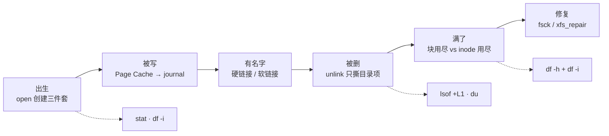
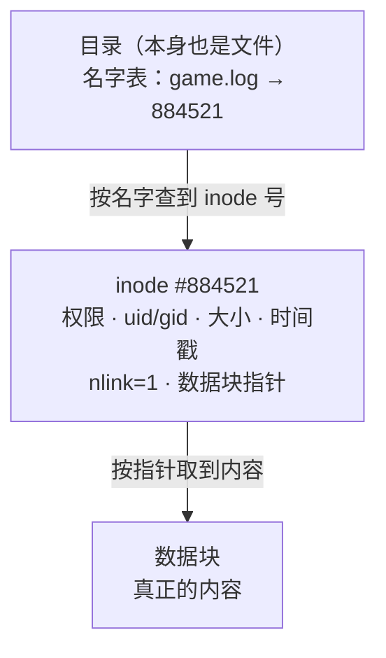
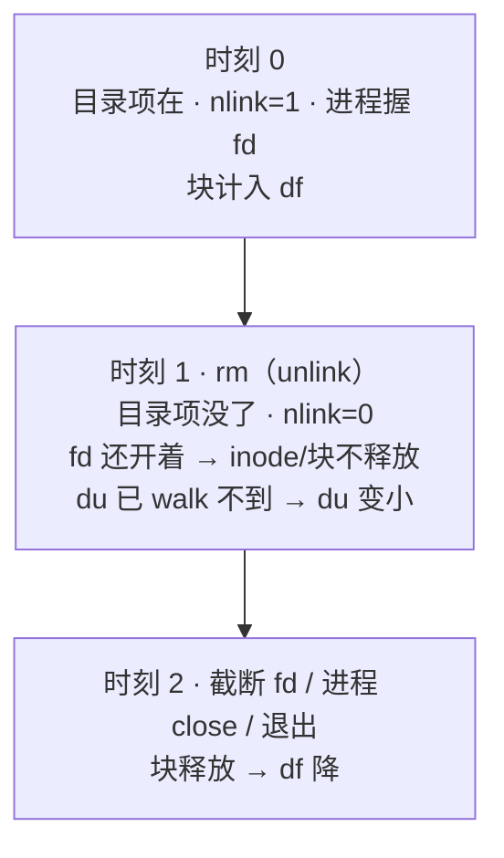
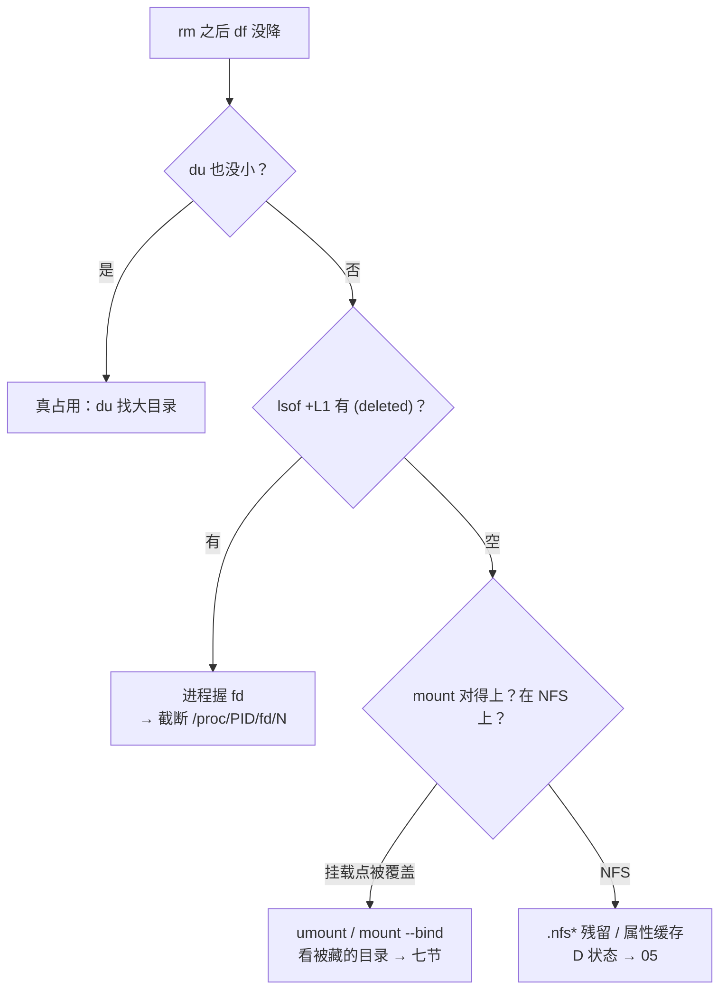
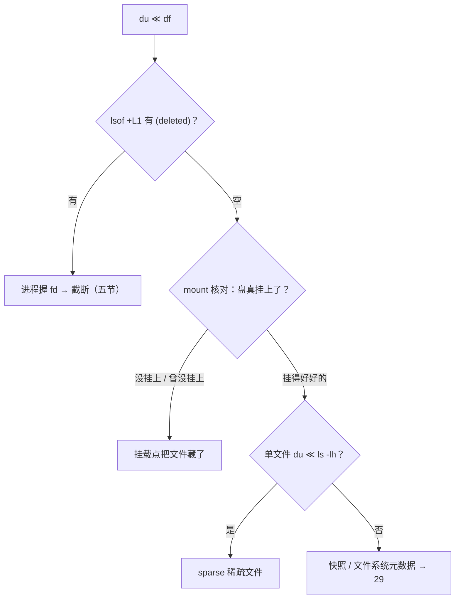
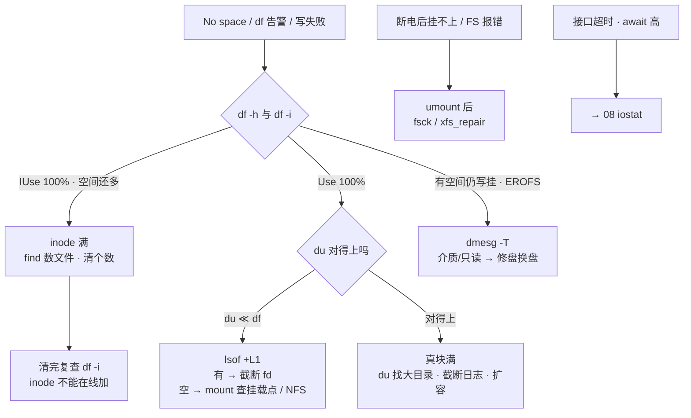

# 文件系统与 inode

> 活动服全服狂报 `No space left on device`，`df -h` 才用 18%，群里在喊扩云盘；半小时后有人 `rm` 掉 40G 日志，`df` 纹丝不动，又有人要重启逻辑服——两个动作都是错的：满的是 inode，占着的是 fd，跟容量和进程都不相干。
> **本章回答**：一个文件从 open 出生、被写、有名字、被删到把空间还回去，每一笔账记在目录项、inode 还是数据块上；出了问题怎么在 60 秒内看出满的是哪一类。
> **不讲**：iostat/await/脏页水位/fsync 落盘路径 → [08](../08-磁盘与IO/)；D 进程与信号语义 → [05](../05-进程与信号/)；LVM/RAID/分区加盘全流程 → [29](../29-磁盘管理与LVM/)；logrotate 轮转 → [23](../23-日志运维/)。

**标记**：🎯重点 · 🔥难点 · ⭐常考 · 🔧实操

---

## 一、一张图：一个文件的一生

> 🎯 **一句话**：文件 = 目录项 + inode + 数据块三件套；出生、被写、有名字、被删、满、修复六个阶段，每个阶段各有专属的坏法。



**读图**：

- 主线是一个文件的一生，六个阶段串成一条时间线，后面每节讲一段；「被删」和「满了」两段是值班高频区，也最厚。
- 三双眼睛各照一段：`stat`/`df -i` 照出生（inode 的账），`lsof +L1`/`du` 照删除（谁还占着），`df -h`/`df -i` 照满（两套配额）。
- 盘「慢」不在这条线上——await/aqu-sz/一排 D 状态去 [08](../08-磁盘与IO/)，本章只管「满」和「对不上」。

---

## 二、出生：open 创建三件套

> 🎯 **一句话**：create 一次要过三道登记——目录里记名字、inode 表占一个槽位、写数据才占块。



**读图**：从上往下就是一次 `open` 的寻址链——路径解析先翻目录这张「名字 → inode 号」的表，再拿 inode 里的块指针取内容。三件套各自独立记账，正是后面「删了名字不等于还了空间」「块满和 inode 满是两种病」的根源。

- **目录项（dentry）** = 目录里的一条「文件名 → inode 号」登记。目录本身也是个文件，内容就是一张名字表；内核把这些登记缓存成 **dentry cache（目录项缓存）** 加速路径解析。**文件名不在 inode 里**——这是全章第一句。
- **inode** = 元数据槽位：权限、uid/gid、大小、三个时间戳、**nlink（硬链接计数）**、指向数据块的指针。每个文件系统有一张规模固定的 inode 表，`create` 消耗一个，与文件多大无关。
- **数据块** = 真正的内容，占 `df -h` 的 Used。
- **superblock（超级块）** = 文件系统的总账本：总块数、空闲块、总 inode、空闲 inode。`df` 的数字就来自它那套统计。

> 💡 **打个比方**：inode 像停车场的**车位号牌**——每个文件占一个号，跟车多大无关；数据块才是**车位本身**。号牌发完了（inode 用尽），车库再空也进不了新车；反过来大巴太多（块用尽），号牌还有、车位满了。

### 预留块：df 满了 root 还能写 ⭐🔥

ext4 格式化时默认给 root **预留 5% 的块（reserved blocks）**，防止普通用户把盘写满后连 syslog、cron 都写不进去。两个直接后果：

- `df -h` 的 `Avail` 是**非 root 视角**——`Size − Used` 和 `Avail` 对不上，差的那 ~5% 就是预留。
- 应用以 root 跑时，`df` 显示 100% 仍能写一小段。「df 满了却没报错」先想预留块，不是玄学。

```bash
tune2fs -l /dev/nvme0n1p1 | grep -i reserved
# Reserved block count:     12209600        # ← 预留了多少块
# Reserved blocks uid:      0 (user root)   # ← 给 root 留的
# 纯数据盘可以调低（没有系统日志要保护）：
tune2fs -m 1 /dev/nvme0n1p1                 # ← 调到 1%，立刻多出 ~4% 可用
```

> ⚠️ **别混**：`Avail=0` 是「非 root 配额用光」，不是「块物理用光」——预留块救 root 的写入，救不了普通用户业务。`-m` 调 0 会在真满时连 syslog 都写不进，数据盘调到 1% 是底线，不是 0。

### 三件套怎么在命令里认 🔍

> 🔍 **现场**：一个文件的 inode 号、nlink、实际占块，一条 `stat` 全看到。

```bash
stat /var/log/game.log
```

```text
  File: /var/log/game.log
  Size: 21474836480   Blocks: 41943056   IO Block: 4096   regular file
Device: 10301h/66305d Inode: 884521       Links: 1
Access: (0644/-rw-r--r--)  Uid: (  0/    root)   Gid: (  0/    root)
# ← Inode 884521：槽位号；Links 1：nlink；Size 是逻辑大小，Blocks×512 才是实际占块
```

`ls -li` 是它的简版：第一列 inode 号；权限位第一个字符是 `l` 就是软链接。确认「两个名字是不是同一个文件」，比的就是 inode 号这一列。

### 生命周期：nlink 和 fd 说了算 ⭐

```text
create("a.log")   目录登记名字 → 分配空闲 inode → df -i 的 IUsed +1
write             （写时）分配数据块 → df -h 的 Used ↑
unlink / rm        撕目录项 → nlink−1 → nlink==0 且无 fd 才回收 inode+块
close(fd)          最后一只手松开 → 空间回到 df
```

**fd（file descriptor，文件描述符）** = 进程手里指向这个打开文件的小整数（`/proc/PID/fd` 怎么用它见 [05](../05-进程与信号/)）。内核真正回收一份 inode+块的条件是**两个计数同时归零**：nlink（名字数）和打开它的 fd 数。这句话是第五节的全部伏笔。

> 📝 **面试**：问「一个文件在磁盘上怎么存」，答三件套——名字在目录项里、元数据和块指针在 inode 里、内容在数据块里；再补一句「文件名不在 inode 里，所以删名字和还空间是两件事」，就比背定义高一档。

---

## 三、被写：Page Cache 与 journal

> 🎯 **一句话**：write 只把数据放进 Page Cache 就返回；真正落盘时，文件系统先把「要改哪些元数据」记进 journal，再动三件套。

`write()` 返回成功只代表数据进了 **Page Cache（页缓存）**、该页标成**脏页（dirty page）**——回写水位、fsync/O_DIRECT、脏页堵全机的完整故事在 [08](../08-磁盘与IO/)。本章只看文件系统这一段：**账本怎么改才不会改一半**。

改一个文件动的不只是数据块：append 要改 inode 的 size，create 要改目录项和 inode 位图，删除要改位图。这些**元数据**任何一步写一半断电，文件系统就账实不符。journal（文件系统日志）的做法和数据库 WAL 同一个思想：


**读图**：关键顺序是 ① 在 ② 前——**意图先于动作落稳**，崩溃后重放日志，要么把没做完的做完、要么退回去，账永远是平的。代价是每次元数据改动多一次日志写，这也是 fsync「贵」的组成之一。

- ext4 默认 `data=ordered`：元数据走 journal、数据本体先于相关元数据落盘；`data=writeback` / `data=journal` 的取舍在 [08](../08-磁盘与IO/)（`findmnt -o OPTIONS /data` 可看当前模式）。
- XFS 有自己的 log 区，思想同类：先记意图，再改 B+ 树结构的元数据。
- **journal 把崩溃恢复从「小时级」变成「秒级」**——重启重放日志即可，多数情况轮不到 fsck；只有 journal 本身损坏、或老 ext2 没有日志，才需要全盘扫描（八节）。

> ⚠️ **别混**：journal 保的是**文件系统结构一致**（inode/目录项/位图不半拉子），**不保你写的数据内容不丢**——掉电时最后一个未提交事务的数据照样丢。保业务数据靠库 WAL + fsync（[08](../08-磁盘与IO/)），两层不能互相替代。

---

## 四、有名字：硬链接与软链接

> 🎯 **一句话**：硬链接是同一个 inode 多挂一个名字；软链接（symbolic link）是独立的小文件，内容是一串路径。

> 💡 **打个比方**：硬链接是**同一个房间挂两块门牌**——拆掉一块，房间还在；软链接是**门上贴的纸条**，写着「内容在 3 号楼 502」——3 号楼拆了，纸条还在但指向空气，这就是**悬空链接（dangling link）**。


**读图**：左边两个名字经目录项指向**同一个 inode 号**，nlink=2，数据只有一份；右边软链自己占一个 inode（也消耗一个 inode 配额），内核顺着字符串再做一次路径解析。「删掉一个硬链名数据还在」「删掉软链目标链接悬空」都是结构使然，不是玄学。

| 对比 | **硬链接** | **软链接** |
|------|-----------|-----------|
| inode | **共享**同一个号 | **独立**一个，内容是路径字符串 |
| 跨文件系统 | 不能 | 能 |
| 链接目录 | 不能 | 能 |
| 删其中一个名字 | nlink−1，数据还在 | 删的只是纸条，目标无损 |
| 删目标 | 其余名字仍可访问 | 链接**悬空** |
| 运维场景 | `rsync --link-dest` 增量备份 | 版本切换 `current → 1.2.3` |

> ⚠️ **别混**：硬链不能跨文件系统、不能链目录，是同一个原因——**inode 号只在单个文件系统内有意义**，换一个文件系统，884521 指的就是别的东西；目录的硬链则会造成引用环，内核直接禁止（`ln` 对目录报 `hard link not allowed for directory`）。

### 版本切换：软链的原子用法 🔧

```bash
ln -sfn /opt/game/releases/1.2.4 /opt/game/current.tmp   # ← 先链到临时名
mv -Tf /opt/game/current.tmp /opt/game/current           # ← rename 原子替换，业务无感
readlink -f /opt/game/current
# /opt/game/releases/1.2.4                                # ← 确认指向
```

为什么绕一圈 `mv`：`rename` 系统调用才是原子的，直接覆盖旧软链做不到。生产**优先绝对路径**——软链存的是字符串，相对路径的软链一挪目录就指错：

```bash
readlink /opt/game/current
# releases/1.2.3            # ← 相对路径：按软链所在目录解析，搬家易碎
# /opt/game/releases/1.2.3  # ← 绝对路径：稳
```

### 硬链的正确舞台：增量备份 ⭐

```bash
rsync -a --link-dest=/backup/daily.1 /data/save/ /backup/daily.0/
ls -li /backup/daily.0/player.db /backup/daily.1/player.db
# 884521 ... player.db
# 884521 ... player.db      # ← 两天备份共享同一 inode：没变的文件只存一份
```

没变的文件在两份备份里硬链到同一份数据，删掉 `daily.1` 不影响 `daily.0`（nlink 减 1 而已）。这是硬链的舞台——**不是**拿来做 `current` 版本切换（不能链目录）。

> 📝 **面试**：问到「删了会不会影响数据」，答「看 nlink：硬链是删名字，nlink 归零且无 fd 才回收；软链删的是纸条本身，目标毫发无损」。分工一句：「版本切换软链（绝对路径 + mv 原子替换）、增量备份硬链（rsync --link-dest）」。

---

## 五、被删：unlink 与「rm 了空间不释放」

> 🎯 **一句话**：rm = unlink，只撕目录项；空间回不回来，由 nlink 和 fd 两个计数说了算。

> 💡 **打个比方**：rm 只是撕掉登记册上的名字；**车（数据块）还停在车位上**，只要还有人握着钥匙（fd），物业就不能把车位收回去再租。

### 回收判定：nlink × fd 🔥



**读图**：时刻 1 到时刻 2 之间就是 **deleted-but-open**——`du` 靠目录树统计，名字没了它立刻看不见；`df` 问文件系统「已分配块」，fd 还钉着块就一个子儿不还。两个数字从此分道扬镳，这正是「du 小 df 大」的第一来源（七节）。

### 现场：找到谁握着 🔍

> 🔍 **现场**：凌晨有人 `rm` 了 40G `logic.log`，`du` 立刻小、`df` 还是 100%，群里要重启逻辑服——先抓人，别重启。

```bash
df -h /var/log && du -sh /var/log
```

```text
Filesystem      Size  Used Avail Use% Mounted on
/dev/vda1        50G   48G     0G 100% /      # ← df 说还满着
18M     /var/log                                # ← du 说目录里只剩 18M
```

```bash
lsof +L1 | grep deleted
```

```text
COMMAND   PID USER   FD   TYPE DEVICE          SIZE/OFF NODE NAME
game-serv 12847 root   3w   REG  253,0   21474836480 884521 /var/log/game.log (deleted)
# ← 进程 12847 的 fd 3（w=写模式）还握着 20G 已删文件；(deleted) 是签名；SIZE/OFF 就是还不回来的字节
```

`+L1` = 只列**链接计数小于 1 仍被打开**的文件，比裸 `lsof | grep deleted` 干净。字段对号：`PID` 是谁、`FD 3w` 是几号句柄加写模式、`SIZE/OFF` 是占着多少、`(deleted)` 是签名。

### 止血：截断，不是再 rm 🔧

文件名已经没了，再 rm 一百遍也没用；标准动作是对着 fd **截断**：

```bash
> /proc/12847/fd/3          # ← 把 deleted 文件截成 0，块立刻归还，df 应声而降
df -h /var/log
```

| 动作 | 名字 | inode / 块 | df |
|------|------|-----------|-----|
| `rm` | 没了 | fd 还开着就不释放 | **不降** |
| `> /var/log/app.log` | 还在 | 块丢掉，fd 仍有效、进程继续写 | **立刻降** |
| `> /proc/PID/fd/N` | 只剩 fd | 对着 deleted 截断 | **立刻降** |

⭐ 截错 fd 会把 socket 或数据文件截成 0——动手前 `lsof` 对上**日志路径**再执行。这是磁盘满时对「正在写的日志」的标准止血；长期解法是让进程 reopen（nginx `kill -USR1`）或 logrotate `copytruncate`，轮转姿势在 [23](../23-日志运维/)。Docker 容器 `json-file` 不设 `max-size` 把节点盘写满是同族事故（→ [10](../10-cgroup与容器/)）。

### 「rm 了 df 不降」的三大场景 🔥

同一个症状，三个完全不同的病，治法互斥：

1. **进程还开着 fd**（上文）——`lsof +L1` 有 `(deleted)`，截断即愈。
2. **挂载点被覆盖**——数据盘某次没挂上，业务把日志写进了**根盘上的空目录** `/data`；后来云盘挂上，那批文件被挡在挂载点下面。你 rm 的是看得见的新文件，根盘 `df` 上占着的是看不见的旧文件——`lsof` 是空的（七节深讲）。
3. **NFS 客户端缓存**——两种表现：rm 一个进程正打开的 NFS 文件时，客户端会把文件**改名成 `.nfsXXXX`** 悄悄留着（silly rename），等关闭才真删——空间迟迟不还，目录里多出 `.nfs*`；另外 NFS 的**属性缓存**让 `df` 的数字滞后几十秒（默认最长约 60s）才刷新，属正常延迟，不是没删掉，别急着删第二遍。NFS 挂起引发的一排 **D 状态**进程去 [05](../05-进程与信号/)；「本地 iostat 干净 + `wchan` 是 `nfs_wait_*`」的判读在 [08](../08-磁盘与IO/)。

```bash
ls -a /nfs/data | grep '^\.nfs' | head -3
# .nfs000000000123     # ← silly rename 残留：还有进程握着它，让进程关闭后再清
```

> 📝 **面试**：「rm 大文件后空间不释放」30 秒口径——本地先 `lsof +L1` 找握 fd 的进程、对 `/proc/PID/fd/N` 截断；`lsof` 为空就 `mount` 核对是不是挂载点把文件藏了；NFS 上先看 `.nfs*` 残留和属性缓存延迟。**任何一步都不包含 kill 业务进程**。

### 收束：一份空间什么时候真正回收 🎯⭐

把本节散落的机制收成一张可背的判定链：



**读图**：判定顺序固定「du → lsof → mount/NFS」——先确认对不对得上账，再找本地的手（fd），最后看是不是根本不在本地（挂载点/NFS）。三条支路互斥，走错支路白忙一小时。

可背清单：**回收条件 = nlink 归零 + 最后一个 fd 关闭**；本地障碍是 fd，文件系统障碍是挂载点，网络障碍是 NFS 缓存。

> ⚠️ **别混**：unlink 成功 ≠ 空间回来；反过来，`> file` 截断后**进程的 fd 依然有效、继续写不会断**——截断清的是块，不是 fd。这两句最容易被反着记。

> 📝 **面试**：三个场景按「**本地 fd / 本地挂载 / 远端缓存**」分组，分别对应 lsof、mount、`.nfs*` 三件工具——先报分组再展开，条理分就有了。

---

## 六、满了：块用尽 vs inode 用尽

> 🎯 **一句话**：`No space left on device` 是两种病——数据块打光看 `df -h`，inode 表打光看 `df -i`，两套配额互不相干。

### 两种满的对照 🔍

> 🔍 **现场**：活动服报 No space，两条一起敲，别只看 `-h`。

```bash
df -h /data && df -i /data
```

```text
# inode 满 · 典型
Filesystem      Size  Used Avail Use% Mounted on
/dev/nvme0n1p1  1.0T   72G  953G   7% /data        # ← 块还有 93%，不是块满
Filesystem       Inodes  IUsed    IFree IUse% Mounted on
/dev/nvme0n1p1 67108864 67108864      0  100% /data # ← inode 槽位用光
```

```text
# 块满 · 典型
Filesystem      Size  Used Avail Use% Mounted on
/dev/vda1        50G   50G     0G 100% /            # ← 块打光
Filesystem      Inodes  IUsed    IFree IUse%
/dev/vda1        3.2M   120K    3.1M    4% /        # ← inode 还很健康
```

| 签名 | **块用尽** | **inode 用尽** |
|------|-----------|---------------|
| `df -h` | **100%** | 往往还有大量空闲 |
| `df -i` | 往往健康 | **100%**、IFree=0 |
| 谁先挂 | 追加已有大文件 | **create 新文件**（touch / 解压 / 建目录） |
| 止血 | 删/截断**大文件**、扩容 | 删**文件个数**（清小文件目录） |
| 典型制造者 | 战斗服 stdout 重定向**单文件** | 活动日志**每条请求切一个文件** |

⭐ **append vs create**：inode 满时对**已存在**文件 append 有时还能写（不新建 inode），**新建一定挂**——「日志还在滚、热更解压却失败」这个组合，先想 inode。

### 算术：为什么空间才 7% inode 就光了 🔥

ext4 默认密度约 **1 个 inode / 16KB 磁盘**：

```text
1TB / 16KB ≈ 6700 万个 inode
满表至少占的空间 ≈ inode 数 × 平均文件大小 = 6700 万 × 1KB ≈ 64GB
→ 1TB 盘上全是 1KB 小文件，空间用到 ~7% 时 inode 表已经光了
```

所以「平均空间使用率」会骗人，和平均 CPU 一个道理——监控和开服 checklist 必须带 `df -i`。

### inode 能在线加吗 🔥

> ⚠️ **别混**：**不能**。ext4 的 inode 数量**格式化时定死**——`mkfs.ext4 -i 4096` 调密度、`-N` 直接定个数，都是**格式化参数**，有数据的盘跑它等于清盘。XFS 的 inode **动态分配**，海量小文件下照样会被打满，「换 xfs 就不用管 inode」是错的，监控一样带 `df -i`。

定位谁吃了 inode（按目录数文件个数）：

```bash
for d in /data/*/; do echo "$(find "$d" -type f 2>/dev/null | wc -l) $d"; done | sort -rn | head -5
```

```text
4823104 /data/activity-logs/     # ← 480 万个小文件，就是它
  12045 /data/cache/
    892 /data/save/
```

止血：删过期活动日志、失败热更的解压残留、缓存碎片——**清的是个数，不是几 MB 大小**；清完复查 `df -i` 的 `IFree` 回来了没有。根治：日志按时间/大小滚动，别每条请求一个文件（轮转 → [23](../23-日志运维/)）。

> 📝 **面试**：「df -h 才 18% 却报 No space」——答 inode 满：`df -i` 确认、`find` 数出文件数爆炸的目录、清小文件止血、密度只能格式化时调、XFS 也不是免检。**加云盘容量治不了 inode 满**，这句一定要说。

---

## 七、对不上账：df ≠ du 的四条路

> 🎯 **一句话**：du 统计「能 walk 到的文件」，df 读「文件系统已分配的块」——中间隔着的不是误差，是 deleted、挂载点、sparse、快照四条路。

> 💡 **打个比方**（挂载点）：挂载像在旧布景前搭了一块**新幕布**——你只看得见幕布前的演员（云盘上的新文件），幕布后面根盘上那批旧道具还占着仓库（根盘的 df）。



**读图**：排查顺序固定 deleted → 挂载点 → sparse → 快照，前三条各有 10 秒判据（lsof、mount、`du --apparent-size`），最后一条才需要查快照策略。顺序反了会把挂载点问题当 deleted 空转。

- **① deleted**：五节讲透，签名是 `lsof` 里的 `(deleted)`。
- **② 挂载点把文件藏起来**：数据盘 `nofail` 或偶发没挂上时，业务把日志写进了根盘上的空 `/data` 目录；盘回来一挂，旧文件被挡在挂载点下面。签名：云盘几乎空、根盘 95%、业务说「昨天的日志没了」、`lsof` 空。

> 🔍 **现场**：核对挂载真实性。

```bash
df -h / /data && mount | grep /data
```

```text
/dev/vda1        50G   48G  2.0G  96% /            # ← 根盘被塞满
/dev/nvme0n1p1  1.0T  1.2G  999G   1% /data        # ← 云盘几乎空
/dev/nvme0n1p1 on /data type ext4 (rw,noatime)     # ← 现在挂上了，问题是没挂上时写过
```

验证要在维护窗口**停写后** `umount /data` 再 `du -sh /data`——数字突然变成 30G 就是藏文件；生产不便 umount 时用 `mount --bind` 偷看：

```bash
mkdir -p /mnt/rootdisk && mount --bind / /mnt/rootdisk
du -sh /mnt/rootdisk/data       # ← 不动业务挂载，直接看根盘上那个目录本身
umount /mnt/rootdisk
```

这也是**关键盘不要 `nofail`** 的原因：挂不上就该停下报警，静默起业务等于把数据写错地方（fstab 细节八节）。

- **③ sparse（稀疏文件）**：文件里有大段「逻辑上存在、物理上没占块」的空洞。`du` 默认按**实际占块**算，`--apparent-size` 按**逻辑大小**算：

```bash
du -sh /data/disk.img; du -sh --apparent-size /data/disk.img
# 2.1G     /data/disk.img               # ← 实际只占 2.1G
# 100G     /data/disk.img               # ← 逻辑上有 100G 空洞
```

单文件对不上是 sparse；整盘对不上看别的路。

- **④ 快照与元数据**：LVM/云盘快照持有的块、海量小文件的元数据开销，都会让「看得见的文件之和」小于 `df`。先排除前三条再怀疑它；快照管理 → [29](../29-磁盘管理与LVM/)。

> 📝 **面试**：du 和 df 的定义差一句——「du 是目录树视角，看不见 fd 和挂载点下面的；df 是文件系统账本视角，只认已分配块」。差一截先 deleted、再挂载点，别只会一个答案。

---

## 八、修复与落地：fsck、ext4/XFS 与 fstab

> 🎯 **一句话**：fsck / xfs_repair 只能在文件系统「没挂载（或严格只读）」时跑；fstab 用 UUID、关键盘绝不 nofail。

### fsck 与 xfs_repair：何时能跑 🔥

journal 让 ext4/XFS 崩溃重启时**重放日志秒级恢复**，日常轮不到修复工具；要出手的场景是断电后重放失败、superblock/journal 本身损坏、或强制卸载后报错。

```text
前提：目标文件系统必须 umount（单用户 / 救援模式 / 挂到别的介质上）
ext4   fsck.ext4 -y /dev/nvme0n1p1     # ← -y 自动答 yes；修回的碎片进 /lost+found
XFS    先 mount 再 umount 一次         # ← 让日志回放完成，再修
       xfs_repair /dev/nvme0n1p1       # ← 同样要求 umount
       xfs_repair -L /dev/…            # ← 强行清日志：丢最后一段事务，最后手段
```

> ⚠️ **别混**：**挂载态跑 fsck = 二次损坏**——对着正被改的账本修账，越修越烂；哪怕只是报错，也要先 umount 再修。修不好时看 `dmesg -T`：一排 I/O error 说明**介质在坏**，fsck 救不了硬件，先换盘（[08](../08-磁盘与IO/)）。写文件报 **EROFS**、文件系统变只读，是内核发现不一致后的自保，同样先修再挂。写错 fstab 进不了系统走救援模式 → [04](../04-内核与系统/)。

有条件先做块级备份（`dd` 或云盘快照 → [29](../29-磁盘管理与LVM/)）再动手；`lost+found` 目录里是按 inode 号找回的「无名文件」，要人工认领。

### ext4 vs XFS：怎么选

| 维度 | **ext4** | **XFS** |
|------|----------|---------|
| 定位 | 通用、兼容、默认 | 大文件、并行 IO、大容量 |
| inode | 格式化**定死** | **动态分配**（仍会被海量小文件打满） |
| 在线扩 | `resize2fs`（跟**设备**） | `xfs_growfs`（跟**挂载点**） |
| 缩容 | 可以离线缩 | **不能缩** |
| 典型盘 | 登录机、通用数据盘 | DB、录像回放、大文件 |

扩容口径：先扩云盘/扩 LV（→ [29](../29-磁盘管理与LVM/)），XFS `xfs_growfs /data`、ext4 `resize2fs /dev/…`。tmpfs 可以放临时缓存但**重启全丢**——玩家存档、账单、回档备份绝不能放；btrfs 不当游戏核心盘默认。容器 overlay2 把宿主机 inode 打满的坑 → [10](../10-cgroup与容器/)。

### fstab：开机挂谁 🔧

```text
UUID=a3f2c8d1-…-0123456789ab  /data  ext4  defaults,noatime  0  2
# ↑ blkid 查，别写 /dev/sdb     ↑挂载点  ↑类型  ↑选项        ↑dump ↑fsck顺序
```

- **UUID 而不是 `/dev/sdb`**：云盘热插拔后盘符会变，UUID 不会。
- **`nofail` 只给可缺的盘**：挂不上也让系统起。给关键存档盘加 nofail = 静默把数据写进空挂载点（七节那场「日志丢了」）。
- **`noatime`**：不更新访问时间，少一次元数据写，通用数据盘常开；`discard`/TRIM 看云厂商是否底层已做，两层都开不如先测。
- 改完 **`mount -a` 验证通过才允许 reboot**，未验证就重启是 fstab 事故的标准剧本。

新盘落地一条线：**分区 → mkfs → blkid 取 UUID → 写 fstab → `mount -a` 验证 → `df -hT` / `df -i` 验收 → 才允许 reboot**。

### 开服 checklist（文件系统项）

1. `df -h` **和** `df -i` 水位都看过
2. 日志落在哪块盘、轮转配了没有（→ [23](../23-日志运维/)）
3. fstab 是 UUID、关键盘不是 nofail
4. 数据盘真挂上了，不是写在空目录里
5. tmpfs / 容器 overlay 没被当存档盘
6. 类型是 ext4/XFS、核心盘不是 btrfs；Docker `json-file` 设了 `max-size`（→ [10](../10-cgroup与容器/)）

---

## 九、作战：60 秒定责

> 🎯 **一句话**：No space 先分块/inode，再对账 deleted/挂载点；修复类先 umount；「慢」不归本章管。



**读图**：入口先分「满 / 修 / 慢」三型——满走中间的账本树，修走 umount 分支，慢直接转 [08](../08-磁盘与IO/)。账本树每条分支开头都是屏幕上真实看到的数字（`IUse 100%`、`du ≪ df`），不是抽象类别。

### 现象 · 先做 · 别做

| 现象 | 先做 | 别做 |
|------|------|------|
| df -h 18% 但 No space | `df -i` + find 数文件 | 扩云盘容量当第一刀 |
| rm 了大日志 df 不降 | `lsof +L1` → 截断 fd | 杀逻辑服、再 rm 一遍 |
| du 小 df 大、lsof 空 | `mount` 核对，想挂载点 | 只会 deleted 一个答案 |
| 想调 inode 密度 | 认格式化参数，迁数据重建 | 在有数据的盘跑 mke2fs |
| 关键盘挂不上 | 停下报警 | 加 nofail 静默起业务 |
| fstab 改完 | `mount -a` 验证后再 reboot | 未验证直接重启 |
| 断电后 FS 报错 | umount 后 fsck / xfs_repair | 挂载态跑修复 |
| 玩家数据想放内存盘 | 迁回持久盘 | tmpfs 存档（重启全丢） |
| 接口超时、await 高 | [08](../08-磁盘与IO/) iostat | 在本章抠 inode |

### 60 秒剧本 🔧

```text
① 0–10s   df -h && df -i            # ← 先分块满 / inode 满 / 都不满
② 10–30s  du -sh /data/* | sort -rh | head + lsof +L1 | grep deleted
③ 30–45s  对不上账走四条路：mount 核对 → du --apparent-size → 快照
④ 45–60s  止血并验证：截断 fd / 清小文件目录，df 复查数字真的降了
          症状是「慢」就转 08 iostat，别在本章硬抠
```

---

## 十、收口

### 命令速查 🔧

```bash
# 两套配额（永远成对敲）
df -h /data && df -i /data
# 类型与挂载
df -T /data; findmnt /data; mount | grep /data
# 谁占空间（看得见的）
du -sh /data/* 2>/dev/null | sort -rh | head
# 谁占着已删文件
lsof +L1 | grep deleted            # → 截断 > /proc/{pid}/fd/<n>
# inode 满时定位目录
for d in /data/*/; do echo "$(find "$d" -type f 2>/dev/null | wc -l) $d"; done | sort -rn | head
# 链接与三件套
ls -li /opt/game/current; readlink -f /opt/game/current; stat {file}
# 预留块 / fstab / 修复
tune2fs -l /dev/nvme0n1p1 | grep -i reserved; blkid; mount -a
fsck.ext4 -y /dev/…（umount 后）; xfs_repair /dev/…（umount 后）
# 盘慢别在这章：iostat -x 1 5 → 08
```

### 面试锚点

| 问 | 30 秒答 |
|----|---------|
| 一个文件在磁盘上怎么存？ | 三件套：名字在目录项、元数据+块指针在 inode、内容在数据块；文件名不在 inode 里。 |
| inode 里存什么？ | 权限、uid/gid、大小、时间戳、nlink、数据块指针；不存文件名。 |
| df -h 才 18% 为什么 No space？ | inode 满。df -i 确认、find 数目录、清文件个数；加容量没用。 |
| inode 能在线加吗？ | ext4 格式化定死，不能；mke2fs -i/-N 是格式化参数；XFS 动态分配仍会被打满。 |
| rm 了空间为什么不释放？ | unlink 只撕目录项；nlink=0 但 fd 开着 → 截断 /proc/PID/fd/N，别 kill。 |
| lsof 是空的 du 还小于 df？ | 四条路：deleted → 挂载点藏文件 → sparse → 快照/元数据。 |
| 关键盘为什么不能 nofail？ | 挂不上静默起业务 → 数据写进空挂载点，盘回来文件被藏。 |
| 硬链和软链区别？ | 硬链共享 inode（nlink+1，不能跨 FS/链目录）；软链独立 inode 存路径（可跨 FS、会悬空）。 |
| 版本切换用哪个？ | 软链 + 原子替换：ln -sfn 临时名再 mv -Tf；绝对路径。 |
| 增量备份为什么用硬链？ | rsync --link-dest 让没变的文件共享同一份数据，删一份不影响另一份。 |
| journal 是干什么的？ | 元数据先记日志再落盘，崩溃重放恢复一致；保结构不保数据内容（→08）。 |
| fsck 什么时候能跑？ | umount（或救援模式）后；挂载态跑=二次损坏；journal 让日常恢复变重放。 |
| xfs_repair -L 是什么？ | 清日志强修，丢最后一段事务，最后手段。 |
| ext4 还是 XFS？ | 通用 ext4；大文件/DB/在线扩 XFS；XFS 不能缩；玩家数据不进 tmpfs。 |
| XFS 扩容命令跟谁？ | xfs_growfs 跟挂载点；resize2fs 跟设备。 |
| df 满了 root 还能写？ | ext4 默认 root 预留 5%（tune2fs -m 调，数据盘 1% 底线）。 |
| NFS 上 rm 完 df 不动？ | silly rename 留 .nfs* / 属性缓存几十秒滞后；D 状态去 05。 |

### 易错一句话对照

- No space = 块满 → 也可能是 inode 满，df -h / df -i 成对敲
- 清几个大日志治 inode 满 → inode 是个数配额，要删文件个数
- mke2fs -i 在线调密 → 那是格式化，有数据的盘不能跑
- rm 完空间就回来了 → fd 还开着就不降，截断才是止血
- rm 不降先 kill 进程 → 截断 /proc/PID/fd/N，kill 是踢人
- du 小了就是空间回来了 → df 才是已分配块视角
- du 和 df 差很多只会 deleted → 还有挂载点、sparse、快照
- 关键盘加 nofail 更稳 → 静默写进空挂载点，数据被藏
- 版本切换用硬链 → 硬链不能链目录，用软链 + mv 原子替换
- 软链目标删了链接也消失 → 变悬空，链接本身还在
- 相对路径软链随便挪 → 字符串按原位置解析，挪了指错
- fsck 挂载时顺手跑 → 二次损坏，必须 umount
- journal 保数据不丢 → 保元数据结构一致；数据靠 fsync/库 WAL（08）
- df 100% 一定写不进 → root 有 5% 预留；Avail 是非 root 视角
- 换 XFS 就不用管 inode → 动态分配照样被打满，df -i 照监控
- 盘慢也在本章查 → await/aqu-sz/D 状态在 08

### 数字墙

> ext4 默认 **1 inode / 16KB** · 1TB ≈ **6700 万** inode · 全是 1KB 文件满表 ≈ **64GB**（1TB 盘上 ~7%）· ext4 root 预留默认 **5%**（数据盘 1% 底线）· 回收条件 **nlink=0 且 fd=0** · NFS silly rename 文件名 **.nfsXXXX** · NFS 属性缓存最长 **~60s** · XFS **只扩不缩** · 监控阈值：空间与 inode **80% 告警、85% 当故障**

---

## 合上书

- [ ] **默画一节的图**：出生 → 被写 → 有名字 → 被删 → 满 → 修复；`stat`/`df -i`、`lsof +L1`/`du`、`df -h`+`df -i` 各照哪一段。
- [ ] **口述出生**：三件套各存什么、文件名在哪、superblock 与 dentry cache 各是什么、预留块 5% 造成的两个现象。
- [ ] **口述被写**：write 返回时数据在哪、journal 先记什么再改什么、journal 保什么不保什么（与 08 的分界）。
- [ ] **默画有名字**：硬链共享 inode（nlink=2）与软链存路径两张小图；跨 FS / 链目录 / 悬空三个判定；版本切换与增量备份各用哪个、为什么。
- [ ] **口述被删**：回收条件（nlink × fd）、rm / `> file` / `> /proc/PID/fd/N` 三动作对 df 的影响、「rm 不降」三大场景各用什么命令。
- [ ] **默画收束判定链**：du → lsof → mount/NFS 三步分流，三条支路各是什么病。
- [ ] **口述满了**：两种满的签名对照、1TB/16KB/1KB 的算术、为什么不能在线加 inode、append vs create。
- [ ] **口述对账**：du 和 df 的定义差一句、四条路的顺序与各自 10 秒判据、关键盘为什么不要 nofail。
- [ ] **口述修复与落地**：fsck / xfs_repair 的前提、`-L` 是什么、fstab 六字段、UUID / nofail / `mount -a`、XFS 扩容跟谁。
- [ ] **定责**：60 秒剧本四步各敲什么；症状是「慢」时转哪章看什么命令。

下一章：[cgroup 与容器](../10-cgroup与容器/)。写路径与 iostat：[08](../08-磁盘与IO/) · 日志轮转：[23](../23-日志运维/) · fd 与信号：[05](../05-进程与信号/)。
