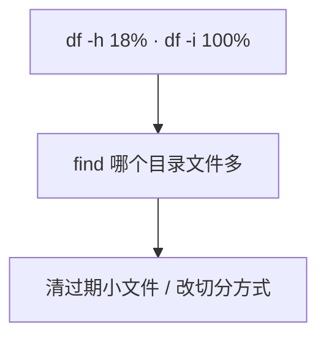
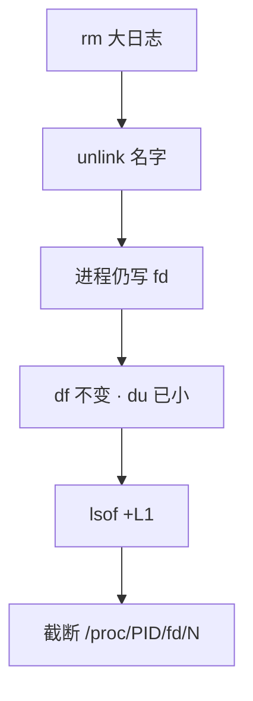
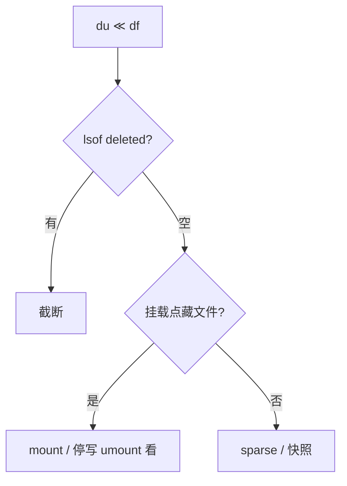

# 09｜文件系统与 inode · 练习题

先对照 [知识点](知识点.md)：**先 [一、一张图：一个文件的一生](知识点.md) 总图，再 [二、出生：open 创建三件套](知识点.md) 名词，再 [四、有名字：硬链接与软链接](知识点.md)～[七、对不上账：df ≠ du 的四条路](知识点.md)**。能讲清「名字→inode→块」再谈三种满。每题标了覆盖范围：

| 标记 | 含义 |
|------|------|
| **核心** | 不懂整章就没建立起来 |
| **必会** | 值班和面试都要能讲 |
| **常用** | 线上会反复碰到 |
| **常考** | 白板和追问的高频口径 |

## 本题目录

- [Q1 inode 满 vs 块满](#q1)
- [Q2 deleted-but-open](#q2)
- [Q3 df ≠ du](#q3)
- [Q4 软硬链接](#q4)
- [Q5 截断 vs rm](#q5)
- [Q6 inode 不能在线加](#q6)
- [Q7 ext4 vs xfs](#q7)
- [Q8 fstab / UUID](#q8)
- [Q9 nofail 与挂载点](#q9)
- [Q10 开服 checklist · 与 05 分界](#q10)
- [Q11 预留块与 Avail](#q11)
- [Q12 fsck 与只读挂载](#q12)
- [Q13 dentry 与路径解析](#q13)
- [Q14 文件系统白板综合题](#q14)
- [合上书](#合上书)

---

## Q1

**★★★★★｜磁盘空间没满但写不了文件，为什么？**

**覆盖**：核心 · 必会 · 常考

**对应**：知识点 [两种满的对照 🔍](知识点.md) · [算术：为什么空间才 7% inode 就光了 🔥](知识点.md)

### 场景

`df -h` 显示 `/data` 只用了 18%。应用报 `No space left on device`。日志按每个请求一个文件在切。有人要加云盘。

### 完整解答

**一句话**：块还有余量但 inode 已耗尽——海量小文件占满 inode 表，必须同时看 `df -h` 和 `df -i`。



```bash
df -h /data && df -i /data
touch /data/_probe_$$
find /data -type f | wc -l
for d in /data/*/; do echo "$(find "$d" -type f 2>/dev/null | wc -l) $d"; done | sort -rn | head
```

算术：ext4 默认约 1 inode / 16KB。1TB ≈ 六千多万 inode。1KB 文件把表打光时空间大约 60～70GB。监控 inode，不要只告警空间百分比。

战斗服 stdout 重定向**单文件**会 **块满**；活动日志按请求切文件会 **inode 满**。加云盘容量治不了 inode 满。

⭐ inode 满时，对**已存在**文件 append 有时还能写；**新建**一定挂——「还能写日志但热更解压失败」先想 inode。

### 再追问

- 怎么防止 inode 满？——告警 `df -i`；日志按时间/大小切；定期清；大盘格式化时把 inode 调密。
- 清几个大日志能治吗？——不能。要减的是**文件个数**。

---

## Q2

**★★★★★｜删了一个大文件但 df 显示空间没释放，为什么？**

**覆盖**：核心 · 必会 · 常用

**对应**：知识点 [五、被删：unlink 与「rm 了空间不释放」](知识点.md) · [现场：找到谁握着 🔍](知识点.md)

### 场景

战斗服日志 40G，有人 `rm` 了。`du` 已经小了，`df -h` 还是 100%。群里要重启逻辑服。

### 完整解答

**一句话**：目录项删了，进程还握着 fd，inode 和块不会释放——先 `lsof deleted` 截断，不要先 kill 逻辑服。



```bash
df -h /var/log
du -sh /var/log
lsof +L1 | grep deleted
# > /proc/{pid}/fd/<n>
```

1. 临时止血：清空文件（`> file` 或对着 proc fd 截断）而不是再 rm。  
2. 长期：logrotate 让进程 reopen / copytruncate（[23](../23-日志运维/)）。  
3. 不要先 kill 游戏逻辑服——那是踢人。

`rm -rf` 之后立刻宣布空间回来了，应用还在写同一个已删 inode，过一会又满。

### 再追问

- 生产不能随便 kill 怎么办？——确认是日志 fd 就截断或让应用 reopen。rm 不是止血。
- `lsof +L1` 是什么意思？——链接计数 &lt;1 仍打开的文件，专门找 deleted 占用。

---

## Q3

**★★★★☆｜du 和 df 差很多，除了 deleted 还有什么？**

**覆盖**：必会 · 常用 · 常考

**对应**：知识点 [七、对不上账：df ≠ du 的四条路](知识点.md)

### 场景

`du -sh /data` 200G，`df` 说 `/data` 800G。`lsof deleted` 是空的。有人只会说「肯定是 deleted」。

### 完整解答

**一句话**：deleted 之外，挂载点把文件藏起来、sparse 空洞、快照元数据都会让 du 和 df 对不上。

按这个顺序想：



1. **lsof deleted** — 进程持有已删文件  
2. **挂载点把文件藏起来** — 没挂盘时写在 `/data` 目录下，挂上之后看不见  
06. **sparse** — `du` vs `du --apparent-size`  
4. **文件系统元数据 / 快照**

游戏场景：数据盘没挂上时日志写进了 `/data` 这个空目录，后来盘挂上，旧日志被藏在挂载点下面。`mount` 核对，umount 才能看见那批文件。这也是关键盘不要 nofail 的原因之一。

```bash
mount | grep /data
findmnt /data
du -sh --apparent-size /path/to/suspect
```

### 再追问

- 怎么快速确认是不是挂载点藏文件？——`mount | grep /data`；再找机会 umount 看目录本身的大小。
- du 和 df 的定义差一句怎么说？——du 是能 walk 到的；df 是文件系统已分配块。

---

## Q4

**★★★★☆｜软链接和硬链接有什么区别？运维各用在哪？**

**覆盖**：必会 · 常用 · 常考

**对应**：知识点 [四、有名字：硬链接与软链接](知识点.md)

### 场景

要给 `/opt/game/current` 指向新版本目录。有人用了硬链接。另一边备份想用 `rsync --link-dest`。

### 完整解答

**一句话**：硬链接共享 inode 不能跨盘链目录；版本切换和跨盘用软链接 `ln -s`。

| | 硬链接 | 软链接 |
|--|--------|--------|
| inode | 共享同一号 | 自己一个，内容是路径 |
| 跨盘 / 链目录 | ❌ | ✅ |
| 删目标 | 其他名还在 | 链接悬空 |

| 场景 | 用 |
|------|----|
| 版本切换 / 跨盘 | 软链接 `ln -s` |
| 备份未变化的文件 | 硬链接（`rsync --link-dest`） |

```bash
ln -sfn /opt/game/releases/1.2.4 /opt/game/current.tmp
mv -Tf /opt/game/current.tmp /opt/game/current
ls -li /opt/game/current
```

日常运维用软链接，可见性好。硬链接给备份省空间：删某次备份不影响其他次。版本目录切换用软链，硬链不能链目录。

### 再追问

- 什么时候必须用硬链接？——同一文件系统内要「多份名字、一份数据」，例如增量备份。
- 软链目标删了链接还在吗？——在，但悬空。

---

## Q5

**★★★★☆｜清空文件（>file）和 rm 差在哪？**

**覆盖**：必会 · 常用

**对应**：知识点 [止血：截断，不是再 rm 🔧](知识点.md) · [现场：找到谁握着 🔍](知识点.md)

### 场景

磁盘满。有人习惯 `rm`，你坚持 `> app.log`。应用还在跑。已经有人误 rm 了，只剩 `(deleted)`。

### 完整解答

**一句话**：rm 删目录项但 fd 仍占块；`> file` 截断同一 inode，空间立刻回收，进程继续写。

```text
rm      : 名字没了，inode 还在（若被打开）→ df 不降
> file  : 名字还在，块被丢掉，fd 还有效 → df 立刻降
> /proc/PID/fd/N : 文件已 rm 只剩 fd 时用
```

| 动作 | 何时用 |
|------|--------|
| `> /var/log/app.log` | 文件名还在、进程还在写 |
| `> /proc/PID/fd/N` | 已被 rm，lsof 对上编号 |

这是磁盘满时对正在写的日志的标准止血。然后补 logrotate。截错 fd 可能截掉 socket 或数据文件——必须 lsof 对上日志路径再动手。

### 再追问

- 截错 fd 会怎样？——可能截掉 socket 或数据文件。必须 lsof 对上日志路径再动手。

---

## Q6

**★★★★☆｜inode 已经满了，能不能调大？**

**覆盖**：必会 · 常用 · 常考

**对应**：知识点 [inode 能在线加吗 🔥](知识点.md) · [十、收口](知识点.md)

### 场景

缓存盘 inode 100%。有人查到 `mke2fs -i` 想在线改。另有人说「换成 xfs 就不用管了」。

### 完整解答

**一句话**：ext4 inode 数量格式化时定死，不能在线加——只能删小文件止血；换 xfs 仍会被海量小文件打满。

不能在线加 inode。数量在格式化时定死（ext4）。止血只能删小文件。根因：迁走数据、用更大 inode 密度重建，或换切分策略避免海量小文件。

`mke2fs -i` / `-N` 是**格式化时**用的，不是在线调参。已经有数据的盘不是这条命令的目标。

xfs 的 inode 分配更动态，但仍会被海量小文件打满。不要假设换 xfs 就不用管小文件。监控和切分方式要左移。开服 checklist 带 `df -i`。

### 再追问

- `mke2fs -N` / `-i` 什么时候用？——**格式化时**。  
- 1TB 盘全是 1KB 文件大概多少空间就表满？——大约 60～70GB。

---

## Q7

**★★★★★｜ext4 和 xfs 怎么选？tmpfs 能放玩家数据吗？**

**覆盖**：核心 · 必会 · 常考

**对应**：知识点 [ext4 vs XFS：怎么选](知识点.md)

### 场景

新登录机数据盘、新 DB 盘、一层缓存盘，三块盘一起申请。有人说「全部上 xfs，inode 是动态的」。

### 完整解答

**一句话**：ext4 偏通用兼容、xfs 偏大文件在线扩；换 xfs 仍会被海量小文件打满 inode，玩家数据不能放 tmpfs。

| 盘 | 选 | 理由 |
|----|----|------|
| 登录机 / 不确定 | ext4 | 兼容、可离线缩、默认 |
| DB / 大文件 / 要在线扩 | xfs | `xfs_growfs`；大文件并行 IO |
| 缓存 | 可 tmpfs | **重启丢** |

btrfs 不当游戏核心盘默认。tmpfs 只能放临时和缓存。玩家存档、账单、回档备份不能放 tmpfs。overlay2 是容器分层，inode 打满交叉 [10](../10-cgroup与容器/)。

xfs **不能缩小**。ext4 inode 格式化时定死。noatime 减写，通用盘常开。discard 看云厂商是否底层已做。

写路径 / journal / **iostat** 细节 → [08](../08-磁盘与IO/)，选型不替代性能定责。

### 再追问

- 已经是 ext4，inode 密度不够？——不能在线加。迁数据重建。这不是换 xfs 的借口去格式化生产盘。

---

## Q8

**★★★★☆｜fstab 应该怎么写？改完直接 reboot 行不行？**

**覆盖**：必会 · 常用 · 常考

**对应**：知识点 [八、修复与落地：fsck、ext4/XFS 与 fstab](知识点.md) · [fstab：开机挂谁 🔧](知识点.md)

### 场景

新挂一块云盘。有人在 fstab 写了 `/dev/sdb1 /data ext4 defaults 0 0`，准备 reboot。

### 完整解答

**一句话**：fstab 用 UUID、`mount -a` 验证通过才 reboot；写错会进不了系统。

云盘序号会变，用 **UUID**。改完 `mount -a` 验证，**不要未验证就 reboot**。

```text
blkid → UUID=xxxx 写入 fstab → mount -a 成功 → 才允许 reboot
```

```
UUID=a3f2c8d1-4e5b-6c7d-8e9f-0123456789ab  /data  ext4  defaults,noatime  0  2
```

选项：`defaults,noatime`。进不了系统走救援模式（[04](../04-内核与系统/)）。扩容：先扩云盘块设备，再 `xfs_growfs` 或 `resize2fs`。xfs 不能缩。

### 再追问

- 扩容步骤？——先扩云盘，再 `xfs_growfs` / `resize2fs`。  
- 为什么不用 `/dev/sdb`？——云盘热插拔后序号可能变。

---

## Q9

**★★★★☆｜关键盘为什么不要 nofail？**

**覆盖**：必会 · 常用 · 常考

**对应**：知识点 [fstab：开机挂谁 🔧](知识点.md) · [七、对不上账：df ≠ du 的四条路](知识点.md)

### 场景

云盘偶发没挂上。有人给所有盘加了 nofail，「至少机器能起来」。玩家存档「丢了」，云盘是空的。

### 完整解答

**一句话**：关键盘 nofail 会让系统静默写进空挂载点，盘挂上后数据被藏——关键盘挂不上就该停，不要 nofail。

nofail：挂不上也让系统起来。关键数据盘缺了还让业务起来，会把数据写到空的挂载点目录里。盘回来之后那些文件被挡住，`df` 看云盘是空的。卸下云盘才能看见藏在挂载点下面的目录。

关键盘不要 nofail，挂不上就让系统停，比静默写错地方好救。可缺的盘（非存档）才 nofail。

这和 deleted 一样会 du/df 对不上：deleted 是进程握 fd；这种是挂载点把目录藏起来。Q3 同一条链。

### 再追问

- 这和 deleted 一样会 du/df 对不上吗？——会。先 lsof，再 mount。

---

## Q10

**★★★★☆｜开服前文件系统你检查什么？和「盘慢」怎么分界？**

**覆盖**：必会 · 常用

**对应**：知识点 [开服 checklist（文件系统项）](知识点.md) · [九、作战：60 秒定责](知识点.md) · [十、收口](知识点.md)

### 场景

开服 checklist 要你补磁盘两项。另一次活动接口超时、CPU idle、Load 高——有人在本章纠结 inode。

### 完整解答

**一句话**：开服必查 `df -h` + `df -i`、fstab UUID、关键盘非 nofail、数据盘确实挂上；盘慢 / await 高回 [08](../08-磁盘与IO/) 看 iostat，不在本章硬抠。

开服文件系统项：

1. `df -h` 和 `df -i` 水位  
2. 日志路径在哪块盘、轮转有没有  
3. fstab 是 UUID、关键盘不是 nofail  
4. 数据盘确实挂上了，不是写在空目录里  
5. tmpfs / 容器 overlay 没有当存档盘  
6. 类型：生产 ext4/xfs，核心盘不是 btrfs  

分界：

| 现象 | 去哪 |
|------|------|
| No space / df≠du / create 失败 | **本章** |
| 接口超时、await 高、脏页 | **[08](../08-磁盘与IO/)** `iostat -x` |

活动日志按请求切文件会 inode 满；stdout 重定向单文件会块满。空间 50% 不一定安全：inode 可能已经 90%。

```bash
df -h && df -i
mount | grep /data
# 慢才跑：
iostat -xd 1 3   # 读法见 08
```

### 再追问

- 日志和系统盘混在一起？——活动一切分就把根写满。独立数据盘。  
- `%util` 100% 是不是该换 SSD？——先回 08 看 await/aqu-sz，别只盯 util。

---

## Q11

**★★★★☆｜`df -h` 显示 100% 但 root 还能写，Avail 和 Size−Used 对不上，为什么？**

**覆盖**：必会 · 常考 ｜ **对应**：知识点 [二、出生：open 创建三件套](知识点.md) · 预留块

### 场景

日志盘 `df` 显示 100% Used，运维 `tune2fs` 一查 reserved 5%。应用以 root 跑还能 append 几 MB，普通用户业务报 No space。有人要立刻扩盘。

### 完整解答

> 🎯 **一句话**：ext4 默认给 root **预留 5% 块**——`Avail` 是非 root 视角，`Size−Used` 和 `Avail` 差的那截就是预留；真满和「普通用户满」是两回事。

```bash
tune2fs -l /dev/nvme0n1p1 | grep -i reserved
# Reserved block count:     12209600
# Reserved blocks uid:      0 (user root)
```

| 现象 | 含义 |
|------|------|
| Used 100%、root 还能写 | 可能还在吃预留块 |
| Avail=0、非 root 写失败 | 普通配额用尽，不是「物理块为零」 |
| 纯数据盘 | 可 `tune2fs -m 1` 降到 1%，**不要调到 0** |

> ⚠️ **别混**：预留块救的是 root/syslog 写入，救不了业务用户；调 `-m 0` 真满时连 cron 都挂。

### 再追问

- 和 inode 满怎么分？——`df -i`；块满看 `-h`，两种满都要查（Q1）。

---

## Q12

**★★★★☆｜文件系统只读挂载或需要 fsck，线上怎么判断、怎么止血？**

**覆盖**：必会 · 常用 ｜ **对应**：知识点 [八、修复与落地：fsck、ext4/XFS 与 fstab](知识点.md)

### 场景

重启后 `/data` 变 `ro`，应用报 Read-only file system。有人直接 `mount -o remount,rw` 想硬写回去。

### 完整解答

> 🎯 **一句话**：只读多是内核检测到错误后**保护性挂载**——先看 `dmesg`/`journalctl -k` 找 I/O error，再决定 fsck/xfs_repair，**不要盲目 remount,rw 继续写**。

```bash
mount | grep /data          # (ro,relatime) 确认只读
dmesg -T | tail -30         # I/O error / ext4-fs error
xfs_repair -n /dev/xxx      # XFS 先 -n 预演；ext4 用 fsck -n
```

| 类型 | 工具 | 纪律 |
|------|------|------|
| ext4 | `fsck` | 必须**卸载**或进救援模式 |
| xfs | `xfs_repair` | 同上；**不能缩** |

止血：只读挂载让业务 fail-fast 比 silent corruption 好；修完验证 `mount -o remount,rw` 或按 fstab 正常挂载，再 `mount -a` 验证。

### 再追问

- 云盘底层闪断和只读怎么分？——`dmesg` 有 `blk_update_request: I/O error` 先找存储侧，不是先 fsck 三遍。

---

## Q13

**★★★☆☆｜路径很深的小文件海量 create，`df -h` 还够，但操作变慢，可能是什么？**

**覆盖**：常用 · 常考 ｜ **对应**：知识点 [二、出生：open 创建三件套](知识点.md) · dentry cache

### 场景

活动按请求切日志文件，每小时几万个小文件，目录下 `ls` 都卡。`df -h` 50%，`df -i` 70%。

### 完整解答

> 🎯 **一句话**：除了 inode，**目录项缓存（dentry）和目录扇出**也会让路径解析变慢——海量小文件要按目录分层或改日志策略（→ [23](../23-日志运维/)），不是只会盯 `df -i`。

```text
create/open 路径：逐层翻目录「名字→inode」→ dentry cache 加速
单目录几十万文件 → 目录项巨大 → readdir/stat 变慢（即使 inode 未满）
```

治法：按日期/哈希分目录；日志改 stdout + 采集或按大小滚动，别按请求一个文件。

### 再追问

- 这和 Q1 inode 满的关系？——inode 满是「号牌发完」；本例是「号牌还有、电话簿太厚」——`df -i` 不高也会慢。

---

## Q14

**★★★★★｜白板：No space / df≠du / 写慢，60 秒怎么定责？和 08 怎么分界？**

**覆盖**：核心 · 必会 · 常考 ｜ **对应**：知识点 [九、作战：60 秒定责](知识点.md) · [十、收口](知识点.md)

### 场景

活动高峰三种工单同时来：写日志失败、删了 40G `df` 不降、接口慢 CPU idle。面试官要听「先查什么、别做什么、甩哪章」。

### 完整解答

> 🎯 **一句话**：**满和对不上看本章；慢和 await 看 08**——60 秒固定三板：`df -h` + `df -i` → `du`/`lsof +L1` → 慢才 `iostat`。

```text
① 0–15s   df -h && df -i     → 块满 / inode 满 / 预留块
② 15–35s  du -xh --max-depth=1 目标路径
          du≪df → lsof +L1 | grep deleted  或 mount 点被空目录挡住（nofail）
③ 35–50s  仍写失败 → stat 路径、mount 是否 ro、权限（→ 25）
④ 50–60s  「慢」不是「满」→ iostat -x（→ 08），本章到此停刀
```

| 签名 | 第一刀 | 别做 |
|------|--------|------|
| create 失败、`-i` 100% | 删小文件/改日志策略 | 扩 `df -h` 块容量 |
| rm 后 df 不降 | `lsof +L1` / `> /proc/PID/fd/N` | 重启当首刀 |
| du≪df | deleted / 挂载点藏目录 / 预留块 | 只盯 du |
| await 高、%wa 高 | → 08 | 在本章调 inode |

> 📝 **面试**：讲完三板斧补一句「关键盘 nofail 静默写错挂载点」和「块满 vs inode 满」——两个经典坑。

### 再追问

- 开服 checklist 文件系统项？——复述 Q10 六条；慢的分界一句「await 去 08」。

---

## 合上书

- [ ] 能默画总图（见 [一、一张图：一个文件的一生](知识点.md)）：文件名、inode、数据块；三种满挂在哪  
- [ ] 能说出 No space 为什么必须看 `-i`；估 1TB/1KB 文件 inode 消耗  
- [ ] 能证明 inode 满、止血、说明不能在线加  
- [ ] 能处理 rm 后 df 不降；会用 `>file` 和 `> /proc/PID/fd/N`  
- [ ] 能讲清 du≪df 四条路；关键盘不要 nofail  
- [ ] 能区分软链硬链；能选 ext4/xfs；tmpfs 不能存玩家数据  
- [ ] 能讲预留块、`Avail` 与 root 写入；纯数据盘 `-m 1` 纪律（Q11）  
- [ ] 能口述只读挂载 → dmesg → fsck/xfs_repair 顺序（Q12）  
- [ ] 能区分 inode 满 vs 目录扇出/dentry 慢（Q13）  
- [ ] 能口述 60 秒三板斧与 08 分界（Q14）  
- [ ] 能分界：满看本章，慢看 08 iostat  
