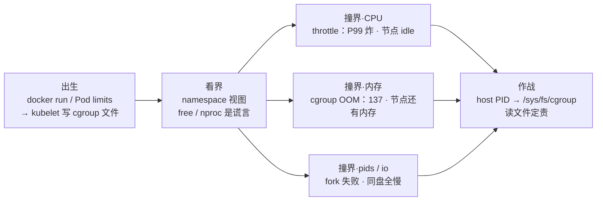
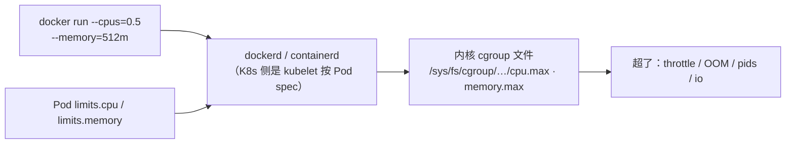
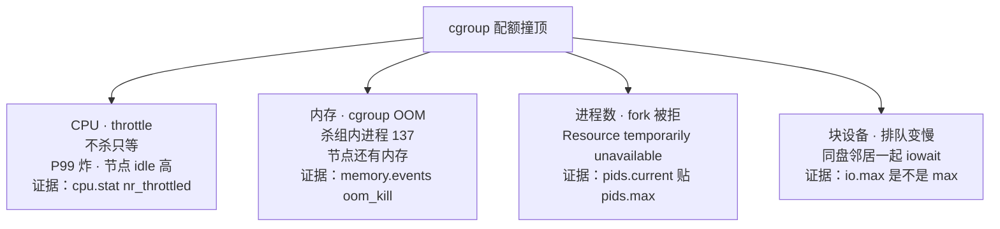
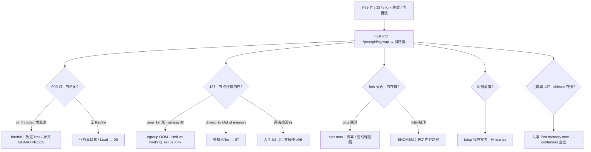

# cgroup 与容器

> 大家好，欢迎来到这次分享。开讲之前，先带大家回到一个很多值班同学都经历过的现场：
> 匹配服 P99 从 50ms 飙到 800ms，节点 CPU 还有 60% idle；同一个 Pod Exit 137，宿主机 `free` 还剩 20G——同事进容器敲 `free` 和 `nproc` 说「资源明明够」，十分钟后又重启了一回。
> 这一章讲完，你会知道当时那个人错在哪，以及正确的证据该去哪个文件里找。
> **本章回答**：一份资源配额从 YAML 被写下、落进内核文件，到撞上边界的四种下场（throttle / cgroup OOM / pids / io）；为什么容器里的 `free`/`nproc` 是谎言，throttle 和 137 怎么从 `/sys/fs/cgroup` 的文件里钉死。
> **不讲**：OOM Killer 打分、dmesg 细读、Java 堆外明细 → [07](../07-内存与OOM/)；CPU 时间分类 us/sy/wa 与 Load → [06](../06-CPU与Load/)；systemd 的 slice 封装 → [11](../11-Systemd与服务管理/)；requests/limits、QoS、驱逐 → [03-04](../../03-Kubernetes/04-Pod生命周期/)。这些都有专门的章节，本章只在用到时点到为止。

**标记**：🎯重点 · 🔥难点 · ⭐常考 · 🔧实操

**怎么听这场分享**：咱们先看第一节的主图，把「一份配额的一生」装进脑子；第二到第六节顺着这条线走——出生、看界、三节撞界；第七节专门讲定责，也就是开头那个现场的正确解法。每一节讲完都会提示对应练习题，学完就去练。

---

## 一、一张图：一份资源配额的一生

> 🎯 **一句话**：配额先被写手写进内核文件（出生），容器里你看到的却是另一本账（看界），撞上边界有四种死法，真账永远去文件里读。

咱们先不急着背 `cpu.max`、`memory.events`。学容器资源最怕的就是进容器敲 `free`——看着够、十分钟后 137。先看图，把「配额从哪来、撞上会怎样」装进脑子里：



**读图**：带着三个问题看这张图，比背文件名有用得多：

- 主线是一份配额的一生：被写下 → 被看见（看歪）→ 被撞上 → 被定责，后面每节认领一段。⭐ 面试必考就挂在「看界」和「撞界」两段（练习题 Q2、Q3、Q4）。
- `top`、监控、容器内 `free` 照的都是「看界」一段——照到的常是宿主机的账；四种撞界的证据全在右边的文件里。
- 值班第一问永远是「这事落在哪一段」：P99 炸但节点闲 → CPU 段；137 但节点空 → 内存段；fork 失败、同盘慢 → 邻居段。

好，主图有了。咱们正式出发——第一站：你写的 limit，内核到底认什么。

---

## 二、出生：limit 从 YAML 到内核文件

> 🎯 **一句话**：Docker 和 K8s 都只是写手，内核只认 cgroup 文件——`--cpus` 和 `limits.cpu` 最后都变成 `/sys/fs/cgroup` 下的几个数字。

一台宿主机跑几十个服务，CPU、内存、盘都是共享的：不划边界，一个备份进程就能把同盘邻居全部拖慢。Linux 划边界用的是两套内核设施：**cgroup（control group，控制组）限制一组进程能用多少资源**；**namespace 限制一组进程能看见什么**。容器就是拿这两套设施包出来的普通进程——**容器 = 普通进程 + namespace（视图）+ cgroup（配额）**，不是微型虚拟机。⭐ 这是全章第一句，也是面试高频错答点（练习题 Q1）。

配额的「出生」，就是被写手写进内核文件这一下：



**读图**：写手有两个入口（`docker run` 参数、Pod YAML），落点是同一个——runtime 把数字换算成微秒/字节写进 cgroup 文件。之后谁在跑、怎么调度，内核只看文件，不再看 YAML；排障也从文件进，不从 YAML 猜。

### /sys/fs/cgroup 的布局与层级 ⭐

cgroup 是一棵**树**：`/sys/fs/cgroup` 是根，每个目录是一个组，组里躺着控制器文件（`cpu.max`、`memory.max`、`pids.max`…），进程挂在某个组上；**子组的配额受父组约束**——Pod 的 cgroup 挂在 `kubepods.slice` 子树下面，kubelet 给整棵 Pod 子树设的总闸比单 Pod limit 更大。systemd 用 `-.-slice / system.slice / xxx.service` 这套目录名组织服务进程（封装细节 → [11](../11-Systemd与服务管理/)）。路径不用背、不能猜——从进程自己身上读：

> 🔍 **现场**：拿 **host PID**（宿主机视角的进程号）找它的 cgroup 路径，一套命令通吃 Docker 和 K8s：

```bash
crictl inspect <cid> | grep '"pid"'    # 或 docker inspect demo --format '{{.State.Pid}}'
PID=28451
cat /proc/$PID/cgroup
# 0::/kubepods.slice/kubepods-burstable.slice/…-xyz.scope   ← 0:: 后面就是它在统一树里的路径
CG=$(awk -F: '{print $3}' /proc/$PID/cgroup)
cat /sys/fs/cgroup${CG}/cpu.max        # 拼上根，就是真配额文件
```

容器内能不能直接读 `/sys/fs/cgroup`，取决于有没有挂 **cgroupns**（cgroup namespace）：K8s 和新版 Docker 默认挂，容器里看到的就是自己这一份；没挂时容器里读到的是宿主机根，数字大得离谱——**必须回宿主机用 host PID 找**。

### 你写的 limit，换算成什么数字 ⭐

```text
--cpus=0.1 / limits.cpu: 100m    →  cpu.max = 10000 100000     ← 每 100ms 只准用 10ms
--cpus=2   / limits.cpu: "2"     →  cpu.max = 200000 100000    ← 口算：N 核 = N × 100000
不设 CPU limit                    →  cpu.max = max 100000       ← 没有 quota，不会被 throttle
--memory=2g / limits.memory: 2Gi →  memory.max = 2147483648    ← 字节数，就是 limit
requests.cpu（仅 K8s）            →  cpu.weight（v1 叫 cpu.shares）← 只影响争抢比例，不产生 throttle
```

> ⚠️ **别混**：**request vs limit**。request 影响**调度**（这个 Pod 算占多少资源）和**争抢权重**（cpu.weight/shares）；limit 才是**配额**（quota），**只有 limit 造成 throttle**。request 写多大都不会让进程被踢出运行队列。口诀：**「request 抢座位，limit 发餐券；只有 limit 会 throttle」**（练习题 Q12）。

### cgroup v1 vs v2 🎯⭐🔥

🔥 排障时文件名跟版本走——拿错文件名会 cat 到空。v1 每个控制器一棵树、文件名带下划线；v2 一棵统一树、能拆内存明细、带压力信号。**K8s 1.27+ 默认推 v2**，老集群 v1 还很多，两套文件名都要认：

| 对比 | **cgroup v1** | **cgroup v2** |
|------|---------------|---------------|
| 树 | `cpu`、`memory`、`blkio` 各挂一棵：`/sys/fs/cgroup/cpu/…` | 统一树，一个路径管全部 |
| `/proc/pid/cgroup` | 多行，每个控制器一行 | 常见单行 `0::/path` |
| CPU 配额 | `cpu.cfs_quota_us` + `cpu.cfs_period_us` | `cpu.max`（quota、period 两个数） |
| 内存上限 / 用量 | `memory.limit_in_bytes` / `memory.usage_in_bytes`（**含 cache，粗**） | `memory.max` / `memory.current`（`memory.stat` 拆 file/anon） |
| OOM 事件 | `memory.oom_control` | `memory.events`（`oom`、`oom_kill` 计数） |
| 软顶 / 压力 | 弱、少用 | `memory.high` 软顶 · **PSI** 压力信号 |

> 🔍 **现场**：一眼判断节点是 v1 还是 v2：

```bash
mount | grep cgroup2
# cgroup2 on /sys/fs/cgroup type cgroup2 …    ← 有输出 = v2 统一挂载
cat /proc/1/cgroup
# 0::/init.scope                              ← 单行 0:: 开头 = v2
# 1:name=systemd:/  2:cpu:/…  4:memory:/…     ← 每个控制器一行 = v1（或混合）
```

> ⚠️ **别混**：**v1 的 `usage_in_bytes` 贴着 `limit_in_bytes` ≠ 应用内存要爆**——v1 的 usage 把 page cache 也算进去，容易「看起来满了」；v2 用 `memory.stat` 拆开 file/anon 才看得清（cache 归属见五节）。排障时文件名要跟版本走，拿 v2 的文件名去 v1 树里找只会 cat 到空。

### v1 的多棵树与迁移坑 🔧⭐

表格之外，**布局差异**才是排障时天天踩的。v1 每个控制器各自挂一棵树，同一个进程在 `/proc/pid/cgroup` 里就有好几行，**CPU 账和内存账的路径还可能不一样**——v1 找路径要把每一行单独拼一次：

```bash
cat /proc/$PID/cgroup                 # v1：一行一个控制器
# 2:cpu:/kubepods.slice/…-xyz.scope
# 4:memory:/kubepods.slice/…-xyz.scope   ← 各控制器路径常不一致，别拿 cpu 的路径去读 memory
cat /sys/fs/cgroup/cpu/kubepods.slice/…/cpu.cfs_quota_us        # cpu 一棵树
cat /sys/fs/cgroup/memory/kubepods.slice/…/memory.limit_in_bytes # memory 又一棵树
```

```text
v1：/sys/fs/cgroup/{cpu,memory,blkio,pids}/…  ← N 棵树，控制器各回各家
v2：/sys/fs/cgroup/…                          ← 一棵树，cpu.max / memory.max / pids.max 并排一个目录
```

统一树不是白统一的：**读一个容器的全部配额，v1 要跑 N 个目录，v2 一个目录全拿到**。反过来，带着 v1 肌肉记忆（先 `cd /sys/fs/cgroup/memory`）到 v2 节点上，会直接找不到目录。

迁 v2 的坑，排障视角三个：**混合挂载（hybrid）**——节点同时挂着 cgroup 和 cgroup2，`mount | grep cgroup2` 有输出不代表万事大吉，要读的控制器可能还留在 v1 树，判断完版本还要确认控制器在哪边；**v2 的树根不养进程**——统一树的根和中间层默认只做分组，进程挂在叶子上，所以 v2 的容器路径常以 `.scope` 结尾；**工具链只认老文件名**——老采集脚本、旧版 cadvisor 抓的是 `memory.usage_in_bytes`，节点迁完 v2 监控图表集体断流——先查监控 agent 版本，再怀疑内核。

> 📝 **面试**：「Docker 和 K8s 写配额有什么区别」——答「没有本质区别，都是写手：`docker run --cpus/--memory` 和 Pod `limits.*` 最后都由 runtime/kubelet 写进同一批 cgroup 文件；区别在多容器时 K8s 的 Pod 级内存常共享（六节）、Docker 通常一容器一 cgroup」。练习题 Q5、Q6、Q9。

这一节对应练习题 Q5、Q6、Q9、Q12——出生段的路径与换算。

好，配额写进文件了。大家想想：进容器敲 `free` 看到 40G，是不是就能说「内存够」？很多人会答「是」——**错了**。

---

## 三、看界：namespace 视图与 free/nproc 的谎言

> 🎯 **一句话**：namespace 给容器换了一副眼镜（进程表、网卡、主机名），但没换账本——`free`/`nproc` 读的还是宿主机的 `/proc`。

### namespace：六副眼镜，一句话一副 ⭐

**namespace（命名空间）** = 内核给进程的一份「局部视图」，让 PID 号、网卡、挂载点、主机名可以与宿主机其它进程不同。六种常见的一人一句：

- **PID**：自己的进程号空间——容器里 PID 1 是你的入口进程，`ps` 只见本组进程。
- **NET**：自己的网卡、路由、端口——容器里 `eth0` 是 veth，端口与宿主机互不相干（抓包要进对 ns → [16](../16-网络排障与抓包/)）。
- **MNT**：自己的挂载点视图——容器看到的文件系统是镜像层 + 可写层。
- **UTS**：自己的 hostname——常显示 Pod 名。
- **IPC**：自己的 System V IPC / POSIX 消息队列——跨容器别假设共享。
- **USER**：UID 映射——容器里的 root ≠ 宿主机 root（看映射表）。

容器模型与 K8s 里怎么组合 → [03-04](../../03-Kubernetes/04-Pod生命周期/)。

> ⚠️ **别混**：**namespace vs cgroup**——namespace 管**看见什么**（视图），cgroup 管**能用多少**（配额）。namespace 出问题是「看见了不该看的」（逃逸、看到宿主机进程）；cgroup 超限是「throttle / 137 / fork 失败」。另外，隔离「看见什么」**不等于**隔离故障域：容器共享宿主机内核，内核 panic、内核内存泄漏全机一起死——要故障域隔离用虚机/节点池，不是多加几个 namespace。

### free / nproc：本章最容易信的谎言 🎯🔥⭐

🔥 回到开头那个现场。匹配服 limit=2 核 / 2Gi。同事进容器：

```bash
nproc
# 32                                  ← 宿主机在线 CPU 数
free -h
# Mem: 62Gi total, available 40Gi     ← 宿主机的 meminfo
```

十分钟后 Pod `OOMKilled`。「明明还有 40G」——很多人会据此反驳 137——**错了**。**容器内的 `free`/`nproc`/`top` 默认读的是宿主机的 `/proc`（meminfo、cpuinfo、stat），不是本 cgroup 的配额**。namespace 换了进程表和网卡，**没有**把这三份文件改写成「只显示你的 limit」（除非额外挂了 lxcfs 之类，生产默认别假设有）。`top` 的 CPU% 还按宿主机核数归一化——2 核 limit 的容器跑满配额，`top` 里只显示 6%。⭐ 这是值班天天见、面试必考的坑（练习题 Q2）。

> 💡 **打个比方**：namespace 是给你一副望远镜，cgroup 是你的钱包。望远镜里能看到全城的银行（宿主机 64G），但你能花的只有钱包里那 2Gi——盯着望远镜报余额，报得再准也不是你的账。

| 容器里的谎言 | 真值看 |
|--------------|--------|
| `nproc` = 32 | `cpu.max` |
| `free` available 40G | `memory.max` / `memory.current` |
| `top` CPU% 按宿主机核归一 | `cpu.stat` 的 throttled 增量 |

> ⚠️ **别混**：**用容器内 `free` 反驳 137、用 `nproc` 反驳 throttle——永远无效**。这不是误差大小的问题，是根本读的不是同一本账。口诀：**「容器里 free/nproc 是谎言，真账在 /sys/fs/cgroup」**。

### 谎言最贵的代价：运行时按谎言配并发 🎯⭐🔥

谎言不只是让人误判，还会**带动运行时配错**：Go 服务不设 `GOMAXPROCS`，默认跟 `runtime.NumCPU()` 走（≈ nproc=32）；limit=2 核 → 32 个 P 抢 2 核配额 → 上下文切换和 throttle 双重放大，P99 毛刺。⭐ 这是谎言最贵的代价（练习题 Q10）。

```text
Go     → GOMAXPROCS=<limit核数>，或引入 uber-go/automaxprocs 自动对齐
Java   → -XX:ActiveProcessorCount=<N>；内存侧 -Xmx 别贴 limit（五节；堆外 → 07）
其他   → 任何「按 CPU 个数开线程池」的库都要对齐 limit
```

> ⚠️ **别混**：正道是**把并发对齐 limit**，不是把 limit 开到 32「迁就谎言」——后者等于放弃隔离，在节点上抢光 CPU。

> 📝 **面试**：「我不信容器里的 free/nproc。从 host PID 找 `/proc/pid/cgroup`，去 `/sys/fs/cgroup` 读 `cpu.max`/`memory.max`。Go/Java 要把 GOMAXPROCS/ActiveProcessorCount 对齐 limit，否则自己 throttle 自己。」

这一节对应练习题 Q1、Q2、Q10——看界与谎言。

好，眼镜和钱包分清了。下一问自然是：撞上 CPU 配额会怎样？开头那个「P99 炸、节点 idle 60%」就是这一节。

---

## 四、撞界：CPU 配额与 throttled

> 🎯 **一句话**：CPU limit 就是 CFS 配额——每 100ms 只准用这么多，用完整个 cgroup 被踢出运行队列晾到下个周期；等待不算 CPU 使用率，但算请求耗时。

### CFS quota：周期、配额、被踢出 🎯⭐🔥

🔥 很多人会答「节点 idle 60%，CPU 不是瓶颈」——**错了**。CPU limit 的底层是 **CFS bandwidth control（CFS 带宽控制）**：每个**周期（period，v1 文件 `cpu.cfs_period_us`，默认 100000µs = 100ms）**内，这个 cgroup 最多消耗 **quota（v1 文件 `cpu.cfs_quota_us`）**的 CPU 时间；用完，**整个组**被踢出运行队列，晾到下个周期再放回来——这就是 **throttle**。大白话：**餐券用完就下桌，哪怕整条街空无一人**。

> 💡 **打个比方**：食堂每 100ms 发一轮餐券，100m 就是每轮 10ms 的券。券用完就被请下桌，哪怕整条街空无一人（节点 idle 60%），你也只能站在门口等下一轮——**idle 是别人的核，不是你的餐券**。

一个突发 20ms 的计算撞上 100m 配额，wall clock 是这样走的：

```text
t=0        突发 20ms 的匹配计算开始
t=10ms     本周期 10ms quota 用完 → 整个 cgroup 被踢出运行队列
t=10~100ms 干等 90ms —— 这 90ms 不算任何 CPU 使用率，但全算进请求耗时
t=100ms    新周期开始，再跑 10ms
t=110ms    活干完：20ms 的计算，wall clock 110ms —— P99 从 50ms 飙到几百 ms 就是这么来的
```

**读图（读账）**：throttle 的杀伤不在「慢」在「等」——CPU 使用率图上这个容器看着只有 10%，节点 idle 高得反常，但请求的真实耗时里掺了整段整段的干等。

> 🔍 **现场**：配额和证据都在两个文件里：

```bash
cat /sys/fs/cgroup${CG}/cpu.max
# 10000 100000        ← quota 10ms / period 100ms = 100m；不设 limit 时第一数是 max
cat /sys/fs/cgroup${CG}/cpu.stat
# nr_periods 28451        ← 经历过的周期总数（累计值，看增量）
# nr_throttled 1523       ← 被踢出的周期数 —— 两次采样做差，在涨 = 正在 throttle
# throttled_usec 89432000 ← 累计被晾在队列外的微秒数
```

判读口径：**Δnr_throttled / Δnr_periods > 5% 且 P99 同步涨**，当故障信号处理；`nr_throttled` 是累计值，**看增量不看绝对数**。

### 定责算术：从计数到伤害 ⭐🔧

拿到 `cpu.stat` 只是拿到计数，把它换算成「业务伤了多少」才算定责。**两次采样做差**（间隔 10~30 秒，整数个周期最好读）：

```bash
cat /sys/fs/cgroup${CG}/cpu.stat; sleep 10; cat /sys/fs/cgroup${CG}/cpu.stat
# nr_periods    28451 → 28551        ← Δ=100：10s 正好 100 个 100ms 周期
# nr_throttled   1523 → 1573        ← Δ=50：一半的周期被踢
# throttled_usec 89432000 → 89434000+Δthrottled ← Δ 取决于晾了多久，见下
```

三步算术，每步都落一个结论：

- **被踢比例** = Δnr_throttled / Δnr_periods：50 / 100 = 50%，远超 5% 阈值——throttle 实锤，且不是偶发；
- **平均晾多久** = Δthrottled_usec / Δnr_throttled：比如 Δ=2000000µs（2s）/ 50 次 = 40ms——单个请求撞上被踢的周期，平均多干等 40ms，最坏接近整个 period（100ms）。**P99 会抬多少，这一步直接估出来**，跟监控曲线互相印证；
- **换算核对** = quota / period：`500m` → `50000 100000`，`250m` → `25000 100000`，`2.5` 核 → `250000 100000`——读 `cpu.max` 时用这个除法当场验一遍，确认「配额没看错文件、limit 没记错数量级」。

**period（100ms）别当调优旋钮**：调小能让等待更碎、毛刺更平滑，但取样开销变大，而且是整棵树共享的调度粒度；排障时接受默认值，把精力放在 quota 和 GOMAXPROCS 上。

> ⚠️ **别混**：**throttled_usec 大 ≠ 一直慢**。它只在被踢的周期里增长——50% 周期被踢意味着另外 50% 完全正常，表现是**毛刺**：P99/P999 抬、P50 不动。整体均匀变慢且无 throttle，去 [06](../06-CPU与Load/)。

监控侧对应两个指标：`container_cpu_cfs_throttled_seconds_total`（rate 后看**强度**——每秒晾了多少）和 `container_cpu_cfs_throttled_periods_total` / `container_cpu_cfs_periods_total`（相除看**频率**——多少比例的周期在踢），一个管「多重」一个管「多频繁」。

### cgroup 视角的「CPU 不够」：不是 steal，是 throttled 🔥⭐

`top` 里的 `%st`（steal time，窃取时间）是虚机的指标——宿主机把 CPU 时间给了别的虚机，虚机里显示为 steal。**容器没有 %st 这一项**：cgroup 版的「CPU 不够」不记在 steal 列上，记在 `cpu.stat` 的 `nr_throttled` 里——进程明明可运行，却在运行队列外干等，微观体感和虚机 steal 一模一样。所以「容器 top 里 steal 是 0，CPU 肯定充足」恰好看反了：**要读文件**。

### 三个高频追问 ⭐

**request=limit=1 核，高峰还会 throttle 吗？** 会。request=limit 只表示「调度按 1 核算、配额也是 1 核」——**quota 还在**，活动突发顶满「每 100ms 用满 100ms」照样被踢。要尽量不 throttle，只能放宽或不设 limit，不是把 request 写成和 limit 一样。

**limit=2 核，单线程突发 50ms 会被切吗？** 不会单切它，但组会被切。quota 是 **cgroup 维度的 CPU 时间池**，不是每个线程一份：`cpu.max=200000 100000`（2 核）= 整个组每 100ms 合计 200ms，一个线程连跑 50ms 没问题，组内多线程**合计**超了照样 throttle。

**核心服要不要设 CPU limit？** 延迟敏感、有状态、突发明显（匹配/网关/战斗）：request 保调度 + **宽 limit 或不设** + 节点隔离。批处理/备份/工具：**紧 limit** 保护邻居。100m 这种 tight limit = 拿「难解释的 P99」换「省资源」。

> ⚠️ **别混**：**throttle ≠ 业务真缺核**。throttle 是「配额不够」，放宽 limit / 对齐 GOMAXPROCS 就好；业务真算不过来（`%usr` 打满、无 throttle、Load 高）是另一回事 → [06](../06-CPU与Load/)。签名相反：throttle 时节点 idle 高、容器 CPU% 低；真缺核时两者都高。**扩节点修不好本 cgroup 的 tight limit**——配额钉在这个组上，节点再空也踢你。

> 📝 **面试**：「P99 涨但节点 idle，我先看 `cpu.stat` 的 `nr_throttled` 增量。100m = 每 100ms 只有 10ms。只有 limit 造成 throttle，request 不会；扩节点修不好，配额在这个 cgroup 上。」口诀：**「节点 idle 高、P99 炸 → 先查 throttle」**（练习题 Q3、Q7）。

这一节对应练习题 Q3、Q7、Q12——CPU 撞界。

好，CPU 讲完。开头另一个现场：Exit 137、宿主机还剩 20G——大家想想，这是整机 OOM 还是 cgroup OOM？

---

## 五、撞界：内存配额与 cgroup OOM

> 🎯 **一句话**：碰到 `memory.max` 就杀组内进程（137），不需要整机没内存——节点可以还剩 20G。

### 137 走读：从 describe 到文件 🔧⭐

🔥 很多人会答「节点还有 20G，不可能是 OOM」——**错了**。内存配额三个文件：**`memory.max` 硬顶（就是 limit）**、**`memory.current` 此刻计入的用量**、**`memory.events` 事件计数**（`oom` = 触发过 OOM 的次数，`oom_kill` = 真杀了几个）。v1 对应 `memory.limit_in_bytes` / `memory.usage_in_bytes` / `memory.oom_control`。⭐ 这是开头第二个现场的正解入口（练习题 Q4）。

```bash
kubectl describe pod match-server-xxx | grep -A5 "Last State"
#   Reason:  OOMKilled
#   Exit Code: 137
cat /sys/fs/cgroup${CG}/memory.max
# 2147483648        ← 2Gi，就是这个容器的 limit
cat /sys/fs/cgroup${CG}/memory.current
# 2147000000        ← 贴顶
cat /sys/fs/cgroup${CG}/memory.events
# oom 3             ← 触发过 3 次 OOM
# oom_kill 3        ← 真杀了 3 个 —— cgroup OOM 实锤
dmesg -T | grep -i 'out of memory'
# （空）            ← 没有整机 Killer 的铁证（dmesg 细读 → 07）
```

**137 = 128 + 9 = SIGKILL**，来源要分三叉（口径与 [07](../07-内存与OOM/) 一致）：① dmesg 有 `Out of memory` → 整机 Killer；② `memory.events` 的 `oom_kill` 涨 → cgroup OOM；③ 两者都没有 → 人手 `kill -9`，去查操作记录和审计。另外 `OOMKilled` ≠ `Evicted`——后者是 kubelet 管理面驱逐，`describe` 的 Reason 里看，不是 137（→ [03-04](../../03-Kubernetes/04-Pod生命周期/)）。

| 对比 | **cgroup OOM** | **整机 OOM Killer** |
|------|----------------|---------------------|
| 触发 | 组内 `memory.max` 到顶 | 物理内存 + swap 耗尽 |
| 宿主机可以还空吗 | **可以**（只杀这一组） | 否（available 见底） |
| 证据 | `memory.events` oom_kill；Reason: OOMKilled | `dmesg` 有 `Out of memory` |
| 选谁 | 只杀本组，不碰邻居 | oom_score 挑全机 victim（→ 07） |
| 第一刀 | limit vs working_set vs Xmx | `ps` 排大户 + 看曲线（→ 07） |

> ⚠️ **别混**：**Guaranteed（request=limit）挡不住自己的 max**——QoS 只影响**节点争抢时**的选杀顺位（BestEffort 先死、Guaranteed 最后，→ [03-04](../../03-Kubernetes/04-Pod生命周期/)），单容器超**自己的** limit 照样 137，request=limit 不是免死金牌。

### page cache 归属：内存总在 limit 边缘是正常的 🔥⭐

最常见的误判：`memory.current` 常年贴着 `memory.max` 的八成九成，告警天天黄。先别慌——**读过的文件页（page cache）也计入这个 cgroup 的 `memory.current`**（`memory.stat` 里的 `file`），应用真正退不掉的匿名内存是 `anon`。内核内存紧张时**优先回收干净 file 页**（丢掉、要用再从文件读回来就行），所以：

- **容器内存常年贴着 limit 边缘是正常的**——current 里一大块是可回收 cache，内核拿它当免费的读缓存，紧了自动收缩；
- 真正危险的是 **anon 斜线涨**（泄漏/容量），那部分收不回来；
- v1 的 `usage_in_bytes` 不拆 file/anon，「看起来满了」极易误判（二节别混处）；v2 用 `memory.stat` 一眼拆开。

> 💡 **打个比方**：page cache 记的是**可以退货的账**——书看完放回货架（回收）就行；anon 是花掉的真金白银。账面总额高不等于要破产，讨债的（OOM）只在你退无可退时上门。

```bash
cat /sys/fs/cgroup${CG}/memory.stat | grep -E '^(anon|file)'
# anon 1500000000      ← 1.4G 匿名：堆、栈 —— 危险信号看它的涨法
# file 600000000       ← 600M page cache：可回收，贴顶不慌
```

> ⚠️ **别混**：**working_set vs memory.current**。working_set（`container_memory_working_set_bytes`）≈ current 减去可立刻回收的 cache，是「离撞 limit 还有多远」的口径，**容器内存告警唯一该对的数**（80% 预警）；`memory.current` 是此刻计入的总量。但**定性「是不是 cgroup 杀的」两者都不行**——只看 `memory.events` 的 `oom_kill` 增量。

### 三本账：RSS · page cache · swap 🔥⭐

「容器用了多少内存」有三个口径，先对齐口径再讨论数字：

- **RSS（进程视角）**：`ps`/`top` 里的常驻内存——堆、栈、共享库，**不含** page cache，也不含同组别人的进程（sidecar 的账不在这里）；
- **cgroup `memory.current`（组视角）**：全组进程 RSS 之外，还计入 page cache、socket 缓冲（`memory.stat` 的 `sock`）、该组摊到的内核内存——所以**把 `ps` 的 RSS 加总永远对不上 current，差值主要就是 file cache**。容器内 `ps`、`top` 是进程账，`kubectl top` 是组账，两张图对不齐先想这一条；
- **swap（v2 是单独一道闸）**：`memory.swap.max` 独立于 `memory.max`。K8s 长期默认禁 swap（`memory.swap.max = 0`），**anon 换不出去**——这是容器比虚机更容易 137 的结构性原因：虚机内存紧了能换页苟着，容器没有这条路，anon 到顶就是 max 到顶（K8s 1.28+ 才有受限的 swap 支持，生产默认仍关）。

```bash
cat /sys/fs/cgroup${CG}/memory.swap.current /sys/fs/cgroup${CG}/memory.swap.max
# 0 0                     ← swap 关死：anon 无处可退，涨满即 137
```

**k8s 侧 oom-kill 的判定口径**也按三本账分了工：**杀**是内核干的，只认 `memory.max`（`memory.current` 到顶即杀）；**图表与告警**（`kubectl top`、cadvisor）走 **working_set ≈ current − inactive_file**，因为不可回收的部分才是离死线最近的口径。两个口径的差就是 inactive file cache——所以「图表 working_set 才 70% 却 137」要么是采样间隔没接住瞬时峰值，要么就是这条口径差，**定性永远回 `memory.events`**，别在两张图之间反复横跳。

### 软顶与压力信号：memory.high 和 PSI ⭐

v2 在硬顶之前多了两层信号：**`memory.high` 软顶**——超过它内核**先加力回收、让分配变慢**，尽量不杀（表现为延迟抖而不是 137）；**PSI（Pressure Stall Information，压力失速信息）**——`/proc/pressure/memory` 里的 `some`（部分进程在等内存）/ `full`（全组停摆）10/60/300 秒均值，是**早于 OOM 的压力信号**，`full` 持续抬升要当回事。编排器目前主要暴露 max，high 和 PSI 多用于自建监控。

```bash
cat /proc/pressure/memory
# some avg10=0.42 avg60=1.15 avg300=0.31
# full avg10=0.00 avg60=0.03 avg300=0.01   ← full 持续非 0 = 全组在等内存
```

### Java / Go 的 limit 怎么留（链 07）

`-Xmx` 贴满 `memory.max` **必炸**：堆之外还有 Metaspace、线程栈 ×N、DirectByteBuffer、JNI。要么 **limit ≥ 1.3~1.5 × Xmx**，要么 `-XX:MaxRAMPercentage=70` 让 JVM 认 cgroup 自己算。**容器刚启动就 137 也不一定是泄漏**——常见是 limit 写太小、Xmx 启动即贴顶、sidecar 抢内存、预热把峰值打穿；先看 `memory.max` 合不合理、启动参数、`--containers` 谁在涨，再开泄漏专题。堆外明细与 dmesg 读法 → [07](../07-内存与OOM/)。

> 📝 **面试**：「137 但节点还空，我看 `memory.events` 的 oom_kill 和 dmesg：dmesg 没有 Out of memory 就是 cgroup max。Guaranteed 也挡不住自己的 limit。内存贴边先看 `memory.stat` 拆 file/anon——cache 贴顶是常态，anon 斜线才是病。」口诀：**「137 + 节点空 → 先查 memory.events，别看 free」**（练习题 Q4、Q11）。

这一节对应练习题 Q4、Q11——内存撞界与三本账。

好，内存讲完。还有三道闸：pids、io、sidecar——fork 失败不一定是内存。

---

## 六、撞界：pids、io 与 sidecar

> 🎯 **一句话**：CPU 之外还有三道闸——进程数、块设备 IO、Pod 级共享内存，满了各有各的签名。

### pids.max：fork 被拒 ⭐🔧

```text
日志：fork: Resource temporarily unavailable      ← 不是 OOM，是进程数到顶
```

`pids.max` 限制 cgroup 内进程/线程总数，满了 fork/clone 直接失败——**跟内存够不够无关**，`free` 再富余也救不了：

```bash
cat /sys/fs/cgroup${CG}/pids.current /sys/fs/cgroup${CG}/pids.max
# 9998        ← current
# 10000       ← 贴顶了
```

计数单位是 **task（线程）**，不只是进程：一个 Java 服务池里 3000 个线程，`ps` 里看是一个进程，`pids.current` 里是 3000。所以「pids 满」的头号嫌犯常不是真 fork 炸弹，而是**线程泄漏**——连接池/定时任务泄漏让线程斜线涨，涨到顶一切新任务起不来，症状是「服务卡死但内存 CPU 都正常」。

真 fork 炸弹（`:(){ :|:& };:` 这类指数复制）在没配 pids 的机器上是**全节点**灾难：PID 空间是整机共享的（`/proc/sys/kernel/pid_max`，通常几十万），一个容器耗光它，sshd、kubelet、监控 agent 全部 fork 失败，整节点瘫掉。**`pids.max` 防的不是容器自己，是同节点的邻居和宿主机**——K8s 侧由 kubelet 的 `podPidsLimit`（或容器运行时 `--pids-limit`）统一下发，属于节点级兜底配置，值多少去问平台组，别假设容器默认不限。

> ⚠️ **别混**：**fork 失败的两种死法**——`pids.current` 贴 `pids.max` 是 **pids 满**（EAGAIN，调高或查线程泄漏）；内存贴 `memory.max` 之后再 fork 是 **ENOMEM**（先走五节的内存路径）。两者都空还失败，查 cgroup 之外：用户 `nproc` ulimit、systemd `TasksMax`。

### io.max：同盘邻居一起慢 🔧

活动备份窗口，同节点同盘三个实例 iowait 一起 40%——`iotop` 看见 backup 容器写 800MB/s，而它的 `io.max` 是 `max`（没限速）。**`io.max` 对块设备读写限速（v1 这套控制器叫 blkio，如 `blkio.throttle.write_bps_device`）**，防一个容器拖死同盘邻居。它不能替代容量——盘该买还得买——但能把邻居隔出来。

### sidecar：共享 Pod 级 memory.max ⭐

```text
kubectl top pod xxx --containers
# NAME           CPU(M)   MEMORY
# app            2        1800Mi
# log-collector  1         400Mi   ← 在涨
```

K8s 里 Pod 内多个容器常共享 **Pod 级** `memory.max`：主容器 1800Mi + sidecar 400Mi 加总贴 2Gi 顶——被杀的可能是 **app**。**sidecar 泄漏能带走主容器**。治理：主容器 + sidecar **加总**留余量、监控按 `--containers` 拆、必要时拆 sidecar。裸机 `docker run` 通常**一容器一内存 cgroup**，双子容器各看各的 limit——「sidecar 带走主容器」是 K8s Pod 边界的叙事。

### 收束：撞界的四种下场 🎯⭐

到这里四种「超限」全齐了。面试问「容器超 limit 会怎样」，要的就是这张清单——**四种下场，四种签名，一份证据文件**：



**读图**：四种下场的动词不一样——CPU 是**等**（throttle）、内存是**杀**（OOM）、进程数是**拒**（fork 失败）、IO 是**慢**（排队），按动词定位、按文件定罪。它们还有一个共同点：**在容器内 `free`/`nproc`/`top` 上全都看不到痕迹**，证据只在 `/sys/fs/cgroup`。

> ⚠️ **别混**：这张清单**不保证**每套环境都配齐——`io.max` 常没人设（所以备份才能拖死邻居），`memory.high` 编排器也常不暴露；它是「排查时挨个问」的清单，不是「一定会配置」的清单。

> 📝 **面试**：按动词背「**等、杀、拒、慢**」四字诀——throttle 等、OOM 杀、pids 拒、io 慢；每种再配一个文件名和签名字段，就是完整答案。练习题 Q8、Q14。

这一节对应练习题 Q8——邻居三道闸。

好，四种下场齐了。回到开头那个现场——正确的 60 秒该怎么走？

---

## 七、作战：从现象到文件定责

> 🎯 **一句话**：所有容器资源事故共用一个开场——host PID 找到 cgroup 路径，然后按现象挑文件读。

### 定责决策树 🔧



**读图**：入口只有一条——**先找路径，再分叉**。四条分支按「现象 + 一个文件字段」定型，每条落到一个明确动作；跨出本章的只有两处：真缺核 → [06](../06-CPU与Load/)，整机 Killer → [07](../07-内存与OOM/)。

### 现象 · 先做 · 别做

| 现象 | 先做 | 别做 |
|------|------|------|
| P99 涨、宿主机 idle 高 | `cpu.stat` 增量；对齐 GOMAXPROCS | 先扩节点 |
| 137、节点还有内存 | `memory.events` + describe | 拿容器内 `free` 反驳 |
| Guaranteed 仍 137 | 对自己的 max 找原因 | 当成 QoS「不该死」 |
| `nproc`=32、limit=2 核 | 设 GOMAXPROCS / ActiveProcessorCount | 把 limit 开到 32 迁就 |
| fork 失败、内存还够 | `pids.current` vs `pids.max` | 先加内存 |
| 服务卡死、CPU 内存都正常 | `pids.current` 趋势 + 线程数（按 task 计） | 只重启收工 |
| 同盘实例全慢 | `iotop` + 查 `io.max` | 只买盘当隔离 |
| 主容器 137 | `top --containers` 看谁在涨 | 只重启主容器收工 |
| 刚启动就 137 | 看 limit / Xmx / sidecar / 预热 | 直接开泄漏专题会 |

### 60 秒剧本 🔧

> 🔍 **现场**：接到「容器慢/死/卡」报障，60 秒走完这条线。

```text
① 0–10s  拿身份：describe 看 Reason（OOMKilled?）；crictl inspect 拿 host PID
② 10–30s 拼路径：cat /proc/$PID/cgroup → CG；cat cpu.max / memory.max 确认配额没看错
③ 30–45s 定型：cpu.stat 增量（throttle?）/ memory.events（oom_kill?）/ pids / iotop
④ 45–60s 定责动手：放宽 limit · 对齐 GOMAXPROCS · 算 Xmx 余量 · 补 io.max · 查线程泄漏
```

监控阈值（经验尺）：throttled 比例 **>5%** 且 P99 涨 → P1；working_set / limit **>80%** 预警、近 1.0 防 137；`oom_kill` 增量 **>0** → P0/P1；PSI memory `full` 持续抬升 → 早于 OOM 介入。

这一节对应练习题 Q13、Q14——定责综合。

现在再看群里那句「资源明明够，重启一下」，你知道该怎么拦住他了：容器里的 free/nproc 是谎言，真账在 `/sys/fs/cgroup`——先 host PID 拼路径，再按「等、杀、拒、慢」挑文件。

---

## 八、收口

### 命令速查 🔧

```bash
# 找路径（一切的开头）
crictl inspect <cid> | grep '"pid"'                  # 或 docker inspect {name} --format '{{.State.Pid}}'
CG=$(awk -F: '{print $3}' /proc/<hostpid>/cgroup)    # v2 单行 0::；v1 每控制器一行
# CPU 配额 / throttle
cat /sys/fs/cgroup${CG}/cpu.max                      # quota period；max = 没设 limit
cat /sys/fs/cgroup${CG}/cpu.stat                     # nr_throttled 看增量
# 内存硬顶 / 是否 cgroup 杀
cat /sys/fs/cgroup${CG}/memory.max /sys/fs/cgroup${CG}/memory.current
cat /sys/fs/cgroup${CG}/memory.events                # oom_kill 增量 = 实锤
cat /sys/fs/cgroup${CG}/memory.stat | grep -E '^(anon|file)'   # 拆 cache
# pids / io
cat /sys/fs/cgroup${CG}/pids.current /sys/fs/cgroup${CG}/pids.max
cat /sys/fs/cgroup${CG}/io.max
# 版本与压力
mount | grep cgroup2                                 # v2 判定
cat /proc/pressure/memory                            # PSI some/full
# 谎言对照（只用于证明不可信）/ 趋势
kubectl top pod --containers                         # working_set 近似，看趋势用
```

### 面试锚点

遮住右列自问自答，卡壳的行回去重读对应小节：

| 问 | 30 秒答 |
|----|---------|
| 容器是微型 VM 吗？ | 不是。共享内核的普通进程 + namespace（视图）+ cgroup（配额）；内核 panic 全机一起死。 |
| cgroup vs namespace？ | 配额（能用多少）vs 视图（看见什么）；超限 vs 逃逸。 |
| free/nproc 可信吗？ | 不可信，读宿主机 `/proc`；真值从 host PID 找 `cpu.max`/`memory.max`。 |
| limit 怎么进内核？ | docker run / Pod limits → runtime/kubelet 写 cgroup 文件，内核只认文件。 |
| 100m 是多少？ | 每 100ms 周期 10ms 配额（`cpu.max = 10000 100000`）。 |
| 谁造成 throttle？ | 只有 limit/quota；request 只影响调度和 shares。 |
| 扩节点修得了 100m throttle 吗？ | 修不了，配额钉在这个 cgroup 上。 |
| P99 炸但节点 idle？ | 查 `cpu.stat` 的 `nr_throttled` 增量——cgroup 视角的「CPU 不够」，容器里没有 %st。 |
| request=limit 还 throttle 吗？ | 会，quota 还在；多核 limit 也是全组合计的池。 |
| 137 但节点还有内存？ | 碰到 `memory.max`，与节点剩余无关；证据 `memory.events` oom_kill。 |
| 137 的三个来源？ | dmesg 有 OOM=整机；events oom_kill=cgroup；都没有=人手 kill -9。 |
| Guaranteed 会 137 吗？ | 会，QoS 只管节点争抢顺位，挡不住自己的 max。 |
| 容器内存贴着 limit 正常吗？ | 正常，page cache 计入 current 且可回收；看 `memory.stat` 的 anon 涨法。 |
| working_set vs memory.current？ | 前者≈扣掉可回收 cache、是撞 limit 口径（80% 告警）；定性 OOM 只看 events。 |
| memory.high vs memory.max？ | 软顶（回收/变慢，尽量不杀）vs 硬顶（OOM）。 |
| PSI 是什么？ | 压力失速信息，some/full 是早于 OOM 的压力信号。 |
| v1 vs v2？ | v1 分树、usage 含 cache 粗；v2 统一树 `0::`、拆 file/anon、有 high/PSI；K8s 1.27+ 默认 v2。 |
| sidecar 泄漏谁死？ | 可能带走主容器——共享 Pod 级 memory.max；Docker 单容器不共享。 |
| fork 失败查什么？ | 先 pids.current vs pids.max，再分内存 ENOMEM；cgroup 外还有 ulimit/TasksMax。 |
| nproc=32、limit=2 核？ | Go 设 GOMAXPROCS、Java 设 ActiveProcessorCount——对齐 limit，不是放宽 limit。 |
| throttled_usec 怎么读？ | 采样做差：Δthrottled_usec / Δnr_throttled = 平均每次晾多久，直接估 P99 抬多少。 |
| throttled_usec 大 = 一直慢？ | 不是，只在被踢周期增长——毛刺：P99/P999 抬、P50 不动。 |
| ps 的 RSS 加总 = 容器内存？ | 不等：current 还计 file cache、sock、内核摊账，差值主要在 cache。 |
| 内存紧能靠 swap 苟一下吗？ | 默认不能：K8s 禁 swap（swap.max=0），anon 无处退，到顶即 137。 |
| fork 炸弹防谁？ | 防同节点邻居和宿主机——PID 整机共享（pid_max）；kubelet podPidsLimit 下发。 |
| v1 / v2 路径怎么拼？ | v1 每控制器一行、各拼各的树；v2 单行 `0::` 一棵树，一个目录全拿到。 |

### 易错一句话对照

- 容器是微型虚拟机 → 共享内核的进程隔离，panic 全机死
- 容器 free/nproc 就是配额 → 读的是宿主机 `/proc`
- 节点 idle 高就不是 CPU 问题 → 可能正在 throttle
- 容器里 steal=0 说明 CPU 足够 → cgroup 的「CPU 不够」记在 nr_throttled，不看 %st
- request 也会 throttle → 不会，只有 limit/quota
- 扩节点能修 100m → 配额在这个 cgroup 上
- 节点还有内存就不会 137 → 碰到 memory.max 就杀
- Guaranteed 不会 OOMKilled → 挡不住自己的 max
- 137 一定是 OOM → 人手 kill -9 也是 128+9
- 内存贴着 limit 就要加 → page cache 可回收，先拆 file/anon
- memory.high 会立刻杀 → 软顶，先回收变慢；max 才杀
- working_set 能证明谁杀的 → 定性只看 memory.events
- fork 失败一定是内存 → 先查 pids.max
- 把 limit 开到 32 替代 GOMAXPROCS → 正道是把并发对齐 limit
- sidecar 泄漏只死 sidecar → 共享 Pod 内存能带走主容器
- v1 usage 贴 limit = anon 爆 → 可能只是 cache
- ps 的 RSS 加总就是容器内存 → current 还计 cache/sock/内核摊账
- 内存紧了靠 swap 苟着 → K8s 默认 swap.max=0，anon 无处退
- throttle = 整体均匀变慢 → 是毛刺：P50 不动、P99/P999 抬
- fork 炸弹只炸自己容器 → PID 整机共享，全节点 fork 失败
- pids.max 是容器自己的事 → 是同节点邻居和宿主机的兜底（podPidsLimit）

### 数字墙

> CFS 周期 **100ms** · 100m = 每周期 **10ms** · N 核 = **N×100000** µs quota · throttle 经验阈值 **5%** · 平均晾多久 = Δthrottled_usec / Δnr_throttled · working_set 告警 **80%** · Java limit ≈ **1.3~1.5 × Xmx**（或 MaxRAMPercentage **70**）· **137 = 128+9** · K8s 默认 **swap.max=0**（anon 无处退）· pids 计数单位是 **task（线程）** · PID 空间**整机共享**（`/proc/sys/kernel/pid_max`）· K8s **1.27+** 默认 cgroup v2 · cgroupns 没挂时必须回宿主机读

---

## 合上书

对照练习题「合上书」逐条过；卡壳回对应节，做完对应题：

- [ ] **默画一节的图**：出生（写手 → cgroup 文件）→ 看界（视图/谎言）→ 撞界（CPU / 内存 / pids·io）→ 作战（host PID → 文件定责）（→ Q14）。
- [ ] **口述出生**：为什么要隔离、容器 = 进程 + namespace + cgroup、limit 从 YAML 到哪个文件、100m 换算成什么、request 和 limit 谁造成 throttle（→ Q1、Q6、Q12）。
- [ ] **口述 v1/v2**：怎么一眼判断节点版本、两套文件名怎么对照、v1 usage 含 cache 为什么易误判、v1 多棵树路径怎么拼、迁 v2 的三个坑（→ Q5、Q9）。
- [ ] **口述看界**：六种 namespace 各一句、free/nproc 为什么是谎言、GOMAXPROCS 为什么要对齐 limit（→ Q2、Q10）。
- [ ] **默画撞界 CPU**：20ms 的活撞 100m 配额的时间线，说清为什么 P99 炸而节点 idle、为什么容器里没有 %st、定责算术三步各算出什么（被踢比例 / 平均晾多久 / 换算核对）（→ Q3、Q7）。
- [ ] **口述撞界内存**：137 三叉怎么分、cgroup OOM vs 整机 Killer 对照、Guaranteed 为什么还会死、page cache 为什么让内存贴边是常态、三本账（RSS / current / swap）差在哪、杀（max）和图表（working_set）口径怎么分工（→ Q4、Q11）。
- [ ] **默画收束**：撞界四种下场（等/杀/拒/慢）结构图，每种配一个文件和一个签名（→ Q8、Q14）。
- [ ] **口述邻居**：pids 满和 ENOMEM 怎么分、pids 为什么按线程计数、fork 炸弹为什么是全节点灾难、io.max 管什么、sidecar 怎么带走主容器（→ Q8）。
- [ ] **定责**：决策树从哪个动作开场、四个现象各读哪个文件哪个字段、60 秒剧本四步各干什么（→ Q13、Q14）。
- [ ] **边界**：OOM Killer 打分去 [07](../07-内存与OOM/)、Load 与 CPU 分类去 [06](../06-CPU与Load/)、slice 封装去 [11](../11-Systemd与服务管理/)、QoS 去哪章。

下一章：[Systemd 与服务管理](../11-Systemd与服务管理/)。OOM 口径：[07](../07-内存与OOM/) · CPU 分类：[06](../06-CPU与Load/) · QoS：[03-04](../../03-Kubernetes/04-Pod生命周期/)。
