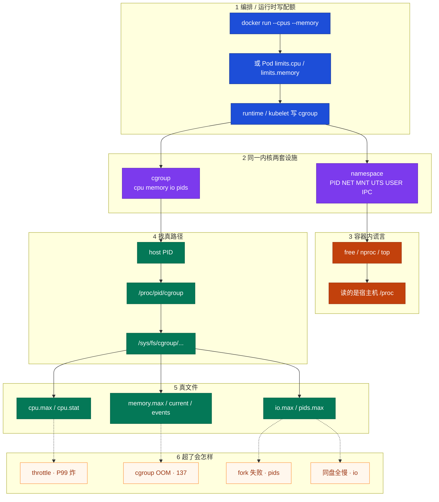
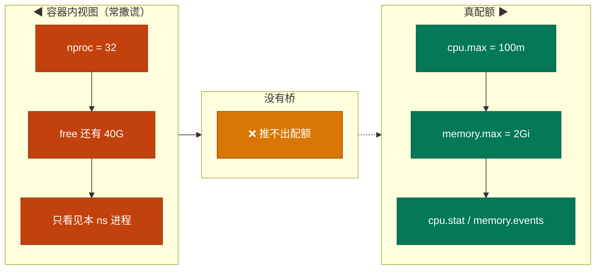
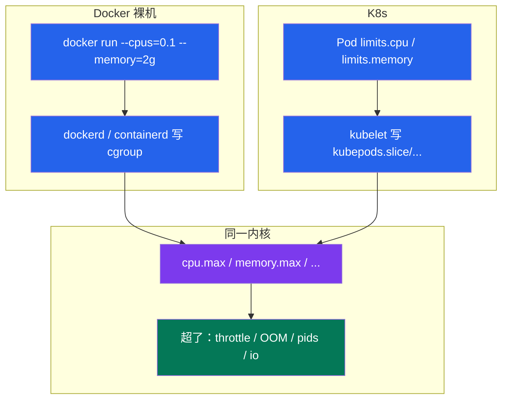
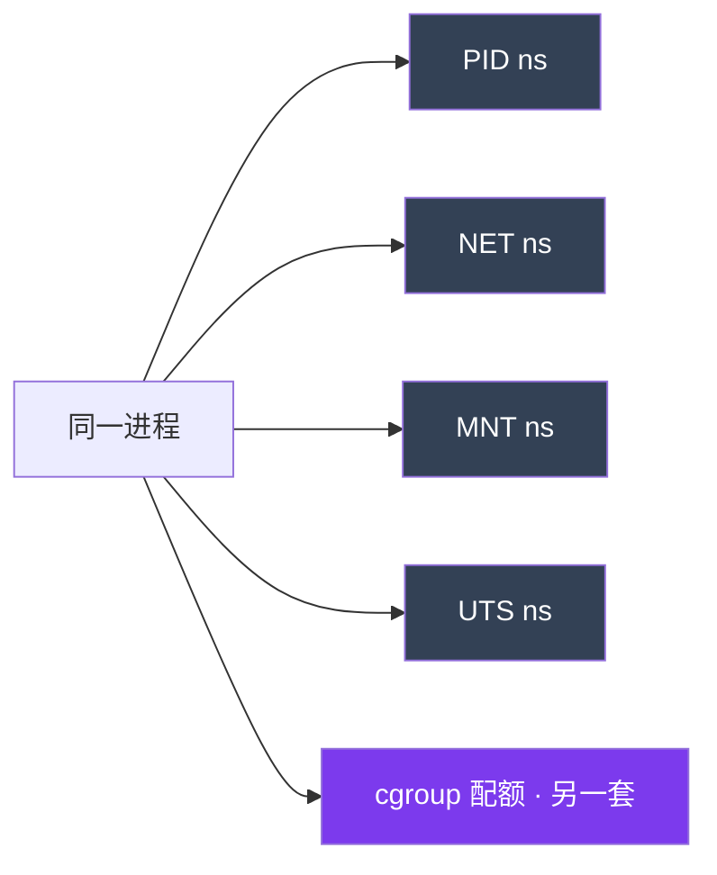
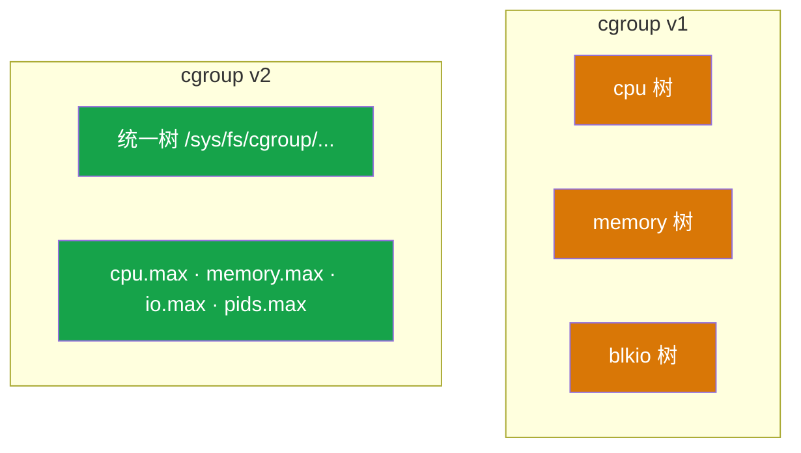
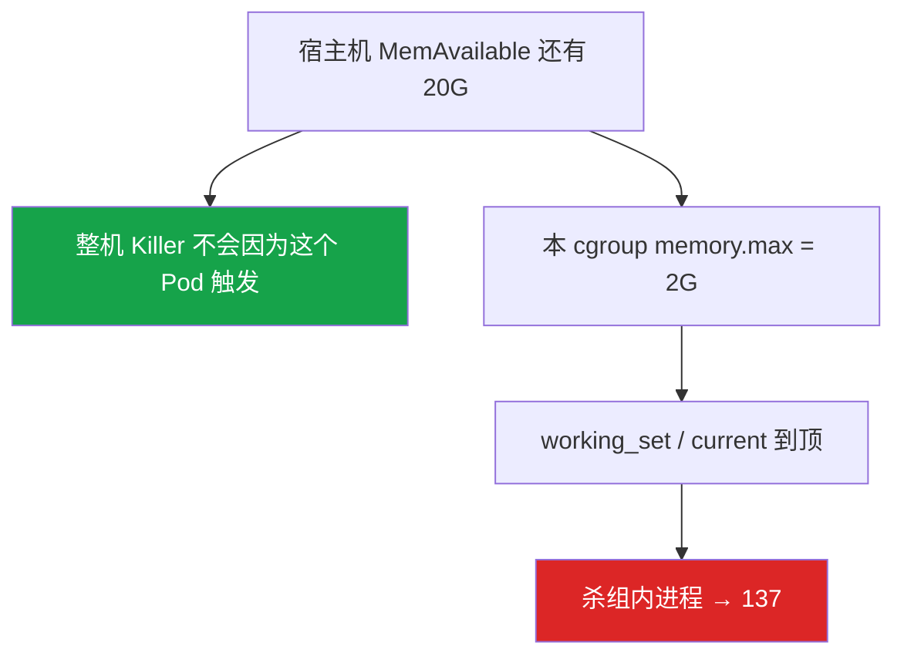
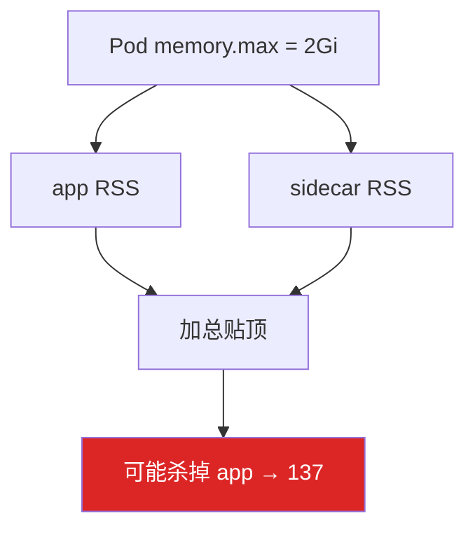
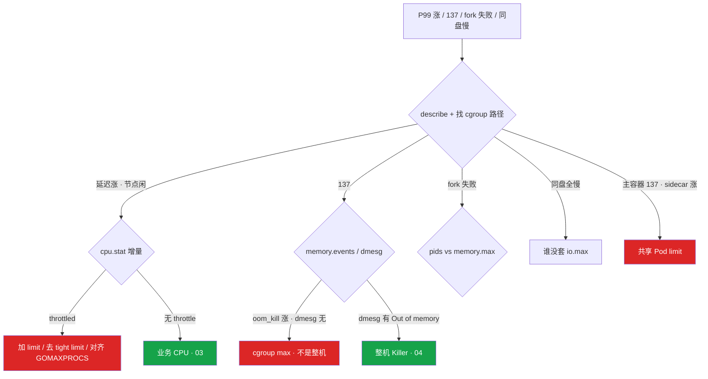

# cgroup 与容器

> **这章解决什么**：匹配服 P99 炸了、Pod 137 了——有人进容器看 `free`/`nproc` 说「资源够」，十分钟后还在重启。真相在哪？  
> **读法**：**先看总图** → **再认名词** → **再分节抠 throttle / OOM / 路径**。  
> **刻意不展开**：K8s request/limit YAML、QoS、HPA → [04-Pod生命周期](../../03-Kubernetes/04-Pod生命周期/)；整机 OOM Killer、Java 堆外细节 → [07-内存与OOM](../07-内存与OOM/)；Load、perf、绑核 → [06-CPU与Load](../06-CPU与Load/)；容器 PID 1 / SIGTERM → [05-进程与信号](../05-进程与信号/)。

---

## 本章目录

1. [本章定位](#1-本章定位)
2. [先看总图：配额怎么落到进程](#2-先看总图配额怎么落到进程) ← **开篇必读**
   - [2.0 全章知识串图](#20-全章知识串图一张把细节串起来) ← **架构总览**
   - [2.1 坐标系](#21-一张总图namespace-视图--cgroup-配额) · [2.2 走读](#22-完整走读匹配服从告警到-cgroup-文件) · [2.3 Docker/K8s 边界](#23-docker-裸机--k8s边界链-04)
3. [名词扫盲（对照总图认词）](#3-名词扫盲对照总图认词)
4. [namespace：你看见什么](#4-namespace你看见什么)
5. [free / nproc 谎言：本章最易混](#5-free--nproc-谎言本章最易混) ← **重点精读**
6. [cgroup v1 / v2](#6-cgroup-v1--v2)
7. [CPU limit 与 throttle](#7-cpu-limit-与-throttle)
8. [内存 limit 与 cgroup OOM](#8-内存-limit-与-cgroup-oom)
9. [pids / io / sidecar](#9-pids--io--sidecar)
10. [定责决策树与命令速查](#10-定责决策树与命令速查)
11. [去哪章继续学](#11-去哪章继续学)
12. [面试 · 易错 · 数字](#12-面试--易错--数字)
13. [合上书](#合上书)

---

## 1. 本章定位

| 章 | 负责 |
|----|------|
| **07（本章）** | namespace 管看见什么、cgroup 管能用多少；throttle / 137 怎么从 host PID 钉到文件 |
| **04（基础）** | 整机 OOM Killer、堆外、working_set 细节 |
| **03** | Load、%si、绑核、业务 CPU 真忙 |
| **K8s 04** | Pod YAML、request/limit、QoS、驱逐 |

本章是**容器排障入口**。后面所有 `cpu.stat`、`memory.events`、GOMAXPROCS，都建立在「视图 ≠ 配额、路径从 host PID 找」这张图上。

🎯 **值班签名**：P99 炸但节点 idle → 先想 throttle；137 但节点还有内存 → 先想 cgroup OOM——**不先信容器里的 free/nproc**。

---

## 2. 先看总图：配额怎么落到进程

> **正确开篇顺序**：先有全局画面，再认词，再抠细节。  
> 先看 **§2.0 全章串图**（考点挂一张板上），再看 **§2.1 坐标系**，再跟 **§2.2 走读**。

### 2.0 全章知识串图（一张把细节串起来）

> 🎯 **合上书要能默画这张。** 蓝=编排写下 · 紫=内核设施 · 绿=真配额文件 · 橙=谎言/卡点。  
> 若预览仍报错，以下面 **ASCII 一页板** 为准。



**读图路线：**

| 段 | 记住 |
|----|------|
| ① | Docker / K8s 只是**写手**；内核认的是 cgroup 文件（§2.3、§2.4） |
| ② | namespace=视图，cgroup=配额；同一份内核（§4、§6） |
| ③ | free/nproc **没有箭头指向配额**（§5） |
| ④⑤ | host PID → cgroup 路径 → 读文件（§7、§8） |
| ⑥ | throttle / 137 / pids / io 定责（§9、§10） |

```text
┌──────────────────────────────────────────────────────────────────────────┐
│                     07 一张板：从 YAML/run 到文件到定责                     │
├─────────────┬────────────────────┬───────────────────────────────────────┤
│  编排写配额  │  内核两套设施       │  排障真路径                             │
│  docker run │  namespace=看见什么  │  host PID → /proc/pid/cgroup           │
│  Pod limits │  cgroup=能用多少    │  → /sys/fs/cgroup/...                  │
│  kubelet写  │  同一份内核         │  → cpu.stat / memory.events            │
├─────────────┴────────────────────┴───────────────────────────────────────┤
│  谎言：free / nproc 读宿主机 /proc                                        │
│  超了：throttle·P99 ｜ cgroup OOM·137 ｜ pids·fork失败 ｜ io·同盘全慢       │
└──────────────────────────────────────────────────────────────────────────┘
```

---

### 2.1 一张总图（namespace 视图 · cgroup 配额 · 先建立坐标系）

假设：宿主机 32 核 / 64G；匹配服容器 `limits.cpu=100m`、`limits.memory=2Gi`。

**怎么读这张图：**

- **左边**：你在容器里「看见」的世界（namespace + 未改写的 `/proc`）  
- **右边**：内核真正卡你的闸门（cgroup 文件）  
- **中间**：没有桥——**左边数字推不出右边配额**

```text
容器里你看见的（常撒谎）                    内核真正卡你的（真配额）
════════════════════════════════            ════════════════════════════════

 ① nproc → 32                                ⑥ cpu.max → 10000 100000
        │  以为有 32 核                              │  每 100ms 只有 10ms
        ▼                                            ▼
 ② free → MemAvailable 还有 40G              ⑦ memory.max → 2Gi
        │  以为内存很富余                            │  到顶就杀，跟节点无关
        ▼                                            ▼
 ③ top 里 CPU% 对「宿主机核」归一化            ⑧ cpu.stat → nr_throttled 涨
        │                                            │  P99 在等配额，节点可以 idle
        ▼                                            ▼
 ④ ps 只看见本 PID namespace 里的进程            ⑨ memory.events → oom_kill
        │  （看不见宿主机其它进程）                  │  137，dmesg 可以没有
        ▼                                            │
 ⑤ 网卡 eth0 是 veth / 自己这份 NET ns         ⑩ pids.max / io.max
                                                     │  fork 失败 / 邻居 IO 卡
```



**读图三句话（先背这三句）：**

1. **容器不是微型 VM**——普通进程 + namespace + cgroup，内核 panic 全机一起死。  
2. **看见什么 ≠ 能用多少**——左边是视图/谎言，右边才是闸门。  
3. **排障从 host PID 进右边**——不要用左边的 free 反驳 137。

> **记住**：合上书默画「左谎言 / 右真文件 / 中间无桥」。

---

### 2.2 完整走读：匹配服从告警到 cgroup 文件

> 用现网角色串一遍。**只保留这一版走读**——后面各节都指回这里。

#### A. 台上有谁

| 角色 | 在哪 | 干什么 |
|------|------|--------|
| 匹配服进程 | 容器里（也是宿主机上一个普通进程） | 算匹配分、吃 CPU 突发 |
| kubelet / containerd | 宿主机 | 按 YAML 写 cgroup |
| 值班 | 节点上 | 拿 host PID、读文件 |
| 监控 | Prometheus | `container_cpu_cfs_throttled_*`、working_set |

#### B. 场景一：P99 从 50ms → 800ms，节点 CPU 60% idle

```bash
# 1）告警来了：匹配服 P99 炸，节点却很闲——先别扩节点
kubectl get pod -l app=match-server -o wide
crictl ps | grep match-server
crictl inspect <cid> | grep '"pid"'
# 假设 hostpid=28451

# 2）拼路径
cat /proc/28451/cgroup
# 0::/kubepods.slice/.../cri-containerd-xyz.scope
CG=$(awk -F: '{print $3}' /proc/28451/cgroup)

# 3）读 CPU
cat /sys/fs/cgroup${CG}/cpu.max
# 10000 100000   ← 100m：每 100ms 周期只有 10ms
cat /sys/fs/cgroup${CG}/cpu.stat
# nr_periods 28451
# nr_throttled 1523      ← 看增量！
# throttled_usec 89432000
```

**这一步说明什么：**

- `cpu.max = 10000 100000` → 配额是 100m，不是「节点有 32 核就能用」  
- `nr_throttled` 在涨 → 请求 wall clock 里掺了「等配额」的时间 → P99 炸  
- 节点 idle 高完全正常——**idle 是别人的核，不是你的餐券**

#### C. 场景二：Pod 137，节点 MemAvailable 还有 20G

```bash
kubectl describe pod match-server-xxx | grep -A5 "Last State"
# Reason: OOMKilled

cat /sys/fs/cgroup${CG}/memory.max
# 2147483648          ← 2Gi
cat /sys/fs/cgroup${CG}/memory.current
# 2147000000          ← 贴顶
cat /sys/fs/cgroup${CG}/memory.events
# oom_kill 3          ← cgroup 杀过
# oom 0

dmesg | tail -30 | grep -i "out of memory"
# （空）              ← 不是整机 Killer
```

**这一步说明什么：**

- 碰到 `memory.max` 就杀组内进程，**不需要**整机没内存  
- 容器里 `free` 显示 40G 是谎言——那是宿主机 meminfo  
- Guaranteed（request=limit）也挡不住**自己的** max

#### D. 一张表：卡在哪、你看到啥

| 现象 | 你先看到 | 真因在文件 |
|------|----------|------------|
| P99 炸、节点闲 | 监控延迟 | `cpu.stat` nr_throttled 增量 |
| 137、节点还有内存 | OOMKilled | `memory.events` oom_kill |
| fork 失败、内存够 | `Resource temporarily unavailable` | `pids.current` 贴 `pids.max` |
| 同盘实例一起卡 | iowait 全涨 | 某容器没套 `io.max` |
| 主容器 137、sidecar RSS 涨 | `kubectl top --containers` | 共享 Pod `memory.max` |

#### E. 和命令的对应（复习）

| 你想证明 | 命令 |
|----------|------|
| 这个进程属于哪个 cgroup | `cat /proc/<hostpid>/cgroup` |
| CPU 配额是多少 | `cpu.max`（v2）或 `cpu.cfs_quota_us`（v1） |
| 是不是在 throttle | `cpu.stat` 两次采样做差 |
| 是不是 cgroup OOM | `memory.events` + describe；对照 dmesg |
| 谎言有多大 | 容器内 `nproc`/`free` vs 上面的 max |

---

### 2.3 Docker 裸机 vs K8s（边界 · 链 04）

> **一句话**：Docker 和 K8s 都是**写 cgroup 的人**；本章停在「写到哪个文件、超了怎样」——YAML/QoS 公式去 K8s 04。



| | Docker 裸机 | K8s |
|--|-------------|-----|
| 谁写配额 | `docker run` / compose | kubelet 按 Pod spec |
| 路径长什么样 | 常在 `docker/` 或 `system.slice` 下 | 常在 `kubepods.slice/...` |
| 多容器关系 | 一容器一 cgroup（常见） | **Pod 级**内存常共享；sidecar 能带走主容器 |
| 本章要会 | `--cpus`/`--memory` → 文件 | `limits.*` → 文件 |
| 本章不讲 | — | request 调度、QoS、HPA、驱逐 → **K8s 04** |

**现场对照：**

```bash
# Docker
docker run -d --name demo --cpus=0.5 --memory=512m nginx
docker inspect demo --format '{{.State.Pid}}'
# 用该 PID 走 /proc/.../cgroup

# K8s（只验证「落到文件」，不背 QoS）
kubectl get pod xxx -o jsonpath='{.spec.containers[0].resources.limits}'
# 上节点用 crictl 拿 pid，核对 cpu.max / memory.max 是否一致
```

> **别混**：request 影响**调度与 shares**；**只有 limit（quota）**造成 throttle。细节公式 → K8s 04。

🎯 **边界钉死**：面试问「limit 怎么进内核」——答 kubelet/dockerd 写 `cpu.max`/`memory.max`；问「QoS 谁先被杀」——去 K8s 04，不要在本章展开。

---

### 2.4 从 YAML / docker run 到内核文件（换算表）

| 你写的 | v2 文件 | 换算例子 |
|--------|---------|----------|
| `--cpus=0.1` / `limits.cpu: 100m` | `cpu.max` | `10000 100000`（10ms / 100ms） |
| `--cpus=2` / `limits.cpu: "2"` | `cpu.max` | `200000 100000` |
| `--memory=2g` / `limits.memory: 2Gi` | `memory.max` | `2147483648` |
| 不设 CPU limit | `cpu.max` = `max 100000` | **无** CFS throttle |
| `requests.cpu`（仅 K8s） | weight/shares | **不**制造 throttle |

```bash
# 口算：N 核 → cpu.max 第一数 = N * 100000（period 默认 100ms）
# 100m = 0.1 核 → 0.1 * 100000 = 10000
```

> **记住**：CFS 周期默认 **100ms**；`100m` = 每周期 **10ms** 配额。

---

## 3. 名词扫盲（对照总图认词）

> 对照 §2.0 / §2.1。这里只建「本章感」，不把整机 OOM、Load 展开。

### 3.1 必会名词表

| 词 | 值班里什么时候碰到 | 一句话 |
|----|--------------------|--------|
| **namespace** | 容器里 `ps` 很少、有自己的网卡名 | 限制**看见/碰到**什么 |
| **cgroup** | P99 怪、137、fork 失败 | 限制**能用多少** |
| **cgroup v1** | 老节点、`cpu`/`memory` 分目录 | 子系统分树；usage 常含 cache |
| **cgroup v2** | `0::/path`；K8s 1.27+ 推 | 统一树；可拆 anon/file；有 PSI |
| **cpu.max** | 对 YAML limit | 每周期可用时间 + 周期长度 |
| **cpu.stat** | P99 炸但 idle 高 | `nr_throttled` 增量 = 是否 throttle |
| **memory.max** | 137 但节点空 | 硬顶；碰到就杀 |
| **memory.events** | 证明是不是 cgroup 杀的 | `oom_kill` 增量 |
| **memory.high** | v2 软顶 | 超了回收/PSI，尽量不杀 |
| **PSI** | 压力早于 OOM | `/proc/pressure/*` 的 some/full |
| **pids.max** | fork 报 temporarily unavailable | 进程数硬顶 |
| **io.max** | 备份拖死同盘邻居 | 块设备读写限速 |
| **host PID** | 找 cgroup 路径 | 宿主机视角的进程号 |
| **cgroupns** | 容器内直接读 `/sys/fs/cgroup` | 挂了才能在容器内看到「自己这份」 |

### 3.2 三个角色不要混

| 角色 | 干什么 | 失效/超限什么样 |
|------|--------|-----------------|
| **namespace** | 视图 | 逃逸、看见宿主机 PID/网卡、PID 1 语义怪 |
| **cgroup** | 配额 | throttle、137、IO 限速、fork 失败 |
| **容器内 /proc** | 常读宿主机统计 | `free`/`nproc` **不是**配额 |

### 3.3 在 cgroup 里 / 不在

| 在 cgroup 里 | 不在 cgroup 里（别章） |
|--------------|------------------------|
| cpu.max / memory.max / io.max / pids.max | 容器可写层内容、镜像层 |
| throttle、cgroup OOM、PSI | 整机 OOM Killer 选杀顺序 → 04 |
| kubelet 写下的 limit | YAML 里 QoS 公式 → K8s 04 |
| GOMAXPROCS 应对齐的「真核数」 | Load 怎么算 → 03 |

> **记住**：cgroup 是配额，namespace 是视图；free/nproc 不可信。

---

## 4. namespace：你看见什么

### 4.1 先记最常见的例子

进匹配服容器：

```bash
kubectl exec -it match-server-xxx -- bash
ps aux | wc -l          # 可能只有几十行
ip link                 # 常见 eth0@ifXX，不是宿主机那张物理网卡名
hostname                # 常常是 Pod 名
ls /proc/1              # 容器里的 PID 1 ≠ 宿主机 init
```

再在**宿主机**上看同一个进程：

```bash
# 宿主机
ps -fp 28451
ls -l /proc/28451/ns/
# cgroup  ipc  mnt  net  pid  user  uts
```

**一句话定义**：namespace 给进程一份「局部命名空间」——PID 号、网卡、挂载、主机名可以和宿主机其它进程不同；**不负责**限制 CPU/内存用量。

### 4.2 六种常见 namespace（够用版）

| ns | 隔离什么 | 值班常踩 |
|----|----------|----------|
| **PID** | 进程号空间 | 容器内 PID 1；杀信号语义 → 02 |
| **NET** | 网卡、路由、端口 | 容器端口 ≠ 宿主机端口；抓包要找对 ns → 11 |
| **MNT** | 挂载点 | 容器文件系统视图 |
| **UTS** | hostname / domainname | Pod 名当 hostname |
| **IPC** | System V IPC、POSIX MQ | 少见，跨容器别假设共享 |
| **USER** | UID 映射 | root 在容器 ≠ 宿主机 root（看映射） |



### 4.3 易错：namespace 挡不住内核崩溃

> **别混**：隔离「看见什么」≠ 隔离故障域。内核 panic、内核内存泄漏，整机一起遭殃。要故障域隔离用虚机/节点池，不是多加几个 namespace。

**面试怎么说**：「namespace 管视图，cgroup 管配额。容器是共享内核的进程隔离，不是微型 VM。」

---

## 5. free / nproc 谎言：本章最易混

> 🎯🔥⭐ **全章最容易晕的一点单独钉死。**  
> 难概念四步：**例子 → 定义 → 命令怎么认 → 易错一句**。

### 5.1 最常见具体例子

匹配服 limit=2 核 / 2Gi。同事进容器：

```bash
nproc
# 32
free -h
# Mem: 64G total, Available 40G
```

十分钟后 Pod `OOMKilled`（137）。同事说：「明明还有 40G，怎么可能 OOM？」

另一台：P99 爆炸。同事说：「nproc=32，CPU 很富余。」宿主机 `mpstat` 显示 idle 60%。

### 5.2 一句话定义

**容器内 `free`/`nproc`/`top` 默认读的是宿主机 `/proc` 统计，不是本 cgroup 的配额。**

namespace 隔离了进程表、网卡，**没有**把 meminfo/cpuinfo 自动改成「只显示你的 limit」（除非额外挂了 lxcfs 之类；生产默认别假设有）。

### 5.3 对照命令怎么认

```bash
# 容器内（谎言）
nproc                    # 32
free -h                  # 像宿主机

# 宿主机真配额（同一进程）
CG=$(awk -F: '{print $3}' /proc/<hostpid>/cgroup)
cat /sys/fs/cgroup${CG}/cpu.max          # 200000 100000 → 2 核
cat /sys/fs/cgroup${CG}/memory.max       # 2147483648 → 2Gi
```

| 你看见 | 它实际是 | 真值看 |
|--------|----------|--------|
| `nproc=32` | 宿主机在线 CPU 个数 | `cpu.max` |
| `free` Available 40G | 宿主机 MemAvailable | `memory.max` / `memory.current` |
| `top` 里 CPU% | 常按宿主机核归一 | 结合 quota / throttled |

### 5.4 易错一句钉死

> **别混**：用容器内 `free` 反驳 137、用 `nproc` 反驳 throttle——**永远无效**。  
> 别处见到同类争论，回指本节，不要再展开一遍。

### 5.5 谎言会带动运行时配错（一例钉死）

**例子**：Go 服务没设 `GOMAXPROCS`，默认跟 `runtime.NumCPU()`（≈ nproc=32）。limit=2 核 → 32 个 P 抢 2 核配额 → throttle 炸裂。

**定义**：运行时若按「看见的核数」配并发，会和 cgroup quota 打架。

**怎么认**：

```bash
# 容器内
nproc                    # 32
# cgroup
cat .../cpu.max          # 200000 100000 → 2
# 再看 nr_throttled 是否狂涨
```

**修复（正道）**：

| 语言 | 做法 |
|------|------|
| Go | `GOMAXPROCS=<limit核数>` 或 `uber-go/automaxprocs` |
| Java | `-XX:ActiveProcessorCount=<N>`；堆外见 04，limit 留 **30%+** |
| 别的 | 任何「按 CPU 个数开线程」的库都要对齐 limit |

> **记住**：正道是**对齐 limit**，不是把 limit 开到 32「迁就谎言」。

**面试怎么说**：「我不信容器里 free/nproc。从 host PID 找 cgroup。Go/Java 要把并发对齐 limit，否则自己 throttle 自己。」

---

## 6. cgroup v1 / v2

### 6.1 一句话 + 对照表

**一句话**：v1 子系统分树、内存 usage 粗（常含 cache）；v2 统一树、能拆 anon/file，还有 PSI 和 `memory.high`。

| | v1 | v2 |
|--|----|----|
| 树 | `cpu` / `memory` / `blkio` 分挂载 | 统一层次，一个路径管全部 |
| `/proc/pid/cgroup` | 多行，每子系统一行 | 常见一行 `0::/path` |
| CPU 配额文件 | `cpu.cfs_quota_us` + `cpu.cfs_period_us` | `cpu.max`（`quota period`） |
| 内存上限 | `memory.limit_in_bytes` | `memory.max` |
| 内存用量 | `memory.usage_in_bytes`（含 cache，粗） | `memory.current` + `memory.stat` 拆 file/anon |
| OOM 事件 | `memory.oom_control` 等 | `memory.events`（`oom_kill`） |
| 软顶 | 弱 / 少用 | `memory.high` |
| 压力信号 | 弱 | **PSI** |
| K8s | 老集群常见 | **1.27+** 默认推 v2 |



### 6.2 怎么一眼判断节点是 v1 还是 v2

```bash
# 方法 1：看挂载
mount | grep cgroup2
# 有 cgroup2 on /sys/fs/cgroup → 统一树（v2）

# 方法 2：看进程
cat /proc/1/cgroup
# 0::/init.scope          → 典型 v2
# 多行 1:name=systemd:/  2:cpu:/... → 典型 v1（或混合）
```

### 6.3 对排障差在哪（一例钉死）

**例子**：v1 上 `usage_in_bytes` 已经贴 `limit_in_bytes`，anon 其实不高——page cache 也算进 usage，更容易「看起来满了 → OOM」。迁 v2 后同样负载，`memory.stat` 里 file 可回收，硬顶行为更可预期；还能看 PSI 早于 OOM 告警。

**定义**：v1 内存统计粗，易误判；v2 可拆分 + PSI + soft 顶。

**怎么认**：

```bash
# v2
cat memory.stat | egrep 'anon|file|slab'
cat /proc/pressure/memory
cat memory.high
cat memory.max
```

**易错**：把 v1 的 `usage` 贴 limit 直接当成「anon 堆爆了」；把 `memory.high` 当成和 `memory.max` 一样会立刻杀进程。

> **别混**：`memory.high` = 软顶（回收/PSI）；`memory.max` = 硬顶（OOM）。编排器目前主要暴露 max。

### 6.4 生产怎么选

| 选 | 不选 |
|----|------|
| 新集群上 v2（K8s 1.27+） | 长期停 v1 还用「usage 含 cache」口径排障 |
| 监控看 working_set + events + PSI | 只看容器内 free |
| 文件名跟版本走 | 拿 v2 文件名去 v1 树里找 |

**面试怎么说**：「v1 分树、usage 含 cache 易误杀；v2 统一树，能拆 file/anon，有 PSI 和 memory.high。K8s 1.27+ 推 v2。」

---

## 7. CPU limit 与 throttle

### 7.1 先记最常见的例子（一例钉死）

匹配服 `limits.cpu: 100m`。活动高峰匹配计算突发 20ms 的活，被切成「跑 10ms → 等 90ms → 再跑」。P99 从 50ms 飙到 800ms。`mpstat` 节点 idle 60%。有人要扩节点。

### 7.2 一句话定义

**CPU limit = CFS quota**：每个周期（默认 **100ms**）只准用这么多 CPU 时间；用完就被踢出运行队列，直到下个周期——这叫 **throttle**。等待时间算进 wall clock，所以 P99 炸；宿主机可以仍然很闲。

### 7.3 对照命令怎么认

```bash
cat /sys/fs/cgroup${CG}/cpu.max
# 10000 100000
# │      └─ period = 100ms
# └─ quota = 10ms  → 100m

cat /sys/fs/cgroup${CG}/cpu.stat
# nr_periods 28451
# nr_throttled 1523
# throttled_usec 89432000
```

| 字段 | 含义 | 判读 |
|------|------|------|
| `cpu.max` 第一数 | 每周期可用微秒 | 10000 = 10ms |
| `cpu.max` 第二数 | 周期微秒 | 100000 = 100ms |
| `nr_periods` | 累计周期 | **看增量** |
| `nr_throttled` | 被 throttle 的周期 | 增量涨 = 正在 throttle |
| `throttled_usec` | 累计被踢出微秒 | 可换算成「丢了多少 CPU 时间」 |

**口算比例**：`Δnr_throttled / Δnr_periods`。经验：**> 5%** 且 P99 同步涨 → 当故障信号。

Prometheus：`rate(container_cpu_cfs_throttled_seconds_total[5m])`。


### 7.4 易错钉死

| 错法 | 真相 |
|------|------|
| 节点 idle 高 → 不是 CPU 问题 | 可能在 **本 cgroup throttle** |
| 扩节点修 100m throttle | 配额在**这个** cgroup，节点再空也踢你 |
| request 造成 throttle | **只有 limit/quota** |
| 看 `nr_throttled` 绝对值 | 必须看**增量** / rate |
| 把 limit 开到 32 迁就 GOMAXPROCS | 正道是对齐并发到 limit |

### 7.5 现场走一遍（复习 §2.2）

1. P99 炸、idle 高 → 怀疑 throttle  
2. host PID → `cpu.max` 确认配额  
3. 两次读 `cpu.stat` 或看 Prometheus rate  
4. 比例高 → 加 limit / 去掉 tight limit / 对齐 GOMAXPROCS  
5. 无 throttle → 转业务 CPU / Load → [06](../06-CPU与Load/)

### 7.6 核心服要不要设 CPU limit？

| 负载 | 倾向 |
|------|------|
| 延迟敏感、有状态、突发明显（匹配/网关/战斗） | request 保调度，**宽 limit 或不设**，用节点隔离 |
| 批处理、工具、备份 | **紧 limit**，保护邻居 |
| 100m 这类 tight limit | 活动必被切开——「省资源」换成「难以解释的 P99」 |

> **记住**：CFS 周期 **100ms**；100m = 每周期 **10ms**；throttle 看增量；扩节点修不好本 cgroup 的 tight limit。

### 7.7 常问：request=1、limit=1，高峰还会 throttle 吗？

会。request=limit 只表示「调度按 1 核来、配额也是 1 核」——**仍然有 quota**。活动突发超过「每 100ms 用满 100ms」就会 throttle。要「尽量不 throttle」得 **放宽或不设 limit**（并接受可能吵邻居），不是把 request 写成和 limit 一样。

### 7.8 常问：多核 limit 时，单线程突发还会被切吗？

会。quota 是 **cgroup 维度的 CPU 时间池**，不是「每个线程各有一份」。`cpu.max=200000 100000`（2 核）表示整个组每 100ms 一共 200ms CPU 时间。一个线程连跑 50ms 没问题；组内很多线程合计超了照样 throttle。

### 7.9 和 %usr / Load 怎么分工？（链 03）

| 现象 | 更像 | 去哪 |
|------|------|------|
| P99 炸、本 cgroup `nr_throttled` 涨、节点 idle 高 | throttle | 本章 |
| 节点 Load 高、该进程 `%usr` 打满、无 throttle | 真算不过来 / 缺核 | [06](../06-CPU与Load/) |
| `%si` 单核 100% | 软中断收包 | [06](../06-CPU与Load/) · 网络进 [12](../12-网络栈与Socket/) |

**面试怎么说**：「P99 涨但节点 idle，我看 cpu.stat 的 nr_throttled 增量。100m 就是每 100ms 只有 10ms。只有 limit 造成 throttle。扩节点修不好。」

---

## 8. 内存 limit 与 cgroup OOM

### 8.1 先记最常见的例子（一例钉死）

Pod 137，Reason: OOMKilled。节点 MemAvailable 20G。容器里 `free` 还有 30G。Java `-Xmx` 几乎贴着 `limits.memory`。有人说「节点内存没问题，肯定是误报」。

### 8.2 一句话定义

**碰到 cgroup `memory.max` 就杀组内进程（常见退出码 137），不需要整机没内存。** 这和整机 OOM Killer（dmesg 里 `Out of memory`）不是一条路径。

### 8.3 对照命令怎么认

```bash
kubectl describe pod xxx | grep -A5 "Last State"
# Reason: OOMKilled

cat /sys/fs/cgroup${CG}/memory.max
cat /sys/fs/cgroup${CG}/memory.current
cat /sys/fs/cgroup${CG}/memory.events
# oom_kill 3
# oom 0

dmesg | grep -i "out of memory"   # 空 → 更像 cgroup
```

| 信号 | cgroup OOM | 整机 Killer |
|------|------------|-------------|
| describe | OOMKilled / 137 | 也可能，但常伴随节点压力 |
| `oom_kill` 增量 | **涨** | 不一定 |
| dmesg `Out of memory` | **常无** | **有** |
| 节点 MemAvailable | 可以很高 | 通常很低 |
| 容器内 free | 可以显示很多（谎言） | 同上，不可信 |



### 8.4 易错钉死

> **别混**：cgroup OOM（137 + `oom_kill` 涨 + dmesg 可无）vs 整机 Killer（dmesg 有 `Out of memory`）。  
> Guaranteed 只影响节点争抢时的选杀顺序，**挡不住自己的 max**。

### 8.5 Java / 堆外（边界 · 链 04）

`-Xmx` 贴满 `memory.max` → 堆外（线程栈、DirectByteBuffer、metaspace、glibc）没地方 → 照样 137。生产 limit 相对堆留 **30%+**。细节去 [07](../07-内存与OOM/)。

### 8.6 `kubectl top` 能不能代替 events？

不能。`top` 是 working_set **近似**，用来看趋势；**定性「是不是 cgroup 杀的」**看 `memory.events` 的 `oom_kill` 增量。告警经验：working_set / limit **> 80%** 预警；到 1.0 附近准备 137。

### 8.7 v2 软顶与 PSI（和硬顶分工）

| 机制 | 行为 |
|------|------|
| `memory.high` | 超了优先回收、产生压力，**尽量不杀** |
| `memory.max` | 硬顶，超了 OOM |
| PSI `some`/`full` | 早于 OOM 的压力信号；`full` 持续高要当回事 |

```bash
cat /proc/pressure/memory
# some avg10=... full avg10=...
```

### 8.8 常问：working_set 和 memory.current 是一回事吗？

不完全是。`memory.current` 是 cgroup **当前计入**的用量（v2）；监控里的 working_set 常是「用量减去可回收 cache」一类近似，方便看「会不会顶到 limit」。值班定性 OOM **仍以** `memory.events` / describe 为准；容量规划用 working_set vs limit 做 80% 告警。

### 8.9 常问：容器刚启动就 137，一定是泄漏吗？

不一定。常见是：**limit 写太小**、Java `-Xmx` 启动就贴顶、sidecar 一上来抢内存、或者探活/预热把峰值打穿。先看 `memory.max` 是否合理、启动参数、`--containers` 谁在涨，再谈「代码泄漏」。

### 8.10 现场：137 五步（可直接背）

1. `kubectl describe` 确认 `OOMKilled` / Exit 137  
2. `top --containers` 看是谁涨（主容器 vs sidecar）  
3. host PID → `memory.max` / `memory.current`  
4. `memory.events` 看 `oom_kill` 增量；`dmesg` 排除整机  
5. 应用侧：堆/堆外/缓存；编排侧：加 limit 或拆 sidecar——堆外细节 → 04  

**面试怎么说**：「137 但节点还空，我看 memory.events 的 oom_kill 和 dmesg。dmesg 没有 Out of memory 就是 cgroup max。Guaranteed 也挡不住自己的 limit。」

---

## 9. pids / io / sidecar

### 9.1 pids.max（一例钉死）

**例子**：日志里 `fork: Resource temporarily unavailable`，`free` 还说有内存。

**定义**：`pids.max` 限制 cgroup 内进程/线程数；满了 fork/clone 失败——**跟内存够不够无关**。

**怎么认**：

```bash
cat /sys/fs/cgroup${CG}/pids.current
cat /sys/fs/cgroup${CG}/pids.max
# current 9998 / max 10000 → 满了
```

**易错**：一律当 OOM/ENOMEM 加内存。先分：**pids 满** vs **内存贴 max 再 fork（ENOMEM，见 02）**。

### 9.2 io.max

**例子**：活动备份窗口，同节点同盘三个实例 iowait 一起 40%。`iotop` 看见 backup sidecar 写 800MB/s，其 `io.max` 为 `max`（未限）。

**定义**：对块设备读写限速，防止一个容器拖死邻居。

**怎么认**：谁在狂写 + 该容器是否设置了 `io.max`。机制在 cgroup，不是「再买一块盘就完事」的替代品，但能隔离邻居。

### 9.3 sidecar 共享 Pod 内存（K8s 边界）

```text
kubectl top pod xxx --containers
NAME            CPU   MEMORY
app             ...   1800Mi
log-collector   ...    400Mi   ← 在涨
```

Pod `limits.memory=2Gi`。两者加总贴顶 → 可能 **app** 被 OOMKilled。  
**一句话**：sidecar 和主容器常共享 Pod 级内存 limit，sidecar 泄漏能带走主容器。

| 做法 | 说明 |
|------|------|
| limit 规划 | 主容器 + sidecar **加总**留余量 |
| 监控 | `kubectl top --containers` / 按 container 拆指标 |
| YAML/QoS | 去 K8s 04 |



### 9.4 Docker 里有没有「sidecar 共享」这回事？

裸机 `docker run` 通常 **一容器一内存 cgroup**，日志容器是另一个 container，默认不共享同一 `memory.max`。K8s **Pod** 才把多个 container 绑进同一组配额叙事里。所以：「sidecar 带走主容器」是 **K8s Pod 边界**高频题；Docker 双子容器要各自看各自的 limit。

### 9.5 完整走读：fork 失败怎么分叉

```bash
# 1）确认报错
# fork failed: Resource temporarily unavailable

# 2）pids
cat /sys/fs/cgroup${CG}/pids.current
cat /sys/fs/cgroup${CG}/pids.max

# 3）内存是否也贴顶（可能是 ENOMEM）
cat /sys/fs/cgroup${CG}/memory.current
cat /sys/fs/cgroup${CG}/memory.max
```

| current vs max | 结论 |
|----------------|------|
| pids 贴顶，内存还空 | **pids**；调高或查线程泄漏 |
| 内存贴顶 | 先按 cgroup 内存 / OOM 路径查；再 fork 也可能 ENOMEM |
| 两者都空 | 查用户 `nproc` ulimit、systemd `TasksMax` 等（别只盯 cgroup） |

### 9.6 面试怎么说

「fork 失败先查 pids.max。同盘全慢先查谁没套 io.max。sidecar 泄漏能带走主容器——共享的是 Pod 内存 limit。Docker 单容器通常不共享，那是 K8s Pod 叙事。」

---

## 10. 定责决策树与命令速查

### 10.1 命令速查（值班先背这张）

| 目的 | 命令 |
|------|------|
| Pod 是否 OOMKilled | `kubectl describe pod` |
| 谁在涨（主容器 vs sidecar） | `kubectl top pod --containers` |
| 拿 host PID | `crictl inspect <cid>` / `docker inspect` |
| cgroup 路径 | `cat /proc/<hostpid>/cgroup` |
| CPU 配额 / throttle | `cpu.max` · `cpu.stat`（看增量） |
| 内存硬顶 / 是否 cgroup 杀 | `memory.max` · `memory.current` · `memory.events` |
| 整机 OOM？ | `dmesg \| grep -i 'out of memory'` |
| 压力 | `cat /proc/pressure/memory` |
| pids | `pids.current` / `pids.max` |
| 谎言对照 | 容器内 `nproc` / `free -h`（只用于证明不可信） |

```bash
# 一条龙（v2）
PID=<hostpid>
CG=$(awk -F: '{print $3}' /proc/$PID/cgroup)
echo "CG=$CG"
cat /sys/fs/cgroup${CG}/cpu.max
cat /sys/fs/cgroup${CG}/cpu.stat
cat /sys/fs/cgroup${CG}/memory.max
cat /sys/fs/cgroup${CG}/memory.current
cat /sys/fs/cgroup${CG}/memory.events
```

容器内若已挂 **cgroupns**，可直接：

```bash
cat /sys/fs/cgroup/cpu.max
cat /sys/fs/cgroup/cpu.stat
cat /sys/fs/cgroup/memory.max
cat /sys/fs/cgroup/memory.current
cat /sys/fs/cgroup/memory.events
```

没挂时容器内可能读到宿主机根——数字对不上，**必须回宿主机**用 host PID。

### 10.2 决策树



| 现象 | 先做 | 别做 |
|------|------|------|
| P99 涨、宿主机 idle 高 | `cpu.stat` 增量；对齐 GOMAXPROCS | 先扩节点 |
| 100m limit 活动超时 | 配额在这个 cgroup | 扩节点当修复 |
| 137、节点还有内存 | `memory.events`；不信 free | 用容器内 free 反驳 |
| Guaranteed 仍 137 | 自己的 max | 当成 QoS「不该死」 |
| nproc=32、limit=2 | 设 GOMAXPROCS / ActiveProcessorCount | 把 limit 开到 32 当正道 |
| fork 失败、内存还够 | `pids.max` | 先加内存 |
| 同盘实例全慢 | 备份/日志的 `io.max` | 只买盘当隔离 |
| 主容器 137 | `top --containers` | 只重启逻辑服 |

### 10.3 监控阈值（经验）

| 指标 | 阈值 | 级别 |
|------|------|------|
| throttled 比例 / rate | **> 5%** 且 P99 涨 | P1 |
| working_set / limit | **> 0.8** | P1；近 1.0 防 137 |
| `oom_kill` 增量 | > 0 | P0/P1 |
| PSI memory `full` | 持续抬升 | 早于 OOM 介入 |

### 10.4 落地选型（短表）

| 项 | 选 | 不选 |
|----|----|------|
| 版本 | cgroup v2 | 长期 v1 + 粗 usage 排障 |
| 延迟敏感服 | 宽 limit / 不设 + 节点隔离 | 100m tight limit |
| 批处理 | 紧 limit | 不限、吵邻居 |
| 运行时 | 对齐 limit | 信 nproc |
| Java 内存 | limit 留 30%+ | `-Xmx` 贴满 |
| 备份 | 套 `io.max` | 活动中全盘狂写 |

---

## 11. 去哪章继续学

| 你想搞懂 | 去 |
|----------|-----|
| 整机 OOM Killer、堆外、working_set 细节 | [07-内存与OOM](../07-内存与OOM/) |
| Load、业务 CPU 真忙、绑核 | [06-CPU与Load](../06-CPU与Load/) |
| 容器 PID 1、SIGTERM 吃不到 | [05-进程与信号](../05-进程与信号/) |
| Pod YAML、request/limit、QoS、HPA、驱逐 | [K8s 04-Pod生命周期](../../03-Kubernetes/04-Pod生命周期/) |
| 抓包要进对的 NET ns | [16-网络排障与抓包](../16-网络排障与抓包/) |
| Docker 镜像/构建 | 工程化 · Docker 章 |

---

## 12. 面试 · 易错 · 数字

| 问 | 答 |
|----|-----|
| 容器是微型 VM 吗？ | 否。共享内核的进程 + namespace + cgroup。 |
| cgroup vs namespace？ | 配额 vs 视图。 |
| free/nproc 可信吗？ | 不可信，读宿主机 `/proc`。 |
| 路径怎么找？ | host PID → `/proc/pid/cgroup` → `/sys/fs/cgroup`。 |
| 100m 是多少？ | 每 100ms 周期 **10ms** 配额。 |
| 谁造成 throttle？ | 只有 **limit/quota**；request 不会。 |
| 扩节点修得了 100m throttle 吗？ | 不能。 |
| 137 但节点还有内存？ | cgroup `memory.max`；看 `oom_kill`。 |
| Guaranteed 还会 OOMKilled？ | 会，挡不住自己的 max。 |
| v1 vs v2？ | 分树+粗 usage vs 统一树+可拆+PSI。 |
| sidecar 泄漏谁死？ | 可能带走主容器（共享 Pod 内存）。 |

| 易错 | 真相 |
|------|------|
| 容器内 free 反驳 137 | 谎言 |
| idle 高就不是 CPU 问题 | 可能 throttle |
| request 会 throttle | 不会 |
| 只加 limit 到 32 替代 GOMAXPROCS | 正道是对齐 |
| v1 usage 贴 limit = anon 满 | 可能含 cache |
| memory.high = memory.max | 软顶 vs 硬顶 |
| fork 失败一定是内存 | 先查 pids |
| cgroup 能防内核 panic | 不能 |

**数字**：CFS 周期 **100ms** · 100m = **10ms**/周期 · throttle 经验 **5%** · working_set 告警 **80%** · Java 堆外留 **30%+** · K8s **1.27+** 推 v2

| 说法 | 对错 | 口径 |
|------|:----:|------|
| 容器是微型虚拟机 | 错 | 共享内核的进程隔离 |
| 容器里 free/nproc 就是配额 | 错 | 读宿主机 `/proc` |
| cgroup 能隔离内核崩溃 | 错 | panic 全机一起死 |
| 宿主机 idle 高所以不是 CPU 问题 | 错 | 可能在 throttle |
| request 造成 throttle | 错 | 只有 limit/quota |
| 扩节点能修好 100m throttle | 错 | 配额在这个 cgroup 上 |
| 节点还有内存就不会 137 | 错 | 碰到 memory.max 就杀 |
| Guaranteed 不会 OOMKilled | 错 | 挡不住自己的 max |
| sidecar 泄漏只死 sidecar | 错 | 共享 Pod 内存能带走主容器 |

---

## 合上书

1. **默画 §2.0 串图 + §2.1**：左谎言 / 右真文件 / 中间无桥；Docker 与 K8s 都只是写手。  
2. **口述**：namespace vs cgroup；为什么 free/nproc 撒谎；GOMAXPROCS 为何要对齐。  
3. **讲清**：host PID → cgroup 路径 → `cpu.stat` / `memory.events` 读哪几行。  
4. **讲清**：100m 在 100ms 周期里多少配额；为何扩节点修不好 throttle。  
5. **定责**：137 但节点空如何证明是 cgroup；Guaranteed 还会吗；cgroup OOM vs 整机 Killer。  
6. **边界**：v1/v2 差在哪；sidecar / pids / io；YAML/QoS 去哪章。  

六题能口述，这一章就过了。下一章：[TCP 与 UDP](../13-TCP与UDP/)——握手、窗口、心跳、游戏何时上 KCP。
