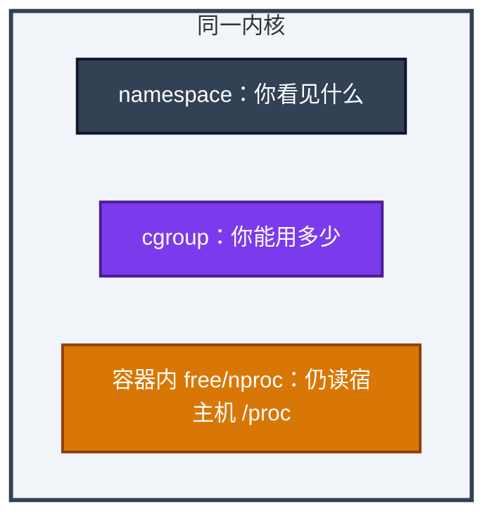
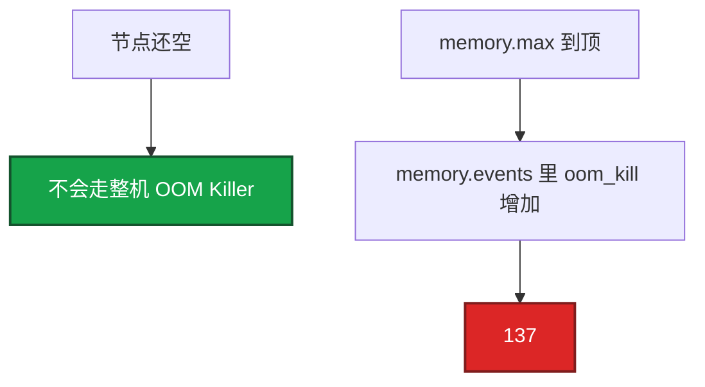
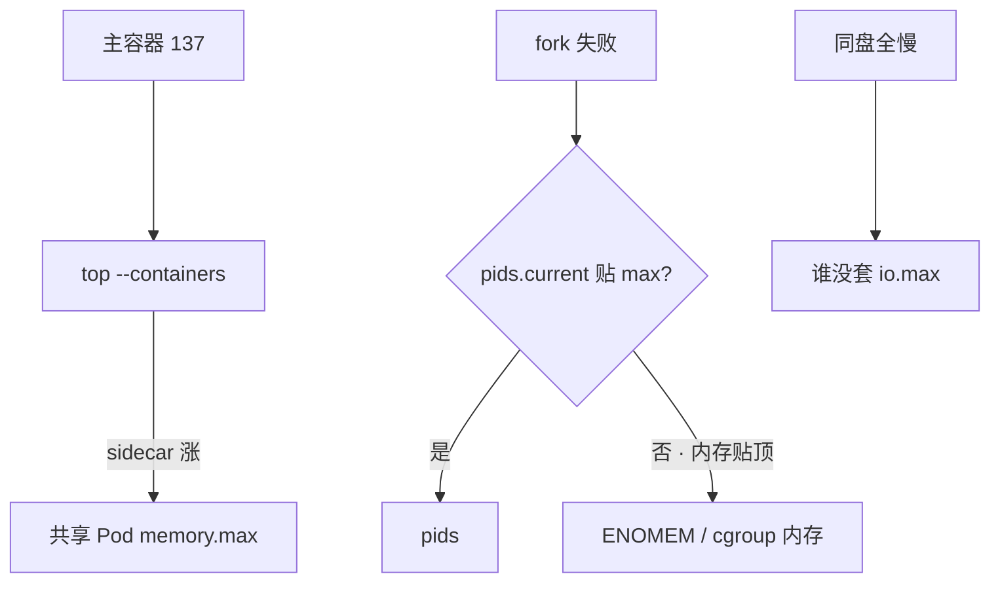
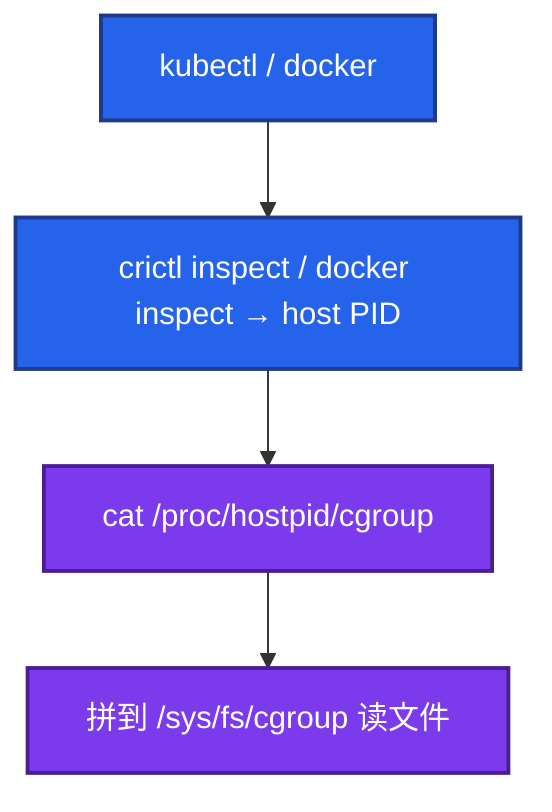

# 10｜cgroup 与容器 · 练习题

先对照 [知识点](知识点.md)：**先 §2 总图，再 §3 名词，再 §5～§8**。能讲清「视图 ≠ 配额」再谈 throttle/137。每题标了覆盖范围：

| 标记 | 含义 |
|------|------|
| **核心** | 不懂整章就没建立起来 |
| **必会** | 值班和面试都要能讲 |
| **常用** | 线上会反复碰到 |
| **常考** | 白板和追问的高频口径 |

## 本题目录

- [Q1 cgroup vs namespace](#q1)
- [Q2 free / nproc 谎言](#q2)
- [Q3 CPU throttling](#q3)
- [Q4 137 与整机内存](#q4)
- [Q5 v1 / v2](#q5)
- [Q6 Docker / K8s 边界](#q6)
- [Q7 核心服要不要 CPU limit](#q7)
- [Q8 sidecar / pids / io](#q8)
- [Q9 路径怎么找](#q9)
- [Q10 GOMAXPROCS](#q10)
- [合上书](#合上书)

---

## Q1

**★★★★★｜cgroup 和 namespace 分别解决什么？失效各什么样？**

**覆盖**：核心 · 必会 · 常考

**对应**：知识点 §2.1 · §4

### 场景

有人把容器说成「微型虚拟机」。排障时在容器里看 `free` 说内存够，十分钟后 137。

### 完整解答

**一句话**：cgroup 管配额（OOM/throttle），namespace 管视图；容器是共享内核的进程隔离，不是微型 VM。

cgroup 限制用量，超了 OOM / throttle / pids / io。namespace 限制看见什么，失效会看到宿主机 PID / 网络。内核 panic 全机一起死，cgroup 挡不住。

### 再追问

cgroup 能隔离内核崩溃吗？——不能。隔离故障域要虚机/节点池。

---

## Q2

**★★★★★｜为什么容器里 free / nproc 不能当配额？**

**覆盖**：核心 · 必会 · 常考

**对应**：知识点 §5

### 场景

limit=2 核 / 2Gi。同事 `nproc` 得 32，`free` 还有 40G，据此说「资源够」。随后 throttle 和 137 都来了。

### 完整解答

**一句话**：free/nproc 读宿主机 `/proc`，不是 cgroup；真值看 `cpu.max` / `memory.max`。

namespace 没把 meminfo/cpuinfo 改成「只显示你的 limit」（别默认有 lxcfs）。左边谎言推不出右边配额——§2.1 中间无桥。

| 谎言 | 真文件 |
|------|--------|
| `nproc=32` | `cpu.max` |
| `free` Available 很大 | `memory.max` / `memory.current` |

### 再追问

用 free 反驳 137 有没有哪怕一次成立？——没有。定性看 `memory.events` 的 `oom_kill`。

---

## Q3

**★★★★★｜CPU throttling 怎么发现？为什么 P99 会飙？**

**覆盖**：核心 · 必会 · 常用 · 常考

**对应**：知识点 §7

### 场景

匹配服 limit=500m。宿主机 idle 60%。P99 从 30ms 到 400ms。有人要扩节点。

### 完整解答

**一句话**：throttle 看 `cpu.stat` 的 `nr_throttled` 增量；100ms 周期里 quota 用完就被踢出，等待算进 P99。

读 `cpu.max` 确认配额；两次采样 `nr_throttled`/`nr_periods` 做差。比例 **>5%** 且 P99 涨当故障。Prometheus 用 rate。只有 **limit** 造成 throttle；扩节点修不好本 cgroup 的 tight limit。

### 再追问

request 和 limit 哪个造成 throttle？——只有 limit。request=limit=1 核高峰仍可能 throttle。

---

## Q4

**★★★★★｜OOMKilled 但宿主机内存很多，怎么解释、怎么查？**

**覆盖**：核心 · 必会 · 常考

**对应**：知识点 §8

### 场景

Pod 137。节点 MemAvailable 20G。容器里 `free` 显示 64G。Java `-Xmx` 贴着 limit。

### 完整解答

**一句话**：碰到了 cgroup `memory.max`，读 `memory.events` 的 `oom_kill` 增量；跟节点剩余无关。

describe 看 OOMKilled；节点上 host PID → `memory.current` vs `memory.max`、`memory.events`；`dmesg` 无 `Out of memory` 更像 cgroup。Java 堆外留 **30%+**（细节 04）。不要用 free 反驳。

### 再追问

Guaranteed 还会 OOMKilled？——会。那是自己的 max，不是 QoS 选杀。

---

## Q5

**★★★★☆｜cgroup v1 和 v2 对内存排障差在哪？**

**覆盖**：必会 · 常考

**对应**：知识点 §6

### 场景

v1 上 usage 已经贴 limit，anon 其实不高。迁 v2 之后同样负载不再轻易 OOM。

### 完整解答

**一句话**：v1 `usage_in_bytes` 含 cache 易误判；v2 能拆 file/anon，还有 PSI / `memory.high`。

v1 子系统分树；v2 统一树，`/proc/pid/cgroup` 常见 `0::/path`。`memory.high` 软顶（回收/PSI），`memory.max` 硬顶（OOM）。K8s **1.27+** 推 v2。

### 再追问

怎么一眼看节点是 v1 还是 v2？——`mount | grep cgroup2`；或看 `/proc/1/cgroup` 是否单行 `0::`。

---

## Q6

**★★★★☆｜Docker 和 K8s 写配额有何同异？本章边界在哪？**

**覆盖**：必会 · 常考

**对应**：知识点 §2.3 · §2.4

### 场景

追问「limit 写在 YAML / `docker run` 里，内核到底改了哪个文件？」不要展开 QoS 公式。

### 完整解答

**一句话**：两者都是写手；落到 `cpu.max`/`memory.max`；QoS/调度去 K8s 04。

| | Docker | K8s |
|--|--------|-----|
| 入口 | `--cpus` / `--memory` | `limits.cpu` / `limits.memory` |
| 写谁 | dockerd/containerd | kubelet |
| 多容器 | 通常一容器一 cgroup | Pod 内存常共享 |

`100m` → `cpu.max`=`10000 100000`。request 影响调度/shares，**不**造成 throttle。

### 再追问

不设 CPU limit 会怎样？——无 CFS throttle，可能吵邻居。延迟敏感服常用宽 limit/不设 + 节点隔离。

---

## Q7

**★★★☆☆｜核心游戏服要不要设 CPU limit？**

**覆盖**：必会 · 常考

**对应**：知识点 §7.6

### 场景

匹配服 100m limit，平时能跑，活动全超时。宿主机空闲。

### 完整解答

**一句话**：延迟敏感有状态服倾向宽 limit 或只设 request；100m 突发必被 throttle。

100m = 每 100ms 只有 **10ms** 配额。批处理相反，紧 limit 保护节点。扩节点修不好——配额在这个 cgroup 上。

### 再追问

request=limit=1 还会 throttle 吗？——会，只要还有 quota 且突发顶满周期。

---

## Q8

**★★★☆☆｜sidecar 泄漏谁死？pids / io 各查什么？**

**覆盖**：必会 · 常用

**对应**：知识点 §9

### 场景

逻辑服和日志 sidecar 一个 Pod。sidecar RSS 涨，主容器 137。另一台 `fork` 报 `Resource temporarily unavailable`，内存还够。同盘备份把邻居打满。

### 完整解答

**一句话**：Pod 共享内存 limit 时 sidecar 能带走主容器；fork 先查 pids；同盘慢查 io.max。

Docker 裸机双子容器通常**不**共享同一 memory.max——那是 K8s Pod 叙事。

### 再追问

io.max 能代替买盘吗？——不能，但能隔离邻居；机制在 cgroup。

---

## Q9

**★★★★☆｜容器里怎么看 CPU / 内存配额？路径从哪找？**

**覆盖**：核心 · 必会 · 常用

**对应**：知识点 §2.2 · §10

### 场景

有人猜 `kubepods` 目录。另一台容器内 `/sys/fs/cgroup` 数字像宿主机根。

### 完整解答

**一句话**：不要猜路径：host PID → `/proc/pid/cgroup` → `/sys/fs/cgroup` 读 `cpu.stat`/`memory.events`。

已挂 cgroupns 时可在容器内直接读自己的 `cpu.max` 等；没挂则可能读到根，必须回宿主机。v1 用 `cpu.cfs_quota_us`、`memory.limit_in_bytes`。`kubectl top` 不能替代 `memory.events`。

### 再追问

`nr_throttled` 看绝对值行不行？——不行，看增量 / rate。

---

## Q10

**★★★★☆｜nproc=32、limit=2 核对 Go/Java 意味着什么？**

**覆盖**：必会 · 常用 · 常考

**对应**：知识点 §5.5

### 场景

游戏网关 P99 毛刺。镜像没设 `GOMAXPROCS`。进容器 `nproc` 是 32。

### 完整解答

**一句话**：nproc 是谎言核数；不对齐 limit 会大量 throttle。

默认按 32 开跑抢 2 核配额。Go：`GOMAXPROCS=2` 或 automaxprocs。Java：`ActiveProcessorCount`；堆外另留 **30%+**。

正道是**对齐**，不是把 limit 开到 32 迁就谎言。

### 再追问

只加 limit 到 32 核能替代设 GOMAXPROCS 吗？——能消 throttle，但会在节点上抢光 CPU；正道是对齐。

---

## 合上书

- [ ] **§2 总图**：左谎言 / 右真文件 / 中间无桥；Docker 与 K8s 都是写手
- [ ] namespace vs cgroup；free/nproc 为什么撒谎
- [ ] host PID → cgroup 路径；`cpu.stat` / `memory.events` 读哪几行
- [ ] 100m = 每周期 10ms；扩节点为何修不好 throttle
- [ ] 137 但节点空如何证明是 cgroup；Guaranteed 还会吗
- [ ] v1/v2；sidecar / pids / io；YAML/QoS 去哪章
