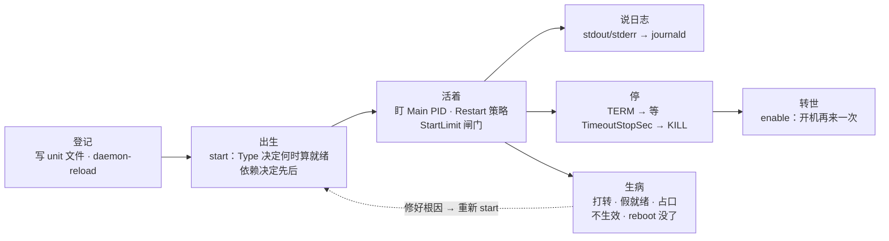
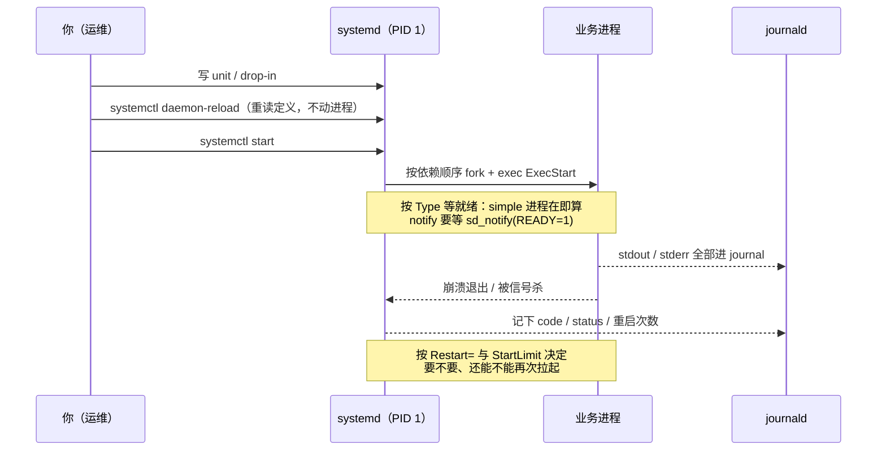
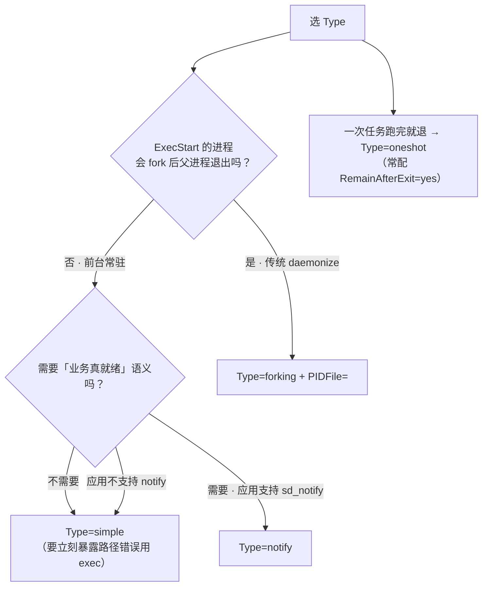
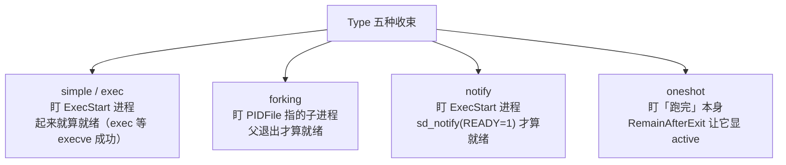
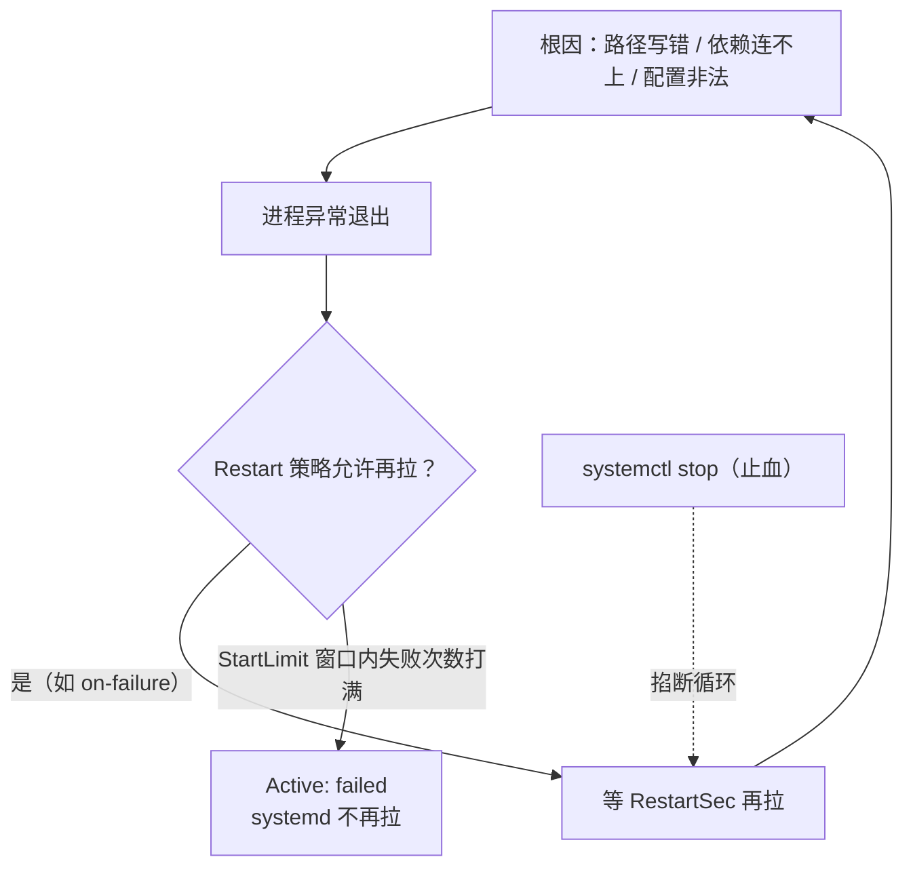
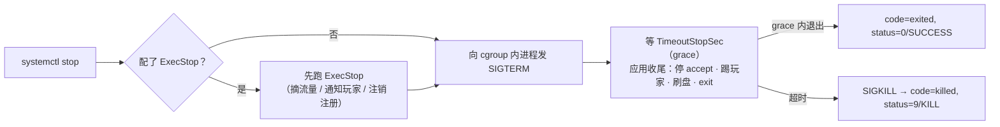
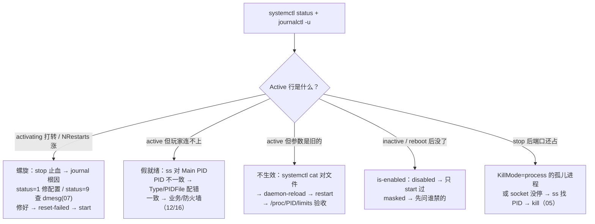

# Systemd 与服务管理

> 大家好，欢迎来到这次分享。开讲之前，先带大家回到一个很多值班同学都经历过的现场：
> 发版重启后 `systemctl status` 明明 active，玩家却 Connection refused；改了 `LimitNOFILE` 重启还是 65536；`Restart=always` 把一个写错的路径打成 CPU 与 journal 双爆的死亡螺旋——卡的都是 **systemd 盯的是谁、按哪份定义拉起**，不是业务代码。
> 这一章讲完，你会知道当时那三个人错在哪，以及正确的第一刀该砍哪。
> **本章回答**：一个服务从「登记到 unit 文件」到「被拉起、活着、说日志、停掉、开机再来」的一生，每一段会怎么坏、第一刀砍哪。
> **不讲**：TERM/KILL 信号机制与 PID 1 的内核保护 → [05](../05-进程与信号/)；cgroup 与 slice 配额 → [10](../10-cgroup与容器/)；开机流程与内核加载 → [04](../04-内核与系统/)；crontab 排障 → [30](../30-定时任务与Cron/)。这些都有专门的章节，本章只在用到时点到为止。

**标记**：🎯重点 · 🔥难点 · ⭐常考 · 🔧实操

**怎么听这场分享**：咱们先看第一节的主图，把「一个服务的一生」装进脑子；第二到第八节顺着这条线走——登记、出生、活着、说日志、停、转世、生病；第九节专门讲定责，也就是开头那个现场的正确解法。每一节讲完都会提示对应练习题，学完就去练。

---

## 一、一张图：一个服务的一生

> 🎯 **一句话**：你管理的不是进程，是这张图：systemd 替你盯 PID、收日志、管重启，前提是定义写对。

咱们先不急着背 `Type=`、`Restart=`。学 systemd 最怕的就是上来改 unit 乱 restart——改了不生效、假就绪、死亡螺旋全从这儿来。先看图，把「一个服务从登记到转世」装进脑子里：



**读图**：带着三个问题看这张图，比背字段清单有用得多：

- 从左往右就是一次发版的完整路径——先有定义（登记），再被拉起（出生），期间 systemd 盯着主进程、按策略重启（活着），日志自动汇进 journal（说日志），停服走一条带 grace 的链（停）。⭐ 面试必考就挂在「出生」和「生病」两段（练习题 Q1、Q4、Q8）。
- 下排「生病」不是新阶段，是上面任意一段坏了的样子，修好后回到「出生」重新 start。
- 后面每一节对应图上一个方块。

好，主图有了。咱们正式出发——第一站：unit 文件放哪、systemd 读哪份。

---

## 二、登记：unit 文件与落地路径

> 🎯 **一句话**：unit 是一份声明式说明书；systemd 是唯一读它、照它办事的进程（PID 1）。

游戏公司没人再用 `start.sh` + `nohup` 把进程挂后台：nohup 拉起的进程没有爹管，崩了没人知道，status 没有统一口径，日志散落在 nohup.out。systemd 的分工是：它作为 PID 1 读 unit 文件、按依赖把进程拉起来、盯着主进程和它整个 cgroup、把 stdout/stderr 收进 journald、崩溃时按你写的策略重启。**声明式**四个字就是它替代 SysV init.d 脚本和 start.sh 的理由——你描述「要什么」，不描述「怎么拉」。大白话：**你写菜谱，systemd 炒菜**。

unit 文件按后缀分类型，每个类型管生命周期里的一件事：

- `.service`——业务进程本体，本章主角；
- `.target`——一组 unit 的集合点（如 `multi-user.target`），本身不跑进程，供「开机走到这一步了」对表；
- `.timer`——到点触发一个 `.service`（替代 cron 的新写法，见七）；
- `.socket`——socket activation（见本节末尾）；
- `.mount` / `.path` / `.slice`——挂载点、路径变化、cgroup 分层（`.slice` 的配额与层级 → [10](../10-cgroup与容器/)）。

> ⚠️ **别混**：`.timer` 自己不跑任何业务，它只是闹钟；真正干活的是它 `Unit=` 指向的那个 `.service`。看到 timer 起来了任务没跑，去查被触发的那对 service。

**文件放哪**有四层，同名时优先级从高到低：

- `/etc/systemd/system/`——你自己的，最高优先级；
- `/run/systemd/system/`——运行时临时生成，reboot 即消失；
- `/usr/lib/systemd/system/`——软件包安装时带的（vendor）；
- `foo.service.d/*.conf`——**drop-in 增量**：不整份覆盖 vendor 文件，只覆盖你写的那几行。`systemctl edit foo` 创建的就是 `/etc/systemd/system/foo.service.d/override.conf`。

🔧 排障时永远用 `systemctl cat foo` 看「合并后的真相」——它把 unit 原文件和所有 drop-in 按顺序拼给你；直接 `cat /usr/lib/...` 看到的可能是已经被 drop-in 覆盖的旧值，白查。改 vendor unit 的正确姿势永远是 drop-in，别直接改 `/usr/lib` 下的文件——下次软件包升级会把你改的冲掉。

```bash
systemctl cat game-server
# ← 输出的每个片段前都标了来源路径；出现 foo.service.d/override.conf 字样，说明有 drop-in 在生效
```

一个 `.service` 文件分三段，每段回答一个问题：

```ini
[Unit]                          # 「我是谁、我等谁」
Description=Game Server
Wants=redis.service             # 依赖编排（见三）
After=network-online.target

[Service]                       # 「怎么跑、怎么算活着、怎么停」
Type=notify                     # 五种分界（见三）
ExecStart=/opt/game/bin/server
Restart=on-failure              # 重启策略（见四）
TimeoutStopSec=90               # 停服 grace（见六）
LimitNOFILE=1048576             # 资源参数（见八）
WorkingDirectory=/opt/game      # 工作目录与环境（本节末尾）

[Install]                       # 「开机怎么带上我」
WantedBy=multi-user.target
```

⭐ 没写 `[Install]` 段的 unit **能 start、不能 enable**——enable 的工作就是在 `multi-user.target.wants/` 里建一个指向 unit 的符号链接，没有 `[Install]` 就没有 `WantedBy=`，enable 无处下手。反过来排查「reboot 后服务没了」，第一刀就是看这个段在不在。

**socket activation** 是 `.socket` 类型的用法：systemd 先替你监听端口（`ListenStream=9000`），连接来了再拉起对应的 `.service` 并把 fd 交给它。好处是空闲不占进程、服务重启期间连接排队不拒绝。排障要知道两件事：一是 `ss` 看到端口在听、但监听进程是 systemd 不是业务进程，**这是正常的**；二是要彻底停掉一个 socket activation 服务，得连 `.socket` 一起 stop，只停 `.service` 它还会被连接拉起来。

最后是环境：systemd 拉起的进程**不是 login shell**——不读 `~/.bashrc`，默认 PATH 很短（往往只有 `/usr/bin`），相对路径基于 `WorkingDirectory` 解析。所以日志路径、配置路径、子命令一律写绝对路径；要传变量用 `Environment=KEY=value` 或 `EnvironmentFile=/etc/game/env`。「手动跑没事、做成服务就找不到配置文件」，九成是这一条。⭐ 口诀：**「排障先 systemctl cat，改 vendor 用 drop-in」**（练习题 Q2）。

这一节对应练习题 Q2——登记、路径与 drop-in。

好，菜谱写好了。大家想想：`systemctl start` 之后 status 变 active，服务就真的能接流量了吗？很多人会答「是」——**错了**。

---

## 三、出生：start、Type 五种与依赖编排

> 🎯 **一句话**：start 不是「执行一条命令」：systemd 先按依赖排座次，再按 Type 等就绪——两步都可能给你假象。

先看全程时序，后面每一节都是放大其中一段：



读图：三个时刻最容易出事——daemon-reload 忘了敲（内存里还是旧定义）、Type 把就绪判早了（假就绪，玩家连不进）、Restart 没配闸门（死亡螺旋，见四）。这张图的纵轴是「谁在对谁做」，排障时分清楚是 systemd 的事还是进程的事，答案就出来一半。

### daemon-reload：两本账

> 💡 **打个比方**：unit 文件是菜谱，systemd 内存里那份是正在炒的那锅菜。`daemon-reload` 是把新菜谱收进后厨——锅里的菜没变；`restart` 才是倒掉重炒。改了菜谱不 reload、只 restart，等于拿着旧菜谱翻炒一遍。

`systemctl daemon-reload` 只重读 unit 定义，**不杀也不重启任何进程**。完整生效链条见八。

### Type 五种：盯谁、何时算就绪 ⭐

systemd 对每个服务要回答两个问题：**主进程是谁（盯谁）**、**什么时候算 active（就绪）**。Type 就是这两个答案的分界：

- **`simple`**（默认）——ExecStart 那个进程本身就是主进程，进程一创建就算 active。**只保证进程在，不保证业务能用**。
- **`exec`**——同 simple，但等到 execve 成功才转 active：路径写错、没有执行权限，会立刻失败而不是傻等超时。
- **`forking`**——给传统 daemonize 的老程序用：进程自己 fork，父进程退出，systemd 认「父进程退出」为就绪，主进程 PID 从 `PIDFile=` 读。
- **`notify`**——同 simple 盯 ExecStart 进程，但要等进程主动调 `sd_notify(3)` 发出 `READY=1` 才算就绪。「业务真就绪」的标准答案。
- **`oneshot`**——跑完就退出的任务（脚本、备份），配合 `RemainAfterExit=yes` 可以在 stop 之前一直显示 active，常与 timer 配对（见七）。

（另有 `idle`（等别的任务静默再起）和 `dbus`（等拿到 D-Bus 名）两种，游戏服几乎不用。）



读图：入口只有两问——进程模型（fork 不 fork）和就绪语义（要不要等真 READY）。第一问决定盯谁，第二问决定 active 的含金量；两问答错任何一个，就会出现下面的占口或假就绪。

> ⚠️ **别混（Type 五种，只记这一组）**：`simple` 是「人进屋就算到齐」，`notify` 是「到前台报到才算到齐」。老程序写了 daemonize 就必须配 `forking + PIDFile=`；不会 fork 的进程误写成 forking，systemd 等一个永远不会出现的父进程退出，服务卡在 activating 直到超时失败。反方向，应用不调 sd_notify 却写 `Type=notify`，等不到 `READY=1` 同样启动超时。

🔥 **forking × simple 配错**是真实事故高发区，两边的坏法不一样：

| 对比 | **Type=simple（或 notify）** | **Type=forking + PIDFile=** |
|------|------------------------------|------------------------------|
| 盯谁 | ExecStart 进程本身 | fork 后留下的子进程（从 PIDFile 读） |
| 何时算就绪 | 进程创建（notify 加等 READY=1） | 父进程退出且 PIDFile 出现 |
| 配错时的现象 | 盯着已退出的父进程 → 乱 Restart、误判健康 | 卡 activating 超时；PIDFile 过期 → 盯错 PID 杀错人 |
| 适用 | 现代前台程序（首选） | 真会 daemonize 的老程序 |

🔧 现场认法：`systemctl status` 看到的 Main PID 和真正监听端口的进程对不上，就是 Type 盯错了：

```bash
systemctl status legacy-gamed
ss -lntp | grep :9000
```

```text
● legacy-gamed.service
   Active: active (running)
   Main PID: 12345 (legacy-gamed)                      ← systemd 盯的人
LISTEN 0 128  0.0.0.0:9000  users:(("legacy-gamed",pid=12340,fd=6))
# ← 真正在监听的是 12340，不是 12345：Type 盯错了。轻则 Restart 乱杀，重则父进程退出后 systemd 反复拉起、子进程占口报 Address already in use
```

> 🔍 **现场**：这一对命令就是 Type 配错的验收标准——status 报的 Main PID 和 ss 报的监听 pid 必须一致；不一致先怀疑 Type/PIDFile，别急着 kill。

修法顺序：`stop` → 确认程序是否真 daemonize → 前台程序改 `simple`/`notify`，daemonize 程序配 `forking` + `PIDFile=`（PIDFile 必须是程序 fork 之后自己写的那个真 PID）→ `daemon-reload` → `start` → 再用 `ss` 对一遍 Main PID。

### 假就绪：进程起来 ≠ 玩家能连

🔥 `Type=simple` 的服务 active 了，只说明进程活着，端口可能还没 bind、配置可能还在加载。单机时代无所谓，上了依赖编排就要命：如果 `game-gateway` 写了 `Requires=game-logic.service`，而 logic 是 simple 的，systemd 认为 logic「就绪」的瞬间就把 gateway 放行了，gateway 冲上去连 logic 的内部端口，connection refused，然后自己崩。**要「拉起顺序 = 可用顺序」，被依赖方必须是 `notify`**（或者下游自己带重连，见下面的游戏服配法）。

> 💡 **打个比方**：simple 的「开业」是店门开了，notify 的「开业」是收银机也开好了——门口挂的牌都是「营业中」，但前一种顾客进来可能要干等。

### 依赖编排：排座次、拉人、共死

依赖指令回答三个不同的问题，混着写是最大的坑：

| 对比 | **Wants=（弱依赖）** | **Requires=（强依赖）** |
|------|----------------------|-------------------------|
| 会不会拉对方 | 会试着拉，失败不追究 | 一定会拉 |
| 对方挂了呢 | 我照常跑（自己重连） | 我也被停掉——故障面放大 |
| 游戏服典型 | `Wants=redis.service` + 应用自重连 | 只给「没它绝对不能跑」的（如主 DB） |

- `After=` / `Before=`——**只排序，不拉人，也不保证对方就绪**，只保证「对方 start 之后再 start 我」。最常用也最常被误解的一条。
- `Requisite=`——「对方必须在跑我才起，但我不主动去拉」，用于防止乱序依赖。
- `BindsTo=`——对方停我也停（比 Requires 更紧，慎用）。
- `PartOf=`——跟随联动：B 单元 stop/restart 时我也跟着，适合「一套东西一起重启」。

> ⚠️ **别混**：`network.target` 只表示「网络栈初始化动作完成」，几乎和「能连网」无关；真要等网卡拿到地址，配 `After=network-online.target` 并加一个 `Wants=network-online.target`（拉它的 wait-online 服务）。写错成 network.target，开机偶发连不上下游就是无规律玄学。

游戏服的标准配法——**弱依赖 + 应用自重连**，把故障面控制住：

```ini
[Unit]
Wants=network-online.target
After=network-online.target
Wants=redis.service        # 弱依赖：redis 挂了我不陪葬，自己重连
```

### 收束：systemd 凭什么说「这个服务活了」



读图：整棵树按「盯谁 + 何时算就绪」两问分组——simple/notify 是同一个人、不同就绪标准；forking 换了个人盯；oneshot 干脆没有「活着」的状态。依赖（After/Requires/Wants）只决定**先后和连坐**，对就绪的含金量毫无贡献。

不保证什么：任何 Type 都不保证「玩家请求能被处理」——simple 的 active 只保证进程在，notify 只保证应用自己举手，端口对不对、配置加载完没有，仍要用 `ss` 和日志验收。记忆分组（面试按这个顺序背）：**进程在（simple/exec）→ 应用举手（notify）→ 换人盯（forking）→ 跑完即走（oneshot）**。

> 📝 **面试**：问「进程起来等于服务就绪吗」，按收束树答：「simple 只保证进程在，notify 才有应用举手的真就绪」；再补一句「依赖指令不提供就绪保证——After 只管先后，Requires 只管连坐」。最后这句是区分背过和懂了的分水岭。口诀：**「active ≠ 能接流量；simple 假开业，notify 真开业」**（练习题 Q4、Q6）。

这一节对应练习题 Q4、Q6——Type 与依赖编排。

好，出生讲完。下一问：崩了自动拉——好事还是坏事？开头那个死亡螺旋就挂在这儿。

---

## 四、活着：Restart 策略与死亡螺旋

> 🎯 **一句话**：Restart 决定「崩了拉不拉」，StartLimit 决定「还能不能拉」——打满进 failed 不是修好，是熔断。

Restart 有七个值，按「什么情况算值得再拉」分档：`no`（不拉）、`on-success`（正常退出才拉，少见）、`on-failure`（异常退出才拉）、`on-abnormal`（被信号杀/超时才拉）、`on-abort`（没清理干净就死才拉）、`on-watchdog`（看门狗超时才拉）、`always`（无条件拉）。游戏服常考的是两个极端：

| 对比 | **Restart=on-failure** | **Restart=always** |
|------|------------------------|--------------------|
| 何时再拉 | 非零退出、被信号杀等异常 | 任何退出，**包括正常 exit 0** |
| 副作用 | 异常反复 → 靠 StartLimit 熔断 | 发布脚本 stop → 进程 exit 0 → 立刻被拉回，两边打架 |
| 生产建议 | 逻辑服默认选择 | 仅给「无论如何必须在」的进程（如 agent） |

看门狗一句话：`Restart=on-watchdog` 配 `WatchdogSec=30`，应用定期调 `sd_notify(0, "WATCHDOG=1")` 喂狗，超时不喂就视为挂死触发重启——专治「进程活着但卡死」，simple + always 对这种假活毫无办法。

### StartLimit：闸门，不是修复

> 💡 **打个比方**：`Restart` 是油门，`RestartSec` 是两次踩油门的间隔，`StartLimitBurst` / `StartLimitIntervalSec` 是保险丝——默认 60 秒内连拉 5 次都失败就熔断进 failed。熔断不是「系统把它修好了」，是「烧给你看」：再 start 一次照样失败，必须先修根因。

`RestartSec=` 是两次重启之间的间隔（默认 2s）。**`RestartSec=0` 是错药**——它把螺旋的频率拉满，让 CPU 和 journal 双爆，本来一次崩溃变成每秒一次。

### 死亡螺旋：一张 status 截图

🔥 典型现场：路径写错 → 启动即失败 → on-failure 再拉 → 再失败，直到闸门熔断：

```bash
systemctl status game-server
```

```text
● game-server.service - Game Server
   Loaded: loaded (/etc/systemd/system/game-server.service; enabled)
   Active: activating (auto-restart) since 18:42:11 CST; 1s ago     ← 打转中，还没进 failed
  Process: 28451 ExecStart=/opt/game/bin/server (code=exited, status=1/FAILURE)
                                                                    ← 应用自己 exit 1：配置、路径、权限
systemd[1]: Scheduled restart job, restart counter is at 847.        ← 847 次：闸门早被打穿过
```



读图：这是一个「根因 → 退出 → 再拉 → 根因」的闭环，环上任何一点都不是修好的地方；唯一出口是修掉根因 A。`stop` 是临时止血（掐断 D），`reset-failed` 只是清熔断计数器让下次 start 不被拦——**先修根因，再 reset-failed**，顺序反了就是把它再放出来螺旋一次。

处理顺序照背：`systemctl stop` 止血 → `journalctl -u` 看最后一句错误 → 修根因 → 改了 unit 就 `daemon-reload` → `systemctl reset-failed game-server` → `systemctl start` → `status` 验收。

> 📝 **面试**：问「服务反复重启怎么办」，30 秒口径：「stop 止血 → journalctl -u 找最后一句错误 → 修根因 → daemon-reload（改过 unit 时）→ reset-failed 清计数 → start 验收」；补一句「RestartSec=0 是错药，只会让螺旋更快」。口诀：**「先 stop 止血，再 journal 找根因；reset-failed 在修好之后」**（练习题 Q5）。

### status 三行速读与退出码分流 ⭐

`systemctl status` 只看三行：**Active 行**（active / activating (auto-restart) / failed / inactive (dead)——最后一种是正常 stop，不是病）、**Main PID 行**（systemd 在盯谁）、**Process 行**（为什么退）。Process 行的退出码直接分流排查方向：

```text
code=exited,  status=1/FAILURE        ← 应用自己 exit 1：配置/路径/权限，去 journal 找上一句 ERROR
code=killed,  status=9/KILL           ← 被信号杀：停服 grace 超时强杀（见六），或 OOM → dmesg + 07 章
Start request repeated too quickly   ← StartLimit 熔断：修根因 + reset-failed，别反复 start
```

> ⚠️ **别混**：`status=1` 是应用「自己说不行」，答案在 journal；`status=9` 是「别人替它死了」，答案在 dmesg / OOM（→ [07](../07-内存与OOM/)）。前者反复 start 没用，后者反复 start 更没用——内存不够就是不够。

这一节对应练习题 Q5——死亡螺旋与 status 分流。

好，活着讲完。崩了去哪找最后一句错误？下一节：journalctl。

---

## 五、说日志：journalctl 按服务读事故

> 🎯 **一句话**：systemd 拉起的服务，stdout/stderr 和 systemd 自己的事件都在 journal——排障第二刀永远是指定 -u 的 journalctl。

因为 journald 是 PID 1 的亲兵，systemd 记的「谁被重启了几次、以什么退出码死的」和业务进程打的 ERROR 在同一个流里，按时间天然对齐——这是 nohup.out 永远做不到的。排障时 status 之后紧跟这一组：

```bash
journalctl -u game-server -n 100 --no-pager          # 最近 100 行
journalctl -u game-server -f                          # 跟踪（发版时挂着看）
journalctl -u game-server --since "18:00" --until "19:00"
journalctl -u game-server -b -1                        # 上一次开机的日志（前提：已持久化）
journalctl -u game-server -p err -n 50                 # 只要 err 及更严重
journalctl --disk-usage                                 # journal 吃了多少盘
```

```text
-- Logs begin at Tue 2026-08-25 10:12:34 ... --       ← begin 时间早于上次 reboot = 已经持久化了
18:42:10 logic-01 game-server[28451]: ERROR: config not found: /etc/game/wrong.conf   ← 根因往往就是这句
18:42:10 logic-01 systemd[1]: game-server.service: Scheduled restart job, restart counter is at 847.
# ← 业务 ERROR 和 systemd 的重启记录在同一秒：一边是病，一边是症状
```

> 🔍 **现场**：同一秒里业务打 ERROR、systemd 记 restart——这对「病与症状」的对齐就是 journal 的价值，nohup.out 永远给不了；排障时先在 -u 的输出里找这一对。

**持久化**默认不保证：很多发行版默认 `Storage=auto`，`/var/log/journal` 不存在时日志落在 `/run/log/journal`，**reboot 全丢**。要跨 reboot 查（「昨晚 3 点那次重启发生了什么」），先做一次：`mkdir -p /var/log/journal`，在 `/etc/systemd/journald.conf` 写 `Storage=persistent`（配 `SystemMaxUse=2G` 防吃盘），再 `systemctl restart systemd-journald`。journal 打满盘的清理与上限治理 → [23](../23-日志运维/)。

> ⚠️ **别混**：journal 和应用自写的 `/var/log/game/*.log` 是**两路日志**——重定向到文件的输出不再进 journal（systemd 只收 stdout/stderr），完整还原事故可能两边都要看。另外，用 nohup 拉起的进程不属于任何 unit，`journalctl -u` 查它几乎是空的——这本身就是该迁到 systemd 的证据。

这一节对应练习题 Q7——按服务读 journal。

好，日志会读了。下一站：怎么停才不丢数据。

---

## 六、停：stop 链与 KillMode

> 🎯 **一句话**：`systemctl stop` 不是「杀进程」，是一条链：ExecStop → TERM → 等 grace → KILL；grace 就是 TimeoutStopSec。

这条链和容器停服是同一条；信号的机制细节（TERM/KILL 差别、PID 1 为什么收不到 TERM）在 [05](../05-进程与信号/)，本章只从 systemd 编排视角看它长什么样：



读图：从左进，先问「有没有 ExecStop」——没有就直接发 TERM。中间那段等待是整条链的关键：应用收到 TERM 后要完成停 accept、踢玩家、**把数据刷盘**再退出；`TimeoutStopSec` 就是留给它的 grace（systemd 默认 90s）。在 grace 内自己退出，journal 结局是 `status=0/SUCCESS`；超时被补刀 KILL，结局是 `status=9/KILL`——**刷盘没完成就是事故**。

🔥 游戏服的 grace 按**刷盘量**定：30～120s 是常见区间；照抄默认 10s 的模板，几乎必被强杀，玩家数据丢一段再从存档回滚。K8s 停 Pod 是同一条链，`terminationGracePeriodSeconds` 默认 30s，机制对照 → [05](../05-进程与信号/)。

`ExecStop` 用来做「摘流量」：先从 LB / 服务发现注销、通知网关不再分人，再让 systemd 发 TERM——玩家看到的是「无感维护」，而不是连接被掐。不配 ExecStop 时直接从发 TERM 开始。

> 📝 **面试**：问「systemctl stop 之后发生了什么」，背链条：「ExecStop 摘流量 → 向整个 cgroup 发 TERM → 应用停 accept、踢玩家、刷盘，在 TimeoutStopSec 内退出 → 超时才 KILL」；补一句「grace 默认 90s，游戏服按刷盘量给 30～120s，K8s 是同一条链」。

**KillMode** 决定 TERM/KILL 发给谁，四种：

- `control-group`（默认）——发给整个 cgroup 内所有进程。这就是为什么 systemd 服务里的 worker 子进程不需要 nohup，停服时会被一并收干净（cgroup 分层 → [10](../10-cgroup与容器/)）；
- `process`——只杀主进程；
- `mixed`——TERM 只发主进程，超时后 KILL 发整个 cgroup；
- `none`——只执行 ExecStop，不杀任何进程（极少用）。

> ⚠️ **别混**：`KillMode=process` 只杀主进程，子进程全变孤儿继续占着端口，下次 start 报 Address already in use——保持默认 `control-group`，没有特殊理由不要动它。

> ⚠️ **别混**：`systemctl reload` 是给**进程**发 SIGHUP 让它热更配置（进程得自己支持，如 Nginx）；`systemctl daemon-reload` 是让 **systemd** 重读 unit 文件。中间隔着一个 daemon 和一整层语义，永远不是一回事。口诀：**「reload 热更进程，daemon-reload 重读菜谱」**（练习题 Q12 决策树也会碰到）。

这一节对应练习题 Q12——停服相关会出现在定责树里。

好，停讲完。开机还会不会再来？下一站：enable / mask / timer。

---

## 七、转世：enable、mask 与 timer

> 🎯 **一句话**：start 管这一次，enable 管每一次开机——发版只 start、reboot 服务就没了，是经典事故。

| 对比 | **start（现在）** | **enable（开机）** |
|------|-------------------|--------------------|
| 影响当前 | 立即拉起 | 不拉起（除非 `enable --now`） |
| 影响开机 | 无 | 在 `WantedBy=` 指向的 target 下建符号链接 |
| 验收命令 | `systemctl is-active` | `systemctl is-enabled`，最终以一次真 reboot 演练为准 |

⭐ `enable` 的本质动作：在 `/etc/systemd/system/multi-user.target.wants/game-server.service` 建一个指向 unit 文件的符号链接——开机走到 multi-user.target 时，把它 wants 的全部 unit 拉起来，你的服务就在其中。`disable` 删链接；`is-enabled` 查状态。**「改了 unit、reboot 后服务没了」的第一刀**就是 `systemctl is-enabled game-server`——回显 `disabled` 说明当年只 start 没 enable；回显 `masked` 是另一回事。

> 💡 **打个比方**：start 是「今天来上班」，enable 是「把户口迁进 multi-user.target」——reboot 等于重新分房子，只有户口在册的才会被自动接来；只 start 没 enable 的服务，reboot 一次就露馅。

**mask** 是「焊死」：把 unit 链接到 `/dev/null`，start、enable 全部失效，连手动 start 都报 masked——用于彻底禁用（如防止某服务被依赖链拉起）。`unmask` 解除。`systemctl isolate multi-user.target` 则是运行时把整机切到某个 target（等价切 runlevel，停掉不在其依赖树内的服务）——排查「这机器上为什么没跑 X」时偶尔会撞见它；开机从内核到 multi-user.target 的完整流程 → [04](../04-内核与系统/)。

**timer** 是 systemd 侧的定时任务，成对出现：一个 `Type=oneshot` 的 service 负责干活，一个 `.timer` 负责到点触发：

```ini
# game-backup.timer
[Timer]
OnCalendar=*-*-* 02:00:00     # 每天 02:00（时区问题 → 32）
Persistent=true               # 错过的那次补跑（cron 没有）
[Install]
WantedBy=timers.target
```

```bash
systemctl list-timers                 # 所有 timer 的上次/下次触发时间，一眼看出谁没跑
# ← Next 列停在昨天 = 没在跑：systemctl status game-backup.timer 看它是否 enabled/active
```

> ⚠️ **别混**：timer 的优势是 journal 统一收录、`Persistent=true` 补跑、`list-timers` 清点；cron 的优势是全员都会写。新定时任务优先 timer；cron「手动能跑、定时跑不了」的环境坑（PATH、bashrc、时区）→ [30](../30-定时任务与Cron/)，本章不展开。

这一节对应练习题 Q9、Q10、Q13——enable / mask / timer。

好，转世讲完。回到开头第二个现场：改了 LimitNOFILE，重启还是 65536——为什么？

---

## 八、生病：改了不生效与参数验收

> 🎯 **一句话**：「改了不生效」九成是少了 daemon-reload 或改错了层——先走三步链，再用 /proc 验收。

改 unit（或 drop-in）后的**生效三步**，一步都不能少：

```
改文件 → systemctl daemon-reload → systemctl restart → 验收
```

只做一步的后果各不相同：只改文件——systemd 内存里还是旧定义，restart 也用旧的；补了 daemon-reload 没 restart——定义新了，但**进程还带着旧参数在跑**（daemon-reload 不杀进程）；把 `systemctl reload` 当成这两步——那是给进程发 HUP 热更（见六），unit 参数根本不会变。验收永远看进程的实际情况，不看文件写没写。

### LimitNOFILE：五层里只有一层你说了算 ⭐

🔥 最典型的「改了不生效」：unit 写了 `LimitNOFILE=1048576`，重启后连接数一过 1 万还是报 Too many open files。原因是 fd 上限有多层，各管一段：

- `fs.file-max`——整机所有进程 fd 总和的硬顶（内核参数 → [24](../24-内核参数与sysctl/)）；
- `fs.nr_open`——单个进程 fd 数的硬顶（默认 1048576），`LimitNOFILE` 不能超过它；
- `LimitNOFILE=`——unit 里给这个服务的软硬上限（**只写一个数 = 软=硬**）；
- `/etc/security/limits.conf`——PAM/login shell 层，systemd 拉的服务**不经过 PAM，对你无效**；它只管 ssh 登录后的手工进程；
- `/proc/PID/limits`——**唯一验收标准**：进程实际拿到的值，别的都只是「你以为」。

> ⚠️ **别混**：`limits.conf` 管不到 systemd 服务（PAM 层 vs systemd 层）；`LimitNOFILE=infinity` 在很多版本会被落成默认 65536——游戏服直接写明确数字 `1048576`。

🔧 验收组合拳，改完必跑：

```bash
systemctl cat game-server | grep LimitNOFILE          # 定义里写的（注意 drop-in 有没有覆盖）
systemctl daemon-reload && systemctl restart game-server
cat /proc/$(systemctl show -p MainPID --value game-server)/limits | grep "open files"
```

```text
Max open files            1048576      1048576      files    ← 对上了，才算生效
Max open files            65536        65536        files    ← 没对上：漏了 daemon-reload，或 infinity 被落回默认
```

> 🔍 **现场**：验收只认 `/proc/PID/limits` 这一屏，unit 文件写得再对都不算数；把这条写进发版 checklist，比事后查「为什么还是 65536」便宜得多。

limits 已经对了还在涨 Too many open files——那不是上限问题，是 **fd 泄漏**（连接没关），回代码查 → [05](../05-进程与信号/)。

### 游戏服 unit 最低配（十条） 🔧

从零写一个能过评审的游戏服 unit，逐条对账：前台进程 + `Type=notify`（应用支持时）；`ExecStart` 绝对路径；`WorkingDirectory` 显式写；`Restart=on-failure` + `RestartSec=5`；`TimeoutStopSec` 按刷盘量给足；KillMode 保持默认；`LimitNOFILE=1048576` 明确数字；`Wants=` 弱依赖 + 应用自重连；`WantedBy=multi-user.target` 且真的 enable；发版流程里固化「改 → daemon-reload → restart → 验收」四步。网上抄来的模板里 `Restart=always`、`LimitNOFILE=infinity`、`User=root` 三个高频雷点，逐个换掉再上。口诀：**「改 → daemon-reload → restart → /proc 验收」**（练习题 Q3、Q8、Q11）。

这一节对应练习题 Q3、Q8、Q11——改了不生效与验收。

好，机制讲完了。回到开头那个现场——正确的 60 秒该怎么走？

---

## 九、作战：定责

> 🎯 **一句话**：一切「服务不对劲」，第一刀永远是 systemctl status，然后按这张树走。



读图：入口只有一个——status 的 Active 行，五条出口对应五类病。B/C/D 是高频三兄弟（螺旋、假就绪、不生效），E 和 F 靠一条验收命令就能定位。每一支的终点都是「修根因」，不是「再 start 一次试试」。

| 现象 | 先做 | 别做 |
|------|------|------|
| `activating (auto-restart)` 打转 | `stop` 止血，`journalctl -u` 找根因 | 反复 `start`，把闸门打穿 |
| active 但 Connection refused | `ss -lntp` 对 Main PID | 只看 status 就回「服务正常的」 |
| 改了 unit 不生效 | `systemctl cat` 对文件，走三步链 | 只 `restart` 不 `daemon-reload` |
| reboot 后服务没了 | `systemctl is-enabled` | 直接写进 rc.local 了事 |
| stop 后端口还占着 | `ss -lntp` 找占口进程 | `kill -9` 完事不查 KillMode |

🔧 **60 秒剧本**（值班第一分钟，按顺序敲完再说话）：

```bash
systemctl status game-server                          # Active / Main PID / 退出码，三行定方向
journalctl -u game-server -n 100 --no-pager           # 最后一屏日志，找 ERROR 根因
ss -lntp | grep :9000                                 # 端口在不在、进程对不对
systemctl is-enabled game-server; systemctl list-units --state=failed
# ← 顺手记下开机态和别的 failed 单元，汇报时一起说
```

这一节对应练习题 Q12、Q14——定责综合。

现在再看群里那三句「服务是 active 的」「再 restart 一下」「Restart=always 更稳」，你知道该怎么拦住他了：先 `status` 三行定方向，假就绪对 Main PID，螺旋先 stop 再 journal，改参数走三步链用 `/proc` 验收。

---

## 十、收口

> 🎯 **一句话**：整章压成四件套带走——命令速查、面试锚点、易错对照、数字墙，合上书前最后过一遍。

### 命令速查 🔧

```bash
systemctl status|start|stop|restart|reload game      # reload 是进程热更（HUP），不是 daemon-reload
systemctl daemon-reload                               # 改 unit 后必敲（不杀进程）
systemctl enable --now game                           # 开机自启 + 立即拉起
systemctl is-active game; systemctl is-enabled game   # 两个状态，两个答案
systemctl cat game; systemctl edit game               # 合并真相 / 建 drop-in
systemctl mask|unmask game                            # 焊死 / 解焊
systemctl reset-failed game                           # 清 StartLimit 熔断计数（修完根因再敲）
systemctl show -p MainPID -p NRestarts --value game   # 盯谁 / 拉了几次
journalctl -u game -n 100 -f --since "18:00" -p err -b -1
systemctl list-timers; journalctl --disk-usage
```

### 面试锚点

遮住右列自问自答，卡壳的行回去重读对应小节：

| 问 | 30 秒答 |
|----|---------|
| systemd 相比 SysV / nohup 好在哪 | 声明式 unit、统一 status 口径、StartLimit 闸门、journal 与重启记录同流；nohup 拉的进程没人盯、日志散落 |
| Type 五种怎么选 | 两问：fork 不 fork（定盯谁）、要不要真就绪（定 active 含金量）；前台 simple/notify，daemonize 配 forking+PIDFile，一次任务 oneshot |
| forking 写成 simple 会怎样 | Main PID 和真监听进程对不上：乱 Restart、留孤儿占口报 Address already in use；ss 对 status 认 |
| 进程起来等于就绪吗 | 不。simple 只保证进程在；要「拉起顺序=可用顺序」用 notify（sd_notify READY=1），依赖指令不提供就绪保证 |
| After 和 Requires 差别 | After 只排序不拉人；Requires 拉人且连坐（对方死我也停）；游戏服用 Wants+自重连控制故障面 |
| 要等网络就绪怎么配 | After+Wants=network-online.target 并确保 wait-online 服务在；network.target 几乎不代表能连网 |
| Restart 怎么配 | 逻辑服 on-failure+RestartSec；always 会把发布脚本的 stop 拉回来；挂死用 on-watchdog+WatchdogSec |
| 死亡螺旋怎么处理 | stop 止血 → journal 根因 → 修 → reset-failed → start；RestartSec=0 是错药 |
| status=1 和 status=9 的区别 | 1=应用自己 exit，查 journal；9=被 KILL，查 dmesg/OOM（grace 超时或内存耗尽） |
| journalctl 常用哪几个 | -u -n -f --since -p err -b -1；跨 reboot 查先做 Storage=persistent |
| reboot 后日志没了怎么办 | 默认可能 volatile 落 /run/log/journal；mkdir /var/log/journal + Storage=persistent + 重启 journald |
| LimitNOFILE 不生效查什么 | daemon-reload 没敲 / limits.conf 管不到 systemd / infinity 落成 65536；/proc/PID/limits 唯一验收 |
| enable 和 start 区别 | start 这一次，enable 建 wants 符号链接管每次开机；enable --now 两件事一起做 |
| systemctl stop 之后发生什么 | ExecStop（摘流量）→ TERM 整个 cgroup → 等 TimeoutStopSec → KILL；KillMode=process 会留孤儿占口 |
| timer 和 cron 怎么选 | 新任务优先 timer：journal 统一、Persistent 补跑、list-timers 清点；cron 环境坑排障属 30 章 |

### 易错一句话对照

- 「status 显示 active」≠「玩家连得上」——simple 的 active 只保证进程在。
- 「unit 改了」≠「生效了」——没 daemon-reload，restart 也用旧定义。
- 「daemon-reload」≠「restart」——前者更新 systemd 的账本，后者换进程。
- 「systemctl reload」≠「systemctl daemon-reload」——前者给进程发 HUP。
- 「enable」≠「start」——一个管开机，一个管现在。
- 「failed」≠「修好了」——StartLimit 熔断是保护，不是自愈。
- 「reset-failed」≠「修复」——只清计数器，根因还在。
- 「Restart=always」≠「更稳」——它连 exit 0 都拉回，发布时和脚本打架。
- 「network.target」≠「网能用了」——要 network-online.target。
- 「limits.conf」≠「对 systemd 有效」——那是 PAM 层，服务不经过。
- 「LimitNOFILE=infinity」≠「无限」——常被落成 65536。
- 「KillMode=process」≠「杀得干净」——子进程全变孤儿占端口。
- 「端口在听」≠「服务在跑」——socket activation 下 systemd 替你听着是正常的。
- 「.timer 起来了」≠「任务跑了」——干活的是它配对的 service。
- 「masked」别急着 unmask——先问谁禁的、为什么。

### 数字墙

```text
RestartSec 默认          2s（游戏服显式写 5s）
StartLimit               5 次 / 60s，打满进 failed
TimeoutStopSec 默认      90s；游戏服按刷盘量 30~120s
K8s grace 默认           30s（terminationGracePeriodSeconds）
fd 单进程硬顶            fs.nr_open 默认 1048576；游戏服 LimitNOFILE=1048576
infinity 陷阱            落成 65536
Type                     五种：simple/exec/forking/notify/oneshot
unit 三段                [Unit] / [Service] / [Install]
journal 治理             SystemMaxUse=2G；vacuum → 23 章
timer 补跑               Persistent=true；OnCalendar=*-*-* 02:00:00
```

---

## 合上书

对照练习题「合上书」逐条过；卡壳回对应节，做完对应题：

- [ ] 默画「一个服务的一生」主图：登记 → 出生（Type 判就绪）→ 活着（Restart+闸门）→ 说日志 → 停（TERM→grace→KILL）→ 转世（enable）（→ Q14）。
- [ ] Type 五种按「盯谁 + 何时算就绪」两问背：simple/exec、notify、forking+PIDFile、oneshot+RemainAfterExit（→ Q4）。
- [ ] forking 配 simple 的两个症状：Main PID 与 ss 对不上；Address already in use（→ Q4）。
- [ ] 假就绪连锁：Requires 一个 simple 的下游 = 把「进程在」当「能用」；解法 notify 或下游自重连（→ Q1、Q4、Q6）。
- [ ] 死亡螺旋处理五步：stop → journal 根因 → 修 → reset-failed → start（→ Q5）。
- [ ] status 三行：Active 行、Main PID 行、Process 行（status=1 查 journal，status=9 查 dmesg）（→ Q5、Q7）。
- [ ] stop 链口述：ExecStop 摘流量 → TERM 整个 cgroup → TimeoutStopSec grace → KILL；游戏服 grace 30~120s（→ Q12）。
- [ ] 改 unit 生效三步 + 验收：改 → daemon-reload → restart → /proc/PID/limits（→ Q3、Q8、Q11）。
- [ ] enable 建 multi-user.target.wants 符号链接；mask 是 /dev/null；「reboot 没了」先 is-enabled（→ Q9）。
- [ ] timer 三件套：Type=oneshot 的 service + OnCalendar + Persistent=true；cron 的坑在 30 章（→ Q10、Q13）。

下一章：[网络栈与 Socket](../12-网络栈与Socket/)
