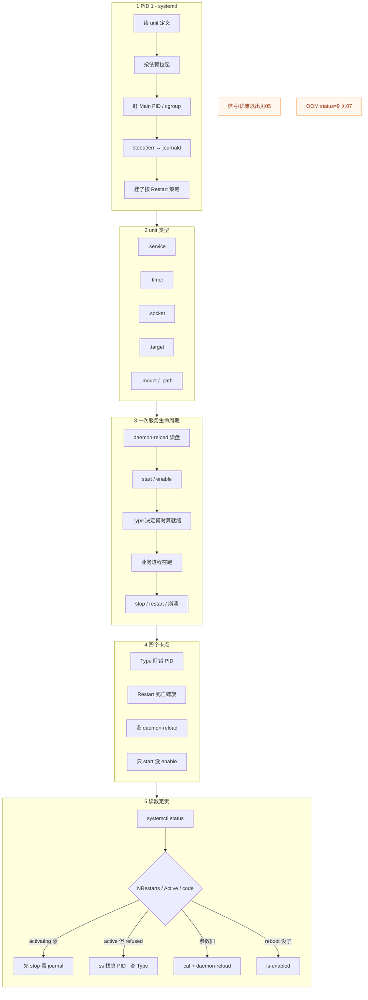
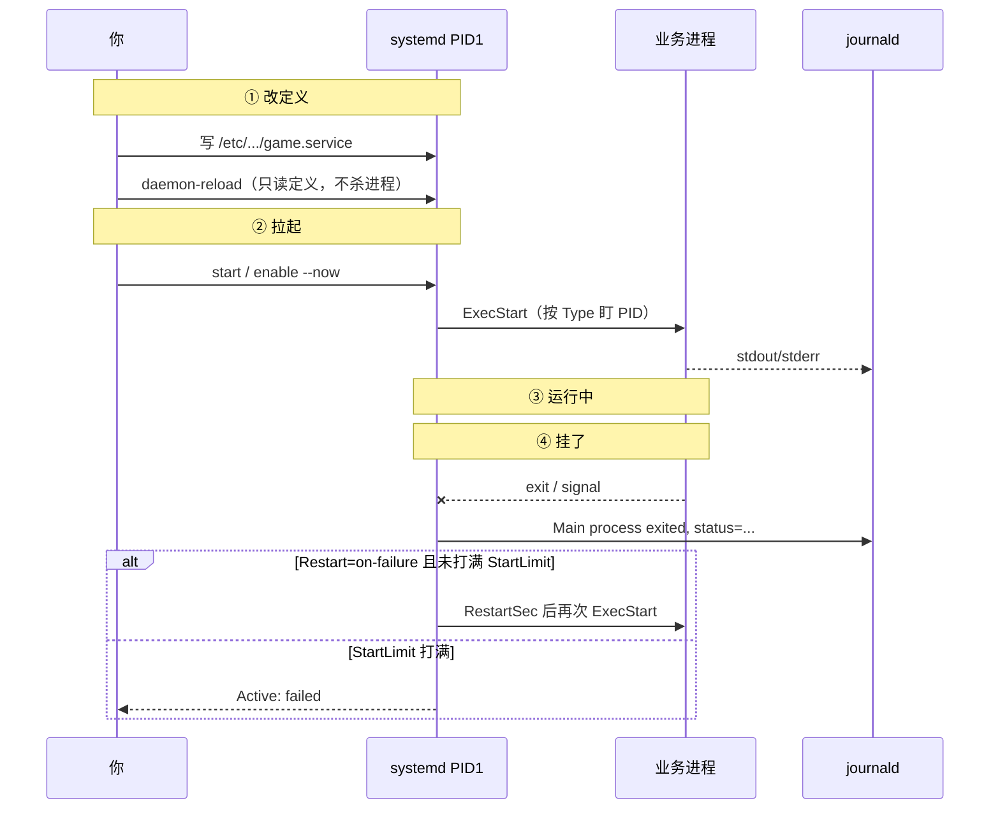
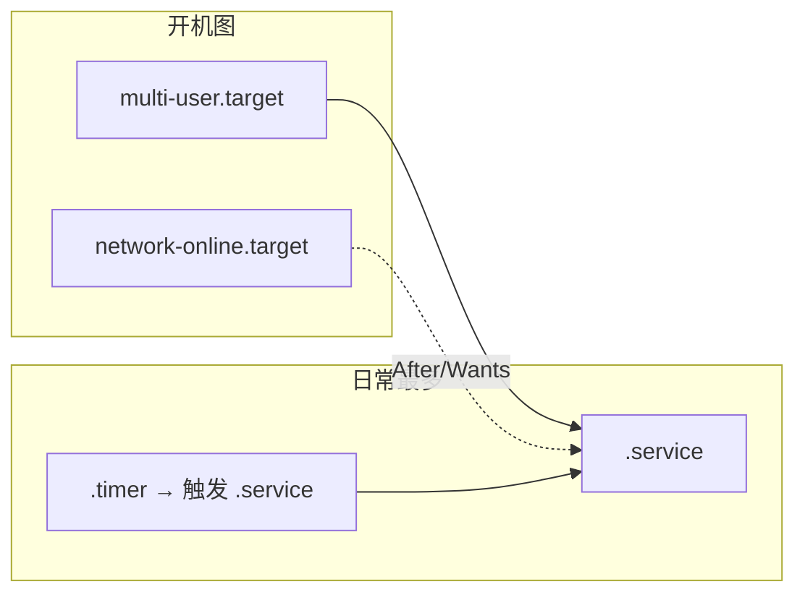
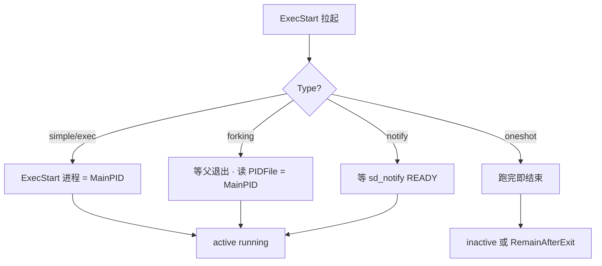
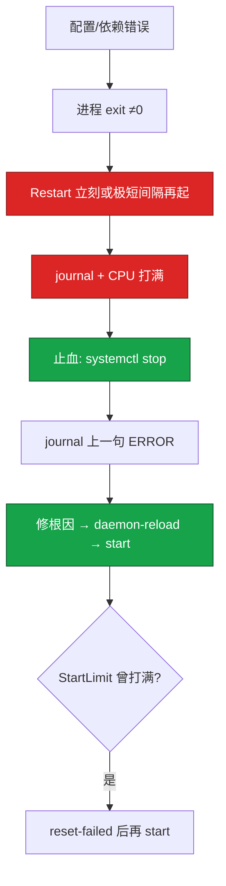
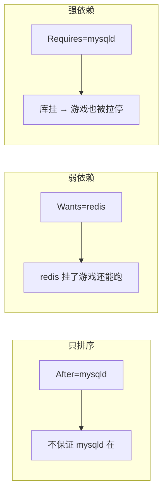
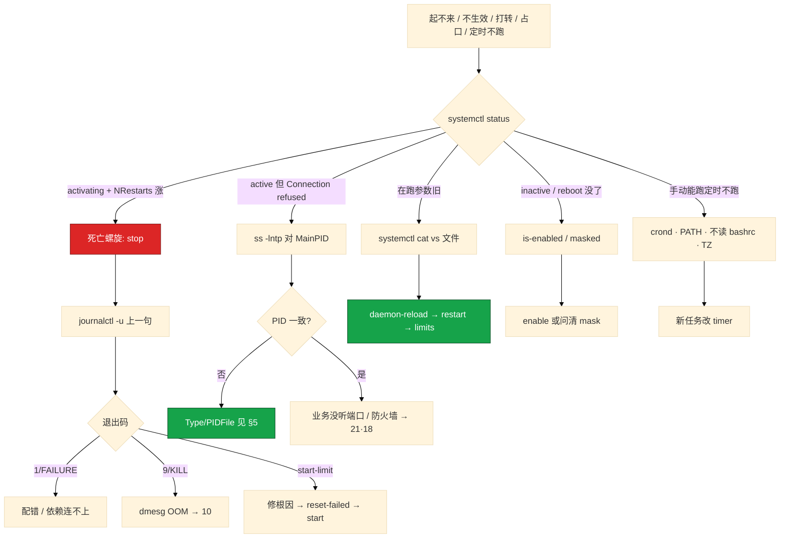

# Systemd 与服务管理

> **这章解决什么**：改了 unit 不生效、Connection refused 但 status 还 active、Restart 打转把 CPU/journal 打爆、reboot 后服务没了——卡在 **PID 1 怎么管进程**，不是业务代码。  
> **读法**：**先看总图** → **再认名词** → **再分节抠 Type / Restart / journal / 依赖**。  
> **刻意不展开**：kill / 优雅退出 / 僵尸 → [05 进程与信号](../05-进程与信号/)；OOM / status=9 → [07 内存与OOM](../07-内存与OOM/)；fd 上限与 sysctl → [24 内核参数与sysctl](../24-内核参数与sysctl/)；journal 打满盘、轮转策略 → [23 日志运维](../23-日志运维/)；时区 / NTP /「2 点没跑」时间侧 → [25 NTP与时间同步](../25-NTP与时间同步/)；Nginx reload 细节 → [19 Nginx](../19-Nginx/)。

---

## 本章目录

1. [本章定位](#1-本章定位)
2. [先看总图：PID 1 怎么管服务](#2-先看总图pid-1-怎么管服务) ← **开篇必读**
   - [2.0 全章知识串图](#20-全章知识串图一张把细节串起来) ← **架构总览**
   - [2.3 完整走读](#23-完整走读逻辑服从写-unit-到崩溃打转)
3. [名词扫盲（对照总图认词）](#3-名词扫盲对照总图认词)
4. [Unit 类型与落地路径](#4-unit-类型与落地路径)
5. [Type=forking 陷阱：本章最易混](#5-typeforking-陷阱本章最易混) ← **重点精读**
6. [Restart= 与死亡螺旋](#6-restart-与死亡螺旋)
7. [After / Requires / Wants：依赖不是排序](#7-after--requires--wants依赖不是排序)
8. [journalctl：按 unit 读事故](#8-journalctl按-unit-读事故)
9. [LimitNOFILE / enable / Timer](#9-limitnofile--enable--timer)
10. [定责决策树与命令速查](#10-定责决策树与命令速查)
11. [去哪章继续学](#11-去哪章继续学)
12. [面试 · 易错 · 数字](#12-面试--易错--数字)
13. [合上书](#合上书)

---

## 1. 本章定位

| 章 | 负责 |
|----|------|
| **05** | 信号、优雅退出、僵尸——进程自己怎么死 |
| **11（本章）** | PID 1、unit、Type、Restart、journal、依赖、开机自启 |
| **24 / 23 / 25** | sysctl fd、journal 盘满、时间/时区 |

本章是**本机服务生命周期入口**。后面所有「改了不生效」「打转」「占口」都建立在「systemd 盯的是哪个 PID、按什么策略拉起」这张图上。

🎯 **值班签名**：进程「在」但连不上、或 NRestarts 在涨——先 `systemctl status` + `ss -lntp` + `journalctl -u`，**别先改业务代码或 RestartSec=0**。

---

## 2. 先看总图：PID 1 怎么管服务

> **正确开篇顺序**：先有全局画面，再认词，再抠细节。  
> 先看 **§2.0 全章串图**（考点挂一张板上），再看 **§2.1 生命周期**，再用 **§2.3 走读**把一次事故串起来。

### 2.0 全章知识串图（一张把细节串起来）

> 🎯 **合上书要能默画这张。** 蓝=PID1 · 紫=unit · 绿=进程侧 · 橙=卡点/螺旋。  
> 若预览仍报错，以下面 **ASCII 一页板** 为准。



**ASCII 一页板（兜底）：**

```text
┌─ PID 1 systemd ──────────────────────────────────────────────┐
│  读 unit → 按依赖拉起 → 盯 MainPID/cgroup → journal → Restart │
└──────────────────────────────────────────────────────────────┘
         │
┌─ unit 类型 ──────────────────────────────────────────────────┐
│  .service 拉进程 · .timer 定时 · .socket 按需 · .target 组    │
│  路径：/etc/systemd/system/ 你的 ｜ drop-in = systemctl edit   │
└──────────────────────────────────────────────────────────────┘
         │
┌─ 生命周期（改了必须走完）────────────────────────────────────┐
│  改文件 → daemon-reload → restart → /proc/PID/limits 验收     │
│  enable 才开机 · start 只当前 · mask = 指到 /dev/null         │
└──────────────────────────────────────────────────────────────┘
         │
┌─ 四个卡点 → 第一刀 ──────────────────────────────────────────┐
│  Type 盯错 → ss -lntp ｜ 螺旋 → stop+journal                  │
│  不生效 → daemon-reload ｜ reboot 没了 → is-enabled           │
└──────────────────────────────────────────────────────────────┘
```

**读图路线：**

| 段 | 记住 |
|----|------|
| ① | PID 1 管生命周期，不管业务怎么算（§2.1） |
| ② | 先认 unit 类型与落地路径（§4） |
| ③ | Type 决定「什么时候算起来了」（§5） |
| ④ | Restart / 依赖 / journal 是日常排障三件套（§6～§8） |
| ⑤ | 定责树：现象 → 先做 → 别做（§10） |

**读图三句话：**

1. **systemd 盯的是 Main PID（或 PIDFile）**，不是「端口上有没有人」。  
2. **改磁盘上的 unit ≠ 内存里的定义已更新**——少一步 daemon-reload，参数永远旧。  
3. **Restart 是双刃剑**：能救瞬时故障，也能把配错打成死亡螺旋。

---

### 2.1 服务生命周期（合上书要默画）



| 阶段 | 干什么 | 值班里怎么碰到 |
|------|--------|----------------|
| 读定义 | daemon-reload 把盘上的 unit 读进内存 | 改了 LimitNOFILE，limits 仍旧 |
| 拉起 | start；Type 决定何时算 active | Connection refused 但 active |
| 运行 | 盯 MainPID；日志进 journal | status 看 Active / NRestarts |
| 挂了 | 按 Restart= 决定要不要再拉 | activating (auto-restart) 空转 |
| 开机 | enable 链到 target | reboot 后服务没了 |

> **记住**：`daemon-reload` **不会**重启进程；`restart` 才用新定义拉进程。两个都要做。

---

### 2.2 在整机里 systemd 站哪

```text
硬件 / 内核
    ↓
【本章】systemd（PID 1）
    · 解析 unit、拉依赖、盯进程、收 journal
    · 挂 cgroup（配额细节见 10）
    ↓
业务进程（逻辑服 / nginx / 备份脚本）
    · 信号、优雅退出 → 05
    · Socket / 队列满 → 12
    · OOM → 07
```

🎯 **进程「在」但业务不对**：先确认是不是 systemd 盯错了人（Type），再查业务。

---

### 2.3 完整走读：逻辑服从写 unit 到崩溃打转

> 用一条真实路径把考点串一遍。**只保留这一版走读**。

**角色**：运维 · 机器 `logic-01` · 服务 `game-server.service` · 依赖 Redis（弱）+ 网络

#### 步骤 1：写最低配 unit 并落地

```ini
# /etc/systemd/system/game-server.service
[Unit]
Description=Game Server
After=network-online.target
Wants=network-online.target
Wants=redis.service

[Service]
Type=simple
ExecStart=/opt/game/bin/server --config=/etc/game.conf
Restart=on-failure
RestartSec=5
StartLimitBurst=5
StartLimitIntervalSec=60
User=game
WorkingDirectory=/opt/game
LimitNOFILE=1048576

[Install]
WantedBy=multi-user.target
```

```bash
systemctl daemon-reload
systemctl enable --now game-server
systemctl status game-server
cat /proc/$(systemctl show -p MainPID --value game-server)/limits | grep 'open files'
```

- `enable --now` = 开机自启 + 立刻 start。  
- limits 验收必须对上 **1048576**，否则 LimitNOFILE 没生效（§9）。

#### 步骤 2：有人改错配置路径（死亡螺旋）

误把 `ExecStart` 里配置改成不存在的路径，只 `restart` 没仔细看：

```text
● game-server.service - Game Server
   Active: activating (auto-restart) since ...
   Process: 28451 ExecStart=... (code=exited, status=1/FAILURE)
   NRestarts: 847

game-server[28451]: ERROR: config file not found: /etc/game/wrong.conf
game-server.service: Scheduled restart job, restart counter is at 847.
```

- **读数**：status=1 → 应用自己 exit；NRestarts 涨 → 螺旋。  
- **止血**：`systemctl stop game-server`（先停，别 RestartSec=0）。  
- **再查**：`journalctl -u game-server -n 50 --no-pager` 看上一句 ERROR。  
- **再修**：改回路径 → daemon-reload → start（§6）。

#### 步骤 3：老守护进程 Type 配错（占口）

另一台把老式会 fork 的进程写成 `Type=simple`：

```text
systemctl status → Active: active (running)，Main PID: 12345
ss -lntp | grep :9000 → 监听的是 pid=12340
# 12345 已退出或不是真服务；systemd 可能 Restart 杀真进程，或留下 Address already in use
```

- **定责**：Type 盯错 PID（§5），不是「端口被莫名占用」。  
- **修法**：真 fork → `Type=forking` + `PIDFile=`；现代进程优先 `simple`/`notify`。

#### 步骤 4：第二天 reboot，服务没了

发版窗口只 `systemctl start`，没 `enable`：

```bash
systemctl is-enabled game-server
# disabled
```

- start = 当前这次；enable = 链到 `multi-user.target`。  
- 发版验收要 reboot 演练一次（§9）。

#### 步骤 5：正常停服 vs 被系统杀

| 情况 | status 长什么样 | 下一刀 |
|------|-----------------|--------|
| 应用 exit 1 | `code=exited, status=1/FAILURE` | journal 上一句 ERROR |
| OOM / kill -9 | `code=killed, status=9/KILL` | `dmesg` / 04 |
| StartLimit 打满 | `Active: failed`，不再拉 | 先修根因，再 `reset-failed` + start |
| 你主动 stop | inactive (dead) | 正常 |

---

## 3. 名词扫盲（对照总图认词）

| 名词 | 一句话 | 对照总图 |
|------|--------|----------|
| **PID 1 / systemd** | 用户态管家：拉起、盯、重启、收日志 | §2.0 ① |
| **unit** | 一份声明式说明书（.service / .timer …） | §2.0 ② |
| **drop-in** | `foo.service.d/*.conf` 增量覆盖，不改厂商原文件 | 落地路径 |
| **daemon-reload** | 重新读 unit 定义进内存，**不**重启进程 | 生命周期 ① |
| **Main PID** | systemd 认为的「主进程」 | Type 盯谁 |
| **Type=** | 告诉 systemd 何时算就绪、盯哪个 PID | §5 |
| **PIDFile=** | forking 时读文件拿真主进程 PID | §5 |
| **Restart=** | 退出后要不要再拉、什么情况再拉 | §6 |
| **RestartSec=** | 两次拉起之间的间隔 | 螺旋油门 |
| **StartLimit\*** | 时间窗内最多拉几次，打满进 failed | 闸门 |
| **After=** | 只排序，不保证对方在 | §7 |
| **Requires= / Wants=** | 强/弱依赖 | §7 |
| **journald** | 收 stdout/stderr 与 systemd 自己的事件 | §8 |
| **Storage=persistent** | journal 落盘，reboot 不丢启动前日志 | §8 |
| **enable / start** | 开机链 vs 当前拉起 | §9 |
| **mask** | 指到 `/dev/null`，start/enable 都无效 | §9 |
| **LimitNOFILE** | unit 里设的进程 fd 上限 | §9 |
| **timer** | 用 unit 做定时，替代部分 cron | §9 |

> **记住**：生产不要用 `nohup ./start.sh &` 当 pid 1——没有统一 status、没有 Restart 闸门、没有 journal 对齐。

---

## 4. Unit 类型与落地路径

### 4.1 常见 unit 类型

**一句话：** 日常 90% 是 `.service` + `.timer`；`.target` 是「一组 unit」；`.socket` 是按需拉起。

| 后缀 | 干什么 | 值班里怎么碰到 |
|------|--------|----------------|
| **.service** | 跑一个（或一组）进程 | 逻辑服、nginx、agent |
| **.timer** | 到点触发某个 .service | 备份、清理、对账 |
| **.socket** | 先听 socket，有连接再拉 service | 按需启动、socket activation |
| **.target** | 同步点 / 组（类似 runlevel） | `multi-user.target`、`network-online.target` |
| **.mount** | 挂载点声明 | 开机挂数据盘 |
| **.path** | 路径变化触发 | 目录来文件再跑任务 |
| **.slice** | cgroup 资源切片 | 和 07 cgroup 交叉 |



> **别混**：`.timer` 本身不跑业务脚本——它触发配对的 `.service`（通常 `Type=oneshot`）。

### 4.2 落地路径：谁覆盖谁

| 路径 | 谁写 | 优先级直觉 |
|------|------|------------|
| `/usr/lib/systemd/system/` | 厂商包 | 别直接改 |
| `/etc/systemd/system/` | **你的**完整 unit | 覆盖同名厂商 unit |
| `/etc/systemd/system/foo.service.d/*.conf` | drop-in | **推荐**调参方式 |
| `/run/systemd/system/` | 运行时临时 | reboot 没了 |

```bash
# 看合并后的最终定义（含 drop-in）
systemctl cat game-server

# 推荐改法：drop-in，不碰厂商原文件
systemctl edit game-server
# → /etc/systemd/system/game-server.service.d/override.conf
```

```ini
# drop-in 示例：只改 Restart 和 LimitNOFILE
[Service]
Restart=on-failure
RestartSec=5
LimitNOFILE=1048576
```

**读图两句话：**

1. **调厂商包用 drop-in**；自己写的服务可以直接放 `/etc/systemd/system/`。  
2. **`systemctl cat` 才是真相**——磁盘上多个文件，内存里一份合并结果。

### 4.3 Unit 三段结构

| 段 | 写什么 |
|----|--------|
| `[Unit]` | Description、After/Requires/Wants、文档链接 |
| `[Service]` / `[Timer]` … | Type、Exec\*、Restart、Limit\*、User… |
| `[Install]` | WantedBy=…（enable 时链到哪个 target） |

没有 `[Install]` 也能 `start`，但 **`enable` 会失败或无意义**——开机不会自动拉。

### 4.4 `.socket` 激活（知道即可）

**一句话：** socket unit 先听端口，有流量再拉对应 `.service`——省常驻，排障时要两边一起看。

```text
foo.socket  →  ListenStream=9000
foo.service →  被 socket 激活；常配合 Accept= 或服务自己 accept
```

| 现场 | 先查 |
|------|------|
| 端口在听、进程不在 | 正常：还没来连接；或 service 拉起失败 |
| 改了 service 不生效 | 两边都要 daemon-reload；看 `systemctl status foo.socket` |
| 想禁用按需拉起 | stop/disable **socket**，不只停 service |

游戏逻辑服一般 **常驻 `.service`**，少用 socket activation；网关/工具类偶见。

### 4.5 环境与工作目录（和 cron 同一类坑）

systemd 服务 **不是 login shell**：不读 `~/.bashrc`，默认 PATH 很短，相对路径相对的是 `WorkingDirectory=`（未设则看 unit 默认）。

```ini
[Service]
WorkingDirectory=/opt/game
Environment=NODE_ENV=production
Environment=LD_LIBRARY_PATH=/opt/game/lib
# 或 EnvironmentFile=/etc/game/env
ExecStart=/opt/game/bin/server --config=/etc/game.conf
```

| 坑 | 表现 | 修法 |
|----|------|------|
| 相对路径 | 找不到 conf / so | 绝对路径或设 WorkingDirectory |
| 依赖 bashrc 里的变量 | 手动能跑、unit 起不来 | Environment= / EnvironmentFile= |
| PATH 短 | `ExecStart=java ...` not found | 写绝对路径 |
| 用户家目录假设 | 读不到 `~/.game` | 显式路径；User= 后 `$HOME` 行为要验证 |

> **记住**：unit 里把路径和环境写死，不要假设「和我 ssh 上去一样」。

---

## 5. Type=forking 陷阱：本章最易混

> 🎯 **全章最易晕的一点单独钉死。** FAQ 只在这里写透；别处「见 §5」。

### 5.1 一例钉死

① **最常见现场**（服务端）：老 nginx / 老游戏守护进程会 `fork` 后父进程退出。unit 写成 `Type=simple`。  
② **一句话定义**：Type 告诉 systemd「**哪个 PID 是主进程、何时算就绪**」。  
③ **对照命令怎么认**：

```bash
systemctl status nginx
ss -lntp | grep :80
systemctl cat nginx | grep -E '^Type=|^PIDFile=|^ExecStart='
ps -o pid,ppid,cmd -p $(systemctl show -p MainPID --value nginx)
```

```text
● nginx.service
   Active: active (running)
   Main PID: 12345 (nginx)          ← systemd 盯的人

# ss -lntp
LISTEN ... :80 ... users:(("nginx",pid=12340,fd=6))   ← 真监听的人

# 两者不一致 → Type 配错或 PIDFile 过期
```

④ **易错一句钉死**：`Active: active` **只说明 systemd 认为主进程还在**，不等于端口上的就是它盯的那个 PID。

### 5.2 Type 对照表

| Type | systemd 怎么认「起来了」 | 什么时候用 |
|------|--------------------------|------------|
| **simple** | `ExecStart` 那个进程就是主进程；一 fork 出来就算启动成功 | **现代前台进程，最常用** |
| **exec** | 类似 simple，但等 `execve` 成功才算启动（路径错会立刻失败） | 想更早发现 ExecStart 写错 |
| **forking** | 父进程退出 = 就绪；主进程从 **PIDFile**（或启发式）拿 | **真会 daemonize 的老程序** |
| **notify** | 进程调用 `sd_notify(READY=1)` 才算就绪 | 要「真就绪」再放依赖/流量 |
| **oneshot** | 跑完就结束；可配 `RemainAfterExit=yes` | 初始化、备份脚本、timer 触发的任务 |
| **idle** | 等其他作业空闲再跑 | 极少用 |
| **dbus** | 出现指定 D-Bus 名才算就绪 | 桌面/系统组件 |



### 5.3 forking × simple：现场会怎样

| 配错 | 现象 | 根因 |
|------|------|------|
| 真 fork，写成 **simple** | MainPID 是已退出的父进程；systemd 以为挂了 → Restart；或留下旧子进程占口 | 盯错人 |
| 不会 fork，写成 **forking** | 一直卡在 activating / 超时失败 | 等不到「父退出」或 PIDFile |
| forking 但 **PIDFile 错/过期** | 盯到错误 PID；停服杀错进程 | PIDFile 路径或权限 |
| **simple ≠ 业务就绪** | 进程在、还在连库/预热，依赖方已开始连 | 要就绪用 notify 或应用自检 |

**典型输出链（占口）：**

```text
1) systemctl restart nginx
2) Job 失败或立刻又 restart
3) ss -lntp → :80 仍被旧 PID 占着
4) journal: Address already in use / start-limit
```

**修法顺序：**

1. `systemctl stop nginx`（必要时 `ss` 确认旧 PID，交叉 [05](../05-进程与信号/) 再决定杀不杀）。  
2. 确认程序是否真 daemonize。  
3. 真 fork：`Type=forking` + 正确 `PIDFile=`。  
4. 能改成前台跑：优先 `Type=simple`（或 `notify`），少用 forking。  
5. `daemon-reload` → `start` → `ss -lntp` 对 MainPID。

> **记住**：游戏逻辑服默认 **Type=simple**；只有确认「父退出、子留守」才 forking。  
> **别混**：进程起来 ≠ 业务就绪——simple 更是如此；要准确就绪用 **notify**。

### 5.4 notify 与「假就绪」

- **simple**：进程一创建就 active——可能还在读配置、连 MySQL。  
- **notify**：应用显式 `READY=1` 后再被依赖方当成「好了」。  
- 应用不调 notify、却写成 Type=notify → 启动超时失败。

**面试怎么说**：「forking 配成 simple 会盯错 PID，父退出后 Restart 或 Address already in use；先 ss 对 MainPID，再改 Type/PIDFile。」

### 5.5 KillMode / 停服杀谁

停服时 systemd 默认会清 **整个 cgroup** 里的进程，不只 MainPID。

| KillMode= | 行为 | 备注 |
|-----------|------|------|
| control-group（默认） | 杀控制组内所有 | 一般正确 |
| process | 只杀 MainPID | 子进程可能残留占口 |
| mixed | 主进程 SIGTERM，其余 SIGKILL | 折中 |
| none | 不杀 | 极少用，易留尸 |

forking 配错 + KillMode 不当 → stop 后端口仍被孤儿占着。交叉 [05](../05-进程与信号/)：优雅退出优先 ExecStop，不要只靠 SIGKILL。

```ini
[Service]
ExecStop=/opt/game/bin/server-stop
TimeoutStopSec=30
# 超时后再走 KillSignal；细节见 05
```

---

## 6. Restart= 与死亡螺旋

### 6.1 策略怎么选

**一句话：** 逻辑服默认 **on-failure + RestartSec=5 + StartLimit**；不要 always + 0。

| Restart= | 何时再拉 | 生产 |
|----------|----------|------|
| **no** | 不自动拉 | oneshot / 手动任务 |
| on-success | 只有正常退出才拉 | 几乎不用在逻辑服 |
| **on-failure** | 非 0、信号、超时等异常 | **默认推荐** |
| on-abnormal | 信号/超时，**不含** exit 1 | 比 on-failure 窄 |
| on-abort | 仅未捕获信号类 | 更窄 |
| on-watchdog | watchdog 超时 | 要应用喂狗 |
| **always** | 正常退出也拉 | 配错/ExecStart 写错会空转 |

```ini
[Service]
Restart=on-failure
RestartSec=5
StartLimitBurst=5
StartLimitIntervalSec=60
# 较新版本也可写在 [Unit]：StartLimitIntervalSec= / StartLimitBurst=
```

### 6.2 死亡螺旋：一例钉死

① **例子**：配置路径写错，进程秒退；`Restart=always` 或 `RestartSec=0`。  
② **定义**：短时间内反复拉起失败进程，CPU 与 journal 一起爆，`NRestarts` 狂涨。  
③ **怎么认**：

```bash
systemctl status game-server
# Active: activating (auto-restart)
# NRestarts: 847
journalctl -u game-server -n 20 --no-pager
```

④ **易错**：把 `RestartSec` 改成 0「好让它快点起来」——螺旋转得更快。



| 闸门 | 作用 |
|------|------|
| RestartSec=5 | 给根因排查留空隙，降低空转密度 |
| StartLimitBurst=5 | 窗口内最多拉 5 次 |
| StartLimitIntervalSec=60 | 与 Burst 组成时间窗 |
| 打满后 | 进入 **failed**，不再拉——**不是修好了** |

> **记住**：打转先 **stop**，再 journal；`reset-failed` 前必须先修根因。  
> **别混**：`status=9/KILL` → 先 dmesg/OOM（04）；`status=1` → journal 里应用 ERROR。

### 6.3 always 的「特性」坑

- 有人故意 `Restart=always`，结果运维 `systemctl stop` 后被策略拉回——取决于 stop 如何实现与版本行为，**逻辑服更稳妥用 on-failure**。  
- 正常滚动升级若依赖「进程自己 exit 0 结束」，always 会把旧进程又拉起来——和发布脚本打架。

**面试怎么说**：「螺旋先 stop 看 journal；Restart 用 on-failure 不是 always；RestartSec=0 会更快空转；StartLimit 是闸门。」

---

## 7. After / Requires / Wants：依赖不是排序

### 7.1 三件事拆开

**一句话：** After 只排序；Requires/Wants 才是依赖；「等 IP 就绪」用 **network-online.target**，不是 `network.target`。

| 指令 | 做什么 | 不做什么 |
|------|--------|----------|
| **After=B** | A 在 B **之后**启动（若 B 也要启动） | 不拉 B、B 挂了 A 不一定挂 |
| **Before=B** | 对称的排序 | 不是依赖 |
| **Requires=B** | 强依赖：会拉 B；B 挂 A 也挂 | **不等于** B「业务就绪」 |
| **Wants=B** | 弱依赖：想拉 B；B 失败 A 仍可起 | 不强制共生死 |
| **Requisite=B** | 强依赖但**不主动**拉 B；B 必须已在 | 不会帮你 start B |
| **BindsTo=B** | 更强绑定（B 消失 A 停） | 慎用，故障面大 |
| **PartOf=B** | 随 B 的 stop/restart 联动 | 常见于附属单元 |



### 7.2 游戏服怎么配

```ini
[Unit]
After=network-online.target
Wants=network-online.target
Wants=redis.service
# Requires=mariadb.service   # 仅当「无库绝对不能跑」才开；会放大故障面
```

| 意图 | 写法 |
|------|------|
| 先有网再起 | `After=` + `Wants=network-online.target` |
| 缓存挂了游戏自重连 | `Wants=redis`，**不要** Requires |
| 无库就不能跑 | `After=` + `Requires=mariadb`（接受共死） |
| 只要顺序、对方已由别人拉起 | 可只 `After=`（仍不保证就绪） |

> **别混**：`After=mysqld.service` **不等于** mysqld 已经在跑，更不等于「已经能连上」。  
> **别混**：`network.target` ≈ 网络**管理栈**起来了；**IP/路由就绪**常用 `network-online.target`。

### 7.3 依赖 × Type：假就绪连锁

- A `Requires=B`，B 是 `Type=simple`：B 进程在、还在初始化，A 已经 start → A 连 B 失败。  
- 要「真就绪」：B 用 **notify**，或 A 自己重试，不要幻想 Requires 会等业务 ready。

**面试怎么说**：「After 只排序；缓存用 Wants+自重连；要等地址用 network-online；Requires 会放大故障面。」

---

## 8. journalctl：按 unit 读事故

### 8.1 为什么先 journal 而不是先翻应用日志目录

**一句话：** systemd 拉起的服务，stdout/stderr 和「谁在 restart」都在 journal；先 `status` 再 `-u` 时间窗。

```bash
systemctl status game-server          # Active / MainPID / 最近几行 / NRestarts
journalctl -u game-server -n 100 --no-pager
journalctl -u game-server -f          # 跟踪
journalctl -u game-server --since today
journalctl -u game-server --since "2026-08-30 18:00" --until "2026-08-30 19:00"
journalctl -u game-server -p err -n 50
journalctl -u game-server -b          # 本次启动
journalctl -u game-server -b -1       # 上次启动（需 persistent）
journalctl -p err                     # 全机错误级
journalctl --disk-usage
journalctl --vacuum-size=500M
journalctl --vacuum-time=7d
```

| 目的 | 命令 | 看什么 |
|------|------|--------|
| 是不是螺旋 | `status` | `activating` + NRestarts |
| 上一句业务错 | `journalctl -u -n 100` | ERROR / traceback |
| 退出码分流 | status 里 `code=` | 1→journal；9→dmesg |
| reboot 前 | `-b -1` | 要 Storage=persistent |
| 盘被打满 | `--disk-usage` / vacuum | 深策略见 23 |

### 8.2 持久化

```ini
# /etc/systemd/journald.conf
[Journal]
Storage=persistent
SystemMaxUse=2G
SystemMaxFileSize=200M
```

```bash
mkdir -p /var/log/journal
systemctl restart systemd-journald
# 或 kill -USR1 视版本；以发行版文档为准
```

| Storage | 行为 | 生产 |
|---------|------|------|
| volatile | 多在内存，reboot 丢 | 不适合要追启动前事故 |
| **persistent** | `/var/log/journal` | **推荐** |
| auto | 有目录才持久 | 确认目录在 |

> **记住**：reboot 后 journal「只有开机以后」——先查是不是没 persistent，再宣布「没日志」。  
> **别混**：应用自己写的 `/var/log/game/*.log` 和 journal 是两路；进程若是 nohup 拉的，journal `-u` 可能几乎为空。

### 8.3 和 status 退出码对齐

```text
# 应用自己错
Main process exited, code=exited, status=1/FAILURE
→ journal 上一句 ERROR

# 被信号杀
code=killed, status=9/KILL
→ dmesg | grep -i oom；见 07

# 闸门
start-limit-hit / Active: failed
→ 先修根因，再 reset-failed
```

**面试怎么说**：「先 status 看 NRestarts 和退出码；再 journalctl -u 时间窗；生产 Storage=persistent；9 去 dmesg，1 看 journal。」

---

## 9. LimitNOFILE / enable / Timer

### 9.1 LimitNOFILE：limits.conf 管不了 systemd 服务

**一句话：** 验收只看 `/proc/PID/limits`；改 unit 必须 daemon-reload + restart；不要迷信 infinity。

| 层 | 看哪里 | 备注 |
|----|--------|------|
| 整机 | `fs.file-max` | 所有进程总和 → 24 |
| 单进程硬顶 | `fs.nr_open` | LimitNOFILE 不能超过它 |
| **unit** | `LimitNOFILE=` | **软硬一起**；只写一数=软=硬 |
| pam/login | `/etc/security/limits.conf` | **对 systemd 服务无效** |
| 进程 | `cat /proc/PID/limits` | **唯一验收** |

```bash
# 改了仍旧？按顺序走完
systemctl cat game-server | grep LimitNOFILE
systemctl daemon-reload
systemctl restart game-server
cat /proc/$(systemctl show -p MainPID --value game-server)/limits | grep 'open files'
```

```text
# 反例：unit 写了 1048576，limits 仍 65536
Max open files    65536    65536    files
→ 没 daemon-reload，或写了 infinity 被落成 65536
```

> **记住**：游戏服显式 `LimitNOFILE=1048576`；limits 已对仍报 Too many open files → 查泄漏（06）或应用 setrlimit。

### 9.2 enable vs start vs mask

| 动作 | 影响现在 | 影响开机 |
|------|:--------:|:--------:|
| `start` | 是 | 否 |
| `stop` | 是 | 否 |
| `enable` | 否（除非 `--now`） | 是（链到 WantedBy） |
| `disable` | 否 | 否 |
| `enable --now` | 是 | 是 |
| `mask` | 无法 start | 无法 enable |
| `unmask` | 解除 mask | — |

```bash
systemctl is-enabled game-server
systemctl is-active game-server
ls -l /etc/systemd/system/multi-user.target.wants/ | grep game
```

发版窗口只 start、第二天 reboot 没了——**经典坑**。验收：`is-enabled` + 真正 reboot 一次。

mask 把 unit 指到 `/dev/null`。看到 masked：**先问是谁禁的**，不要对安全相关服务直接 unmask。

### 9.3 改文件生效三步（钉死）


| 只做了 | 结果 |
|--------|------|
| 只改文件 | 内存定义旧 |
| 只 daemon-reload | 进程仍旧参数跑 |
| 只 restart | 可能仍用内存旧定义 |
| reload（给进程） | **不是** daemon-reload；进程要支持才有用 |

> **别混**：`systemctl reload` ≠ `daemon-reload` ≠ 应用自己的热更。

### 9.4 Timer vs crontab

**新任务优先 timer**：统一 journal、`Persistent=true` 可补跑、`list-timers` 可清点。

```ini
# /etc/systemd/system/game-backup.service
[Unit]
Description=Game backup once

[Service]
Type=oneshot
ExecStart=/opt/scripts/backup.sh
User=backup
```

```ini
# /etc/systemd/system/game-backup.timer
[Unit]
Description=Run game backup daily

[Timer]
OnCalendar=*-*-* 02:00:00
Persistent=true
AccuracySec=1min

[Install]
WantedBy=timers.target
```

```bash
systemctl daemon-reload
systemctl enable --now game-backup.timer
systemctl list-timers --all
```

**crontab 手动能跑、定时不跑——先查环境，别先改业务：**

| 坑 | 表现 | 查 |
|----|------|-----|
| cron 服务停了 | 全部不跑 | `systemctl status crond` / `cron` |
| PATH 极短 | command not found | crontab 第一行写 PATH |
| 依赖 bashrc | 变量空 | 变量写进脚本或 crontab |
| 无 +x / CRLF | bad interpreter | `chmod +x`；`file` |
| 时区 | 「2 点没跑」 | 交叉 19 |
| 输出打满盘 | 磁盘满连锁 | 重定向到日志 |

```cron
PATH=/usr/local/sbin:/usr/local/bin:/usr/sbin:/usr/bin:/sbin:/bin
0 2 * * * /opt/scripts/backup.sh >> /var/log/backup.log 2>&1
```

> **记住**：cron **不读** bashrc；timer 的 `Persistent=true` 可在开机后补跑错过的点。

### 9.5 游戏服最低配 checklist

1. Type=simple（除非真 fork）  
2. User 非 root  
3. Restart=on-failure + RestartSec=5 + StartLimit  
4. LimitNOFILE 显式数字，limits 验收  
5. After/Wants=network-online.target  
6. 缓存 Wants + 自重连  
7. WorkingDirectory + Environment 写进 unit  
8. ExecStop 走优雅退出（02）  
9. drop-in 调参；Storage=persistent  
10. enable --now + reboot 演练  

---

## 10. 定责决策树与命令速查

### 10.1 决策树



### 10.2 现象 \| 先做 \| 别做

| 现象 | 先做 | 别做 |
|------|------|------|
| NRestarts 涨、CPU/journal 爆 | `stop` → journal | RestartSec=0、改 always「加快」 |
| 改 LimitNOFILE 仍旧 | daemon-reload；`/proc/PID/limits` | 改 limits.conf 以为能管服务 |
| Address already in use / refused 但 active | `ss -lntp` 对 Type | 盲 restart 再拉一份 |
| reboot 后没了 | `is-enabled` | 再 start 一次当修复 |
| journal reboot 后空 | Storage=persistent | 宣布没法查 |
| Requires 库，库挂游戏也挂 | 改 Wants + 自重连 | 无脑强依赖 |
| 定时不跑 | crond、绝对路径、PATH、TZ | 先改业务逻辑 |
| masked | 问谁禁的 | 直接 unmask 安全服务 |

### 10.3 命令速查

```bash
# 生命周期
systemctl start|stop|restart|reload game-server
systemctl status game-server
systemctl enable|disable|enable --now game-server
systemctl is-active|is-enabled game-server
systemctl daemon-reload
systemctl reset-failed game-server
systemctl mask|unmask game-server

# 观察
systemctl cat game-server
systemctl edit game-server
systemctl show game-server -p MainPID,NRestarts,Restart,FragmentPath
systemctl list-units --type=service --state=failed
systemctl list-timers --all
systemctl list-dependencies game-server

# journal
journalctl -u game-server -n 100 --no-pager
journalctl -u game-server -f
journalctl -u game-server -b -1
journalctl --disk-usage

# 验收
ss -lntp | grep :端口
cat /proc/PID/limits | grep 'open files'
```

值班第一刀固定顺序：

1. `systemctl status`  
2. `journalctl -u … -n 100`  
3. 需要时 `ss -lntp` / `list-units --failed` / `is-enabled`

---

## 11. 去哪章继续学

| 问题 | 去哪 |
|------|------|
| 信号、优雅退出、僵尸、杀错进程 | [05 进程与信号](../05-进程与信号/) |
| OOM、status=9 | [07 内存与OOM](../07-内存与OOM/) |
| cgroup 配额、容器里的资源 | [10 cgroup与容器](../10-cgroup与容器/) |
| 端口在谁手里、队列满 | [12 网络栈与Socket](../12-网络栈与Socket/) |
| Connection refused 深排障 | [16 网络排障与抓包](../16-网络排障与抓包/) |
| fs.file-max / nr_open | [24 内核参数与sysctl](../24-内核参数与sysctl/) |
| 时区、NTP、「2 点没跑」时间侧 | [25 NTP与时间同步](../25-NTP与时间同步/) |
| journal 盘满、轮转策略 | [23 日志运维](../23-日志运维/) |
| Nginx reload | [19 Nginx](../19-Nginx/) |
| 下一章文件系统 / inode | [09 文件系统与inode](../09-文件系统与inode/) |

---

## 12. 面试 · 易错 · 数字

### 对错表

| 说法 | 对错 | 口径 |
|------|:----:|------|
| nohup start.sh 当生产 pid 1 | 错 | 声明式 unit |
| 只 restart 不 daemon-reload | 错 | 内存仍是旧定义 |
| daemon-reload 会重启进程 | 错 | 只重新读定义 |
| After= 等于依赖已就绪 | 错 | 只排序 |
| Requires 缓存更稳 | 看场景 | 通常 Wants + 自重连 |
| Restart=always 更稳 | 错 | 配错变死亡螺旋 |
| RestartSec=0 好让它快点起来 | 错 | 螺旋更快 |
| Type=simple 配老 forking 守护进程 | 错 | 盯错 PID、占口 |
| simple 进程起来 = 业务就绪 | 错 | 可能还在连库；要 notify |
| enable 就是 start | 错 | enable 管开机 |
| limits.conf 能管 systemd 服务 | 错 | LimitNOFILE + /proc/PID/limits |
| LimitNOFILE=infinity 一定无限 | 错 | 部分版本落成 65536 |
| network.target = IP 已就绪 | 错 | 常用 network-online |
| cron 手动能跑所以环境一样 | 错 | 不读 bashrc，PATH 极短 |
| 新任务继续堆 crontab | 错 | 优先 timer |

### 数字（口算级）

| 项 | 常见值 |
|----|--------|
| RestartSec | **5s** |
| StartLimitBurst | **5** / Interval **60s** |
| LimitNOFILE（游戏服） | 显式 **1048576** |
| journal vacuum | **7d** 或 **500M** 量级（按盘） |
| OnCalendar 备份 | 如 `*-*-* 02:00:00` |

### 易混一对线

| A | B | 差在哪 |
|---|---|--------|
| reload | daemon-reload | 进程热更 vs 重读 unit |
| start | enable | 当前 vs 开机 |
| simple | forking | 盯 ExecStart vs 盯 PIDFile |
| After | Requires/Wants | 排序 vs 依赖 |
| on-failure | always | 异常才拉 vs 总是拉 |
| limits.conf | LimitNOFILE | pam vs unit |
| network.target | network-online.target | 栈起来 vs 地址就绪 |
| cron | timer | 环境空 vs journal+Persistent |

### 30 秒口述模板

> Systemd 是 PID 1，用 unit 声明式拉起进程。改 unit 必须 **daemon-reload 再 restart**，验收看 status 和 `/proc/PID/limits`。Type 选错会盯错 PID，forking 配成 simple 常见 Address already in use。Restart 用 **on-failure + RestartSec=5 + StartLimit**，打转先 stop 再 journal。依赖上 After 只排序，缓存用 Wants；日志用 `journalctl -u`，生产 Storage=persistent。

---

## 合上书

验收对齐：**默画 §2.0** + **故障能指到 §10 树**。

1. 默画：PID 1 → unit 类型 → 改文件三步 → 四个卡点（Type / 螺旋 / reload / enable）。  
2. Type=simple / forking / notify 怎么选？forking 配成 simple，`status` 和 `ss` 会怎样不一致？  
3. After / Requires / Wants 怎么配「先有网再起逻辑服」？为什么不要无脑 Requires 缓存？  
4. Restart=always 死亡螺旋怎么停？闸门参数是哪几个？RestartSec=0 为什么是错药？  
5. `journalctl -u` 常用时间窗怎么写？reboot 后日志没了先查什么？status=1 和 status=9 怎么分流？  
6. LimitNOFILE 改了不生效查哪？为什么 limits.conf 无效？infinity 有什么坑？  
7. enable 和 start？mask？crontab 手动能跑定时不跑先查什么？新任务为什么优先 timer？

七题都能口述，这一章就过了。下一章把文件系统剖开：inode 满、ext4/xfs、删了空间不释放 → [09 文件系统与inode](../09-文件系统与inode/)。
