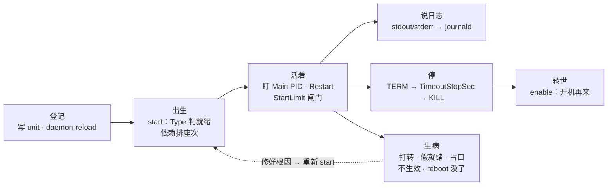
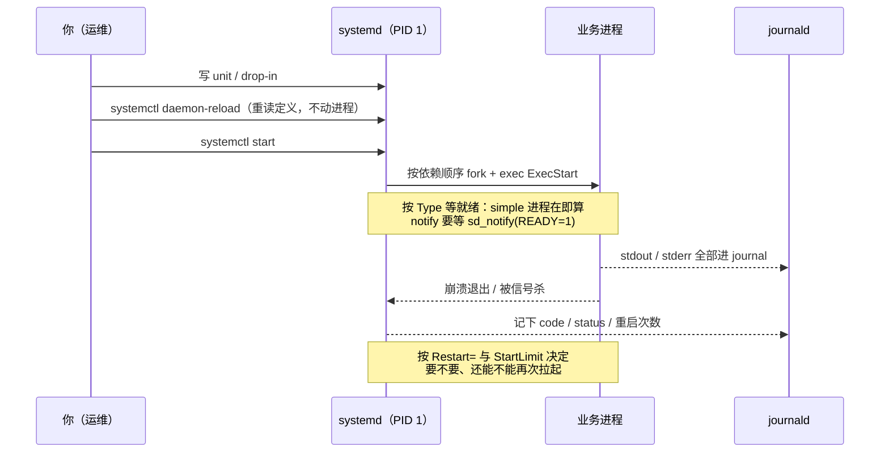
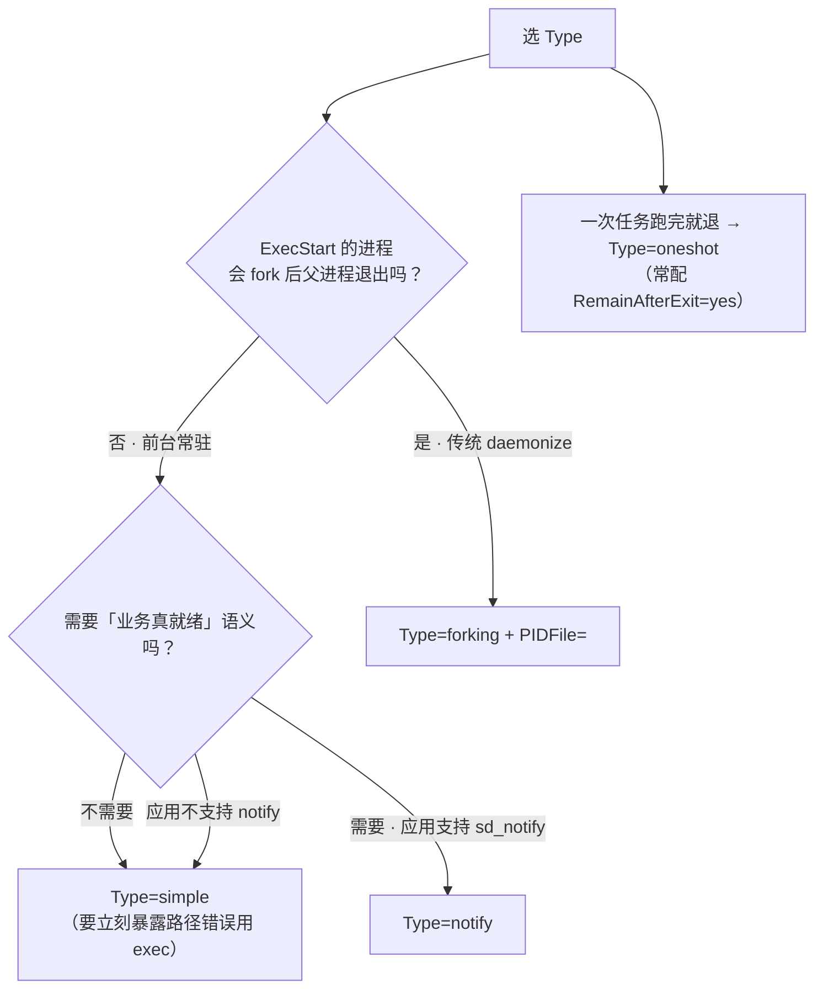
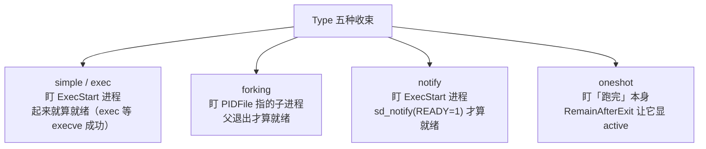
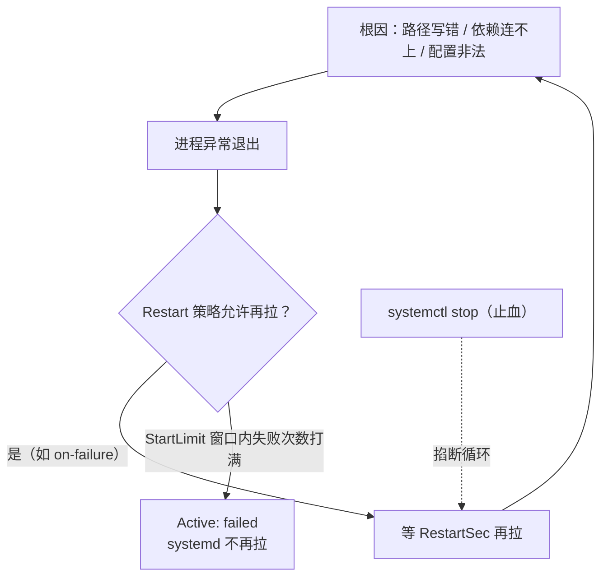
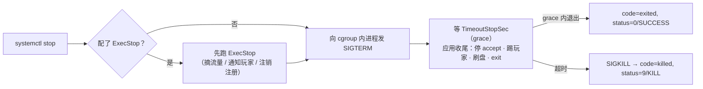
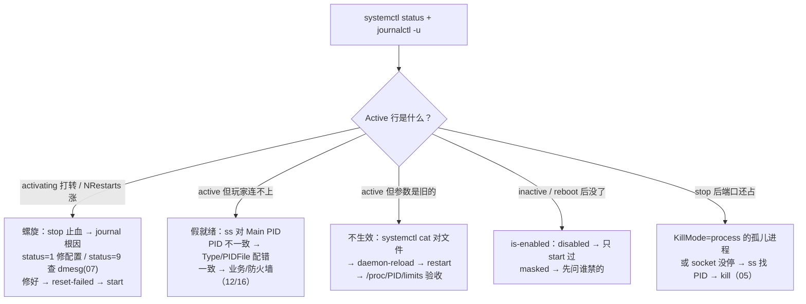

# Systemd 与服务管理

> 发版重启后 `systemctl status` 明明 active，玩家却 Connection refused；改了 `LimitNOFILE` 重启还是 65536；`Restart=always` 把写错的路径打成 CPU 与 journal 双爆——卡的都是 **systemd 盯的是谁、按哪份定义拉起**。
> **本章回答**：一个服务从「登记到 unit」到「被拉起、活着、说日志、停掉、开机再来」的一生，每一段会怎么坏、第一刀砍哪。
> **不讲**：TERM/KILL 与 PID 1 保护 → [05](../05-进程与信号/)；cgroup / slice 配额 → [10](../10-cgroup与容器/)；开机内核加载 → [04](../04-内核与系统/)；crontab 排障 → [30](../30-定时任务与Cron/)。

**标记**：🎯重点 · 🔥难点 · ⭐常考 · 🔧实操

---

## 一、一张图：一个服务的一生

> 🎯 **一句话**：你管理的不是进程，是这张图——systemd 替你盯 PID、收日志、管重启，前提是定义写对。



- 📖 **读图**
  - 🛤️ 左→右 = 一次发版完整路径：登记 → 出生 → 活着 → 说日志 / 停 → 转世
  - 🤒 下排「生病」不是新阶段，是上面任意一段坏了的样子；修好后回到「出生」重新 start
  - ⭐ 面试必考挂在「出生」和「生病」（练习题 Q1、Q4、Q8）

---

## 二、登记：unit 文件与落地路径

> 🎯 **一句话**：unit 是声明式说明书；systemd（PID 1）是唯一读它、照它办事的进程。

- 🍳 **大白话**：你写菜谱，systemd 炒菜——描述「要什么」，不描述「怎么拉」
- 🚫 **为什么不用 nohup**：崩了没人盯、status 无统一口径、日志散落 nohup.out

### 📂 unit 类型与落地四层 ⭐

- `.service`——业务进程本体（本章主角）
- `.target`——一组 unit 的集合点（如 `multi-user.target`），本身不跑进程
- `.timer`——到点触发一个 `.service`（见七）
- `.socket`——socket activation（本节末）
- `.mount` / `.path` / `.slice`——挂载、路径变化、cgroup 分层（`.slice` → [10](../10-cgroup与容器/)）

> ⚠️ **别混**：`.timer` 自己不跑业务，它只是闹钟；真正干活的是它 `Unit=` 指向的 `.service`。

同名优先级从高到低：

- `/etc/systemd/system/`——你自己的，最高
- `/run/systemd/system/`——运行时临时，reboot 即消失
- `/usr/lib/systemd/system/`——软件包带的（vendor）
- `foo.service.d/*.conf`——**drop-in 增量**：不整份覆盖 vendor，只覆盖你写的那几行
  - `systemctl edit foo` → `/etc/systemd/system/foo.service.d/override.conf`

🔧 排障永远用 `systemctl cat foo` 看「合并后的真相」；直接 `cat /usr/lib/...` 可能看到已被 drop-in 覆盖的旧值。改 vendor 用 drop-in，别直接改 `/usr/lib`——下次包升级会冲掉。

```bash
systemctl cat game-server
# ← 每个片段前标来源路径；出现 foo.service.d/override.conf = 有 drop-in 在生效
```

### 🧾 三段各答一问

```ini
[Unit]                          # 「我是谁、我等谁」
Description=Game Server
Wants=redis.service
After=network-online.target

[Service]                       # 「怎么跑、怎么算活着、怎么停」
Type=notify
ExecStart=/opt/game/bin/server
Restart=on-failure
TimeoutStopSec=90
LimitNOFILE=1048576
WorkingDirectory=/opt/game

[Install]                       # 「开机怎么带上我」
WantedBy=multi-user.target
```

- ⭐ 没写 `[Install]` → **能 start、不能 enable**（没有 `WantedBy=` 无处建链接）
- 🔍 「reboot 后服务没了」第一刀：看这段在不在

### 🔌 socket activation 与环境

- **socket activation**：systemd 先听端口（`ListenStream=9000`），连接来了再拉 `.service` 并把 fd 交出去
  - `ss` 看到端口在听、监听进程是 systemd——**正常**
  - 彻底停：连 `.socket` 一起 stop；只停 `.service` 还会被连接拉起

- 🔑 **环境不是 login shell**
  - 不读 `~/.bashrc`；默认 PATH 很短（常只有 `/usr/bin`）
  - 相对路径基于 `WorkingDirectory`；路径一律绝对路径
  - 变量用 `Environment=` / `EnvironmentFile=`
  - 「手动跑没事、做成服务找不到配置」九成是这一条

> 📝 **面试**：口诀 **「排障先 systemctl cat，改 vendor 用 drop-in」**（练习题 Q2）。

本节对应练习题 Q2。菜谱写好了——`start` 后 status 变 active，就真能接流量了吗？**错了**。

---

## 三、出生：start、Type 五种与依赖编排

> 🎯 **一句话**：start 不是「执行一条命令」——先按依赖排座次，再按 Type 等就绪；两步都可能给你假象。



- 📖 **读图**
  - ⚠️ 三处易出事：忘 `daemon-reload`（内存旧定义）、Type 判早了（假就绪）、Restart 没闸门（死亡螺旋，见四）
  - 纵轴是「谁对谁做」——分清 systemd 的事还是进程的事，答案就出来一半

### 🔄 daemon-reload：两本账

> 💡 **打个比方**：unit 文件是菜谱，systemd 内存里那份是正在炒的菜。`daemon-reload` = 收进新菜谱（锅里的菜没变）；`restart` = 倒掉重炒。

#### ❓ 为什么改了 unit 只 restart 不够？

- ❌ 只 `restart`：systemd 仍按**内存里旧定义**拉起
- ❌ 只 `daemon-reload`：定义新了，**进程还带着旧参数在跑**（不杀进程）
- ✅ 完整链：`改文件 → daemon-reload → restart → 验收`（见八）

### Type 五种：盯谁、何时算就绪 ⭐

systemd 对每个服务要回答两问：**主进程是谁（盯谁）**、**什么时候算 active（就绪）**。

- **`simple`**（默认）——ExecStart 进程本身是主进程，进程一创建就算 active。**只保证进程在，不保证业务能用**
- **`exec`**——同 simple，但等到 execve 成功才转 active（路径错、无执行权限立刻失败）
- **`forking`**——传统 daemonize：父退出算就绪，主 PID 从 `PIDFile=` 读
- **`notify`**——盯 ExecStart 进程，等 `sd_notify(3)` 发 `READY=1` 才算就绪。「业务真就绪」标准答案
- **`oneshot`**——跑完就退（脚本/备份），常配 `RemainAfterExit=yes`，与 timer 配对（见七）

（另有 `idle` / `dbus`，游戏服几乎不用。）



- 📖 **读图**：入口两问——进程模型（fork 不 fork）定盯谁；就绪语义（要不要等 READY）定 active 含金量。任一对错 → 占口或假就绪。

> ⚠️ **别混（Type 五种，只记这一组）**：`simple` =「人进屋就算到齐」，`notify` =「到前台报到才算」。不会 fork 却写 `forking` → 卡 activating 超时；不调 sd_notify 却写 `notify` → 等不到 `READY=1` 同样超时。

🔥 **forking × simple 配错**是事故高发区：

| 对比 | **Type=simple（或 notify）** | **Type=forking + PIDFile=** |
|------|------------------------------|------------------------------|
| 盯谁 | ExecStart 进程本身 | fork 后子进程（从 PIDFile 读） |
| 何时算就绪 | 进程创建（notify 加等 READY=1） | 父退出且 PIDFile 出现 |
| 配错现象 | 盯已退出的父 → 乱 Restart、误判健康 | 卡 activating；PIDFile 过期 → 杀错人 |
| 适用 | 现代前台程序（首选） | 真会 daemonize 的老程序 |

🔧 现场认法：`systemctl status` 的 Main PID 和真正监听端口的进程对不上 = Type 盯错了：

```bash
systemctl status legacy-gamed
ss -lntp | grep :9000
```

```text
● legacy-gamed.service
   Active: active (running)
   Main PID: 12345 (legacy-gamed)                      ← systemd 盯的人
LISTEN 0 128  0.0.0.0:9000  users:(("legacy-gamed",pid=12340,fd=6))
# ← 真正监听的是 12340，不是 12345：Type 盯错了
```

> 🔍 **现场**：Main PID 与 ss 监听 pid **必须一致**；不一致先怀疑 Type/PIDFile，别急着 kill。

修法：`stop` → 确认是否真 daemonize → 前台改 `simple`/`notify`，daemonize 配 `forking`+`PIDFile=` → `daemon-reload` → `start` → 再用 `ss` 对一遍。

### 假就绪：进程起来 ≠ 玩家能连

🔥 `Type=simple` 的 active 只说明进程活着——端口可能还没 bind。`game-gateway` 写了 `Requires=game-logic.service`，而 logic 是 simple → systemd 认为 logic「就绪」瞬间放行 gateway → connection refused。**要「拉起顺序 = 可用顺序」，被依赖方必须是 `notify`**（或下游自重连）。

> 💡 **打个比方**：simple 的「开业」是店门开了；notify 的「开业」是收银机也开好了——门口都挂「营业中」，前一种顾客进来可能要干等。

#### ❓ 为什么依赖指令不能当「就绪」用？

- `After=` / `Before=`——**只排序，不拉人，也不保证对方就绪**
- `Wants=`——弱依赖：试着拉，失败不追究；对方挂了我照常跑
- `Requires=`——强依赖：拉人且连坐（对方死我也停）——故障面放大
- `Requisite=`——对方必须在跑我才起，但我不主动拉
- `BindsTo=` / `PartOf=`——更紧的共死 / 跟随联动，慎用

| 对比 | **Wants=（弱依赖）** | **Requires=（强依赖）** |
|------|----------------------|-------------------------|
| 会不会拉对方 | 会试着拉，失败不追究 | 一定会拉 |
| 对方挂了呢 | 我照常跑（自己重连） | 我也被停——故障面放大 |
| 游戏服典型 | `Wants=redis.service` + 应用自重连 | 只给「没它绝对不能跑」的（如主 DB） |

> ⚠️ **别混**：`network.target` ≈「网络栈初始化动作完成」，几乎 ≠「能连网」；真要等地址，配 `After=`+`Wants=network-online.target`。

游戏服标准配法——**弱依赖 + 应用自重连**：

```ini
[Unit]
Wants=network-online.target
After=network-online.target
Wants=redis.service
```

### 收束：systemd 凭什么说「这个服务活了」



- 📖 **读图**：按「盯谁 + 何时算就绪」分组——simple/notify 同人不同就绪标准；forking 换人盯；oneshot 没有「活着」。依赖只决定**先后和连坐**，对就绪含金量零贡献。

> ⚠️ **别混**：任何 Type 都不保证「玩家请求能被处理」——仍要用 `ss` 和日志验收。

> 📝 **面试**：问「进程起来等于服务就绪吗」——「simple 只保证进程在，notify 才有应用举手的真就绪」；补「After 只管先后，Requires 只管连坐」。口诀：**「active ≠ 能接流量；simple 假开业，notify 真开业」**（练习题 Q4、Q6）。

本节对应练习题 Q4、Q6。下一问：崩了自动拉——好事还是坏事？

---

## 四、活着：Restart 策略与死亡螺旋

> 🎯 **一句话**：Restart 决定「崩了拉不拉」，StartLimit 决定「还能不能拉」——打满进 failed 不是修好，是熔断。

Restart 按「什么情况值得再拉」分档：`no` / `on-success` / `on-failure` / `on-abnormal` / `on-abort` / `on-watchdog` / `always`。游戏服常考两个极端：

| 对比 | **Restart=on-failure** | **Restart=always** |
|------|------------------------|--------------------|
| 何时再拉 | 非零退出、被信号杀等异常 | 任何退出，**包括正常 exit 0** |
| 副作用 | 异常反复 → 靠 StartLimit 熔断 | 发布脚本 stop → exit 0 → 立刻被拉回 |
| 生产建议 | 逻辑服默认 | 仅给「无论如何必须在」的（如 agent） |

#### ❓ 为什么生产别默认 Restart=always？

- ❌ 误会：always = 更稳
- ✅ always 连 **exit 0** 都拉回 → 和发布脚本的 `stop` 打架
- ✅ 挂死（进程活着但不干活）用 `on-watchdog` + `WatchdogSec=` + 应用 `sd_notify(WATCHDOG=1)` 喂狗——simple + always 对假活毫无办法

### StartLimit：闸门，不是修复

> 💡 **打个比方**：`Restart` 是油门，`RestartSec` 是间隔，`StartLimitBurst` / `StartLimitIntervalSec` 是保险丝——默认 60s 内连拉 5 次失败就熔断进 failed。熔断是「烧给你看」，不是修好。

- `RestartSec=` 默认 2s；**`RestartSec=0` 是错药**——把螺旋频率拉满，CPU 与 journal 双爆

### 死亡螺旋：一张 status 截图

🔥 路径写错 → 启动即失败 → on-failure 再拉 → 再失败，直到闸门熔断：

```bash
systemctl status game-server
```

```text
● game-server.service - Game Server
   Loaded: loaded (/etc/systemd/system/game-server.service; enabled)
   Active: activating (auto-restart) since 18:42:11 CST; 1s ago     ← 打转中，还没进 failed
  Process: 28451 ExecStart=/opt/game/bin/server (code=exited, status=1/FAILURE)
                                                                    ← 应用自己 exit 1：配置、路径、权限
systemd[1]: Scheduled restart job, restart counter is at 847.        ← 847 次：闸门早被打穿过
```



- 📖 **读图**：闭环「根因 → 退出 → 再拉」；环上任何一点都不是修好。`stop` 临时止血；`reset-failed` 只清计数器——**先修根因，再 reset-failed**。

处理顺序照背：`stop` → `journalctl -u` 找最后一句错误 → 修根因 → 改过 unit 就 `daemon-reload` → `reset-failed` → `start` → `status` 验收。

> 📝 **面试**：问「服务反复重启怎么办」——「stop 止血 → journalctl -u 找错误 → 修根因 → daemon-reload → reset-failed → start」；补「RestartSec=0 是错药」。口诀：**「先 stop 止血，再 journal 找根因；reset-failed 在修好之后」**（练习题 Q5）。

### status 三行速读与退出码分流 ⭐

只看三行：**Active**（active / activating (auto-restart) / failed / inactive (dead)——最后一种是正常 stop）、**Main PID**、**Process**（为什么退）：

```text
code=exited,  status=1/FAILURE        ← 应用自己 exit 1：配置/路径/权限，去 journal 找 ERROR
code=killed,  status=9/KILL           ← 被信号杀：停服 grace 超时（见六），或 OOM → dmesg + 07 章
Start request repeated too quickly   ← StartLimit 熔断：修根因 + reset-failed，别反复 start
```

> ⚠️ **别混**：`status=1` = 应用「自己说不行」→ journal；`status=9` =「别人替它死了」→ dmesg / OOM（→ [07](../07-内存与OOM/)）。

本节对应练习题 Q5。下一节：journalctl。

---

## 五、说日志：journalctl 按服务读事故

> 🎯 **一句话**：systemd 拉起的服务，stdout/stderr 和 systemd 自己的事件都在 journal——排障第二刀永远是指定 `-u` 的 journalctl。

journald 是 PID 1 的亲兵——「谁被重启几次、以什么退出码死」和业务 ERROR 在同一流、按时间对齐（nohup.out 做不到）。status 之后紧跟：

```bash
journalctl -u game-server -n 100 --no-pager          # 最近 100 行
journalctl -u game-server -f                          # 跟踪（发版时挂着看）
journalctl -u game-server --since "18:00" --until "19:00"
journalctl -u game-server -b -1                        # 上一次开机（前提：已持久化）
journalctl -u game-server -p err -n 50                 # 只要 err 及更严重
journalctl --disk-usage                                 # journal 吃了多少盘
```

```text
-- Logs begin at Tue 2026-08-25 10:12:34 ... --       ← begin 早于上次 reboot = 已持久化
18:42:10 logic-01 game-server[28451]: ERROR: config not found: /etc/game/wrong.conf   ← 根因往往这句
18:42:10 logic-01 systemd[1]: game-server.service: Scheduled restart job, restart counter is at 847.
# ← 业务 ERROR 和 systemd 重启记录同一秒：一边是病，一边是症状
```

> 🔍 **现场**：同一秒里业务 ERROR + systemd restart——这对「病与症状」对齐就是 journal 的价值。

- 💾 **持久化**默认不保证：`Storage=auto` 且无 `/var/log/journal` 时落 `/run/log/journal`，**reboot 全丢**
  - 跨 reboot 查：`mkdir -p /var/log/journal` + `Storage=persistent`（配 `SystemMaxUse=2G`）+ `systemctl restart systemd-journald`
  - 打满盘清理 → [23](../23-日志运维/)

> ⚠️ **别混**：journal 与应用自写的 `/var/log/game/*.log` 是**两路**——重定向到文件的输出不再进 journal。nohup 拉起的进程不属于任何 unit，`journalctl -u` 几乎空——本身就是该迁到 systemd 的证据。

本节对应练习题 Q7。下一站：怎么停才不丢数据。

---

## 六、停：stop 链与 KillMode

> 🎯 **一句话**：`systemctl stop` 不是「杀进程」，是一条链：ExecStop → TERM → 等 grace → KILL；grace 就是 TimeoutStopSec。

信号机制细节 → [05](../05-进程与信号/)；本章只从 systemd 编排视角看：



- 📖 **读图**
  - 从左进，先问有没有 ExecStop——没有就直接发 TERM
  - 中间等待是关键：应用要停 accept、踢玩家、**刷盘**再退出；超时被 KILL = **刷盘没完成就是事故**

🔥 游戏服 grace 按**刷盘量**定：30～120s 常见；照抄默认 10s 的模板几乎必被强杀。K8s 停 Pod 同一条链，`terminationGracePeriodSeconds` 默认 30s → [05](../05-进程与信号/)。

- `ExecStop`：先从 LB / 服务发现注销，再让 systemd 发 TERM——玩家看到「无感维护」

> 📝 **面试**：背链条「ExecStop 摘流量 → TERM 整个 cgroup → TimeoutStopSec 内退出 → 超时才 KILL」；补「grace 默认 90s，游戏服 30～120s，K8s 同一条链」。

**KillMode** 决定 TERM/KILL 发给谁：

- `control-group`（默认）——整个 cgroup 内所有进程（worker 一并收干净）
- `process`——只杀主进程
- `mixed`——TERM 只发主进程，超时 KILL 发整个 cgroup
- `none`——只跑 ExecStop，不杀（极少用）

> ⚠️ **别混**：`KillMode=process` 只杀主进程 → 子进程变孤儿占端口 → 下次 start 报 Address already in use。保持默认 `control-group`。

> ⚠️ **别混**：`systemctl reload` = 给**进程**发 SIGHUP 热更配置；`systemctl daemon-reload` = 让 **systemd** 重读 unit。口诀：**「reload 热更进程，daemon-reload 重读菜谱」**（练习题 Q12）。

本节对应练习题 Q12。下一站：enable / mask / timer。

---

## 七、转世：enable、mask 与 timer

> 🎯 **一句话**：start 管这一次，enable 管每一次开机——发版只 start、reboot 服务就没了，是经典事故。

| 对比 | **start（现在）** | **enable（开机）** |
|------|-------------------|--------------------|
| 影响当前 | 立即拉起 | 不拉起（除非 `enable --now`） |
| 影响开机 | 无 | 在 `WantedBy=` 指向的 target 下建符号链接 |
| 验收 | `systemctl is-active` | `systemctl is-enabled`；最终以真 reboot 为准 |

#### ❓ 为什么 reboot 后服务没了？

- ⭐ `enable` 本质：在 `/etc/systemd/system/multi-user.target.wants/game-server.service` 建指向 unit 的符号链接
- 第一刀：`systemctl is-enabled game-server`
  - `disabled` → 当年只 start 没 enable
  - `masked` → 另一回事（见下）

> 💡 **打个比方**：start =「今天来上班」，enable =「把户口迁进 multi-user.target」——reboot = 重新分房子，只有户口在册的才会被自动接来。

- **mask**：unit 链接到 `/dev/null`，start/enable 全失效——彻底禁用；`unmask` 解除
- `systemctl isolate multi-user.target`：运行时切到某 target（等价切 runlevel）；开机完整流程 → [04](../04-内核与系统/)

### ⏰ timer：成对出现

一个 `Type=oneshot` 的 service 干活，一个 `.timer` 到点触发：

```ini
# game-backup.timer
[Timer]
OnCalendar=*-*-* 02:00:00     # 每天 02:00（时区 → 32）
Persistent=true               # 错过的那次补跑（cron 没有）
[Install]
WantedBy=timers.target
```

```bash
systemctl list-timers
# ← Next 列停在昨天 = 没在跑：systemctl status game-backup.timer 看是否 enabled/active
```

> ⚠️ **别混**：timer 优势 = journal 统一、`Persistent=true` 补跑、`list-timers` 清点；cron 优势 = 全员会写。新任务优先 timer；cron 环境坑 → [30](../30-定时任务与Cron/)。

本节对应练习题 Q9、Q10、Q13。回到开头：改了 LimitNOFILE 还是 65536——为什么？

---

## 八、生病：改了不生效与参数验收

> 🎯 **一句话**：「改了不生效」九成是少了 daemon-reload 或改错了层——先走三步链，再用 `/proc` 验收。

```text
改文件 → systemctl daemon-reload → systemctl restart → 验收
```

- 只改文件 → 内存仍是旧定义
- 补了 daemon-reload 没 restart → 定义新了，进程还带着旧参数
- 把 `systemctl reload` 当成这两步 → 那是给进程发 HUP（见六），unit 参数根本不变

### LimitNOFILE：五层里只有一层你说了算 ⭐

🔥 unit 写了 `LimitNOFILE=1048576`，重启后过 1 万还报 Too many open files——fd 上限有多层：

- `fs.file-max`——整机 fd 总和硬顶（→ [24](../24-内核参数与sysctl/)）
- `fs.nr_open`——单进程 fd 硬顶（默认 1048576），`LimitNOFILE` 不能超过它
- `LimitNOFILE=`——unit 给这个服务的软硬上限（**只写一个数 = 软=硬**）
- `/etc/security/limits.conf`——PAM/login shell 层，systemd 服务**不经过 PAM，对你无效**
- `/proc/PID/limits`——**唯一验收标准**

#### ❓ 为什么改了 limits.conf 对服务没用？

- ❌ 误会：改 `/etc/security/limits.conf` 就能抬 fd
- ✅ 那是 PAM 层；systemd 拉的服务不走 login shell
- ✅ 该写 unit 里的 `LimitNOFILE=`，验收只认 `/proc/PID/limits`
- ⚠️ `LimitNOFILE=infinity` 在很多版本落成默认 65536——游戏服写明确数字 `1048576`

🔧 验收组合拳：

```bash
systemctl cat game-server | grep LimitNOFILE
systemctl daemon-reload && systemctl restart game-server
cat /proc/$(systemctl show -p MainPID --value game-server)/limits | grep "open files"
```

```text
Max open files            1048576      1048576      files    ← 对上了，才算生效
Max open files            65536        65536        files    ← 没对上：漏 daemon-reload，或 infinity 落回默认
```

> 🔍 **现场**：验收只认 `/proc/PID/limits`；写进发版 checklist。limits 对了还涨 Too many open files → **fd 泄漏**（→ [05](../05-进程与信号/)）。

### 游戏服 unit 最低配（十条） 🔧

前台 + `Type=notify`（应用支持时）；`ExecStart` 绝对路径；`WorkingDirectory` 显式写；`Restart=on-failure` + `RestartSec=5`；`TimeoutStopSec` 按刷盘量；KillMode 默认；`LimitNOFILE=1048576`；`Wants=` 弱依赖 + 自重连；`WantedBy=multi-user.target` 且真 enable；发版固化「改 → daemon-reload → restart → 验收」。抄模板雷点：`Restart=always` / `LimitNOFILE=infinity` / `User=root`。口诀：**「改 → daemon-reload → restart → /proc 验收」**（练习题 Q3、Q8、Q11）。

本节对应练习题 Q3、Q8、Q11。开头那个现场——正确的 60 秒该怎么走？

---

## 九、作战：定责

> 🎯 **一句话**：一切「服务不对劲」，第一刀永远是 `systemctl status`，然后按这张树走。



- 📖 **读图**：入口只有 Active 行；B/C/D 是高频三兄弟（螺旋、假就绪、不生效）。每一支终点都是「修根因」，不是「再 start 一次试试」。

| 现象 | 先做 | 别做 |
|------|------|------|
| `activating (auto-restart)` 打转 | `stop` 止血，`journalctl -u` 找根因 | 反复 `start`，把闸门打穿 |
| active 但 Connection refused | `ss -lntp` 对 Main PID | 只看 status 就回「服务正常的」 |
| 改了 unit 不生效 | `systemctl cat` 对文件，走三步链 | 只 `restart` 不 `daemon-reload` |
| reboot 后服务没了 | `systemctl is-enabled` | 直接写进 rc.local 了事 |
| stop 后端口还占着 | `ss -lntp` 找占口进程 | `kill -9` 完事不查 KillMode |

🔧 **60 秒剧本**（值班第一分钟，按顺序敲完再说话）：

```bash
systemctl status game-server                          # Active / Main PID / 退出码，三行定方向
journalctl -u game-server -n 100 --no-pager           # 最后一屏日志，找 ERROR 根因
ss -lntp | grep :9000                                 # 端口在不在、进程对不对
systemctl is-enabled game-server; systemctl list-units --state=failed
# ← 顺手记下开机态和别的 failed 单元，汇报时一起说
```

本节对应练习题 Q12、Q14。群里那三句「服务是 active 的」「再 restart 一下」「Restart=always 更稳」——先 `status` 三行定方向，假就绪对 Main PID，螺旋先 stop 再 journal，改参数走三步链用 `/proc` 验收。

---

## 十、收口

> 🎯 **一句话**：整章压成四件套带走——命令速查、面试锚点、易错对照、数字墙。

### 命令速查 🔧

```bash
systemctl status|start|stop|restart|reload game      # reload 是进程热更（HUP），不是 daemon-reload
systemctl daemon-reload                               # 改 unit 后必敲（不杀进程）
systemctl enable --now game                           # 开机自启 + 立即拉起
systemctl is-active game; systemctl is-enabled game   # 两个状态，两个答案
systemctl cat game; systemctl edit game               # 合并真相 / 建 drop-in
systemctl mask|unmask game                            # 焊死 / 解焊
systemctl reset-failed game                           # 清 StartLimit 熔断计数（修完根因再敲）
systemctl show -p MainPID -p NRestarts --value game   # 盯谁 / 拉了几次
journalctl -u game -n 100 -f --since "18:00" -p err -b -1
systemctl list-timers; journalctl --disk-usage
```

### 面试锚点

遮住右列自问自答，卡壳回对应小节：

| 问 | 30 秒答 |
|----|---------|
| systemd 相比 SysV / nohup 好在哪 | 声明式 unit、统一 status、StartLimit 闸门、journal 与重启记录同流；nohup 没人盯、日志散落 |
| Type 五种怎么选 | 两问：fork 不 fork（盯谁）、要不要真就绪（active 含金量）；前台 simple/notify，daemonize 配 forking+PIDFile，一次任务 oneshot |
| forking 写成 simple 会怎样 | Main PID 和真监听进程对不上：乱 Restart、留孤儿占口；ss 对 status 认 |
| 进程起来等于就绪吗 | 不。simple 只保证进程在；要「拉起=可用」用 notify；依赖指令不提供就绪保证 |
| After 和 Requires 差别 | After 只排序不拉人；Requires 拉人且连坐；游戏服用 Wants+自重连 |
| 要等网络就绪怎么配 | After+Wants=network-online.target；network.target 几乎不代表能连网 |
| Restart 怎么配 | 逻辑服 on-failure+RestartSec；always 会把发布 stop 拉回；挂死用 on-watchdog |
| 死亡螺旋怎么处理 | stop → journal 根因 → 修 → reset-failed → start；RestartSec=0 是错药 |
| status=1 和 status=9 | 1=应用自己 exit→journal；9=被 KILL→dmesg/OOM |
| journalctl 常用哪几个 | -u -n -f --since -p err -b -1；跨 reboot 先 Storage=persistent |
| LimitNOFILE 不生效查什么 | 漏 daemon-reload / limits.conf 管不到 / infinity→65536；/proc/PID/limits 唯一验收 |
| enable 和 start 区别 | start 这一次，enable 建 wants 链接管开机；enable --now 两件事一起做 |
| systemctl stop 之后发生什么 | ExecStop → TERM 整个 cgroup → TimeoutStopSec → KILL；KillMode=process 留孤儿 |
| timer 和 cron 怎么选 | 新任务优先 timer：journal 统一、Persistent 补跑、list-timers；cron 坑属 30 章 |

### 易错一句话对照

- 「status 显示 active」≠「玩家连得上」——simple 的 active 只保证进程在
- 「unit 改了」≠「生效了」——没 daemon-reload，restart 也用旧定义
- 「daemon-reload」≠「restart」——前者更新账本，后者换进程
- 「systemctl reload」≠「systemctl daemon-reload」——前者给进程发 HUP
- 「enable」≠「start」——一个管开机，一个管现在
- 「failed」≠「修好了」——StartLimit 熔断是保护，不是自愈
- 「reset-failed」≠「修复」——只清计数器，根因还在
- 「Restart=always」≠「更稳」——连 exit 0 都拉回，发布时和脚本打架
- 「network.target」≠「网能用了」——要 network-online.target
- 「limits.conf」≠「对 systemd 有效」——PAM 层，服务不经过
- 「LimitNOFILE=infinity」≠「无限」——常被落成 65536
- 「KillMode=process」≠「杀得干净」——子进程变孤儿占端口
- 「端口在听」≠「服务在跑」——socket activation 下 systemd 替听是正常的
- 「.timer 起来了」≠「任务跑了」——干活的是配对的 service
- 「masked」别急着 unmask——先问谁禁的、为什么

### 数字墙

```text
RestartSec 默认          2s（游戏服显式写 5s）
StartLimit               5 次 / 60s，打满进 failed
TimeoutStopSec 默认      90s；游戏服按刷盘量 30~120s
K8s grace 默认           30s（terminationGracePeriodSeconds）
fd 单进程硬顶            fs.nr_open 默认 1048576；游戏服 LimitNOFILE=1048576
infinity 陷阱            落成 65536
Type                     五种：simple/exec/forking/notify/oneshot
unit 三段                [Unit] / [Service] / [Install]
journal 治理             SystemMaxUse=2G；vacuum → 23 章
timer 补跑               Persistent=true；OnCalendar=*-*-* 02:00:00
```

---

## 合上书

对照练习题「合上书」逐条过；卡壳回对应节，做完对应题：

- [ ] **默画**「一个服务的一生」主图：登记 → 出生（Type 判就绪）→ 活着（Restart+闸门）→ 说日志 → 停（TERM→grace→KILL）→ 转世（enable）（→ Q14）
- [ ] Type 五种按「盯谁 + 何时算就绪」两问背：simple/exec、notify、forking+PIDFile、oneshot+RemainAfterExit（→ Q4）
- [ ] forking 配 simple 的两个症状：Main PID 与 ss 对不上；Address already in use（→ Q4）
- [ ] 假就绪连锁：Requires 一个 simple 的下游 = 把「进程在」当「能用」；解法 notify 或下游自重连（→ Q1、Q4、Q6）
- [ ] 死亡螺旋五步：stop → journal 根因 → 修 → reset-failed → start（→ Q5）
- [ ] status 三行：Active、Main PID、Process（status=1→journal，status=9→dmesg）（→ Q5、Q7）
- [ ] stop 链口述：ExecStop → TERM 整个 cgroup → TimeoutStopSec → KILL；游戏服 grace 30~120s（→ Q12）
- [ ] 改 unit 生效三步 + 验收：改 → daemon-reload → restart → /proc/PID/limits（→ Q3、Q8、Q11）
- [ ] enable 建 multi-user.target.wants 链接；mask=/dev/null；「reboot 没了」先 is-enabled（→ Q9）
- [ ] timer 三件套：Type=oneshot service + OnCalendar + Persistent=true；cron 坑在 30 章（→ Q10、Q13）

下一章：[网络栈与 Socket](../12-网络栈与Socket/)
