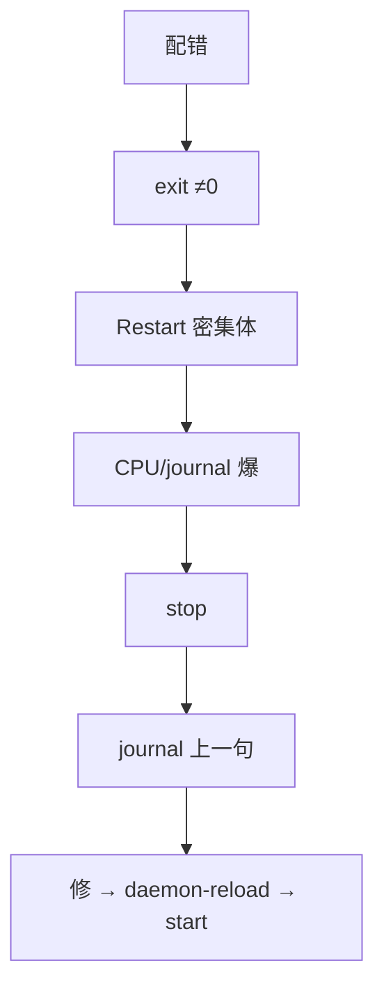

# 11｜Systemd 与服务管理 · 练习题

开始做题前，先给大家一个小建议：合上知识点，对着**第一节的主图**，把「一个服务的一生」从登记到转世口述一遍。能默画「改文件三步 + 四个卡点」，下面这些题你会发现大半都会了；卡壳的地方，就是你该回去重读的那一节。

做题的方式也建议改一下：每道题**先看标题和场景，自己口述一遍答案，再往下看「完整解答」对答案**。直接看解答，容易产生「我会了」的错觉——能讲出来才是真的会。

| 标记 | 含义 |
|------|------|
| **核心** | 不懂整章就没建立起来 |
| **必会** | 值班和面试都要能讲 |
| **常用** | 线上会反复碰到 |
| **常考** | 白板和追问的高频口径 |

题目的顺序也是有意排的：Q1～Q3 先把 unit、Type、依赖钉死；Q4～Q9 按活着/日志/停/转世展开；Q10～Q14 收尾到改了不生效与定责。

## 本题目录

- [Q1 总图 / PID 1](#q1)
- [Q2 Unit 类型与路径](#q2)
- [Q3 改了不生效](#q3)
- [Q4 Type=forking 陷阱](#q4)
- [Q5 Restart 死亡螺旋](#q5)
- [Q6 After / Requires / Wants](#q6)
- [Q7 journalctl](#q7)
- [Q8 LimitNOFILE](#q8)
- [Q9 enable vs start / mask](#q9)
- [Q10 cron vs timer](#q10)
- [Q11 游戏服最低配 unit](#q11)
- [Q12 定责树综合](#q12)
- [Q13 systemd timer 深排](#q13)
- [Q14 Systemd 白板综合题](#q14)
- [合上书](#合上书)

---

## Q1

**★★★★★｜Systemd 在整机里站哪？相对 SysV / start.sh 好在哪？**

**覆盖**：核心 · 必会 · 常考

**对应**：知识点 [一、一张图：一个服务的一生](知识点.md) · 「二、登记」（PID 1 与声明式）

### 场景

老机房还有 `/etc/init.d/game` 和 `nohup ./start.sh &`。有人觉得「脚本也能 start/stop，何必 systemd」。白板让你默画 PID 1 管什么。——就是开头那个「status active 但连不上」的现场。

先自己试试：systemd 相对 SysV / start.sh 好在哪？PID 1 盯的是谁？

### 完整解答

**一句话**：Systemd 是 PID 1，用声明式 unit 并行拉起、统一 journal 与 Restart 闸门，比 SysV 脚本可预测。

```text
内核
  → systemd（PID 1）：读 unit → 依赖拉起 → 盯 MainPID → journal → Restart
  → 业务进程
```

相对 SysV / start.sh：声明式、可画依赖、统一 status、自动重启有 StartLimit、日志对齐。不管业务怎么算——那是进程自己的事。

### 再追问

生产还用 nohup 当 pid 1 会怎样？——挂了没人按策略拉；没统一 journal；开机要靠 rc 手写；排障没有 `systemctl status` 这一刀。

---

## Q2

**★★★★☆｜.service / .timer / .socket / .target 各干什么？unit 放哪、drop-in 怎么写？**

**覆盖**：核心 · 必会

**对应**：知识点 [二、登记：unit 文件与落地路径](知识点.md)

### 场景

新人把厂商 `/usr/lib/systemd/system/nginx.service` 直接改了 LimitNOFILE。升级包一覆盖又没了。另有人问「timer 是不是取代 cron 的那个脚本」。

先自己试试：四种后缀各干什么？unit 放哪、drop-in 怎么写？

### 完整解答

**一句话**：日常最多 .service+.timer；调厂商包用 drop-in，不要改 `/usr/lib` 原文件。

| 类型 | 干什么 |
|------|--------|
| .service | 拉进程 |
| .timer | 到点触发配对的 .service（本身不跑业务） |
| .socket | 先听，有连接再拉 service |
| .target | 一组 unit / 同步点（如 multi-user） |

路径：`/etc/systemd/system/` 放你的；`systemctl edit` 写 `foo.service.d/*.conf`。真相看 `systemctl cat`（合并结果）。

### 再追问

没有 `[Install]` 段能不能 start？——能。enable 呢？——往往无意义或失败，开机不会自动拉。

---

## Q3

**★★★★★｜改了一个 service 文件为什么不生效？**

**覆盖**：核心 · 必会 · 常用

**对应**：知识点 [八、生病：改了不生效与参数验收](知识点.md)（daemon-reload 两本账另见「三、出生」）

### 场景

把 `LimitNOFILE` 和 `ExecStart` 配置路径都改了。只跑了 `systemctl restart`。`/proc/PID/cmdline` 和 limits 仍是旧的。——和开头 LimitNOFILE「改了不生效」是同一类坑。

先自己试试：改了为什么不生效？生效三步链是什么？

### 完整解答

**一句话**：改 unit 必须 daemon-reload 再 restart；只改磁盘或只 restart 都不够。


| 只做了 | 结果 |
|--------|------|
| 只改文件 | 内存定义旧 |
| 只 daemon-reload | 进程仍旧参数 |
| 只 restart | 可能仍用内存旧定义 |
| systemctl reload | **不是** daemon-reload |

`daemon-reload` 只重新读定义，**不**杀进程。覆盖用 `systemctl edit`；用 `systemctl cat` 看合并结果。

### 再追问

daemon-reload 和 restart 区别？——前者读定义，后者用新定义拉进程。两个都要做。`reload` 是第三件事，进程要支持。

---

## Q4

**★★★★★｜Type=simple、forking、notify 怎么选？forking 配成 simple 现场长什么样？**

**覆盖**：核心 · 必会 · 常考

**对应**：知识点 [三、出生：start、Type 五种与依赖编排](知识点.md)

### 场景

老游戏守护进程会 fork。unit 写成 `Type=simple`。`systemctl status` 显示 active，玩家 Connection refused；`ss` 上监听 PID 和 Main PID 不一致。有人盲 restart，报 Address already in use。

先自己试试：三种 Type 怎么选？forking 配成 simple 现场长什么样？

### 完整解答

**一句话**：Type 决定盯谁、何时算就绪；真 fork 却写成 simple 会盯错 PID，导致 Restart 乱杀或占口。

| Type | 盯谁 / 就绪 |
|------|-------------|
| simple | ExecStart 即主进程（最常用） |
| forking | 父退出；主进程看 PIDFile |
| notify | `sd_notify(READY=1)` |
| oneshot | 跑完结束 |

```text
status Main PID: 12345
ss 监听 :9000 → pid=12340
→ Type/PIDFile 配错，见知识点「三、出生」
```

修法：确认是否真 daemonize → forking+PIDFile 或改前台 simple/notify → stop 清占口 → daemon-reload → start → ss 对 MainPID。

simple 进程起来 ≠ 业务就绪（可能还在连库）；要准用 notify。

### 再追问

不会 fork 却写成 forking？——一直 activating 或超时失败。  
KillMode=process 停服后端口还在？——可能只杀了 MainPID，子进程残留；默认 control-group 更稳。

---

## Q5

**★★★★★｜Restart=always 把错误配置打成死亡螺旋，怎么处理？**

**覆盖**：核心 · 必会 · 常考

**对应**：知识点 [四、活着：Restart 策略与死亡螺旋](知识点.md)

### 场景

配置路径写错。`Active: activating (auto-restart)`，`NRestarts: 847`，CPU 和 journal 一起爆。有人把 `RestartSec` 改成 0「好让它快点起来」。——就是开头那个死亡螺旋现场。

先自己试试：死亡螺旋怎么止血、怎么找根因、什么时候 reset-failed？

### 完整解答

**一句话**：先 `systemctl stop` 止血，再 journal 修根因；生产用 on-failure + RestartSec=5 + StartLimit，禁止 always+0。



闸门：`StartLimitBurst` + `StartLimitIntervalSec`，打满进 **failed**（不是修好了）。`reset-failed` 前先修根因。

on-failure：异常才拉。always：正常退出也拉，配错/ExecStart 写错会空转。

### 再追问

RestartSec=0？——螺旋更快，不是修复。  
已经 failed 不再拉？——闸门生效；看 journal，修完再 start。  
status=9/KILL？——先 dmesg/OOM（07），别只盯应用 conf。

---

## Q6

**★★★★★｜After、Requires、Wants 怎么配「先有网再起逻辑服」？**

**覆盖**：必会 · 常用 · 常考

**对应**：知识点 [三、出生：start、Type 五种与依赖编排](知识点.md)（依赖编排）

### 场景

逻辑服开机比网络早，连不上 Redis。unit 只写了 `After=network.target`。另一次 `Requires=mariadb`，数据库一挂游戏服也被拉停。

先自己试试：After / Requires / Wants 怎么配「先有网再起逻辑服」？

### 完整解答

**一句话**：After 只排序；要等 IP 用 network-online + Wants；缓存通常 Wants+自重连，不要无脑 Requires。

| 意图 | 写法 |
|------|------|
| 只要顺序 | 只 After=B（仍不保证 B 在） |
| 弱依赖 | Wants=B |
| 强依赖共死 | Requires=B（+ After） |
| 等地址就绪 | After= + Wants=network-online.target |

`network.target` ≠ IP 已配好。Requires 会放大故障面。Requires 也不等于对方「业务就绪」——对方若是 simple，进程在仍可能在初始化；要就绪用 notify 或自重试。

### 再追问

Requisite=？——强依赖但不主动拉 B，B 必须已经在跑。

---

## Q7

**★★★★★｜journalctl 怎么查某服务？reboot 后日志没了呢？status=1 和 9 怎么分流？**

**覆盖**：必会 · 常用 · 常考

**对应**：知识点 [五、说日志：journalctl 按服务读事故](知识点.md)

### 场景

逻辑服刚才崩过。reboot 之后 journal 里只有开机以后的。有人说「没日志没法查」。另一次 status 里是 `status=9/KILL`，有人只翻应用 ERROR 目录。

先自己试试：journalctl -u 怎么查？reboot 后日志没了呢？status=1 和 9 怎么分？

### 完整解答

**一句话**：先 status 再 `journalctl -u` 时间窗；生产 Storage=persistent；1 看 journal，9 看 dmesg。

```bash
systemctl status game-server
journalctl -u game-server -n 100 --no-pager
journalctl -u game-server --since today
journalctl -u game-server -b -1          # 上次启动，需 persistent
journalctl -u game-server -p err
```

默认可能 volatile（内存），reboot 丢。生产 `/etc/systemd/journald.conf`：`Storage=persistent` → `/var/log/journal`。

| 退出码 | 下一刀 |
|--------|--------|
| status=1/FAILURE | journal 上一句 ERROR |
| status=9/KILL | dmesg / OOM → 07 |
| start-limit-hit | 修根因 → reset-failed |

应用日志文件有、journal `-u` 空？——可能不是 systemd 拉的（nohup），或 StandardOutput 被丢掉。

### 再追问

journal 把盘打满？——`--disk-usage` / vacuum；深策略见 23，不要 rm 目录硬删。

---

## Q8

**★★★★★｜LimitNOFILE 改了为什么 /proc/PID/limits 还是旧值？infinity 安全吗？**

**覆盖**：必会 · 常用 · 常考

**对应**：知识点 [八、生病：改了不生效与参数验收](知识点.md)（LimitNOFILE 五层）

### 场景

游戏服 `Too many open files`。有人改了 `/etc/security/limits.conf`；有人在 unit 写了 `LimitNOFILE=infinity` 只 restart。——就是开头那个 LimitNOFILE 现场。

先自己试试：LimitNOFILE 改了为什么 /proc 还是旧值？infinity 安全吗？

### 完整解答

**一句话**：limits.conf 对 systemd 服务无效；必须 unit 里 LimitNOFILE + daemon-reload + restart，验收 `/proc/PID/limits`；infinity 可能落成 65536。

多层上限听最窄：`fs.file-max` → `fs.nr_open` → unit LimitNOFILE → 进程 limits。游戏服显式写 **1048576**。limits 已对仍报错 → 泄漏（05）或应用 setrlimit。

### 再追问

User=root 能回避 fd 问题吗？——不能。User 非 root 是安全边界，和 NOFILE 是两件事。

---

## Q9

**★★★★☆｜enable 和 start 差在哪？开机为什么没起来？mask 呢？**

**覆盖**：必会 · 常用

**对应**：知识点 [七、转世：enable、mask 与 timer](知识点.md)

### 场景

发版当天 `systemctl start game-server` 正常。第二天机房断电 reboot，服务没了。`is-enabled` 显示 disabled。另一台安全扫描相关服务显示 masked。

先自己试试：enable 和 start 差在哪？mask 呢？

### 完整解答

**一句话**：start 只影响当前；enable 才链到 WantedBy 的 target；mask 后 start/enable 都无效。

| 动作 | 现在 | 开机 |
|------|:----:|:----:|
| start | ✓ | ✗ |
| enable | ✗ | ✓ |
| enable --now | ✓ | ✓ |
| mask | 无法 start | 无法 enable |

发版验收要 `is-enabled` + 真正 reboot 一次。看到 masked：**先问谁禁的**，不要对安全服务直接 unmask。

### 再追问

改完 unit 没 daemon-reload 就 enable？——开机可能仍用旧定义。enable 和 reload 是两件事，都要做对。

---

## Q10

**★★★★★｜crontab 手动能跑、定时不跑？新任务用 cron 还是 timer？**

**覆盖**：核心 · 必会 · 常用

**对应**：知识点 [七、转世：enable、mask 与 timer](知识点.md) · cron 环境坑见 [30](../30-定时任务与Cron/)

### 场景

备份脚本 ssh 上手跑成功。crontab `0 2 * * * backup.sh`，脚本用了 `java` 和 `.bashrc` 变量。备份机凌晨在打补丁关机。有人坚持继续堆 crontab。

先自己试试：crontab 定时不跑查什么？新任务用 cron 还是 timer？

### 完整解答

**一句话**：cron 环境空（不读 bashrc），先查 PATH/服务/时区；新任务优先 systemd timer（journal + Persistent 补跑）。

排障顺序：

1. `systemctl status crond`（或 cron）  
2. 脚本绝对路径 + crontab 写 PATH  
3. 变量写进脚本/crontab，不靠 bashrc  
4. `chmod +x`；`file` 看 CRLF  
5. 时区（32）  
6. 输出是否打满盘  

timer：`Type=oneshot` 的 service + `OnCalendar` + `Persistent=true`；`list-timers` 清点。cron 默认不补错过的点。

### 再追问

WorkingDirectory / Environment 漏了？——和 cron 同一类：相对路径找不到、变量空。写进 unit。

---

## Q11

**★★★★☆｜游戏服 unit 你最少会写哪几项？网上抄 always + infinity + root 怎么拆？**

**覆盖**：必会 · 常用 · 常考

**对应**：知识点 [八、生病：改了不生效与参数验收](知识点.md)（游戏服 unit 最低配十条；环境与绝对路径另见「二、登记」）

### 场景

新逻辑服要交 service。有人从网上抄了 `Type=forking`、`User=root`、`Restart=always`、`LimitNOFILE=infinity`、只 `After=network.target`。

先自己试试：游戏服 unit 最低配哪几项？always + infinity + root 怎么拆？

### 完整解答

**一句话**：最低配：simple、on-failure+StartLimit、显式 LimitNOFILE、network-online、非 root、Wants 缓存。

1. Type=simple（除非真 fork）  
2. User 非 root  
3. Restart=on-failure + RestartSec=5 + StartLimit  
4. LimitNOFILE=1048576，limits 验收  
5. After/Wants=network-online.target  
6. 缓存 Wants + 自重连  
7. WorkingDirectory + Environment  
8. ExecStop 优雅退出（05）  
9. drop-in 调参；Storage=persistent  
10. enable --now + reboot 演练  

### 再追问

崩溃打转先看什么？——先 stop，journal 看配错还是 OOM；占口先 `ss -lntp` 对 Type。

---

## Q12

**★★★★★｜给你四种现象，各指到决策树哪条？**

**覆盖**：核心 · 必会 · 常考

**对应**：知识点 [九、作战：定责](知识点.md)

### 场景

值班群同时丢来：① NRestarts 在涨；② active 但 Connection refused；③ 改了 conf 不生效；④ reboot 后服务没了。

先自己试试：四种现象各指到决策树哪条？

### 完整解答

**一句话**：先 `systemctl status` 分叉——螺旋 stop、占口对 ss/Type、不生效走 reload 三步、开机查 enable。

| 现象 | 分支 | 先做 | 别做 |
|------|------|------|------|
| ① 螺旋 | NRestarts | stop → journal | RestartSec=0 |
| ② refused+active | ss vs MainPID | 查 Type/PIDFile | 盲 restart |
| ③ 参数旧 | cat vs 文件 | daemon-reload→restart | 只改 limits.conf |
| ④ reboot 没了 | is-enabled | enable / 查 mask | 再 start 当修复 |

完整树见知识点「九、作战：定责」。交叉：退出码 9→07；端口/队列→12·16。

### 再追问

四条都做过但定时备份仍不跑？——走出 service 树，进 cron/timer 分支（Q10）。

---

## Q13

**★★★★☆｜cron 能跑、systemd timer 不触发，怎么排？**

**覆盖**：必会 · 常用 ｜ **对应**：知识点 [七、另一条路：cron vs systemd timer](知识点.md) · 交叉 [30](../30-定时任务与Cron/)

### 场景

备份迁到 `backup.timer` + `backup.service`，手动 `systemctl start backup` 成功，到点却不跑。

先自己试试：timer 不触发怎么排？和 Q10 的 cron 坑怎么对照？

### 完整解答

> 🎯 **一句话**：**timer 看 `list-timers` 下次触发；service 看 `OnCalendar`/`Persistent` 和 unit 是否 enable**。

```bash
systemctl list-timers --all | grep backup
systemctl status backup.timer
journalctl -u backup.timer -u backup.service --since today
```

| 坑 | 检查 |
|----|------|
| timer 没 enable | `is-enabled backup.timer` |
| 时区/夏令时 | `OnCalendar` 与 `timedatectl` |
| 错过未补跑 | `Persistent=true` |
| service 失败 | `Result=exit-code` |

### 再追问

- 和 crontab 混用？——可以并存，排障先认清**谁负责触发**。

---

## Q14

**★★★★★｜白板：PID 1 总图 + 改文件三步 + 四个卡点？**

**覆盖**：核心 · 必会 · 常考 ｜ **对应**：知识点 [一、一张图](知识点.md) · [九、收口](知识点.md)

### 场景

白板：「画 systemd 在开机链的位置，并说 Type/Restart/journal 三个卡点。」——本套题收尾，把前面的题串起来了。

先自己试试：白板默画 PID 1 总图 + 改文件三步 + 四个卡点。

### 完整解答

> 🎯 **一句话**：**改文件 → daemon-reload → restart**；卡点：Type 与 ss 不一致、Restart 螺旋、limits 不生效、enable 与 start。

```text
Unit 类型：service/timer/socket/target
依赖：After(顺序) Requires(强) Wants(弱)
失败：stop → journal → 修因 → reset-failed
```

> 📝 **面试**：forking×simple 是 status 与 ss 打架的头号原因（Q4）。

### 再追问

- 游戏服最低配 unit 十条？——复述 Q11 checklist。

---

## 合上书

对着知识点的合上书逐条自测，答不出的回对应节；括号里是本章对应题：

与知识点「合上书」对齐：

- [ ] 默画「一、一张图」：PID 1 → unit 类型 → 改文件三步 → 四个卡点
- [ ] Type=simple / forking / notify？forking×simple 时 status 与 ss 如何不一致？  
- [ ] After / Requires / Wants 怎么配「先有网」？为何不无脑 Requires 缓存？  
- [ ] Restart 螺旋怎么停？闸门参数？为何禁止 RestartSec=0？  
- [ ] journalctl 时间窗？persistent？status=1 vs 9？  
- [ ] LimitNOFILE 不生效查哪？limits.conf 为何无效？infinity 坑？  
- [ ] enable vs start？mask？cron 手动能跑定时不跑先查什么？为何优先 timer？
- [ ] timer 不触发排障链（Q13）
- [ ] 白板总图与四卡点（Q14）

七条都能口述，本章过。下一章 → [12 网络栈与Socket](../12-网络栈与Socket/)。
