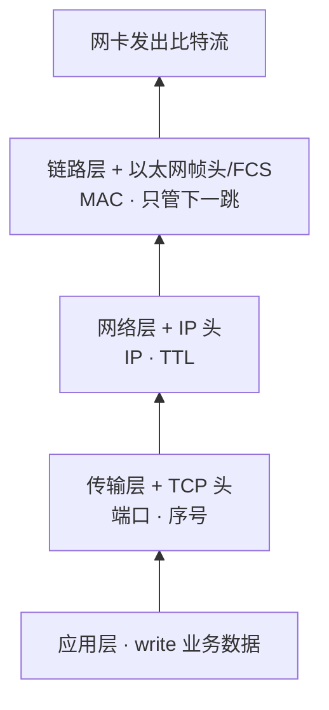
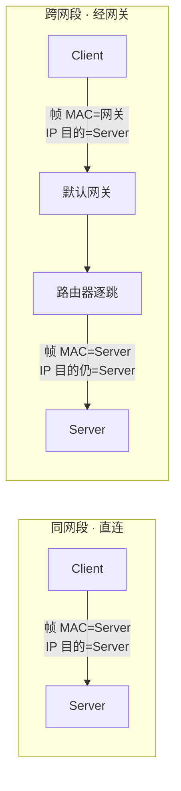
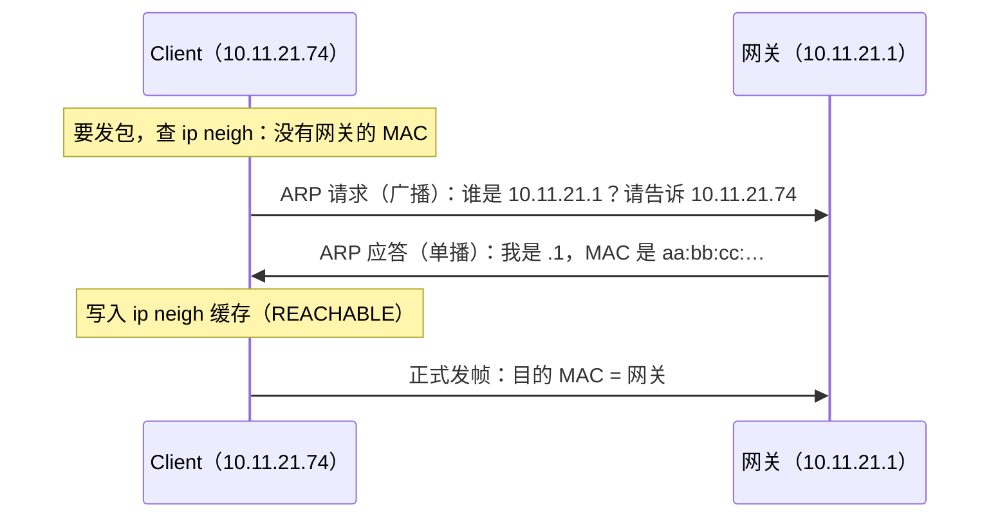
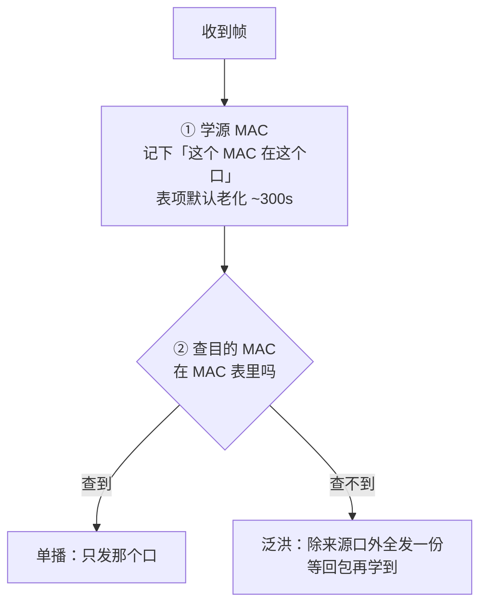
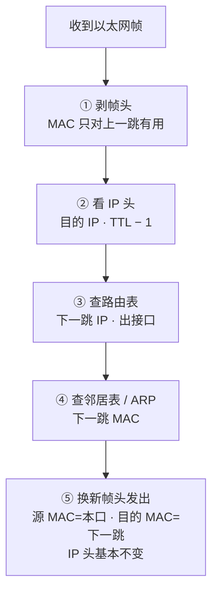
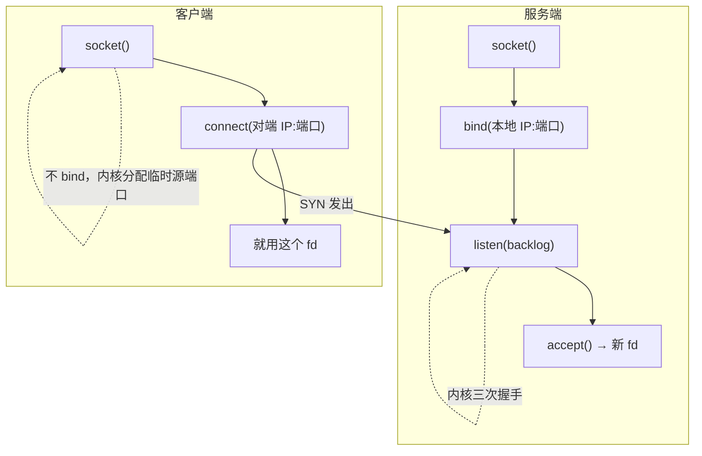
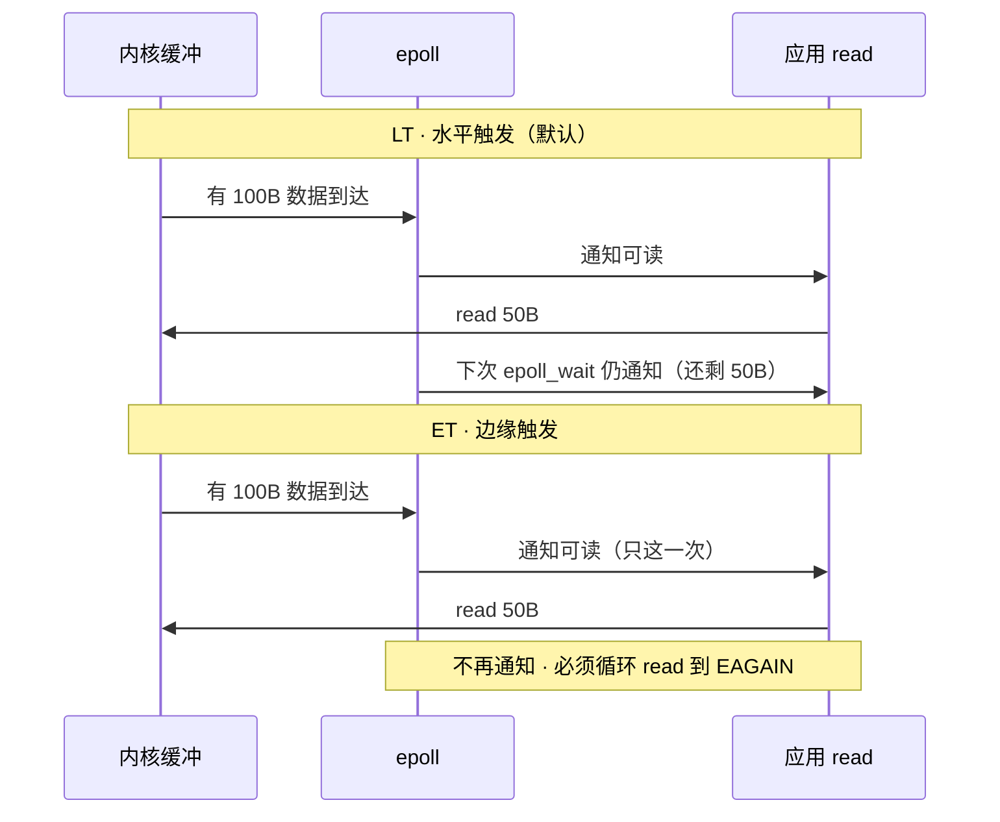
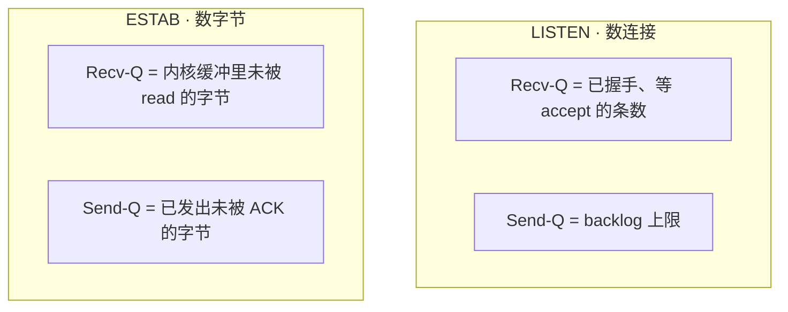
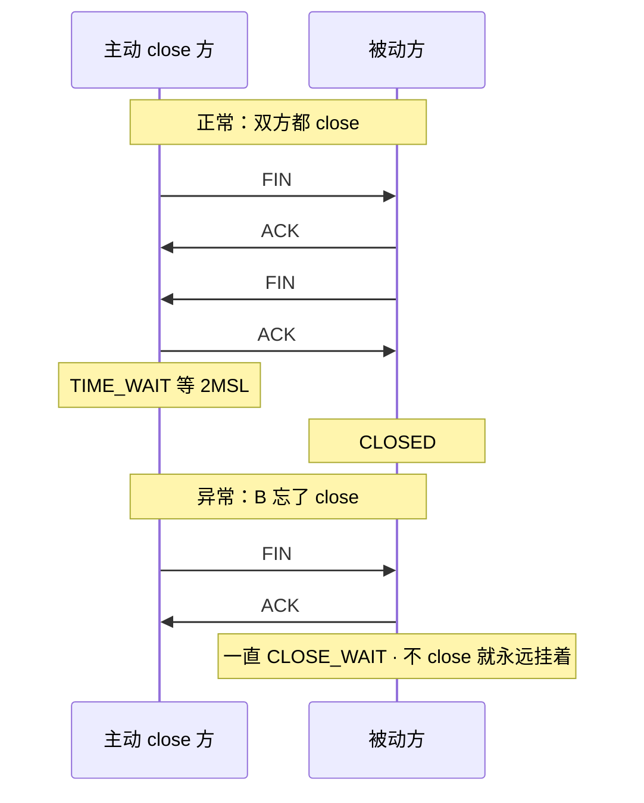
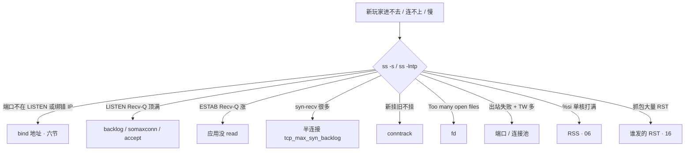

# 网络栈与 Socket

> 新服开服玩家蜂拥，老服在线毫无感觉、新服一个都进不来——业务日志一片空白，`ss` 上 ESTAB 排得整整齐齐。问题不在代码，在包根本没进到进程。
> **本章回答**：一个包从客户端网线出发，到服务端进程 `read` 到手里，中间过几道门；卡在哪道门，`ss` 怎么一眼定责。
> **不讲**：域名怎么变成 IP → [15](../15-DNS与CDN/)；TCP 握手/重传/窗口/心跳 → [13](../13-TCP与UDP/)；抓包手法、MTU/PMTUD 深排障 → [16](../16-网络排障与抓包/)。

**标记**：🎯重点 · 🔥难点 · ⭐常考 · 🔧实操

---

## 一、一张图：一个包的旅程

> 🎯 **一句话**：网络线负责把包送到网卡；本章负责「网卡之后、进程之前」——每一道门都能卡住包。


- 📖 **读图**：🛤️ 出门→上路→进门→排队→领号→干活→回家。⭐「ESTAB 一排排、业务空白」常卡排队/领号（Q4）。🔭 `ss` 照后四段；前两段靠抓包（[16](../16-网络排障与抓包/)）

---

## 二、出门：分层封装、路由、ARP

> 🎯 **一句话**：发出一个包 = 从上到下每层加一个自己的头；跨网段时，帧先交给默认网关，不是直接交给 Server。

### 🗺️ 先对齐官方分层：OSI 七层 vs TCP/IP 四层 🎯⭐

**OSI 七层是理论参考模型，实际跑在网上的是 TCP/IP 四层（也叫 DoD 模型）**——上三层在工程上合成应用层：

| OSI 层 | 名称 | TCP/IP 四层 | 本章讲哪儿 |
|---|---|---|---|
| L7 应用层 | Application | 应用层 Application | HTTP/DNS 只提一句 |
| L6 表示层 | Presentation | （合并入应用层） | Socket / fd / epoll → 六节 |
| L5 会话层 | Session | （合并入应用层） | （同上） |
| L4 传输层 | Transport | 传输层 Transport | 端口 · 队列 · Recv-Q（本章；握手/窗口 → 13） |
| L3 网络层 | Network | 网络层 Internet | IP · 路由 · TTL（本节） |
| L2 数据链路 | Data Link | 链路层 Link | MAC · ARP · 网卡（本节 + 四节） |
| L1 物理层 | Physical | （合并入链路层） | （同上） |

- 📖 **读图**：横看「理论 → 工程」合并；记层号连着记地址/设备：L2 认 MAC（交换机），L3 认 IP（路由器），L4 认端口（四层 LB），L7 认 URL（七层 LB）——「四层 vs 七层 LB」的根。

> ⚠️ **别混**：**Socket 不是一层**。它是应用层和传输层之间的**编程接口**；TLS 严格说也不是独立一层，工程上常塞在 L4 与 L7 之间讲。

> 📝 **面试**：先自下而上背全 L1～L7（物理·链路·网络·传输·会话·表示·应用），紧接着补「**实际是 TCP/IP 四层，上三层合成应用层**」。代表：L2 以太网/ARP，L3 IP/ICMP，L4 TCP/UDP，L7 HTTP/DNS。

### 📦 四层各管什么 🎯

每层只管一件事、只加一个头。**每层认的地址不同**，排障跟着地址走：



- 📖 **读图**：头越加越多、地址越来越「近」（端口→进程，IP→机器，MAC→下一跳）；收包从下到上剥头。「进程收不到」查端口、「跨网段」查 IP/路由、「同网段」查 MAC/ARP。

> ⚠️ **别混**：端口是**传输层**的（IP 层没有）；MAC 是**链路层**的。「IP:端口」横跨两层。

- 🔑 **关键在最后一层**：端口、IP 封装时就知道；**只有目的 MAC 常常一开始不知道**——要查邻居表或 ARP。

### 🧭 查路由：这一跳帧交给谁 ⭐

发包前内核先查路由表，决定「下一跳是谁、从哪张网卡出」：

| 对比 | 同网段 | 跨网段 |
|------|--------|--------|
| 查路由结果 | 目的在本地子网，直连 | 走**默认网关** |
| ARP 问谁 | **Server 的 IP** | **网关的 IP**（不问 Server） |
| 帧目的 MAC | Server | 网关 |
| IP 目的 | Server | Server（仍不变） |



- 📖 **读图**：左直送 Server；右帧先给网关。**IP 目的始终是 Server**；MAC 每跳换。

> ⚠️ **别混**：跨网段「帧给网关、IP 仍写 Server」——**MAC 每跳换，IP 目的通常不变**。本节最常考。

> 🔍 **现场**：不确定某个目的走哪张网卡、下一跳是谁（多网卡、容器宿主机尤其容易搞错）：

```bash
ip route get 10.11.21.74     # 直接告诉你：走哪个 dev、下一跳 via 谁、源 IP 用哪个
ip route                     # 看完整路由表；default via ... 就是默认网关
```

### 📮 为什么还要 ARP？⭐

#### ❓ 为什么 MAC 不能在封装时就填好？

- ❌ 误会：知道对端 IP，MAC 就该一并填好
- ✅ MAC 只对「下一跳」有意义，且常常一开始不知道——查 `ip neigh` 或 ARP 问
- 📣 谁缺下一跳 MAC 谁就问；问过进缓存，**不是每个包都问**

> 📝 **面试**：问「为什么还要 ARP」，答「**目的 MAC 常常一开始不知道**」，别答成「要解析 IP」。



- 📖 **读图**：**请求广播、应答单播**；问过进缓存。方向 **IP→MAC**，别答反。⭐ 口诀：**「ARP：IP→MAC，别答反」**（Q1）

```bash
ip neigh          # 邻居表（ARP 缓存）；REACHABLE 可用，STALE 待复查，FAILED 问不到
```

本节对应练习题 Q1。包出了门——下一站：网络里怎么接力。

---

## 三、上路：网络里怎么接力

> 🎯 **一句话**：交换机只按 MAC 转发；路由器剥帧、看 IP、定下一跳、换 MAC。别把两者搞混。

### 🔌 交换机怎么转发

交换机维护 **MAC 地址表**，转发只看帧的 MAC、不看 IP：



- 📖 **读图**：先学源、再查目的；查不到就泛洪——同网段第一次发包常被泛洪是正常行为。主机看不到交换机 MAC 表，能看的是自己的 `ip neigh`；Linux bridge 用 `bridge fdb show`。

> ⚠️ **别混**：交换机学 **MAC ↔ 端口**，ARP 学 **IP ↔ MAC**——两张表、各管各的。

### 🛤️ 路由器每一跳在干什么 🔥



- 📖 **读图**：「剥二层→看三层→再封二层」；每跳只定**下一跳 MAC**，IP 目的通常带到 Server。

```text
进路由器：[帧: …→本路由MAC][IP: Client→Server][TCP][数据]
出路由器：[帧: 本路由→下一跳MAC][IP: Client→Server][TCP][数据]
              ↑ 换了              ↑ IP 目的不变
```

#### ❓ 为什么 TTL 每跳减 1？

- 🔁 **防环路**：路由配错时包可能在两台路由之间来回弹；TTL 归零就被丢弃并回 ICMP 超时
- 🗺️ `traceroute` 正是故意发小 TTL 的包，靠这些 ICMP 逐跳画出路径

> ⚠️ **别混**：干「剥帧看 IP」的是**路由器（三层）**；交换机（二层）一般**不看 IP**，只按帧里的目的 MAC 转发。所以「同网段不通」查交换机/ARP，「跨网段不通」查路由/网关。

路径上还可能经 NAT / LB / 防火墙——定责见 [17](../17-iptables与conntrack/)、[16](../16-网络排障与抓包/)。包到了网卡——进了网卡就等于进了进程吗？

---

## 四、进门：网卡到进程之间

> 🎯 **一句话**：包进了网卡 ≠ 进了进程。中间隔着「硬中断 + 软中断」，软中断才真正把包装进 Socket。

### 🔔 门铃与搬货 🔥

> 💡 **打个比方**：硬中断是门铃「叮一下」；软中断是随后「把门货搬进仓库」。门铃和搬货是两拨人。

```text
① 硬中断（门铃，%hi）  网卡叮一下 → CPU 记「有活」，马上回去
② 软中断（搬货，%si）  剥帧 → IP → TCP → 放进 Socket 接收缓冲
③ 业务线程（%us）      read 拷到用户态，跑登录/玩法；syscall 部分算 %sy
```

- 🔑 **「硬 / 软」比的是谁触发**：硬中断由网卡硬件触发；软中断是硬中断记下「有活」后返回再跑的收包活——收包重活恰恰在软中断里

#### ❓ 高 pps 下为什么不会被中断压死？

- ✅ 现代网卡走 **NAPI**：硬中断临时关掉，软中断里**一次批量捞一串包**，捞完再开——「少量中断 + 大批轮询」；代价是 `%si` 易打满


- 📖 **读图**：中断只在「空闲→有活」边沿叮；中间软中断批量捞。CPU 不被门铃淹死，代价是 `%si` 易打满。

### 🚚 软中断 ≠ 业务进程

**数据是给 ConnServer 的，执行者不是同一个。**

```text
软中断（内核）  包装进 fd=30 接收缓冲  ← 数据到进程名下，代码还没跑
业务线程        read(fd=30) 拷用户态   ← 业务进程在跑
```

#### ❓ 软中断在干活，怎么就不是业务进程？

- 📦 软中断只把包装进 Socket 缓冲——**数据到了进程名下，业务代码还没跑**；`read` 才是 `%us`
- 🔀 卡软中断 → 包可能进不了 Socket，Recv-Q 都不一定涨 → [06](../06-CPU与Load/)；过了软中断、应用不读 → Recv-Q 涨（七节）

> ⚠️ **别混**：CPU 在干活 ≠ 软中断。业务算 `%us`；`%si` 高才是「内核接包接不过来」。

> 🔍 **现场**：怀疑收包侧顶不住，先看是不是**只有一个核**在扛软中断（多队列没生效 / RSS 没打散）：

```bash
mpstat -P ALL 1        # 看每个核的 %si；单核 100% 其余闲 = 中断没打散
cat /proc/softirqs | grep -i net_rx   # NET_RX 是否只集中在一个 CPU 列
```

### 🔧 收包在哪丢：网卡侧还是内核侧 🔧

进门有两道关，丢包可能丢在任一道，治法完全不同：

```bash
# ① 网卡硬件侧（ring buffer）
ethtool -S eth0 | grep -iE 'rx_missed|rx_no_dma|rx_dropped'   # 硬件丢包计数；非 0 = 包到了网卡但没被 DMA 搬走
ethtool -g eth0                                                # ring buffer 当前/最大；满了用 ethtool -G 调大

# ② 内核软中断侧
cat /proc/net/softnet_stat                                     # 每行一个 CPU；第 2 列 dropped、第 3 列 time_squeeze 非零 = 软中断没捞完
```

```text
ring buffer   网卡先搁这儿，等 DMA  ← rx_missed 涨 = 队列满丢包
       ↓
软中断 NAPI   批量捞走交 TCP       ← softnet_stat dropped/time_squeeze 涨 = 没捞完
       ↓
Socket 接收缓冲                     ← 到这儿才有 Recv-Q（七节）
```

> 🎯 **判据**：`rx_missed` 涨 → 网卡侧丢，调 ring buffer（`ethtool -G`）；`softnet_stat` dropped 涨 → 内核侧丢，软中断没打散（看 `%si` 单核、RSS/多队列）。一个治队列深度，一个治 CPU 分散，别混。

本节对应练习题里进门相关题。口诀：**「硬中断叮一下，软中断才搬货」**。货搬进仓库了——下一站是值班最厚的一段：两道队。

---

## 五、排队：半连接、全连接、backlog

> 🎯 **一句话**：连接要过两道队——握手没完进「半连接」，握手完了等 accept 进「全连接」；backlog 管的是后一道。

### 🚪 先 ESTAB，后 accept ⭐

🔥 很多人会答「ESTAB 了就说明业务能读到了」——**错了**。

```text
① 三次握手完成 → ② 服务端已是 ESTABLISHED，进全连接队列等 accept → ③ accept() 领走成业务 fd
```

> **accept 不是让连接变成 ESTABLISHED；是把「已经 ESTABLISHED、在门口排队」的连接领进进程。** ⭐ 这是开头那个现场的正解入口（练习题 Q4、Q5）。


- 📖 **读图**：握手是内核干的，`SYN_RCVD`/`ESTABLISHED` 都在内核排队，**应用一行没跑**；只有 `accept()` 才交到进程——全连接满时应用无感，根因在这儿

#### ❓ 为什么「客户端 ESTAB、服务端却没这条连接」？

- 🤝 客户端发完第三个 ACK **自己就进 ESTABLISHED**；服务端要等这个 ACK 进全连接队列后才算建立
- 🚫 全连接队列满：服务端新连接**进不了队**；客户端**仍可能显示 ESTAB**，一发数据才暴露
- 📉 默认 `tcp_abort_on_overflow=0` 静默丢收尾；设成 `1` 则回 RST

> ⚠️ **别混**：教科书/RFC 写 `SYN-RECEIVED`（常记 **`SYN_RCVD`**），`ss` 打印 **`SYN-RECV`**。面试写教科书名，值班认工具名。握手细节见 [13](../13-TCP与UDP/)。

### 📋 两个队列、两个上限

| 队列 | 含义 | TCP 状态 | 上限看 | 满了的签名 |
|------|------|----------|--------|-----------|
| 半连接 | 握手没完 | `SYN_RCVD`（`ss`:`SYN-RECV`） | `tcp_max_syn_backlog` | 客户端像丢包；**应用日志空白** |
| 全连接 | 握手完等领走 | **已是 `ESTABLISHED`**（`ss`:`ESTAB`） | `min(listen backlog, somaxconn)` | `ss -lntp` Recv-Q 顶满 Send-Q |

#### ❓ 为什么要两道队，一道不够吗？

- ⏳ **半连接**：握手未完，不能交给应用（防幽灵 SYN）
- ✅ **全连接**：已 ESTAB，只等 `accept`——应用消费跟不上时缓冲在这里
- ⚠️ 上限各管各的：只改 `tcp_max_syn_backlog` 或只改 `somaxconn`/`listen()`，另一种满照样挂；半连接满时**应用完全无感**

### 🎟️ backlog 是什么 ⭐

> 💡 **打个比方**：餐厅门口取号。`listen(fd, backlog)` =「门口最多排多少位」，`accept()` =「叫号领位」。握完手的人已在排队（ESTAB），只是还没被领进店。

```text
listen(fd, 128)  ×  somaxconn=128  →  生效 = min(128,128)=128
只把程序 backlog 改成 4096、somaxconn 仍 128 → 生效仍是 128
```

- 📦 容器里 somaxconn 在 Pod netns，只改宿主机不一定进 Pod

> 📝 **面试**：「accept 队列满了，连接还能进 ESTAB 吗？」——服务端新连接**不能**；客户端**有可能**显示 ESTAB（发完第三个 ACK 自己就进），一发数据才暴露。

### 🔍 现场：怎么证明是队列满 🔧

> 🔍 **现场**：「新玩家进不去、老玩家都好」，先分半连接还是全连接。

```bash
ss -lntp
# State  Recv-Q Send-Q Local Address:Port
# LISTEN 128    128    0.0.0.0:4103        ← Recv-Q 顶到 Send-Q = 全连接队列满

ss -s
# TCP:   9421 (estab 9280, closed 12, orphaned 0, timewait 8), ports 0
#        synrecv 1024                      ← synrecv 大量堆积 = 半连接侧压力

nstat -az | grep -iE 'ListenOverflows|ListenDrops'
# TcpExtListenOverflows  8321   ← 全连接队列满而丢掉的连接数（累计，关键看「在涨吗」）
# TcpExtListenDrops     10240   ← LISTEN socket 上被丢的连接总数（含 overflow + 其它原因）
```

- 📊 **两个计数**：`ListenOverflows` 涨 = **全连接满**；只有 `ListenDrops` 涨 → 丢在别处（内存/半连接等）。都是**累计值**，连采两次看差值

本节对应练习题 Q4、Q5。口诀：**「ESTAB ≠ 业务能读；中间还隔着 accept」**。下一站：accept 领号、fd、epoll。

---

## 六、领号：Socket、accept、fd、epoll

> 🎯 **一句话**：Socket 是内核里的「连接实体」，fd 是进程手里指向它的号码牌；accept 才诞生业务 fd，epoll 负责一个人盯几万个号码牌。

### 🧩 Socket 到底是什么 🎯⭐

**Socket = 内核里的一个通信端点对象**，它记着：

- 这条连接的**四元组**和**状态**（LISTEN/ESTAB…）
- **收发缓冲**和各种 **TCP 参数**

**进程碰不到网卡，也碰不到 IP 包**——进程能做的只有「拿着 fd 对这个内核对象读写」，剩下的封包、选路、重传全是内核的活。


- 📖 **读图**：进程只能拿 fd 读写内核 Socket；碰不到网卡/IP 包。

Socket 由**四元组**唯一确定：`(源IP, 源端口, 目的IP, 目的端口)`。LISTEN 特例——只有本地 `IP:端口`，还没有对端。

**服务端和客户端的 syscall 链不同**，这条链本身就是常考题：



- 📖 **读图**：建连是内核干的（虚线）；服务端每 accept 多一个 fd，客户端 connect 后直接用原 fd。

- 🖥️ **服务端**：`socket → bind → listen → accept`（每连一条新 fd）
- 📱 **客户端**：`socket → connect`（不 bind，内核分配临时源端口）

> ⚠️ **别混**：`bind`=占本地地址，`listen`=变成能排队的门，`accept`=领人进来——三个都不是「建立连接」（建连是三次握手）。

### 📍 bind 绑哪个地址：端口在听却连不上 ⭐🔧

`bind` 的 IP 决定「从哪些网卡进来能被收下」——「端口在 LISTEN 却连不上」的头号原因：

```text
0.0.0.0:4103 / *:4103     所有网卡        ✅
10.11.21.74:4103          只有这个 IP     ⚠️ 连别的 IP 拒
127.0.0.1:4103            仅本机回环      ❌ 机器外/Pod 外一律不通
[::]:4103                 IPv6 通配       ✅ 视 bindv6only
```

> 🔍 **现场**：`telnet` 不通但 `ss -lntp` 有端口 → **先看左边绑的是什么**。容器常见坑：配了 `127.0.0.1`，Pod 内 curl 通、Service 一律不通。

### 🎫 accept 才诞生 fd ⭐

**内核里的连接 ≠ 进程里的 fd。** 握手完已是 ESTAB、挂在等 accept 队列，进程 fd 表里还只有 LISTEN 门；`accept()` 返回后才多出新编号。

**fd（file descriptor）** = 进程里指向内核打开对象的小整数。**一个连接一个 fd，不是一条连接一个线程**——万级连接靠少量线程 + epoll。

```bash
ls -l /proc/$(pgrep -f connserver)/fd | wc -l   # 进程占了多少 fd
ss -antp | grep 4103 | head -3
# users:(("connserver",pid=1234,fd=46))         ← 这条连接的 fd=46
```

### ⚡ epoll：为什么扛得住万级连接 ⭐

> 💡 **打个比方**：select/poll 像「挨个房间敲门」；epoll 像「前台登记，按铃才叫你」——只处理「有事」的那几个。

- 📊 **对比**
  - **select / poll**：每次把一堆 fd 全扫一遍 → 万级连接 O(n)，越慢
  - **epoll**：一次登记，内核只回报就绪的 → O(就绪数)



- 📖 **读图**：LT=没读完反复提醒；ET=门铃只响一次，必须一次搬空。

#### ❓ 为什么 ET 写漏了会假死？

- 🔔 **LT（默认）**：缓冲还有数据就反复报——好写不易漏
- ⚡ **ET**：只在「从无到有」报一次，必须循环 `read` 到 `EAGAIN`；写漏 → 缓冲还有字节但不再叫你 →「假死」

> ⚠️ **别混**：epoll「可读」≠ 已 read 完。业务卡住不读，ESTAB Recv-Q 照样涨。**epoll 只通知，不搬货**（练习题 Q8）。

号码牌到手了——下一站 Recv-Q / Send-Q，本章最易混。

---

## 七、干活：Recv-Q / Send-Q

> 🎯 **一句话**：同一个名字，LISTEN 和 ESTAB 下完全不是一回事——一个数「连接个数」，一个数「数据字节」。这是本章最易混。

### 📊 两套含义 ⭐🔥

```text
LISTEN  Recv-Q / Send-Q  →  连接「个数」/ 上限
ESTAB   Recv-Q / Send-Q  →  数据「字节」
```



- 📖 **读图**：LISTEN 数「人」，ESTAB 数「字节」——把 ESTAB 的 Recv-Q 当成「25 万条连接」是经典误判。

#### ❓ 为什么同一个 Recv-Q 会是两回事？

- 🏷️ `ss` 复用同一列名，LISTEN 与 ESTAB 语义完全不同
- 🍽️ LISTEN =「门口取号人数 vs 上限」；ESTAB =「桌上未上的菜 vs 端出去未回执的菜」

| 字段 | LISTEN | ESTAB |
|------|--------|-------|
| Recv-Q | 等 accept 的**连接数** | 未被 read 的**字节** |
| Send-Q | backlog **上限** | 已发未确认的**字节** |
| 满了治什么 | 加大 backlog + 加速 accept | 查应用消费 / 查对端 |

### 👀 一行 `ss` 输出怎么读 🔧

> 🔍 **现场**：同一端口会**同时**出现在 LISTEN 和一堆 ESTAB 里，先认清看的是哪一种。

```bash
ss -lntp   # -l 只看 LISTEN
# LISTEN  1  128  0.0.0.0:4103  0.0.0.0:*  users:(("connserver",pid=1234,fd=3))
#         ↑ 1 条等 accept    ↑ backlog 上限 128          ↑ fd=3 是「门」

ss -antp
# ESTAB   256000  0  10.11.21.74:4103  203.0.113.9:54321  users:(("connserver",pid=1234,fd=46))
#         ↑ 约 250KB 没人 read（不是 25 万个连接！）
```

- 🔤 **参数**：`-n` 不解析 · `-t`/`-u` 协议 · `-l` 只 LISTEN · `-a` 全部 · `-p` 进程/fd · `-i` TCP 内部信息（→[13](../13-TCP与UDP/)） · `-s` 汇总 · `-m` 内存

> ⚠️ **别混**：`-l`/`-a` 叠不出「只要 ESTAB」→ `ss -ant state established` / `state time-wait`。

### 📈 涨了先查谁 🎯

> ⚠️ **别混**：LISTEN 顶满加大 rmem **没用**；ESTAB Recv-Q 涨先问「谁不 read」。口诀：**Recv-Q 涨先问谁不 read；确认在读仍顶满，才谈加大 rmem。**

加大 rmem/wmem 的正当理由只有：**带宽时延积（BDP）装不下**（BDP = 带宽 × RTT）。跨海高带宽时默认缓冲不够，窗口开不大。

```text
例：100 Mbps × 200 ms ≈ 2.5 MB   ← 缓冲小于此，跨海跑不满
sysctl net.ipv4.tcp_rmem    # min  default  max（按需伸缩）
sysctl net.ipv4.tcp_wmem
```

判据：`retrans` 不涨、应用在读、`rtt` 高且稳、吞吐远低于带宽 → 才谈加大 max。**应用不读导致的 Recv-Q 涨，加缓冲是往漏桶灌水。**

### 🧩 收束：包进进程要过哪几道关 🎯⭐

面试问「ESTAB 了业务为什么收不到」，要这条通关路径——**四道关，各有上限和「满」的签名**：


- 📖 **读图**：任一道「满」都像「连不上/收不到」，签名与上限不同——**按关定位**：
  - ① 中断关：上限单核 `%si`（RSS/多队列 →[06](../06-CPU与Load/)）；满 → `%si` 打满（四节）
  - ② 半连接关：上限 `tcp_max_syn_backlog`；满 → `synrecv` 堆、**应用日志空白**（五节）
  - ③ 全连接关：上限 `min(listen backlog, somaxconn)`（Pod netns）；满 → LISTEN Recv-Q 顶满、`ListenOverflows` 涨（五节）
  - ④ 领号关：上限 `ulimit -n` / `fs.file-max`；满 → `Too many open files`（六节）
  - 四关全过 Recv-Q 还涨 → 应用不 read（七节）

> ⚠️ **别混**：四道关全过 ≠ 业务健康（`read` 后还可能卡 DB/RPC →[13](../13-TCP与UDP/)）。处方不通用：`%si` 满调 `somaxconn` 没用——**先认签名再动手**。

> 📝 **面试**：按「**两中断、两队列、一领号、一缓冲**」背，补「每关上限与溢出签名互不通用」。练习题 Q9、Q10。

干活讲完。连接怎么谢幕？下一站：出站、TW / CW / RST。

---

## 八、回家与谢幕：出站、TW / CW / RST

> 🎯 **一句话**：出站就是服务端当客户端再走一遍「出门」；正常关走挥手留 TW，忘 close 停 CW，粗暴掐断是 RST。

### 🚪 出站：左边是临时端口 🔧

进站是「别人连我的服务口」；出站是「我连别人」。`ss` 认法：

```text
进站：ESTAB  74:4103 → 玩家IP:临时口   ← 左边服务口（在 LISTEN 里）
出站：ESTAB  74:46152 → 47:5342       ← 左边临时口（不在 LISTEN 里）
```

左边服务口=进站；左边临时大端口=出站。

客户端 `connect` 不 `bind`，内核从 `ip_local_port_range`（默认 **32768–60999，≈2.8 万**）挑。耗尽**不是**「连接数超 2.8 万」，而是**四元组撞了**：

```text
连不同对端 → 源端口可复用 ✅；短连同一 DB:3306 → 源端口是唯一变量 + 每次 close 留 60s TW
→ 2.8 万 / 60s ≈ 每秒 466 条新连接就见底 ⚠️
```

治法：**连接池/长连接** ＞ 扩 `ip_local_port_range`。不要靠砍 TIME_WAIT 保命。

### ⏳ TIME_WAIT vs CLOSE_WAIT ⭐

（挥手时序细节见 [13](../13-TCP与UDP/)；这里讲「在 `ss` 上怎么认、谁进哪个」。）

| 对比 | TIME_WAIT | CLOSE_WAIT |
|------|-----------|------------|
| 谁进 | **主动关闭方**（先 close 先发 FIN） | **被动方**（收到 FIN，应用还没 close） |
| 等什么 | 2MSL（~60s） | 应用 `close()` |
| 自己会消吗 | 会 | 不 close 一直挂 |
| 多了 | 短连接常见，常正常 | **持续涨 = 代码 bug** |

#### ❓ 为什么 TW 要等 2MSL？

- ① 保证最后 ACK 到对端（对端没收到会重发 FIN）
- ② 旧包从网络消失，防串进复用同四元组的新连接

### 🔄 换边：谁先关谁 TW 🔥



- 📖 **读图**：谁先发 FIN 谁进 TIME_WAIT；对方只 ACK 不 close → CLOSE_WAIT——与客户端/服务端角色无关。

- 常见：客户端先 close → 客户端 TW；服务端忘 close → 服务端 CW。反过来服务端主动踢人 → 服务端 TW。

> ⚠️ **别混**：不是「客户端=TW、服务端=CW」。铁律：**谁先关谁 TW，谁忘 close 谁 CW**。

### 💥 RST：粗暴掐断

RST 一包直接拆，缓冲未读数据常丢。常见：端口无人听 / 防火墙拒 / `SO_LINGER` / 队列满且 `abort_on_overflow=1` / `kill -9`。抓包见 RST → 先分清本机还是对端发（[16](../16-网络排障与抓包/)）；优雅停服见 [05](../05-进程与信号/)。

```bash
ss -ant state time-wait | wc -l
ss -antp state close-wait | awk '{print $NF}' | sort | uniq -c | sort -rn   # CW 集中在哪个进程
```

本节对应练习题 Q11、Q12、Q13。口诀：**「谁先关谁 TW，谁忘 close 谁 CW」**。回到开服现场——60 秒怎么定责？

---

## 九、生病：四个「满」+ 定责

> 🎯 **一句话**：本机「满」通常就四种——LISTEN 队列、conntrack、fd、临时端口。先认签名，再对症。

### 🧨 四个「满」

| 满了谁 | 签名现象 | 第一刀 |
|--------|----------|--------|
| LISTEN 队列 | Recv-Q 顶满 Send-Q，新连接进不来 | `ss -lntp` · `nstat \| grep Listen` |
| conntrack | **新连接挂、老连接不挂** | `conntrack -C` vs `nf_conntrack_max` |
| fd | 日志 `Too many open files` | `/proc/<pid>/fd` 个数 vs `limits` |
| 临时端口 | **出站**失败 + TIME_WAIT 多 | `ip_local_port_range` · `ss -s` |

#### ❓ 为什么 conntrack 满是「新挂旧不挂」？

- 📋 表满时**已建连接的表项还在**，照常转发——老玩家无感；新连接建不上表项就被丢
- 🔏 这个**不对称**就是表类故障签名

> ⚠️ **别混**：安全组误改常是**新旧一起死**。「新挂旧不挂」优先查 conntrack，别先动安全组、更别先重启战斗服（毁线索）。

**单机连接上限** ≈ `min(fd 上限, 内存/每连接开销, conntrack 余量, 出站端口余量)`。进站**不吃临时端口**；出站才受 ~2.8 万约束。

### 🗺️ 定责决策树



- 📖 **读图**：先看门在听否、LISTEN 顶没顶；再分流 Recv-Q / synrecv / 新挂旧不挂 / fd / 出站 / `%si` / RST。

### 现象 · 先做 · 别做

| 现象 | 先做 | 别做 |
|------|------|------|
| 端口在听却连不上 | 看绑的 IP（`0.0.0.0` vs `127.0.0.1`/具体 IP） | 先查网络、先改安全组 |
| LISTEN Recv-Q 顶满 | 加大 backlog + 加速 accept | 加大 rmem |
| 连不上但应用日志空白 | 查半连接 `synrecv` / `ListenDrops` | 在业务日志里找原因 |
| ESTAB Recv-Q 涨 | 查线程 / GC | 先调 TCP 窗口 |
| ESTAB Send-Q 涨 | 对端 ZeroWindow → 13 | 本端 sndbuf 当根因 |
| 新挂旧不挂 | conntrack | 先改安全组、重启战斗服 |
| TW 爆炸 | 连接池 / Keep-Alive | recycle、砍 2MSL |
| CW 持续涨 | 修 close() | 只调 fin_timeout |

### ⏱️ 60 秒剧本 🔧

> 🔍 **现场**：接到「连不上/慢」报障，60 秒走完这条线。

```text
① 0–10s  `ss -lntp`：端口在听吗？绑的 0.0.0.0 还是 127.0.0.1？Recv-Q 顶满没？
② 10–30s `ss -antp`：ESTAB Recv-Q 涨 = 应用不读；一堆 TW = 短连接；一堆 CW = 没 close
③ 30–45s `ss -s` + `nstat`：synrecv 多 = 半连接；ListenOverflows 涨 = 全连接满
④ 45–60s 再排「满」：conntrack -C / fd 个数 / 临时端口，定型定责各走各的树
```

本节对应 Q7、Q14。开服「ESTAB 一排排、业务空白」——先 `ss -lntp` 看 LISTEN Recv-Q，再看 synrecv / ListenOverflows；包可能卡在全连接队列，业务日志空白正常。

---

## 十、收口

### 命令速查 🔧

```bash
# 看门（服务端口）
ss -lntp                          # 谁在听、绑哪个 IP、backlog、等 accept 个数
# 看连接
ss -antp                          # 全部 TCP + 进程 + fd
ss -ant state established         # 只要 ESTAB（-l/-a 叠不出来）
ss -ant state time-wait | wc -l   # TW 计数
ss -s                             # 汇总：estab / timewait / synrecv
# 看丢在哪
nstat -az | grep -iE 'ListenOverflows|ListenDrops'   # 队列溢出（连采两次看差值）
conntrack -C; sysctl net.netfilter.nf_conntrack_max  # conntrack 余量
# 看路和邻居
ip route get <目的IP>; ip route; ip neigh
# 看收包侧
mpstat -P ALL 1; cat /proc/softirqs | grep -i net_rx
# 看 fd 与端口
ls /proc/{pid}/fd | wc -l; cat /proc/{pid}/limits; sysctl net.ipv4.ip_local_port_range
```

### 面试锚点

遮住右列自问自答，卡壳的行回去重读对应小节：

| 问 | 30 秒答 |
|----|---------|
| OSI 七层 vs TCP/IP 四层？ | 七层是理论模型（物理·链路·网络·传输·会话·表示·应用）；工程实现是四层，上三层合成应用层。 |
| 四层 LB vs 七层 LB？ | 四层认 IP+端口只转发不看内容；七层认 URL/Host 能按内容路由、能改包。 |
| Socket 属于哪一层？ | 不是一层，是应用层与传输层之间的编程接口。 |
| 端口属于哪一层？ | 传输层；IP 是网络层，MAC 是链路层。 |
| 跨网段第一跳帧交给谁？ | 默认网关；ARP 问网关 IP，不是 Server。 |
| 路由器每跳干什么？ | 剥帧 → 看 IP、TTL−1 → 定下一跳 →（必要时）ARP → 换 MAC。 |
| 为什么还要 ARP？ | 目的 MAC 常常一开始不知道，要查邻居/ARP。 |
| 软中断是啥？ | 内核收包那段活，`%si`；业务跑是 `%us`。 |
| Socket 是什么？ | 内核里的通信端点（四元组+状态+缓冲）；进程只能拿 fd 读写它。 |
| 服务端 syscall 链？ | socket → bind → listen → accept；客户端 socket → connect。 |
| 端口在听却连不上？ | 先看 bind 的 IP：`127.0.0.1` 外面一律连不上。 |
| LISTEN vs ESTAB 的 Q？ | 连接个数/上限 vs 未读/未确认字节。 |
| 有效 backlog？ | min(listen backlog, somaxconn)。 |
| 半连接上限看谁？ | `tcp_max_syn_backlog`；满了应用日志无感。 |
| 握手完就有业务 fd？ | 否，accept 后才诞生。 |
| epoll 强在哪？LT/ET？ | 只回报就绪 fd；LT 会重复提醒，ET 只报一次必须读干净。 |
| 进站 vs 出站？ | 左边服务口=进站；左边临时口=出站；只有出站吃临时端口。 |
| TW vs CW？ | 谁先关谁 TW；谁忘 close 谁 CW。 |
| 新挂旧不挂？ | 优先 conntrack：老表项在、新表项建不上。 |
| ESTAB 但业务收不到？ | 四道关逐个排：`%si` 满 / synrecv 堆 / LISTEN 顶满 / fd 尽；全过还涨 = 应用不 read。 |
| 什么时候才加大 rmem？ | BDP 装不下（跨海高带宽）且应用确实在读。 |

### 易错一句话对照

- 只背 OSI 七层 → 补「实际是 TCP/IP 四层，上三层合成应用层」
- Socket 是独立一层 → 是接口，不是分层里的层
- MAC 封装时就填好 → 常后补，靠 ARP
- 交换机看 IP 选路 → 交换机认 MAC，路由器看 IP
- 两个 Recv-Q 一回事 → LISTEN 个数 / ESTAB 字节
- 加大 rmem 治 LISTEN 顶满 → 没用；只有 BDP 装不下才加
- 绑 `127.0.0.1` 同 `0.0.0.0` → 前者机器外一律连不上
- 客户端=TW 服务端=CW → 谁先关谁 TW，谁忘 close 谁 CW
- 软中断是业务代码 → 是内核收包，`%si`
- 进站连接吃临时端口 → 只有出站吃
- epoll 报可读 = 读完了 → 只是通知，Recv-Q 照样能涨
- 半连接满能在应用日志看到 → 看不到，连接还没到应用
- ESTAB = 数据能到业务 → 还有四道关；全过 Recv-Q 还涨 = 应用不 read

### 数字墙

> OSI **7** 层 / TCP-IP **4** 层 · somaxconn 常 **128** · 临时端口 **32768–60999（≈2.8 万）** · 2MSL **~60s** · conntrack 告警 **80%** · MSS **~1460** · MTU 常 **1500** · TTL 初值常 **64**

---

## 合上书

对照练习题「合上书」逐条过；卡壳回对应节，做完对应题：

- [ ] **默画主图**：出门→上路→进门→排队→领号→干活→回家；`ss` 照哪四段（→ Q1、Q14）
- [ ] **默画分层**：OSI 七层自下而上 + 映射 TCP/IP 四层，每层一个协议/设备/地址；「Socket 为什么不是一层」（→ Q1）
- [ ] **口述出门**：四层各加什么头、端口属哪层、为何 ARP、跨网段帧交给谁、IP 目的变不变（→ Q1）
- [ ] **口述上路**：路由器每跳五步、TTL 为何减 1、交换机 vs 路由器
- [ ] **口述进门**：硬/软中断、`%si` vs `%us`、软中断为何不是业务、NAPI 为何不被中断压死
- [ ] **默画排队**：半连接→全连接→accept，标**状态位**（`SYN_RCVD` / 已 `ESTABLISHED`）、两上限、两满签名（→ Q4、Q5）
- [ ] **口述 Socket**：是什么、syscall 链、`0.0.0.0` vs `127.0.0.1`、accept 才诞生 fd、epoll LT/ET（→ Q8）
- [ ] **口述干活**：LISTEN vs ESTAB 的 Q、`ss` 六列、何时加大 rmem（BDP）（→ Q9、Q10）
- [ ] **口述回家**：出站怎么认、临时端口何时耗尽（每秒 466）、TW vs CW、RST（→ Q11–Q13）
- [ ] **定责**：四个「满」、conntrack 为何新挂旧不挂、单机上限取哪四个 min（→ Q14）

下一章：[TCP 与 UDP](../13-TCP与UDP/)。抓包：[16](../16-网络排障与抓包/)。软中断：[06](../06-CPU与Load/) · conntrack：[17](../17-iptables与conntrack/) · sysctl：[24](../24-内核参数与sysctl/)。
