# 网络栈与 Socket

> 大家好，欢迎来到这次分享。开讲之前，先带大家回到一个很多值班同学都经历过的现场：
> 新服开服玩家蜂拥，老服在线毫无感觉、新服一个都进不来——业务日志一片空白，`ss` 上 ESTAB 排得整整齐齐。问题不在代码，在包根本没进到进程。
> 这一章讲完，你会知道当时该先看 `ss` 哪几列，以及正确的定责怎么走。
> **本章回答**：一个包从客户端网线出发，到服务端进程 `read` 到手里，中间过几道门；卡在哪道门，`ss` 怎么一眼定责。
> **不讲**：域名怎么变成 IP → [15](../15-DNS与CDN/)；TCP 握手/重传/窗口/心跳 → [13](../13-TCP与UDP/)；抓包手法、MTU/PMTUD 深排障 → [16](../16-网络排障与抓包/)。这些都有专门的章节，本章只在用到时点到为止。

**标记**：🎯重点 · 🔥难点 · ⭐常考 · 🔧实操

**怎么听这场分享**：咱们先看第一节的主图，把「一个包的旅程」装进脑子；后面各节顺着出门→上路→进门→排队→领号→干活→回家往下走，最后一节生病定责就是开头那个现场的正解。学完就去练对应题。

---

## 一、一张图：一个包的旅程

> 🎯 **一句话**：网络线负责把包送到网卡；本章负责「网卡之后、进程之前」——每一道门都能卡住包。

咱们先不急着背 backlog、somaxconn。学网络栈最怕的就是上来抓包——包其实卡在队列里。先看图，把「一个包从哪进、到哪出」装进脑子里：


**读图**：带着三个问题看这张图：

- 一条主线是一个包的一生：出门（封装）→ 上路（换 MAC）→ 进门（中断）→ 排队 → 领号 → 干活 → 回家。⭐ 开头那个「ESTAB 一排排、业务空白」往往卡在排队或领号（练习题 Q4）。
- 「出门 / 上路」管包能不能到对端网卡；「进门之后」的每一步管包能不能进进程、进业务。
- `ss` 是 X 光机，照的是「排队 / 领号 / 干活 / 回家」这四段；前面的「出门 / 上路」要抓包才看得清（[16](../16-网络排障与抓包/)）。

好，主图有了。咱们正式出发——第一站：包怎么出门。

---

## 二、出门：分层封装、路由、ARP

> 🎯 **一句话**：发出一个包 = 从上到下每层加一个自己的头；跨网段时，帧先交给默认网关，不是直接交给 Server。

### 先对齐官方分层：OSI 七层 vs TCP/IP 四层 🎯⭐

面试开场最爱问「说一下 OSI 七层模型」。**OSI 七层是理论参考模型，实际跑在网上的是 TCP/IP 四层（也叫 DoD 模型）**——七层里的上三层在工程上被合并成了一个应用层：

| OSI 层 | 名称 | TCP/IP 四层 | 本章讲哪儿 |
|---|---|---|---|
| L7 应用层 | Application | 应用层 Application | HTTP/DNS 只提一句 |
| L6 表示层 | Presentation | （合并入应用层） | Socket / fd / epoll 是六节 |
| L5 会话层 | Session | （合并入应用层） | （同上） |
| L4 传输层 | Transport | 传输层 Transport | 端口 · 队列 · Recv-Q（本章） |
| — | — | — | 握手/窗口/重传 → 13 章 |
| L3 网络层 | Network | 网络层 Internet | IP · 路由 · TTL（本节） |
| L2 数据链路 | Data Link | 链路层 Link | MAC · ARP · 网卡（本节 + 四节） |
| L1 物理层 | Physical | （合并入链路层） | （同上） |

**读图**：

- **横着看**是「理论层 → 工程层」的合并关系，**竖着看**是本章内容落在哪层。
- **记层号要连着记地址和设备**：L2 认 MAC（交换机），L3 认 IP（路由器），L4 认端口（防火墙/LB 的四层转发），L7 认 URL/域名（Nginx 的七层转发）。
- 这就是「四层负载均衡 vs 七层负载均衡」那个问题的根。

> ⚠️ **别混**：**Socket 不是一层**。它是应用层和传输层之间的**编程接口**，OSI/TCP-IP 里都没有「Socket 层」；说成「Socket 层在传输层上面」会被追问到没词。同理 TLS 严格说不是独立一层，工程上常被塞在 L4 与 L7 之间讲。

> 📝 **面试**：问「OSI 七层」，先自下而上背全 L1～L7（物理·链路·网络·传输·会话·表示·应用），紧接着补一句「**实际是 TCP/IP 四层，上三层合成应用层**」——只背七层不提四层，会被认为只背过书。再各给一个代表：L2 以太网/ARP，L3 IP/ICMP，L4 TCP/UDP，L7 HTTP/DNS。

### 四层各管什么 🎯

一个包要过四层，每层只管一件事、只加一个头。**每层认的地址不同**，这决定了排障时该查什么：

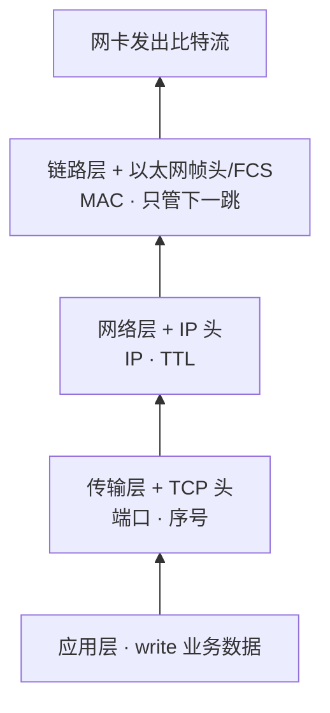

**读图**：从上到下每下一层多一个头，地址越来越「近」——端口指向进程，IP 指向机器，MAC 只指向隔壁一跳。收包时从下到上逐层剥头。


**读图**：

- 从上到下，头越加越多、地址越来越「近」——端口指向**进程**，IP 指向**机器**，MAC 只指向**隔壁一跳**。
- 排障方向跟着地址走：「进程收不到」查端口、「跨网段不通」查 IP/路由、「同网段不通」查 MAC/ARP。
- 收包时反过来，从下到上逐层剥头。

> ⚠️ **别混**：端口是**传输层**的东西——只有 TCP/UDP 有端口，IP 层没有端口；MAC 是**链路层**的。「IP:端口」这个写法横跨两层，别答成「IP 层的端口」。

**关键在最后一层**：TCP 端口、IP 地址封装时都知道（应用调用 `connect` 时就给了），**只有目的 MAC 常常一开始不知道**——它不在应用参数里，要查邻居表或 ARP 问。

### 查路由：这一跳帧交给谁 ⭐

发包前内核先查路由表，决定「下一跳是谁、从哪张网卡出」：

| 对比 | 同网段 | 跨网段 |
|------|--------|--------|
| 查路由结果 | 目的在本地子网，直连 | 走**默认网关** |
| ARP 问谁 | **Server 的 IP** | **网关的 IP**（不问 Server） |
| 帧目的 MAC | Server | 网关 |
| IP 目的 | Server | Server（仍不变） |

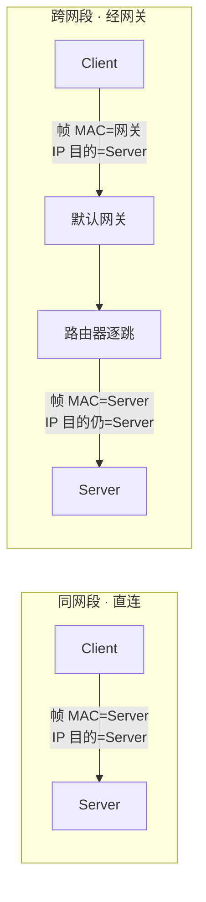

**读图**：左边同网段，ARP 问 Server、帧直送 Server；右边跨网段，ARP 问网关、帧先给网关，**IP 头目的始终是 Server**。MAC 每跳换，IP 通常不变。

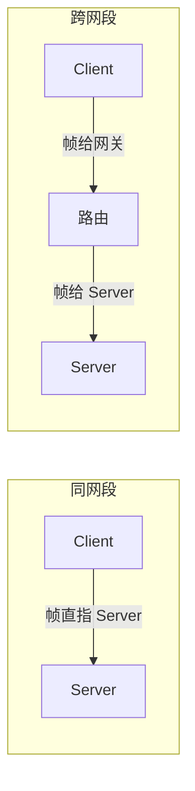

> ⚠️ **别混**：跨网段时「帧给网关、IP 仍写 Server」——**帧的 MAC 每跳都换，IP 头目的通常不变**。这一句是本节最常考。

> 🔍 **现场**：不确定某个目的走哪张网卡、下一跳是谁（多网卡机器、容器宿主机尤其容易搞错）：
>
> ```bash
> ip route get 10.11.21.74     # 直接告诉你：走哪个 dev、下一跳 via 谁、源 IP 用哪个
> ip route                     # 看完整路由表；default via ... 就是默认网关
> ```

### 为什么还要 ARP？⭐

> 📝 **面试**：问「封装时 TCP/IP/MAC 都填好，为什么还要 ARP」，别答「要解析 IP」，要答到「**目的 MAC 常常一开始不知道**」。

ARP 把「下一跳 IP」翻译成 MAC。谁要发包、谁缺下一跳 MAC，谁就问——客户端、服务端、路由器都会问，不是只有客户端问服务端。问过一次进 `ip neigh` 缓存，之后直接用，**不是每个包都问**。

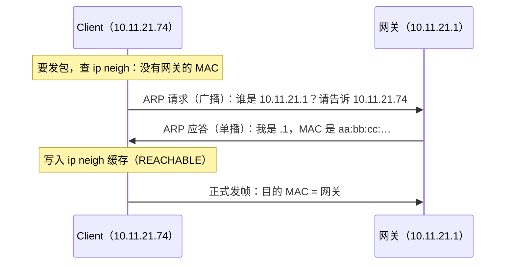

**读图**：**请求是广播**（整个二层都听得见）、**应答是单播**（只回给问的人）；问过一次的答案进缓存，之后发包直接用。面试别答反成「ARP 把 MAC 解析成 IP」——方向是 **IP → MAC**。⭐ 口诀：**「ARP：IP→MAC，别答反」**（练习题 Q1）。

```bash
ip neigh          # 邻居表（ARP 缓存）；REACHABLE 可用，STALE 待复查，FAILED 问不到
```

这一节对应练习题 Q1——出门与 ARP。

好，包出了门。下一站：网络里怎么接力。

---

## 三、上路：网络里怎么接力

> 🎯 **一句话**：交换机只按 MAC 转发；路由器剥帧、看 IP、定下一跳、换 MAC。别把两者搞混。

### 交换机怎么转发

交换机维护一张 **MAC 地址表**（「哪个 MAC 接在哪个口」），转发只看帧的 MAC、不看 IP：

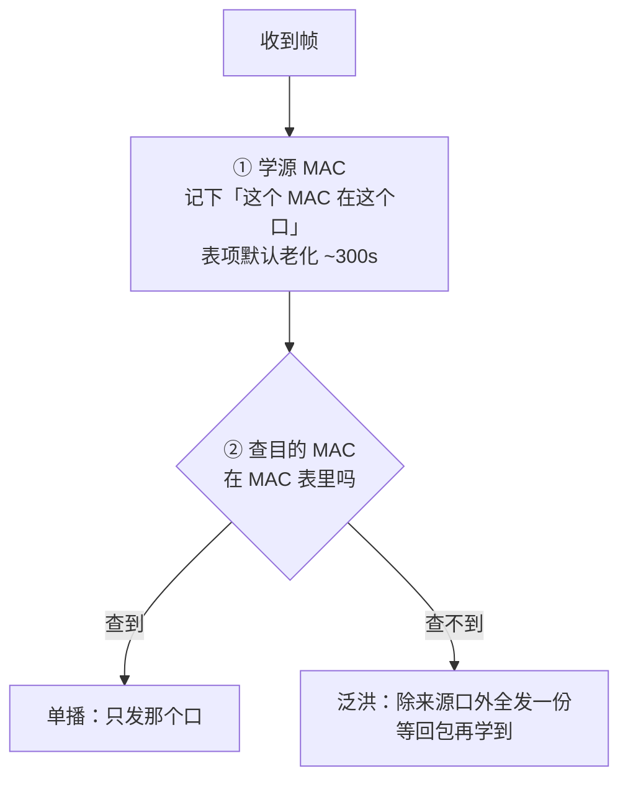

所以同网段里第一次发包常被泛洪、广播多——这是二层正常行为，不是故障。**主机侧看不到交换机的 MAC 表**（那是交换机自己的）；主机上能看的是自己的 ARP 缓存（`ip neigh`，二节）。

> ⚠️ **别混**：交换机学的是 **MAC ↔ 端口**，ARP 学的是 **IP ↔ MAC**——两张表、两个设备各管各的。Linux bridge / 容器网桥的 MAC 转发表用 `bridge fdb show` 看，和交换机 MAC 表是同一回事。

### 路由器每一跳在干什么 🔥

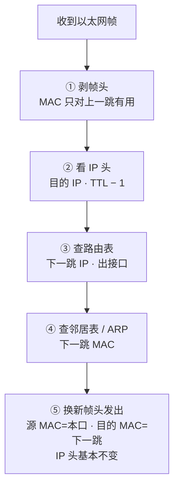

**读图**：路由器是「剥二层、看三层、再封二层」——每一跳只决定**下一跳 MAC**，IP 目的通常一路带到 Server。五步循环直到包到达目的网段。

```text
路由器收到帧：
  1. 剥掉帧头（MAC 只对「上一跳 → 我」有用）
  2. 看 IP：目的 IP 是谁；TTL − 1
  3. 查路由表：下一跳是哪个 IP、出哪个口
  4. 查邻居表：下一跳 MAC 有没有缓存，没有 → ARP 问
  5. 换新帧头发出：源 MAC = 本路由出接口，目的 MAC = 下一跳
     IP 头基本原样（目的仍是 Server）
```

```text
进路由器：[帧: …→本路由MAC][IP: Client→Server][TCP][数据]
出路由器：[帧: 本路由→下一跳MAC][IP: Client→Server][TCP][数据]
              ↑ 换了              ↑ IP 目的不变
```

**TTL 为什么每跳减 1？** 防环路。路由配错时包可能在两台路由之间来回弹，TTL 归零就被丢弃并回一个 ICMP 超时——`traceroute` 正是故意发小 TTL 的包，靠这些 ICMP 逐跳画出路径。

> ⚠️ **别混**：干「剥帧看 IP」的是**路由器（三层）**；交换机（二层）一般**不看 IP**，只按帧里的目的 MAC 转发。所以「同网段不通」查交换机/ARP，「跨网段不通」查路由/网关。

路径上还可能经 NAT / LB / 防火墙——它们可能改 IP:端口或丢包；定责见 [17](../17-iptables与conntrack/)、[16](../16-网络排障与抓包/)。

好，路上讲完。包到了网卡——大家想想：进了网卡就等于进了进程吗？

---

## 四、进门：网卡到进程之间

> 🎯 **一句话**：包进了网卡 ≠ 进了进程。中间隔着「硬中断 + 软中断」，软中断才是真正把包装进 Socket 的那段内核活。

### 门铃与搬货 🔥

> 💡 **打个比方**：网卡来包像门铃响。硬中断是「叮一下」——CPU 记下「有活」马上回去；软中断是「随后把门外的货搬进仓库」——剥头、交 TCP、放进 Socket 缓冲。门铃和搬货是两拨人。

```text
① 硬中断（门铃）   网卡：包到了，叮 CPU 一下 → CPU 记个「有活」，马上回去
② 软中断（搬货）   内核：剥帧 → 看 IP → TCP → 放进 Socket 接收缓冲  ← mpstat 的 %si
③ 进程 read        业务线程：从 Socket 拷到用户态，跑登录/玩法逻辑   ← %us
```

四个执行者各算各的账，先认人再看数：

- **硬中断（门铃，`%hi`，常很小）**：网卡硬件拉线叮 CPU 一下。
- **软中断（搬货，`%si`）**：剥帧 → 看 IP → 交 TCP → 放进 Socket 接收缓冲。
- **业务线程（`%us`）**：跑登录/玩法逻辑。
- **业务 syscall（`%sy`）**：业务线程做 read/write 这些系统调用的部分。

**「硬 / 软」对比的是「谁触发」**：硬中断由网卡硬件触发；软中断是内核在硬中断里记下「有活」、返回后再跑的那段收包活——不是「软弱不重要」，收包重活恰恰在软中断里。

**为什么高 pps 下不会被中断压死？** 现代网卡走 NAPI：硬中断先被临时关掉，软中断里**一次批量捞一串包**，捞完再开中断。所以包越多，反而是「少量中断 + 大批轮询」，代价是这批活全压在软中断上——`%si` 打满就是这么来的。


**读图**：包越多越不靠中断——中断只在「空闲 → 有活」的边沿叮一下，中间全靠软中断轮询批量捞。好处是 CPU 不被门铃淹死；代价是捞包这活全压在软中断上，`%si` 就是这么被打满的。

### 软中断 ≠ 业务进程

**数据是给 ConnServer 的，执行者不是同一个。**

```text
软中断（内核）   把包装进「fd=30 的接收缓冲」  ← 数据已到进程名下，但代码还没跑
业务线程         read(fd=30) 拷到用户态        ← 这才是业务进程在跑
```

> ⚠️ **别混**：CPU 在干活 ≠ 一定在软中断。业务线程算伤害是 `%us`，不是 `%si`；`%si` 高才是「内核接包接不过来」。卡软中断 → 包可能进不了 Socket，Recv-Q 都不一定涨 → [06](../06-CPU与Load/)；过了软中断、进了 Socket、应用不读 → Recv-Q 涨（七节）。

> 🔍 **现场**：怀疑收包侧顶不住，先看是不是**只有一个核**在扛软中断（多队列没生效 / RSS 没打散）：
>
> ```bash
> mpstat -P ALL 1        # 看每个核的 %si；单核 100% 其余闲 = 中断没打散
> cat /proc/softirqs | grep -i net_rx   # NET_RX 是否只集中在一个 CPU 列
> ```

### 收包在哪丢：网卡侧还是内核侧 🔧

进门有两道关，丢包可能丢在任一道，治法完全不同：

```bash
# ① 网卡硬件侧（ring buffer）
ethtool -S eth0 | grep -iE 'rx_missed|rx_no_dma|rx_dropped'   # 硬件丢包计数；非 0 = 包到了网卡但没被 DMA 搬走
ethtool -g eth0                                                # ring buffer 当前/最大；满了用 ethtool -G 调大

# ② 内核软中断侧
cat /proc/net/softnet_stat                                     # 每行一个 CPU；第 2 列 dropped、第 3 列 time_squeeze 非零 = 软中断没捞完
```

```text
ring buffer（环形队列）   网卡收包先搁这儿，等 DMA 搬进内存     ← rx_missed 涨 = 队列满、包被丢
       ↓
软中断（NAPI 轮询）       内核批量捞走、交给 TCP 协议栈        ← softnet_stat dropped/time_squeeze 涨 = 没捞完
       ↓
Socket 接收缓冲                                               ← 到这儿才有 Recv-Q（七节）
```

> 🎯 **判据**：`rx_missed` 涨 → 网卡侧丢，调 ring buffer（`ethtool -G`）；`softnet_stat` dropped 涨 → 内核侧丢，软中断没打散（看 `%si` 单核、RSS/多队列）。一个治队列深度，一个治 CPU 分散，别混。

这一节对应练习题里进门相关题。口诀：**「硬中断叮一下，软中断才搬货」**。

好，货搬进仓库了。下一站是值班最厚的一段：两道队——半连接与全连接。回到开头那个「ESTAB 一排排、业务空白」——往往就卡在这儿。

---

## 五、排队：半连接、全连接、backlog

> 🎯 **一句话**：连接要过两道队——握手没完进「半连接」，握手完了等 accept 进「全连接」；backlog 管的是后一道。

### 先 ESTAB，后 accept ⭐

🔥 很多人会答「ESTAB 了就说明业务能读到了」——**错了**。

```text
① 三次握手完成
② 服务端 TCP 已是 ESTABLISHED，连接进「等 accept」队列（全连接队列）
③ 进程 accept() 把连接领走，变成业务手里的 fd
```

> **accept 不是让连接变成 ESTABLISHED；是把「已经 ESTABLISHED、在门口排队」的连接领进进程。** ⭐ 这是开头那个现场的正解入口（练习题 Q4、Q5）。


**读图**：

- 三次握手是内核干的，`SYN_RCVD` 和 `ESTABLISHED` 两段都在内核里排队，**应用一行代码都没跑**。
- 只有最后 `accept()` 那一步，才把连接交到进程手上。
- 所以「握手完成」和「业务拿到连接」中间隔着一整道队列——这就是全连接队列满时应用毫无感觉的原因。

> ⚠️ **别混**：**状态名有两套写法**——教科书/RFC 793 写 `SYN-RECEIVED`（常记作 **`SYN_RCVD`**），而 Linux `ss` 命令打印的是 **`SYN-RECV`**。面试白板写教科书名，值班认工具名，别当成两个东西。握手每一步的 `seq`/`ack` 和双方完整状态迁移见 [13](../13-TCP与UDP/)。

### 两个队列、两个上限

| 队列 | 含义 | TCP 状态 | 上限看 | 满了的签名 |
|------|------|----------|--------|-----------|
| 半连接 | 握手没完 | `SYN_RCVD`（`ss` 显示 `SYN-RECV`） | `tcp_max_syn_backlog` | 客户端**像丢包**：连不上/超时，**服务端应用日志一片空白** |
| 全连接 | 握手完等领走 | **已是 `ESTABLISHED`**（`ss` 显示 `ESTAB`） | `min(listen backlog, somaxconn)` | `ss -lntp` 的 Recv-Q 顶满 Send-Q |

> ⚠️ **别混**：`tcp_max_syn_backlog` 管**半连接**，`somaxconn` + `listen()` 管**全连接**，只改一边，另一种满照样挂。半连接满最坑的地方是**应用完全无感**——连接还没到应用手里就被丢了，别在业务日志里找原因。

### backlog 是什么 ⭐

> 💡 **打个比方**：餐厅门口取号排队。`listen(fd, backlog)` 是「门口最多排多少位」，`accept()` 是「叫号领位」。握完手的人已经在排队（ESTAB 了），只是还没被领进店（accept）。

```text
listen(fd, 128)      ← 程序说：门口最多排 128
somaxconn = 128      ← 内核说：全机上限 128
生效长度 = min(128, 128) = 128

已有 128 条握手完没 accept，第 129 个再来 → 队列满，进不来
```

只把程序 backlog 改成 4096、内核 `somaxconn` 还是 128 → 生效仍是 **128**。两边都要够。容器里 somaxconn 在 Pod netns，只改宿主机不一定进 Pod。

> 📝 **面试**：「accept 队列满了，连接还能进 ESTAB 吗？」——服务端的新连接**不能**（进不了等 accept 的队）；客户端**有可能**显示 ESTAB（它发完第三次 ACK 自己就进 ESTAB 了），一发数据才暴露。Linux 默认 `tcp_abort_on_overflow=0`，队列满时静默丢收尾；设成 `1` 则直接回 RST。

### 现场：怎么证明是队列满 🔧

> 🔍 **现场**：「新玩家进不去、老玩家都好」，先分半连接还是全连接。

```bash
ss -lntp
# State  Recv-Q Send-Q Local Address:Port
# LISTEN 128    128    0.0.0.0:4103        ← Recv-Q 顶到 Send-Q = 全连接队列满

ss -s
# TCP:   9421 (estab 9280, closed 12, orphaned 0, timewait 8), ports 0
#        synrecv 1024                      ← synrecv 大量堆积 = 半连接侧压力

nstat -az | grep -iE 'ListenOverflows|ListenDrops'
# TcpExtListenOverflows  8321   ← 全连接队列满而丢掉的连接数（累计，关键看「在涨吗」）
# TcpExtListenDrops     10240   ← LISTEN socket 上被丢的连接总数（含 overflow + 其它原因）
```

**两个计数怎么用**：

- `ListenOverflows` 涨 → 明确是**全连接队列满**。
- 只有 `ListenDrops` 涨而 Overflows 不涨 → 丢在别处（内存不足、半连接等）。
- 两个都是**累计值**，连采两次看差值，别看绝对数。

这一节对应练习题 Q4、Q5——排队与 backlog。口诀：**「ESTAB ≠ 业务能读；中间还隔着 accept」**。

好，队排完了。下一站：accept 领号、fd、epoll。

---

## 六、领号：Socket、accept、fd、epoll

> 🎯 **一句话**：Socket 是内核里的「连接实体」，fd 是进程手里指向它的号码牌；accept 才诞生业务 fd，epoll 负责一个人盯几万个号码牌。

### Socket 到底是什么 🎯⭐

**Socket = 内核里的一个通信端点对象**，它记着：

- 这条连接的**四元组**和**状态**（LISTEN/ESTAB…）
- **收发缓冲**和各种 **TCP 参数**

**进程碰不到网卡，也碰不到 IP 包**——进程能做的只有「拿着 fd 对这个内核对象读写」，剩下的封包、选路、重传全是内核的活。


一个 Socket 由**四元组**唯一确定：`(源IP, 源端口, 目的IP, 目的端口)`。LISTEN 的那个是特例——它只有本地 `IP:端口`，还没有对端。

**服务端和客户端的 syscall 链不同**，这条链本身就是常考题：

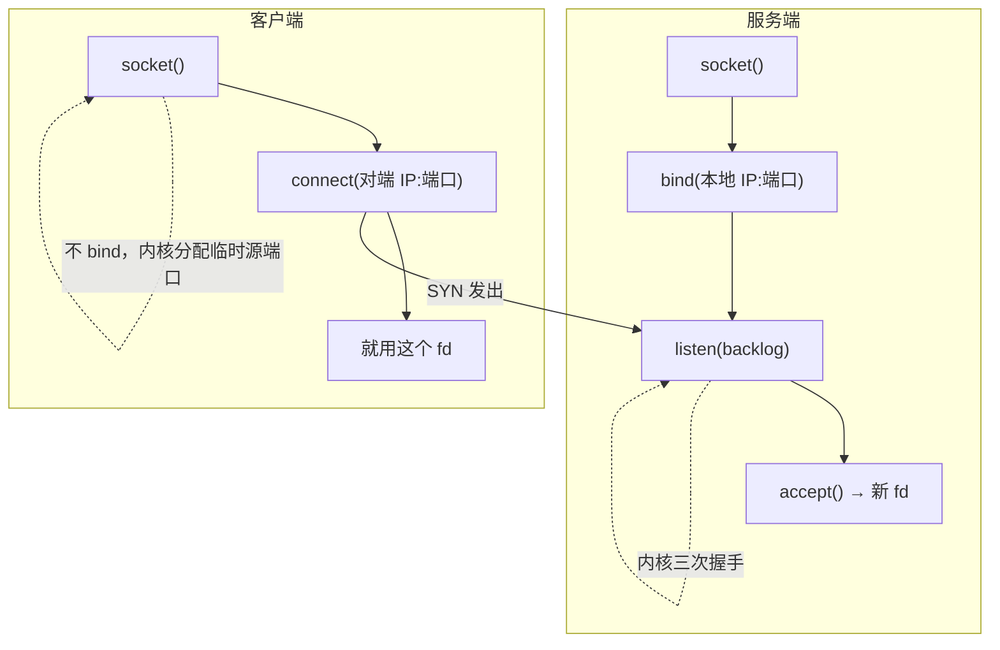

**读图**：建连是内核干的（虚线），应用只负责「开门 / 敲门 / 领人」。服务端每 accept 一次多一个 fd；客户端 connect 后直接用原 fd。

- 服务端：`socket()` → `bind(IP:端口)` → `listen(backlog)` → `accept()` → 新 fd（每连一条）
  - `bind` 绑地址
  - `listen` 挂上门牌开始排队
  - `accept` 领人进来
- 客户端：`socket()` → `connect(对端IP:端口)` → 就用这个 fd
  - 不 bind，内核自动分配临时源端口

> ⚠️ **别混**：`bind` 是「占本地地址」，`listen` 是「变成能排队的门」，`accept` 是「领一个人进来」。三个都不是「建立连接」——建连是内核的三次握手干的，`accept` 只是把已建好的连接交给应用。

### bind 绑哪个地址：端口在听却连不上 ⭐🔧

`bind` 时给的 IP 决定「从哪些网卡进来的连接能被收下」，这是「端口明明在 LISTEN，却怎么都连不上」的头号原因：

```text
ss -lntp 左边显示什么           含义                      从外面能连吗
0.0.0.0:4103  （或 *:4103）    所有网卡                  ✅ 能
10.11.21.74:4103               只有这张网卡这个 IP        ⚠️ 只能连这个 IP，连别的 IP 直接拒
127.0.0.1:4103                 只有本机回环              ❌ 机器外/Pod 外一律连不上
[::]:4103                      IPv6 通配（常同时收 v4）   ✅ 视 bindv6only 设置
```

> 🔍 **现场**：`telnet` 不通但 `ss -lntp` 明明有这个端口 → **先看左边绑的是什么**，不是先查网络、不是先改安全组。容器里最常见的坑：应用配置写了 `127.0.0.1`，Pod 内 curl 通、Service 一律不通。

### accept 才诞生 fd ⭐

**内核里的连接 ≠ 进程里的 fd 编号。** 握手完连接已是 ESTAB、挂在等 accept 队列里，但进程 fd 表里还只有那扇门（LISTEN fd）；`accept()` 返回后，才多出一个新编号（如 fd=30）。

**fd（file descriptor）** = 进程里的一个小整数，指着内核里的一个打开对象（这里是 Socket）。**一个连接一个 fd，不是一条连接一个线程**——万级连接靠少量线程 + epoll 盯很多 fd，谁有数据谁处理。

```bash
ls -l /proc/$(pgrep -f connserver)/fd | wc -l   # 这个进程当前占了多少 fd
ss -antp | grep 4103 | head -3
# users:(("connserver",pid=1234,fd=46))         ← 这条连接在进程里的 fd 编号就是 46
```

### epoll：为什么扛得住万级连接 ⭐

> 💡 **打个比方**：select/poll 像「每次挨个房间敲门问有没有事」；epoll 像「前台登记，哪个房间按铃了才叫你」。连接再多，epoll 也只处理「有事」的那几个。

| 机制 | 怎么干 | 万级连接时 |
|------|--------|------------|
| select / poll | 每次把一堆 fd 全扫一遍 | 连接越多越慢（O(n)） |
| epoll | 一次登记 fd，内核只回报「就绪的」 | 连接多也只处理有事的（O(就绪数)） |

**LT 与 ET（一句）**：

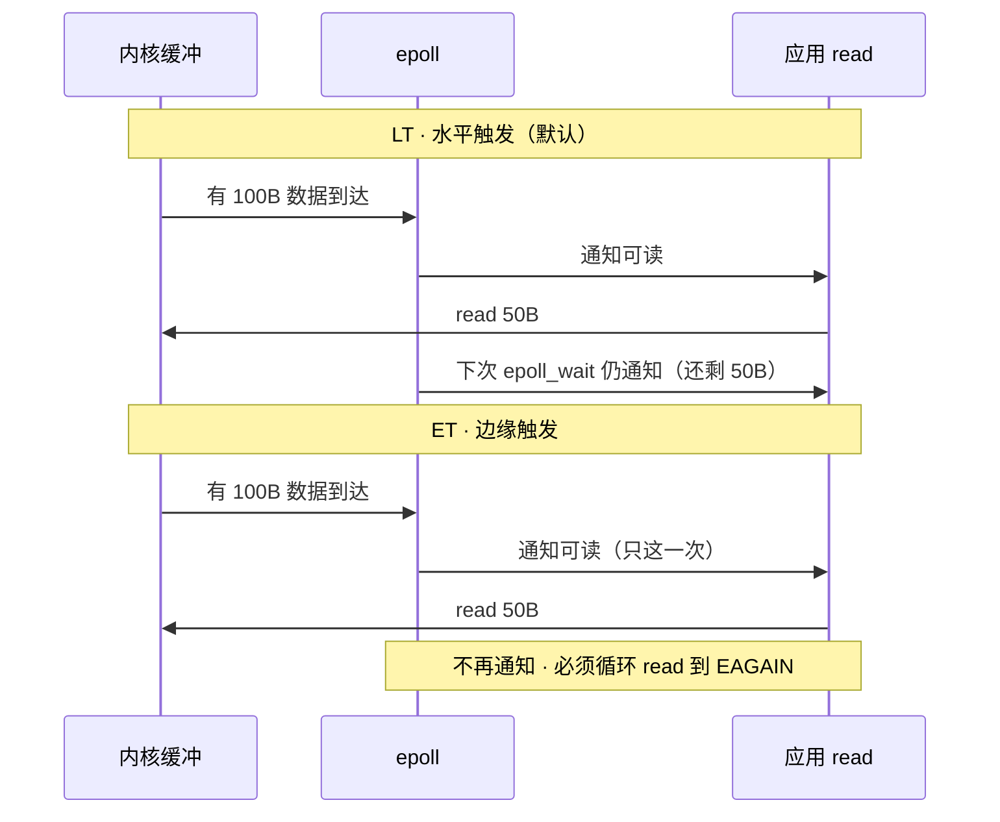

**读图**：LT 像「没读完就反复提醒」；ET 像「门铃只响一次，你必须一次搬空」。ET 写漏了后半段数据，连接会「假死」——缓冲里还有字节，但 epoll 不再叫你。

- **LT（水平触发，默认）**：只要缓冲里还有数据，每次 `epoll_wait` 都继续报——没读完下次还提醒，**好写不易漏**。
- **ET（边缘触发）**：只在「从无到有」那一下报一次，必须一次循环 `read` 到 `EAGAIN` 读干净，否则剩下的数据再没人叫你——高性能网关常用 ET，写错就是「连接莫名卡住」。

> ⚠️ **别混**：epoll 说「可读」≠ 应用已 read 完。包进了缓冲、业务线程卡住不读，`ss` 上 ESTAB Recv-Q 照样涨。**epoll 只负责通知，不负责搬**。口诀：**「epoll 只通知，不搬货」**（练习题 Q8）。

好，号码牌领到手了。下一站：干活时看 Recv-Q / Send-Q——本章最易混。

---

## 七、干活：Recv-Q / Send-Q

> 🎯 **一句话**：同一个名字，LISTEN 和 ESTAB 下完全不是一回事——一个数「连接个数」，一个数「数据字节」。这是本章最易混。

### 两套含义 ⭐🔥

```text
LISTEN  Recv-Q / Send-Q  →  连接「个数」/ 上限
ESTAB   Recv-Q / Send-Q  →  数据「字节」
```

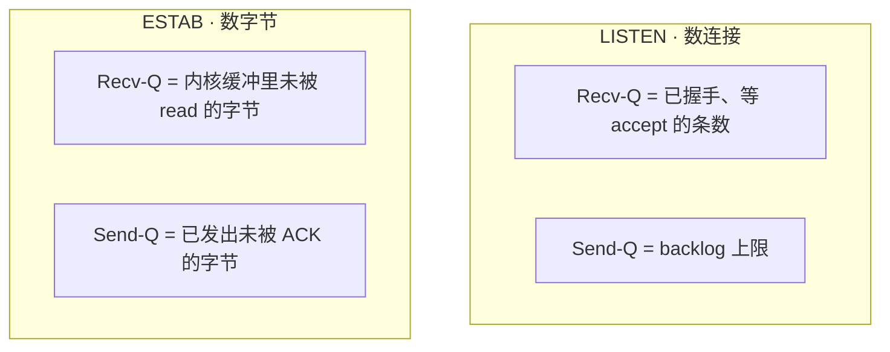

**读图**：同一个 `ss` 列名，LISTEN 行数「人」，ESTAB 行数「字节」——把 ESTAB 的 Recv-Q 当成「25 万条连接」是经典误判。

> 💡 **打个比方**（餐厅）：LISTEN 的 Q 是「门口取号的人数 vs 最多排多少位」；ESTAB 的 Q 是「入座后桌上堆着还没上的菜 vs 端出去还没回执的菜」。

| 字段 | LISTEN | ESTAB |
|------|--------|-------|
| Recv-Q | 等 accept 的**连接数** | 未被应用 read 的**字节** |
| Send-Q | backlog **上限** | 已发出未被对端确认的**字节** |
| 满了治什么 | 加大 backlog + 加速 accept | 查应用消费 / 查对端 |

### 一行 `ss` 输出怎么读 🔧

> 🔍 **现场**：同一个端口会**同时**出现在 LISTEN 和一堆 ESTAB 里，先认清自己在看哪一种。

```bash
ss -lntp   # -l 只看 LISTEN
# State   Recv-Q  Send-Q  Local Address:Port  Peer Address:Port  Process
# LISTEN  1       128     0.0.0.0:4103        0.0.0.0:*          users:(("connserver",pid=1234,fd=3))
#         ↑ 1 条连接已 ESTAB 在等 accept      ↑ LISTEN 没有对端    ↑ fd=3 是那扇「门」
#                 ↑ 生效 backlog 上限 128

ss -antp   # -a 全部状态、-n 不解析端口名
# ESTAB   256000  0       10.11.21.74:4103    203.0.113.9:54321  users:(("connserver",pid=1234,fd=46))
#         ↑ 约 250KB 没人 read（不是 25 万个连接！）           ↑ 每条 ESTAB 各有自己的 fd
```

**参数字母记牢**（值班天天敲）：

- `-n` 不解析成服务名（快、不骗人） · `-t` 只 TCP · `-u` 只 UDP
- `-l` **只** LISTEN · `-a` 所有状态
- `-p` 显示进程和 fd · `-i` 显示 TCP 内部信息（→[13](../13-TCP与UDP/)）
- `-s` 汇总统计 · `-m` 看内存占用

> ⚠️ **别混**：`-l` 和 `-a` 不能叠出「只要 ESTAB」——要用状态过滤：`ss -ant state established`、`ss -ant state time-wait`。

### 涨了先查谁 🎯

> ⚠️ **别混**：LISTEN 顶满加大 rmem **没用**（那是连接个数，不是缓冲字节）；ESTAB Recv-Q 涨先问「谁不 read」，不是先加大缓冲。口诀：**Recv-Q 涨先问「谁不 read」；只有确认应用在读仍顶满，才谈加大 rmem。**

**那什么时候才该加大 rmem/wmem？** 只有一种正当理由：**带宽时延积（BDP）装不下**。BDP = 带宽 × RTT，跨海高带宽长肥管道时，默认缓冲确实不够，窗口开不大，吞吐被钉死。

```text
BDP = 带宽 × RTT
例：100 Mbps × 200 ms = 100e6/8 × 0.2 ≈ 2.5 MB   ← 缓冲小于这个数，跨海就跑不满

sysctl net.ipv4.tcp_rmem    # 三个值：min  default  max（内核按需在区间内自动伸缩）
sysctl net.ipv4.tcp_wmem
```

判据：`retrans` 不涨、应用确实在读、`rtt` 高且稳、吞吐卡在远低于带宽的位置 → 才谈加大 max 值。**应用不读导致的 Recv-Q 涨，加多少缓冲都是往漏桶里灌水。**

### 收束：包进进程要过哪几道关 🎯⭐

到这里，「网卡之后、进程之前」的关口全齐了。面试问「连接明明 ESTAB，业务为什么收不到数据」，要的就是这条通关路径——**四道关，各有一个上限、各有一种「满」的签名**：


**读图**：四道关串行，任何一道「满」了，现象都是「连不上 / 收不到」，但签名互不相同：

- ① 满 → `%si` 单核打满（四节）
- ② 满 → `synrecv` 堆积、**应用日志空白**（五节）
- ③ 满 → `ss -lnt` Recv-Q 顶满 Send-Q、`ListenOverflows` 涨（五节）
- ④ 满 → `Too many open files`（六节）

过了四道关、Recv-Q 还涨，才是应用不 read（七节）。**按关定位，不按感觉猜。**

- **① 中断关**：上限是单核 `%si`，治 RSS / 多队列打散（→[06](../06-CPU与Load/)）。
- **② 半连接关**：上限 `tcp_max_syn_backlog`，满了客户端像丢包、**应用完全无感**。
- **③ 全连接关**：上限 `min(listen backlog, somaxconn)`，容器里是 Pod netns 自己的值。
- **④ 领号关**：上限 `ulimit -n` / `fs.file-max`，accept 太慢照样堵。

> ⚠️ **别混**：四道关全过 ≠ 业务健康——`read` 之后业务线程还可能卡在 DB/RPC 上（探活分层见 [13](../13-TCP与UDP/)）。反过来，处方也不通用：`%si` 满调 `somaxconn` 没用，队列满调 `rmem` 没用，fd 满调队列没用——**先认签名再动手**。

> 📝 **面试**：按「**两中断、两队列、一领号、一缓冲**」背——硬/软中断进门，半/全连接排队，accept 领号诞生 fd，Recv-Q 等应用 read。再补一句「每关有自己的上限参数和溢出签名，处方互不通用」，就是完整答案。练习题 Q9、Q10。

好，干活讲完。连接怎么谢幕？下一站：出站、TW / CW / RST。

---

## 八、回家与谢幕：出站、TW / CW / RST

> 🎯 **一句话**：出站就是服务端当客户端再走一遍「出门」；正常关走挥手留 TW，忘 close 停 CW，粗暴掐断是 RST。

### 出站：左边是临时端口 🔧

进站是「别人连我的服务口」；出站是「我连别人」。`ss` 认法：

```text
进站：ESTAB  74:4103 → 玩家IP:临时口   ← 左边服务口（在 LISTEN 里）
出站：ESTAB  74:46152 → 47:5342       ← 左边临时口（不在 LISTEN 里）
```

左边端口是「服务端口」= 进站；左边是「临时大端口」= 出站。

**临时端口从哪来、什么时候会耗尽？**

客户端 `connect` 时不 `bind`，内核从 `ip_local_port_range`（默认约 **32768–60999，约 2.8 万个**）里挑一个。耗尽的条件**不是**「连接数超 2.8 万」，而是**四元组撞了**：

```text
四元组只要有一元不同就是新连接，所以
  连不同的对端 IP:端口  → 同一个源端口可以复用   ✅ 不容易耗尽
  疯狂短连同一个 DB:3306 → 源端口是唯一变量 + 每次 close 留 60s TIME_WAIT
                          → 2.8 万 / 60s ≈ 每秒 466 条新连接就见底  ⚠️
```

治法优先级：**连接池 / 长连接** ＞ 扩 `ip_local_port_range` ＞ 别的。不要靠砍 TIME_WAIT 保命。

### TIME_WAIT vs CLOSE_WAIT ⭐

（挥手时序细节见 [13](../13-TCP与UDP/)；这里讲「在 `ss` 上怎么认、谁进哪个」。）

| 对比 | TIME_WAIT | CLOSE_WAIT |
|------|-----------|------------|
| 谁进 | **主动关闭方**（先 close 先发 FIN） | **被动方**（收到 FIN，应用还没 close） |
| 等什么 | 2MSL（~60s） | 应用 `close()` |
| 自己会消吗 | 会 | 不 close 一直挂 |
| 多了 | 短连接常见，常正常 | **持续涨 = 代码 bug** |

**为什么 TW 要等 2MSL？** ① 保证最后 ACK 能到对端（对端没收到会重发 FIN）；② 让旧包从网络消失，防串进复用同四元组的新连接。

### 换边：谁先关谁 TW 🔥

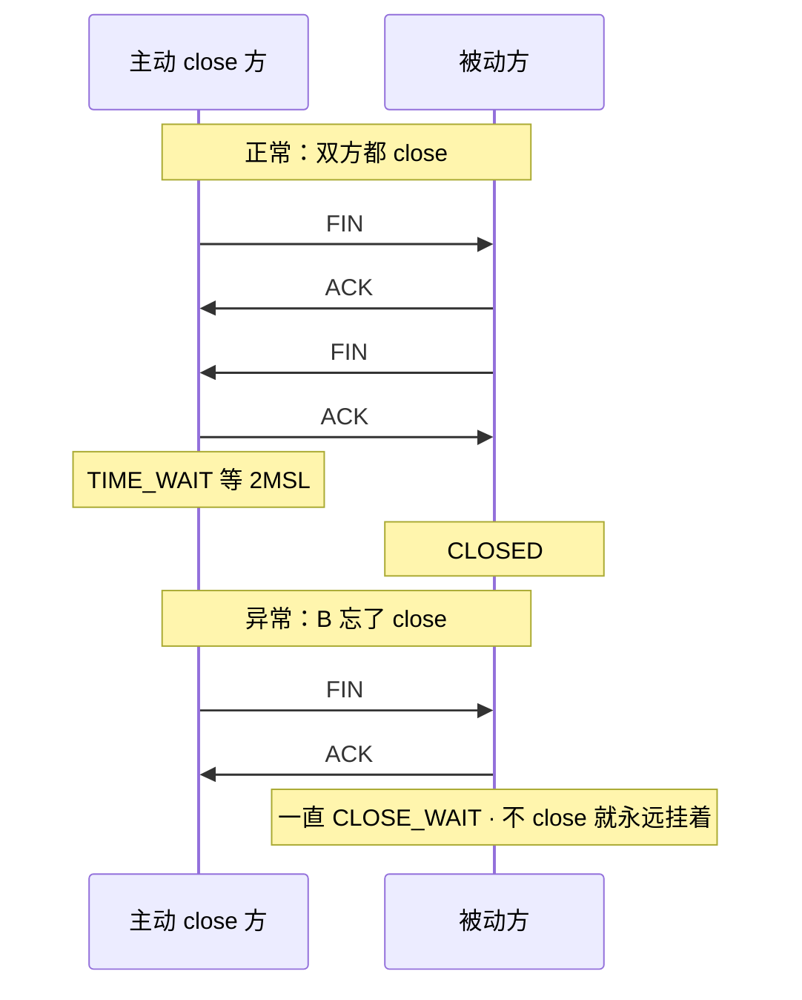

**读图**：谁先发 FIN 谁走 TIME_WAIT 线；对方若只 ACK 不 close，就停在 CLOSE_WAIT——与「客户端 / 服务端」角色无关。

常见短连接：
- 客户端 close → 客户端 = TIME_WAIT（正常冷却）
  - 服务端若及时 close → 正常结束
  - 服务端忘了 close → 服务端 = CLOSE_WAIT（有问题）

反过来也可以：
- 服务端主动踢人 close → 服务端 = TIME_WAIT
  - 客户端不 close → 客户端 = CLOSE_WAIT

> ⚠️ **别混**：不是「客户端=TW、服务端=CW」的铁律。铁律是「**谁先关谁进 TW，谁忘了 close 谁进 CW**」。

### RST：粗暴掐断

RST 一包直接拆，缓冲里未读数据常直接丢。常见原因：

- 端口无人听、防火墙拒
- 应用 `SO_LINGER`、队列满且 `abort_on_overflow=1`
- 停服直接 `kill -9`

排障抓包见 RST → 先分清**本机发还是对端发**（[16](../16-网络排障与抓包/)）；优雅停服见 [05](../05-进程与信号/)。

```bash
ss -ant state time-wait | wc -l
ss -antp state close-wait | awk '{print $NF}' | sort | uniq -c | sort -rn   # CW 集中在哪个进程
```

这一节对应练习题 Q11、Q12、Q13——回家与谢幕。口诀：**「谁先关谁 TW，谁忘 close 谁 CW」**。

好，机制讲完了。回到开头那个开服现场——正确的 60 秒该怎么走？

---

## 九、生病：四个「满」+ 定责

> 🎯 **一句话**：本机「满」通常就四种——LISTEN 队列、conntrack、fd、临时端口。先认签名，再对症。

### 四个「满」

| 满了谁 | 签名现象 | 第一刀 |
|--------|----------|--------|
| LISTEN 队列 | Recv-Q 顶满 Send-Q，新连接进不来 | `ss -lntp` · `nstat \| grep Listen` |
| conntrack | **新连接挂、老连接不挂** | `conntrack -C` vs `nf_conntrack_max` |
| fd | 日志 `Too many open files` | `/proc/<pid>/fd` 个数 vs `limits` |
| 临时端口 | **出站**失败 + TIME_WAIT 多 | `ip_local_port_range` · `ss -s` |

**conntrack 满为什么「新挂旧不挂」？**

- 表满时，**已建立连接的表项还在**，照常按原表项转发——在线玩家毫无感觉。
- 新连接需要**新建**一条表项，建不上就被丢——「新玩家一个都进不来」。

现象就是「新玩家进不来、老玩家好得很」，这个**不对称**就是表类故障的签名。

> ⚠️ **别混**：安全组/防火墙误改常是**新旧一起死**（老连接的包也开始被拒）。**「新挂旧不挂」优先查 conntrack**，别先动安全组、更别先重启战斗服（一重启老连接也没了，反倒把唯一的线索销毁）。

**单机能扛多少连接？** 不是拍一个数，是取四个上限里最小的那个：

```text
单机连接上限 ≈ min( fd 上限,  内存 / 每连接开销,  conntrack 余量,  出站端口余量 )
                  ulimit -n     每条几 KB~几十 KB      nf_conntrack_max    仅出站才受限
                  /proc/sys/fs/file-max
```

进站连接**不吃临时端口**（服务端口固定，变的是对端），所以「进站 6 万上限」是误解；出站才受 2.8 万临时端口约束。

### 定责决策树

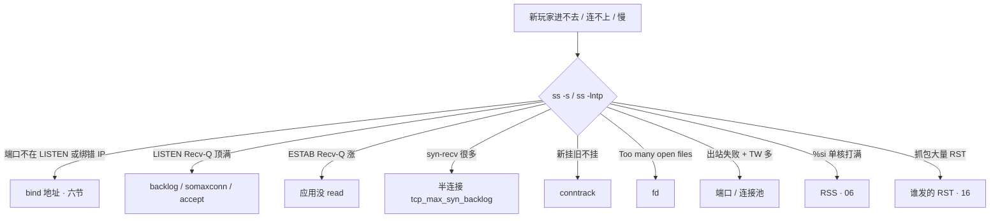

### 现象 · 先做 · 别做

| 现象 | 先做 | 别做 |
|------|------|------|
| 端口在听却连不上 | 看绑的 IP（`0.0.0.0` vs `127.0.0.1`/具体 IP） | 先查网络、先改安全组 |
| LISTEN Recv-Q 顶满 | 加大 backlog + 加速 accept | 加大 rmem |
| 连不上但应用日志空白 | 查半连接 `synrecv` / `ListenDrops` | 在业务日志里找原因 |
| ESTAB Recv-Q 涨 | 查线程 / GC | 先调 TCP 窗口 |
| ESTAB Send-Q 涨 | 对端 ZeroWindow → 13 | 本端 sndbuf 当根因 |
| 新挂旧不挂 | conntrack | 先改安全组、重启战斗服 |
| TW 爆炸 | 连接池 / Keep-Alive | recycle、砍 2MSL |
| CW 持续涨 | 修 close() | 只调 fin_timeout |

### 60 秒剧本 🔧

> 🔍 **现场**：接到「连不上/慢」报障，60 秒走完这条线。

```text
① 0–10s  `ss -lntp`：端口在听吗？绑的 0.0.0.0 还是 127.0.0.1？Recv-Q 顶满没？
② 10–30s `ss -antp`：ESTAB Recv-Q 涨 = 应用不读；一堆 TW = 短连接；一堆 CW = 没 close
③ 30–45s `ss -s` + `nstat`：synrecv 多 = 半连接；ListenOverflows 涨 = 全连接满
④ 45–60s 再排「满」：conntrack -C / fd 个数 / 临时端口，定型定责各走各的树
```

这一节对应练习题 Q7、Q14——四个满与定责。

现在再看开服那个现场——「ESTAB 一排排、业务空白、要重启战斗服」——你知道该怎么拦住他了：先 `ss -lntp` 看 LISTEN 的 Recv-Q，再看 synrecv / ListenOverflows；包可能卡在全连接队列里，业务日志一片空白是正常的。

---

## 十、收口
### 命令速查 🔧

```bash
# 看门（服务端口）
ss -lntp                          # 谁在听、绑哪个 IP、backlog、等 accept 个数
# 看连接
ss -antp                          # 全部 TCP + 进程 + fd
ss -ant state established         # 只要 ESTAB（-l/-a 叠不出来）
ss -ant state time-wait | wc -l   # TW 计数
ss -s                             # 汇总：estab / timewait / synrecv
# 看丢在哪
nstat -az | grep -iE 'ListenOverflows|ListenDrops'   # 队列溢出（连采两次看差值）
conntrack -C; sysctl net.netfilter.nf_conntrack_max  # conntrack 余量
# 看路和邻居
ip route get <目的IP>; ip route; ip neigh
# 看收包侧
mpstat -P ALL 1; cat /proc/softirqs | grep -i net_rx
# 看 fd 与端口
ls /proc/{pid}/fd | wc -l; cat /proc/{pid}/limits; sysctl net.ipv4.ip_local_port_range
```

### 面试锚点

遮住右列自问自答，卡壳的行回去重读对应小节：

| 问 | 30 秒答 |
|----|---------|
| OSI 七层 vs TCP/IP 四层？ | 七层是理论模型（物理·链路·网络·传输·会话·表示·应用）；工程实现是四层，上三层合成应用层。 |
| 四层 LB vs 七层 LB？ | 四层认 IP+端口只转发不看内容；七层认 URL/Host 能按内容路由、能改包。 |
| Socket 属于哪一层？ | 不是一层，是应用层与传输层之间的编程接口。 |
| 端口属于哪一层？ | 传输层；IP 是网络层，MAC 是链路层。 |
| 跨网段第一跳帧交给谁？ | 默认网关；ARP 问网关 IP，不是 Server。 |
| 路由器每跳干什么？ | 剥帧 → 看 IP、TTL−1 → 定下一跳 →（必要时）ARP → 换 MAC。 |
| 为什么还要 ARP？ | 目的 MAC 常常一开始不知道，要查邻居/ARP。 |
| 软中断是啥？ | 内核收包那段活，`%si`；业务跑是 `%us`。 |
| Socket 是什么？ | 内核里的通信端点（四元组+状态+缓冲）；进程只能拿 fd 读写它。 |
| 服务端 syscall 链？ | socket → bind → listen → accept；客户端 socket → connect。 |
| 端口在听却连不上？ | 先看 bind 的 IP：`127.0.0.1` 外面一律连不上。 |
| LISTEN vs ESTAB 的 Q？ | 连接个数/上限 vs 未读/未确认字节。 |
| 有效 backlog？ | min(listen backlog, somaxconn)。 |
| 半连接上限看谁？ | `tcp_max_syn_backlog`；满了应用日志无感。 |
| 握手完就有业务 fd？ | 否，accept 后才诞生。 |
| epoll 强在哪？LT/ET？ | 只回报就绪 fd；LT 会重复提醒，ET 只报一次必须读干净。 |
| 进站 vs 出站？ | 左边服务口=进站；左边临时口=出站；只有出站吃临时端口。 |
| TW vs CW？ | 谁先关谁 TW；谁忘 close 谁 CW。 |
| 新挂旧不挂？ | 优先 conntrack：老表项在、新表项建不上。 |
| ESTAB 但业务收不到？ | 四道关逐个排：`%si` 满 / synrecv 堆 / LISTEN 顶满 / fd 尽；全过还涨 = 应用不 read。 |
| 什么时候才加大 rmem？ | BDP 装不下（跨海高带宽）且应用确实在读。 |

### 易错一句话对照

- 只背 OSI 七层 → 要补一句「实际跑的是 TCP/IP 四层，上三层合成应用层」
- Socket 是独立一层 → 是接口，不是分层模型里的层
- MAC 封装时就填好 → 常后补，靠 ARP
- 交换机看 IP 选路 → 交换机认 MAC，路由器看 IP
- 两个 Recv-Q 一回事 → LISTEN 个数 / ESTAB 字节
- 加大 rmem 治 LISTEN 顶满 → 没用；只有 BDP 装不下才加
- 绑 `127.0.0.1` 和 `0.0.0.0` 一样 → 前者机器外一律连不上
- 客户端=TW 服务端=CW → 谁先关谁 TW，谁忘 close 谁 CW
- 软中断是业务代码 → 是内核收包，`%si`
- 进站连接吃临时端口 → 只有出站吃
- epoll 报可读就等于读完了 → 只是通知，Recv-Q 照样能涨
- 半连接满能在应用日志里看到 → 看不到，连接还没到应用
- ESTAB 就是数据能到业务 → 中间还有四道关；全过了 Recv-Q 还涨 = 应用不 read

### 数字墙

> OSI **7** 层 / TCP-IP **4** 层 · somaxconn 常 **128** · 临时端口 **32768–60999（≈2.8 万）** · 2MSL **~60s** · conntrack 告警 **80%** · MSS **~1460** · MTU 常 **1500** · TTL 初值常 **64**

---

## 合上书

对照练习题「合上书」逐条过；卡壳回对应节，做完对应题：

- [ ] **默画一节的图**：出门 → 上路 → 进门 → 排队 → 领号 → 干活 → 回家；`ss` 照哪四段（→ Q1、Q14）。
- [ ] **默画分层**：OSI 七层自下而上背全，映射到 TCP/IP 四层，每层给一个代表协议、一个代表设备、一个代表地址；再说清「Socket 为什么不是一层」（→ Q1）。
- [ ] **口述出门**：四层各加什么头、端口属于哪层、为什么还要 ARP、跨网段帧交给谁、IP 目的变不变（→ Q1）。
- [ ] **口述上路**：路由器每跳五步、TTL 为什么减 1、交换机和路由器差在哪。
- [ ] **口述进门**：硬中断 vs 软中断、`%si` vs `%us`、软中断为什么不是业务进程、NAPI 为什么不会被中断压死。
- [ ] **默画排队**：半连接 → 全连接 → accept 三段，标出**每段的 TCP 状态位**（`SYN_RCVD` / 已是 `ESTABLISHED`）、两个上限看谁、两种满各是什么签名（→ Q4、Q5）。
- [ ] **口述 Socket**：Socket 是什么、服务端/客户端 syscall 链、绑 `0.0.0.0` vs `127.0.0.1`、accept 才诞生 fd、epoll 与 LT/ET（→ Q8）。
- [ ] **口述干活**：LISTEN vs ESTAB 的 Q、`ss` 一行六列怎么读、什么时候才加大 rmem（BDP）（→ Q9、Q10）。
- [ ] **口述回家**：出站怎么认、临时端口何时耗尽（每秒 466 条那个算式）、TW vs CW、RST 怎么来的（→ Q11、Q12、Q13）。
- [ ] **定责**：四个「满」各看什么、conntrack 为什么新挂旧不挂、单机连接上限取哪四个最小值（→ Q14）。

下一章：[TCP 与 UDP](../13-TCP与UDP/)。抓包：[16](../16-网络排障与抓包/)。软中断：[06](../06-CPU与Load/) · conntrack：[17](../17-iptables与conntrack/) · sysctl：[24](../24-内核参数与sysctl/)。
