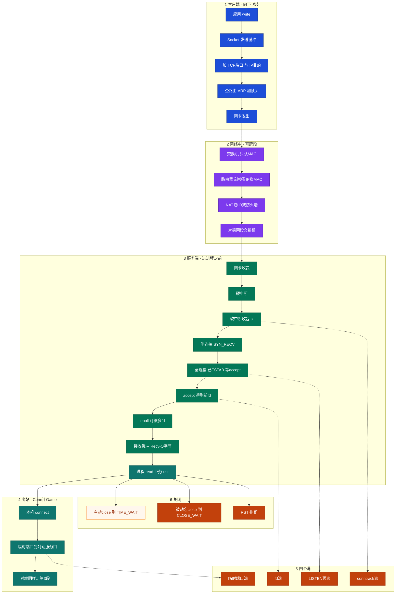
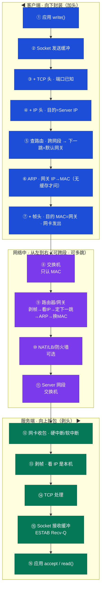
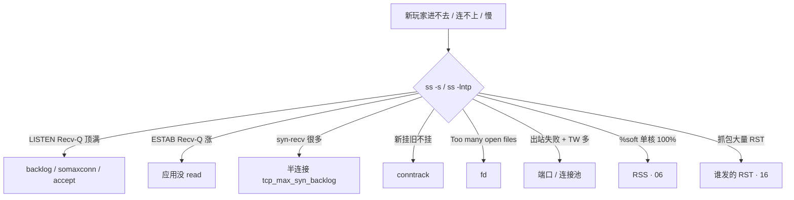

# 网络栈与 Socket

> **这章解决什么**：包怎么在网络里走？到了机器后怎么进进程？新玩家进不去、在线还在——卡在哪？  
> **读法**：**先看总图** → **再认名词** → **再分节抠 Socket/队列**。  
> **刻意不展开**：TCP 握手/重传/窗口 → [13](../13-TCP与UDP/)；抓包手法、MTU 排障细节 → [16](../16-网络排障与抓包/)。

---

## 本章目录

1. [本章定位](#1-本章定位)
2. [先看总图：数据包在网络里怎么流转](#2-先看总图数据包在网络里怎么流转) ← **开篇必读**
   - [2.0 全章知识串图](#20-全章知识串图一张把细节串起来) ← **架构总览**
   - [2.6 Conn 进站](#26-完整走读玩家-client--connserver) · [2.7 单进程](#27-假想conn-单进程不搞多线程整条链路串一遍) · [2.8 出站](#28-出站走读conn--gameserver对称的另一半)
3. [名词扫盲（对照总图认词）](#3-名词扫盲对照总图认词)
4. [Socket 与连接状态](#4-socket-与连接状态)
5. [Recv-Q / Send-Q：本章最易混](#5-recv-q--send-q本章最易混) ← **重点精读**
6. [半连接、全连接与 backlog](#6-半连接全连接与-backlog)
7. [TIME_WAIT / CLOSE_WAIT / RST](#7-time_wait-与-close_wait)
8. [四个「满」：队列 / conntrack / fd / 端口](#8-四个满队列--conntrack--fd--端口)
9. [epoll：网关为什么能扛万级连接](#9-epoll网关为什么能扛万级连接)
10. [定责决策树与命令速查](#10-定责决策树)
11. [去哪章继续学](#11-去哪章继续学)
12. [面试 · 易错 · 数字](#12-面试--易错--数字)
13. [合上书](#合上书)

---

## 1. 本章定位

| 章 | 负责 |
|----|------|
| **12（本章）** | 包怎么走、怎么进主机、Socket/队列、本机「满」了怎么定责 |
| **13** | TCP/UDP：握手、窗口、重传、心跳 |
| **16** | 抓包、路由深排障、MTU/PMTUD |

本章是**网络线入口**。后面所有 Recv-Q、队列、conntrack，都建立在「包怎么从客户端走到服务端进程」这张图上。

🎯 **值班签名**：新玩家进不去、在线还在——先想本章队列/conntrack，不是先调 TCP 窗口。

---

## 2. 先看总图：数据包在网络里怎么流转

> **正确开篇顺序**：先有全局画面，再认词，再抠细节。  
> 先看 **§2.0 全章串图**（考点挂一张板上），再看 **§2.1 U 形包路径**（坐标系）。

### 2.0 全章知识串图（一张把细节串起来）

> 🎯 **合上书要能默画这张。** 蓝=发出 · 紫=网络 · 绿=进主机到进程 · 橙=卡点/满。  
> 若预览仍报错，以下面 **ASCII 一页板** 为准。



**读图路线：**

| 段 | 记住 |
|----|------|
| ①→② | 跨网段帧给网关；每跳换 MAC（§2.1～2.4） |
| ③ 上 | 硬中断叮、软中断收包 ≠ 业务线程（§2.5） |
| ③ 队列 | 半连接→全连接；先 ESTAB，accept 才有业务 fd（§6） |
| ③ 下 | epoll；Recv-Q 涨=没 read（§5、§9） |
| ④ | 出站：左边临时端口（§2.8） |
| ⑤⑥ | 满与关闭定责（§7、§8、§10） |

```text
┌──────────────────────────────────────────────────────────────────────────┐
│                     06 一张板：从网线到进程到定责                          │
├─────────────┬────────────────────┬───────────────────────────────────────┤
│  Client     │  网络              │  Server 主机                          │
│  write↓加头 │  SW→路由→NAT?      │  网卡→硬中断→软中断(si)                │
│  路由/ARP   │  每跳换 MAC        │  →半连接→全连接(ESTAB等accept)        │
│  网卡发出   │                    │  →accept新fd→epoll→Recv缓冲→read(usr) │
├─────────────┴────────────────────┴───────────────────────────────────────┤
│  出站：本机 connect(临时口) → 对端服务口（Conn→Game）                      │
│  关闭：TW · CW · RST  ｜ 满：LISTEN / conntrack / fd / 端口 → 定责树      │
└──────────────────────────────────────────────────────────────────────────┘
```

---

### 2.1 一张总图（跨网段 · U 形 · 先建立坐标系）

假设：Client `192.168.1.10`，Server `10.0.0.5`（**不同网段**），要发 TCP。

**怎么读这张 U：**

- **左边从上往下**：客户端封装（加头），一直加到帧，从网卡发出  
- **底部从左往右**：交换机 / 路由器接力（跨网段可多跳）  
- **右边从下往上**：服务端拆包（剥头），一直剥到应用 `read`

```text
客户端主机 · 向下封装（加头）                      服务端主机 · 向上拆包（剥头）
════════════════════════════════                  ════════════════════════════════

 ① 应用 write()                                    ⑯ 应用 accept / read()
        │  进内核                                         ▲  才进进程
        ▼                                                 │
 ② Socket 发送缓冲                                 ⑮ Socket 接收缓冲
        │  应用以为发出去了，其实还在本机                   ▲  ESTAB Recv-Q 看的就是这儿
        ▼                                                 │
 ③ + TCP 头                                        ⑭ TCP 处理
        │  源/目的端口已知                                 ▲  校验、按连接交付
        ▼                                                 │
 ④ + IP 头                                         ⑬ 剥帧 → 看 IP
        │  目的 = Server IP（最终去哪）                    ▲  确认是本机
        ▼                                                 │
 ⑤ 查路由                                          ⑫ 网卡收包
        │  跨网段 → 下一跳 = 默认网关                       ▲  硬中断 → 软中断
        ▼                                                 │
 ⑥ ARP：网关 IP → MAC                                     │
        │  缓存没有才广播问                                │
        ▼                                                 │
 ⑦ + 帧头 · 目的 MAC = 网关                               │
        │                                                 │
        └──────────────►  网络中（可跨段、可多跳）  ────────┘
                              │
              ⑧ 本网段交换机：只按 MAC 转发
                              │
              ⑨ 路由器 / 网关
                 每跳：剥帧 → 看 IP → 定下一跳
                       → ARP（可缓存）→ 换 MAC 再发出
                 （IP 目的通常仍是 Server；MAC 每跳都变）
                              │
              ⑩ 可能经 NAT / LB / 防火墙
                              │
              ⑪ Server 网段交换机 → 送到 Server 网卡
```



**读图三句话（先背这三句）：**

1. **左边往下 = 加头**：先有端口和 IP，再查路由；跨网段时帧交给**网关**，不是直接交给 Server。  
2. **底边横穿 = 换信封**：交换机只认 MAC；路由器**剥帧 → 看 IP → ARP → 换 MAC**；IP 目的通常仍是 Server。  
3. **右边往上 = 剥头**：进了网卡 ≠ 进了进程；还要进 Socket 缓冲，等应用 `read`/`accept`。本章后半就卡在右边 ⑫～⑯。

> Markdown 预览里若 mermaid 挤在一起，以上面 **ASCII U 形大图** 为准（左右列 + 底部横条）。

---

### 2.2 同网段 vs 跨网段（总图上的分叉）

| | 同网段 | 跨网段 |
|--|--------|--------|
| Client 查路由 | 目的在本地子网 | 目的不在本地 → 走**默认网关** |
| Client ARP 问谁 | **Server 的 IP** | **网关的 IP**（不问 Server） |
| 帧目的 MAC | Server | 网关 |
| IP 目的 | Server | Server（仍然是） |
| 中间谁换 MAC | 基本一跳到齐 | **每台路由器都换** |

```text
同网段：  Client ──帧直指 Server──► Server

跨网段：  Client ──帧给网关──► 路由… ──► 帧给 Server──► Server
              IP 始终写着「去 Server」（NAT 另说）
```

---

### 2.3 跨网段时，路由器每一跳在干什么（必懂细节）

这是你后面追问才补上的内容——**讲义里必须写明**：

```text
路由器收到帧：
  1. 剥掉当前帧头（MAC 只对「上一跳→我」有用）
  2. 看 IP 头：目的 IP 是谁；TTL − 1
  3. 查路由表：下一跳是哪个 IP、出哪个口
  4. 查邻居表：下一跳 IP 的 MAC 有没有缓存
       · 有 → 直接用
       · 没有 → ARP 广播问「这个 IP 的 MAC 是谁？」
  5. 换上新帧头发出：
       源 MAC = 本路由器出接口
       目的 MAC = 下一跳 MAC
     IP 头基本原样（目的仍是 Server）
```

```text
进路由器前：  [帧: …→本路由MAC] [IP: Client→Server] [TCP] [数据]
出路由器后：  [帧: 本路由→下一跳MAC] [IP: Client→Server] [TCP] [数据]
                 ↑ 换了                ↑ IP 目的通常不变
```

🔥 **注意**：干这件事的是**路由器（三层）**，不是交换机。  
交换机一般**不拆 IP**，只按帧里的目的 MAC 转发。

路径上还可能经过 NAT / 防火墙 / LB——它们可能改 IP:端口或丢包；抓包与定责见 [16](../16-网络排障与抓包/)、[17](../17-iptables与conntrack/)。

---

### 2.4 封包时到底知道什么？为什么还要 ARP？

很多人以为：「封装时 TCP、IP、MAC 都填好了，为什么还要 ARP？」

| 层 | 封装时知道吗 | 信息从哪来 |
|----|--------------|------------|
| TCP 端口 | ✅ 知道 | `connect(ip, port)` / listen |
| IP 地址 | ✅ 知道 | 目标 IP 或 DNS 解析结果 |
| **目的 MAC** | ❌ **常常一开始不知道** | 不在应用参数里；要查邻居表或 **ARP** |

```text
应用只说：连 10.0.0.5:8080
  → TCP 头、IP 头可以填
  → 组以太网帧时：目的 MAC = ？
  → 查缓存 / ARP 之后才能填，然后发出
```

- ARP **不是每个包都问**：问过一次进 `ip neigh`，缓存有效就直接用。  
- **谁要发包、谁缺下一跳 MAC，谁就问**——Client、Server、路由器都会问，不是「只有客户端问服务端」。

---

### 2.5 包进服务端主机之后（衔接到本章后半）

```text
⑫ 网卡收包 → 硬中断 → 软中断
⑬ 剥帧 → IP 确认是本机
⑭ TCP 处理（握手/数据见 13）
⑮ 数据进入 【Socket 接收缓冲】  ← ss 里 ESTAB Recv-Q 看的就是这儿堆了多少字节
⑯ 应用 accept / read 之后，才进用户态进程
```

#### ⑫ 为啥是「网卡 → 硬中断 → 软中断」？

包到了网卡，**还没进 Socket**。内核要分两步接手。

**先把「软中断」四个字说成人话：**

> **软中断 = 内核稍后要做的收包活（剥头、交给 TCP），不是业务进程里的函数，也不是你写的代码。**

网卡来包时，CPU 不能在「门铃响」的那一瞬间把整个 TCP 做完（那样会卡死别的事）。所以拆成：

```text
① 硬中断（门铃）
   网卡：包到了！（硬件打断 CPU 一下）
   CPU：知道了，先记个「有活」，马上回去
   → 这一步极短，几乎不干正经收包

② 软中断（随后干的活）
   内核：把刚才堆着的包装进协议栈
   剥帧 → 看 IP → TCP → 放进 Socket 缓冲
   → 这才是真正「把包装进来」的重活
   → mpstat 里的 %si，多半就是在干这个

③ 然后才轮到 ConnServer read（用户态）
```

| | 一句话 |
|--|--------|
| **硬中断** | 硬件叮一声：「有包」 |
| **软中断** | 内核接着把包装进 Socket 的那段内核活 |
| **进程 read** | ConnServer 自己把数据从 Socket 拿走 |

所以：软中断 **不是**「软件里随便起的中断」这种玄学；在收包场景里，你就把它理解成：**网卡门铃响过之后，内核收包、走协议栈的那段工作**。  
忙的时候一个 CPU 老在干这事 → `%si` 很高；单核 `%si` 打满 → 包进不来，见 [06](../06-CPU与Load/)。

#### 易错：CPU 在干活 ≠ 一定在走软中断

**软中断 = CPU 在干「内核推迟的那类活」（收包场景里主要是把包装进协议栈）。**  
CPU 还会干很多别的事，那些**不叫**软中断：

| CPU 在干啥 | mpstat 大致哪一格 | 例子 |
|------------|-------------------|------|
| ConnServer **线程跑业务** | **`%us`** | 登录逻辑、算伤害 |
| 进程进内核做 syscall | **`%sy`** | `read`/`write`/`accept` 本身 |
| **软中断** | **`%si`** | 网卡收包后内核剥头、交 TCP |
| 硬中断 | **`%hi`**（常很小） | 网卡门铃那一下 |
| 没事睡 | **`%id`** | idle |

```text
CPU 忙着 ≠ 一定在软中断

玩家包进来很多 →  CPU 可能 %si 很高（软中断收包）
ConnServer 逻辑很重 → CPU 可能 %us 很高（线程跑业务）—— 可以几乎不涨 %si
```

**一句话：** 软中断是 CPU 在干的**一类内核活**；业务线程跑着也是 CPU 在干活，但那是 **`%us`，不是软中断**。

#### 易错：数据是给 ConnServer 的，为啥又说软中断「不是业务进程」？

**数据有关，执行者不是同一个。**

```text
软中断（内核，不算 ConnServer 线程）
   把包装进「fd=30 的 Socket 接收缓冲」
        │
        │  数据已经到「ConnServer 名下的 Socket」了
        │  但还在内核缓冲里，进程代码还没跑
        ▼
ConnServer 某线程 read(fd=30)（这才是业务进程在跑）
   拷到用户态 → 登录/玩法逻辑
```

| | 软中断 | ConnServer 进程/线程 |
|--|--------|----------------------|
| 谁在 CPU 上跑 | **内核**收包代码 | **你的** ConnServer 代码 |
| 数据到哪 | 放进该进程的 **Socket 缓冲** | `read` 后再进业务内存 |
| mpstat | `%si` | `%us`（业务）/ `%sy`（read 等） |
| 和 ConnServer 的关系 | **帮它把包接到门口** | **自己进门拿东西、干活** |

所以：

- 说「有关」：对——包就是要给这个 server 进程的，软中断写的是它的 Socket  
- 说「不是业务进程」：对——CPU 这时跑的不是 ConnServer 线程，ConnServer 可能还在 `epoll_wait` 睡觉  

卡软中断（`%si` 满）= 内核接包接不过来；卡业务（Recv-Q 涨）= 包已在 Socket，进程没 `read`。两段都能让玩家难受，但定责不同。

#### 软中断的好处？为啥叫「软」？

**为啥要有它（好处）：**

硬中断里不能慢慢做 TCP（会长时间关中断/占着 CPU，别的硬件门铃也进不来）。所以：

```text
硬中断：只叮一声「有包」——极短，尽快结束
软中断：稍后把包装进协议栈——可以多做点活、还能再被新的硬中断打断
```

| 好处 | 人话 |
|------|------|
| **硬中断极短** | 门铃响一下就走，不堵别的硬件中断 |
| **收包可批量** | 软中断里一次处理一批包，比「一包一次完整硬中断」高效 |
| **高流量扛得住** | 网关/Conn 万级连接时，靠这套「叮一下 + 后面收」才能跟上 |

**为啥叫「软」中断：**

| | 硬中断 | 软中断 |
|--|--------|--------|
| 「硬 / 软」 | **硬件**拉线叮 CPU（网卡真响铃） | **软件（内核）**安排的后续活，不是网卡再叮一次 |
| 谁发起 | 网卡等外设 | 内核自己：硬中断里记下「有活」，返回后再跑 softirq |

名字对比的是「谁触发」：硬件触发 = 硬；内核推迟执行的 bottom half = 软。  
不是「软弱、不重要」——收包重活往往就在软中断里。

```text
线缆 → 网卡 → [硬中断叮一下] → [软中断：内核收包/TCP] → Socket 缓冲 → 进程 read
```

**和本章后半的关系：**

- 卡在软中断（`%si` 打满）→ 包可能**进不了** Socket，`ss` 的 Recv-Q 都不一定涨  
- 过了软中断、进了 Socket、应用不 read → ESTAB **Recv-Q 涨**（§5）

| 卡在哪 | 你看到的现象 |
|--------|--------------|
| 软中断打满 | 包可能进不了 Socket（03） |
| 全连接队列满 | 新连接进不了 accept（本章 §6） |
| Socket 缓冲有数据、应用不读 | ESTAB Recv-Q 涨（本章 §5） |
| conntrack 满 | 新挂旧不挂（本章 §8） |

🎯 **总图结论**：网络线负责把包送到网卡；**本章负责「网卡之后到进程之前」**——Socket、队列、四个「满」。硬/软中断细节与单核 `%si` 排障见 [06](../06-CPU与Load/)。

---

### 2.6 完整走读：玩家 Client → ConnServer

用现网角色串一遍（数字可换成你机器上的）：

```text
玩家手机/PC（Client）
        │
        │  公网 / NAT / 可能经 LB
        ▼
机房 10.11.21.74
  网卡 → 内核（硬中断/软中断/协议栈）
        → ConnServer 进程（pid=8747）
        → LISTEN 10.11.21.74:4103（fd=9）
        → accept 后每个玩家一条 ESTAB（fd=30、54…）
```

下面分：**先建连（握手）**，再 **传数据**；全程标上进程/线程/CPU 在干什么。

#### A. 台上有谁（先认角色）

| 角色 | 是什么 |
|------|--------|
| **玩家 Client** | 另一台机器上的进程（游戏客户端） |
| **ConnServer 进程** | 本机一个 pid（如 8747），里面通常有**多个线程**（主线程 listen/accept 或统一 epoll，工作线程处理业务——具体看实现，模型常见如此） |
| **LISTEN Socket fd=9** | 进程里的「门」：绑定 `74:4103` |
| **ESTAB Socket fd=30…** | 每个在线玩家一门；`accept` 之后才有 |
| **CPU** | 既跑硬/软中断（内核收包），也跑 ConnServer 线程（用户态） |

```text
ConnServer 进程 (pid=8747)
├── 线程们（共享这个进程的内存和 fd 表）
├── fd=9    LISTEN  :4103          ← 一扇门
├── fd=30   ESTAB   某玩家 A
├── fd=54   ESTAB   某玩家 B
└── …       还可能 connect 出去连 GameServer（出站）
```

**进程 vs 线程：** 进程是「这家店」；线程是「店里的店员」。Socket（fd）挂在**店**上，多个店员可以一起盯 epoll、处理不同玩家。

#### B. 建连：三次握手怎么进 ConnServer

```text
① 玩家 connect(74 的公网入口…最终到 10.11.21.74:4103)
   Client 发出 SYN（封装：+TCP +IP +帧，跨网段则帧先给网关，见 §2）

② 包在网上走：交换机按 MAC → 路由器剥帧看 IP、换 MAC… → 进机房
   （可能经 NAT/LB，见 18/17）

③ 到达 74 的网卡
   网卡 DMA 写入内存 → 硬中断叮 CPU → 软中断里走协议栈
   → 发现目的端口 4103 → 对应 LISTEN Socket

④ TCP 握手（细节 08）
   SYN → 半连接队列（SYN_RECV）
   SYN-ACK 回去
   玩家 ACK 到 → 握手完成，已是 ESTAB，进入「等 accept」队列
   （此时 ss：LISTEN 的 Recv-Q 可能 +1；还没到业务线程手里）

⑤ ConnServer 某线程 accept()
   从门口领走 → 得到新 fd（如 30）
   ss 上出现：
     ESTAB  74:4103 → 玩家IP:临时端口  users:(("ConnServer",pid=8747,fd=30))
   LISTEN 的 Recv-Q 相应减少

⑥ 常把新 fd 丢进 epoll
   之后「这个玩家有数据」由 epoll 叫醒某工作线程去 read
```

建连阶段 CPU：收 SYN/ACK 时主要在 **软中断（%si）**；`accept`/业务在 **ConnServer 线程（%us 或 syscall 时 %sy）**。

#### C. 已在线：玩家发一个操作包

```text
① 玩家 send 游戏协议数据
   Client：应用 → Socket 发送缓冲 → 内核组 TCP/IP/帧 → 网卡发出

② 网上转发（同 §2 U 形底边）

③ 到 74 网卡
   硬中断（叮）→ 软中断（收包、剥帧、IP、TCP）
   → 数据放进 fd=30 这条连接的【接收缓冲】
   → ss 上这条 ESTAB 的 Recv-Q 可能短暂 >0（字节数）

④ epoll 通知：fd=30 可读
   某工作线程被叫醒 → read(fd=30) → Recv-Q 降回 0
   → 线程里跑登录/移动等业务逻辑（占 %us）
   → 可能再 write 回包给玩家；或经另一条出站连接转给 GameServer
```

```text
玩家包
  → 网卡 → 硬中断 → 软中断（内核）
  → Socket 接收缓冲（ESTAB Recv-Q）
  → epoll 叫醒线程
  → ConnServer 线程 read + 业务
  → 可选：再发到 GameServer / 回包给玩家
```

#### D. 一张表：卡在哪、你看到啥

| 阶段 | 卡哪里 | 现象 |
|------|--------|------|
| 网上 / 安全组 / 路由 | 包到不了 74 | 玩家连不上；本机 ss 可能完全没 SYN |
| 硬/软中断 | 单核 `%si` 打满 | 丢包、进不了 Socket → [06](../06-CPU与Load/) |
| accept 队列 | LISTEN Recv-Q 顶满 Send-Q | 新号进不去，老玩家 ESTAB 可能还在 |
| 应用不 read | ESTAB Recv-Q 持续涨 | 在线但操作延迟/假死 |
| 进程挂/线程死锁 | pid 在但业务停 | 连接还在，逻辑不走 → [05](../05-进程与信号/) |
| fd / conntrack 满 | 见 §8 | 新挂旧不挂等 |

#### E. 和你 `ss` 的对应（复习）

```text
LISTEN  0  65535  74:4103  *:*           ConnServer fd=9
        ↑ 门；Recv-Q=0 表示没人堵在等 accept

ESTAB   0  0  74:4103 → 183.x:29960    ConnServer fd=30
        ↑ 已 accept 的玩家；Q 是字节，0=缓冲空着
```

**一句话串起来：**  
玩家包经网络到网卡 → **硬中断叮、软中断收进内核** → TCP 进 Socket → **ConnServer 进程里的线程**（常经 epoll）`accept`/`read` → 业务处理。  
`ss` 看的是 Socket 这一层；`%si` 看的是软中断收包；`%us` 多半是线程在跑业务。

#### 常问：握手完 ESTAB 了，是不是就已经有 fd=30？还要 accept 才有？

**内核里的连接 ≠ 进程里的 fd 编号。**

```text
三次握手完成
        │
        ▼
 内核：这条连接已经是 ESTAB
       挂在「等 accept」队列里（占 LISTEN 的 Recv-Q）
       这时进程 fd 表里还只有门 fd=9
       —— 还没有 fd=30
        │
        ▼
 进程调用 accept()
        │
        ▼
 内核：从门口领走这条 ESTAB
       在进程 fd 表里登记一个【新编号】→ 如 fd=30
       accept() 返回 30
        │
        ▼
 进程：把 30 加进 epoll，以后用 read(30)/write(30)
```

| 时刻 | TCP 状态 | 进程有没有「这个玩家的 fd」 |
|------|----------|------------------------------|
| 握手进行中 | SYN_RECV 等 | 无 |
| 握手刚完成 | **已是 ESTAB**，在等 accept 队 | **仍无**（只有门 fd=9） |
| `accept()` 返回后 | 仍是 ESTAB | **有了**，如 fd=30 |

所以：

- **ESTAB 在前**（内核握手完就 ESTAB）  
- **新 fd 在后**（`accept` 才把这条连接「领进」进程的 fd 表）  
- `ss` 上 `users:(…fd=30)` 这种，是 **accept 之后** 才能对上号的  

#### 常问：还没 accept 时，`ss` 长什么样？

对比你这条（**已经 accept 完**）：

```text
ESTAB  0  0  74:4103 → 195.96.139.168:43901  users:(("ConnServer",pid=8747,fd=46))
                                                      ↑ 已有进程 fd=46
```

**刚三次握手完、还没 accept** 时，更常见是：

```text
# 1）LISTEN 的 Recv-Q 会 +1（门口多了一人）
LISTEN  1  65535  74:4103  *:*  users:(("ConnServer",pid=8747,fd=9))
        ↑ 现在有 1 个等 accept

# 2）可能也能看到一条 ESTAB，但对端已经是那个玩家
#    —— 却通常没有 users:(...fd=46) 这种「专属 fd」
ESTAB   0  0  74:4103 → 195.96.139.168:43901
        （没有 fd=46：进程 fd 表里还没领走）
```

| | 还没 accept | 已经 accept（你贴的那种） |
|--|-------------|---------------------------|
| TCP | 已是 ESTAB | 仍是 ESTAB |
| LISTEN Recv-Q | **≥1**（人在门口） | 不占 Recv-Q 了 |
| `users:(…fd=46)` | **一般没有** | **有**，fd=46 |

闪一下很难抓（accept 很快）；若 Recv-Q 长期 >0，说明 accept 慢，门口一直有人。  
前面写「accept → 新 fd」指的是：**新 fd 在 accept 时诞生**，不是握手时进程就已经有 46。

**fd（file descriptor，文件描述符）** = 进程里的一个**小整数编号**，用来指着内核里的一个打开对象（这里是 Socket）。

```text
ConnServer 进程 (pid=8747) 内部有一张「fd 表」：

  fd=9   →  LISTEN Socket（门 :4103）
  fd=30  →  和 183.138.23.171:29960 的那条 ESTAB
  fd=54  →  和 60.209.147.35:26071 的那条 ESTAB
  fd=36  →  ……另一条
```

| 问题 | 答案 |
|------|------|
| fd 是啥 | 进程眼里的「插座编号」；真正的连接在内核，fd 只是把手 |
| 为啥每个连接不一样 | `accept` 每领进一个玩家，内核就**新建一个 Socket**，再发一个**新编号**给你 |
| 为啥 LISTEN 是 fd=9，玩家是 30、54… | 门只有一扇（9）；客人每人一把钥匙（不同 fd） |
| **一个连接一个线程吗？** | **通常不是。** 万级连接不会开万个线程。常见是：**少量线程 + epoll 盯很多 fd**，谁有数据谁处理 |

```text
常见模型（Conn/网关）：

  几个工作线程
       │
       ▼
    epoll 盯着 fd=30、54、36、… 几百上千个
       │
  「fd=30 可读」→ 某个线程去 read(30)
  「fd=54 可读」→ 可能同一个或另一个线程去 read(54)
```

所以：`ss` 里 **一个 ESTAB 一行、一个 fd** = 一条连接一个 Socket；**线程数远少于连接数**。  
（若真是「一连接一线程」的老模型，几千在线就会线程爆炸，现代 Conn 很少这么干。）

---

### 2.7 假想：Conn 单进程、不搞多线程——整条链路串一遍

假定：只有 **一个 ConnServer 进程**，里面 **就一个执行流**（单线程），听 `10.11.21.74:4103`，用 **epoll** 盯很多玩家 fd（单线程也能管很多连接，靠的是 epoll，不是多线程）。

#### 1. 进程怎么「活着」

```text
启动 ConnServer
  → 内核创建进程（有 pid，如 8747）
  → 分配用户态内存（代码、堆、栈）
  → 进程得到 CPU 时间片才会执行指令；没活就睡眠（如卡在 epoll_wait）
```

| 资源 | 谁用 |
|------|------|
| **CPU** | 轮到它跑时：执行 accept/read/业务；没包时大多在睡，几乎不占 CPU |
| **内存** | 进程自己的代码/数据 + 每个连接在**内核**里还有 Socket 缓冲（不算在「业务堆」里一眼看完，但占机器内存） |
| **网卡** | 硬件收发包；进程**不直接操作网卡**，只通过 Socket/内核 |

#### 2. 怎么听 4103（门）

```text
socket()  → 得到一个 fd（后来是 fd=9）
bind(10.11.21.74:4103)
listen(fd, backlog)     → 内核开始在 4103 上接握手
epoll_create + 把 fd=9 加进 epoll
进入主循环：
  epoll_wait(...)       → 没事件就睡眠，让出 CPU
```

`ss` 上会出现：

```text
LISTEN  0  65535  74:4103  *:*  ConnServer pid=8747,fd=9
```

#### 3. 玩家连上来（建连）

```text
玩家 SYN 到达网卡
  → 硬中断叮 CPU → 软中断：内核走 TCP 握手
  → 握手完：ESTAB，进「等 accept」队（LISTEN Recv-Q 可能 +1）
  → epoll 说：fd=9 可读（有新连接）
  → 唯一那个执行流被叫醒，跑在 CPU 上（%us/%sy）
  → accept() → 得到新 fd（如 30）
  → 把 fd=30 也加进 epoll
  → 继续 epoll_wait 睡觉
```

`ss`：

```text
ESTAB  0  0  74:4103 → 玩家A:端口  ConnServer fd=30
ESTAB  0  0  74:4103 → 玩家B:端口  ConnServer fd=54
…（很多行，很多 fd，仍是同一个 pid，同一个执行流在轮流处理）
```

#### 4. 玩家发包（数据怎么走）

```text
① 玩家 send → 网络 → 74 网卡
② 硬中断 → 软中断（内核占 CPU，%si）
     数据放进 fd=30 的 Socket 接收缓冲
     （此时 Conn 可能还在 epoll_wait 睡；ESTAB Recv-Q 可能 >0）
③ 内核标记 fd=30 可读 → epoll_wait 返回
④ Conn 这一个执行流占 CPU：
     read(30) → Recv-Q 降下来
     处理协议 / 回包 write(30)
     或再处理 fd=54……
⑤ 处理完再 epoll_wait，睡，让出 CPU
```

单线程时：**同一时刻只有这一条执行流在跑业务**；但可以先后处理很多 fd——谁有数据就处理谁。

#### 5. CPU / 内存 / 网卡怎么配合（一张总图）

```text
                    ┌──────── 网卡（硬件）────────┐
  玩家包 ──────────►│ DMA 写入内存，硬中断叮 CPU  │
                    └────────────┬────────────────┘
                                 ▼
                    ┌──────── 内核（软中断 %si）──┐
                    │ 协议栈 → 填入各 fd 的 Socket │
                    │ 缓冲；唤醒 epoll             │
                    └────────────┬────────────────┘
                                 ▼
                    ┌── ConnServer 进程 pid=8747 ─┐
                    │ 用户态内存：代码+业务数据     │
                    │ fd 表：9=门，30/54/…=玩家    │
                    │ 唯一执行流：                  │
                    │   epoll_wait → 醒 → read/业务│
                    │   → 再 wait（占 %us/%sy）    │
                    └─────────────────────────────┘
                                 ▲
                    CPU 时间片在「软中断」和「这个进程」之间切
```

| 阶段 | 主要谁占 CPU | 内存里发生什么 |
|------|--------------|----------------|
| 包刚到 | 软中断 `%si` | 数据进**内核** Socket 缓冲 |
| Conn read/业务 | 进程 `%us`/`%sy` | 拷到**进程**用户态内存再算 |
| 等包 | 进程睡眠，CPU 可去干别的或 idle | 缓冲里可能还有未读字节（Recv-Q） |

#### 6. 和「有很多线程」比，你只要记住

| | 单线程 Conn（本节假想） | 多线程 Conn（更常见） |
|--|------------------------|----------------------|
| 连接/fd | 照样很多，一人一个 fd | 一样 |
| 谁处理 | **一个**执行流轮流 read 各 fd | **多个**执行流可并行处理不同 fd |
| epoll | 仍然要（否则堵在一个 read 上别的连接饿死） | 同样常用 |
| 瓶颈 | 单核业务算不过来 | 可多核并行，但要自己处理锁 |

**全部串成一句：**  
网卡收包 → 硬/软中断进内核 Socket（按 fd 分到各玩家连接）→ 单进程里那一个执行流被 epoll 叫醒 → 轮流 `accept`/`read`/`write` → 再睡。  
CPU 在软中断和进程之间切换；内存分内核缓冲和进程自己的；网卡只负责进出比特，进程从不直接摸网卡。

---

### 2.8 出站走读：Conn → GameServer（对称的另一半）

进站是「别人连我的 4103」；现网还有一半：**Conn/Game 主动连别人**。

```text
# 你见过的出站形态（在 74 上）
ESTAB  74:46152 → 47:5342  GameServer   ← 左边临时端口 = 我当客户端
```

```text
① 本机进程 connect(10.11.21.47:5342)
② 内核：选临时端口（如 46152）→ 组 SYN 发出
   （同样：路由/ARP/网卡；占一个出站四元组）
③ 对端 47：走 §2.6 那套（硬/软中断→半连接→全连接→accept）
④ 握手成功：本机 ss 上出现
     ESTAB  74:临时端口 → 47:5342  users:(("GameServer",pid=…,fd=…))
⑤ 传数据：本机 Send 缓冲 → 网卡；对端 Recv 缓冲 → 对端 read
```

| 怎么认 | 进站（别人连我） | 出站（我连别人） |
|--------|------------------|------------------|
| Local 端口 | **服务端口**（在 LISTEN 列表里） | **临时大端口**（不在 LISTEN 里） |
| Peer 端口 | 对方临时口 | **对方服务口**（5342/7011…） |
| 临时端口耗尽 | 少见（进站） | 出站狂短连时要盯（§8） |

和进站同一套内核；差别只是：**谁 listen、谁 connect**。

---

## 3. 名词扫盲（对照总图认词）

> 对照 §2 总图看下表。易懂的点到为止；难懂的（ARP）已在 §2.3～2.4 展开。

### 3.1 分层（定责用）

```text
应用层   游戏协议 / HTTP        「业务说什么」
传输层   TCP / UDP              「端口、可靠」→ 13
网络层   IP                     「去哪台机器」
链路层   帧 / MAC / ARP         「这一跳交给谁」
物理层   电 / 光 / Wi-Fi
```

---

### 3.2 必会名词表

| 名词 | 是什么 | 对照总图 |
|------|--------|----------|
| **网卡（NIC）** | 数据包进出网络的硬件口 | ⑦ 发出 / ⑫ 收入 |
| **MAC** | 网卡「门牌号」（链路层） | 帧头里的地址，**每跳可换** |
| **IP** | 主机「城市地址」（网络层） | IP 头里，**最终目的通常不变** |
| **端口** | 同机上区分服务 | TCP/UDP 头 |
| **四元组** | `(源IP,源端口,目的IP,目的端口)` = 一条连接 | 多连接、切网后旧连接死 |
| **交换机** | 二层，按 **MAC** 转发，**不看 IP** | 总图里 SW |
| **路由器** | 三层，剥帧看 **IP**，定下一跳，换 MAC | 总图里每跳核心 |
| **网关 / 默认网关** | 出本网段时，包先交给谁 | 跨网段时 Client 第一跳 |
| **ARP** | 把「下一跳 IP」翻译成 MAC；谁缺谁问；有缓存不每包问 | §2.3～2.4 |
| **路由表** | 去某个 IP 从哪走、下一跳是谁 | `ip route`；双网卡用 `ip route get` |
| **MTU** | 单帧载荷上限（以太网常见 1500） | 小包通大包死 → [16](../16-网络排障与抓包/) |
| **MSS** | TCP 单段 payload 上限（常见 ~1460） | 跟 MTU 相关，本章认词即可 |
| **Socket** | 进程与内核网络栈的唯一门 | ② 发送缓冲 / ⑮ 接收缓冲 |
| **绑定地址 `*` vs 具体 IP** | listen 时绑所有网卡，还是只绑一张网卡 IP | 见下表 |
| **NAT / LB / 防火墙** | 可能改地址或丢包 | 总图中间可选设备 |

#### 绑定：`*:4103` vs `10.11.21.74:4103`

| Local 写成 | 含义 | 谁能连上 |
|------------|------|----------|
| `*:4103` 或 `0.0.0.0:4103` | 本机**所有** IPv4 地址上都听 | 打到任一网卡 IP:4103 都能进 |
| `10.11.21.74:4103` | **只**在这张地址上听 | 必须连 `74:4103`；连别的网卡 IP 的 4103 **进不来** |
| `[::]:4103` | IPv6 通配（视配置也可能映射 IPv4） | 看系统/应用是否开 v6 |

你 ss 里 Conn `74:4103`、nginx `*:5320` 差的就是这个。排障「端口在听但连不上」：先看是不是**绑错 IP / 连错 IP**。

---

### 3.3 交换机 vs 路由器（一句话钉死）

```text
交换机：帧进 → 看目的 MAC → 从对应口出（二层）
路由器：帧进 → 剥 MAC → 看目的 IP → 定下一跳 → ARP → 换 MAC 出（三层）
```

---

## 4. Socket 与连接状态

### 4.1 Socket 是什么

**Socket** = 内核给进程的「网络插座」——一块带缓冲、带状态的**内核对象**（对外表现为一个 fd）。

#### 那 syscall 不就是「进程通过内核操作硬件」吗？为啥还要 Socket？

对，**syscall 是「怎么敲门」**；**Socket 是「敲开之后，内核里那扇专门管网络的门 + 门后的房间」**。两层不是二选一。

```text
进程（用户态）
   │  write(fd, …) / read(fd, …) / connect / accept …   ← 这些都是 syscall
   ▼
内核里的 Socket（fd 指向的对象）
   · 发送/接收缓冲
   · 连接状态（LISTEN / ESTAB / …）
   · 四元组、协议（TCP/UDP）
   ▼
内核网络栈（路由 / ARP / TCP 状态机 …）
   ▼
网卡驱动 → 网卡硬件 → 线缆
```

| | 角色 |
|--|------|
| **syscall** | 通用机制：用户态进内核办特权事（读写文件、建进程、发网络……都靠它） |
| **Socket** | 网络专用抽象：内核替你管缓冲、连接、协议；进程**不直接摸网卡** |
| **网卡** | 真正收发包的硬件 |

所以：

- `write(sockfd, buf, n)` **是一次 syscall**，但它操作的不是「网卡寄存器」，而是 **Socket 发送缓冲**；内核再决定何时组包、何时从网卡发出。  
- 没有 Socket，进程就得自己懂 TCP 状态机、自己管缓冲、自己跟驱动抢包——那是内核网络栈干的活。  
- Socket 把这些收成一个 **fd**：多连接 = 多个 Socket；`ss` 看的 Recv-Q/Send-Q，盯的就是这些对象上的缓冲。

**一句话**：syscall = 进内核的通道；Socket = 内核里给网络用的对象；网卡 = 最后真正进出线的硬件。进程通过 syscall **操作 Socket**，再由内核 **驱动网卡**。

- 进程**碰不到网卡**，只能：`socket / bind / listen / accept / read / write / close`（全是 syscall）
- 每个 Socket 有**发送缓冲**和**接收缓冲**（§5 的 Q 就是在描述它们）
- 连接用**四元组**区分

**Socket = 进程与内核网络栈之间的唯一门（用 syscall 推开）。**

---

### 4.2 LISTEN 和 ESTABLISHED

| 状态 | 含义 | 怎么看 |
|------|------|--------|
| **LISTEN** | **门口**：服务端在听这个端口，等人来连。通常**只有 1 条** | `ss -lntp` / `ss -nltp` |
| **ESTABLISHED（ESTAB）** | **已经进来的客人**：握手完、可传数据。可以有**很多条** | `ss -antp` / `ss -natp` |

晕的常见原因：**服务端端口（如 7011）会同时出现在 LISTEN 和很多 ESTAB 上**——这是正常的，不是「分两边搞混」那么简单。

#### 用真实 `ss` 一眼分清

```text
LISTEN  0  65535  10.11.21.74:7011  *:*           GameServer fd=9
        ↑ 只有这一条 = 门口（听端口）

ESTAB   0  0  10.11.21.74:7011  10.11.21.47:36104  GameServer fd=47
ESTAB   0  0  10.11.21.74:7011  10.11.21.48:46632  GameServer fd=143
        ↑ 左边仍是 7011，右边是各个客户端 → 已接进来的连接（每人一个 fd）
```

| 怎么认 | LISTEN | ESTAB（服务端视角） |
|--------|--------|---------------------|
| Peer 那列 | `*:*`（还没有对端） | 有具体 IP:端口 |
| 条数 | 一个端口通常 **1** 条 | 有多少客户端就有多少条 |
| fd | 监听用的那个（如 fd=9） | `accept` 之后的新 fd（47、143…） |
| Recv-Q/Send-Q | 等 accept 的**个数**/上限 | 未读/未确认的**字节** |

同一台机上若还有「本机连本机」，会出现**成对**的两条 ESTAB（同一条连接的两端），例如：

```text
ESTAB  10.11.21.74:58780 → 15.11.21.74:7011  ConnServer   ← 客户端这一头
ESTAB  10.11.21.74:7011  → 15.11.21.74:58780  GameServer  ← 服务端这一头
```

这不是两条业务连接，是**同一条 TCP** 在本机两端各显示一行。

#### `ss -nltp` vs `ss -natp`（必会）

| 字母 | 含义 |
|------|------|
| **-n** | 端口/地址用数字，不解析成服务名（快、好看） |
| **-l** | 只看 **listening**（LISTEN 门口） |
| **-a** | **all**：LISTEN + ESTAB + TIME-WAIT… 全都要 |
| **-t** | 只看 **TCP** |
| **-p** | 显示进程（`users:(("ConnServer",pid=…))`） |

```text
ss -nltp  →  n + l + t + p  →  只看 TCP 监听门（谁在听哪个端口）
ss -natp  →  n + a + t + p  →  看本机所有 TCP（门 + 已接通 + TW/CW…）
```

| 命令 | 你看到什么 | 什么时候用 |
|------|------------|------------|
| **`ss -nltp`** | 几乎全是 **LISTEN** | 「7011 / 4101 谁在听？backlog 满了没？」 |
| **`ss -natp`** | LISTEN + 大量 **ESTAB** + 可能有 TW/CW | 「谁连着谁？Recv-Q 涨没？CLOSE_WAIT？」 |

`-l` 和 `-a` **不要指望叠出「只要 ESTAB」**：要只看已连接，用 `ss -ntp`（不加 l/a）或 `ss -natp state established`。

| 还会碰到 | 一句话 |
|----------|--------|
| **SYN_RECV** | 半连接：SYN 到了，第三次 ACK 未完成 |
| **TIME_WAIT** | 主动关闭方等 2MSL |
| **CLOSE_WAIT** | 被动方收到 FIN，应用还没 close |

---

### 4.3 backlog 是什么

#### 先记最常见的例子

服务端要对外接客，一般是：

```text
socket() → bind(端口) → listen(backlog) → 循环 accept() → 拿到一条连接再 read/write
```

重点在中间这两步：

| 调用 | 干什么 |
|------|--------|
| **`listen(fd, backlog)`** | 告诉内核：我开始听这个端口；**最多允许多少条「已经握完手、但还没被我 accept 走」的连接在门口排队** |
| **`accept()`** | 从门口队列里**领走一条**连接，变成进程手里的一个新 fd，之后才能对这条连接读写 |

所以：

> **backlog = 服务端「握完手、等 accept」的队伍最多多长。**

```text
客户端 connect() 成功（三次握手完成）
        │
        ▼
服务端内核：先把这条连接放进「等 accept」队列   ← 这里排队
        │
        │  服务端进程调用 accept() 了吗？
        │         │
        │    是 ──┴──► 领走，进程可以 read/write
        │
        └── 还没 ──► 继续在队列里等（占一个 backlog 名额）
```

具体数字例子：

```text
listen(fd, 128)          ← 程序说：门口最多排 128 个
somaxconn = 128          ← 内核说：全机上限也是 128
生效长度 = min(128, 128) = 128

此时若：
  · 已有 128 条握手完了，进程还没 accept
  · 第 129 个客户端再来握手
  → 队列满了：新连接进不来（客户端可能超时、重试、连不上）
```

注意：队列里的人 **TCP 已经 ESTAB 了**，只是**还没交给你的业务进程**。不是「还没连上」，是「连上了但业务还没 `accept` 领走」。

#### 钉死：Recv-Q / Send-Q 是不是都已经 ESTAB？

**不是都「已经 ESTAB」。两个列性质不一样：**

| 列 | 是什么 | 和 ESTAB 的关系 |
|----|--------|-----------------|
| **Recv-Q** | 现在门口排着的**人数**（连接个数） | 这几个人：**已经握完手，TCP 已是 ESTAB**，只是还没被 `accept` 领走 |
| **Send-Q** | 门口队伍的**长度上限**（一个数字） | **不是**「有 Send-Q 这么多条 ESTAB」；只是写着「最多许排这么多」 |

```text
例子：LISTEN  Recv-Q=3  Send-Q=400  10.11.21.74:4103

Recv-Q=3   →  现在有 3 条连接：已 ESTAB，挤在门口等 accept
Send-Q=400 →  这队最多允许排到 400（backlog 上限）
               并不是「现在有 400 条 ESTAB」
```

再看你常见的：

```text
LISTEN  Recv-Q=0  Send-Q=65535  10.11.21.74:4103

Recv-Q=0     →  现在门口 0 人（没有「等 accept 的 ESTAB」）
Send-Q=65535 →  上限写成 65535；跟「当前有没有 ESTAB」无关
```

一张对比：

```text
                    Recv-Q              Send-Q
是什么              当前排队人数         最多允许多少人排队
单位                连接个数             个数上限（容量）
这些人 ESTAB 了吗   是（等 accept）      谈不上「这些人」——它不是人
现在是 0 时         门口空的             上限仍在，只是没人排
```

**一句话：** LISTEN 下，**Recv-Q = 已经 ESTAB、等领走的个数**；**Send-Q = 这队能排多长（上限），不是 ESTAB 数量。**

#### `listen` 的数和 `somaxconn`

| | 是什么 |
|--|--------|
| `listen(fd, backlog)` 里的数 | **这个监听 Socket** 你想设的排队上限 |
| **`somaxconn`** | 内核全局上限（很多系统默认 **128**） |
| **真正生效** | `min(listen 的 backlog, somaxconn)` |

只把程序里 backlog 改成 4096、内核 `somaxconn` 还是 128 → 生效仍是 **128**。两边都要够。

```bash
cat /proc/sys/net/core/somaxconn
ss -lntp
# LISTEN 的 Send-Q ≈ 生效的 backlog 上限
# LISTEN 的 Recv-Q = 当前正在等 accept 的连接个数（详见 §5）
```

#### 什么时候会踩坑

| 现象 | 常见原因 |
|------|----------|
| 客户端连不上 / 超时，服务端已有进程在跑 | accept 太慢，或 backlog 太小，**等 accept 的队列满了** |
| `ss -lntp` 里 Recv-Q 顶满 Send-Q（比如都是 128） | 全连接队列满了 → 加大 backlog + somaxconn，并加快 accept |

更深一点（半连接 vs 全连接）见 **§6**。这里先记住：**backlog 管的是「握完手等 accept」这一队有多长。**

---

## 5. Recv-Q / Send-Q：本章最易混

> 同一个名字，在 LISTEN 和 ESTAB 下**完全不是一回事**。先建模型，再看 `ss`。

### 5.1 ESTAB：两个 Q 描述的是「字节缓冲」

```text
发送：应用 write() → 【Send 缓冲】→ 网卡
接收：网卡收到 → 【Recv 缓冲】→ 应用 read()
```

| 列 | 含义（单位：**字节**） |
|----|------------------------|
| **Recv-Q** | 内核已收到，**应用还没 read** 的数据量 |
| **Send-Q** | 已交给内核发出，**对端尚未完全确认**的数据量 |

---

### 5.2 LISTEN：两个 Q 被「借」来数「连接个数」

LISTEN 时还没有「这条连接的数据缓冲」——在等人握手、等人 accept。

| 列 | 实际含义（单位：**连接个数**） |
|----|--------------------------------|
| **Recv-Q** | 已握手完、**排队等 accept** 的连接数 |
| **Send-Q** | 这个队列**上限**（生效的 backlog） |

```text
LISTEN  Recv-Q / Send-Q  →  连接「个数」
ESTAB   Recv-Q / Send-Q  →  数据「字节」
```

只是 `ss` 用了同一列表头。

---

### 5.3 餐厅类比

| ss 场景 | 类比 |
|---------|------|
| LISTEN Recv-Q | 门口已取号、还没领进店的**人数** |
| LISTEN Send-Q | 门口**最多允许多少人**排队 |
| ESTAB Recv-Q | 入座后桌上堆着还没上的**菜**（应用太慢） |
| ESTAB Send-Q | 菜已端出、对面还没回执 |

门口排满 → 加大 backlog / 加快 accept。  
桌上菜堆满 → 查应用为什么不 read。  
**给门口换更大盘子（加大 rmem）解决不了排队人数上限。**

---

### 5.4 真实输出怎么读

```bash
ss -lntp
# LISTEN  Recv-Q=128  Send-Q=128
# → 128 条连接等 accept，已顶满 → 全连接队列满

ss -antp | head
# ESTAB   Recv-Q=256000  Send-Q=0
# → 堆了约 256KB 没人 read（不是 256000 个连接）→ 应用消费慢
```

---

### 5.5 对照与误诊

| | LISTEN | ESTAB |
|--|--------|-------|
| Recv-Q | 等 accept 的**连接数** | 未 read 的**字节** |
| Send-Q | backlog **上限** | 未确认的**字节** |
| 涨了/满了 | 加大 backlog + 加速 accept | 查应用消费 |
| 加大 rmem | **没用** | 不治根因 |

| 误诊 | 真相 |
|------|------|
| Recv-Q 大 → 加大 rmem | 先分 LISTEN / ESTAB |
| ESTAB Recv-Q 涨 → 网络卡 | 抓包往往已有 payload，是应用慢 |
| Send-Q 涨 → 加大 sndbuf | 多半对端不收（ZeroWindow，08） |

### 5.6 何时调 rmem / wmem（正向用法）

> 先分清：LISTEN 顶满 **不是** 缓冲字节问题；下面说的是 **ESTAB**。

| 现象 | 更可能原因 | 调缓冲？ |
|------|------------|----------|
| ESTAB Recv-Q **持续涨**，CPU/线程明显忙不过来 | **应用消费慢** | 先修应用；盲目加大 rmem 只是多堆一会儿 |
| Recv-Q 经常顶满且接近 `sk_rcvbuf`，应用其实在读 | 缓冲偏小、突发大 | 可适当加大 `tcp_rmem` / `SO_RCVBUF` |
| Send-Q 涨，对端 `ss` 显示窗口很小 | 对端不收（→ 13） | 加大本端 wmem **治不好对端** |
| 大吞吐、延迟不敏感的内网批量 | 需要更大管道 | 再考虑调 `tcp_wmem` / `SO_SNDBUF` |

```bash
# 看连接级缓冲（示意）
ss -antmp | head
cat /proc/sys/net/ipv4/tcp_rmem   # min default max
cat /proc/sys/net/ipv4/tcp_wmem
```

**口诀**：Recv-Q 涨先问「谁不 read」；只有确认应用在读仍顶满，再谈加大 rmem。

---

## 6. 半连接、全连接与 backlog

### 6.1 两个队列

**顺序钉死（别再反了）：**

```text
① 三次握手完成
② 服务端 TCP 状态已经是 ESTAB，连接进入「等 accept」队列（全连接队列）
③ 进程调用 accept()，把这条 ESTAB 连接领走，变成业务手里的 fd
```

> **先 ESTAB，后 accept。**  
> `accept` 不是让连接变成 ESTAB；是把**已经 ESTAB、在门口排队**的连接领进进程。


| 队列 | 含义 | TCP 状态 | 上限看什么 | 怎么看 |
|------|------|----------|------------|--------|
| **半连接** | 握手还没完 | SYN_RECV | **`tcp_max_syn_backlog`**（及 syn cookies） | `ss -s` → syn-recv |
| **全连接（accept 队列）** | 握手完了，等进程领走 | **已经是 ESTAB** | **`min(listen backlog, somaxconn)`** | LISTEN 的 Recv-Q |

半连接满 → 像丢包/连不上，应用日志可能空（SYN 进不来或完不成）。  
全连接满 → LISTEN Recv-Q 顶满。

```bash
cat /proc/sys/net/ipv4/tcp_max_syn_backlog
ss -s    # 看 syn-recv 数量
# ListenOverflows / ListenDrops（全连接溢常见计数）
netstat -s | grep -iE 'overflow|listen|SYNs to LISTEN'
```

🔥 **两个上限别混**：`tcp_max_syn_backlog` 管**半连接**；`somaxconn`+`listen()` 管**全连接**。只改一边，另一种满照样挂。

#### 常问：accept 队列满了，连接到底能不能进 ESTAB？

**钉死（服务端视角）：**

> **accept 队列满了 → 新连接进不了服务端的 ESTAB（也进不了等 accept 的队）。**

```text
半连接队列满：  新 SYN 进不来 → 握手很难开始 → 服务端更不会有这条 ESTAB
accept 队列满：  握手想收尾时没位子 → 新连接落不到「已 ESTAB、等 accept」
                 → 服务端不会多出一条等 accept 的 ESTAB
```

| 谁 | accept 队列满时，还能 ESTAB 吗？ |
|----|--------------------------------|
| **服务端（新连接）** | **不能**——进不了等 accept 的那条 ESTAB |
| **服务端（队列里已有的）** | **已经是 ESTAB**——跟「满了之后新来的」无关 |
| **客户端** | **有可能已经是 ESTAB**——它发完第三次 ACK 就自己进 ESTAB 了，不管服务端接没接住 |

所以：

- 问「服务端还能不能进 ESTAB」→ **满了之后的新连接：不能**  
- 问「客户端会不会显示 ESTAB」→ **有时会**（假连上），一发数据才暴露  

Linux 默认 `tcp_abort_on_overflow=0`：队列满时多半静默丢掉这次收尾，客户端常见超时/重试；设成 `1` 则直接 RST。排障仍优先：**加大 backlog + 加快 accept**。

### 6.2 有效 backlog = min(两边)

```text
有效容量 = min(listen backlog, somaxconn)
```

只改一边无效。容器里 somaxconn 在 **Pod netns**，只改宿主机不一定进 Pod。

```bash
ss -s
netstat -s | grep -i overflow
cat /proc/sys/net/core/somaxconn
ss -lntp
```

---

## 7. TIME_WAIT 与 CLOSE_WAIT

（TCP 挥手细节见 [13](../13-TCP与UDP/)；这里用「你看到的 `ss`」把 TIME_WAIT 讲透。）

### 7.1 TIME_WAIT 是啥

连接正常关掉时，**先发起 close 的那一方**（主动关闭方）不会立刻消失，要在 **TIME_WAIT** 里再挂大约 **2MSL（常见 ~60 秒）**，然后内核才把这条四元组从本机抹掉。

```text
双方正常说话（ESTAB）
        │
  某一端 close() / 短连接用完主动关
        │
  四次挥手（FIN ↔ ACK ↔ FIN ↔ ACK）走完
        │
  主动关闭方 → TIME_WAIT（等 ~60s）
  被动关闭方 → 很快消失（CLOSED）
```

**为啥非要等？** 两件事：

1. **保证最后那个 ACK 能到对端**：对端若没收到，会重发 FIN；你还在 TIME_WAIT，就能再回 ACK，而不是「人已经没了、对端傻等」。  
2. **防旧包串话**：网上可能还有迟到的旧包；若立刻用同一四元组建新连接，旧包可能混进新连接。等 2MSL ≈「网上旧包都该死光了」。

所以 TIME_WAIT **不是故障状态**，是 TCP 故意留的「冷却期」。

### 7.2 怎么读你机器上的这一行

```text
TIME-WAIT  0  0   10.11.21.19:32888   10.11.21.157:7001
             │  │         │     │            │         │
             │  │         │     │            │         └─ 对端「服务端口」（听的人）
             │  │         │     │            └─ 对端 IP
             │  │         │     └─ 本机临时端口（出站时系统挑的）
             │  │         └─ 本机 IP（你这台 10.11.21.19）
             │  └─ Send-Q（TW 时通常是 0）
             └─ Recv-Q（TW 时通常是 0）
```

从你贴的输出可以读出三件事：

| 观察 | 含义 |
|------|------|
| 左边端口是 **3万～5万**，右边是 **7001 / 2000 / 7021…** | 本机是 **客户端**，连别人的服务端口；不是别人连你 |
| 状态是 **TIME-WAIT** | **本机是主动关闭方**（短连接打完就关了，或本机先 `close`） |
| 大量指向 `10.11.21.172:2000` 等同网段服务 | 本机在**频繁短连**这些后端；连→用→关，关完就堆 TW |

对比同机上的：

| 状态 | 例子（你输出里） | 一句话 |
|------|------------------|--------|
| **ESTAB** | `…:34158 → 106.15.147.56:80` | 还活着、可传数据 |
| **LISTEN** | `[::]:9256` | 本机在对外听端口（服务端） |
| **TIME-WAIT** | `…:32888 → …:7001` | 已经关掉，本机还在「冷却」 |

🔥 **TIME_WAIT 在主动关闭方本机上看到**；被动方那边一般看不到一大堆 TW。你这台 TW 多 = 这台经常在**主动关连接**（典型：调用方、短连接客户端）。

### 7.3 多了要紧吗？

| | 判断 |
|--|------|
| 几百～几千、机器正常 | **常见、往往正常**（短连接的代价） |
| 接近临时端口耗尽、出站连不上 | **要治**：连接池 / HTTP Keep-Alive / 长连接，少「一请求一连接」 |
| **不要**乱开 `tcp_tw_recycle`、把 2MSL 砍到 5s | 公网/NAT 下容易出诡异问题 |

```bash
# 有多少条 TW
ss -ant state time-wait | wc -l

# 都在连谁（按对端聚合，找「短连接打手」）
ss -ant state time-wait | awk '{print $5}' | sed 's/.*://' | sort | uniq -c | sort -rn | head
```

### 7.4 CLOSE_WAIT 是啥（卡住就看这一节）

#### 先记最常见的例子（先懂这个）

```text
客户端 ──已经 close 了──► 发出 FIN
服务端 ──收到了，但进程没执行 close()──► 服务端进入 CLOSE_WAIT
```

> **CLOSE_WAIT（常见形态）= 客户端已经关了，服务端还没执行 `close()`，所以服务端停在 CLOSE_WAIT。**

用你之前的 IP：

```text
客户端 10.11.21.19          服务端 10.11.21.157:7001
─────────────────          ────────────────────────
调用 close()，发 FIN
        ──────────────────► 内核收到 FIN
在 19 上看到：TIME_WAIT      若 java 也 close → 正常结束
（约 60s 后自己消）         若 java 不 close → 在 157 上看到 CLOSE_WAIT（有问题）
```

| 在哪台看 | 常见看到什么 | 含义 |
|----------|--------------|------|
| 客户端 `19` | TIME_WAIT | 客户端先关了，正常冷却 |
| 服务端 `157` | 很快没了 | 服务端也 close 了，正常 |
| 服务端 `157` | **CLOSE_WAIT 挂着不掉** | 客户端关了，**服务端进程没 close** → 查这个 java |

时间线：

```text
时刻 0  两边 ESTAB，正常说话
时刻 1  客户端 close() → 发 FIN
        服务端内核收到 → 服务端变成 CLOSE_WAIT（等本机进程收尾）
时刻 2  正常：服务端进程 close() → 结束
        有问题：服务端进程不 close → CLOSE_WAIT 一直挂、越积越多
```

- 闪一下 CLOSE_WAIT：**正常**（服务端还没来得及 close）  
- **持续涨、几分钟不掉**：**有问题** → 修服务端代码，别只调内核参数  

```bash
# 到服务端上查：哪个进程挂着 CLOSE_WAIT
ss -antp state close-wait | awk '{print $NF}' | sort | uniq -c | sort -rn
```

#### 和 TIME_WAIT 怎么记

| | TIME_WAIT | CLOSE_WAIT |
|--|-----------|------------|
| **最常见例子** | **客户端**先关了，客户端上看到 | **客户端**关了，**服务端**没 close，服务端上看到 |
| 谁在等 | 内核自动等 ~60s | 等**服务端进程**再 `close()` |
| 自己会消吗 | 会 | 进程不 close 就一直挂着 |
| 多了 | 短连接常见，往往正常 | **持续涨 = 服务端 bug** |

**口诀（先背这个）**：客户端关了 → 客户端常进 TIME_WAIT；服务端忘了 close → 服务端进 CLOSE_WAIT。

#### 补一句：换边也一样（面试别说死）

上面是**最常见**短连接。若服务端先踢人 `close`，则：**服务端进 TIME_WAIT**；客户端忘了 close → **客户端进 CLOSE_WAIT**。  
铁律是「谁先关 / 谁还没关」，不是「永远客户端=TW、服务端=CW」。排障时先按上面常见例子想，再看你是在哪台跑的 `ss`。

> 看 `ss` 时：左边 Local = 你盯着的这台；右边 Peer = 另一头。状态永远写在「你盯着的这台」内核里。

### 7.5 易错：不是「客户端 = TW、服务端 = CW」

| 你的说法 | 更准的说法 |
|----------|------------|
| TIME_WAIT = 客户端主动关 | TIME_WAIT = **主动关闭方**（谁先 `close`/先发 FIN，谁进 TW）。短连接里**常常是客户端**，但不等于永远是客户端 |
| CLOSE_WAIT = 服务端关、有问题 | CLOSE_WAIT = **被动方**：对端已经发来 FIN，**本端应用还没 `close()`**。短暂出现正常；**持续涨才是 bug** |
| 角色绑定客户端/服务端 | 服务端也可以主动关（踢人、超时）；那时 **服务端进 TW**，客户端若没 close 会进 CW |

```text
常见短连接（你那台 ss）：
  Client close ──► Client = TIME_WAIT（正常）
                   Server 若及时 close → 正常结束
                   Server 忘了 close  → Server = CLOSE_WAIT（有问题）

反过来也可以：
  Server 主动踢人 close ──► Server = TIME_WAIT
                            Client 不 close → Client = CLOSE_WAIT
```

### 7.6 RST：粗暴掐断（和 close 对比）

| | `close()` 正常挥手 | **RST** |
|--|-------------------|--------|
| 怎么走 | FIN 交换，可能进 TW/CW | 一包 RST，连接立刻拆 |
| 缓冲里未读完的数据 | 尽量递完再关（视实现） | **常直接丢**，对端报错 |
| 本机常见原因 | 应用主动关 | 端口无人听、防火墙拒、应用 `SO_LINGER`、队列满且 `abort_on_overflow=1`… |
| ss 上 | 能看到 TW/CW 过渡 | 往往**直接没了**，或对端报 Connection reset |

排障：抓包见 RST → 先分清是**本机发出**还是**对端发出**（→ [16](../16-网络排障与抓包/)）；别和「CLOSE_WAIT 涨」混成一类问题。

---

## 8. 四个「满」：队列 / conntrack / fd / 端口

| 满了谁 | 是什么 | 签名现象 | 第一刀 |
|--------|--------|----------|--------|
| LISTEN 队列 | 全连接 backlog 满 | Recv-Q 顶满 Send-Q | `ss -lntp` |
| **conntrack** | 连接跟踪表满 | **新挂旧不挂** | `conntrack -C`（K8s 上节点） |
| **fd** | 进程打开数到顶 | Too many open files | `/proc/pid/fd` vs limits |
| **出站端口** | 临时端口耗尽 | 出站失败、TW 多 | `ip_local_port_range` |

```bash
conntrack -C
cat /proc/sys/net/netfilter/nf_conntrack_max
dmesg -T | grep conntrack
```

🔥 安全组误改常是新旧一起死；「新挂旧不挂」优先 conntrack。  
CCU 上限 ≈ `min(ulimit-n, 内存, conntrack, 端口)`。

---

## 9. epoll：网关为什么能扛万级连接

### 9.1 这跟前面有啥关系？

你 `ss` 里 ConnServer 一条 LISTEN（如 4101）上挂着**很多条 ESTAB**——每个在线连接一个 fd。

进程不可能「一条连接一个线程死循环 read」（几千连接就炸）。要有人告诉它：**这一大堆 fd 里，哪些现在有数据可读 / 可写**。  
干这事的机制叫 **I/O 多路复用**；Linux 上网关、ConnServer、Nginx 万级连接标配是 **epoll**。

> **epoll = 内核帮你盯着很多 Socket，哪个就绪了再叫醒你。**  
> 它不负责业务逻辑，也不代替 `read`/`write`。

### 9.2 select/poll 为啥不行，epoll 为啥行

| | 怎么干 | 万级连接时 |
|--|--------|------------|
| **select / poll** | 每次调用，内核/或你**把一堆 fd 扫一遍**，看谁就绪 | 连接越多越慢，CPU 白耗在扫描上 |
| **epoll** | 你先把 fd 登记进 epoll；内核只**把「就绪的那几个」告诉你** | 连接多也只处理「有事」的，所以网关扛得住 |

```text
ConnServer 上几千条 ESTAB
        │
        ▼
  epoll_wait：内核说「fd=30、fd=43 可读了」
        │
        ▼
  进程只对这两个做 read —— 不用自己轮询几千个
```

### 9.3 排障时记住一句

**epoll 说「可读」≠ 应用已经 read 完。**

包已经进了内核 Socket 缓冲；若业务线程卡住（锁、GC、逻辑慢），`read` 跟不上 → 你在 `ss` 上仍会看到 **ESTAB Recv-Q 涨**。

| 现象 | 调什么 |
|------|--------|
| ESTAB Recv-Q 涨，CPU 的 `%si` 正常 | **应用消费慢**（线程/GC/逻辑）——别先怪 epoll |
| `%si` 单核打满 | **软中断**收包跟不上 → [06](../06-CPU与Load/) |

**一句话：** epoll 解决「怎么高效盯很多连接」；Recv-Q 涨仍是「应用没把数据读走」。

---

## 10. 定责决策树

### 10.1 命令速查（值班先背这张）

| 目的 | 命令 |
|------|------|
| 谁在听、backlog 满没 | `ss -nltp` |
| 连接/TW/CW、进站出站 | `ss -natp` · `ss -ant state time-wait` · `state close-wait` |
| 半连接多少 | `ss -s` |
| 软中断是否单核打满 | `mpstat -P ALL 1 3`（看 `%soft`） |
| conntrack | `conntrack -C` · `cat /proc/sys/net/netfilter/nf_conntrack_max` |
| 溢出计数 | `netstat -s \| grep -iE 'overflow\|listen'` |
| 半/全连接上限 | `cat /proc/sys/net/ipv4/tcp_max_syn_backlog` · `cat /proc/sys/net/core/somaxconn` |
| 临时端口范围 | `cat /proc/sys/net/ipv4/ip_local_port_range` |
| 进程 fd | `ls /proc/<pid>/fd \| wc -l` · `ulimit -n` |

### 10.2 决策树



| 现象 | 先做 | 别做 |
|------|------|------|
| LISTEN Recv-Q 顶满 | 两边加大 backlog | 加大 rmem |
| ESTAB Recv-Q 涨 | 查线程 / GC | 先调 TCP 窗口 |
| ESTAB Send-Q 涨 | 对端 ZeroWindow → 13 | 本端 sndbuf 当根因 |
| 新挂旧不挂 | conntrack | 先改安全组、重启战斗服 |
| TW 爆炸 | 连接池 | recycle、2MSL=5s |
| CW 持续涨 | 修 close() | 只调 fin_timeout |

```bash
ss -s && ss -lntp && ss -antp | head
netstat -s | grep -i overflow
conntrack -C
mpstat -P ALL 1
```

---

## 11. 去哪章继续学

| 你想搞懂 | 去 |
|----------|-----|
| TCP 握手、窗口、重传、心跳 | [13](../13-TCP与UDP/) |
| 抓包、MTU、路由深排障 | [16](../16-网络排障与抓包/) |
| 软中断 `%si` | [06](../06-CPU与Load/) |
| conntrack / iptables | [17](../17-iptables与conntrack/) |
| sysctl 落盘 | [24](../24-内核参数与sysctl/) |

---

## 12. 面试 · 易错 · 数字

| 问 | 答 |
|----|-----|
| 跨网段第一跳帧交给谁？ | 通常**默认网关**；ARP 问的是网关 IP，不是 Server。 |
| 路由器每跳干什么？ | 剥帧 → 看 IP → 定下一跳 →（必要时）ARP → 换 MAC 发出。 |
| 为什么还要 ARP？ | TCP/IP 只保证端口和 IP；**目的 MAC 常常一开始不知道**。 |
| LISTEN vs ESTAB 的 Recv-Q？ | 连接**个数** vs 未读**字节**。 |
| 有效 backlog？ | min(listen, somaxconn)。 |
| 半连接上限看谁？ | `tcp_max_syn_backlog`（别和 somaxconn 混）。 |
| 握手完就有业务 fd？ | 否，`accept` 后才有。 |
| 进站 vs 出站？ | 左边服务口=进站；左边临时口=出站。 |
| 新挂旧不挂？ | 优先 conntrack。 |

| 易错 | 真相 |
|------|------|
| 封装时 MAC 已经填好还 ARP | MAC 往往后补；有缓存才不每包问 |
| 交换机也看 IP 选路 | 交换机认 MAC；路由器看 IP |
| 两个 Recv-Q 一回事 | 个数 vs 字节 |
| 加大 rmem 治 LISTEN 顶满 | 没用 |
| `*:端口` 和绑 IP 一样 | 绑死 IP 时连错地址会「端口在听却连不上」 |

**数字**：somaxconn 常 **128** · 2MSL **~60s** · conntrack 告警 **80%**

---

## 合上书

1. **默画 §2.0 串图 + §2.1 U 形**：跨网段第一跳帧给谁？IP 写谁？  
2. **口述**：软中断 vs Conn `read`；进站 vs 出站 ss 怎么认。  
3. **讲清**：半连接/全连接上限各看哪个参数；先 ESTAB 还是先有业务 fd？  
4. **讲清**：LISTEN Recv-Q 顶满 vs ESTAB Recv-Q 涨；何时才调 rmem？  
5. **定责**：新挂旧不挂 / TW vs CW vs RST / 绑错 IP。  

下一章：[TCP 与 UDP](../13-TCP与UDP/)。传输层：[13](../13-TCP与UDP/)。抓包：[16](../16-网络排障与抓包/)。
