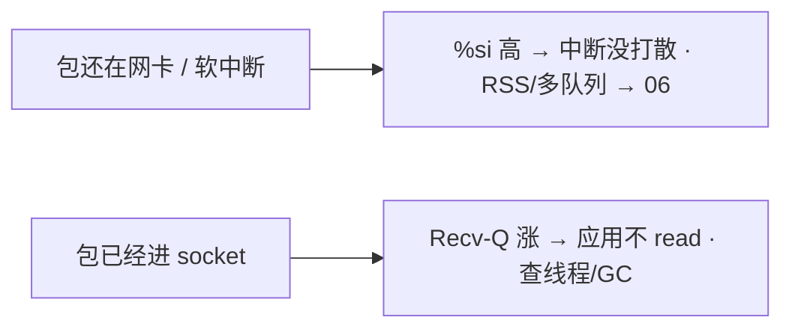
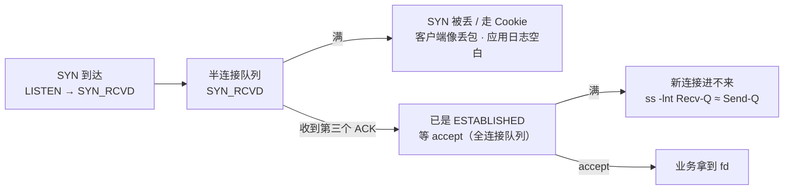
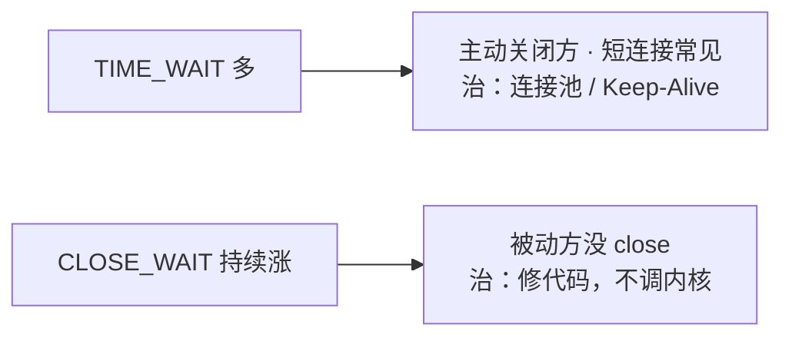
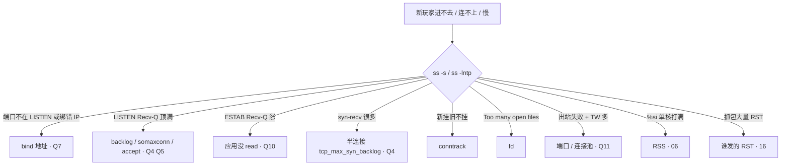

# 12｜网络栈与 Socket · 练习题

先合上知识点，对着 **一节的主图** 把「一个包的旅程」口述一遍（出门 → 上路 → 进门 → 排队 → 领号 → 干活 → 回家 → 生病），再来做题。

| 标记 | 含义 |
|------|------|
| **核心** | 不懂整章就没建立起来 |
| **必会** | 值班和面试都要能讲 |
| **常用** | 线上会反复碰到 |
| **常考** | 白板和追问的高频口径 |

## 本题目录

- [Q1 跨网段第一跳与 ARP](#q1)
- [Q2 路由器每跳在干什么](#q2)
- [Q3 %si 打满 vs Recv-Q 堆积](#q3)
- [Q4 半连接 / 全连接溢出](#q4)
- [Q5 somaxconn 默认 128](#q5)
- [Q6 Socket 是什么 · syscall 链](#q6)
- [Q7 端口在听却连不上](#q7)
- [Q8 epoll 与 LT / ET](#q8)
- [Q9 Recv-Q / Send-Q 两套含义](#q9)
- [Q10 ESTAB Recv-Q 涨与何时加 rmem](#q10)
- [Q11 出站怎么认 · 临时端口耗尽](#q11)
- [Q12 TIME_WAIT / CLOSE_WAIT](#q12)
- [Q13 tcp_tw_reuse 与 timestamps（主责 13）](#q13)
- [Q14 四个「满」与单机上限](#q14)
- [合上书](#合上书)

---

## Q1

**★★★★★｜跨网段发包时，第一跳的帧交给谁？IP 头写的是谁？封装时 IP 和端口都填好了，为什么还要 ARP？**

**覆盖**：核心 · 必会 · 常考 ｜ **对应**：知识点 [二、出门：分层封装、路由、ARP](知识点.md)

### 场景

白板题。同机房两台机器不通，有人张嘴就查安全组；跨机房不通，有人去 ping Server 的 MAC。还有人答「ARP 是把 IP 解析成 IP」。

### 完整解答

> 🎯 **一句话**：帧的 MAC 交给**默认网关**、每跳都换；IP 头目的**始终是 Server** 不变；ARP 存在是因为**目的 MAC 常常一开始不知道**。

一个包过四层，每层加一个头、认的地址越来越「近」：

```text
应用  write("发技能")                        ← 业务消息，没有地址
传输  [TCP 头 | 数据]                         ← 加「端口」：给哪个进程
网络  [IP 头  | TCP 头 | 数据]                ← 加「IP」+TTL：跨网段怎么选路
链路  [帧头   | IP 头 | TCP 头 | 数据 | FCS]  ← 加「MAC」：同网段怎么送到隔壁
```

端口指向**进程**，IP 指向**机器**，MAC 只指向**隔壁一跳**。所以排障方向天然分好：「进程收不到」查端口，「跨网段不通」查 IP/路由，「同网段不通」查 MAC/ARP。

| 对比 | 同网段 | 跨网段 |
|------|--------|--------|
| ARP 问谁 | **Server 的 IP** | **网关的 IP**（不问 Server） |
| 帧目的 MAC | Server | 网关 |
| IP 目的 | Server | Server（**仍不变**） |

```text
同网段：  Client ──帧直指 Server──► Server
跨网段：  Client ──帧给网关──► 路由… ──► 帧给 Server──► Server
              IP 始终写着「去 Server」（NAT 另说）
```

**为什么还要 ARP**：TCP 端口、IP 地址在应用 `connect` 时就给了，封装时都知道；**只有目的 MAC 不在应用参数里**——它得靠查邻居表或发 ARP 问出来。问过一次进缓存，之后直接用，不是每个包都问。

> ⚠️ **别混**：端口是**传输层**的东西，只有 TCP/UDP 有；IP 层没有端口，MAC 是链路层。「IP:端口」这个写法横跨两层，**别答成「IP 层的端口」**。另外 ARP 不是只有客户端问服务端——谁缺下一跳 MAC 谁问，路由器也问。

> 📝 **面试**：问「跨网段第一跳帧给谁」，答「**帧给默认网关，MAC 每跳换，IP 头目的不变**」；问「为什么还要 ARP」，答「**目的 MAC 常常一开始不知道**」，别答「要解析 IP」。

### 再追问

**不确定某个目的走哪张网卡怎么查？**

```bash
ip route get 10.11.21.74   # 直接告诉你走哪个 dev、下一跳 via 谁、源 IP 用哪个
ip route                   # 完整路由表；default via ... 就是默认网关
ip neigh                   # 邻居表（ARP 缓存）：REACHABLE 可用 / STALE 待复查 / FAILED 问不到
```

多网卡机器、容器宿主机上「以为走 A 网卡其实走 B」很常见，**不要**凭 `ifconfig` 猜，直接 `ip route get`。

**同网段不通先查哪？**——`ip neigh` 看目标是不是 FAILED（ARP 问不到 = 二层不通/对端没起来），**不要**先去查路由表——同网段根本不走网关。

**顺着问 OSI 七层模型，怎么答不掉分？**——先自下而上背全 **L1 物理 · L2 数据链路 · L3 网络 · L4 传输 · L5 会话 · L6 表示 · L7 应用**，紧接着补一句「**实际跑的是 TCP/IP 四层，OSI 上三层合成应用层**」——只背七层不提四层，会被认为只背过书。每层配「地址 + 设备 + 协议」一起记：

```text
L2  MAC       交换机       以太网 / ARP
L3  IP        路由器       IP / ICMP
L4  端口      四层 LB      TCP / UDP
L7  URL/Host  七层 LB      HTTP / DNS
```

这也直接答了「四层 LB vs 七层 LB」：四层只按 IP+端口转发、不看内容、性能高；七层解到 HTTP 才能按 Host/Path 路由、能改包、能做灰度。**不要**说「Socket 是一层」——它是应用层与传输层之间的**编程接口**，OSI 和 TCP/IP 里都没有这层。

---

## Q2

**★★★☆☆｜路由器每一跳到底在干什么？TTL 为什么要每跳减 1？**

**覆盖**：必会 · 常考 ｜ **对应**：知识点 [三、上路：网络里怎么接力](知识点.md)

### 场景

追问「交换机和路由器区别」，有人答「路由器快一点」。另有人说「TTL 是包的超时时间，调大就不会丢了」。

### 完整解答

> 🎯 **一句话**：路由器**剥帧看 IP、TTL−1、定下一跳、换新 MAC**；交换机只按 MAC 转发，不看 IP。

```text
路由器收到帧：
  1. 剥掉帧头（MAC 只对「上一跳 → 我」有用）
  2. 看 IP：目的是谁；TTL − 1
  3. 查路由表：下一跳是哪个 IP、出哪个口
  4. 查邻居表：下一跳 MAC 有没有缓存，没有 → ARP 问
  5. 换新帧头发出：源 MAC = 本路由出接口，目的 MAC = 下一跳
```

```text
进路由器：[帧: …→本路由MAC][IP: Client→Server][TCP][数据]
出路由器：[帧: 本路由→下一跳MAC][IP: Client→Server][TCP][数据]
              ↑ 换了              ↑ IP 目的不变
```

**读图**：帧头每跳重写，IP 头基本原样穿过整条路径。这也是为什么抓包在中间任一跳都能看到同一对源/目的 IP，MAC 却各不相同。

**TTL 为什么减 1**：**防环路**，不是超时时间。路由配错时包会在两台路由之间来回弹，TTL 归零就被丢弃并回一个 ICMP 超时。`traceroute` 正是故意发小 TTL 的包，靠这些 ICMP 逐跳画出路径。

> ⚠️ **别混**：干「剥帧看 IP」的是**路由器（三层）**；交换机（二层）一般不看 IP，只按目的 MAC 转发。所以「同网段不通」查交换机/ARP，「跨网段不通」查路由/网关。**调大 TTL 治不了任何不通**——环路的根因是路由配错。

### 再追问

**路上还有什么会改包？**——NAT / LB / 防火墙会改 IP:端口甚至丢包。所以「两端抓包看到的四元组不一样」很正常，定责去 [17](../17-iptables与conntrack/) 和 [16](../16-网络排障与抓包/)。

**大包不通、小包通呢？**——那不是路由问题，是 MTU / PMTUD 黑洞（中间某跳 MTU 更小、ICMP 又被墙）。**不要**在这个现象上翻路由表，直接去 [16](../16-网络排障与抓包/)。

**交换机怎么知道把包送到哪个口？**——交换机维护 **MAC 地址表**（「哪个 MAC 接在哪个口」），收到帧先**学源 MAC**、再**查目的 MAC**：查到就单播那个口，查不到就**泛洪**（除来源口外都发一份，等回包再学到）。和 ARP 区分清楚：交换机学 **MAC↔端口**，ARP 学 **IP↔MAC**——两张表、两个设备各管各的；Linux bridge / 容器网桥的 MAC 表用 `bridge fdb show` 看。

---

## Q3

**★★★☆☆｜`%si` 打满和 Recv-Q 堆积怎么分工？**

**覆盖**：必会 · 常用 ｜ **对应**：知识点 [四、进门：网卡到进程之间](知识点.md) + [七、干活：Recv-Q / Send-Q](知识点.md)

### 场景

一台 CPU0 `%si` 100% 在丢包；另一台 `%si` 正常但 ESTAB Recv-Q 在涨。有人把两台都当成「网络栈不行」，要一起扩容网关。

### 完整解答

> 🎯 **一句话**：`%si` 满 = 包还没进 Socket（内核收包扛不住）；Recv-Q 涨 = 包已进 Socket，应用不读。两个阶段，两套治法。

```text
① 硬中断（门铃）   网卡：包到了，叮 CPU 一下 → 记个「有活」马上回去   ← %hi，通常很小
② 软中断（搬货）   内核：剥帧 → 看 IP → TCP → 放进 Socket 接收缓冲    ← %si
③ 进程 read        业务线程：从 Socket 拷到用户态，跑玩法逻辑          ← %us / syscall 是 %sy
```

**「硬 / 软」对比的是「谁触发」**：硬中断是网卡硬件拉线叮 CPU；软中断是内核在硬中断里记下「有活」、返回后再跑的那段收包活——不是「软弱不重要」，**收包重活恰恰在软中断里**。卡在 ②，包可能连 Socket 都没进，Recv-Q 都不一定涨；过了 ②、进了 Socket 而应用不读，Recv-Q 才涨。



**读图**：分界线就是「包进没进 Socket 缓冲」。左边是 CPU 侧问题（[06](../06-CPU与Load/)），右边是应用侧问题（Q10）。

> 🔍 **现场**：怀疑收包侧顶不住，先看是不是**只有一个核**在扛软中断：

```bash
mpstat -P ALL 1                        # 每个核的 %si；单核 100% 其余闲 = 中断没打散
cat /proc/softirqs | grep -i net_rx    # NET_RX 是否只集中在一个 CPU 列
```

> ⚠️ **别混**：CPU 在干活 ≠ 一定在软中断。业务线程算伤害是 `%us`，不是 `%si`。**软中断不是业务代码**。

### 再追问

**两台都扩容网关有用吗？**——`%si` 满扩容有用（包分散到多机）；Recv-Q 涨扩容**不一定有用**——每个进程自己不读，加实例只是把卡死复制一份，**要修线程/GC**。

**高 pps 下为什么不会被中断压死？**——现代网卡走 NAPI：硬中断先被临时关掉，软中断里**一次批量捞一串包**，捞完再开中断。所以是「少量中断 + 大批轮询」，代价是这批活全压在软中断上——`%si` 打满就是这么来的。

**包丢在网卡还是内核？**——进门有两道关，先分清丢在哪道再治：

```bash
ethtool -S eth0 | grep -iE 'rx_missed|rx_no_dma|rx_dropped'   # 网卡硬件侧丢包；非 0 = ring buffer 满了包没被 DMA 搬走
cat /proc/net/softnet_stat                                    # 每行一个 CPU；第 2 列 dropped、第 3 列 time_squeeze 非零 = 软中断没捞完
```

`rx_missed` 涨 → **网卡侧丢**，调 ring buffer（`ethtool -g` 看当前/最大、`ethtool -G eth0 rx N` 调大）；`softnet_stat` dropped 涨 → **内核侧丢**，软中断没打散（回到 `%si` 单核、RSS/多队列）。一个治队列深度，一个治 CPU 分散，别混。

---

## Q4

**★★★★★｜半连接队列和全连接队列溢出，各是什么表现？**

**覆盖**：核心 · 必会 · 常考 ｜ **对应**：知识点 [五、排队：半连接、全连接、backlog](知识点.md)

### 场景

客户端偶发进不去房，**像丢包**，服务端业务日志一片空白。有人在业务日志里翻了两小时找不到原因，另一次是 `ss -lnt` 的 Recv-Q ≈ Send-Q，`somaxconn` 还是 128。

### 完整解答

> 🎯 **一句话**：半连接满**像丢包且应用无感**；全连接满是 `ss -lnt` 里 Recv-Q 顶到 Send-Q。两个上限是两个参数。

连接要过两道队，**握手完就已经 `ESTABLISHED` 了，只是还没被 accept 领走**：



**读图**：两个「满」堵在两个不同位置，中间的分界线就是**第三个 ACK**。左下那条最坑——**连接还没到应用手里就被丢了，业务日志里永远查不到**。

| 队列 | TCP 状态 | 上限看 | 满了的签名 |
|------|----------|--------|-----------|
| 半连接 | `SYN_RCVD`（`ss` 显示 `SYN-RECV`） | `tcp_max_syn_backlog` | 客户端**像丢包**，**服务端应用日志空白** |
| 全连接 | **已是 `ESTABLISHED`**（`ss` 显示 `ESTAB`） | `min(listen backlog, somaxconn)` | `ss -lntp` 的 Recv-Q 顶满 Send-Q |

> ⚠️ **别混**：状态名有两套写法——教科书/RFC 793 是 `SYN-RECEIVED`（记作 **`SYN_RCVD`**），Linux `ss` 打印的是 **`SYN-RECV`**。白板写教科书名，值班认工具名。

> 🔍 **现场**：「新玩家进不去、老玩家都好」，先分半连接还是全连接。

```bash
ss -lntp
# LISTEN 128    128    0.0.0.0:4103        ← Recv-Q 顶到 Send-Q = 全连接队列满

ss -s
#        synrecv 1024                      ← synrecv 大量堆积 = 半连接侧压力

nstat -az | grep -iE 'ListenOverflows|ListenDrops'
# TcpExtListenOverflows  8321   ← 全连接队列满而丢掉的连接数
# TcpExtListenDrops     10240   ← LISTEN socket 上被丢的总数（含 overflow + 其它原因）
```

**两个计数怎么用**：`ListenOverflows` 涨 → 明确是全连接队列满；只有 `ListenDrops` 涨而 Overflows 不涨 → 丢在别处（内存不足、半连接等）。**都是累计值，连采两次看差值**，别看绝对数。

> ⚠️ **别混**：`tcp_max_syn_backlog` 管**半连接**，`somaxconn` + `listen()` 管**全连接**，只改一边、另一种满照样挂。**不要**在半连接满时去业务日志里找原因。

> 📝 **面试**：「accept 队列满了，连接还能进 ESTAB 吗？」——服务端的新连接**不能**；客户端**有可能**显示 ESTAB（它发完第三次 ACK 自己就进 ESTAB 了），一发数据才暴露。Linux 默认 `tcp_abort_on_overflow=0` 静默丢，设 `1` 则直接回 RST。

### 再追问

**为什么不用 `netstat -s`？**——`netstat` 在高连接数机器上慢且字段随发行版飘。队列溢出统一用 `nstat -az | grep -iE 'ListenOverflows|ListenDrops'`，**连采两次看差值**。

**SYN Cookie 干什么？**——半连接满时不占队列槽，把状态编码进序列号，防 SYN Flood。代价是握手协商的选项（wscale/SACK/MSS）存不了。**不要**让正常负载长期靠 Cookie 顶着。握手细节见 [13](../13-TCP与UDP/)。

---

## Q5

**★★★★☆｜`somaxconn` 默认 128 为什么生产一定要改？改成 65535 就结束了吗？**

**覆盖**：必会 · 常用 · 常考 ｜ **对应**：知识点 [五、排队：半连接、全连接、backlog](知识点.md)

### 场景

应用写了 `listen(1024)`，突发握手时仍在 overflow。查下来宿主机 `somaxconn=4096`，Pod 里还是 128。有人准备只改宿主机就收工。

### 完整解答

> 🎯 **一句话**：有效 backlog = `min(listen backlog, somaxconn)`，两边都要够；容器里 `somaxconn` 是**该 netns 自己的值**。

```text
listen(fd, 1024)     ← 程序说：门口最多排 1024
somaxconn = 128      ← 内核说：全机上限 128
生效长度 = min(1024, 128) = 128     ← 改了程序没改内核，等于没改
```

> 💡 **打个比方**：餐厅门口取号排队。`listen(fd, backlog)` 是「门口最多排多少位」，`accept()` 是「叫号领位」。握完手的人**已经在排队（已 ESTAB）**，只是还没被领进店。

容器的坑在于 `somaxconn` 属于 **Pod 的 network namespace**：只改宿主机不一定进 Pod，要在 Pod 的 `securityContext.sysctls` 里设，或让进程自己 `listen` 一个够大的值。网关、Nginx、Redis 都要**显式**加大——它们各自有自己的 backlog 配置项。

`tcp_abort_on_overflow=1` 会在队列满时直接回 RST（**快速失败**），默认 `0` 是静默丢让客户端超时重试。网关要选清楚并**监控 overflow 计数**。

> ⚠️ **别混**：加大 backlog 只是把**缓冲**做大，不是把处理能力做大。

### 再追问

**改成 65535 就结束了吗？**——不。队列加大只是缓冲，**accept 太慢还是会满**。要么加速 accept（多进程 `SO_REUSEPORT`、别在 accept 线程里做重活），要么前面加层限流。**不要**把 backlog 当性能参数无脑拉满——队列越长，排到的人等得越久，最后还是超时，只是超时得更晚。

**怎么确认现在生效值是多少？**——`ss -lntp` 里 LISTEN 行的 **Send-Q 就是生效 backlog**，不用猜。

---

## Q6

**★★★★★｜Socket 到底是什么？服务端和客户端的 syscall 链有什么不同？`bind`/`listen`/`accept` 哪个在建立连接？**

**覆盖**：核心 · 必会 · 常考 ｜ **对应**：知识点 [六、领号：Socket、accept、fd、epoll](知识点.md)

### 场景

面试白板。有人答「Socket 是一个网络库」「accept 负责建立连接」。线上另一个现象：握手明明完成了，进程 fd 数却没涨。

### 完整解答

> 🎯 **一句话**：Socket 是**内核里的通信端点对象**，进程只能拿 fd 读写它；建连是内核三次握手干的，`accept` 只是把已建好的连接**交给应用**。

**Socket = 内核里的一个通信端点对象**，记着这条连接的四元组、状态（LISTEN/ESTAB…）、收发缓冲、各种 TCP 参数。**进程碰不到网卡，也碰不到 IP 包**——能做的只有「拿着 fd 对这个内核对象读写」，封包、选路、重传全是内核的活。

```text
用户态                内核态                        硬件
进程 ──fd=30──► [Socket 对象]                 ──► 网卡
              四元组 · 状态 · 收发缓冲 · 参数
```

一个 Socket 由**四元组** `(源IP, 源端口, 目的IP, 目的端口)` 唯一确定。LISTEN 的那个是特例——只有本地 `IP:端口`，还没有对端。

**两条 syscall 链不同，这本身就是考点**：

```text
服务端： socket() → bind(IP:端口) → listen(backlog) → accept() ─► 新 fd（每连一条）
                    ↑占本地地址     ↑变成能排队的门    ↑领一个人进来

客户端： socket() ──────────────► connect(对端IP:端口) ─► 就用这个 fd
                （不 bind，内核自动分配临时源端口）
```

**fd（file descriptor）** = 进程里的一个小整数，指着内核里的一个打开对象。**一个连接一个 fd，不是一条连接一个线程**——万级连接靠少量线程 + epoll（Q8）。

**「握手完了 fd 却没涨」就是这个机制**：握手完连接已是 ESTAB、挂在等 accept 队列里，但进程 fd 表里还只有那扇门（LISTEN fd）；只有 `accept()` 返回才多出新编号。

```bash
ls -l /proc/$(pgrep -f connserver)/fd | wc -l   # 这个进程当前占了多少 fd
ss -antp | grep 4103 | head -3
# users:(("connserver",pid=1234,fd=46))         ← 这条连接在进程里的 fd 编号就是 46
```

> ⚠️ **别混**：`bind` 是「占本地地址」，`listen` 是「变成能排队的门」，`accept` 是「领一个人进来」。**三个都不是「建立连接」**。

> 📝 **面试**：问「accept 让连接变成 ESTAB 吗」——不，**连接在 accept 之前就已经 ESTAB 了**，accept 只是把它领进进程。

### 再追问

**客户端为什么不用 bind？**——它不需要固定本地地址，内核从临时端口范围里自动挑一个（Q11）。要固定源端口/源 IP 时才手动 `bind`（少见，多网卡出口选择会用）。

**为什么进程碰不到 IP 包？**——分层的意义就在这。真要看原始包得用 `AF_PACKET`/raw socket（抓包工具走的路），普通业务 fd 拿到的已经是**剥完头、排好序的字节流**。

---

## Q7

**★★★★★｜`ss -lntp` 明明有这个端口在 LISTEN，外面就是连不上，先查什么？**

**覆盖**：核心 · 必会 · 常用 · 常考 ｜ **对应**：知识点 [六、领号：Socket、accept、fd、epoll](知识点.md)

### 场景

Pod 内 `curl 127.0.0.1:4103` 通，Service 一律不通。有人已经在提工单改安全组，另一个人在怀疑 CNI。

### 完整解答

> 🎯 **一句话**：**先看 `ss -lntp` 左边绑的是什么地址**——`127.0.0.1` 只收本机回环，机器外/Pod 外一律连不上。

`bind` 时给的 IP 决定「从哪些网卡进来的连接能被收下」，这是「端口明明在听却连不上」的**头号原因**：

```text
ss -lntp 左边显示什么           含义                      从外面能连吗
0.0.0.0:4103  （或 *:4103）    所有网卡                  ✅ 能
10.11.21.74:4103               只有这张网卡这个 IP        ⚠️ 只能连这个 IP，连别的 IP 直接拒
127.0.0.1:4103                 只有本机回环              ❌ 机器外/Pod 外一律连不上
[::]:4103                      IPv6 通配（常同时收 v4）   ✅ 视 bindv6only 设置
```

本例的签名极干净：**Pod 内通、Pod 外不通** = 绑了回环。根因在**应用配置文件**里写了 `127.0.0.1`（或框架默认 `localhost`），不在网络、不在安全组、不在 CNI。

> 🔍 **现场**：`telnet` 不通但端口在 LISTEN，第一条命令永远是：

```bash
ss -lntp | grep 4103
# LISTEN 0  128  127.0.0.1:4103  0.0.0.0:*  users:(("connserver",pid=1234,fd=3))
#              ↑ 绑回环 → 外面永远连不上，改配置为 0.0.0.0，不用查网络
```

> ⚠️ **别混**：绑 `127.0.0.1` 和绑 `0.0.0.0` **不一样**。**不要**先查网络、先改安全组、先重启——那三件事都不会让回环变成对外可达，还会把现场毁掉。

### 再追问

**绑具体 IP 有什么坑？**——机器多网卡时只有那个 IP 能连；更阴的是**云上换弹性 IP、容器重建换 IP** 后应用起不来（`bind` 报 `Cannot assign requested address`）。除非有隔离要求，服务端一般绑 `0.0.0.0`。

**为什么有些服务故意绑回环？**——安全设计：只给同机的 sidecar / 本地代理用（如 metrics、admin 口）。这时候「外面连不上」是**预期行为**，别当故障改成 `0.0.0.0`，那是把管理口暴露出去。

---

## Q8

**★★★★☆｜epoll 为什么能扛万级连接？LT 和 ET 的区别，写错会怎样？**

**覆盖**：必会 · 常考 ｜ **对应**：知识点 [六、领号：Socket、accept、fd、epoll](知识点.md)

### 场景

自研网关偶发「个别连接莫名卡住，重连就好」，代码用了 ET 模式，`read` 一次就 `return`。有人认为是内核 bug。

### 完整解答

> 🎯 **一句话**：epoll 只回报**就绪的** fd 所以不随连接数变慢；ET 只在「从无到有」报一次，**必须循环 read 到 `EAGAIN`**，否则剩下的数据再没人叫你。

> 💡 **打个比方**：select/poll 像「每次挨个房间敲门问有没有事」；epoll 像「前台登记，哪个房间按铃了才叫你」。连接再多，epoll 也只处理「有事」的那几个。

| 机制 | 怎么干 | 万级连接时 |
|------|--------|------------|
| select / poll | 每次把一堆 fd 全扫一遍 | 连接越多越慢（O(n)） |
| epoll | 一次登记 fd，内核只回报就绪的 | 只处理有事的（O(就绪数)） |

**LT（水平触发，默认）**：只要缓冲里还有数据，每次 `epoll_wait` 都继续报——没读完下次还提醒，**好写不易漏**。

**ET（边缘触发）**：只在「从无到有」那一下报一次。所以必须：

```text
ET 正确写法：  while ((n = read(fd, buf, len)) > 0) { 处理(buf, n); }
               // 直到 read 返回 -1 且 errno == EAGAIN 才算读干净
ET 错误写法：  n = read(fd, buf, len); 处理(); return;   ← 缓冲里还有数据，但再没人通知你
```

本例就是错误写法：一次 `read` 只拿走一部分，剩下的躺在缓冲里，而 ET 不会再报 → **那条连接从此静默卡住**，重连（新 fd、新的「从无到有」）就又活了。这不是内核 bug，是 ET 的语义。

> ⚠️ **别混**：epoll 说「可读」≠ 应用已 read 完。包进了缓冲、业务线程卡住不读，`ss` 上 ESTAB Recv-Q 照样涨（Q10）。**epoll 只负责通知，不负责搬。**

> 📝 **面试**：答「epoll 强在只回报就绪 fd」后，一定补一句「**ET 必须一次读到 `EAGAIN`**，否则连接会静默卡死」——这句最能区分「背过」和「写过」。

### 再追问

**ET 一定比 LT 快吗？**——只在极高并发下省下重复通知的开销，收益有限而出错代价很大。**不要**为了「听说更快」把成熟的 LT 代码改 ET；改了必须配套压测 + 半包/大包用例。

**写侧也有这个坑吗？**——有。ET 下 `EPOLLOUT` 也只报一次，必须写到 `EAGAIN` 或写完，否则发送逻辑会挂住。

---

## Q9

**★★★★★｜`ss` 的 Recv-Q / Send-Q 在 LISTEN 和 ESTAB 下分别是什么？**

**覆盖**：核心 · 必会 · 常考 ｜ **对应**：知识点 [七、干活：Recv-Q / Send-Q](知识点.md)

### 场景

网关 `ss -lnt` 的 Recv-Q 顶着 Send-Q，有人说「内核接收缓冲满了，加大 rmem」。另一次是 ESTAB 上 Recv-Q 显示 256000，有人念成「25 万个连接」。

### 完整解答

> 🎯 **一句话**：LISTEN 下数的是**连接个数**，ESTAB 下数的是**数据字节**——同一个名字，完全两回事。

```text
LISTEN  Recv-Q / Send-Q  →  连接「个数」/ 上限
ESTAB   Recv-Q / Send-Q  →  数据「字节」
```

> 💡 **打个比方**（餐厅）：LISTEN 的 Q 是「门口取号的人数 vs 最多排多少位」；ESTAB 的 Q 是「入座后桌上堆着还没上的菜 vs 端出去还没回执的菜」。

| 字段 | LISTEN | ESTAB |
|------|--------|-------|
| Recv-Q | 等 accept 的**连接数** | 未被应用 read 的**字节** |
| Send-Q | backlog **上限** | 已发出未被对端确认的**字节** |
| 满了治什么 | 加大 backlog + 加速 accept | 查应用消费 / 查对端 |

> 🔍 **现场**：同一个端口会**同时**出现在 LISTEN 和一堆 ESTAB 里，先认清自己在看哪一种。

```bash
ss -lntp   # -l 只看 LISTEN
# LISTEN  1       128     0.0.0.0:4103   0.0.0.0:*   users:(("connserver",pid=1234,fd=3))
#         ↑ 1 条连接已 ESTAB 在等 accept  ↑没有对端    ↑ fd=3 是那扇「门」
#                 ↑ 生效 backlog 上限 128

ss -antp
# ESTAB   256000  0       10.11.21.74:4103   203.0.113.9:54321   users:(("connserver",pid=1234,fd=46))
#         ↑ 约 250KB 没人 read（不是 25 万个连接！）        ↑ 每条 ESTAB 各有自己的 fd
```

**参数字母记牢**（值班天天敲）：`-n` 不解析服务名 · `-t` 只 TCP · `-u` 只 UDP · `-l` **只** LISTEN · `-a` 所有状态 · `-p` 显示进程和 fd · `-i` TCP 内部信息（→[13](../13-TCP与UDP/)）· `-s` 汇总 · `-m` 内存占用。

> ⚠️ **别混**：`-l` 和 `-a` **叠不出「只要 ESTAB」**——要用状态过滤：`ss -ant state established`、`ss -ant state time-wait`。

### 再追问

**加大 rmem 能治 LISTEN 顶满吗？**——**不能**。那是连接**个数**队列，不是字节缓冲。治 accept 速度和 backlog（Q5）。

**ESTAB 两边 Q 都大于 0 呢？**——「自己不读 + 对面也不收」同时发生。先 `strace`/线程栈看本进程卡在哪，再看对端是不是 ZeroWindow（[13](../13-TCP与UDP/)）。

---

## Q10

**★★★★☆｜ESTAB Recv-Q 持续增长说明什么？什么时候才该加大 rmem？**

**覆盖**：必会 · 常用 · 常考 ｜ **对应**：知识点 [七、干活：Recv-Q / Send-Q](知识点.md)

### 场景

玩家喊延迟，抓包已经看到 payload 到了，网关 ESTAB Recv-Q 在涨。有人要调 TCP 窗口，有人要加大 `tcp_rmem`。

### 完整解答

> 🎯 **一句话**：包已经进 Socket 了、用户态没 read——**先查线程/GC，别先调 TCP 窗口**。

内核已经收到并放进 Socket 缓冲（抓包能看到 payload 就是证据），是**应用没把它拿走**。常见根因：线程死锁、GC STW、业务线程堵在 DB/RPC 上。口诀：**Recv-Q 涨先问「谁不 read」。**

**那什么时候加大 rmem 才是对的？** 只有一种正当理由：**带宽时延积（BDP）装不下**。

```text
BDP = 带宽 × RTT
例：100 Mbps × 200 ms = 100e6/8 × 0.2 ≈ 2.5 MB   ← 缓冲小于这个数，跨海就跑不满

sysctl net.ipv4.tcp_rmem    # 三个值：min  default  max（内核按需在区间内自动伸缩）
sysctl net.ipv4.tcp_wmem
```

四个判据要**同时**成立才谈加大 max：`retrans` 不涨 · 应用确实在读 · `rtt` 高且稳 · 吞吐卡在远低于带宽的位置。

> ⚠️ **别混**：**应用不读导致的 Recv-Q 涨，加多少缓冲都是往漏桶里灌水**——缓冲更大只是让崩得更晚、崩时积压更多。epoll 报 ready 也不等于已经 read（Q8）。

### 再追问

**Send-Q 涨呢？**——对端没 ACK。可能对端 Recv-Q 满了通告 ZeroWindow，也可能路径丢包——治对端消费或查丢包，**不要**把本端 `sndbuf` 当根因。三种「Send-Q 大但走不动」的分型见 [13](../13-TCP与UDP/)。

**加实例能扛过去吗？**——不能。每个进程各自不读，加实例只是把卡死复制一份（Q3 追问）。

---

## Q11

**★★★★☆｜`ss` 上怎么分进站和出站？临时端口什么时候会耗尽？**

**覆盖**：必会 · 常用 · 常考 ｜ **对应**：知识点 [八、回家与谢幕：出站、TW / CW / RST](知识点.md)

### 场景

一台机器连 Redis 偶发失败，`ss -s` 里 TIME_WAIT 一大片。有人说「连接数才两万，离 6 万还远，不可能是端口问题」。另一台是新玩家连不上、日志 `Too many open files`。

### 完整解答

> 🎯 **一句话**：**左边是服务口 = 进站，左边是临时大端口 = 出站**；只有出站吃临时端口，而耗尽的条件是「四元组撞了」，不是「连接数超 2.8 万」。

```text
进站：ESTAB  74:4103  → 玩家IP:临时口   ← 左边服务口（在 LISTEN 里能查到）
出站：ESTAB  74:46152 → 47:5342        ← 左边临时口（不在 LISTEN 里）
```

客户端 `connect` 时不 `bind`，内核从 `ip_local_port_range`（默认约 **32768–60999，约 2.8 万个**）里挑一个源端口。**耗尽看的是四元组**：

```text
四元组只要有一元不同就是新连接，所以
  连不同的对端 IP:端口   → 同一个源端口可以复用       ✅ 不容易耗尽
  疯狂短连同一个 DB:3306 → 源端口是唯一变量
                          + 每次 close 留 60s TIME_WAIT
                          → 2.8 万 / 60s ≈ 每秒 466 条新连接就见底  ⚠️
```

所以「连接数才两万」这个反驳是错的——**卡住的不是总量，是「同一个对端」下可用源端口的周转率**。治法优先级：**连接池 / 长连接** ＞ 扩 `ip_local_port_range` ＞ 别的。

**fd 耗尽 vs 端口耗尽怎么分**：

| 对比 | fd 耗尽 | 临时端口耗尽 |
|------|---------|--------------|
| 签名 | 日志 `Too many open files` | **出站**连接失败 + TW 一大片 |
| 看哪 | `/proc/<pid>/fd` 个数 vs `limits` | `ip_local_port_range` · `ss -s` |
| 影响面 | 该进程连 accept/open 都失败 | 只影响出站，进站照常 |

```bash
ls /proc/{pid}/fd | wc -l; cat /proc/{pid}/limits    # fd 侧
sysctl net.ipv4.ip_local_port_range; ss -s           # 端口侧
```

> ⚠️ **别混**：**进站连接不吃临时端口**（服务端口固定，变的是对端），所以「进站最多 6 万连接」是误解。

### 再追问

**重启就好了，是不是说明不是这个问题？**——不是。进程退出内核收 fd，TIME_WAIT 也随时间消散，**根因一个都没消失**，下个高峰照样来。优雅重启/停服见 [05](../05-进程与信号/)。

**扩 `ip_local_port_range` 到 1024–65535 行吗？**——能翻倍买时间，但会和本机监听端口打架（要避开在用的服务端口），而且**治不了短连接模式**。先上连接池。

---

## Q12

**★★★★★｜TIME_WAIT 多怎么办？CLOSE_WAIT 多是谁的问题？**

**覆盖**：核心 · 必会 · 常考 ｜ **对应**：知识点 [八、回家与谢幕：出站、TW / CW / RST](知识点.md)

### 场景

登录服 TW 几十万，战斗长连接那台 TW 很少，第三台 CLOSE_WAIT 一路涨。有人准备在三台都开 `tcp_tw_recycle` + 调 `tcp_fin_timeout` 一把梭。

### 完整解答

> 🎯 **一句话**：**谁先关谁进 TIME_WAIT，谁忘了 close 谁进 CLOSE_WAIT**——一个多半正常，一个是代码 bug。

| 对比 | TIME_WAIT | CLOSE_WAIT |
|------|-----------|------------|
| 谁进 | **主动**关闭方（先 close 先发 FIN） | **被动**方（收到 FIN，应用还没 close） |
| 等什么 | 2MSL（~60s） | 应用 `close()` |
| 自己会消吗 | 会 | **不 close 一直挂** |
| 多了怎么治 | 连接池 / Keep-Alive | **修代码** |



**读图**：两条线的处方**完全不交叉**。TW 是「正常冷却，量大说明连接模式该改」；CW 是「应用漏了 `close()`」，内核参数一个都救不了。

**为什么 TW 要等 2MSL**：① 保证最后 ACK 能到对端（对端没收到会重发 FIN）；② 让旧包从网络消失，防串进复用同四元组的新连接。挥手时序细节见 [13](../13-TCP与UDP/)。

本例三台：登录服 TW 几十万 → **短连接模式**，上连接池/Keep-Alive；战斗长连接 TW 少 → 正常；第三台 CW 涨 → 去找「收到 FIN 后没 close 的那段代码」，常见是异常路径没走到 `close`、连接池归还漏了、或 `fork` 后还有另一份引用。

> ⚠️ **别混**：**不是「客户端=TW、服务端=CW」的铁律**——服务端主动踢人时 TW 就在服务端。`tcp_fin_timeout` 管的是 `FIN_WAIT_2`，**盖不住 CLOSE_WAIT**，也不是 TIME_WAIT 的时长。`tcp_tw_recycle` 已从内核移除、NAT 下有害，**任何场合都不要提**。

> 📝 **面试**：先分「哪一侧、哪个状态」，再给处方——TW 侧问「谁在主动关、为什么是短连接」，CW 侧直接答「修代码」。

### 再追问

**怎么快速找出 CW 堆在哪个进程？**

```bash
ss -antp state close-wait | awk '{print $NF}' | sort | uniq -c | sort -rn
# 3820 users:(("connserver",pid=1234,fd=...))   ← 数量最多的那个进程就是漏 close 的
ss -ant state time-wait | wc -l                 # TW 计数
```

**把 2MSL 改成 5s 行吗？**——Linux 的 TIME_WAIT 时长是**编译期常量改不了**，真改内核还有串包风险。**先改应用**（[13](../13-TCP与UDP/)）。

**RST 又是怎么回事？**——RST 一包直接拆，缓冲里未读数据常被丢。常见原因：端口无人听、防火墙拒、`SO_LINGER`、队列满且 `abort_on_overflow=1`、停服直接 `kill -9`。抓包见 RST 先分清**本机发还是对端发**（[16](../16-网络排障与抓包/)），优雅停服见 [05](../05-进程与信号/)。

---

## Q13

**★★★☆☆｜`tcp_tw_reuse` 和 `tcp_timestamps` 什么关系？**

**覆盖**：常用 · 常考 ｜ **对应**：[13-TCP与UDP · 六、死亡：挥手与 TIME_WAIT / CLOSE_WAIT](../13-TCP与UDP/知识点.md)（主责在 13；本章只从「出站端口耗尽」带一眼）

### 场景

有人为「减开销」关掉了 `tcp_timestamps`，同时开了 `tcp_tw_reuse` 治客户端端口耗尽，然后发现 TW 一点没少。

### 完整解答

> 🎯 **一句话**：`tcp_tw_reuse` 靠 timestamps 判断旧包，关了 timestamps 它就失效——而且它只是补丁，正解是应用层复用连接。

> 📝 **章边界**：四个端口复用选项（`SO_REUSEADDR` / `SO_REUSEPORT` / `tcp_tw_reuse` / `tcp_tw_recycle`）的完整口径在 [13](../13-TCP与UDP/)；本题只钉住「reuse ↔ timestamps」这一对依赖，以及它和本章「出站临时端口」的关系。

`tcp_tw_reuse` 允许**客户端出站**复用还处于 TIME_WAIT 的四元组去发起新连接。安全性完全建立在 **TCP timestamps** 上：靠时间戳区分「这是新连接的包」还是「上一条连接的迟到旧包」。timestamps 一关，这个判断没了 → reuse 不安全或直接不生效。

改之前先确认：

```bash
sysctl net.ipv4.tcp_timestamps    # 必须是 1，reuse 才有意义
sysctl net.ipv4.tcp_tw_reuse
```

> ⚠️ **别混**：`tcp_tw_reuse` 只帮**出站**（客户端侧），对「服务端 TW 多」没用。它也不是「关掉 TIME_WAIT」。

### 再追问

**`tcp_tw_recycle` 呢？**——**已从内核移除（4.12），NAT 后面多客户端共用源 IP 时会被莫名丢弃连接**。任何方案里都不要出现它。细节见 [13](../13-TCP与UDP/)。

**为什么说 reuse 只是补丁？**——它降低的是端口周转压力，没减少建连次数。**不要**拿它替代连接池——每秒几百条新连接这件事本身就该改掉（本章 Q11）。

---

## Q14

**★★★★★｜「新连接全挂、旧长连接还在」优先查什么？本机会「满」的一共有哪几个？单机能扛多少连接？**

**覆盖**：核心 · 必会 · 常用 · 常考 ｜ **对应**：知识点 [九、生病：四个「满」+ 定责](知识点.md)

### 场景

活动高峰，登录全超时、战斗服长连接还在打，安全组页面没人改过。有人要重启战斗服「试试」，有人在提工单改安全组，还有人问「这台机器到底能扛多少 CCU」。

### 完整解答

> 🎯 **一句话**：**「新挂旧不挂」优先查 conntrack**；本机的「满」就四种（LISTEN 队列 / conntrack / fd / 临时端口），单机上限取四个里最小的。

**conntrack 满为什么「新挂旧不挂」**：表满时，**已建立连接的表项还在**，照常按原表项转发，所以在线玩家毫无感觉；新连接需要新建表项，建不上就被丢 → 「新玩家一个都进不来，老玩家好得很」。这个**不对称**就是表类故障的签名。

| 满了谁 | 签名现象 | 第一刀 |
|--------|----------|--------|
| LISTEN 队列 | Recv-Q 顶满 Send-Q，新连接进不来 | `ss -lntp` · `nstat \| grep Listen` |
| conntrack | **新连接挂、老连接不挂** | `conntrack -C` vs `nf_conntrack_max` |
| fd | 日志 `Too many open files` | `/proc/<pid>/fd` 个数 vs `limits` |
| 临时端口 | **出站**失败 + TIME_WAIT 多 | `ip_local_port_range` · `ss -s` |



**读图**：入口只有一条 `ss`，分支靠**签名**分开，每条分支处方互斥——**先定型再动手**。

conntrack 处理：止血调大 `nf_conntrack_max`；长期降 `tcp_timeout_established`（默认 **5 天**）、短连接改连接池、使用率 **80%** 告警。K8s 节点 SNAT/DNAT 每条连接一张表，活动高峰的登录短连接最容易打满，表现常被误报成「网络抖动」。

**单机能扛多少连接**：不是拍一个数，取四个上限里最小的那个：

```text
单机连接上限 ≈ min( fd 上限,  内存 / 每连接开销,  conntrack 余量,  出站端口余量 )
                  ulimit -n     每条几 KB~几十 KB     nf_conntrack_max   仅出站才受限
                  /proc/sys/fs/file-max
```

只调一个只会换一个瓶颈。进站连接**不吃临时端口**（Q11）。

> ⚠️ **别混**：安全组/防火墙误改通常是**新旧一起死**（老连接的包也开始被拒）。**不要**先动安全组、**更不要**重启战斗服——一重启老连接也没了，反倒把唯一的线索销毁。

> 📝 **面试**：问「新挂旧不挂怎么排」，答「**先 conntrack**，因为老表项还在、新表项建不上；安全组误改是新旧一起死」，再补一句「单机上限取 fd/内存/conntrack/端口四者最小」。

### 再追问

**只调大 `nf_conntrack_max` 行不行？**——能止血，但表更大更耗内存，风暴来了照样满。要治**超时和连接模式**。长连接也占表——`established` 超时默认 5 天，**不是只有短连接才会满**。

**60 秒剧本怎么走？**

```text
① 0–10s  ss -lntp：端口在听吗？绑 0.0.0.0 还是 127.0.0.1？Recv-Q 顶满没？
② 10–30s ss -antp：ESTAB Recv-Q 涨 = 应用不读；一堆 TW = 短连接；一堆 CW = 没 close
③ 30–45s ss -s + nstat：synrecv 多 = 半连接；ListenOverflows 涨 = 全连接满
④ 45–60s 再排「满」：conntrack -C / fd 个数 / 临时端口，定型定责各走各的树
```

---

## 合上书

对齐知识点「合上书」，逐条口述，卡住就回对应节：

- [ ] **默画一节的图**：出门 → 上路 → 进门 → 排队 → 领号 → 干活 → 回家；`ss` 照的是哪四段。
- [ ] **默画分层**：OSI 七层自下而上背全、映射到 TCP/IP 四层，每层给一个地址 + 设备 + 协议；说清「四层 LB vs 七层 LB」和「Socket 为什么不是一层」。（Q1）
- [ ] **口述出门**：四层各加什么头、端口属于哪层、为什么还要 ARP、跨网段帧交给谁、IP 目的变不变。（Q1）
- [ ] **口述上路**：路由器每跳五步、TTL 为什么减 1、交换机和路由器差在哪。（Q2）
- [ ] **口述进门**：硬中断 vs 软中断、`%si` vs `%us`、软中断为什么不是业务进程、NAPI。（Q3）
- [ ] **默画排队**：半连接 → 全连接 → accept 三段，标出**每段的 TCP 状态位**（`SYN_RCVD` / 已是 `ESTABLISHED`）、两个上限看谁、两种满的签名、有效 backlog、容器里 somaxconn。（Q4 · Q5）
- [ ] **口述 Socket**：Socket 是什么、服务端/客户端 syscall 链、`bind` 绑 `0.0.0.0` vs `127.0.0.1`、accept 才诞生 fd、epoll 与 LT/ET。（Q6 · Q7 · Q8）
- [ ] **口述干活**：LISTEN vs ESTAB 的 Q、`ss` 一行怎么读、`ss` 参数字母、什么时候才加大 rmem（BDP）。（Q9 · Q10）
- [ ] **口述回家**：出站怎么认、临时端口何时耗尽（每秒 466 条那个算式）、TW vs CW、RST 怎么来的。（Q11 · Q12）
- [ ] **定责**：四个「满」各看什么、conntrack 为什么新挂旧不挂、单机连接上限取哪四个最小值、60 秒剧本。（Q14）
- [ ] **边界**：`tcp_tw_reuse` / timestamps / 四选项完整口径去 [13](../13-TCP与UDP/)（本题 Q13）；握手/窗口/重传/心跳/挥手时序也去 13；抓包、MTU/PMTUD 去 [16](../16-网络排障与抓包/)；软中断 CPU 侧去 [06](../06-CPU与Load/)；conntrack 深挖去 [17](../17-iptables与conntrack/)；优雅停服去 [05](../05-进程与信号/)。
