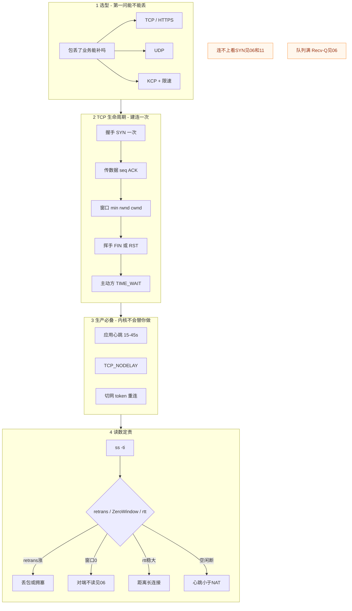
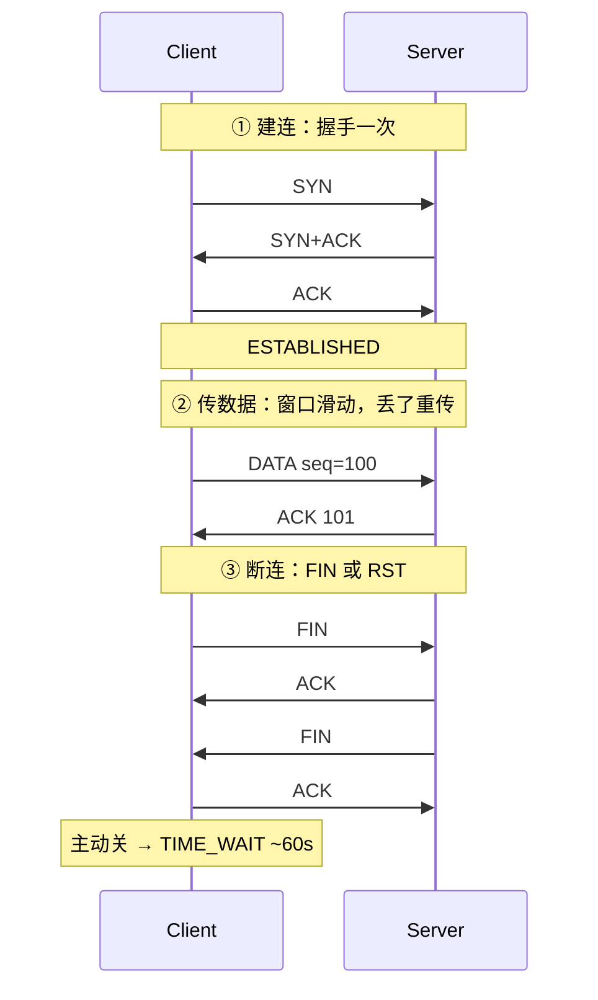
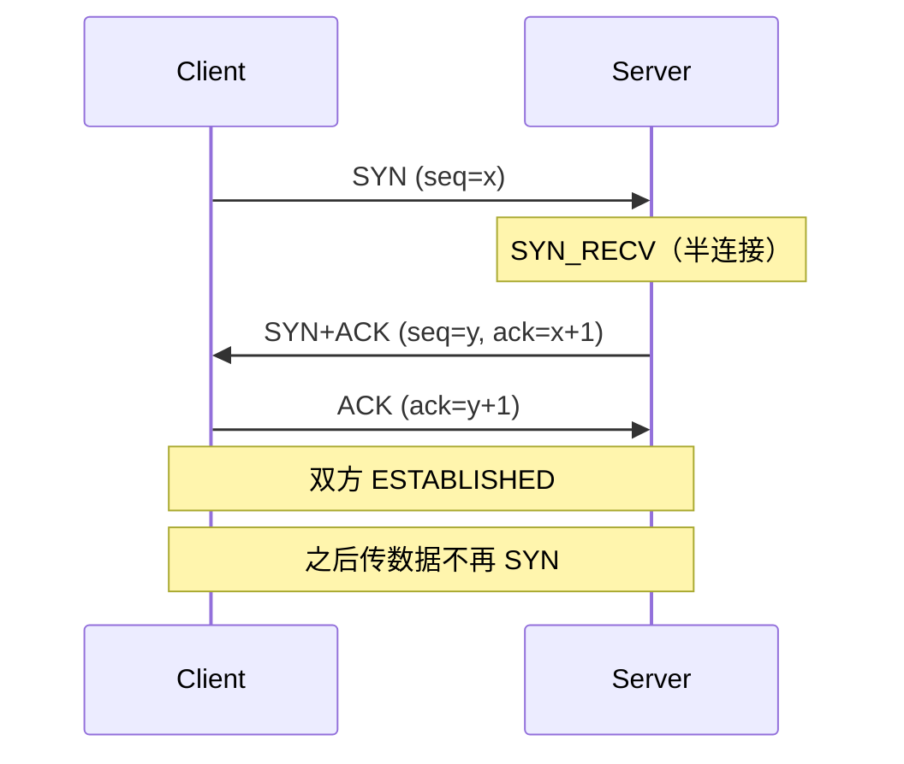
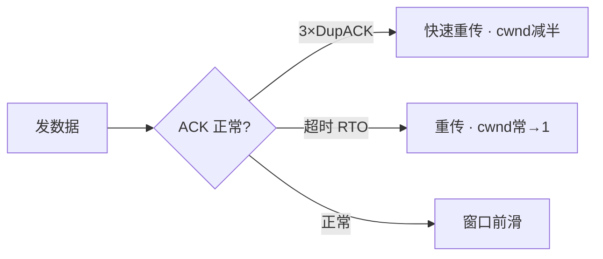
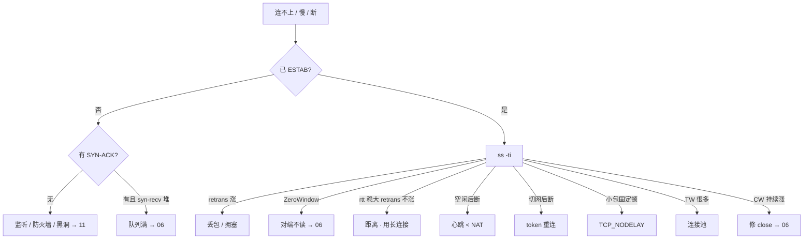

# TCP 与 UDP

> **这章解决什么**：已经 ESTABLISHED 了还卡、挂机被踢、切网必死、跨海技能同步慢——卡在**传输层机制**还是别的层？  
> **读法**：**先看总图** → **再认名词** → **再分节抠握手 / 窗口 / 重传 / 心跳**。  
> **刻意不展开**：包怎么进主机、Recv-Q/Send-Q、半连接队列 → [12](../12-网络栈与Socket/)；抓包过滤、MTU/PMTUD、`ip route get` → [16](../16-网络排障与抓包/)。

---

## 本章目录

1. [本章定位](#1-本章定位)
2. [先看总图：传输层在整条链路上干什么](#2-先看总图传输层在整条链路上干什么) ← **开篇必读**
   - [2.0 全章知识串图](#20-全章知识串图一张把细节串起来) ← **架构总览**
   - [2.3 完整走读](#23-完整走读玩家登录一条-tcp从握手到挂机被踢)
3. [名词扫盲（对照总图认词）](#3-名词扫盲对照总图认词)
4. [TCP vs UDP：怎么选](#4-tcp-vs-udp怎么选)
5. [三次握手与挥手](#5-三次握手与挥手)
6. [滑动窗口与重传：本章最易混](#6-滑动窗口与重传本章最易混) ← **重点精读**
7. [TIME_WAIT / CLOSE_WAIT / RST（挥手侧）](#7-time_wait--close_wait--rst挥手侧)
8. [心跳、NAT、Nagle、切网](#8-心跳natnagle切网)
9. [UDP / KCP / QUIC](#9-udp--kcp--quic)
10. [`ss -ti`：传输问题第一刀](#10-ss--ti传输问题第一刀)
11. [定责决策树与命令速查](#11-定责决策树与命令速查)
12. [去哪章继续学](#12-去哪章继续学)
13. [面试 · 易错 · 数字](#13-面试--易错--数字)
14. [合上书](#合上书)

---

## 1. 本章定位

| 章 | 负责 |
|----|------|
| **06** | 包怎么走、怎么进主机、Socket/队列、本机「满」了怎么定责 |
| **08（本章）** | TCP/UDP 选型、握手/挥手、窗口、重传、心跳、切网、`ss -ti` |
| **11** | 抓包手法、路由深排障、MTU/PMTUD |

本章是**传输层主场**。06 告诉你「连没连上、队列满不满」；本章告诉你「已经连上了，为什么还慢 / 断 / 卡」。

🎯 **值班签名**：`ss` 已是 ESTAB，业务仍卡——先 `ss -ti` 看 rtt/retrans/cwnd，**别回头调三次握手**。

---

## 2. 先看总图：传输层在整条链路上干什么

> **正确开篇顺序**：先有全局画面，再认词，再抠细节。  
> 先看 **§2.0 全章串图**，再看 **§2.1 生命周期**，再用 **§2.3 走读**把一次登录串起来。

### 2.0 全章知识串图（一张把细节串起来）

> 🎯 **合上书要能默画这张。** 蓝=选型 · 绿=TCP 生命周期 · 橙=生产必叠 · 紫=读数定责。  
> 若预览仍报错，以下面 **ASCII 一页板** 为准。



**ASCII 一页板（兜底）：**

```text
┌─ 选型 ─────────────────────────────────────────────┐
│  能不能丢？ 不能→TCP/HTTPS  能→UDP  弱网不可丢→KCP │
└────────────────────────────────────────────────────┘
         │
┌─ TCP 生命周期（每条连接握手一次，传数据不再 SYN）──┐
│  握手 → 传(seq/ACK) → 窗口 min(rwnd,cwnd) → 挥手   │
│  丢包：RTO→cwnd≈1 ｜ 3×DupACK→快重传 cwnd减半      │
└────────────────────────────────────────────────────┘
         │
┌─ 生产必叠 ─────────────────────────────────────────┐
│  心跳15–45s < NAT~5min ｜ NODELAY ｜ 切网token     │
└────────────────────────────────────────────────────┘
         │
┌─ 第一刀 ss -ti ────────────────────────────────────┐
│  retrans涨=丢包  ZeroWindow=对端不读  rtt稳大=距离 │
└────────────────────────────────────────────────────┘
```

**读图三句话：**

1. **选型先问「能不能丢」**，不是「谁更快」。  
2. **握手只发生在建连**；已 ESTAB 还慢，问题在窗口/重传/应用，不在握手参数。  
3. **内核默认不会替你做好心跳与 NODELAY**——游戏长连接必须应用层叠。

---

### 2.1 TCP 生命周期（合上书要默画）



| 阶段 | 干什么 | 值班里怎么碰到 |
|------|--------|----------------|
| 握手 | 双方 alive + 对齐初始序号 | 连不上、SYN 无回、RST |
| 传 | 可靠有序字节流；窗口控速；丢包重传 | ESTAB 仍卡、P99 尖刺、`retrans` 涨 |
| 挥手 | 优雅关（FIN）或粗暴掐（RST） | TW 堆、CW 涨、停服客户端一片 RST |

> **记住**：`write()` / `send()` **不会**再触发三次握手。只有 `connect` / `accept` 那次建连才握手。

---

### 2.2 在整机里传输层站哪

```text
应用（登录包 / 技能指令）
    ↓
【本章】TCP 或 UDP（端口、可靠与否、窗口）
    ↓
IP / 路由 / MTU          → 细节见 06·11
    ↓
网卡 / 交换机 / 路由器   → 细节见 06
```

🎯 **已 ESTAB 还慢**：握手早就结束了。先 `ss -ti`，再决定要不要抓包（11）。

---

### 2.3 完整走读：玩家登录一条 TCP，从握手到挂机被踢

> 用一条真实路径把考点串一遍。**只保留这一版走读**。

**角色**：手机 Client · 公司入口 NAT · ConnServer:10001（长连接网关）

#### 步骤 1：建连（握手）

```text
Client                          Conn:10001
  |--- SYN ------------------>|     半连接 SYN_RECV（见 06）
  |<-- SYN+ACK ---------------|
  |--- ACK ------------------>|     入全连接队列，等 accept
  |                           |     accept → 新 fd，ESTAB
```

- 若反复 SYN、无 SYN-ACK：没监听 / 防火墙丢 / 黑洞 → `ss -lntp`，深查 [16](../16-网络排障与抓包/)。  
- 若 SYN → RST：端口拒绝。  
- 若 SYN-ACK 有、`syn-recv` 堆：全连接队列满 → [12](../12-网络栈与Socket/)。  
- **握手成功只说明传输层状态建好了**，不保证后面 NAT 不超时、应用不卡死。

#### 步骤 2：传登录包（窗口干活）

```text
Client write(登录二进制)
  → Socket 发送缓冲
  → TCP 按 MSS 分段发出（常见 payload ~1460）
  → 等 ACK；未确认字节数受 min(rwnd, cwnd) 限制
Conn read → 业务校验 → 回包
```

跨海玩家 RTT=180ms：若每次短连接都重爬慢启动，体感「登录慢」——根因常是**连接模型**，不是「带宽不够」。

#### 步骤 3：挂机 8 分钟被踢（心跳没叠好）

```text
t=0     登录成功，ESTAB，之后无业务包
t=5min  运营商 NAT 清掉会话表（典型空闲超时 ~5min）
t=5min+ Client 再发业务包 → 中间设备 RST 或黑洞
        本机 ss 可能仍短暂显示 ESTAB，业务已死
```

内核 `tcp_keepalive_time` 默认 **7200s**，救不了 NAT 的 5 分钟。必须**应用心跳 15–45s**（见 §8）。

#### 步骤 4：正常下线 vs 崩溃

| 情况 | 线上看到 |
|------|----------|
| 客户端主动关 | 客户端侧大量 TIME_WAIT（正常冷却） |
| 服务端收到 FIN 却忘 close | 服务端 CLOSE_WAIT 持续涨 → **修代码** |
| 进程被 kill -9 | 对端常收到 RST，缓冲区数据可能丢 |

---

## 3. 名词扫盲（对照总图认词）

| 名词 | 一句话 | 对照总图 |
|------|--------|----------|
| **四元组** | `(源IP, 源端口, 目的IP, 目的端口)` 标识一条 TCP 连接 | 切网 = 源 IP 变 = 四元组死 |
| **握手** | 建连时交换 SYN，对齐序号 | §2.1 ① |
| **MSS** | 单段 TCP payload 上限，常见 ~1460 | 传数据分段；MTU 细节 → 11 |
| **seq / ACK** | 字节流编号与确认 | 传阶段 |
| **rwnd** | 接收窗口：对端还能收多少 | min 的一半 |
| **cwnd** | 拥塞窗口：网络还扛得住多少 | min 的另一半 |
| **RTO** | 重传超时；超时则重传且窗口通常打回 | 尾延迟大 |
| **DupACK** | 重复 ACK；连续 3 个触发快重传 | 比等 RTO 快 |
| **ZeroWindow** | 对端通告窗口=0，本端停发 | 对端不 read，见 06 Recv-Q |
| **TIME_WAIT** | 主动关闭方等 2MSL（~60s） | 挥手后 |
| **CLOSE_WAIT** | 被动方收到 FIN 尚未 close | **程序问题** |
| **RST** | 异常掐断，不保证对端收完 | 对比 FIN |
| **Nagle** | 小包攒一攒再发；实时要关 | `TCP_NODELAY` |
| **应用心跳** | 业务层定期小包保 NAT/业务活 | 15–45s |
| **tcp_keepalive** | 内核探活，默认 7200s | **不能当游戏心跳** |

> **别混**：Socket 缓冲里的 Recv-Q/Send-Q 字节含义 → [12 §5](../12-网络栈与Socket/)；本章讲的是**窗口与重传算法**怎么决定「能发多少、丢了怎么办」。

---

## 4. TCP vs UDP：怎么选

### 4.1 对照表

| | TCP | UDP |
|--|-----|-----|
| 连接 | 有，建连时**握手一次** | 无连接 |
| 数据模型 | 可靠有序**字节流** | 尽力送达**报文**，丢了不管 |
| 队头阻塞 | 一条连接丢一包，后面全等 | 无（应用自己排） |
| 典型 | 登录、支付、聊天、HTTP | 位置 20Hz、可丢特效帧 |

**一条连接** = 一个四元组。同一 Client–Server 可**同时很多条**（Client 每次用不同源端口）。

### 4.2 选型决策（先背这个）

```text
包丢了，业务能不能自己补？
  ├─ 不能（钱、登录态、关键指令）→ TCP / HTTPS
  ├─ 能（位置、特效，下一帧覆盖）→ UDP
  └─ 不能丢，但弱网下 TCP 尾延迟不可接受
        → 评估 KCP（必须限速）；支付/登录仍走 TCP
```

🎯 **第一问是「能不能丢」，不是「谁更快」。**  
策划说「全改 KCP 更流畅」——先拆哪些包可丢；支付回调绝不能跟战斗 UDP 混通道。

### 4.3 游戏常见拆法

| 通道 | 协议 | 为什么 |
|------|------|--------|
| 登录 / 支付 / 重要指令 | TCP 或 HTTPS | 不能丢、要有序 |
| 高频位置 / 广播状态 | UDP | 可丢，下一帧覆盖 |
| 弱网可靠实时 | KCP + **发送上限** | 用带宽换延迟；失控会更卡 |

---

## 5. 三次握手与挥手

### 5.1 三次握手：干什么

**干什么**：双方确认对方 alive，交换并确认初始序号（ISN），然后才能传业务数据。  
**不是**：每次发业务包都握手。



### 5.2 为什么不是两次？（一例钉死）

① **具体例子**  
网络里有一个**迟到的旧 SYN**（玩家上次闪退留下的）。若只要两次：Server 收到就 ESTABLISHED 并占 fd/内存——这是**幽灵连接**，Client 根本不在了。

② **一句话**  
第三次 ACK = Client 确认「这是我**这一次**的 SYN+ACK」，Server 才把连接当真。

③ **对照命令**  
握手卡在半路：`ss -ant | grep SYN`；抓包看有无 SYN-ACK → [16](../16-网络排障与抓包/)。队列堆在 SYN_RECV / accept 前 → [12](../12-网络栈与Socket/)。

④ **易错钉死**  
「双方都确认一下」不是完整答案；考点是**防历史 SYN / 幽灵连接**。

### 5.3 握手成功 ≠ 后面没事

| 仍可能坏 | 为什么 |
|----------|--------|
| 路径丢包 | 握手只建状态，不保证后续段都到 |
| NAT 超时 | 空闲后表项被清 |
| 应用不 read | ZeroWindow / Recv-Q 涨（06） |
| 半连接/全连接满 | 新玩家进不去（06） |

| 连不上时看到 | 含义 | 下一步 |
|--------------|------|--------|
| 重复 SYN，无 SYN-ACK | 没监听 / 被丢 / 黑洞 | `ss -lntp`；深查 → 11 |
| SYN → RST | 端口拒绝 | `ss -lntp` |
| 有 SYN-ACK，syn-recv 堆 | 队列满 | → 06 |
| 已 ESTAB，业务仍坏 | 传输层建连已成 | 别调握手；→ §6 / §10 |

### 5.4 挥手：FIN vs RST

```text
正常关闭（可半关闭）：
  FIN → ACK → FIN → ACK
  无待发数据时，ACK+FIN 可合并 → 抓包常见「三次挥手」

异常掐断：
  RST = 立刻拆掉，不保证对端收完缓冲里的数据
```

| | FIN 优雅关 | RST 粗暴掐 |
|--|-----------|------------|
| 对端能否收完 | 尽量保证 | **不保证** |
| 常见原因 | 应用 close | 进程崩溃、端口未听、防火墙拒、停服直接杀 |

停服若直接 `kill -9`：客户端一片 RST，被当成「故障风暴」。正确：停新连接 → 等 in-flight → 再关 socket（见 [05 进程与信号](../05-进程与信号/)）。

### 5.5 SYN Cookie（面试一句）

半连接被 SYN Flood 打满时，内核可不占队列槽，把状态编码进序列号（SYN Cookie）。**正常业务负载不应长期靠 Cookie 顶着**；队列与 somaxconn 调优见 06。

### 5.6 状态机（值班够用，不背全家桶）

```text
Client:  CLOSED → SYN_SENT → ESTABLISHED → FIN_WAIT_* → TIME_WAIT → CLOSED
Server:  LISTEN → SYN_RECV → ESTABLISHED → CLOSE_WAIT → LAST_ACK → CLOSED
```

| 你在 `ss` 里常见 | 含义 | 去哪深挖 |
|------------------|------|----------|
| SYN-SENT | 本端发出 SYN，还没等来 SYN-ACK | 对端没听 / 中间丢 → 11 |
| SYN-RECV | 半连接，等最后 ACK 或等进全连接 | 06 队列 |
| ESTAB | 可传数据 | 慢了看 §6 / §10 |
| FIN-WAIT-1/2 | 本端已发 FIN，收尾中 | 对端是否 ACK/FIN |
| CLOSE_WAIT | 对端已 FIN，本端没 close | **修应用**（06） |
| TIME_WAIT | 主动方冷却 2MSL | §7 |
| LAST_ACK | 被动方发了最后 FIN，等 ACK | 短暂正常 |

不必默写全部转移边；要能把**现象映射到上表**，并知道调参解决不了 CLOSE_WAIT。

### 5.7 现场走一遍：握手卡在哪

```bash
# 1) 对端端口有没有人听
ss -lntp | grep 10001

# 2) 半连接 / 全连接有没有堆
ss -ant | grep -E 'SYN-RECV|SYN-SENT' | head
# LISTEN 行的 Recv-Q → 等 accept 的个数（06）

# 3) 仍不清楚：抓 SYN 过滤（手法在 11，这里只定点责）
# tcpdump -ni eth0 'tcp port 10001 and tcp[tcpflags] & tcp-syn != 0'
```

| 抓包/ss 看到 | 定责 |
|--------------|------|
| 只有 Client→Server 的 SYN | 回程丢或没人听 |
| SYN 后立刻 RST | 端口拒绝 / 防火墙拒 |
| SYN-ACK 有，Client 不回 ACK | Client 侧或回程问题 |
| 堆在 SYN-RECV | 半连接/资源；或 Cookie/Flood |
| ESTAB 了业务错 | **离开握手**，进 §6 |

---

## 6. 滑动窗口与重传：本章最易混

> 🎯 **本章最难、必须懂。** 合上书要能默画：`发送速率 ∝ min(rwnd, cwnd)`，并分清 RTO vs 快重传。

### 6.1 为什么要有窗口？（一例钉死）

① **具体例子**  
跨海 RTT=200ms。若「发 1 个包等 1 个 ACK」：每秒最多约 5 个包，带宽再大也浪费。  
有了窗口：在「未确认」范围内连续发，ACK 回来窗口**往前滑**，吞吐才能上去。

② **一句话**  
窗口 = 允许「飞行中尚未确认」的数据量上限；ACK 推进左沿，右沿受 rwnd/cwnd 限制。

③ **对照命令**

```bash
ss -ti dst 203.0.113.88
```

```text
ESTAB ... rtt:185.2/42.1 cwnd:10 bytes_acked:... rcv_space:65535
```

④ **易错钉死**  
「发送看本机网卡带宽」不够——实际受 **min(rwnd, cwnd)** 卡死。

### 6.2 滑动窗口长什么样（默画用）

把发送方缓冲想成一条字节尺子（序号从左到右增大）：

```text
已确认 |---- 已发未确认（飞行中）----|---- 还能发 ----| 暂时不能发
       ^SND.UNA                      ^SND.NXT        ^右沿 = UNA + min(rwnd,cwnd)
```

| 记号（概念） | 含义 |
|--------------|------|
| 已确认左侧 | 对端 ACK 已覆盖，可释放 |
| 飞行中 | 发出去了，还在等 ACK；占 Send-Q |
| 还能发 | 窗口里尚未填满的额度 |
| 右沿 | 受 **min(rwnd, cwnd)** 卡住 |

ACK 到来 → 左沿右移 → 又腾出额度可发。  
**对端 rwnd=0** → 右沿贴住，本端停发（ZeroWindow），即使本机网卡空闲。

### 6.3 rwnd vs cwnd

| | **rwnd**（接收窗口） | **cwnd**（拥塞窗口） |
|--|---------------------|---------------------|
| 谁决定 | **对端**还能往接收缓冲塞多少 | **网络**还扛不扛得住（丢包反馈） |
| 变小原因 | 对端应用不 `read`，缓冲满 | 丢包、拥塞信号 |
| 你这边症状 | 本端 Send-Q 涨；抓包 **ZeroWindow** | `cwnd` 很小；`retrans` 可能涨 |
| 怎么治 | 让**对端**读数据（见 06 Recv-Q） | 查丢包路径；别乱调算法 |

```text
实际可发送 ≈ min( rwnd, cwnd )
```

🔥 **ZeroWindow**：加大本端 `sndbuf` / wmem **治不好**——瓶颈在对端接收窗口。详见 [12 Recv-Q](../12-网络栈与Socket/)。

#### 现场：本端 Send-Q 涨，到底谁的锅？

```bash
# 本端（发送方）
ss -antp | grep 203.0.113.88
# ESTAB  Recv-Q=0  Send-Q=240000  ...

ss -ti dst 203.0.113.88
# ... cwnd:40 rcv_space:0 ...   ← 窗口侧已是 0，或抓包见 Window=0
```

| 读法 | 结论 |
|------|------|
| Send-Q 大 + 对端窗口 0 | **对端不消费**，去对端看 Recv-Q / 线程 / GC |
| Send-Q 大 + retrans 涨 + cwnd 很小 | **路径丢包/拥塞**，不是加 wmem |
| Send-Q 大 + rtt 稳 + retrans 不涨 | 可能对端慢 ACK，或应用本身就灌得快——结合业务 |

### 6.4 慢启动与拥塞避免（够用版）

| 阶段 | cwnd 怎么变 | 直觉 |
|------|-------------|------|
| **慢启动** | 每 RTT 近似**翻倍**，直到 ssthresh | 探路，从小心变大胆 |
| **拥塞避免** | 每 RTT 大约 **+1** | 稳速爬 |
| **超时（RTO）** | 通常 **cwnd → 1**，回到慢启动 | **尾延迟大**，体感卡一下 |
| **快重传后** | **cwnd 减半**，走快速恢复 | 比超时温和 |

```text
新建连接：
  cwnd 从小开始 ──慢启动翻倍──► 碰到 ssthresh ──拥塞避免慢爬──►

丢包（超时）：
  cwnd 打回附近 1，ssthresh 砍半，再慢启动爬 → 玩家感觉「卡一下很久」

丢包（3 DupACK）：
  快重传丢段，cwnd 减半继续 → 比超时温和
```

跨海 + **短连接**：每条连接都要从慢启动爬 → 登录/API 慢。对策常是**连接池 / Keep-Alive**，不是先换 BBR。

> **记住**：没有丢包证据就换 BBR，是面试减分项。默认 **Cubic** 一般够用；BBR 要压测对比 P99。

### 6.5 丢包两种发现方式（常考）

| | **RTO 超时重传** | **3× DupACK 快速重传** |
|--|------------------|------------------------|
| 触发 | 等太久没 ACK | 连续收到 **3** 个重复 ACK |
| 对 cwnd | 通常 **→ 1** | **减半**，不全打回 1 |
| 体感 | P99 尖刺大 | 相对温和 |
| SACK | 有则只补丢的段，少重传冤枉段 | 同左 |



**DupACK 为什么会出现？**  
接收方收到了「后面的段」，但中间缺一段 → 反复 ACK「我还在等那个序号」。发满 3 个，发送方断定那一段丢了，立刻重传，不必空等 RTO。

无线网络易把延迟当丢包 → 误伤 cwnd。没有 pcap 证据，不要先改拥塞算法。

#### 一例：跨海技能同步卡

```text
现象：东南亚玩家技能 P99 偶发 400ms+
ss -ti：rtt:180/50  retrans:… 在涨  cwnd 经常掉到个位数
```

| 误操作 | 正确方向 |
|--------|----------|
| 调三次握手参数 | 握手早结束了 |
| 立刻换 BBR | 先确认丢包，压测再谈 |
| 加大 tcp_retries2 | 故障检测变慢，更糟 |
| 查路径/出口质量 + 长连接 | ✅；必要时 11 抓包 |

### 6.6 MSS（一句 + 边界）

TCP 每段 payload 上限 ≈ MSS。以太网常见：**MSS ≈ 1460**（MTU 1500 − IP 头 − TCP 头）。  
「小包通、大包死」→ MTU/PMTUD，去 [16](../16-网络排障与抓包/)，本章不展开。

握手时双方会协商 MSS；中间设备若改路径 MTU 却 ICMP 被墙，会出现 PMTUD 黑洞——那是 11 的主场。

### 6.7 队头阻塞

一条 TCP 上丢一包，**后续段都要等**重传回来——即使应用层有多个「逻辑流」。

| 场景 | 含义 |
|------|------|
| HTTP/2 | 多 stream 仍在**一条 TCP** → 仍有传输层队头阻塞 |
| HTTP/3 / QUIC | UDP 上多流，流之间相对独立 |
| 游戏 | 移动包和技能指令复用同一 TCP 时，移动丢包会拖技能 → 拆 UDP+TCP 或限速 KCP |

```text
同一条 TCP：
  [移动帧][移动帧][技能指令][移动帧]
       ↑ 丢了
  后面的技能指令也得等这段重传回来 → 操作手感「整条线冻住」
```

> **别混**：HTTP/2「多路复用」解决的是应用层队头；**传输层**仍可能堵。面试要说清这一层。

---

## 7. TIME_WAIT / CLOSE_WAIT / RST（挥手侧）

> `ss` 上怎么认、客户端/服务端例子 → **[12 §7](../12-网络栈与Socket/) 已钉死**。这里补**挥手机制与处理原则**，避免两章重复写 FAQ。

### 7.1 谁进 TIME_WAIT？

**主动关闭方**（先发 FIN / 先 `close` 的那一端）进入 TIME_WAIT，等待 **2MSL（常见 ~60s）**。

为什么等：

1. 保证最后的 ACK 能到对端（对端可重传 FIN）。  
2. 让旧序号的包从网络消失，避免串到新连接。

> **记住**：TIME_WAIT **不是故障**，是 TCP 故意留的冷却期。短连接客户端 TW 很多 = 常正常。

### 7.2 CLOSE_WAIT

**被动关闭方**收到 FIN 后进入 CLOSE_WAIT，直到应用调用 `close()`。  
**持续上涨 = 程序泄漏（没 close）**，调 `tcp_fin_timeout` 盖不住。

| | TIME_WAIT | CLOSE_WAIT |
|--|-----------|------------|
| 谁 | **主动**关闭方 | **被动**关闭方 |
| 等什么 | 2MSL | 应用 `close()` |
| 多了 | 连接池 / Keep-Alive；慎改 2MSL | **修代码** |

口诀：谁先关谁常进 TW；谁忘了 close 谁进 CW。（详细例子见 06，不在此重复。）

### 7.3 处理原则

| 现象 | 先做 | 别做 |
|------|------|------|
| TW 很多（短连接客户端） | 连接池、HTTP Keep-Alive | 把 2MSL 改成 5s；乱开 recycle |
| CW 持续涨 | 查谁没 close、修程序 | 只调 fin_timeout |
| 需要快速复用端口 | `tw_reuse`（要 timestamps） | 指望 recycle（已删除/NAT 有害） |

---

## 8. 心跳、NAT、Nagle、切网

### 8.1 为什么还要应用心跳？（一例钉死）

① **具体例子**  
玩家挂机 8 分钟。NAT 空闲超时 5 分钟已清表。内核 keepalive 还要 2 小时才探。TCP 状态机以为还连着，中间设备已经把路拆了 → 再发包 RST / 黑洞，表现为「无故断线」。

② **一句话**  
应用心跳间隔必须 **小于最小中间设备空闲超时**（常见 NAT/LB ~5min）；内核 keepalive 默认太慢。

③ **对照**

| 机制 | 典型超时 | 能当游戏心跳？ |
|------|----------|----------------|
| **应用心跳** | **15–45s** | ✅ |
| NAT / LB / conntrack 空闲 | ~**5 min** | 决定心跳上限 |
| `tcp_keepalive_time` | **7200s** | ❌ 只清死连接 |

④ **易错钉死**  
`ss` 仍是 ESTAB ≠ 链路真通。心跳还负责发现「进程活着但不读业务」。

```text
应用心跳 30s  <  NAT ~5min  <  内核 keepalive 7200s
     ✅ 保活          中间会先掐           ❌ 当游戏心跳太晚
```

### 8.2 Nagle：小包卡 ~200ms

Nagle：小段攒一攒再发，省包数。对端若再开延迟 ACK，叠在一起常见 **~40ms×几 ≈ 感觉卡一下 / ~200ms**。

| 现象 | 原因 | 做法 |
|------|------|------|
| 技能/操作小包固定顿一下 | Nagle + 延迟 ACK | `TCP_NODELAY=1` |
| 大文件传输 | 可保留 Nagle | 不必全局关 |

> **别混**：Nagle ≠ 切网。切网是四元组变了；Nagle 是小包调度。

### 8.3 切网：四元组死

手机 Wi-Fi → 4G：源 IP 变 → **四元组变** → 旧 TCP **无法续**。

产品必须：**重连 + 会话 token（或同等会话恢复）**。不要承诺「TCP 会自动续」。  
QUIC 有连接迁移能力；游戏自研多数仍是 TCP/KCP + 应用层恢复。

### 8.4 现场：三种「断线」怎么分

| 玩家说法 | 你先看 | 更像 |
|----------|--------|------|
| 挂机一会儿再点就掉 | 心跳间隔 vs NAT；conntrack | §8.1 心跳 |
| 进地铁/切流量必掉 | 是否换 IP；有无自动重连+token | §8.3 切网 |
| 操作总「顿一顿」约固定间隔 | 是否小包；NODELAY 开没开 | §8.2 Nagle |
| 技能偶发卡一下很久 | `ss -ti` retrans/cwnd | §6 丢包超时 |

> **别混**：三种断法对策完全不同。一套「加大 keepalive」糊弄过去，面试和值班都会露馅。

### 8.5 心跳包设计要点（生产）

| 要点 | 建议 |
|------|------|
| 间隔 | 15–45s，且 **< 最小 NAT/LB 空闲超时** |
| 方向 | 常见 Client→Server；也可双向；要有超时踢人策略 |
| 内容 | 尽量小；可带序号便于发现逻辑死 |
| 失败 | 连续 N 次无响应 → 踢连接、清会话，允许 token 重登 |
| 与业务 | 心跳成功 ≠ 业务线程健康；关键路径仍要做业务级探活 |

```text
错误：只开 SO_KEEPALIVE，参数默认
正确：应用心跳 30s + 超时 90s 踢人 + 重连带 token
```

---

## 9. UDP / KCP / QUIC

### 9.1 UDP

- 无连接、不保证到达与顺序。  
- 适合可丢状态；应用自己做序号、去重、可选可靠。

### 9.2 KCP

- 在 UDP 上做**用户态可靠**，重传更激进，弱网下可能比 TCP 尾延迟更好。  
- **必须限速 / 拥塞控制**：打满带宽 → 自己制造丢包 → 更卡。  
- **不是**支付/登录银弹。

### 9.3 QUIC / HTTP3

- UDP 上多流，缓解 TCP 队头阻塞；支持连接迁移。  
- 面试：知道「队头阻塞 / 迁移」即可；游戏网关是否采用看公司栈。

---

## 10. `ss -ti`：传输问题第一刀

抓包能看每一包，但成本高——**日常先 `ss -ti`**，必要时再 [16](../16-网络排障与抓包/) 验证。

### 10.1 怎么敲

```bash
# 看某对端
ss -ti dst 203.0.113.88

# 看本机某服务端口上的已建立连接
ss -tin sport = :10001
```

### 10.2 典型输出怎么读

```text
ESTAB  0  0  10.0.0.8:10001  203.0.113.88:54321
  cubic wscale:7,7 rto:420 rtt:185.2/42.1 ato:40
  mss:1448 cwnd:4 ssthresh:40 bytes_sent:120000
  retrans:12/28 rcv_rtt:180 rcv_space:65535
```

| 字段 | 怎么读 | 下一步 |
|------|--------|--------|
| `rtt` 稳大、`retrans` 不涨 | 物理距离 / 固有延迟 | 长连接、别空等短连接爬窗 |
| `rtt` 突跳 + `retrans` 涨 | 丢包或拥塞 | 查路径；抓包确认 → 11 |
| `cwnd` 很小 | 刚被超时/拥塞打回 | 结合 retrans；短连接考虑池化 |
| `rcv_space:0` 或窗口相关为 0 | **ZeroWindow** | 对端不读 → 06 |
| `retrans` 持续涨 | 路径质量差或对端问题 | 两端对比；别先改 retries2 拖死 |

🎯 **已 ESTAB + retrans 不涨 + rtt 稳大**：多半不是「丢包」，是距离——优化连接复用与业务，而不是调握手。

### 10.3 再给两段对照输出

**A. 距离型（别当丢包治）**

```text
rtt:220.1/12.0  cwnd:40  retrans:0/0  rcv_space:65535
```

rtt 高且稳、retrans 为 0 → 物理/跨境延迟。长连接、合并请求、别每 API 新建连。

**B. 丢包/拥塞型**

```text
rtt:85.0/60.2  cwnd:2  retrans:48/120  rcv_space:65535
```

rtt 方差大、retrans 高、cwnd 趴着 → 路径质量或对端问题。先两端对比，再考虑抓包（11）。

**C. ZeroWindow 型**

```text
Send-Q 很大，ti 里窗口/rcv 相关为 0，retrans 未必高
```

治对端 read（06），不加大本端 wmem 当根因。

### 10.4 和抓包怎么分工

| 步骤 | 工具 | 目的 |
|------|------|------|
| 1 | `ss -lntp` / `ss -ant` | 听没听、状态分布 |
| 2 | `ss -ti` | 传输层第一刀（本章） |
| 3 | 仍要铁证 | tcpdump / Wireshark → **11** |

不要一上来 `-i any` 裸抓——先缩到 IP+端口（11 会讲）。

---

## 11. 定责决策树与命令速查

### 11.1 命令速查

| 目的 | 命令 |
|------|------|
| 有没有在听 | `ss -lntp \| grep :端口` |
| 连接状态分布 | `ss -ant \| awk '...状态计数'` |
| 传输详情 | `ss -ti`（本章第一刀） |
| Recv-Q / 队列 / TW·CW 认法 | → [12](../12-网络栈与Socket/) |
| 抓包验证握手卡在哪 | → [16](../16-网络排障与抓包/) |

### 11.2 决策树



| 现象 | 先做 | 别做 |
|------|------|------|
| 连不上 | 看 SYN / SYN-ACK | 先调窗口 / 拥塞算法 |
| ESTAB 仍慢 | `ss -ti` | 改握手参数 |
| 挂机踢、曾 ESTAB | 查心跳 interval | 指望 keepalive 7200 |
| 切网断 | 重连 + token | 等 TCP 自愈 |
| 小包定期卡 | NODELAY | 当切网或当丢包 |
| TW 爆炸 | 连接池 / Keep-Alive | recycle、2MSL=5s |
| CW 持续涨 | 修 `close()` | 只调 fin_timeout |
| 全改 KCP | 先拆可丢/不可丢 | 支付跟战斗混通道 |

---

## 12. 去哪章继续学

| 你想搞懂 | 章节 |
|----------|------|
| 封包/U 形流向、Socket、队列、Recv-Q、TW/CW 的 `ss` 认法 | [12](../12-网络栈与Socket/) |
| 抓包怎么抓、怎么分析、MTU/PMTUD、路由 | [16](../16-网络排障与抓包/) |
| HTTP 502/504、TLS | [14](../14-HTTP与TLS/) |
| DNS / CDN | [15](../15-DNS与CDN/) |
| 软中断 `%si` 高 | [06 CPU与Load](../06-CPU与Load/) |
| conntrack / NAT 表 | [17](../17-iptables与conntrack/) |
| sysctl 持久化 | [24](../24-内核参数与sysctl/) |

---

## 13. 面试 · 易错 · 数字

| 问 | 30 秒答 |
|----|---------|
| TCP/UDP 怎么选？ | 能不能丢：支付 TCP，位置 UDP，弱网不可丢才 KCP+限速。 |
| 为何三次握手？ | 防幽灵 SYN；两次 Server 过早 ESTABLISHED。 |
| 每次发数据都握手吗？ | **否**，每条连接建连时一次。 |
| 发送受什么限？ | **min(rwnd, cwnd)**。 |
| RTO vs 快重传？ | RTO→cwnd 常回 1；3 DupACK→减半快重传。 |
| 为何还要心跳？ | NAT ~5min vs keepalive 7200s；还要探业务死。 |
| TW vs CW？ | TW 主动关等 2MSL；CW 被动方没 close。 |
| 切网？ | 四元组死，要 token；≠ Nagle。 |
| ZeroWindow？ | 对端窗口 0，治对端 read，不加大本端 sndbuf。 |
| 队头阻塞？ | 一 TCP 丢包堵整连接；HTTP/2 仍在；游戏常拆通道。 |

| 易错说法 | 真相 |
|----------|------|
| 两次握手够 | 幽灵 SYN |
| 握手完一定没问题 | 只保证连接状态 |
| 发送看带宽 | min(rwnd,cwnd) |
| keepalive 当游戏心跳 | 7200 vs NAT 5min |
| ZeroWindow 调本端 wmem | 治对端 |
| 抓包是本章必会手法 | **懂定责**；手法在 11 |
| 全业务上 KCP | 必须限速；支付仍 TCP |
| TW 都是故障 | 短连接主动关侧常正常 |

**数字**：2MSL **~60s** · keepalive **7200s** · 心跳 **15–45s** · NAT **~5min** · 快重传 **3** DupACK · MSS **~1460** · 延迟 ACK 叠 Nagle 体感可达 **~200ms**

---

## 合上书

1. **默画 §2.0**：选型 + TCP 四阶段 + 心跳/NODELAY/token + `ss -ti` 分支。  
2. **口述**：为什么三次握手？为什么发数据不重复握手？min(rwnd,cwnd) 各是什么？RTO 与快重传对 cwnd 有何不同？  
3. **定责 §11**：挂机被踢仍曾 ESTAB / 切网断 / retrans 涨 / ZeroWindow / 小包定期卡 —— 各走哪条？  
4. **边界**：连不上要抓包、MTU、队列满、Recv-Q —— 分别去哪一章？  
5. **一例钉死**：幽灵 SYN、跨海窗口、NAT vs keepalive —— 各用哪节的例子讲？

下一章：[HTTP 与 TLS](../14-HTTP与TLS/)。地基：[12](../12-网络栈与Socket/) · 抓包：[16](../16-网络排障与抓包/)。
