# TCP 与 UDP

> 值班群里最常见的三种「还连着却用不了」：挂机 8 分钟被踢、进地铁必掉、跨海技能卡 400ms。三个人分别喊「加大 keepalive」「全业务上 KCP」「先抓包再说」，三句都不对。
> **本章回答**：一条 TCP 连接从出生到死亡会经历什么，每一段会怎么坏、现场怎么一眼定责。
> **不讲**：包怎么进主机、Recv-Q/Send-Q 的字节含义、半连接/全连接队列 → [12](../12-网络栈与Socket/)；抓包、MTU/PMTUD → [16](../16-网络排障与抓包/)。

**标记**：🎯重点 · 🔥难点 · ⭐常考 · 🔧实操
---

## 一、一张图：连接的一生

> 🎯 **一句话**：TCP 连接和人一样有生老病死——出生（握手）、干活（传数据）、老去（空闲/切网）、死亡（关闭）。出了问题先问「它卡在哪一段」，再决定动哪把刀。

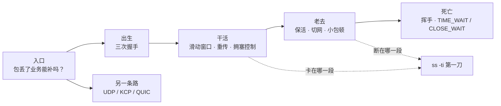

- 📖 **读图**
  - 🚪 入口问「能不能丢」：补不了 → TCP；补得了 → UDP / KCP / QUIC
  - 🛤️ 主线「出生 → 干活 → 老去 → 死亡」；卡顿/断连第一刀都是 `ss -ti`（Q1、Q13、Q14）

---

## 二、选型：这条道用 TCP 还是 UDP

> 🎯 **一句话**：第一问永远是「包丢了业务能不能自己补」，不是「谁更快」。

| 维度 | TCP | UDP |
|------|-----|-----|
| 连接 | 有，建连时握手一次 | 无连接 |
| 数据模型 | 可靠有序**字节流** | 尽力送达**报文**，丢了不管 |
| 队头阻塞 | 一条连接丢一包，后面全等 | 无（应用自己排） |
| 典型 | 登录、支付、聊天、HTTP | 位置 20Hz、可丢特效帧 |

- 🔑 **「一条连接」** = 四元组 `(源IP, 源端口, 目的IP, 目的端口)`（可多条；五节切网、六节端口复用还要用）

- 🗺️ **选型三条分支**
  - 补不了（钱、登录态、关键指令）→ **TCP / HTTPS**
  - 补得了（位置、特效，下一帧覆盖）→ **UDP**
  - 补不了，但弱网下 TCP 尾延迟受不了 → **评估 KCP，且必须限速**（七节）；支付/登录仍走 TCP
  - 🎮 游戏常见按这三条拆通道；⚠️ 典型错误：整条业务「为了流畅」全上 KCP

### 📮 字节流的代价：粘包与拆包 🎯⭐🔥

- 🎭 **小剧场**：`write` 三次、对端一次全读到——很多人答「网络把包拼坏了」。错：TCP 只保证字节顺序，**不保证消息边界**。

> 🎯 **一句话**：你 `write` 三次，对端可能一次 `read` 全收到（粘包），一条消息也可能分两次才收齐（拆包）。边界必须应用自己划。

```text
你以为的：  write("登录")  write("走路")  write("放技能")
            read → "登录"   read → "走路"   read → "放技能"

实际可能：  read → "登录走路放技"      ← 粘包（三条粘在一起，还切断了最后一条）
            read → "能"                ← 拆包（上一条的尾巴才到）
```

- 📖 **读图**：左栏是「一次 write = 一次 read」幻想；右栏才是真实语义。边界必须应用自己划，别怪网络。

- 🔥 **根源**：TCP 眼里只有连续字节线；Nagle 攒小段、路径 MTU 切大段、接收缓冲按到达堆着——**「一次 write = 一次 read」从来不是承诺**

- ✂️ **边界只能在应用层划**，选一种、全链路统一：

```text
① 长度前缀（最常用）  [4字节长度][消息体]  ← 先读满 4 字节知道要读多长，再读满那么多
② 分隔符             消息\n消息\n         ← 简单，但消息体内不能出现分隔符
③ 定长               每条固定 128 字节     ← 解析最快，浪费带宽，只适合固定结构
```

- 🔁 **配套读法**：「读进缓冲区 → 循环切出完整消息 → 切不出就留着等下次」——不是「read 一次当一条消息」

> ⚠️ **别混**：粘包不是 bug，是字节流正常语义；`TCP_NODELAY` 只是不攒小包，路径照样合并/切分，**关了 Nagle 一样粘**。UDP 一次 `sendto` = 一个报文，天然不粘，代价是丢了没人补（七节）。

> 📝 **面试**：问「怎么解决粘包」，答「应用层定界：长度前缀 / 分隔符 / 定长，配合『收到就循环切、切不完留着』」。答「关掉 Nagle」直接减分。⭐（练习题 Q1）

本节对应练习题 Q1、Q13。道选好了，连接要出生——两端怎么确认对方真的在？

---

## 三、出生：三次握手

> 🎯 **一句话**：三次握手交换的是双方的随机起始序号，第三个 ACK 是为了防「幽灵连接」。

### 👀 先认一眼 TCP 头 ⭐

```text
[ 源端口 16 | 目的端口 16 ]          ← 四元组里的那两元
[      序号 seq 32        ]          ← 这段数据第一个字节在字节流里的编号（编号连续、无边界，粘包的根源）
[   确认号 ack 32         ]          ← 「我期待收到的下一个字节编号」，即之前的都收到了
[ 首部长 | 标志位 | 窗口 16 ]        ← SYN 建连 · ACK 确认 · FIN 关闭 · RST 掐断 · PSH 尽快上交 · URG 紧急
[ 校验和 16 | 紧急指针 16 ]
[ 选项：MSS · wscale · SACK · Timestamp，只在握手时协商 ]
        ↑ 固定部分 20 字节，带选项更长（UDP 头只有 8 字节，七节）
```

- 📖 **读图**
  - 源/目的端口 = 四元组两元；seq / ack = 整章编号语言；窗口字段就是 **rwnd**（四节）
  - 标志位可叠（`SYN+ACK`）；**ack 是累积确认**；选项只在握手谈一次：`MSS` · `wscale` · `SACK` · `Timestamp`

### 🤝 三个动作与两端状态 🎯⭐🔥

- 建连前 Server 只是 `LISTEN`；三步交换的是 **seq / ack**，不是业务数据。白板上要能一笔不差默画：

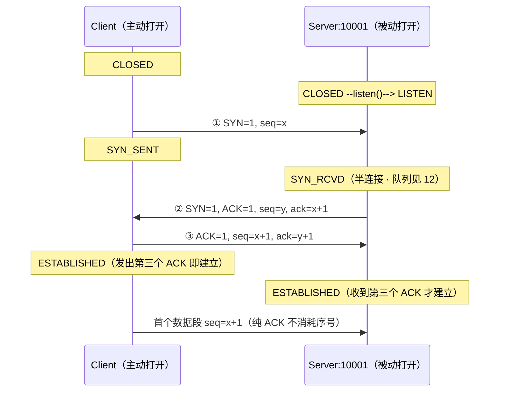

- 📖 **读图**
  - ①→② 交换 ISN，ack 对 SYN 做 `+1`；③ Client **发出**第三个 ACK 即 `ESTABLISHED`，Server **收到**才算
  - 🎲 `x`/`y` 是两端各自随机 **ISN**

- 🔍 **三处细节**
  - **`ack` 为什么是 `+1`**：ack =「期望的下一个字节」且是累积确认；SYN/FIN **各消耗一个序号**；带 payload 则 `ack = seq + 长度`
  - **纯 ACK 不消耗序号** → 首个数据段仍从 `seq=x+1`（白板写 `x+2` 就错）
  - **两端进 ESTABLISHED 时刻不同** → [12](../12-网络栈与Socket/)「全连接队列满时客户端 ESTAB、服务端却没这条连接」的根源

> ⚠️ **别混**：RFC 793 写 `SYN-RECEIVED`（常记 `SYN_RCVD`），Linux `ss` 打印 `SYN-RECV`；面试写教科书名、值班认工具名。

> 📝 **面试**：画握手必须写出 `seq=x` / `seq=y, ack=x+1` / `seq=x+1, ack=y+1` 加两条状态链——Client `CLOSED → SYN_SENT → ESTABLISHED`，Server `CLOSED → LISTEN → SYN_RCVD → ESTABLISHED`——再补「SYN 消耗一个序号，所以 ack 是 +1」。⭐（练习题 Q2）

### 👻 为什么随机、为什么三次 ⭐

> 💡 **打个比方**：你寄信（SYN），朋友回「收到，我从 y 编号」（SYN+ACK）。你不回第三封，朋友不知道回信你收到没有；更糟——第一封可能是几天前的旧信，朋友已开好房间，你早就不在了。

#### ❓ 为什么不是两次？

- 👻 **只握两次**：Server 收 SYN 就 ESTABLISHED → **幽灵连接**（给不存在的客户端白占 fd）
- ✅ **第三次 ACK**：确认「对方这一次真的还在」
- 🎲 **ISN 必须随机**：防串包 / 防序号预测 / 配合端口复用（六节）
- 🤝 **顺便协商**（只谈一次）：`MSS` / `wscale` / `SACK` / `Timestamp`

### 🔧 握手卡在半路：看状态堆在谁家 🔧

```bash
ss -ant | grep -E 'SYN-SENT|SYN-RECV'
# 堆 SYN-SENT → 本端发完 SYN 没等来 SYN+ACK：对端没监听 / 中间丢包 / 被防火墙黑洞
# 堆 SYN-RECV → 本端回了 SYN+ACK 没等来最后 ACK：对端没回 或 全连接队列满（→12）
```

- 🔍 **现场**：SYN-SENT→查对端；SYN-RECV→查队列。
- 🍪 **SYN Cookie**：SYN Flood 时状态编码进 ISN，靠第三个 ACK 反推；是降级不是容量方案。

> ⚠️ **别混**：握手成功 ≠ 后面没事。后续段照样丢（四节）、NAT 照样清表（五节）、对端应用照样可能不读（ZeroWindow）。

本节对应练习题 Q2。连接起来了，接着就是那个真问题：数据怎么发，才既不灌爆对端、又不灌爆网络？

---

## 四、干活：滑动窗口与重传

> 🎯 **一句话**：TCP 不是「发一个等一个」，而是「窗口内连续发、确认了就前滑」，能发多少由 `min(rwnd, cwnd)` 决定。值班里 80% 的「已 ESTAB 还卡」都落在这一节。

四个问题：能连续发？谁限制？丢了怎么补？怎么不灌爆网络？

### 📬 为什么能连续发：滑动窗口 ⭐🔥

> 💡 **打个比方**：跨海寄货一来一回 200ms。停等＝发一件等签收再发下一件，一天发不了几件；滑动窗口＝允许同时 100 件在路上，签收一件补发一件。

#### ❓ 为什么不是停等？会不会发到爆？

- ❌ **停等**：每个 RTT 只能飞一段 → 跨海吞吐上不去
- ✅ **窗口**：允许「已发未确认」同时存在多段；ACK 回来腾额度再发 —— **流水线，不是批处理**
- 🛑 **不会无限发**：同时在飞的上限 = `min(rwnd, cwnd)`；ACK 不回来或 rwnd=0，右沿钉死 —— 这就是卡顿的微观机制

- 📦 **缓冲想成字节线**：

```text
已确认 |---- 已发未确认（飞行中）----|---- 还能发 ----| 暂时不能发
       ^UNA = SND.UNA                ^NXT = SND.NXT  ^右沿 = UNA + min(rwnd, cwnd)
```

- 📖 **读图**：左沿 `SND.UNA` 由 ACK 推；右沿永远 = `UNA + min(rwnd, cwnd)`。

- 🎬 **三帧走一遍**（MSS=1000、窗口=4000，从 `seq=1001`）：

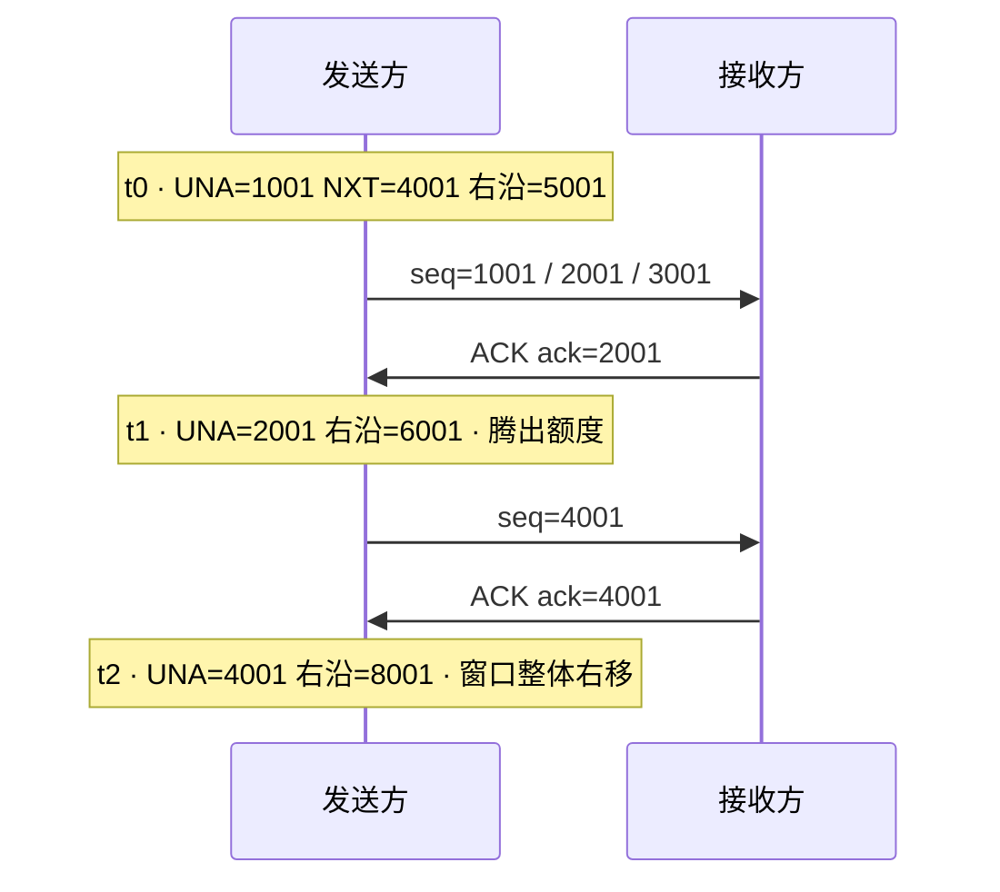

- 📖 **读图**：`ack=2001` =「`1001~2000` 齐了，下一个要 2001」→ UNA/右沿一起右滑。

### ⚖️ 谁在限制发送量：rwnd 与 cwnd 🎯⭐

| 对比 | **rwnd**（接收窗口） | **cwnd**（拥塞窗口） |
|------|----------------------|----------------------|
| **官方机制名** | **流量控制（flow control）** | **拥塞控制（congestion control）** |
| 保护谁 | 保护**对端主机**别被灌爆 | 保护**中间网络**别被灌爆 |
| 范围 | 端到端 | 端到网络 |
| 怎么知道 | 对端在 ACK 的窗口字段里**显式通告** | 没人通告，**从丢包和 RTT 自己猜** |
| 变小原因 | 对端应用不 `read`，接收缓冲满 | 丢包、拥塞 |
| 怎么治 | 让**对端**把数据读走 | 查丢包路径，别乱换算法 |

> ⚠️ **别混**：**流量控制 ≠ 拥塞控制**。同时生效，发送量取 `min(rwnd, cwnd)`。口诀：**rwnd 护对端，cwnd 护路上，发送取两者小。**

#### 🪟 rwnd：对端说「我还能收多少」

- 📣 接收方把剩余空间写进 ACK 窗口字段；通告成 0 → **ZeroWindow**，发送方立刻停发
- 🔭 停发后用**零窗口探测（persist timer）**定期发一字节探针；对端读走数据后 ACK 把窗口改大 → 恢复
- 👉 **根因在对端接收侧**（应用读慢 / 接收缓冲太小 / 内存吃紧）——本端没有旋钮，要结合对端 Recv-Q 与系统资源定责

> ⚠️ **口径**：`rcv_space` 是**本端**接收缓冲调优估算，**不是**对端窗口，不能单独判 ZeroWindow。要交叉：① 抓包见对端 Window=0 ② `snd_wnd` 趋 0 + Send-Q 堆 ③ 对端 Recv-Q 顶满、应用没在 read。

#### 📏 wscale：把 64KB 窗口放大

- TCP 头窗口字段最多 64KB；`wscale:7,7` = ×128 → 上限约 **8MB**。别把 7 当成 1GB（最大因子 **14** 才接近）；没协商 → 钉在 64KB

### 丢包后怎么补：RTO 与快速重传 ⭐🔥

> 🎯 **一句话**：包发出去之后没等到确认，TCP 只有两条路发现「丢了」——干等超时，或靠对方重复喊「我还在等同一段」提前发现。两条路都会重传，但之后敢不敢继续快发，差很多。

- 📮 **寄货小剧场**：你往对岸寄五箱货；正常是一箱一签收。不对劲时——😴 半天没回音，或 📣 对岸一遍遍喊「第二箱呢？」。TCP 干的就是：判断哪箱丢了、补完后还敢不敢快发。

#### 🔑 先认识一个钥匙：`cwnd`

- **`cwnd`** = 发送方给自己定的「路上同时允许多少货」（单位按「段」理解；详见上一小节）
- 👉 两条补包路径真正拉开差距的，不是「会不会重传」，而是——**补完之后，`cwnd` 被罚得多狠**

#### 🗺️ 一张图看清两条路

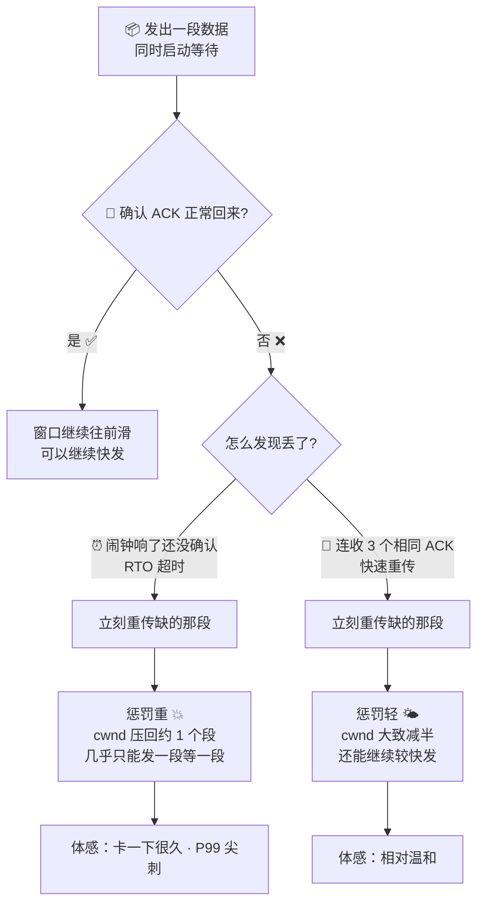

- 📖 **读图**
  - 两条路都会「补上丢掉的那段」；分叉在中间：⏰ 干等闹钟 vs 📣 对方提前告状
  - 发现得越晚，惩罚通常越重

#### ❓ 为什么两套都要？会不会抢着触发？

- 🤔 **常见误会**：RTT 才 5ms，那我等 6ms 就算超时——对面 DupACK 一喊，不就和超时撞车了？
- ❌ **错在哪**：RTO **不是**「RTT + 一点点」。`RTO ≈ SRTT + 4 × RTTVAR`，故意留裕量；现场常见 `rto:420`（毫秒）。RTT 5ms 时闹钟往往要**几百毫秒**才响——宁可晚认丢，也不误杀「还在路上、只是稍抖」的包。
- 🗺️ **两套各管一种现场**：📣 快重传 = 后面还有货到了、对岸能喊 DupACK → **闹钟未响**就发现；⏰ RTO = 完全没回音（黑洞、飞行中**最后一段**丢了喊不出 DupACK）→ **只能干等闹钟**
- ✅ **不冲突**：同一段货，谁先证据够硬谁先补。凑满 3 个 DupACK → 快重传并**重置/取消**这段闹钟；一直既无 ACK 也无 DupACK，闹钟才响。👉 快重传是有人告状时的快速通道，RTO 是没人告状时的兜底闹钟——互补，不是抢跑。

#### ⏰ 路径一：干等超时 —— RTO

- **RTO** = 发送方闹钟 ⏰（**远大于一个 RTT**，不是 RTT+1ms）
  1. 发出一段，同时上闹钟
  2. 闹钟响了还没签收 → 重传
  3. 把 `cwnd` **压回大约 1 个段**
  - 💭 「大约 1 个段」= 几乎发一段等一段 → 吞吐断崖。「打回 ≈ 1」的 `1` 就是这个，不是神秘常数
  - 🔍 `ss -ti` 的 `rto:420`（毫秒）往往比 `rtt:5` 大一到两个数量级：`RTO ≈ SRTT + 4 × RTTVAR`；超时后再等会翻倍（指数退避）

#### 📣 路径二：对方提前告状 —— 快速重传

- **累积确认**：中间缺一段，后面即使到了确认点也推不动 → 对岸一遍遍喊同一号码 = **DupACK** 📣

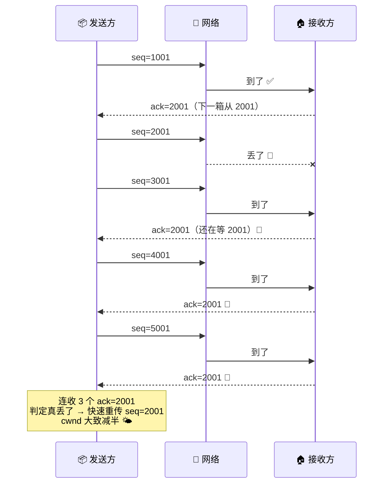

- 📖 **读图**
  - 后三个相同 `ack=2001` 是 DupACK；凑满 3 个才敢说真丢（1～2 个可能只是乱序）
  - ✅ 快重传后 `cwnd` 通常只**减半**——体感比超时温和得多

#### 👀 对照一眼

| | ⏰ 路径一 · RTO | 📣 路径二 · 快速重传 |
|--|----------------|----------------------|
| 怎么发现 | 闹钟响了还没确认 | 连收 3 个相同 ACK |
| 补完之后 | `cwnd` ≈ **1 个段** 💥 | `cwnd` **减半** 🌤️ |
| 玩家感觉 | 卡一下很久 | 相对温和 |

- ⚠️ **口径**：经典 Reno / NewReno 教学说法；CUBIC / PRR / RACK 实际回退比例可能不同。白板先按表答。

#### 🤝 两个小帮手

- 🧩 **SACK**：对岸告诉你「后面哪些箱已到」→ 只补真缺的洞；常和快重传一起用
- ⏳ **延迟 ACK**：先攒一会儿再回（`ss -ti` 的 `ato`，内核自适应）；单独通常没事，和第五节 Nagle 叠在一起才变「小包固定顿一下」

### 🚦 怎么不灌爆网络：拥塞控制四阶段 🔥

> 💡 **打个比方**：新开高速入口不知道堵不堵——先放 1 辆，没事就 2、4（慢启动）；到门槛改成每轮 +1（拥塞避免）；出事就退回重探（RTO）。

#### ❓ 和上一小节「两套重传」什么关系？

- 📣 **快重传**走进状态机 = 表里的 ③→④（补包 + `cwnd` 减半后回拥塞避免）
- ⏰ **RTO**走进状态机 = 表里兜底行（`cwnd≈1` 段，重回慢启动）
- 👉 上一小节讲「怎么发现丢了、罚多重」；这里讲「发现之后状态机怎么走」——同一件事的两面，不是第三套重传

经典 Reno / NewReno 教学口径：

| 阶段 | cwnd 怎么变 | 什么时候进 |
|------|------------|-----------|
| ① 慢启动 slow start | 每 RTT 近似翻倍（指数） | 连接起始，直到 `ssthresh` |
| ② 拥塞避免 congestion avoidance | 每 RTT 约 +1（线性） | cwnd 超过 `ssthresh` |
| ③ 快速重传 fast retransmit | —（先把那段补上） | 收到 3 个 DupACK |
| ④ 快速恢复 fast recovery | **减半**后回拥塞避免 | 紧跟快速重传 |
| （兜底）RTO 超时 | `cwnd` 压回大约 **1 个段**，重回慢启动 | 等超时才发现丢包 |

- 📈 **慢启动为何翻倍**：每 ACK → cwnd +1 MSS；一 RTT 约收 cwnd 个 ACK → 翻倍。`ssthresh:INT_MAX` = 还没丢过；真值丢包后才算（约 = 当时 cwnd 一半）
- 🌊 **跨海短连接慢**：每条都从慢启动爬 → ✅ 连接池 / Keep-Alive；❌ 换算法治不了
- 🥊 **Cubic（默认）** 丢包驱动；**BBR** 按 `带宽×最小RTT` 发。⚠️ 无丢包证据就换 BBR——减分；**换算法治不了距离**
- 📝 白板按上表答；CUBIC 不是精确减半；PRR/RACK 会改恢复路径

### 🧩 收束：TCP 凭什么叫「可靠」🎯⭐

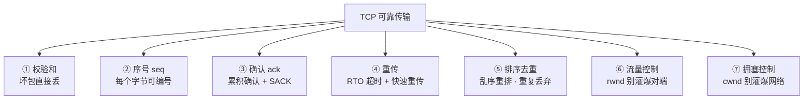

- 📖 **读图**：①②③ **发现** → ④⑤ **解决** → ⑥⑦ **预防**。少后两件在弱网上会重传到雪崩——七节不限速 KCP 的死法。

> ⚠️ **别混**：**可靠 ≠ 不丢包**（只保证丢了补齐、按序上交）；≠ 低延迟；≠ 消息边界（二节粘包）。

### 📎 顺带两个概念：队头阻塞与 MSS

- 🧊 **队头阻塞**：一条 TCP 丢一包，后面即使已到也不能上交。HTTP/2 只解应用层；HTTP/3/QUIC 才拆。✅ 拆通道。
- 📐 **MSS**：每端通告「我愿意收的最大 payload」（常见 1460）；**发送方遵守对端那个**。中间 MTU 更小 + ICMP 被墙 → PMTUD 黑洞 → [16](../16-网络排障与抓包/)

本节对应练习题 Q3、Q4、Q5、Q6。数据会传了——那为什么 `ss` 还显示 ESTAB，玩家却挂机 8 分钟被踢？

---

## 五、老去：为什么「还连着」也断

> 🎯 **一句话**：`ss` 显示 ESTAB 只代表本端状态机没被推翻，不代表链路还活着。下面几种断法对策完全不同，别一套「加大 keepalive」糊弄过去。

#### 🔑 半打开 ≠ 半关闭

- 🦊 **半打开（half-open）** = 一端仍认为连接在，而对端已不在、或端到端路径状态已失效——**路用不了了，只是没人通知你**（无带外信令）。

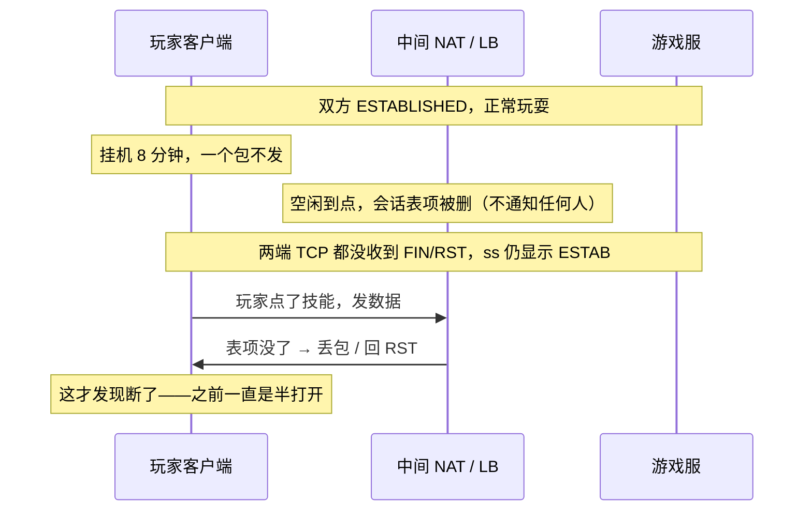

- 📖 **读图**：NAT 删表不通知任何人；两端可能都还 ESTABLISHED，失效的是中间映射。

> ⚠️ **别混**：半关闭（六节，一方 FIN 后还能收）≠ 半打开（故障）。半打开三种成因：① 进程崩溃——内核常仍发 FIN/RST ② 断电/链路断——两端状态不一致 ③ NAT/LB 清表——两端控制块可能都还 ESTABLISHED。

### 心跳、NAT 与内核 keepalive ⭐

> 🔍 **现场**：玩家挂机 8 分钟被踢，`ss -ti` 字段一切健康，业务已死。

#### ⏰ 三档时间尺度：最小的那个说了算

| 层级 | 常见量级 | 作用 | 边界 |
|---|---|---|---|
| 应用心跳 | 15–45s | ✅ 真正的保活 | 要小于下面那一行 |
| NAT / LB / conntrack 空闲超时 | 常见 30s ~ 5min（各家不同） | 中间设备先把你掐掉 | **它决定心跳上限** |
| 内核 `tcp_keepalive_time` | 默认 7200s（发行版可改） | 只负责清理死连接 | **不能当游戏心跳** |

- 📏 心跳 < 链路上**最小**空闲超时（NAT/LB/SLB 取最小），再留余量。默认 7200s **不能当游戏心跳**。
- 🩺 **心跳绿 ≠ 业务健康**：IO 线程回 ack、业务线程卡死——探活要过业务线程。心跳走哪条路径就只保哪一层。

### Nagle 叠延迟 ACK：小包固定顿一下 🔧

> 🎯 **一句话**：Nagle 把小段攒一攒再发，对端延迟 ACK 也在等——两个「等」撞在一起。游戏长连接一律开 `TCP_NODELAY`。

- 📮 **互等**：Nagle「有未确认小包就攒」× 延迟 ACK「先攒再回」→ 干等一个往返。

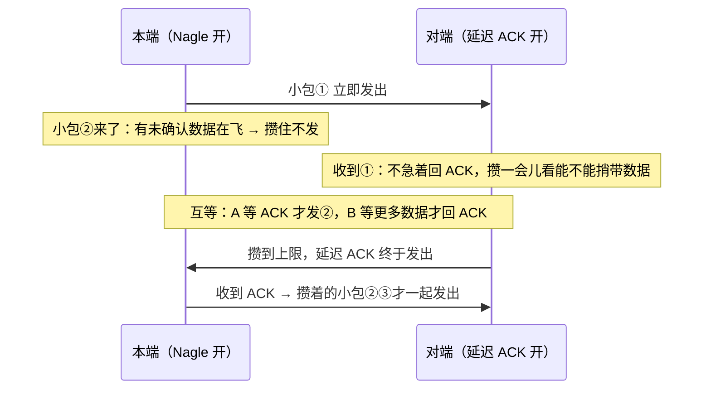

- 📖 **读图**：死锁在中间互等；签名是顿时长接近固定 + `retrans:0`（最坏约 200ms）。✅ `TCP_NODELAY=1`；高频小包在**应用层合帧**。

### 切网：四元组一变，连接就死

```text
旧连接（Wi-Fi）： (1.2.3.4:54321  →  Conn:10001)
新网络（蜂窝）： (5.6.7.8:xxxxx  →  Conn:10001)
                ↑ 不是同一条连接；旧的序号、窗口、拥塞状态全部作废
```

- 🔑 源 IP 变 → 四元组变 → 旧连接作废。✅ **重连 + 会话 token**（加大 keepalive 没用）；QUIC 见七节。

### 「还连着却用不了」怎么分流

- 挂机一会儿再点就掉 → 心跳没跑赢 NAT 空闲超时 → 心跳 < 最小空闲超时
- 进地铁或切流量必掉 → 四元组死了 → **token 重连**
- 操作总固定顿一下 → Nagle 叠延迟 ACK → **`TCP_NODELAY`**
- 偶发卡很久 → 丢包 → 回四节查 `retrans`

> ⚠️ **别混**：四种病对策互斥。口诀：**挂机查心跳，切网查四元组，小包顿查 Nagle，偶发久卡查 retrans。**

本节对应练习题 Q7、Q8、Q9。连接也会老——接下来是怎么体面地死。

---

## 六、死亡：挥手与 TIME_WAIT / CLOSE_WAIT

> 🎯 **一句话**：正常关闭走四次挥手、中途可以半关闭；RST 只出现在特定 abort / 出错情形，**不是「所有异常关闭」的代名词**——断电、链路黑洞往往一个包都收不到，只能等超时。**正常的单边主动关闭下，谁先 close 谁进 TIME_WAIT，谁忘了 close 谁进 CLOSE_WAIT**（双方同时关时是例外，见下）。

### 四次挥手：标准表示与两端状态 🎯⭐

- 和握手同一套记法；**FIN 也占一个序号**，确认还是 `+1`

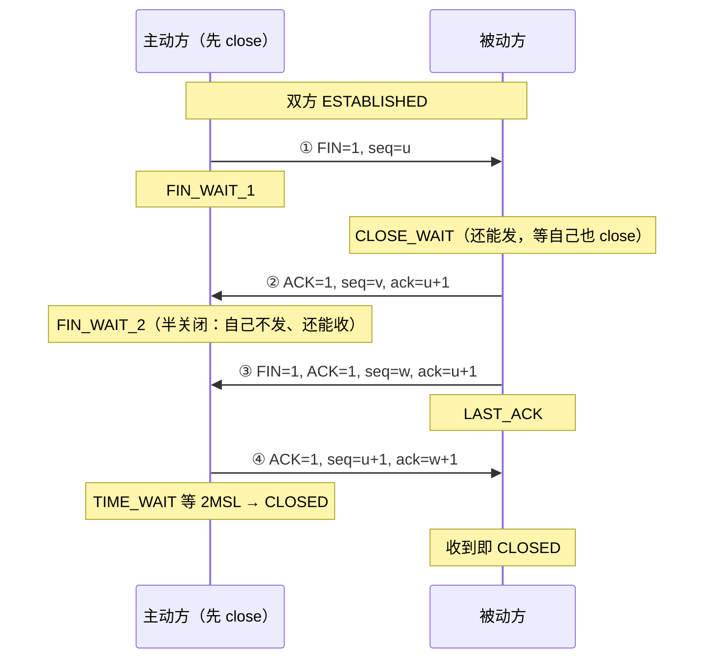

- 📖 **读图**：`u` = A 已发最后字节 +1；报文 3 的 `w` 可能 > 报文 2 的 `v`（中间 B 又发过）。**只有主动方等 2MSL**。

#### ❓ 为什么常常是四次，不是三次？

- 报文 2（ACK）和报文 3（FIN）之间，夹着「B 把剩余数据发完 + 应用调 close」——时长不确定，**合不成一个包**
- B 恰好没待发数据时，内核可把 ACK+FIN 合并 → 抓包看到「三次挥手」= 优化，不是漏抓，也不是标准必走三次

> 📝 **面试**：画挥手写全 `FIN, seq=u` → `ACK, ack=u+1` → `FIN, seq=w, ack=u+1` → `ACK, ack=w+1`，加状态链：主动方 `ESTABLISHED → FIN_WAIT_1 → FIN_WAIT_2 → TIME_WAIT → CLOSED`，被动方 `ESTABLISHED → CLOSE_WAIT → LAST_ACK → CLOSED`，补「FIN 占序号，只有主动方等 2MSL」。⭐（练习题 Q10、Q12）

### 半关闭要用 shutdown，close 做不到

- FIN 只表示「我发完了」，对方仍可继续发。想「发完但还要收完回包」必须用 `shutdown`：

  ```text
  shutdown(fd, SHUT_WR)   只关写方向 → 发 FIN，还能继续 read 对端剩余数据   ← 真正的半关闭
  shutdown(fd, SHUT_RD)   只关读方向
  shutdown(fd, SHUT_RDWR) 双向都关，但 fd 还在（还要 close 回收）
  close(fd)               fd 引用计数 −1，减到 0 才真正关连接、发 FIN
  ```

- 典型：发完请求 `shutdown(SHUT_WR)` 再读响应；`close()` 后**读不到**后续数据

> ⚠️ **别混**：`fork` 后父子共享 socket，**只有最后那个 `close` 才发 FIN**——「明明 close 了却还在 CLOSE_WAIT / ESTAB」的常见原因。

#### 👀 FIN vs RST

| 对比 | FIN 优雅关 | RST 粗暴掐 |
|------|-----------|------------|
| 对端能否收完 | 尽量保证 | **不保证**，缓冲里未读数据常直接丢 |
| 常见原因 | 应用 `close` / `shutdown(SHUT_WR)` | abortive close（`SO_LINGER={1,0}`）、关闭时接收缓冲还有未读数据、向没监听的端口发 SYN、中间设备主动拒绝 |

> ⚠️ **别混**：**进程崩溃或 `kill -9` 并不等于发 RST**。进程退出时内核替它关 fd，普通 TCP socket 通常仍走 FIN；到底 FIN 还是 RST，取决于 socket 状态和选项（上表右列）。`kill -9` 真正代价是**跳过应用层 drain**。停服姿势：停新连接 → 等 in-flight → 再关 socket（[05](../05-进程与信号/)）。

### TIME_WAIT vs CLOSE_WAIT ⭐

#### 🗺️ 两条关闭路径

- 单边主动关：主动方 `…→ TIME_WAIT → CLOSED`；被动方 `CLOSE_WAIT → LAST_ACK → CLOSED`。**同时关闭**则两端都 `…→ CLOSING → TIME_WAIT`，「谁先 close 谁 TW」不适用

| 对比 | TIME_WAIT | CLOSE_WAIT |
|------|-----------|------------|
| 谁 | **主动**关闭方 | **被动**关闭方 |
| 在等什么 | 2MSL，内核自己会消 | 应用调 `close()`，不调就一直挂 |
| 多了怎么治 | 连接池 / Keep-Alive | **修代码** |

#### ⏳ 为什么等 2MSL

- **MSL** = 段在网络里最长存活时间（实现相关）；Linux TW = 编译期 `TCP_TIMEWAIT_LEN`（60s），**sysctl 改不了**。**2MSL**：① 最后 ACK 丢了能再回 FIN 的重传 ② 旧序号包消亡（同三节 ISN）

> ⚠️ **别混**：`tcp_fin_timeout` 管的是 `FIN_WAIT_2`，**不是** TIME_WAIT，也盖不住 CLOSE_WAIT。**CLOSE_WAIT 持续涨 = 程序泄漏**（收到 FIN 后没 close），只能修代码；TIME_WAIT 不是故障。也没有「客户端一定 TW、服务端一定 CW」——服务端主动踢人时 TW 就在服务端。

### 被 TIME_WAIT 挡住：四个复用选项 ⭐🔧

- 被 TIME_WAIT 挡住：四个复用选项常混淆。**TW 多本身不必然让重启失败**。

| 选项 | 管什么 |
|------|--------|
| `SO_REUSEADDR` | 允许 `bind` 到还有 TW 残留的本地地址——**重启绑不上的标准解药**（只放宽 TW 冲突） |
| `SO_REUSEPORT` | 多进程同时 LISTEN 同一端口，内核哈希分发 |
| `tcp_tw_reuse` | 复用 TW **出站**四元组（依赖 timestamps / PAWS） |
| `tcp_tw_recycle` | **别用，已移除**（NAT 下误伤；4.12 删除） |

> 📝 **面试**：① 分清客户端侧（临时端口压力 → 连接池 / 长连接，必要时 `tcp_tw_reuse` + `tcp_timestamps=1`）还是服务端侧（服务端在主动关）② `SO_REUSEADDR` 解决重启绑不上，不是 TW 多 ③ 绝不提 `tcp_tw_recycle`。口诀：**ADDR 管重启绑，PORT 管多进程听，reuse 管出站复用，recycle 别提。**（练习题 Q11、Q12）

本节对应练习题 Q10、Q11、Q12。TCP 主线讲完了——包丢了业务能自己补的时候，走哪条道？

---

## 七、另一条路：UDP / KCP / QUIC

> 🎯 **一句话**：UDP 把可靠性全部甩给应用层；KCP 在 UDP 上做用户态可靠，但必须限速；QUIC 用 Connection ID 解决切网。进门那一问仍然是二节的「能不能丢」。

### UDP：简单是字面意思

```text
[ 源端口 16 | 目的端口 16 ]
[  长度 16  |  校验和 16  ]     ← 一共 8 字节（TCP 固定 20，三节）
```

- 没有序号 / 窗口 / 标志位 → 排序去重、流控、连接状态全留给你。

#### 📦 三条边界要记牢

- 🧱 **天然有报文边界**：一次 `sendto` = 一个报文；`recvfrom` **最多取走一个 datagram**，**不粘包**；缓冲不够会截断丢弃余下——缓冲按最大报文开
- 🚦 **无流控**：灌太快只会在中间丢包，应用往往感知不到是自己灌的
- 📏 **按 PMTU − IP 头 − 8 字节 UDP 头预算**（IPv4 看 DF/分片；IPv6 靠 ICMPv6 `Packet Too Big`）。**别套 TCP 的 MSS**

- 💭 DNS/DHCP 用 UDP：报文小、建 TCP 更贵；DHCP 客户端还没 IP，只能广播

> ⚠️ **别混**：「UDP 一定比 TCP 快」是错的。业务自己补可靠可能比 TCP 更慢更烂。

### KCP：可靠做在用户态，刹车要你自己踩 🔥

- KCP 在 UDP 上做用户态可靠，重传比 TCP 激进，弱网尾延迟往往好看。但边界必须说准：

> 🎯 **准确口径**：KCP **有**拥塞控制，但**可选且比 TCP 弱**。游戏常用「极速模式」（`nodelay=1, resend=2, nc=1`）恰恰关掉——`nc=1` = 关闭拥塞控制；即使开着也只看自己这条流。正确说法：「退让能力取决于配置且偏弱，必须应用层限速」，不是笼统「KCP 没有拥塞控制」。

#### 🔄 关掉退让之后：正反馈环

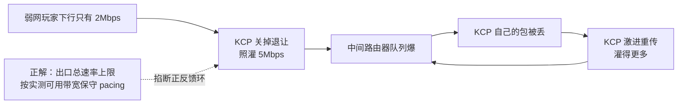

- 📖 **读图**：正反馈环；关掉退让的 KCP 不会像 TCP 那样退让——只能外部限速，否则**比 TCP 还卡**。

#### 🛑 限速三招

1. **出口总速率上限**：按实测带宽保守 pacing，为重传/协议头留余量
2. **打开自带拥塞控制**（`nc=0`）
3. **总额度内分通道**——**所有通道都在总上限内**；可丢通道积压时丢旧帧；不可丢关键指令用独立小额度。「可丢」≠ 无上限灌网

> 📝 **面试**：「全改 KCP 就流畅」——错。KCP 不解决带宽不够。答「拆可丢/不可丢，KCP 只用在『不可丢且 TCP 尾延迟不可接受』那一小段，且必须限速，支付登录仍走 TCP」。

### QUIC / HTTP3：能力与边界

- QUIC 在 UDP 上做多流，拆开传输层队头阻塞；用 **Connection ID（CID）** 把连接身份与四元组解耦：

  ```text
  TCP 切网：  四元组变 → 内核找不到 socket → 连接死 → 必须重连 + token
  QUIC 切网： 换网后用可用 CID 在新路径发包 → 对端凭 CID 归属回原连接
              → PATH_CHALLENGE / PATH_RESPONSE 路径验证 → 通过了才真正迁移
              （迁移时通常还会换用新的 CID，并不要求「CID 恒定不变」）
  ```

> ⚠️ **别神话**：① 双方支持且未 `disable_active_migration` ② 能按 CID 路由（零长度 CID 不行）③ `PATH_CHALLENGE/RESPONSE` 通过，还受拥塞与放大限额。「NAT 重绑定」≠ 主动迁移；自研网关多数仍 TCP/KCP + token。

本节对应练习题 Q13。机制讲完了——回到开头那个现场，60 秒怎么定责？

---

## 八、作战：`ss -ti` + 定责

> 🎯 **一句话**：抓包能看每一包但成本高，日常先用 `ss -ti` 定型，定型之后再决定要不要抓包。

### 字段速记 🔧

- 🔍 **现场第一刀**：`ss -ti` 把窗口、RTT、重传摊开。先认字段，再对号入座。

```text
ESTAB  0  4344  10.0.0.8:10001  203.0.113.88:54321
  cubic wscale:7,7 rto:420 rtt:185.2/42.1 ato:40 mss:1448
  # ← rtt = 平滑RTT / rttvar（抖不抖，不是统计学「方差」）；wscale:7,7 → ×128 ≈ 8MB 上限（最大因子14才≈1GB）
  cwnd:4 ssthresh:40 bytes_sent:162888 bytes_acked:118000
  # ← cwnd 拥塞窗口；实际发送上限 min(rwnd,cwnd)；ssthresh 新建常 INT_MAX
  unacked:3 retrans:1/28 snd_wnd:65536 rcv_space:65535
  # ← retrans A/B：A=当前未决重传段，B=累计（关键看B涨不涨）；A 恒 ≤ unacked
  # ← snd_wnd=对端通告给本端（较新iproute2才有；趋0才是ZeroWindow线索）
  # ← rcv_space=本端接收缓冲调优估算 ❌不是对端窗口，别拿它判ZeroWindow
  # ← bytes_sent含重传；bytes_acked只算确认的原始数据；差额≠flight（估flight≈unacked×mss）
```

- 📖 **读图**：对照注释钉死三轴——`rtt` 抖不抖、`retrans` B 涨不涨、`snd_wnd` 是否趋 0；`rcv_space` 永远不是 ZeroWindow 证据。

### 三组对照：Send-Q 大但走不动 🔧

- 🎯 `Send-Q` 大只说明本端发送缓冲有字节没走完；为什么走不完看后面字段。⚠️ 三种型对策互斥——加大 `sndbuf` 对前两种都没用。

#### 🌍 A · 距离型（别当丢包治）

```text
ESTAB  0  0  10.0.0.8:10001  118.69.x.x:44102
  cubic rtt:220.1/12.0 cwnd:40 ssthresh:40
  bytes_sent:800000 bytes_acked:800000 unacked:0 retrans:0/0 snd_wnd:65536
```

- 📖 **读图**：`rtt` 高且稳、`retrans=0`、`cwnd` 正常 → 物理/跨境延迟。✅ 治连接复用，别每次 API 新建。

#### 💥 B · 丢包 / 拥塞型

```text
ESTAB  0  120000  10.0.0.8:10001  118.69.x.x:44102
  cubic rtt:85.0/60.2 cwnd:2 ssthresh:18
  bytes_sent:2156000 bytes_acked:1980000 unacked:2 retrans:2/120 snd_wnd:65536
```

- 📖 **读图**：`rtt` 波动大、`retrans` 在涨、`cwnd` 趴到个位数 → 路径质量或对端问题。✅ 先两端对比，再抓包（→ [16](../16-网络排障与抓包/)）。

#### 🛑 C · ZeroWindow 型（流控受限）

```text
ESTAB  0  380000  10.0.0.8:10001  203.0.113.88:54321
  cubic rtt:40.0/8.0 cwnd:55
  bytes_sent:14624000 bytes_acked:14620000 unacked:0 retrans:0/3 snd_wnd:0
```

- 📖 **读图**：`Send-Q` 堆 + `snd_wnd` 趋 0 + `retrans` 不涨 → 对端不读。✅ 抓包应见对端 ZeroWindow，再查对端 Recv-Q（→ [12](../12-网络栈与Socket/)）；治对端接收侧，**不是**加大本端 `wmem`。

> ⚠️ **别混**：C 型要几条一起看——`snd_wnd` 趋 0 + 抓包见 ZeroWindow + 对端 Recv-Q 顶满且应用没在 read。老 iproute2 无 `snd_wnd` → 以抓包 `Window=0` 为准。只看本端 `rcv_space` 就下 ZeroWindow 结论是错的。

### 定责决策树

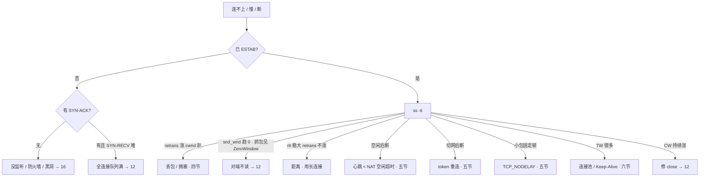

- 📖 **读图**：先问已 ESTAB？→ 再按 retrans / snd_wnd / rtt 分流；空闲/切网/小包顿/TW/CW 走五六节。

### 60 秒剧本 🔧

> 🔍 **现场**：接到「卡 / 慢 / 断」报障，别先抓包，60 秒走完这条线再下结论。

```text
① 0–10s  连不上还是慢？  ss -ant 看堆在哪个状态：SYN-SENT / SYN-RECV / ESTAB / TIME-WAIT
② 10–30s 已 ESTAB 还慢？ ss -ti dst <对端> 看三样：retrans 涨不涨 / rtt 稳不稳 / snd_wnd 是不是趋 0（无此字段就抓包看对端 Window=0）
③ 30–45s 定型：A 距离型（rtt 稳大 retrans 0）· B 丢包型（retrans 涨 cwnd 趴）· C 流控型（snd_wnd 趋 0）
④ 45–60s 定责并验证：A 治连接复用 · B 两端对照后抓包 · C 去对端确认 Recv-Q 与应用是否在 read
```

- ✅ 只有定型为 **B** 且要确认丢在哪一跳才抓包；A/C 抓出来仍是同一结论。

本节对应练习题 Q14（以及 Q5 的 ZeroWindow 单题版）。

---

## 九、收口

### 命令速查 🔧

```bash
# 握手卡在哪
ss -ant | grep -E 'SYN-SENT|SYN-RECV'   # SYN-SENT→查对端；SYN-RECV→查本端队列（→12）
# 已 ESTAB 还卡：第一刀
ss -ti dst <对端IP>                     # 看 rtt / retrans / cwnd / snd_wnd
# 关闭与残留
ss -ant state time-wait | wc -l         # TW 计数（短连接主动关侧常正常）
ss -antp state close-wait               # CW 持续涨 = 没 close（→12 认进程）
# 保活相关（不能当游戏心跳）
sysctl net.ipv4.tcp_keepalive_time net.ipv4.tcp_keepalive_intvl net.ipv4.tcp_keepalive_probes
# 出站 TW 复用（补丁；正解仍是连接池）
sysctl net.ipv4.tcp_timestamps net.ipv4.tcp_tw_reuse   # reuse 依赖 timestamps=1
# 小包顿：应用侧 setsockopt(TCP_NODELAY, 1)，没有全局关 Nagle 的 sysctl
```

### 面试锚点


| 问 | 30 秒答 |
|----|---------|
| TCP/UDP 怎么选？ | 看包丢了业务能不能自己补：支付 TCP，位置 UDP，不可丢且弱网尾延迟受不了才 KCP + 限速。 |
| 粘包怎么解决？ | 字节流没有消息边界 → 应用层定界：长度前缀 / 分隔符 / 定长，配循环切包；不是关 Nagle。 |
| 为何三次握手？换了什么？ | 防历史 SYN 造出幽灵连接（两次的话 Server 会为不存在的客户端过早 ESTABLISHED）；换的是双方随机 ISN 加 MSS/wscale/SACK/Timestamp 选项。ISN 随机是为了防串包、防序号预测、配合四元组复用。 |
| 握手的 seq/ack 与状态？ | `SYN seq=x` → `SYN+ACK seq=y, ack=x+1` → `ACK seq=x+1, ack=y+1`；SYN 占 1 个序号，纯 ACK 不占。Client 发完第三个 ACK 即建立，Server 收到才算。 |
| TCP 如何保证可靠？ | 七件套：校验和 / 序号 / 确认 / 重传 / 排序去重 / 流量控制 / 拥塞控制，按「发现—解决—预防」分组。可靠 ≠ 不丢包、≠ 低延迟、≠ 保消息边界。 |
| 流控 vs 拥塞控制？ | 保护对象不同（对端主机 vs 中间网络）、信息来源不同（对端显式通告 vs 自己从丢包/RTT 猜）、同时生效取 min。 |
| 拥塞四阶段？RTO vs 快重传？ | 慢启动→拥塞避免→快速重传→快速恢复。RTO 远大于 RTT（非 RTT+1ms），与快重传互补不冲突：有 DupACK 走快通道（cwnd 减半），没回音才等闹钟（cwnd≈1 重回慢启动）。经典 Reno 口径；CUBIC/PRR 实际比例不同。 |
| ZeroWindow 怎么判、怎么治？ | 对端通告窗口为 0：抓包见 ZeroWindow + `snd_wnd` 趋 0 + 对端 Recv-Q 顶满（老 iproute2 无 `snd_wnd` 就以抓包为准）。根因在对端接收侧：优先查应用读取，也要看接收缓冲上限和内存；`rcv_space` 是本端调优值，不能单独判。 |
| 队头阻塞？ | 一条 TCP 丢包堵住后面所有段；HTTP/2 只解应用层，HTTP/3 才拆传输层；游戏靠拆通道。 |
| 为何还要应用心跳？ | NAT/LB 空闲超时常在分钟级，内核 keepalive 默认 7200s 太晚；心跳还要经过业务线程才探得到业务死。 |
| 小包总固定顿一下？ | Nagle 攒小包叠对端延迟 ACK，两边互等一个往返；开 `TCP_NODELAY`，高频小包在应用层自己合帧。 |
| 切网为什么断？ | 源 IP 变 → 四元组变 → 内核找不到 socket，旧连接作废，必须 token 重连。QUIC 用 CID 把连接身份与四元组解耦，换网后在新路径发包、经路径验证才迁移，还要服务端支持并能按 CID 路由。 |
| 挥手的 seq/ack 与状态？ | `FIN seq=u` → `ACK ack=u+1` → `FIN seq=w, ack=u+1` → `ACK ack=w+1`；FIN 也占 1 个序号。四次是因为中间夹着「被动方发完剩余数据 + 应用 close」，无数据时可合并成三次。 |
| 为何 2MSL？TW vs CW？ | 2MSL 是一去一回：等对端可能重传的 FIN、等旧序号包消亡（MSL 实现相关，Linux 的 TW 时长是编译期常量 60s）。单边主动关闭时谁先 close 谁 TW（多数正常，治法是连接池），同时关闭则两端都进 TW；谁忘 close 谁 CW（代码泄漏，只能修代码）。 |
| 半关闭 vs 半打开？ | 半关闭是协议正常状态，用 `shutdown(SHUT_WR)` 发 FIN 后只收不发，双方状态一致；半打开是故障：一端仍认为连接在，而对端已不在或路径状态已失效——NAT 清表时两端控制块甚至都还是 ESTABLISHED，不一定「双方状态不一致」。`close` 之后读不到回包。 |
| 重启 bind 报占用？ | 本地地址/端口与 TIME_WAIT 残留冲突且没设复用选项时用 `SO_REUSEADDR`（不是任何情况都能绑上，也不减少 TW 数量）；多进程同端口用 `SO_REUSEPORT`；`tcp_tw_reuse` 是出站复用（依赖 timestamps）；`tcp_tw_recycle` 已移除别提。 |
| KCP 为何要限速？ | 它的拥塞控制可选且偏弱，常用极速模式（`nc=1`）直接关掉退让，不限速就自造丢包死循环。做法是整条出口按实测带宽保守 pacing，**所有通道都在总上限内**，可丢通道积压时丢旧帧。 |

### 易错一句话对照

- 两次握手就够 → 会给历史 SYN 开幽灵连接；画图只画三根箭头也不得分，要写 `seq`/`ack` 和两边状态位
- 第三个 ACK 也消耗序号 → 纯 ACK 不消耗，首个数据段仍从 `seq=x+1` 开始
- 一次 write = 一次 read → 字节流没边界，粘包/拆包要应用定界；关掉 Nagle 一样粘
- 发送速度看带宽 → 看滑动窗口，取 `min(rwnd, cwnd)`
- 可靠就是不丢包 → 只保证补齐并按序上交，不保证实时、不保证消息边界
- 流量控制和拥塞控制是一回事 → 一个保护对端主机（显式通告），一个保护中间网络（自己猜）
- 快重传后 cwnd 打回 1 → 那是 RTO；快重传走快速恢复，只减半（经典 Reno 口径，CUBIC/PRR 实际比例不同）
- RTO 就是 RTT 再多等 1ms → 错；RTO 远大于 RTT，与快重传互补：有告状走快通道，没回音才等闹钟
- 没有丢包证据就换 BBR → 换算法治不了距离
- `rcv_space:0` 就等于 ZeroWindow / ZeroWindow 调本端 wmem → 它是本端接收缓冲调优估算值；要看对端通告窗口（抓包、`snd_wnd`），并去治对端接收侧（先查应用读取，再看缓冲上限/内存）
- `ss` 是 ESTAB 就是通的 → 可能是半打开：对端已不在，或中间 NAT/LB 的映射已失效
- 内核 keepalive 当游戏心跳 → 默认 7200s，远晚于 NAT 空闲超时；切网更是加大 keepalive 也没用
- close 就能半关闭 → 要 `shutdown(SHUT_WR)`，close 后读不到回包
- `kill -9` 一定给对端发 RST → 内核关 fd 时普通 socket 通常仍发 FIN；走 FIN 还是 RST 看 socket 状态和选项，kill -9 的真问题是跳过 drain
- 调 `tcp_fin_timeout` 能治 TIME_WAIT 或 CLOSE_WAIT → 它只管 `FIN_WAIT_2`；`SO_REUSEADDR` 也只解决重启绑不上，`tcp_tw_recycle` 在 NAT 下随机连不上且 4.12 已移除
- KCP 没有拥塞控制 → 有但可选且偏弱，常用配置关掉了；所有通道都要在一个总速率上限内，可丢通道靠丢旧帧降压，不是「不限速」
- UDP 一定比 TCP 快 → 没有可靠层只是「不管丢」
- 用 MSS 给 UDP 报文定上限 → MSS 是 TCP 概念；UDP 按 PMTU − IP 头 − 8 字节 UDP 头预算

### 数字墙

> 除标注为协议规定的以外都是**常见值 / 实现相关**，面试时说清口径比背数字重要。TCP 头固定 **20 字节** · UDP 头 **8 字节** · SYN/FIN 各消耗 **1** 个序号，纯 ACK **0** 个（协议规定）· 快速重传需 **3** 个 DupACK · 可靠性 **7** 件套 · 拥塞控制 **4** 个阶段 · MSS 以太网常见 **~1460**（TCP 专属，UDP 按 PMTU 减头预算） · wscale 常见 **7**（×128 → 上限约 **8MB**；协议最大 **14** 才接近 1GB）· ssthresh 初值 **INT_MAX** · 延迟 ACK 定时常见 **几十毫秒**（内核自适应，非固定上限），叠 Nagle 体感最坏约 **200ms** · Linux TIME_WAIT **60s**（编译期常量）· 内核 keepalive 默认 **7200s** · NAT/LB 空闲超时常见 **30s~5min** · 应用心跳 **15–45s** · RTO 之后 cwnd 常 **≈1**（Reno 口径） · `tcp_tw_recycle` 在 **4.12** 移除

---

## 合上书

对着第一节主图口述一遍，卡住就回对应小节。开头那个现场——挂机被踢、切网必掉、小包顿——三个人各自错在哪，现在该能说清了。

- [ ] **默画主图**：入口（能不能丢）→ 出生 → 干活 → 老去 → 死亡，另一条路 UDP/KCP/QUIC，`ss -ti` 照哪一段。（→ Q14）
- [ ] **口述选型与粘包**：怎么选、为什么 TCP 会粘包、三种定界法、UDP 为什么不粘包。（→ Q1 · Q13）
- [ ] **默画出生**：三次握手逐段写出 `seq`/`ack` 与两边状态链，说清为什么是 `+1`、为什么不是两次、ISN 为何随机。（→ Q2）
- [ ] **口述干活**：窗口为什么能连续发、`min(rwnd, cwnd)`、RTO vs 快重传、慢启动为何翻倍、Cubic vs BBR。（→ Q3 · Q4 · Q6）
- [ ] **默画可靠性七件套**：按「发现—解决—预防」分组，说清「可靠 ≠ 不丢包、≠ 低延迟、≠ 保边界」；顺带说清 `ss -ti` 里 rtt 第二项、`retrans` 两项各是什么。（→ Q1 · Q3 · Q14）
- [ ] **口述老去**：半打开的定义与三种成因、心跳 vs NAT vs keepalive 三档、Nagle 叠延迟 ACK、切网四元组死。（→ Q7 · Q8 · Q9）
- [ ] **默画死亡**：四次挥手逐段写出 `seq`/`ack` 与两条状态链，说清为什么四次、谁等 2MSL、TW vs CW；再口述 `SO_REUSEADDR` / `SO_REUSEPORT` / `tcp_tw_reuse` / `tcp_tw_recycle` 各管什么、哪个别用。（→ Q10 · Q11 · Q12）
- [ ] **口述另一条路**：UDP 的三条边界（含按 PMTU 减头预算报文）、KCP 为什么必须限速且所有通道都在总上限内、QUIC 用 CID 解耦身份并需路径验证才迁移。（→ Q13）
- [ ] **定责**：三种型（距离 / 丢包 / 流控）各看什么字段，为什么不能只用 `rcv_space` 判 ZeroWindow。（→ Q14 · Q5）
下一章：[HTTP 与 TLS](../14-HTTP与TLS/)。地基：[12](../12-网络栈与Socket/) · 抓包：[16](../16-网络排障与抓包/)。
