# TCP 与 UDP

> 同样是 ESTABLISHED，有的连着好好的、有的早死了——挂机 8 分钟被踢、进地铁必掉、跨海技能卡 400ms，三种「还连着却用不了」完全是三码事。
> **本章回答**：一条 TCP 连接从「出生」到「死亡」会经历什么，每个阶段什么会坏、怎么一眼定责。
> **不讲**：包怎么进主机、Recv-Q/Send-Q 字节含义、半连接/全连接队列、TW·CW 的 `ss` 认法 → [12](../12-网络栈与Socket/)；抓包、MTU/PMTUD、`ip route get` → [16](../16-网络排障与抓包/)。

**标记**：🎯重点 · 🔥难点 · ⭐常考 · 🔧实操

---

## 一、一张图：连接的一生

> 🎯 **一句话**：TCP 连接像人一样有生老病死——出生（握手）、干活（传数据）、老去（空闲/切网）、死亡（关闭）。出了问题，先问「它在哪一段」。

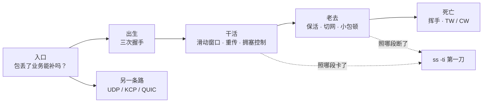

**读图**：

- 主线是一条连接的一生，四个阶段串成一条时间线，每节讲一段。
- 「入口」先问「包丢了业务能不能补」——不能补才走 TCP 主线，能补走 UDP 那条路。
- `ss -ti` 是 X 光机，不换器官，只照「这条连接现在卡在哪一段」。

---

## 二、选型：这条道用 TCP 还是 UDP

> 🎯 **一句话**：第一问永远是「包丢了业务能不能补」，不是「谁更快」。

| 维度 | TCP | UDP |
|------|-----|-----|
| 连接 | 有，建连时握手一次 | 无连接 |
| 数据模型 | 可靠有序**字节流** | 尽力送达**报文**，丢了不管 |
| 队头阻塞 | 一条连接丢一包，后面全等 | 无（应用自己排） |
| 典型 | 登录、支付、聊天、HTTP | 位置 20Hz、可丢特效帧 |

「一条连接」= 一个**四元组** `(源IP, 源端口, 目的IP, 目的端口)`。同一个 Client–Server 可以同时有很多条——客户端每次换不同源端口。

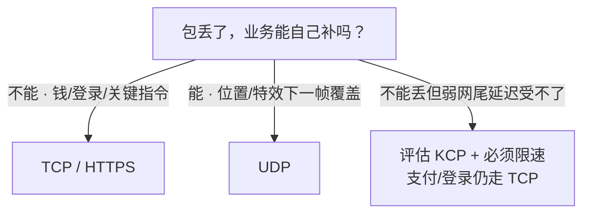

**读图**：选型第一刀永远是「丢了能不能补」，不是「谁更快」。KCP 只在「不能丢 + TCP 尾延迟不可接受」时评估，且必须限速。

- 包丢了，业务能不能自己补？
  - 不能（钱、登录态、关键指令）→ TCP / HTTPS
  - 能（位置、特效，下一帧覆盖）→ UDP
  - 不能丢，但弱网下 TCP 尾延迟不可接受 → 评估 KCP（必须限速）；支付/登录仍走 TCP

游戏常见拆法：登录/支付走 TCP（不能丢），高频位置走 UDP（可丢），弱网关键路径评估 KCP。**错误**是整条业务「为了流畅」全上 KCP。

### 字节流的代价：粘包与拆包 🎯⭐🔥

上表「字节流 vs 报文」不是个术语差异，它直接决定你的代码怎么写。

> 🎯 **一句话**：TCP 只保证「字节顺序对」，**不保证消息边界**——你 `write` 三次，对端可能一次 `read` 全收到（粘包），也可能一个消息分两次才收齐（拆包）。**边界必须应用自己划**。

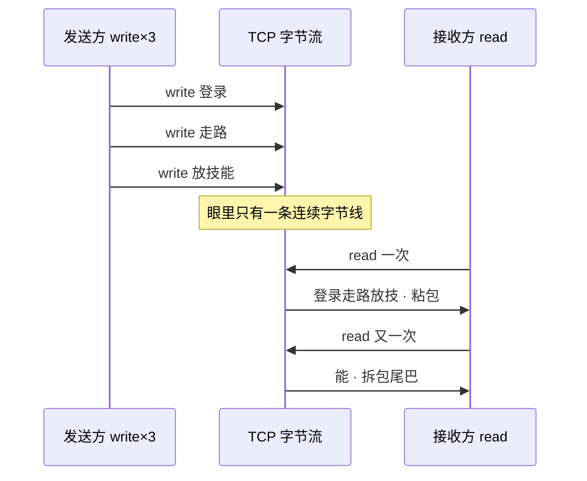

**读图**：三次 write 只是往同一条字节线上追加；read 按「内核缓冲里有多少就拷多少」，不会帮你切消息——边界必须应用自己定。

```text
你以为的：  write("登录")  write("走路")  write("放技能")
            read → "登录"   read → "走路"   read → "放技能"

实际可能：  read → "登录走路放技"      ← 粘包（三条粘一起，还切断了最后一条）
            read → "能"                ← 拆包（上一条的尾巴才到）
```

为什么会这样：TCP 眼里只有一条连续的字节线，`write` 只是往这条线上追加字节。Nagle 会把小段攒成一段发（五节），路径 MTU 会把大段切成多段发，接收缓冲又按到达顺序堆着——**「一次 write = 一次 read」从来不是 TCP 的承诺**。

**三种定界法**（选一种，全链路统一）：

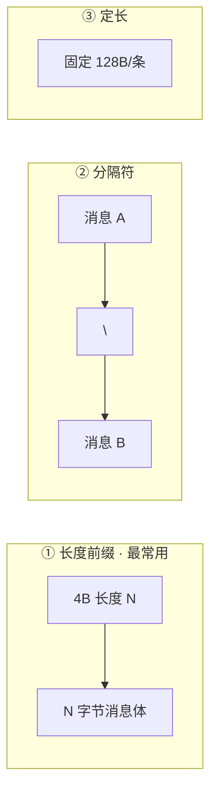

**读图**：三种定界都在应用层做——TCP 只认字节序号，不认「消息」。长度前缀最通用；分隔符简单但消息体不能含分隔符；定长最笨但解析最快。

```text
① 长度前缀（最常用）  [4字节长度][消息体]  ← 先读满 4 字节知道要读多长，再读满那么多
② 分隔符             消息\n消息\n         ← 简单，但消息体内不能出现分隔符
③ 定长               每条固定 128 字节     ← 最简单，浪费带宽，只适合固定结构
```

正确的读法永远是「**读到缓冲区 → 循环尝试切出完整消息 → 切不出就留着等下次**」，不是「read 一次当一条消息处理」。

> ⚠️ **别混**：粘包**不是 bug、不是网络故障**，是 TCP 字节流的正常语义；「我加了 `TCP_NODELAY` 就不粘包了」也是错的——NODELAY 只是不攒小包，路径照样会合并/切分。UDP 天然有报文边界（一次 `sendto` = 一个报文，收就是完整一个），所以 UDP **不存在粘包**，代价是丢了没人补（七节）。

> 📝 **面试**：问「怎么解决粘包」，别答「关掉 Nagle」，要答「**应用层定界**：长度前缀 / 分隔符 / 定长，配合『收到就循环切、切不完留着』的解析循环」。

---

## 三、出生：三次握手

> 🎯 **一句话**：三次握手只交换「随机起始序号」，为的是防「幽灵连接」。

### 先认一眼 TCP 头 ⭐

后面全章都在说 seq、ACK、窗口、SYN/FIN——它们都是 TCP 头里的字段，一次看清就不用再猜：

```text
[ 源端口 16 | 目的端口 16 ]          ← 四元组的「端口」那两元
[      序号 seq 32        ]          ← 这段数据的第一个字节在字节流里的编号（粘包的根源：编号连续、无边界）
[   确认号 ack 32         ]          ← 「我期待收到的下一个字节编号」= 之前的都收到了
[ 首部长 | 标志位 | 窗口 16 ]        ← 标志位：SYN 建连 · ACK 确认 · FIN 关闭 · RST 掐断 · PSH 尽快交给应用 · URG 紧急
[ 校验和 16 | 紧急指针 16 ]
[   选项（MSS · wscale · SACK · Timestamp，握手时协商）  ]
        ↑ 固定部分 20 字节；带选项后更长（对比 UDP 头只有 8 字节，七节）
```

三个字段先记住，后面全章都在用：

- **窗口字段就是 rwnd**（四节）
- **ack 是累积确认**（不是「只确认这一段」）
- **标志位可以叠**（SYN+ACK 就是两个位一起置 1）

### 握手的三个动作：标准表示 + 双方状态位 🎯⭐🔥

连接建立前 Server 只是 `LISTEN`，还没有这条连接。三步交换的是**序号 seq 与确认号 ack**，不是业务数据。下图每根箭头是标准报文写法，箭头旁的 Note 是**双方各自的 TCP 状态位**——白板上要能一笔不差地默画出来：

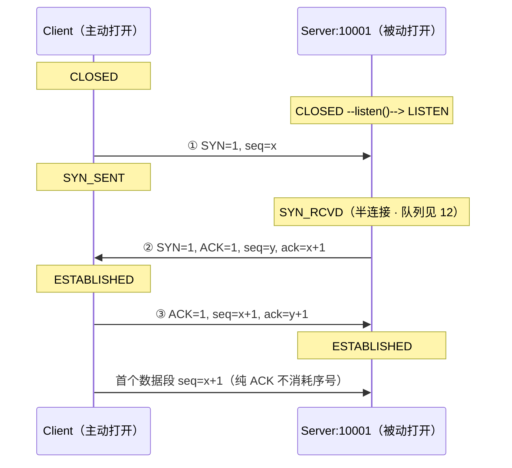

**读图**（这就是面试要的官方口径，逐段对着念）：

- **报文 1 · SYN**：Client 执行**主动打开（active open）**，发 `SYN=1, seq=x`。`x` 是客户端的 **ISN（Initial Sequence Number，初始序号）**，内核随机生成。发出后 Client 由 `CLOSED` → `SYN_SENT`。这一段**不带数据，但 SYN 标志位要消耗一个序号**（占用序号 `x`）。
- **报文 2 · SYN+ACK**：Server 之前调 `listen()` 完成**被动打开（passive open）**，状态是 `LISTEN`。收到 SYN 后回 `SYN=1, ACK=1, seq=y, ack=x+1`：`seq=y` 是服务端自己的 ISN；**`ack=x+1` 是关键**——ack 的语义是「我期望收到的下一个字节序号」，客户端那个 SYN 占掉了 `x`，所以期望值就是 `x+1`。Server 由 `LISTEN` → `SYN_RCVD`。
- **报文 3 · ACK**：Client 回 `ACK=1, seq=x+1, ack=y+1`。`seq=x+1` 是因为自己的 SYN 用掉了 `x`；`ack=y+1` 确认服务端的 ISN（同理服务端 SYN 占掉 `y`）。**Client 发出这个 ACK 就进 `ESTABLISHED`，Server 收到后才进 `ESTABLISHED`。**
- **纯 ACK（不带数据）不消耗序号**，所以第一个数据段仍从 `seq=x+1` 开始——白板上写 `seq=x+2` 是错的。

**为什么是「+1」而不是「+长度」？** ack 是**累积确认**：`ack = 已连续收到的最后一个字节序号 + 1`。

- SYN / FIN 这类**标志位各占 1 个序号**，所以握手挥手都是 `+1`。
- 带 payload 的数据段则是 `ack = seq + 数据长度`（收到 `seq=1001` 且长 500 字节，回 `ack=1501`）。

> ⚠️ **别混**：① **状态名有两套**——RFC 793 写作 `SYN-RECEIVED`（常记为 `SYN_RCVD`），而 Linux `ss` 打印的是 **`SYN-RECV`**；面试写教科书名、值班认工具名，别当成两个东西。② **两端进 `ESTABLISHED` 的时刻不同**：Client 发完第三个 ACK 就算建立，Server 要收到才算——这正是 [12](../12-网络栈与Socket/) 里「全连接队列满时客户端显示 ESTAB、服务端却没这条连接」的根源。

> 📝 **面试**：让你画三次握手，**必须写出 `seq=x` / `seq=y, ack=x+1` / `seq=x+1, ack=y+1` 加两边状态迁移**——Client `CLOSED → SYN_SENT → ESTABLISHED`，Server `CLOSED → LISTEN → SYN_RCVD → ESTABLISHED`——再补一句「SYN 消耗一个序号，所以 ack 是 +1」。只画三根箭头写「我的序号从 x 开始」拿不到分。

**序号为什么要随机**：防上一条连接的迟到旧包串进新连接——旧包落在新序号范围外的概率极小。

**ISN 为什么必须随机，不能固定从 0 开始？** 三个理由：

1. **防串包**：同一条四元组反复建连，若每次都从 0 编号，上一条连接的迟到旧包（FIN 之后才到的数据）会正好落在新连接的序号范围内，被当成新连接的数据收下。
2. **防序号预测**：固定序号可被猜到，攻击者能伪造带正确序号的 RST / 注入包，掐断或劫持连接。
3. **配合端口复用**：TIME_WAIT 期间旧四元组还没释放，随机 ISN 让「旧包」撞进「新连接窗口」的概率降到可忽略。

**握手顺便协商了什么？** 三次握手不只是换序号，还顺带交换**选项**：双方各带 `MSS`（每段 payload 上限，四节）、`wscale`（窗口缩放，四节）、`SACK`（选择性确认，四节）、`Timestamp`。这些只在建连时谈一次，中途改不了——所以「建连后想加 SACK」不成立。

### 为什么是三次，不是两次？⭐

> 💡 **打个比方**：你寄信（SYN），朋友回信「收到，我这边编号从 y 开始」（SYN+ACK）。你不回第三封，朋友永远不知道他的回信你有没有收到——更糟的是，你的第一封信可能是三天前寄丢、现在才到的旧信，朋友已经开好房间等你，你早就不在了。

这就是**幽灵连接（ghost SYN）**：两次握手时，Server 收到 SYN 就 ESTABLISHED、占 fd 和内存，为「不存在的客户端」白开连接。第三次 ACK 让客户端确认「这是我这一次的连接」，Server 才当真。

> 📝 **面试**：问「为什么三次握手」，别只答「双方都确认」，要答到「防历史 SYN / 幽灵连接」。

### 握手卡在半路：看状态堆在哪 🔧

> 🔍 **现场**：连不上时先看 SYN 堆在谁家。

```bash
ss -ant | grep -E 'SYN-SENT|SYN-RECV'
# 堆 SYN-SENT → 客户端发完 SYN 没等来 SYN+ACK：对端没监听 / 中间丢包
# 堆 SYN-RECV → 服务端回了 SYN+ACK 没等来最后 ACK：对端没回 或 全连接队列满（→12）
```

一句话定责：**SYN-SENT 往对端查，SYN-RECV 往队列查，方向反了白忙**。

### SYN Cookie（一句）

半连接被 SYN Flood 打满时，内核可不占队列槽，把连接状态编码进 **ISN** 回给客户端；第三次 ACK 的序号能反推出是哪条「半连接」，验证通过才真正建连。

- **代价**：握手协商的选项（wscale/SACK/MSS）存不了，建连后能力退回默认。
- 正常业务不该长期靠 Cookie 顶着——那是被打了，队列调优见 [12](../12-网络栈与Socket/)。

> ⚠️ **别混**：握手成功 ≠ 后面没事。握手只保证「连接状态建立」，后续段照样会丢（四节）、NAT 照样会清表（五节）、应用照样可能不读（ZeroWindow）。

---

## 四、干活：滑动窗口与重传

> 🎯 **一句话**：TCP 传数据不靠「发一个等一个」，靠「窗口内连续发、确认了就前滑」——能发多少由 `min(rwnd, cwnd)` 决定。值班 80%「已 ESTAB 还卡」落在这里。

### 为什么要有窗口？⭐

> 💡 **打个比方**：跨海寄快递，RTT=200ms。如果「发一件等签收再发下一件」，一天只能发几十件。滑动窗口是「允许同时在路上 100 件」，签收一件就再补发一件，吞吐才上得去。

发送方不能把数据无限往路上灌。任意时刻，只允许**这么多字节**处在「已发出、还没确认」的状态。这个范围叫**滑动窗口（sliding window）**。

两个东西会压缩它，它们各自对应 TCP 的一套官方机制：

| 对比 | **rwnd**（接收窗口） | **cwnd**（拥塞窗口） |
|------|----------------------|----------------------|
| **官方机制名** | **流量控制（flow control）** | **拥塞控制（congestion control）** |
| 保护谁 | 保护**对端主机**别被灌爆 | 保护**中间网络**别被灌爆 |
| 谁决定 | **对端**还能往接收缓冲塞多少 | **网络**还扛不扛得住（丢包反馈） |
| 怎么知道 | 对端在 ACK 的窗口字段里**明确告诉你** | 没人告诉你，**靠丢包/RTT 自己猜** |
| 变小原因 | 对端应用不 `read`，缓冲满 | 丢包、拥塞 |
| 症状 | 本端 Send-Q 涨；抓包 ZeroWindow | `cwnd` 很小；`retrans` 可能涨 |
| 怎么治 | 让**对端**读数据 | 查丢包路径；别乱调算法 |

> ⚠️ **别混**：**流量控制 ≠ 拥塞控制**，这是最高频的混答点。流量控制是**端到端**的、对端**显式通告**（窗口字段），只管「别把接收方灌爆」；拥塞控制是**端到网络**的、**没有任何人通告**，发送方只能从丢包和 RTT 反推「路上挤不挤」。两者同时生效，取 `min(rwnd, cwnd)`——所以「加大缓冲就能提吞吐」只在流量控制受限时成立，拥塞受限时一点用没有。

> 📝 **面试**：问「流量控制和拥塞控制的区别」，答三点：① **保护对象**不同（对端主机 vs 中间网络）；② **信息来源**不同（对端显式通告 rwnd vs 自己从丢包/RTT 推 cwnd）；③ **同时生效**，实际发送量 = `min(rwnd, cwnd)`。再补现场判据：`rcv_space` 掉 0 是流控受限，`retrans` 涨 + `cwnd` 趴是拥塞受限。


**rwnd 怎么告诉对方的？** 接收方把「接收缓冲剩余空间」写在 ACK 的「窗口字段」里发回去，发送方据此设右沿。缓冲快满通告变小，变成 0 就是 **ZeroWindow**——对方立刻停发。所以 ZeroWindow 根因在**对端不读**，加大本端 `sndbuf` 治不了。

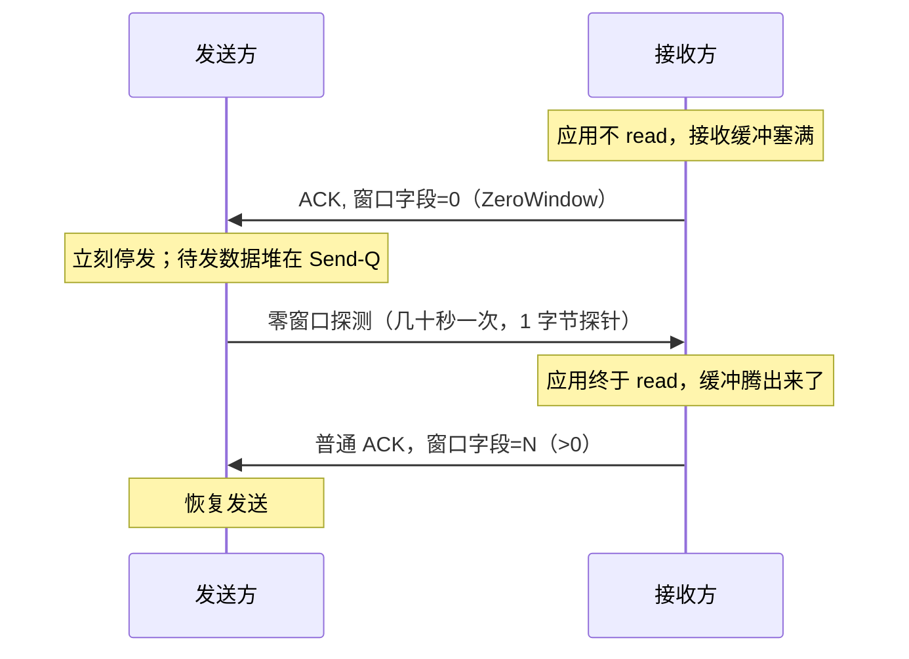

**读图**：窗口归 0 期间发送方不是干等死——靠**零窗口探测（persist timer）**定期捅一下问「能收了吗」；恢复也不需要什么特殊机制，就是对方一个普通 ACK 把窗口字段改大。整条链上没有本端能调的东西，**根因永远在对端读得慢**。

**`wscale` 是什么？** TCP 头的窗口字段只有 16 位，最多通告 64KB，跨海高带宽根本不够。

- wscale 在**握手时**协商一个移位因子（7 = 左移 7 位 ×128），让窗口上限提到约 1GB。
- `ss -ti` 里 `wscale:7,7` 就是双方各用 7。
- 没协商成功窗口会被钉死在 64KB，跨海吞吐上不去。

### 窗口怎么「滑」（3 帧）🔥

把发送方缓冲想成一条字节线：

```text
已确认 |---- 已发未确认（飞行中）----|---- 还能发 ----| 暂时不能发
       ^UNA                          ^NXT            ^右沿 = UNA + min(rwnd,cwnd)
```

- **UNA**：已确认左沿（左边都签收了）＝ SND.UNA
- **NXT**：下一包从这儿寄 ＝ SND.NXT
- **飞行中**：发出去了还在等 ACK，占着窗口额度

窗口「滑」要看连续几帧。用标准序号写一遍（设 MSS=1000、`min(rwnd,cwnd)=4000` 字节，从 `seq=1001` 起发）：

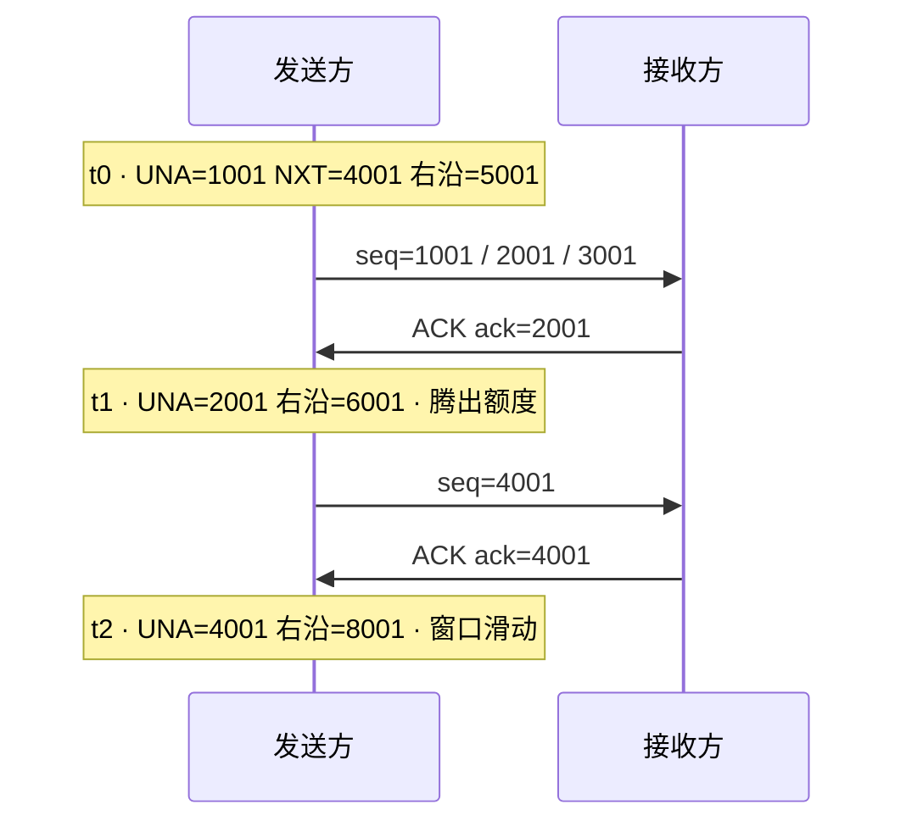

**读图**：每来一个 ACK，`SND.UNA` 左沿右移，右沿 = UNA + min(rwnd,cwnd) 跟着动——ACK 是「滑动」的推手；ACK 不回来或 rwnd=0，右沿就钉住。

```text
帧 t0  发出 seq=1001 / 2001 / 3001 三段
       SND.UNA=1001   SND.NXT=4001   右沿=1001+4000=5001   还能发 1 段（4001~5000）

帧 t1  收到 ACK ack=2001（对端说「我要 2001 了」→ 1001~2000 已确认）
       SND.UNA=2001   右沿=2001+4000=6001                  腾出额度，接着发 5001

帧 t2  收到 ACK ack=4001
       SND.UNA=4001   右沿=8001                            UNA 与右沿一起右移 —— 这就叫「滑动」
```

**读图**：

- `ack` 是「我期望的下一个字节」，所以 `ack=2001` 表示 `1001~2000` 收齐了，`SND.UNA` 就推到 2001。
- **左沿由对端的 ACK 推，右沿 = 左沿 + min(rwnd,cwnd)**——左沿推一格右沿跟一格，额度就腾出来了。
- ACK 不回来（丢包）或 rwnd 缩到 0，右沿就钉在原地。

> 🎯 **关键直觉**：窗口不是「发完一批等下一批」的批处理，是「ACK 回来一段就腾一段、就再发一段」的流水线。ACK 不回来（丢包）或 rwnd 缩到 0，右沿就停住——这就是卡顿的微观机制。

### 丢包了：RTO 还是快重传 ⭐🔥

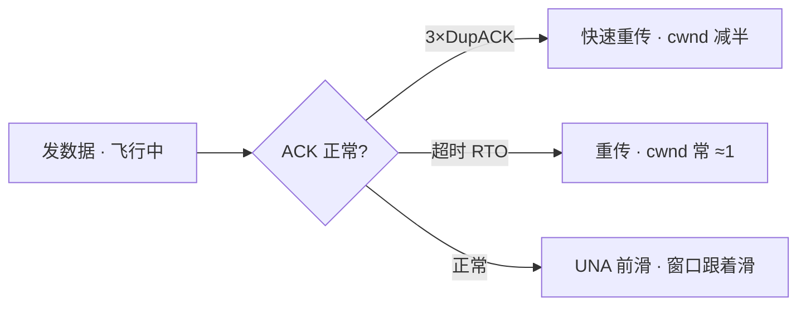

| 对比 | **RTO 超时重传** | **3× DupACK 快速重传** |
|------|------------------|------------------------|
| 触发 | 等太久没 ACK | 连续收到 3 个重复 ACK |
| 对 cwnd | 通常 **≈ 1** | **减半**，不全打回 1 |
| 体感 | P99 尖刺大 | 相对温和 |

**DupACK 为什么会出现？** 接收方收到「后面的段」但中间缺一段，就反复 ACK「我还在等那个序号」。凑满 3 个，发送方断定那一段丢了，立刻重传，不必空等 RTO。

```text
发送方发出   seq=1001  seq=2001  seq=3001  seq=4001  seq=5001   （每段 1000 字节）
网络         ✅到       ❌丢      ✅到      ✅到      ✅到
接收方回     ack=2001   —        ack=2001  ack=2001  ack=2001   ← 后三个是 DupACK
发送方       连收 3 个 ack=2001 → 断定 seq=2001 那段丢了 → 立即重传，cwnd 减半
```

**读图**：

- 因为 `ack` 是**累积确认**，缺了 `2001` 这段，后面的 `3001/4001/5001` 到了也只能一遍遍回 `ack=2001`（「我还在等 2001」）——这些重复的 ACK 就叫 **DupACK（duplicate ACK，重复确认）**。
- 为什么是「3 个」：1~2 个重复 ACK 也可能只是乱序（包晚到，没真丢），凑够 3 个丢包的置信度才够。
- 这也是无线网易把延迟当丢包、误伤 cwnd 的原因。

**SACK**：接收方告诉发送方「哪些段我已经收到了」，重传时只补真丢的段，少重传冤枉段——配合快重传用，效果更好。

**RTO 怎么定的？** 不是拍脑袋。内核维护 RTT 的平滑均值（SRTT）和抖动（RTTVAR），`RTO = SRTT + 4×RTTVAR`，超时后还会指数退避翻倍。`ss -ti` 里 `rto:420` 就是当前这条连接的重传超时（毫秒）。

**延迟 ACK（Delayed ACK）**：接收方不立刻回 ACK，攒 40ms 看有没有数据一起捎带，省 ACK 包。单独没事，和 Nagle（五节）叠起来就是「小包顿 ~200ms」的元凶之一。

### 慢启动与拥塞避免 🔥

> 💡 **打个比方**：新开的高速入口不知道今天堵不堵，不敢一上来就把车全放进去——先放一辆，没出事就放两辆、四辆（慢启动翻倍），到某个门槛改成每轮多放一辆（拥塞避免）；出了事故就退回一辆重新探（RTO）。

拥塞控制的官方名字是**四个阶段**，白板上要能按名字点出来：

- **① 慢启动（slow start）**：每 RTT 近似翻倍，直到 `ssthresh`——从小心变大胆。
- **② 拥塞避免（congestion avoidance）**：过了 `ssthresh` 改成每 RTT 大约 +1——别再猛翻倍。
- **③ 快速重传（fast retransmit）**：收到 3 个 DupACK 就立刻补那一段，不等 RTO。
- **④ 快速恢复（fast recovery）**：紧跟快重传，`cwnd` **减半**后直接回拥塞避免，不打回 1。
- **RTO 超时**是四阶段之外的兜底：`cwnd ≈ 1`、重回慢启动——尾延迟大，体感卡一下。

**为什么「每 RTT 翻倍」？** 规则是「每收到一个 ACK，cwnd +1 MSS」。一个 RTT 内能发 cwnd 个段 → 收到 cwnd 个 ACK → cwnd 增加量 ≈ cwnd 个 MSS，正好翻一倍。这也是它「指数增长、容易冲垮网络」的原因，所以有 ssthresh 拦一下。

| 阶段 | cwnd 变化 | 触发条件 |
|---|---|---|
| 慢启动 | 每 RTT 翻倍（指数增长） | 连接起始 |
| 拥塞避免 | 每 RTT +1（线性增长） | cwnd 超过 ssthresh |
| 快恢复 | 减半 | 3×DupACK |
| 超时回退 | 打回 1，重新慢启动 | RTO 超时 |

**读图**：

- 慢启动段最陡（指数翻倍），过 ssthresh 转拥塞避免（线变平缓）。
- 丢包一次线就掉一截：**超时掉到接近 0、快重传掉一半**。
- 一条短连接常「还没爬起来就结束了」——这就是短连接跨海慢的根源。

**`ssthresh:2147483647` 那个大数？** 它是慢启动阈值，cwnd 超过它就从慢启动切到拥塞避免。初值 `INT_MAX` = 一开始没上限，全程慢启动；真正的 ssthresh 是**丢包后**才算出来的（≈ 丢包时 cwnd 的一半）。

跨海 + 短连接：每条连接都要从慢启动爬 → 登录/API 慢。对策是**连接池 / Keep-Alive**，不是先换 BBR。

**Cubic 和 BBR 到底差在哪？**（知道差异才敢说「别换」）

- **Cubic（Linux 默认，丢包驱动）**：把「丢包」当拥塞信号，丢了就退让。逻辑简单可靠，但在**有随机丢包但不拥塞**的链路（无线、跨境）上会被误伤——没堵也退让；而在深队列设备上又会一路把队列填满才发现丢包（bufferbloat，延迟被推高）。
- **BBR（带宽·时延积驱动）**：不等丢包，主动**测量瓶颈带宽和最小 RTT**，按 `带宽 × 最小RTT` 定发送量，尽量不把队列填满。所以随机丢包的弱网上吞吐更好、排队延迟更低。
- **代价**：BBR 在与 Cubic 共享链路时可能更「抢」，多流公平性和具体版本（BBRv1/v2/v3）行为差异大，换之前要有压测数据。

> ⚠️ **别混**：没有丢包证据（`retrans` 不涨、无 pcap）就换 BBR，是面试减分项——**你不知道要治的是「误判丢包」还是「距离」，换算法治不了距离**。默认 Cubic 一般够用。RTO 之后是 **cwnd ≈ 1**，不是去别的章「调内核参数当根因」。

### 现场：已 ESTAB 还卡，怎么认 🔧

> 🔍 **现场**：看到 `Send-Q` 大就以为「网络慢」，要么乱加 sndbuf、要么换拥塞算法——常见误判。`Send-Q` 大只说明「本端发送缓冲里有字节没走完」，**为什么走不完**要再看两个字段：

```bash
ss -ti dst 203.0.113.88
# 重点看三样：rcv_space（对端还收不收）、retrans（路上丢没丢）、rtt（距离还是抖动）
```

三种「Send-Q 大但走不动」，对策互斥：

- **A · ZeroWindow**（`rcv_space:0` + `retrans` 几乎不涨）→ 治**对端** read
- **B · 丢包/拥塞**（`retrans` 涨 + `cwnd` 趴到个位数）→ 查**路径**
- **C · 灌得快但路径还行**（`rtt` 稳 + `retrans:0` + `cwnd` 正常）→ 应用灌得快，别先改算法

完整三组 `ss -ti` 输出见 **第八节**。

一句话：A 和 B 都会 Send-Q 大，但 A 治对端、B 治路径，加大 sndbuf 对两者都没用。

### 队头阻塞与 MSS（顺带）

**队头阻塞（HOL）**：一条 TCP 丢一包，后续段都要等重传——即使应用层有多个「逻辑流」。

```text
同一条 TCP：[移动帧][移动帧][技能指令][移动帧]
                 ↑ 丢了 → 后面的技能指令也得等这段重传回来 → 手感「整条线冻住」
```

> ⚠️ **别混**：HTTP/2「多路复用」解决的是**应用层**队头，**传输层**仍可能堵。游戏拆通道（TCP 管登录支付 / UDP 管位置 / KCP 管弱网关键指令）就是别让关键路径被堵死——这是产品设计，调 cwnd 消不掉。

**MSS**：TCP 每段 payload 上限，以太网常见 **~1460**（MTU 1500 − IP 头 − TCP 头）。

- 握手时双方各带 MSS 选项、**取较小那个**。
- MSS 只照顾两端、照顾不了中间链路——中间某跳 MTU 更小又遇到 ICMP「需要分片」被墙，就是 PMTUD 黑洞（大包死、小包通）→ [16](../16-网络排障与抓包/)。

### 收束：TCP 凭什么「可靠」🎯⭐

到这里，「可靠」两个字的全部零件都齐了。面试直接问「**TCP 如何保证可靠传输**」，要的就是这张清单——**七件套，一件不落**：

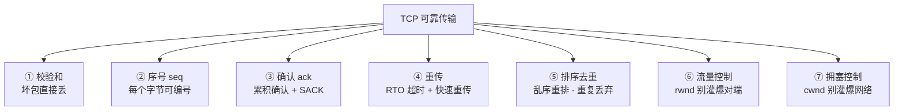

**读图**：

- ① 保证「收到的是对的」，②③ 保证「知道少了哪一段」，④ 保证「少的能补回来」，⑤ 保证「补回来还能按序交给应用」，⑥⑦ 保证「不会因为灌太快把可靠性自己搞崩」。
- 前五件是**出错能修**，后两件是**少出错**——少了后两件 TCP 也能跑，但会在弱网上把自己重传到雪崩（这正是七节 KCP 不限速的死法）。

> ⚠️ **别混**：**可靠 ≠ 不丢包**。网络照样丢，TCP 只保证「丢了会补齐、补齐后**按序**交给应用」。也**不保证实时**——补齐要花时间，这就是队头阻塞和 P99 尖刺的来源。还有一条边界：TCP 只保证**字节序列**可靠，**不保证消息边界**（二节的粘包）。

> 📝 **面试**：这七件套背的时候按「**发现问题 → 解决问题 → 预防问题**」分组更不容易漏：校验和 / 序号 / 确认负责**发现**，重传 / 排序去重负责**解决**，流量控制 / 拥塞控制负责**预防**。最后一定补一句「可靠不等于不丢包，也不等于低延迟」——这句是区分「背过」和「懂了」的分水岭。

---

## 五、老去：为什么「还连着」也断

> 🎯 **一句话**：`ss` 显示 ESTAB 不代表链路真通——中间设备可能早把路拆了。三种断法对策完全不同，别一套「加大 keepalive」糊弄。

这种「一端认为还连着、另一端或中间设备其实已经没了」的状态，官方叫 **半打开连接（half-open connection）**。它是本节所有故障的共同底色：TCP 状态机是**各自维护**的，一端的 `ESTABLISHED` 只代表「我这边的状态还没被推翻」，不代表对端还在。

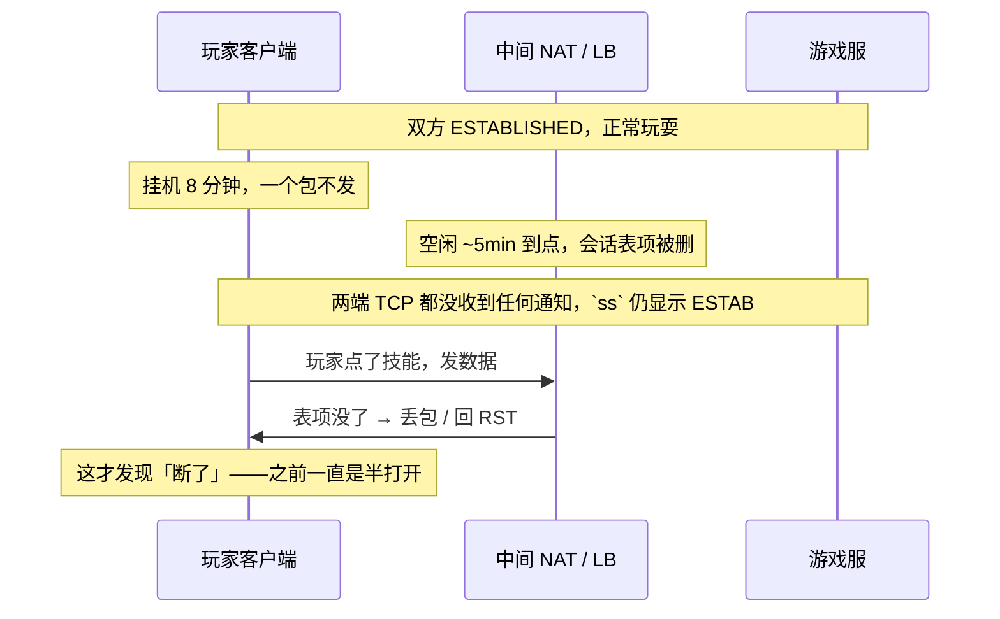

**读图**：NAT 删表时**谁都不通知**——TCP 没有带外信令，两端的 ESTABLISHED 只是各自的记忆。所以「`ss` 显示 ESTAB」只证明本端状态机没被推翻，证明不了链路活着；证活只能靠应用心跳发包去撞（下节）。

> ⚠️ **别混**：**半关闭（half-close）≠ 半打开（half-open）**。半关闭是**协议规定的正常状态**——一方发了 FIN 不再发数据、还能继续收（六节 `FIN_WAIT_2` / `CLOSE_WAIT`）；半打开是**故障状态**——对端进程崩了、机器断电、或中间 NAT 清了表，没人发过 FIN/RST，所以本端毫不知情，`ss` 上永远 ESTAB。半关闭双方状态一致，半打开双方状态已经**不一致**了。

### 心跳 vs NAT vs keepalive ⭐

> 🔍 **现场**：玩家挂机 8 分钟被踢。`ss -ti` 还「健康」，业务已死。

| 层级 | 间隔 | 作用 | 问题 |
|---|---|---|---|
| 应用心跳 | 30s | 保活 | 正常用途 |
| NAT / LB / conntrack 空闲 | ~5min | 中间会先把你掐掉 | 决定心跳上限 |
| 内核 keepalive | 7200s | 只清死连接 | 当游戏心跳太晚 |

- **应用心跳**：15–45s，游戏自己发的小包，✅ 保活。
- **NAT / LB / conntrack 空闲**：~5min，中间设备会清掉这条会话，**决定心跳上限**。
- **`tcp_keepalive_time`**：7200s，空闲多久发第一根探针；配套 `tcp_keepalive_intvl`（75s，之后每隔多久再探）、`tcp_keepalive_probes`（9 次，几次不回判死）。只清死连接，**不能当游戏心跳**。

> ⚠️ **别混**：`ss` 仍是 ESTAB ≠ 链路真通。心跳间隔必须 **< 最小中间设备空闲超时**（NAT/LB ~5min）。

### 心跳成功 ≠ 业务健康（探活分层）

应用心跳通常只证明「socket 没断」，不一定经过业务线程。常见坑：网关 IO 线程把心跳收下就回 ack，业务线程早卡死在某个 RPC——心跳一直绿，技能全发不出去。探活分三层：

- **传输层**：socket 通不通 → 应用心跳。
- **进程层**：业务线程活着吗 → 心跳响应走业务线程，或单独业务探活。
- **依赖层**：下游 DB/RPC 通吗 → 健康检查含下游依赖，别只探自己。

> 🎯 心跳走哪条路径，就只保哪层。走 IO 线程的心跳只保传输层；要保业务，心跳响应必须经过业务线程。

### Nagle：小包卡 ~200ms 🔧

> 🎯 **一句话**：Nagle 把小段攒一攒再发，对端延迟 ACK 也等，两边互相等 → 小操作顿一下。游戏长连接开 `TCP_NODELAY=1`。

```text
小操作包：应用 write(20B) → Nagle 说「再等等看有没有更多」
          对端延迟 ACK 也在等 → 两边互相等 → 体感顿一下（可达 ~200ms）
```

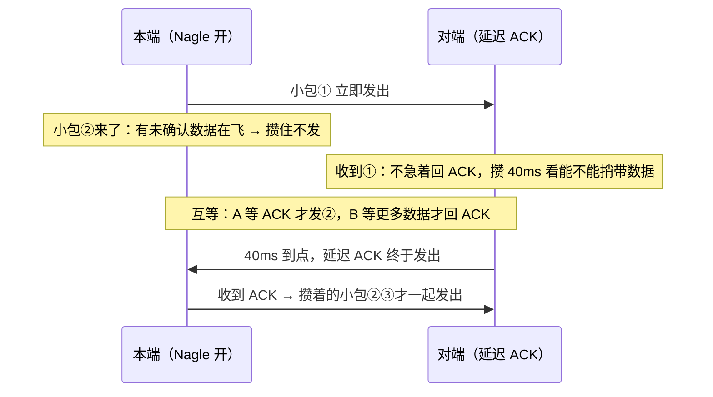

**读图**：死锁点在中间那行——Nagle 的规则是「**有未确认的小包在飞就攒着**」，延迟 ACK 的规则是「**攒一会儿再回**」，两个「等」撞在一起，一个往返白等几十到 ~200ms。`TCP_NODELAY=1` 拆掉左边那个等，环就破了。

> ⚠️ **别混**：Nagle ≠ 切网。Nagle 是小包调度，切网是四元组变了。

### 切网：四元组死

手机 Wi-Fi → 4G/5G：源 IP 变 → **四元组变** → 旧 TCP 无法续。

```text
旧连接（Wi-Fi）： (1.2.3.4:54321  →  Conn:10001)
新网络（蜂窝）： (5.6.7.8:xxxxx  →  Conn:10001)
                ↑ 不是同一条连接；旧序号/窗口状态全部作废
```

产品必须：**重连 + 会话 token**。不要承诺「TCP 会自动续」。QUIC 有连接迁移能力（七节），游戏自研多数仍是 TCP/KCP + token 重连。

### 三种「断线」怎么分

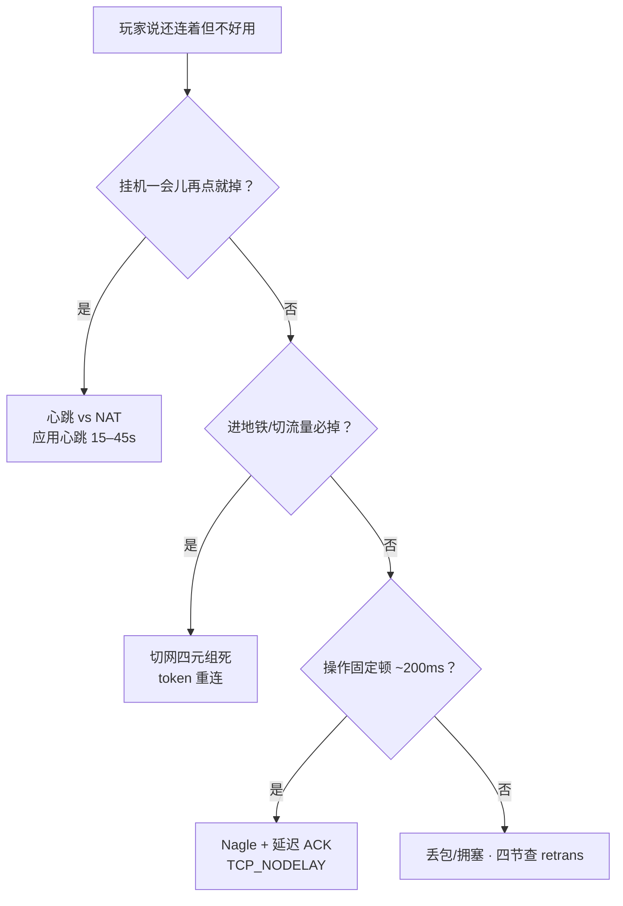

**读图**：三种断法对策完全不同——别用一套「加大 keepalive」糊弄；先问现象，再对号入座。

| 玩家说法 | 更像 | 对策 |
|----------|------|------|
| 挂机一会儿再点就掉 | 心跳 vs NAT | 应用心跳 15–45s |
| 进地铁/切流量必掉 | 切网四元组死 | token 重连 |
| 操作总「顿一顿」约固定间隔 | Nagle 小包 | `TCP_NODELAY` |
| 技能偶发卡一下很久 | 丢包超时（四节） | 查路径，别调握手 |

> ⚠️ **别混**：三种断法对策完全不同。一套「加大 keepalive」糊弄过去，面试和值班都会露馅。

---

## 六、死亡：挥手与 TIME_WAIT / CLOSE_WAIT

> 🎯 **一句话**：正常关闭走四次挥手，可半关闭；异常直接 RST。谁先 close 谁进 TIME_WAIT，谁忘了 close 谁进 CLOSE_WAIT。

### 四次挥手：标准表示 + 双方状态位 🎯⭐

和握手同一套记法：`seq` 是自己这段的起始序号，`ack` 是「我期望收到的下一个字节」，**FIN 也占一个序号**，所以确认还是 `+1`。

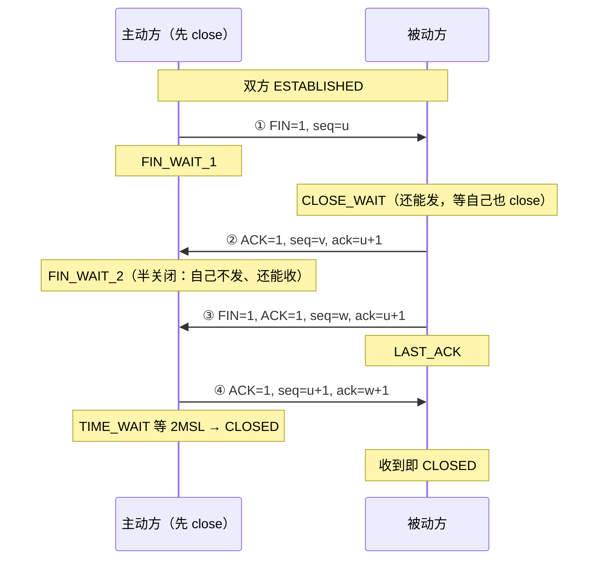

**读图**（这就是白板要写全的四段，官方口径）：

- **报文 1**：A 调 `close()`（或 `shutdown(SHUT_WR)`），发 `FIN=1, seq=u`——`u` 是 A 已发数据的最后一个字节序号 +1。A 由 `ESTABLISHED` → `FIN_WAIT_1`。
- **报文 2**：B 回 `ACK=1, seq=v, ack=u+1`（FIN 占掉序号 `u`，故 `+1`）。B 由 `ESTABLISHED` → `CLOSE_WAIT`；A 收到后 → `FIN_WAIT_2`。**此刻起连接是半关闭的**：A 不再发，B 还能发。
- **报文 3**：B 把剩余数据发完、应用也调了 `close()`，才发 `FIN=1, ACK=1, seq=w, ack=u+1`。`w` 可能大于 `v`——中间 B 发过数据序号就往前走了；`ack` 仍是 `u+1`，因为 A 之后确实没再发东西。B → `LAST_ACK`。
- **报文 4**：A 回 `ACK=1, seq=u+1, ack=w+1`，进 `TIME_WAIT` 空等 2MSL 再 `CLOSED`；**B 收到这个 ACK 就直接 `CLOSED`，不进 TIME_WAIT**。
- **为什么是四次而不是三次**：报文 2 与报文 3 之间夹着「B 把剩余数据发完 + 应用调 close」这段不确定时长，不能合成一个包。B 恰好无待发数据时内核会把 ACK 与 FIN 合并，抓包就看成「三次挥手」——这是优化，不是标准流程。

> 📝 **面试**：画挥手要写出 `FIN, seq=u` → `ACK, ack=u+1` → `FIN, seq=w, ack=u+1` → `ACK, ack=w+1`，以及两条状态链：主动方 `ESTABLISHED → FIN_WAIT_1 → FIN_WAIT_2 → TIME_WAIT → CLOSED`，被动方 `ESTABLISHED → CLOSE_WAIT → LAST_ACK → CLOSED`。再补一句「FIN 占一个序号，所以 ack 是 +1；只有主动方等 2MSL」。

**半关闭（half-close）**：FIN 只表示「我发完了」，对方仍可继续发数据。B 在 CLOSE_WAIT 期间还能给 A 发剩余数据，直到 B 也 close。

**用哪个 syscall 做半关闭？** `close()` 做不到——它是「这个 fd 我不要了」，读写两头一起收：

```text
shutdown(fd, SHUT_WR)   只关写方向 → 发 FIN，但还能继续 read 对端剩余数据   ← 真正的半关闭
shutdown(fd, SHUT_RD)   只关读方向
shutdown(fd, SHUT_RDWR) 双向都关，但 fd 还在（还要 close 回收）
close(fd)               fd 引用计数 −1；减到 0 才真正关连接、发 FIN
```

> ⚠️ **别混**：`close()` 之后你**再也读不到**对端后续数据；想「我发完了但还要收完对端的回包」（典型：客户端发完请求就 `shutdown(SHUT_WR)` 告诉服务端「请求到此为止」，然后安心读响应），必须用 `shutdown(SHUT_WR)`。另外 `fork` 后父子共享同一个 socket，**只有最后那个 `close` 才发 FIN**——这是「代码里明明 close 了却还在 CLOSE_WAIT / ESTAB」的常见原因。

| 对比 | FIN 优雅关 | RST 粗暴掐 |
|------|-----------|------------|
| 对端能否收完 | 尽量保证 | **不保证** |
| 常见原因 | 应用 close | 进程崩溃、端口未听、防火墙拒、停服直接杀 |

停服若直接 `kill -9`：客户端一片 RST。正确：停新连接 → 等 in-flight → 再关 socket（[05](../05-进程与信号/)）。

### 一条连接的一生（状态机）

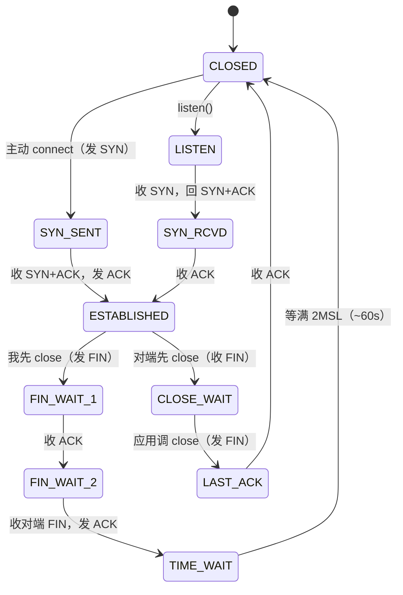

**读图**：只有两条路，看你**是不是先 close 的那一方**——

- **主动方（左线）**：`ESTABLISHED → FIN_WAIT_1 → FIN_WAIT_2 → TIME_WAIT → CLOSED`，终点要**空等 2MSL**。
- **被动方（右线）**：`ESTABLISHED → CLOSE_WAIT → LAST_ACK → CLOSED`，**不进 TIME_WAIT**。
- 堵点也只有两处：**CLOSE_WAIT** 卡住 = 右线在等应用 `close()`（代码问题）；**TIME_WAIT** 多 = 左线终点在纯等待（多数正常）。这就是「谁先关谁 TW，谁忘 close 谁 CW」的图上依据。

### TIME_WAIT vs CLOSE_WAIT ⭐

在 `ss` 上怎么认、谁进哪个的客户端/服务端例子见 [12](../12-网络栈与Socket/) 的「回家与谢幕」一节；这里讲机制和处理原则。

| 对比 | TIME_WAIT | CLOSE_WAIT |
|------|-----------|------------|
| 谁 | **主动**关闭方 | **被动**关闭方 |
| 等什么 | 2MSL | 应用 `close()` |
| 多了 | 连接池 / Keep-Alive | **修代码** |

**MSL 是什么？** **MSL = Maximum Segment Lifetime**，一个 TCP 段在网络里能存活的最长时间（协议建议 2 分钟，Linux 实现按 30s 算）。超过 MSL 的包被认为已经在网络中消亡（TTL 归零被丢）。

**为什么等 2MSL 而不是 1MSL？** 一去一回各占一个 MSL：

- ① 万一最后那个 ACK 丢了，对端会重传 FIN，要留一个 MSL 等它重新到达，主动方还得能回 ACK——所以不能立刻消失。
- ② 让本连接的旧序号包从网络彻底消失，避免串到下一条复用同四元组的新连接（和 ISN 随机是同一个防串包主题，三节）。

> 📝 **口径**：Linux 的 TIME_WAIT 时长由 `TCP_TIMEWAIT_LEN` 决定（=60s），是**编译期常量**，sysctl 改不了。能调的 `tcp_fin_timeout` 管的是 `FIN_WAIT_2`，不是 TIME_WAIT——面试别说串。

> ⚠️ **CLOSE_WAIT 持续涨 = 程序泄漏（没 close）**，调 `tcp_fin_timeout` 盖不住，要修代码。TIME_WAIT 不是故障，短连接客户端 TW 很多常正常。

### 被 TIME_WAIT 挡住：四个端口复用选项 ⭐🔧

TIME_WAIT 的直接副作用：**服务进程重启时 `bind` 报 `Address already in use`**——旧连接还在 TIME_WAIT 占着那个 `IP:端口`。四个名字长得像、管的完全不是一回事，这是高频混淆点：

- **`SO_REUSEADDR`（socket 选项，最常用）**：允许 `bind` 到「还有 TIME_WAIT 连接残留」的本地地址。**这是服务重启秒起的标准解药**，几乎所有服务端框架默认开。它不允许两个进程同时 LISTEN 同一个「具体 IP:端口」。
- **`SO_REUSEPORT`（socket 选项，Linux 3.9+）**：允许**多个进程/线程同时 LISTEN 同一个端口**，内核按连接哈希把新连接分发给它们各自的 accept 队列——多进程网关免掉「单个 accept 线程」瓶颈，也让滚动重启期间新旧进程能并存收连接。
- **`tcp_tw_reuse`（sysctl，客户端侧）**：允许把处于 TIME_WAIT 的**出站**四元组提前复用来发起新连接。**依赖 timestamps 开启**——内核靠 TCP 时间戳选项做 **PAWS（Protect Against Wrapped Sequence numbers，防序号回绕）**：时间戳比当前连接记录的更旧的段一律丢弃，这样才敢提前复用旧四元组，治的是「短连接客户端临时端口耗尽」（→[12](../12-网络栈与Socket/)）。
- **`tcp_tw_recycle`（别用，已删）**：激进回收 TIME_WAIT，但按「对端 IP 的时间戳必须单调递增」判断——**NAT 后面多个客户端共用一个源 IP，时间戳互相穿插，连接会被莫名丢弃**，表现为「部分用户随机连不上」。Linux **4.12 已移除**这个参数。

> ⚠️ **别混**：`SO_REUSEADDR` 是**进程自己设的 socket 选项**（管重启绑得上），`tcp_tw_reuse` 是**内核 sysctl**（管出站复用），两个都不是「关掉 TIME_WAIT」。真正的 TW 治法永远是**连接池 / 长连接**，让你少建那么多连接。

> 📝 **面试**：问「TIME_WAIT 太多怎么办」，答「① 先分清是**客户端侧**（临时端口压力，用连接池/长连接，必要时 `tcp_tw_reuse`）还是**服务端侧**（说明是服务端在主动关，看是不是 Keep-Alive 没开）；② `SO_REUSEADDR` 解决的是重启绑不上，不是 TW 多；③ 绝不提 `tcp_tw_recycle`，NAT 下会踩坑且已被内核移除」。

---

## 七、另一条路：UDP / KCP / QUIC

> 🎯 **一句话**：UDP 把可靠性全部甩给应用层；KCP 在 UDP 上做用户态可靠但必须限速；QUIC 用 Connection ID 解决切网。进门仍回二节：「能不能丢」。

### UDP

UDP 是无连接的报文模型：不保证到达、顺序、不重复，没有握手/窗口/重传/拥塞控制——也就没有传输层队头阻塞。代价：可靠性（序号、去重、重传）全部自己补。

**头有多简单，一看就懂**：

```text
[ 源端口 16 | 目的端口 16 ]
[  长度 16  |  校验和 16  ]     ← 一共就 8 字节（TCP 固定 20 字节，三节）
```

没有序号 → 无法排序、无法去重；没有窗口 → 没有流控；没有标志位 → 没有连接状态。**「UDP 简单」是字面意思**——它把这些全留给了你。

- **报文边界**：`sendto` 一次 = 一个报文，对端 `recvfrom` 收到的就是完整一个，**天然不粘包**（对比二节 TCP 的粘包/拆包）。代价对称：TCP 帮你保证不丢但要自己定界；UDP 帮你保住边界但丢了没人补。报文超过缓冲区被截断，多出来的部分直接丢弃，不像 TCP 会留着下次读。
- **无流控是最大的自由也是最大的责任**：TCP 有 rwnd/cwnd 帮你限速、丢包会退让；UDP 你不限速，就会在中间设备引发丢包，而应用往往感知不到「自己灌太快」。
- **与 MTU**：单个报文超路径 MTU，IP 层分片，任一分片丢整个报文废。应用通常主动切 ≤ MSS 再发。
- **为什么 DNS/DHCP 用 UDP**：一问一答报文小，建 TCP 握手反而贵，丢了客户端重发一次即可；DHCP 更特殊——客户端连 IP 都没有，走不了 TCP，只能 UDP 广播/组播。

> ⚠️ 「UDP 一定比 TCP 快」——无可靠层时只是「不管丢」；业务自己补可靠可能更慢。

### KCP 🔥

KCP 在 UDP 上做**用户态可靠**，重传更激进（快重传、不退让），弱网下可能比 TCP 尾延迟更好。但**必须限速**，不是支付/登录银弹。

> 💡 **打个比方**：弱网玩家下行就 2Mbps，KCP 默认无限速狂灌 5Mbps → 下游路由器队列爆 → KCP 自己的包被丢 → KCP 更卖力重传 → 队列更爆 → 丢得更多。带宽没变，延迟雪崩，比 TCP 还卡。

**为什么 KCP 必须限速？** KCP 把可靠做在用户态，但**看不到全网拥塞**——不像 TCP 有 cwnd 根据丢包回退。不限速就是「自己丢自己、自己重传自己」，弱网下死循环。

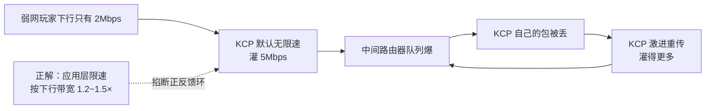

**读图**：中间四个节点是个**正反馈环**——丢得越多重传越多、重传越多丢得越多；TCP 的 cwnd 会在「包被丢」这一步退让、把环掐断，KCP 不退让，所以这个环只能靠**外部限速**掐断。

限速三招：

- **应用层发送上限**：按玩家下行带宽估上限（1.2~1.5×），超过就主动丢/延。
- **KCP 拥塞控制模式**：开自带简单拥塞控制（`ncwnd`），牺牲一点尾延迟换稳定。
- **分通道限速**：可丢的位置包不限速；不可丢的关键指令走小通道 + 限速。

> 📝 **面试**：「KCP = 弱网银弹，全改 KCP 就流畅」——错。KCP 只把重传做激进，**不解决带宽不够**。

### QUIC / HTTP3

QUIC 在 UDP 上做多流，缓解 TCP 队头阻塞；用**连接 ID（Connection ID）**标识连接，不绑四元组——切网后源 IP 变，只要带同一个 Connection ID，对端就认这是同一条连接续传，不必重连。

```text
TCP 切网：  四元组变 → 连接死 → 必须重连 + token
QUIC 切网： 源 IP 变，但 Connection ID 不变 → 连接续传，不用重连
```

> ⚠️ **别神话**：连接迁移要客户端/服务端栈都支持 QUIC；游戏自研网关多数仍是 TCP/KCP + token 重连。面试知道「队头阻塞/迁移」即可，是否采用看公司栈。

---

## 八、作战：`ss -ti` + 定责

> 🎯 **一句话**：抓包能看每一包但成本高，日常先 `ss -ti`，必要时再抓包。三种故事（距离/丢包/ZeroWindow）只在这里讲一次。

### 字段速记

```text
ESTAB  0  0  10.0.0.8:10001  203.0.113.88:54321
  cubic wscale:7,7 rto:420 rtt:185.2/42.1 ato:40
  mss:1448 cwnd:4 ssthresh:40 bytes_sent:120000
  retrans:12/28 rcv_rtt:180 rcv_space:65535

rtt:185.2/42.1    ← 平均 RTT / 方差：一来一回多久 · 抖不抖
cwnd:4            ← 拥塞窗口；发送上限受 min(rwnd,cwnd) 约束
ssthresh:40       ← 慢启动阈值；新建连接常是 INT_MAX
retrans:12/28     ← 近期/累计重传；关键是「在涨吗」
rcv_space:65535   ← 与接收窗口相关；掉到 0 要想 ZeroWindow
bytes_sent/acked  ← 差额 ≈ 飞行中未确认
wscale:7,7        ← 窗口缩放因子，×128 才是真实窗口上限
```

### 三组对照 🔧

**A · 距离型（别当丢包治）**

```text
ESTAB  0  0  10.0.0.8:10001  118.69.x.x:44102
  cubic rtt:220.1/12.0 cwnd:40 ssthresh:40
  bytes_sent:800000 bytes_acked:800000 retrans:0/0 rcv_space:65535
# ← rtt 高且稳、retrans 0、cwnd 正常 → 物理/跨境延迟。长连接、合并请求、别每 API 新建连。
```

**B · 丢包/拥塞型**

```text
ESTAB  0  120000  10.0.0.8:10001  118.69.x.x:44102
  cubic rtt:85.0/60.2 cwnd:2 ssthresh:18
  bytes_sent:2100000 bytes_acked:1980000 retrans:48/120 rcv_space:65535
# ← rtt 方差大、retrans 高、cwnd 趴 → 路径质量或对端问题。先两端对比，再抓包（16）。
```

**C · ZeroWindow 型**

```text
ESTAB  0  380000  10.0.0.8:10001  203.0.113.88:54321
  cubic rtt:40.0/8.0 cwnd:55
  bytes_sent:15000000 bytes_acked:14620000 retrans:1/3 rcv_space:0
# ← Send-Q 很大、rcv_space 0、retrans 未必高 → 治对端 read（12），不加大本端 wmem。
```

> 🎯 **已 ESTAB + retrans 不涨 + rtt 稳大**：多半是距离，优化连接复用与业务，不是调握手。

### 定责决策树

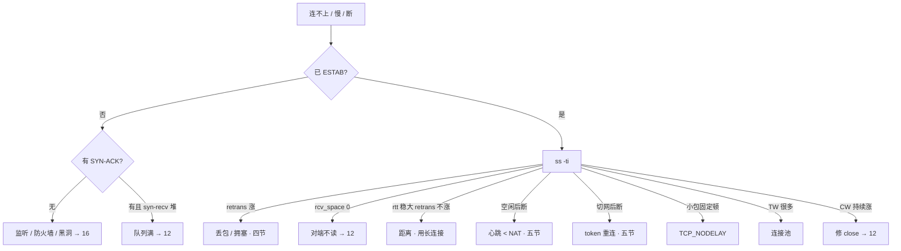

### 现象 · 先做 · 别做

| 现象 | 先做 | 别做 |
|------|------|------|
| 连不上 | 看 SYN / SYN-ACK | 先调窗口 / 拥塞算法 |
| ESTAB 仍慢 | `ss -ti` | 改握手参数 |
| 挂机踢、曾 ESTAB | 查心跳 interval | 指望 keepalive 7200 |
| 切网断 | 重连 + token | 等 TCP 自愈 |
| 小包定期卡 | NODELAY | 当切网或当丢包 |
| TW 爆炸 | 连接池 / Keep-Alive | recycle、乱缩 2MSL |
| CW 持续涨 | 修 `close()` | 只调 fin_timeout |
| 全改 KCP | 先拆可丢/不可丢 | 支付跟战斗混通道 |
| ZeroWindow | 对端 read → 12 | 加大本端 sndbuf 当根因 |
| RTO 后卡很久 | 认 cwnd ≈ 1，查路径 | 乱跳到无关章节调参 |

### 60 秒剧本 🔧

> 🔍 **现场**：接到「卡/慢/断」报障，别先抓包，60 秒走完这条线再下结论。

```text
① 0–10s  连不上还是慢？  ss -ant 看堆在哪个状态：SYN-SENT / SYN-RECV / ESTAB / TIME-WAIT
② 10–30s 已 ESTAB 还慢？ ss -ti dst <对端> 看三样：retrans 涨不涨 / rtt 稳不稳 / rcv_space 是不是 0
③ 30–45s 定型：A 距离型（rtt 稳大 retrans 0）/ B 丢包型（retrans 涨 cwnd 趴）/ C ZeroWindow（rcv_space 0）
④ 45–60s 定责 + 验证：A 治连接复用 · B 两端对照再抓包 · C 治对端 read
```

---

## 九、收口

### 命令速查 🔧

```bash
# 握手卡在哪
ss -ant | grep -E 'SYN-SENT|SYN-RECV'   # SYN-SENT→对端；SYN-RECV→本端队列（→12）
# 已 ESTAB 还卡：第一刀
ss -ti dst <对端IP>                     # 看 rtt / retrans / cwnd / rcv_space
# 关闭与残留
ss -ant state time-wait | wc -l         # TW 计数（短连接主动关侧常正常）
ss -antp state close-wait               # CW 持续涨 = 没 close（→12 认进程）
# 保活相关（不能当游戏心跳）
sysctl net.ipv4.tcp_keepalive_time net.ipv4.tcp_keepalive_intvl net.ipv4.tcp_keepalive_probes
# 出站 TW 复用（补丁；正解仍是连接池）
sysctl net.ipv4.tcp_timestamps net.ipv4.tcp_tw_reuse   # reuse 依赖 timestamps=1
# 小包顿 ~200ms
# 应用侧开 TCP_NODELAY（setsockopt）；不是调 sysctl 能单独关掉 Nagle 全局
```

### 面试锚点

| 问 | 30 秒答 |
|----|---------|
| TCP/UDP 怎么选？ | 能不能丢：支付 TCP，位置 UDP，弱网不可丢才 KCP+限速。 |
| 粘包怎么解决？ | 字节流无消息边界 → 应用层定界：长度前缀 / 分隔符 / 定长；不是关 Nagle。 |
| TCP 头多大？有啥？ | 固定 20 字节：双端口、seq、ack、标志位、窗口；选项在握手协商。UDP 头 8 字节。 |
| 为何三次握手？ | 防幽灵 SYN；两次 Server 过早 ESTABLISHED。 |
| 握手交换了什么？ | 双方 ISN（随机序号）+ MSS/wscale/SACK 选项。 |
| 握手的 seq/ack 怎么写？ | `SYN seq=x` → `SYN+ACK seq=y, ack=x+1` → `ACK seq=x+1, ack=y+1`；SYN 占 1 个序号所以 +1。 |
| 握手两边的状态位？ | Client `CLOSED→SYN_SENT→ESTABLISHED`；Server `CLOSED→LISTEN→SYN_RCVD→ESTABLISHED`，Server 收到第三个 ACK 才算建立。 |
| 挥手的 seq/ack 怎么写？ | `FIN seq=u` → `ACK ack=u+1` → `FIN seq=w, ack=u+1` → `ACK ack=w+1`；FIN 同样占 1 个序号。 |
| ISN 为何随机？ | 防旧包串新连接、防序号预测劫持、配合四元组复用。 |
| TCP 如何保证可靠传输？ | 七件套：校验和 / 序号 / 确认 / 重传 / 排序去重 / 流量控制 / 拥塞控制。可靠 ≠ 不丢包，只保证丢了补齐并按序上交。 |
| 流控 vs 拥塞控制？ | 保护对象不同（对端主机 vs 中间网络）；信息来源不同（对端显式通告 vs 自己从丢包/RTT 猜）；同时生效取 min。 |
| 拥塞控制四阶段？ | 慢启动 → 拥塞避免 → 快速重传 → 快速恢复；RTO 是兜底，cwnd ≈ 1 回慢启动。 |
| 半关闭 vs 半打开？ | 半关闭是协议正常状态（FIN 后只收不发）；半打开是故障，双方状态已不一致，`ss` 还显示 ESTAB。 |
| 发送受什么限？ | 滑动窗口；实际 min(rwnd, cwnd)。 |
| rwnd / cwnd？ | rwnd=对端还能收；cwnd=网络还扛得住。 |
| 慢启动为何翻倍？ | 每 ACK cwnd+1 MSS，一 RTT 收 cwnd 个 → 近似翻倍。 |
| RTO vs 快重传？ | RTO→cwnd 常 ≈1；3 DupACK→减半快重传。 |
| Cubic vs BBR？ | Cubic 丢包驱动、随机丢包被误伤；BBR 测带宽×最小RTT，不等丢包。没证据别换。 |
| 为何还要心跳？ | NAT ~5min vs keepalive 7200s；还要探业务死。 |
| 半关闭用什么？ | `shutdown(SHUT_WR)` 发 FIN 仍可读；`close` 是两头都收 + fd 计数减 1。 |
| MSL 是什么？ | 段在网络中的最长存活时间；2MSL 是一去一回，等 FIN 重传 + 等旧包消亡。 |
| TW vs CW？ | TW 主动关等 2MSL；CW 被动方没 close。 |
| 重启 bind 报占用？ | `SO_REUSEADDR`；≠ `tcp_tw_reuse`（客户端出站复用）；`tcp_tw_recycle` 已移除别提。 |
| 多进程同端口？ | `SO_REUSEPORT`，内核分发到各自 accept 队列。 |
| 切网？ | 四元组死，要 token；≠ Nagle。 |
| ZeroWindow？ | 对端窗口 0，治对端 read，不加大本端 sndbuf。 |
| 队头阻塞？ | 一 TCP 丢包堵整连接；HTTP/2 仍在；游戏常拆通道。 |
| KCP 为何要限速？ | 看不到全网拥塞、不退让，不限速自造丢包死循环。 |
| QUIC 切网怎么不断？ | 用 Connection ID 标识连接，不绑四元组。 |

### 易错一句话对照

- 两次握手够 → 幽灵 SYN
- 握手图只画三根箭头写「我的序号从 x 开始」 → 要写 `seq=x` / `seq=y,ack=x+1` / `seq=x+1,ack=y+1` + 两边状态位
- 第三个 ACK 也消耗序号，数据从 `seq=x+2` 开始 → 纯 ACK 不消耗序号，仍从 `seq=x+1` 开始
- 两端同时进 ESTABLISHED → Client 发完 ACK 即建立，Server 收到才算
- 握手完一定没问题 → 只保证连接状态（出生段）
- 一次 write = 一次 read → 字节流没边界，粘包/拆包要应用定界
- 关掉 Nagle 就不粘包 → NODELAY 只管不攒小包，边界照样没有
- 发送看带宽 → min(rwnd,cwnd) · 滑动窗口
- 可靠就是不丢包 → 网络照样丢，只保证补齐并按序上交；不保证实时
- 流量控制和拥塞控制是一回事 → 一个保护对端主机（显式通告），一个保护中间网络（自己猜）
- 快重传后 cwnd 打回 1 → 那是 RTO；快重传走快速恢复，只减半
- `ss` 是 ESTAB 就是通的 → 可能是半打开，双方状态已不一致
- keepalive 当游戏心跳 → 7200 vs NAT 5min
- ZeroWindow 调本端 wmem → 治对端 read
- 全业务上 KCP → 必须限速；支付仍 TCP
- TW 都是故障 → 短连接主动关侧常正常
- `SO_REUSEADDR` 能解决 TW 太多 → 它只解决重启绑不上
- `tcp_tw_recycle` 回收更快 → NAT 下随机连不上，4.12 已移除
- close 就能半关闭 → 要 `shutdown(SHUT_WR)`；close 后读不到回包
- rtt 高就是丢包 → retrans 不涨则多半是距离
- 切网靠加大 keepalive → 四元组已死，要 token 重连
- UDP 一定比 TCP 快 → 无可靠层只是「不管丢」

### 数字墙

> TCP 头固定 **20 字节** · UDP 头 **8 字节** · SYN/FIN 各消耗 **1** 个序号（纯 ACK **0** 个）· 2MSL **~60s** · keepalive **7200s** · 心跳 **15–45s** · NAT **~5min** · 快重传 **3** DupACK · 延迟 ACK **40ms** · MSS **~1460** · wscale **7**（×128）· ssthresh 初值 **INT_MAX** · 可靠性 **7** 件套 · 拥塞控制 **4** 个阶段 · Nagle 叠延迟 ACK 体感 **~200ms** · RTO 后 cwnd 常 **≈1** · `tcp_tw_recycle` **4.12 移除**

---

## 合上书

- [ ] **默画一节的图**：入口（能不能丢）→ 出生 → 干活 → 老去 → 死亡；另一条路（UDP/KCP/QUIC）；`ss -ti` 照哪段。
- [ ] **口述选型与粘包**：怎么选 TCP/UDP、为什么 TCP 会粘包、三种定界法、UDP 为什么不粘包。
- [ ] **默画出生**：三次握手**逐段写出 `seq`/`ack` 与两边状态位**（`CLOSED→SYN_SENT→ESTABLISHED` / `CLOSED→LISTEN→SYN_RCVD→ESTABLISHED`），并说清为什么是 `+1`。
- [ ] **口述出生**：TCP 头有哪些字段、握手交换什么、ISN 为何随机、为什么不是两次、握手卡住看 `SYN-SENT` vs `SYN-RECV`。
- [ ] **口述干活**：滑动窗口是什么、为什么要有、min(rwnd,cwnd)、RTO vs 快重传、慢启动为何翻倍、Cubic vs BBR 差在哪。
- [ ] **默画可靠性七件套**：校验和/序号/确认/重传/排序去重/流量控制/拥塞控制，并说清「发现—解决—预防」怎么分组、流控与拥塞控制差在哪、为什么「可靠 ≠ 不丢包」。
- [ ] **口述老去**：心跳 vs NAT vs keepalive 三档、切网四元组死、Nagle、三种断线怎么分。
- [ ] **默画死亡**：四次挥手**逐段写出 `seq`/`ack`** 与两条状态链（`FIN_WAIT_1→FIN_WAIT_2→TIME_WAIT→CLOSED` / `CLOSE_WAIT→LAST_ACK→CLOSED`），说清为什么是四次、谁等 2MSL。
- [ ] **口述死亡**：`shutdown(SHUT_WR)` vs `close`、MSL 是什么、为何 2MSL、TW vs CW。
- [ ] **口述端口复用**：`SO_REUSEADDR` / `SO_REUSEPORT` / `tcp_tw_reuse` / `tcp_tw_recycle` 各管什么、哪个别用。
- [ ] **口述另一条路**：UDP 头多简单、无流控、KCP 必须限速、QUIC Connection ID 迁移。
- [ ] **定责**：`ss -ti` 三对照（距离/丢包/ZeroWindow）各看什么字段、各走哪条。

下一章：[HTTP 与 TLS](../14-HTTP与TLS/)。地基：[12](../12-网络栈与Socket/) · 抓包：[16](../16-网络排障与抓包/)。
