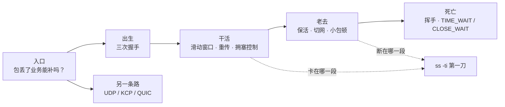
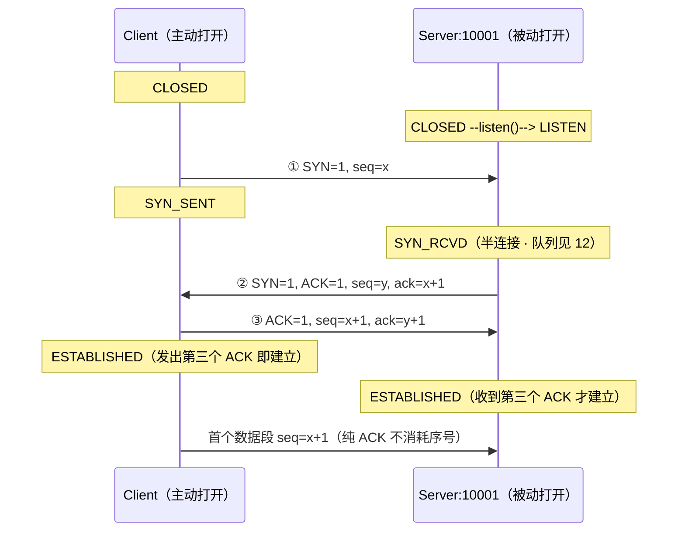
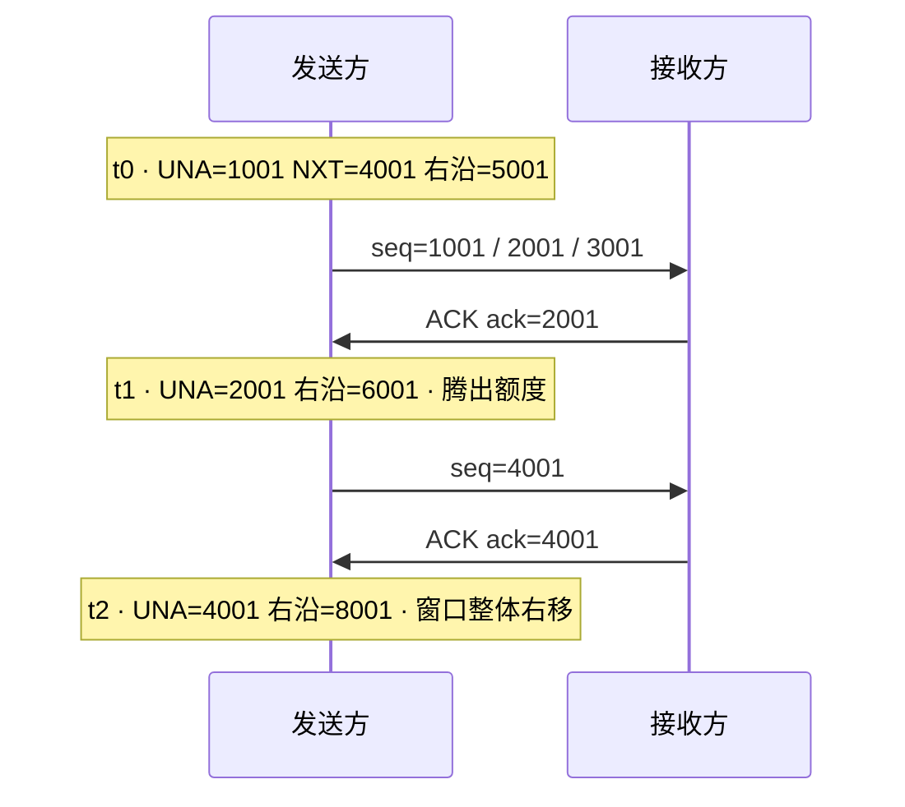
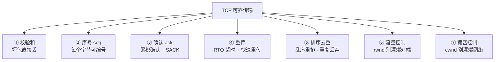
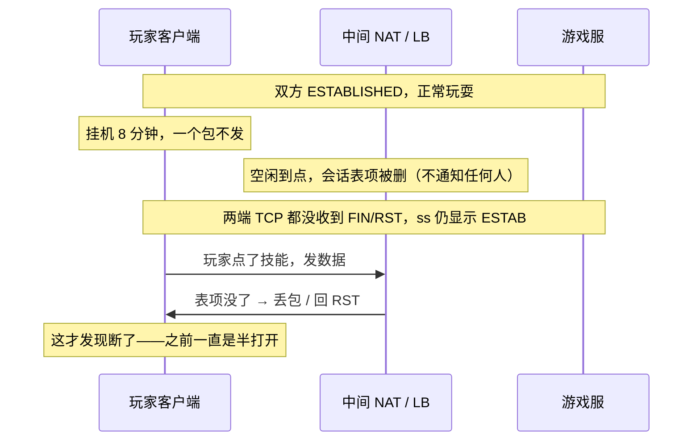
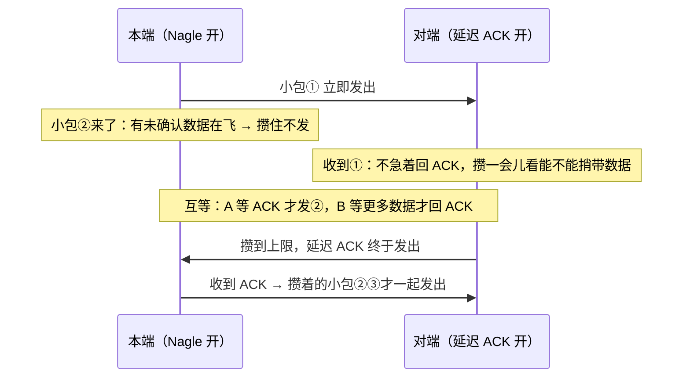
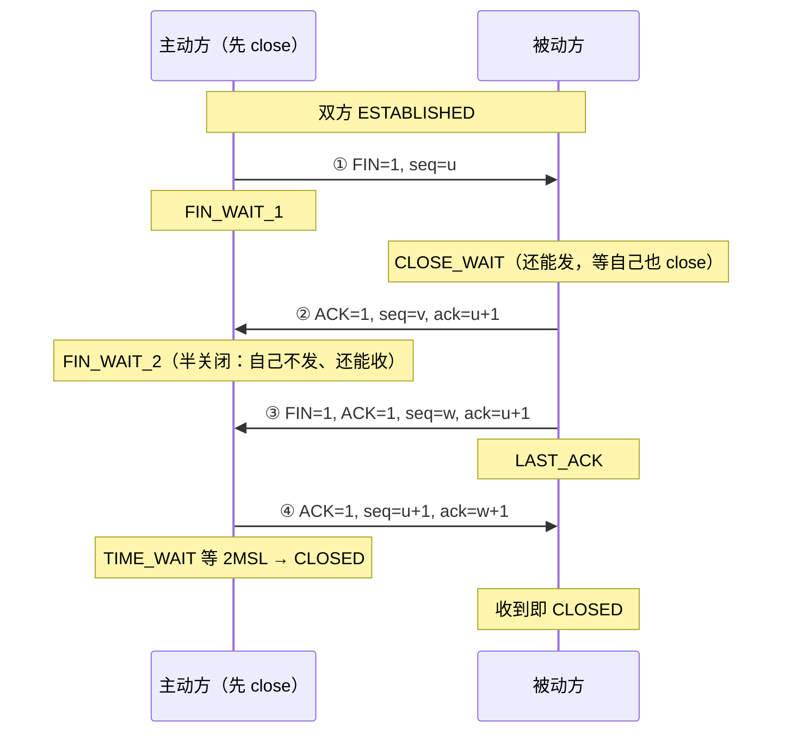
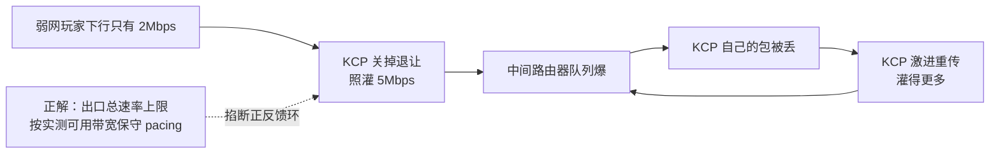
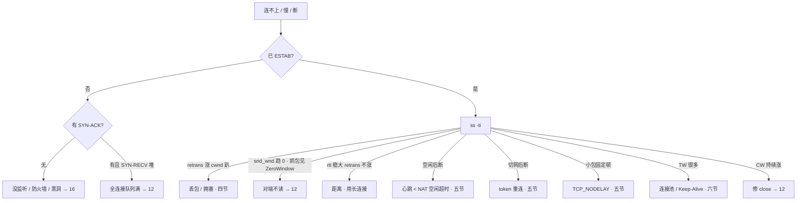

# TCP 与 UDP

> 值班群里最常见的三种「还连着却用不了」：挂机 8 分钟被踢、进地铁必掉、跨海技能卡 400ms。三个人分别喊「加大 keepalive」「全业务上 KCP」「先抓包再说」，三句都不对。
> **本章回答**：一条 TCP 连接从出生到死亡会经历什么，每一段会怎么坏、现场怎么一眼定责。
> **不讲**：包怎么进主机、Recv-Q/Send-Q 的字节含义、半连接/全连接队列 → [12](../12-网络栈与Socket/)；抓包、MTU/PMTUD → [16](../16-网络排障与抓包/)。

**标记**：🎯重点 · 🔥难点 · ⭐常考 · 🔧实操

---

## 一、一张图：连接的一生

> 🎯 **一句话**：TCP 连接和人一样有生老病死——出生（握手）、干活（传数据）、老去（空闲/切网）、死亡（关闭）。出了问题先问「它卡在哪一段」，再决定动哪把刀。



入口那一问决定走哪条道：业务补不了丢包才走 TCP 主线，补得了就可以走 UDP。二到七节顺着这条线一站一站走完，第八节把整章收成「60 秒定责」，也就是开头那个现场的正确解法。⭐ 选型和定责是面试的第一问和最后一问（练习题 Q1、Q13、Q14）。

---

## 二、选型：这条道用 TCP 还是 UDP

> 🎯 **一句话**：第一问永远是「包丢了业务能不能自己补」，不是「谁更快」。

| 维度 | TCP | UDP |
|------|-----|-----|
| 连接 | 有，建连时握手一次 | 无连接 |
| 数据模型 | 可靠有序**字节流** | 尽力送达**报文**，丢了不管 |
| 队头阻塞 | 一条连接丢一包，后面全等 | 无（应用自己排） |
| 典型 | 登录、支付、聊天、HTTP | 位置 20Hz、可丢特效帧 |

「一条连接」= 一个**四元组** `(源IP, 源端口, 目的IP, 目的端口)`。同一对 Client–Server 可以同时有很多条，客户端每次换一个源端口——这个定义在五节「切网」和六节「端口复用」还要用。

选型只有三条分支：

- 补不了（钱、登录态、关键指令）→ **TCP / HTTPS**。
- 补得了（位置、特效，下一帧就覆盖）→ **UDP**。
- 补不了，但弱网下 TCP 的尾延迟业务受不了 → **评估 KCP，且必须限速**（七节）；支付、登录仍然走 TCP。

游戏常见拆法就是按这三条拆通道。典型错误是整条业务「为了流畅」全上 KCP。

### 字节流的代价：粘包与拆包 🎯⭐🔥

TCP 明明是可靠的，为什么 `write` 三次、对端一次就全读到了？很多人答「网络把包拼坏了」——错。

> 🎯 **一句话**：TCP 只保证字节顺序对，**不保证消息边界**。你 `write` 三次，对端可能一次 `read` 全收到（粘包），一条消息也可能分两次才收齐（拆包）。边界必须应用自己划。

```text
你以为的：  write("登录")  write("走路")  write("放技能")
            read → "登录"   read → "走路"   read → "放技能"

实际可能：  read → "登录走路放技"      ← 粘包（三条粘在一起，还切断了最后一条）
            read → "能"                ← 拆包（上一条的尾巴才到）
```

🔥 根源是 TCP 眼里只有一条连续的字节线，`write` 只是往线上追加字节：Nagle 会把小段攒成一段发（五节），路径 MTU 会把大段切成多段发，接收缓冲又按到达顺序堆着。**「一次 write = 一次 read」从来不是 TCP 的承诺。**

边界只能在应用层划，做法就三种，选一种、全链路统一：

```text
① 长度前缀（最常用）  [4字节长度][消息体]  ← 先读满 4 字节知道要读多长，再读满那么多
② 分隔符             消息\n消息\n         ← 简单，但消息体内不能出现分隔符
③ 定长               每条固定 128 字节     ← 解析最快，浪费带宽，只适合固定结构
```

配套的读法永远是「读进缓冲区 → 循环切出完整消息 → 切不出就留着等下次」，不是「read 一次当一条消息处理」。

> ⚠️ **别混**：粘包不是 bug、不是网络故障，是字节流的正常语义；`TCP_NODELAY` 只是不攒小包，路径照样会合并和切分，**关了 Nagle 一样粘**。UDP 一次 `sendto` = 一个报文，天然不粘包，代价是丢了没人补（七节）。

> 📝 **面试**：问「怎么解决粘包」，答「应用层定界：长度前缀 / 分隔符 / 定长，配合『收到就循环切、切不完留着』的解析循环」。答「关掉 Nagle」直接减分。⭐（练习题 Q1）

本节对应练习题 Q1、Q13。道选好了，连接要出生——两端怎么确认对方真的在？

---

## 三、出生：三次握手

> 🎯 **一句话**：三次握手交换的是双方的随机起始序号，第三个 ACK 是为了防「幽灵连接」。

### 先认一眼 TCP 头 ⭐

后面全章都在说 seq、ack、窗口、SYN/FIN，它们都是 TCP 头里的字段，一次看清就不用再猜：

```text
[ 源端口 16 | 目的端口 16 ]          ← 四元组里的那两元
[      序号 seq 32        ]          ← 这段数据第一个字节在字节流里的编号（编号连续、无边界，粘包的根源）
[   确认号 ack 32         ]          ← 「我期待收到的下一个字节编号」，即之前的都收到了
[ 首部长 | 标志位 | 窗口 16 ]        ← SYN 建连 · ACK 确认 · FIN 关闭 · RST 掐断 · PSH 尽快上交 · URG 紧急
[ 校验和 16 | 紧急指针 16 ]
[ 选项：MSS · wscale · SACK · Timestamp，只在握手时协商 ]
        ↑ 固定部分 20 字节，带选项更长（UDP 头只有 8 字节，七节）
```

三条先记住：**窗口字段就是 rwnd**（四节）、**ack 是累积确认**（不是只确认这一段）、**标志位可以叠**（SYN+ACK 就是两位一起置 1）。

### 三个动作与两端状态 🎯⭐🔥

建连前 Server 只是 `LISTEN`，还没有这条连接。三步交换的是**序号 seq 与确认号 ack**，不是业务数据。下图每根箭头是标准报文写法，Note 是两端各自的状态位——白板上要能一笔不差地默画出来：



`x` 和 `y` 是两端各自的 **ISN（Initial Sequence Number，初始序号）**，由内核随机生成。三处细节决定你画得对不对：

- **`ack` 为什么是 `+1`**：ack 的语义是「我期望收到的下一个字节序号」，且是**累积确认**。SYN、FIN 这类标志位虽不带数据，但**各消耗一个序号**，客户端的 SYN 占掉 `x`，所以对端回 `ack=x+1`。带 payload 的数据段则是 `ack = seq + 数据长度`（收到 `seq=1001` 长 500 字节，回 `ack=1501`）。
- **纯 ACK 不消耗序号**，所以首个数据段仍从 `seq=x+1` 开始；白板上写 `seq=x+2` 是错的。
- **两端进 ESTABLISHED 的时刻不同**：Client 发出第三个 ACK 就算建立，Server 要收到才算——这正是 [12](../12-网络栈与Socket/) 里「全连接队列满时客户端显示 ESTAB、服务端却没这条连接」的根源。

> ⚠️ **别混**：状态名有两套。RFC 793 写 `SYN-RECEIVED`（常记作 `SYN_RCVD`），Linux `ss` 打印的是 `SYN-RECV`；面试写教科书名、值班认工具名，别当成两个东西。

> 📝 **面试**：画握手必须写出 `seq=x` / `seq=y, ack=x+1` / `seq=x+1, ack=y+1` 加两条状态链——Client `CLOSED → SYN_SENT → ESTABLISHED`，Server `CLOSED → LISTEN → SYN_RCVD → ESTABLISHED`——再补一句「SYN 消耗一个序号，所以 ack 是 +1」。只画三根箭头写「我的序号从 x 开始」拿不到分。⭐（练习题 Q2）

### 为什么随机、为什么三次 ⭐

> 💡 **打个比方**：你寄信（SYN），朋友回信「收到，我这边编号从 y 开始」（SYN+ACK）。你不回第三封，朋友永远不知道他的回信你有没有收到；更糟的是，你那第一封信可能是三天前寄丢、今天才到的旧信，朋友已经开好房间等你，你早就不在了。

第二种情况就是**幽灵连接（ghost SYN）**：只握两次，Server 收到 SYN 就 ESTABLISHED、占住 fd 和内存，替一个不存在的客户端白开连接。第三个 ACK 让 Server 确认「对方这一次真的还在」。

**ISN 为什么必须随机**，三个理由：① 防串包——同一四元组反复建连，若每次都从 0 编号，上一条连接的迟到旧包会正好落进新连接的序号范围；② 防序号预测——固定序号能被猜到，攻击者可伪造 RST 掐断或注入数据；③ 配合端口复用——TIME_WAIT 期间旧四元组还没释放（六节）。

**握手顺便协商了什么**：双方各带 `MSS`（每段 payload 上限）、`wscale`（窗口缩放）、`SACK`、`Timestamp`。这些只在建连时谈一次，**中途改不了**——所以「建连后想加 SACK」不成立。

### 握手卡在半路：看状态堆在谁家 🔧

```bash
ss -ant | grep -E 'SYN-SENT|SYN-RECV'
# 堆 SYN-SENT → 本端发完 SYN 没等来 SYN+ACK：对端没监听 / 中间丢包 / 被防火墙黑洞
# 堆 SYN-RECV → 本端回了 SYN+ACK 没等来最后 ACK：对端没回 或 全连接队列满（→12）
```

一句话定责：**SYN-SENT 往对端查，SYN-RECV 往队列查，方向反了白忙。**

**SYN Cookie**（一句话）：半连接被 SYN Flood 打满时，内核可以不占队列槽，把连接状态编码进 ISN 回给客户端，靠第三个 ACK 的序号反推。代价是**能保留的握手状态和选项受限**：现代 Linux 能把 MSS 编码进去，满足条件时还能借 Timestamp 带回部分 wscale/SACK 信息，但具体保得住多少取决于内核版本和配置。它是被打时的降级手段，不是正常容量方案。

> ⚠️ **别混**：握手成功 ≠ 后面没事。它只保证「连接状态建立」，后续段照样会丢（四节）、NAT 照样会清表（五节）、对端应用照样可能不读（四节 ZeroWindow）。

本节对应练习题 Q2。连接起来了，接着就是那个真问题：数据怎么发，才既不灌爆对端、又不灌爆网络？

---

## 四、干活：滑动窗口与重传

> 🎯 **一句话**：TCP 不是「发一个等一个」，而是「窗口内连续发、确认了就前滑」，能发多少由 `min(rwnd, cwnd)` 决定。值班里 80% 的「已 ESTAB 还卡」都落在这一节。

这一节按四个问题往下走：为什么能连续发 → 谁在限制发送量 → 丢包后怎么补 → 怎么避免把网络灌爆。

### 为什么能连续发：滑动窗口 ⭐🔥

> 💡 **打个比方**：跨海寄快递，一来一回 200ms。「发一件等签收再发下一件」，一天只能发几十件；滑动窗口是「允许同时有 100 件在路上」，签收一件就补发一件，吞吐才上得去。

任意时刻只允许这么多字节处在「已发出、还没确认」的状态，这个额度就是**滑动窗口**。把发送缓冲想成一条字节线：

```text
已确认 |---- 已发未确认（飞行中）----|---- 还能发 ----| 暂时不能发
       ^UNA = SND.UNA                ^NXT = SND.NXT  ^右沿 = UNA + min(rwnd, cwnd)
```

用标准序号走三帧（设 MSS=1000、`min(rwnd,cwnd)=4000`，从 `seq=1001` 起发）：



`ack=2001` 表示「`1001~2000` 我连续收齐了，下一个我要 2001」，于是 `SND.UNA` 推到 2001，右沿跟着推到 `2001+4000`——**左沿由对端的 ACK 推，右沿永远等于左沿加上 `min(rwnd, cwnd)`**，这一推一跟就叫「滑动」。

> 🎯 **关键直觉**：窗口不是「发完一批等下一批」的批处理，是「回来一段 ACK 就腾一段额度、就再发一段」的流水线。ACK 不回来（丢包）或 rwnd 缩到 0，右沿就钉死在原地——这就是卡顿的微观机制。

### 谁在限制发送量：rwnd 与 cwnd 🎯⭐

压缩窗口的只有两个东西，各自对应 TCP 的一套官方机制：

| 对比 | **rwnd**（接收窗口） | **cwnd**（拥塞窗口） |
|------|----------------------|----------------------|
| **官方机制名** | **流量控制（flow control）** | **拥塞控制（congestion control）** |
| 保护谁 | 保护**对端主机**别被灌爆 | 保护**中间网络**别被灌爆 |
| 范围 | 端到端 | 端到网络 |
| 怎么知道 | 对端在 ACK 的窗口字段里**显式通告** | 没人通告，**从丢包和 RTT 自己猜** |
| 变小原因 | 对端应用不 `read`，接收缓冲满 | 丢包、拥塞 |
| 怎么治 | 让**对端**把数据读走 | 查丢包路径，别乱换算法 |

> ⚠️ **别混**：**流量控制 ≠ 拥塞控制**，这是最高频的混答点。两者同时生效，实际发送量取 `min(rwnd, cwnd)`——所以「加大缓冲就能提吞吐」只在流量控制受限时成立，拥塞受限时一点用没有。口诀：**rwnd 护对端，cwnd 护路上，发送取两者小。**

**rwnd 是怎么通告的**：接收方把「接收缓冲还剩多少空间」写进 ACK 的窗口字段发回来。缓冲快满就通告变小，通告成 0 就是 **ZeroWindow**，发送方立刻停发、改用**零窗口探测（persist timer）**定期发一字节探针问「能收了吗」；等对端应用把数据读走，一个普通 ACK 把窗口字段改大，发送就恢复。整条链上没有本端能调的旋钮，**根因永远在对端读得慢**。

> ⚠️ **口径**：`ss -ti` 里的 `rcv_space` 是**本端接收缓冲自动调优的估算值**，不是对端通告给我们的窗口，**不能拿它单独判 ZeroWindow**。要判 ZeroWindow，三条证据交叉印证：① 抓包里对端发来的窗口通告为 0（Wireshark 直接标 `TCP ZeroWindow`）；② 较新 iproute2 的 `snd_wnd`（对端通告给本端的可用窗口）趋近 0，同时本端 Send-Q 一直堆着；③ 对端那台机器上 Recv-Q 顶满、应用线程卡在 GC/DB/锁上没在 read。

**`wscale` 是什么**：TCP 头的窗口字段只有 16 位，最多通告 64KB，跨海高带宽根本不够。wscale 在握手时协商一个移位因子（7 表示左移 7 位，即 ×128），把窗口上限抬到约 1GB；`ss -ti` 里的 `wscale:7,7` 就是双方各用 7。没协商成功，窗口被钉在 64KB，跨海吞吐上不去。

### 丢包后怎么补：RTO 与快速重传 ⭐🔥

ACK 正常回来时窗口就一路往前滑；ACK 不正常，发现丢包只有两条路——要么等超时，要么靠对端的重复确认提前告状。走哪条决定 `cwnd` 掉得多狠（下表是经典 Reno 口径）。

| 对比 | **RTO 超时重传** | **3× DupACK 快速重传** |
|------|------------------|------------------------|
| 触发 | 等太久没等到 ACK | 连续收到 3 个重复 ACK |
| 对 cwnd | 通常打回 **≈ 1** | **减半**，不全打回 1 |
| 体感 | P99 尖刺大 | 相对温和 |

**DupACK 是怎么来的**：因为 ack 是累积确认，中间缺一段，后面的段到了也推不动确认点，只能一遍遍回同一个 ack。

```text
发送方发出   seq=1001  seq=2001  seq=3001  seq=4001  seq=5001   （每段 1000 字节）
网络         ✅到       ❌丢      ✅到      ✅到      ✅到
接收方回     ack=2001   —        ack=2001  ack=2001  ack=2001   ← 后三个就是 DupACK
发送方       连收 3 个 ack=2001 → 断定 seq=2001 那段丢了 → 立即重传，cwnd 减半
```

**为什么要凑 3 个**：1~2 个重复 ACK 也可能只是乱序（包晚到，没真丢），3 个才有足够置信度。这也是无线网容易把「晚到」当「丢了」、误伤 cwnd 的原因。

**SACK** 让接收方顺带告诉发送方「哪些段我已经收到了」，重传时只补真丢的那几段，少重传冤枉段；它和快重传配合使用。**RTO 也不是拍脑袋定的**：内核维护 RTT 的平滑均值 SRTT 和抖动 RTTVAR，`RTO = SRTT + 4×RTTVAR`，超时后还会指数退避翻倍，`ss -ti` 里的 `rto:420` 就是当前值（毫秒）。

**延迟 ACK（Delayed ACK）**：接收方不立刻回 ACK，先攒一会儿看有没有数据可以捎带，等多久由内核自适应（`ss -ti` 的 `ato` 是这条连接当前的延迟 ACK 定时估计，单位毫秒，随内核版本和连接状态变化，**不是协议或实现的固定上限**）。单独存在没事，和 Nagle 叠在一起就是五节「小包固定顿一下」的元凶。

### 怎么不灌爆网络：拥塞控制四阶段 🔥

🔥 很多人以为「新连接一上来就全速发」——错。新连接不知道路上挤不挤，必须先探路。

> 💡 **打个比方**：新开的高速入口不知道今天堵不堵，不敢一上来就把车全放进去——先放一辆，没出事就放两辆、四辆（慢启动），到某个门槛改成每轮多放一辆（拥塞避免）；出了事故就退回一辆重新探（RTO）。

| 阶段 | cwnd 怎么变 | 什么时候进 |
|------|------------|-----------|
| ① 慢启动 slow start | 每 RTT 近似翻倍（指数） | 连接起始，直到 `ssthresh` |
| ② 拥塞避免 congestion avoidance | 每 RTT 约 +1（线性） | cwnd 超过 `ssthresh` |
| ③ 快速重传 fast retransmit | —（先把那段补上） | 收到 3 个 DupACK |
| ④ 快速恢复 fast recovery | **减半**后回拥塞避免 | 紧跟快速重传 |
| （兜底）RTO 超时 | **≈ 1**，重回慢启动 | 等超时才发现丢包 |

**上表是经典 Reno / NewReno 的教学口径**：白板上照它答，但要知道实际回退由拥塞控制算法和内核版本决定——Linux 默认的 CUBIC 乘性因子并不是精确减半，PRR、RACK 等机制还会改变恢复路径和超时后的窗口处理。**为什么慢启动是「每 RTT 翻倍」**：规则是「每收到一个 ACK，cwnd 加 1 个 MSS」。一个 RTT 内能发 cwnd 个段、就会收到约 cwnd 个 ACK，增量正好等于原来的 cwnd——所以翻倍。指数涨得快、容易冲垮网络，才需要 `ssthresh` 拦一道。`ss -ti` 里 `ssthresh:2147483647` 是 `INT_MAX` 初值，意思是「还没丢过包，全程慢启动」；真正的 ssthresh 是丢包后才算出来的（约等于丢包时 cwnd 的一半）。

**跨海 + 短连接为什么慢**：每条连接都要从慢启动重新爬，常常「还没爬起来就结束了」。对策是**连接池 / Keep-Alive / 合并请求**，不是换拥塞算法。**Cubic 和 BBR 差在哪**（知道差异才敢说「别换」）：Cubic 是 Linux 默认、**丢包驱动**，把丢包当拥塞信号，在「有随机丢包但不拥塞」的无线和跨境链路上会被误伤，在深队列设备上又要把队列填满才发现丢包（bufferbloat）；BBR 主动测量瓶颈带宽和最小 RTT，按 `带宽 × 最小RTT` 定发送量，不等丢包、尽量不填满队列。代价是与 Cubic 共享链路时可能更「抢」，且不同版本行为差异大。

> ⚠️ **别混**：没有丢包证据（`retrans` 不涨、没有 pcap）就换 BBR，是面试减分项——你连要治的是「误判丢包」还是「距离」都还没分清，而**换算法治不了距离**。

### 收束：TCP 凭什么叫「可靠」🎯⭐

到这里「可靠」的全部零件都齐了。面试直接问「TCP 如何保证可靠传输」，要的就是这张清单，七件一件不落：



按「发现 → 解决 → 预防」分组就不容易漏：①②③ 负责**发现**问题，④⑤ 负责**解决**问题，⑥⑦ 负责**预防**问题。少了后两件 TCP 照样能跑，但会在弱网上把自己重传到雪崩——这正是七节里不限速的 KCP 的死法。

> ⚠️ **别混**：**可靠 ≠ 不丢包**。网络照样丢，TCP 只保证「丢了会补齐、补齐后按序交给应用」。也**不保证低延迟**（补齐要时间，这就是队头阻塞和 P99 尖刺），更**不保证消息边界**（二节的粘包）。

### 顺带两个概念：队头阻塞与 MSS

**队头阻塞（HOL）**：交付给应用必须按序，所以一条 TCP 丢一包，后面的段即使已经躺在内核缓冲里也不能上交，必须等重传补齐——同一条连接上「移动帧、移动帧、技能指令」，丢了第一个移动帧，技能指令也得跟着等，手感就是「整条线冻住」。HTTP/2 的「多路复用」解决的是**应用层**队头，底下还是一条 TCP，**传输层照样堵**；HTTP/3 / QUIC 把流做到 UDP 上才算拆开（七节）。游戏的正解是拆通道，这是产品设计，调 cwnd 调不出来。

**MSS**：TCP 每段 payload 的上限，以太网 1500 MTU 下常见 1460。握手时双方各带 MSS 选项、取较小那个。它只照顾两端，照顾不了中间链路——中间某跳 MTU 更小、ICMP「需要分片」又被墙，就是 PMTUD 黑洞（大包死、小包通）→ [16](../16-网络排障与抓包/)。

本节对应练习题 Q3、Q4、Q5、Q6。数据会传了——那为什么 `ss` 还显示 ESTAB，玩家却挂机 8 分钟被踢？

---

## 五、老去：为什么「还连着」也断

> 🎯 **一句话**：`ss` 显示 ESTAB 只代表本端的状态机没被推翻，不代表链路还活着。下面几种断法的对策完全不同，别一套「加大 keepalive」糊弄过去。

**半打开连接（half-open connection）**指的是：**一端仍认为连接存在，而对端已经不存在、或者端到端路径的状态已经失效**。🔥 大白话：**这条路已经用不了了，只是没人通知你**。它是本节所有故障的共同底色——TCP 状态机是两端各自维护的，没有带外信令来告诉你对方还在不在。



> ⚠️ **别混**：**半关闭（half-close）≠ 半打开（half-open）**。半关闭是协议规定的**正常状态**——一方发了 FIN 不再发数据、还能继续收（六节 `FIN_WAIT_2` / `CLOSE_WAIT`），双方状态一致且都知情。半打开是**故障状态**，但三种成因很不一样：**进程崩溃**时内核通常还会替它关掉 socket，普通连接照样发出 FIN（或按条件发 RST），对端多半能及时知情；**机器断电或链路彻底中断**才真的一个字节都发不出来，两端控制块状态就此不一致；**NAT/LB 清表**最隐蔽——两端的 TCP 控制块可能都还停在 `ESTABLISHED`、状态其实一致，失效的是中间那段映射，直到有人发包撞上去才暴露。

### 心跳、NAT 与内核 keepalive ⭐

> 🔍 **现场**：玩家挂机 8 分钟被踢，`ss -ti` 字段一切健康，业务已死。

三个时间尺度差了两个数量级，而**最小的那个说了算**：

| 层级 | 常见量级 | 作用 | 边界 |
|---|---|---|---|
| 应用心跳 | 15–45s | ✅ 真正的保活 | 要小于下面那一行 |
| NAT / LB / conntrack 空闲超时 | 常见 30s ~ 5min（各家不同） | 中间设备先把你掐掉 | **它决定心跳上限** |
| 内核 `tcp_keepalive_time` | 默认 7200s（发行版可改） | 只负责清理死连接 | **不能当游戏心跳** |

`tcp_keepalive_time` 是「空闲多久发第一根探针」，配套 `tcp_keepalive_intvl`（之后每隔多久再探）和 `tcp_keepalive_probes`（几次不回判死）。心跳间隔必须**小于链路上最小的那个空闲超时**，再留一半余量；链路上 NAT、LB、云厂商 SLB 各有一份，取最小。

**心跳绿了也不等于业务健康**。常见坑：网关 IO 线程收到心跳就回 ack，业务线程早卡死在某个 RPC 上——心跳一直绿，技能全发不出去。探活要分三层：**传输层**看 socket 通不通，应用心跳就够；**进程层**看业务线程还活着吗，得让心跳响应经过业务线程，或单独做业务探活；**依赖层**看下游 DB/RPC 通不通，健康检查要含下游依赖。

> 🎯 心跳走哪条路径，就只能保哪一层。走 IO 线程的心跳只保传输层。

### Nagle 叠延迟 ACK：小包固定顿一下 🔧

> 🎯 **一句话**：Nagle 把小段攒一攒再发，对端的延迟 ACK 也在等，两个「等」撞在一起就互相干等。游戏长连接一律开 `TCP_NODELAY`。



死锁点就在中间那行：Nagle 的规则是「有未确认的小包在飞就攒着」，延迟 ACK 的规则是「先攒一会儿再回」，一个往返白等几十毫秒，最坏能到约 200ms（经验值，取决于两端实现）。签名很好认：**顿的时长接近固定，而且 `retrans:0`、`rtt` 正常**。`TCP_NODELAY=1` 拆掉左边那个等，环就破了。

代价是小包变多、pps 上升。高频小包业务应该在**应用层自己合帧**（一个 tick 内的操作打成一包）——应用知道帧边界，Nagle 不知道。

### 切网：四元组一变，连接就死

手机从 Wi-Fi 切到 4G/5G，源 IP 变了，**四元组就变了**：

```text
旧连接（Wi-Fi）： (1.2.3.4:54321  →  Conn:10001)
新网络（蜂窝）： (5.6.7.8:xxxxx  →  Conn:10001)
                ↑ 不是同一条连接；旧的序号、窗口、拥塞状态全部作废
```

序号、窗口、拥塞状态全挂在四元组上，源 IP 一变内核就找不到对应 socket，旧连接只能超时或收 RST 死掉。产品必须做**重连 + 会话 token**：客户端带 token 重连，服务端凭 token 把玩家挂回原来的战斗会话。不要承诺「TCP 会自动续」，也不要指望加大 keepalive——四元组都死了，探针发给谁都没用。QUIC 有连接迁移能力（七节），但游戏自研网关多数仍是 TCP/KCP + token 重连。

### 「还连着却用不了」怎么分流

玩家说「还连着但不好用」时，先问现象再对号入座：**挂机一会儿再点就掉**是心跳没跑赢 NAT 空闲超时；**进地铁或切流量必掉**是四元组死了，要 token 重连；**操作总固定顿一下**是 Nagle 叠延迟 ACK；**偶发卡很久**才是丢包，回四节查 `retrans`。

> ⚠️ **别混**：这四种病对策互斥。口诀：**挂机查心跳，切网查四元组，小包顿查 Nagle，偶发久卡查 retrans。** 一套「加大 keepalive」糊弄过去，面试和值班都会露馅。

本节对应练习题 Q7、Q8、Q9。连接也会老——接下来是怎么体面地死。

---

## 六、死亡：挥手与 TIME_WAIT / CLOSE_WAIT

> 🎯 **一句话**：正常关闭走四次挥手、中途可以半关闭，异常关闭直接 RST。**谁先 close 谁进 TIME_WAIT，谁忘了 close 谁进 CLOSE_WAIT。**

### 四次挥手：标准表示与两端状态 🎯⭐

和握手同一套记法：`seq` 是自己这段的起始序号，`ack` 是「我期望收到的下一个字节」，**FIN 也占一个序号**，所以确认还是 `+1`。



几个必须讲清的点：

- `u` 是 A 已发数据最后一个字节序号 +1；报文 3 的 `seq=w` 可能大于报文 2 的 `seq=v`，因为中间 B 又发过数据；`ack` 仍是 `u+1`，因为 A 之后确实没再发。
- **只有主动方等 2MSL**，被动方收到最后那个 ACK 就直接 `CLOSED`。
- **为什么是四次**：报文 2 与报文 3 之间夹着「B 把剩余数据发完 + 应用调 close」这段不确定时长，合不成一个包。B 恰好没有待发数据时内核会把 ACK 与 FIN 合并，抓包看到「三次挥手」——那是优化，不是抓漏了，也不是标准流程。

> 📝 **面试**：画挥手要写全 `FIN, seq=u` → `ACK, ack=u+1` → `FIN, seq=w, ack=u+1` → `ACK, ack=w+1`，加两条状态链：主动方 `ESTABLISHED → FIN_WAIT_1 → FIN_WAIT_2 → TIME_WAIT → CLOSED`，被动方 `ESTABLISHED → CLOSE_WAIT → LAST_ACK → CLOSED`，再补「FIN 占一个序号，只有主动方等 2MSL」。⭐（练习题 Q10、Q12）

### 半关闭要用 shutdown，close 做不到

FIN 只表示「我发完了」，对方仍可继续发。想「我发完了但还要收完对端的回包」，必须用 `shutdown`：

```text
shutdown(fd, SHUT_WR)   只关写方向 → 发 FIN，还能继续 read 对端剩余数据   ← 真正的半关闭
shutdown(fd, SHUT_RD)   只关读方向
shutdown(fd, SHUT_RDWR) 双向都关，但 fd 还在（还要 close 回收）
close(fd)               fd 引用计数 −1，减到 0 才真正关连接、发 FIN
```

典型用法：客户端发完请求 `shutdown(SHUT_WR)` 告诉服务端「请求到此为止」，然后安心读响应。`close()` 之后你**再也读不到**对端后续数据。

> ⚠️ **别混**：`fork` 后父子进程共享同一个 socket，**只有最后那个 `close` 才发 FIN**——这是「代码里明明 close 了却还在 CLOSE_WAIT / ESTAB」的常见原因。

| 对比 | FIN 优雅关 | RST 粗暴掐 |
|------|-----------|------------|
| 对端能否收完 | 尽量保证 | **不保证**，缓冲里未读数据常直接丢 |
| 常见原因 | 应用 `close` / `shutdown(SHUT_WR)` | abortive close（`SO_LINGER={1,0}`）、关闭时接收缓冲还有未读数据、向没监听的端口发 SYN、中间设备主动拒绝 |

> ⚠️ **别混**：**进程崩溃或 `kill -9` 并不等于发 RST**。进程退出时内核会替它关掉 fd，普通 TCP socket 通常照样走 FIN；到底是 FIN 还是 RST，取决于 socket 当时的状态和选项（就是上表右列那几种条件），SIGKILL 本身既不规定也不保证 RST。`kill -9` 真正的代价是**跳过了应用层 drain**——正在处理的请求直接丢、事务不落地。停服正确姿势是**停新连接 → 等 in-flight 处理完 → 再关 socket**（[05](../05-进程与信号/)）。

### TIME_WAIT vs CLOSE_WAIT ⭐

关闭路径只有两条，看你是不是先 close 的那一方：主动方走 `FIN_WAIT_1 → FIN_WAIT_2 → TIME_WAIT → CLOSED`，被动方走 `CLOSE_WAIT → LAST_ACK → CLOSED`。堵点也只有两处。

| 对比 | TIME_WAIT | CLOSE_WAIT |
|------|-----------|------------|
| 谁 | **主动**关闭方 | **被动**关闭方 |
| 在等什么 | 2MSL，内核自己会消 | 应用调 `close()`，不调就一直挂 |
| 多了怎么治 | 连接池 / Keep-Alive | **修代码** |

**MSL（Maximum Segment Lifetime）** 是一个 TCP 段在网络里能存活的最长时间，RFC 建议取 2 分钟；具体值是实现相关的——Linux 并不按 sysctl 算 MSL，TIME_WAIT 时长由编译期常量 `TCP_TIMEWAIT_LEN`（60s，相当于 MSL 取 30s）写死，**sysctl 改不了**。

**为什么等 2MSL 而不是 1MSL**：一去一回各占一个 MSL。① 万一最后那个 ACK 丢了，对端会重传 FIN，得留一个 MSL 等它重新到达、主动方还要能回 ACK；② 让本连接的旧序号包从网络里彻底消失，免得串进下一条复用同四元组的新连接（和三节 ISN 随机是同一个防串包主题）。

> ⚠️ **别混**：能调的 `tcp_fin_timeout` 管的是 `FIN_WAIT_2`，**不是** TIME_WAIT，也盖不住 CLOSE_WAIT——面试别说串。**CLOSE_WAIT 持续涨就是程序泄漏（收到 FIN 后没 close）**，只能修代码；TIME_WAIT 不是故障，短连接的主动关闭侧 TW 很多通常正常。也没有「客户端一定 TW、服务端一定 CW」的铁律，服务端主动踢人时 TW 就在服务端。

### 被 TIME_WAIT 挡住：四个复用选项 ⭐🔧

TIME_WAIT 常见的副作用是**服务重启时 `bind` 报 `Address already in use`**——前提是新 socket 要绑的本地地址/端口与残留的 TIME_WAIT 连接冲突、且没设复用选项；能不能重绑还跟通配地址与具体地址怎么组合有关，**TIME_WAIT 多本身并不必然让重启失败**。四个名字长得像、管的完全不是一回事，这是高频混淆点：

| 选项 | 是什么 | 管什么 |
|------|--------|--------|
| `SO_REUSEADDR` | socket 选项 | 允许 `bind` 到还有 TIME_WAIT 残留的本地地址——**重启绑不上的标准解药**（多数框架默认开）；它放宽的只是 TIME_WAIT 冲突这一种情形，不是任何情况都能绑上 |
| `SO_REUSEPORT` | socket 选项（Linux 3.9+） | 允许**多个进程同时 LISTEN 同一端口**，内核按哈希分发到各自的 accept 队列 |
| `tcp_tw_reuse` | sysctl（客户端侧） | 允许复用处于 TIME_WAIT 的**出站**四元组发起新连接，**依赖 timestamps**（靠 PAWS 丢弃时间戳更旧的段来防串包） |
| `tcp_tw_recycle` | **别用，已移除** | 按「对端 IP 时间戳单调递增」判断，NAT 后多客户端共用源 IP 会被莫名丢弃；Linux 4.12 已删除 |

> 📝 **面试**：问「TIME_WAIT 太多怎么办」，答三步：① 先分清是**客户端侧**（临时端口压力，上连接池 / 长连接，必要时 `tcp_tw_reuse` + 确认 `tcp_timestamps=1`）还是**服务端侧**（说明服务端在主动关，看是不是 Keep-Alive 没开）；② `SO_REUSEADDR` 解决的是重启绑不上，不是 TW 多；③ 绝不提 `tcp_tw_recycle`。⭐ 口诀：**ADDR 管重启绑，PORT 管多进程听，reuse 管出站复用，recycle 别提。**（练习题 Q11、Q12）

本节对应练习题 Q10、Q11、Q12。TCP 主线讲完了——包丢了业务能自己补的时候，走哪条道？

---

## 七、另一条路：UDP / KCP / QUIC

> 🎯 **一句话**：UDP 把可靠性全部甩给应用层；KCP 在 UDP 上做用户态可靠，但必须限速；QUIC 用 Connection ID 解决切网。进门那一问仍然是二节的「能不能丢」。

### UDP：简单是字面意思

```text
[ 源端口 16 | 目的端口 16 ]
[  长度 16  |  校验和 16  ]     ← 一共 8 字节（TCP 固定 20 字节，三节）
```

没有序号 → 无法排序去重；没有窗口 → 没有流控；没有标志位 → 没有连接状态。它把这些全留给了你。三条边界要记牢：

- **天然有报文边界**：一次 `sendto` = 一个报文，`recvfrom` 收到的就是完整一个，**不粘包**。代价对称：TCP 保证不丢但要你自己定界，UDP 保住边界但丢了没人补。报文大于缓冲区会被**直接截断**，多出来的部分丢弃，不像 TCP 会留着下次读——所以收包缓冲要按最大报文开。
- **无流控是最大的自由也是最大的责任**：TCP 有 rwnd/cwnd 帮你踩刹车，UDP 灌太快只会在中间设备引发丢包，而应用往往感知不到是自己灌的。
- **与 MTU**：单个报文超过路径 MTU 会在 IP 层分片，任一分片丢了整个报文就作废。所以要按 **PMTU 预算 payload：PMTU − IP 头 − 8 字节 UDP 头**（IPv4、IPv6、隧道场景的头开销各不相同，**别套 TCP 的 MSS**，那是 TCP 分段专属概念）；路径未知时先用一个经过验证的保守 datagram 尺寸，更大的消息在应用层自己分片重组。

**为什么 DNS/DHCP 用 UDP**：一问一答、报文小，建 TCP 握手反而更贵，丢了客户端重发一次即可；DHCP 更特殊——客户端连 IP 都还没有，只能走 UDP 广播。

> ⚠️ **别混**：「UDP 一定比 TCP 快」是错的。没有可靠层时它只是「不管丢」，业务自己补可靠（序号、去重、重传）可能比 TCP 更慢更烂。

### KCP：可靠做在用户态，刹车要你自己踩 🔥

KCP 在 UDP 上实现用户态可靠，重传比 TCP 激进（更快触发快重传、可选不退让），弱网下尾延迟往往比 TCP 好看。但它有一个必须说准的边界：

> 🎯 **准确口径**：KCP **有**拥塞控制，但**是可选的、而且比 TCP 弱**。它自带一个简易拥塞窗口，但游戏常用的「极速模式」配置（`nodelay=1, resend=2, nc=1`）恰恰把它关掉了——`nc=1` 的字面意思就是关闭拥塞控制；即使开着，它也只看自己这条流的丢包反馈。所以正确说法是「KCP 的退让能力取决于配置且偏弱，因此必须在应用层限速」，不是笼统的「KCP 没有拥塞控制」。

关掉退让之后会发生什么：



中间四个节点是一个**正反馈环**：丢得越多重传越多，重传越多丢得越多。TCP 的 cwnd 会在「包被丢」这一步退让、把环掐断；关掉退让的 KCP 不会，只能靠外部限速掐断。带宽没变，延迟却雪崩，**比 TCP 还卡**。

限速三招：① **给整条 UDP 出口设总速率上限**，用 pacing / 令牌桶按**实测可用带宽的保守比例**发，并为重传和协议头留出余量（没有自己压测出来的数据就别拍倍数）；② **打开 KCP 自带的拥塞控制**（`nc=0`），牺牲一点尾延迟换稳定；③ **在总额度内分通道**——**所有通道都受这个总上限约束，没有「不限速通道」**：可丢通道（位置、特效）在队列积压时**丢最旧的帧或降采样**，不可丢的关键指令用独立的小额度加高优先级。「可丢」的意思是发送前可以丢弃过期帧，不是可以无上限往网里灌。

> 📝 **面试**：「KCP 是弱网银弹，全改 KCP 就流畅」——错。KCP 只把重传做激进，**不解决带宽不够**。要答「拆可丢/不可丢，KCP 只用在『不可丢且 TCP 尾延迟不可接受』那一小段，且必须限速，支付登录仍走 TCP」。

### QUIC / HTTP3：能力与边界

QUIC 在 UDP 上做多流，流之间独立，把传输层队头阻塞拆开；并用**连接 ID（Connection ID，CID）**把「连接身份」和「四元组」解耦：

```text
TCP 切网：  四元组变 → 内核找不到对应 socket → 连接死 → 必须重连 + token
QUIC 切网： 换网后客户端用一个可用 CID 在新路径上发包 → 对端凭 CID 归属回原连接
            → 双方做 PATH_CHALLENGE / PATH_RESPONSE 路径验证 → 通过了才真正迁移
            （迁移时通常还会换用新的 CID，并不要求「CID 恒定不变」）
```

> ⚠️ **别神话**：迁移能不能成，取决于三件事——① 双方栈都支持，且服务端没有设 `disable_active_migration`；② 服务端与负载均衡能按 CID 路由（用零长度 CID 就做不到）；③ 新路径要通过路径验证，期间还受拥塞控制和放大攻击限额约束。另外「NAT 重绑定」（地址被动变）和「客户端主动迁移」是两回事。游戏自研网关多数仍是 TCP/KCP + token 重连，面试答到「拆队头阻塞 + 连接迁移及其前提」即可。

本节对应练习题 Q13。机制讲完了——回到开头那个现场，60 秒怎么定责？

---

## 八、作战：`ss -ti` + 定责

> 🎯 **一句话**：抓包能看每一包但成本高，日常先用 `ss -ti` 定型，定型之后再决定要不要抓包。

### 字段速记 🔧

```text
ESTAB  0  4344  10.0.0.8:10001  203.0.113.88:54321
  cubic wscale:7,7 rto:420 rtt:185.2/42.1 ato:40 mss:1448
  cwnd:4 ssthresh:40 bytes_sent:162888 bytes_acked:118000
  unacked:3 retrans:1/28 snd_wnd:65536 rcv_space:65535

rtt:185.2/42.1    ← 平滑 RTT / RTT 波动估计 rttvar（不是统计学「方差」）：一来一回多久 · 抖不抖
cwnd:4            ← 拥塞窗口；实际发送上限是 min(rwnd, cwnd)
ssthresh:40       ← 慢启动阈值；新建连接常是 INT_MAX
retrans:1/28      ← 当前仍未决的重传段 / 累计重传段；关键看累计那一项「在涨吗」
snd_wnd:65536     ← 对端通告给本端的可用窗口（较新 iproute2 才有，没有就以抓包为准）；趋 0 才是 ZeroWindow 的线索
rcv_space:65535   ← 本端接收缓冲自动调优的估算值，不是对端窗口，别拿它判 ZeroWindow
unacked:3         ← 已发未确认的段数；重传未决段是它的子集，所以 **retrans 第一项恒 ≤ unacked**。估 flight 用 unacked × mss（仍是近似），或看 notsent / Send-Q / 抓包
bytes_sent/acked  ← sent 含重传发出的字节，acked 只算被确认的原始数据；本例差 44888B 远大于 flight 3×1448B，**差额不是 flight**
wscale:7,7        ← 窗口缩放因子，×128 才是真实窗口上限
```

### 三组对照：Send-Q 大但走不动 🔧

`Send-Q` 大只说明「本端发送缓冲里有字节没走完」，为什么走不完要看后面三个字段。三种型对策互斥，**加大 sndbuf 对前两种都没用**。

```text
A · 距离型（别当丢包治）
ESTAB  0  0  10.0.0.8:10001  118.69.x.x:44102
  cubic rtt:220.1/12.0 cwnd:40 ssthresh:40
  bytes_sent:800000 bytes_acked:800000 unacked:0 retrans:0/0 snd_wnd:65536
# ← rtt 高且稳、retrans 0、cwnd 正常 → 物理/跨境延迟。治连接复用（长连接、合并请求），别每次 API 都新建连接

B · 丢包 / 拥塞型
ESTAB  0  120000  10.0.0.8:10001  118.69.x.x:44102
  cubic rtt:85.0/60.2 cwnd:2 ssthresh:18
  bytes_sent:2156000 bytes_acked:1980000 unacked:2 retrans:2/120 snd_wnd:65536
# ← rtt 波动项大、retrans 在涨、cwnd 趴到个位数 → 路径质量或对端问题。先两端对比，再抓包（16）

C · ZeroWindow 型（流控受限）
ESTAB  0  380000  10.0.0.8:10001  203.0.113.88:54321
  cubic rtt:40.0/8.0 cwnd:55
  bytes_sent:14624000 bytes_acked:14620000 unacked:0 retrans:0/3 snd_wnd:0
# ← Send-Q 一直堆、snd_wnd 趋 0、retrans 不涨 → 对端不读。抓包应能看到对端的 TCP ZeroWindow 通告，
#   再去对端确认 Recv-Q 顶满（12）。治对端 read，不是加大本端 wmem
```

> ⚠️ **别混**：C 型的判定要「`snd_wnd` 趋 0 + 抓包见对端 ZeroWindow 通告 + 对端 Recv-Q 顶满且应用没在 read」几条一起看。**老版本 iproute2 打印不出 `snd_wnd`，那就直接以抓包里对端通告的 Window=0 为证据，再到对端核对 Recv-Q 与应用读取情况**。只看本端一个 `rcv_space` 就下 ZeroWindow 结论是错的——那是本端接收侧的调优估算值，跟对端通告给我们的窗口不是一回事。

### 定责决策树



### 60 秒剧本 🔧

> 🔍 **现场**：接到「卡 / 慢 / 断」报障，别先抓包，60 秒走完这条线再下结论。

```text
① 0–10s  连不上还是慢？  ss -ant 看堆在哪个状态：SYN-SENT / SYN-RECV / ESTAB / TIME-WAIT
② 10–30s 已 ESTAB 还慢？ ss -ti dst <对端> 看三样：retrans 涨不涨 / rtt 稳不稳 / snd_wnd 是不是趋 0（无此字段就抓包看对端 Window=0）
③ 30–45s 定型：A 距离型（rtt 稳大 retrans 0）· B 丢包型（retrans 涨 cwnd 趴）· C 流控型（snd_wnd 趋 0）
④ 45–60s 定责并验证：A 治连接复用 · B 两端对照后抓包 · C 去对端确认 Recv-Q 与应用是否在 read
```

只有定型为 B、且需要确认丢在哪一跳时才值得抓包；A 型和 C 型抓出来只会看到「延迟大」「窗口 0」，还是回到同一个结论。

本节对应练习题 Q14（以及 Q5 的 ZeroWindow 单题版）。

---

## 九、收口

### 命令速查 🔧

```bash
# 握手卡在哪
ss -ant | grep -E 'SYN-SENT|SYN-RECV'   # SYN-SENT→查对端；SYN-RECV→查本端队列（→12）
# 已 ESTAB 还卡：第一刀
ss -ti dst <对端IP>                     # 看 rtt / retrans / cwnd / snd_wnd
# 关闭与残留
ss -ant state time-wait | wc -l         # TW 计数（短连接主动关侧常正常）
ss -antp state close-wait               # CW 持续涨 = 没 close（→12 认进程）
# 保活相关（不能当游戏心跳）
sysctl net.ipv4.tcp_keepalive_time net.ipv4.tcp_keepalive_intvl net.ipv4.tcp_keepalive_probes
# 出站 TW 复用（补丁；正解仍是连接池）
sysctl net.ipv4.tcp_timestamps net.ipv4.tcp_tw_reuse   # reuse 依赖 timestamps=1
# 小包顿：应用侧 setsockopt(TCP_NODELAY, 1)，没有全局关 Nagle 的 sysctl
```

### 面试锚点

遮住右列自问自答，卡壳的行回去重读对应小节。

| 问 | 30 秒答 |
|----|---------|
| TCP/UDP 怎么选？ | 看包丢了业务能不能自己补：支付 TCP，位置 UDP，不可丢且弱网尾延迟受不了才 KCP + 限速。 |
| 粘包怎么解决？ | 字节流没有消息边界 → 应用层定界：长度前缀 / 分隔符 / 定长，配循环切包；不是关 Nagle。 |
| 为何三次握手？换了什么？ | 防历史 SYN 造出幽灵连接（两次的话 Server 会为不存在的客户端过早 ESTABLISHED）；换的是双方随机 ISN 加 MSS/wscale/SACK/Timestamp 选项。ISN 随机是为了防串包、防序号预测、配合四元组复用。 |
| 握手的 seq/ack 与状态？ | `SYN seq=x` → `SYN+ACK seq=y, ack=x+1` → `ACK seq=x+1, ack=y+1`；SYN 占 1 个序号，纯 ACK 不占。Client 发完第三个 ACK 即建立，Server 收到才算。 |
| TCP 如何保证可靠？ | 七件套：校验和 / 序号 / 确认 / 重传 / 排序去重 / 流量控制 / 拥塞控制，按「发现—解决—预防」分组。可靠 ≠ 不丢包、≠ 低延迟、≠ 保消息边界。 |
| 流控 vs 拥塞控制？ | 保护对象不同（对端主机 vs 中间网络）、信息来源不同（对端显式通告 vs 自己从丢包/RTT 猜）、同时生效取 min。 |
| 拥塞四阶段？RTO vs 快重传？ | 慢启动 → 拥塞避免 → 快速重传 → 快速恢复。RTO 等超时、cwnd 打回 ≈1 重回慢启动；3 个 DupACK 触发快重传、cwnd 只减半，凑 3 个是为了排除乱序。以上是经典 Reno 口径，CUBIC/PRR 的实际回退比例不同。 |
| ZeroWindow 怎么判、怎么治？ | 对端通告窗口为 0：抓包见 ZeroWindow + `snd_wnd` 趋 0 + 对端 Recv-Q 顶满且应用没在 read（老 iproute2 无 `snd_wnd` 就以抓包为准）。治对端 read；`rcv_space` 是本端调优值，不能单独判。 |
| 队头阻塞？ | 一条 TCP 丢包堵住后面所有段；HTTP/2 只解应用层，HTTP/3 才拆传输层；游戏靠拆通道。 |
| 为何还要应用心跳？ | NAT/LB 空闲超时常在分钟级，内核 keepalive 默认 7200s 太晚；心跳还要经过业务线程才探得到业务死。 |
| 小包总固定顿一下？ | Nagle 攒小包叠对端延迟 ACK，两边互等一个往返；开 `TCP_NODELAY`，高频小包在应用层自己合帧。 |
| 切网为什么断？ | 源 IP 变 → 四元组变 → 内核找不到 socket，旧连接作废，必须 token 重连。QUIC 用 CID 把连接身份与四元组解耦，换网后在新路径发包、经路径验证才迁移，还要服务端支持并能按 CID 路由。 |
| 挥手的 seq/ack 与状态？ | `FIN seq=u` → `ACK ack=u+1` → `FIN seq=w, ack=u+1` → `ACK ack=w+1`；FIN 也占 1 个序号。四次是因为中间夹着「被动方发完剩余数据 + 应用 close」，无数据时可合并成三次。 |
| 为何 2MSL？TW vs CW？ | 2MSL 是一去一回：等对端可能重传的 FIN、等旧序号包消亡（MSL 实现相关，Linux 的 TW 时长是编译期常量 60s）。谁先 close 谁 TW（多数正常，治法是连接池）；谁忘 close 谁 CW（代码泄漏，只能修代码）。 |
| 半关闭 vs 半打开？ | 半关闭是协议正常状态，用 `shutdown(SHUT_WR)` 发 FIN 后只收不发，双方状态一致；半打开是故障：一端仍认为连接在，而对端已不在或路径状态已失效——NAT 清表时两端控制块甚至都还是 ESTABLISHED，不一定「双方状态不一致」。`close` 之后读不到回包。 |
| 重启 bind 报占用？ | 本地地址/端口与 TIME_WAIT 残留冲突且没设复用选项时用 `SO_REUSEADDR`（不是任何情况都能绑上，也不减少 TW 数量）；多进程同端口用 `SO_REUSEPORT`；`tcp_tw_reuse` 是出站复用（依赖 timestamps）；`tcp_tw_recycle` 已移除别提。 |
| KCP 为何要限速？ | 它的拥塞控制可选且偏弱，常用极速模式（`nc=1`）直接关掉退让，不限速就自造丢包死循环。做法是整条出口按实测带宽保守 pacing，**所有通道都在总上限内**，可丢通道积压时丢旧帧。 |

### 易错一句话对照

- 两次握手就够 → 会给历史 SYN 开幽灵连接；画图只画三根箭头也不得分，要写 `seq`/`ack` 和两边状态位
- 第三个 ACK 也消耗序号 → 纯 ACK 不消耗，首个数据段仍从 `seq=x+1` 开始
- 一次 write = 一次 read → 字节流没边界，粘包/拆包要应用定界；关掉 Nagle 一样粘
- 发送速度看带宽 → 看滑动窗口，取 `min(rwnd, cwnd)`
- 可靠就是不丢包 → 只保证补齐并按序上交，不保证实时、不保证消息边界
- 流量控制和拥塞控制是一回事 → 一个保护对端主机（显式通告），一个保护中间网络（自己猜）
- 快重传后 cwnd 打回 1 → 那是 RTO；快重传走快速恢复，只减半（经典 Reno 口径，CUBIC/PRR 实际比例不同）
- 没有丢包证据就换 BBR → 换算法治不了距离
- `rcv_space:0` 就等于 ZeroWindow / ZeroWindow 调本端 wmem → 它是本端接收缓冲调优估算值；要看对端通告窗口（抓包、`snd_wnd`）并去治对端 read
- `ss` 是 ESTAB 就是通的 → 可能是半打开：对端已不在，或中间 NAT/LB 的映射已失效
- 内核 keepalive 当游戏心跳 → 默认 7200s，远晚于 NAT 空闲超时；切网更是加大 keepalive 也没用
- close 就能半关闭 → 要 `shutdown(SHUT_WR)`，close 后读不到回包
- `kill -9` 一定给对端发 RST → 内核关 fd 时普通 socket 通常仍发 FIN；走 FIN 还是 RST 看 socket 状态和选项，kill -9 的真问题是跳过 drain
- 调 `tcp_fin_timeout` 能治 TIME_WAIT 或 CLOSE_WAIT → 它只管 `FIN_WAIT_2`；`SO_REUSEADDR` 也只解决重启绑不上，`tcp_tw_recycle` 在 NAT 下随机连不上且 4.12 已移除
- KCP 没有拥塞控制 → 有但可选且偏弱，常用配置关掉了；所有通道都要在一个总速率上限内，可丢通道靠丢旧帧降压，不是「不限速」
- UDP 一定比 TCP 快 → 没有可靠层只是「不管丢」
- 用 MSS 给 UDP 报文定上限 → MSS 是 TCP 概念；UDP 按 PMTU − IP 头 − 8 字节 UDP 头预算

### 数字墙

> 除标注为协议规定的以外都是**常见值 / 实现相关**，面试时说清口径比背数字重要。TCP 头固定 **20 字节** · UDP 头 **8 字节** · SYN/FIN 各消耗 **1** 个序号，纯 ACK **0** 个（协议规定）· 快速重传需 **3** 个 DupACK · 可靠性 **7** 件套 · 拥塞控制 **4** 个阶段 · MSS 以太网常见 **~1460**（TCP 专属，UDP 按 PMTU 减头预算） · wscale 常见 **7**（×128）· ssthresh 初值 **INT_MAX** · 延迟 ACK 定时常见 **几十毫秒**（内核自适应，非固定上限），叠 Nagle 体感最坏约 **200ms** · Linux TIME_WAIT **60s**（编译期常量）· 内核 keepalive 默认 **7200s** · NAT/LB 空闲超时常见 **30s~5min** · 应用心跳 **15–45s** · RTO 之后 cwnd 常 **≈1**（Reno 口径） · `tcp_tw_recycle` 在 **4.12** 移除

---

## 合上书

对着第一节主图口述一遍，卡住就回对应小节或练习题。现在再看开头那个现场——挂机被踢、切网必掉、小包顿——你该知道那三个人各自错在哪了。

- [ ] **默画主图**：入口（能不能丢）→ 出生 → 干活 → 老去 → 死亡，另一条路 UDP/KCP/QUIC，`ss -ti` 照哪一段。（→ Q14）
- [ ] **口述选型与粘包**：怎么选、为什么 TCP 会粘包、三种定界法、UDP 为什么不粘包。（→ Q1 · Q13）
- [ ] **默画出生**：三次握手逐段写出 `seq`/`ack` 与两边状态链，说清为什么是 `+1`、为什么不是两次、ISN 为何随机。（→ Q2）
- [ ] **口述干活**：窗口为什么能连续发、`min(rwnd, cwnd)`、RTO vs 快重传、慢启动为何翻倍、Cubic vs BBR。（→ Q3 · Q4 · Q6）
- [ ] **默画可靠性七件套**：按「发现—解决—预防」分组，说清「可靠 ≠ 不丢包、≠ 低延迟、≠ 保边界」；顺带说清 `ss -ti` 里 rtt 第二项、`retrans` 两项各是什么。（→ Q1 · Q3 · Q14）
- [ ] **口述老去**：半打开的定义与三种成因、心跳 vs NAT vs keepalive 三档、Nagle 叠延迟 ACK、切网四元组死。（→ Q7 · Q8 · Q9）
- [ ] **默画死亡**：四次挥手逐段写出 `seq`/`ack` 与两条状态链，说清为什么四次、谁等 2MSL、TW vs CW；再口述 `SO_REUSEADDR` / `SO_REUSEPORT` / `tcp_tw_reuse` / `tcp_tw_recycle` 各管什么、哪个别用。（→ Q10 · Q11 · Q12）
- [ ] **口述另一条路**：UDP 的三条边界（含按 PMTU 减头预算报文）、KCP 为什么必须限速且所有通道都在总上限内、QUIC 用 CID 解耦身份并需路径验证才迁移。（→ Q13）
- [ ] **定责**：三种型（距离 / 丢包 / 流控）各看什么字段，为什么不能只用 `rcv_space` 判 ZeroWindow。（→ Q14 · Q5）

下一章：[HTTP 与 TLS](../14-HTTP与TLS/)。地基：[12](../12-网络栈与Socket/) · 抓包：[16](../16-网络排障与抓包/)。
