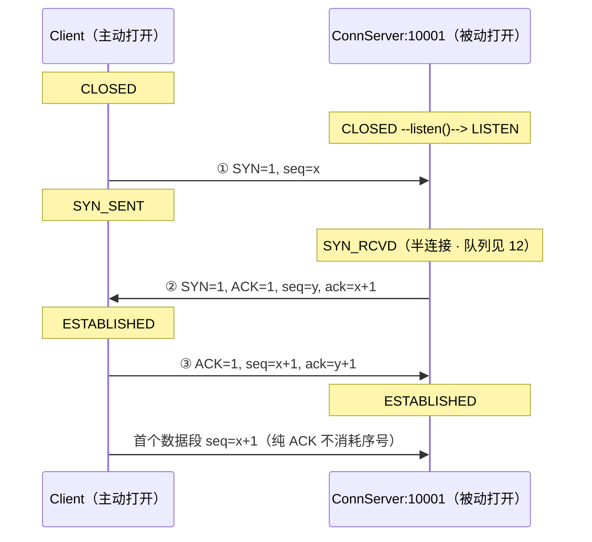
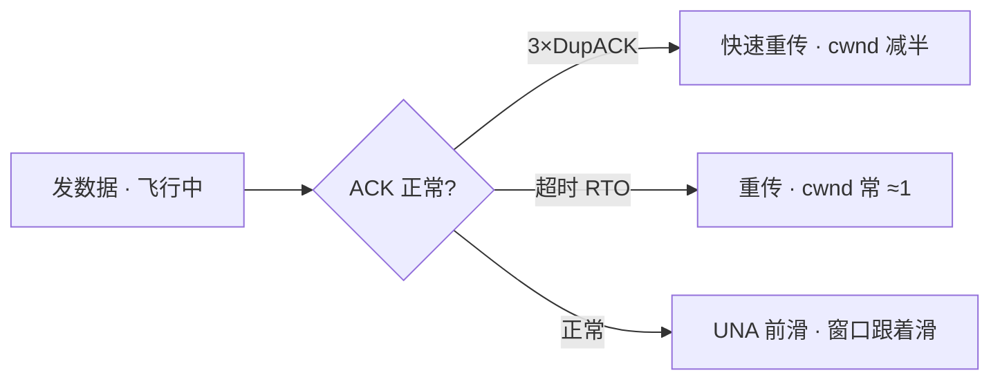
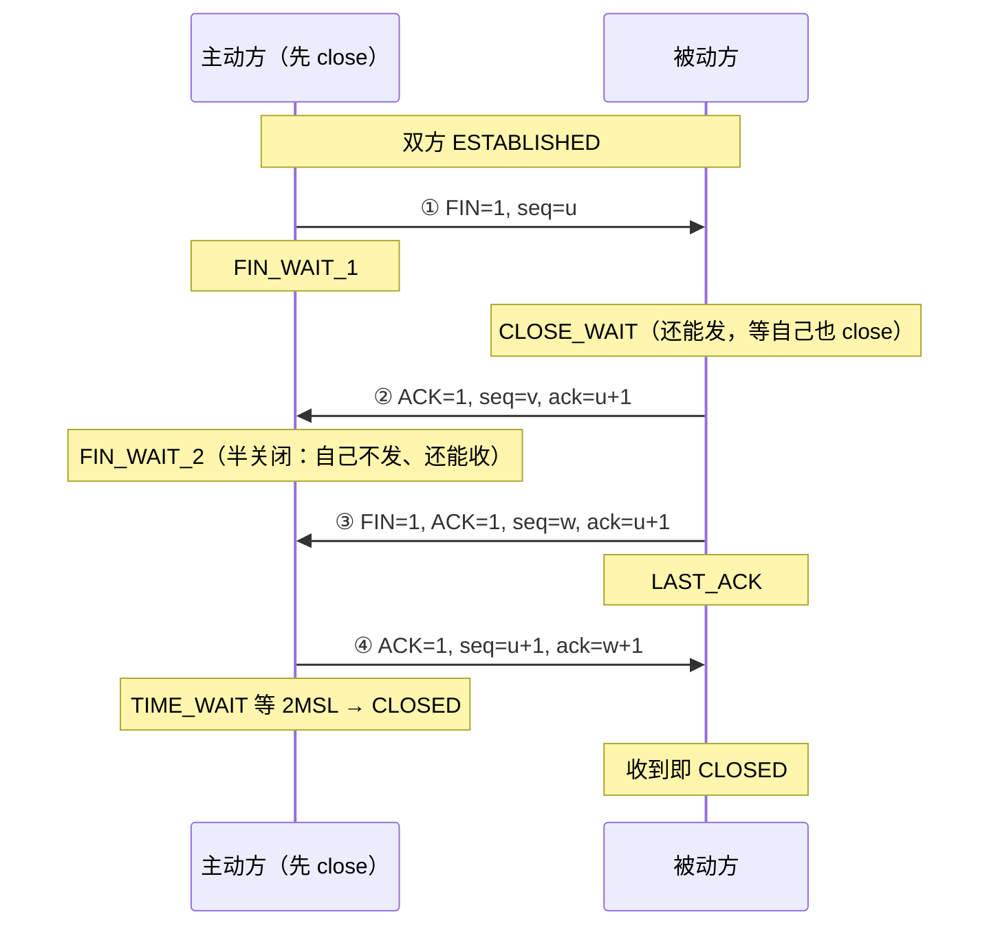
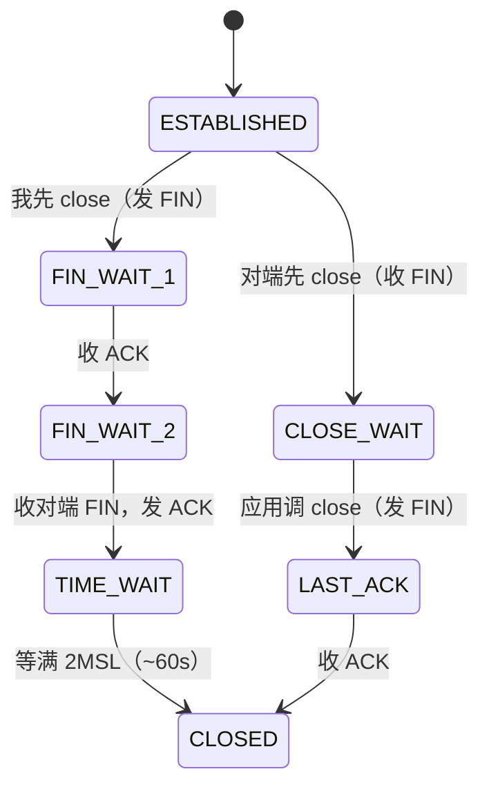
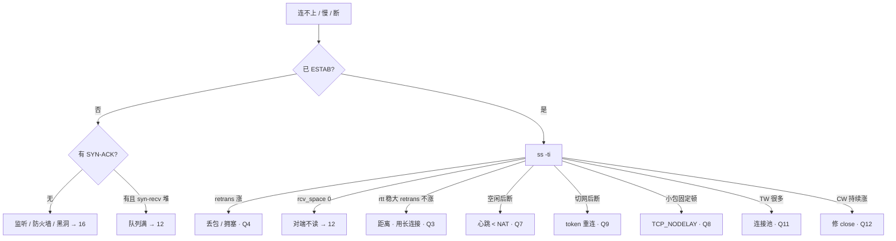

# 13｜TCP 与 UDP · 练习题

开始做题前，先给大家一个小建议：合上知识点，对着**第一节的主图**，把「一条连接的一生」口述一遍（入口能不能丢 → 出生 → 干活 → 老去 → 死亡 → 另一条路）。能顺下来，下面这些题你会发现大半都会了；卡壳的地方，就是你该回去重读的那一节。

做题的方式也建议改一下：每道题**先看标题和场景，自己口述一遍答案，再往下看「完整解答」对答案**。直接看解答，容易产生「我会了」的错觉——能讲出来才是真的会。

| 标记 | 含义 |
|------|------|
| **核心** | 不懂整章就没建立起来 |
| **必会** | 值班和面试都要能讲 |
| **常用** | 线上会反复碰到 |
| **常考** | 白板和追问的高频口径 |

题目的顺序也是有意排的：Q1～Q2 先钉选型与出生；Q3～Q6 干活段；Q7～Q9 老去；Q10～Q12 死亡；Q13～Q14 另一条路与定责收口。

## 本题目录

- [Q1 粘包与拆包](#q1)
- [Q2 为什么是三次握手](#q2)
- [Q3 发送受什么限制](#q3)
- [Q4 超时重传 vs 快速重传](#q4)
- [Q5 ZeroWindow 与 Send-Q](#q5)
- [Q6 队头阻塞与 HTTP/2、HTTP/3](#q6)
- [Q7 游戏心跳与 keepalive](#q7)
- [Q8 小包固定卡 200ms](#q8)
- [Q9 切网四元组死](#q9)
- [Q10 挥手、半关闭、FIN vs RST](#q10)
- [Q11 TIME_WAIT 与四个端口复用选项](#q11)
- [Q12 CLOSE_WAIT vs TIME_WAIT](#q12)
- [Q13 UDP / KCP / QUIC 选型](#q13)
- [Q14 ss -ti 读一行定责](#q14)
- [合上书](#合上书)

---

## Q1

**★★★★★｜TCP 是可靠的，为什么我 `write` 三次，对端一次就全读到了？**

**覆盖**：核心 · 必会 · 常考 ｜ **对应**：知识点 [二、选型：这条道用 TCP 还是 UDP](知识点.md)

### 场景

新协议上线后，战斗服偶发「解析出一个不存在的协议号」然后断开。开发说「TCP 保证可靠，肯定是网络损坏了包」，准备去申请抓包。有人提议「加上 `TCP_NODELAY` 就不粘了」。

就是开头那个「可靠却粘包」的现场。

先自己试试：粘包是网络坏了吗？关 Nagle 管用吗？

### 完整解答

> 🎯 **一句话**：TCP 只保证字节顺序对，**不保证消息边界**——边界必须应用自己划。

TCP 眼里没有「消息」，只有一条连续的字节线，`write` 只是往这条线上追加字节。所以三次 `write` 的内容可能被一次 `read` 全收到（粘包），一条消息也可能分两次才收齐（拆包）：

```text
你以为的：  write("登录")  write("走路")  write("放技能")
            read → "登录"   read → "走路"   read → "放技能"

实际可能：  read → "登录走路放技"      ← 粘包（三条粘一起，还切断了最后一条）
            read → "能"                ← 拆包（上一条的尾巴才到）
```

三个环节都会重组这条字节线：Nagle 把小段攒成一段发，路径 MTU 把大段切成多段发，接收缓冲按到达顺序堆着。**「一次 write = 一次 read」从来不是 TCP 的承诺。**

**三种定界法**，选一种、全链路统一：

```text
① 长度前缀（最常用）  [4字节长度][消息体]  ← 先读满 4 字节知道要读多长，再读满那么多
② 分隔符             消息\n消息\n         ← 简单，但消息体内不能出现分隔符
③ 定长               每条固定 128 字节     ← 最简单，浪费带宽，只适合固定结构
```

正确的读法永远是「**读到缓冲区 → 循环尝试切出完整消息 → 切不出就留着等下次**」，不是「read 一次当一条消息处理」。所以这个故障根本不用抓包——是解析循环写错了。

> ⚠️ **别混**：粘包**不是 bug、不是网络故障**，是字节流的正常语义。`TCP_NODELAY` 只是不攒小包，路径照样会合并/切分，**关了 Nagle 一样粘**。

> 📝 **面试**：问「怎么解决粘包」，别答「关掉 Nagle」，要答「**应用层定界**：长度前缀 / 分隔符 / 定长，配合『收到就循环切、切不完留着』的解析循环」。

### 再追问

**UDP 会粘包吗？**——不会。`sendto` 一次 = 一个报文，`recvfrom` 收到的就是完整一个，天然有边界。代价对称：TCP 帮你保证不丢但要自己定界，UDP 帮你保住边界但丢了没人补（Q13）。**不要**为了「省掉定界代码」把可靠业务改 UDP。

**报文比缓冲区大呢？**——UDP 直接截断，多出来的部分丢弃；TCP 会留着下次读。所以 UDP 收包缓冲要按最大报文开够。

**那 TCP 说的「可靠」到底保证了什么？**——七件套，按「发现 → 解决 → 预防」背：

- **发现**：① 校验和（坏包直接丢）② 序号 `seq`（每个字节可编号）③ 确认 `ack`（累积确认 + SACK 补洞信息）
- **解决**：④ 重传（RTO 超时 + 3 个 DupACK 快速重传）⑤ 排序去重（乱序重排、重复丢弃）
- **预防**：⑥ 流量控制（`rwnd`，别灌爆对端）⑦ 拥塞控制（`cwnd`，别灌爆网络）

边界要一起说清：**可靠 ≠ 不丢包**（网络照样丢，只保证丢了会补齐并**按序**上交）、**≠ 低延迟**（补齐要时间，这就是队头阻塞和 P99 尖刺，Q6）、**≠ 保消息边界**（就是本题的粘包）。**不要**只答「有重传所以可靠」——漏掉后两件会被追问「那 TCP 凭什么不把网络打死」。

---

## Q2

**★★★★★｜为什么是三次握手而不是两次？握手到底交换了什么？**

**覆盖**：核心 · 必会 · 常考 ｜ **对应**：知识点 [三、出生：三次握手](知识点.md)

### 场景

开场就让你画握手。有人答「因为要双方都确认」，追问「两次为什么不行」就卡住。再追问「握手完是不是就万事大吉了」。

白板上只画三根箭头写「我的序号从 x 开始」——这是高频翻车。

先自己试试：你能写出 seq/ack 和两边状态位吗？为什么不是两次？

### 完整解答

> 🎯 **一句话**：两次握手会让 Server 对历史 SYN 建幽灵连接，第三次 ACK 确认「这是我这一次的连接」。

握手交换的是**序号 seq 与确认号 ack**，不是业务数据。白板上要写成标准形式，**两边状态位一个都不能少**：



**逐段官方口径**：

- `x`、`y` 分别是两端的 **ISN（Initial Sequence Number，初始序号）**，内核随机生成。
- `ack` 的语义是「**我期望收到的下一个字节序号**」，是**累积确认**：`ack = 已连续收到的最后一个字节序号 + 1`。
- **SYN 标志位虽不带数据，但要消耗一个序号**——客户端的 SYN 占掉 `x`，所以对端回 `ack=x+1`；服务端的 SYN 占掉 `y`，所以客户端回 `ack=y+1`。带 payload 的段则是 `ack = seq + 数据长度`。
- **纯 ACK 不消耗序号**，所以第一个数据段仍从 `seq=x+1` 开始，写 `seq=x+2` 是错的。
- 状态迁移：Client `CLOSED → SYN_SENT → ESTABLISHED`，Server `CLOSED → LISTEN → SYN_RCVD → ESTABLISHED`。**Client 发完第三个 ACK 就算建立，Server 要收到才算**——这就是「全连接队列满时客户端 ESTAB、服务端却没这条连接」的根源（队列机制见 [12 章](../12-网络栈与Socket/)，对应其练习题 Q4）。
- 状态名有两套：RFC 793 写 `SYN-RECEIVED`（记作 `SYN_RCVD`），Linux `ss` 打印 **`SYN-RECV`**，别当成两个东西。

两次握手时，Server 收到 SYN 就 ESTABLISHED、占 fd 和内存——网络里迟到的历史 SYN 会让它为「不存在的客户端」白开连接，这就是**幽灵连接（ghost SYN）**。第三次 ACK 让 Server 确认对方真的还在。

**顺便协商了什么**：双方各带 `MSS`（每段 payload 上限，~1460）、`wscale`（窗口缩放）、`SACK`、`Timestamp`。这些**只在建连时谈一次**，中途改不了——「建连后想加 SACK」不成立。

**ISN 为什么必须随机**，三个理由：① 防串包（同一四元组反复建连，固定从 0 编号会让旧包落进新连接的序号范围）；② 防序号预测（可被伪造 RST 掐断或注入）；③ 配合端口复用（TIME_WAIT 期间旧四元组还没释放）。

> ⚠️ **别混**：握手成功 ≠ 后面没事。握手只保证「连接状态建立」，后续段照样会丢（Q4）、NAT 照样会清表（Q7）、应用照样可能不读（Q5）。

> 📝 **面试**：别只答「双方都确认」，要答到「**防历史 SYN / 幽灵连接**」。画图时**必须写出 `seq=x` / `seq=y, ack=x+1` / `seq=x+1, ack=y+1` 和两边的状态迁移**，再补一句「SYN 消耗一个序号，所以 ack 是 +1」——只画三根箭头写「我的序号从 x 开始」拿不到分。

### 再追问

**握手卡住怎么定责？**

```bash
ss -ant | grep -E 'SYN-SENT|SYN-RECV'
# 堆 SYN-SENT → 客户端发完 SYN 没等来 SYN+ACK：对端没监听 / 中间丢包
# 堆 SYN-RECV → 服务端回了 SYN+ACK 没等来最后 ACK：对端没回 或 全连接队列满（→12）
```

一句话：**SYN-SENT 往对端查，SYN-RECV 往队列查**，方向反了白忙。队列细节见 [12 章](../12-网络栈与Socket/)。

**SYN Cookie 干什么？**——半连接被 SYN Flood 打满时不占队列槽，把状态编码进 ISN，第三次 ACK 的序号能反推出是哪条半连接。代价：握手协商的选项（wscale/SACK/MSS）存不了。**不要**让正常业务长期靠 Cookie 顶着——那说明你在被打。

---

## Q3

**★★★★★｜TCP 实际能发多快由什么决定？慢启动、拥塞避免、快恢复怎么说清楚？**

**覆盖**：核心 · 必会 · 常用 · 常考 ｜ **对应**：知识点 [四、干活：滑动窗口与重传](知识点.md)

### 场景

跨海玩家技能同步卡，`ss -ti` 里 `rtt:220` 稳、`retrans:0`。有人要换 BBR，有人要加大 `wmem`。API 每次调用都新建连接。

这是干活段的地基题，后面 Q4、Q5 都站在这上面。

先自己试试：发送量受哪两个窗口限制？流控和拥塞控制差在哪？

### 完整解答

> 🎯 **一句话**：能发多少由 `min(rwnd, cwnd)` 决定——一个是对端收不收得下，一个是网络扛不扛得住。

```text
实际可发送 ≈ min( rwnd, cwnd )

   发送方 ──────► 网络 ──────► 接收方
                  ▲              ▲
               cwnd 看这里    rwnd 看这里
             （路上挤不挤）（对端收不收得下）
```

窗口不是「发完一批等下一批」，是「ACK 回来一段就腾一段、再发一段」的流水线：

```text
已确认 |---- 已发未确认（飞行中）----|---- 还能发 ----| 暂时不能发
       ^UNA                          ^NXT            ^右沿 = UNA + min(rwnd,cwnd)
```

ACK 到达 → UNA 右移 → 右沿跟着滑 → 腾出额度继续发。ACK 不回来（丢包）或 rwnd 缩到 0，右沿就停住——**这就是卡顿的微观机制**。

**cwnd 怎么变**：

- **慢启动**：每收一个 ACK，cwnd +1 MSS；一个 RTT 内收 cwnd 个 ACK → 近似**翻倍**，直到 `ssthresh`。
- **拥塞避免**：过了 ssthresh，每 RTT 大约 **+1**。
- **RTO 超时后**：cwnd **≈ 1**，回慢启动——尾延迟大，体感卡一下。
- **3×DupACK 快恢复**：cwnd **减半**，比超时温和。

```text
cwnd
  ▲
  │                                  ____  拥塞避免（每 RTT +1）
  │                          __-----
  │                   __----         ← 3×DupACK：减半（快恢复）
  │            __----
  │      __----  慢启动（每 RTT 翻倍）
  │ __--
  │ *  ← RTO 超时：打回 1，重新慢启动
  └──────────────────────────────────────────► RTT
```

**本例的答案不是换算法**：`rtt` 高且稳、`retrans:0`、`cwnd` 正常 → 这是**距离**。跨海 + 短连接，每条连接都要从慢启动重新爬，「还没爬起来就结束了」。对策是**连接池 / Keep-Alive / 合并请求**。

> ⚠️ **别混**：RTO 之后是 **cwnd ≈ 1**，不是「窗口砍半回慢启动」（砍半是快恢复干的）。加大 `wmem` 只在 **BDP 装不下**时有意义（带宽×RTT，见 [12 章](../12-网络栈与Socket/)），治不了距离。

> 📝 **面试**：`ssthresh:2147483647` 那个大数是 `INT_MAX` 初值 = 一开始没上限、全程慢启动；真正的 ssthresh 是**丢包后**才算出来的（≈ 丢包时 cwnd 的一半）。

### 再追问

**Cubic 和 BBR 到底差在哪，什么时候才该换？**

- **Cubic（默认，丢包驱动）**：把丢包当拥塞信号。在**有随机丢包但不拥塞**的链路（无线、跨境）上会被误伤——没堵也退让；在深队列设备上又会把队列填满才发现丢包（bufferbloat，延迟被推高）。
- **BBR（带宽·时延积驱动）**：主动测量瓶颈带宽和最小 RTT，按 `带宽 × 最小RTT` 定发送量，不等丢包、尽量不填满队列。
- **代价**：与 Cubic 共享链路时可能更「抢」，多流公平性和版本（v1/v2/v3）差异大。

**不要**在没有丢包证据（`retrans` 不涨、无 pcap）时换 BBR——你不知道要治的是「误判丢包」还是「距离」，**换算法治不了距离**。

**流量控制和拥塞控制的区别？**——最高频的混答点，答三点：

| | **流量控制** | **拥塞控制** |
|---|---|---|
| 保护谁 | 对端**主机**别被灌爆 | 中间**网络**别被灌爆 |
| 信息来源 | 对端在 ACK 里**显式通告** `rwnd` | 没人告诉你，从丢包/RTT**自己猜** `cwnd` |
| 范围 | 端到端 | 端到网络 |

两者**同时生效**，实际发送量 = `min(rwnd, cwnd)`。现场判据：`rcv_space` 掉 0 / 抓包见 ZeroWindow = 流控受限（去治对端应用读不动，Q5）；`retrans` 涨 + `cwnd` 趴着 = 拥塞受限（去治丢包路径）。**不要**用「加大缓冲」治拥塞受限——缓冲只抬得动流控那一半。

---

## Q4

**★★★★☆｜超时重传和快速重传区别？为什么是「3 个」DupACK？**

**覆盖**：必会 · 常用 · 常考 ｜ **对应**：知识点 [四、干活：滑动窗口与重传](知识点.md)

### 场景

`ss -ti` 里 `retrans` 在涨，P99 偶发几百毫秒尖刺，玩家是无线网络。有人要加大 `tcp_retries2`「让它自己恢复」。

这是 Q3「窗口」之后的下一刀——丢了怎么补。

先自己试试：RTO 和快重传各自怎么触发、cwnd 怎么变？

### 完整解答

> 🎯 **一句话**：RTO 是等超时才发现丢包、cwnd 打回 ≈1；快重传靠 3 个 DupACK 立刻补、cwnd 只减半。



**读图**：丢包只有两条发现路径——**要么等超时（RTO），要么靠对端的重复确认（DupACK）提前告状**。走哪条决定 `cwnd` 掉多狠：RTO 打回 ≈1 要重新慢启动，DupACK 只减半。正常路径上 `SND.UNA` 往右推，窗口右沿跟着滑。

| 对比 | **RTO 超时重传** | **3× DupACK 快速重传** |
|------|------------------|------------------------|
| 触发 | 等太久没 ACK | 连续收到 3 个重复 ACK |
| 对 cwnd | 通常 **≈ 1** | **减半**，不全打回 1 |
| 体感 | P99 尖刺大 | 相对温和 |

**DupACK 怎么来的**：因为 `ack` 是**累积确认**（`ack` = 我期望收到的下一个字节序号），中间缺一段，后面的段到了也只能一遍遍回同一个 `ack`。用标准序号写一遍（MSS=1000，从 `seq=1001` 起发）：

```text
发送方发出   seq=1001  seq=2001  seq=3001  seq=4001  seq=5001   （每段 1000 字节）
网络         ✅到       ❌丢      ✅到      ✅到      ✅到
接收方回     ack=2001   —        ack=2001  ack=2001  ack=2001   ← 后三个是 DupACK
发送方       连收 3 个 ack=2001 → 断定 seq=2001 那段丢了 → 立即重传，cwnd 减半
```

**读图**：`ack=2001` 的官方语义是「`1001~2000` 我已连续收齐，下一个我要 2001」。`seq=2001` 丢了，之后到达的 `3001/4001/5001` 都无法推进这个累积确认点，于是重复回 `ack=2001`——这些重复的确认就叫 **DupACK（duplicate ACK，重复确认）**。白板上要写 `seq=`/`ack=` 的真实数字，写成 `[1][2][3]` 这种编号图不得分。

**为什么是 3 个**：1~2 个重复 ACK 也可能只是**乱序**（包晚到，没真丢），凑够 3 个丢包的置信度才够。这也是无线网易把延迟当丢包、误伤 cwnd 的原因。

**SACK** 让接收方告诉发送方「哪些段我已经收到了」，重传时只补真丢的段，少重传冤枉段。**RTO 怎么定的**：`RTO = SRTT + 4×RTTVAR`（RTT 平滑均值 + 抖动），超时后指数退避翻倍；`ss -ti` 的 `rto:420` 就是当前值。

### 再追问

**加大 `tcp_retries2` 让它自己恢复行吗？**——**不要**。重试变长 = 故障检测变慢，匹配服务会把已死的连接当成「高延迟」继续派人进去。宁可**快速失败 + 重连**。

**要不要先抓包？**——`retrans` 在涨才谈丢包，涨了再抓包定位丢在哪一跳（[16 章](../16-网络排障与抓包/)）。`retrans` 不涨、`rtt` 稳大的那种是距离（Q3），抓包也抓不出东西。

---

## Q5

**★★★★☆｜ZeroWindow 是什么？和 Send-Q 什么关系？**

**覆盖**：必会 · 常用 ｜ **对应**：知识点 [四、干活：滑动窗口与重传](知识点.md)

### 场景

网关本端 `Send-Q` 堆到 380KB，抓包看到一片 ZeroWindow。有人正在写工单申请加大本机 `wmem`。

这是 Q3 流控受限的现场版。

先自己试试：加大本端 sndbuf 管用吗？该治谁？

### 完整解答

> 🎯 **一句话**：ZeroWindow 是**对端**接收缓冲满、通告窗口 0，本端只能停发——治对端 read，不是加大本端缓冲。

`rwnd` 是接收方把「接收缓冲剩余空间」写在 ACK 的窗口字段里告诉发送方的。缓冲快满就通告变小，变成 0 就是 **ZeroWindow**，发送方立刻停发，本端待发数据只能堆在发送缓冲里 → `Send-Q` 涨。

```text
本端 Send-Q 涨  ←────  对端通告 rwnd=0  ←────  对端应用不 read，Recv-Q 顶满
（现象在这边）              （机制在中间）           （根因在那边）
```

**三种「Send-Q 大但走不动」，对策互斥**：

| 型 | `ss -ti` 签名 | 治哪 |
|----|--------------|------|
| A · ZeroWindow | `rcv_space:0` + `retrans` 几乎不涨 | 治**对端** read（线程/GC/DB 卡住） |
| B · 丢包/拥塞 | `retrans` 涨 + `cwnd` 趴到个位数 | 查**路径** |
| C · 灌得快 | `rtt` 稳 + `retrans:0` + `cwnd` 正常 | 应用灌太快，限流/削峰 |

> ⚠️ **别混**：A 和 B 都会 `Send-Q` 大，但一个治对端、一个治路径，**加大 `sndbuf` 对两者都没用**——路都堵着，把自己的仓库扩大只是堆更多货。

### 再追问

**本端 Recv-Q 涨，对端会看到什么？**——对端 `Send-Q` 涨 + 抓包 ZeroWindow。两边是**同一件事的两端**：谁 Recv-Q 顶满，对面就 Send-Q 堆积。Recv-Q 的字节含义与 LISTEN/ESTAB 两套语义见 [12 章](../12-网络栈与Socket/)。

**什么时候加大缓冲才是对的？**——只有 **BDP 装不下**（带宽×RTT，例 100Mbps×200ms≈2.5MB），且应用确实在读、`retrans` 不涨、吞吐远低于带宽。**不要**把「应用不读」当缓冲不足治，那是往漏桶里灌水。

---

## Q6

**★★★☆☆｜TCP 队头阻塞是什么？上了 HTTP/2 就没有了吗？**

**覆盖**：必会 · 常考 ｜ **对应**：知识点 [四、干活：滑动窗口与重传](知识点.md)

### 场景

移动帧和技能指令复用同一条 TCP。丢一个移动包，技能也发不出去，手感「整条线冻住」。有人说「上 HTTP/2 多路复用就解决了」。

干活段收尾：可靠带来的队头阻塞。

先自己试试：HTTP/2 还堵吗？游戏怎么拆通道？

### 完整解答

> 🎯 **一句话**：一条 TCP 丢一包，后面所有段都要等重传——这是**传输层**的队头阻塞，应用层多路复用消不掉。

```text
同一条 TCP：[移动帧][移动帧][技能指令][移动帧]
                 ↑ 丢了 → 后面的技能指令也得等这段重传回来 → 手感「整条线冻住」
```

TCP 交付给应用必须**按序**，中间缺一段，后面即使已经到了内核缓冲也不能交上去。

> ⚠️ **别混**：HTTP/2「多路复用」解决的是**应用层**队头（一个 HTTP 请求不再堵住后面的请求），底下还是**一条 TCP**，传输层照样堵。HTTP/3 / QUIC 把流做在 UDP 上、流之间独立，才算把传输层队头拆开。

游戏的正解是**拆通道**：TCP 管登录支付（不能丢）/ UDP 管位置（可丢）/ KCP 管弱网关键指令。这是**产品设计**，调 cwnd 调不出来。

### 再追问

**QUIC 在游戏里用得多吗？**——HTTP/3 用它，游戏自研网关多数仍是 TCP/KCP。面试答到「队头阻塞 + 连接迁移」两点即可，是否采用看公司栈（Q13）。

**MSS 和这个有关吗？**——MSS（~1460）只决定每段多大，不决定按序交付。**不要**指望调小 MSS 缓解队头；中间某跳 MTU 更小又遇 ICMP 被墙，那是 PMTUD 黑洞（大包死小包通），去 [16 章](../16-网络排障与抓包/)。

---

## Q7

**★★★★★｜游戏长连接为什么还要应用心跳？内核 keepalive 不够吗？**

**覆盖**：核心 · 必会 · 常考 ｜ **对应**：知识点 [五、老去：为什么「还连着」也断](知识点.md)

### 场景

玩家挂机 8 分钟被踢，`ss -ti` 还显示 ESTAB、字段一切健康。NAT 空闲超时 5 分钟，`tcp_keepalive_time=7200`。有人准备「把 keepalive 调短点」收工。

就是开头「挂机 8 分钟被踢」那个现场。

先自己试试：keepalive、NAT、应用心跳三档各多久？谁该当游戏心跳？

### 完整解答

> 🎯 **一句话**：`ss` 显示 ESTAB ≠ 链路真通——中间设备早把会话拆了，心跳间隔必须 **< 最小中间设备空闲超时**。

三个时间尺度差了两个数量级：

```text
   应用心跳 30s        NAT 空闲 ~5min          内核 keepalive 7200s
   ├────────┤  ├──────────────────┤  ├───────────────────────────►
     ✅ 保活       中间会先把你掐掉             ❌ 当游戏心跳太晚
```

- **应用心跳**：**15–45s**，游戏自己发的小包，✅ 保活。
- **NAT / LB / conntrack 空闲**：**~5min**，中间设备清掉会话，**它决定心跳上限**。
- **`tcp_keepalive_time`**：**7200s**，空闲多久发第一根探针；配套 `tcp_keepalive_intvl`（75s）、`tcp_keepalive_probes`（9 次）。它只负责**清死连接**，不能当游戏心跳。

两端的 TCP 状态机没收到 FIN/RST，自然还是 ESTAB——它记的是「我以为的状态」，不是「路还在」。

**心跳成功也 ≠ 业务健康**。常见坑：网关 IO 线程收下心跳就回 ack，业务线程早卡死在某个 RPC——心跳一直绿，技能全发不出去。探活要分三层：

- **传输层**：socket 通不通 → 应用心跳。
- **进程层**：业务线程活着吗 → **心跳响应走业务线程**，或单独业务探活。
- **依赖层**：下游 DB/RPC 通吗 → 健康检查含下游依赖。

> 🎯 心跳走哪条路径，就只保哪层。走 IO 线程的心跳只保传输层。

> 📝 **面试**：答「NAT ~5min vs keepalive 7200s，所以必须应用心跳 15–45s」，再加一句「而且心跳要经过业务线程，否则只探到 socket」，就比背数字高一档。

### 再追问

**把 `tcp_keepalive_time` 改短代替应用心跳行不行？**——**不要**。① 它是**全机**参数，影响所有连接；② 探针不经过业务线程，检测不到「进程活着但不读业务」；③ 应用心跳还能顺带带业务信息（帧号、RTT 统计）。

**心跳间隔怎么定？**——取链路上**最小**的空闲超时（NAT / LB / 云厂商 SLB 各有一份），再留一半余量。不要按「服务器压力」定，压力问题用心跳合并/降频解决，不是拉长到超过 NAT 超时。

**这种「`ss` 显示 ESTAB 其实早断了」的状态，官方叫什么？和半关闭什么关系？**——叫**半打开连接（half-open connection）**，根因是 TCP 状态机**两端各自维护**：本端的 `ESTABLISHED` 只说明「我这边的状态还没被推翻」。

- **半关闭（half-close）**：**协议规定的正常状态**，一方 `shutdown(SHUT_WR)` 发 FIN 后只收不发（`FIN_WAIT_2` / `CLOSE_WAIT`），双方状态**一致**。
- **半打开（half-open）**：**故障状态**，对端进程崩了/机器断电/NAT 清了表，**没人发过 FIN 或 RST**，本端毫不知情，双方状态已经**不一致**。

**不要**把它当成「TCP 的 bug」——TCP 本来就不做端到端存活检测，这正是应用心跳存在的理由。

---

## Q8

**★★★★☆｜玩家说操作「总在固定间隔顿一下」，`retrans` 是 0，怎么解释？**

**覆盖**：必会 · 常用 · 常考 ｜ **对应**：知识点 [五、老去：为什么「还连着」也断](知识点.md)

### 场景

技能按下到生效偶发多出约 200ms，`ss -ti` 里 `retrans:0`、`rtt` 稳定 30ms。有人怀疑丢包要抓包，有人怀疑是切网。

老去段第二种病：小包固定顿。

先自己试试：~200ms 从哪来？开哪个选项？

### 完整解答

> 🎯 **一句话**：Nagle 攒小包 + 对端延迟 ACK 也在等，两边互相等 → 小操作固定顿一下，可达 ~200ms。

```text
小操作包：应用 write(20B) → Nagle 说「再等等看有没有更多」
          对端延迟 ACK 也在等（攒 40ms 想捎带数据） → 两边互相等 → 体感顿一下（可达 ~200ms）
```

Nagle 的规则是「有未确认的小包在飞，就先攒着不发」；延迟 ACK 的规则是「先不回 ACK，攒一会儿看有没有数据一起捎带」。单独任一个都不致命，**叠起来就死锁式互等**。签名很好认：**顿的时长接近固定**，而且 `retrans:0`、`rtt` 正常。

治法：游戏长连接一律 `setsockopt(TCP_NODELAY, 1)`——**关掉 Nagle**，小包立即发。

> ⚠️ **别混**：Nagle ≠ 丢包（`retrans` 会涨）；Nagle ≠ 切网（四元组变了，连接直接死，不是顿）。三种现象的对策完全不同：

| 现象 | 更像 | 对策 |
|------|------|------|
| 操作总「顿一顿」约固定间隔 | Nagle 小包 | `TCP_NODELAY` |
| 技能偶发卡一下很久 | 丢包超时（Q4） | 查路径，别调握手 |
| 进地铁/切流量必掉 | 切网四元组死（Q9） | token 重连 |
| 挂机一会儿再点就掉 | 心跳 vs NAT（Q7） | 应用心跳 15–45s |

### 再追问

**关了 Nagle 有什么代价？**——小包变多，带宽和 pps 上升。高频小包业务要在**应用层自己合帧**（比如一个 tick 内的操作打成一包），而不是把合并交给 Nagle——应用知道帧边界，Nagle 不知道。

**关了 Nagle 就不粘包了吗？**——不。见 Q1，边界永远要应用自己划。

---

## Q9

**★★★☆☆｜手机从 Wi-Fi 切 4G 后连接怎样？产品要怎么设计？**

**覆盖**：必会 · 常考 ｜ **对应**：知识点 [五、老去：为什么「还连着」也断](知识点.md)

### 场景

玩家进地铁，Wi-Fi 切蜂窝，战斗连接直接死。产品问「TCP 不是可靠协议吗，会不会自动续上」，有人回答「把 keepalive 调大就行」。

就是开头「进地铁必掉」那个现场。

先自己试试：四元组死了加大 keepalive 有用吗？正解是什么？

### 完整解答

> 🎯 **一句话**：源 IP 变 = **四元组变** = 换了一条连接，旧 TCP 无法续，必须重连 + 会话 token。

```text
旧连接（Wi-Fi）： (1.2.3.4:54321  →  Conn:10001)
新网络（蜂窝）： (5.6.7.8:xxxxx  →  Conn:10001)
                ↑ 不是同一条连接；旧序号/窗口状态全部作废
```

一条 TCP 连接由四元组 `(源IP, 源端口, 目的IP, 目的端口)` 唯一确定，序号、窗口、拥塞状态全挂在这个四元组上。源 IP 一变，内核这边找不到对应的 socket，旧连接只能超时或收 RST 死掉。

产品必须做的是**重连 + 会话 token**：断开后客户端带着 token 重新建连，服务端凭 token 把玩家挂回原来的战斗会话，而不是当新登录。

> ⚠️ **别混**：**不要**承诺「TCP 会自动续」，也**不要**用加大 keepalive 来治——keepalive 管的是「探活死连接」，四元组已经死了，探针发给谁都没用。

### 再追问

**QUIC 能解决吗？**——能，它用 **Connection ID** 标识连接、不绑四元组：源 IP 变了，只要带同一个 Connection ID，对端就认这是同一条连接续传。

```text
TCP 切网：  四元组变 → 连接死 → 必须重连 + token
QUIC 切网： 源 IP 变，但 Connection ID 不变 → 连接续传，不用重连
```

但**不要神话**：要客户端和服务端栈都支持 QUIC，游戏自研网关多数仍是 TCP/KCP + token 重连。

**重连要注意什么？**——服务端要能识别「同一玩家的新连接」并清理旧连接（否则旧连接留在 ESTAB/CLOSE_WAIT 占资源），客户端重连要**指数退避 + 抖动**，别全服玩家同一秒一起重连打垮网关。

---

## Q10

**★★★★☆｜四次挥手能变三次吗？半关闭用哪个 syscall？RST 和 FIN 差在哪？**

**覆盖**：必会 · 常用 · 常考 ｜ **对应**：知识点 [六、死亡：挥手与 TIME_WAIT / CLOSE_WAIT](知识点.md)

### 场景

抓包有时只看到三次挥手，有人认为抓漏了。停服时 `kill -9` 直接杀，客户端一片 RST 被当成网络故障上报。还有人问「我 close 了为什么读不到对端的回包」。

死亡段开场：挥手白板题。

先自己试试：四次挥手的 seq/ack 和半关闭怎么说？

### 完整解答

> 🎯 **一句话**：FIN 只表示「我发完了」，可以半关闭；无待发数据时中间的 ACK+FIN 可合并成三次；RST 是粗暴掐断，不保证对端收完。



**逐段官方口径**：`u` 是 A 已发数据的最后一个字节序号 +1；**FIN 和 SYN 一样各消耗一个序号**，所以确认写 `ack=u+1`。报文 3 的 `seq=w` 可能大于报文 2 的 `seq=v`——中间 B 又发了数据，序号往前走了；`ack` 仍是 `u+1`，因为 A 之后确实没再发。最后 A 回 `ack=w+1` 进 `TIME_WAIT`，**只有主动方等 2MSL，被动方收到 ACK 直接 `CLOSED`**。两条状态链：主动方 `ESTABLISHED → FIN_WAIT_1 → FIN_WAIT_2 → TIME_WAIT → CLOSED`，被动方 `ESTABLISHED → CLOSE_WAIT → LAST_ACK → CLOSED`。

**为什么是四次**：B 在 CLOSE_WAIT 期间**还能继续给 A 发数据**，报文 2 与报文 3 之间夹着「B 发完剩余数据 + 应用调 close」这段不确定时长，合不成一个包——所以四次是「两个方向各关一次」。B 恰好没有待发数据时，内核会把 ACK 和 FIN 合成一包 → 抓包就是三次，**是优化，不是抓漏了，也不是标准流程**。

**半关闭必须用 `shutdown`，`close` 做不到**：

```text
shutdown(fd, SHUT_WR)   只关写方向 → 发 FIN，但还能继续 read 对端剩余数据   ← 真正的半关闭
shutdown(fd, SHUT_RD)   只关读方向
shutdown(fd, SHUT_RDWR) 双向都关，但 fd 还在（还要 close 回收）
close(fd)               fd 引用计数 −1；减到 0 才真正关连接、发 FIN
```

典型用法：客户端发完请求 `shutdown(SHUT_WR)` 告诉服务端「请求到此为止」，然后安心读响应。**`close()` 之后你再也读不到对端后续数据**。

| 对比 | FIN 优雅关 | RST 粗暴掐 |
|------|-----------|------------|
| 对端能否收完 | 尽量保证 | **不保证**，缓冲里未读数据常直接丢 |
| 常见原因 | 应用 close | 进程崩溃、端口未听、防火墙拒、`kill -9` 停服 |

停服正确姿势：**停新连接 → 等 in-flight 处理完 → 再关 socket**（[05 章](../05-进程与信号/)）。**不要**直接 `kill -9`，那就是给全服玩家发 RST。

> ⚠️ **别混**：`fork` 后父子进程共享同一个 socket，**只有最后那个 `close` 才发 FIN**——这是「代码里明明 close 了却还在 CLOSE_WAIT / ESTAB」的常见原因。

### 再追问

**白板上必须画到什么程度？**——**四个包的 `seq`/`ack` 和两条状态链都要写全**，再讲清「半关闭」和「无数据时 ACK+FIN 可合并」。只画四根箭头写「我发完了」，或者只答「两个方向各关一次」，都不够。

**主动方为什么还要在 `FIN_WAIT_2` 待着？**——它自己不发了但还能收，等对端把剩余数据发完再发 FIN。这一段的超时是 `tcp_fin_timeout` 管的——**注意它管的不是 TIME_WAIT**（Q11）。

---

## Q11

**★★★★★｜TIME_WAIT 为什么等 2MSL？重启报 `Address already in use` 怎么解？**

**覆盖**：核心 · 必会 · 常考 ｜ **对应**：知识点 [六、死亡：挥手与 TIME_WAIT / CLOSE_WAIT](知识点.md)

### 场景

登录服 TW 几十万，本地端口紧张。发版时 `bind` 报 `Address already in use` 起不来。有人要把 2MSL 改成 5s，有人要开 `tcp_tw_recycle`，有人把 `SO_REUSEADDR` 当成「TW 太多」的解药。

这是 Q10 的端口复用追问展开。

先自己试试：四个选项各管什么？哪个别提？

### 完整解答

> 🎯 **一句话**：2MSL 是一去一回——等 FIN 重传、等旧包消亡；TW 多的真解药是连接池，`SO_REUSEADDR` 只解决重启绑不上。

**MSL = Maximum Segment Lifetime**，一个 TCP 段在网络里能存活的最长时间（协议建议 2 分钟，Linux 按 30s 算）。超过 MSL 的包被认为已在网络中消亡。

**为什么 2MSL 而不是 1MSL**：① 万一最后那个 ACK 丢了，对端会重传 FIN，要留一个 MSL 等它到、主动方还得能回 ACK；② 让本连接的旧序号包彻底消失，避免串进下一条复用同四元组的新连接（和 ISN 随机是同一个防串包主题，Q2）。

**四个名字长得像、管的完全不是一回事**——这是高频混淆点：

| 选项 | 是什么 | 管什么 |
|------|--------|--------|
| `SO_REUSEADDR` | socket 选项 | 允许 `bind` 到「还有 TIME_WAIT 残留」的本地地址——**重启秒起的标准解药** |
| `SO_REUSEPORT` | socket 选项（3.9+） | 允许**多进程同时 LISTEN 同一端口**，内核按哈希分发到各自 accept 队列 |
| `tcp_tw_reuse` | sysctl（客户端侧） | 允许复用处于 TIME_WAIT 的**出站**四元组发起新连接，**依赖 timestamps** |
| `tcp_tw_recycle` | **别用，已删** | 按「对端 IP 时间戳单调递增」判断，**NAT 后面多客户端共用源 IP 会被莫名丢弃**；4.12 已移除 |

所以本例：`bind` 报占用 → 开 `SO_REUSEADDR`（几乎所有框架默认开，没开就是框架配置问题）；TW 几十万 → 上**连接池 / 长连接**，让你少建那么多连接。

> ⚠️ **别混**：`SO_REUSEADDR` 是**进程自己设的 socket 选项**，`tcp_tw_reuse` 是**内核 sysctl**，两个都**不是「关掉 TIME_WAIT」**。

> 📝 **面试**：问「TIME_WAIT 太多怎么办」，答「① 先分清是**客户端侧**（临时端口压力，用连接池/长连接，必要时 `tcp_tw_reuse` + 确认 `tcp_timestamps=1`）还是**服务端侧**（说明服务端在主动关，看是不是 Keep-Alive 没开）；② `SO_REUSEADDR` 解决的是重启绑不上，不是 TW 多；③ 绝不提 `tcp_tw_recycle`」。

### 再追问

**把 2MSL 改短行不行？**——Linux 的 TIME_WAIT 时长由 `TCP_TIMEWAIT_LEN`（=60s）决定，是**编译期常量，sysctl 改不了**。能调的 `tcp_fin_timeout` 管的是 **`FIN_WAIT_2`**，不是 TIME_WAIT——**面试别说串**。真要改就得改内核重编，高并发短连接下还有串包风险，**先改应用**。

**客户端临时端口耗尽的算式？**——临时端口约 32768–60999（≈2.8 万），疯狂短连同一个 `DB:3306` 时源端口是唯一变量，每次 close 留 60s TW → **2.8 万 / 60s ≈ 每秒 466 条**就见底。详见 [12 章](../12-网络栈与Socket/)。

---

## Q12

**★★★★★｜CLOSE_WAIT 和 TIME_WAIT 怎么分工？一台在涨 CW 一台在涨 TW，各治什么？**

**覆盖**：核心 · 必会 · 常考 ｜ **对应**：知识点 [六、死亡：挥手与 TIME_WAIT / CLOSE_WAIT](知识点.md)

### 场景

网关 A 的 TW 几万，网关 B 的 CLOSE_WAIT 一路涨到几千不降。有人准备在两台都调 `tcp_fin_timeout` 收工。

和 Q11 一对：TW 正常、CW 才是泄漏。

先自己试试：谁先 close 进谁？CW 持续涨治什么？

### 完整解答

> 🎯 **一句话**：**谁先 close 谁进 TIME_WAIT，谁忘了 close 谁进 CLOSE_WAIT**——一个多半正常，一个是代码 bug。

状态机只有两条路，看你是不是先 close 的那一方：



**读图**：左线是主动方，终点要空等 2MSL；右线是被动方，**不进 TIME_WAIT**。堵点也只有两处——**CLOSE_WAIT 卡住 = 右线在等应用 `close()`（代码问题）**；**TIME_WAIT 多 = 左线终点在纯等待（多数正常）**。

| 对比 | TIME_WAIT | CLOSE_WAIT |
|------|-----------|------------|
| 谁 | **主动**关闭方 | **被动**关闭方 |
| 等什么 | 2MSL（内核自己会消） | 应用 `close()`（**不 close 一直挂**） |
| 多了怎么治 | 连接池 / Keep-Alive | **修代码** |

所以本例两台的处方完全不同：A 上连接池；B 去找「收到 FIN 后没 close 的那段代码」——常见是异常路径没走到 `close`、连接池归还时漏了、或 `fork` 后还有另一份引用（Q10）。

> ⚠️ **别混**：**调 `tcp_fin_timeout` 盖不住 CLOSE_WAIT**——它管 `FIN_WAIT_2`，跟 CW 一点关系没有。CW 只有应用调 `close()` 才会走。也**不是**「客户端一定 TW、服务端一定 CW」的铁律，服务端主动踢人时 TW 就在服务端。

### 再追问

**怎么快速找出 CW 堆在哪个进程？**

```bash
ss -antp state close-wait | awk '{print $NF}' | sort | uniq -c | sort -rn
# 输出形如： 3820 users:(("connserver",pid=1234,fd=...))   # ← 数量最多的那个进程就是漏 close 的
```

在 `ss` 上怎么认进站/出站、TW/CW 的完整认法见 [12 章](../12-网络栈与Socket/)。

**游戏网关该谁主动关？**——**统一由一方关**（通常网关，或按协议明确规定），避免两端同时主动关导致状态难读。谁主动关谁背 TW，这是设计时就该定的事。

---

## Q13

**★★★★☆｜什么时候用 UDP，什么时候上 KCP？KCP 为什么必须限速？**

**覆盖**：必会 · 常用 · 常考 ｜ **对应**：知识点 [七、另一条路：UDP / KCP / QUIC](知识点.md)

### 场景

策划要把所有战斗协议改 KCP「更流畅」，支付回调也想走同一条通道。弱网测试里带宽打满后反而**更卡**。

回到选型入口，也呼应 Q1「UDP 不粘包」。

先自己试试：能不能丢？KCP 为什么必须限速？

### 完整解答

> 🎯 **一句话**：第一问永远是「包丢了业务能不能自己补」，不是「谁更快」；KCP 只把重传做激进，**不解决带宽不够**。

```text
包丢了，业务能不能自己补？
  ├─ 不能（钱、登录态、关键指令）→ TCP / HTTPS
  ├─ 能（位置、特效，下一帧覆盖）→ UDP
  └─ 不能丢，但弱网下 TCP 尾延迟不可接受
        → 评估 KCP（必须限速）；支付/登录仍走 TCP
```

**UDP 是什么都不给你**：头只有 8 字节（源/目的端口、长度、校验和），没有序号 → 无法排序去重；没有窗口 → 没有流控；没有标志位 → 没有连接状态。它天然有报文边界（不粘包，Q1），代价是丢了没人补、灌太快没人拦。

**KCP 为什么必须限速**：它把可靠做在用户态，重传更激进、**不退让**，但**看不到全网拥塞**——不像 TCP 有 cwnd 根据丢包回退。

> 💡 **打个比方**：弱网玩家下行就 2Mbps，KCP 默认无限速狂灌 5Mbps → 下游路由器队列爆 → KCP 自己的包被丢 → KCP 更卖力重传 → 队列更爆 → 丢得更多。带宽没变，延迟雪崩，**比 TCP 还卡**。这就是「带宽打满后更卡」的全部原因。

限速三招：① **应用层发送上限**（按玩家下行带宽估 1.2~1.5×，超了主动丢/延）；② 开 **KCP 自带拥塞控制**（牺牲一点尾延迟换稳定）；③ **分通道限速**（可丢的位置包不限速，不可丢的关键指令走小通道 + 限速）。

> 📝 **面试**：「KCP = 弱网银弹，全改 KCP 就流畅」——错。要答「拆可丢/不可丢，KCP 只用在『不可丢且 TCP 尾延迟不可接受』的那一小段，且必须限速；支付登录仍走 TCP」。

### 再追问

**「UDP 一定比 TCP 快」对吗？**——不对。无可靠层时它只是「不管丢」；业务自己补可靠（序号、去重、重传）可能比 TCP 更慢更烂。**不要**把「省掉握手」当性能收益。

**为什么 DNS/DHCP 用 UDP？**——一问一答报文小，建 TCP 握手反而贵，丢了客户端重发一次即可；DHCP 更特殊——客户端连 IP 都没有，走不了 TCP，只能 UDP 广播。

**纯 UDP 会不会被墙？**——会。公司/运营商出口只放行 443 时纯 UDP 可能不通，上线前要做**多网络环境实测 + TCP 兜底通道**。

---

## Q14

**★★★★☆｜给你一行 `ss -ti` 输出，说出这条连接卡在哪、该找谁**

**覆盖**：必会 · 常用 · 常考 ｜ **对应**：知识点 [八、作战：`ss -ti` + 定责](知识点.md)

### 场景

值班收到「卡/慢/断」报障。有人第一反应就是抓包，抓了 2GB pcap 还是不知道找谁。

把前面干活/老去的结论收成 60 秒定责——就是开头那个现场的正确解法。

先自己试试：ss -ti 三对照各看什么字段？

### 完整解答

> 🎯 **一句话**：日常先 `ss -ti` 定型（距离 / 丢包 / ZeroWindow），三种型对策互斥，定型了再决定要不要抓包。

只看三样：**`retrans` 涨不涨、`rtt` 稳不稳、`rcv_space` 是不是 0**。

**A · 距离型（别当丢包治）**

```text
ESTAB  0  0  10.0.0.8:10001  118.69.x.x:44102
  cubic rtt:220.1/12.0 cwnd:40 ssthresh:40
  bytes_sent:800000 bytes_acked:800000 retrans:0/0 rcv_space:65535
# ← rtt 高且稳、retrans 0、cwnd 正常 → 物理/跨境延迟。治连接复用（长连接、合并请求），别每 API 新建连。
```

**B · 丢包/拥塞型**

```text
ESTAB  0  120000  10.0.0.8:10001  118.69.x.x:44102
  cubic rtt:85.0/60.2 cwnd:2 ssthresh:18
  bytes_sent:2100000 bytes_acked:1980000 retrans:48/120 rcv_space:65535
# ← rtt 方差大、retrans 高、cwnd 趴到个位数 → 路径质量或对端问题。先两端对比，再抓包（16）。
```

**C · ZeroWindow 型**

```text
ESTAB  0  380000  10.0.0.8:10001  203.0.113.88:54321
  cubic rtt:40.0/8.0 cwnd:55
  bytes_sent:15000000 bytes_acked:14620000 retrans:1/3 rcv_space:0
# ← Send-Q 很大、rcv_space 0、retrans 未必高 → 治对端 read（12），不加大本端 wmem。
```

**字段速记**：`rtt:平均/方差` · `cwnd` 拥塞窗口 · `ssthresh` 慢启动阈值（新连接常 INT_MAX）· `retrans:近期/累计`（**关键是「在涨吗」**）· `rcv_space` 掉到 0 想 ZeroWindow · `wscale:7,7` 窗口缩放（×128）· `bytes_sent − bytes_acked` ≈ 飞行中未确认。

**定责决策树**：



**读图**：第一刀先分「有没有进 ESTABLISHED」——没进就是出生段的事（监听/防火墙/队列），进了才轮到 `ss -ti` 照干活段。左半边靠**状态位**判（`SYN-SENT` 还是 `SYN-RECV` 堆着），右半边靠**字段**判（`retrans` / `rcv_space` / `rtt` 三个）。分支互斥，先定型再动手。

> ⚠️ **别混**：`Send-Q` 大**不等于**网络慢——A 型和 C 型都会大，一个治路径一个治对端，加大 `sndbuf` 对两者都没用（Q5）。

### 再追问

**60 秒剧本怎么走？**

```text
① 0–10s  连不上还是慢？  ss -ant 看堆在哪个状态：SYN-SENT / SYN-RECV / ESTAB / TIME-WAIT
② 10–30s 已 ESTAB 还慢？ ss -ti dst <对端> 看三样：retrans 涨不涨 / rtt 稳不稳 / rcv_space 是不是 0
③ 30–45s 定型：A 距离型（rtt 稳大 retrans 0）/ B 丢包型（retrans 涨 cwnd 趴）/ C ZeroWindow（rcv_space 0）
④ 45–60s 定责 + 验证：A 治连接复用 · B 两端对照再抓包 · C 治对端 read
```

**什么时候才该抓包？**——定型为 B（丢包）且要**确认丢在哪一跳**时。**不要**在 A / C 型上抓包，抓出来只会看到「延迟大」「窗口 0」，还是回到同一个结论，白烧时间。抓包手法见 [16 章](../16-网络排障与抓包/)。

---

## 合上书

对齐知识点「合上书」，逐条口述，卡住就回对应节 / 题号。现在再看开头那个现场——挂机被踢、切网必掉、小包顿——你该知道三个人各自错在哪了。


- [ ] **默画一节的图**：入口（能不能丢）→ 出生 → 干活 → 老去 → 死亡；另一条路（UDP/KCP/QUIC）；`ss -ti` 照哪段。
- [ ] **口述选型与粘包**：怎么选 TCP/UDP、为什么 TCP 会粘包、三种定界法、UDP 为什么不粘包。（Q1 · Q13）
- [ ] **默画出生**：三次握手**逐段写出 `seq`/`ack` 与两边状态位**（`CLOSED→SYN_SENT→ESTABLISHED` / `CLOSED→LISTEN→SYN_RCVD→ESTABLISHED`），并说清为什么是 `+1`。（Q2）
- [ ] **口述出生**：TCP 头有哪些字段、握手交换什么、ISN 为何随机、为什么不是两次、握手卡住看 SYN-SENT vs SYN-RECV。（Q2）
- [ ] **口述干活**：滑动窗口是什么、为什么要有、min(rwnd,cwnd)、RTO vs 快重传、慢启动为何翻倍、Cubic vs BBR 差在哪。（Q3 · Q4）
- [ ] **默画可靠性七件套**：校验和/序号/确认/重传/排序去重/流量控制/拥塞控制，按「发现—解决—预防」分组；说清流控与拥塞控制差在哪、为什么「可靠 ≠ 不丢包、≠ 低延迟、≠ 保消息边界」。（Q1 · Q3）
- [ ] **口述老去**：心跳 vs NAT vs keepalive 三档、半打开 vs 半关闭、切网四元组死、Nagle、三种断线怎么分。（Q7 · Q8 · Q9）
- [ ] **默画死亡**：四次挥手**逐段写出 `seq`/`ack`** 与两条状态链（`FIN_WAIT_1→FIN_WAIT_2→TIME_WAIT→CLOSED` / `CLOSE_WAIT→LAST_ACK→CLOSED`），说清为什么是四次、谁等 2MSL。（Q10 · Q12）
- [ ] **口述死亡**：`shutdown(SHUT_WR)` vs `close`、MSL 是什么、为何 2MSL、TW vs CW。（Q10 · Q11 · Q12）
- [ ] **口述端口复用**：`SO_REUSEADDR` / `SO_REUSEPORT` / `tcp_tw_reuse` / `tcp_tw_recycle` 各管什么、哪个别用。（Q11）
- [ ] **口述另一条路**：UDP 头多简单、无流控、KCP 必须限速、QUIC Connection ID 迁移。（Q13 · Q9）
- [ ] **定责**：`ss -ti` 三对照（距离/丢包/ZeroWindow）各看什么字段、各走哪条。（Q14 · Q5 · Q6）
- [ ] **边界**：队列/Recv-Q/TW·CW 认法去 [12](../12-网络栈与Socket/)；抓包、MTU/PMTUD 去 [16](../16-网络排障与抓包/)；优雅停服去 [05](../05-进程与信号/)。
