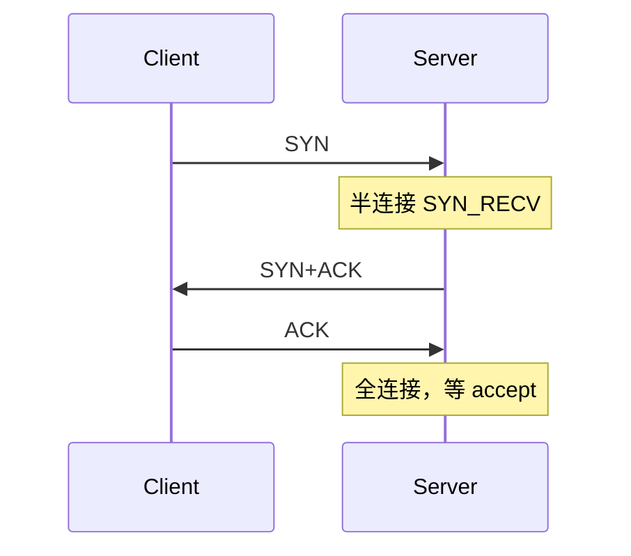
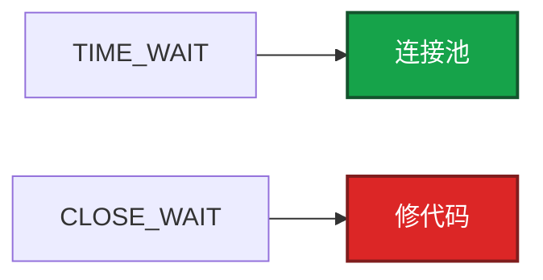
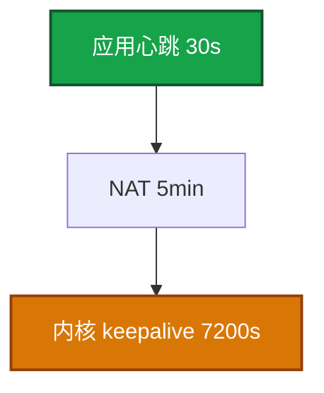

# 13｜TCP 与 UDP · 练习题

先对照 [知识点](知识点.md) **§2 总图 + §6 窗口重传** 口述，再对答案。

| 标记 | 含义 |
|------|------|
| **核心** | 不懂整章就没建立起来 |
| **必会** | 值班和面试都要能讲 |
| **常用** | 线上会反复碰到 |
| **常考** | 白板和追问的高频口径 |

## 本题目录

- [Q1 三次握手](#q1)
- [Q2 TIME_WAIT 与 2MSL](#q2)
- [Q3 CLOSE_WAIT vs TIME_WAIT](#q3)
- [Q4 慢启动 / 拥塞](#q4)
- [Q5 游戏心跳](#q5)
- [Q6 超时 vs 快速重传](#q6)
- [Q7 UDP / KCP](#q7)
- [Q8 ZeroWindow](#q8)
- [Q9 队头阻塞](#q9)
- [Q10 挥手 / RST](#q10)
- [Q11 切网](#q11)
- [合上书](#合上书)

---

## Q1

**★★★★★｜为什么是三次握手而不是两次？**

**覆盖**：核心 · 必会 · 常考

**对应**：知识点 §5.2

### 场景

开场就让你画握手。有人答「因为要双方都确认」。追问「两次为什么不行」。

### 完整解答

**一句话**：两次握手会让 Server 对历史 SYN 建幽灵连接，第三次 ACK 确认「这次」的 SYN+ACK。

两次时 Server 收到 SYN 就 ESTABLISHED 并占资源。网络里迟到的历史 SYN 会造成幽灵连接。第三次 ACK 让 Client 确认「这是我这次的 SYN+ACK」。

半连接溢出表现像丢包。全连接在第三次之后。细节队列见 12。

### 再追问

SYN Cookie 干什么？——半连接满时不占队列槽，把状态编码进序列号。防 SYN Flood。正常负载不应长期靠 Cookie。

---

## Q2

**★★★★★｜TIME_WAIT 为什么等 2MSL？过多怎么处理？**

**覆盖**：核心 · 必会 · 常考

**对应**：知识点 §7 · 认法细节见 12 §7

### 场景

短连接客户端 TW 几十万，本地端口耗尽。有人要把 2MSL 改成 5s，或开 recycle。

### 完整解答

**一句话**：TIME_WAIT 等 2MSL 保证最后 ACK 可达且旧包消失；过多用连接池和 tw_reuse。

保证最后 ACK 可达（对端重传 FIN 一轮来回）+ 旧包从网络消失。主动关闭方才有 TW。2MSL 常见 60s。

过多：Keep-Alive / 连接池；客户端 `tw_reuse`（要 timestamps）；不要 recycle（已删除，NAT 有害）。服务端若主动关大量短连接，TW 会堆在服务端。游戏应让连接复用，由网关统一生命周期。

### 再追问

把 2MSL 改成 5s 行吗？——高并发短连接有串话风险。先改应用。别把调时间当第一方案。

---

## Q3

**★★★★★｜CLOSE_WAIT 和 TIME_WAIT 怎么分工？**

**覆盖**：核心 · 必会 · 常考

**对应**：知识点 §7 · 例子见 12 §7

### 场景

一台 TW 多，一台 CW 在涨。有人准备在两台都调 `tcp_fin_timeout`。

### 完整解答

**一句话**：TIME_WAIT 在主动方等 2MSL，CLOSE_WAIT 是被动方没 close——处理完全不同。

TW=主动方正常等待。CW=被动方收到 FIN 未 close，泄漏。处理完全不同：一个调连接模型，一个改代码。调内核时间盖不住 CLOSE_WAIT。

### 再追问

游戏网关该谁主动关？——统一由一方关（通常网关或按协议规定），避免两端同时主动关，状态难读。见 12 排 CW 堆积。

---

## Q4

**★★★★★｜慢启动、拥塞避免、快速恢复怎么说清楚？实际发送受什么限制？**

**覆盖**：核心 · 必会 · 常用

**对应**：知识点 §6.2 · §6.3

### 场景

跨海玩家技能同步卡。有人要换 BBR。短连接每次都在爬窗口。

### 完整解答

**一句话**：发送受 min(rwnd,cwnd) 限制；超时砍窗回慢启动，3 DupACK 走快速恢复。

慢启动：cwnd 每 RTT 翻倍，到 ssthresh。拥塞避免：每 RTT +1。超时：窗口砍半并回到慢启动（尾延迟大）。3 DupACK：快速恢复，从半窗口继续，跳过慢启动。发送 = min(rwnd, cwnd)。

跨海 RTT 大，慢启动爬坡久，短连接每次都爬 → 要用长连接。丢包误判（无线）会把 cwnd 打下去。默认 Cubic 够用。BBR 要压测，不是背名词。没有 pcap 不要调拥塞算法。

### 再追问

BBR 和 Cubic 怎么选？——默认 Cubic。高带宽高延迟可评估 BBR，用数据说话。

---

## Q5

**★★★★★｜游戏长连接为什么还要心跳？内核 keepalive 不够吗？**

**覆盖**：核心 · 必会 · 常考

**对应**：知识点 §8.1

### 场景

玩家挂机 8 分钟被踢。TCP 状态还是 ESTAB。NAT 超时 5 分钟。`tcp_keepalive_time=7200`。

### 完整解答

**一句话**：NAT/LB 空闲超时分钟级，内核 keepalive 默认 2 小时——必须应用心跳 < NAT 超时。

NAT / LB / conntrack 空闲超时往往分钟级，内核 keepalive 默认 2 小时。中间设备先发 RST。必须应用层心跳，间隔小于最小中间超时。游戏常见 17–45s，是为了 NAT，不是为了 TCP 状态机。

心跳还能检测逻辑死（进程活着不读包）。只靠 TCP ESTAB 看不出业务卡死。

只靠内核 → 中间设备先掐。

### 再追问

心跳包用 TCP keepalive 选项替代行不行？——默认太慢。即使把 `tcp_keepalive_time` 改短，也检测不到「进程活着但不读业务」。应用层心跳同时保连接和保活业务。

---

## Q6

**★★★★☆｜超时重传和快速重传区别？**

**覆盖**：必会 · 常用

**对应**：知识点 §6.4

### 场景

`ss -ti` 里 retrans 在涨。P99 偶发几百毫秒。无线网络。

### 完整解答

**一句话**：超时重传等 RTO 指数退避尾延迟大，快速重传看 3 个 DupACK 立刻补包。

超时等 RTO，指数退避，尾延迟大。快速重传看 3 个重复 ACK，立刻补包。SACK 只重传丢失段。`ss -ti` 看 rtt / cwnd / retrans。

无线容易误判丢包，把 cwnd 打下去。抓包确认是丢包再谈参数（11）。

### 再追问

加大 tcp_retries2 让它自己恢复？——不要。重试变长等于故障检测变慢，匹配会把死连接当高延迟。宁可快速失败重连。

---

## Q7

**★★★★☆｜什么时候用 UDP，什么时候上 KCP？**

**覆盖**：必会 · 常用 · 常考

**对应**：知识点 §4 · §9

### 场景

策划要把所有战斗协议改 KCP「更流畅」。支付回调也有人提议走同一条通道。弱网测试带宽打满后更卡。

### 完整解答

**一句话**：可丢状态走 UDP，弱网可靠且 TCP RTO 不可接受走 KCP；登录支付用 TCP/HTTPS。

状态可丢（位置、特效）用 UDP。必须到达且 TCP 在弱网下 RTO / 队头阻塞不可接受，用 KCP / 可靠 UDP，并做发送限速。登录支付用 TCP/HTTPS。

KCP 更激进，换带宽/CPU 换延迟。激进重传打满带宽，自己造成丢包，就会更卡。要有拥塞控制和上限。不要全部改 KCP 当银弹。

### 再追问

KCP 一定比 TCP 快？——弱网可能快，也可能打满带宽更卡。先测 RTT/丢包下的尾延迟。公司出口只放行 443 时纯 UDP 可能被墙。

---

## Q8

**★★★★☆｜ZeroWindow 是什么？和 Send-Q 什么关系？**

**覆盖**：必会 · 常用

**对应**：知识点 §6.2 · Recv-Q 见 12 §5

### 场景

本端 Send-Q 堆积。抓包看到 ZeroWindow。有人加大 sndbuf。

### 完整解答

**一句话**：ZeroWindow 是对端 Recv-Q/窗口耗尽，本端 Send-Q 堆积，治对端消费。

接收窗口 0，发送方停发。对端应用不 read，Recv-Q / 窗口耗尽。本端看到 Send-Q 堆积。治对端消费，不调本端 sndbuf 当根因。Recv-Q 含义见 12。

### 再追问

本端 Recv-Q 涨会让对端看到什么？——对端 Send-Q 涨、抓包 ZeroWindow。两边是同一件事的两端。

---

## Q9

**★★★☆☆｜TCP 队头阻塞和 HTTP/2、游戏多路复用的关系？**

**覆盖**：必会 · 常考

**对应**：知识点 §6.7

### 场景

移动和技能指令复用同一条 TCP。丢一个移动包，技能也卡住。有人说上了 HTTP/2 就没有队头阻塞。

### 完整解答

**一句话**：一条 TCP 丢包会堵所有 stream，HTTP/2 仍有传输层队头阻塞。

一条 TCP 丢包，后续段都要等。HTTP/2 多流仍跑在一条 TCP 上，传输层仍阻塞。HTTP/3 / QUIC 流独立。游戏把移动和可靠指令复用同一 TCP 时，移动丢包会拖指令——这是拆 UDP+TCP 或 KCP 多通道的原因。

### 再追问

QUIC 游戏里用得多吗？——HTTP/3 用它。游戏自研多数仍是 TCP 或 KCP。答到「队头阻塞和连接迁移」即可。

---

## Q10

**★★★☆☆｜四次挥手能否变成三次？RST 和 FIN 的差别？**

**覆盖**：必会 · 常用

**对应**：知识点 §5.4

### 场景

抓包有时看到三次挥手。停服时客户端全是 RST，被当成故障。

### 完整解答

**一句话**：无待发数据时 ACK+FIN 可合并成三次挥手；RST 是异常终止不保证收完。

没有待发数据时 ACK+FIN 可合并。RST 是异常终止，不保证对端收完数据，缓冲区可丢。正常下线用 FIN 优雅关；进程崩溃、端口未听、防火墙常 RST。TERM 后停新连接、等 in-flight、再关 socket，否则客户端全是 RST（02）。

### 再追问

必须画四次包才算对吗？——能讲清半关闭和「无数据可合并」就对。死磕四次包没有必要。

---

## Q11

**★★★☆☆｜手机切 Wi-Fi 后 TCP 连接怎样？产品要怎么设计？**

**覆盖**：必会 · 常考

**对应**：知识点 §8.2 · §8.3

### 场景

玩家进地铁 Wi-Fi 切 4G，战斗连接死了。产品问「TCP 会不会自动续」。

### 完整解答

**一句话**：切网四元组失效连接必死，要重连+会话恢复；实时操作必须 TCP_NODELAY。

源 IP 变，四元组失效，连接死。要重连 + 会话令牌恢复；可考虑 QUIC 迁移。不要承诺「TCP 自己会续」。

### 再追问

Nagle 和这个有关吗？——无关。切网是四元组变了。Nagle 是小包延迟：实时操作必须 `TCP_NODELAY`，否则 50 字节操作包被攒到 40ms；和对端延迟 ACK 叠在一起会「200ms 卡一下」。

---

## 合上书

对齐知识点「合上书」：

- [ ] **默画 §2.0** 全章串图
- [ ] **口述** 三次握手 / 为何不两次 / 发数据是否重复握手 / min(rwnd,cwnd) / RTO vs 快重传
- [ ] **定责 §11** 挂机踢 / 切网 / retrans / ZeroWindow / 小包卡
- [ ] **边界** 抓包、MTU、队列、Recv-Q 各去哪章
