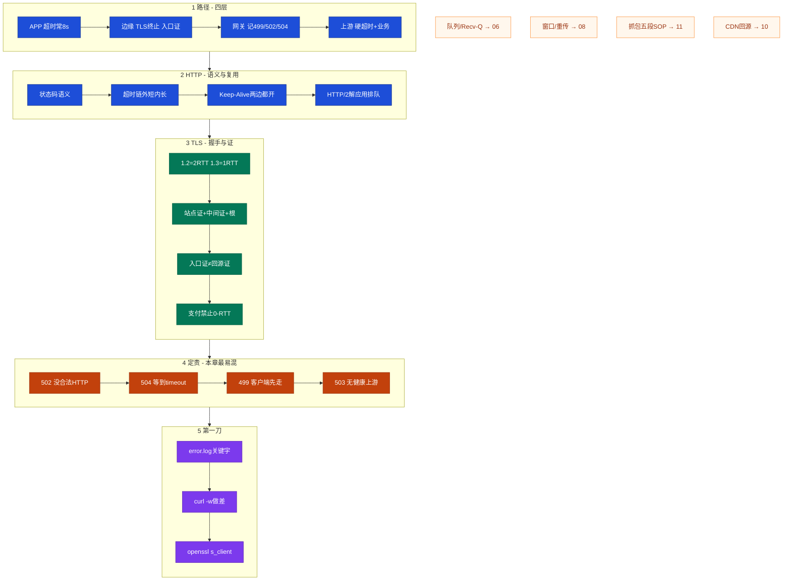
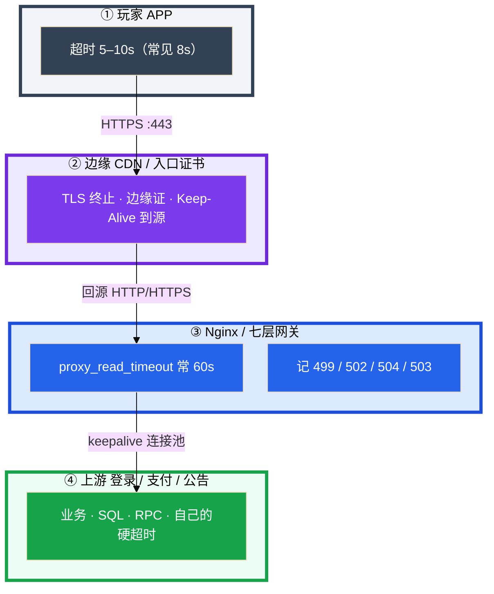
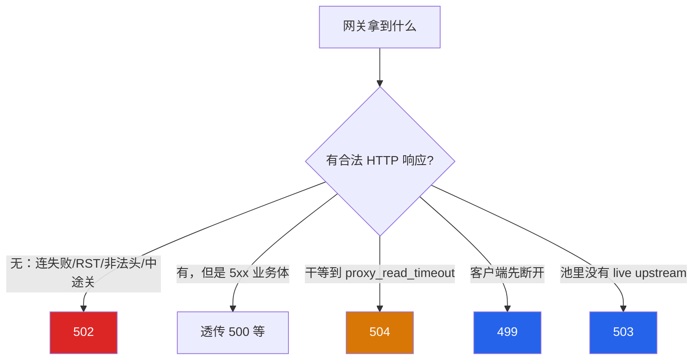
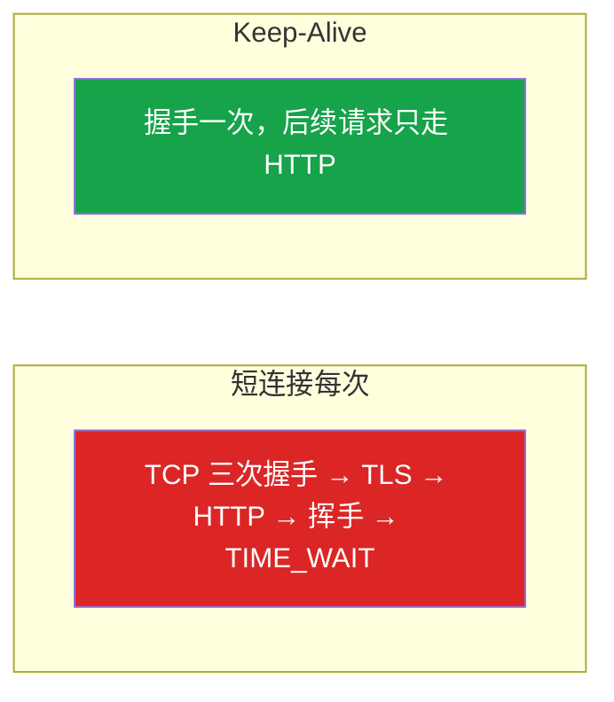
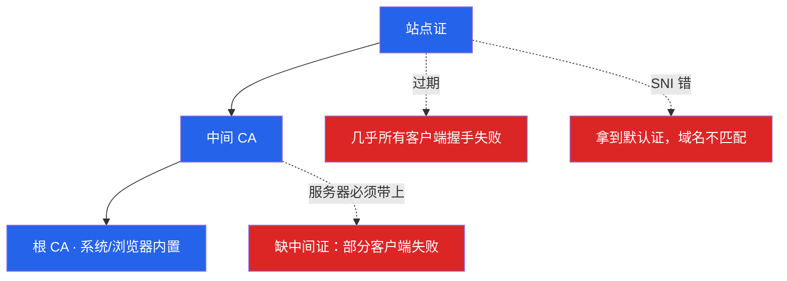
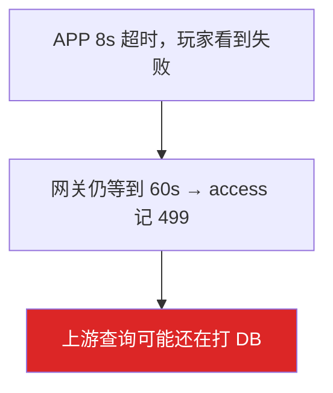
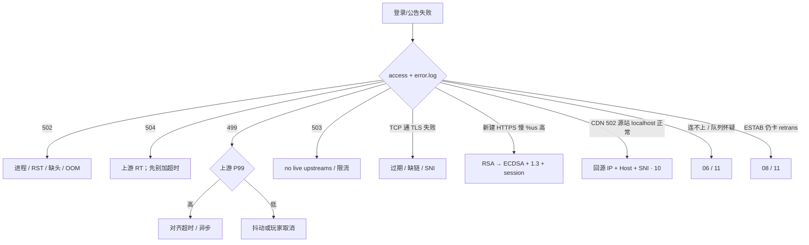

# HTTP 与 TLS

> **这章解决什么**：活动开了，登录刷失败——码写在网关 access.log 里（499/502/504），痛发生在**最先超时 / 最先断**的那一层；还是证书链、握手 CPU、回源证？  
> **读法**：**先看总图** → **再认名词** → **再分节抠语义 / TLS / 499·502·504**。  
> **刻意不展开**：包怎么进主机、Recv-Q/backlog → [12](../12-网络栈与Socket/)；窗口 / 重传 / 心跳 → [13](../13-TCP与UDP/)；`curl -w` 五段完整 SOP、tcpdump 手法 → [16](../16-网络排障与抓包/)；DNS / CDN 回源风暴 → [15](../15-DNS与CDN/)；Nginx 指令细节 → [19](../19-Nginx/)。

---

## 本章目录

1. [本章定位](#1-本章定位)
2. [先看总图：HTTPS 请求在链路上怎么走](#2-先看总图https-请求在链路上怎么走) ← **开篇必读**
   - [2.0 全章知识串图](#20-全章知识串图一张把细节串起来) ← **架构总览**
   - [2.1 四层坐标系](#21-四层坐标系app--边缘--网关--上游)
   - [2.2 三种断法](#22-三种断法502--504--499)
   - [2.3 完整走读](#23-完整走读一次-https-登录从-dns-到-502) ← **一例钉死**
   - [2.4 和邻章怎么接力](#24-和邻章怎么接力一张表)
3. [名词扫盲（对照总图认词）](#3-名词扫盲对照总图认词)
4. [HTTP 语义 / 状态码 / Keep-Alive](#4-http-语义--状态码--keep-alive生产必会)
5. [TLS 握手与证书](#5-tls-握手与证书易混或重点) ← **重点精读**
6. [499 / 502 / 504 定责：本章最易混](#6-499--502--504-定责本章最易混) ← **重点精读**
7. [命令：curl / openssl 读法](#7-命令curl--openssl-读法)
8. [定责决策树与命令速查](#8-定责决策树与命令速查)
9. [去哪章继续学](#9-去哪章继续学)
10. [面试 · 易错 · 数字](#10-面试--易错--数字)
11. [合上书](#合上书)

---

## 1. 本章定位

| 章 | 负责 |
|----|------|
| **06** | 包怎么走、怎么进主机、Socket/队列、本机「满」了怎么定责 |
| **08** | TCP/UDP：握手、窗口、重传、心跳；战斗长连接 |
| **09（本章）** | **HTTP 语义、超时链、Keep-Alive、TLS/证书、499/502/504 定责** |
| **10** | DNS / CDN 回源、HIT/MISS、TTL |
| **11** | 抓包手法、`curl -w` 五段完整 SOP、路由/MTU |
| **23** | Nginx timeout / upstream keepalive / 限流 / reload |

本章是**应用入口层主场**。06/08 告诉你「连没连上、传输卡不卡」；本章告诉你「已经是 HTTPS 了，码是谁写的、证是哪一套、超时谁先放手」。

🎯 **值班签名**：登录 5xx——先分 499/502/504（error.log 关键字），**禁止**一看到 502 就查登录 SQL。

玩家点「登录」。这条 HTTPS 至少经过 APP、边缘、网关、上游四层。每一层都有自己的超时与证书。**码写在网关 access.log 里，痛发生在最先超时的那一层。**

**读完你能：** 白板上画出 APP → 边缘 → 网关 → 上游；能用 error.log 关键字分 502 子类；会配从外到内递减的超时；会用 openssl 看链和日期；知道支付禁止 0-RTT；CDN 绿锁 + 502 会查回源证。

---

## 2. 先看总图：HTTPS 请求在链路上怎么走

> **正确开篇顺序**：先有全局画面，再认词，再抠细节。  
> 先看 **§2.0 全章串图**（考点挂一张板上），再看 **§2.1 四层**（坐标系），再用 **§2.3 走读**把一次登录从 DNS 串到 502。

### 2.0 全章知识串图（一张把细节串起来）

> 🎯 **合上书要能默画这张。** 蓝=语义 · 绿=TLS · 橙=定责 · 紫=命令。  
> 若预览仍报错，以下面 **ASCII 一页板** 为准。



**ASCII 一页板（兜底）：**

```text
┌──────────────────────────────────────────────────────────────────────────┐
│                     09 一张板：路径 → 语义 → TLS → 定责                    │
├─────────────┬────────────────────┬───────────────────────────────────────┤
│  ① 四层路径 │  ② HTTP            │  ③ TLS                                │
│  APP→边缘→  │  状态码 / 超时链   │  握手 RTT · 证书链 · SNI              │
│  网关→上游  │  Keep-Alive 两边开 │  入口证 ≠ 回源证 · 禁支付 0-RTT       │
├─────────────┴────────────────────┴───────────────────────────────────────┤
│  ④ 定责（最易混）                                                        │
│  502=没合法 HTTP ｜ 504=等到 timeout ｜ 499=客户端先走 ｜ 503=无上游     │
│  error.log：prematurely closed / timed out / connect failed              │
├──────────────────────────────────────────────────────────────────────────┤
│  ⑤ 第一刀：access+error → curl -w 做差 → openssl -servername             │
│  抓包 / 五段完整 SOP → 11　队列满 → 06　窗口 → 08　CDN → 10               │
└──────────────────────────────────────────────────────────────────────────┘
```

**读图路线：**

| 段 | 记住 |
|----|------|
| ① | 码在网关，痛在最先超时那一层（§2.1） |
| ② | 超时外短内长；Keep-Alive 入口+上游都开（§4） |
| ③ | 链三截、两套证、1.2/1.3 RTT（§5） |
| ④ | 502≠504≠499——先对 error.log（§6） |
| ⑤ | 命令读数；抓包手法去 11 |

---

### 2.1 四层坐标系：APP → 边缘 → 网关 → 上游

后面状态码、超时、证书都对着这张图。



**读图三句话：**

1. **码在网关，痛在最先超时的那一层**——别看到 502 就查 SQL，先看 error.log 关键字。  
2. **入口证 ≠ 回源证。** 边缘绿锁不能证明源站证还活着。  
3. **战斗长连接不走这张图。** HTTP Keep-Alive 只覆盖登录/支付/公告；战斗通道见 [13](../13-TCP与UDP/)。

游戏 HTTP 入口（登录、支付、公告）走这张图；战斗长连接走 TCP/KCP，和 HTTP Keep-Alive **不是一层**。

| 在 HTTP / TLS 里 | 不在这一层 |
|------------------|------------|
| 499 / 502 / 504 / 503 / 500 语义 | iptables、conntrack（06/15） |
| 超时链、Keep-Alive、证书链、SNI | Nginx 指令细节（23） |
| TLS 1.2 2-RTT / 1.3 1-RTT / 0-RTT | 完整 curl -w 五段 SOP（11） |
| 入口证 vs 回源证 | 抓包过滤、PMTUD（11） |

---

### 2.2 三种断法：502 / 504 / 499

网关**已经转给上游之后**，常见三种断法——断点不同，码就不同：


| 码 | 谁先放手 | 人话 |
|----|----------|------|
| **502** | 上游 / 连接本身 | 网关**没拿到**合法 HTTP 响应 |
| **504** | 网关超时时钟 | 已经转发出去，**干等**到 timeout |
| **499** | 客户端 | 玩家 / APP 先断开，服务端可能还在跑 |

> **记住**：prematurely closed 是 **502**，不是 504。细节钉死在 §6。

---

### 2.3 完整走读：一次 HTTPS 登录，从 DNS 到 502

> 用一条真实路径把考点串一遍。**只保留这一版走读。**

**角色**：玩家 APP · 域名 `login.example.com` · CDN 边缘 · Nginx 网关 · 登录上游 Java

#### 步骤 1：DNS → TCP → TLS → HTTP（正常路径）

```text
APP
  │  dig / 系统解析 → CDN VIP（细节 → 10）
  │  TCP 三次握手到边缘 :443（机制 → 08；连不上 → 11）
  │  TLS 握手：校验入口证链 + SNI=login.example.com（本章 §5）
  │  HTTP POST /login（Keep-Alive 复用或新建）
  ▼
边缘（TLS 终止，入口证绿锁）
  │  回源：可能再走 HTTP 或 HTTPS（回源证是另一套！）
  ▼
Nginx 网关
  │  选 upstream；记 access 状态码；超时用 proxy_read_*
  ▼
登录上游
  │  业务 + SQL；自己的硬超时必须有
  ▼
200 + token 回 APP
```

正常时 access.log 是 `200`；curl -w 做差后 tls 段与 ttfb 段都在合理范围（本章会拆，完整五段 SOP → [16](../16-网络排障与抓包/)）。

#### 步骤 2：活动高峰——上游 OOM，玩家看到「登录失败」

```text
t=0     活动开始，登录 QPS 暴涨
t=30s   上游部分 Pod OOM → exit 137（细节 → 04）
t=31s   网关正读 response header，上游把连接掐了
        error.log: upstream prematurely closed connection ...
        access.log: ... 502 ...
t=32s   群里有人已经在查登录 SQL —— 错刀
```

**正确第一刀**：error.log 关键字 → `prematurely closed` = **502 一族** → 查上游进程 / OOM / 端口，**不要先加 timeout**。

#### 步骤 3：另一条线——SQL 慢，玩家转圈后失败（499）

```text
APP 超时 = 8s
Nginx proxy_read_timeout = 60s
上游 SQL 无硬超时，P99 从 200ms → 12s

玩家 8s 放弃 → access 记 499
网关还在等 → 可能继续等到 60s 再 504
上游 SQL 可能还在打 DB
```

监控若只看网关 5xx：499 **不算** 5xx，失败率会被低估。要以 **APP 失败率 + 上游 P99** 为准。超时必须从外到内递减（§4.3）。

#### 步骤 4：第三条线——CDN 502，边缘仍绿锁

```text
浏览器访问边缘：绿锁（入口证 OK）
CDN 控制台 / 玩家：502
ssh 源站 curl localhost:8080 → 200 很快

→ 锅在「回源那一跳」：回源证过期 / 安全组 / Host+SNI
→ 不是入口证，也不是 localhost 健康检查能证明的
```

细节交叉 [15](../15-DNS与CDN/)；本章钉死「两套证」语义（§5.4）。

#### 步骤 5：对照——错误走读（禁止照抄）

```text
看到 502 → 立刻查登录 SQL
看到 504 → timeout 改成 300s
看到 499 → 「客户端无脑重试」忽略
CDN 502 + 绿锁 → 只 curl 源站 localhost 结案
HTTPS 慢 → 一上来 tcpdump -i any（手法去 11，别本章开抓）
```

🎯 **总图结论**：HTTP/TLS 排障是**分码 → 对链 → 分证**；抓包与队列是邻章工具，不是本章第一刀。

### 2.4 和邻章怎么接力（一张表）

| 你看到的现象 | 先停在哪章想 | 不要 |
|--------------|--------------|------|
| access 502/504/499 | **09** 分码 | 先抓包、先查窗口 |
| TCP 都连不上 / SYN 堆 | 06 / 11 | 先换证书 |
| 已 ESTAB，retrans 涨、卡顿 | 08 `ss -ti` | 先改 proxy_read_timeout |
| curl 五段 dns 高 | 10 | 当 TLS 问题 |
| 要留 RST / 握手铁证 | 11（缩到 IP+端口再抓） | `-i any` 打终端 |
| upstream keepalive 怎么写 | 23 | 本章只钉「两边都要开」 |

---

## 3. 名词扫盲（对照总图认词）

对照 §2 认词即可，细节在后文展开。

| 词 | 人话 | 本章哪里用 |
|----|------|------------|
| **499** | 客户端在响应返回前断开（Nginx） | §2.2、§6 |
| **502 Bad Gateway** | 网关没拿到合法 HTTP 响应 | §6 |
| **504 Gateway Timeout** | 已转发，等到 proxy_read_timeout | §6 |
| **503** | 无健康上游或主动限流 | §4.1、§6 |
| **500** | 上游返回了业务错误响应 | §4.1 |
| **超时链** | 从外到内递减的各层 timeout | §4.3 |
| **硬超时** | 上游 SQL/RPC 自己的 deadline | §4.3 |
| **Keep-Alive** | HTTP 连接复用；入口与 upstream 都要开 | §4.4 |
| **upstream keepalive** | 网关→上游连接池 | §4.4 |
| **TLS 终止** | 边缘/网关解密 HTTPS，后面可能明文或再加密 | §2.1、§5 |
| **证书链** | 站点证 → 中间 CA → 根 CA | §5.3 |
| **SNI** | 握手时告诉服务器「我要哪个域名的证」 | §5.5 |
| **入口证 / 回源证** | 玩家看到的 vs CDN 敲源站的——两套 | §5.4 |
| **0-RTT** | TLS 1.3 早期数据；有重放风险 | §5.2 |
| **session 复用** | ticket/cache 少握手；≠ 0-RTT 早期数据 | §5.2 |
| **ttfb** | 到首字节；常 = 应用「开始拣货」 | §7；完整五段 → 11 |
| **队头阻塞** | 一条 TCP 丢包堵整连接；HTTP/2 仍在 | §4.5；战斗 → 08 |

### 3.1 值班里怎么认现象（先听人话）

| 玩家/监控说的 | 技术含义 | 你的第一刀 |
|---------------|----------|------------|
| 「闪退、立刻失败」 | 502 / 503 / TLS 握手失败 | error.log 关键字 |
| 「一直转圈然后失败」 | 504 或 APP 8s 超时 → 499 | 对超时谁更短 |
| 「部分渠道能登、部分不能」 | 缺中间证 / SNI 错 | openssl verify |
| 「CDN 绿锁但 502」 | 回源证过期，不是入口证 | 回源 IP + Host + SNI |
| 「高峰新建 HTTPS 慢」 | TLS 握手 CPU / 短连接 | Keep-Alive + ECDSA |
| 「能进大厅进不了房间」 | **两条连接**（常不是本章 HTTP） | 别混战斗长连接 → 08/11 |

| 在整机位置 | 人话 |
|------------|------|
| DNS 慢 | 名字还没解析完 → [15](../15-DNS与CDN/) |
| TCP 连不上 | 握手/防火墙/队列 → [13](../13-TCP与UDP/) / [12](../12-网络栈与Socket/) / [16](../16-网络排障与抓包/) |
| TLS 失败或慢 | **本章**证书链 / RSA CPU / session |
| HTTP 5xx / 499 | **本章**分码定责 |
| ttfb 高、tcp/tls 很快 | 应用 / DB，不是公网 |

> **记住**：超时必须从外到内递减。反过来会 499/504 满天飞，打到 DB 的查询还在跑。入口证书和回源证书是两套。

**面试怎么说**：「502 是上游没给合法 HTTP，504 是等到 proxy_read_timeout，499 是客户端先走。超时 APP 最短，从外到内递减。入口证和回源证是两套，边缘绿锁不能证明回源证 OK。」

---

## 4. HTTP 语义 / 状态码 / Keep-Alive（生产必会）

> 🎯 合上书要能：**分清 5xx 家族**、**默画超时链**、**口述 Keep-Alive 为什么两边都开**。

### 4.1 生产必会状态码

**一句话：** 先分「谁先放手」，再决定查上游进程、RT，还是客户端超时——不要把所有 5xx 当成「上游挂了」。

| 码 | 含义 | error.log 常见关键字 | 第一刀 |
|----|------|----------------------|--------|
| **502** | 没拿到合法 HTTP | `connect() failed` / `invalid header` / `prematurely closed` | 进程、端口、OOM |
| **504** | 等上游超时 | `upstream timed out` | 上游 RT、SQL |
| **499** | 客户端先断开 | 无或 client closed | 谁超时更短 |
| **503** | 无健康上游 / 限流 | `no live upstreams` | 健康检查 / 限流 |
| **500** | 上游返回业务错 | —（上游自己记） | 应用日志 |
| **4xx** | 客户端侧问题为主 | — | 鉴权 / 参数 / WAF |



**503 vs 502（别混）：**

| | 503 | 502 |
|--|-----|-----|
| 网关视角 | **没有**可用上游（或主动熔断） | **有**上游，但响应非法 / 连接失败 |
| 典型 | 健康检查摘光、限流 | RST、OOM 中途关、非法 header |
| 别做 | 按 502 去查 RST | 按 503 只扩容不查进程 |

> **别混**：502/504/499 的完整定责树在 **§6**（本章最易混，只在那里展开一遍）。

### 4.2 幂等与网关重试（点到为止）

**一句话：** 支付 POST 不要靠网关 `proxy_next_upstream` 对 502 盲目重试止血。

| 配置 / 行为 | 风险 | 口径 |
|-------------|------|------|
| `proxy_next_upstream` 含 502 | 非幂等 POST 可能重复提交 | 支付回调禁止盲目重试 |
| 客户端狂点登录 | 可能双写会话 | 业务幂等键 / 去重 |
| `proxy_buffering on` | 盘满也可能 504 | 504 不只查上游慢 → [19](../19-Nginx/) |

指令细节在 23；本章只钉：**非幂等 + 自动重试 = 事故温床**。

**GET vs POST（值班口径，不展开规范全书）：**

| | 常当幂等 | 常非幂等 |
|--|----------|----------|
| 方法 | GET、部分 PUT/DELETE（看业务） | POST 支付、发货、改密 |
| 网关重试 | 可对 502 谨慎重试 | **禁止**靠网关自动重试止血 |
| 客户端重试 | 可退避重试 | 必须带幂等键 / 订单号去重 |

### 4.3 超时链：从外到内递减

**一句话：** 外层先停、内层有余量砍请求——`timeout=300s` 不是修复，是把慢查询藏得更久。

**打个比方**：像俄罗斯套娃超时——最外层 APP 8 秒就放弃了，中间网关还傻等 60 秒，最里面 SQL 没设 deadline 能跑 300 秒——玩家早就关 APP 了，DB 还在被慢查询打。

**错 vs 对：**

```text
错：APP 8s  <  网关 60s  <  上游无硬超时 / 300s
    → 玩家已失败，查询还在打 DB；499/504 满天飞

对：APP 8s  <  边缘 10s  <  网关 12s  <  上游硬超时 15s
    → 最外层先停，内层有余量砍请求
```


| 层 | 常见值 | 角色 |
|----|--------|------|
| APP | **8s** | 最短，玩家体验 |
| 边缘 | 10s | 略长于 APP |
| 网关 | 12–60s | 留余量但别过长 |
| 上游 | 15s 硬超时 | SQL/RPC deadline **必须设** |

**现场走一遍**（登录从 200ms 变成 12s，499 满天飞）：

1. 活动 SQL 慢查询，登录 P99 从 200ms → 12s。  
2. 核对各层超时（上表）。  
3. 玩家 8s 放弃 → access **499**；网关可能继续等到 60s → **504**；上游 SQL 还在跑。  
4. 正确：对齐超时链 + 上游硬超时；504 先优化/扩上游。  
5. **不要把 timeout 改成 300s 当修复。**

> **记住**：上游硬超时设在应用自己的 SQL / RPC deadline，不能只靠网关。网关超时之后，没有硬超时的查询还会继续占着连接。

**面试怎么说**：「超时从外到内递减，APP 最短。499 多且上游 P99 高是真慢，对齐超时或异步化。timeout=300s 不是修复，是把慢查询藏得更久。」

### 4.4 Keep-Alive：入口和上游都要开

**一句话：** 短连接会把 TIME_WAIT 和 TLS CPU 一起打爆；只开客户端 Keep-Alive、upstream 没连接池——不够。

**打个比方**：短连接像每次购物都重新办会员卡、过安检——TLS 1.2 要 **2-RTT** 握手，高峰每秒 1 万新连接，光「办手续」就把网关 CPU 打满。Keep-Alive 像会员卡刷一下直接进。



| 配置 | 作用 | 漏配后果 |
|------|------|----------|
| 入口 Keep-Alive | 客户端复用 | TW + TLS CPU 爆 |
| upstream keepalive | 网关→上游连接池 | 只开入口不够 |
| `keepalive_timeout` | 过长占 fd，过短=短连接 | 要调平衡 |

**现场走一遍**（高峰网关 worker CPU `%us` 打满）：

1. 活动开始，网关 16 核 `%us` 飙到 95%，新建 HTTPS QPS 1 万。  
2. 查：`ss -s`、nginx conf 里有没有 upstream `keepalive`。  
3. 若只开了客户端 Keep-Alive、upstream 没连接池 → 每个请求仍要对上游新建 TCP（+ 可能 TLS）。  
4. 修复：入口 + upstream 都开；再叠加 ECDSA + TLS 1.3 + session 复用（§5）。  

TIME_WAIT 堆积的 `ss` 认法 → [12](../12-网络栈与Socket/)；连接池治 TW 的传输侧口径 → [13](../13-TCP与UDP/)。

> **别混**：战斗长连接是 TCP/KCP（08），**不是** HTTP Keep-Alive。

**面试怎么说**：「短连接把 TW 和 TLS CPU 一起打爆。入口和 upstream 都要 Keep-Alive。TLS 1.2 是 2-RTT，1.3 是 1-RTT，高峰必须复用。」

### 4.5 HTTP/1.1 vs HTTP/2 vs HTTP/3

**一句话：** HTTP/2 解的是**应用层**排队，**TCP 丢包仍堵所有 stream**——公网弱网要解队头，才轮到 HTTP/3。

**打个比方**：HTTP/1.1 像单车道收费站；HTTP/2 像一条路上多开几个窗口（stream）——窗口内不互相等，但**路本身（TCP）堵了，所有窗口一起停**；HTTP/3 像每条 stream 有独立小路（QUIC/UDP）。

| | HTTP/1.1 | HTTP/2 | HTTP/3 |
|--|----------|--------|--------|
| 传输 | TCP | TCP | QUIC / UDP |
| 一条连接 | 一次一个请求 | 多 stream 并行 | 多 stream，流独立 |
| 应用层排队 | 一个响应没完后面排队 | **已解决** | 已解决 |
| TCP 丢包 | 整条停 | **所有 stream 仍等重传** | 只堵那条 stream |
| 游戏入口 | 登录/支付常见 | 内网 gRPC 常用 | 公网看客户端 |

```text
内网 gRPC → HTTP/2 通常够（延迟低、丢包少）
公网弱网登录 → 才评估 HTTP/3（客户端 + 证书栈 + UDP 放行）
战斗长连接队头 → 拆 UDP/TCP 或 KCP（08），不是「给战斗上 HTTP/2」
```

> **记住**：上了 HTTP/2 不等于不堵。队头阻塞的传输机制见 [13](../13-TCP与UDP/)。

**面试怎么说**：「HTTP/2 解应用层排队，不解 TCP 队头阻塞。公网弱网才考虑 HTTP/3。战斗长连接用 TCP/KCP，不是 HTTP Keep-Alive。」

### 4.6 生产怎么选（落地一页）

| 项 | 选 | 不选 |
|----|----|------|
| 超时 | APP < 边缘 < 网关 < 上游硬超时 | 网关 300s 当修复 |
| Keep-Alive | 入口和上游都开 | 只开一边 |
| HTTP 版本 | 内网 gRPC 用 HTTP/2；公网弱网再考虑 HTTP/3 | 「上了 HTTP/2 就不会堵」 |
| TLS | ECDSA + TLS 1.3 + session 复用 | 高峰仍用 RSA 当唯一入口 |
| 0-RTT | 静态资源才考虑 | 支付 / 登录态变更 |
| 证书 | 全链；入口证与回源证分开；告警 14 天 | 只看磁盘文件日期 |
| 登录域 vs 包体域 | 分开证书 | 和频繁 Purge 的 CDN 证绑在一起 |
| 战斗通道 | TCP/KCP（08） | 用 HTTP Keep-Alive 回答战斗长连接 |

---

## 5. TLS 握手与证书（易混或重点）

> 🎯 合上书要能：**默画证书链三截**、**区分入口证/回源证**、**口述 1.2/1.3/0-RTT**、**对着 openssl 输出说 verify 含义**。

### 5.1 TLS 在整条链路上干什么

**一句话：** TCP 通了只说明传输层 ESTAB；HTTPS 还要过 TLS——证不过 / 握手慢，表现像「登录挂了」，其实 SQL 还没碰到。

```text
DNS 解析
  → TCP 三次握手（08）
  → TLS 握手（本章：证链、算法、RTT、SNI）
  → HTTP 请求/响应（本章：状态码、Keep-Alive）
  → 业务 / DB
```

| 现象 | 更像哪一层 |
|------|------------|
| nc/telnet 443 通，浏览器红锁 | TLS / 证书 |
| curl -w：tcp 快、tls 慢 | 握手 CPU / 证链 / 无 session |
| curl -w：tls 快、ttfb 慢 | 应用 / DB |
| TCP 都连不上 | 06/08/11，不是先换证 |

完整五段做差手法 → [16](../16-网络排障与抓包/)；本章负责 **TLS 语义与证书定责**。

### 5.2 握手 RTT：1.2 / 1.3 / 0-RTT

**一句话：** TLS 1.2 约 **2-RTT**，1.3 约 **1-RTT**；0-RTT 再省一轮但有**重放**——支付/登录态变更禁止。

| 版本 / 模式 | 大致成本 | 生产口径 |
|-------------|----------|----------|
| TLS 1.2 | ~2-RTT | 仍常见；高峰更吃复用 |
| TLS 1.3 | ~1-RTT | 标配方向 |
| session 复用（ticket/cache） | 少完整握手 | **推荐开**；≠ 0-RTT 早期数据 |
| 0-RTT 早期数据 | 可 0-RTT 带应用数据 | **支付禁止**；静态资源才考虑 |

```text
0-RTT 风险（一例钉死）：
  中间人重放「扣款 / 改密」早期数据 → 可能执行两次
  → 支付回调、登录态变更：用 1-RTT，不要早期数据
  → 会话复用可以开：那是 abbreviated handshake，不是 0-RTT POST
```

> **别混**：session 复用（省握手）≠ 0-RTT 早期数据（重放面）。FAQ 只在这里写一次。

**RSA 高峰 CPU：**

| 信号 | 含义 | 治法 |
|------|------|------|
| tls 段高 + worker `%us` 高 + RSA 证 | 握手吃 CPU | ECDSA + TLS 1.3 + session |
| tls 低、ttfb 高 | 不是握手问题 | 查上游 / DB |
| 先加机器 | 止血摊 CPU | 根因仍是算法/复用 |

### 5.3 证书链：三截，中间必须服务器带上

**一句话：** 过期几乎全挂；缺中间证**部分**客户端失败；SNI 错拿到默认证。

**打个比方**：证书链像介绍信——站点证（我）→ 中间 CA（部门盖章）→ 根 CA（总部备案在浏览器里）。中间证必须你随身带，不能指望对方自己查档案。



| 问题 | 表现 | 修复 |
|------|------|------|
| 过期 | 几乎所有客户端握手失败 | 换证；告警 **14 天** |
| 缺中间证 | 部分客户端失败（有的会自己下中间证） | 服务器带全链 |
| SNI 错 | 默认证，域名不匹配 | `--resolve` 排障；Host=SNI |
| 只看磁盘日期 | 漏「真握手路径」上的证 | openssl 打真实 VIP |

典型 openssl 输出：

```text
Verify return code: 0 (ok)                          ← 链完整
Verify return code: 21 (unable to verify the first certificate)  ← 常缺中间证
Not After : Dec 15 23:59:59 2026 GMT                 ← 距今 <14 天要告警
subject=CN = login.example.com
issuer=CN = Intermediate CA ...
```

### 5.4 入口证 ≠ 回源证（两套）

**一句话：** CDN 回源 HTTPS 过期只打 502，浏览器访问边缘仍然绿锁——绿锁不能结案。


| 测法 | 能证明什么 | 不能证明什么 |
|------|------------|--------------|
| 浏览器绿锁 | 入口证对玩家 OK | 回源证 OK |
| 源站 `curl localhost` | 本机进程活着 | CDN 回源路径 OK |
| 「回源 IP + Host + SNI」 | 回源那一跳 | — |
| HIT 还 502 | 边缘脏缓存 / 边缘自身 | 当回源问题（交叉 10） |

登录域名不要和包体 CDN 共用一张要频繁 Purge 的证——证和 Purge 绑在一起，容易误伤登录握手。

双向 TLS 的 **client cert** 要单独监控 `Not After`，不要和服务器证混一个告警——表现常像「偶发失败」（只有带过期 client cert 的调用方挂）。

### 5.5 SNI：敲对门才拿到对的证

**一句话：** IP 直连却不带 `-servername`，容易拿到默认证，误判「证书错了」。

```bash
# 错：只 IP，无 SNI → 可能 default.ssl
openssl s_client -connect 203.0.113.5:443 </dev/null 2>&1 | grep subject

# 对：带 SNI
openssl s_client -connect 203.0.113.5:443 -servername login.example.com </dev/null 2>&1 | grep subject

# curl 强制打某 VIP 且带 Host/SNI
curl -vk --resolve login.example.com:443:203.0.113.5 https://login.example.com/
```

排障用 `--resolve`，不要改完 hosts 忘了 SNI。

### 5.6 证书落地你实际看到什么

边缘（CDN）一张证，源站回源另一张。nginx/网关 `ssl_certificate` 必须带全链（站点+中间）。

验收：

- `openssl s_client -servername` verify 为 **0**  
- `Not After` > **14 天**  
- 用 `--resolve` 测真正 VIP  
- **不要只探 TCP 443**

核心配置语义（指令细节 → 23）：

| 参数 | 默认 / 常见 | 生产怎么用 | 改错会怎样 |
|------|-------------|------------|------------|
| APP 超时 | 常 **8s** | 最短 | 比网关长 = 499 满天飞仍打 DB |
| `proxy_read_timeout` | 常 **60s** | 对齐外层，留余量 | 先改 300s = 藏慢查询 |
| 上游硬超时 | 必须有 | SQL / RPC deadline | 只靠网关，超时后查询还在 |
| 入口 keepalive | HTTP/1.1 默认开 | 必须开；timeout 别过短 | 关 = TW + TLS CPU |
| upstream keepalive | 常忘 | 必须开连接池 | 只开入口不够 |
| TLS 版本 | 1.2 / 1.3 | 标配 1.3 | 1.2 多 1-RTT |
| 0-RTT | 可开早期数据 | **支付禁止** | 重放 |
| 证书链 | — | 服务器带中间证 | 部分客户端失败 |
| 告警 | — | **14 天** + 真握手路径 | 只看文件日期会漏 |

**面试怎么说**：「证书链三截：站点、中间、根。中间证必须服务器带上。SNI 错拿默认证。入口证和回源证两套，边缘绿锁不能证明回源 OK。支付禁止 0-RTT。」

### 5.7 现场走一遍：部分渠道 TLS 失败，边缘仍绿锁

1. 国内渠道全挂，海外正常；CDN 控制台入口证有效。  
2. 用 curl 五段 + openssl 测真正握手路径：

```bash
curl -o /dev/null -s -w \
  'dns:%{time_namelookup} tcp:%{time_connect} tls:%{time_appconnect} ttfb:%{time_starttransfer} total:%{time_total} code:%{http_code}\n' \
  https://login.example.com

openssl s_client -connect login.example.com:443 -servername login.example.com </dev/null 2>&1 | \
  grep -E 'Verify return code|subject=|issuer=|Not After'
```

3. 若 verify 非 0：

```text
Verify return code: 21 (unable to verify the first certificate)
```

→ 缺中间证；部分客户端会自己下载中间证所以「部分渠道能登」。

4. IP 直连不带 SNI：

```bash
openssl s_client -connect 203.0.113.5:443 </dev/null 2>&1 | grep subject
# subject=CN = default.ssl.example.com  ← 域名不匹配
```

5. CDN 502 但源站 localhost 正常 → 测「CDN 回源 IP + Host + SNI」那一跳（10）。回源 HTTPS 过期只打 502，边缘仍然绿锁。

> **别混**：tls 段慢（握手/证书）vs ttfb 段慢（应用/DB）。只在 §5/§7 钉一次。

---

## 6. 499 / 502 / 504 定责（本章最易混）

> 🔥 **全章最易晕的一点单独钉死。** FAQ 只在本节写全；别处「见 §6」。

### 6.1 一例钉死：三个码，三个断点

① **最常见具体例子（活动登录）**

| 现场 | 实际断点 | access 码 |
|------|----------|-----------|
| 上游 OOM，读 header 时连接被掐 | 没拿到合法 HTTP | **502** |
| 上游还活着但 SQL 跑到 70s | 网关等到 `proxy_read_timeout` | **504** |
| APP 8s 放弃，网关还在等 60s | 客户端先走 | **499** |

② **一句话定义**

- **502** = 网关没拿到合法 HTTP 响应（含连不上、RST、非法头、中途关）。  
- **504** = 已经转发出去，干等到超时。  
- **499** = 客户端在服务端返回前断开。

③ **对照命令怎么认**

```bash
grep -E ' 502 | 504 | 499 ' /var/log/nginx/access.log | tail -20
grep -E 'connect\(\) failed|invalid header|prematurely closed|upstream timed out|no live upstreams' \
  /var/log/nginx/error.log | tail -20
```

```text
# error.log → 502 一族
upstream prematurely closed connection while reading response header from upstream
connect() failed (111: Connection refused) while connecting to upstream

# error.log → 504
upstream timed out (110: Connection timed out) while reading response header from upstream

# access.log
203.0.113.1 - - [30/Aug/2026:14:00:01] "POST /login HTTP/1.1" 502 150 ...
203.0.113.2 - - [30/Aug/2026:14:00:02] "POST /login HTTP/1.1" 499 0 ...
203.0.113.3 - - [30/Aug/2026:14:00:03] "POST /login HTTP/1.1" 504 562 ...
```

④ **易错一句钉死**

> **prematurely closed 是 502，不是 504。**  
> 只看网关 5xx 会漏 499——要以 APP 失败率和上游 P99 为准。

### 6.2 502 子类怎么拆

| error.log 关键字 | 含义 | 第一刀 |
|------------------|------|--------|
| `connect() failed` | 连不上上游（没听 / reject） | `ss -lntp`、安全组、进程 |
| `invalid header` | 上游回了非法 HTTP 头 | 上游协议 / 错端口打到非 HTTP |
| `prematurely closed` | 读响应过程中上游关连接 | OOM 137、崩溃、上游自己超时 close |
| （TLS 回源）handshake 失败 | 回源证 / SNI | §5.4；交叉 10 |

偶发 502 + `prematurely closed` → 优先查上游 OOM（[07](../07-内存与OOM/)），**不要先加 timeout**。  
持续 502 → 查进程和端口，直接 `curl` 打上游 health。

抓包确认「中途 RST」的手法 → [16](../16-网络排障与抓包/)；本章先靠日志分码。

### 6.3 504：先测 RT，别先加超时

**一句话：** `upstream timed out` = 504；先绕过网关测上游 RT，再决定是否改 timeout。

```bash
# 绕过网关直打上游（内网）
curl -sv --connect-timeout 2 http://10.0.0.8:8080/health
curl -o /dev/null -s -w 'ttfb:%{time_starttransfer} total:%{time_total} code:%{http_code}\n' \
  http://10.0.0.8:8080/login -X POST -d '...'
```

| 结果 | 含义 | 下一步 |
|------|------|--------|
| 上游本身 > 网关 timeout | 真慢 | 优化 SQL / 扩容 / 异步；对齐超时链 |
| 上游 localhost 很快，经网关 504 | 缓冲盘满 / 客户端极慢 / 路径问题 | buffering → 23；路径 → 11 |
| 一改 timeout=300s 504 消失 | **藏慢查询** | 回滚思维；设上游硬超时 |

### 6.4 499：谁超时更短

**一句话：** 499 = 客户端先断开；玩家已失败，网关/上游可能还在跑。



| 组合 | 判断 | 动作 |
|------|------|------|
| 499 多 + 上游 P99 高 | 真慢 | 对齐超时 / 异步化登录 |
| 499 多 + 上游很快 | 网络抖动或玩家取消 | 别当服务端 bug 空转 |
| 499 多 + 5xx 看起来还好 | 监控漏报 | 盯 APP 失败率 |

499 **不一定是**服务端 bug——先对超时谁更短。也不要把它当「客户端无脑重试」直接忽略。

### 6.5 503：无上游 ≠ 502

健康检查把一组登录 Pod 摘光 → `no live upstreams` → **503**。  
限流熔断主动回 503 是保护，不是 bug——看阈值与容量是否匹配，不要先当 502 去重启上游。

### 6.6 和网关相关、但本章只点到为止

| 场景 | 口径 | 去哪 |
|------|------|------|
| 504 但上游很快 | 可能 `proxy_buffering` 盘满 | [19](../19-Nginx/) |
| 502 重试雪崩 | 支付 POST 禁 `proxy_next_upstream` | 本节 §4.2 + 23 |
| CDN 502、源站 localhost 正常 | 回源 IP+Host+SNI | §5.4 + [15](../15-DNS与CDN/) |
| 连不上、队列满 | SYN 堆 / Recv-Q | [12](../12-网络栈与Socket/) |
| ESTAB 仍慢、retrans | 窗口 / 丢包 | [13](../13-TCP与UDP/) |
| 要抓包留证 | 过滤 + `-c` + `-w` | [16](../16-网络排障与抓包/) |

**面试怎么说**：「502 看 prematurely closed 还是 connect failed；504 是 upstream timed out；499 先对 APP 超时和上游 P99。偶发 502 加 prematurely closed 查 OOM，不要先加 timeout。」

### 6.7 对照表：一眼分码（可贴值班墙）

```text
access 502 + error「connect() failed」
  → 上游没听 / 被拒绝 → ss -lntp / 安全组

access 502 + error「prematurely closed」
  → 上游中途关 → OOM 137 / 崩溃 / 上游自己超时 close

access 502 + error「invalid header」
  → 打到非 HTTP 或上游写坏头 → 查端口/协议

access 504 + error「upstream timed out」
  → 干等超时 → 绕过网关测 RT；禁 timeout=300s

access 499（error 常无关键字）
  → 客户端先走 → 对 APP 超时 vs 上游 P99

access 503 + error「no live upstreams」
  → 池空 / 全摘 / 限流 → 健康检查与容量
```

### 6.8 监控怎么配才不漏 499

| 只盯这个 | 会漏什么 | 建议 |
|----------|----------|------|
| 网关 5xx 率 | **499** 不算 5xx | APP 失败率 + 499 计数 |
| 网关平均 RT | 玩家 8s 已失败 | 上游 P99 / APP 超时率 |
| CDN 边缘可用性 | 回源 502 | 回源错误码 + 源站证告警 |
| TCP 443 探活 | TLS/证失败 | HTTPS 真握手探活（带 SNI） |

---

## 7. 命令：curl / openssl 读法

> 🎯 值班第一刀：日志分码 → curl 做差定层 → openssl 看链。抓包不是本章第一刀（→ 11）。

### 7.1 值班第一眼

```bash
# 1) 分码
grep -E ' 502 | 504 | 499 ' access.log | tail
grep -E 'connect\(\) failed|invalid header|prematurely closed|upstream timed out|no live upstreams' \
  error.log | tail

# 2) 绕过网关
curl -sv --connect-timeout 2 http://upstream:port/health

# 3) 证书
openssl s_client -connect host:443 -servername host </dev/null 2>/dev/null \
  | openssl x509 -noout -dates -subject -issuer

# 4) TLS vs 业务（做差；完整五段 SOP → 11）
curl -o /dev/null -s -w \
  'dns:%{time_namelookup} tcp:%{time_connect} tls:%{time_appconnect} ttfb:%{time_starttransfer} total:%{time_total} code:%{http_code}\n' \
  https://login.example.com
```

### 7.2 curl -w：本章只要会拆 TLS 和业务

**一句话：** 时间戳是累计值，本段做差：`tls = appconnect − connect`，`ttfb = starttransfer − appconnect`。

| 字段 | 含义 | 本段 |
|------|------|------|
| time_namelookup | DNS | DNS（细节 → 10） |
| time_connect | 累计到 TCP 完成 | tcp = connect − dns |
| time_appconnect | 累计到 TLS 完成 | tls = appconnect − connect |
| time_starttransfer | 累计到首字节 | ttfb = starttransfer − appconnect |

```text
示例输出：
dns:0.018 tcp:0.022 tls:0.045 ttfb:0.120 total:0.125 code:200

做差：
  dns  ≈ 0.018s
  tcp  ≈ 0.022 − 0.018 = 0.004s   ← 路很快
  tls  ≈ 0.045 − 0.022 = 0.023s   ← 握手正常
  ttfb ≈ 0.120 − 0.045 = 0.075s   ← 应用侧

若 tls=1.2s、ttfb=1.25s → 慢在握手（证/CPU/无复用）
若 tls=0.05s、ttfb=3.5s → 慢在应用/DB，别甩公网
```

| tls 段高 | ttfb 段高 |
|----------|-----------|
| 证书链、RSA CPU、没开会话复用 | 应用 / DB |
| 查 openssl、算法、Keep-Alive | 查上游 RT、SQL |

HTTP 明文没有有意义的 `appconnect`。要带 `-w` 且 `-o /dev/null`。  
公告证书过期的典型表现：**TCP 通、TLS 失败**，像「登录挂了」。

> **别混**：`time_connect` 不是纯 TCP 耗时（含 DNS）。完整五段 SOP、误用场景 → [16 §4](../16-网络排障与抓包/)。

### 7.3 openssl：链、日期、SNI、版本

```bash
# 看链与 verify
openssl s_client -connect login.example.com:443 -servername login.example.com -showcerts </dev/null

# 只看日期/主体
openssl s_client -connect login.example.com:443 -servername login.example.com </dev/null 2>/dev/null \
  | openssl x509 -noout -dates -subject -issuer

# 强制 TLS 1.2 对比
openssl s_client -connect login.example.com:443 -servername login.example.com -tls1_2 </dev/null

# 模拟回源：IP + SNI
openssl s_client -connect 203.0.113.10:443 -servername origin.example.com </dev/null
```

| 看到 | 说明 |
|------|------|
| Verify return code: 0 | 链 OK（在你这台机器信任锚下） |
| unable to verify the first certificate | 常缺中间证 |
| Not After 临近 | <14 天告警 |
| subject 是 default.ssl… | SNI 错或未带 |
| TCP 通但 handshake failure | 协议/套件/证问题，不是路由 |

### 7.4 速查表

| 目的 | 命令 | 看什么 | 正常/异常 |
|------|------|--------|-----------|
| 分 502/504 | access + error.log | prematurely closed vs timed out | 持续飙 |
| 绕过网关 | `curl` 打上游 health | 2s 内必须有响应 | 超时 = 上游慢 |
| 证书日期/主体 | `s_client` + `x509 -dates` | Not After、issuer | <14 天告警 |
| 缺中间证 | verify 非 0 | unable to verify… | 部分渠道失败 |
| TLS vs 业务 | `curl -w` 做差 | tls 高 vs ttfb 高 | 完整五段见 11 |
| 强制 VIP | `curl --resolve` | Host=SNI=域名 | 别只改 hosts |
| 强制 1.2 | `openssl s_client -tls1_2` | 对比 1.3 | — |
| 连接复用概况 | `ss -s` / nginx keepalive | ESTAB 是否爆炸 | TW 认法见 06 |

### 7.5 常见操作清单

**分状态码：** 先 error.log 再 access。偶发 502 查 OOM。持续 502 查进程端口。504 先测上游 RT。499 对超时谁更短。503 看 live upstream / 限流。

**对齐超时：** 从外到内递减，每层留余量，上游必须有硬超时。504 先优化/扩上游。不要 timeout=300s。

**开 Keep-Alive：** 入口和上游都开。战斗长连接是另一层（08）。

**查证书链：** `s_client` + `-servername` + `-dates`。换证必须带全链。入口证和回源证是两套。告警 14 天，测真正握手路径。排障用 `--resolve`。

**TLS CPU：** 先确认慢在 TLS 段，再换 ECDSA / TLS 1.3 / session。Keep-Alive 也能少握手。

### 7.6 三组对照输出（口算做差）

**A. 正常登录**

```text
dns:0.020 tcp:0.025 tls:0.055 ttfb:0.180 total:0.200 code:200
→ tcp≈5ms tls≈30ms ttfb≈125ms  一切正常
```

**B. TLS/CPU 型慢**

```text
dns:0.020 tcp:0.025 tls:1.800 ttfb:1.900 total:1.920 code:200
→ tls≈1.78s  查 RSA / 无 session / 缺链；不是专线
```

**C. 业务型慢**

```text
dns:0.020 tcp:0.025 tls:0.050 ttfb:3.500 total:3.520 code:200
→ ttfb≈3.45s  查上游/DB；别甩网络组
```

**D. TLS 直接失败（无合法 HTTPS）**

```text
curl: (60) SSL certificate problem: certificate has expired
# 或 openssl Verify return code 非 0
→ 先证，再业务；TCP 通不能结案
```

---

## 8. 定责决策树与命令速查

### 8.1 命令速查

```bash
grep -E ' 502 | 504 | 499 ' access.log | tail
grep -E 'connect\(\) failed|invalid header|prematurely closed|upstream timed out|no live upstreams' error.log | tail
curl -sv --connect-timeout 2 http://upstream:port/health
curl -o /dev/null -s -w 'dns:%{time_namelookup} tcp:%{time_connect} tls:%{time_appconnect} ttfb:%{time_starttransfer} total:%{time_total} code:%{http_code}\n' https://login.example.com
openssl s_client -connect host:443 -servername host </dev/null 2>/dev/null | openssl x509 -noout -dates -subject -issuer
ss -s
```

| 目的 | 命令 / 去向 |
|------|-------------|
| 分 499/502/504 | access + error.log（§6） |
| TLS vs 业务 | curl -w 做差（§7）；完整 SOP → 11 |
| 证书链 | openssl -servername（§5、§7） |
| Recv-Q / 队列 / TW | → [12](../12-网络栈与Socket/) |
| 窗口 / retrans | → [13](../13-TCP与UDP/) |
| 抓包留证 | → [16](../16-网络排障与抓包/) |
| CDN 回源 | → [15](../15-DNS与CDN/) |
| Nginx 指令 | → [19](../19-Nginx/) |

### 8.2 决策树

**登录 HTTP 挂了 ≠ 战斗长连接断了。** 先分通道。



### 8.3 现象 → 先做 / 别做

| 现象 | 先做 | 别做 |
|------|------|------|
| 502 + prematurely closed | 上游 OOM | 先加超时 |
| 504 | 绕过网关测 RT | timeout=300s |
| 499 多、5xx 看起来还好 | 对 APP 超时 vs 网关 | 当客户端无脑重试忽略 |
| 503 | live upstream / 限流 | 按 502 去查 RST |
| 缺中间证部分渠道失败 | 带全链 | 只换站点证 |
| 边缘绿锁、CDN 502 | 回源证 / 安全组 / Host+SNI | 只 curl 源站 localhost |
| RSA 高峰 %us 满 | ECDSA + 1.3 + session | 先加机器当根因 |
| 支付偶发失败 | client cert Not After | 和服务器证混一个告警 |
| HIT 还 502 | 边缘脏缓存（10） | 当回源问题 |
| HTTPS 慢要抓包 | 先 curl -w 定层 | `tcpdump -i any` 打终端 |

### 8.4 五条 SOP（值班可抄）

**① 502 飙升：** error.log → `prematurely closed` 查 OOM/137；`connect() failed` 查监听；`invalid header` 查上游协议。三条证据：网关日志、上游退出码、必要时抓包中途断开（11）。

**② 504：** `upstream timed out` → 绕过网关测 RT → 真慢则优化/扩容并对齐超时链；禁止 timeout=300s 当修复。

**③ 499 多：** 对 APP 超时与上游 P99；高则对齐/异步，低则抖动或取消；监控盯 APP 失败率。

**④ TCP 通 TLS 失败：** openssl verify / Not After / SNI；部分渠道 → 缺中间证；全挂 → 过期。

**⑤ CDN 502 + 绿锁：** 测回源 IP+Host+SNI；入口证与回源证分开；HIT 还 502 交叉 10。

活动高峰最常见误操作：**看到 502 查 SQL**、**timeout=300s**、**忽略 499**、**绿锁结案**。正确：分码 → 对链 → 分证。

---

## 9. 去哪章继续学

| 你想搞懂 | 章节 |
|----------|------|
| 封包/U 形流向、Socket、队列、Recv-Q、TW/CW、四个满 | [12](../12-网络栈与Socket/) |
| 握手机制、窗口、重传、心跳、战斗长连接、`ss -ti` | [13](../13-TCP与UDP/) |
| 抓包怎么抓、五段完整 SOP、MTU/PMTUD、路由 | [16](../16-网络排障与抓包/) |
| DNS / CDN 回源、HIT/MISS、TTL | [15](../15-DNS与CDN/) |
| Nginx timeout / upstream keepalive / 限流 / reload | [19](../19-Nginx/) |
| 上游 OOM / 137 | [07](../07-内存与OOM/) |
| softirq `%si`、单核收包打满 | [06 CPU与Load](../06-CPU与Load/) |
| conntrack / NAT 表 | [17](../17-iptables与conntrack/) |
| sysctl 持久化 | [24](../24-内核参数与sysctl/) |

---

## 10. 面试 · 易错 · 数字

| 问 | 30 秒答 |
|----|---------|
| 502 vs 504？ | 502 没合法 HTTP；504 等到 proxy_read_timeout。看 error.log 关键字。 |
| prematurely closed？ | **502 一族**，不是 504；常 OOM/崩溃中途关。 |
| 499？ | 客户端先断开；先对 APP 超时 vs 上游 P99；别只看网关 5xx。 |
| 超时怎么配？ | 从外到内递减，APP 最短；上游必须硬超时；禁 300s 当修复。 |
| Keep-Alive？ | 入口和 upstream 都开；短连接打爆 TW+TLS CPU；≠ 战斗长连接。 |
| HTTP/2 还会堵吗？ | 解应用层排队，TCP 丢包仍堵所有 stream。 |
| 证书链？ | 站点→中间→根；中间必须服务器带；缺则部分客户端失败。 |
| 入口证 vs 回源证？ | 两套；边缘绿锁不能证明回源 OK。 |
| 0-RTT？ | 有重放；支付/登录态变更禁止。 |
| RSA 高峰？ | 先确认 tls 段；换 ECDSA+1.3+session；加机器只是摊 CPU。 |
| CDN 502 源站正常？ | 回源 IP+Host+SNI；别只 curl localhost。 |

| 说法 | 对错 | 口径 |
|------|:----:|------|
| 502 和 504 都是上游挂了 | 错 | 断点不同 |
| prematurely closed 是 504 | 错 | 502 一族 |
| 499 一定是服务端 bug | 错 | 先对谁超时更短 |
| 只看网关 5xx 就能代表失败率 | 错 | 499 不算 5xx；看 APP 失败率 |
| 把 timeout 改成 300s 消灭 504 | 错 | 藏慢查询、打满 DB |
| 只给客户端开 Keep-Alive 够了 | 错 | 上游连接池也要开 |
| HTTP Keep-Alive 就是战斗长连接 | 错 | 两层；战斗见 08 |
| 上了 HTTP/2 就不会堵 | 错 | TCP 丢包仍堵所有 stream |
| 支付可以开 0-RTT | 错 | 重放风险 |
| 边缘绿锁证明源站证没问题 | 错 | 两套证 |
| 缺中间证一定全量失败 | 错 | 部分客户端会下中间证 |
| SNI 错会过期 | 错 | 拿到默认证，域名不匹配 |
| 证书只看磁盘日期 | 错 | 测真正握手路径；告警 14 天 |
| RSA 高峰先加机器就根治 | 错 | 换 ECDSA + 1.3；加机器只是摊 CPU |
| HTTPS 慢第一刀抓包 | 错 | 先日志分码 + curl -w；手法在 11 |

**数字**：APP 常见 **8s** · Nginx `proxy_read_timeout` 常 **60s** · TLS 1.2 **2-RTT** · TLS 1.3 **1-RTT** · 证书告警 **14 天** · 建议超时链示例 **8 < 10 < 12 < 15**

**易混对照**：502 vs 504 vs 499 vs 503 · 入口证 vs 回源证 · HTTP/1.1 vs 2 vs 3 队头 · 0-RTT vs session 复用 · Keep-Alive vs 战斗长连接 · tls 段 vs ttfb 段 · 累计 curl 时间戳 vs 本段耗时

---

## 合上书

1. **默画 §2.0**：四层路径 + HTTP 语义 + TLS 要点 + 499/502/504 定责 + 第一刀命令。  
2. **口述**：502 / 504 / 499 各是谁先放手？error.log 关键字是什么？  
3. **超时链 §4.3**：为什么必须从外到内递减？timeout=300s 为什么不是修复？  
4. **TLS §5**：证书链三截？过期 / 缺中间证 / SNI 错各什么表现？入口证和回源证？支付为什么禁 0-RTT？  
5. **Keep-Alive / HTTP 版本 §4**：为什么两边都开？HTTP/2 还堵在哪？战斗长连接能用 Keep-Alive 答吗？  
6. **定责 §8**：偶发 502、504、CDN 绿锁+502、RSA `%us` 满 —— 各走哪条？  
7. **边界**：Recv-Q/队列、窗口重传、抓包五段 SOP、CDN 回源、Nginx 指令 —— 分别去哪一章？

六～七题都能口述，这一章就过了。下一章常接：[DNS 与 CDN](../15-DNS与CDN/)——递归和权威、TTL 切流、回源风暴。地基：[12](../12-网络栈与Socket/) · 传输：[13](../13-TCP与UDP/) · 抓包手法：[16](../16-网络排障与抓包/)。
