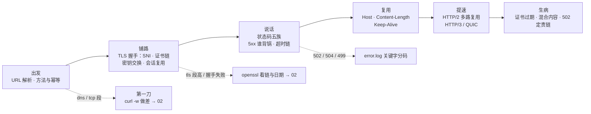
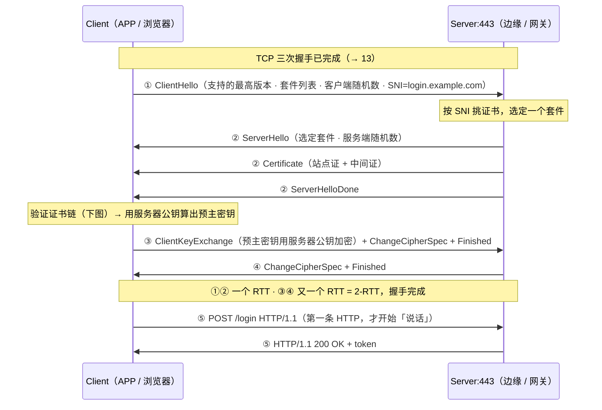
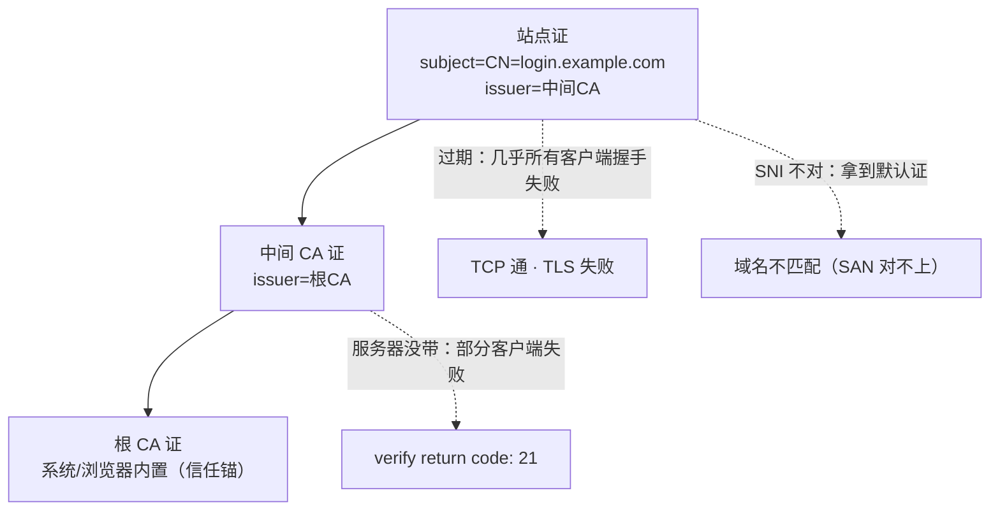
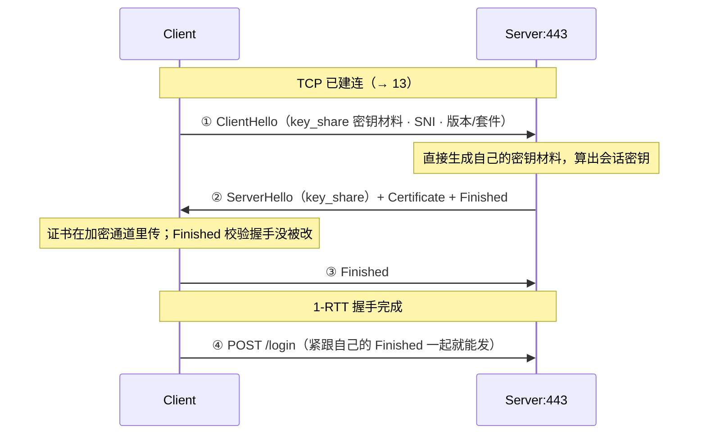
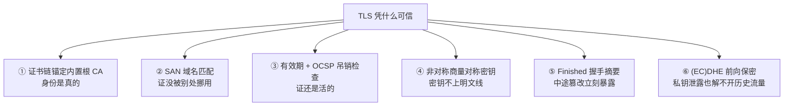
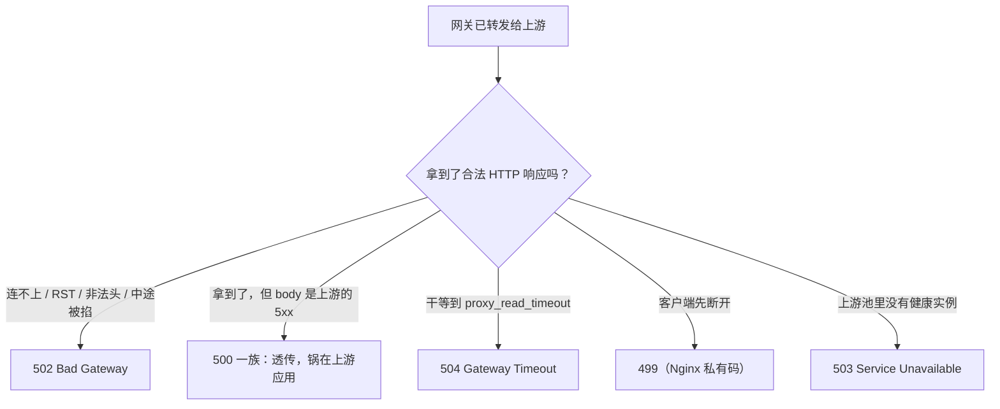
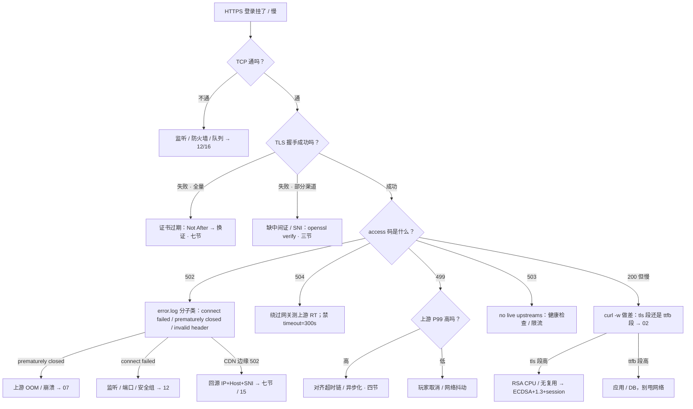

# HTTP 与 TLS

> 活动开闸登录 5xx 飙红，access.log 里 502/504/499 混着涨——有人一头扎进登录 SQL，有人提议把网关 timeout 改成 300s，最后发现是一张过期七天的回源证书。
> **本章回答**：一次 HTTPS 请求的一生——出发（URL、方法与幂等）、铺路（TLS 与证书）、说话（状态码与超时链）、复用（Keep-Alive）、提速（HTTP/2、HTTP/3）；码是谁写的、证是哪一套、超时谁先放手。
> **不讲**：curl -w 五段做差与 openssl 探路命令 SOP → [35](../35-网络排查命令/)；TCP 握手/窗口/重传与 QUIC 机制 → [13](../13-TCP与UDP/)；DNS 解析与 CDN 回源风暴 → [15](../15-DNS与CDN/)；Nginx 指令配置 → [19](../19-Nginx/)；抓包手法 → [16](../16-网络排障与抓包/)。

**标记**：🎯重点 · 🔥难点 · ⭐常考 · 🔧实操

---

## 一、一张图：一次 HTTPS 请求的一生

> 🎯 **一句话**：一次 HTTPS = 出发拆包 → TLS 铺路 → HTTP 说话 → 连接复用 → 版本提速；卡在哪一段，就查哪一段。



- 📖 **读图**
  - 🛤️ 主线「出发 → 铺路 → 说话 → 复用 → 提速」；「生病」收三类招牌故障
  - 🔪 第一刀分流：dns/tcp/tls/ttfb 用 `curl -w` 做差（SOP → [35](../35-网络排查命令/)）；状态码类先看网关 error.log（Q1、Q3）
  - 🧱 TCP 层（握手/窗口/重传）在铺路**之前**，归 [13](../13-TCP与UDP/)——`nc host 443` 通、HTTPS 不通 = 病在 TLS

### 🗺️ 这条请求经过谁：四层坐标系 🎯⭐

```text
APP（玩家客户端，超时常 8s）
  → 边缘（CDN / 入口 LB：TLS 终止，玩家看到的入口证书在这层）
    → 网关（Nginx / 七层：proxy_read_timeout 常 60s，499/502/504 全记在它的 access.log）
      → 上游（登录 / 支付 / 公告服务：业务 + SQL + 自己的硬超时）
```

- 🔗 **两条铁律**
  - **码写在网关，痛发生在最先超时 / 最先断开的那一层**——别看到 502 就去查登录 SQL
  - **入口证 ≠ 回源证**——边缘绿锁只证明入口证活着，证明不了源站那张证（七节）

> ⚠️ **别混**：战斗长连接**不走这张图**。HTTP Keep-Alive 只覆盖登录/支付/公告这类请求-响应；战斗通道是 TCP/KCP 长连接（→ [13](../13-TCP与UDP/)）。用「把 Keep-Alive 调大」回答战斗断线，是答非所问。

---

## 二、出发：URL、方法与幂等

> 🎯 **一句话**：出发先拆 URL、定方法；方法幂不幂等，决定了这个请求能不能被安全重试——支付 POST 永远不靠网关自动重试。

### 🧩 URL 拆开是什么 ⭐

`https://login.example.com/login?channel=ios` 一行拆四段，每段各对应一个故障层：

```text
scheme: https        ← 决定要不要 TLS（http 走 80，https 默认 443）
host:   login.example.com   ← 要先过 DNS 变成 IP（→ 15）；host 里的端口省略时用默认端口
path:   /login       ← 网关按它路由（location / 反代规则 → 19）
query:  channel=ios  ← 参数，日志里排查渠道问题的第一线索
```

- 📖 **读图**：四段对上 `curl -w` 四段——dns↔host 解析、tcp↔到边缘 443、tls↔握手、ttfb↔「网关+上游开始拣货」。连采/误用见 [35](../35-网络排查命令/)，本章只读数。

### 🔁 方法与幂等：能不能重试的根 🎯⭐🔥

> 💡 **打个比方**：**幂等（idempotent）** = 按一次门铃和按十次，屋里灯的最终状态一样——所以网关才敢自动重试。支付 POST 不幂等，重试一次可能扣两次钱。

#### ❓ 为什么支付 POST 不能靠网关自动重试？

- ✅ **幂等**：同一请求发一次和发 N 次，服务端效果相同。GET、PUT、DELETE 通常幂等；**POST 天然不幂等**——提交两次就是两笔
- 🛡️ **安全方法** = 只读不改（GET/HEAD）。安全一定幂等；幂等不一定安全（DELETE 幂等但会删数据）
- 💥 **事故温床**：网关 `proxy_next_upstream` 配了 502/504 时会把请求转给下一台上游重发——支付 POST 被这么重试一次 = 两笔订单（指令 → [19](../19-Nginx/)）
- 🔑 **客户端要重试 POST**：必须业务层带**幂等键 / 订单号**让服务端去重，不是指望网关

> ⚠️ **别混**：幂等 ≠ 安全。「GET 幂等所以随便重试」对；「POST 加个重试也没事」错。

> 📝 **面试**：问「什么是幂等，哪些方法幂等」，答「一次和多次效果相同；GET/PUT/DELETE 通常幂等、POST 不幂等」，紧接着补「网关只敢对幂等请求自动重试，支付 POST 必须靠幂等键」。⭐

本节对应练习题里幂等相关追问。请求要上路——HTTPS 的「绿锁」凭什么可信？

---

## 三、铺路：TLS 握手与证书

> 🎯 **一句话**：TLS 握手干两件事——用证书链验明服务器身份，用非对称加密商量出对称密钥；之后全程对称加密。

- 🧱 TCP 三次握手（→[13](../13-TCP与UDP/)）建的是「字节管道」，谁都能半路读改；TLS 建的是「加密 + 身份」管道
- 👉 **TCP 通 ≠ HTTPS 通**——「nc 通、浏览器红锁」是证书类故障的招牌签名

### 🔑 密钥交换在干什么 🔥

- **非对称**（公钥加密只有私钥能解）很贵，只能用一次；**对称**（AES-GCM）很快，但密钥怎么安全送到对方？
- TLS 的答案：握手用非对称**商量**出对称密钥——密钥由两边各自算出，**从不在网线上明文传**——之后 HTTP 全用它加密

#### ❓ 为什么不是全程用非对称加密？

- ❌ 全程 RSA/ECC 加解密：CPU 扛不住高峰登录 QPS
- ✅ 非对称只干「验身份 + 商量对称密钥」；对称干「路上所有字节」
- 🧩 这就是「HTTPS = 加密」只说对一半——**先身份，后会话密钥，再对称信道**

### 🤝 TLS 1.2 握手：2-RTT 的标准时序 🎯⭐🔥



- 📖 **读图**
  - ① ClientHello = 开价（版本 / **cipher suite** / 随机数 / **SNI**）
  - ② 证书在这一步发下，验链验域名在客户端侧；③ 用服务器公钥加密预主密钥；两边用两随机数+预主密钥各自算出相同会话密钥
  - 🔏 **Finished** = 全部握手消息的摘要——中间人改过任一字段（如套件降级），立刻失败
  - ⏱️ 2-RTT 是纯开销：弱网 RTT 200ms → 光握手 400ms 起步——会话复用要治的就是这个

### 🏷️ SNI：第一包里的门牌 ⭐

- **SNI（Server Name Indication）** = ClientHello 里「我要哪个域名的证」——一台 443 后面挂几十张证时，不带 SNI 只能回**默认证书**，域名必然对不上

> 🔍 **现场**：IP 直连 443 时 `openssl s_client` 必须带 `-servername`：

```bash
openssl s_client -connect 203.0.113.5:443 -servername login.example.com </dev/null 2>/dev/null | grep subject
# subject=CN = login.example.com         ← 带对 SNI：拿到站点证

openssl s_client -connect 203.0.113.5:443 </dev/null 2>/dev/null | grep subject
# subject=CN = default.ssl.example.com   ← 没带 SNI：默认证，域名不匹配——不是证书坏了
```

- curl 侧等价物是 `--resolve`（七节）；命令 SOP → [35](../35-网络排查命令/)

### 📜 证书链验证：三截介绍信 🎯⭐🔥

> 💡 **打个比方**：证书链像介绍信——站点证（我是谁）→ 中间 CA（部门盖章）→ 根 CA（总部备案，系统/浏览器出厂自带）。**中间那张必须随身带**——服务器要在握手里把站点证+中间证一起发，不能指望客户端自己去总部查档案。



- 📖 **读图**
  - 左竖 = 正常链：站点 → 中间 → 内置根
  - 右虚线三病：全挂想过期；部分挂想缺中间证；域名不匹配想 SNI

#### ❓ 为什么中间证必须服务器自己带？

- 客户端信任锚通常只有**根 CA**，不自带整条中间路径
- 部分客户端会自己下载中间证补链 → **「部分渠道能登、部分不能」**；过期则几乎**全量**失败
- 👉 这就是「部分挂」vs「全挂」的分水岭（面试分水岭）

客户端按顺序查四件事：

1. **链能锚定**：站点 → 中间 → 根，每级签名有效，落在信任锚
2. **域名匹配**：**SAN（Subject Alternative Name）** 覆盖请求 Host/SNI（现代看 SAN，不看老 CN）
3. **有效期**：当前时间在 Not Before 与 **Not After** 之间——过期是「几乎全量握手失败」头号原因
4. **没被吊销**：**OCSP** 查吊销；生产多用 **OCSP Stapling**（服务器把结果钉在握手里，省一次往返）

> 🔍 **现场**：验链与有效期一条命令看全：

```bash
openssl s_client -connect login.example.com:443 -servername login.example.com </dev/null 2>/dev/null | grep -E 'Verify return|Not After|subject=|issuer='
```

```text
Certificate chain
 0 s:CN = login.example.com        ← 第 0 张：站点证（s = subject）
   i:CN = Intermediate CA          ← 它的签发者（i = issuer）
 1 s:CN = Intermediate CA          ← 第 1 张：中间证——服务器必须自己带上这张
   i:CN = Root CA
subject=CN = login.example.com
issuer=CN = Intermediate CA
Not After : Dec 15 23:59:59 2026 GMT        ← 距今不足 14 天必须告警
Verify return code: 0 (ok)                  ← 0 = 链完整可锚定
```

```text
Verify return code: 21 (unable to verify the first certificate)
# ← 21 是最常见的「缺中间证」：部分客户端会自己下载中间证，所以「部分渠道能登、部分不能」
```

- 🔧 **运维纪律**：证书告警提前 **14 天**；测真握手路径（openssl 打真实 VIP / `--resolve`），别只看磁盘文件日期——文件可能新、VIP 挂的还是旧证

> 📝 **面试**：问「证书链是什么、缺中间证什么表现」，答「站点证 → 中间 CA → 根 CA，中间证必须服务器带上；缺了**部分**客户端失败；**过期**几乎全量失败」。「部分挂」和「全挂」是分水岭。⭐

### ⚡ TLS 1.3：把一轮砍掉 ⭐🔥

> 💡 **打个比方**：1.2 像三步走——互换名片、商量钥匙、互道开工。1.3 聪明在**第一封信就把 key_share 附上**：服务器回信时已能算密钥，证书**加密着**发回来——硬砍掉一轮。



- 📖 **读图**：1.2 的 2-RTT → 1.3 的 1-RTT；客户端第一枪带密钥材料，服务器第二枪把证书/密钥材料/Finished 回齐。弱网握手开销减半。

| 维度 | TLS 1.2 | TLS 1.3 |
|------|---------|---------|
| 完整握手 | 2-RTT | 1-RTT |
| 密钥交换 | RSA 或 ECDHE 二选一 | 只保留 (EC)DHE |
| 前向保密 | 仅 ECDHE 有 | 默认有 |
| 证书传输 | 明文 | 加密通道里 |
| 0-RTT 早期数据 | 无 | 有（重放风险，见下） |

> ⚠️ **别混**：不止「少一个 RTT」。① 1.2 允许 **RSA 密钥交换**——私钥泄露则历史流量可解；**前向保密（forward secrecy）** 只有 ECDHE 路线才有。1.3 删掉 RSA 交换，**默认前向保密**。② 1.3 证书在加密通道里传，抓包看不到明文证书——别当成「没发证书」。

> 📝 **面试**：问「TLS 1.3 比 1.2 快在哪」，答三层：「1-RTT（key_share 随 ClientHello）→ 证书加密传输 → 删掉无前向保密的 RSA 交换，默认 (EC)DHE」。只答「快一个 RTT」是半分。

### ♻️ 会话复用与 0-RTT ⭐

完整握手贵（RTT × 版本数 + 非对称计算），所以有第二档：**会话复用（session resumption）**。

#### ❓ 会话复用和 0-RTT 是一回事吗？

- ❌ **常见误会**：开了 session ticket = 有重放风险，都不敢开
- ✅ **会话复用**（session ID / ticket / 1.3 PSK）：下次带票据续上，**不用重新验完整证书链**，仍 **1-RTT**，**没有重放面**——生产推荐开
- ⚠️ **0-RTT（早期数据）**：HTTP 请求跟 ClientHello 一起发出，零 RTT；代价是早期数据**可被重放**——「扣款 / 改密」可能执行两次
- 📌 **口径**：支付、改密、登录态变更**禁止 0-RTT**；静态资源（GET 公告图）才考虑

> ⚠️ **别混**：会话复用 ≠ 0-RTT。复用省重新验链、仍 1-RTT、无重放；0-RTT 带数据抢跑、有重放面。

### 🔥 RSA 高峰 CPU 🔧

```text
判据三件套：curl -w 做差 tls 段高（如 tls≈1.8s） + 网关 worker %us 高 + 证书是 RSA
处方：换 ECDSA 证书（签名轻一个量级） + TLS 1.3 + 会话复用（少握手）
止血：SSL 卸载 / 加入口实例——只是把 CPU 摊开，下次更大的活动还会打满
```

- 反过来：`tls` 正常、`ttfb` 高 → 慢在应用/DB，跟握手无关（四节）。做差口径 → [35](../35-网络排查命令/)

### 收束：TLS 凭什么可信 🎯⭐

面试问「HTTPS 凭什么安全」，要的就是这张清单——**六件套，一件不落**：



- 📖 **读图**：前**三件**验「你是谁」（证书体系）；后**三件**保「路上没人看懂、没人能改」（密钥体系）。两组各答一半才完整。

> ⚠️ **别混**：TLS 保证**身份、机密、完整**，不保证**业务对**（200 可回错数据）、不保证**可用**（照样被 DDoS）、不管**客户端自己泄密**（token 明文）。

> 📝 **面试**：按「验身份三件 + 保信道三件」分组背；最后补「TLS 不保证业务、不保证可用」。

本节对应练习题 Q3、Q4、Q9、Q10。隧道通了——502/504/499 混涨，码到底是谁写的？

---

## 四、说话：状态码五族与谁背锅

> 🎯 **一句话**：状态码先问「谁先放手」——网关没拿到合法响应是 502、干等超时是 504、客户端先走是 499、没有健康上游是 503。

### 🗺️ 五族地图 ⭐

- **1xx**：请求收到、继续。值班常见只有 **101 Switching Protocols**（WebSocket 升级）
- **2xx**：200 正常；204 无 body（探活）；206 Range（断点续传）
- **3xx**：301 / 302 / 307 / 308，见下
- **4xx**：400 参数坏；401 / 403 / 404；429 限流（客户端退避）
- **5xx**：500 / 502 / 503 / 504，加上网关私有 **499**——本节下半场

> ⚠️ **别混**：**301 vs 302**。301 **永久**——浏览器/搜索引擎会**缓存**，切回旧域名要等缓存过期，适合真搬家。302 **临时**——每次仍先请求原址，适合切流/灰度/维护页。临时场景配 301 = 堵死回切。307/308 = 不许把 POST 改成 GET 的严格版 302/301。

> ⚠️ **别混**：**401 vs 403**。401 =「**你是谁**」（没凭证/无效 → 去登录）；403 =「**我认识你但不给你**」（权限/签名/IP → 重试没用）。口诀：**「401 是我不认识你，403 是我认识你但你不能这么干」**。404 也可作「存在但不给看」的挡箭牌。

### 5xx 谁背锅：网关视角 🔥⭐

#### ❓ 为什么 502 不是上游「返回」的？

- ❌ 常见答：「502 是上游返回的」
- ✅ **码是网关根据自己拿到什么「写」的**，不是上游主动吐出来的状态码（上游真回了 5xx body，网关透传的是 **500 一族**）
- ⭐ 开头那个现场该先分清的（练习题 Q1、Q2、Q7）



- 📖 **读图**：从「拿到了什么」往下读——**502 连接/协议层断、504 时间层断、499 客户端侧断、503 池子空**。500 = 上游自己写的 5xx 被透传。

error.log 关键字对照：

```text
access 502 + error「connect() failed (111: Connection refused)」
  → 上游没监听 / 被拒        → ss -lntp / 安全组（→ 12）
access 502 + error「upstream prematurely closed connection while reading response header」
  → 上游读响应中途掐线      → OOM 137 / 崩溃 / 上游自己超时 close（→ 07）
access 502 + error「invalid header」
  → 上游回了非 HTTP         → 打错端口 / 协议写坏
access 504 + error「upstream timed out (110: Connection timed out)」
  → 干等到 proxy_read_timeout → 先绕过网关测上游 RT，别先加超时
access 499（error.log 常无关键字）
  → 客户端先断开            → 对「APP 超时 vs 上游 P99」谁更短
access 503 + error「no live upstreams」
  → 健康检查摘光 / 主动限流  → 查健康检查与限流阈值，不是查 RST
```

- 🔥 **prematurely closed 是 502 一族，不是 504**——上游在响应过程中关连接（典型 OOM kill），网关没拿到完整合法响应。全章最高频误判。

- **504 三分支**
  - 绕过网关直打上游确实慢 → 真慢：优化 SQL / 扩容 / 异步化
  - 上游 localhost 很快、经网关 504 → 查 `proxy_buffering` 盘满、客户端收得极慢（→ [19](../19-Nginx/)）
  - timeout 改成 300s 后 504「消失」→ 不是修复，是把慢查询藏得更久

- **499 两条纪律**
  - 先对谁超时更短：499 多 + 上游 P99 高 = 真慢；499 多 + 上游很快 = 玩家取消/抖动
  - **499 不算 5xx**——只看网关 5xx 率会把失败率报低，要以 **APP 失败率 + 上游 P99** 为准

- **503 是保护不是故障**：限流/熔断主动回 503 = 容量策略在挡；查 `no live upstreams` 与限流阈值，别按 502 思路重启上游

> 📝 **面试**：问「502 和 504 的区别」，答「502 是网关**没拿到**合法 HTTP 响应——连接失败、RST、非法头、中途被掐都算；504 是**拿到了路**但干等到 `proxy_read_timeout`。从网关视角：502 是上游没来得及说话，504 是上游说话太慢」。再补「499 是 Nginx 私有码，客户端先断，监控别只看 5xx」。⭐

### ⏳ 超时链：从外到内递减 ⭐

> 💡 **打个比方**：俄罗斯套娃 deadline——最外层 APP 8 秒放弃，网关还傻等 60 秒，SQL 能跑 300 秒。玩家早关 APP，DB 还在被慢查询打。

#### ❓ 为什么 timeout=300s 治不好 504？

```text
错：APP 8s  <  网关 60s  <  上游无硬超时
    → 玩家已失败（499），网关还在等（504），SQL 还在打 DB

对：APP 8s  <  边缘 10s  <  网关 12s  <  上游硬超时 15s
    → 最外层先停，内层有余量砍掉请求，慢查询到不了 DB
```

- ① 超时必须**从外到内递减**，每层留余量
- ② **上游硬超时**设在应用自己的 SQL / RPC deadline——网关超时后，无硬超时的查询还会占连接打 DB
- ③ `timeout=300s` 不是修复，是把慢查询藏得更久、打得更久

> 📝 **面试**：问「超时怎么配」，答「从外到内递减、APP 最短、上游必须有自己的硬超时；网关 timeout 只是兜底」。追问「为什么 504 改大 timeout 是错的」，答「玩家 8 秒就失败了，DB 却要陪跑到 300 秒」。

本节对应练习题 Q1、Q2、Q7、Q8。码会分了——连接能不能复用，别每次都重新握手？

---

## 五、复用：头部与 Keep-Alive 长连接

> 🎯 **一句话**：头部管「这个请求归谁处理、响应多长、连接留不留」；短连接把 TIME_WAIT 和 TLS CPU 一起打爆，Keep-Alive 两边都要开。

### 🏷️ Host 与 SNI：报两次门牌 ⭐

- **SNI** = TLS 层门牌（要证书）；**Host** = HTTP/1.1 必带字段（要路由）——同一域名报两次，且必须一致
- SNI 是 A、Host 是 B → CDN/网关通常直接拒；回源排障就是「两个门牌 + 一个回源 IP」（七节）

### 📏 Content-Length 与 chunked：响应到底多长 ⭐

- **Content-Length**：body 字节数——网关靠它知道「这个响应读完没有」→ **复用前提**
- **Transfer-Encoding: chunked**：事先不知长度 → 一块一块发 + 终结块 `0` 收尾（SSE、大文件、上游 flush）
- 两个都没有还声称 keep-alive → 对端没法判边界，只能关连接收尾

### 🔌 Connection 与 Keep-Alive 🔧⭐

```text
短连接 ×3 个请求：
  TCP握手 → TLS握手 → 请求1 → 挥手（留 TIME_WAIT 60s → 12）
  TCP握手 → TLS握手 → 请求2 → 挥手
  TCP握手 → TLS握手 → 请求3 → 挥手
  ↑ 每次都付 1-RTT TCP + 2-RTT（TLS1.2）握手的「过路费」

Keep-Alive：
  TCP握手 → TLS握手 → 请求1 → 请求2 → 请求3 → ……（空闲到 keepalive_timeout 才关）
  ↑ 后续请求 0 次握手，TIME_WAIT 不再堆积，TLS CPU 不再翻倍
```

- 📖 **读图**：Keep-Alive 省的就是重复「过路费」——连接和会话密钥都还在，直接发 HTTP。短连接下 TLS 成本与 TIME_WAIT **乘以请求次数**。

#### ❓ 为什么 Keep-Alive 要两边都开？

- 入口不开 → 客户端↔网关每次重付 TCP+TLS
- **upstream keepalive 连接池**不开 → 网关↔上游每次新建 TCP（最常漏配：只开了入口）
- `keepalive_timeout` 过长占 fd，过短等于短连接；TIME_WAIT 认法 → [12](../12-网络栈与Socket/)，指令 → [19](../19-Nginx/)

> ⚠️ **别混**：HTTP Keep-Alive ≠ 战斗长连接。Keep-Alive = 请求-响应之间的连接复用，空闲即断；战斗 = 有状态长会话（心跳、切网重连，→[13](../13-TCP与UDP/)）。

> 📝 **面试**：问「Keep-Alive 为什么要两边都开」，答「入口不开重付 TCP+TLS；upstream 不开，网关↔上游每次新建 TCP——只开一边等于只治半条链」。

### 🔒 两个安全头：HSTS 与 CORS

- **HSTS（Strict-Transport-Security）**：告诉浏览器「今后只准 HTTPS」——防降级、压混合内容（七节）。浏览器行为，curl 测不出
- **CORS（Access-Control-Allow-Origin 一族）**：跨域放行名单。**CORS 是浏览器执行的**：前端报 CORS 错 ≠ 服务端挂（curl 不受限）

本节对应练习题 Q5。一个丢包为什么还能堵住整页？HTTP/2、HTTP/3 各拆哪一层？

---

## 六、提速：队头阻塞与 HTTP/2、HTTP/3

> 🎯 **一句话**：HTTP/2 用多路复用解决应用层排队，但 TCP 丢包仍堵整条连接；要拆传输层队头，得等 HTTP/3 的 QUIC。

> 💡 **打个比方**：HTTP/1.1 像单车道收费站；HTTP/2 改成多窗口交替放行，但**整条路（TCP）塌了一段，所有窗口一起停**。HTTP/3 每条流修自己的独立小路（QUIC/UDP）。

```text
HTTP/1.1 一条连接：  [响应1..............][响应2][响应3]
                        ↑ 响应1 没完，2/3 只能排着（应用层队头阻塞）
                        浏览器的土办法：并行开 ~6 条 TCP 连接

HTTP/2 一条连接：    [流1][流2][流3] 帧交错（多路复用）
                        ↑ 互不等了；但 TCP 丢一包 → 整条连接所有流一起等重传
                          （传输层队头阻塞，按序交付的机制 → 13）

HTTP/3：            每条流独立跑 QUIC/UDP（→ 13），流1丢包不堵流2
```

- 📖 **读图**：三行各治一层——HTTP/2 治第一行「应用层排队」，治不了第二行「传输层排队」；要拆传输层队头只能换路（QUIC）。「上了 HTTP/2 就不会堵」是把两层混成一层。

#### ❓ 上了 HTTP/2 为什么丢包还堵？

- ✅ HTTP/2 三板斧：① 二进制分帧 ② **多路复用（multiplexing）**——一条 TCP 上多 stream 帧交错 ③ HPACK 头压缩
- ❌ 底下还是**一条 TCP**——丢一包，所有 stream 一起等重传（→[13](../13-TCP与UDP/)）
- 🛤️ 要治传输层队头 → **HTTP/3 / QUIC**（流独立、握手更省、连接迁移；机制链 [13](../13-TCP与UDP/)）
- 📌 落地：内网 gRPC 延迟低丢包少，HTTP/2 通常够；**公网弱网**才评估 HTTP/3——客户端、证书栈、中间设备放行 UDP，三关都过才谈收益
- 📎 h2 实际都跑在 TLS 上，握手里用 **ALPN** 报「我支持 h2」

| 维度 | HTTP/1.1 | HTTP/2 |
|------|----------|--------|
| 一条连接上的并发 | 一次一个请求，排队 | 多 stream 帧交错（多路复用） |
| 应用层队头阻塞 | 有 | 解决 |
| TCP 丢包时 | 整条连接等重传 | **所有 stream 仍一起等** |
| 头部 | 明文逐请求重复 | HPACK 压缩 |
| 典型场景 | 简单入口、老客户端 | 内网 gRPC、现代浏览器 |

> 📝 **面试**：问「HTTP/2 解决了什么、没解决什么」，答「解决了**应用层**队头阻塞；没解决**传输层**队头——底下还是一条 TCP。要治传输层，去 HTTP/3 的 QUIC」。再补「战斗长连接的队头靠拆通道（→13），不是给战斗上 HTTP/2」。

本节对应练习题 Q6。回到开头：证书病、502、绿锁能不能结案？

---

## 七、生病：证书过期、混合内容与 502 定责链

> 🎯 **一句话**：HTTPS 三类招牌病——证坏了（全挂/部分挂/域名不匹配）、页面被降级（混合内容）、上游断在半路（502 子类）；每种都有签名，别互相误诊。

### 🩺 证书类的三种病 🔧

机制（链、SAN、SNI）在[三节](#三铺路tls-握手与证书)，这里只给「现象 → 病」：

- **全量握手失败**：`Not After` 过了——`curl: (60) certificate has expired`。换证 + 告警提前 14 天
- **部分渠道失败**：缺中间证（verify 21）或本地根证书太老（老安卓）——服务器带全链 + 关注客户端根分布
- **域名不匹配**：IP 直连没带 SNI 拿到默认证——加 `-servername`

- 🔧 **补两条**：双向 TLS 的 **client cert** 要单独监控 `Not After`（表现「偶发失败」，混在服务器证告警里看不见）；登录域名不要和包体 CDN 共用一张要频繁 Purge 的证书

### 🔀 混合内容（mixed content）

- HTTPS 页里引用 `http://` 脚本/接口/样式——浏览器拦**主动内容**（功能缺一块）；curl 拉同一 URL 完全正常
- 治法：全站 https + **HSTS** + CSP `upgrade-insecure-requests`

> ⚠️ **别混**：混合内容 vs CORS 都是**浏览器**在拦，但理由不同——混合内容 = 协议降级；CORS = 跨域没放行头。看控制台第一行就能分。

### 🧨 502 定责链：一例钉死 🔥

分码口径在[四节](#四说话状态码五族与谁背锅)，活动高峰 502 飙升走读：

```text
t=0     活动开始，登录 QPS 暴涨
t=30s   上游部分实例 OOM → exit 137（→ 07）
t=31s   网关正读 response header，上游把连接掐了
        error.log: upstream prematurely closed connection ...
        access.log: ... 502 ...
t=32s   群里有人查登录 SQL —— 错刀；有人加大 timeout —— 更错
```

- ✅ 第一刀：`prematurely closed` → **502 一族** → 查上游进程 / OOM / 退出码，**不要先加 timeout**
- 证据链：error.log（谁掐）→ 上游退出码/OOM（为什么掐）→ 必要时两端抓包看 RST（→ [16](../16-网络排障与抓包/)）
- 持续 502 走 `connect() failed`：查监听/端口/安全组（→ [12](../12-网络栈与Socket/)）

### 🔓 绿锁不能结案：入口证 vs 回源证 ⭐

#### ❓ 绿锁亮了为什么源站还可能挂？


- 📖 **读图**：绿锁只证明**入口证**（边缘那张）；回源 HTTPS 用**源站自己的证**——回源证过期，边缘照样绿锁，玩家看到 502。经典现场：CDN 502、ssh 源站 `curl localhost` 一切正常——localhost 证明不了「CDN → 源站」那一跳。

> 🔍 **现场**：CDN 502 时用 `--resolve` 模拟「回源 IP + Host + SNI」：

```bash
curl -vk --resolve login.example.com:443:203.0.113.10 https://login.example.com/
# ← 强制打源站 IP，同时 Host 头和 SNI 都是 login.example.com
#   改 /etc/hosts 容易忘 SNI，--resolve 两个门牌都带上

openssl s_client -connect 203.0.113.10:443 -servername login.example.com </dev/null 2>/dev/null \
  | grep -E 'Verify return|Not After'
# Verify return code: 0 (ok)                 ← 源站证 OK，锅在安全组/回源配置（→ 15）
# Verify return code: 21 / 证书已过期        ← 锅就是回源证：换证（不是换入口证）
```

- `X-Cache` 显示 **HIT 还 502** → 脏缓存/边缘自身问题，不是回源（→[15](../15-DNS与CDN/)）；安全组要放行 CDN 回源网段

### 📡 监控怎么配才不漏

- 只看网关 5xx 率 → 漏 499：加 APP 失败率 + 499 计数
- 只探 TCP 443 → 漏 TLS/证书失败：探活要打**真 HTTPS 握手**且带 SNI
- 只看边缘可用性 → 漏回源 502：加回源错误码 + 源站证书告警
- 只看网关平均 RT → 玩家 8s 已失败时平均数还「挺好」：看上游 P99

本节对应练习题 Q4、Q11、Q13。机制讲完了——5xx 飙红，60 秒怎么定责？

---

## 八、作战：分码 → 对链 → 分证

> 🎯 **一句话**：第一刀永远是 error.log 分码，不是抓包；分完码再对链路、分证书。

- 🗣️ **听人话定层**
  - 「闪退、立刻失败」→ 502/503/TLS 握手失败
  - 「一直转圈后失败」→ 504 或 APP 超时（499）
  - 「部分渠道能登、部分不能」→ 缺中间证 / SNI / 根证书分布
  - 「边缘绿锁但 502」→ 回源那一跳
  - 「高峰新建 HTTPS 慢」→ 握手 CPU / 短连接
  - 「能进大厅进不了房间」→ 战斗连接，不是 HTTP（→[13](../13-TCP与UDP/)）

### 🌳 决策树



- 📖 **读图**：三道关——**先 TCP、再 TLS、后 HTTP**；502 分支靠 error.log 关键字分诊；「200 但慢」最易被忽略——码全绿不代表快，做差才知道慢在哪一段。

### 现象 · 先做 · 别做

| 现象 | 先做 | 别做 |
|------|------|------|
| 502 + prematurely closed | 查上游 OOM / 退出码（→07） | 先加 timeout、先查 SQL |
| 504 | 绕过网关测上游 RT | timeout=300s 当修复 |
| 499 涨、5xx 看着还好 | 对 APP 超时 vs 上游 P99 | 当客户端无脑重试忽略 |
| 503 | no live upstreams / 限流阈值 | 按 502 思路重启上游 |
| 部分渠道 TLS 失败 | openssl 看链（verify 21 = 缺中间证） | 只换站点证、只看入口证 |
| 边缘绿锁 + CDN 502 | 测回源 IP+Host+SNI 那一跳 | 只 curl 源站 localhost 结案 |
| 高峰网关 %us 满、tls 段高 | 换 ECDSA + TLS1.3 + 会话复用 | 先加机器当根治 |
| 支付偶发失败（互调） | 查 client cert Not After | 和服务器证混一个告警 |
| 页面部分功能没反应 | 浏览器控制台：mixed content / CORS | 抓包查网络 |
| HTTPS 慢 | 先日志分码 + curl -w 做差 | 一上来 tcpdump -i any（→16） |

### 60 秒剧本 🔧

> 🔍 **现场**：接到「登录挂了/慢」，60 秒走完这条线再下结论。

```text
① 0–10s   分码：grep access.log 的 502/504/499/503 + error.log 关键字，先定哪一族
② 10–30s  对链：504/499 → 绕过网关 curl 上游 /health 测 RT；对照 APP 超时 vs 上游 P99
③ 30–45s  分证：TLS 失败/慢 → openssl 看 verify / Not After / subject；CDN 502 → --resolve 测回源跳
④ 45–60s  定责+验证：502 子类各走各的（OOM/监听/协议/回源证）；改任何配置前先拿到一条证据
```

本节对应练习题 Q14。群里那句「改 timeout=300s / 先查登录 SQL」——你已经知道该怎么拦住他了。

---

## 九、收口

### 命令速查 🔧

```bash
# 分码（第一刀，永远先做）
grep -E ' 502 | 504 | 499 | 503 ' /var/log/nginx/access.log | tail
grep -E 'connect\(\) failed|invalid header|prematurely closed|upstream timed out|no live upstreams' \
  /var/log/nginx/error.log | tail
# 对链：绕过网关直打上游
curl -sv --connect-timeout 2 http://10.0.0.8:8080/health
# 分段做差：tls 段 vs ttfb 段（五段完整 SOP → 02）
curl -o /dev/null -s -w 'dns:%{time_namelookup} tcp:%{time_connect} tls:%{time_appconnect} ttfb:%{time_starttransfer} code:%{http_code}\n' \
  https://login.example.com
# 分证：证书链 / 有效期 / SNI（IP 直连必须带 -servername）
openssl s_client -connect host:443 -servername host </dev/null 2>/dev/null | grep -E 'Verify return|Not After|subject='
# 强制 VIP 测真握手路径 / 模拟回源
curl -vk --resolve login.example.com:443:203.0.113.10 https://login.example.com/
```

### 面试锚点

遮住右列自问自答，卡壳的行回去重读对应小节——这张表就是本章的「30 秒口径速查」。

| 问 | 30 秒答 |
|----|---------|
| 一次 HTTPS 请求经过什么？ | URL 解析（→15 DNS）→ TCP 握手（→13）→ TLS 握手（SNI/证书/密钥）→ HTTP 请求 → 状态码；分四层 APP→边缘→网关→上游，码在网关，痛在最先超时那层。 |
| 幂等是什么？POST 能自动重试吗？ | 一次和多次效果相同；GET/PUT/DELETE 通常幂等、POST 不幂等。网关只敢对幂等请求重试，支付 POST 靠幂等键。 |
| TLS 握手在干什么？ | 证书验身份 + 非对称商量对称密钥；之后全对称加密。Finished 摘要防篡改。 |
| 证书链三截？ | 站点证→中间 CA→根 CA（内置信任锚）；中间证必须服务器带上，缺了**部分**客户端失败；过期几乎全挂。 |
| SAN 是什么？ | 证书里覆盖的域名清单，域名匹配校验看它，不是只看 CN。 |
| SNI 是什么？不带会怎样？ | ClientHello 里报「要哪个域名的证」；不带拿默认证、域名不匹配；openssl IP 直连必带 `-servername`。 |
| TLS 1.2 vs 1.3？ | 2-RTT vs 1-RTT（key_share 随 ClientHello 带上）；1.3 删 RSA 交换默认前向保密、证书加密传输。 |
| 会话复用 vs 0-RTT？ | 复用省重新验链、仍 1-RTT、无重放面，推荐开；0-RTT 带数据抢跑、可被重放，支付/改密禁止。 |
| RSA 高峰 CPU 怎么治？ | 先确认 tls 段高；换 ECDSA + TLS1.3 + 会话复用；加机器只是摊 CPU。 |
| 301 vs 302？ | 301 永久，浏览器/搜索引擎缓存，适合搬家；302 临时，每次仍请求原址，适合切流灰度。临时场景配 301 会堵死回切。 |
| 401 vs 403？ | 401「你是谁」——没带凭证，去登录；403「不给你」——权限/签名/IP 拒，重试没用。 |
| 502 vs 504 vs 499 vs 503？ | 502 没拿到合法 HTTP（connect failed/invalid header/prematurely closed）；504 干等到 proxy_read_timeout；499 客户端先走（Nginx 私有，不算 5xx）；503 无健康上游/限流。 |
| prematurely closed 算哪个？ | 502 一族——上游中途掐线，常见 OOM/崩溃；不是 504。 |
| 超时链怎么配？ | 从外到内递减（APP 8s < 边缘 10s < 网关 12s < 上游硬超时 15s）；上游 SQL/RPC 必须有 deadline；300s 是藏慢查询。 |
| Keep-Alive 为什么两边开？ | 入口不开重付 TCP+TLS；upstream keepalive 不配，网关↔上游每次新建 TCP。≠ 战斗长连接（13）。 |
| Content-Length vs chunked？ | 定长 vs 流式分块+终结块；有边界网关才能复用连接、知道响应读完没有。 |
| HSTS / CORS？ | HSTS 强制浏览器今后只走 HTTPS；CORS 跨域放行头。都是浏览器行为，curl 测不出、不代表服务端挂。 |
| HTTP/2 解决了什么没解决什么？ | 多路复用解决应用层队头；TCP 丢包所有 stream 仍一起等；HTTP/3/QUIC 流独立（13）。 |
| CDN 502 源站正常？ | 入口证≠回源证，绿锁只保入口；测「回源 IP+Host+SNI」那一跳；HIT 还 502 查边缘（15）。 |
| 混合内容？ | HTTPS 页引 http:// 资源被浏览器拦（主动内容 block）；治法全站 https+HSTS+CSP；curl 测不出。 |

### 易错一句话对照

- 看到 502 就查登录 SQL → 先 error.log 分码：prematurely closed 查 OOM（07）
- prematurely closed 是 504 → 502 一族，上游中途掐线
- 499 一定是服务端 bug → 先对 APP 超时 vs 上游 P99
- 只看网关 5xx 率 = 失败率 → 499 不算 5xx，要盯 APP 失败率
- 504 改 timeout=300s 解决 → 藏慢查询，DB 陪跑更久
- TLS 慢第一刀抓包 → 先 curl -w 做差定段（命令 SOP → 02）
- time_connect 是纯 TCP 耗时 → 累计值含 DNS，本段要做差（→02）
- 缺中间证一定全量失败 → 部分客户端会自己补链，「部分渠道失败」才是签名
- SNI 错 = 证书过期 → 拿到默认证、域名不匹配，两码事
- 证书只看磁盘文件日期 → 测真握手路径（--resolve / openssl 打真实 VIP）
- 会话复用有重放风险不敢开 → 重放是 0-RTT 的；ticket 推荐
- 支付可以开 0-RTT 提速 → 重放可执行两次，禁止
- 边缘绿锁证明源站证 OK → 入口证≠回源证，两套
- 只开客户端 Keep-Alive 就够 → upstream keepalive 连接池也要配
- 上了 HTTP/2 就不堵 → TCP 丢包所有 stream 仍一起等
- 战斗断线调 Keep-Alive → 战斗长连接是 TCP/KCP（13），两层
- 301 随手配 → 临时切流配 302，301 被缓存堵死回切
- CORS 报错 = 服务端挂 → 浏览器行为，常只是没放行头
- client cert 和服务器证混一个告警 → 表现「偶发失败」，单独监控 Not After
- 探活只探 TCP 443 → TLS/证书失败探不出来，要真握手且带 SNI

### 数字墙

> APP 超时常 **8s** · `proxy_read_timeout` 常 **60s** · 超时链示例 **8 < 10 < 12 < 15** · TLS 1.2 完整握手 **2-RTT** · TLS 1.3 **1-RTT** · 0-RTT 只给**静态资源** · 证书告警提前 **14 天** · https 默认端口 **443**（http 80） · 浏览器 HTTP/1.1 并行连接 **~6** 条 · 状态码 **5** 族 · TIME_WAIT **~60s**（→12）

---

## 合上书

对着第一节主图口述；卡住就回对应节 / 练习题。

- [ ] **默画一节的图**：出发 → 铺路 → 说话 → 复用 → 提速；四层坐标系（APP→边缘→网关→上游）；curl -w 做差和 error.log 分码各照哪一段。（→ Q14）
- [ ] **口述出发**：URL 四段各对应什么故障层；幂等和安全方法的区别；为什么支付 POST 不靠网关自动重试、幂等键怎么补。（→ Q14）
- [ ] **默画铺路（TLS 1.2）**：逐条写出 ClientHello（版本/套件/随机数/SNI）→ ServerHello+Certificate → 密钥交换+Finished 的时序，标出 2-RTT 在哪两段、证书在哪一步验。（→ Q3 · Q4）
- [ ] **口述铺路**：SNI 不带什么后果、证书链三截和三种病（全挂/部分挂/域名不匹配）、SAN、OCSP、TLS1.3 砍掉哪一轮、前向保密、会话复用 vs 0-RTT、RSA 高峰 CPU 三件套。（→ Q4 · Q9 · Q10）
- [ ] **默画 TLS 六件套**：验身份三件（链锚定/SAN/有效期）+ 保信道三件（密钥协商/Finished 防篡改/前向保密），说清「TLS 不保证什么」。（→ Q4）
- [ ] **口述说话**：状态码五族各一个代表；301 vs 302、401 vs 403 的口径；5xx 四兄弟 + 500 谁写的、error.log 关键字怎么对；prematurely closed 是哪个。（→ Q1 · Q2 · Q7）
- [ ] **口述超时链**：为什么从外到内递减、8小于 10小于 12小于 15、上游硬超时设在哪、timeout=300s 错在哪。（→ Q8）
- [ ] **口述复用**：Host 与 SNI 报两次门牌；Content-Length vs chunked；Keep-Alive 为什么两边都开；HSTS/CORS 为什么 curl 测不出。（→ Q5 · Q12 · Q13）
- [ ] **口述提速**：HTTP/1.1 队头在应用层、HTTP/2 多路复用解决什么、传输层队头谁拆（QUIC）、内网 gRPC 选什么。（→ Q6）
- [ ] **口述生病**：证书三种病的签名、混合内容和 CORS 怎么分、502 定责链走读（OOM 一例）、绿锁为什么不能结案、回源怎么测（--resolve）。（→ Q4 · Q11 · Q13）
- [ ] **定责**：60 秒剧本四步（分码→对链→分证→定责）；决策树三道关各用什么工具。（→ Q14）
- [ ] **边界**：curl -w/openssl 命令 SOP → 02；TCP/QUIC → 13；DNS/CDN → 15；Nginx 指令 → 19；抓包 → 16；OOM → 07。

下一章：[DNS 与 CDN](../15-DNS与CDN/)。地基：[12](../12-网络栈与Socket/) · 传输：[13](../13-TCP与UDP/) · 命令 SOP：[35](../35-网络排查命令/) · 抓包：[16](../16-网络排障与抓包/) · Nginx：[19](../19-Nginx/)。
