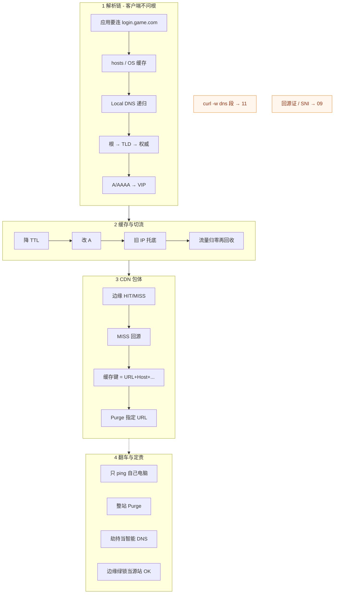
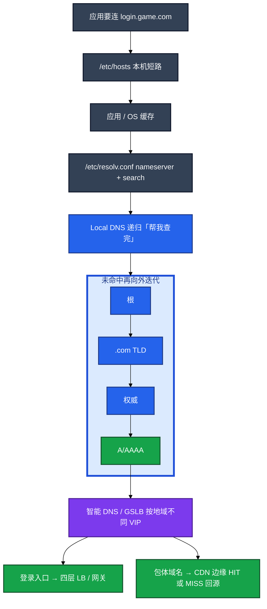
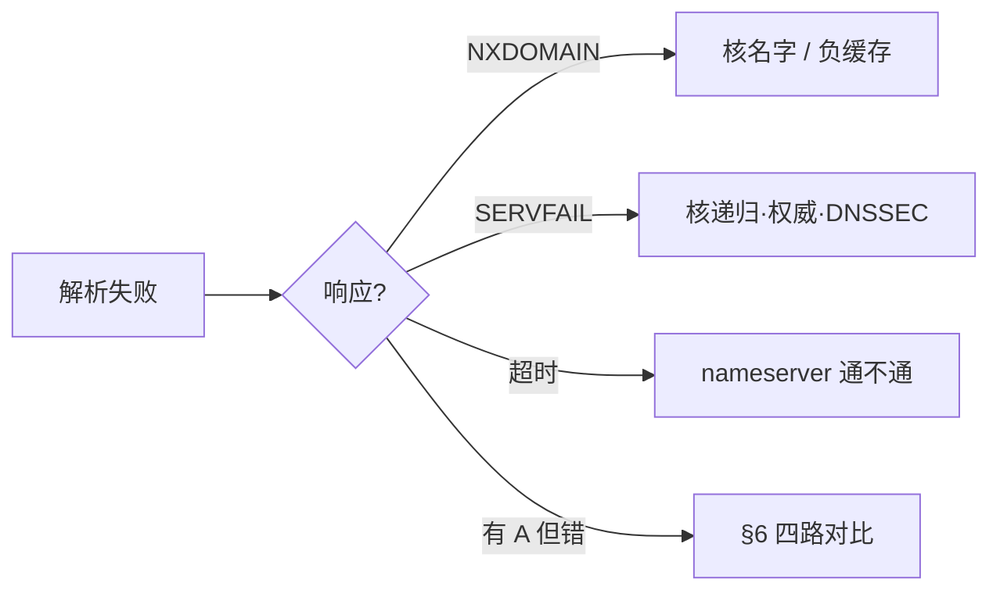
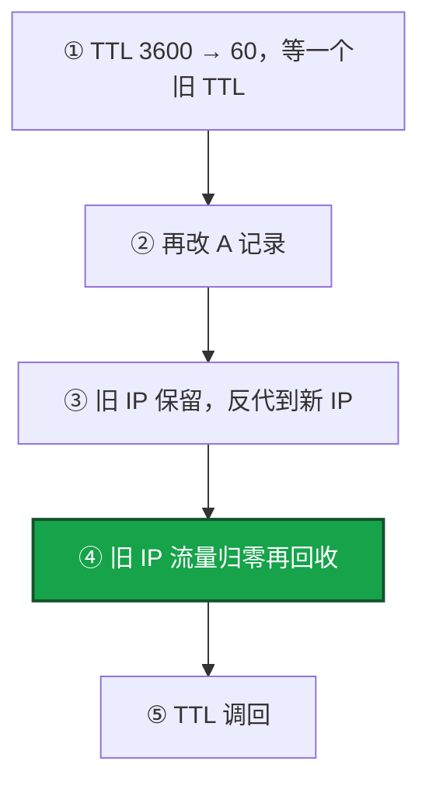
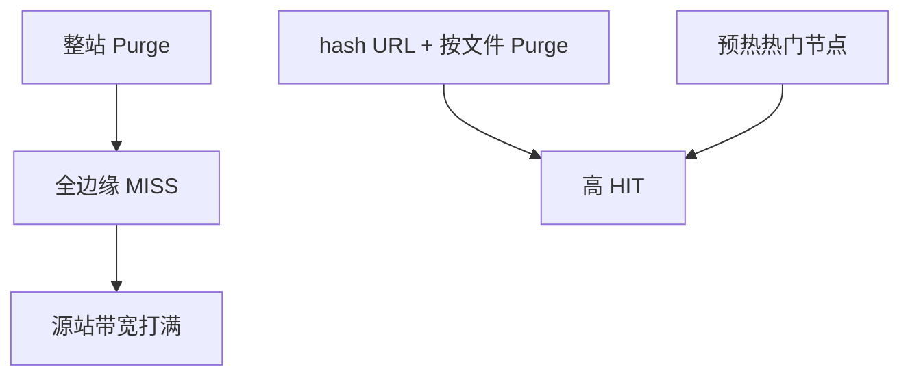
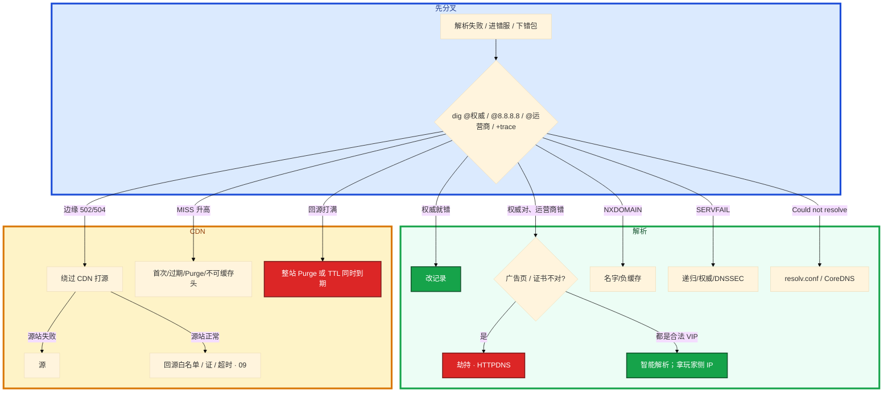

# DNS 与 CDN

> **这章解决什么**：开服改了 A 记录渠道还进旧服、包体 502、Purge 打死源站、玩家打开是广告页——卡在**名字解析**还是**内容分发**？怎么**分权威 / 缓存 / 劫持 / 回源**？  
> **读法**：**先看总图** → **再认名词** → **再分节抠解析链 / TTL / dig / CDN / 劫持**。  
> **刻意不展开**：`curl -w` 五段定层、抓包过滤 → [16](../16-网络排障与抓包/)；入口证 / 回源证 / SNI → [14](../14-HTTP与TLS/)；TCP 握手与窗口 → [13](../13-TCP与UDP/)；队列 / Recv-Q → [12](../12-网络栈与Socket/)。

---

## 本章目录

1. [本章定位](#1-本章定位)
2. [先看总图：名字怎么变成内容](#2-先看总图名字怎么变成内容) ← **开篇必读**
   - [2.0 全章知识串图](#20-全章知识串图一张把细节串起来) ← **架构总览**
   - [2.1 解析链坐标系](#21-解析链坐标系客户端递归权威)
   - [2.2 登录走 LB、包体走 CDN](#22-登录走-lb包体走-cdn)
   - [2.3 完整走读](#23-完整走读开服切流到包体-502)
3. [名词扫盲（对照总图认词）](#3-名词扫盲对照总图认词)
4. [DNS 解析链：递归 / 权威 / 迭代](#4-dns-解析链递归--权威--迭代)
5. [缓存与 TTL：切流纪律](#5-缓存与-ttl切流纪律) ← **重点精读**
6. [dig 读法：多 DNS 对比](#6-dig-读法多-dns-对比) ← **重点精读**
7. [hosts / resolv / ndots](#7-hosts--resolv--ndots)
8. [CDN：回源 / 缓存键 / 刷新](#8-cdn回源--缓存键--刷新) ← **重点精读**
9. [劫持与 HTTPDNS](#9-劫持与-httpdns)
10. [定责决策树与命令速查](#10-定责决策树与命令速查)
11. [去哪章继续学](#11-去哪章继续学)
12. [面试 · 易错 · 数字](#12-面试--易错--数字)
13. [合上书](#合上书)

---

## 1. 本章定位

| 章 | 负责 |
|----|------|
| **06** | 包怎么走、怎么进主机、Socket/队列 |
| **08** | TCP/UDP：握手、窗口、重传 |
| **09** | HTTP 状态码、入口证 / 回源证、SNI |
| **10（本章）** | **DNS 解析链、TTL 切流、dig 定责、CDN HIT/MISS/Purge、劫持** |
| **11** | `curl -w` 五段定层、抓包手法、路由 / MTU |

本章是**名字与分发主场**。11 告诉你「连不上先看 dns 段」；本章告诉你 dns 段慢 / 错了之后，**权威、递归、劫持、CDN 回源**怎么分锅。

🎯 **值班签名**：自己 `dig` 已是新 IP、渠道还进旧服——先想 **TTL / 运营商缓存**，不是先 Purge；CDN 502 先想 **绕过打源**，不是先整站刷新。

开服要把登录域名从旧 VIP 切到新机房。你改完 A 记录，自己电脑 `dig` 已是新 IP，渠道 A 还在进旧服；热更时有人点了「整站 Purge」，源站出口瞬间打满。群里有人要先 Purge 清缓存，有人说「被劫持了」——其实权威对了，只是运营商 Local DNS 还缓存着旧答案。

**本章主线（排障就按这三步想）：**

1. **分层**：客户端问递归，递归迭代问权威；登录走 LB，包体走 CDN，回源是另一跳——别在 CDN 502 时只查 DNS。  
2. **对比**：`dig @权威` / `@8.8.8.8` / `@运营商` / `+trace` 分「权威错了还是中间缓存脏了」。  
3. **切流 / 发版**：先降 TTL 再改 A；旧 IP 托底；包体 URL 带 hash，禁止整站 Purge。

**读完你能：** 白板上画客户端→递归→权威；会用 `+trace` 和多 DNS 对比；会做「先降 TTL 再改记录」；会绕过 CDN 打源；包体 URL 带 hash、禁止整站 Purge；劫持与智能 DNS 能一口分开。

**本章不讲：** `curl -w` dns 段完整 SOP、分层抓包 → [16](../16-网络排障与抓包/)；证书 / 回源 HTTPS / SNI 语义 → [14](../14-HTTP与TLS/)；CoreDNS 部署深挖 → K8s 09；包体热更渠道流程 → 游戏专题；Nginx 回源超时深配置 → [19 Nginx](../19-Nginx/)。

---

## 2. 先看总图：名字怎么变成内容

> **正确开篇顺序**：先有全局画面，再认词，再抠细节。  
> 先看 **§2.0 全章串图**，再看 **§2.1 解析链**，再用 **§2.3 走读**把一次开服串起来。

### 2.0 全章知识串图（一张把细节串起来）

> 🎯 **合上书要能默画这张。** 蓝=解析 · 绿=缓存/TTL · 紫=CDN · 橙=劫持/翻车。  
> 若预览仍报错，以下面 **ASCII 一页板** 为准。



**读图路线：**

| 段 | 记住 |
|----|------|
| ① | 客户端问递归，不问根；`+trace` 模拟迭代（§4、§6） |
| ② | 「DNS 已切」≠「用户已切」；先降 TTL + 旧 IP 托底（§5） |
| ③ | HIT/MISS、缓存键、按文件 Purge；502 绕过打源（§8） |
| ④ | 多 DNS 对比分缓存/劫持；禁止整站 Purge（§9、§10） |

```text
┌──────────────────────────────────────────────────────────────────────────┐
│                     10 一张板：名字 → 入口 / 包体 → 定责                    │
├─────────────┬────────────────────┬───────────────────────────────────────┤
│  ① 解析     │  ② 切流            │  ③ CDN                                │
│  hosts→递归 │  降 TTL→改 A       │  HIT/MISS · 缓存键                    │
│  →权威 A    │  旧 IP 托底        │  按 URL Purge · 绕过打源              │
│  dig 四路比 │  流量归零再收      │  hash URL · 禁整站                    │
├─────────────┴────────────────────┴───────────────────────────────────────┤
│  翻车：只 ping 本机 · 整站 Purge · 劫持当调度 · 绿锁当源站 OK              │
│  链出：curl -w dns→11 · 回源证/SNI→09 · 队列→06 · TCP→08                   │
└──────────────────────────────────────────────────────────────────────────┘
```

---

### 2.1 解析链坐标系（客户端→递归→权威）

后面切流、劫持、`+trace` 都对着这张图。**客户端不对根说话。**



**读图三句话：**

1. **客户端不对根说话**，问的是递归；`+trace` 模拟的是递归的迭代路径，不是客户端直连。  
2. **权威改了 ≠ 用户切了**——递归、运营商、客户端、连接池都可能还拿旧 IP；「DNS 已切」≠「用户已切」。  
3. **登录走 LB，包体走 CDN**——回源是另一跳，边缘绿锁证明不了源站；502 要分 CDN 还是源。

三种解析结果（挂的时候处理不一样）：


---

### 2.2 登录走 LB、包体走 CDN

游戏里常见**两个域名、两套故障面**：

| 域名角色 | 解析到 | 后面是什么 | 挂了像什么 |
|----------|--------|------------|------------|
| `login.game.com` | VIP / 智能 DNS | 四层 LB → 网关 | 进错服、连不上 |
| `cdn.game.com` | CDN CNAME → 边缘 | HIT 或 MISS 回源 | 下载慢、下错包、502 |

```text
玩家 APP
  │
  ├─ dig login.game.com  →  VIP → LB → Conn/Login
  │
  └─ dig cdn.game.com    →  CDN 边缘
                              ├─ HIT  → 直接回包体
                              └─ MISS → 回源站 → 再缓存
```

> **别混**：登录 DNS 未收敛时去 Purge 包体，等于「一半人还打旧入口、一半人强制回源」——两个事故叠在一起。开服先稳定 DNS，再发包体。

---

### 2.3 完整走读：开服切流到包体 502

> 用一条真实路径把考点串一遍。**只保留这一版走读**。

**角色**：运维跳板 · 云解析权威 · 公司 DNS · 玩家 4G · CDN 边缘 · 源站

#### 步骤 1：切流前——先降 TTL

```bash
# 权威上看到 TTL 还是 3600
dig login.game.com @ns1.example.com | grep -E '^login|IN A'
```

```text
login.game.com.   3600   IN  A   198.51.100.10
```

- **先把 TTL 改成 60**，等至少一个旧 TTL（3600s）再改 A。  
- 跳过这一步 = 最长一个旧 TTL 内双活（新旧 VIP 同时有人打）。

#### 步骤 2：改 A + 旧 IP 托底

```bash
# 权威已改
dig login.game.com @ns1.example.com +short
# → 203.0.113.50

# 公共 DNS 可能还在 TTL 内
dig login.game.com @8.8.8.8 +short
# → 198.51.100.10   ← 正常，不是权威没改
```

- 旧 VIP `198.51.100.10` **保留**，Nginx/LB 反代到新 VIP。  
- 监控旧 IP 流量归零再回收；运营商可能**不守 TTL**。

#### 步骤 3：渠道报「进旧服」——四路 dig

```bash
dig login.game.com @ns1.example.com +short
dig login.game.com @8.8.8.8 +short
dig login.game.com @114.114.114.114 +short
dig login.game.com +trace
```

| 结果组合 | 定责 |
|----------|------|
| 权威错 | 改控制台记录 |
| 权威对、公司/运营商错、且是旧 VIP | 递归缓存脏 / TTL 未收敛 |
| 权威对、运营商是广告 IP | 劫持（§9） |
| 权威对、不同地域合法 VIP | 智能 DNS，拿玩家侧 IP |

#### 步骤 4：热更窗口包体 502——先别 Purge

```bash
curl -I https://cdn.game.com/patch/v1.2.3/app.apk
```

```text
HTTP/2 502
x-cache: MISS
via: 1.1 cache-node-03
```

- 502 + MISS → **回源失败，当源站查**（§8）。  
- 绕过 CDN：`curl -I -H 'Host: cdn.game.com' http://源站IP/...`  
- 源站 200 → 查回源白名单 / 回源证（09）/ 超时；源站也 502 → 源站问题。

#### 步骤 5：若有人已经整站 Purge

- 回源带宽飙升、源站打满——立刻停后续整站刷新，改**按 URL Purge**，源站限流扩容。  
- 复盘：包体必须 hash URL；开服 DNS 与 CDN 规则**不要同一窗口叠改**。

> **记住**：走读验收三件事——权威对了不算用户切了；CDN 502 看 X-Cache 再绕过打源；禁止整站 Purge。

---

## 3. 名词扫盲（对照总图认词）

DNS/CDN 排障是 **先分清「名字解析」和「内容分发」**，不是 ping 通就结案。

**值班里怎么认现象**（先听玩家/渠道怎么说，再对表）：

| 玩家/渠道说的 | 技术含义 | 你的第一刀 |
|---------------|----------|------------|
| 「进错服了」「连到测试服」 | 解析到旧 VIP 或智能解析调度 | 拿玩家侧 `dig` 或客户端日志 IP |
| 「打不开」「Could not resolve」 | resolv / CoreDNS / 权威 NXDOMAIN | `dig @权威` + `+trace` |
| 「下载慢 / 下错版本包」 | CDN MISS 或脏缓存 | `curl -I` 看 X-Cache / Age |
| 「部分地区不行」 | 劫持或智能 DNS 地域调度 | 对比 `@权威` vs `@运营商` |
| 「一直转圈」 | 可能是 dns 段慢，也可能 TCP/TLS | `curl -w` 五段 → [16](../16-网络排障与抓包/) |

| 角色 | 干什么 | 值班里什么时候碰到 |
|------|--------|-------------------|
| **递归**（Local DNS） | 客户端问它「帮我查完」；它自己去迭代，并缓存答案 | 玩家手机运营商 DNS、公司内网 DNS |
| **权威** | 这个域名的真相；改 A 记录改的是这里 | 云解析控制台、自建 NSD |
| **根 / TLD** | 只做转介：根指到 .com，.com 指到权威 | `dig +trace` 里看到的那几跳 |
| **智能 DNS / GSLB** | 按地域返回不同 VIP，都是你配的合法地址 | 华北/华南进不同机房 |
| **CNAME** | 别名；CDN 域名常先 CNAME 到厂商 | dig 看到两行：CNAME + A |
| **负缓存** | NXDOMAIN 也会被缓存一段时间 | 补记录后仍「没有」 |
| **HIT / MISS** | 边缘命中 / 未命中需回源 | `curl -I` 的 X-Cache |
| **Purge / 预热** | 主动删边缘缓存 / 主动灌缓存 | 发版窗口 |

| 在 DNS / CDN 里 | 不在这一层 |
|-----------------|------------|
| 递归缓存、TTL、负缓存、劫持 | TCP 握手、TLS 链（08/09） |
| X-Cache HIT/MISS、回源、Purge | Nginx 指令细节（23） |
| hosts / resolv.conf / ndots | CoreDNS 部署深挖（K8s 09） |
| dig 四路对比 | `curl -w` 五段完整 SOP（11） |

`nsswitch` 里 `files dns` 表示 hosts 优先。`dig +trace` 从根走迭代，用来证明「权威没问题还是中间缓存有问题」。

**打个比方**：DNS 像查通讯录——客户端只打「114 查号台」（递归），查号台再去翻黄页（权威）。你改了黄页上的号码，查号台记事本上还记着旧号，打电话的人仍可能打到旧地址。CDN 像连锁便利店——门口有货就不去仓库拿（HIT），没货才回源（MISS）；整站 Purge 等于把所有分店货架清空，顾客全涌向仓库。

常见误判：本机 `ping` 通就宣布「DNS 没问题」。智能解析按地域返回不同 VIP，你电脑解析到的是另一机房。排障必须让玩家提供 `dig` 结果或客户端日志里的 IP。

> **记住**：客户端问递归，递归再问权威；权威对了用户仍可能打旧 IP，要用 +trace 和多 DNS 对比。

**面试怎么说**：「DNS 我先 dig @权威 和 @8.8.8.8 对比，+trace 分缓存还是权威；CDN 502 我绕过 CDN 打源，看 X-Cache 分 HIT 还是 MISS。」

---

## 4. DNS 解析链：递归 / 权威 / 迭代

**一句话：** 客户端对 Local DNS 是递归（一次问完）；Local DNS 对根/TLD/权威是迭代；权威才是真相。

### 4.1 谁问谁

```text
Client  ──递归查询──►  Local DNS（帮我查完）
                              │
                              │ 未命中缓存时，向外【迭代】
                              ▼
                         根 → .com TLD → 权威 NS → A 记录
                              │
                              ▼
                         答案缓存 TTL 秒，再回给 Client
```

| 查询类型 | 发生在 | 含义 |
|----------|--------|------|
| **递归** | Client → Local DNS | 「给我最终答案」 |
| **迭代** | Local DNS → 根/TLD/权威 | 「你不知道就告诉我下一步找谁」 |

> **别混**：用户电脑**不会**自己去问根。口播「客户端迭代问根」是错的。

### 4.2 现场走一遍（渠道报「进错服」）

1. 跳板机上跑四组对比：

```bash
dig login.game.com @ns1.example.com +short    # 直问权威
dig login.game.com @8.8.8.8 +short            # 公共 DNS
dig login.game.com +short                     # 本机默认（可能是公司 DNS）
dig login.game.com +trace                     # 从根走迭代
```

2. 屏幕出现（示例）：

```text
# @权威
203.0.113.50

# @8.8.8.8
203.0.113.50

# 本机默认（公司 DNS）
198.51.100.10

# +trace 最后一行
login.game.com.        300     IN  A   203.0.113.50
```

3. **读数**：权威和 8.8.8.8 都是新 VIP，公司 DNS 还是旧 VIP → **递归缓存脏了**，不是权威没改。

4. 让玩家手机 4G 再 `dig @223.5.5.5` 或提供客户端日志里的 IP，三份对上才能结案。

5. 若权威本身就错 → 去云解析改 A 记录；若 SERVFAIL → 查递归/权威/DNSSEC，不要当 NXDOMAIN 改业务名。

### 4.3 响应码怎么分

| 响应 | 含义 | 别当什么 |
|------|------|----------|
| **NOERROR** + A | 有答案 | — |
| **NXDOMAIN** | 权威说没有；会缓存负缓存 TTL | 立刻补回去仍可能 NXDOMAIN，要等负缓存过期 |
| **SERVFAIL** | 权威或递归坏、DNSSEC 失败 | 「域名不存在」去改业务名 |
| **超时** | resolv.conf、DNS 不可达、CoreDNS 挂 | 先查 nameserver 通不通 |
| **REFUSED** | 递归拒绝（ACL） | 当权威没记录 |



**面试怎么说**：「权威和 8.8.8.8 一致、运营商不一致，是递归缓存或劫持；+trace 从根到权威整条对，说明权威没问题，问题在中间层。」

> **记住**：`dig +trace` 用来分缓存和权威；NXDOMAIN 和 SERVFAIL 处理方式完全不同。

### 4.4 记录类型速览（值班够用）

| 类型 | 干什么 | 游戏里常见 |
|------|--------|------------|
| **A / AAAA** | 名字 → IPv4 / IPv6 | 登录 VIP |
| **CNAME** | 别名 | 包体域名指到 CDN |
| **NS** | 谁管这个域 | 权威服务器 |
| **MX / TXT** | 邮件 / 验证 | 排障时少碰，别误删 |

查 CNAME 链时用 `dig` 不加 `+short` 看完整链路，或 `dig +trace`。

---

## 5. 缓存与 TTL：切流纪律

**一句话：** 先降 TTL 再改记录；「DNS 已切」不等于用户已切，运营商不守 TTL 时旧 IP 要托底。

### 5.1 缓存藏在哪几层

```text
① 应用 / 连接池里的旧 IP（业务自己缓存）
② OS stub / nscd / systemd-resolved
③ Local DNS / 运营商递归（最常见脏点）
④ 公共 DNS（8.8.8.8 / 223.5.5.5）
⑤ 权威（真相；改这里）
```

权威改了，①～④ 任一脏都会导致「部分人还打旧」。

### 5.2 切流五步（按顺序，不能跳）

**打个比方**：你要搬家换电话，先告诉查号台「这号码只记 1 分钟」（降 TTL），等旧记录过期再公布新号；有些查号台不守规矩仍记旧号——旧号码留语音信箱转接到新号（托底）。

```bash
# ① 先把 TTL 从 3600 降到 60，等一个旧 TTL（3600 秒）
dig login.game.com @ns1.example.com | grep -E '^login|IN A'

# ② 改 A 记录指向新 VIP 203.0.113.50
# ③ 旧 IP 198.51.100.10 保留，Nginx 反代到新 IP（托底）
# ④ 监控旧 IP 流量归零再回收
# ⑤ TTL 调回 3600
```



### 5.3 改完怎么验

```bash
dig login.game.com @ns1.example.com +short   # 应是新 IP
dig login.game.com @8.8.8.8 +short           # 可能还是旧 IP（TTL 内）
```

| 现象 | 方向 |
|------|------|
| 权威新、公共 DNS 旧 | **正常**，等 TTL；不是权威没改 |
| 权威新、运营商旧且是旧 VIP | TTL / 运营商不守；靠托底 |
| 权威新、运营商广告 IP | 劫持（§9） |
| Could not resolve | resolv / CoreDNS / 权威 NXDOMAIN |
| NXDOMAIN | 名字错、记录删了；负缓存 TTL |
| SERVFAIL | 递归/权威/DNSSEC |

> 🔥 **钉死**：「DNS 已切」≠「用户已切」。验收标准是**旧 IP 流量归零**，不是你电脑 dig 对了。

### 5.4 负缓存

NXDOMAIN 也会被缓存。补回记录后：

- 部分递归仍返回 NXDOMAIN，直到负缓存 TTL 过期。  
- 表现像「权威已经有了，用户还解析失败」。  
- 处理：核权威 + 等负缓存 / 换公共 DNS 验证；不要反复改业务拼写。

### 5.5 摘流量纪律

- 摘流量要 **VIP 级（LB 摘）+ DNS**，不要只改 DNS。  
- 健康检查摘了死 VIP，**TTL 内仍可能打到**。  
- 开服当天不要把登录域名 TTL 和 CDN 规则叠在一起改。DNS 未收敛时 Purge，会让部分地区回源、部分打旧缓存。

**面试怎么说**：「切流我先 TTL 3600→60 等一个周期，再改 A；旧 IP 反代托底，监控流量归零；运营商可能不守 TTL，不能权威改了就算切完。」

> **记住**：摘流量要 VIP 级（LB 摘）+ DNS；健康检查摘了死 VIP，TTL 内仍可能打到。

---

## 6. dig 读法：多 DNS 对比

**一句话：** 四路 dig + `+trace` 是 DNS 定责第一刀；只 ping 自己电脑等于没验。

### 6.1 值班最小命令集

```bash
dig www.example.com A +short
dig www.example.com +trace
dig www.example.com @ns1.example.com
dig www.example.com @8.8.8.8
dig www.example.com @223.5.5.5
dig www.example.com @114.114.114.114
```

典型 `+trace` 输出（节选）：

```text
.                       518400  IN  NS  a.root-servers.net.
com.                    172800  IN  NS  a.gtld-servers.net.
example.com.            86400   IN  NS  ns1.example.com.
www.example.com.        300     IN  A   203.0.113.10
```

**怎么读：** 最后一行 A 记录 = 权威真相；中间 NS 转介正常即可。权威最后一行对新、中间某递归旧 → 缓存问题。

### 6.2 四路对比决策表

| @权威 | @8.8.8.8 | @运营商 | 结论 | 下一步 |
|:-----:|:--------:|:-------:|------|--------|
| 错 | * | * | 权威错 | 改云解析 |
| 对 | 对 | 旧 VIP | 递归/运营商缓存 | 等 TTL + 托底 |
| 对 | 对 | 广告 IP | **劫持** | HTTPDNS / 换 DNS |
| 对 | 对 | 另一合法 VIP | 智能 DNS | 拿玩家侧 IP 对调度 |
| 对 | 超时 | 超时 | 公网 DNS 路径问题 | 查本机 resolv / 防火墙 |
| NXDOMAIN | NXDOMAIN | NXDOMAIN | 名字/记录没了 | 核权威 + 负缓存 |

### 6.3 和 curl -w 怎么接

连不上时：[16](../16-网络排障与抓包/) 用 `curl -w` 看 **dns 段（namelookup）**。

| curl -w 现象 | 转到本章 |
|--------------|----------|
| namelookup 很高 / Could not resolve | dig 四路 + resolv（§6、§7） |
| dns 很快、connect 慢 | 不是 DNS；回 11 查 TCP/路径 |
| dns 到了错误 IP | 四路对比：缓存 / 劫持 / 智能 DNS |

```bash
# 11 的定层入口（细节见 11）；dns 慢再回本章 dig
curl -o /dev/null -s -w 'dns:%{time_namelookup} tcp:%{time_connect}\n' https://login.game.com/
```

> **别混**：`time_connect` 是累计值（含 DNS），做差才是纯 TCP——细节在 11，本章不展开。

### 6.4 输出字段速读

完整 dig（不加 +short）常看：

| 字段 | 意义 |
|------|------|
| **ANSWER SECTION** | 最终答案 |
| **AUTHORITY** | 权威 NS |
| **Query time** | 耗时；很大先查递归是否可达 |
| **SERVER** | 你实际问的是哪台 DNS |
| **TTL** | 这条答案还能缓存多久（从该递归视角） |

```bash
dig login.game.com @8.8.8.8
# 看 SERVER 一行确认你真的问到了 8.8.8.8
# 看 ANSWER 的 TTL：刚改权威后这里可能还很大 → 缓存未过期
```

**面试怎么说**：「我固定四路：权威、8.8.8.8、运营商、本机；再 +trace。权威对运营商错且广告页才叫劫持；都是合法 VIP 叫智能 DNS。」

---

## 7. hosts / resolv / ndots

**一句话：** hosts 只给本机短路；resolv.conf 会被 DHCP 覆盖；K8s ndots 会让外网解析先在集群里空转几圈。

### 7.1 本机解析顺序

**打个比方**：hosts 像你在通讯录里手写备注——只对你这台手机生效，改一台漏一台。resolv.conf 是「默认查号台号码」，DHCP 一刷新可能被运营商改掉。

```bash
grep login.game.com /etc/hosts
cat /etc/nsswitch.conf | grep hosts
cat /etc/resolv.conf
```

```text
# /etc/hosts 无匹配

# nsswitch.conf
hosts:      files dns myhostname

# resolv.conf
nameserver 10.96.0.10
search default.svc.cluster.local svc.cluster.local cluster.local
```

- `files` 在 `dns` 前 → hosts 命中就不会问 DNS。  
- nameserver `10.96.0.10` → 典型 CoreDNS。  
- search 域很长 → 短名字会先补 cluster 域。

### 7.2 Could not resolve 走查

```bash
dig login.game.com @10.96.0.10 +short
dig login.game.com. +short    # FQDN 带点，跳过 search 补全
```

| 现象 | 说明 | 下一步 |
|------|------|--------|
| hosts 有旧 IP | 本机短路，不会问 DNS | 删 hosts 或改对；生产不要靠它做服务发现 |
| resolv 重启丢 | DHCP / NetworkManager 覆盖 | 用 NM 的 dns 配置或 resolvconf 钉死 |
| ndots 空转 | `api.xxx.com` 先变 `api.xxx.com.default.svc...` | 写 FQDN 带点，或调 ndots |
| @nameserver 超时 | CoreDNS 挂 / 网络不通 | 查 Pod / Service，不是业务名拼错 |

### 7.3 K8s ndots（点到为止）

默认 `ndots:5`，短名字会先拼成 in-cluster FQDN 查几次，再查真外网：

```text
api.pay.com
  → api.pay.com.default.svc.cluster.local
  → api.pay.com.svc.cluster.local
  → api.pay.com.cluster.local
  → 才问外网
```

写法：域名写成 `api.pay.com.`（FQDN 带点），或调 ndots、加 CoreDNS 缓存。细节在 K8s 09。

> **别混**：调试时手改 hosts 指新 VIP——改一台漏一台，生产不要靠它做服务发现。

**面试怎么说**：「Could not resolve 我先看 resolv.conf 的 nameserver 通不通、CoreDNS 在不在；K8s 外网域名写 FQDN 带点，避免 ndots 空转打满 CoreDNS。」

---

## 8. CDN：回源 / 缓存键 / 刷新

**一句话：** MISS 不一定是故障；502 当源站查；整站 Purge 会打死源站，包体 URL 必须带 hash。

### 8.1 HIT / MISS / 回源

**打个比方**：CDN 边缘像连锁便利店——门口有货（HIT）就不去仓库（源站）；没货（MISS）才回源拿。整站 Purge 等于把所有分店货架清空，顾客全涌向仓库，仓库瞬间被挤爆。

```text
玩家 → CDN 边缘
         ├─ HIT  → 直接返回（Age 会涨）
         └─ MISS → 回源站 → 边缘再缓存 → 返回
```

```bash
curl -I https://cdn.game.com/patch/v1.2.3/app.apk
```

```text
HTTP/2 200
x-cache: HIT
age: 3600
cache-control: public, max-age=86400
```

| Header | 用途 |
|--------|------|
| **X-Cache: HIT/MISS** | 是否回源（厂商字段名可能略异） |
| **Age** | 已缓存多久 |
| **Cache-Control** | 源站说能不能存 |
| **Via** | 经了哪层代理 |

### 8.2 502 / 504 怎么分锅

```bash
curl -I https://cdn.game.com/patch/v1.2.3/app.apk
# HTTP/2 502
# x-cache: MISS
```

| 组合 | 含义 | 下一步 |
|------|------|--------|
| 502 + MISS | 边缘回源失败 | **当源站查**；绕过打源 |
| 504 + MISS | 源太慢 | 源站性能 / 回源超时 |
| HIT 还 502 | 边缘脏缓存 / 边缘故障 | **不是回源**；Purge 该 URL（见 09） |
| 边缘绿锁 + 502 | 入口证 OK，回源另一跳 | 回源证 / 白名单（09 + 本节） |

绕过 CDN 打源：

```bash
curl -I -H 'Host: cdn.game.com' http://203.0.113.100/patch/v1.2.3/app.apk
# 或 HTTPS 回源时配合 --resolve / SNI（证书细节 → 09）
curl --resolve cdn.game.com:443:203.0.113.100 https://cdn.game.com/patch/v1.2.3/app.apk -I
```

| 源站结果 | 定责 |
|----------|------|
| 源站也失败 | 源站问题 |
| 源站 200 | 回源白名单、回源证书、回源超时、安全组未放行 CDN 网段 |

> **记住**：MISS 不一定是故障——首次、过期、Purge、不可缓存头都会 MISS。边缘绿锁证明不了源站。

### 8.3 缓存键（Cache Key）

边缘用什么决定「这是不是同一个对象」：

| 通常计入 | 常被忽略（除非你配置） |
|----------|------------------------|
| 协议 + Host + URL 路径 + Query（可配） | Cookie（多数静态包体不应计入） |
| 有时含特定 Header | 随意自定义头导致缓存碎片 |

**游戏包体纪律：**

1. **URL 带 content hash**，不要同 URL 覆盖发布。  
2. 分版本路径、长 TTL；发版 Purge **指定 URL**，禁止整站刷新。  
3. Query 字符串别当版本号滥用（`?v=1` 易脏、易碎片）；hash 路径更稳。  
4. 带 `Set-Cookie` / `Authorization` / `private` / `no-store` 的响应默认不该被长期缓存。

不缓存（默认常见行为）：`Set-Cookie`、`private` / `no-store`、4xx/5xx（默认）、带 Authorization。

### 8.4 Purge / 预热 / 回源风暴



| 做法 | 结果 |
|------|------|
| 整站 Purge | 回源风暴，源站打满 |
| 同 URL 覆盖发布 | 脏缓存；部分地区新旧混杂 |
| TTL 同时到期 | 类似小规模风暴 |
| hash URL + 按文件 Purge + 预热 | 可控 |

**发版正确顺序：**

1. 上传新 hash 路径文件。  
2. 预热热门节点。  
3. 客户端配置指向新 URL（或灰度）。  
4. 旧 URL 可保留一段时间再删；若必须失效，**按 URL Purge**。  
5. 盯 CDN **回源带宽**，不是只看边缘 HIT 率。

渠道包若走不同 CDN 域名，要分别预热。

### 8.5 API 能不能上 CDN

| 内容 | 建议 |
|------|------|
| 包体 / 静态资源 | CDN + 长 TTL + hash |
| 登录 / 支付 API | 慎用缓存；`private` / `no-store` |
| 要秒级生效的配置表 | 不要靠超长 TTL；短 TTL 或改 hash URL |

**面试怎么说**：「CDN 502 我先 curl -I 看 X-Cache；MISS 回源失败查源站，绕过 CDN 打源分锅；包体 URL 带 hash，禁止整站 Purge。」

---

## 9. 劫持与 HTTPDNS

**一句话：** 劫持用多 DNS 对比；智能解析也是不同 IP，但都是你配的合法 VIP；HTTPDNS 绕 Local DNS，证书仍校域名。

### 9.1 劫持 vs 智能 DNS

**打个比方**：正常查号台告诉你正确号码；被劫持的查号台给你广告热线。智能 DNS 像「北方用户接北京分机、南方接广州分机」——号码不同，但都是你们公司合法线路。

```bash
dig cdn.game.com @ns1.example.com +short
dig cdn.game.com @8.8.8.8 +short
dig cdn.game.com @223.5.5.5 +short
dig cdn.game.com @114.114.114.114 +short
```

```text
# @权威 / @8.8.8.8
203.0.113.20

# @运营商
59.24.3.174    # 广告页 IP，不是你们配置的
```

| | 智能 DNS | 劫持 |
|--|----------|------|
| IP 是否你配置的合法 VIP | 是 | 否（广告页/错误 IP） |
| 权威是否认可 | 是（或按 ECS 返回同类） | 否，权威与运营商不一致 |
| 证书 | 通常正常 | 常域名对不上 |
| 处理 | 对调度策略；拿玩家侧 IP | HTTPDNS / 换 DNS / 投诉运营商 |

### 9.2 HTTPDNS

客户端用 HTTPS 问业务自己的解析接口拿 IP，再连接时指定 IP。

```bash
# 排障同款：指定 IP，仍用原域名校验证书
curl --resolve login.game.com:443:203.0.113.50 https://login.game.com/
```

> 🔥 **钉死**：证书校验仍用**原域名**（SNI / Host），不要改成校验证 IP。SNI / 证书语义见 [14](../14-HTTP与TLS/)。

代价：自己做容灾、调度、缓存过期；别把 HTTPDNS 当唯一真相而不监控权威。

### 9.3 交叉验证手法

1. 权威 vs 公共 DNS vs 运营商（§6）。  
2. 换 4G / Wi-Fi / DoH 再 dig。  
3. 看客户端日志里的**实际连接 IP** 与证书域名是否匹配。  
4. 证书不对齐 → 优先怀疑劫持或错误 Host/SNI（09），不要先改业务 SQL。

**面试怎么说**：「劫持是权威和公共 DNS 对、运营商错且是广告 IP；智能 DNS 不同 IP 但都是合法 VIP。HTTPDNS 绕过 Local DNS，证书仍校域名，SNI 用原名。」

> **别混**：智能 DNS 不同 IP 是合法 VIP；劫持是广告页或错误 IP。

---

## 10. 定责决策树与命令速查

和 01 同一套三问：名字还能解析吗？解析到的 IP 是不是你要的？已有连接还通不通？

**DNS 未收敛 = 部分用户还打旧 VIP，不是全集群挂了。** 不要先整站 Purge。

### 10.1 命令速查

| 目的 | 命令 | 看什么 | 正常/异常 |
|------|------|--------|-----------|
| 本机答案 | `dig ... +short` | 你电脑的 IP，不是玩家的 | 和权威不一致可能是缓存 |
| 分缓存还是权威 | `dig +trace` | 从根到权威整条 | 最后一行 A 是真相 |
| 直问权威 | `dig @权威` | 改记录是否生效 | 权威错 → 改控制台 |
| 对比公共 DNS | `dig @8.8.8.8` | 和运营商是否一致 | 不一致 → 缓存或劫持 |
| CDN 命中 | `curl -I` 看 X-Cache / Age | HIT 不应 502 | MISS + 502 → 源站 |
| 绕过 CDN | `curl -H Host: ... http://源站IP/...` | 源站失败就是源 | 源站 200 → 回源配置 |
| 指定 IP 仍校域名 | `curl --resolve host:443:ip` | HTTPDNS 同款 | 证书仍校域名 |
| 定层（dns 段） | `curl -w` → [16](../16-网络排障与抓包/) | namelookup | 慢了再 dig |

```bash
dig www.example.com A +short
dig www.example.com +trace
dig www.example.com @ns1.example.com
dig www.example.com @8.8.8.8
curl -I https://cdn.example.com/app.apk
curl -H 'Host: cdn.example.com' http://<源站IP>/app.apk
curl --resolve host:443:ip https://host/
```

值班先跑：权威、8.8.8.8、运营商、+trace；CDN 再加 X-Cache 和绕过打源。

### 10.2 决策树



### 10.3 现象 → 先做 / 别做

| 现象 | 先做什么 | 不要做什么 |
|------|----------|------------|
| 部分渠道进旧服 | TTL 纪律 + 旧 IP 托底；拿玩家 dig | ping 自己电脑当验证 |
| 权威对、运营商广告页 | 劫持；HTTPDNS | 先改业务域名 |
| 华北打到华南合法 VIP | 智能 DNS；拿玩家 IP | 当劫持 |
| NXDOMAIN | 核记录和负缓存 | 当 SERVFAIL 改业务名 |
| SERVFAIL | 核递归/权威/DNSSEC | 改业务拼写 |
| 解析外网慢、CoreDNS 不忙 | ndots / FQDN 带点 | 先骂公网 DNS |
| CDN 502、localhost 正常 | 源站 IP+Host+SNI | 只信绿锁 |
| HIT 还 502 | 边缘脏缓存（09） | 当回源 |
| MISS 升高 | 是否不可缓存/Purge/首次 | 工单骂厂商当第一刀 |
| 源站带宽打满 | 是不是整站 Purge | 再整站刷一次 |
| resolv.conf 重启丢 | NM / DHCP 钉死 | 每台手改当变更 |
| curl -w dns 段高 | dig 四路（本章） | 跳过 dig 直接抓包（11） |

### 10.4 落地选型速查

| 项 | 选 | 不选 |
|----|----|------|
| 切流记录 TTL | 先降到分钟级，切完再调回 | 直接改 A，TTL 还 3600 |
| 包体 | CDN + 哈希 URL + 按文件 Purge | 同 URL 覆盖、整站 Purge |
| API | 慎用缓存 | 当静态资源长 TTL |
| 登录调度 | 智能 DNS 可以；核心实时服常用固定 + 四层 LB | 只靠短 TTL 调度实时服 |
| 劫持 | 多 DNS 对比 + HTTPDNS | 和智能解析混为一谈 |
| hosts | 调试临时写，有回滚 | 生产服务发现 |
| 开服窗口 | 先 DNS 稳定再发包体 | 登录 TTL 和 CDN 规则同一窗口叠改 |

### 10.5 核心配置（只动有证据的项）

| 参数 | 常见 | 生产怎么用 | 改错会怎样 |
|------|------|------------|------------|
| 登录 TTL | 常 3600 | 切流前降到 **60** | 直接改 A = 最长一个旧 TTL 双活 |
| 包体 TTL | 可天级 | 哈希路径才敢长 | 同 URL 覆盖 → 脏缓存 |
| 负缓存 TTL | 发行版/厂商各异 | 补记录后仍 NXDOMAIN 先等它 | 当权威还没改 |
| ndots | K8s 默认 **5** | 外网写 FQDN 带点 | 先在集群里空转 |
| Cache-Control | 源站说了算 | 包体可缓存；API private/no-store | 动态接口被边缘存下来 |
| Purge | — | **指定 URL** | 整站 = 回源风暴 |
| 回源 HTTPS | 另一张证 | 与边缘证分开监控（09） | 边缘绿锁、回源 502 |

> **记住**：要切流的记录用分钟级 TTL；包体哈希路径可用天级。Purge 粒度 = 具体文件。监控回源带宽。

活动高峰常见误操作：**DNS 未收敛就 Purge** 和 **只 ping 自己电脑验证切流**。正确处理：四路 dig 对比 → 分权威/缓存/劫持 → CDN 502 绕过打源 → 包体带 hash 按文件 Purge。

---

## 11. 去哪章继续学

| 你想搞懂 | 章节 |
|----------|------|
| 封包/U 形流向、Socket、队列、Recv-Q | [12](../12-网络栈与Socket/) |
| TCP 握手、窗口、重传、心跳 | [13](../13-TCP与UDP/) |
| HTTP 502/504、入口证与回源证、SNI | [14](../14-HTTP与TLS/) |
| `curl -w` 五段、抓包、路由、MTU | [16](../16-网络排障与抓包/) |
| CoreDNS / ndots 深挖 | K8s DNS 章 |
| Nginx 回源超时 / upstream | [19](../19-Nginx/) |
| conntrack / NAT | [17](../17-iptables与conntrack/) |

---

## 12. 面试 · 易错 · 数字

| 问 | 30 秒答 |
|----|---------|
| 用户自己问根吗？ | **否**，问递归；递归再迭代。 |
| dig +trace 干什么？ | 从根走迭代，分权威错还是中间缓存脏。 |
| 权威改了用户切了吗？ | **否**，「DNS 已切」≠「用户已切」。 |
| 切流五步？ | 降 TTL→等旧 TTL→改 A→旧 IP 托底→流量归零再收。 |
| NXDOMAIN vs SERVFAIL？ | 没有 vs DNS 坏了；处理完全不同。 |
| 劫持 vs 智能 DNS？ | 广告/错 IP vs 你配的合法 VIP。 |
| HTTPDNS 证书校谁？ | **域名**；SNI/Host 仍用原名。 |
| CDN 502 怎么分锅？ | 看 X-Cache；MISS 绕过打源；HIT 还 502 是边缘。 |
| MISS 一定是故障？ | **否**；首次/过期/Purge/不可缓存头。 |
| 包体怎么防回源风暴？ | hash URL + 按文件 Purge + 预热；禁整站。 |
| curl -w dns 慢？ | 转 dig（本章）；五段 SOP 在 11。 |

| 说法 | 对错 | 口径 |
|------|:----:|------|
| 用户电脑自己去问根 | 错 | 问递归，递归再迭代 |
| 权威改了用户就切了 | 错 | 「DNS 已切」≠「用户已切」 |
| 只 ping 自己电脑验证切流 | 错 | 智能 DNS 按地域不同 VIP |
| 运营商不守 TTL 也可以只改 A | 错 | 旧 IP 要托底 |
| NXDOMAIN 和 SERVFAIL 一样处理 | 错 | 一个是没有，一个是 DNS 坏了 |
| 智能 DNS 不同 IP 就是劫持 | 错 | 合法 VIP vs 广告页 |
| HTTPDNS 拿到 IP 用 IP 校验证书 | 错 | 证书签给域名；SNI/Host 仍用原名 |
| hosts 做生产服务发现 | 错 | 改一台漏一台 |
| resolv.conf 手改能当变更 | 错 | DHCP/NM 会覆盖 |
| MISS 一定是 CDN 坏了 | 错 | 首次/过期/Purge/不可缓存头 |
| HIT 还 502 是回源问题 | 错 | 边缘自己的问题 |
| 整站 Purge 最快 | 错 | 回源风暴打爆源站 |
| 同 URL 覆盖发布 | 错 | 脏缓存；哈希路径是硬纪律 |
| 开服当天 DNS 和 CDN 一起改 | 错 | 先 DNS 稳定再发包体 |
| 健康检查摘了死 VIP 就没人打了 | 错 | TTL 内仍可能打到 |
| 边缘绿锁证明源站证 OK | 错 | 入口证 ≠ 回源证（09） |

**数字**：切流前 TTL **3600→60**；K8s ndots 默认 **5**；证书/回源交叉 09 的 **14 天**；包体 TTL 可**天级**（仅 hash 路径）；Purge 粒度 = **具体 URL**。

**易混对照**：递归 vs 权威 vs 迭代 · NXDOMAIN vs SERVFAIL · 劫持 vs 智能解析 · HIT vs MISS vs 回源 502 · 边缘证 vs 源站证 · hosts 短路 vs DNS 已切 · `dig +short` 本机答案 vs 玩家真相 · curl -w dns 段（11）vs dig 定责（本章）

---

## 合上书

1. **默画 §2.0**：解析链 + 切流五步 + CDN HIT/MISS/Purge + 四个翻车点。  
2. **口述**：客户端问谁？递归和迭代各发生在哪一段？`dig +trace` 用来证明什么？  
3. **切流 §5**：五步是什么？运营商不守 TTL 时旧 IP 怎么办？验收看什么？  
4. **dig §6**：四路对比表——权威对/运营商广告 IP、权威对/合法另一 VIP，各怎么定？  
5. **CDN §8**：502 + MISS 怎么办？HIT 还 502 呢？缓存键和 hash URL 纪律？  
6. **劫持 §9**：和智能 DNS 怎么分开？HTTPDNS 证书校谁？  
7. **定责 §10**：部分渠道进旧服 / 回源打满 / Could not resolve —— 各走哪条？  
8. **边界**：curl -w 五段、回源证/SNI、队列、TCP —— 分别去哪一章？

六～八题都能口述，这一章就过了。下一刀常接：[16 网络排障与抓包](../16-网络排障与抓包/)（curl -w dns 段怎么嵌进整条定层）· 证书侧回看：[14 HTTP与TLS](../14-HTTP与TLS/)。
