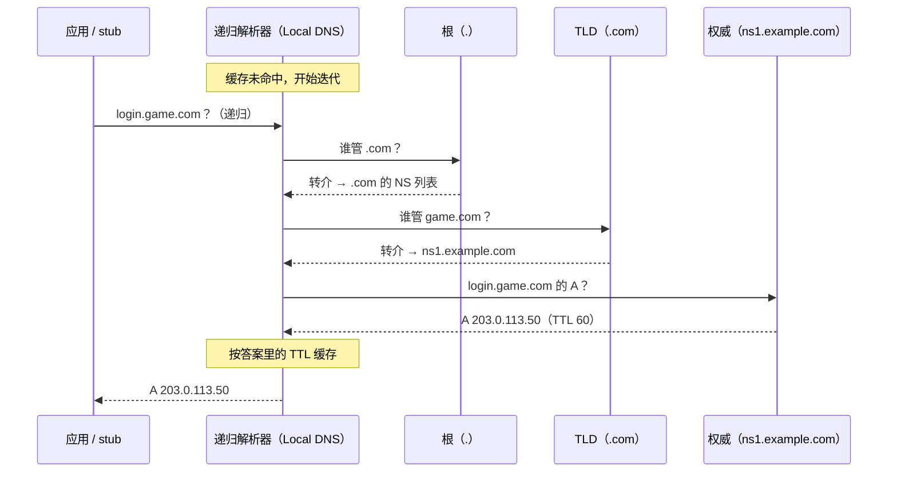
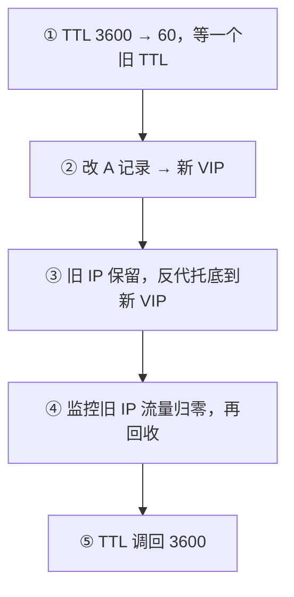
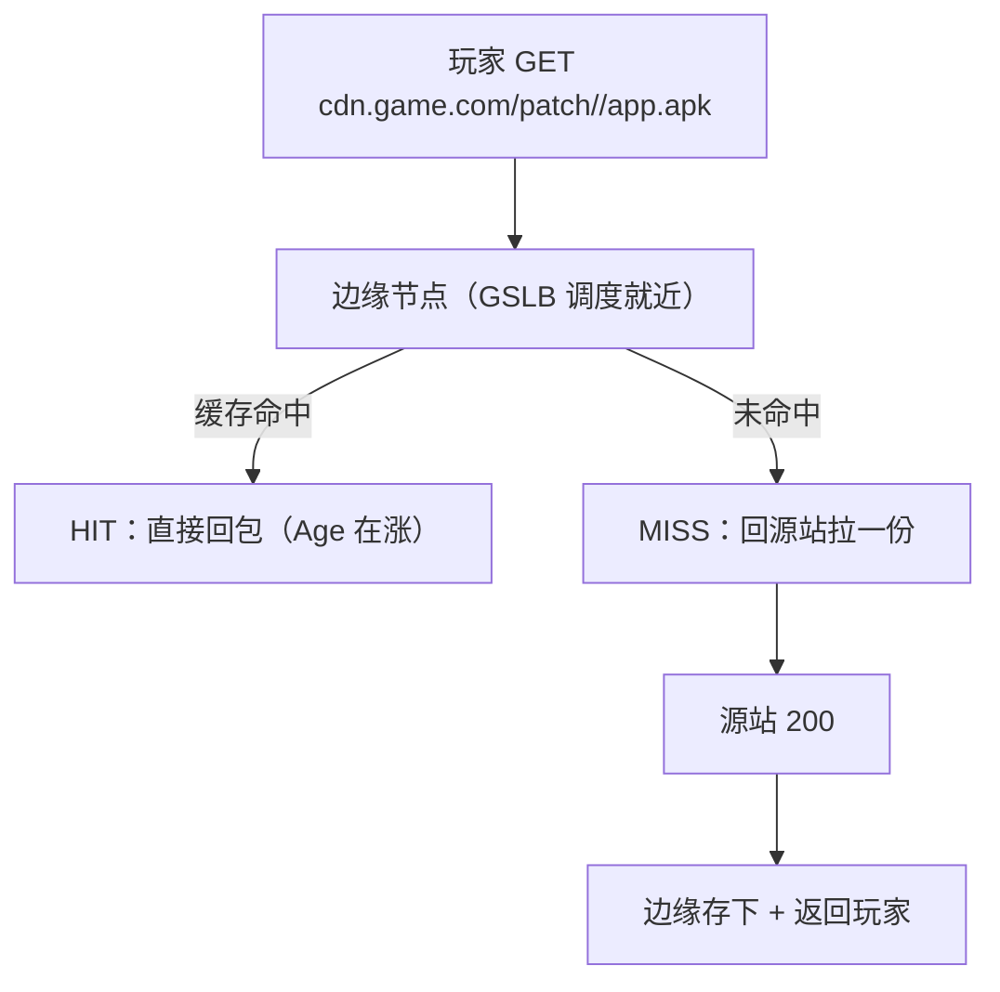
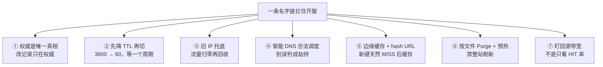
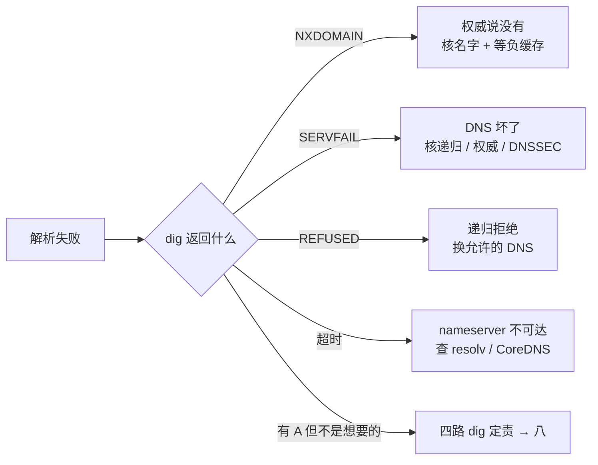
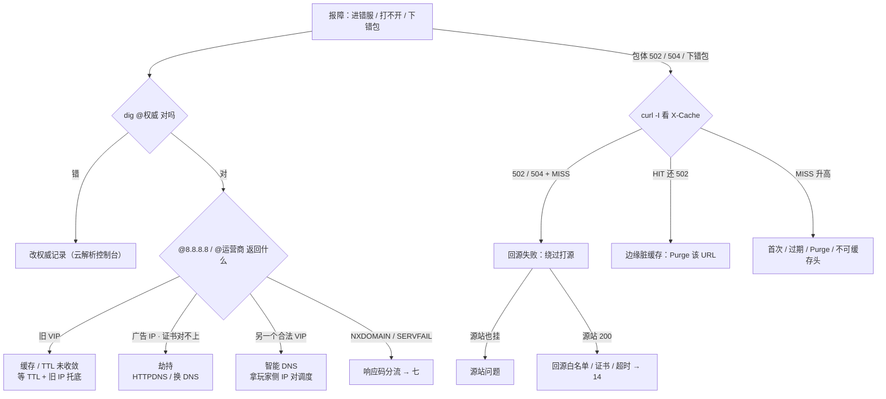

# DNS 与 CDN

> 开服把登录域名切到新机房，你改完 A 记录自己 `dig` 已是新 IP，渠道 A 还在进旧服；热更窗口有人顺手点了「整站 Purge」，源站出口瞬间打满——群里一半人说「缓存没生效，再刷一次」，一半人说「被劫持了」。
> **本章回答**：一次域名解析的一生——从应用要 IP、递归找权威、答案被缓存，到包体从 CDN 边缘落到玩家手里，每一站在哪、什么会脏、坏了怎么定责。
> **不讲**：`dig` 第一刀与 `curl -w` 五段定层 → [02](../02-网络排查命令/)；DNS 为什么用 UDP 53、何时转 TCP → [13](../13-TCP与UDP/)；`Cache-Control` 完整语义、入口证/回源证/SNI → [14](../14-HTTP与TLS/)；抓包看 DNS → [16](../16-网络排障与抓包/)。

**标记**：🎯重点 · 🔥难点 · ⭐常考 · 🔧实操

---

## 一、一张图：一次域名解析的一生

> 🎯 **一句话**：解析的一生六段——出发、找答案、记下来、岔路、到玩家身边、生病；坏了先问「卡在哪一段」。


**读图**：

- 主线是一条解析的一生：应用发起 → 递归与权威逐级迭代 → 答案连同 TTL 被层层缓存 → 中途可能被分流或劫持 → 终点是登录 VIP 或 CDN 边缘 → 生病时用 dig 和 curl 照「卡在哪一段」。
- 「记下来」是最容易翻车的一段：**权威改了 ≠ 用户切了**，四层缓存里任何一层脏，都会「部分人还打旧」。
- 本章的作战武器只有两件：`dig` 四路对比（分权威/缓存/劫持）和 `curl -I` + 绕过打源（分边缘/源站）。

### 两个域名，两套故障面 🎯⭐

游戏通常把「登录」和「包体」拆成两个域名，解析的终点不同、挂掉的样子也不同：

| 对比 | `login.game.com`（登录） | `cdn.game.com`（包体） |
|------|--------------------------|------------------------|
| 解析到 | VIP / 智能 DNS | CNAME 到 CDN 厂商 → 边缘节点 |
| 后面是什么 | 四层 LB → 网关 → Conn | 边缘 HIT 或 MISS 回源 |
| 挂了像什么 | 进错服、连不上 | 下载慢、下错包、502 |

**读表**：玩家说「进错服」先查登录域名的解析链，说「下错包」先查 CDN——两个域名的故障面互不相干，别在包体 502 时只查 DNS，也别在登录未收敛时去动包体缓存。开服的正确顺序是**先稳定登录 DNS，再发包体**（为什么，见七）。

---

## 二、出发：应用要 IP，先问本机

> 🎯 **一句话**：应用连域名前先走本机查找链——应用缓存 → hosts → OS 缓存 → resolv.conf 指定的递归。

连 `login.game.com` 之前，应用不会直接对网络发 DNS 查询。第一段全在本机：进程内的 **stub resolver**（存根解析器，`getaddrinfo` 那一层）按 `/etc/nsswitch.conf` 里 `hosts:` 一行的顺序查——**`files` 在 `dns` 前，`/etc/hosts` 命中就不问 DNS**，这是本机短路；没命中才按 `/etc/resolv.conf` 的 `nameserver` 去问递归解析器。

> 💡 **打个比方**：hosts 像你在通讯录里手写备注——只对你这台手机生效，改一台漏一台；resolv.conf 里的 nameserver 是「默认查号台号码」，DHCP 一刷新可能就被改掉。

### K8s 里的 ndots 空转 🎯⭐

Pod 的 resolv.conf 带一长串 `search` 域和 `ndots:5`：名字里点数不足 5 会先拼上集群后缀挨个试一遍，全部 NXDOMAIN 之后才拿原名去问外网。

```text
api.pay.com（3 个点 < ndots:5）
  → api.pay.com.default.svc.cluster.local    NXDOMAIN
  → api.pay.com.svc.cluster.local            NXDOMAIN
  → api.pay.com.cluster.local                NXDOMAIN
  → 才拿 api.pay.com 去问外网递归
```

**读图**：一次外网解析变成四次无效查询，全都打到 CoreDNS——「登录 Pod 调支付网关每次 DNS 几十毫秒、CoreDNS 却不忙」就是它。写法：外网域名写成 FQDN 带点（`api.pay.com.`），或调小 ndots。深挖 → [03-09](../../03-Kubernetes/09-CoreDNS/)。

### Could not resolve 怎么走查 🔧

> 🔍 **现场**：机器报 `Could not resolve host`，先按本机这条链走一遍，再骂公网 DNS。

```bash
grep login.game.com /etc/hosts        # hosts 有没有手写短路
grep '^hosts' /etc/nsswitch.conf      # files 和 dns 谁先
cat /etc/resolv.conf                  # nameserver 是谁、search 多长
dig login.game.com @10.96.0.10 +short # 直接问 resolv 里的那台递归
dig login.game.com. +short           # FQDN 带点，跳过 search 补全
```

```text
# /etc/hosts 无匹配                                  ← 本机没短路，往下走
hosts:      files dns myhostname                     ← files 在前：hosts 命中就不问 DNS
nameserver 10.96.0.10                                ← 典型 CoreDNS
search default.svc.cluster.local svc.cluster.local cluster.local
```

四种走查结论：hosts 有旧 IP → 本机短路让你误判「DNS 已切」，删掉或改对；`@nameserver` 超时 → 递归挂了/网络不通，查 CoreDNS 的 Pod 和 Service，不是业务名拼错；resolv.conf 重启就丢 → 被 DHCP / NetworkManager 覆盖，用 NM 的 dns 配置或 `resolvconf` 钉死，云上改 DHCP 选项/内网 DNS，**手改这一份文件不能当变更**；`search` 域很长 → 短名字先补后缀，和 ndots 同一类慢，能写 FQDN 就写 FQDN（`dig login.game.com.` 跳过补全）。

> ⚠️ **别混**：调试时手改 hosts 指新 VIP——本机能通，但**改一台漏一台**，生产不要靠 hosts 做服务发现；临时写要有回滚并进变更记录。

---

## 三、找答案：递归与权威

> 🎯 **一句话**：客户端对 Local DNS 是递归，Local DNS 对根/TLD/权威是迭代，权威才是唯一真相。

### 递归 vs 迭代 🎯⭐🔥

| 对比 | 递归查询 | 迭代查询 |
|------|----------|----------|
| 发生在 | 应用 → Local DNS | Local DNS → 根 / TLD / 权威 |
| 含义 | 「帮我查完，给我最终答案」 | 「你不知道就告诉我下一步找谁」 |
| 谁在做 | 运营商 DNS、公司内网 DNS、8.8.8.8 | 递归解析器自己挨家问 |

> ⚠️ **别混**：用户电脑**不会**自己去问根——口播「客户端迭代问根」是错的。客户端只把问题交给递归（一次问完）；逐级去问根、TLD、权威的是递归解析器。`dig +trace` 模拟的就是递归的迭代路径，不是客户端直连。

> 💡 **打个比方**：客户端只打「114 查号台」（递归），查号台自己去翻黄页（权威）。你改了黄页上的号码，查号台记事本上还记着旧号——打电话的人仍会打到旧地址；权威改了，递归缓存还是旧的，就是这件事。

### 逐级解析过程图：一次未命中缓存 🎯⭐



**读图**：根和 TLD 只做**转介（referral）**——「不知道答案，但下一步找谁」；只有最末那台权威给出 A 记录。递归把答案连同 TTL 一起缓存，TTL 没过期前同一个问题不会再走这条链。

### dig +trace：把这条链打出来 🔧

> 🔍 **现场**：分「权威错了」还是「中间缓存脏了」，第一刀就是 `+trace`。

```bash
dig login.game.com +trace
```

```text
.                    518400  IN  NS  a.root-servers.net.   ← 根转介
com.                 172800  IN  NS  a.gtld-servers.net.   ← TLD 转介
game.com.            86400   IN  NS  ns1.example.com.      ← 权威 NS
login.game.com.      60      IN  A   203.0.113.50          ← 最后一行 = 权威真相
```

**读法**：中间 NS 行只要求「链路通」，**最后一行 A 记录才是权威的真相**。权威最后一行是新的、某台递归返回旧的 → 缓存问题；最后一行本身就旧 → 去权威（云解析控制台）改记录。

看完整 dig 输出（不加 `+short`）认四个字段：**ANSWER SECTION** 是最终答案；**AUTHORITY** 是权威 NS；**Query time** 很大先怀疑递归不可达；**SERVER** 一行确认你真的问到了想问的那台 DNS（`@8.8.8.8` 时先看它）；ANSWER 里的 **TTL** 是「这条答案还能缓存多久」，从被查询那台递归的视角看——刚改完权威、这里还很大，说明缓存没过期。查 CNAME 链也用不加 `+short` 的完整输出，能看到两行：CNAME + A。

### 顺带三件：anycast、UDP 53、记录类型 ⭐

- **anycast**：根只有 **13** 组 IP，却由全球数百个实例宣告同一地址，查询自动落到就近节点；8.8.8.8、223.5.5.5 这类公共 DNS 也是 anycast——这就是「换一台公共 DNS 对比」有意义的底层原因。
- **UDP 53**：DNS 查询一问一答走 UDP 53（为什么用 UDP、响应过大何时转 TCP → [13](../13-TCP与UDP/)）。
- **记录类型**：**A / AAAA**（名字 → IPv4 / IPv6，登录 VIP）；**CNAME**（别名，包体域名先 CNAME 到 CDN 厂商）；**NS**（谁管这个域，+trace 里全是它）；**MX / TXT**（邮件 / 验证，排障时少碰，**别误删**）。

> 📝 **面试**：问「用户电脑会自己问根吗」，答「不会，问递归；递归再迭代问根/TLD/权威，+trace 打印的就是这条迭代路径」。

---

## 四、记下来：记录、TTL 与切流纪律

> 🎯 **一句话**：每层都按 TTL 缓存答案——TTL 长省查询、难切流；切流的全部纪律就是跟缓存抢时间。

### TTL 的两面性 🎯🔥

TTL 是权威随每条记录发的「保鲜期」：递归在 TTL 内直接回缓存、不再问权威。**长 TTL** 省查询、扛查询高峰，但改了记录最长要等一个旧 TTL 才生效；**短 TTL** 切得快，但解析压力全打到权威和递归。日常记录可以放 3600，**要切流的记录必须提前降到 60**。

> 💡 **打个比方**：搬家换电话，先告诉查号台「这号码只记 1 分钟」（降 TTL），等旧记录过期再公布新号（改 A）；有些查号台不守规矩仍记旧号（运营商不守 TTL）——旧号码留个语音信箱转接到新号（旧 IP 反代托底）。

### 缓存藏在五层

```text
① 应用 / 连接池里的旧 IP（业务自己缓存）
② OS stub / nscd / systemd-resolved
③ Local DNS / 运营商递归        ← 最常见的脏点
④ 公共 DNS（8.8.8.8 / 223.5.5.5）
⑤ 权威（唯一真相；改记录只在这里）
```

**读图**：权威改了，①～④ 任何一层脏都会「部分人还打旧」。所以「DNS 已切」是个**分层达成**的状态，不是权威改完那一刻。

### 切流五步（按顺序，不能跳）🎯⭐🔥



**读图**：①是给④争取时间——TTL 没降就改 A，等于最长一个旧 TTL 内新旧 VIP 双活；③是对不守 TTL 的运营商兜底——旧 VIP 上挂 Nginx/LB 反代到新机房（反代写法 → [19](../19-Nginx/)），谁打旧 IP 都能到新服。

验证用四路 dig（完整定责见八）：

```bash
dig login.game.com @ns1.example.com +short   # 权威：应是新 IP
dig login.game.com @8.8.8.8 +short           # 公共 DNS：TTL 内还是旧 IP 也正常
```

```text
203.0.113.50        ← @权威，已生效
198.51.100.10       ← @8.8.8.8，还在 TTL 内，不是权威没改
```

> ⚠️ **别混**：「DNS 已切」≠「用户已切」。你电脑 `dig` 对了只是⑤→④之间的某一层对了；**验收标准是旧 IP 流量归零**，不是你电脑的答案。同理「本机 ping 通 ≠ DNS 没问题」——智能解析按地域返回不同 VIP，你解析到的是另一机房，排障必须拿玩家侧 `dig` 或客户端日志里的 IP。

### 负缓存：NXDOMAIN 也会被缓存 ⭐

「没有这个域名」的 NXDOMAIN 答案同样带 TTL 被递归缓存（**负缓存**）。表现：权威已经把记录补回去了，部分用户仍解析失败。处理：用 `@权威` 与 `@运营商` 对比证明权威已好，然后**等负缓存过期**（时长发行版/厂商各异），或临时换公共 DNS 验证——不要反复改业务里的域名拼写。

### 摘流量纪律

- 摘流量要 **VIP 级（LB 摘）+ DNS**，不要只改 DNS：健康检查摘掉了死 VIP，TTL 内仍可能有人打到。
- 开服当天不要把登录 TTL 和 CDN 规则**叠在同一窗口改**：DNS 未收敛时动包体缓存，会让部分地区回源、部分地区打旧缓存。

> 📝 **面试**：「切流我先 TTL 3600→60 等一个周期，再改 A；旧 IP 反代托底，监控流量归零；运营商可能不守 TTL，权威改了不等于切完。」

---

## 五、岔路：split DNS、智能 DNS 与劫持

> 🎯 **一句话**：同一个域名在不同网络拿到不同答案，可能是设计（split DNS、智能 DNS），也可能是劫持——判据是「IP 是不是你配置的」。

### split DNS（内外分流）

企业内网常见**两套答案**：在公司内网问 `git.internal`，内网递归直接返回内网 IP；在公网问，公共递归返回公网 IP 或干脆 NXDOMAIN。这是**设计不是故障**——所以「我在公司 dig 和在家 dig 答案不一样」先确认是不是 split DNS，别当劫持上报。排障时问清「你在哪个网络里查的」。

### 智能 DNS / GSLB：合法的不同答案

**GSLB（全局负载均衡）**按来源地域返回不同 **VIP**——华北进北京机房、华南进广州机房，IP 不同但**都是你配置的合法地址**，权威认可（或按 ECS 子网返回同类）。游戏用它做就近接入和多机房分流；选型上智能 DNS 管接入分流，**核心实时服常用固定 VIP + 四层 LB**，别只靠短 TTL 去调度实时战斗连接——玩家开局打到一半被解析切走，比慢更糟。

### 劫持：不合法的不同答案 🎯⭐🔥

> 🔍 **现场**：部分地区玩家下载包体变成广告页、证书域名对不上，有人喊「被劫持了」——四路 dig 一对比就知道。

```bash
dig cdn.game.com @ns1.example.com +short   # 权威
dig cdn.game.com @8.8.8.8 +short           # 公共 DNS
dig cdn.game.com @114.114.114.114 +short   # 运营商
```

```text
203.0.113.20        ← @权威 / @8.8.8.8：你们的边缘 VIP
59.24.3.174         ← @运营商：广告页 IP，不是你们配置的任何地址
```

| 对比 | 智能 DNS / GSLB | 劫持 |
|------|------------------|------|
| 返回的 IP | 你配置的合法 VIP | 广告页 / 错误 IP |
| 权威是否认可 | 是（或按 ECS 返回同类） | 否，权威与运营商不一致 |
| 证书 | 通常正常 | 常对不上 |
| 处理 | 拿玩家侧 IP 对调度策略 | HTTPDNS / 换 DNS / 投诉运营商 |

> ⚠️ **别混**：**不同 IP ≠ 劫持**。智能 DNS 的不同 IP 都是合法 VIP；劫持的 IP 是权威从没发过的。另一个方向也别混：华北玩家打进华南合法 VIP，是调度策略要调，不是安全事件。

### HTTPDNS：绕开递归

客户端用 **HTTPS** 直接问业务自己的解析接口拿 IP，连接时指定 IP 但证书仍校**原域名**——排障同款手法就是 `curl --resolve`（六节）。代价：容灾、调度、缓存过期全自己做；**别把 HTTPDNS 当唯一真相而不监控权威**。

### 交叉验证四招 🔧

① 四路 dig 对比（权威 / 8.8.8.8 / 运营商 / +trace）；② 换 4G、Wi-Fi 或 **DoH**（DNS over HTTPS，绕开运营商明文 53 端口）再查；③ 看客户端日志里**实际连接的 IP** 和证书域名是否匹配；④ 证书对不上 → 优先怀疑劫持或错误 Host/SNI（→ [14](../14-HTTP与TLS/)），**不要先去改业务 SQL**。

> 📝 **面试**：「劫持是权威和公共 DNS 对、运营商错且是广告 IP；智能 DNS 是不同 IP 但都是合法 VIP。HTTPDNS 绕过 Local DNS，SNI / 证书仍用原域名。」

---

## 六、到玩家身边：CDN

> 🎯 **一句话**：包体域名 CNAME 到 CDN，GSLB 调度到就近边缘节点——命中直接回、未命中回源；脏活全在缓存键和刷新上。

### 接入与调度：CNAME → GSLB → 边缘

包体域名接入 CDN 就是把 `cdn.game.com` CNAME 到厂商域名（如 `cdn.game.com.cdn77.net.`），dig 会看到**两行**：CNAME + A。厂商的 **GSLB** 按玩家来源和边缘负载，把这个 CNAME 解析到**就近的边缘节点** IP——调度发生在解析这一步，玩家无感。

> 💡 **打个比方**：CDN 边缘像连锁便利店——门口有货（HIT）就不去仓库（源站）拿；没货（MISS）才回源补一份上架。**整站 Purge 等于把所有分店货架一次清空，顾客全涌向仓库**，仓库瞬间被挤爆。

### 一次包体请求：HIT / MISS / 回源 🎯⭐



**读图**：HIT 和 MISS 的分界就在边缘节点；MISS 多一跳回源，所以**MISS 不一定是故障**——首次访问、TTL 过期、刚 Purge、源站发了不可缓存头，全是正常 MISS；客户端强制刷新也会 MISS。看命中状态用响应头：

```bash
curl -I https://cdn.game.com/patch/v1.2.3/app.apk
```

```text
HTTP/2 200
x-cache: HIT                     ← 是否回源（厂商字段名可能略异）
age: 3600                        ← 这份内容已在边缘存了多久
cache-control: public, max-age=86400   ← 源站说能不能存、存多久（语义 → 14）
via: 1.1 cache-node-03           ← 经了哪层代理
```

### 边缘 502 / 504：先看 X-Cache 再绕过打源 🎯⭐🔥

```bash
curl -I https://cdn.game.com/patch/v1.2.3/app.apk
```

```text
HTTP/2 502
x-cache: MISS                    ← MISS + 5xx：边缘没拿到，问题在回源这一跳
via: 1.1 cache-node-03
```

| 组合 | 锅在哪 | 先做 |
|------|--------|------|
| 502 + MISS | 边缘**回源失败** | **当源站查**：绕过 CDN 打源 |
| 504 + MISS | 源太慢 | 源站性能 / 回源超时 |
| HIT 还 502 | 边缘脏缓存 / 边缘故障 | **不是回源**；Purge 该 URL |
| 绿锁 + 502 | 入口证 OK，回源是另一跳 | 回源证 / 白名单（→ 14） |

绕过 CDN 直接打源——把「边缘」从链路里抠掉：

```bash
curl -I -H 'Host: cdn.game.com' http://203.0.113.100/patch/v1.2.3/app.apk
# HTTPS 回源时指定 IP 仍用原域名校验证书：
curl --resolve cdn.game.com:443:203.0.113.100 https://cdn.game.com/patch/v1.2.3/app.apk -I
```

**读数**：源站也失败 → 源站问题；源站 200 → 锅在回源配置：回源白名单、回源证书、回源超时、**安全组没放行 CDN 回源网段**（经典坑：源站只允许了办公网 IP）——防火墙侧去 [17](../17-iptables与conntrack/)。

> ⚠️ **别混**：**边缘绿锁 ≠ 源站健康**。绿锁只证明玩家到边缘这一跳证书正常；回源是另一跳、常常是另一张证（入口证 / 回源证两套语义 → [14](../14-HTTP与TLS/)）。源站本机 `curl localhost` 正常也不够——localhost 没走 CDN 回源路径。

### 缓存键：什么算「同一个对象」🔥

边缘用**缓存键**判断两个请求是不是要同一个文件：

| 通常计入缓存键 | 常被忽略（除非你配置） |
|----------------|------------------------|
| 协议 + Host + URL 路径 + Query（可配） | Cookie（静态包体多数不应计入） |
| 部分厂商可配特定 Header | 随意自定义头导致缓存碎片 |

**游戏包体纪律四条**：① URL 带 **content hash**，不要同 URL 覆盖发布；② 分版本路径、长 TTL，发版 **Purge 指定 URL**，禁止整站刷新；③ Query 别当版本号（`?v=1` 易脏、易碎片），hash 路径更稳；④ 带 `Set-Cookie` / `Authorization` / `private` / `no-store` 的响应默认不该被长期缓存——**4xx / 5xx 默认也不缓存**（源站抖一下的 502 不会驻留边缘，但把它配成缓存错误页就是另一回事）；登录、支付 API 上 CDN 慎之又慎，要秒级生效的配置表用短 TTL 或改 hash URL，别赌超长 TTL。

### Purge / 预热：主动缓存刷新

**Purge（缓存刷新）**是主动删边缘缓存：按 URL 精确失效；**预热**是主动把新文件提前灌进热门边缘节点。两者配对：Purge 管旧、预热管新。整站 Purge → 全边缘同时 MISS → 回源风暴打满源站；同 URL 覆盖发布 → 各地 TTL 不同步、新旧混杂；大量文件 TTL 同时到期 → 小规模同款风暴。

**发版正确顺序**：① 上传新 hash 路径文件 → ② 预热热门节点（**渠道包走不同 CDN 域名的要分别预热**）→ ③ 客户端配置指向新 URL（或灰度）→ ④ 旧 URL 保留一段时间再删，必须失效就按 URL Purge → ⑤ 盯 **CDN 回源带宽**，不是只看边缘 HIT 率——HIT 率掉是结果，回源带宽涨才是警报。

> ⚠️ **别混**：**CDN 边缘缓存 ≠ 浏览器缓存**。边缘缓存在机房、所有用户共享，靠 Purge/预热管理；浏览器缓存在玩家设备、各自独立，你 Purge 不到它，只能靠 `Cache-Control` 让它自然过期（→ [14](../14-HTTP与TLS/)）。「部分地区还下到旧包」时先想是哪一层。

### 收束：一条名字链凭什么扛住开服 🎯⭐

到此，从域名到内容的全部零件齐了。面试问「开服怎么保证解析和分发不翻车」，答这张清单——**七件套，一件不落**：



**读图**：①～③是解析侧（权威、TTL、托底），④是调度，⑤～⑦是分发侧（边缘、刷新、监控）——开服事故十有八九是缺了其中一件：没降 TTL 就切、没托底就回收、整站 Purge、只看 HIT 率不看回源。

---

## 七、生病：解析失败与切流翻车

> 🎯 **一句话**：失败先分「没有」还是「坏了」——NXDOMAIN 和 SERVFAIL 处理完全不同；翻车场景各有止损动作。

### NXDOMAIN vs SERVFAIL 🎯⭐🔥

| 对比 | NXDOMAIN | SERVFAIL |
|------|----------|----------|
| 谁说的 | **权威说**：没有这个名字 | **递归说**：我没能拿到答案 |
| 含义 | 记录删了 / 名字拼错 | 递归或权威故障、DNSSEC 验证失败 |
| 还会怎样 | 被负缓存，补回记录也要等 | 换一台递归可能就好 |
| 先做 | 核记录和拼写，等负缓存 | 核递归 / 权威 / DNSSEC 健康 |
| 别做 | 当 SERVFAIL 改业务名 | 当「域名不存在」改业务拼写 |

配套两个：**REFUSED** 是递归用 ACL 拒绝为你服务（换个允许的 DNS，别当权威没记录）；**超时** 是 nameserver 不可达（resolv.conf、CoreDNS 挂、网络不通、防火墙拦了）——先查递归通不通。与之相对的 **NOERROR + A** 是「有答案」：答案对不对是另一回事，IP 不是想要的走四路 dig（八），别在响应码上浪费时间。



**读图**：第一刀永远是看**响应码**而不是重试。「有 A 但不是想要的」才是四路 dig 的地盘；连答案都没有时，先分清是权威没答案还是递归坏了。

### 三个翻车剧本 🔥

**没降 TTL 就改了 A**：新 VIP 已上线，旧 VIP 还在接最长一个旧 TTL 的量。补救：立刻在旧 VIP 上挂反代托底到新机房（别急着摘）；监控旧 IP 流量归零再回收；复盘把「降 TTL」写进变更单第一行。

**DNS 未收敛时有人点了整站 Purge**：等于两个事故叠加——一半人还在打旧入口，另一半被强制回源。表现是登录慢 + 下载慢同时爆。止损：先稳定登录 DNS（托底、等 TTL），同时**停掉后续整站刷新**，改按 URL Purge，源站限流扩容。复盘：开服 DNS 与 CDN 规则**不同窗口改**；包体必须 hash URL。

**回源被打穿**（源站带宽/负载打满）：先看是不是整站 Purge 或 TTL 同时到期；已发生就停整站刷新、按 URL 精确失效、源站限流 + 扩容；盯回源带宽而不是 HIT 率。

> 📝 **面试**：「DNS 未收敛 = 部分用户还打旧 VIP，不是全集群挂了，不要先整站 Purge」——这句话能救一半的线上误操作。

---

## 八、作战：四路 dig 定责

> 🎯 **一句话**：DNS 问题固定四路对比、CDN 问题固定 X-Cache + 绕过打源——两件武器走完 60 秒。

### 定责决策树 🎯⭐



**读图**：左半边是解析侧——第一问永远是「权威对不对」，权威错一切白搭；权威对了才轮到分缓存、劫持、调度。右半边是分发侧——X-Cache 决定锅在边缘还是在源站。两个入口按报障现象选：进错服走左，下错包走右。

> 🎯 **值班签名**：自己 dig 已是新 IP、渠道还进旧服——先想 **TTL / 运营商缓存**，不是先 Purge；CDN 502——先想**绕过打源**，不是先整站刷新。

### 和 curl -w 怎么接 🔧

[02](../02-网络排查命令/) 的 `curl -w` 五段先定层：`time_namelookup`（dns 段）高或 `Could not resolve` → 回本章四路 dig；dns 段很快、`time_connect` 慢 → 不是 DNS，回 02 查传输层。注意 `time_connect` 是**累计值**（含 DNS），要做差才是纯 TCP 时间——细节在 02，本章不展开。

### 现象 · 先做 · 别做 🎯⭐

| 现象 | 先做 | 别做 |
|------|------|------|
| 部分渠道进旧服 | TTL 纪律 + 旧 IP 托底；拿玩家 dig | ping 自己电脑当验证 |
| 权威对、运营商广告页 | 按劫持查：HTTPDNS / 换 DNS | 先改业务域名 |
| 华北打进华南合法 VIP | 智能 DNS；拿玩家 IP 对调度 | 当劫持上报 |
| NXDOMAIN | 核记录 + 等负缓存 | 当 SERVFAIL 改业务名 |
| SERVFAIL | 核递归 / 权威 / DNSSEC | 改业务拼写 |
| 外网解析慢、CoreDNS 不忙 | ndots / FQDN 带点 | 先骂公网 DNS |
| CDN 502、源站 localhost 正常 | 源站 IP + Host + SNI 绕过打源 | 只信绿锁 |
| HIT 还 502 | 边缘脏缓存，Purge 该 URL | 当回源问题查源站 |
| MISS 比例升高 | 是否不可缓存头 / Purge / 首次 | 先工单骂厂商 |
| 源站带宽打满 | 查是不是整站 Purge | 再整站刷一次 |
| resolv.conf 重启丢 | NM / DHCP 钉死 | 每台手改当变更 |
| curl -w dns 段高 | dig 四路（本章） | 跳过 dig 直接抓包（16） |

### 60 秒剧本 🔧

> 🔍 **现场**：接到「进错服 / 下错包」报障，60 秒走完这条线再下结论。

```text
① 0–10s   先问哪个域名：登录（进错服）还是包体（下错包）？
② 10–30s  登录：四路 dig——@权威 / @8.8.8.8 / @运营商 / +trace
③ 30–45s  包体：curl -I 看 X-Cache——MISS 5xx 绕过打源，HIT 5xx 查边缘
④ 45–60s  定责：权威错改记录 · 旧 VIP 等托底 · 广告 IP 走劫持 · 合法 VIP 对调度
```

---

## 九、收口

### 命令速查 🔧

```bash
dig login.game.com +short                       # 本机答案（≠ 玩家答案）
dig login.game.com @ns1.example.com +short      # 直问权威：改记录生没生效
dig login.game.com @8.8.8.8 +short              # 公共 DNS 对比
dig login.game.com @223.5.5.5 +short            # 第二家公共 DNS 交叉
dig login.game.com @114.114.114.114 +short      # 运营商对比（劫持/缓存）
dig login.game.com +trace                       # 从根走迭代：最后一行 = 权威真相
curl -I https://cdn.game.com/app.apk            # 看 x-cache / age / via
curl -I -H 'Host: cdn.game.com' http://<源站IP>/app.apk      # 绕过 CDN 打源（HTTP）
curl --resolve cdn.game.com:443:<源站IP> https://cdn.game.com/app.apk -I   # HTTPS 打源
```

值班先跑四路 dig；CDN 再加 `curl -I` 和绕过打源；抓包（[16](../16-网络排障与抓包/)）是 dig 之后的第二梯队。

### 面试锚点

| 问 | 30 秒答 |
|----|---------|
| 用户电脑问根吗？ | 否，问递归；递归再迭代问根/TLD/权威。 |
| dig +trace 干什么？ | 从根打印整条迭代转介，最后一行 A = 权威真相；分「权威错还是缓存脏」。 |
| 权威改了用户切了吗？ | 否，「DNS 已切」≠「用户已切」；验收看旧 IP 流量归零。 |
| 切流五步？ | 降 TTL→等旧 TTL→改 A→旧 IP 托底→流量归零回收，TTL 调回。 |
| NXDOMAIN vs SERVFAIL？ | 权威说没有 vs DNS 坏了；负缓存 vs 查递归/权威/DNSSEC。 |
| split DNS 是什么？ | 内外网两套答案，是设计；先问在哪个网络查的。 |
| 劫持 vs 智能 DNS？ | 广告/错 IP、证书对不上 vs 你配的合法 VIP；四路 dig 分。 |
| HTTPDNS 证书校谁？ | 原域名（SNI/Host 仍用原名），不是校 IP。 |
| CDN 502 怎么分锅？ | 看 X-Cache：MISS 当源站查、绕过打源；HIT 还 502 是边缘脏缓存。 |
| MISS 一定是故障？ | 否：首次 / 过期 / Purge / 不可缓存头 / 强制刷新。 |
| 包体怎么防回源风暴？ | hash URL + 按文件 Purge + 预热；禁整站刷新；盯回源带宽。 |
| 缓存键是什么？ | 协议 + Host + URL（Query 可配）；同 URL 覆盖必脏，hash 路径是硬纪律。 |
| K8s 解析外网慢？ | ndots:5 先拼 cluster 域空转；写 FQDN 带点。 |

### 易错一句话对照

- 用户电脑自己去问根 → 错，问递归、递归迭代
- 权威改了用户就切了 → 错，四层缓存 + 负缓存都可能还旧
- 只 ping 自己电脑验证切流 → 错，智能 DNS 按地域不同 VIP
- 运营商不守 TTL 也只改 A → 错，旧 IP 必须托底
- NXDOMAIN 和 SERVFAIL 一样处理 → 错，一个是「没有」一个是「坏了」
- 不同 IP 就是劫持 → 错，智能 DNS 的不同 IP 是合法 VIP
- split DNS 两套答案当故障 → 错，那是设计
- HTTPDNS 拿 IP 后用 IP 校验证书 → 错，证书签给域名，SNI/Host 用原名
- hosts 做生产服务发现 → 错，改一台漏一台
- resolv.conf 手改当变更 → 错，DHCP/NM 会覆盖
- MISS 就是 CDN 坏了 → 错，首次/过期/Purge/不可缓存头都 MISS
- HIT 还 502 当回源问题 → 错，边缘自己的问题
- 整站 Purge 最快 → 错，回源风暴打爆源站
- 同 URL 覆盖发布 → 错，各地 TTL 不同步必脏缓存
- Query `?v=2` 当版本号 → 错，易脏易碎片，hash 路径更稳
- 边缘绿锁证明源站正常 → 错，入口证 ≠ 回源证
- 开服当天 DNS 和 CDN 一起改 → 错，先 DNS 稳定再发包体
- 健康检查摘了死 VIP 就没人打 → 错，TTL 内仍可能打到
- CDN 缓存和浏览器缓存是一层 → 错，边缘共享可 Purge，浏览器各自管不了

### 数字墙

> 切流前 TTL **3600→60** · 等待 = **一个旧 TTL** · 根 **13** 组（anycast 数百实例）· DNS 走 **UDP 53** · K8s ndots 默认 **5** · 包体 TTL 可**天级**（仅 hash 路径）· Purge 粒度 = **具体 URL** · 切流验收 = **旧 IP 流量归零** · 入口证 / 回源证 **14 天**（有效期语义 → [14](../14-HTTP与TLS/)）

---

## 合上书

- [ ] **默画一节的图**：出发 → 找答案 → 记下来 → 岔路 → 到玩家身边 → 生病 → 作战；登录与包体两个域名两套故障面。
- [ ] **口述出发**：本机查找顺序（应用缓存 → hosts → OS 缓存 → resolv）、`files dns` 谁先、resolv.conf 被谁覆盖、ndots 空转链怎么绕过。
- [ ] **口述找答案**：递归和迭代各发生在哪一段、+trace 每一行是什么、最后一行是什么、anycast 为什么根只要 13 组。
- [ ] **口述记下来**：TTL 两面性、缓存五层哪层最常脏、切流五步、负缓存、验收标准为什么是流量归零。
- [ ] **口述岔路**：split DNS 为什么不是故障、劫持和智能 DNS 的判据、HTTPDNS 证书校谁。
- [ ] **默画六节 HIT/MISS 图**：502/504 怎么分锅、绕过打源两条命令、缓存键计入什么、包体纪律四条、发版顺序五步。
- [ ] **口述生病**：NXDOMAIN vs SERVFAIL、REFUSED 和超时各查什么、没降 TTL 就改 A 怎么补救、DNS 未收敛时 Purge 了怎么办。
- [ ] **定责**：四路 dig 的四种结论组合、60 秒剧本怎么走、curl -w 的 dns 段怎么接进来。
- [ ] **边界**：dig 第一刀/curl -w 五段去 [02](../02-网络排查命令/)；包怎么进主机、队列/Recv-Q 去 [12](../12-网络栈与Socket/)；UDP 53 去 [13](../13-TCP与UDP/)；Cache-Control/证书去 [14](../14-HTTP与TLS/)；抓包去 [16](../16-网络排障与抓包/)；CoreDNS 去 [03-09](../../03-Kubernetes/09-CoreDNS/)；反代托底去 [19](../19-Nginx/)。

下一刀常接：[02 网络排查命令](../02-网络排查命令/)（curl -w 五段怎么嵌进整条定层）· 证书侧回看：[14 HTTP与TLS](../14-HTTP与TLS/)。
