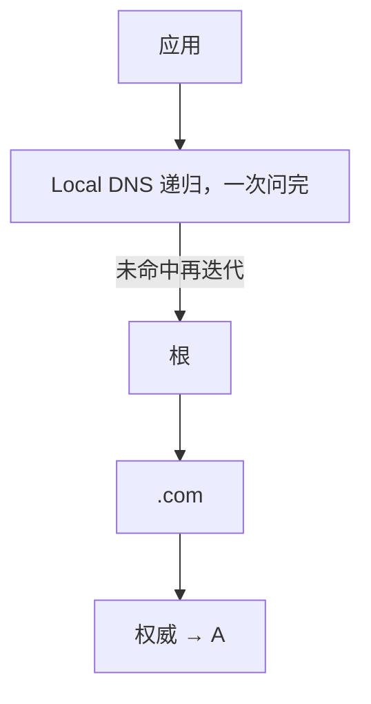
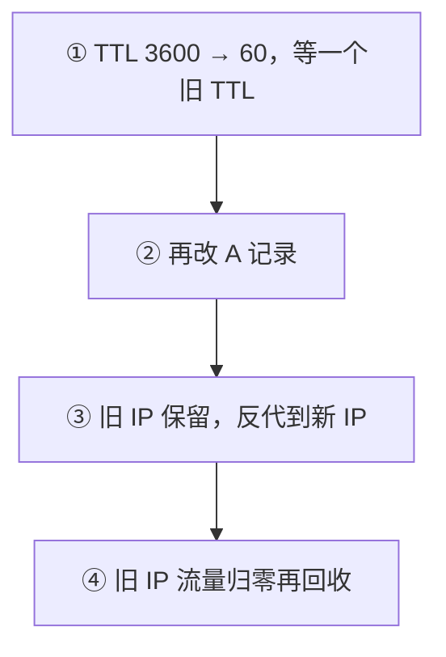
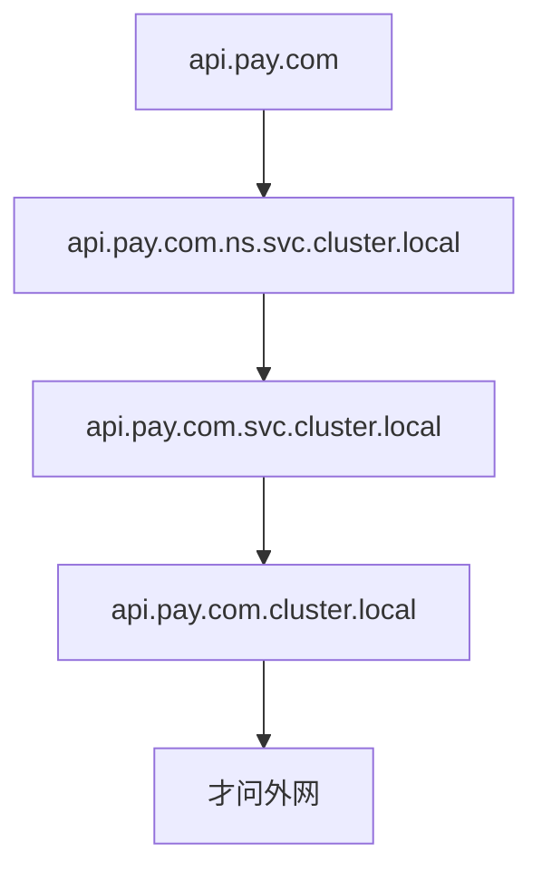

# 15｜DNS 与 CDN · 练习题

先对照 [知识点](知识点.md) **「一」总图 + 「四」TTL 切流 + 「八」dig 定责 + 「六」CDN** 自己口述，再对答案。关键字（递归/权威、TTL 切流、X-Cache、HTTPDNS、ndots）要能对比。每题标了覆盖范围：

| 标记 | 含义 |
|------|------|
| **核心** | 不懂整章就没建立起来 |
| **必会** | 值班和面试都要能讲 |
| **常用** | 线上会反复碰到 |
| **常考** | 白板和追问的高频口径 |

## 本题目录

- [Q1 递归与迭代](#q1)
- [Q2 切流仍打旧 IP](#q2)
- [Q3 CDN 502/504](#q3)
- [Q4 劫持与 HTTPDNS](#q4)
- [Q5 X-Cache MISS](#q5)
- [Q6 K8s ndots](#q6)
- [Q7 包体回源风暴](#q7)
- [Q8 NXDOMAIN vs SERVFAIL](#q8)
- [Q9 智能 DNS vs 劫持](#q9)
- [Q10 resolv.conf](#q10)
- [Q11 dig 四路对比](#q11)
- [Q12 缓存键与 curl -w](#q12)
- [Q13 切流验收五步法](#q13)
- [Q14 DNS/CDN 白板综合题](#q14)
- [合上书](#合上书)

---

## Q1

**★★★★★｜DNS 递归和迭代的区别？dig +trace 看到什么？**

**覆盖**：核心 · 必会 · 常考

**对应**：知识点 [三、找答案：递归与权威](知识点.md)（hosts 短路另见「二、出发」）

### 场景

开场就问：「用户电脑是自己去问根吗？权威已经改了，为什么公司 DNS 还是旧 IP？」

### 完整解答

**一句话**：客户端对 Local DNS 递归，Local DNS 对根/TLD/权威迭代——权威才是真相。

客户端对 Local DNS 是**递归**（帮我查完）。Local DNS 对根 / TLD / 权威是**迭代**。权威才是这个域名的真相。



`dig +trace` 从根打印整条转介直到权威 A 记录，用来排除「缓存脏了还是权威错了」。权威正常、公共 DNS 正常、公司 DNS 错 → 缓存或劫持。权威就错 → 改记录。`nsswitch` 的 `files dns` 表示 hosts 优先，本机短路会让你误判「DNS 已经切了」。

### 再追问

- dig @8.8.8.8 正常、运营商 DNS 错，下一步？——按劫持查：对比权威、换 4G/Wi-Fi、上 HTTPDNS。不要先改业务域名（见 [五、岔路：split DNS、智能 DNS 与劫持](知识点.md)）。
- 用户电脑会自己问根吗？——**不会**。口播「客户端迭代问根」是错的。

---

## Q2

**★★★★★｜改 A 记录后部分用户还打旧 IP，怎么办？**

**覆盖**：核心 · 必会 · 常考

**对应**：知识点 [四、记下来：记录、TTL 与切流纪律](知识点.md)

### 场景

开服把登录入口切到新 VIP。TTL 原来 3600。你改完 A 记录，自己电脑已经是新 IP，部分渠道还进旧服。

### 完整解答

**一句话**：TTL 缓存导致「DNS 已切≠用户已切」，先降 TTL 再改 A，旧 IP 托底。

TTL 缓存，运营商还不遵守。不要只 ping 自己电脑当验证。



游戏登录入口切流失败会变成「部分渠道进错区」。排障必须让玩家提供 `dig` 结果或客户端日志里的 IP——智能 DNS 按地域返回不同 VIP。「DNS 已切」和「用户已切」不是同一时刻。摘流量要 VIP 级（LB 摘）+ DNS。验收看**旧 IP 流量归零**，不是你电脑 dig 对了。

### 再追问

- TTL 已经 60s，为什么还有人几小时？——运营商缓存、客户端自己的缓存、连接池里的旧 IP。HTTPDNS 可缩短不可控缓存。
- 健康检查摘了死 VIP，为何还有人打？——TTL 内仍可能打到；所以要 LB 摘 + DNS。

---

## Q3

**★★★★★｜CDN 返回 502/504，怎么判断是 CDN 还是源站？**

**覆盖**：核心 · 必会 · 常用

**对应**：知识点 [六、到玩家身边：CDN](知识点.md) · 证书交叉见 [14](../14-HTTP与TLS/)

### 场景

包体下载边缘 502。源站本机 `curl localhost` 正常。浏览器看边缘是绿锁。

### 完整解答

**一句话**：CDN 502 用源站 IP+Host 绕过边缘测回源，绿锁只说明边缘证没问题。

绕过 CDN，用源站 IP + Host 头测。绿锁只说明边缘证没问题，回源是另一跳（入口证 ≠ 回源证，见 14）。


源站失败就是源；源站正常查回源白名单、回源证书、回源超时。看 X-Cache：HIT 不应 502。CDN 502 = 边缘连不上源；CDN 504 = 源太慢。源站只允许了办公网、没允许 CDN 回源网段，是经典坑。

### 再追问

- HIT 还 502 呢？——不是回源问题。查边缘脏缓存、边缘自己的故障，或 Purge 不彻底。交叉 09 的回源证书。
- 为何 localhost 正常不够？——localhost 没走 CDN 回源路径；必须测「CDN 回源 IP + Host + SNI」。

---

## Q4

**★★★★☆｜DNS 劫持怎么确认？HTTPDNS 解决什么？**

**覆盖**：必会 · 常用 · 常考

**对应**：知识点 [五、岔路：split DNS、智能 DNS 与劫持](知识点.md)

### 场景

部分玩家下载包体变成广告页，证书域名对不上。有人说是智能 DNS 调度错了。

### 完整解答

**一句话**：劫持是运营商结果与权威不一致且证书对不上，HTTPDNS 用 HTTPS 取 IP 仍校域名。

同一名字在权威、`8.8.8.8`、运营商 DNS 结果不一致，或证书域名对不上。


HTTPDNS：客户端用 HTTPS 向自有服务取 IP，绕过运营商递归。校验证书仍用原域名（SNI / Host）。代价是自己做容灾和调度。

### 再追问

- HTTPDNS 拿到 IP 之后用 IP 校验证书可以吗？——不可以。证书是签给域名的。连接指定 IP，SNI / Host 仍用原域名。见 14。
- 怎么交叉验证？——换 4G/Wi-Fi/DoH；看客户端日志实际连接 IP。

---

## Q5

**★★★★☆｜X-Cache MISS 一定是故障吗？什么情况不该缓存？**

**覆盖**：必会 · 常用

**对应**：知识点 [六、到玩家身边：CDN](知识点.md)

### 场景

发版后监控 MISS 比例升高，有人要工单骂 CDN 厂商。

### 完整解答

**一句话**：MISS 是首次/过期/Purge/不可缓存，不是 CDN 坏了；Set-Cookie/private 不该被边缘缓存。

首次、过期、Purge、不可缓存头都会 MISS。MISS 不是 CDN 坏了。

不该被边缘长期缓存：`Set-Cookie`、`private` / `no-store`；4xx / 5xx（默认）；带 Authorization 的请求；动态 API。包体哈希 URL 应 HIT；随机 MISS 要查源站 `Cache-Control`。客户端强制刷新也会 MISS。

缓存键通常含协议 + Host + URL；Query 滥用易碎片。包体用 hash 路径，不要靠 `?v=` 当版本。

### 再追问

- 配置表要秒级生效，CDN 怎么配？——不要靠超长 TTL。短 TTL、或根本不走 CDN、或发版改哈希 URL。超长 TTL 省回源，但改配置要等过期或 Purge。
- Age 很大说明什么？——已缓存很久；结合 Cache-Control 判断是否该还在边缘。

---

## Q6

**★★★☆☆｜K8s 里解析外网特别慢，常见原因？**

**覆盖**：必会 · 常用

**对应**：知识点 [二、出发：应用要 IP，先问本机](知识点.md)

### 场景

登录 Pod 调支付网关，每次 DNS 都要几十毫秒。CoreDNS 看起来不忙。域名写成 `api.pay.com`。

### 完整解答

**一句话**：K8s ndots:5 让短域名先空转查 cluster.local，写 FQDN 带点或调 ndots。

默认 `ndots:5`，短名字会先拼成 in-cluster FQDN 查几次，再查真外网。



写法：域名写成 `api.pay.com.`（FQDN 带点），或调 ndots、加 CoreDNS 缓存。`search` 域过长在虚拟机上也是同一类问题。细节在 K8s 09。

### 再追问

- /etc/hosts 写死支付 IP 能治吗？——本机能通，改一台漏一台，生产不要靠 hosts 做服务发现。调试可以临时写，要有回滚。
- curl -w 里哪一段会高？——`time_namelookup`（dns 段）；定层手法见 16，根因在本章 ndots。

---

## Q7

**★★★☆☆｜游戏 2GB 包体发版，CDN 怎么避免回源打爆？**

**覆盖**：必会 · 常用 · 常考

**对应**：知识点 [六、到玩家身边：CDN](知识点.md)（发版顺序；翻车止损另见「七、生病」）

### 场景

热更窗口 Purge 了整站。源站出口带宽瞬间打满，没 Purge 到的地区还在下旧包。

### 完整解答

**一句话**：包体发版用 hash URL+按文件 Purge+预热，禁止整站 Purge 防回源风暴。

错：整站 Purge + 同 URL 覆盖 + TTL 同时到期 → 回源风暴，源站打满。对：URL 带版本哈希 → 预热热门节点 → 按文件 Purge → 错开 TTL。

1. 预热热门节点。  
2. 按文件 Purge，禁止整站刷。  
3. URL 带 content hash 提高 HIT，不要同 URL 覆盖发布。  
4. 错开 TTL；源站限流 + 扩容。发版窗口盯回源带宽。  
5. 渠道包不同 CDN 域名要分别预热。  
6. 开服当天先 DNS 稳定再发包体，不要和登录 TTL 叠着改。

回源风暴时你眼睛看源站出口和 CDN 回源监控，不是看边缘 HIT 率——HIT 率掉是结果。

### 再追问

- 脏缓存怎么防？——同 URL 覆盖发布最容易脏。哈希路径是硬纪律；发现脏缓存就 Purge 该 URL，不要整站刷。
- 已经整站 Purge 了怎么办？——停后续整站；改按 URL；源站限流扩容；复盘发版 SOP。

---

## Q8

**★★★☆☆｜NXDOMAIN 和 SERVFAIL 处理差异？**

**覆盖**：必会 · 常考

**对应**：知识点 [七、生病：解析失败与切流翻车](知识点.md)

### 场景

客户端报 Could not resolve。有人开始改业务里的域名拼写。递归 DNS 机器刚好在发版。

### 完整解答

**一句话**：NXDOMAIN 是权威说没有，SERVFAIL 是递归/权威故障——处理完全不同。

NXDOMAIN：权威说没有。查记录和拼写，注意负缓存 TTL，改对了也要等负缓存过期。SERVFAIL：递归或权威故障，或 DNSSEC 失败。查 DNS 服务健康，不要当「域名不存在」去改业务名。超时 → resolv.conf、DNS 不可达、CoreDNS 挂。

### 再追问

- 负缓存会带来什么？——记错的 NXDOMAIN 会在 TTL 内一直「没有」。切流或补记录之后，部分用户仍解析失败，表现像 TTL 不收敛。
- 权威已补记录、部分人仍 NXDOMAIN？——等负缓存；用 `@权威` 与 `@运营商` 对比证明。

---

## Q9

**★★★☆☆｜智能 DNS 和劫持怎么在排障时分开？**

**覆盖**：必会 · 常用 · 常考

**对应**：知识点 [五、岔路：split DNS、智能 DNS 与劫持](知识点.md) · 定责见「八」

### 场景

华北玩家打到华南登录 VIP。你本机 dig 是华北。群里有人说被劫持了。

### 完整解答

**一句话**：智能 DNS 按地域返回合法 VIP，劫持是运营商改成广告页——对比权威分。

智能 DNS / GSLB 按地域返回不同 VIP，**都是你配置的合法地址**。劫持是运营商把结果改成广告页或错误 IP，证书往往对不上。对比权威：智能调度的结果权威也认可（或权威按 ECS 返回同类地址）；劫持则权威和运营商不一致。排障必须拿玩家侧的 dig / 客户端日志 IP，不要用你本机解析当全集群真相。

### 再追问

- 健康检查已经把死 VIP 摘了，为什么还有人打上去？——DNS 还在 TTL 内。所以摘流量要 LB 摘 + DNS，不要只改 DNS。「DNS 已切」≠「用户已切」（见 [摘流量纪律](知识点.md)）。
- 四路 dig 表怎么记？——权威错改记录；权威对+广告 IP=劫持；权威对+合法另一 VIP=智能 DNS（见 [八、作战：四路 dig 定责](知识点.md)）。

---

## Q10

**★★★☆☆｜resolv.conf 改完重启又没了，生产怎么钉死？**

**覆盖**：常用 · 常考

**对应**：知识点 [二、出发：应用要 IP，先问本机](知识点.md)

### 场景

某台登录机临时改 nameserver 绕过故障递归。reboot 之后又指回坏掉的 DHCP DNS。

### 完整解答

**一句话**：resolv.conf 常被 DHCP 覆盖，手改不能当变更，用 NM 或 DHCP 选项钉死。

`/etc/resolv.conf` 常被 DHCP / NetworkManager 覆盖。手改这一份文件不能当变更。用 NM 的 dns 配置或 `resolvconf` 钉死。云上优先改 DHCP 选项 / 内网 DNS，不要在每台机堆一份。临时 hosts 可以，回滚要进变更记录。生产服务发现不要靠 hosts。

### 再追问

- search 域过长有什么害处？——短名字每次先补后缀，和 K8s ndots 同一类慢。能写 FQDN 就写 FQDN。
- nsswitch `files dns` 意味着什么？——hosts 优先；本机短路会让你以为 DNS 已切。

---

## Q11

**★★★★☆｜四路 dig 怎么定责？和 curl -w dns 段怎么接？**

**覆盖**：核心 · 必会 · 常考

**对应**：知识点 [八、作战：四路 dig 定责](知识点.md) · `curl -w` 定层见 [02](../02-网络排查命令/)

### 场景

玩家报登录慢。有人要开 tcpdump。你只有跳板。

### 完整解答

**一句话**：先 curl -w 看 namelookup；dns 段高再四路 dig，别跳层抓包。

1. [16](../16-网络排障与抓包/)：`curl -w` 做差，看 dns 段是否高。  
2. dns 高或 Could not resolve → 本章四路：

```bash
dig login.game.com @权威 +short
dig login.game.com @8.8.8.8 +short
dig login.game.com @运营商 +short
dig login.game.com +trace
```

3. 按 [八、作战：四路 dig 定责](知识点.md) 的决策表定责：权威 / 缓存 / 劫持 / 智能 DNS。  
4. dns 很快、connect 慢 → **不是 DNS**，回 11 查 TCP/路径。

> **别混**：`time_connect` 含 DNS（累计值），要做差——细节在 16。

### 再追问

- 为什么禁止只 ping 本机验证切流？——智能 DNS 地域不同；本机答案 ≠ 玩家答案。
- +trace 最后一行是什么？——权威 A 记录 = 真相。

---

## Q12

**★★★☆☆｜缓存键是什么？为何同 URL 覆盖会脏？**

**覆盖**：必会 · 常用

**对应**：知识点 [六、到玩家身边：CDN](知识点.md)

### 场景

策划要求「覆盖同一路径发新包，省事」。发版后部分渠道仍下到旧包，有人要整站 Purge。

### 完整解答

**一句话**：缓存键按 Host+URL 等识别对象，同 URL 覆盖必脏；应用 hash 路径，只 Purge 该 URL。

边缘用协议 + Host + URL（及可配 Query）当缓存键。同路径覆盖上传 = 键不变、内容变 → 各地 TTL 不同步 → 新旧混杂。正确：`/patch/<hash>/app.apk` 新键天然 MISS 后缓存；旧键可保留或按 URL Purge。禁止整站 Purge。

### 再追问

- Query `?v=2` 能当版本吗？——易脏、易碎片，不如路径 hash 稳。
- API 能长 TTL 上 CDN 吗？——慎用；`private` / `no-store`；登录支付不要当静态资源。

---

## Q13

**★★★★☆｜DNS 切流后怎么验收？为什么不能只 ping 本机？**

**覆盖**：必会 · 常用 ｜ **对应**：知识点 [四、记下来：记录、TTL 与切流纪律](知识点.md)

### 场景

改完 A 记录 TTL 300，运维本机 `dig +short` 已是新 IP，玩家仍连旧机房。

### 完整解答

> 🎯 **一句话**：切流验收要 **四路 dig + 多地域 + curl/tcp 实连**，本机答案≠玩家答案。

```text
切流五步：降 TTL → 改记录 → 等旧 TTL 过期 → 四路 dig 对比 → 业务探活
验收：@8.8.8.8 @运营商 @权威 +trace 末行一致
禁止：只 ping 本机、只改 hosts 当生产切流
```

| 检查 | 命令 |
|------|------|
| 权威 | `dig +short @权威NS` |
| 公共递归 | `dig +short @8.8.8.8` |
| 运营商 | `dig +short @114.114.114.114` |
| 实连 | `nc -zv 新IP 端口` |

### 再追问

- 旧 IP 仍有一部分流量？——正常，等 TTL；活动前先把 TTL 降到 60s。

---

## Q14

**★★★★★｜白板：解析一生 + 切流 + CDN 502 定责一张图？**

**覆盖**：核心 · 必会 · 常考 ｜ **对应**：知识点 [一、一张图](知识点.md) · [九、收口](知识点.md)

### 场景

白板：「玩家打开登录页慢，从 DNS 到 CDN 到源站，你怎么定层？」

### 完整解答

> 🎯 **一句话**：**curl -w dns 段高 → 本章四路 dig；边缘 502 → 回源 Host/SNI；MISS 不一定是故障**。

```text
客户端 → 递归 → 权威 → A/AAAA
       → CDN 边缘(HIT/MISS) → 回源 HTTPS
翻车：TTL/劫持/缓存键/入口证≠回源证
```

| 现象 | 第一刀 |
|------|--------|
| NXDOMAIN | 记录/拼写 |
| SERVFAIL | 权威/链路 |
| dns 段高 | 四路 dig（Q11） |
| CDN 502 | 回源一跳（Q3） |

> 📝 **面试**：登录域与包体域、入口证与回源证分开。

### 再追问

- ndots 坑？——K8s 短名解析（Q6）；HTTPDNS 校谁（Q4）。

---

## 合上书

- [ ] 默画 [一、一张图：一次域名解析的一生](知识点.md)：解析链 + 切流五步 + CDN HIT/MISS/Purge + 翻车点  
- [ ] 客户端问谁？递归和迭代各发生在哪一段？`dig +trace` 用来证明什么？  
- [ ] 切流五步是什么？运营商不守 TTL 时旧 IP 怎么办？验收看什么？  
- [ ] NXDOMAIN 和 SERVFAIL 怎么分？负缓存会怎样？  
- [ ] 劫持和智能解析怎么在排障时分开？HTTPDNS 证书校谁？  
- [ ] CDN 502 怎么判断是 CDN 还是源站？MISS 一定是故障吗？缓存键纪律？  
- [ ] 2GB 包体发版怎么避免回源打爆？开服为什么先稳定 DNS？  
- [ ] curl -w dns 段高时第一刀是什么？细节去哪章？
- [ ] 切流四路 dig 验收（Q13）
- [ ] 白板解析+CDN 定责（Q14）

与知识点「合上书」对齐；都能口述这一章就过了。
