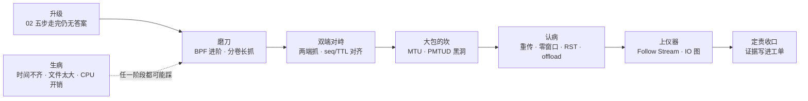
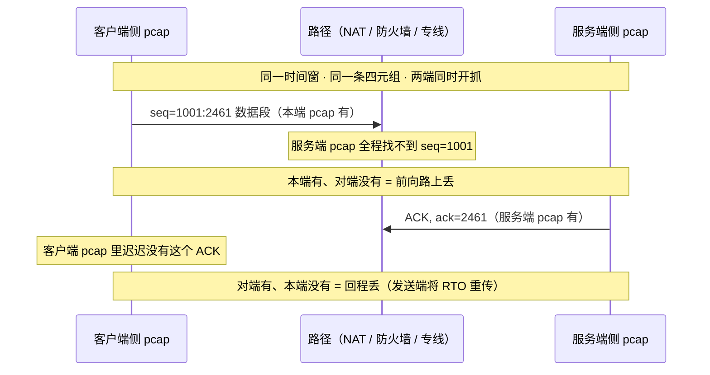
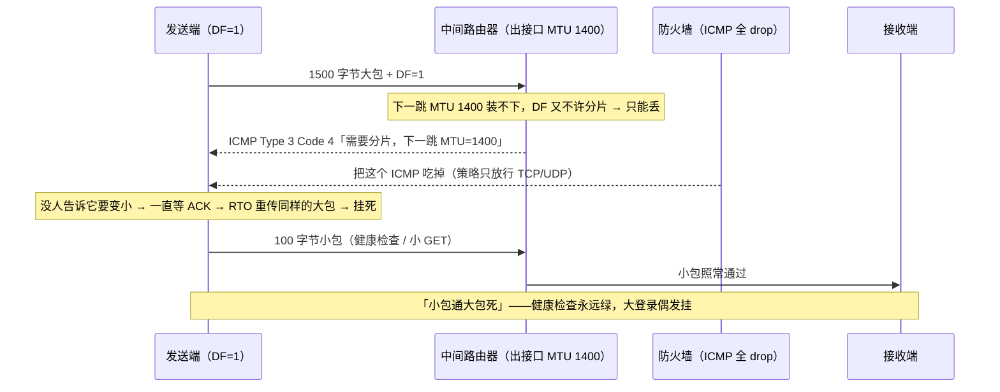
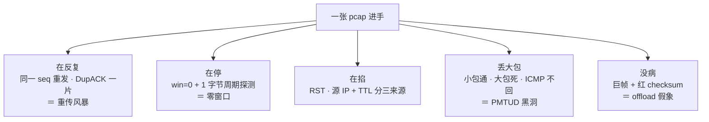
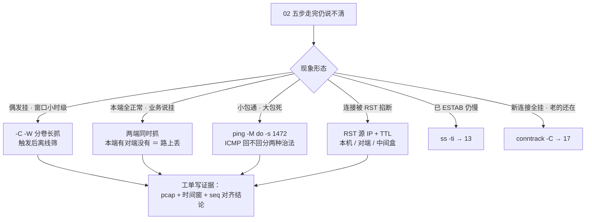

# 网络排障与抓包

> 登录偶发挂：curl 五段做差全正常、`nc` 秒通、mtr 全程 0 丢——[02](../02-网络排查命令/) 的五步走完了，还是说不清。群里开始甩锅，有人已经在生产机 `tcpdump -i any` 打终端，SSH 眼看卡死。
> **本章回答**：一次说不清的网络问题深排障怎么走——过滤器进阶、两端抓对比、MTU/PMTUD、读 pcap 认病，最后把锅钉在证据上。
> **不讲**：第一轮刀法（curl -w / dig / nc / mtr / tcpdump 最小纪律）→ [02](../02-网络排查命令/)；握手/窗口/重传 → [13](../13-TCP与UDP/)；分层封装与收包路径 → [12](../12-网络栈与Socket/)；TLS 看不到明文 → [14](../14-HTTP与TLS/)。

**标记**：🎯重点 · 🔥难点 · ⭐常考 · 🔧实操
---

## 一、一张图：一次深排障的一生

> 🎯 **一句话**：02 的五步走完仍说不清，才升级到本章：磨刀 → 两端对峙 → 大包的坎 → 认病 → 上仪器，靠证据定责收口。



- 📖 **读图**
  - 🛤️ 主线六个阶段；入口是升级——没走完 02 五步的工单不配进这张图（练习题 Q1）
  - ⚔️ 「双端对峙」和「大包的坎」是只有深排障才做得动的两件事：单端定不了路上，小包测不出大包的坎（Q3、Q7、Q12）
  - 🤒 底部虚线是深排障自己会生的病——工具用错，排障者就是事故源

---

## 二、升级：什么样的工单才配深排障

> 🎯 **一句话**：「工具都说好、业务说不好」才升级抓包——升级的是证据强度，不是抓更大的包。

- 🗺️ **三种才升级**（02 五步走完仍无答案）：

```text
偶发型   一小时才挂一次，第一轮刀法等不到窗口      → 分卷长抓（三节）
说不清型 本端 ss / curl / mtr 全正常，业务说挂     → 两端抓对比（四节）
大包死型 健康检查小包通，大 POST / 大 TLS 记录挂   → MTU / PMTUD（五节）
```

- 🚫 **两种看着像、其实不用升级**
  - **大厅能进、房间进不去**——登录 :443 和房间 IP:9000 是两条连接；抓错目标，不是深排障（02 已讲）
  - **已 ESTAB 仍慢**——窗口/重传，`ss -ti` 看 `retrans` / `rcv_space` / `rtt` → [13](../13-TCP与UDP/)；抓 2GB pcap 也只会看到「延迟大」

#### ❓ 为什么升级 ≠ 抓更多包？

- ❌ **蛮力**：`-c 1000` 改成 `-c 100000`——单端包再多，仍定不了「路上丢没丢」
- ✅ **证据强度**：两端对比、长窗口覆盖、离线分析——升级的是这三样
- 👉 包数不是证据；**谁家有、谁家没有**才是

> ⚠️ **别混**：「升级」≠ 把 `-c` 改大。单端 pcap 只能证明「我发了 / 我收了」。

> 📝 **面试**：「什么情况下两端抓包？」——本端一切正常但业务仍挂、要区分路上丢还是端上丢、或偶发要留长窗口；第一轮永远先做差 + nc + route get，不裸抓。

本节对应练习题 Q1。工单够格了——过滤器怎么写才不把机器打挂？

---

## 三、磨刀：BPF 过滤器进阶与长抓分卷 🔧

> 🎯 **一句话**：BPF 在内核里就把不要的包筛掉；偶发靠 `-C -W` 分卷轮转留窗口，不靠蛮力大文件。

### 🧰 原语：host / port / net / 复合表达式

- **BPF（Berkeley Packet Filter）** = tcpdump 在**内核里**生效的捕获过滤器；不匹配的包不拷到用户态
- 02 的最小闭环 `host IP and port P -nn -c 1000 -w file` 是地基，这里补全：

```bash
tcpdump -i eth1 src host 10.0.0.5 and dst port 8080 -nn -c 500 -w /tmp/one_way.pcap
#            ↑ 只看一个方向——比 host+port 再砍一半
tcpdump -i eth1 net 10.0.0.0/24 and port 9000 -nn -c 500 -w /tmp/room.pcap
#            ↑ 一个网段；别开得太大
tcpdump -i eth1 'host 10.0.0.5 and (port 443 or port 8080)' -nn -c 2000 -w /tmp/two.pcap
#                              ↑ 多端口 or 要整体加括号
tcpdump -i eth1 'not port 22' -nn -c 500 -w /tmp/no_ssh.pcap
#            ↑ 永远排除自己的 SSH——把值班通道抓死是经典事故
tcpdump -nn -r /tmp/a.pcap 'tcp[tcpflags] & tcp-syn != 0' | head
#            ↑ 离线还能再过滤——先放宽再收紧
```

> ⚠️ **别混**：**捕获过滤器（BPF）≠ 显示过滤器**。BPF 语法 `and / or / not`；Wireshark 显示过滤用 `&& / || / !`，且 `tcp.analysis.retransmission` 只有显示过滤有。抓紧了丢掉的包永远回不来。

### 🚩 tcp[tcpflags]：按位与还是等于 🔥

> 💡 **打个比方**：标志位字节是一排开关灯。`&` =「任意一盏亮就算」；`=` =「恰好只有这几盏亮」——SYN-ACK 的 SYN 灯也亮，所以 `& tcp-syn` 会把它一起抓进来。

```text
TCP 头第 14 字节（tcp[13] / tcp[tcpflags]）：
  FIN=0x01  SYN=0x02  RST=0x04  PSH=0x08  ACK=0x10  URG=0x20

'tcp[tcpflags] & (tcp-syn|tcp-rst) != 0'   ← SYN 或 RST 任一盏亮（含 SYN-ACK）
'tcp[tcpflags] = tcp-syn'                  ← 恰好只有 SYN（纯 SYN，不含 SYN-ACK）
'tcp[tcpflags] & tcp-rst != 0'             ← 只要 RST 亮
```

#### ❓ 为什么不能写 `== 2` 抓 SYN？

- ❌ `tcp[tcpflags] == 2` / `= 2`：整字节恰好 0x02——看起来对，但很多人以为「只要有 SYN」；和「含 ACK 的 SYN-ACK」混用时口径就乱
- ✅ **抓「有没有这一位」用 `& … != 0`**；**只要纯 SYN 用 `= tcp-syn`**
- 口诀：**抓标志用按位与，别用等于**（练习题 Q11）

> ⚠️ **别混**：`& tcp-syn != 0` 会带上 **SYN-ACK**；只要纯 SYN 必须用 `= tcp-syn`。

### 📼 长抓：分卷轮转与 snaplen 🔧⭐

```text
-c 1000          抓够 1000 个包就停 —— 短窗口确认形态
-C 100 -W 5      每文件 100MB、最多 5 个，写满第 6 个删最旧 → 磁盘封顶 500MB
-s0              抓全包（默认 snaplen 会截断，Follow Stream 会残）
-s 96            只抓前 96 字节 —— 认病看头足够，文件小一个量级
-B 4096          抓包内核缓冲 KB；流量大时 pcap 自己丢就加大它
```

- 🔐 **权限**：要 `CAP_NET_RAW`——给值班账号加 tcpdump 组，别长期 root 裸跑
- 🐳 **容器**：Pod 里默认看不到宿主机 veth 对端——抓「包有没有出节点」在**宿主机网卡 / CNI** 上按 Pod IP+端口抓

> 🔍 **现场**：偶发挂的分卷长抓。

```bash
tcpdump -i eth1 host 10.0.0.5 and port 9000 -nn -s 96 -C 100 -W 5 -w /tmp/room_cap.pcap
# 挂了之后：
tcpdump -nn -r /tmp/room_cap.pcap4 'tcp[tcpflags] & (tcp-rst) != 0' | head
# ← 拿发生时刻对分卷时间范围，先筛 RST 再看前后 10 行
```

> 📝 **面试**：「偶发问题怎么抓？」——`-C 100 -W 5` 滚动 + `-s 96` 控体积，触发后按时间点离线筛；不要开着终端盯，也不要 `-c` 无限抓写满根盘。

本节对应练习题 Q5、Q11。刀磨好了——为什么单端永远定不了「路上」？

---

## 四、双端对峙：两端抓包对比定责 ⭐🔥

> 🎯 **一句话**：本端有、对端没有 = 路上丢；单端 pcap 只能证明「我发了 / 我收了」。

### 📷 单端证据的边界：四种组合

```text
本端有 seq=1001，对端没有            → 前向路上丢（查路径：mtr TCP、运营商）
对端回了 ACK，本端没收到             → 回程丢（对端在重传）
对端有这条连接，seq 和本端对不上      → 根本不是同一条连接（NAT 算错 / 抓错四元组）
两端 seq 对得上，只有中间某包缺失   → 精确到包的丢点——深排障铁证
```



- 📖 **读图**
  - 🎬 两端 pcap 像两台对着同一球门的摄像机——谁家带子里有这颗球（seq），球就到过谁家门口
  - ⚽ 两家都没有 → 丢在场上（路上）；两家都有但 TTL/源 IP 变了 → 中场有人换过球

#### ❓ 为什么单端永远定不了「路上」？

- 🧾 **单端能证明**：我发出去了 / 我收到了
- ❌ **单端不能证明**：包在中间哪一跳没了——对面可能根本没发过 ACK，也可能 ACK 回程丢了
- ✅ **两端同时抓**：本端有对端没有 = 前向丢；对端有本端没有 = 回程丢

### ⏱️ 时间戳对齐：别对表，对动作 🔥

> 💡 **打个比方**：两台摄像机时钟没对齐，「几点几分进球」永远吵不清；但对「第 1001 号球」没有歧义——seq/ack 就是球号。

#### ❓ 为什么别先对两端时钟？

- 🕐 两台机器 NTP 偏几秒到几分钟是常态，墙钟对不齐到包级
- ✅ **对齐同一个动作**：同一条流的同一个 SYN / 同一个 `seq` 当锚点
- 🛠️ Wireshark：View → Time Display Format → **Seconds Since Beginning of Capture**；或 `capinfos` 看起始差
- 顺手修 chrony → [32](../32-NTP与时间同步/)

- 🧭 **TTL 也能当锚**：同一路径 TTL 递减应一致；RST 的 TTL 与两端主机正常发包对不上 → **中间设备伪造**（TTL 机制 → [12](../12-网络栈与Socket/)）

### 🔀 NAT 后：先换算四元组再对

```text
客户端侧抓：  192.168.1.9:52344 → 203.0.113.10:443（VIP）
服务端侧抓：  203.0.113.77:40001 → 10.0.0.5:443（SNAT 后源 + DNAT 后目的）
                ↑ 直接按本端四元组在对面 grep 永远是空
```

- 机制一句：**DNAT 在 PREROUTING 改目的，SNAT 在 POSTROUTING 改源**；映射在 conntrack → [17](../17-iptables与conntrack/)

> 🔍 **现场**：两端对抓四步一步不能省。

```bash
# 服务端侧（按映射后的四元组写过滤）
tcpdump -i eth0 host 203.0.113.77 and port 443 -nn -s0 -w /tmp/srv_$(date +%H%M).pcap
# 客户端侧
tcpdump -i eth1 host 203.0.113.10 and port 443 -nn -s0 -w /tmp/cli_$(date +%H%M).pcap
# ① 复现前 10 秒两端同时开、复现后同时停
# ② 先换算 NAT 后四元组，再在对面找这条流
# ③ 对 seq/ack：对不上 = 不是同一条连接或有人改包
# ④ RST 看源 IP + TTL：与两端都不一致 = 中间盒
```

### 🤝 握手卡死时的两端对照

```text
重复 [S]（间隔 ≈1s/2s/4s 退避）无 [S.]  → timeout：SYN 出没出本机？对端抓不抓得到？
[S] 后毫秒级 [R.]                        → refused：先 ss -lntp 查监听，不用两端抓
```

- 🕳️ **conntrack 表满**：SYN 可能在本机 PREROUTING 就被丢，**网卡上看不到出站 SYN**——先 `conntrack -C` / `dmesg | grep 'table full'`（→ [17](../17-iptables与conntrack/)）。签名：新连接全挂、老连接还在
- 📬 **对端等不到第三个 ACK**：本端发了、对端没收到，或对端**全连接队列满**静默丢——对端 `ss -lnt` 看 Recv-Q 是否顶满 Send-Q（→ [12](../12-网络栈与Socket/)）

> 📝 **面试**：「NAT 后定 RST 谁发的？」——两端同时抓，对**序列号和 TTL**；RST 源是第三方或 TTL 不符 = 中间设备。只本机抓就下结论 = 猜。

本节对应练习题 Q3、Q8、Q12。两端会对了——小包全通、大包必挂是什么病？

---

## 五、大包的坎：MTU 与 PMTUD 黑洞 🔥⭐

> 🎯 **一句话**：小包通大包死，先怀疑路径某段 MTU 小于 1500、且 ICMP「需要分片」被墙——PMTUD 黑洞。

### 🧱 1500 是怎么构成的

```text
以太网 MTU 1500 = 一个 IP 包的最大长度（不含以太网帧头和 FCS）
  [ IP 头 20 ][ TCP 头 20 ][ payload ≤ 1460 ]   ← 1460 = MSS
  [ IP 头 20 ][ ICMP 头 8 ][ 数据 ≤ 1472 ]      ← 探 MTU 用 ping -s 1472
```

| | **MTU** | **MSS** |
|--|--|--|
| 谁定的 | 链路层给 IP 包的限制 | TCP 载荷上限，握手里双方协商取小 |
| 算多宽 | 整个 IP 包（含全部头） | 只算 payload |
| 以太网常见值 | 1500 | ~1460 |

> ⚠️ **别混**：MTU 限**整个 IP 包**，MSS 限**TCP 载荷**——`1500 − 20 − 20 = 1460`；写反直接扣分。

| | **IP 分片（fragmentation）** | **TCP 切段（segmentation）** |
|--|--|--|
| 谁干的 | 路由器，网络层 | 发送端，传输层 |
| 什么时候 | 包超过下一跳 MTU 且 DF=0 | 数据超过 MSS，常态 |
| 丢一个怎么办 | 任一分片丢，**整包废** | 每段独立带 seq，丢哪段补哪段 |
| 现代姿势 | 尽量避免（DF=1 + PMTUD） | 常态 |

### 🕳️ PMTUD 黑洞：DF、ICMP Type 3 Code 4

- **PMTUD（Path MTU Discovery）** = 发送端把 **DF（Don't Fragment）置 1**，赌路径能装下；装不下的路由器丢包并回 **ICMP Type 3 Code 4「Fragmentation Needed」**（附下一跳 MTU）；机制**寄生在 ICMP 上**



- 📖 **读图**
  - 🕳️ 黑洞两个必要条件：**路径某段 MTU 偏小** + **ICMP 回不去**——只修其中一个就能通
  - 📜 发送方在「原样重传大包」里打转 → TLS 大记录（证书链常超 1400）偶发挂、小 API 却稳

> 💡 **打个比方**：隧道/VPN 像再套一层信封——信箱口（链路 MTU）没变，信更厚就卡在口上；小纸条照塞得进。

#### ❓ 为什么叫「黑洞」？和「链路丢包」差在哪？

- ❌ 群里常喊「链路丢包」——小包全通时往往**不是**随机丢
- ✅ 大包被 DF 卡住 + 需要分片的 ICMP 被墙 → 发送方**瞎等**，所以叫黑洞
- 🧪 验证：`ping -M do -s 1472`——ICMP 回来说明 PMTUD 还活着；什么都不回 = 黑洞

### 🚇 隧道叠加：每一层封装都吃几十字节 ⭐

```text
裸以太网                              MTU 1500
GRE 隧道          −24               → 1476
VXLAN（K8s overlay 常用）−50        → 1450
WireGuard         −60               → 1440
IPsec ESP         −50 ~ 70          → 1430~1450
云专线再叠 VPN                       → 更小，1300 以下都有
```

- ☸️ **K8s**：Pod 出节点再封 VXLAN——`ip link` 看到的 1500 是假象，链路常只有 1450 → 小请求通、大 body 挂
- 🔐 **VPN**：办公网传大文件卡死、小 ping 正常——同一坑另一张脸

### 🔧 现场复现与治法

> 🔍 **现场**：小包通大包死，三条命令定形态。

```bash
ping -c 3 203.0.113.10                 # 小包，常骗你——只有 56 字节
ping -M do -s 1472 -c 3 203.0.113.10   # DF=1 + 1472 payload（+28 头 = 1500）
# From 10.0.0.1: icmp_seq=1 Frag needed and DF set (mtu = 1400)
#   ← ICMP 回来了：路径 MTU=1400，PMTUD 还活着
# 3 packets transmitted, 0 received, 100% packet loss
#   ← 什么都回不来：ICMP 也被墙了 —— PMTUD 黑洞
tcpdump -i eth1 icmp -nn -c 20         # 确认「需要分片」回没回
```

- 📐 **二分找边界**：1472 不通试 1400、1200……「通与不通」边界 + 28 ≈ 路径 MTU
- 🩹 **治法**（改动半径从小到大）
  - 放行 ICMP Type 3 Code 4（最正确，墙可能不归你管）
  - **MSS clamp**：`iptables -t mangle -A FORWARD -p tcp --tcp-flags SYN,RST SYN -j TCPMSS --clamp-mss-to-pmtu`
  - 隧道内口调小 MTU
  - 应用主动切小（游戏 UDP 按 ≤1400 切，别指望 IP 分片）

> 📝 **面试**：「健康检查正常、大请求偶发挂？」——PMTUD 黑洞：路径 MTU < 1500 + ICMP 需要分片被墙。`ping -M do -s 1472` 验证；治法放行 ICMP 或 MSS clamp。**别先换证书、别重启服务**。

本节对应练习题 Q7。MTU 会认了——打开 pcap，五种病怎么分？

---

## 六、读包认病：重传、零窗口、RST 与 offload 假象 🔥⭐

> 🎯 **一句话**：pcap 进手先认五种病——在反复、在停、在掐、丢大包、根本没病（offload）。

机制（为什么会重传、为什么零窗）→ [13](../13-TCP与UDP/)；本章只做**认形态 + 定方向**。

### 🔁 在反复：重传风暴

```text
12:00:01.100 IP 10.0.2.88.52344 > 10.0.0.5.443: Flags [.], seq 1001:2461, ack 88, win 501
12:00:01.203 IP 10.0.2.88.52344 > 10.0.0.5.443: Flags [.], seq 1001:2461, ack 88, win 501   ← 同一 seq 原样再发
12:00:01.410 IP 10.0.2.88.52344 > 10.0.0.5.443: Flags [.], seq 1001:2461, ack 88, win 501   ← 间隔变长：RTO 退避
12:00:01.602 IP 10.0.0.5.443 > 10.0.2.88.52344: Flags [.], ack 1001, win 501                ← DupACK
```

- 📖 **读图**：同一 `seq` 反复 + 对端一片 DupACK = 丢包正在发生；配两端抓——重传段对端收没收到过，一把分开前向/回程

### 🛑 在停：零窗口

```text
12:01:00.001 IP 10.0.0.5.443 > 10.0.2.88.52344: Flags [.], ack 5001, win 0     ← 对端通告窗口 0
12:01:00.320 IP 10.0.2.88.52344 > 10.0.0.5.443: Flags [.], seq 5001:5002      ← 1 字节窗口探测
12:01:05.331 IP 10.0.2.88.52344 > 10.0.0.5.443: Flags [.], seq 5001:5002      ← 每 ~5s 探一次
```

- 📖 **读图**：`win=0` + 周期 1 字节探测 = 对端接收缓冲满、应用不 read——**不是网络病**，治对端（→ [12](../12-网络栈与Socket/)）

| | **重传风暴** | **零窗口** |
|--|--|--|
| pcap 形态 | 同一 seq 反复重发 | `win=0` + 1 字节周期探测 |
| 谁在动 | 发送端在反复发 | 发送端干脆停发 |
| 根因方向 | 路上丢 / 回程丢 | **对端应用不 read** |
| 治 | 查路径（四节两端抓） | 治对端（→ [12](../12-网络栈与Socket/) / [13](../13-TCP与UDP/)） |

### ✂️ 在掐：RST 的三个来源 ⭐

```text
12:02:10.507 IP 10.0.2.88.52344 > 10.0.0.5.443:  Flags [R.], seq 5001   ← 源=本端：本机内核
12:02:10.507 IP 10.0.0.5.443 > 10.0.2.88.52344:  Flags [R.], seq 1      ← 源=对端：对端或它本机的墙
12:02:10.507 IP 203.0.113.77:443 > 10.0.2.88.52344: Flags [R.]          ← 第三个 IP：中间盒
```

| 来源 | 怎么认 | 去向 |
|--|--|--|
| **本机内核** | 源 IP 是本端，且此刻端口没监听 / 队列满（`tcp_abort_on_overflow=1`） | → [12](../12-网络栈与Socket/) |
| **对端进程** | 源 IP 是对端，对端崩溃 / `kill -9` / 端口没人听 | → [05](../05-进程与信号/) |
| **中间盒** | 源 IP 第三方，或 TTL 不符，或两端 seq 对不上 | → [17](../17-iptables与conntrack/) |

> ⚠️ **别混**：看到 RST 先看**源 IP**，别先骂应用；NAT 后源 IP 都可能被改，只有四节两端抓 + TTL 能钉死。

### 🎭 假象：offload 陷阱（TSO / GSO / GRO）🔥

- **TSO / GSO** = 内核把「按 MSS 切段」交给网卡；**GRO** = 收包方向反向聚合；**checksum offload** = 校验和也交给网卡——本机抓包点看到的**不是线上真实样子**

```text
发送：应用 write 64KB → 抓包点①看到巨段 + checksum 占位 → 网卡 TSO 才切成 1460 → 线路
接收：线路 N 帧 → 网卡 GRO 聚合 → 抓包点②又看到巨帧 → 内核 TCP
```

> 💡 **打个比方**：本机抓到的是**还没拆箱的整箱货**——网卡后台才拆小件、才贴校验封条。你在贴封条之前蹲点，会以为「箱子没封条 = 货坏了」。

#### ❓ 为什么巨帧 + 红 checksum 多半不是驱动坏了？

- 👀 抓包点在 TSO/checksum offload **之前**——看到的是聚合视图和占位字段
- ✅ **判据**：对端抓正常 = 本机假象
- 🛠️ 要看真实包：去对端抓，或**临时** `ethtool -K eth1 tso off gro off`，抓完**立刻开回去**（关 offload 伤高峰 CPU → [06](../06-CPU与Load/)）
- ❌ 别对着假 checksum 修应用校验，别把「关 TSO」当业务修复

> 🔍 **现场**：

```bash
ethtool -k eth1 | grep -E 'tcp-segmentation-offload|generic-segmentation|generic-receive|tx-checksumming'
# tcp-segmentation-offload: on    ← TSO 开着：出站巨帧 + 红 checksum 多半假象
# tx-checksumming: on             ← checksum 网卡算：抓包点看到的是占位值
```

### 收束：一张 pcap 的病谱 🎯⭐



- 📖 **读图**
  - 五分支按「连接在干什么」：反复发 / 停着 / 被掐 / 只有大包死 / 看起来病其实没病
  - **先排假象再认病**——不然一晚上修不存在的 bug

- 背清单：**在反复查路径、在停查对端、在掐查来源、丢大包查 MTU、没病查自己（offload）**

> ⚠️ **别混**：病谱认的是**形态，不是根因**——重传可能前向也可能回程；形态定方向，根因回四节两端对比钉。

> 📝 **面试**：「拿到 pcap 怎么分析？」——五个动词：在反复 / 在停 / 在掐 / 丢大包 / 没病；先排假象、再认病、最后两端对比定根因。

本节对应练习题 Q6、Q9。病谱有了——Wireshark 三板斧？

---

## 七、上仪器：Wireshark 三板斧

> 🎯 **一句话**：Follow Stream 锁对话，`tcp.analysis.flags` 打尽异常段，IO 图看趋势——全在本地离线，生产机不开 GUI。

（捕获过滤 vs 显示过滤见三节 ⚠️。）

- 1️⃣ **Follow TCP Stream**：右键 → Follow → TCP Stream，按方向染色。502 是网关还是上游、断在请求还是响应，一眼见分晓。TLS 只见加密字节——明文要 keylog → [14](../14-HTTP与TLS/)
- 2️⃣ **tcp.analysis.flags**（与 Expert Information 同源）：

```text
tcp.analysis.retransmission          ← 重传（在反复）
tcp.analysis.duplicate_ack           ← DupACK
tcp.analysis.zero_window             ← 零窗口（在停）
tcp.analysis.lost_segment            ← 缺段（乱序或真丢，结合两端抓）
tcp.flags.reset==1                   ← 所有 RST
tcp.flags.syn==1 && tcp.flags.ack==0 ← 纯 SYN
http.response.code==502              ← 定 502 哪一跳
ip.addr==10.0.0.5 && tcp.port==8080  ← 锁定两端一端口
```

- 3️⃣ **IO 图**（Statistics → I/O Graph）：**锯齿**=重传风暴，**台阶**=限速/窗口卡住，**归零**=断流点，对齐业务日志。Flow Graph 看「哪边不回话」

> 📝 **面试**：「Wireshark 常用什么？」——Follow Stream、`tcp.analysis.flags`、IO 图；生产机不装 GUI，pcap 拷回本地。

本节对应练习题 Q13。工具会用了——排障者自己会踩哪些坑？

---

## 八、生病：深排障自己会踩的坑 🔧

> 🎯 **一句话**：四个坑——时间不齐、文件太大、抓包伤机器、GUI 开生产机；别成为事故源。

- 🕐 **NTP 不齐**：别对表对 seq（四节）；治本 chrony → [32](../32-NTP与时间同步/)
- 💾 **文件太大**：`-s 96` + `-C -W`；已有 8GB 用 `editcap -c 100000 big.pcap part_` 拆；抓满盘本身是事故 → [08](../08-磁盘与IO/)
- 🔥 **抓包有开销**：过滤不紧吃软中断；临时关 offload 抓完立刻开 → [06](../06-CPU与Load/)
- 🖥️ **GUI 与权限**：生产机不装 Wireshark；`-A` 打 SSH 终端 = 自造事故；值班账号进 tcpdump 组，别 root 裸跑

> 🔍 **现场**：开抓前 10 秒自查——网卡对不对（`route get` 的 dev）、过滤够不够紧（先跑 5 秒看计数）、盘够不够（`df -h /tmp`）、`not port 22` 带没带。

生病段到这儿。回到开头：02 走完仍说不清——60 秒怎么定责？

---

## 九、作战：定责

> 🎯 **一句话**：收口是把「现象 → pcap 证据 → 责任方」写进工单；没有证据链的定责都是猜。



- 📖 **读图**：入口先分形态；三个出口里只有「证据工单」是本章终点——移交 13/17 时**把 pcap 和时间窗一起附上**

| 现象 | 先做 | 别做 |
|------|------|------|
| 登录偶发挂（小时级） | `-C -W` 分卷长抓 + 触发后离线筛 | 开着终端盯几小时 |
| 本端 curl / nc / mtr 全正常 | 两端同时抓，对 seq | 只凭本端 pcap 定责 |
| 小包通大包死 | `ping -M do -s 1472`；二分边界 | 先换证书、重启全服 |
| 巨帧 + checksum 满屏红 | `ethtool -k` 认 offload；对端抓验证 | 修应用校验代码 |
| NAT 后连接被掐 | 两端抓 + RST 源 IP / TTL | 只本机抓就骂应用 |
| 重传风暴 | 两端抓：重传段对端收没收到过 | 直接换拥塞算法（→ 13） |
| 零窗口 `win=0` | 治对端 read（→ 12） | 加大本端发送缓冲 |
| 新连接全挂、老连接还在 | `conntrack -C` + dmesg（→ 17） | 先改安全组、重启服务 |
| 偶发 502 | 网关日志 + 上游退出码（OOM/137 → [07](../07-内存与OOM/)）+ pcap 中途断流（→ [14](../14-HTTP与TLS/)） | 只看一端日志结案 |
| 重启 `bind` 报 Address already in use | 旧进程占口（→ [11](../11-Systemd与服务管理/)） | 当网络问题去抓包 |

### 60 秒剧本 🔧

```text
① 0–10s  确认 02 五步真走完：五段做差 / nc / route get / mtr 各是什么？
          「已 ESTAB 仍慢」当场转 ss -ti（→13），别进深排障
② 10–30s  定形态：偶发（分卷）/ 本端正常（两端）/ 大包死（ping -M do）
③ 30–45s  备刀：两端约时间窗 + 换算 NAT 四元组；过滤先放宽再收紧；not port 22
④ 45–60s  复现前 10 秒两端同时开；结束后先认病谱再深挖
```

> 📝 **面试**：「怎么证明是网络不是应用？」——两端同时抓同一时间窗、同一条四元组：本端有对端没有 = 路上丢，pcap 级铁证；只看本端或只看监控 = 推测。

本节对应练习题 Q10、Q14。再看群里那句「tcpdump -i any 打终端」——该怎么拦住他了。

---

## 十、收口

### 命令速查 🔧

```bash
# 过滤器（BPF，抓时筛）
tcpdump -i eth1 'tcp[tcpflags] = tcp-syn' -nn -c 100 -w /tmp/syn.pcap       # 纯 SYN（= 不是 &）
tcpdump -i eth1 'tcp[tcpflags] & (tcp-syn|tcp-rst) != 0' -nn -c 200          # 握手/复位摘要
tcpdump -i eth1 net 10.0.0.0/24 and port 9000 -nn -c 500 -w /tmp/room.pcap   # 网段+端口
tcpdump -i eth1 'not port 22' -nn -c 500                                     # 别抓自己的 SSH
# 长抓与离线
tcpdump -i eth1 host A and port P -nn -s 96 -C 100 -W 5 -w /tmp/cap.pcap     # 分卷滚动，500MB 封顶
tcpdump -nn -r /tmp/cap.pcap 'tcp[tcpflags] & tcp-rst != 0' | head           # 离线再筛
# MTU / PMTUD
ping -M do -s 1472 -c 3 $IP        # 1472+28=1500；不通再 1400/1200 二分
tcpdump -i eth1 icmp -nn -c 20     # 看「需要分片」回没回
# offload
ethtool -k eth1 | grep -E 'segmentation-offload|checksumming'                # 认假 checksum
# NAT / 表满
conntrack -C; dmesg | grep -i 'table full'    # 新挂旧不挂先看这个（→ 17）
```

### 面试锚点

遮住右列自问自答，卡壳的行回去重读对应小节。

| 问 | 30 秒答 |
|----|---------|
| 什么时候才两端抓包？ | 02 五步走完仍说不清：本端全正常、偶发要留窗口、或要定「路上丢还是端上丢」。 |
| 两端抓怎么操作？ | 同一时间窗、同一条四元组；NAT 后先换算映射后四元组；对 seq/ack + TTL。 |
| 本端有对端没有说明什么？ | 前向路上丢；对端回包本端没有 = 回程丢；seq 对不上 = 不是同一条连接或有人改包。 |
| 两端时间戳对不齐怎么办？ | 别对表对动作：用 seq/ack 当锚点，Wireshark 改「相对捕获秒」。 |
| RST 三个来源？ | 本机内核（没监听/队列满）、对端进程（崩/被杀）、中间盒（源 IP 第三方 / TTL 不符）。 |
| NAT 后定 RST？ | 两端同时抓，看源 IP + TTL + seq；只本机抓 = 猜。 |
| MTU vs MSS？ | MTU 限整个 IP 包（以太网 1500）；MSS 限 TCP 载荷（~1460），握手协商取小。 |
| 分片 vs 切段？ | IP 分片是路由器干的、丢一片整包废；TCP 切段是发送端按 MSS 干的、丢哪段补哪段。 |
| 小包通大包死？ | PMTUD 黑洞：路径 MTU < 1500 + ICMP 需要分片被墙；`ping -M do -s 1472` 复现。 |
| 隧道为什么更容易踩 MTU？ | 每层封装吃几十字节：VXLAN −50、GRE −24、WireGuard −60；K8s overlay 常见 1450。 |
| 治 PMTUD 黑洞？ | 放行 ICMP Type 3 Code 4、MSS clamp、隧道内口调 MTU、应用按小 MSS 主动切。 |
| 本机抓包 checksum 全红？ | TSO/GRO/checksum offload 假象；`ethtool -k` 认、对端抓验证；临时关抓完立刻开。 |
| 巨帧是坏包吗？ | 多半是 TSO/GSO 聚合视图，网卡硬件里才切段；对端抓到 1460 段才是线上真实样子。 |
| pcap 怎么认病？ | 五种：在反复（重传）/ 在停（零窗口）/ 在掐（RST）/ 丢大包（PMTUD）/ 没病（假象）。 |
| Wireshark 三板斧？ | Follow Stream、tcp.analysis.flags、IO 图；全在本地离线做。 |
| 偶发问题怎么抓？ | `-C 100 -W 5` 分卷滚动 + `-s 96` 控体积，触发后按时间点离线筛。 |

### 易错一句话对照

- 五步没走完就抓包 → 先做差 + nc + route get，抓包是升级不是第一刀
- 升级 = 抓更多包 → 升级的是证据强度（两端、长窗口、离线）
- `& tcp-syn != 0` 是纯 SYN → 会带上 SYN-ACK；纯 SYN 用 `= tcp-syn`
- pcap 空就是没故障 → 过滤可能写太紧，先放宽再收紧
- 只本端抓就定「网络丢包」 → 单端证明不了路上，必须两端
- 两端时间戳直接对比 → NTP 不齐，用 seq/ack 对齐
- NAT 两端按同一四元组找流 → 外侧是映射后的 IP:端口，先换算
- MTU 1500 所以 MSS 也是 1500 → MSS ≈ 1460（减 IP 头 20 + TCP 头 20）
- 大包死先换证书 → 先 `ping -M do -s 1472`，是 PMTUD 就治 MTU/ICMP
- 默认 ping 通排除 MTU 问题 → 小包 56 字节，测不出大包的坎
- 巨帧 + 红 checksum 修应用校验 → offload 假象，对端抓验证
- 把 `ethtool -K` 关 TSO 当修复 → 只是抓真实包的临时动作，抓完开回去
- 零窗口加大本端缓冲 → 根因在对端不 read
- 抓不到出站 SYN 就说网络好 → conntrack 满在 PREROUTING 就丢了，先 `conntrack -C`
- 生产机开 Wireshark GUI 分析 → pcap 拷回本地，生产机不装 GUI

### 数字墙

> 以太网 MTU **1500** · MSS **~1460** · `ping -M do -s 1472`（+28=1500）· GRE **−24** · VXLAN **−50** · WireGuard **−60** · IPsec **−50~70** · K8s overlay 常 **1450** · SYN 重传退避 **1s/2s/4s** · 分卷长抓 **`-C 100 -W 5`**（500MB 封顶）· 认病最小 snaplen **`-s 96`** · TCP flags 字节 **tcp[13]**：FIN 0x01 / SYN 0x02 / RST 0x04 / PSH 0x08 / ACK 0x10 · ICMP「需要分片」= Type **3** Code **4** · 零窗口探测 **~5s** 一次

---

## 合上书

对着第一节主图口述；卡住就回对应节 / 练习题。开头那个现场——02 走完仍说不清、有人 `tcpdump -i any` 打终端——该不该升级、怎么磨刀，现在该说清了。

- [ ] **默画主图**：升级 → 磨刀 → 双端对峙 → 大包的坎 → 认病 → 上仪器 → 定责；「生病」虚线挂在哪。（→ Q14）
- [ ] **口述升级**：哪三种工单才升级（偶发 / 说不清 / 大包死），哪两种看着像其实不用（抓错目标 / ESTAB 仍慢去 13）。（→ Q1 · Q2）
- [ ] **默写过滤器**：host / src host / net / 复合括号各一例；`tcp[tcpflags]` 的 `&` 与 `=` 差在哪、纯 SYN 怎么写。（→ Q5 · Q11）
- [ ] **口述长抓**：`-c` 与 `-C -W` 的分工、`-s 96` 与 `-s0` 的取舍、偶发问题的完整抓法。（→ Q5）
- [ ] **默画两端对比时序图**：同一时间窗同一条四元组，本端有对端没有 / 回程丢 / seq 对不上各是什么结论；NAT 后先做什么。（→ Q3 · Q8 · Q12）
- [ ] **口述时间戳对齐**：为什么别对表、用什么当锚、TTL 怎么用来抓中间盒。（→ Q12）
- [ ] **默画 PMTUD 黑洞过程图**：大包 + DF → 路由器丢并回 ICMP Type 3 Code 4 → 防火墙吃掉 → 发送方瞎等；两个必要条件、TLS 大记录为什么中招。（→ Q7）
- [ ] **口述大包的坎**：1500 的构成、MTU vs MSS、分片 vs 切段、隧道每层吃多少、四条治法。（→ Q7）
- [ ] **默画病谱结构图**：在反复 / 在停 / 在掐 / 丢大包 / 没病，各一个 pcap 签名；「先排假象」为什么排第一。（→ Q6）
- [ ] **口述 RST 三来源**：怎么用源 IP + TTL + 两端 seq 分本机 / 对端 / 中间盒，各去哪章。（→ Q9）
- [ ] **口述 Wireshark 三板斧**：Follow Stream、tcp.analysis.flags、IO 图各答什么问题；TLS 看不到明文怎么办（一句话 + 去 14）。（→ Q13）
- [ ] **口述生病与作战**：四个坑各怎么防；60 秒剧本四段；「怎么证明是网络不是应用」的标准答案。（→ Q10 · Q14）

下一章：[iptables 与 conntrack](../17-iptables与conntrack/)。第一轮刀法：[02](../02-网络排查命令/) · 传输机制：[13](../13-TCP与UDP/) · 封装与收包：[12](../12-网络栈与Socket/) · NTP：[32](../32-NTP与时间同步/)。
